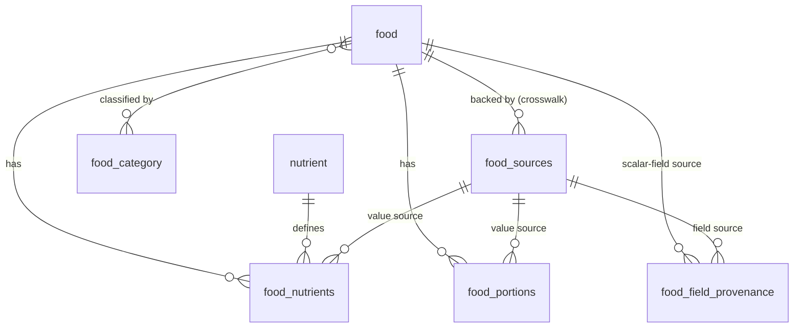
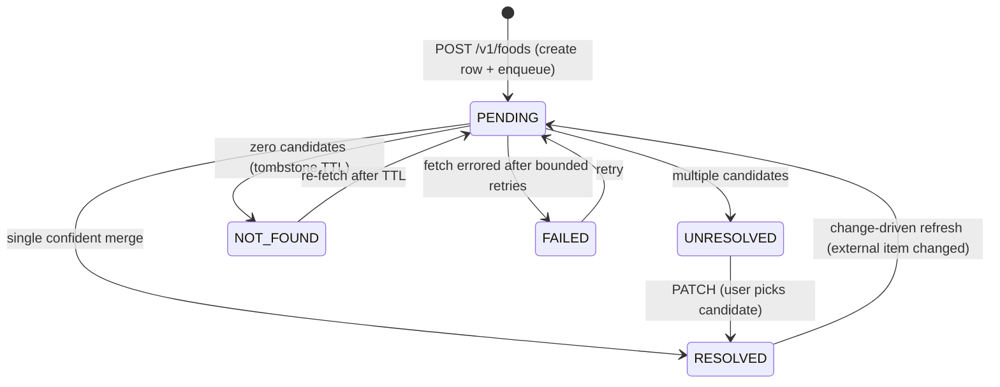

# Source-Agnostic Food Data Model + Fetch Lifecycle

## Summary

Re-architect the food service around a **source-agnostic canonical model**: a food is an internal `id`-keyed row, created on demand, populated by a fan-out fetch across pluggable per-source adapters, and assembled into a **golden record** whose every value records which source — and which external item of that source — it came from. USDA becomes one adapter among many; `fdcId` and all USDA-specific terminology live _only_ inside that adapter. A food moves through a **PENDING → (UNRESOLVED → user picks) → RESOLVED** lifecycle (with terminal `NOT_FOUND` / `FAILED`) exposed by create / read / candidates / resolve endpoints.

## Problem Frame

The Phase 1–2 schema and API are coupled to USDA in ways that block the platform's real direction (more sources later — third-party feeds and eventually our own data). The coupling is structural, not cosmetic:

- `fdcId` is the primary key of `foods` and the path param of every route (`/v1/foods/{fdcId}`). USDA renumbers and retires records between releases, so a vendor id as PK makes our identity brittle and re-couples every consumer to one source.
- Nutrients are a **fixed set of denormalized columns** (`calories`, `proteinG`, …) on the food row — rigid, and unable to represent a different source's nutrient set or record where a value came from.
- USDA names leak everywhere: `usda_sync_metadata`, `usda_call_log`, the `Foundation | SR Legacy | Branded` data-type enum, `USDA_*` env vars.

The single-source shape also can't express the actual product need: when a user adds a food by name, we want to consult _every_ source that has it and combine their data — keeping track of which field came from which source, because a user may pull one field from one source and another field from another.

The good news: `FoodsRepository` already gives a clean data-access seam, and `fetch_queue` / `fetch_requesters` are nearly source-neutral already — so the redesign has somewhere clean to land.

## Key Decisions

- **Stable internal `id`, never a source id.** The food's identity is our own surrogate `id` (ULID-valued, but named `id`, not `ulid`). A source's native key (USDA `fdcId`, a barcode/GTIN) is an _attribute_ held in a crosswalk, never the PK. This is the one decision that is expensive to undo, so it is made now.

- **USDA is an adapter, not the schema.** The canonical model is designed neutral; each source has an adapter that maps its shape into the canonical model. `fdcId` exists only at that boundary, mapped to a generic `external_key` on the way in. The most common failure mode — letting the first source define the schema — is explicitly rejected.

- **Golden record now.** We build the cross-source merge and field-level provenance up front, even though USDA is the only live source today. The id/crosswalk foundation is the costly-to-change part; baking the merge model in now avoids a second migration.

- **Provenance lives at the value's grain — not in one table, not as a payload.** Multi-valued attributes (nutrients, portions) carry a `source` reference _column_ on the value row; scalar food attributes get a _thin_ provenance side-table keyed by a controlled `field` enum. Each reference points at the source and that source's item key — we do **not** retain verbatim source payloads, and there is no recompute pipeline. Values always stay in typed columns. A single mega `(food_id, field_name, value, source)` table is rejected as EAV.

- **Our store is the source of truth; refresh is change-driven.** Once a food is populated, our stored values stand. A background refresh updates a field only when the external source item it was pulled from has changed upstream — it does not blindly re-blend. A user's manual resolution is therefore protected automatically: it is just a stored value, and only its originating external item changing can move it.

- **The user disambiguates; we pre-merge.** We dedupe/merge candidates across sources as far as confidently possible before surfacing them. Anything still ambiguous becomes `UNRESOLVED` and the user picks. The matching algorithm never has to be perfect because a human is the final arbiter.

- **Create the row (and `id`) up front, empty.** A fetch request is not a separate token — creating the canonical row immediately gives an `id` that serves as the queue key, the poll handle, and the eventual canonical identity.

## Data model

- `food` — golden scalar fields (`name`, `description`, `category`, brand attributes, barcode) + lifecycle `status` + the normalized-name dedup key.
- `food_sources` — the crosswalk: one row per (food, source) holding `source`, `external_key` (that source's PK for the item), and fetch state. No verbatim payload.
- `nutrient` — the nutrient dictionary (name + unit live here once; stable external anchor such as an INFOODS tagname where available).
- `food_nutrients` — `(food_id, nutrient_id, amount, basis, source_id)`. Per-value provenance is the `source_id` column.
- `food_portions` — household measures / serving sizes, each with its own `source_id`.
- `food_field_provenance` — `(food_id, field, source_id)` for scalar `food.*` fields only; `field` is a controlled enum.

## Resolution lifecycle

## Requirements

**Identity & naming**

- R1. A food's primary key is an internal `id` (ULID-valued, named `id`); no source-native identifier is ever a primary or foreign key.
- R2. `fdcId` and all USDA-specific terms appear only inside the USDA adapter/client that handles raw USDA responses; the adapter maps `fdcId → external_key` inbound. The canonical schema, DAOs, public API, DTOs, types, and env vars use source-agnostic names.
- R3. Generic replacements for today's USDA-named artifacts: source-neutral sync metadata and call logging, a `source` enum, and a simplified `kind` for foods (`generic | branded`) instead of the USDA data-type enum.

**Sources & provenance**

- R4. `food_sources` records every source backing a food — `source`, its `external_key` (that source's PK for the item), and fetch state — with `UNIQUE(source, external_key)`. No verbatim payload is retained.
- R5. Field-level provenance is stored at the value's grain: a `source_id` column on multi-valued tables (`food_nutrients`, `food_portions`) and a thin `food_field_provenance(food_id, field, source_id)` table for scalar `food.*` fields. No EAV.
- R6. Each stored field records which source and which external item (that source's key) it came from, via R5. Verbatim source payloads are not retained, and there is no golden-record recompute pipeline — our stored record is authoritative (see R23).
- R7. "Which fields came from source X for this food" is answerable by a single query across the value tables and the scalar provenance table.

**Nutrients & portions**

- R8. Nutrients are normalized: a `nutrient` dictionary (name + unit + stable external code) and a `food_nutrients` junction carrying `amount`, `basis` (e.g. per-100g vs per-serving), and `source_id`. Units live on the dictionary, never on the value row. All nutrient values are normalized to a common basis (per-100g) before any cross-source blend (R14).
- R9. Portions/measures are a separate normalized table (`food_portions`) with gram weight and `source_id`, not columns on `food`.

**Fetch & resolution lifecycle**

- R10. `POST /v1/foods` (create by name) creates the canonical row + `id` if no entry exists for that food, enqueues a sync if not already queued, and returns `202` + `id`. "The same food" is keyed on a normalized name (lowercased, trimmed) guarded by a short lock, so concurrent adds of the same name collapse to one row — making the idempotency guarantee real.
- R11. The worker fans out across all sources by name, fetches from each that has the item, and assembles the golden record. Outcome sets `status`: `RESOLVED` (confident single merge), `UNRESOLVED` (multiple candidates need a human), `NOT_FOUND` (no source has it), or `FAILED` (a source fetch errored — timeout / 5xx / rate-limit — after bounded retries with backoff).
- R12. `NOT_FOUND` is a terminal tombstone with a TTL; after the TTL a re-fetch is allowed. `FAILED` is reached only after bounded retries and is itself re-fetchable.
- R13. Demand-weighting, dedup, and "notify who asked" re-key from `fdcId` onto the food `id`; the lifecycle status enum is `PENDING | UNRESOLVED | RESOLVED | NOT_FOUND | FAILED`.
- R23. Our stored record is the source of truth once populated. A background refresh updates a field only when the external source item it was pulled from has changed upstream; unchanged fields — including any the user manually resolved — are left intact.

**Merge**

- R14. Merge is field-level, applied after candidates are normalized. Presence beats absence. For identity/short fields (`name`, `brand`), the higher-priority source wins — not the longest value (USDA is the default highest priority until an explicit ranking is configured). For free-text fields (`description`, `ingredients`), the longer value wins. Nutrient values are normalized to a common basis (per-100g) before blending; when two sources supply different values for the same nutrient, the higher-priority source wins.
- R15. Before surfacing candidates we dedupe/merge across sources as far as is confident; residual ambiguity is left for the user.
- R16. `UNRESOLVED` foods expose their candidates for the user to choose; the chosen candidate(s) drive the merge into the golden record.

**Input safety**

- R24. Each source adapter validates and sanitizes the values it maps — type/range checks, length caps, text sanitization — before they enter the canonical store.
- R25. Outbound fetches to external sources use HTTPS with certificate validation; a response that fails validation is rejected, not stored.

**API surface**

- R17. `GET /v1/foods/{id}` returns `200` only when `RESOLVED`; `202` when `PENDING` or `UNRESOLVED`; `404` when the food is `NOT_FOUND`, `FAILED`, or no such row exists. The lifecycle `status` remains retrievable, so a client holding an `id` can see _why_ it is not `200` rather than treating the `id` as bogus.
- R18. `GET /v1/foods/{id}/candidates` returns the candidate list for an `UNRESOLVED` food.
- R19. `PATCH /v1/foods/{id}` resolves an `UNRESOLVED` food from the user's candidate selection — each chosen candidate validated to belong to that food's own candidate set — driving the merge and moving it to `RESOLVED`.
- R20. Search supports name / substring / partial match over the local store and returns canonical `id`s; lookup by barcode or a source's `external_key` is supported.

**Data access**

- R21. All persistence goes through a DAO/repository layer; no source-specific structure leaks past the adapter boundary into services, DAOs, or the API.
- R22. Each source is an adapter implementing a common interface (search-by-name, fetch-by-key, map-to-canonical), so adding a source is additive and does not touch the canonical schema.

## Acceptance Examples

- AE1. **Covers R10, R17.** A user adds "broccoli," which we don't have. `POST` creates the row, returns `202` + `id`. A `GET` on that `id` returns `202` while `PENDING`, then `200` once `RESOLVED`. A `GET` on a random unknown `id` returns `404`.
- AE2. **Covers R11, R16, R18, R19.** "Broccoli" returns several candidates across sources that we can't confidently collapse → `status` becomes `UNRESOLVED`. `GET …/candidates` lists them; `PATCH` with the user's pick (validated to belong to this food) merges and moves the food to `RESOLVED`.
- AE3. **Covers R5, R8, R14.** A food's protein comes from USDA and its fat from Source B (each had the value the other lacked); both are normalized to per-100g before blending. The two `food_nutrients` rows carry different `source_id`s; the food's `name` resolved to USDA by source priority, recorded in `food_field_provenance`.
- AE4. **Covers R11, R12, R17.** A fetch finds the item in no source → `status` becomes `NOT_FOUND` and `GET` returns `404` (with the status still retrievable for the held `id`); after the tombstone TTL a fresh add re-enqueues it. A fetch that errors out after retries lands in `FAILED`, also `404`.
- AE5. **Covers R23.** A `RESOLVED` food is refreshed; the external item behind its `protein` value is unchanged upstream, so `protein` is left intact, while a field whose source item _did_ change upstream is re-pulled.

## Scope Boundaries

- Public / external API access — internal callers (meal-planning, recipes) only for now; designed so it _can_ open later, not built for it now.
- Bulk-mirroring a whole source — still strictly on-demand fetch, now fanned out across sources.
- A second concrete live source — the multi-source machinery is built; USDA remains the only wired adapter until another is added.
- Full nutrition vocabularies (LanguaL, FoodEx2) — borrow the idea of stable nutrient codes (INFOODS tagnames) only; do not adopt the full classification systems.

## Dependencies / Assumptions

- No data to migrate: this is a clean replacement of the Phase 1–2 `foods` schema and `/v1/foods` API, not an additive migration.
- The internal `id` reuses the platform's ULID convention (as in the identity service), exposed under the generic name `id`.
- The existing Postgres-as-queue + Fargate consumer worker (Phase 3, not yet built) is reworked to the fan-out/merge model and the `id`-keyed queue, rather than the `fdcId`-keyed single-fetch model.
- Provenance keeps per-field (source + external item key) references, not verbatim payloads, so detecting "did the external item change" relies on the adapter re-fetching that item, not on stored raw data.

## Outstanding Questions

**Resolve before planning**

- The confidence threshold that separates an automatic `RESOLVED` merge from an `UNRESOLVED` hand-off — what makes a single-source or multi-source result "confident enough" to skip user disambiguation.

**Deferred to planning**

- The exact pre-surface dedup algorithm (name normalization + attribute similarity) — best-effort, with the user as the safety net.
- What happens to an `UNRESOLVED` food nobody ever resolves — a TTL/expiry, or it stays until a human acts.
- Whether the external candidate search is synchronous or itself async (`202` + poll) given source latency and rate limits.
- Generalizing the rolling rate-limit / call-log from USDA-only to per-source.
- How "the external item changed upstream" is detected on refresh (e.g. a per-item fetched-at / version / hash compared on re-fetch).

## Sources / Research

- Current implementation mapped for the redesign surface: `packages/services/food-service/src/db/schema/usda.ts` (the `fdcId`-keyed `foods` table + denormalized nutrient columns), `packages/services/food-service/src/foods/` (controller/service/`FoodsRepository`), and `specs/003-usda-food-data/plan.md` / `spec.md`.
- Canonical-data-model + adapter pattern, identifier crosswalks, and golden-record / survivorship (MDM): [canonical data model](https://softwarepatternslexicon.com/enterprise-integration-patterns/message-transformation/canonical-data-model/), [schema crosswalk](https://en.wikipedia.org/wiki/Schema_crosswalk), [MDM match & merge](https://medium.com/analytics-and-data/master-data-management-how-to-match-and-merge-records-to-unify-your-data-a6b280078273).
- Open Food Facts' two-layer model (per-source inputs → aggregated record with per-field source tags) as the direct domain analogue: [Open Food Facts data](https://blog.openfoodfacts.org/en/news/data-in-open-food-facts).
- What to _not_ copy from USDA FDC (five food types, dual nutrient ids, per-type satellite tables, opaque derivation codes): [FDC FAQ](https://fdc.nal.usda.gov/faq/), [FDC schema analysis](https://towardsdatascience.com/tinkering-with-the-usda-food-database-5db92f7f044f/).
- Nutrient dictionary anchoring via INFOODS tagnames: [FAO INFOODS](https://www.fao.org/infoods/infoods/standards-guidelines/food-component-identifiers-tagnames/en/).
- EAV anti-pattern / normalize-first guidance: [database modeling anti-patterns](https://tapoueh.org/blog/2018/03/database-modelization-anti-patterns/).
  </content>
