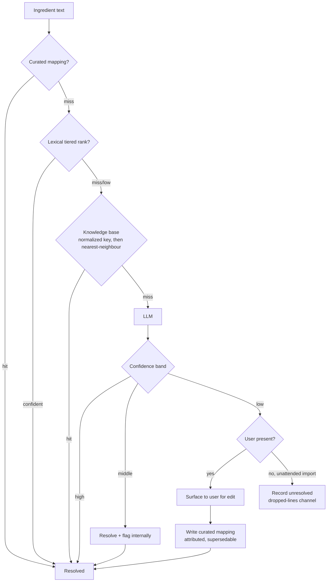

> ⚠️ **Superseded as a description of current state** by [`docs/architecture/2026-08-28-ingredient-pipeline-state.md`](../architecture/2026-08-28-ingredient-pipeline-state.md) (2026-08-28, PR 91).
>
> The decisions and reasoning below remain valid and this document is deliberately NOT deleted. Where it
> and the state addendum disagree about **what exists today**, the addendum wins.

# Ingredient resolution quality

## Summary

Make a normal cook's recipe text land on the right food, and prove it with a measured judgement set
rather than examples. Ranking becomes a layered tier applied to both search surfaces, unresolved text
flows through a four-tier cascade that ends at an LLM and learns from the user's correction, the parser
stops corrupting quantities and starts preserving ranges, and the database is rebuilt on PostgreSQL 18.

## Problem frame

The 448-recipe public-domain cookbook import was run as a product measurement: plain ingredient text
submitted exactly as a user would type it, with no food IDs resolved in advance. It exposed four
independent defects that compound.

Ranking loses to substring noise. `flour` returns `Carob flour`; `milk` returns `Crackers, milk`;
`sugar` returns a sugar-coated candy. Those three attractors alone claimed 334 imported lines. The
cause is `similarity()` — a full-string trigram ratio — dominating `ts_rank` in a `GREATEST`, so a long
name that merely contains the token beats the name that _is_ the token.

The local ingredient table is the real decision point, not a tiebreak. 92.8% of imported lines were
decided in the local section before the food catalog was ever consulted. That table is polluted by its
own write path: the freeform-create fallback mints whatever a caller types, so prose fragments like
`onion cut fine` and `cold water a teaspoon of flour` are now permanent rows that outrank real foods and
outlive the recipes that created them.

⚠️ The 92.8% figure bounds the OLD behaviour and does not predict the new one. The importer takes the
first suggestion, the local section always renders first, and the run minted a local row for every line
it processed — so each line raised the local-hit probability for the next. On the clean start the local
table begins empty and the minting stops, so the post-fix share is unknown. It is re-measured before any
structural precedence change is made.

⛔ Two different things share the `addByName` name and only one is a defect. Minting the caller's prose
as a catalog row is the defect. Asking the food service to acquire a REAL food from USDA on demand — the
`by-name` path, 202 `PENDING` → `RESOLVED` — is the sanctioned way a food absent from the seed enters the
catalog, and an in-flight plan depends on that lifecycle. Removing both would freeze the catalog at its
seed and send a cook typing `gochujang` to an LLM guess instead of the real food.

The parser corrupts values silently. `teaspoonful` is absent from the unit table and appears 26 times in
28 occurrences of `*ful` forms; a clause splitter breaks on `and` even when the quantity normalizer has
already consumed it; `½` precedence contradicts its own docstring; and a `?? 0` fallback fabricates a
quantity the source never stated.

Nothing catches any of this. The existing DAL test is mock-only and asserts call counts — it passes with
the `WHERE` clause arbitrarily broken. The defects reached production data behind a green suite.

## Key decisions

**Ranking is layered on top of each table's existing metric, never swapped for it.** The first proposed
fix replaced `similarity` with `word_similarity` in the sort key. Measured against real USDA names it
produced 4 regressions and 0 fixes on multi-word queries, dropping precision from 26 to 22, because
`word_similarity` does not penalise extra words: `chopped celery` went to `Ham, chopped, canned` and
`brown sugar` to `Toaster pastries, brown-sugar-cinnamon`. 62 of 63 multi-word queries never reached the
head tier at all. Additive tiers above the existing metric keep the extra-word penalty that multi-word
queries depend on while giving exact-head and head-lexeme matches a decisive lead.

**One tier structure, two base metrics.** The food catalog keeps `similarity` as its base; the local
ingredient table keeps `word_similarity`, which is what the `flor` → `All-purpose flour` typo case needs
at exactly 0.600. The invariant is shared; the formula is not. Measured, the same structure fixes
`flour` → `Flour`, `sugar` → `Sugar`, `salt` → `Salt, table`, `milk` → `Milk, canned, condensed,
sweetened` on the local table, and `water`, `cream`, `brown sugar`, `chopped celery`, `canned tomatoes`
on the catalog — without regressing the typo case.

**Part of the word-order-inversion class is lexically solvable.** `red wine vinegar` → `Vinegar, red
wine` resolves under the tiered form. The class was previously assigned wholesale to semantic search;
it is now partly in scope for ranking, which lowers what the cascade must carry.

**Precedence is the dominant path, not a tiebreak.** With 92.8% of decisions made locally, "section,
don't blend" cannot be left structurally unchanged. Fixing the ranker is necessary but not sufficient
while the write path keeps minting prose into the table being ranked.

**The knowledge base sits in front of the LLM, and matching is fuzzy.** A learned mapping is looked up
by normalized key first and nearest-neighbour second, never by equality. Repeat phrasings resolve for
free; the model is paid only for genuinely novel text.

**Embeddings move from the food catalog to the knowledge base.** Brute-force cosine over the 7,954-row
catalog measures 3.26 ms p50 against 16 ms for a pgvector SEQUENTIAL SCAN — the unindexed configuration.
The comparison shows brute force wins at this size against an unindexed scan; it does not show vector
search could never win here, and the measurement's conditions are recorded so it can be reproduced. The
knowledge base is the better home regardless, because its central question — "is this phrase a near-twin
of one already resolved?" — is what vector search is for. Its growth is unbounded, so the crossover back
to an index needs a firing condition rather than an intention.

**A user's correction writes a curated-tier mapping — attributed, and never terminal.** Human-confirmed
outranks every other tier, which is what makes the knowledge base compound instead of cache. But a tier-1
mapping with no author and no override path is the ownerless global write this document exists to fix,
moved from food rows to mappings and PROMOTED — and strictly worse, because it short-circuits the loop
that would have corrected it. So a curated mapping records who wrote it, when, and from which surfacing,
and a later correction supersedes it. "Never asked twice" describes the common case, not an invariant.

**The cascade closes the ownerless-mint hole.** An unresolved line ends at a mapping, not at a new global
food row. The write-path fix and the cascade are one change viewed from two sides.

**The FOOD AND RECIPE databases start empty — the INSTANCE does not.** Food and recipe data are cleared
once the plan lands, before the import test runs. This is not a remediation step to be sequenced against
the other units — it is the starting state they are all validated from, and it dissolves the one-way door:
the minted prose fragments are simply gone, so there is nothing to tombstone or demote.

⛔ It does NOT make the PostgreSQL 18 upgrade data-free. `PostgresEngineVersion` is an INSTANCE-level
property, and one RDS instance per stage carries `kitchensink_identity`, `kitchensink_food`,
`kitchensink_recipes` and every per-PR logical database. Clearing two of them leaves identity untouched —
and identity holds the Clerk `sub` → app ULID mapping every sign-in depends on. The upgrade therefore
carries live production user data across a major version and needs a snapshot, a downtime window, and its
own post-upgrade verification.

**Historical volume units convert from the source book's own table.** `wineglassful`, `gill`, and the rest
of the `*ful` family carry documented equivalences rather than a null conversion. The source stated the
quantity, so converting it is conversion, not fabrication. The equivalence comes from the book the recipe
came from: period cookbooks publish their own tables of weights and measures, and #12350 was verified to
carry one giving `2 gills = 1 cup`, `4 tablespoons = 1 wine-glass`, and `4 saltspoons = 1 teaspoon`, with
the system pinned by its own prose — "the cup should be the regulation half-pint cup". A named external
standard covers only what a book leaves undefined; #12350 uses dessertspoons without defining one.

**Per-source resolution is what makes the US-versus-imperial split safe.** Four of the five registered
books are American; Montefiore's _The Jewish Manual_ (London, 1846) is British, and is the book most likely
to lean on gills and wineglassfuls. An imperial gill is 142 mL against the US customary 118 mL — 20%
larger. A single global convention would silently misconvert one book's entire corpus, and which book gets
it wrong depends on which convention is chosen. Reading each book's own table removes the guess where a
table exists — but only #12350's has been read, and Montefiore's is precisely the unverified one where the
split bites. A book with a known origin and no table follows its origin's measure system, never the
unknown-origin default.

**A stated range is preserved, not truncated.** `2 to 3 cups` holds both bounds. Ranges are ubiquitous in
real recipe text, so taking the lower bound silently asserts a precision the source never stated. Scaling
scales both ends. This is a persisted quantity-model change and expensive to reverse, which is why it is
built now rather than deferred.

**PostgreSQL 18 needs a gate written for it.** `cdkNagTemplateParity` compares the same source against
itself, so it does not fire on an engine-version change and the upgrade would otherwise land invisibly
green against ADR-0002's prod no-diff rule. The gate is part of the upgrade, not a precondition owned
elsewhere.

**Local Postgres must match RDS collation before any judgement set is authored.** The local compose
image is `postgres:16-alpine`, built on musl, which sorts as `C`. 99.7% of `name ASC` tiebreak positions
differ from CI and RDS. A judgement set authored on the current image encodes the wrong ordering.

## Key flows

F1. **Resolution cascade.** Ingredient text is resolved by the first tier that answers with sufficient
confidence.

**Trigger:** an ingredient line is submitted, by import or by a user. The two callers diverge only at the
low band: a live user is asked, an unattended import records the line unresolved.
**Covers R11–R24.**

F2. **Learning loop.** A user edits a low-confidence resolution. The edit writes a curated-tier mapping
keyed on the normalized phrase and attributed to its author. Subsequent occurrences of that phrase resolve
at tier 1 without consulting lexical search, the knowledge base, or the model — until a later correction
supersedes the mapping.

**Trigger:** a user corrects a surfaced low-confidence result.
**Covers R15, R19, R20.**

## Requirements

**Ranking**

R1. Both search surfaces rank by an additive tier structure layered above a base similarity metric,
where an exact head-segment match and a head-lexeme match each outrank any score the base metric can
produce alone.

R2. The food catalog uses `similarity` as its base metric; the local ingredient table uses
`word_similarity`.

R3. The tier gap is provable from the weights rather than tuned — the lowest tier-2 score exceeds the
highest achievable tier-3 score — and that proof is asserted by an executable test, so a later weight
edit cannot silently break it.

R4. The scoring rule for each surface has one authoritative representation, not a weight constant and a
sort expression maintained separately.

R5. Ranking work changes only the sort key. The one permitted `WHERE` change is the multi-token
conjunction R8 specifies, and it is specified there and nowhere else.

**Matching and precedence**

R6. Match strategy is selected by a pure, database-free function returning a discriminated union over
query shape, with an exhaustive switch.

R7. Single-token queries retain today's matching behaviour exactly.

R8. Multi-token queries add a head-term conjunction to matching, where the head term is named
explicitly rather than left to the implementer.

R9. The local section does not outrank the catalog on the strength of a row the system itself minted
from unresolved prose.

R10. The share of lines decided in the local section is re-measured on the clean-start re-import before
any structural change to precedence is made.

**Resolution cascade and learning**

R11. Resolution proceeds through four tiers in order: curated mappings, lexical ranking, knowledge base,
LLM.

R12. Each tier falls through only on a miss or on confidence below its threshold.

R13. Only the lexical tier runs synchronously on the search-ahead — the typeahead surface that suggests
foods while a cook types an ingredient line.

R14. Knowledge-base lookup matches on a normalized key first and a nearest-neighbour search second.
Equality-only matching does not satisfy this requirement.

R15. Confidence has three bands. High resolves silently. Middle resolves and emits internal telemetry
with no user-visible signal. Low is surfaced to the user for edit.

R16. Every tier emits confidence on one shared scale with a stated derivation. An ordinal ranking score
is not a confidence value until the document says how it becomes one.

R17. Band thresholds are set from measured accuracy per band on the judgement set, not chosen, and are
recalibrated whenever the model identifier of R21 changes.

R18. An LLM result is a suggestion carrying a confidence value. It is never treated as authoritative
without a band decision.

R19. A user's edit writes a curated-tier mapping, which outranks every other tier on subsequent lookups.

R20. A curated mapping records who wrote it, when, and from which surfacing, and a later correction
supersedes it.

R21. Every LLM-derived mapping and every stored embedding records the model identifier that produced it.

R22. A low-confidence result reaching a caller with no user present — the unattended import — is recorded
as unresolved in the existing dropped-lines channel, never resolved by a lower-confidence guess and never
blocking the run.

R23. The cascade terminates deterministically as unresolved when the LLM tier is unavailable, times out,
is rate-limited, or a stated cost ceiling is reached.

R24. The requirements state what ingredient data may be sent to the LLM provider, require a
no-retention and no-training posture from that provider, and store the provider credential through the
same AWS Secrets Manager path this codebase uses for other external credentials.

**Write path**

R25. An unresolved ingredient line results in a mapping, never in a catalog row minted from the caller's
own text.

R26. A line naming a real food absent from the catalog still triggers acquisition through the USDA/source
writer, retaining today's `by-name` `PENDING` → `RESOLVED` lifecycle. R25 forbids minting caller prose, not
acquiring real foods on demand.

R27. R25's constraint covers the recipe-service local ingredient table as well as the shared food
catalog, and the requirements define what an unresolved line persists given that a recipe ingredient
requires a non-null ingredient reference.

R28. Rows in the shared food catalog have a defined provenance. Prose fragments minted from caller text
are not a valid provenance.

**Parsing**

R29. The clause splitter does not split on `and` when the quantity normalizer has already consumed it.

R30. `½` precedence matches its documented contract, asserted in both directions.

R31. The unit table covers the `*ful` family — including `teaspoonful` — and the same table serves both
line parsing and gram conversion.

R32. Historical volume units, including `wineglassful` and `gill`, resolve their equivalence from the
source book's own published table of weights and measures, falling back to a named external standard only
for units that book leaves undefined.

R33. Each registered book's own table is read and recorded before that book is imported. A book with a
known origin and no table of its own follows its origin's measure system — imperial for a British source —
never the unknown-origin default.

R34. Each equivalence records its citation and the measure system it follows. An equivalence that leaves
either implicit does not satisfy this requirement.

R35. A gram value derived from a historical unit carries provenance identifying it as a historical-unit
conversion, distinguishable from a directly-stated metric quantity.

R36. A stated range preserves both bounds. `2 to 3 cups` does not reduce to `2 cups`.

R37. Scaling a recipe by serving count scales both bounds of a range.

R38. A nutrition value computed from a collapsed range carries provenance identifying it as range-derived
and naming the bound used, mirroring R35.

R39. A parsed line whose review reasons indicate value corruption is refused into the existing dropped-lines
channel rather than accepted.

R40. No code path fabricates a quantity the source did not state.

R41. The persisted quantity model admits an absent quantity and a two-bound range, landed in the same
expand-first migration. Today's column is `NOT NULL` and the wire field is required, so neither R36 nor
R40 is representable without this.

**User interface**

R42. The ingredient quantity edit fields and the recipe detail display accept and render a two-bound range
alongside a single value.

R43. The surfaced-edit affordance of R15, the correction write of R19, and the search-ahead of R13 ship to
web and mobile in the same release, per the repository's cross-platform rule.

**Starting state**

R44. Food and recipe data are empty when the corrected pipeline first runs. No row from the 448-recipe
import survives, in either the recipe tables or the shared food catalog.

R45. The requirements name which stages the clear applies to. The food catalog is a shared, live service
and the blast radius differs per stage.

R46. Clearing the food catalog also clears every persisted `food_id` reference outside it, because
reseeding assigns fresh ULIDs rather than restoring the previous identifiers.

R47. The food catalog is populated only through its single writer, the USDA/source pipeline, per ADR-0023.
The import test runs against that catalog and mints no rows into it.

**PostgreSQL 18**

R48. The RDS engine version moves from 16 to 18, with major-version upgrade permitted for the transition.

R49. A template-diff gate that actually fires on an engine-version change exists before the upgrade lands.

R50. Every `generatedAlwaysAs` column declares `STORED` explicitly. PostgreSQL 18 defaults an omitted
keyword to `VIRTUAL`. The one existing generated column already declares it; this binds the columns this
work adds.

R51. Every extension in use is confirmed available on RDS PostgreSQL 18 before the upgrade. The set is
`citext`, `pg_trgm`, and `pgcrypto`.

R52. The upgrade is preceded by a verified snapshot of the shared instance and scheduled against a stated
downtime window, because the instance carries the identity database and every per-PR logical database.

R53. After the upgrade, the identity database and every per-PR logical database are verified to have
survived the major-version transition with their data intact.

R54. The upgrade reaches sandbox first with the full suite green, then production.

R55. Planner statistics are verified after the catalog is seeded and against the identity database after
the upgrade.

R56. The relevance judgement set is re-run post-upgrade. A major-version planner change can move rankings
independently of any formula change.

**Test substrate**

R57. A Golden Relevance Judgement Set of at least 60 `{query, expectedTopFoodName, why}` entries over real
USDA names is asserted as precision@1 against a committed baseline with zero regressions.

R58. Multi-word entries in the judgement set are sampled from the import corpus's actual ingredient text
rather than authored from the cases used to design the tier weights.

R59. Known-miss entries are asserted to still miss, so ranking cannot be "fixed" by over-fitting. The
word-order inversions the tier structure does not solve are included among them.

R60. The judgement set carries two further axes: resolution rate, and resolution accuracy measured by
human adjudication of a random sample of lines resolved by the knowledge-base and LLM tiers.

R61. High-band resolutions emit the same internal telemetry the middle band emits — tier, score, chosen
food — so a silent resolution remains auditable.

R62. Local Postgres tracks the RDS major version and collation provider as a continuous invariant, moving
to the 18 series as part of R48.

R63. Ranking and matching changes carry unit and integration tiers against real Postgres. A mocked test
cannot prove trigram threshold semantics.

## Acceptance examples

AE1. **Covers R1, R2.** Query `flour` against the local ingredient table returns `Flour` at position 1,
not `Carob flour`.

AE2. **Covers R1, R2.** Query `brown sugar` against the food catalog returns `Sugars, brown` at position 1.
The prior candidate formula returned `Toaster pastries, brown-sugar-cinnamon`.

AE3. **Covers R2.** Query `flor` against the local ingredient table still resolves to an all-purpose flour
row. This case fails if the local table's base metric is changed to `similarity`.

AE4. **Covers R1.** Query `red wine vinegar` returns `Vinegar, red wine` at position 1.

AE5. **Covers R15, R61.** An LLM resolution in the middle confidence band resolves the line and emits
telemetry. The user sees no prompt and no confidence indicator. A high-band resolution emits the same
telemetry.

AE6. **Covers R15, R19.** An LLM resolution in the low band is surfaced. The user selects a different food.
The next occurrence of the same normalized phrase, submitted by a different user, resolves at the curated
tier without an LLM call.

AE7. **Covers R20.** A curated mapping records its author and timestamp, and a later correction to the same
phrase supersedes it rather than being refused.

AE8. **Covers R14.** A phrase not present verbatim in the knowledge base, but a near-twin of a stored
phrase, resolves from the knowledge base without an LLM call.

AE9. **Covers R22.** The unattended import meets a low-confidence result. The line is recorded as
unresolved in the dropped-lines channel, the run does not block, and no lower-confidence guess is written.

AE10. **Covers R23.** With the LLM provider unreachable, the cascade returns unresolved rather than
falling back to a lower tier's rejected candidate.

AE11. **Covers R25, R27.** An ingredient line that no tier resolves confidently produces no new row in the
shared food catalog and no new prose row in the local ingredient table.

AE12. **Covers R26.** A line naming a food absent from the catalog but present in USDA triggers acquisition
and resolves to the real food, not to the nearest existing catalog entry.

AE13. **Covers R31.** A line reading `a teaspoonful of salt` parses to a quantity in the `*ful` family and
converts to grams.

AE14. **Covers R32, R35.** A line reading `a wineglassful of sherry` converts to grams, and the resulting
quantity is marked as a historical-unit conversion rather than a directly-stated one.

AE15. **Covers R32, R33, R34.** A gill in a recipe from an American book converts at 118 mL; a gill in a
recipe from _The Jewish Manual_ converts at 142 mL. Both record their citation and measure system.

AE16. **Covers R32.** A dessertspoon, which #12350 uses but does not define, converts through the named
external standard and records that standard rather than the book as its citation.

AE17. **Covers R36, R41.** A line reading `2 to 3 cups flour` yields a quantity holding both 2 and 3.

AE18. **Covers R37.** Scaling that same recipe from 4 servings to 6 yields a range of 3 to 4.5 cups.

AE19. **Covers R38.** Nutrition computed from that ranged quantity is marked range-derived and names the
bound it used.

AE20. **Covers R40, R41.** A line stating no quantity resolves with the quantity absent, not zero, and
persists without violating a not-null constraint.

AE21. **Covers R42.** A ranged quantity is editable and displayed as a range on both web and mobile.

AE22. **Covers R44, R47.** After the import test completes, a search for `onion` returns no row whose name
is a prose fragment, and the food catalog holds only rows the USDA pipeline wrote.

AE23. **Covers R46.** After the catalog is cleared and reseeded, no persisted `food_id` outside the food
database refers to an identifier the reseed did not recreate.

AE24. **Covers R50.** After the upgrade, a `search_vector` column is materialised, not computed per row.

AE25. **Covers R52, R53.** The upgrade is preceded by a snapshot, and the identity database's user rows are
verified present afterwards.

AE26. **Covers R13.** A search-ahead request returns without waiting on a knowledge-base or LLM call.

## Success criteria

- Precision@1 on single-token staple queries reaches 0.9 or better against the judgement set.
- Multi-word precision@1 meets an absolute floor against the judgement set, not merely non-regression
  against the 26-of-63 baseline the current formula produced.
- The three attractors that claimed 334 lines in the import — `Carob flour`, `Crackers, milk`, and the
  sugar-coated candy — no longer win their queries.
- Re-import resolution rate is measured and recorded as a product number, paired with an adjudicated
  resolution-accuracy figure so the rate cannot be raised by resolving confidently wrong.
- The share of submitted lines surfaced to a user for correction is measured, since that friction is the
  abandonment risk this work exists to remove.
- The seeded food catalog contains no row whose name is a prose fragment.
- SC-007's 200 ms budget is re-measured at the 50,000-food scale the original baseline used, not at 7,954.
- The production template diff for the PostgreSQL 18 upgrade is read and justified, not suppressed.

## Scope boundaries

**Deferred**

- ANN indexes over the knowledge base. Brute force is adequate until the mapping table's size warrants it,
  and the threshold is a measurement with a stated firing condition, not a guess.
- Semantic search as a primary resolution path. It is the fallback tier.

**Out of scope**

- Replacing the ingredient parser with a new one, ours or a library's. The existing parser is fixed in
  place by R29–R41; what the cascade replaces is the question of whether to rewrite it.
- Writing recipes back into the food catalog as ingredients. Decided no; see ADR-0023 and feature 001 T150.

## Dependencies and assumptions

- Expand-first migrations, per ADR-0022. A contracting migration ships a release later than the code that
  stopped reading the column.
- One RDS instance per stage carries the identity, food, recipe and per-PR logical databases, so an
  engine-version change is instance-wide and its window takes every open preview down with it.
- PostgreSQL 16 is supported until February 2029, so the upgrade is not deadline-driven.
- pgvector is available at 0.8.1 on both RDS 16.13 and 18.3. The extensions actually in use are `citext`,
  `pg_trgm`, and `pgcrypto`, all core contrib modules.
- No LLM provider integration exists in this repository today. The cascade's fourth tier introduces the
  provider client, its credential storage, and a per-run cost bound as new work.
- The knowledge base is empty on the first re-import, so its hit rate starts at zero and the model is paid
  for nearly every novel line on that run.
- Nutrition computed from a range uses the lower bound, marked as such per R38.
- Only #12350's weights-and-measures table has been read from the bytes. The other four registered books
  are not currently on disk; the operator downloaded the corpus out of band once and must do so again to
  satisfy R33. Project Gutenberg's terms bar us from fetching them automatically.
- Food densities stay USDA. The period tables also carry ingredient-specific mass equivalences
  (`4 cups of flour = 1 pound`), which are not used — only the unit equivalences are.
- The `flor` case sits at exactly 0.600 against a `word_similarity_threshold` GUC shared instance-wide. A
  case pinned to a threshold is one collation or version change from flipping.

## Outstanding questions

**Resolved by owner ruling, 2026-08-20**

1. A curated mapping is **grant-gated global**: a held grant writes globally on first correction; every
   other correction stays author-scoped until a second independent user corroborates it.
2. The **whole cascade is committed scope**. Measurement sizes the work rather than deciding it.
3. The absolute multi-word precision@1 floor is **0.85**.

**Deferred to planning**

4. Which named external standard fills the gaps the books leave. It needs to cover at least `dessertspoon`.
5. Whether the 50,000-food performance corpus is still generable, and which corpus size the judgement set
   and its baseline target.
6. Which token is the head term for multi-token matching.
7. Whether the LLM tier is available on the free tier or premium-gated, and what per-run cost ceiling R23
   enforces.
8. Which surfaces run the full four-tier cascade — recipe creation, import, or both.
9. Where the LLM tier executes, given R13 keeps it off the synchronous path.

## Sources

- `docs/plans/2026-08-19-001-fix-ingredient-resolution-quality-plan.md` — the plan this supersedes in part.
- `packages/services/food-service/src/foods/dao/foodSearch.dao.ts` — the `GREATEST(ts_rank, similarity)`
  sort key at the centre of the ranking defect.
- `packages/services/recipe-service/src/ingredients/dal/ingredients.dal.ts` — the local twin, and the
  mock-only test that let the defect ship.
- `packages/services/recipe-service/src/ingredients/ingredientSuggestion.ts` — the catalog-beats-freeform
  precedence rule.
- `packages/tools/cookbook-import/` — the importer whose 448-recipe run produced the measurements above.
- `packages/infra/global/lib/platform/DataStack.ts` — the single RDS instance carrying the identity, food
  and recipe logical databases; the reason an engine-version change is instance-wide.
- `packages/services/recipe-service/src/database/migrations/0001_initial.sql` — the `NOT NULL` quantity
  column and non-null ingredient foreign key that R41 and R27 have to move.
- `packages/tools/cookbook-import/src/cookbooks.ts` — the five-book registry, and the quality bar that
  rejected 9 further texts.
- Project Gutenberg #12350, `TABLE OF WEIGHTS AND MEASURES` — the in-corpus citation for gill, wine-glass,
  and saltspoon equivalences.
- ADR-0002 (prod no-diff), ADR-0006 (per-PR logical database), ADR-0021 (deferred nutrition),
  ADR-0022 (in-stack migration trigger), ADR-0023 (curator-declared provenance).
