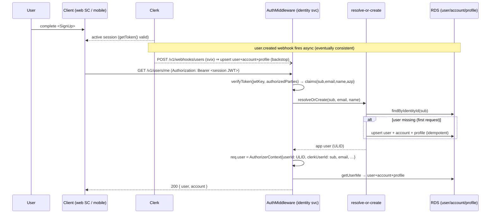
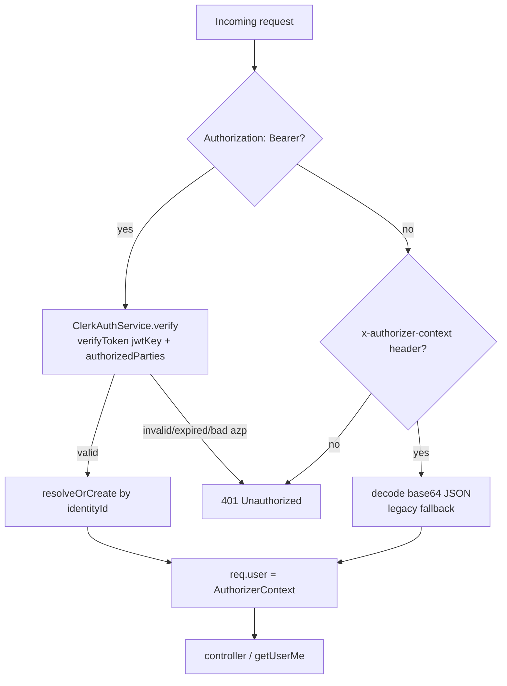

# feat: Reliable create-user flow

**Origin:** [`docs/brainstorms/2026-06-13-reliable-create-user-flow-requirements.md`](../brainstorms/2026-06-13-reliable-create-user-flow-requirements.md) — this plan implements that requirements doc.

## Summary

A newly-signed-up Clerk user can load `/profile` and use the app on the **first** attempt, with no app-wide loading gate and no dependence on `user.created` webhook timing. The identity service authenticates each protected request by verifying the Clerk **session token** itself (networkless, public-key only) and creates the user's `user` + `account` + `profile` rows on first request ("read-through"). The Clerk webhook is demoted from the onboarding gate to idempotent background sync (deletion, updates, and a creation backstop).

The entire load-bearing change is **server-side**: both clients already attach `Authorization: Bearer <clerk session token>` to `/v1/users/me` (web via `getToken()` → `buildApiClient`, mobile via `@clerk/expo` `getToken()` → `apiRequest`). The identity service simply never verified that token — it only read an `x-authorizer-context` header that no longer has a producer.

This approach is Clerk's own documented path to "strong consistency" for just-signed-up data (read from the session token, webhook for background sync) — see Sources.

---

## Problem Frame

Two verified gaps make the current create-user flow non-functional (it is pre-production; `/v1/users/me` 401s today, so this completes the flow rather than patching a live regression):

1. **Auth gap.** `AuthMiddleware` (`packages/services/identity/src/auth/middleware/auth.middleware.ts`) resolves the user _only_ from a base64 `x-authorizer-context` header produced by the API Gateway authorizer that was removed in the identity prod-hardening PR (#37). With no producer, every protected route throws `Missing authorizer context` (401), independent of webhook timing.
2. **Race + missing-record gap.** Even with auth, `getUserMe` → `resolveUser` (`packages/services/identity/src/users/resolveUser.ts`) reads the user by **app ULID** and requires an `account` row. The `user.created` webhook is what writes those rows today — asynchronously — and, critically, the webhook's `handleUserCreated` (`packages/services/identity-webhooks/src/handlers/identityWebhook.ts`) creates `user` + `profile` but **not** `account`. So a webhook-first user currently 404s on `/me` ("Account not found").

A blocking app-wide loading state — the original question — fixes neither gap and contradicts Clerk's guidance, so it is rejected (see origin Scope boundaries).

### ID-space mismatch (the crux)

The Clerk session token's `sub` is the **Clerk identity id** (`user_…`). But `resolveUser`/`getUserMe` key on the **app ULID** (`UserDAO.findById`). The middleware must therefore: verify the token → take `sub` → resolve `sub → app user` via `UserDAO.findByIdentityId` → **create if missing** → populate `AuthorizerContext.userId` with the resolved ULID. Creation is where `account` (and `profile`) get made.

---

## Requirements

Carried from origin (R1–R5), plus R6 surfaced by Clerk-docs research.

- **R1 — Service-side session-token verification.** The identity service verifies the Clerk session token on protected requests (networkless, using the instance's JWT public key) and populates the request user from the verified claims. Replaces the hard dependency on an upstream `x-authorizer-context` producer. _(origin R1)_
- **R2 — Read-through user creation.** On the first authenticated request for a user not yet in RDS, the service creates `user` **and** `account` **and** `profile` before responding (all three are required for `getUserMe`). Must not depend on the webhook having arrived. _(origin R2; expanded to include `profile` + `account` per code findings)_
- **R3 — Webhook demoted to idempotent background sync.** `user.created/updated/deleted` continue to sync RDS and act as a backstop, but no longer gate a user's own session. Read-through and webhook creation must be idempotent (no duplicate rows), keyed on the Clerk identity id unique constraint. `handleUserCreated` gains an `account` upsert so a webhook-first user is fully usable. _(origin R3)_
- **R4 — No app-wide blocking.** The client renders the immediate post-sign-up UI from the Clerk session; DB-backed fields resolve from the now-reliable `/v1/users/me`. No whole-app loading gate. _(origin R4)_
- **R5 — Both platforms.** Web and mobile both consume `/v1/users/me` with the Bearer token; the fix applies to both with no client-specific creation logic. _(origin R5)_
- **R6 — Enforce `authorizedParties` (azp).** Token verification pins the allowed request origins (`azp` claim) per Clerk's strong recommendation, to prevent cross-origin token reuse / subdomain leak. _(new — Clerk [verifyToken](https://clerk.com/docs/reference/backend/verify-token) guidance)_

---

## Success Criteria

- A newly-signed-up user loads `/profile` and sees their data on the **first** attempt, with `user.created` webhook delivery suppressed/delayed in test.
- Concurrent `user.created` webhook + first read-through request produce **exactly one** `user`, one `account`, one `profile`.
- A failed or delayed webhook does not break the user's session or `/profile`.
- No code path blocks the whole app on database/webhook state.
- A token whose `azp` is not in the allowed list is rejected.

---

## High-Level Technical Design

The reliable flow. Solid arrows are synchronous and on the critical path; the webhook (dashed) is asynchronous background sync that the user's own flow no longer waits on.

Verification path (claims → context), showing the dual-source middleware:

---

## Key Technical Decisions

- **KTD1 — Use `@clerk/backend` `verifyToken` with `jwtKey` (networkless, public-key only).** Clerk's canonical backend verification. `verifyToken(token, { jwtKey, authorizedParties, clockSkewInMs? })` runs with **no network call and no secret key** — `jwtKey` is the instance's JWT _public_ key (Dashboard → API Keys → "Show JWT public key"), safe as a Fargate env var. It validates signature, expiry (5s default skew), issuer (inferred from the key), and `azp`. This satisfies the "no Clerk secret key in the service" decision and avoids hand-rolling claim checks.
    - **Rejected: raw `jose` + `createRemoteJWKSet`.** Viable and auto-handles key rotation, but reimplements azp/issuer/skew validation that `@clerk/backend` gives for free, and adds a JWKS network dependency. Kept only as the fallback if manual key rotation becomes a burden (see Risks).
    - **Rejected: `verifyToken` with `secretKey`.** Would pull a Clerk secret into the service — explicitly out of scope per the email/name decision.
- **KTD2 — Email/name ride in the customized _default_ session token (no Backend API call).** Per the brainstorm decision: Dashboard → Sessions → "Customize session token" adds `email` / `first_name` / `last_name` via shortcodes (`{{user.primary_email_address}}` etc.). These appear on the bare `getToken()` token the clients already send — **so no client change and no Backend API dependency**. Constraint: keep total custom claims under the **1.2 KB** soft limit (email + name is well within it). This is an **operational dependency** (configure in both Clerk instances — see Dependencies).
- **KTD3 — Read-through owns `account` (and `profile`) creation; webhook gets a backstop.** `resolveUser` requires an `account`; the webhook omits it today. Read-through creates all three idempotently. `handleUserCreated` additionally gains an idempotent `account` upsert so a webhook-first user (one who never makes a read-through request) is also complete. Reuse the existing idempotent shape from `UsersService.upsertUser` (`onConflictDoUpdate` on `users.identityId`, `onConflictDoNothing` on account/profile).
- **KTD4 — Resolve-or-create on every protected request; `findByIdentityId` is the steady-state cost.** Each request does one indexed lookup by `users.identityId`; creation runs only on the miss. Acceptable (sub-ms indexed unique lookup). A future optimization — surfacing the app ULID as an `app_user_id` session claim once `setExternalId` propagates it to Clerk metadata, to skip the lookup — is **deferred** (see Follow-Up).
- **KTD5 — Keep `x-authorizer-context` decode as a documented fallback behind the Bearer-JWT primary path.** Near-zero cost, preserves a future edge-gateway option, and leaves the `AuthorizerContext` type + `@CurrentAuthorizerContext` decorator unchanged. Bearer JWT is the only production path today; the header branch is dead until/unless an edge authorizer is reintroduced.
- **KTD6 — Idempotency anchor is the `users.identityId` unique constraint.** Both webhook and read-through upsert on it; concurrent execution is resolved at the DB level, not in app code. Proven by an integration test (KTD/Success criterion), not by inspection.

---

## Implementation Units

### U1. Clerk session-token verification service

**Goal:** A service that verifies a Clerk session JWT and returns typed claims, or throws 401.
**Requirements:** R1, R6.
**Dependencies:** none.
**Files:**

- `packages/services/identity/package.json` — add `@clerk/backend` dependency.
- `packages/services/identity/src/auth/clerk-auth.service.ts` — new `ClerkAuthService`.
- `packages/services/identity/src/auth/auth.module.ts` (or wherever middleware deps are provided) — provide `ClerkAuthService`.
- `packages/services/identity/tests/clerk-auth.service.test.ts` — unit tests.

**Approach:** Wrap `verifyToken(token, { jwtKey: <CLERK_JWT_KEY>, authorizedParties: <CLERK_AUTHORIZED_PARTIES[]> })`. Expose `verify(token: string): Promise<VerifiedClerkClaims>` returning `{ sub, email?, firstName?, lastName?, azp, sid }`. Map any verification failure (bad signature, expired, wrong `azp`, malformed) to a NestJS `UnauthorizedException` with a single generic message (do not leak the reason). Construct the verifier once (module-level / singleton) reading config at init. `email`/name claims are optional on the type — downstream handles absence (see U3).

**Patterns to follow:** Existing injectable service style in `src/users/*.service.ts`; NestJS exceptions as used in `resolveUser.ts`.

**Test scenarios:**

- Valid token with `email`/name claims → returns claims with `sub`, `email`, names populated. `Covers AE: newly-signed-up user authenticates.`
- Expired token (exp in past beyond skew) → throws `UnauthorizedException`.
- Token signed by a different key / tampered signature → throws.
- Token whose `azp` is not in `authorizedParties` → throws. `Covers R6.`
- Valid token **without** email/name custom claims → returns claims with `email`/names `undefined` (no throw).
- Malformed / non-JWT Authorization value → throws.

---

### U2. Config — env schema for Clerk verification

**Goal:** Add and validate the two verification config values.
**Requirements:** R1, R6.
**Dependencies:** none (consumed by U1).
**Files:**

- `packages/services/identity/src/config/env.schema.ts` — add `CLERK_JWT_KEY` (PEM string) and `CLERK_AUTHORIZED_PARTIES` (comma-separated origins → `string[]`).
- `packages/services/identity/tests/env.schema.test.ts` — extend.

**Approach:** Add `CLERK_JWT_KEY` as a string; require it when `STAGE`/`NODE_ENV` is production-like, optional in dev/test (where U1 may be mocked). Parse `CLERK_AUTHORIZED_PARTIES` from a comma-separated env into a trimmed non-empty `string[]`. Follow the existing Zod `EnvironmentSchema` conventions (bracket-notation env access, `superRefine` for conditional requirement as the DB block already does).

**Patterns to follow:** The existing `DATABASE_URL`-vs-`DB_*` conditional in `env.schema.ts`.

**Test scenarios:**

- Valid PEM + parties → parses; `CLERK_AUTHORIZED_PARTIES` becomes a `string[]`.
- Missing `CLERK_JWT_KEY` in production stage → schema fails with a clear message.
- Missing in dev/test → allowed (verification mocked).
- Empty / whitespace-only `CLERK_AUTHORIZED_PARTIES` → rejected (R6 must be enforceable).

---

### U3. Read-through resolve-or-create + AuthMiddleware integration

**Goal:** Bearer-JWT becomes the primary auth path: verify → resolve-or-create by `identityId` → populate `AuthorizerContext`. `x-authorizer-context` retained as fallback.
**Requirements:** R1, R2, R5, R6 (uses U1/U2); advances R3 (idempotent creation).
**Dependencies:** U1, U2.
**Files:**

- `packages/services/identity/src/auth/middleware/auth.middleware.ts` — dual-source resolution.
- `packages/services/identity/src/users/resolve-or-create.service.ts` (new) **or** a new method on `UsersService` — `resolveOrCreate(claims): Promise<AuthorizerContext>`.
- `packages/services/identity/src/users/users.service.ts` — extract/reuse the idempotent user+account+profile upsert from `upsertUser` so read-through and the `/v1/users/upsert` endpoint share one creation routine.
- `packages/services/identity/src/auth/*` module wiring (inject the new service into the middleware).
- `packages/services/identity/tests/auth.middleware.test.ts` (new) and `tests/resolve-or-create.service.test.ts` (new).

**Approach:**

1. In `AuthMiddleware.use`: if `Authorization: Bearer <t>` present → `ClerkAuthService.verify(t)` → `resolveOrCreate(claims)` → set `req.user`. Else if `x-authorizer-context` present → existing base64 decode + `isAuthorizerContext` (unchanged fallback). Else → throw `UnauthorizedException`. Keep `/health` public set as-is.
2. `resolveOrCreate(claims)`: `UserDAO.findByIdentityId(claims.sub)`; if found, build context from it. If missing, run the idempotent create (user via `onConflictDoUpdate` on `identityId`; account via `onConflictDoNothing`; profile via `onConflictDoNothing` with `displayName` from `firstName + lastName`), then re-read. Build `AuthorizerContext { userId: <ULID>, clerkUserId: claims.sub, email: claims.email ?? <user.email>, scopes: [], permissions: [], tokenType: 'user' }`.
3. Email/name absence: if claims lack email (custom token not yet configured / edge), and the user is new, fall back to an empty `displayName` and the email claim if present; the webhook/PATCH backfills. Do not block creation on missing name.

**Execution note:** Start with a failing **integration** test for the contract — `GET /v1/users/me` with a valid Bearer JWT and webhook delivery suppressed returns 200 with the created user — then implement to green.

**Patterns to follow:** `UsersService.upsertUser` (`users.service.ts:23`) idempotent insert shape; `isAuthorizerContext` in `src/types/jwt.ts`; existing middleware structure in `auth.middleware.ts`.

**Test scenarios:**

- **Happy path (new user):** valid Bearer JWT, user not in DB → middleware creates user+account+profile and sets `req.user.userId` to the ULID; `getUserMe` returns the user with `displayName` from claims. `Covers AE: first-attempt /profile with webhook suppressed.`
- **Existing user:** second request → `findByIdentityId` hit, no duplicate rows created.
- **Webhook-first user missing account** (legacy state): user+profile exist (from webhook) but no account → read-through creates the account and `/me` succeeds (no 404). `Covers R3 + Success criterion.`
- **Suspended user:** `status = 'suspended'` → `resolveUser` path yields 403 (behavior preserved).
- **Fallback path:** no Bearer, valid `x-authorizer-context` header → still resolves (KTD5).
- **No auth:** neither Bearer nor header → 401.
- **Bad azp / expired token** (delegated to U1) → 401, no row created.
- **Missing email claim, new user:** creates user with empty displayName, no crash.

---

### U4. Webhook hardening — account backstop + demotion

**Goal:** `handleUserCreated` creates a complete record set (adds `account`) and remains idempotent; confirm the webhook is no longer a synchronous gate.
**Requirements:** R3.
**Dependencies:** none (independent of U1–U3; can land in parallel).
**Files:**

- `packages/services/identity-webhooks/src/handlers/identityWebhook.ts` — add idempotent `account` upsert in `handleUserCreated`.
- `packages/services/identity-webhooks/tests/e2e/auth/api.e2e.test.ts` — extend the `user.created` e2e to assert account creation.

**Approach:** After the `upsertByIdentityId` + profile upsert, insert an `accounts` row `onConflictDoNothing` keyed on `userId` (mirroring `UsersService.upsertUser`). Preserves existing `recordOnce` svix dedup. No change to `user.updated` / `user.deleted` (those remain the webhook's irreducible jobs — deletion has no read-through equivalent; updates keep RDS fresh).

**Patterns to follow:** The account/profile inserts in `UsersService.upsertUser`; existing `handleUserCreated` structure.

**Test scenarios:**

- `user.created` → upserts user, **account**, and profile (extend existing assertion).
- Duplicate `svix-id` → still deduped (no re-processing), unchanged.
- `user.created` for a user that already exists (read-through already created) → no duplicate account/profile (idempotent).
- `user.deleted` / `user.updated` → unchanged (regression guard).

---

### U5. Idempotency proof under concurrency (integration)

**Goal:** Prove the named success criterion — concurrent webhook + read-through yield exactly one of each row.
**Requirements:** R3.
**Dependencies:** U3, U4.
**Files:**

- `packages/services/identity/tests/create-user-flow.integration.test.ts` (new; `*.integration.test.ts` convention) — runs against a test Postgres (the repo's integration DB harness).

**Approach:** With a single Clerk identity id, fire the read-through creation path and the webhook creation path concurrently (Promise.all), then assert exactly one `user`, one `account`, one `profile`. Repeat with reversed start order. This validates the `users.identityId` unique-constraint anchor (KTD6) rather than asserting it by inspection.

**Execution note:** Integration test against a real Postgres — unique-constraint behavior is the thing under test, so mocks would not prove it.

**Test scenarios:**

- Concurrent read-through + webhook (both orders) → exactly one user/account/profile. `Covers Success criterion: idempotency.`
- Read-through then webhook (sequential) → webhook is a no-op upsert; counts unchanged.
- Webhook then read-through (sequential, account-less legacy) → read-through adds only the missing account.

---

### U6. Infra — inject Clerk verification config into Fargate

**Goal:** The identity service container receives `CLERK_JWT_KEY` and `CLERK_AUTHORIZED_PARTIES` per stage.
**Requirements:** R1, R6.
**Dependencies:** U2 (consumes the env names).
**Files:**

- `packages/services/identity/infra/lib/identity-service-stack.ts` — add the two env vars to the task definition (around the existing env block, lines ~157–184).
- SSM params per stage: `/kitchensink/{stage}/clerk/jwt-public-key` (String — the PEM is public) and `/kitchensink/{stage}/clerk/authorized-parties`. Wire the stack to read them (mirroring the existing `/kitchensink/{stage}/sentry/...` SSM read).
- `packages/services/identity-webhooks/infra/__tests__/stacks.test.ts` or the identity infra test — assert the env vars are present on the task def.

**Approach:** Follow the existing SSM-param pattern used for `SENTRY_DSN`. The JWT public key is not secret, so an SSM `String` parameter (not Secrets Manager) is appropriate; `CLERK_AUTHORIZED_PARTIES` likewise. Provision the param values per stage (prod issuer `https://clerk.commise.app`, sandbox the dev instance — see memory `clerk-instance-domains`). Do **not** reuse the existing `AUTH_SECRET_ARN`/`AUTH_PUBLISHABLE_KEY` — those are Clerk publishable/secret keys, distinct from the JWT verification public key.

**Patterns to follow:** The `SENTRY_DSN` SSM read + container env injection already in `identity-service-stack.ts`.

**Test scenarios:**

- CDK template assertion: task definition env contains `CLERK_JWT_KEY` and `CLERK_AUTHORIZED_PARTIES`.
- `Test expectation: none` for the SSM param provisioning itself beyond the template assertion — it's declarative infra.

---

### U7. Client verification + mobile token resilience

**Goal:** Confirm there is no app-wide blocking gate and that `/profile` renders from the now-reliable `/me`; harden the mobile token call.
**Requirements:** R4, R5.
**Dependencies:** U3 (so `/me` actually succeeds end-to-end).
**Files:**

- `packages/apps/commise/web/src/app/profile/page.tsx` — verify it renders session-derived fields immediately and degrades gracefully if `/me` is momentarily unavailable (no whole-app spinner). Likely no functional change.
- `packages/apps/commise/mobile/src/services/api.ts` or `src/hooks/useUserProfile.ts` — use `getToken({ skipCache: true })` when fetching after app-resume, to avoid a stale (≤60 s) token. Small change.

**Approach:** The clients already attach the Bearer token, so this unit is primarily verification plus the mobile freshness guard. Confirm (and add a test for) the absence of any code path that blocks the entire app on `/me`/DB state (R4). Do not add a blocking loading state. Any per-widget "finishing setup" affordance is deferred polish (see Follow-Up) — read-through makes `/me` reliable on first load, so it is not required.

**Patterns to follow:** Existing `buildApiClient` (web `lib/api-client.ts`) and `apiRequest`/`useUserProfile` (mobile).

**Test scenarios:**

- Web: profile page renders `displayName`/email from the `/me` response on first load (no app-wide spinner gating render). `Covers R4.`
- Mobile: `getUserMe` after resume requests a fresh token (`skipCache: true`) — assert the token-fetch option.
- Web + mobile both target `/v1/users/me` with the Bearer header (regression guard for R5).

---

## Scope Boundaries

**In scope**

- Service-side Clerk session-token verification + read-through creation of user + account + profile on first request.
- Demoting the webhook to idempotent background sync, with an account-creation backstop.
- `authorizedParties` enforcement (R6).
- Client verification + mobile token-freshness guard.

**Deferred for later** _(origin)_

- Broader API-gateway / edge-auth architecture (an edge authorizer was explicitly not chosen).
- Enriching profile data beyond what `/profile` needs on first load.

### Deferred to Follow-Up Work

- **`app_user_id` session claim fast-path** (KTD4): surface the app ULID as a custom claim once `setExternalId` propagates it to Clerk metadata, to skip the per-request `findByIdentityId` lookup.
- **Per-widget "finishing setup" affordance** (R4 polish): not needed given read-through reliability.
- **Capture institutional learnings** via `/ce-compound` after merge (no `docs/solutions/` corpus exists yet for Clerk JWKS/JIT/idempotency patterns).

**Outside this change** _(origin)_

- Adding an app-wide blocking loading state (rejected: Clerk anti-pattern; doesn't address the auth gap; fragile under webhook delay/failure).
- Re-adding the gateway authorizer Lambda removed in PR #37.

---

## Risks & Dependencies

### Operational dependencies (must exist before prod works)

- **Clerk "Customize session token" configured in BOTH instances** (prod `clerk.commise.app` + sandbox dev) to emit `email` / `first_name` / `last_name`. Without it, read-through creates users with empty `displayName` until the webhook backfills (degraded, not broken). Keep claims under the 1.2 KB soft limit.
- **JWT public key + authorized origins provisioned to SSM** per stage (U6). Prod and sandbox have different keys and origins.

### Risks

- **Mobile `azp` value is undocumented (R6).** Clerk has no doc on what `azp` an `@clerk/expo` token carries. **Mitigation:** decode a real Expo token in sandbox during U6/U7 and add its origin to `CLERK_AUTHORIZED_PARTIES`; until confirmed, mobile requests could 401. This is the single most likely execution-time surprise — validate early. _(open question Q3)_
- **JWT signing-key rotation.** `jwtKey` is pinned per stage; if Clerk rotates the instance signing key, verification breaks until the SSM param is updated. **Mitigation:** document the rotation runbook; fall back to JWKS-fetch verification (KTD1 alternative) if rotation proves frequent.
- **Sign-up flows that don't immediately establish a session** (email-link / email-code / MFA / waitlist) leave the session `pending` (`sts` claim) — but in those cases the client has no token to send, so there is no race, only a delayed first authenticated request. **Assumption:** Commise's sign-up yields an active session on `<SignUp>` completion; confirm the instance's verification settings.
- **Token size.** Adding claims risks the 1.2 KB cookie budget; email + name is safe, but avoid piling on further custom claims here.

### Assumptions

- The create-user flow is pre-production (the auth gap means `/v1/users/me` 401s today), so this completes the flow rather than patching a live regression. _Confirm no live path exists._
- `UserDAO.upsertByIdentityId` (keyed on Clerk identity id) is safe to call concurrently from webhook and read-through — validated by U5.

---

## Open Questions

- **Q1 — `getToken({ template })` vs default token (resolved).** Custom claims go on the **default** session token via "Customize session token", which is exactly what the clients' bare `getToken()` returns — no client change. _(Confirmed via Clerk docs; no action.)_
- **Q2 — AuthMiddleware fallback (resolved → KTD5).** Keep `x-authorizer-context` decode as a documented fallback; Bearer JWT is primary.
- **Q3 — Mobile `azp` (open, execution-time).** What origin does an `@clerk/expo` session token put in `azp`? Resolve by decoding a real sandbox token during U6/U7; feed into `CLERK_AUTHORIZED_PARTIES`.
- **Q4 — Should the webhook also reconcile `account` for `user.updated`?** Out of scope here (updates rarely change account state); revisit if account drift appears.

---

## Sources & Research

Codebase findings (verified by reading):

- `packages/services/identity/src/auth/middleware/auth.middleware.ts`, `src/types/jwt.ts` (`AuthorizerContext`, `isAuthorizerContext`), `src/auth/decorators/current-user.decorator.ts`.
- `src/users/resolveUser.ts`, `src/users/users.service.ts` (`upsertUser` idempotent shape; `getUserMe` requires user+account+profile).
- `src/database/dao/{user,account}.dao.ts` (`upsertByIdentityId`, `findByIdentityId`, `AccountDAO.upsert/createForUser`); schema `users`(unique `identityId`)/`accounts`(unique `userId`)/`profiles`(unique `userId`, `displayName` NOT NULL).
- `packages/services/identity-webhooks/src/handlers/identityWebhook.ts` (webhook creates user+profile, **not** account).
- Clients already attach Bearer token: web `packages/apps/commise/web/src/lib/api-client.ts` + `app/profile/page.tsx` (`@clerk/nextjs/server` `getToken()`); mobile `packages/apps/commise/mobile/src/services/api.ts` + `hooks/useUserProfile.ts` (`@clerk/expo`).
- No `jose`/`@clerk/backend` in identity-service deps today; no Clerk JWKS/issuer config wired in schema or infra.

External (Clerk official docs — load-bearing for KTD1/KTD2/R6):

- [Session tokens](https://clerk.com/docs/guides/sessions/session-tokens) — default claims (sub/azp/iss/sid…; **no** email/name); `iss` = Frontend API URL.
- [Customize your session token](https://clerk.com/docs/guides/sessions/customize-session-tokens) — adds claims to the **default** token; 1.2 KB soft / 4 KB hard limit; reserved claims.
- [verifyToken()](https://clerk.com/docs/reference/backend/verify-token) — networkless via `jwtKey`; `authorizedParties` highly recommended; `clockSkewInMs` default 5000; no `issuer` option (inferred).
- [Manual JWT verification](https://clerk.com/docs/guides/sessions/manual-jwt-verification) — JWKS at `{frontend-api}/.well-known/jwks.json` (fallback approach).
- [Syncing data with webhooks](https://clerk.com/docs/guides/development/webhooks/syncing) + [How to sync Clerk user data](https://clerk.com/articles/how-to-sync-clerk-user-data-to-your-database) — webhooks eventually consistent; read just-created data from the session token for **strong consistency**; don't gate onboarding on webhooks. Confirms the overall pattern.
- Session lifetime ~60 s with frontend auto-refresh ([How Clerk works](https://clerk.com/docs/guides/how-clerk-works/overview)); mobile `getToken({ skipCache: true })` after resume ([Force token refresh](https://clerk.com/docs/guides/sessions/force-token-refresh)).

_Unverified (carry into execution):_ exact `session.created`-vs-`user.created` ordering; full list of sign-up configs that delay the session; Expo `azp` value (Q3).
