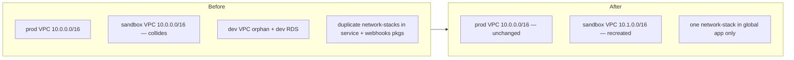
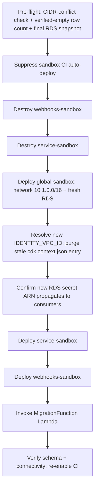

# refactor: Consolidate to one VPC per stage with distinct CIDRs

## Summary

Make the AWS network topology exactly one VPC per stage — production and sandbox — each owned by the global infra app (`packages/infra/global`), with **distinct CIDRs** (prod stays `10.0.0.0/16`; sandbox moves to `10.1.0.0/16`). Retire the legacy orphan `dev` VPC/RDS and the duplicate network-stack definitions in the service and webhooks packages. Production's VPC is **not replaced** (its CIDR is unchanged), though landing the change does redeploy prod service + webhooks; only sandbox is recreated, and its RDS is rebuilt fresh after a verified-empty check. The distinct CIDRs also inform the cross-VPC router question — answered here as a design decision feeding `docs/plans/2026-06-14-003-feat-tailscale-private-aws-access-plan.md`.

---

## Problem Frame

The account carries more VPCs than it should. Both prod and sandbox VPCs are created from the same `network-stack.ts` with no explicit `ipAddresses`, so both default to `10.0.0.0/16` — an overlap that blocks VPC peering and forced the Tailscale plan into 4via6 site-ID gymnastics. A parentless `IdentityNetwork-dev` VPC plus its `kitchensink-data-dev` RDS linger from an earlier `STAGE=dev` deploy that no current workflow reproduces. The network stack is also duplicated (byte-identical in the service package; an older copy missing the SG-pairing fix in the webhooks package), where only tests reference it — drift waiting to happen. The identity VPC is confirmed the only VPC-attached prod infrastructure (the web app's `SandboxRouterStack` is CloudFront-based and VPC-independent; the web app is Vercel/edge-hosted) — so "one VPC for all of prod" is already nearly true; the work is making the CIDRs distinct, recreating sandbox, and removing the strays.

---

## Requirements

- R1. Production has exactly one VPC, owned by the global app, retaining CIDR `10.0.0.0/16` with no VPC (or subnet/RDS) replacement.
- R2. Sandbox has exactly one VPC, owned by the global app, with CIDR `10.1.0.0/16` (distinct from prod).
- R3. The legacy orphan `dev` VPC and its RDS are retired after a usage check (CFN + non-CFN dependencies) confirms nothing live depends on them.
- R4. The duplicate network/data/domain/service stack definitions in the service and webhooks packages are removed, with the active infra test relocated so it still runs and still asserts SG ingress/egress pairing.
- R5. Sandbox's RDS is rebuilt fresh in the new VPC (no data migration) after a verified-empty check, and its schema re-applied via the existing migration runner.
- R6. Security-group ingress/egress pairing on `5432` is preserved on every recreated SG (no `ENI_SG_RULES_MISMATCH` regression).
- R7. The cross-VPC router question is answered with a documented recommendation (cost, reversibility, security), and the Tailscale plan/brainstorm are updated in lockstep to reflect distinct CIDRs.

---

## Key Technical Decisions

- **Prod CIDR unchanged → prod VPC not replaced (verified gate, not eyeballed).** Setting `ipAddresses: ec2.IpAddresses.cidr('10.0.0.0/16')` for prod produces the same `CidrBlock` already deployed (CDK's `DEFAULT_CIDR_RANGE` is `10.0.0.0/16`), so the VPC resource shows no diff. But the real danger is downstream logical-ID drift from the `stage`-threading edit (subnets, NAT, SGs → RDS subnet group → RDS). So the gate is **an empty `cdk diff` for the entire prod network AND data stacks**, plus a CDK assertion test that prod synth emits exactly `10.0.0.0/16` — not just "the VPC resource is unchanged." Any non-empty prod diff halts.

- **Landing the change redeploys prod service + webhooks (prod is not fully "untouched").** U1 edits `packages/infra/global/**`, and the prod workflow treats any change there as a global change that redeploys service + webhooks and re-runs prod migrations (idempotent). The VPC/RDS do not replace, but the merge is a prod-touching event — confirm a clean `cdk diff` for _all_ prod stacks and prefer a low-traffic window.

- **Only sandbox is renumbered and recreated.** Sandbox moves to `10.1.0.0/16`, forcing VPC → subnet → RDS replacement. Sandbox RDS is rebuilt fresh and re-migrated rather than snapshot-restored — but only after the verified-empty check below, and a final pre-destroy snapshot is taken as cheap insurance.

- **The swap is an ordered teardown with a defined rollback, not a one-shot deploy.** CloudFormation refuses to change an in-use export, so the sequence is: snapshot → destroy `webhooks-sandbox` → destroy `service-sandbox` → deploy global-sandbox (new VPC/RDS) → resolve new VPC id + purge stale context cache → deploy `service-sandbox` → deploy `webhooks-sandbox` → invoke migration Lambda. A naive `cdk deploy --all` deadlocks. The runbook defines per-step failure state and a fix-forward recovery path.

- **The sandbox CI auto-deploy must be suppressed during the swap.** The sandbox workflow deploys the global stack on **PR open** via `cdk deploy --all`, which would fire the deadlocking deploy the moment the U1 PR opens. The runbook disables that workflow (or path-gates it) for the operation and re-enables after, rather than relying on "coordinate manually."

- **Construct IDs preserved; `cidrFor(stage)` has a safe fallback.** Renaming `Identity*` constructs would force replacement — deferred. Per-stage CIDR selection threads `stage` into `NetworkStack` (which receives none today). `cidrFor(stage)` returns a safe default for unknown/`dev`/`test` stages rather than throwing, so removing the deployed dev stacks (U3) doesn't break local synth or the test harness that runs with the default stage.

- **Never `cdk destroy` the sandbox global/data stack to recover.** The data-stack buckets are `RemovalPolicy.DESTROY` + `autoDeleteObjects: true` and the RDS is `deletionProtection: false`. `destroy` is the procedure for the service/webhooks stacks, but applying it to the data stack on a wedged update empties the buckets and drops the DB. If the global/data update wedges, fix forward only.

- **Router decision: peer the VPCs, run one router in prod (Option A).** Distinct CIDRs make peering legal, so a single prod-resident router advertises both CIDRs and reaches the sandbox RDS over the peering connection. Chosen for the simpler one-instance footprint; the ~$3/mo saving is incidental. This **accepts a deliberate prod↔sandbox network coupling** — gated by route tables, the sandbox DB SG admitting the prod router, and the tailnet ACL. The peering connection + routes + cross-VPC SG rule are built with the router in plan 003, not here; this plan only establishes the distinct-CIDR precondition and records the decision.

- **Distinct CIDRs remove the 4via6 _site-ID disambiguation_ need — not 003's hostname-resolution question.** With non-overlapping CIDRs each router advertises a plain route, so 4via6 is unnecessary. But whether RDS is reachable _by hostname_ over a Tailscale subnet route (003's U6 spike) is a separate question about RDS publishing only IPv4 and DNS addressing — it is **not** resolved by this consolidation. U5 updates 003 to drop 4via6 while preserving its hostname-resolution spike.

---

## High-Level Technical Design

**Before / after topology:**

**Sandbox recreation sequence (the export-teardown dance):**

Prod runs no such sequence — its CIDR is unchanged, so the VPC/RDS are no-ops (though service/webhooks redeploy).

---

## Router Cross-VPC Analysis

The explicit design question: can one Tailscale router in the prod VPC reach sandbox? With distinct CIDRs, **yes — via VPC peering**. Two viable shapes:

| Dimension           | Option A: peer VPCs + one prod router                            | Option B: one router per VPC, no peering    |
| ------------------- | ---------------------------------------------------------------- | ------------------------------------------- |
| Prerequisite        | Distinct CIDRs (this plan delivers)                              | None                                        |
| Peering charge      | $0 (no hourly fee)                                               | n/a                                         |
| Data transfer       | $0 same-AZ; $0.01/GB cross-AZ (negligible)                       | same $0.01/GB cross-AZ between nodes        |
| Standing compute    | one router (~$3/mo)                                              | two routers (~$6/mo)                        |
| Reversibility       | ~5 min, non-destructive (delete peering, clean routes + SG rule) | trivial (terminate 2nd instance)            |
| AWS-layer isolation | prod↔sandbox bridged at the routing fabric                       | full network isolation between environments |

Pricing verified against AWS's VPC and Transit Gateway pricing pages (April 2025 billing note confirms no peering price change). Transit Gateway is ruled out: ~$73/mo in attachment fees for a 2-VPC same-region setup — all cost, no benefit at this scale.

**Decision: Option A (peer the VPCs, one router in prod).** A single router is the simpler footprint, and peering is free + reversible in ~5 minutes. The trade-off accepted is a deliberate prod↔sandbox network coupling. **Controls:** the coupling is gated like any SG-based access — route-table entries scoped to the specific CIDRs, the sandbox DB SG admitting only the prod router's SG on 5432, and the tailnet ACL restricting both route sets to the owner node. Note the coupling exists at the laptop regardless once the router lands (the laptop holds routes to both VPCs), so the ACL is load-bearing either way. The peering connection, routes, and cross-VPC SG rule are implemented with the router in plan 003. Revisit/unwind is cheap if the coupling proves undesirable.

---

## Implementation Units

### U1. Thread `stage` into NetworkStack and assign per-stage CIDRs

- **Goal:** Give each stage an explicit, distinct CIDR (prod `10.0.0.0/16` unchanged, sandbox `10.1.0.0/16`) without replacing any prod resource.
- **Requirements:** R1, R2
- **Dependencies:** none
- **Files:**
    - `packages/infra/global/lib/platform/network-stack.ts` (add `stage` to props; set `ipAddresses` from `cidrFor(stage)`)
    - `packages/infra/global/lib/platform/global-stack.ts` (forward `stage` into `new NetworkStack(...)`, which today passes only `{ env, stackName }`)
    - `packages/infra/global/bin/app.ts` (confirm `stage` reaches NetworkStack)
    - the relocated infra test from U4 (add a prod-CIDR assertion)
- **Approach:** Add `stage` to `NetworkStackProps`. Implement `cidrFor(stage)` with a per-stage map (`prod → 10.0.0.0/16`, `sandbox → 10.1.0.0/16`) and a **safe default** for unknown/`dev`/`test` (do not throw). Pass `ipAddresses: ec2.IpAddresses.cidr(cidrFor(stage))`. Keep all construct IDs unchanged to avoid logical-ID drift.
- **Patterns to follow:** stage-resolution idiom in `bin/app.ts`; prod-vs-other branching in `identity-service-stack.ts`.
- **Test scenarios:**
    - Synth for `STAGE=prod` asserts the `AWS::EC2::VPC` CidrBlock is exactly `10.0.0.0/16` (regression guard against prod replacement).
    - Synth for `STAGE=sandbox` asserts CidrBlock `10.1.0.0/16`.
    - `cidrFor('dev')` / unknown stage returns the safe default without throwing (local synth still works).
- **Verification:** `cdk diff STAGE=prod` shows an **empty changeset for both the network and data stacks** (zero add/modify/replace) — any non-empty prod diff halts the rollout; sandbox diff shows the CidrBlock change; `npm run infra:synth` passes for both stages.

### U2. Recreate the sandbox VPC + RDS via the ordered teardown

- **Goal:** Apply the sandbox CIDR change by tearing down and rebuilding in the correct order, rebuilding RDS fresh, with pre-flight safety checks, CI suppression, and a defined rollback.
- **Requirements:** R2, R5, R6
- **Dependencies:** U1
- **Files:**
    - `docs/runbooks/sandbox-vpc-recreation.md` (new operational runbook)
- **Approach:** Encode the HTD sequence with these load-bearing steps:
    - **Pre-flight:** (a) verify `10.1.0.0/16` does not conflict with any existing VPC/peering/route in the account (`describe-vpcs`, `describe-vpc-peering-connections`); (b) **verified-empty check** — run a `SELECT count(*)` across application tables via the in-VPC `MigrationFunction` Lambda or an ECS-exec into the running task (the RDS is otherwise unreachable); define a hard threshold (e.g., any application table > 0 non-system rows → halt and escalate); (c) take a final RDS snapshot regardless, converting "irreversible" to "recoverable".
    - **CI suppression:** disable or path-gate `sandbox-identity-deploy.yml` for the operation so PR-open doesn't fire the deadlocking `cdk deploy --all`; re-enable at the end.
    - **Teardown/redeploy:** destroy webhooks-sandbox → destroy service-sandbox (note: `cdk destroy` matches by **construct id**; expect stuck ACM certs needing `--retain-resources` + manual cleanup) → deploy global-sandbox (new VPC + fresh RDS) → resolve new `IDENTITY_VPC_ID` and **purge the stale sandbox `vpc-provider:` entry from `packages/services/identity/cdk.context.json`** (and the webhooks copy) so `fromLookup` re-resolves against the new VPC → **confirm the new RDS master secret ARN** is what the redeployed service/webhooks resolve → deploy service-sandbox → deploy webhooks-sandbox → invoke the migration Lambda.
    - **SG pairing:** comes from the shared `network-stack.ts`, so U1 preserves it; verify with VPC Reachability Analyzer if a timeout appears.
    - **Rollback/recovery:** document each step's failure state. If global-sandbox deploy fails after service/webhooks are destroyed, **fix forward** (resolve the deploy error) — do **not** `cdk destroy` the global/data stack (autoDeleteObjects + DESTROY would empty buckets and drop the DB). State a max sandbox-down window and an escalation path.
- **Execution note:** Manual, ordered operation — not the one-shot CI deploy. Sequence the U1 PR so the teardown completes (CI suppressed) before merge.
- **Test scenarios:** Test expectation: none — operational sequence. Verification is end-to-end.
- **Verification:** sandbox service health-checks green against `10.1.0.0/16`; migration Lambda reports all expected tables; an in-VPC connection to the new RDS works; no stale `vpc-provider` entry remains committed.

### U3. Verify and retire the legacy `dev` VPC/RDS and orphans

- **Goal:** Confirm — across CFN _and_ non-CFN dependencies — that nothing live depends on the `dev` stacks, then retire them safely (PII-aware, staged).
- **Requirements:** R3
- **Dependencies:** none (independent of U1/U2)
- **Files:**
    - `docs/runbooks/sandbox-vpc-recreation.md` (extend with dev-retirement steps)
- **Approach:**
    - **CFN check:** `aws cloudformation list-exports`; grep for importers of `kitchensink-identity-*-dev:` (research found none; CI only sets prod/sandbox).
    - **Non-CFN dependency sweep** (a grep can't see these): `describe-vpc-peering-connections`, `describe-vpc-endpoints`, `describe-network-interfaces --filters Name=vpc-id`, Route53 private-hosted-zone VPC associations, and any SG rules referencing dev SGs; SSM params / secrets holding a dev connection string.
    - **PII-aware data check:** row-count per table for real Clerk user records, not just "negligible"; record an explicit data-destruction decision and take a final snapshot.
    - **Secrets/backups:** identify the dev data stack's secret `RemovalPolicy`; delete or rotate-then-delete the dev RDS secret; confirm automated backups are removed/retention-zeroed so PII isn't retained post-teardown.
    - **Staged retirement:** stop/disable the dev RDS and detach (not delete) the VPC for a cool-down window; confirm nothing breaks; then delete stacks in dependency order. Remove `dev` from the deployed footprint and ensure no default-`dev` deploy can recreate it (`cidrFor` keeps a safe code-path default per U1, but no workflow should deploy `STAGE=dev`).
    - **Confirm one-prod-VPC finding:** record that no other VPC-attached prod infra exists (`SandboxRouterStack` is CloudFront/VPC-independent), so R1's "one prod VPC" is verified, not assumed.
- **Test scenarios:** Test expectation: none — verification-then-teardown. Success: no `*-dev` identity stacks/VPCs, no broken imports, no orphaned dev secrets/backups.
- **Verification:** `list-exports` shows no `*-dev` identity exports; the non-CFN sweep is clean; dev VPC/RDS/secret/backups gone.

### U4. Remove duplicate stack definitions and relocate the infra test

- **Goal:** Delete the duplicated stack definitions in the service and webhooks packages, keeping the authoritative set in `packages/infra/global`, and relocate the active infra test so coverage (incl. SG pairing) survives.
- **Requirements:** R4, R6
- **Dependencies:** none
- **Files:**
    - delete unused `*-stack.ts` duplicates in `packages/services/identity/infra/lib/` and `packages/services/identity-webhooks/infra/lib/`
    - relocate `packages/services/identity/infra/__tests__/stacks.test.ts` into `packages/infra/global` (the chosen path — see below)
    - `packages/infra/global/package.json` + `packages/infra/global/vitest.config.ts` (add `vitest` + `@kitchensink/vitest` and a `test` script — the global package has no harness today)
    - delete `packages/services/identity-webhooks/infra/__tests__/stacks.test.ts` (already fully `describe.skip` and built against stale signatures)
- **Approach:** First **resolve the signature mismatch**: the webhooks-package duplicates take `network`/`data` object references, while the global/canonical `IdentityServiceStack` takes `vpcId` and looks the VPC up — these are not interchangeable. Adopt the **global `vpcId`-based signatures** (the production deploy path) as authoritative. Relocate the active service test into the global package (pre-decided over cross-package CDK import, which risks workspace path-resolution and CDK-version coupling), carrying its pre-seeded VPC-lookup context, and add a minimal vitest config. The relocated test **must retain an assertion that every DB ingress rule has a matching source-SG egress rule on 5432** (the `ENI_SG_RULES_MISMATCH` guard) — this is a named requirement, not optional. Then delete the duplicates.
- **Patterns to follow:** `aws-cdk-lib/assertions` `Template` usage and pre-seeded VPC-lookup context in the existing `stacks.test.ts`.
- **Test scenarios:**
    - The relocated test imports the global definitions and its existing assertions pass.
    - An assertion confirms each DB ingress rule on 5432 has a paired source-SG egress rule.
    - Repo-wide `npm run typecheck` and `npm run lint` pass with the duplicates removed (no dangling imports).
- **Verification:** duplicates gone; `npm run test --workspace=packages/infra/global` runs green incl. the SG-pairing assertion; build/typecheck/lint clean.

### U5. Document the router decision and update the Tailscale plan in lockstep

- **Goal:** Record the cross-VPC router recommendation and propagate the distinct-CIDR consequence to the Tailscale artifacts **in the same PR** as the CIDR change, so no stale-premise window exists.
- **Requirements:** R7
- **Dependencies:** U1, U3
- **Files:**
    - `docs/architecture/decisions/0002-vpc-consolidation-and-cidr-scheme.md` (new ADR; coordinate numbering — the Tailscale plan also eyed 0002)
    - `docs/plans/2026-06-14-003-feat-tailscale-private-aws-access-plan.md` (drop the 4via6 decision and the 4via6 site-ID disambiguation from R4; **keep** the U6 hostname-reachability spike, which is independent of CIDR overlap; switch to a **single prod router + VPC peering** reaching both VPCs over plain routes, with the sandbox DB SG admitting the prod router's SG and the peering connection/routes added there)
    - `docs/brainstorms/2026-06-14-tailscale-private-aws-access-requirements.md` (update R4/Key Decisions: distinct CIDRs replace the 4via6 collision workaround)
- **Approach:** ADR captures the per-stage CIDR scheme, the prod-no-replacement gate, the export-teardown constraint (with ADR-0001's "before you change this" guard style and a cross-reference to ADR 0001), the Option A vs B analysis with the recommendation (B) and the laptop-bridge isolation caveat. Update 003/brainstorm to remove 4via6 site-ID disambiguation **without** marking 003's hostname-resolution spike resolved — distinct CIDRs do not answer whether RDS is reachable by hostname over a subnet route. Land these doc updates in the **same PR** as U1 so 003 never instructs work against a premise this plan has removed.
- **Test scenarios:** Test expectation: none — documentation. Verification by review: 003 no longer depends on 4via6 but still carries its hostname spike, and reads coherently.
- **Verification:** ADR exists and is discoverable; 003/brainstorm are internally consistent with distinct CIDRs and contain no stale 4via6 references.

---

## Scope Boundaries

- **In scope:** distinct per-stage CIDRs, sandbox VPC/RDS recreation, dev-orphan retirement, duplicate-stack removal, the router design decision and Tailscale-doc updates.

### Deferred to Follow-Up Work

- Renaming `Identity*` stacks/constructs to neutral platform naming (forces replacement; not worth the churn now; see KTDs and ADR 0001).
- Building the Tailscale router itself (`docs/plans/2026-06-14-003-feat-tailscale-private-aws-access-plan.md`).
- A least-privilege application DB user distinct from the RDS master user (the service currently connects as master — defense-in-depth hardening).
- Removing the stale "Auth0 Management API" SG comments at `network-stack.ts:75,81` (cosmetic).
- The VPC peering connection, route-table entries, and cross-VPC DB SG rule — chosen (Option A) but implemented with the router in plan 003, since they are useless without it. This plan only establishes the distinct-CIDR precondition.

### Out of scope

- Migrating real production data (prod VPC and RDS are unchanged).
- Adding new application services or changing app behavior.
- Transit Gateway (ruled out on cost for a 2-VPC same-region setup).

---

## Risks & Dependencies

- **Prod replacement via logical-ID drift (highest impact).** The `stage`-threading edit could change subnet/SG logical IDs and cascade to prod RDS replacement, which the narrow "VPC resource unchanged" check would miss. Mitigation: U1's gate is an **empty `cdk diff` for the whole prod network+data stacks** plus a synth assertion; any non-empty prod diff halts.
- **Stale `cdk.context.json` VPC cache.** The service stack reaches the VPC via `fromLookup`, cached in a git-tracked `cdk.context.json` pinned to the current sandbox VPC id/CIDR. After recreation, a stale entry can resolve a deleted VPC or phantom subnets. Mitigation: U2 purges the stale entry and regenerates it.
- **Export-in-use deadlock.** The sandbox swap can't be one-shot; it needs the ordered teardown with CI suppressed. Mitigation: U2 runbook + workflow suppression.
- **No rollback / sandbox-down window.** A mid-sequence failure (e.g., RDS provisioning, CIDR conflict) can leave sandbox down with no symmetric rollback. Mitigation: pre-flight CIDR-conflict check, final snapshot, fix-forward recovery, stated max-down window.
- **Destroying real data.** "Sandbox/dev data minimal" must be measured, not assumed, and the RDS is only reachable in-VPC. Mitigation: verified-empty row count via the migration Lambda/ECS-exec with a hard threshold, plus a pre-destroy snapshot (U2, U3).
- **Catastrophic recovery instinct.** `cdk destroy` on a wedged global/data stack empties buckets (autoDeleteObjects) and drops RDS. Mitigation: explicit "fix-forward only, never destroy the data stack" warning in U2.
- **Dev retirement blast radius.** A code grep can't see non-CFN dependencies (peering, ENIs, endpoints, Route53 associations, out-of-band secrets). Mitigation: U3's non-CFN sweep + staged disable-then-delete.
- **Landing U1 redeploys prod.** Merging the global-package change redeploys prod service + webhooks and re-runs prod migrations (idempotent). Mitigation: clean all-prod-stacks `cdk diff`, low-traffic window.
- **SG-pairing regression on recreated SGs.** Mitigation: derives from shared `network-stack.ts`; U4 keeps the pairing assertion as a named test requirement; Reachability Analyzer as fallback diagnostic.
- **Stale cross-reference to plan 003.** If 003 isn't updated alongside U1, it instructs 4via6 work against a removed premise. Mitigation: U5 lands the 003/brainstorm updates in the same PR; it removes 4via6 but preserves 003's separate hostname-reachability spike.
- **Accepted prod↔sandbox coupling (Option A).** Peering bridges the two environments at the routing fabric. Mitigation/controls: route-table entries scoped to specific CIDRs, the sandbox DB SG admitting only the prod router's SG on 5432, and the tailnet ACL restricting both route sets to the owner node; reversible in ~5 minutes if it proves undesirable. Built in plan 003.
- **Dependency:** the Tailscale plan (003) is downstream; sequence this consolidation (and the U5 doc updates) before resuming router implementation.

---

## Alternatives Considered

- **Renumber prod instead of (or with) sandbox** — rejected; replacing prod VPC/RDS for no functional gain is pure risk.
- **Snapshot/restore sandbox RDS** — rejected in favor of recreate-fresh (negligible data, simpler), but a pre-destroy snapshot is still taken as insurance.
- **Transit Gateway for cross-VPC** — rejected on cost (~$73/mo attachment fees) with no benefit at this scale.
- **Two routers, no peering (router Option B)** — considered and not chosen; keeps AWS-layer isolation but costs a second instance, and the laptop bridges both VPCs once the router lands anyway, so the ACL is the real control either way. Option A (peer + one router) was chosen for the simpler footprint.
- **Cross-package CDK import for the relocated test (vs. moving it into the global package)** — rejected; workspace path-resolution and CDK-version coupling make relocation + a minimal vitest config the simpler, more robust path.

---

## Open Questions (Deferred to Implementation)

- Exact sandbox CIDR if `10.1.0.0/16` conflicts with anything found in the U2 pre-flight (fallback `10.2.0.0/16`).
- The concrete mechanism chosen for the in-VPC row-count check (migration Lambda one-off vs. ECS exec) — settled in U2 by what's least disruptive.
- Final ADR number (coordinate with the Tailscale plan's reservation of 0002).

---

## System-Wide Impact

- **Production:** VPC, RDS, and exports unchanged (no replacement), but landing the change redeploys prod service + webhooks and re-runs prod migrations — a prod-touching merge, gated by a clean all-stacks `cdk diff`. The orphan dev VPC and duplicate stacks are removed.
- **Sandbox:** brief outage during recreation (bounded; rollback is fix-forward); fresh RDS means sandbox test data is discarded (snapshot taken first).
- **Downstream Tailscale work:** simplifies — distinct CIDRs remove the 4via6 site-ID mechanism (003's hostname-reachability spike still stands) and enable the chosen Option A (peer the VPCs, one prod router). This deliberately couples prod↔sandbox at the routing layer; the controls are scoped route tables, the sandbox DB SG admitting only the prod router, and the tailnet ACL.
- **CI/CD:** no new pipeline; the sandbox swap is a manual coordinated operation with the sandbox workflow suppressed, because of the export-teardown constraint and PR-open auto-deploy.

---

## Sources & Research

- Repo topology, CIDR config, export coupling, RDS/bucket removal policies, deploy workflows: `packages/infra/global/lib/platform/network-stack.ts:17-141`, `data-stack.ts:40-183`, `identity-global-stack.ts:33-49`, `bin/app.ts`; `.github/workflows/prod-deploy.yml`, `sandbox-identity-deploy.yml`.
- VPC reached via `fromLookup` + git-tracked cache: `packages/services/identity/infra/lib/identity-service-stack.ts:44`, `packages/services/identity/cdk.context.json`.
- CDK default CIDR: `aws-cdk-lib@2.254.0` `Vpc.DEFAULT_CIDR_RANGE = "10.0.0.0/16"`.
- Migration runner: `packages/services/identity-webhooks/src/handlers/migrate.ts:56-138`; `.sql` files in `packages/services/identity/src/database/migrations/`.
- Duplicate stacks + tests (incl. webhooks signature divergence and skipped test): `packages/services/identity/infra/__tests__/stacks.test.ts`, `packages/services/identity-webhooks/infra/{lib,__tests__}/`.
- Export-teardown precedent and SG-pairing bug: project memory `clerk-instance-domains.md`, `prod-identity-db-access.md`; `docs/architecture/decisions/0001-sandbox-front-end-addressing.md`.
- AWS pricing (verified): [VPC Pricing](https://aws.amazon.com/vpc/pricing/), [VPC peering billing note, Apr 2025](https://aws.amazon.com/about-aws/whats-new/2025/04/amazon-vpc-peering-billing/), [Transit Gateway Pricing](https://aws.amazon.com/transit-gateway/pricing/), [VPC Peering basics — CIDR-overlap + transitive-routing limits](https://docs.aws.amazon.com/vpc/latest/peering/vpc-peering-basics.html).
- Downstream: `docs/plans/2026-06-14-003-feat-tailscale-private-aws-access-plan.md`, `docs/brainstorms/2026-06-14-tailscale-private-aws-access-requirements.md`.
