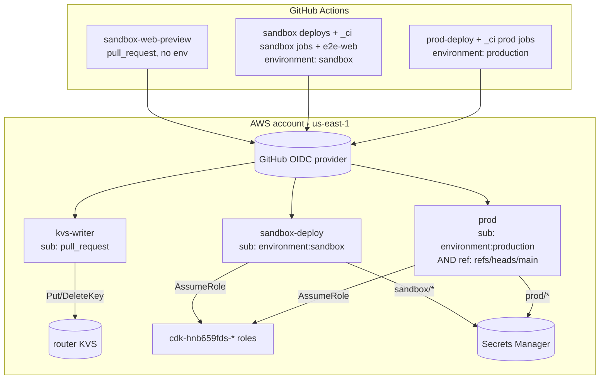
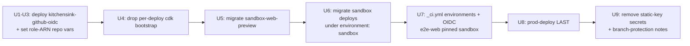

# feat: Migrate GitHub Actions → AWS auth from static keys to OIDC

## Summary

Every GitHub Actions workflow authenticates to AWS with one long-lived static IAM access key that can read both sandbox and prod secrets. This plan stands up a GitHub OIDC trust relationship and **purpose-scoped IAM roles**, then migrates every workflow to short-lived, claim-scoped role assumption, fully closing the static-key boundary documented in `docs/CI_ARCHITECTURE.md`.

**Framing (updated):** this work lands in **PR #39** (`feat/reliable-create-user-flow`), not a separate branch. The app is **not yet live**, so a large PR and a single cutover are acceptable — the elaborate prod-last/soak ceremony of a live system is relaxed. One hard invariant remains regardless of liveness: **a role must exist in AWS before any workflow references it** (assuming a non-existent role ARN fails every run), and CI must keep working for development. So the deploy-before-reference ordering stays; the multi-PR soak does not.

The work is **additive then cutover**: Layer 0 creates the provider + roles (changes nothing until referenced); the workflow migrations swap auth one file at a time; a final unit removes the static keys.

---

## Problem Frame

**Today.** `aws-actions/configure-aws-credentials@v4` is fed static repo secrets in `prod-deploy.yml`, `sandbox-router-deploy.yml`, `sandbox-web-preview.yml`, `sandbox-deploy.yml`, `sandbox-identity-deploy.yml`, and (via the `load-secrets` composite + `secrets: inherit`) the reusable `_ci.yml`. Several workflows already declare `permissions: id-token: write` but never use it (vestigial). The single IAM principal behind those keys can `secretsmanager:GetSecretValue` on both `kitchensink/sandbox/*` and `kitchensink/prod/*` — there is **no AWS-side least-privilege boundary between PR and main runs**, and no OIDC provider exists in the account.

**Why it matters.** A leaked static key (compromised dependency in `npm ci`, a malicious third-party action, a `pull_request_target` misconfiguration) is a *standing* credential — valid until a human rotates it — with cross-stage blast radius. The PR-triggered `sandbox-web-preview.yml` is the most exposed surface yet currently shares the same all-powerful key. (The same-repo `if:` guard added in PR #39 closes the *fork* path for that one workflow but not the standing-credential or least-privilege problems, and not the other PR-triggered workflows.)

**Desired end state.** No static AWS keys in GitHub. Each workflow assumes a role scoped to what it needs, gated by OIDC claim conditions, with prod's direct secret access unreachable from any sandbox/PR run.

---

## Requirements

- **R1** — A GitHub OIDC identity provider for `token.actions.githubusercontent.com` (audience `sts.amazonaws.com`) exists in the AWS account exactly once.
- **R2** — IAM roles are assumable **only** via that provider, gated by claim conditions scoping each role to this repo and the correct trigger (`sub` for repo+environment/event; `ref` for the prod branch binding).
- **R3** — Each role grants the **minimum** permissions its consuming workflows need; the PR-triggered preview writer holds neither deploy nor secrets permissions.
- **R4** — Each deploy role's **direct** `secretsmanager:GetSecretValue` is scoped to its own stage prefix. (Caveat, see KTD3/Risk: the deploy roles assume the CDK bootstrap roles, whose default policy is administrative — so R4 is a *direct-access* guarantee, not an absolute one, for the deploy roles. It is absolute only for the KVS-writer, which assumes no bootstrap role.)
- **R5** — Every workflow migrated drops the static-key block and uses `role-to-assume` + `id-token: write`; the two repo secrets are removed only after the last consumer is migrated.
- **R6** — The cutover never red-lines CI: no workflow references a role before that role exists in AWS; secret-load failures surface loudly (no silent green skips) during the cutover.
- **R7** — Human-gated operational steps (AWS deploy, one-time bootstrap, GitHub Environments, repo variables, fork-token setting, branch-protection) are enumerated with owner and the units they gate.

---

## Key Technical Decisions

### KTD1 — The OIDC provider + roles live in a standalone, stage-independent CDK stack, deployed outside the per-stage `--all` path.

The OIDC provider is **account-global** (one `token.actions.githubusercontent.com` registration per account; CDK's `OpenIdConnectProvider` errors on a duplicate) and IAM roles are global. The existing global app (`packages/infra/global/bin/app.ts`) is **stage-parameterized** and both `prod-deploy.yml` (`STAGE=prod`) and `sandbox-identity-deploy.yml` run `cdk deploy --all` against it. A stage-suffixed provider stack would make the sandbox and prod deploys fight over the same account-global resource.

**Decision:** a new stack `kitchensink-github-oidc` (no stage suffix) in its own app entry `packages/infra/global/bin/github-oidc.ts`, deployed by its own `workflow_dispatch` path — never via `cdk deploy --all`. It contains the provider and **all** roles (roles are global; trust conditions encode the stage). `bin/github-oidc.ts` reads only `CDK_DEFAULT_ACCOUNT` and pins `region: 'us-east-1'` (KTD5) — it must NOT replicate `bin/app.ts`'s `DOMAIN_NAME`/`STAGE` requirements. If a provider already exists out-of-band, the first deploy needs `cdk import` (one-time note in U3).

**Reinforced by ADR 0002 (VPC consolidation, landed in this branch).** That ADR establishes that `cdk deploy --all` on `packages/infra/global` is now **prod-touching** — landing a global change redeploys prod service + webhooks, reruns migrations, and is subject to export-in-use traps, gated by a clean all-stacks `cdk diff`. The separate-app entry keeps the OIDC stack **out of that blast radius**: deploying/redeploying roles never rides the prod-touching `--all`. ⚠️ **Guard: never add the OIDC stack to `bin/app.ts` or the `--all` set** — doing so would couple a routine role tweak to a prod VPC/RDS redeploy.

### KTD2 — Three purpose-scoped roles. The `sub` claim is made deterministic via GitHub Environments.

`docs/CI_ARCHITECTURE.md` proposes two stage roles. We use three so the **PR-triggered** preview writer (most exposed surface) holds neither deploy nor secrets perms. (Still the recommended call; collapsing the first two is a one-policy edit if preferred.)

GitHub only emits `...:environment:<env>` in the OIDC `sub` **when the job declares `environment:` and that environment exists**. Declaring `environment:` makes the `sub` deterministic regardless of trigger (push / pull_request / dispatch all collapse to `environment:<env>`). The KVS-writer deliberately declares **no** environment, so its `sub` is `:pull_request` — distinct from the deploy role's `:environment:sandbox`, so the two can't be confused.

| Role | Consumers | OIDC condition | Permissions |
|------|-----------|----------------|-------------|
| `kitchensink-gha-sandbox-kvs-writer` | `sandbox-web-preview.yml` (PR-triggered, no env) | `sub = repo:radicle-co/KitchenSink:pull_request` | `cloudformation:DescribeStacks` scoped to the router stack ARN + `cloudfront-keyvaluestore:DescribeKeyValueStore`/`PutKey`/`DeleteKey` scoped to `arn:aws:cloudfront::<acct>:key-value-store/*`. **No deploy, no secrets, no AssumeRole.** |
| `kitchensink-gha-sandbox-deploy` | `sandbox-router-deploy.yml`, `sandbox-deploy.yml` (deploy + cleanup), `sandbox-identity-deploy.yml`, `_ci.yml` sandbox jobs | `sub = ...:environment:sandbox` | `sts:AssumeRole` on `cdk-hnb659fds-*`; full ECR push set; `cloudformation:ListExports`/`DescribeStacks`/`DeleteStack`; `cloudfront-keyvaluestore:*` on the KVS; `lambda:InvokeFunction` on `kitchensink-*`; `secretsmanager:GetSecretValue` on `kitchensink/sandbox/*`. |
| `kitchensink-gha-prod` | `prod-deploy.yml`, `_ci.yml` prod jobs | `sub = ...:environment:production` **AND** `ref = refs/heads/main` | Same shape as sandbox-deploy but `secretsmanager` scoped to `kitchensink/prod/*`. |

### KTD3 — Drop the per-deploy `cdk bootstrap`; deploy permissions are bootstrap-role assumption only. Bootstrapping is a one-time human step.

`prod-deploy.yml` and `sandbox-identity-deploy.yml` currently run `npx cdk bootstrap` on **every** deploy. `cdk bootstrap` *creates/updates* the `CDKToolkit` stack (IAM roles, S3 bucket, ECR repo, SSM param) using the **ambient** identity — needing broad `iam:CreateRole`/`PutRolePolicy`/`s3:CreateBucket`/`ssm:PutParameter`/`cloudformation:*` admin. Granting that to the GitHub role would defeat the migration's least-privilege goal.

**Decision:** remove the `cdk bootstrap` step from those workflows (U4). Bootstrap once, out-of-band (runbook), since it rarely changes. The deploy roles then need only `sts:AssumeRole` on the existing `cdk-hnb659fds-{deploy,file-publishing,image-publishing,lookup}-role-*` roles (which hold the deploy privilege) plus the **direct** calls the workflows make outside CDK. CDK also reads the bootstrap-version SSM param `/cdk-bootstrap/hnb659fds/version` — covered via the lookup-role assume.

**Honest privilege ceiling:** the bootstrap deploy role is created by default `cdk bootstrap` with `AdministratorAccess`. So a workflow that can assume it is effectively admin in the account (it could read any secret, prod included). R4's per-stage `secretsmanager` scoping therefore bounds **direct** access only. Tightening this (a least-privilege `cdk bootstrap --cloudformation-execution-policies`) is real follow-up work, listed under Deferred.

### KTD4 — GitHub Environments carry the `environment:` key in `_ci.yml`, never the callers; `e2e-web` is pinned to sandbox.

Environment-scoped `sub` claims require the job to declare `environment:`. Environment protection **cannot be forwarded through `workflow_call`**, so the `environment:` key must live on the secret-using jobs **inside `_ci.yml`** (confirmed: `ci-pr.yml`/`ci-main.yml` are thin callers with `secrets: inherit` and no `environment:`). A `production` environment with a deployment-branch rule (`main` only) complements the AWS-side `ref` condition.

**Cross-stage exception:** `_ci.yml`'s `e2e-web` job **always** loads `stage: sandbox` secrets — even on the `main`/prod pipeline — because `pk_live` can't run on localhost (the documented root cause of past main-CI red). So `e2e-web` must declare `environment: sandbox` and assume the **sandbox** role regardless of pipeline stage, while the rest of the prod pipeline uses `environment: production` + the prod role.

### KTD5 — Deploy the OIDC stack in `us-east-1`.

IAM is global but CloudFormation needs a home region; the identity + router stacks already live in `us-east-1`. Deploy `kitchensink-github-oidc` there.

---

## High-Level Technical Design

### Claim → role mapping (the correctness backbone)

| Workflow / job | Trigger | declares `environment:` | OIDC claim used | Role |
|---|---|---|---|---|
| `sandbox-web-preview.yml` | `pull_request` | **none** | `sub = …:pull_request` | kvs-writer |
| `sandbox-router-deploy.yml` | push `main`, dispatch | `sandbox` | `sub = …:environment:sandbox` | sandbox-deploy |
| `sandbox-deploy.yml` (deploy **and** cleanup jobs) | `pull_request`, dispatch | `sandbox` | `sub = …:environment:sandbox` | sandbox-deploy |
| `sandbox-identity-deploy.yml` | `pull_request`, dispatch | `sandbox` | `sub = …:environment:sandbox` | sandbox-deploy |
| `_ci.yml` build + e2e (sandbox pipeline) | via `ci-pr` (`pull_request`) | `sandbox` | `sub = …:environment:sandbox` | sandbox-deploy |
| `_ci.yml` `e2e-web` (BOTH pipelines) | via `ci-pr` **and** `ci-main` | `sandbox` (pinned) | `sub = …:environment:sandbox` | sandbox-deploy |
| `_ci.yml` (prod pipeline, non-web) + `prod-deploy.yml` | via `ci-main` (push `main`), prod-deploy (push `main`/dispatch) | `production` | `sub = …:environment:production` **+** `ref = refs/heads/main` | prod |

The ordering invariant: **every `role-to-assume` reference is preceded by that role existing in AWS and the `sandbox`/`production` Environments existing**; static-key secrets are deleted only in U9.

---

## Scope Boundaries

**In scope:** OIDC provider + three roles in CDK; removal of per-deploy `cdk bootstrap`; migration of all six AWS-authenticating workflows + the `load-secrets` composite; GitHub Environments (`sandbox`, `production`) + production deployment-branch rule; per-stage direct Secrets Manager scoping; the runbook of human-gated steps. Lands in PR #39.

**Out of scope / non-goals:**
- `claude*.yml` (already `id-token: write`, unrelated to AWS deploy auth).
- Changing what any workflow *does* (build/deploy logic, change-detection) — only how it authenticates, plus removing the bootstrap step.
- Rotating the existing static keys before deletion.

### Deferred to Follow-Up Work
- **Scoped CDK bootstrap execution policy** (`cdk bootstrap --cloudformation-execution-policies <least-priv>`) to close the bootstrap-role admin ceiling noted in KTD3/R4. Material hardening, but independent of this migration.
- A dedicated `oidc-admin` role so the OIDC stack is self-managing in CI post-static-key-deletion. Until then, OIDC-stack changes are human-gated local `cdk deploy` with admin creds (the prod role cannot manage IAM/provider resources).
- The "Not carried over" experimental jobs (iOS/Android Maestro, Test Distribution Metric Gate) noted in `docs/CI_ARCHITECTURE.md`.

---

## Implementation Units

### U1. OIDC provider + role trust constructs (CDK)

**Goal:** `kitchensink-github-oidc` stack with the provider and three roles (trust conditions only; permissions in U2).
**Requirements:** R1, R2.
**Dependencies:** none.
**Files:** `packages/infra/global/lib/github/github-oidc-stack.ts` (create), `packages/infra/global/bin/github-oidc.ts` (create), `packages/infra/global/__tests__/github-oidc-stack.test.ts` (create).
**Approach:** `iam.OpenIdConnectProvider` for `https://token.actions.githubusercontent.com`, client id `sts.amazonaws.com` (thumbprint optional in current CDK — omit).
> Harness note: `packages/infra/global` already has a vitest setup (`vitest.config.ts` includes `__tests__/**/*.test.ts`; `test` script + `vitest` devDep landed with ADR 0002), so the new test file is auto-discovered — no harness wiring needed. Three `iam.Role`s via `OpenIdConnectPrincipal(provider, { … })` with `StringEquals` on `…:aud = sts.amazonaws.com` and the per-role `sub` from KTD2; the **prod** role adds a second `StringEquals` on `…:ref = refs/heads/main`. Add a synthesis-time guard: iterate the roles and `throw`/`Annotations.addError` if any trust doc lacks a `sub` condition (defense-in-depth for out-of-band synths). `CfnOutput` each ARN: export names `kitchensink-github-oidc:SandboxKvsWriterRoleArn`, `:SandboxDeployRoleArn`, `:ProdRoleArn`. No stage suffix anywhere.
**Patterns to follow:** `packages/infra/global/lib/identity/identity-global-stack.ts` (stack shape, props, `CfnOutput` naming); `packages/infra/global/__tests__/network-stack.test.ts` (the now-canonical local CDK assertion pattern — `Template.fromStack(...)` + `hasResourceProperties`/`findResources`).
**Test scenarios (CDK assertions):**
- Exactly one `AWS::IAM::OIDCProvider`, URL `token.actions.githubusercontent.com`, client id `sts.amazonaws.com`.
- For **each** of the three roles: trust `Condition.StringEquals` includes `…:aud = sts.amazonaws.com` (one assertion per role).
- KVS-writer `sub` = `repo:radicle-co/KitchenSink:pull_request`; sandbox-deploy `sub` = `…:environment:sandbox`; prod `sub` = `…:environment:production` **and** trust includes `StringEquals` `…:ref = refs/heads/main` (assert exact strings incl. the `radicle-co/KitchenSink` org prefix — a wrong/missing `sub` or `ref` is a silent trust hole).
- Three role-ARN `CfnOutput`s with the expected export names.
- Synthesis throws if a role trust doc is constructed without a `sub` condition (negative-path guard test).
**Verification:** `npm run synth:oidc` emits the template; assertions green.

### U2. Scoped permission policies for the three roles

**Goal:** Least-privilege policies per KTD2/KTD3, with every direct AWS call the workflows make enumerated.
**Requirements:** R3, R4.
**Dependencies:** U1.
**Files:** `packages/infra/global/lib/github/github-oidc-stack.ts` (modify), `packages/infra/global/__tests__/github-oidc-stack.test.ts` (modify).
**Approach:**
- **KVS-writer:** `cloudformation:DescribeStacks` Resource = `arn:aws:cloudformation:us-east-1:<acct>:stack/kitchensink-sandbox-router-sandbox/*` (NOT `*`); `cloudfront-keyvaluestore:DescribeKeyValueStore`/`PutKey`/`DeleteKey` Resource = `arn:aws:cloudfront::<acct>:key-value-store/*` (router is a singleton — wildcard avoids the cross-app `Fn.importValue` export-lock; do **not** import the router export). Account from `Stack.of(this).account`. No secrets, no `sts:AssumeRole`.
- **sandbox-deploy + prod:** `sts:AssumeRole` on `arn:aws:iam::<acct>:role/cdk-hnb659fds-*`; ECR **full push set** — `ecr:GetAuthorizationToken` (Resource `*`, account-level), and on the repo `BatchCheckLayerAvailability`/`BatchGetImage`/`GetDownloadUrlForLayer`/`InitiateLayerUpload`/`UploadLayerPart`/`CompleteLayerUpload`/`PutImage`/`DescribeRepositories`/`CreateRepository`; `cloudformation:ListExports`/`DescribeStacks`/`DeleteStack` (DeleteStack for `sandbox-deploy.yml`'s cleanup job); `cloudfront-keyvaluestore:DescribeKeyValueStore`/`PutKey`/`DeleteKey` (router-deploy seeds the bypass key); `lambda:InvokeFunction` on `arn:aws:lambda:*:<acct>:function:kitchensink-*` (the migration-runner ARN isn't known at authoring time — name-pattern scope); `secretsmanager:GetSecretValue` on `arn:aws:secretsmanager:*:<acct>:secret:kitchensink/<stage>/*`.
**Test scenarios:**
- KVS-writer has **no** `secretsmanager:*`, **no** `sts:AssumeRole`; its `cloudformation:DescribeStacks` and KVS actions are resource-scoped (not `Resource: *`).
- sandbox-deploy `secretsmanager:GetSecretValue` Resource matches `kitchensink/sandbox/*` and **not** `kitchensink/prod/*`; prod role the inverse.
- Deploy roles' `sts:AssumeRole` Resource is `cdk-hnb659fds-*` only.
- ECR push verbs present on the deploy roles (assert `ecr:PutImage` + `UploadLayerPart` exist).
**Verification:** assertions green; manual `cdk synth` policy diff against the KTD2 table + the per-workflow call audit.

### U3. Deploy wiring for the OIDC stack

**Goal:** Make the OIDC stack deployable by a dedicated, non-`--all` path.
**Requirements:** R1.
**Dependencies:** U1, U2.
**Files:** `packages/infra/global/package.json` (add `synth:oidc`/`deploy:oidc`), `.github/workflows/github-oidc-deploy.yml` (create — `workflow_dispatch` only).
**Approach:** Scripts: `cdk synth/deploy --app 'npx tsx bin/github-oidc.ts'`. The deploy workflow runs `npm ci` with **no prune** (so `tsx` — a devDependency — is present) and uses `npx tsx`; do not copy prod-deploy's `prune` + `node dist/...` shape. Env block carries only `AWS_ACCOUNT_ID`/region (us-east-1); no `DOMAIN_NAME`/`STAGE`. First deploy is authed with the existing static keys (chicken-and-egg). Note the `cdk import` fallback if a provider already exists. Post-static-key-deletion, OIDC-stack changes are human-gated local deploys (see Deferred).
**Test expectation:** none — deploy wiring; covered by U1/U2 synth + the live deploy in the runbook.
**Verification:** `npm run synth:oidc` succeeds; workflow lints.

### U4. Remove the per-deploy `cdk bootstrap` step

**Goal:** Make the narrow deploy-role model (KTD3) valid by dropping the admin-requiring bootstrap step from CI.
**Requirements:** R3.
**Dependencies:** none (independent prep; do before U6/U8 reference the roles).
**Files:** `.github/workflows/prod-deploy.yml` (modify — remove the `CDK Bootstrap` step), `.github/workflows/sandbox-identity-deploy.yml` (modify — same).
**Approach:** Delete the `npx cdk bootstrap …` steps. Bootstrapping becomes a one-time human step (runbook). Leave the `cdk deploy` steps unchanged (they assume the bootstrap roles).
**Test expectation:** none — CI config; proven when a deploy succeeds post-bootstrap without the step.
**Verification:** a sandbox-identity deploy completes without the bootstrap step (account already bootstrapped).

### U5. Migrate `sandbox-web-preview.yml` to the KVS-writer role

**Goal:** PR preview job assumes `kvs-writer` instead of static keys.
**Requirements:** R5, R6.
**Dependencies:** U1–U3 **deployed to AWS** + repo var `AWS_GHA_SANDBOX_KVS_WRITER_ROLE_ARN` set; "send write tokens to fork PRs = OFF" confirmed (runbook).
**Files:** `.github/workflows/sandbox-web-preview.yml` (modify).
**Approach:** Add `permissions: id-token: write` (keep `contents: read`); replace the access-key inputs with `role-to-assume: ${{ vars.AWS_GHA_SANDBOX_KVS_WRITER_ROLE_ARN }}`. **No** `environment:` (PR-triggered → `sub: pull_request`). Keep the same-repo `if:` guard from PR #39 — it is **load-bearing, not defense-in-depth**: the `sub` claim reflects the base repo and cannot itself distinguish a fork, so the guard + the fork-token setting are what gate forks.
**Test expectation:** none — proven by a test PR open/sync/close registering+deregistering the route via OIDC.
**Verification:** the route job authenticates via OIDC and writes/removes `pr-{N}`; no static keys.

### U6. Migrate the sandbox deploy workflows to the sandbox-deploy role

**Goal:** Router deploy, sandbox deploy (incl. cleanup), and sandbox-identity deploy use `sandbox-deploy` under `environment: sandbox`.
**Requirements:** R3, R5, R6.
**Dependencies:** U4 + U5; repo var `AWS_GHA_SANDBOX_DEPLOY_ROLE_ARN` set; **`sandbox` GitHub Environment created** (runbook — must precede this unit, since the `sub` needs it).
**Files:** `.github/workflows/sandbox-router-deploy.yml`, `.github/workflows/sandbox-deploy.yml`, `.github/workflows/sandbox-identity-deploy.yml` (modify).
**Approach:** Per workflow: add `permissions: id-token: write`; `role-to-assume`; add `environment: sandbox` to **every** secret/AWS-using job — including `sandbox-deploy.yml`'s **cleanup** job (else its `sub` is `:pull_request` and it can't assume the role; it also needs `cloudformation:DeleteStack`, covered in U2). These are PR-triggered deploys: either keep them PR-reachable (acceptable — sandbox only, no prod reach) or add the same-repo `if:` guard for parity; **decide and note** (the `sandbox` Environment has no reviewer protection, so any PR author can trigger a sandbox deploy — acceptable for a non-live app, stated explicitly). Audit each workflow's direct calls against U2 (router-deploy: `cloudfront-keyvaluestore put-key`, `cloudformation describe-stacks`; identity-deploy: the prod-deploy call set minus bootstrap).
**Test expectation:** none — proven live per workflow (router via `workflow_dispatch`).
**Verification:** each sandbox deploy completes via OIDC; the router re-seeds `vercel-bypass`.

### U7. GitHub Environments + `_ci.yml` OIDC (sandbox path) + composite re-plumb

**Goal:** Reusable CI's secret-using jobs assume the right role via OIDC; secret-load fails loud.
**Requirements:** R4, R5, R6, KTD4.
**Dependencies:** U6; `sandbox` Environment exists.
**Files:** `.github/workflows/_ci.yml` (modify), `.github/actions/load-secrets/action.yml` (modify), `.github/workflows/ci-pr.yml`/`ci-main.yml` (verify — `environment:` must NOT move to callers).
**Approach:** Re-plumb the `load-secrets` composite: **remove** the `aws-access-key-id`/`aws-secret-access-key` inputs and the `configure-aws-credentials` step from it; move credential configuration into each `_ci.yml` job so the job's `id-token` + `environment` apply, leaving the composite to only read Secrets Manager. Add `permissions: id-token: write` + `environment: { name: <stage> }` + `role-to-assume` (by `stage`: sandbox role for `stage=sandbox`) to **all** secret-using jobs (build, e2e-backend, e2e-mobile, e2e-web, and the matrix — enumerate every call site). **`e2e-web` is special:** it declares `environment: sandbox` and assumes the **sandbox** role on BOTH pipelines (it always loads sandbox secrets — KTD4). **Fail loud:** the per-job secret-load currently uses `continue-on-error: true` + an `outcome == 'success'` gate so fork PRs skip gracefully; for **same-repo** runs, assert the secret step succeeded (or invert `continue-on-error`) so a broken OIDC config red-lines instead of producing a green run that skipped the build. The prod path lands in U8.
**Execution note:** Prove the sandbox path on a PR before touching the prod path.
**Test expectation:** none — proven by a PR run loading `kitchensink/sandbox/identity/keys` via OIDC, with a deliberately-broken role failing the run loudly (manual spot-check).
**Verification:** a PR's `ci / *` jobs load sandbox secrets through the assumed role; `main` still green on static keys.

### U8. Prod role + `prod-deploy.yml` + `_ci.yml` prod path (LAST)

**Goal:** Production deploy + prod CI jobs assume `kitchensink-gha-prod`.
**Requirements:** R4, R5, R6.
**Dependencies:** U7 proven on sandbox; `production` GitHub Environment + deployment-branch rule (`main`); repo var `AWS_GHA_PROD_ROLE_ARN` set (runbook).
**Files:** `.github/workflows/prod-deploy.yml` (modify), `.github/workflows/_ci.yml` (modify — prod path; **extends** U7's `stage`→role-ARN conditional to add the prod role, does not rewrite it).
**Approach:** Add `environment: production` to the prod-deploy job and to `_ci.yml`'s prod-pipeline secret-using jobs — **except `e2e-web`, which stays `environment: sandbox` + sandbox role** (KTD4). Swap to `role-to-assume`. Confirm the prod role covers every direct call in `prod-deploy.yml` (sts, full ECR push, buildx push, cfn list-exports/describe, cdk deploy via bootstrap roles, lambda invoke) — note bootstrap is gone (U4). Verify no "required reviewers" protection is added to `production` that would block `ci-main` test jobs.
**Execution note:** Highest-risk unit — `workflow_dispatch` dry run before relying on a `main` push.
**Test expectation:** none — proven by a `workflow_dispatch` prod deploy then a `main` push.
**Verification:** prod deploy (global/service/webhooks) + DB-migration invoke complete via OIDC; no static keys.

### U9. Decommission static keys + finalize branch protection

**Goal:** Remove the static-key path and align required checks.
**Requirements:** R5.
**Dependencies:** U1–U8 green on OIDC.
**Files:** `.github/workflows/*` (remove residual static-key steps/comments), `docs/CI_ARCHITECTURE.md` (modify — mark the hardening done; correct the R4 caveat + branch-protection notes).
**Approach:** Delete the `AWS_ACCESS_KEY_ID`/`AWS_SECRET_ACCESS_KEY` repo secrets (runbook) only after `grep -r AWS_ACCESS_KEY_ID .github/workflows` is empty. Update the doc: required checks now `ci / <job>`; scope the blocking ruleset to the default branch so feature branches can push; record that R4 is direct-access-only for deploy roles pending the deferred bootstrap-policy work.
**Test expectation:** none — config + docs.
**Verification:** `grep` returns nothing; a PR and a prod deploy both succeed; secrets deleted.

---

## Human-Gated Steps (Runbook)

Owner: repo/AWS admin (Brandon). The **Gates** column maps each step to the units it unblocks.

| # | Step | Gates |
|---|------|-------|
| 1 | Ensure the account is `cdk bootstrap`-ed once in us-east-1 (so U4 can drop the per-deploy bootstrap). | U4, U6, U8 |
| 2 | Deploy `kitchensink-github-oidc` to AWS (`npm run deploy:oidc`; first run uses existing static keys). Capture the three role ARNs. | U5–U8 |
| 3 | Set repo **variables** (not secrets): `AWS_GHA_SANDBOX_KVS_WRITER_ROLE_ARN`, `AWS_GHA_SANDBOX_DEPLOY_ROLE_ARN`, `AWS_GHA_PROD_ROLE_ARN`. | U5–U8 |
| 4 | Confirm repo setting **"Send write tokens to workflows from fork pull requests" = OFF**. | U5 |
| 5 | Create GitHub Environment **`sandbox`** (no protection rules; PR authors can deploy to sandbox — accepted). | U6, U7 |
| 6 | Create GitHub Environment **`production`** with a deployment-branch rule restricting it to `main`; do **not** add required-reviewers (would block `ci-main`). | U8 |
| 7 | After U8 is green: delete the `AWS_ACCESS_KEY_ID`/`AWS_SECRET_ACCESS_KEY` repo secrets; update branch-protection required-check names to `ci / <job>` and scope the blocking ruleset to the default branch. | U9 |

> ⚠️ **Ordering invariant:** never merge a workflow migration (U5–U8) before its role exists in AWS, its repo variable is set, **and** its Environment exists. A `role-to-assume` pointing at a missing ARN — or an `environment:` referencing a missing Environment — fails every run.

---

## Rollback

The app is not live and the static keys stay valid until U9, so rollback is cheap: revert the offending workflow's diff (one commit) — the static-key path returns with no AWS change. The OIDC stack is additive; an unused role is harmless. Point of no return is U9's secret deletion; run it only after a sandbox PR and a prod deploy have both gone green on OIDC. No multi-PR soak is required (not live).

---

## Risk Analysis & Mitigation

| Risk | Likelihood | Impact | Mitigation |
|------|-----------|--------|------------|
| `sub`/`ref` condition wrong or doesn't match a trigger | Med | High (trust hole or every-run failure) | The claim→role table is the backbone; U1 pins exact strings incl. prod `ref`; deterministic `sub` via `environment:`; Environments created before the units that need them (runbook gates). |
| `cdk bootstrap` admin requirement leaks into the role | — | High | KTD3 removes the per-deploy bootstrap (U4); role holds only `AssumeRole` on bootstrap roles. |
| Bootstrap-role chain ≈ admin → R4 not absolute for deploy roles | High | Med | Stated honestly in KTD3/R4; scoped bootstrap execution policy deferred. KVS-writer (PR surface) assumes no bootstrap role, so its isolation is absolute. |
| `continue-on-error` hides broken OIDC as a green skip | Med | High | U7 makes same-repo secret-load fail loud. |
| `e2e-web` can't read sandbox secrets under the prod role | High (if unhandled) | Med | KTD4/U8 pin `e2e-web` to `environment: sandbox` + sandbox role on both pipelines. |
| `Fn.importValue` locks the router export / wrong name | — | Med | U2 wildcard-scopes the KVS instead of importing. |
| PR-triggered sandbox deploys reachable by any PR author | Med | Low (sandbox only, no prod reach; app not live) | Stated decision in U6; optional same-repo guard; no prod path from the sandbox role. |
| Account-global provider collides with a future creator | Low | Med | KTD1 isolates it; `cdk import` fallback noted. |
| In-flight infra work in the same branch edits the same files | Med | Low | PR #39 already carries the VPC consolidation (ADR 0002); the Tailscale plan (003, depends on ADR 0002) also touches `packages/infra/global` + `prod-deploy.yml`/`sandbox-identity-deploy.yml`. This plan's CDK is **additive** (`lib/github/` + `bin/github-oidc.ts` — no overlap with `network-stack.ts`/`data-stack.ts`); only the workflow edits (U4/U6/U8) could conflict line-wise. Land OIDC's workflow edits and Tailscale's in sequence, not interleaved. |

---

## Verification (overall)

- `kitchensink-github-oidc` deployed; three role ARNs in outputs; provider present once.
- Each migrated workflow run shows `Assuming role …` via OIDC and **no** static-key step; a deliberately-broken role red-lines (not green-skips).
- A sandbox PR exercises U5 (KVS write/delete) and U7 (secret load), incl. `e2e-web` reading sandbox secrets.
- A `workflow_dispatch` prod deploy (U8) completes including the DB-migration invoke.
- `grep -r AWS_ACCESS_KEY_ID .github/workflows` is empty; repo secrets removed.

---

## Sources & Research

- `docs/CI_ARCHITECTURE.md` §"To close that" — origin design (two stage roles, Environments, per-stage Secrets Manager, branch-protection notes). This plan implements it, refining 2→3 roles (KTD2) and restoring the prod `ref` binding the draft had dropped.
- Deep-review panel (2026-06-14) — adversarial / feasibility / security-lens / coherence. Corrections folded in: drop per-deploy `cdk bootstrap` (KTD3/U4); wildcard-scope the KVS instead of `Fn.importValue` (U2); deterministic `sub` via Environments + the claim→role table; ECR push-verb + `DeleteStack` + KVS enumeration (U2); prod `ref` binding (U1); `e2e-web` sandbox pin (KTD4); fail-loud secret-load (U7); honest R4/bootstrap-ceiling caveat; runbook gate ordering (Environments before U6).
- `docs/architecture/decisions/0002-vpc-consolidation-and-cidr-scheme.md` — landed in this branch; makes the global `--all` deploy prod-touching, reinforcing KTD1's separate-app isolation. Verified at `dfc90fc` that the VPC-consolidation refactor left `.github/workflows/**`, `bin/app.ts`, and the router stack/`KvsArn` export unchanged, and added the `packages/infra/global` vitest harness this plan's U1 tests reuse.
- Grounded reads: `packages/infra/global/bin/app.ts` (+ `identity-global-stack.ts`) → KTD1; `prod-deploy.yml` / `sandbox-identity-deploy.yml` (per-deploy `cdk bootstrap`, direct call set) → KTD3/U2/U4; `sandbox-router-deploy.yml` / `sandbox-web-preview.yml` (KVS ops, PR-trigger split) → KTD2; `_ci.yml` + `ci-pr`/`ci-main` + `load-secrets/action.yml` (`secrets: inherit`, `continue-on-error`, `e2e-web` sandbox pin) → KTD4/U7.
