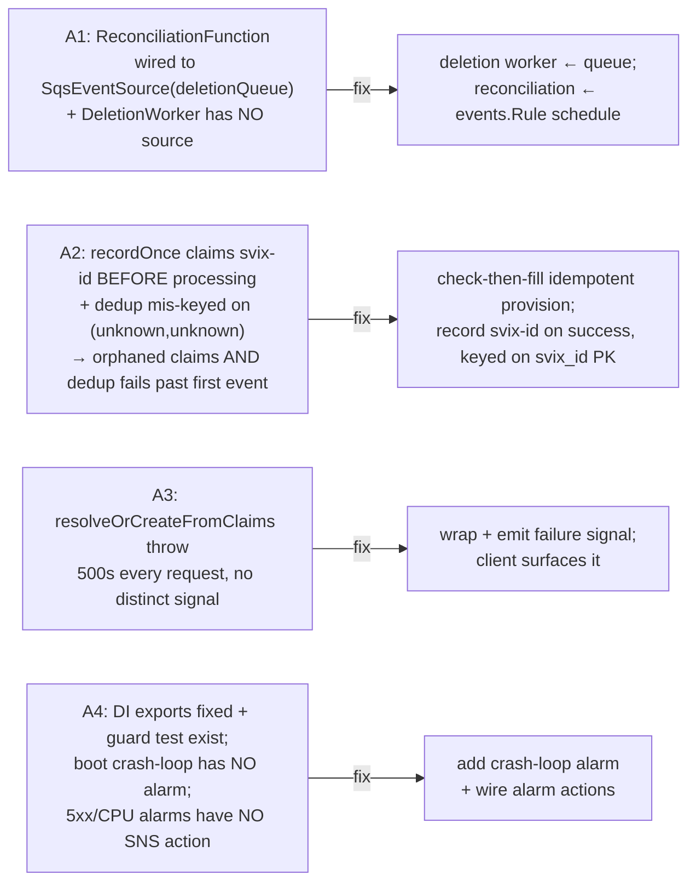

# feat: Auth-flow tracing + reliable user-create fixes

## Summary

Co-scoped initiative on PR #39 (`feat/reliable-create-user-flow`) with two tracks:

- **Track A — reliability fixes** for the user-create flow, born from a real incident where a Clerk signup produced no DB row and nothing reported it: reconciliation Lambda mis-wired (A1), webhook dedup-race drops events permanently (A2), read-through provisioning fails silently (A3), and a NestJS boot crash-loop went unalarmed (A4).
- **Track B — end-to-end tracing** of the signup/auth flow across web, mobile, identity service, and webhooks, so any engineer or agent can reconstruct the flow per user — with an always-on, sampling-proof outcome signal that makes a future silent failure alarmable.

**Key research correction:** the repo's `@sentry/*` v10 SDKs already _are_ OpenTelemetry distributions — standard OTel spans (or `Sentry.startSpan`) are ingested in-process and appear in Sentry Tracing. There is **no separate OTel SDK install and no OTLP collector**; the existing log-forwarder is logs-only and is not on the span path. This delivers the OTel-shaped cross-runtime traces the brainstorm chose with far less infrastructure.

---

## Problem Frame

A signup created a Clerk user but **zero** identity-DB rows, undetected. Both creation paths failed independently (read-through provisioning + webhook backstop) and the Sentry-first observability model had no trace, span, or alarm covering the flow — diagnosis required reading API Gateway access logs and counting response bytes. This plan fixes the defects and builds the observability that would have surfaced them in minutes.

Non-goals (carried from origin): replacing the Sentry-first model; general APM beyond the auth flow; reworking Clerk session-token verification / `azp`/`aud` (PR #39 / ADR-0001 stand).

---

## Requirements Traceability

| Origin ID | Requirement                                                                                                                             | Units                   |
| --------- | --------------------------------------------------------------------------------------------------------------------------------------- | ----------------------- |
| A1        | Reconciliation runs on a schedule; deletion worker consumes the queue                                                                   | U1                      |
| A2        | A webhook hard-failure must not permanently dedup retries                                                                               | U2                      |
| A3        | Read-through provisioning failure raises a distinct, actionable signal                                                                  | U3                      |
| A4        | Boot crash-loop is alarmed; alarm actions actually notify                                                                               | U4                      |
| A5        | Backfill affected user — resolved/moot (user was deleted at user's request; DB at 0)                                                    | —                       |
| B1        | OTel spans via Sentry-native ingestion; console/dev, sampled/deployed; CORS prereq                                                      | U5, U11, U6, U7, U8, U9 |
| B2        | Correlation: sentry-trace on sync path + `clerk.sub` (primary)/`app.user.id` on every root span; span links where both ends owned (SQS) | U5, U6, U7, U8, U9      |
| B3        | Always-on prod outcome signal, independent of trace sampling                                                                            | U11, U6, U7, U10        |
| B4        | Span taxonomy across client → service → webhook → reconciliation                                                                        | U6, U7, U8, U9          |

---

> ## ⚠️ Track B design revision (2026-06-15) — superseded by a simpler `debug:auth` facade
>
> After Phase A shipped, the OpenTelemetry approach below (KTD1–KTD8, U5–U11) was judged **over-engineered** for the actual need: _"send debug information to Sentry that lets us trace the sign-up → DB → auth flow when it breaks."_ Sampling, the force-sample store, distributed-trace correlation, span scrubbers, `tracePropagationTargets`, and the `clerk.sub` retention/DPA question are all OTel-driven complexity that this need does not require.
>
> **Replacement (matches the original brainstorm ask):** a thin, flag-gated `traceAuth(step, attrs)` debug facade, **inlined per backend service** (`identity/src/observability/authTrace.ts`, `identity-webhooks/src/common/authTrace.ts`). A shared `@kitchensink/tracing` package was tried first but exporting raw `.ts` broke the compiled identity Docker runtime (ECS boot crash-loop on a dangling workspace symlink), so the tiny facade is duplicated per-service instead. Flag off → no-op; flag on + local → `console` (via the `debug` package); flag on + deployed → `Sentry.logger`. Gated by `DEBUG_AUTH` (default on in sandbox, off in prod — flip the env var to debug a prod issue). No sampling, no spans, no force-sample store, no trace-header propagation/CORS-for-tracing. Each step carries the Clerk `sub` so a signup's whole flow is filterable. PII (email/name/…) is scrubbed; `sub` is the opaque correlation key.
>
> **Status:** U5 repurposed to the facade; backend instrumentation (service + webhooks) implemented. The OTel-specific units (U6 sampler, U7 span links, U8/U9 `tracePropagationTargets`, U10 outcome metric) are **dropped** — detection of silent failures is already covered by U3 (fail-loud read-through) + U4 (crash-loop alarm) + U1 (scheduled reconciliation). U11's CORS shipped and is kept (harmless). The OTel KTDs/units below are retained for history but are **not the implemented design**.

## Key Technical Decisions

- **KTD1 — Sentry-native span ingestion, no collector.** Emit spans via `Sentry.startSpan`/OTel API; Sentry v10 ingests them in-process. The log-forwarder (`common/otlp.ts`) stays logs-only. Rationale: research confirmed the v10 SDKs bundle `@opentelemetry/*`; a collector is only needed to fan out to a second backend, which we don't. (Confirmed all-four scope decision.)
- **KTD2 — Propagation is `sentry-trace`/`baggage` across an all-Sentry mesh.** The sync path (web/mobile → identity service) stitches via Sentry's headers; W3C `traceparent` is unnecessary inside the mesh. (Deliberate deviation from origin B2's "W3C traceparent" wording — inside an all-Sentry mesh `sentry-trace`/`baggage` carries the trace id + sampled decision, functionally equivalent.) Requires `tracePropagationTargets` to include the identity ALB origin on web + mobile, and **CORS on the identity service — which does not exist today (no `enableCors()`) and must be introduced from scratch (U6)** — to permit `sentry-trace`/`baggage`.
- **KTD3 — Async paths are new root traces, correlated by entity id.** Webhook (Svix) and reconciliation (EventBridge) cannot inherit the sync trace. Stamp **Clerk `sub` as the PRIMARY cross-trace correlation key** (always present, even before provisioning) plus `app.user.id` (ULID) once resolved — querying "user X across traces" keys on `clerk.sub` so a failed/unprovisioned flow (no ULID yet) is still reconstructable. Set `messaging.message.id = svix-id`. Use OTel **span links** only where we own both ends — the SQS deletion path (inject trace context into the message, link in the worker). Inbound trace headers on the public webhook are stripped, not inherited (KTD3 = fresh root; see U7/F10).
- **KTD4 — On-demand prod deep traces via `tracesSampler`, not tail sampling.** Prod keeps a low baseline (existing `0.1`); force-sampling for a specific user is opt-in. **The gate lives inside the sampler/an out-of-band store — NOT in middleware** (G1): the `tracesSampler` runs at span-start via the OTel HTTP instrumentation, _before_ any NestJS middleware, so stripping a client header in `AuthMiddleware` is too late to be a gate. Use an **out-of-band force-sample flag** (a short-TTL entry in SSM/Parameter Store keyed to a Clerk `sub`, set by an admin action) that `tracesSampler` reads — no inbound client header is trusted. (Alternative: have the sampler itself require a verified JWT before honoring any client-supplied debug flag — imperfect, double-verifies.) No collector tier. Failure capture does not depend on this — see KTD5.
- **KTD5 — Detection rides an always-on EMF metric, not trace presence.** Every provisioning flow (read-through + webhook) emits a guaranteed outcome via an EMF→CloudWatch metric (sampling-proof), plus a structured Sentry log, on which a failure-rate + no-data alarm fires. This is the load-bearing anti-regression for B3 — with two caveats it must not paper over: (a) the metric emits _inside_ the request flow, so a boot **crash-loop** (zero requests) is invisible to the failure-rate metric — that case is covered by U4's crash-loop/health alarm and U10's **no-data** alarm (calibrated to prod signup volume), not the failure-rate; (b) `emitMetric` is today a **Lambda-only** EMF helper, so the NestJS/ECS read-through path must have its metric transport defined (U6), not assumed.
- **KTD6 — A2 fix: idempotent merge via atomic upsert + correct dedup.** Make the create/update path fill-only-missing via the **existing atomic `onConflictDoUpdate` on `users.identityId`** (COALESCE-style), NOT a read-then-write — so reprocessing any delivery is safe and concurrent deliveries can't race. Record the svix-id **after** success (no pre-claim to orphan), keyed on the `svix_id` PK, **and drop the `0007` `UNIQUE(identity_id, event_type)` constraint in the same unit** — today `recordOnce` inserts literal `('unknown','unknown')` so that constraint lets only one row ever record; a targeted-on-`svixId` arbiter does not suppress it, so it must be dropped (not just re-targeted). A deterministically-failing payload records the svix-id (non-retryable) to avoid an infinite retry loop; transient failures stay unrecorded for retry. The `user.deleted` path is **enqueue-only** and soft-delete is already idempotent — any added dedup keys on svix-id, never `identityId` (which would break delete→recreate→delete).
- **KTD7 — Tracing constants/helpers live in a new `@kitchensink/tracing` shared package.** `packages/shared/` is wired-but-empty. The package exports SDK-agnostic span/attribute name constants, the `tracesSampler` debug-flag predicate, and the outcome-signal shape — so all four runtimes share vocabulary without coupling to a single `@sentry/*` version (mobile is v8, backends v10).
- **KTD8 — Instrument-before-import ordering.** The NestJS service already preloads Sentry via `node --import ./dist/src/instrument.js` (the ESM hoisting trap from the Sentry rollout). New span setup goes in that preload path, not a top-of-file import.

---

## High-Level Technical Design

Trace topology — one true waterfall on the sync path; entity-id-correlated root traces on the async paths:

```mermaid
flowchart TD
    subgraph sync["Sync path — ONE trace (sentry-trace/baggage)"]
        W["Web / Mobile client span<br/>signup → getToken → fetch /v1/users/me<br/>sets x-debug-trace? → baggage"]
        AM["Identity service: SERVER span<br/>AuthMiddleware → verify(azp/aud) → check-then-fill provision<br/>attrs: clerk.sub (primary), app.user.id, auth.outcome"]
        W -->|sentry-trace + baggage| AM
    end

    subgraph async["Async paths — separate ROOT traces (inbound headers stripped), linked by clerk.sub"]
        WH["Webhook Lambda (SERVER root)<br/>svix verify → check-then-fill → record svix-id on success<br/>attrs: clerk.sub, messaging.message.id=svix-id"]
        RECON["Reconciliation Lambda (root)<br/>per-user drift unit<br/>attr: clerk.sub"]
        DEL["Deletion worker (CONSUMER root)<br/>span LINK ← SQS message trace context<br/>soft-delete already idempotent (dedup on svix-id if any)"]
    end

    AM -. "same clerk.sub<br/>(query: user X across traces)" .-> WH
    AM -. "same clerk.sub" .-> RECON
    WH -->|enqueue delete {identityId} w/ injected ctx| DEL

    AM ==>|always-on EMF metric + Sentry log| OUT["Outcome signal<br/>signup.outcome = created|resolved|failed<br/>→ CloudWatch alarm (failure-rate + no-data)"]
    WH ==> OUT
```

Defect map (Track A), all verified against live code:



---

## Implementation Units

### Phase A — Reliability fixes (Track A)

### U1. Rewire reconciliation to a schedule; deletion worker to the queue (A1)

**Goal:** Reconciliation runs nightly as drift-repair/backfill; the deletion worker actually drains the deletion queue and webhook-driven deletions resolve the right user.
**Requirements:** A1.
**Dependencies:** none.
**Files:** `packages/services/identity-webhooks/infra/lib/WebhooksStack.ts`; `packages/services/identity-webhooks/src/handlers/identityWebhook.ts` (deletion message shape); `packages/services/identity-webhooks/infra/__tests__/WebhooksStack.test.ts` (create if absent); `packages/services/identity-webhooks/src/handlers/__tests__/identityWebhook.test.ts`.
**Approach:** Capture the `DeletionWorkerFunction` in a const and attach `SqsEventSource(deletionQueue, { batchSize: 1 })` to it. Remove that event source from `reconciliationFn`. Add `aws_events`/`aws_events_targets` imports and an `events.Rule` with `Schedule.cron({ minute: '0', hour: '7' })` (nightly, low-traffic UTC; cadence is a tunable — see Open Questions) targeting `reconciliationFn`. Reconciliation handler is already typed `(event: ScheduledEvent)`. **F2 — align the deletion message shape:** the webhook's local `enqueueDeletion` currently sends `{ userId }` but the worker's `parseMessage` reads `identityId`; once the worker actually consumes the queue this silently no-ops every webhook deletion. Send the field the worker reads (`{ identityId: data.id }`) — or unify both producers and the worker on one schema.
**Patterns to follow:** existing Lambda construct definitions in the same file; greenfield for `aws_events` (none in repo today); the identity service's `SqsService.enqueueDeletion` (which already sends `identityId`) as the canonical message shape.
**Test scenarios:** CDK template assertion — exactly one `AWS::Events::Rule` with the cron targeting reconciliation; the SQS event source mapping resolves to the deletion-worker function, not reconciliation; reconciliation has no `AWS::Lambda::EventSourceMapping`. Handler test — the webhook `user.deleted` enqueues a message body carrying the field `parseMessage` reads (`identityId`).
**Verification:** `npm run infra:synth` shows the rule + corrected mappings; a sandbox `user.deleted` deletes the right row (no silent skip).

### U2. Idempotent webhook provisioning + correct dedup (A2)

**Goal:** A hard failure no longer loses an event, AND dedup works past the first event. Reprocessing any delivery is safe.
**Requirements:** A2.
**Dependencies:** none. **U2 must land before U3** (both touch provisioning logic) and before U7.
**Files:** `packages/services/identity-webhooks/src/handlers/identityWebhook.ts`; `packages/services/identity/src/database/dao/webhook-events.dao.ts`; a new migration under `packages/services/identity/src/database/migrations/` (drop the bad constraint); `packages/services/identity-webhooks/src/handlers/__tests__/identityWebhook.test.ts`. **Scope note (G10):** the webhook check-then-fill stays in `identityWebhook.ts` — do **not** edit `resolveOrCreateFromClaims` here (that's U3/A3). If a shared helper is genuinely warranted, extract it into a _new_ file (e.g. `users/provisioning.ts`) and make U3 depend on it; do not co-modify the existing service method.
**Approach:** Four coupled changes:

1. **Idempotent merge as a single atomic upsert (G3).** Make `handleUserCreated`/`handleUserUpdated` fill-only-missing via the **existing atomic `onConflictDoUpdate` on `users.identityId`** (COALESCE-style "keep existing, fill nulls"), mirroring `users.service.ts upsertUserRecord`. Do **not** implement as `findByIdentityId` → branch → `UPDATE` — that read-then-write reintroduces the TOCTOU race the atomic upsert already prevents. This makes reprocessing safe regardless of dedup.
2. **Record svix-id after success.** Move `recordOnce` to after processing completes (no pre-claim to orphan); remove `releaseWebhookEvent` if unreferenced.
3. **Fix the dedup key — and drop the bad constraint (G2).** `recordOnce` inserts literal `('unknown','unknown')` and calls `onConflictDoNothing()` _untargeted_, colliding with migration `0007`'s `UNIQUE(identity_id, event_type)` so only the first-ever event records. Re-key dedup on the `svix_id` PK (`onConflictDoNothing({ target: webhookEvents.svixId })`) **and, in this unit, add a migration dropping `uq_webhook_events_identity_event`** — a targeted arbiter does not suppress the other unique index, so without dropping it the 2nd distinct event raises `unique_violation`. (Validate against the per-stage constraint state — see Open Questions.)
4. **Poison-pill bound (G4).** Because the svix-id is recorded only on success, a _deterministically_-failing payload (e.g. a `setExternalId` 4xx, bad `image_url`) would retry forever and re-fire the failure outcome each cycle. Record the svix-id for **non-retryable (4xx-class/validation) failures** while leaving it unrecorded only for transient (5xx/timeout/deadlock) ones; rely on svix's finite retry schedule + a DLQ/alert for exhausted deliveries.
5. **Delete-path idempotency keyed on svix-id, NOT identityId (G5).** Soft-delete (`softDeleteByIdentityId`) is _already_ idempotent, so an `identityId`-keyed dedup is unnecessary AND harmful — it would dedup a legitimate second delete after a delete→recreate→delete, leaving a Clerk-deleted user live. If any delete dedup is added, key it on the per-event svix-id; otherwise rely on the idempotent soft-delete.
   **Patterns to follow:** `UserDAO.upsertByIdentityId` (already atomic, clears `deletedAt: null` on conflict); the `users.identityId` unique-constraint anchor.
   **Execution note:** Start with failing tests for the dedup-past-first-event bug, the retry-after-failure bug, and the concurrent-create race.
   **Test scenarios:** **Covers the A2 incident.** (1) two **distinct** svix-ids both persist + dedup independently (guards the constraint regression — fails until `uq_webhook_events_identity_event` is dropped); (2) retry of the same svix-id after success dedups; (3) transient throw on first delivery → svix-id not recorded → retry persists; (4) a non-retryable (4xx) payload records the svix-id and does NOT reprocess unboundedly, surfacing a distinct signal; (5) two **truly concurrent** `user.created` (same identityId, distinct svix-ids) → one row, no clobber, no surfaced unique-violation; (6) delete → recreate (`deletedAt` cleared) → second delete must soft-delete again (NOT be deduped).
   **Verification:** the dedup-past-first-event, retry-after-failure, and concurrent-create tests fail on `main` and pass after; reprocessing is observably a no-op/merge; the recreate→delete sequence leaves no live Clerk-deleted user.

### U3. Fail-loud read-through provisioning (A3)

**Goal:** A `resolveOrCreateFromClaims` failure raises a distinct, actionable Sentry signal and does not silently 500 the user with no trace.
**Requirements:** A3.
**Dependencies:** U5 (shared outcome-signal shape) — soft; can inline if U5 lands later.
**Files:** `packages/services/identity/src/auth/middleware/auth.middleware.ts`; `packages/services/identity/src/users/users.service.ts`; `packages/apps/commise/web/src/lib/api-client.ts` (surface 5xx distinctly from the 401→sign-in redirect); tests in `packages/services/identity/tests/auth.middleware.test.ts` and `packages/services/identity/tests/resolveOrCreate.test.ts`.
**Approach:** Wrap the provisioning call so an unexpected failure emits a distinct, named Sentry event (not a bare `Unauthorized`, which `beforeSend` drops) carrying `clerk.sub` and the outcome `failed`, then rethrows as a 5xx. In the web api-client, ensure a 5xx is not swallowed/!=401 redirect — surface an error the page can render. Do not change the placeholder-email / unique-violation healing logic (intentional).
**Patterns to follow:** `createServiceLogger` + `Sentry.logger`/`captureException`; the existing `beforeSend` `Unauthorized`-drop rule (must NOT drop provisioning failures).
**Test scenarios:** provisioning throws an unexpected error → a distinct non-`Unauthorized` signal is emitted with `clerk.sub` and outcome `failed`, request yields 5xx; the known unique-violation path still heals to a placeholder (no error signal); web api-client maps 401→redirect but 5xx→surfaced error (not silent).
**Verification:** a forced provisioning error appears as a named Sentry issue with user context; the web profile page shows an error rather than a blank/redirect loop.

### U4. Boot crash-loop alarm + wire alarm actions (A4)

**Goal:** A NestJS boot/DI crash-loop pages someone; existing alarms actually notify.
**Requirements:** A4.
**Dependencies:** none.
**Files:** `packages/services/identity/infra/lib/IdentityServiceStack.ts`; `packages/services/identity/infra/__tests__/identity-service-stack.test.ts`.
**Approach:** Add a crash-loop/health alarm — e.g. on ECS service `RunningTaskCount` < desired sustained, or unhealthy-host count, or repeated task restarts (pick the metric the platform exposes cleanly; ECS `RunningTaskCount`/`DesiredTaskCount` deviation is the directest boot-loop proxy). Create an SNS topic and attach `addAlarmAction` to the new alarm **and** the two existing actionless alarms (`IdentityAlb5xxAlarm`, `IdentityServiceHighCpuAlarm`). The DI export guard test already exists (`auth.module.test.ts`) — reference it; no new guard test needed.
**Patterns to follow:** the two existing `aws_cloudwatch.Alarm` definitions in the same stack; SNS topic construct.
**Test scenarios:** template asserts the crash-loop alarm exists with the expected metric/threshold; an SNS topic exists; all three alarms have an alarm action. `Test expectation` is infra-synth assertions.
**Verification:** synth shows alarms with actions; a deploy that boot-crashes transitions the alarm to ALARM and notifies.

### Phase B — Tracing foundation + backend (Track B)

### U5. `@kitchensink/tracing` shared conventions package (B1, B2)

**Goal:** One SDK-agnostic source of span/attribute names, the sampler debug-flag predicate, and the outcome-signal shape, usable from all four runtimes despite Sentry v8/v10 skew.
**Requirements:** B1, B2.
**Dependencies:** none.
**Files:** new `packages/shared/tracing/` (package.json `@kitchensink/tracing`, `src/index.ts`, `src/attributes.ts`, `src/sampling.ts`, `src/outcome.ts`, `src/__tests__/`); workspace + tsconfig wiring; consuming packages' deps.
**Approach:** Export const attribute keys (`APP_USER_ID`, `CLERK_SUB`, `AUTH_OUTCOME`, `SIGNUP_STEP`, `SVIX_MESSAGE_ID`, etc.), the canonical span names per B4, an `outcome` enum (`created|resolved|failed`), a **pure** `isForceSampled(sub, forcedSet)` predicate (the I/O of reading the out-of-band force-sample store lives in U6 — the predicate just tests membership, never trusts a client header per G1), and the outcome-record shape both the EMF metric and the Sentry log use. No `@sentry/*` import — runtimes pass these into their own SDK. **F12 — narrowed scope:** this package is constants + predicate + outcome shape only; consolidating the four duplicated `sentryScrubbers.ts` files is deliberately **out** (moved to Deferred-to-Follow-Up) — each runtime keeps extending its own scrubber (F7). A shared denylist _key list_ may live here as a plain const, but the scrubber _logic_ stays per-runtime. **`clerk.sub`/`app.user.id` are deliberately NOT denylisted** — they are the opaque correlation identifiers the whole "trace user X" capability depends on (F8), consistent with the existing `Sentry.setUser({id})`. The denylist targets the genuinely sensitive fields: `email`, `name`, `picture`/avatar URLs, tokens, `authorization`. (The Sentry-DPA question for carrying `sub` is a residual risk, not a scrub.)
**Patterns to follow:** `packages/tools/*` package shape; `@kitchensink/identity-service` subpath export map.
**Test scenarios:** `isForceSampled(sub, forcedSet)` returns true only when `sub` is in the admin-set `forcedSet` and false otherwise (no client-header path exists to bypass it, G1); attribute-name constants are stable (snapshot); the denylist scrubs email/name/picture/token/authorization but **preserves** `clerk.sub`/`app.user.id`.
**Verification:** package builds and is importable from a backend workspace; `npm run build` respects Turbo ordering.

### U11. Identity-service infra prerequisites: CORS + ECS metric transport (B1, B3)

**Goal:** Establish the two infra prerequisites the observability work depends on, as a clean infra-only checkpoint (split from U6 per G8).
**Requirements:** B1 (CORS for cross-origin propagation), B3 (a real metric transport).
**Dependencies:** none. **Precedes U6, U8, U10.**
**Files:** `packages/services/identity/src/main.ts` (CORS); `packages/services/identity/infra/lib/IdentityServiceStack.ts` and/or the ECS log group config (metric extraction); infra `__tests__/`.
**Approach:**

- **F3 — CORS from scratch.** The service has no `enableCors()` today; introduce `app.enableCors({...})` with an origin allowlist reconciled to the ADR-0001 path-routed sandbox origin and `credentials: true` (non-wildcard origin, since the web client uses `credentials: 'include'`; reflect only the known allowlisted origins, never echo arbitrary Origin), then add `sentry-trace`/`baggage` to `allowedHeaders`. Prerequisite for U8.
- **F4 — ECS metric transport.** `emitMetric` is Lambda-only EMF. Confirm the Fargate task's `awslogs` stdout reaches a CloudWatch log group with EMF (`_aws`) metric extraction — or add an explicit metric path — so the read-through outcome metric (U6/U10) actually lands. This is a **gate**: U10's alarms are inert until this is confirmed.
  **Test scenarios:** CORS preflight from the allowlisted web origin succeeds and allows `sentry-trace`/`baggage`; a preflight from a non-allowlisted origin is rejected; an EMF `_aws` blob written to the ECS log group surfaces as a CloudWatch metric (sandbox check or synth assertion on the log/metric wiring).
  **Verification:** sandbox CORS preflight passes for the web origin; a test EMF metric from the running task appears in CloudWatch.

### U6. Identity service tracing + sampler + outcome signal (B1–B4)

**Goal:** The sync read-through path is a true span tree, correlated per user, force-sampleable, and emits the always-on outcome. (Infra prerequisites — CORS + ECS metric transport — are split into **U11**, per G8.)
**Requirements:** B1, B2, B3, B4.
**Dependencies:** U5; **U11** (CORS + metric transport must exist first); relates to U3 (shares the outcome shape).
**Files:** `packages/services/identity/src/instrument.ts` (sampler + span-envelope scrubber hook), `packages/services/identity/src/auth/middleware/auth.middleware.ts`, `packages/services/identity/src/auth/clerkAuth.service.ts`, `packages/services/identity/src/users/users.service.ts`, `packages/services/identity/src/observability/sentryScrubbers.ts`; tests under `packages/services/identity/tests/`.
**Approach:**

- **Spans + sampler.** In `instrument.ts`, set a `tracesSampler` honoring the **out-of-band force-sample store** (KTD4/G1) else the stage baseline. Add manual spans: `auth.verify` (azp/aud as span event), provisioning (branch `created|resolved` as event), DB write. Stamp **`clerk.sub` (primary) + `app.user.id` + `auth.outcome`** on the request root span.
- **F6/G1 — gate force-sample correctly.** The gate is **in the sampler**, not middleware: `tracesSampler` runs at span-start (OTel HTTP instrumentation) _before_ `AuthMiddleware`, so a middleware strip is too late. Read force-sample state from the out-of-band SSM/TTL store keyed to `clerk.sub` (no inbound client header is trusted). A syntactically-valid header from an anonymous client must NOT force sampling.
- **G7 — inbound trace context.** The service inherits inbound `sentry-trace`/`baggage` **by design** for the web/mobile sync waterfall (KTD2), so it is not stripped here; the only security-relevant inbound lever (force-sample) is closed by G1, and plain trace-parent "poisoning" (a junk parent id) is an accepted low-severity residual (trace ids aren't secret). `/health` bypasses `AuthMiddleware` but carries no user attributes, so injection there is inert.
- **F7 — span scrubbing.** Both `beforeSendSpan` (per-span attributes) and `beforeSendTransaction` (per-transaction envelope incl. child spans) exist in Sentry v10.57 — different granularities, not an either/or. Wire `beforeSendSpan` to scrub per-span attributes sourced from user fields (email/name/picture) AND verify `beforeSendTransaction` for any root-span/context PII. `beforeSend`/`beforeSendLog` do **not** cover spans.
  **Patterns to follow:** `Sentry.startSpan` (Sentry v10 = OTel under the hood); `SentryContextMiddleware` (reads request id / sets user); `node --import` preload (KTD8).
  **Test scenarios:** valid-token request → server span with `clerk.sub`/`auth.outcome=resolved` + a child provision span; first-sight request records `created`; a `clerk.sub` flagged in the out-of-band store force-samples (1.0) while an `x-debug-trace` header from any client does **not** (G1); a span envelope carrying an email-derived attribute is scrubbed before transmission (F7).
  **Verification:** sandbox profile load shows a connected web→service trace with user attributes; force-sampling works only via the admin-set store, never a client header.

### U7. Webhook + reconciliation + deletion tracing (B1–B4)

**Goal:** Async paths are root traces correlated to the user, with the webhook emitting the outcome signal and the SQS path span-linked.
**Requirements:** B1, B2, B3, B4.
**Dependencies:** U5; U2 (webhook handler is edited there — sequence U7 after U2); relates to U3 (shares the outcome shape).
**Files:** `packages/services/identity-webhooks/src/handlers/identityWebhook.ts`, `reconciliation.ts`, `deletionWorker.ts`; `packages/services/identity-webhooks/infra/lib/WebhooksStack.ts` (CORS lockdown, G6); `packages/services/identity-webhooks/src/common/observability.ts` (span helpers if needed); `packages/services/identity/src/queue/*` (inject trace context on enqueue); tests in the respective `__tests__/`.
**Approach:** Wrap each handler body in a **fresh root span** — **F10: strip any inbound `sentry-trace`/`baggage` on the public webhook (`AuthorizationType.NONE`) and do not inherit caller-supplied trace context** (a Svix replay/attacker must not poison or join our traces; aligns with KTD3). Stamp **`clerk.sub` (primary)** + `app.user.id` (once known); set `messaging.message.id = svix-id` on the webhook span; record span events for `signature.verified`, `dedup.skip`, provisioning outcome. Webhook emits the same outcome signal as U6 for the webhook path. For deletion: inject Sentry trace context into the SQS message attributes at enqueue, and create a `CONSUMER` span in the worker that **links** to it.

- **G6 — lock down webhook CORS.** The webhook API Gateway currently uses `Cors.ALL_ORIGINS` + wildcard 4xx/5xx gateway responses. It's a server-to-server Svix callback with no legitimate browser caller — remove `defaultCorsPreflightOptions` (let a browser preflight 403) and drop the `*` from the gateway responses. Safe for Svix (server-to-server POST).
- **F11 — metric hygiene (scoped, G9).** The **new** outcome metric uses low-cardinality dimensions only (`outcome`, `path`) — never `identityId`/`clerk.sub`/`app.user.id`, from inception. Remediating the **pre-existing** `UserCreated/Updated/DeletedWebhook` `identityId` dimensions is **deferred** (moved to Follow-Up) pending a check for dashboard/alarm dependencies — not bundled here. Keep `emitMetric` on the EMF→stdout path (KTD5 metrics trap).
  **Patterns to follow:** `withObservability` wrapper; existing `emitMetric`; `resolveRequestId`.
  **Test scenarios:** webhook handler produces a root span with `messaging.message.id=svix-id` and `clerk.sub`, and an inbound `sentry-trace` header does NOT become the span's parent (F10); a successful `user.created` emits the outcome signal `created` with only low-cardinality dimensions (F11); reconciliation per-user work carries `clerk.sub`; deletion worker span links to the injected SQS context; metrics still emit as EMF (not swallowed by Sentry).
  **Verification:** sandbox webhook delivery and a manual reconciliation run show user-attributed traces in Sentry; querying `clerk.sub` surfaces sync + async traces for one user, including a failed/unprovisioned flow.

### Phase C — Clients

### U8. Web (Next.js) tracing + propagation (B1, B2, B4)

**Goal:** Browser + server spans for the signup/profile flow, propagating into the service trace.
**Requirements:** B1, B2, B4.
**Dependencies:** U5; U6 (service must accept the headers / CORS).
**Files:** **modify existing** `packages/apps/commise/web/src/instrumentation.ts` (already exports `register()` + `onRequestError` — preserve them) and `instrumentation-client.ts` (already calls `Sentry.init` with scrubbers/`enableLogs` + `onRouterTransitionStart` — preserve them); `packages/apps/commise/web/src/app/layout.tsx` (surface trace context to browser via `getTraceData`); `packages/apps/commise/web/next.config.ts` if needed; `packages/apps/commise/web/src/lib/api-client.ts` (optional explicit span around `/v1/users/me`); Playwright e2e under `packages/apps/commise/web/e2e/`.
**Approach:** **Extend** the existing `instrumentation.ts`/`instrumentation-client.ts` (do not recreate — both exist and are wired): add `browserTracingIntegration` and `tracePropagationTargets` to include the identity ALB origin so cross-origin calls carry `sentry-trace`, preserving current scrubbers/`enableLogs`/transition hooks. Surface server→browser trace continuity in the root layout. Spans around the authenticated `/v1/users/me` call (the read-through trigger).
**Patterns to follow:** existing `sentry.server.config.ts`/`sentry.edge.config.ts`; Sentry Next.js v10 manual-setup docs.
**Test scenarios:** e2e — a signed-in profile visit issues the `/v1/users/me` call with `sentry-trace`/`baggage` headers present (assert via route interception by header presence, not `data-testid`); the page renders profile data. Unit: `tracePropagationTargets` includes the API origin.
**Verification:** sandbox preview shows a single connected web→service trace per profile load.

### U9. Mobile (Expo/RN) tracing + propagation (B1, B2, B4) — parity

**Goal:** Mobile signup/auth calls participate in the same per-user trace via Sentry RN propagation.
**Requirements:** B1, B2, B4 (cross-platform parity, `CLAUDE.md §14`).
**Dependencies:** U5; U6.
**Files:** `packages/apps/commise/mobile/src/observability/sentry.ts` (enable tracing + `tracePropagationTargets`), `packages/apps/commise/mobile/src/services/api.ts` (span around the authed call), `App.tsx` if wrapping changes; tests under the mobile package's test layout.
**Approach:** Enable `@sentry/react-native` tracing with `tracePropagationTargets` covering the API origin so `sentry-trace`/`baggage` attach to the signup/auth fetch (v8 RN SDK; W3C `traceparent` unconfirmed but unnecessary in an all-Sentry mesh — KTD2). No OTel-RN SDK. Resolve the mobile `azp` question (origin Q3 / PR #39): decode an `@clerk/expo` token's `azp` in sandbox and ensure it's in `CLERK_AUTHORIZED_PARTIES`, else mobile 401s before any trace.
**Patterns to follow:** existing mobile `initSentry()`; `.native.ts` split convention if a platform-specific shim is needed.
**Execution note:** Verify mobile `azp` against the sandbox service first — it gates whether mobile auth works at all.
**Test scenarios:** the authed mobile request attaches `sentry-trace` to the API origin and not to unrelated origins; a unit asserts `tracePropagationTargets`; mobile `azp` decoded value is present in the service's authorized parties (sandbox check, documented).
**Verification:** a sandbox mobile sign-in shows a mobile→service connected trace; mobile auth succeeds (no `azp` 401).

### Phase D — Detection

### U10. Outcome metric + CloudWatch alarms (B3)

**Goal:** A silent provisioning failure is alarmable regardless of trace sampling.
**Requirements:** B3.
**Dependencies:** U6, U7 (they emit the outcome); U4 (SNS topic + action pattern); **U11** (ECS metric transport must be confirmed or these alarms are inert).
**Files:** `packages/services/identity/infra/lib/IdentityServiceStack.ts` and/or `packages/services/identity-webhooks/infra/lib/WebhooksStack.ts` (alarms on the outcome metric); infra `__tests__/`.
**Approach:** Define a CloudWatch alarm on the signup-outcome failure-rate EMF metric, plus a **no-data alarm** catching "signups stopped entirely," wired to the SNS topic from U4. Keep outcome dimensions low-cardinality (`outcome`, `path`) — never `identityId`/`clerk.sub`/`app.user.id` as a metric dimension (F11). **F5 — the no-data alarm is the load-bearing detector for a boot crash-loop** (the failure-rate metric can't see a crash-loop — zero requests means zero failures, not a spike): calibrate its evaluation window/`treatMissingData`/threshold to prod signup volume so an outage is distinguishable from an organic quiet period, and pair it with U4's ECS health/crash-loop alarm. The metric is emitted by U6/U7; this unit defines the alarms.
**Patterns to follow:** U4 alarm + SNS pattern; existing `emitMetric` EMF namespace; the `aws-observability` skill's `treatMissingData`/anomaly guidance.
**Test scenarios:** template asserts a failure-rate alarm AND a no-data/missing-data alarm on the outcome metric, both with an SNS action; dimensions are low-cardinality (no user id); the no-data alarm's `treatMissingData` is set to alarm-on-missing. `Test expectation` is infra-synth assertions.
**Verification:** forcing a provisioning failure drives the failure-rate alarm to ALARM; simulating a signup-traffic gap (crash-loop proxy) drives the no-data alarm to ALARM; both notify.

---

## Scope Boundaries

### Deferred for later (from origin)

- Sign-out and token-refresh-specific tracing.
- Converting prod to always-on verbose traces (revisit after observing sandbox span volume).
- A broader alarm pack beyond U4/U10.

### Deferred to Follow-Up Work (plan-local)

- Consolidate the four duplicated `sentryScrubbers.ts` files into `@kitchensink/tracing` once the shared package is stable (held out of U5 per F12 — each runtime extends its own scrubber for now).
- Remove the inert `expires_at` column once U2 lands (the `0007` `UNIQUE(identity_id, event_type)` constraint is dropped _in_ U2 per G2, not deferred).
- Remediate the pre-existing `UserCreated/Updated/DeletedWebhook` `emitMetric` `identityId` dimensions (PII + cardinality) — after auditing whether any dashboard/alarm depends on that dimension (G9; the new outcome metric is already clean in U7).
- Reconcile `engines: 24.x` in `packages/services/identity-webhooks/package.json` vs the `NODEJS_22_X` Lambda runtime.
- Update `docs/SENTRY_OBSERVABILITY_SETUP.md`: the `clerk/jwks-url` + `issuer` (jose authorizer) entries predate PR #39's `jwt-public-key`/`authorized-parties` service model.
- Seed `docs/solutions/` with the Clerk JIT/idempotency + OTel-across-runtimes learnings (`/ce-compound`).

---

## Risks & Dependencies

- **Span-envelope scrubbing must use the right hook (F7).** `beforeSend`/`beforeSendLog` do not cover spans; U6/U7 must wire `beforeSendSpan` (per-span) + verify `beforeSendTransaction` (per-envelope) — both exist in v10.57 and are distinct granularities — or span attributes ship unscrubbed. Verify spans actually appear in Sentry Tracing in sandbox before prod.
- **CORS is net-new, not an allowlist edit (F3).** The identity service has no `enableCors()` today — **U11** introduces it (origin reconciled to the ADR-0001 path-routed sandbox origin + `credentials`), a prerequisite for U8; otherwise cross-origin web/mobile→service is blocked entirely. The webhook API Gateway's wildcard CORS is separately locked down in U7 (G6).
- **Force-sample gate must live in the sampler, not middleware (G1).** The `tracesSampler` runs before NestJS middleware, so the gate reads an out-of-band admin-set store (SSM/TTL keyed to `clerk.sub`); no inbound client header is trusted. A middleware strip would be a no-op.
- **`clerk.sub` privacy posture (G11) — commit a control, not a residual.** `clerk.sub` is carried on spans/events/logs as the correlation key (deliberate, F8). Because account erasure is a live action, commit: (a) a Sentry data-retention limit (≤90d) on the identity projects, and (b) a `user.deleted` → Sentry purge step (delete-by-`clerk.sub`), OR carry only `app.user.id` (ULID) on Sentry once resolved. Confirm the `radicle-co` Sentry DPA covers processing this identifier.
- **Mobile `azp` (origin Q3)** is the most likely runtime surprise — gates whether mobile auth works at all; resolve in U9 before instrumenting.
- **Sampling head-based limitation** — without a tail-sampling collector (deliberately out, KTD4), an _unsampled_ prod failure won't have a full trace; mitigated because detection rides the always-on outcome metric (KTD5) and the debug-flag force-sample reproduces on demand.
- **Sentry SDK version skew** (mobile v8 vs backend v10) — the shared package stays SDK-agnostic (KTD7) to tolerate it.
- **Sequencing:** U2 before U3 and U7 (provisioning/handler overlap); U5 + U11 before U6/U8; U11 before U10; U4's SNS topic before U10.

---

## Open Questions (planning-time, resolved or deferred to execution)

- **ECS outcome-metric transport** (U11/F4): confirm the Fargate task's `awslogs` stdout reaches a CloudWatch log group with EMF metric extraction, or define an explicit metric path — a hard gate before U10's alarms mean anything.
- **Per-stage `0007` constraint state**: prod schema may never have been fully migrated. If `UNIQUE(identity_id, event_type)` exists in sandbox but not prod, U2's drop-constraint migration must be conditional/idempotent and validated against the actually-applied set per stage.
- **Force-sample store shape** (KTD4/G1): define the out-of-band store (SSM parameter vs a small table), its TTL, the admin action that sets it keyed to `clerk.sub`, and how the sampler reads it cheaply at span-start.
- **`clerk.sub` retention/erasure** (G11): pick (a) Sentry retention ≤90d + `user.deleted`→purge, or (b) ULID-only on Sentry; confirm the `radicle-co` DPA.
- **A4 crash-loop alarm metric** (U4): `RunningTaskCount` vs unhealthy-host vs restart-count — pick at implementation against what ECS exposes cleanly.
- **Reconciliation cadence** (U1): nightly `cron(0 7 * * *)` default; revisit hourly if backfill latency matters now that it's the primary safety net.

---

## Sources & Research

- Origin: `docs/brainstorms/2026-06-15-auth-flow-tracing-and-reliable-user-create-requirements.md`.
- Related: `docs/plans/2026-06-11-001-feat-sentry-observability-rollout-plan.md` (Sentry-first model, ESM instrument-ordering, scrubber denylist, EMF metrics trap, subscription-filter limits); `docs/plans/2026-06-14-001-feat-reliable-create-user-flow-plan.md` (PR #39 auth model, mobile `azp` risk).
- External (load-bearing): Sentry v10 JS SDKs are OpenTelemetry distributions — in-process span ingestion, no collector ([Sentry Node OpenTelemetry](https://docs.sentry.io/platforms/javascript/guides/node/opentelemetry/)); `tracePropagationTargets` defaults to same-origin so cross-origin client→service traces need explicit config + CORS ([trace propagation](https://docs.sentry.io/platforms/javascript/guides/nextjs/tracing/trace-propagation/), [CORS](https://docs.sentry.io/platforms/javascript/tracing/distributed-tracing/dealing-with-cors-issues/)); async correlation by entity attribute + span links ([messaging semconv](https://opentelemetry.io/docs/specs/semconv/messaging/messaging-spans/)); detection via span-derived metrics independent of sampling ([spanmetrics connector](https://github.com/open-telemetry/opentelemetry-collector-contrib/blob/main/connector/spanmetricsconnector/README.md)); Sentry RN propagates `sentry-trace`/`baggage` and stitches with a Sentry backend, W3C `traceparent` on RN unconfirmed ([Sentry RN distributed tracing](https://docs.sentry.io/platforms/react-native/usage/distributed-tracing/)).
- Verified in-repo: migration `0007` `expires_at` is inert; no `aws_events` construct exists; identity service runs Node 24, Lambda Node 22; existing alarms have no SNS action.
