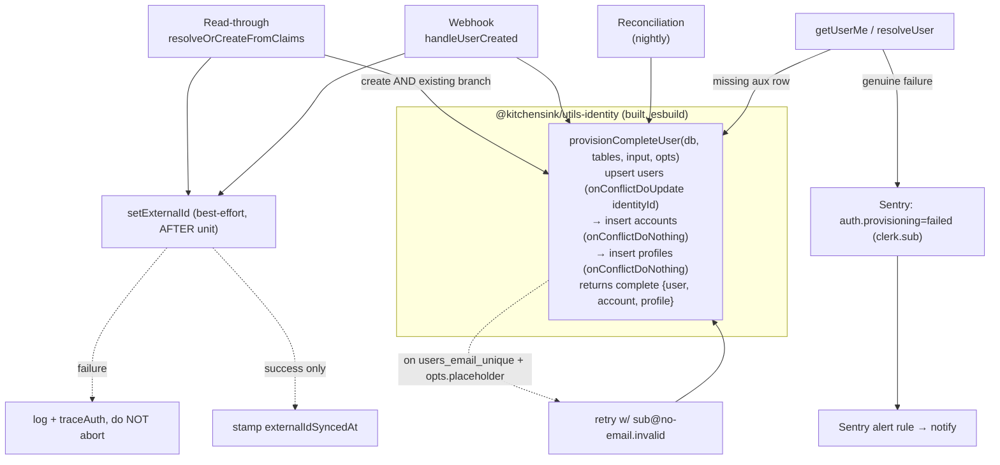
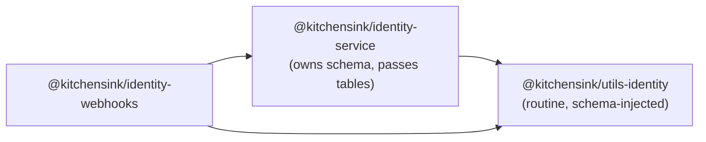

# feat: Bulletproof create-user flow — one provisioning routine + heal-on-read

**Date:** 2026-06-16
**Type:** feat
**Depth:** Deep
**Origin:** `docs/brainstorms/2026-06-16-bulletproof-create-user-flow-requirements.md`

> Folds in refinements confirmed during this session's review of the origin brainstorm: create-branch healing, an explicit page/no-page alarm taxonomy, and qualified-outcome wording. R1's strong "no path may write a bare users row" wording was deliberately kept — the guarantee it expresses is delivered **read-side** via heal-on-read, not write-side atomicity (see KTD5). The brainstorm's "heal the webb.c.brandon record" success criterion is reframed to a synthetic bare-row test — that user has been deleted and no broken users remain.

---

## Summary

Make signup always produce a complete `user + account + profile`, regardless of which path provisions it, with no read ever exposing a half-user and genuine failures that page instead of staying silent. Today the "complete user" invariant is re-implemented by three create paths (read-through, webhook, reconciliation) that disagree; a single shared, idempotent provisioning routine — built into a new `@kitchensink/utils-identity` package both services install — becomes the one place "complete" is defined. Heal-on-read covers both the create and existing-user branches so a transiently-incomplete user self-heals before any read returns. The no-transaction idempotency model is preserved (re-adding a transaction reintroduces the `d59e11c` 40P01 deadlock).

---

## Problem Frame

PR #39 (`docs/plans/2026-06-14-001-feat-reliable-create-user-flow-plan.md`) shipped read-through creation, a webhook backstop, and nightly reconciliation. The 2026-06-16 incident exposed that the invariant was never owned in one place: read-through writes `user+account+profile`; the webhook wrote them but _after_ an external Clerk call that could abort; **reconciliation wrote only the `users` row**. A real user got a bare `users` row from reconciliation, `getUserMe` dereferenced a missing `account`, `/profile` failed, and nothing alerted.

Commit `2b052d3` partially fixed this (a shared `ensureProfileAndAccount` called by webhook + reconciliation; `setExternalId` made best-effort). This plan generalizes those point-fixes into a single owned routine so the _next_ new path cannot reintroduce the bug, closes the heal-on-read gaps, reconciles the read-side asymmetry, and adds the missing failure signal.

**Current-state facts grounding the work** (from Phase 1 research):

- Two divergent helpers exist: `UsersService.ensureAccountAndProfile` (read-through — inserts accounts→profiles, omits `avatarUrl`) and `common/provisioning.ts#ensureProfileAndAccount` (webhook/recon — inserts profiles→accounts, writes `avatarUrl`).
- Read-through's existing-user heal branch checks **only `accounts`**, never `profiles`; its create branch gates aux creation on a `created` flag (`createdAt===updatedAt`) that a concurrent webhook can flip to `false`, skipping aux creation.
- `resolveUser` throws `NotFoundException` (404) on a missing account; `getUserMe` tolerates a missing profile (`displayName ?? ''`). Asymmetric.
- The `@kitchensink/identity-service` subpath exports resolve to **raw `.ts`**; the compiled NestJS Docker runtime (`node dist/main.js`) cannot load raw `.ts` from a workspace dependency — this previously crash-looped the service (why the `auth-trace` facade is duplicated per-service). A shared package must therefore ship **built JS**, not raw `.ts`.
- The webhooks CDK stack has **no alarm/SNS/DLQ infrastructure**; the identity-service stack has `IdentityAlarmTopic` + ALB-5xx / CPU / crash-loop (`healthyHostCount` no-data) alarms.

---

## Requirements

Traceability to origin brainstorm (`R1`–`R6`):

- **R1 — One provisioning routine owns "complete user."** A single idempotent routine creates `user + account + profile`; every path provisions through it; no path writes a bare `users` row. → U1, U2, U4.
- **R2 — Reads never expose a half-user (heal-on-read), both branches.** Create and existing-user branches both guarantee completeness before returning. → U2, U3.
- **R3 — Idempotent + race-safe without a write-time transaction.** Anchored on the `users.identityId` unique index + per-aux `onConflictDoNothing`. → U1, U6.
- **R4 — External side effects best-effort, never gate provisioning.** `setExternalId` runs after the local unit, never aborts it; `externalIdSyncedAt` stamped only on success. → U1, U4.
- **R5 — Genuine provisioning failure is loud (Sentry alert).** A distinct, named Sentry signal (carrying `clerk.sub`, never PII) for genuine failures; the email-collision placeholder fallback does **not** signal. → U5.
- **R6 — Service-side guarantee, both platforms.** The invariant lives in the service/sync paths; web and mobile inherit it. → satisfied structurally by U1–U4 (no client code).

---

## Key Technical Decisions

**KTD1 — Shared routine lives in a new built package `@kitchensink/utils-identity` (`packages/utils/identity`).** Built with **plain `tsc`** (the base tsconfig already sets `declaration: true`) emitting `dist/index.js` + `dist/index.d.ts` — a Node-loadable library; no esbuild bundling (the routine is schema-injected, so it has no heavy deps to bundle, and the shared `@kitchensink/esbuild` library preset emits a dual `dist/browser`+`dist/node` shape that doesn't match a single Node entry). Its committed `package.json` `exports`/`main`/`types` point at `dist/`, **never `src/`** (see KTD2a). Both `@kitchensink/identity-service` and `@kitchensink/identity-webhooks` install it. Shipping **built JS with a dist-pointing manifest** is what avoids the raw-`.ts` Docker crash-loop that killed the prior `packages/shared/tracing` package. _Open call-out:_ the repo's existing shared-package convention is `packages/shared/*` (not `packages/utils/*`); this plan adds a `packages/utils/*` workspace glob per the requested name — redirect to `packages/shared/identity` if preferred.

**KTD2 — The routine is schema-injected to avoid a dependency cycle.** The routine needs the Drizzle `users/accounts/profiles` table objects, which `identity-service` owns. Having `utils-identity` import them back would create a cycle (`identity-service` → `utils-identity` → `identity-service`). Instead the routine receives the tables (and the db handle) as parameters; each caller passes its own schema. Moving the schema itself into the package is **deferred follow-up**, not this plan. _Type-only constraint (enforced, not convention):_ every `@kitchensink/identity-service` import in the new package MUST be `import type` (row types only) — a value import (e.g. importing a table object "for convenience") reintroduces a runtime edge on identity-service and brings back the raw-`.ts` crash class. Enforce with an eslint rule and/or a build-time check that the emitted `dist` contains no runtime `require('@kitchensink/identity-service')`.

**KTD2a — The identity Docker image must physically receive the new package's built output.** Shipping built JS (KTD1) is necessary but not sufficient: the identity image is assembled by an **allowlist** `.dockerignore` that un-ignores only `node_modules` and `packages/services/identity/{node_modules,dist,prod.package.json}`. A bare `@kitchensink/utils-identity` import resolves at runtime through `node_modules/@kitchensink/utils-identity` → a workspace symlink to `packages/utils/identity`, whose `dist/` is **not** copied → `ERR_MODULE_NOT_FOUND` at boot (the exact `@kitchensink/tracing` crash-loop class). The plan's packaging step (U1) must extend the `.dockerignore` allowlist + `Dockerfile` COPY to materialize the package's `dist/` + manifest, and the verification is a **real built-image boot**, not tsx/vitest. Critically, the **manifest copied into the image must resolve `exports`/`main`/`types` to `dist/` JS** — a `src/*.ts` exports map (the `identity-service` dev pattern, which only boots because `docker-prepare.js` rewrites it into a `prod.package.json`) would make Node load raw `.ts` and crash. The new package ships a **static dist-pointing `package.json`** (no `./src` exports), so it needs no prepare-rewrite. (The webhooks Lambda is lower-risk: its esbuild bundle inlines the package at build time, given Turbo builds it first.)

**KTD3 — One routine owns the full unit (user upsert + account + profile), not just the aux rows.** Honors R1's "no path may write a bare users row". The user upsert keeps the existing idempotency anchor (`onConflictDoUpdate` on `users.identityId`) and the load-bearing `emailIsReal` COALESCE guard (a read-through placeholder must never clobber a real value a concurrent webhook wrote).

**KTD4 — Email-collision policy is a routine parameter, not a per-caller re-implementation.** Read-through wants the `${sub}@no-email.invalid` placeholder fallback on a `users_email_unique` violation; the webhook wants to return and let read-through handle it. The routine exposes `onEmailCollision: 'placeholder' | 'signal-incomplete'` so both behaviors come from one place.

**KTD5 — No write-time transaction (hard constraint).** The guarantee is idempotency (KTD3) + heal-on-read (R2), not atomicity. A wrapping transaction held the `users`-row lock across FK-checked aux inserts and deadlocked (40P01) against a concurrent webhook taking `FOR KEY SHARE` in the opposite order — a real production deadlock removed in `d59e11c`. Re-adding it is explicitly out of scope.

**KTD6 — Pick one insert order + include `avatarUrl`.** Consolidating the two helpers, standardize on **user → accounts → profiles** with `avatarUrl` written, `onConflictDoNothing` on both aux rows. (Insert order is immaterial to correctness given no transaction; one order removes the divergence.)

**KTD7 — R5 is Sentry-alert-only (no new AWS infra).** A distinct named Sentry event for genuine failures (extending the existing `auth.provisioning: failed` capture), explicitly **not** a bare `Unauthorized` (Sentry `beforeSend` drops those) and carrying `clerk.sub`/`app.user.id` only (the scrubber denylist strips email/name/picture). A Sentry alert rule fires on it (config + Operational Notes, no CDK). _Accepted limitation:_ a zero-request webhook-Lambda crash-loop sends no event and won't page; the identity **service** already has a CloudWatch crash-loop alarm for its own boot, but the webhook Lambda does not. Recorded as a known gap.

---

## High-Level Technical Design

Provisioning + heal-on-read, after consolidation:



Dependency graph (cycle-free via schema injection):



---

## Output Structure

```
packages/utils/identity/
├── package.json            # @kitchensink/utils-identity; build: tsc -d + esbuild
├── tsconfig.json
├── esbuild config          # via @kitchensink/esbuild
├── src/
│   ├── index.ts            # named exports
│   ├── provisioning.ts     # provisionCompleteUser (schema-injected)
│   └── __tests__/
│       └── provisioning.test.ts
└── dist/                   # built JS + .d.ts (gitignored)
```

---

## Implementation Units

### U1. Create `@kitchensink/utils-identity` with the consolidated provisioning routine

**Goal:** A new built shared package exporting one schema-injected, idempotent `provisionCompleteUser` that creates `user + account + profile` as a unit.
**Requirements:** R1, R3, R4 (codified), KTD1–KTD6.
**Dependencies:** none.
**Files:**

- `packages/utils/identity/package.json`, `tsconfig.json`, esbuild config (mirror `packages/services/identity-webhooks` build: `tsc -p tsconfig.json` for `.d.ts` + esbuild bundle to `dist/`)
- `packages/utils/identity/src/provisioning.ts`, `packages/utils/identity/src/index.ts`
- `packages/utils/identity/src/__tests__/provisioning.test.ts`
- `package.json` (root) — add `packages/utils/*` to `workspaces` (or place the package at `packages/shared/identity` under the existing `packages/shared/*` glob — see Open Questions)
- `.dockerignore` (root) — un-ignore `packages/utils/identity/dist` + its manifest; `packages/services/identity/Dockerfile` — COPY the package's `dist/` to the path the runtime symlink resolves to
- **Build-order chain (do atomically, in order):** (1) add the workspace glob to root `workspaces`; (2) add `@kitchensink/utils-identity` to BOTH consumers' `package.json` deps; (3) `npm install` to create the symlink; (4) confirm `turbo run build --filter=@kitchensink/identity-service --dry` lists `utils-identity` as an upstream `^build` task — the Dockerfile COPY presupposes its `dist/` already exists at image-build time
  **Approach:** Signature shape (directional): `provisionCompleteUser(db, { users, accounts, profiles }, input, { onEmailCollision }) → { user, account, profile }`. Upsert `users` via `onConflictDoUpdate` on `identityId` with the `emailIsReal` COALESCE guard (port from `UsersService.upsertUserRecord`). **The conflict `set` MUST reset `deletedAt: null`** — `UserDAO.upsertByIdentityId` (today's webhook/reconciliation path) does this to revive a re-registered soft-deleted identity; `upsertUserRecord` does NOT, so porting from it without this would silently leave a re-registered user soft-deleted-but-readable (reads don't filter `deletedAt`). On a `users_email_unique` (23505) violation, behave per `onEmailCollision` (`'placeholder'` → retry with `${sub}@no-email.invalid`, `emailIsReal:false`; `'signal-incomplete'` → return a typed result the caller maps to "let another path provision"). Then insert `accounts` then `profiles`, both `onConflictDoNothing`, writing `avatarUrl` (KTD6). No transaction (KTD5). Carry `@implements`/`@sideEffect` JSDoc per repo convention; named exports only; `process.env['…']` bracket notation.
  **Patterns to follow:** `packages/services/identity-webhooks/src/common/provisioning.ts` (idempotent inserts + JSDoc), `packages/services/identity/src/users/users.service.ts#upsertUserRecord` (upsert + email fallback + COALESCE guard), `packages/services/identity-webhooks/package.json` (tsc+esbuild build), `packages/tools/esbuild` (shared esbuild config).
  **Test scenarios** (`provisioning.test.ts`, chainable `buildMockDb` mock per `common/__tests__/provisioning.test.ts`):
- Happy path: inserts users, then accounts, then profiles; `values({...})` carry `avatarUrl`; both aux use `onConflictDoNothing`. Covers R1.
- Idempotent re-call: a second call with the same identityId is a no-op on aux rows (onConflictDoNothing hit), user upsert updates not duplicates.
- Email collision + `onEmailCollision:'placeholder'`: first user insert throws 23505 → retried with `${sub}@no-email.invalid` and `emailIsReal:false`; aux rows still created.
- Email collision + `onEmailCollision:'signal-incomplete'`: returns the incomplete-signal result, does not throw, does not create aux against a foreign user.
- `emailIsReal:false` does not overwrite an existing real email (COALESCE guard).
- Re-provisioning a **soft-deleted** identity (row with `deletedAt` set) → the conflict update resets `deletedAt: null` (row revived), aux rows ensured.
- Null `avatarUrl` accepted.
  **Verification:** Package builds to `dist/` (loadable JS + types); `provisionCompleteUser` is the single definition of "complete user"; unit tests green; the routine _always attempts_ the account+profile inserts after the user upsert (intent-level — a durable bare row is impossible to rule out without a transaction, which KTD5 forbids; the read-side guarantee is U2/U3). **Gate:** the identity service boots successfully from its real built Docker image with the new dependency resolved (per KTD2a) — not just under tsx/vitest.

### U2. Route read-through through the shared routine; heal both branches

**Goal:** `resolveOrCreateFromClaims` provisions via `provisionCompleteUser` on the create branch AND heals via it on the existing-user branch (covering missing `profiles`, not just `accounts`); retire `UsersService.ensureAccountAndProfile`.
**Requirements:** R1, R2, R3.
**Dependencies:** U1.
**Files:** `packages/services/identity/src/users/users.service.ts`; `packages/services/identity/package.json` (add `@kitchensink/utils-identity` dep); `packages/services/identity/src/users/__tests__/users.service.test.ts`.
**Approach:** Import the routine **relatively through the installed package** (so it bundles into `dist/`), pass `this.db as unknown as PostgresJsDatabase` and the service's own schema tables (KTD2 casting convention already used in `resolveUser.ts`). Create branch: call the routine with `onEmailCollision:'placeholder'` (removes the fragile `created`-flag gate). Existing-user branch: keep a **cheap completeness pre-check** — a single `SELECT` for the presence of both the account **and** the profile (today's branch only checks `accounts`, which is why a missing profile never heals) — and call the routine **only when one is missing**. This closes the asymmetry without adding write round-trips to the common warm-user path (the routine's user upsert always churns `updatedAt`, so an unconditional call on every authenticated request is a real hot-path regression — see Risks). Remove `UsersService.ensureAccountAndProfile`.
**Patterns to follow:** existing `resolveOrCreateFromClaims` structure + `traceAuth('provision.*')` calls; `resolveUser.ts` cast convention.
**Test scenarios:**

- New identity (no row) → routine called with placeholder policy → returns complete user; `traceAuth('provision.created')`.
- Existing user missing **profile** only → routine called → profile created (the gap that exists today). Covers R2.
- Existing user missing **account** only → routine called → account created.
- Existing **complete** user → completeness pre-check passes → routine **not** called (single `SELECT`, zero writes, no `updatedAt` churn). Guards the hot-path regression.
- Concurrent webhook won the insert (upsert updates, not inserts) → completeness pre-check finds the missing aux row → routine ensures it (no `created`-flag skip). Covers R2/R3.
  **Verification:** No code path in `users.service.ts` creates aux rows except via the shared routine; both branches heal; existing auth-middleware behavior preserved.

### U3. Reconcile the `getUserMe` / `resolveUser` read asymmetry

**Goal:** A missing aux row never surfaces as a 404 from `getUserMe`; reads tolerate-or-heal symmetrically.
**Requirements:** R2.
**Dependencies:** U1, U2.
**Files:** `packages/services/identity/src/users/resolveUser.ts`, `packages/services/identity/src/users/users.service.ts` (`getUserMe`); their `__tests__`.
**Approach:** Decision: **the heal lives solely in the U2 `AuthMiddleware` path** (the single write site, where the R5 named signal is already attached), which runs before `getUserMe`. So `getUserMe`/`resolveUser` do **not** perform a second write on the hot read path — that would be a redundant write whose failure escapes `AuthMiddleware`'s try/catch and 500s a possibly-complete user _without_ the R5 signal, re-creating the lockout R5 exists to prevent. Instead: make `resolveUser` no longer hard-`NotFoundException` (404) a _live_ user on a missing account — for a present-but-incomplete user (an anomaly post-middleware-heal) emit the R5 named signal (so it pages, not blends into a bare 404) rather than 404ing. Keep the genuine "user truly does not exist" 404 unchanged.
**Test scenarios:**

- Normal case: `AuthMiddleware` (U2) healed first → `/v1/users/me` → 200 complete, `getUserMe` performed no write. Covers R2.
- Present-but-incomplete user reaching `getUserMe` (account missing) → R5 named signal emitted (not a bare 404), request fails loud rather than silent.
- Genuinely unknown userId → still 404 (`User not found`).
- Suspended user → still 403.
  **Verification:** `/v1/users/me` returns a complete profile for any authenticated live user; `getUserMe` adds no write to the hot path; the only 404 is a genuinely absent user; a residual missing-account anomaly pages via R5.

### U4. Route webhook + reconciliation through the shared routine; retire the old helper

**Goal:** `handleUserCreated` and `reconciliation` provision via `provisionCompleteUser`; delete `common/provisioning.ts#ensureProfileAndAccount`; keep `setExternalId` best-effort after the unit (R4).
**Requirements:** R1, R3, R4.
**Dependencies:** U1.
**Files:** `packages/services/identity-webhooks/src/handlers/identityWebhook.ts`, `packages/services/identity-webhooks/src/handlers/reconciliation.ts`, `packages/services/identity-webhooks/src/common/provisioning.ts` (remove), `packages/services/identity-webhooks/package.json` (add dep), the handlers' `__tests__`.
**Approach:** `handleUserCreated`: replace `upsertByIdentityId` + `ensureProfileAndAccount` with one `provisionCompleteUser(..., onEmailCollision:'signal-incomplete')` (preserving today's "email in use by another active identity → return, let read-through handle it" behavior), then best-effort `setExternalId` + `externalIdSyncedAt` (unchanged from `2b052d3`). `reconciliation`: replace the `upsertByIdentityId` + `ensureProfileAndAccount` pair with one routine call per user, using **`onEmailCollision:'placeholder'`** (NOT `signal-incomplete`) — reconciliation is the last-resort backstop for users who never log in, so a collided user must still get a complete placeholder-emailed record rather than be silently skipped. Decide whether a single user's genuine (non-collision) failure signals-and-continues or aborts the run (today a throw aborts the whole run). **Behavior-shift to call out:** the webhook/reconciliation paths use `UserDAO.upsertByIdentityId`, which sets `email` unconditionally on conflict with **no** `emailIsReal`/COALESCE guard **and resets `deletedAt: null`**; routing them through the guarded routine changes the email semantics (now guarded — confirm "a real-email webhook write still wins over a placeholder" holds, U6 scenario 3) and must preserve the `deletedAt: null` revival (KTD3/U1) so a re-registered deleted user is reactivated. Decide whether `UserDAO.upsertByIdentityId` is retired or retained for other callers. **`handleUserUpdated` gap:** it updates `users`/`profiles` but does not ensure aux rows, so a `user.updated` arriving for an identity whose create left a transient bare row would not heal it; route it through (or completeness-guard it with) the routine too — or accept that read-side heal covers it (note in Open Questions).
**Patterns to follow:** existing `handleUserCreated`/`reconciliation` structure and their `vi.mock` hoist tests; `2b052d3` best-effort `setExternalId`.
**Test scenarios:**

- `user.created` → `provisionCompleteUser` called; account+profile created; svix-id recorded after success.
- `user.created` with `setExternalId` throwing → user still complete, handler still 200, `externalIdSyncedAt` not stamped (regression guard from `2b052d3`).
- Email-collision → routine returns incomplete-signal → handler returns without creating aux against a foreign user (no page).
- Reconciliation over a user with a bare row → completed via the routine (the original incident). Covers R1.
- Reconciliation idempotent over already-complete users → no duplicates.
  **Verification:** `common/provisioning.ts` is gone; both handlers provision only via the shared routine; `2b052d3` best-effort semantics preserved.

### U5. Genuine-failure Sentry signal + alert rule (R5)

**Goal:** A distinct, named Sentry signal for genuine provisioning failures (never the expected email-collision fallback), plus a documented Sentry alert rule. No new AWS infra (KTD7).
**Requirements:** R5.
**Dependencies:** U2, U4.
**Files:** `packages/services/identity/src/auth/middleware/auth.middleware.ts`, `packages/services/identity/src/users/users.service.ts`, `packages/services/identity-webhooks/src/handlers/identityWebhook.ts`, `packages/services/identity-webhooks/src/handlers/reconciliation.ts`, both `…/observability/sentry-scrubbers.ts` (apply `scrubText` to error-message values), `packages/services/identity-webhooks/src/common/observability.ts` (if a named helper is added); Operational Notes in this plan + `docs/SENTRY_OBSERVABILITY_SETUP.md`.
**Approach:** Define the page/no-page taxonomy explicitly: **page** = a DB/constraint error that leaves a user incomplete (genuine), surfaced as a named Sentry event carrying `clerk.sub` only (not a bare `Unauthorized` — `beforeSend` drops those). **No page** = email-collision placeholder fallback, idempotent `onConflictDoNothing` no-op, concurrent-path duplicate, `set_external_id_failed`. Ensure the routine's collision path emits `traceAuth`/info, never the error signal. Emit sites — **each needs an explicit tagged capture, because only `auth.middleware.ts` has one today**:

- `auth.middleware.ts` (read-through) — already captures with `tags:{'auth.provisioning':'failed'}`; keep.
- `identityWebhook.ts#handleUserCreated` and `reconciliation.ts` — today an uncaught error auto-captures via `Sentry.wrapHandler` **without** the tag, so the alert rule never fires. Add an explicit `captureException(err, { tags:{'auth.provisioning':'failed'}, contexts:{auth:{clerkSub}} })` on a genuine (non-collision) failure, then rethrow. Reconciliation: decide whether a single user's genuine failure signals-and-continues or aborts the run (today a throw aborts the whole run).
- `users.service.ts#getUserMe`/`resolveUser` (U3) — the present-but-incomplete anomaly path emits the same named signal (U3).

**PII guard (load-bearing):** a Postgres 23505 message embeds the offending value — for `users_email_unique` that is the user's **email**. The Sentry log scrubber only denylists keys + bearer-shaped strings; it does **not** run the email regex (`scrubText`) over arbitrary string attribute values, so `error: err.message` would leak an email into the `identity`/`identity-webhooks` Sentry projects. Wrap every error-message value through `scrubText` (exists in both `…/observability/sentry-scrubbers.ts`) before placing it in a log attribute or capture context. Document the Sentry alert rule (config, not code). Record the webhook-crash-loop blind spot as a known gap (Operational Notes).
**Test scenarios:**

- Genuine DB failure (mock the routine to throw a non-collision error) → distinct `auth.provisioning: failed`-tagged signal emitted with `clerk.sub`, request rethrows — covered at **all three** emit sites (read-through middleware, webhook handler, reconciliation).
- Email-collision fallback → **no** error signal (assert the failed-tag capture/`logger.error` was not called).
- A 23505 error whose message embeds an email (`Key (email)=(user@example.com)`) → the logged/captured error value is **redacted** by `scrubText` (no raw email reaches Sentry).
- Signal payload carries no PII (no email/name/picture), only `clerk.sub`.
  **Test expectation note:** the Sentry _alert rule_ itself is config, verified by documentation/review, not a unit test.
  **Verification:** Genuine failures produce a filterable, PII-free Sentry event; the expected fallback is silent; the taxonomy is written in R5/Operational Notes, not left as an open question.

### U6. Concurrent-create race proof (repeated real-Postgres integration test)

**Goal:** Prove that concurrent webhook + read-through (+ reconciliation) for the same identity converge to exactly one complete user with no deadlock — repeatedly (a single green run does not prove a racy deadlock absent).
**Requirements:** R3.
**Dependencies:** U1, U2, U3, U4.
**Files:** `packages/services/identity/tests/provisioning-race.integration.test.ts` (real Postgres). **Must live under `tests/`** — `vitest.integration.config.ts` includes only `tests/**/*.integration.test.ts` (with `passWithNoTests: true`), so a test under `src/**/__integration__/` would be silently skipped by the real-PG CI job, green-by-absence — defeating the regression proof. Mirrors the existing `packages/services/identity/tests/create-user-flow.integration.test.ts` and the `06-13` plan's concurrent-create test.
**Execution note:** characterization-style — run the concurrent provisioning N times (e.g. ≥ 8 iterations, matching the `d59e11c` validation bar) to surface the racy 40P01 deadlock if it regresses.
**Test scenarios:**

- Fire read-through + webhook provisioning for the same `identityId` concurrently, repeated ≥ 8×: exactly one `users` row, one `accounts`, one `profiles`; no 40P01; no duplicate-key error escapes.
- Add reconciliation into the concurrent set: same invariant holds.
- Placeholder + concurrent real-email webhook: the real email wins (COALESCE guard), no clobber.
- Webhook (real email) racing a read-through for the **same active email already owned by a different identity**, concurrently under real Postgres: assert only **order-invariant** outcomes — exactly one complete user per identity, no clobber, no aux rows created against the foreign user, the real email is never overwritten by a placeholder. Do **not** assert "which caller took the collision branch" (that depends on commit order and would flake under the ≥8-iteration loop).
- _(Separate, sequential — not in the concurrent loop)_ Seed the colliding active email first, then call the webhook (`signal-incomplete`): assert the incomplete-signal branch is taken deterministically. Exercises the guarded-upsert behavior shift (mock unit tests can't prove the 23505 constraint-name match or COALESCE semantics).
- _(Sequential)_ Soft-delete a user, then run webhook/reconciliation provisioning for the same `identityId`: assert the row is revived (`deletedAt: null`) and complete — guards the `deletedAt`-revival behavior (KTD3/U1/U4).
  **Verification:** Repeated runs are green; the test would fail if a write-time transaction were reintroduced (deadlock) or if aux creation were gated on the `created` flag (missing rows).

---

## Scope Boundaries

**In scope:** the single shared routine in `@kitchensink/utils-identity` (U1); routing all three create paths + both read-through branches through it (U2, U4); reconciling the read asymmetry (U3); the R5 Sentry signal + alert (U5); the repeated race proof (U6).

### Deferred to Follow-Up Work

- Migrating the Drizzle **schema** (and other shared/common code — e.g. the duplicated `auth-trace` facade, DAOs) into `@kitchensink/utils-identity`. The package is built to receive it; this plan only schema-injects to stay cycle-free (KTD2).
- Seeding `docs/solutions/` with the Clerk JIT/idempotency + cross-runtime-shared-package learnings (flagged by three prior plans).

### Outside this change

- The **azp / raw-Vercel-host bypass** where read-through is rejected before provisioning runs — a _bypass_, not an _incompleteness_ problem; separate preview-auth brainstorm (ADR-0001).
- Re-adding a write-time transaction around provisioning (KTD5 — the `d59e11c` deadlock).
- New AWS alarm/SNS/DLQ infrastructure for R5 (KTD7 — user chose Sentry-alert-only).
- Evolving the `account` model (teams/billing) — keep the current 1:1 shape.
- An app-wide blocking loading state (rejected in `06-13`).

---

## Risks & Dependencies

- **Cross-runtime package load (high, P0 to verify).** Built JS is necessary but not sufficient — the identity image's **allowlist `.dockerignore`** won't copy the new package's `dist/` unless explicitly added, so a bare `@kitchensink/utils-identity` import resolves to a dangling symlink → `ERR_MODULE_NOT_FOUND` crash-loop (the `packages/shared/tracing` failure class). Mitigation: KTD2a's `.dockerignore` + `Dockerfile` COPY + Turbo build-order, with `exports`/`main` → `dist/` and type imports resolving to `.d.ts`. **Gate (U1 verification): boot the real built Docker image**, not tsx/vitest.
- **Racy deadlock regression (high).** The 40P01 only appears under concurrency; a single green test is insufficient. Mitigation: U6 repeated runs (≥ 8) against real Postgres.
- **Heal-on-read hot-path cost (medium).** Mitigated by U2's cheap completeness pre-check (a single `SELECT`; the routine — whose user upsert always churns `updatedAt` — runs only when an aux row is actually missing), so the warm complete-user path stays a single read, not three write round-trips. Confirm the pre-check is a single combined existence query, not N+1.
- **Workspace glob (low).** Adding `packages/utils/*` (or redirecting to `packages/shared/*`) must be reflected in root `workspaces` and any Turbo/tsconfig path mapping.
- **Dependency:** `2b052d3` best-effort `setExternalId` and the `06-13`/PR #39 substrate must remain intact.

---

## Open Questions (for implementation)

- **Package location:** `packages/utils/identity` (`@kitchensink/utils-identity`, the requested name — needs a new `packages/utils/*` workspace glob) **vs** `packages/shared/identity` (the existing `packages/shared/*` glob, already declared with a `.gitkeep`, where the prior shared package lived — no new glob). Resolve before U1.
- Final exported name/shape of `provisionCompleteUser` and how schema tables are threaded (single `tables` object vs positional) — resolve when wiring the first caller.
- Whether `handleUserUpdated` is routed through / guarded by the routine, or read-side heal is accepted as sufficient for the rare bare-row-then-update case (see U4).
- Whether reconciliation should also retry `setExternalId` for users whose `externalIdSyncedAt` is null (the "left for reconciliation" promise) — small add, decide in U4.
- Exact Turbo build-order/tsconfig wiring for the new package.

---

## Operational Notes

**R5 Sentry alert (config, not code).** Add a Sentry alert rule in the `kitchensink-identity` (and `kitchensink-identity-webhook`) projects that fires on the named provisioning-failure event (tag `auth.provisioning: failed`). The signal carries `clerk.sub`/`app.user.id` only (PII scrubbed). **Known gap (accepted):** a zero-request webhook-Lambda crash-loop emits no event and will not page; the identity _service_ already has a CloudWatch `healthyHostCount` crash-loop alarm for its own boot, but the webhook Lambda has none. Revisit if webhook-side boot failures become a concern (would require the deferred AWS-alarm option).

---

## Sources & Research

- Origin: `docs/brainstorms/2026-06-16-bulletproof-create-user-flow-requirements.md` (+ confirmed `ce-doc-review` refinements D2/D3/F4).
- `docs/plans/2026-06-14-001-feat-reliable-create-user-flow-plan.md` (read-through substrate, idempotency anchor, concurrent-create test template).
- `docs/plans/2026-06-15-001-feat-auth-tracing-user-create-fixes-plan.md` (fail-loud pattern, webhook dedup, reconciliation rewiring).
- `docs/plans/2026-06-11-001-feat-sentry-observability-rollout-plan.md` + `docs/SENTRY_OBSERVABILITY_SETUP.md` (Sentry-first model, PII scrubber, crash-loop blind spot).
- Commits `d59e11c` (transaction-removal / 40P01 deadlock), `2b052d3` (shared helper + best-effort setExternalId).
- `docs/architecture/decisions/0001-sandbox-front-end-addressing.md` (azp boundary — deferred).
- Repo research: two divergent helpers, raw-`.ts` cross-runtime constraint, read asymmetry, no webhooks alarm infra, `node-postgres`-under-`PostgresJsDatabase`-cast convention.
