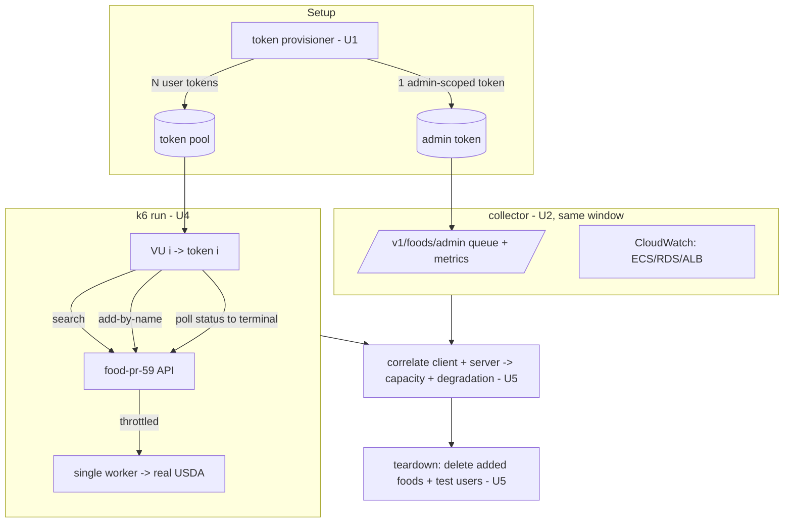

# feat: Food API load-test harness (k6, sandbox pr-59)

## Summary

Build a **k6** load-test harness that drives the live `pr-59` sandbox food API
(`food-pr-59.commise.app`) through the realistic **search → add-by-name → poll-status** journey as a
pool of **distinct Clerk test users**, first _holding_ at the throttle-bound supported rate to prove it
stays healthy, then _ramping_ until the USDA limiter / `fetch_queue` cap saturate — recording the
sustained supported throughput and how the system degrades, correlated with server-side metrics.

The distinct-user **token provisioning is the load-bearing unknown** and is sequenced first as a gated
spike (U1): it resolves the Clerk mechanism against the live sandbox and surfaces the real cost, after
which we decide strict-distinct-users vs. a documented fallback (per user direction: _spike first, then
decide_).

---

## Problem Frame

The food service has never been exercised under concurrent load. With a working sandbox now deployed,
we want one end-to-end run answering: **(1)** does it stay healthy at the realistic supported rate, and
**(2)** what sustained throughput does the deployed config actually support before the throttle
saturates, and does it degrade gracefully? Output is the harness plus a documented capacity number and
degradation characterization (see origin: `docs/brainstorms/2026-07-03-food-api-load-test-requirements.md`).

Constraints established during research that shape this plan:

- **Auth is strict and networkless.** `FoodAuthGuard` → `verifyClerkToken` accepts a JWT only if it is
  signed by the sandbox Clerk key (`CLERK_JWT_KEY`), carries a `sub`, and its `azp` is in
  `CLERK_AUTHORIZED_PARTIES`. Forged headers are ignored — real Clerk-signed tokens are mandatory
  (`packages/shared/clerk-verify/src/clerk-verify.ts`, `packages/services/food-service/src/auth/food-auth.guard.ts`).
- **Scopes come only from `public_metadata`.** The admin observation endpoints require the `food:admin`
  scope (`FOOD_ADMIN_SCOPE`), which must be granted on a user via Clerk `public_metadata` — a
  _separately privileged_ token from the VU pool
  (`packages/services/food-service/src/auth/authenticated-principal.ts`).
- **An `AuthLoadShedder` (FR-052) fronts the guard** and returns `503` under a 401-rate cap
  (`packages/services/food-service/src/auth/auth-load-shedder.ts`). Valid-token traffic should not trip
  it, but the harness must observe and distinguish shedder `503`s from other failures.
- **Ingestion is throttle-bound.** Single worker (FR-022), `FOOD_MAX_QUEUE_DEPTH=25`, USDA
  rolling-window limiter, real paid USDA (~500 foods/hr ceiling). "Max we support" is what we _measure_,
  not a hardware ceiling — no config changes, no break attempt.

---

## Requirements

Carried from origin (FR-IDs are this plan's local trace back to the requirements doc):

| ID      | Requirement                                                                                                                                                  | Units                        |
| ------- | ------------------------------------------------------------------------------------------------------------------------------------------------------------ | ---------------------------- |
| FR-1    | Realistic per-VU journey: search → add-by-name → poll status to terminal, with think-time                                                                    | U4                           |
| FR-2    | Varied food corpus so VUs exercise breadth, not one cache-hit key                                                                                            | U3, U4                       |
| FR-3    | Distinct-user auth: provision N Clerk users + tokens the service accepts (`sub` + allowlisted `azp`); VU _i_ → token _i_                                     | **U0** (unblock), **U1**, U5 |
| FR-4    | Staged profile: baseline → hold-at-target → over-ramp, configurable                                                                                          | U4                           |
| FR-5    | Server-side observation correlated with k6: CloudWatch + food admin endpoints + status-outcome mix                                                           | U2, U5                       |
| FR-6    | Teardown of test users + their added foods                                                                                                                   | U5                           |
| SC-hold | Hold-phase pass bar: read p95 under target, adds return `PENDING` fast, <~1% unexpected 5xx, queue caps at 25 cleanly, recovers to baseline after load drops | U4, U5                       |
| SC-ramp | Deliverable: documented sustained supported throughput + degradation signature at saturation                                                                 | U5                           |

---

## Key Technical Decisions

- **KTD-1 — Token provisioning is a gated spike, sequenced first.** The Clerk mechanism for minting
  service-accepted tokens for _distinct users_ at pool scale is unproven (session JWTs are ~60s-lived;
  per-user sign-in is fiddly). U1 resolves it against the live sandbox and reports cost; the
  strict-vs-fallback fidelity call is made _after_ U1 with evidence, not committed now (see origin
  Outstanding Questions; user direction: spike first).
- **KTD-2 — Separate admin token for observation.** Observation polling of `/v1/foods/admin/*` needs
  `food:admin` scope, granted via Clerk `public_metadata` on one dedicated user — kept out of the VU
  pool so the load traffic stays "ordinary user" shaped.
- **KTD-3 — Real USDA throughout; throttle saturation is the ceiling.** No throttle/worker/config
  changes; the run documents the throttle-bound rate. Rejected alternatives (stub USDA + raise throttles
  to find a hardware knee) carried from origin under Scope Boundaries.
- **KTD-4 — k6 for the load engine.** User-selected. Native support for staged ramps
  (`scenarios`/`stages`), per-VU state (distinct tokens), custom metrics + `thresholds` for pass/fail,
  and think-time. The journey (multi-step with polling) maps cleanly to a k6 default-function iteration.
- **KTD-5 — Observation is out-of-band, correlated by wall-clock window.** k6 emits client-side metrics;
  a separate collector samples the admin endpoints + CloudWatch over the same window. Correlation is by
  timestamp, not by wiring k6 into AWS — keeps the load engine and the observer decoupled.
- **KTD-6 — Harness lives in the repo** under `scripts/loadtest/` (committed, reusable), not a throwaway,
  so the run is repeatable and reviewable.

---

## High-Level Technical Design

Component + sequence shape of one run (directional, not prescriptive):



Staged profile (U4): **baseline** (light, establish healthy reference) → **hold-at-target** (sustain the
supported rate for a fixed duration; assert SC-hold) → **over-ramp** (increase arrival rate past target
until the USDA limiter / queue-25 saturate; record SC-ramp). Peak concurrency is **dozens, not
thousands** — real USDA can't absorb more.

---

## Output Structure

Greenfield harness (implementer may adjust; per-unit `Files` remain authoritative):

```text
scripts/loadtest/
  README.md                     # how to run, prerequisites, safety notes (shared sandbox, USDA burn)
  auth/
    provision-users.mjs         # U1: create N Clerk users + mint service-accepted tokens
    grant-admin.mjs             # U2: grant food:admin via public_metadata to the observer user
  corpus/
    food-queries.json           # U3: curated varied real food queries
  observe/
    collect-metrics.mjs         # U2: poll admin endpoints + CloudWatch over the run window
  journey.js                    # U4: k6 script (search -> add -> poll), staged profile, thresholds
  run.mjs                       # U5: orchestrate setup -> k6 -> collect -> teardown -> report
  config.example.env            # tunables: target host, N, stage rates/durations, thresholds
```

---

## Implementation Units

> **U1 spike finding (2026-07-03) — a hard blocker surfaced before any token work.** The deployed
> `food-pr-59` service has **no `CLERK_JWT_KEY` / `CLERK_AUTHORIZED_PARTIES`** — the food stack never
> wires them (the identity stack does, `identity-service-stack.ts:200`). With no JWT key,
> `verifyClerkToken` fail-closes, so **every `/v1/foods/*` request returns 401 regardless of token**
> (verified: `/health` = 200, `/v1/foods/search` = 401). No token — however minted — can authenticate
> until this is fixed. This is broader than load testing: the per-PR food preview is non-functional for
> all authenticated use. New prerequisite unit **U0** captures the fix; the token spike (U1) is gated
> behind it. The needed SSM params already exist:
> `/kitchensink/sandbox/clerk/jwt-public-key` and `/kitchensink/sandbox/clerk/authorized-parties`
> (= `https://sandbox.commise.app,...` — the `azp` load-test tokens must carry).

### U0. Wire Clerk auth into the food service stack (prerequisite)

- **Goal:** Make the deployed food service able to verify tokens at all — set `CLERK_JWT_KEY` and
  `CLERK_AUTHORIZED_PARTIES` on the food task definitions, mirroring the identity service.
- **Requirements:** FR-3 (prerequisite).
- **Dependencies:** none — must land and redeploy before U1 can be validated.
- **Files:** `packages/services/food-service/infra/lib/food-service-stack.ts`,
  `packages/services/food-service/infra/__tests__/food-service-stack.test.ts`.
- **Approach:** Add both env vars to the API task definition (and the worker/change-refresh defs if they
  authenticate), resolved from SSM exactly as `identity-service-stack.ts:200` does:
  `CLERK_JWT_KEY` ← `/kitchensink/${prod?prod:sandbox}/clerk/jwt-public-key`, `CLERK_AUTHORIZED_PARTIES`
  ← `/kitchensink/${...}/clerk/authorized-parties`. Redeploy `food-pr-59`. This is a food-service infra
  fix that also unblocks the preview for real use, independent of the load test.
- **Patterns to follow:** `packages/services/identity/infra/lib/identity-service-stack.ts` (the exact
  SSM wiring) and its stack tests asserting the env vars exist (`stacks.test.ts:101-106`).
- **Test scenarios:**
    - The synthesized food API task definition carries `CLERK_JWT_KEY` and `CLERK_AUTHORIZED_PARTIES` env
      vars (CDK assertion, mirroring the identity stack test).
    - Post-redeploy smoke: a validly minted sandbox token returns `200` from `/v1/foods/search` (this is
      the U1 success criterion — U0 is done when U1 can pass).
    - `Covers FR-3 (prerequisite).`
- **Verification:** `food-pr-59` redeployed; a real sandbox token authenticates (no longer a blanket 401).

### U1. Clerk token-provisioning spike (gated)

- **Goal:** Prove — against the live sandbox Clerk instance and the deployed `food-pr-59` service — that
  we can mint tokens the service _accepts_ (`sub` present, `azp` ∈ `CLERK_AUTHORIZED_PARTIES`) for
  **distinct users**, and characterize the cost (TTL, refresh, per-user setup) so the strict-vs-fallback
  call can be made with evidence.
- **Requirements:** FR-3.
- **Dependencies:** **U0** (the service must have a Clerk key before any token can be accepted).
- **Files:** `scripts/loadtest/auth/provision-users.mjs`, `scripts/loadtest/README.md` (findings +
  chosen mechanism).
- **Approach:** Use the Clerk backend API (sandbox secret key) to create test users. Evaluate, in order,
  the mechanism that yields a service-accepted token with correct `azp`: (a) sign-in-token → Frontend-API
  exchange → session token (`session.getToken`), including refresh handling for the ~60s TTL; (b) a
  long-lived JWT-template token if the instance allows a custom lifetime; (c) the M2M/`azp`-allowlisted
  path (FR-047) as a distinct-request-but-shared-`sub` fallback. Confirm end-to-end by calling
  `GET https://food-pr-59.commise.app/v1/foods/search?...` with a minted token and asserting `200` (not
  `401`). Record the working mechanism, the per-user + refresh cost, and a recommendation.
- **Patterns to follow:** token-verification contract in `packages/shared/clerk-verify/src/clerk-verify.ts`
  (what the service checks); existing test token shape in
  `packages/services/food-service/tests/support/jwt.ts` (claim structure only — those self-signed keys do
  **not** work against the deployed instance).
- **Execution note:** Spike — validate against the live sandbox before any k6 work is built on top; this
  unit ends at a **decision point** (strict distinct-users vs. documented fallback).
- **Spike result (2026-07-03 — RESOLVED, decision made):** mechanism proven end-to-end. Per user+token:
  `POST /users` (instance requires `username`/`first_name`/`last_name`) → `POST /sign_in_tokens` →
  `POST /v1/dev_browser` → `POST /v1/client/sign_ins` (ticket) → `POST /sessions/{id}/tokens`. ~5 calls,
  ~5 s/user. The token carries `sub` + `azp=https://sandbox.commise.app` (set via the **`Origin` header**
  to FAPI) and passes `verifyToken` with the food-guard config (ACCEPTED). **TTL = 60 s** → refresh with a
  single `POST /sessions/{id}/tokens` (retained client cookie, no re-login), ~1 call/user/min. **Decision:
  strict distinct-users is feasible; no fallback needed.** The real FAPI is **`nice-fowl-6.clerk.accounts.dev`**
  (the issuer SSM value `clerk.sandbox.thesouschef.app` does not resolve — separate loose end).
- **Test scenarios:**
    - Happy path: a freshly minted user token returns `200` from `/v1/foods/search` on `food-pr-59`.
    - Edge: a token with a non-allowlisted `azp` (or missing `azp`) is rejected `401` — confirms the
      allowlist is actually enforced and our `azp` is correct.
    - Edge: token near/after TTL expiry → confirm the refresh path yields a fresh accepted token.
    - `Covers FR-3.`
- **Verification:** README documents the chosen mechanism + measured cost; a one-off provision of ≥2
  distinct users each yields a `200`-returning token; the strict-vs-fallback recommendation is written.
- **Post-U0 live check (2026-07-03):** with U0 deployed, a minted token is **accepted** — `/v1/foods/search`
  no longer `401`s (auth confirmed end-to-end). It now returns **500**: a _third_ latent deploy bug — the
  food DB connection uses `?sslmode=require`, which the current `pg`/`pg-connection-string` treats as
  `verify-full`, so the untrusted Amazon RDS CA fails (`SELF_SIGNED_CERT_IN_CHAIN`) and **every DB query
  500s**. Identity uses the identical connection code (likely latently affected). Captured as new unit
  **U0b** below. (Meta: the food service had never run end-to-end in a deployed env — this spike peeled
  back three successive blockers: no image → no Clerk key → no DB TLS trust.)

### U0b. Fix food DB TLS trust (prerequisite, discovered post-U0)

- **Goal:** Make DB queries succeed against RDS — the connection must establish TLS the current pg driver
  accepts (trust the Amazon RDS CA, or use `no-verify` for encrypt-without-hostname-verify inside the VPC).
- **Requirements:** prerequisite for any DB-backed endpoint (search/add/poll — i.e. the whole load test).
- **Dependencies:** none (independent of U0/U1; both must be true for a `200`).
- **Files:** `packages/services/food-service/src/database/database.module.ts` (and the identical
  `packages/services/identity/src/database/database.module.ts` if the shared fix is adopted).
- **Approach:** Either (a) bundle + trust the RDS CA (`NODE_EXTRA_CA_CERTS` / `ssl: { ca }`) — verifies the
  server, most correct; or (b) `sslmode=no-verify` / `ssl: { rejectUnauthorized: false }` — encrypt only,
  acceptable within the VPC, one-line. Decide whether to fix food alone or extract a shared DB-SSL helper
  since identity shares the code. Redeploy and re-confirm the `200`.
- **Root cause (confirmed by reading `node_modules/pg-connection-string@2.13.0`):** its default
  (non-libpq) branch sets `config.ssl = {}` for `sslmode=require` but **never** sets `rejectUnauthorized`,
  so it defaults to `true` and rejects the untrusted RDS CA. `sslmode=no-verify` is the one token that
  explicitly sets `ssl.rejectUnauthorized = false`. (Earlier "treats as verify-full" was imprecise — the
  effect is the same, but the mechanism is the empty-ssl-object default, not a verify-full mapping.)
- **Decision — option (b), no new package.** The fix is now a single connection-string token, so the two
  services stay in sync by an identical one-liner + cross-referencing comment rather than a shared runtime
  package (there is none between services today; a package for one token is over-abstraction).
- **Fix applied (2026-07-03, code done — pending redeploy verification):** `sslmode=require` →
  `sslmode=no-verify` in **all four** RDS connection builders:
  `food-service/src/database/database.module.ts`, `food-service/src/worker/main.ts`,
  `food-service/src/worker/change-refresh/main.ts` (the sync + change-refresh workers were latently
  broken too), and `identity/src/database/database.module.ts` (defuses the identical latent bug — no prod
  redeploy is triggered by this PR, so it simply takes effect on identity's next deploy). Local dev is
  unaffected: it uses the `DATABASE_URL` branch, which is untouched. Both packages typecheck clean.
- **Test scenarios:** a deployed API request that hits the DB (`/v1/foods/search`) returns `200`, not a
  `SELF_SIGNED_CERT_IN_CHAIN` `500`; the connection is still TLS (not plaintext).
- **Verification:** minted-token `GET /v1/foods/search` on `food-pr-59` returns `200`. **✅ RESOLVED
  (2026-07-04).**
- **Resolution — the DB layer needed more than TLS (superseded by IAM auth).** The `no-verify` change
  fixed TLS, but re-running the check then surfaced three more deployed-only defects the load test would
  have hit: (1) `food_app`'s password was never applied to the role (the generated secret was never
  synced — the bootstrap that should have done it was never wired), (2) the food-db-bootstrap **and**
  migrate lambdas were silently shipping as inline no-op placeholders on CI's compiled-dist deploys (an
  `import.meta.url` asset-path bug in the `lib/platform/` and `infra/lib/` stacks), so `food_app` and the
  per-PR database were never created. Rather than sync a password, the food DB moved to **RDS IAM auth**
  (no password anywhere; token minted per connection), with a master-connected bootstrap custom resource
  provisioning `food_app` + `rds_iam` + the base DB, and the asset-path bugs fixed. TLS is still on
  (`rejectUnauthorized: false`) — IAM auth requires it. See `src/database/pool-config.ts`,
  `packages/infra/global/.../data-stack.ts` + `food-db-bootstrap/`. `GET /v1/foods/search → 200` confirmed
  end-to-end on `food-pr-59`. **The whole DB-backed surface the load test exercises is now unblocked.**

### U2. Admin observation token + server-side metric collector

- **Goal:** Grant `food:admin` to one dedicated observer user and build an out-of-band collector that
  samples the admin endpoints and CloudWatch over a run window.
- **Requirements:** FR-5.
- **Dependencies:** U1 (reuses the token mechanism for the observer user).
- **Files:** `scripts/loadtest/auth/grant-admin.mjs`, `scripts/loadtest/observe/collect-metrics.mjs`.
- **Approach:** `grant-admin.mjs` sets `public_metadata.scopes = ["food:admin"]` on the observer user via
  the Clerk backend API, then mints its token (U1 mechanism). `collect-metrics.mjs` polls
  `GET /v1/foods/admin/queue` and `GET /v1/foods/admin/metrics` on an interval, and pulls CloudWatch for
  the pr-59 ECS service (CPU/mem), the shared RDS instance (CPU/connections), and the shared ALB (5xx /
  target 5xx), writing a timestamped series for correlation.
- **Patterns to follow:** admin surface in
  `packages/services/food-service/src/foods/admin/foods-admin.controller.ts`; the AWS CLI/metrics access
  already used in this repo's ops flows.
- **Test scenarios:**
    - Happy path: the observer token returns `200` (not `403`) from `/v1/foods/admin/queue`, proving the
      `food:admin` grant took effect.
    - Edge: a non-admin VU token gets `403` from the admin endpoint (confirms scope isolation).
    - `Covers FR-5.`
- **Verification:** a short sample run produces a timestamped series combining queue depth, admin metrics,
  and CloudWatch data points.

### U3. Food-query corpus

- **Goal:** A curated set of varied real food queries plus a selection strategy so VUs exercise breadth.
- **Requirements:** FR-2.
- **Dependencies:** none.
- **Files:** `scripts/loadtest/corpus/food-queries.json`, plus a small picker in `journey.js` (U4).
- **Approach:** Curate ~100 common, real food names spanning branded and generic (e.g. cheddar cheese,
  banana, chicken breast, greek yogurt) — items likely to resolve through USDA so the add→poll path
  reaches terminal states. Selection distributes queries across VUs/iterations (e.g. index by
  `__VU`/`__ITER`) to avoid every VU hitting one key (which would test cache/dedup, not breadth).
- **Test scenarios:**
    - Happy path: the picker returns distinct queries across a sweep of `(VU, iter)` inputs (spread, not a
      single constant).
    - Edge: wrap-around when iterations exceed corpus size returns valid entries (no undefined).
    - `Covers FR-2.`
- **Verification:** unit check of the picker's spread; corpus entries are real USDA-resolvable terms.

### U4. k6 journey script + staged profile

- **Goal:** The core k6 script: per-VU realistic journey, staged ramp, per-VU distinct token, custom
  metrics + thresholds, with auth-load-shedder `503`s tagged distinctly.
- **Requirements:** FR-1, FR-2, FR-4, SC-hold.
- **Dependencies:** U1 (token pool), U3 (corpus).
- **Files:** `scripts/loadtest/journey.js`, `scripts/loadtest/config.example.env`.
- **Approach:** Each iteration: `search` a corpus query → `add-by-name` (`POST /v1/foods`) → poll
  `GET /v1/foods/:id/status` until terminal (`RESOLVED`/`UNRESOLVED`/`NOT_FOUND`) or a bounded timeout,
  with think-time between steps. VU _i_ sends token _i_ from the pool (loaded via `setup()` / env). Define
  `scenarios` with `stages`: baseline → hold-at-target → over-ramp (durations/rates from env). Custom
  `Trend`/`Rate` metrics per step (search latency, add-accept latency, poll-to-terminal time, status-mix)
  and a distinct counter/tag for `503`s attributable to the auth load-shedder vs. other 5xx. Encode
  SC-hold as k6 `thresholds` (tunable defaults; final numbers set at run time).
- **Patterns to follow:** the journey semantics proven in
  `packages/services/food-service/tests/e2e/usda-adapter-http-contract.e2e.test.ts` and the
  `@kitchensink/food-service-client` request shapes.
- **Test scenarios:**
    - Smoke: a 1-VU / short run completes a full search→add→poll iteration against `food-pr-59` with no
      script errors and populated custom metrics.
    - Behavior: the shedder-`503` tag increments only on shedder responses, not on ordinary 4xx/2xx.
    - Behavior: `thresholds` fail the run when a metric breaches (validate with an intentionally tight
      threshold on the smoke run).
    - `Covers FR-1 / FR-4.`
- **Verification:** the smoke run passes and emits the full metric set; thresholds demonstrably gate
  pass/fail.

### U5. Orchestration, run report, and teardown

- **Goal:** Tie setup → k6 → observation → report → teardown into one repeatable run that produces the
  capacity + degradation deliverable and cleans up.
- **Requirements:** FR-3, FR-5, FR-6, SC-hold, SC-ramp.
- **Dependencies:** U1, U2, U3, U4.
- **Files:** `scripts/loadtest/run.mjs`, `scripts/loadtest/README.md`.
- **Approach:** `run.mjs` orchestrates: provision the token pool (U1) + observer token (U2), launch the
  collector (U2) and the k6 run (U4) over a shared window, then merge k6 summary output with the
  server-side series into a run report — sustained supported throughput (adds/hr, read req/s), the
  degradation signature (how excess adds are shed: clear rejections / `UNRESOLVED` vs. 5xx, queue
  behavior at the cap, recovery time), and the SC-hold pass/fail. Teardown deletes the foods added during
  the run (per-PR DB) and the provisioned Clerk users (shared sandbox instance). Guard against the nightly
  shutdown window (run 09:00–24:00 ET).
- **Patterns to follow:** admin metrics for queue/lifecycle signals (U2); origin risk notes for the
  shared-sandbox + USDA-quota safety framing (put in README).
- **Test scenarios:**
    - Happy path: a full low-VU dry run produces a report file containing both client and server series and
      a pass/fail verdict.
    - Integration: teardown actually removes the run's added foods and the provisioned users (re-query
      returns none; users deleted in Clerk).
    - Error path: if k6 exits non-zero (threshold breach), the report still generates and teardown still
      runs (no orphaned test users/foods).
    - `Covers FR-6 / SC-ramp.`
- **Verification:** end-to-end dry run yields a correlated report and leaves no residual test users or
  foods.

---

## Scope Boundaries

**In scope:** the k6 harness, distinct-user token provisioning (spike-gated), the `food:admin`
observation path, the food-query corpus, out-of-band server-side metric correlation, the run report
(capacity + degradation), and teardown.

**Rejected alternatives (carried from origin — deliberately not doing):**

- Stubbed-USDA infra-breakpoint test (would find the hardware ceiling but requires intercepting USDA +
  raising throttles — throttle-bound reality is the point).
- Raising throttles / scaling the worker (diverges from the as-deployed config under test).
- Read-path-only breakpoint (valid separate test; not what "requesting food items" asks for here).

### Deferred to Follow-Up Work

- Prod load testing (numbers here are `db.t4g.micro` + Spot, not prod).
- Wiring the harness into CI as a recurring performance gate.
- A read-path saturation test on a seeded catalog (the other, USDA-free capacity question).

---

## Risks & Dependencies

- **R1 — Token mechanism (load-bearing).** Distinct-user service-accepted tokens at pool scale may be
  costly (TTL refresh, per-user sign-in). Mitigation: U1 spike gates the rest; strict-vs-fallback decided
  on evidence.
- **R2 — Shared-sandbox blast radius.** The ramp loads the shared sandbox RDS (`db.t4g.micro`, co-tenant
  with other PR previews) and burns the shared sandbox USDA key's hourly quota — can briefly degrade other
  previews / exhaust the key. Bounded (no break attempt). Mitigation: run off-peak, cap peak VUs, document
  in README.
- **R3 — Auth load-shedder confound (FR-052).** A burst could trip the shedder and surface `503`s that
  look like failures. Mitigation: tag shedder `503`s distinctly (U4) and interpret them as a deliberate
  defense, not a fault.
- **R4 — Representativeness.** The measured ceiling reflects `t4g.micro` + Spot, not prod — treat as a
  lower-bound smoke signal (README).
- **Dependency:** live `food-pr-59` sandbox (deployed and healthy), Clerk sandbox secret key + backend
  API access, AWS CloudWatch read access, k6 installed on the run host.

---

## Open Questions (resolve at execution)

- Exact SC-hold thresholds (read p95, add-accept latency, 5xx budget, recovery window) — set from the
  baseline phase's observed healthy reference.
- Concrete `N` (pool size / peak VUs) and stage durations/arrival rates — sized from U1's token cost and
  the ~500 foods/hr USDA ceiling.
- Final token mechanism + strict-vs-fallback fidelity call — output of U1.

---

## Success Metrics

- **Hold phase:** SC-hold passes (healthy latency/error/queue behavior at target; recovery after load
  drops).
- **Ramp phase:** a documented sustained supported throughput (adds/hr + read req/s) at saturation and a
  degradation signature (shed mechanism, queue-at-cap behavior, recovery time).
- **Hygiene:** the run is repeatable from `run.mjs`, and teardown leaves no residual test users or foods.

---

## Sources & Research

- Origin: `docs/brainstorms/2026-07-03-food-api-load-test-requirements.md`.
- Auth contract: `packages/shared/clerk-verify/src/clerk-verify.ts`,
  `packages/services/food-service/src/auth/food-auth.guard.ts`,
  `packages/services/food-service/src/auth/authenticated-principal.ts`,
  `packages/services/food-service/src/auth/auth-load-shedder.ts`.
- Observation surface: `packages/services/food-service/src/foods/admin/foods-admin.controller.ts`.
- Journey semantics + client shapes:
  `packages/services/food-service/tests/e2e/usda-adapter-http-contract.e2e.test.ts`,
  `@kitchensink/food-service-client`.
