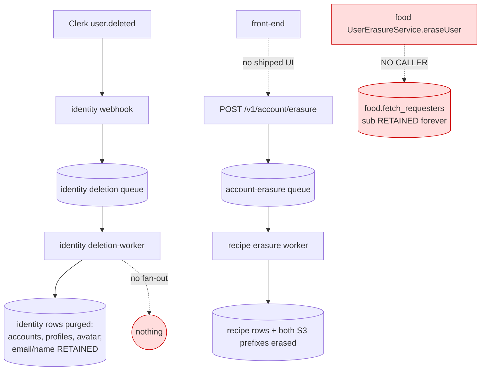
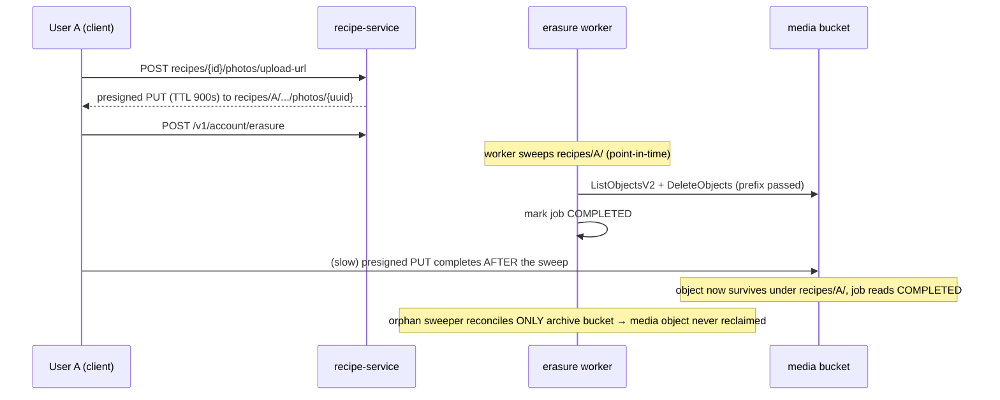

# GDPR right-to-erasure — recipe-group hardening (Track A) + cross-service coordination (Track B)

> **Grounding.** This plan is not speculative. It is the structured output of a completed audit of the
> already-shipped recipe-service erasure group: an adversarial failure-mode review, a security review, a
> cross-service coordination trace, and a **passing** `T137` erasure integration run (8/8, against the
> throwaway `kitchensink_recipes_it`). The recipe-service erasure group itself is implemented and correct;
> this plan closes the specific gaps that audit surfaced.

---

## Summary

The recipe-service GDPR erasure group (`POST /v1/account/erasure` → SQS → worker → row + S3 deletes, plus a
stuck-job sweeper and an orphan sweeper) is implemented to a high standard and passes its unit + integration
tiers. The audit found it sound in isolation but surfaced two classes of gap:

- **Track A — recipe-group hardening (contained, do now, TDD each).** One HIGH data-survival race (a
  presigned photo upload can land media _after_ the sweep, and the orphan sweeper only reconciles the archive
  bucket), one MEDIUM safety interlock (the worker deletes unconditionally, so only queue topology stops a
  misrouted message deleting from the wrong DB), a defense-in-depth `ownerId` validation tightening, targeted
  test-coverage backfills, one LOW counter-arithmetic nit, a stale comment, and one **product decision** to
  surface (optional confirmation phrase). All fixes are within one feature and directly test-drivable.

- **Track B — cross-service coordination (large, cross-feature, DESIGN-ONLY here, gated on approval).** Today
  closing a user (Clerk `user.deleted`) purges only identity rows; nothing propagates to recipe or food, and
  there is no orchestrator. Per the owner policy (2026-07-18), account closure must **anonymize** the user's
  identity on their content (public → old user id in place of the name; private-shared → keep the name;
  private-never-shared → pseudonym), NOT delete it — a distinct flow from the hard-delete erasure endpoint.
  This spans 001 + identity + 003 and must be a formal change request. This plan produces the **design + task
  breakdown only**; no Track B code is written until the CR is approved.

**Recommendation: implement Track A now; gate Track B on explicit approval of the change request.**

---

## Problem Frame

**In scope.** Close the concrete erasure defects the audit found in the recipe-service group (Track A), and
produce a sign-off-ready design for account-wide erasure coordination (Track B).

**Not in scope.** Rebuilding the erasure group (it is correct). Implementing Track B code before its CR is
approved. Changing the deliberate identity-side retention of `users.email`/`name` for public recipe
attribution (that is a documented policy — Track B flags it for a compliance sign-off, it does not silently
alter it).

**Why now.** Erasure that reports `completed` while user data survives is a GDPR compliance failure, not a
cosmetic bug. Track A's HIGH item (media resurrection) is reproducible with an ordinary slow upload; Track B's
gap means the platform's primary "delete my account" path (Clerk deletion) leaves recipe photos and food
request records behind indefinitely.

---

## Requirements

| ID  | Requirement                                                                                                                                                                                                                                                                                                                                                                                                                              | Source                                                                              |
| --- | ---------------------------------------------------------------------------------------------------------------------------------------------------------------------------------------------------------------------------------------------------------------------------------------------------------------------------------------------------------------------------------------------------------------------------------------- | ----------------------------------------------------------------------------------- |
| R1  | An erasure job marked `completed` MUST imply every owner-scoped object in **both** S3 buckets (media + version-archive) is gone, including objects written by a presigned URL minted shortly before erasure.                                                                                                                                                                                                                             | Audit HIGH-1; C-007; ARCH-BE-3                                                      |
| R2  | The worker MUST NOT issue destructive deletes for an owner unless _this_ database holds a bookkeeping row authorizing that owner's erasure (in any status). Idempotent completed-replay MUST remain a no-op.                                                                                                                                                                                                                             | Audit MED-2; ADR-0005 (per-stage isolation is defense-in-depth, not the sole guard) |
| R3  | `ownerId` MUST pass strict ULID validation before it is used to build any S3 prefix or SQL predicate; a hostile `ownerId` MUST NOT widen the object sweep beyond the intended owner.                                                                                                                                                                                                                                                     | Audit security residual; adversarial testing gap                                    |
| R4  | The erasure controller MUST derive the erased owner solely from the verified token; a body/param/query-supplied `ownerId` MUST be ignored. (Verified true today — this requirement pins it with a test.)                                                                                                                                                                                                                                 | Security review; testing gap                                                        |
| R5  | The rating-aggregate trigger MUST re-derive survivor aggregates correctly through the recipes-cascade delete, with no survivor corruption and no per-row perf cliff. (Verified correct today — pin it with a test.)                                                                                                                                                                                                                      | Adversarial testing gap                                                             |
| R6  | Closing a user account (Clerk `user.deleted`) MUST **anonymize** that user's identity across all stores that expose it — public content → owner name replaced by the old user id; private-shared recipes → retain the name; private-never-shared → pseudonymize — with per-service completion tracking and partial-failure handling. It does NOT delete recipe/food content. (Distinct from the hard-delete `POST /v1/account/erasure`.) | Cross-service trace HIGH; owner policy 2026-07-18; **Track B (design-only)**        |
| R7  | Retained-after-erasure identifiers (`users.email`/`name` for attribution; `account_erasure_jobs.owner_id`) MUST have an explicit, signed-off compliance justification, not only a code comment.                                                                                                                                                                                                                                          | Cross-service trace MED; adversarial residual; **Track B**                          |

---

## Key Technical Decisions

- **KTD-1 (Track A, R1): the orphan sweeper is the right home for the media fix, not a new component.**
  `erasure-orphan-sweeper.ts` already reads recently-completed owners and re-sweeps the archive bucket; it
  owns exactly the read + prefix-sweep the media fix needs. Extend it to also sweep the media bucket rather
  than adding a second reconciler. The 24h `COMPLETED_LOOKBACK` already exceeds the 900s presign TTL, so a URL
  minted just before completion is covered on the next sweeper tick. _Alternative rejected:_ shortening the
  presign TTL — it narrows but does not close the window (a URL can still be redeemed within any TTL), so the
  reconciliation is the real fix; TTL is at most a secondary bound.

- **KTD-2 (Track A, R2): gate destructive work on "a row exists for this owner in this DB", not on the
  claim.** The claim intentionally excludes `completed` rows (for idempotency), so gating on the _claim_ would
  break replay. Gate instead on a presence lookup (`SELECT 1 FROM account_erasure_jobs WHERE owner_id = $1`,
  any status). A completed replay still finds its row → harmless no-op; a genuinely mis-routed message with no
  local row → log + no-op (never delete). Preserves idempotency while restoring the interlock.

- **KTD-3 (Track A, R3): validate `ownerId` as a ULID at the message boundary (`parseErasureMessage`).**
  A single strict check at the point of parse hardens the most destructive path against any future, less
  trustworthy producer. Not exploitable today (owner derives from a signed claim, all SQL is parameterized,
  the prefix is confined by the literal `recipes/` root + trailing slash) — this is defense-in-depth on the
  one operation in the system with the largest blast radius.

- **KTD-4 (Track B, R6): model account-wide erasure as an orchestrated saga over the existing
  outbox+SQS+DLQ+sweeper pattern, not a synchronous fan-out.** The repo already has the transactional-outbox +
  SQS + DLQ + scheduled-sweeper idiom (version-archive FR-007b-i; the erasure group itself). An account
  erasure coordinator should reuse it: record per-service erasure sub-jobs, dispatch to each service's erasure
  entry point, track completion, and let a sweeper re-drain partial failures. _Alternative rejected:_ a
  synchronous HTTP fan-out from the identity deletion-worker — it couples deletion latency to every service's
  availability and has no durable partial-failure recovery.

- **KTD-5 (Track B, R6): trigger the coordinator from the identity deletion path (Clerk `user.deleted` +
  user-initiated `deleteUserMe`), which is the single authoritative "account is going away" signal.** The
  front-end `POST /v1/account/erasure` becomes _one_ producer into the same coordinator rather than a parallel
  island. This is the crux design decision and belongs in the CR for cross-feature sign-off.

---

## High-Level Technical Design

### Current state — three erasure islands (the gap)



Clerk deletion reaches only identity. Recipe erasure has one producer (recipe-service itself) and no
cross-service trigger. Food erasure exists but nothing calls it. **Recipe + food PII survive account
deletion.**

### Track A HIGH-1 — the media-resurrection race



**Fix (U1):** the orphan sweeper also re-sweeps the media bucket for recently-completed owners (lookback
24h > TTL 900s), so the resurrected object is reclaimed on the next tick.

### Track B target — account-closure **anonymization** coordinator (design-only)

> The hard-delete `POST /v1/account/erasure` is a SEPARATE flow and is deliberately NOT a coordinator input.

```mermaid
flowchart TD
    Trig1[Clerk user.deleted] --> Coord
    Trig2[user-initiated deleteUserMe] --> Coord[Account Anonymization Coordinator\n(outbox + per-service sub-jobs)]
    Coord --> SubI[identity sub-job\n→ pseudonymize display identity]
    Coord --> SubR[recipe sub-job\n→ anonymize owner attribution\npublic→old id · private-shared→keep name]
    Coord --> SubF[food sub-job\n→ pseudonymize fetch_requesters.sub]
    SubI --> Track[(anonymization_sub_jobs:\nper-service status)]
    SubR --> Track
    SubF --> Track
    Sweep[coordinator sweeper] -->|re-drain partial failures| Track
    Track --> Done{all services complete?}
    Done -->|yes| Close[account closure complete]
    Done -->|no + exhausted| DLQ[alarm / DLQ / manual]
```

---

## Implementation Units

### Track A — recipe erasure group hardening (implement now)

#### U1. Media-bucket orphan reconciliation (HIGH)

- **Goal:** Close the media-resurrection race — the orphan sweeper must reclaim media objects written under
  an erased owner's prefix after the point-in-time sweep, exactly as it already does for the archive bucket.
- **Requirements:** R1
- **Dependencies:** none
- **Files:**
    - `packages/services/recipe-workers/src/handlers/erasure-orphan-sweeper.ts` (add media-bucket sweep for
      recently-completed owners; correct the header comment at ~lines 27-30 that justifies excluding media)
    - `packages/services/recipe-workers/infra/lib/recipe-workers-stack.ts` (grant the orphan sweeper
      `s3:ListBucket` + `s3:DeleteObject` on the **media** bucket; it already has them on archive)
    - `packages/services/recipe-workers/src/handlers/__tests__/erasure-orphan-sweeper.test.ts` (extend)
    - `packages/services/recipe-workers/infra/__tests__/recipe-workers-stack.test.ts` (assert the new media
      grant synthesizes)
- **Approach:** Reuse `eraseRecipeObjects(client, RECIPE_MEDIA_BUCKET, ownerId)` — the same function the
  worker uses — inside the sweeper's existing per-completed-owner loop, adding a second call for the media
  bucket alongside the archive one. Confirm `COMPLETED_LOOKBACK` (24h) ≥ `PRESIGNED_URL_EXPIRY_SECONDS`
  (900s); if the config ever raised the TTL past the lookback, that becomes a real coupling — assert the
  invariant in a test or a startup guard. Rewrite the header assumption comment so it states the truth
  (media _can_ receive a late presigned write, which is why it is reconciled).
- **Execution note:** Test-first. Write the failing test that lands a media object under a completed owner's
  prefix and asserts the sweeper reclaims it, before touching the sweeper.
- **Patterns to follow:** the existing archive-bucket reconciliation in the same file; `eraseRecipeObjects`
  in `account-erasure-worker.ts`; the CDK grant pattern already used for the archive bucket in the stack.
- **Test scenarios:**
    - A media object written under `recipes/{owner}/…/photos/{uuid}` for a _recently-completed_ owner is
      deleted on the next sweeper run. (Covers R1.)
    - An owner NOT recently completed is left untouched (lookback scoping holds).
    - Both buckets are swept in one run — archive reclamation is unchanged (no regression).
    - Sweeper is idempotent: a second run over an already-clean owner deletes nothing and does not error.
    - Infra: the synthesized template grants the sweeper Delete/List on the media bucket.
- **Verification:** the new failing test passes; archive tests still green; `infra` synth test shows the
  media grant; the header comment no longer claims media needs no reconciliation.

#### U2. Bookkeeping-row interlock before destructive erase (MEDIUM)

- **Goal:** The worker must refuse to delete an owner's data unless _this_ DB holds an erasure row for that
  owner — so a mis-routed/replayed/misconfigured message can never hard-delete a non-requesting user's data
  from the wrong database. Idempotent completed-replay stays a no-op.
- **Requirements:** R2
- **Dependencies:** none
- **Files:**
    - `packages/services/recipe-workers/src/handlers/account-erasure-worker.ts` (`processRecord` — add a
      presence check before `eraseRecipeRows`/`eraseRecipeObjects`)
    - `packages/services/recipe-workers/src/handlers/__tests__/account-erasure-worker.test.ts` (extend)
- **Approach:** Before the unconditional data work, look up whether any `account_erasure_jobs` row exists for
  the owner (any status). If none, log a clear warning (`misrouted erasure message: no local job`) and return
  without deleting — the message still acks (it is genuinely not this DB's job). Keep the existing
  claim/complete/error flow otherwise. Document _why_ the interlock exists (the wrong-DB hazard the stack
  comment already names) so a future reader does not "simplify" it away.
- **Execution note:** Test-first (the no-job no-op path does not exist in the suite today).
- **Patterns to follow:** the existing `claimErasureJob` DAL access; the stack's own wrong-DB hazard comment
  (`recipe-workers-stack.ts:186-189`) as the rationale.
- **Test scenarios:**
    - A message for an owner with NO row in this DB → no `DELETE` issued, warning logged, message acked.
    - A message for an owner with a `queued` row → erasure runs (unchanged happy path).
    - A message for an owner with a `completed` row (replay) → data work is a harmless no-op, no error.
    - A message for an owner with a `failed` row → erasure runs (fresh attempt still authorized).
- **Verification:** the no-job case deletes nothing (assert via the DAL/S3 fakes); all prior worker tests
  still pass.

#### U3. Strict ULID validation of `ownerId` at the message boundary (defense-in-depth)

- **Goal:** Reject a non-ULID `ownerId` before it feeds an S3 prefix or SQL predicate; prove a hostile
  `ownerId` cannot widen the sweep.
- **Requirements:** R3
- **Dependencies:** none
- **Files:**
    - `packages/services/recipe-workers/src/handlers/account-erasure-worker.ts` (`parseErasureMessage` /
      `isValidOwnerId` — replace presence-only check with a strict ULID match)
    - `packages/services/recipe-workers/src/handlers/__tests__/account-erasure-worker.test.ts` (extend)
- **Approach:** Tighten `isValidOwnerId` to a strict ULID (Crockford base32, 26 chars) test. Prefer a shared
  ULID validator if one already exists in `@kitchensink/recipe-core` (check before hand-rolling — library-
  first). On failure, throw the existing `InvalidErasureMessageError` so the message routes to the DLQ rather
  than silently no-oping. Keep the existing trailing-slash prefix containment; this adds a second, earlier
  gate.
- **Execution note:** Test-first, adversarial.
- **Patterns to follow:** the existing `InvalidErasureMessageError` throw path; any ULID helper in
  `@kitchensink/recipe-core`.
- **Test scenarios (adversarial — Covers R3):**
    - `ownerId = '..'`, `'recipes/'`, `'/'`, `''`, a whitespace string → rejected (throws), no S3 call.
    - A sibling-prefix substring (`'01AAA'` vs a real `'01AAAB…'`) → the sweep for the short id does not match
      the longer owner's objects (containment holds even if validation somehow passed).
    - A valid 26-char ULID → accepted, sweep runs normally.
- **Verification:** hostile inputs throw and never issue a `ListObjectsV2`/`DeleteObjects`; valid ULID
  unaffected.

#### U4. Test-coverage backfill — controller owner-source + aggregate-trigger-on-cascade

- **Goal:** Pin two behaviors the audit verified correct-but-untested, so a future change cannot silently
  regress them.
- **Requirements:** R4, R5
- **Dependencies:** none
- **Files:**
    - `packages/services/recipe-service/src/account/__tests__/erasure.service.test.ts` and/or the controller
      test (assert a body-supplied `ownerId` is ignored; owner comes only from the principal)
    - `packages/services/recipe-service/__tests__/integration/account/erasure.integration.test.ts` (extend:
      seed other users' ratings on the erased owner's recipes; assert survivor aggregates re-derive correctly
      through the cascade, no survivor corruption)
- **Approach:** Controller test sends a request whose body carries a _different_ `ownerId` and asserts the
  enqueued message + job use the token's owner (whitelist strip + `@OwnerId()` precedence). Integration test
  extends the existing erasure spec with a survivor-rating fixture and asserts `average_rating`/`rating_count`
  on a _surviving_ recipe are correct after the erased owner's recipes cascade-delete.
- **Execution note:** Test-first (these are pure coverage additions; they must fail against a deliberately
  broken control before counting).
- **Patterns to follow:** the existing erasure integration spec (LocalStack + throwaway DB harness); the
  `@OwnerId()` decorator wiring in `account.controller.ts`.
- **Test scenarios:**
    - Controller: body `ownerId` ≠ token owner → message/job use the token owner. (Covers R4.)
    - Controller: body with no `ownerId` → unchanged happy path.
    - Integration: erased owner + a survivor's rating on the erased owner's recipe → after erasure the survivor
      row is gone (its recipe ceased to exist) and any _other_ survivor recipe's aggregate is untouched and
      correct. (Covers R5.)
- **Verification:** both tests fail against a mutated control (e.g., reading owner from body; dropping the
  trigger) and pass against `main`.

#### U5. Attempts-counter scoping across re-POSTed jobs (LOW)

- **Goal:** Prevent stale owner-scoped messages from inflating a fresh job's `attempts` and prematurely
  abandoning it to `failed`. Fail-safe today (escalates to `failed`+DLQ+page, never data survival) — lowest
  priority; include for completeness.
- **Requirements:** (hardening; no new R)
- **Dependencies:** U2 (touches the same claim path)
- **Files:**
    - `packages/services/recipe-workers/src/handlers/account-erasure-worker.ts` (claim/attempts increment)
    - `packages/services/recipe-workers/src/handlers/erasure-sweeper.ts` (give-up decision)
    - respective `__tests__`
- **Approach:** Either carry a `jobId`/dispatch-nonce in the message and only increment when it matches the
  currently-active job, or key the sweeper's give-up decision off elapsed time / DLQ evidence rather than a
  shared cross-generation `attempts` counter. Prefer the smaller change; this is arithmetic correctness, not
  an outcome bug.
- **Execution note:** Test-first; assert a stale-message replay does not inflate a fresh job's counter.
- **Test scenarios:** a `failed`→re-POST→fresh `queued` job is not pushed toward `ERASURE_GIVE_UP_ATTEMPTS`
  by redelivered stale messages from the previous cycle.
- **Verification:** the counter reflects only the fresh job's own receives.

#### U6. Cleanup — correct the stale "owed" comment

- **Goal:** `version-archive-worker.ts:153` still says the orphan-reconciliation sweep "does not yet exist and
  is owed" — but `erasure-orphan-sweeper.ts` now exists. Fix the comment so it does not mislead.
- **Requirements:** (docs hygiene)
- **Dependencies:** U1 (the media reconciliation makes the sweep genuinely complete across both buckets)
- **Files:** `packages/services/recipe-workers/src/handlers/version-archive-worker.ts`
- **Approach:** Update the comment to point at the now-existing orphan sweeper and its (post-U1) two-bucket
  coverage.
- **Test expectation:** none — comment-only change, no behavior.
- **Verification:** the comment reflects reality; no code change.

#### U7. Require a confirmation phrase on true-delete erasure (DECIDED — owner sign-off 2026-07-18)

- **Goal:** The erasure `confirmationPhrase` is optional today, so an authenticated caller can trigger
  irreversible self-erasure with no intent gate. **Decision (owner, 2026-07-18): require it.**
- **Requirements:** R4a (new — intent gate on the irreversible true-delete path); relates to R7.
- **Dependencies:** none
- **Files:** `packages/services/recipe-service/src/account/erasure.service.ts`,
  `packages/services/recipe-service/src/account/dto/erasure.dto.ts`,
  `packages/services/recipe-service/contracts/api.openapi.yaml` (or the repo's contract path),
  the account service + e2e tests.
- **Approach:** Enforce a non-empty, exact-match confirmation phrase server-side; fail closed with a distinct
  4xx + `code` (e.g. `ERASURE_CONFIRMATION_REQUIRED` / `_MISMATCH`). Update the DTO validation and the
  OpenAPI contract so the requirement is part of the wire contract. The rejection MUST NOT leak account
  existence (same posture as the 410/duplicate responses). Decide the canonical phrase (a fixed literal like
  `DELETE MY RECIPES` vs. echoing an account-derived token) as a small implementation-time choice — prefer a
  fixed, localized literal unless a stronger intent signal is wanted.
- **Execution note:** Test-first (red: current optional path admits an empty phrase).
- **Test scenarios (Covers R4a):** missing phrase → rejected (distinct 4xx `code`); wrong phrase → rejected;
  exact phrase → accepted → job enqueued; rejection response is identical whether or not the account has
  prior state (no existence leak).
- **Verification:** contract + DTO + service + e2e agree; an empty/mismatched phrase never enqueues a job.

### Track B — cross-service **anonymization** coordinator (DESIGN-ONLY; gated on CR approval)

> **No Track B code is written under this plan.** These units are the design deliverable + task breakdown for
> a formal cross-feature change request. Implementation begins only after the CR is approved.
>
> **Policy (owner-decided 2026-07-18):** account closure (Clerk `user.deleted`) **anonymizes**, it does not
> delete. Public content → owner name replaced by the old user id; private-shared recipes → keep the real
> name; private-never-shared → pseudonymize. The hard-delete `POST /v1/account/erasure` is a _separate_
> flow and is NOT wired to account closure.

#### U8. Author the cross-service anonymization change request

- **Goal:** Produce a formal CR (spanning 001 + identity/002 + food/003) specifying account-closure
  **anonymization** coordination, so the cross-feature contract is agreed before any code.
- **Requirements:** R6, R7
- **Dependencies:** none (design)
- **Files:** `specs/001-commise-recipe-app/change-requests/CR-002-cross-service-account-anonymization.md`
  (new), cross-referencing identity + food specs.
- **Approach:** Capture the current three-island state (see HTD), the target **anonymization** coordinator
  saga (KTD-4/KTD-5, re-scoped to anonymize), the trigger (Clerk `user.deleted` + `deleteUserMe` feed one
  coordinator; the front-end hard-delete endpoint stays independent), the anonymization RULE MATRIX (public →
  pseudonym; private-shared → retain name; private-never-shared → pseudonym) and how each service applies it
  (recipe: rewrite the owner's display attribution on their own content per visibility+shared state, NOT
  delete rows/photos; food: pseudonymize `fetch_requesters.sub` on public entries), per-service sub-job model
    - completion tracking + partial-failure/DLQ handling, and the R7 retention sign-off. **Define precisely
      what "shared" means** (a share link issued? a collection membership by another user? a clone by another
      user?) — this is the load-bearing ambiguity the CR must resolve. Enumerate the downstream tasks (below).
- **Verification:** CR reviewed and approved (or redirected) by the owner; no code until then.

#### U9. (Gated) Wire food-service anonymization

- **Goal:** Give food a real account-closure caller that **pseudonymizes** the user's `fetch_requesters`
  entries (public data) rather than deleting them. Note: today `UserErasureService.eraseUser(sub)` _deletes_;
  the CR must decide whether closure calls a new `anonymize` path (likely) while `eraseUser` stays for true
  deletion. Its wiring is currently "deferred to infra."
- **Requirements:** R6
- **Dependencies:** U8 approved
- **Files (future):** `packages/services/food-service/…` (anonymize service + controller/handler + CDK),
  tests + integration.
- **Approach:** Deferred to the CR. Mirror the SQS+DLQ+sweeper pattern for the trigger.
- **Verification:** deferred to the CR's own plan.

#### U10. (Gated) Recipe account-closure anonymization path

- **Goal:** A recipe-side anonymization operation (distinct from the hard-delete worker) that rewrites the
  owner's display attribution on their content per the public/private-shared rule — invoked by the
  coordinator on account closure. The existing hard-delete queue/worker is NOT reused for closure (it would
  delete, violating the policy).
- **Requirements:** R6
- **Dependencies:** U8 approved
- **Files (future):** recipe-service anonymization service + its cross-service trigger wiring.
- **Approach:** Deferred to the CR. Requires a stored notion of "was shared" + the pseudonym (old user id).
- **Verification:** deferred.

#### U11. (Gated) Build the coordinator saga + completion tracking

- **Goal:** The orchestrator itself — per-service anonymization sub-jobs, completion tracking, partial-failure
  re-drain, terminal alarm.
- **Requirements:** R6, R7
- **Dependencies:** U8 approved; U9, U10
- **Files (future):** a new coordinator (likely identity-owned, as the account authority) + its infra.
- **Approach:** Deferred to the CR; reuse the outbox+SQS+DLQ+sweeper idiom (KTD-4).
- **Verification:** deferred.

---

## Scope Boundaries

**Resolved product decisions (owner, 2026-07-18):**

- **Confirmation phrase:** REQUIRED on the true-delete erasure endpoint (U7 is now firm Track A work).
- **Account-deletion policy = anonymize, not delete.** The two flows are DISTINCT: `POST /v1/account/erasure`
  remains a genuine hard delete (the explicit GDPR right-to-be-forgotten; Track A hardens it). **Account
  CLOSURE** (Clerk `user.deleted`) does NOT delete recipe or food data — it **anonymizes** the owner's
  identity on their content, per the rule: **public** recipes + food fetch-requests → owner name replaced by
  the old user id (pseudonym); **private recipes that were shared** → keep the real name (recipients rely on
  attribution); **private, never-shared** recipes → pseudonymize. This makes Track B an _anonymization_ saga,
  not a deletion fan-out.

### Deferred to Follow-Up Work

- All of Track B implementation (U9–U11) — gated behind the CR-002 approval (U8).
- Any migration to a shared ULID validator if none exists yet in `@kitchensink/recipe-core` (U3 uses whatever
  exists; introducing a shared one is a separate cleanup).

### Out of scope (deliberate, not gaps)

- Rebuilding the recipe erasure group — it is implemented and correct.
- Changing identity's deliberate retention of `users.email`/`name` for attribution — Track B _surfaces_ it
  for a compliance sign-off (R7); it does not alter it here.
- `recipe_versions.created_by` sweeping — deliberately not swept; correctness depends on the upstream
  "only the owner creates a version" invariant (verified in `VersionsService`). Flagged as a residual risk,
  not fixed here.

---

## Risks & Dependencies

- **R1 fix depends on a config invariant.** If `PRESIGNED_URL_EXPIRY_SECONDS` is ever raised above the
  sweeper's `COMPLETED_LOOKBACK`, the media window reopens. U1 must assert/guard this coupling, not just
  assume today's 900s vs 24h.
- **U2 must preserve idempotency.** The interlock must gate on _row presence in any status_, not on the
  claim; gating on the claim would break `completed`-replay no-op. Called out explicitly so the implementer
  does not conflate the two.
- **Track B is genuinely cross-team.** It touches identity (002) and food (003), which have their own owners,
  specs, and deploy paths. It is correctly a CR, not a silent build — do not let it leak into Track A's PR.
- **Integration harness safety.** The erasure integration tier drops+recreates `public` on whatever
  `DATABASE_URL` points to. Every run MUST target the throwaway `kitchensink_recipes_it` (never the live
  `kitchensink_recipes`) and a local LocalStack on `:4566`. This constraint is load-bearing for U1/U4.

---

## System-Wide Impact

- **Track A** is confined to `recipe-workers` (+ two recipe-service tests) and its CDK stack (one added S3
  grant on the orphan sweeper's role). No API contract change (U7 excepted, and it is gated). Prod synth
  should diff only by the new media grant.
- **Track B** is a new cross-service control plane. It changes the account-deletion contract platform-wide
  and needs its own rollout, monitoring, and per-service owner sign-off — all deferred to CR-002.

---

## Sources & Research

- **Adversarial audit** of the recipe erasure group (this session): HIGH media-resurrection race; MEDIUM
  unconditional-erase interlock; LOW attempts-counter inflation; affirmations that the rating-trigger ordering
  and CDK wiring are correct.
- **Security review** (this session): zero exploitable findings; residual defense-in-depth items (ULID
  validation, optional confirmation phrase); testing gaps (hostile-`ownerId`, body-`ownerId`).
- **Cross-service coordination trace** (this session): account deletion leaves recipe + food PII behind; no
  orchestrator; food `eraseUser` has no caller; identity retains `email`/`name` by design.
- **`T137` erasure integration run** (this session): 8/8 passing against `kitchensink_recipes_it` + LocalStack
  — the group's end-to-end erasure genuinely deletes rows + objects and marks the job completed.
- Repo specs: `specs/001-commise-recipe-app` (FR-013b, C-007, CR-001), `docs/architecture/decisions/0005-*`.
