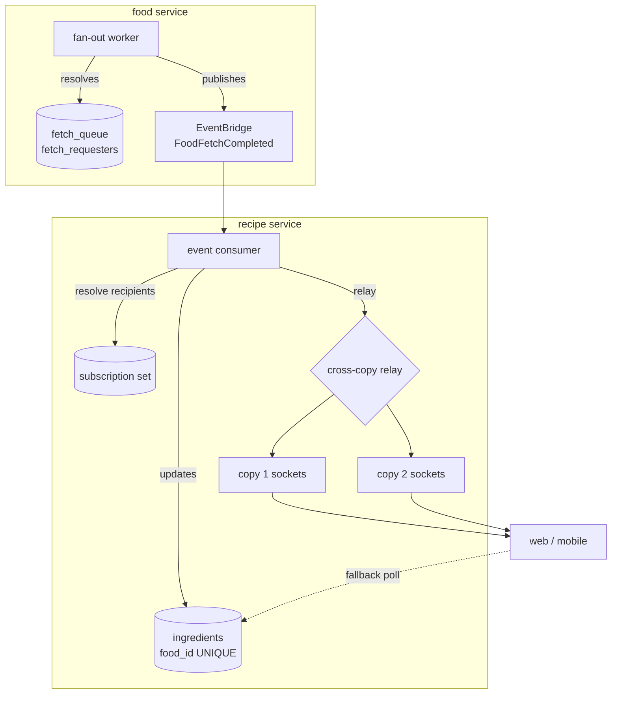

> ⚠️ **Superseded as a description of current state** by [`docs/architecture/2026-08-28-ingredient-pipeline-state.md`](../architecture/2026-08-28-ingredient-pipeline-state.md) (2026-08-28, PR 91).
>
> The decisions and reasoning below remain valid and this document is deliberately NOT deleted. Where it
> and the state addendum disagree about **what exists today**, the addendum wins.

# feat: Push notification when a food resolution completes

## Summary

Replace the client's 2.5-second status poll with a real-time push. The food service already publishes
`FoodFetchCompleted` on EventBridge and nothing consumes it; the recipe service will subscribe, update the
affected ingredient, and push to the apps whose users requested that food. Polling remains as the degraded
fallback, never as the primary path.

---

## Problem Frame

When a user adds an ingredient by name that is not yet in the local store, the food service fetches it from
the USDA asynchronously (~20–30s). The user needs to know when it lands.

Today's path, verified in code:

1. The app adds an ingredient; the recipe service answers `202` with `foodResolutionStatus: PENDING`.
2. `usePollIngredientStatus` → `useIngredientStatus` polls `GET /api/v1/ingredients/{id}/status` every
   **2500ms** (`packages/clients/recipe-service/src/queries.ts`, `DEFAULT_INGREDIENT_POLL_INTERVAL_MS`).
   The poll is self-limiting: `refetchInterval` returns `false` once a non-`PENDING` status arrives.
3. On **every** poll, `IngredientsService.refreshStatus` calls `readFoodStatus`, which makes a fresh
   authenticated call to the food service forwarding the caller's own bearer
   (`packages/services/recipe-service/src/ingredients/ingredients.service.ts`).

Two costs follow. The user waits up to one poll interval after the data is actually ready — roughly 8–12
polls across a typical resolution. And each poll causes a synchronous cross-service call, so the load is
two hops deep per pending ingredient, in a timer loop, carrying an end-user credential.

Meanwhile `FoodFetchCompleted` is emitted, has a canonical `detailType`, has a `FoodFetchCompletedRule` in
the CDK, and has **zero consumers** outside the food service's own tests. The signal the feature needs
already exists and is discarded.

### Why the original spec's design is not the one to build

Tasks T-185/T-186 (`specs/003-usda-food-data/tasks.md`) specify an API Gateway WebSocket API on the **food
service**, with a `$connect` Lambda authorizer, pushing `{type: "food_ready", id}` where `id` is a food
ULID. Three things make that the wrong target, and all three are properties of the system as built rather
than opinions:

- **The apps never talk to the food service.** They have no food endpoint configured and do not import the
  food client. Every ingredient call goes to the recipe service.
- **The apps hold ingredient identifiers, not food ones.** The food↔ingredient link
  (`ingredients.food_id`, uniquely indexed) exists only in the recipe service, so a food-keyed payload
  cannot address client state.
- **The Lambda-authorizer design exists to solve a problem the recipe service does not have.** API Gateway
  was chosen because the food service had no long-lived connection host. The recipe service is a
  long-running Fargate service behind an ALB, and ALBs proxy WebSocket natively.

The spec anticipated the targeting requirement even so: `fetch_requesters` carries primary key
`(food_id, requester_id)` and its own schema comment names _"WebSocket targeting"_ as a purpose.
`requester_id` is the app-user ULID (rekeyed under CR-002/U1), not a Clerk `sub`.

---

## Key Decisions

**The socket terminates on the recipe service, not the food service.** It is the service the apps already
authenticate against, the service holding the ingredient identifier the UI is keyed on, and a long-running
process that can hold a connection. This deletes the API Gateway surface, the `$connect` Lambda authorizer,
and the `$context.authorizer` trust path from the design entirely.

**Authentication reuses the existing verification; there is no second identity path.** The only real
constraint is that a _browser_ cannot attach an `Authorization` header to a WebSocket handshake — a browser
API limitation, not an auth-design one. Mobile is unaffected (React Native's WebSocket accepts headers).
For web, the handshake carries a short-lived single-use ticket minted by an already-authenticated endpoint.
The ticket is a scoped credential issued by the existing login, not a parallel identity system. Same-origin
cookies are a viable alternative and are evaluated in Open Questions.

**Consume the event that already exists.** `FoodFetchCompleted` on EventBridge, with its existing
`detailType` and rule. Do not introduce SNS: the transport is already published and already has a rule;
adding a second one would create two paths for one signal.

**Polling stays as the fallback and is not deleted.** A socket can always fail — a proxy, a captive
portal, a backgrounded phone. The existing self-limiting poll remains the degraded path, so push is
strictly additive and its failure is a latency regression rather than a broken feature.

**The event-driven status mirror is worth landing independently of push.** Having the recipe service learn
completion from the event removes the per-poll cross-service call whether or not a socket ever exists. It
is also a prerequisite: a held connection needs something to wake it.

---

## High-Level Technical Design

The `cross-copy relay` node is the plan's one unresolved decision — see Open Questions D2. Everything
either side of it is settled.

---

## Requirements

**Notification behaviour**

- R1. On `FoodFetchCompleted`, the recipe service MUST update the affected ingredient's stored
  `foodResolutionStatus` (and golden-record nutrition on `RESOLVED`) without a client poll triggering it.
- R2. The recipe service MUST push a notification only to connections belonging to users who requested that
  food. Broadcast is forbidden.
- R3. The push payload MUST be keyed on the identifier the apps hold (the ingredient), not the food ULID.
- R4. A user with no live connection MUST still observe the resolution via the existing poll, with no
  behavioural difference other than latency.
- R5. Both platforms MUST receive push in the same release (cross-platform rule, `docs/CODING_STANDARDS.md`
  §14).

**Connection lifecycle**

- R6. The handshake MUST be authenticated before establishment, and MUST reject an unauthenticated or
  expired credential with no connection created.
- R7. A connection whose credential expires mid-life MUST be closed rather than left authorised
  indefinitely.
- R8. The client MUST reconnect after an idle close, a network change, or a mobile
  background→foreground transition, and MUST reconcile any status it missed while disconnected.
- R9. Connection teardown MUST remove the connection from the subscription set, including on abrupt loss.

**Correctness under concurrency**

- R10. Event delivery is at-least-once, so applying the same completion twice MUST be indistinguishable
  from applying it once.
- R11. A late-arriving completion event MUST NOT overwrite a value the user resolved manually through the
  disambiguation flow (US-2a). The user's manual resolution wins.
- R12. Push MUST NOT be load-bearing for correctness: the stored status is authoritative, and a lost
  notification degrades to R4.

**Observability**

- R13. Delivery outcome MUST be observable — pushes attempted, delivered, dropped for no connection, and
  failed — since a silently undelivered notification is otherwise indistinguishable from a slow fetch.

---

## Scope Boundaries

**In scope.** The event consumer, the ingredient status update, the subscription set, the socket endpoint
and its auth, both clients, the cross-copy relay, and the tests for all of it.

**Deferred for later.**

- Real-time surfaces beyond resolution notification (collaborative editing, presence, live recipe updates).
  The design should not preclude them, but nothing here is built for them.
- Redis/ElastiCache as the relay. Already deferred once in 003 for cost; revisit only if D2 selects it.
- Dynamic `estimatedWaitSeconds` (FR-003 keeps its static placeholder).

**Outside this feature.**

- Any change to how resolution itself works — the queue, the worker, the USDA adapter, the rate limiter.
- Registering a recipe as a food, or any write from recipe into food. The relationship stays
  one-directional (`CLAUDE.md`, 001 T150).

**Retired by this work.** T-185 and T-186 as specified, plus the WebSocket halves of FR-041, FR-049 and
FR-050 (the `$connect` Lambda-authorizer mechanics and its authorizer-cache rules). The _requirements_ are
satisfied by a different mechanism; the spec text naming API Gateway becomes wrong and must be updated
rather than left standing.

---

## Open Questions

### Resolve before implementation

- **D2. How a completion reaches the socket, given multiple service copies.** The recipe service runs
  several Fargate copies behind one ALB. A user's socket lives in the memory of exactly one copy — a
  WebSocket is a stateful TCP session owned by one process, so it cannot be pooled, shared, or handed to
  another task. The connection therefore cannot move; only the **message** can. Two shapes:
    - _Broadcast + local filter (favoured)._ Every copy receives every completion and answers a purely
      local question: "do I hold a socket for any of these recipients?" Copies that do push; copies that
      do not ignore it. **No connection registry, no routing table, no copy needs to know what any other
      copy holds.** Postgres `LISTEN`/`NOTIFY` is exactly this — a broadcast channel every listener
      receives, and the food service already uses Postgres-as-queue with `LISTEN`/`NOTIFY`, so it is an
      in-house pattern rather than a new dependency. Cost is one message per copy per event: negligible at
      a handful of copies, wasteful at hundreds, which is comfortably beyond the one-cluster posture of
      T-196.
    - _Connections held outside the service._ API Gateway WebSocket owns every connection centrally, so
      any copy can push to any user by connection id — genuinely a shared connection pool, as a managed
      service. It removes the question outright and scales furthest, at the cost of the API Gateway surface
      and browser-handshake bridge this plan otherwise deletes. A self-hosted socket tier is the same idea
      without the managed part, and only helps if that tier runs a single copy — otherwise it relocates the
      question one hop.

    Redis pub/sub is a third relay, conventional and purpose-built, but it is new paid infrastructure and
    003 already deferred it once on cost.

    This decision determines deployment behaviour (do connections survive a rolling deploy?), so it must
    precede the connection-lifecycle units.

### Decided

- **D1. The recipe service owns its own subscription set; the food service's requester list is not the
  source.** Resolved on a hard technical constraint rather than a preference: `FetchQueueDao.resolve`
  **deletes** every `fetch_requesters` row for a food in the same transaction that removes its queue row
  (DSN-10). At the instant the completion event fires, the requester list is gone — so sourcing recipients
  from it is a race by construction. Avoiding that would mean capturing the list before the delete and
  carrying user ULIDs in the event payload, which grows a cross-service contract with PII to serve a
  concern the receiving service already has locally.

    Every purpose the food service genuinely needs `requester_id` for happens **while the request is
    pending** — fairness demotion (FR-043/FR-043a), the live distinct-requester count behind demand ordering
    (FR-044), producer-provenance refusal (FR-048), and erasure (CR-002/U1). All of them die with the row.
    Notification is the only claimed purpose that needs the data _after_ resolution, which is precisely why
    it cannot live there.

    **Consequence: no cross-service contract changes.** `FoodFetchCompletedDetail` already carries
    `{eventId, timestamp, id, status}` — food id and terminal status, exactly what is needed and nothing
    more.

    **Stale comment to fix as part of this work:** `fetch_requesters` in
    `packages/services/food-service/src/db/schema/operational.ts` documents its purpose as "(FR-043) and
    WebSocket targeting". Targeting is impossible from a table that resolution empties, so that comment
    names an intent the pruning rule contradicts, and it is what first pointed this design at the wrong
    service.

### Deferred to implementation

- Ticket TTL, single-use enforcement, and where the ticket is minted.
- Idle-timeout and heartbeat intervals, bounded by the ALB idle timeout.
- Whether the client reconciles on reconnect by refetching status or by a resume cursor.

---

## Dependencies / Assumptions

- `FoodFetchCompleted` is published on EventBridge with a stable `detailType` and an existing rule, and its
  payload is `{eventId, timestamp, id, status}` — verified, and unchanged by this work (see D1).
- `ingredients.food_id` is globally unique (one catalog row per food golden record), so an event maps to
  exactly one ingredient row by indexed lookup — and one update serves every user waiting on that food.
- `requester_id` in `fetch_requesters` is the app-user ULID, not a Clerk `sub`.
- The recipe service is reachable through the shared per-stage ALB via a host-based listener rule
  (ADR-0003); WebSocket upgrade over that path must be confirmed, not assumed.
- The `recipe-workers` package exists with six handlers and VPC/RDS access, but every `events.Rule` in it
  is a _schedule_. A cross-service event-pattern rule would be the first of its kind there — which is also
  a hint that the consumer may belong in the service rather than a worker, since a Lambda cannot wake a
  socket the service holds.

---

## Risks

- **Silent non-delivery.** The failure mode is a user staring at a pending badge while the data is ready.
  R13's observability is the mitigation, and R4's fallback is the safety net. This is the repo's recurring
  silent-success class and deserves the most adversarial testing in the plan.
- **Mobile lifecycle.** Backgrounding, network changes, and OS-initiated socket closure are where
  real-time features rot. R8 must be tested on a real device flow, not only in unit tests.
- **Rolling deploys drop connections.** Every deploy severs every socket. Reconnect (R8) must be robust
  enough that a deploy is invisible to users, or push becomes a reliability liability.
- **At-least-once delivery.** EventBridge can deliver twice; R10 must be enforced at the write, not
  assumed.

---

## Success Criteria

- A connected requester observes the resolution within seconds of it completing, without polling.
- A user with no connection sees no behavioural change beyond latency.
- Per-poll cross-service calls from the recipe service to the food service are eliminated for the
  status path.
- Delivery outcome is visible in production telemetry, not only under test.
- 003's spec no longer describes a mechanism the system does not implement.

---

## Sources & Research

- `specs/003-usda-food-data/spec.md` — US-8 (polling), US-9 (WebSocket), FR-034, FR-041, FR-049, FR-050,
  A-007.
- `specs/003-usda-food-data/tasks.md` — T-185, T-186 as specified and deferred.
- `packages/clients/recipe-service/src/queries.ts` — the 2500ms self-limiting poll.
- `packages/services/recipe-service/src/ingredients/ingredients.service.ts` — `refreshStatus` /
  `readFoodStatus`, the per-poll cross-service call.
- `packages/services/recipe-service/src/database/schema/ingredients.ts` — `food_id` and its unique index.
- `packages/services/food-service/src/db/schema/operational.ts` — `fetch_requesters`, whose comment names
  WebSocket targeting.
- `packages/services/food-service/src/events/FoodEventEmitter.ts` — the EventBridge `detailType`.
- `docs/architecture/decisions/0003-shared-alb-per-stage.md` — the shared ALB and host-based routing.
