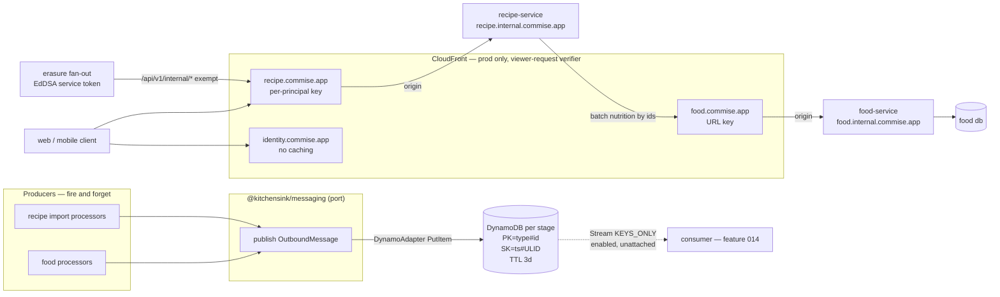

# feat: PR 91 foundation hardening

## Summary

Harden the three shipped features, build a durable per-group message substrate on DynamoDB that any
producer can write to fire-and-forget, make the food service the sole owner of nutrition data, put a
CloudFront edge in front of every production service, give all 203 verified findings a disposition, and
re-specify features 004–014 so the other worktrees can rebase onto something coherent. **No new
user-visible feature ships, but user-visible behaviour does change** — see _User-visible consequences_
below.

> **Revision history.**
>
> **Round 1 (2026-08-15).** Rewritten after a six-persona review raised 31 findings, 16 substantive.
> Two decisions were invalidated outright: food does **not** store per-100g macros (KTD-3), and U9's
> "two-line reorder" is impossible (U9). The edge track (U15–U17) was added by owner ruling and is
> **not** derived from the origin document.
>
> **Round 2 (2026-08-15).** A second six-persona review raised ~25 substantive findings, including
> **two P0s with three-persona agreement**. Both were defects in the round-1 edge design: caching
> recipe responses on a URL-only key leaks users' private recipes to each other, and rejecting
> tokenless requests at the edge breaks CORS preflight, `/health`, and the GDPR erasure fan-out.
> Owner ruling: keep all three distributions and fix every defect. Four more corrections landed on the
> non-edge units — see KTD-3, U8, U9 and U10.

---

## Status ledger (updated 2026-08-16)

Eleven units are DONE; U10 is half done; five remain. Each unit's section carries its evidence.

| Unit        | State                          | Commit     | Evidence                                                            |
| ----------- | ------------------------------ | ---------- | ------------------------------------------------------------------- |
| **U15**     | ✅ DONE                        | `1e7cd082` | Live `curl`: three internal hosts `200` / `ssl_verify 0`            |
| **U1**      | ✅ DONE                        | `7775e228` | `docs/reviews/2026-08-16-u1-erasure-diagnosis.md`                   |
| **U2**      | ✅ DONE                        | `67fea871` | identity 409, webhooks 193, web 1072, mobile 58 + 388               |
| **U3**      | ✅ DONE                        | `e9d0c639` | ADR-0020 written; 0016/0017/0019 amended                            |
| **U4**      | ✅ DONE                        | `e728c289` | messaging 20; nine hand-rolled doubles retired                      |
| **U5**      | ✅ DONE                        | `1fb5f2e3` | MessageSubstrateStack + per-PR ownership split                      |
| **U6**      | ✅ DONE                        | `1fb5f2e3` | DynamoPublisher; PutItem-only IAM                                   |
| **U7**      | ✅ DONE                        | `64ada10e` | 014 carries C-1…C-10; `supersedes` withdrawn                        |
| **U8**      | ✅ DONE                        | `dd692c49` | food-service 837; kcal/kJ + per-serving traps pinned                |
| **U9**      | ✅ DONE                        | `062bcb4b` | AWAITING_RETRY on the wire; exhaustion alarm; operator requeue      |
| **U11**     | ✅ DONE                        | `bcb1dfae` | five topics subscribed; repo-wide gate                              |
| **U10**     | ✅ DONE                        | `01346d5e` | Columns dropped; integration tier found 3 defects 1654 units missed |
| **U12**     | ✅ DONE                        | `c075a2ba` | 203/203 dispositioned; found a shipped P0 (FoodsModule DI)          |
| **U13/U14** | ✅ DONE                        | `2275b4b1` | 004–014 respecced                                                   |
| **U15**     | ✅ DONE                        | `3b6971e0` | Internal cert ISSUED in 162s; three hosts verified live             |
| **U16**     | ✅ DONE                        | `eb5d63ef` | Three distributions + edge verifier; ADR-0020 viewer-Host fixed     |
| **U17**     | 🟡 **CODE DONE, NOT CUT OVER** | `b30af7f5` | Ownership resolver + origin lockdown; **live DNS move not run**     |

### ⛔ U10 is half done, and the unfinished half is a DESTRUCTIVE migration

`0019_drop_duplicated_nutrition.sql` is written, reviewed, and carries a **DO-NOT-RUN gate**. Running it
today breaks every recipe read: `RecipesService.assembleNutritionLines` still reads nutrition from
`IngredientsDal`, which still selects the five columns the migration drops.

**Done:** `FoodNutritionGateway` (KTD-3b stale-then-absent, 12 tests), the food client's `getNutrition`,
the `?ids=` canonicalization moved into the authored contract, and characterization tests pinning
pre-change nutrition output.

**Remaining, in order — all five before the migration runs:**

1. Drop the five nutrition fields from `IngredientsDal`'s `RETURNING` projection, its row mapper, and the
   `Ingredient` type.
2. Route `assembleNutritionLines` through `FoodNutritionGateway`, threading the caller token the way
   `IngredientsService` already does (`caller: CallerToken | undefined` as the first parameter).
3. Delete `leadCaloriesFor` and its three stored-lead write sites; derive the figure at read time.
4. Drop both fields from the GDPR export (`export.mappers.ts`, `account.schema.ts`) and regenerate.
5. Update the fixtures and tests the compiler lists — it enumerates all eleven files.

Then run the migration against production, per the plan's owner ruling. **The compiler is the checklist:**
`npx tsc --noEmit` in `packages/services/recipe-service` lists every remaining site.

**Next after U10:** U12 (203 findings), U13 → U14 (respec), U16 → U17 (edge; U16 needs U15 ✅ + U8 ✅).
U17 cuts production DNS and locks the prod ALB security group — the second irreversible production action.

### Carried-forward findings from the completed units

- **The erasure alarm cannot currently report a failure in either stage** (U1). Prod's is a stale deploy
  (redeploy `kitchensink-identity-webhooks-prod`); sandbox's emitter dies before emitting.
- **Sandbox's erasure-reconciliation fails 3×/day** — `cron(0 5 * * ? *)` = 01:00 ET fires inside
  ADR-0007's RDS shutdown. Fix the schedule, not the handler.
- **Sandbox's erasure fan-out targets services that do not exist there**, so it collects the ALB's default 404.
- **`KitchenSink/IdentityWebhooks` has no metrics at all**, cause unresolved; the emitter is proven correct
  and the one-parameter experiment that settles it is in the U1 finding.
- **Prod carries unmerged PR-91 infra drift** applied during U15's manual deploy.

---

## Problem frame

Three shipped features carry verified defects, including a GDPR erasure path where all three layers of
defence are simultaneously non-functional. Asynchronous work has nowhere durable to report progress —
the event emitter is a console stub and the AWS SDK for the bus is a dependency of no package. The
recipe service keeps its own copy of food's nutrition data, derived by a substring guess, so the same
recipe can already show three different calorie numbers. Every service is reachable only through a bare
ALB with no edge in front of it. And features 004–014 were specified independently and now contradict
each other and the decisions of the last three days.

**Operating context that shapes every risk judgement below:** there is one developer, a limited number
of open PRs, no production traffic beyond occasional test traffic, and — owner ruling, 2026-08-15 —
**service disruption and downtime are acceptable.** Migrations, DNS cutovers and stack replacements are
therefore sequenced for correctness and verifiability, not for zero-downtime.

---

## User-visible consequences

The summary says no new feature ships. That is not the same as no user-visible change, and the
following are the changes a person using the product would notice. They are gathered here so the
blast radius is legible in one place rather than scattered across units.

| Change                                                                                                             | Unit     |
| ------------------------------------------------------------------------------------------------------------------ | -------- |
| Calorie and macro values change wherever the energy nutrient was previously mis-selected, potentially by 4.184×    | U8, U10  |
| Nutrition falls back to a stale cached value, marked stale, when food is unreachable — and to absent when uncached | U10      |
| The account-erasure confirmation copy narrows to claim only what the flow actually performs                        | U2       |
| A placeholder ingredient now shows an explicit retrying state, and a terminal failed state after five attempts     | U9       |
| All three production services take planned downtime during the migration and the DNS cutover                       | U10, U17 |

---

## Requirements traceability

| Origin                                 | Covered by                                                                          |
| -------------------------------------- | ----------------------------------------------------------------------------------- |
| R1 message substrate (R1.1–R1.9)       | U4, U5, U6, U7                                                                      |
| R2 food placeholders (R2.1–R2.4)       | U8, U9                                                                              |
| R3 shipped defects (R3.1–R3.4)         | U1, U2, U11, U12                                                                    |
| R4 standards                           | **Landed** — `028f88c9`, `c627679d`, `1f90abc7`, `02ebf2cb`, `72ff7884`, `293a21af` |
| R5 portfolio respec (R5.1–R5.5)        | U3, U13, U14                                                                        |
| R6 edge topology — **not from origin** | U15, U16, U17 (owner ruling, 2026-08-15)                                            |
| Amendment — card calories              | **Superseded by KTD-3** (owner, 2026-08-15)                                         |

---

## Key technical decisions

**KTD-1 — The substrate is DynamoDB, entered through ADR-0016's own escalation clause.**
ADR-0016 chose Valkey by owner ruling and named DynamoDB as the escalation "if a loss is ever judged
unacceptable". R1.3 makes loss unacceptable, so the clause fires. Two supporting facts, neither of
them price: **ElastiCache is VPC-only**, which R1.1 forbids for producers; and Valkey pub/sub drops a
message when no listener is connected, which R1.3 forbids. _(The brainstorm's D1 rejected Valkey at
$61.32/mo. That was the **Redis OSS** row. Valkey measures ≈$6.13/mo. The price argument is withdrawn.)_

**KTD-2 — The group key is `type` + `id`; the sort key carries a ULID suffix; the stream record is a
doorbell, not data.** The group key is **two fields**, a producer type and an entity id, composed into
`PK` (owner ruling). The earlier `PK = foodId` did not generalise: the two named producers are the food
processors _and_ the recipe import processors, and an import job has no food id. Keeping the type
explicit also makes "all import messages" queryable, which a single opaque string would not.
`PutItem` **replaces** on an identical `PK+SK`, so `SK = <timestamp>` silently destroys two messages
written in the same millisecond and returns HTTP 200 — unobservable to a fire-and-forget producer.
`SK = <ISO-8601 ms>#<ULID>`. Separately, AWS orders stream records **per item (PK _and_ SK)**, not per
partition key, so the "a group arrives in order for free" premise is false. A consumer must therefore
treat the stream as a doorbell and **re-query the group** — which _is_ ordered — rather than read record
contents. This makes ordering correct by construction, duplicates harmless, `parallelizationFactor`
safe, and `KEYS_ONLY` the right stream view. ⚠️ **A DynamoDB partition and sort key are immutable after
table creation** — see U5's pre-freeze verification step.

**KTD-3 — The food service owns nutrition outright, including the projection and the portion parser.**
The plan previously assumed food stores per-100g macros. **It does not.** Food stores nutrients as EAV
rows and returns them raw as `NutrientView[]` (`foods.schema.ts:79`), plus portions as
`{label, gramWeight}`. The projection into calories/protein/carbs/fat lives in the **recipe** service —
`ingredients.service.ts:131`, which selects the energy nutrient by substring guess
(`name.includes('energy') || name.includes('calorie')`). So "food owns nutrition" is only true if the
projection moves with the data. It does (owner ruling).

_(Round-2 correction: the round-1 text claimed this was "smaller than it sounds" because food "already
holds the canonical mapping" at `usda.adapter.ts:114`. That overstated it. `LABEL_NUTRIENT_MAP` is
**module-private**, keyed by FDC **label-panel** keys, while foods ingested through the `foodNutrients`
path store names canonicalized by `canonicalizeNutrientName`. The map must be **extracted into a shared
module**, not merely imported — see U8.)_

Two further facts the round-1 text got wrong, both of which would have reintroduced the exact defect
class KTD-3 exists to eliminate:

- **Nutrients carry a basis.** `nutrientBasisEnum` is `['per_100g','per_serving']`, and branded foods
  keep label values as `per_serving` whenever the serving is ml or a count. The existing
  `nutrientPer100g` filters on basis **before** matching the name. Selecting by name+unit alone would
  project per-serving figures as per-100g. **Selection is `basis === 'per_100g'` AND canonical name AND
  unit**, and a nutrient available only per-serving reports **absent**, never coerced.
- **Returning `portions` is not sufficient on its own.** Food returns raw `{label, gramWeight}`;
  `unitToGrams` (`units.ts:83`) consumes `{unit, gramsPerUnit}` produced by recipe-side
  `parsePortion`/`extractPortions`. **That parser moves into food too** (owner ruling), so food returns
  an already-normalized portion shape and recipe keeps no heuristic that interprets food's data.

Consequently the recipe service drops `calories_per_100g`, `protein_g_per_100g`, `carbs_g_per_100g`,
`fat_g_per_100g` **and `portions`** from `ingredients`, and drops **both** `recipes.lead_calories_per_serving`
**and `recipes.has_partial_nutrition`** — the second is the same derived data, present in the wire
contract and the GDPR export, so leaving it would freeze it at its last pre-migration value.
`recipeIngredients.userCalories` and siblings are **user overrides, not food data** — they stay and
remain pinned. Supersedes the 2026-08-15 card-calorie amendment: with no event consumption there is
nothing to refresh a stored total, and the total is itself duplicated data.

**KTD-3a — Ingredients carry nutrition inline **and** expose food ids** (owner ruling). Recipe-service
calls food and returns ingredients with nutrition attached under today's field names, so no app change
is required, **and** also exposes `food_id` so a client can go direct later. Accepted cost: two routes
to the same data, which tend to drift — U10 owns a guard test.

**KTD-3b — When food is unreachable, recipe serves stale, then absent** (owner ruling). Recipe's
in-process cache serves its last known value on a food error, **marked stale in the response**, and
falls back to nutrition-absent when it holds nothing. This recovers most of the origin document's
intent — which resolved this case with cached last-known values, clearly marked — without
reintroducing a persisted duplicate, since a TTL cache is not a schema column. Accepted limitation: the
cache dies with the Fargate task, so a cold task during an outage has nothing to serve. **This is a new
runtime dependency: the recipe read path now depends on food's availability where today it does not.**

**KTD-4 — The recipe service does not consume food events.** It asks when it needs data.
_(Corrected in round 1: the first draft claimed food cannot know who requested a food. That is false —
`FetchQueueDao.listRequesterIds()` exists and is already called before publish.)_ The real reason is
narrower and stronger: copying requester identity into a TTL'd message store would recreate the
user↔food linkage **outside food's erasure boundary**, where the erasure path cannot reach it.
Consumers subscribe by the group key of KTD-2, which the client receives in the recipe response.

**KTD-5 — `expo/fetch` streaming, repointed at import progress** (owner ruling). KTD-3 removes the
streamed nutrition payload this decision originally applied to, but long-running import and OCR jobs
genuinely benefit from streamed progress, so the decision survives with a new subject. React Native's
built-in `fetch` cannot read a streaming body; `expo/fetch` can and is present in SDK 57, with Vercel's
official Expo guide depending on it. Gated because SDK 57 has an open Android large-response bug.
**Fallback: two requests.** Flip condition: the app ever leaving Expo-managed workflow.

**KTD-6 — Every finding gets a disposition, not a fix.** `fixed` / `rejected` with a checkable reason /
`deferred` with a trigger. Some findings resolve as "working as designed" (the contract-hash corpus
rule closed a false-guarantee hazard three days ago) or "prod is stale" (the alarm code is already
correct and gated).

**KTD-7 — Every production service sits behind CloudFront; the ALB moves to an internal origin name**
(owner ruling, new scope; substantially rewritten in round 2). Public hostnames become
`{service}.commise.app` on CloudFront; ALB origins become `{service}.internal.commise.app`.
**Prod only** — no sandbox, no per-PR, because a distribution takes 5–15 minutes to deploy and cannot be
deleted without first disabling and waiting for propagation, which would wreck the ADR-0005/0010
preview machinery. **All traffic goes through CloudFront, including service-to-service** (owner ruling).

Six things the implementer must not discover the hard way. The first three are round-2 corrections to
a round-1 design that would have leaked data and taken production down.

1. **The tension is caching versus AUTHORIZATION, not authentication.** Round 1 framed it as
   authentication and "resolved" it by verifying the JWT at the edge and caching on the URL alone.
   That is wrong and would have leaked private data: the verifier proves the caller is _someone_, not
   that they may read _this resource_. Recipe's read routes are owner-scoped from the token —
   `recipes.controller.ts` declares `@Get()` → `list(ownerId, query)` — so **every user requests the
   identical URL and receives different content**. A URL-only key would serve the first caller's recipe
   list to every other authenticated caller. Resolution (owner ruling): **owner-scoped routes use a
   per-principal cache key** — the edge verifier extracts the owner from the verified JWT and injects it
   into the key — while **genuinely public routes cache with no owner id in the key**. Food's nutrition
   route is caller-independent and keys on URL alone. Identity caches nothing.
2. **The edge must NOT reject every tokenless request.** Round 1 specified exactly that, which would
   have blocked all browser traffic and failed every deploy. CORS preflights carry no credentials by
   spec — this repo already encodes that failure in `deployedSmoke.ts`'s `classifyPreflight`
   ("auth is running BEFORE CORS … every browser call is blocked even though the service is healthy to
   curl") — and `prod-deploy.yml` curls `/health` unauthenticated expecting `200`. The verifier
   therefore **passes through, before verifying**: any `OPTIONS` request, the `/health*` prefix, and the
   internal service-principal route prefixes below.
3. **Service-to-service traffic does not carry Clerk tokens.** The erasure fan-out
   (`erasureFanout.ts`) POSTs to `{recipeBaseUrl}/api/v1/internal/account/erasure` carrying a
   short-lived **EdDSA service token minted by identity**. A Clerk verifier rejects it, the deletion
   worker rethrows, and SQS retries forever — silently re-breaking the exact GDPR path U1 and U2 exist
   to repair. The edge **exempts the `/api/v1/internal/*` prefix** and passes it to the origin, which
   performs its own EdDSA verification. Accepted consequence of routing everything through CloudFront:
   the erasure path and every recipe→food call now depend on CloudFront being healthy, and recipe→food
   becomes an internet round trip.
4. **The certificate must be ADDED, not amended.** `DomainStack.ts:21-25` builds one `acm.Certificate`
   whose ARN is consumed by `SharedAlbStack.ts:47` and exported as `${stackName}:CertificateArn`.
   Changing its `subjectAlternativeNames` **replaces** the resource and mints a new ARN — and ADR-0002
   already records that "CloudFormation refuses to change an export while another stack imports it …
   A naive deploy deadlocks on export-in-use." Add a **second, additive** certificate for
   `*.internal.commise.app` with its own logical id and export, attached to the HTTPS listener via
   `addCertificates`. The original is never touched.
5. **"Internal" is a naming convention, not a network boundary** — until it is made one.
   `*.internal.commise.app` is published in the public Route 53 zone on the same internet-facing ALB, so
   removing the public host condition does not stop anyone who resolves the origin name from reaching it
   directly and skipping the edge. Since all traffic now goes through CloudFront, **prod's ALB security
   group restricts :443 ingress to the `com.amazonaws.global.cloudfront.origin-facing` managed prefix
   list.** ⚠️ **Prod only.** The ALB is per stage; sandbox and every per-PR preview have no distribution
   and must keep reaching their own ALB directly.
6. **`CLERK_JWT_KEY` reaches the bundle at BUILD time, from CI** (owner ruling). Lambda@Edge cannot read
   environment variables, and the repo's `ssm.StringParameter.valueForStringParameter` pattern resolves
   at _deploy_ time — too late for an asset bundled and hashed at synth. CI reads the key from SSM and
   exports it before synth; the bundler inlines it. The key is public, so nothing secret is embedded, and
   rotation is a redeploy rather than a commit. **Synth must fail loudly when the variable is unset**, or
   a stage silently ships a verifier that rejects everything. Measured: `@kitchensink/clerk-verify`
   bundles to ~34kb minified / ~13kb zipped, well inside the 1MB viewer-request limit.

**Identity is fronted but not cached.** Its responses are per-user, and it sits directly in the Clerk
auth path where CloudFront's default `Host` rewriting is the failure class that made PR 73's previews
unreachable (ADR-0001). Three reviewers noted that its three stated benefits — WAF attachment point,
TLS termination, request shaping — are respectively deferred, already provided by the ALB, and
unspecified, and that this repo has twice declined WAF on cost grounds (`acceptedNagFindings.ts`,
`AwsSolutions-APIG3` and `CFR1`/`CFR2`). **The owner ruled to keep it anyway**; it is recorded here so
the trade is visible rather than implied, and it cuts over last.

---

## High-level technical design

**The read path, after KTD-3.** A recipe detail or a recipe list collects the distinct `food_id`s it
references, makes **one** batched call to food's endpoint through the edge, and attaches the returned
nutrition to its ingredients inline (KTD-3a). The recipe service holds `food_id` and
`food_resolution_status` and nothing else food-derived. Two caches sit on this path: a short-lived
in-process cache in recipe-service (which also serves stale on a food error, KTD-3b), and CloudFront in
front of food.

**The substrate.** PR 91 builds the **producer half only** — the port, the adapter, the per-stage table,
and the stream **enabled but unattached**. Consumers arrive with feature 014. The store is durable, so
nothing is dropped on the floor between writing and reading — **but with the 3-day reaper, anything
published before 014 exists is gone before a consumer can read it. The substrate is not a backfill
source, and PR 91 cannot exercise its read path at all.** Because the key schema is immutable after
table creation, U5 carries a pre-freeze verification step.

---

## Implementation units

### U1. Verify the erasure failure is provisioning, not code

**Goal** Determine whether the 36-of-38 reconciliation failures and the dead prod alarm are a missing
credential and a stale deploy, before writing any erasure code.
**Requirements** R3.1, R3.2 · **Dependencies** none
**Files** `docs/runbooks/cr-002-erasure-key-provisioning.md` (verify block), read-only AWS describes
**Approach** Run the runbook's verify block for the four prod values (one Secrets Manager EdDSA key,
two SSM public keys, two SSM base URLs). Separately check the deployed alarm's dimensions against the
synthesized template. **Minting the prod signing key is an owner action and is out of scope for
implementation** — the unit reports, it does not provision.
**Verification** A written finding stating, with evidence, which of provisioning / stale deploy / code
defect is the cause for each of the three symptoms.
**Test expectation: none — this is a diagnostic unit.**

### U2. Close the erasure gap the verification identifies

**Goal** Make account erasure actually erase, and stop the UI claiming more than it does.
**Requirements** R3.1 · **Dependencies** U1
**Files** `packages/apps/commise/features/account/src/**`, `packages/services/identity/src/users/**`,
`packages/services/identity-webhooks/src/common/erasureFanout.ts`
**Approach** Two problems, only one of which provisioning can explain. The webhook fan-out failing is
likely the missing key. **The app's erase button reaching only the recipe service is wiring**, and no
credential fixes it. Correct the UI copy so it states what the flow actually does.
**Test scenarios**

- Erase from the app → identity, Clerk, avatar storage and food are all reached, not just recipes
- After erasure completes, a sign-in attempt with the same credentials fails
- Fan-out with a missing signing key → fails closed, surfaces an error, erases nothing partially
- The confirmation copy asserts only what the implemented flow performs
  **Verification** An erasure initiated from the app removes the user's data from every service holding
  it, proven on the local stack.

### U3. Amend the three contradicting ADRs, and write ADR-0020

**Goal** Leave no accepted decision contradicting what PR 91 builds, and record the new edge topology.
**Requirements** R5.2 (governance), R6 · **Dependencies** none
**Files** `docs/architecture/decisions/0019-recipe-import-spine.md`,
`docs/architecture/decisions/0016-notification-retention-payload-dedup-and-valkey.md`,
`docs/architecture/decisions/0017-service-ownership-for-features-006-007-009-010.md`,
new `docs/architecture/decisions/0020-cloudfront-edge-and-internal-alb-hostnames.md`
**Approach** ADR-0019 §4 currently mandates supersession by monotonic sequence — replace with
consumer-side selection, recording the single-writer-per-group invariant as the precondition. §1
mandates one shared processor — replace with per-domain processors converging at recipe creation.
ADR-0016 records its escalation clause firing on R1.3, and states plainly that the substrate and the
notification service's pending set are two stores. ADR-0017's 006 amendment gets honest reasoning —
both original arguments were refuted. **ADR-0020 is new** and must record all six traps from KTD-7
(cache-vs-authorization and the per-principal key; the tokenless-request passthrough list; the
service-principal exemption; the additive certificate; the prefix-list restriction and its prod-only
scope; the build-time key delivery), plus the Clerk key-rotation runbook step from the risk table, and
the fact that identity's distribution is kept by owner ruling against three reviewers' objection.
**Verification** No ADR asserts behaviour this PR contradicts; each amendment names what changed and why.
**Test expectation: none — documentation.**

### U4. The `publish` port and its adapters

**Goal** A published seam producers depend on, with no storage technology visible to them.
**Requirements** R1.1, R1.4, R1.9 · **Dependencies** U3
**Files** new `packages/shared/messaging/src/{publish.ts,OutboundMessage.ts,InMemoryPublisher.ts,ConsolePublisher.ts,index.ts}`,
plus `packages/shared/messaging/{package.json,tsconfig.json,vitest.config.ts}`
**Approach** Rename and promote the existing `EventBus.putEvent` seam. **This is a shape change, not a
move** — the current `{ detailType, detail }` is EventBridge-shaped; `OutboundMessage` needs the
**two-field group key of KTD-2** (`groupType` + `groupId`) and a timestamp. Follow `cdnInvalidation.ts`'s
precedent: the contract is shared, adapters stay local to each runtime. One class per file (§1).
`FoodEventEmitter`'s DSN-9 policy — publish `FetchFailed` only on a `FAILED` tombstone, never
`NOT_FOUND` — must survive the promotion and must **not** leak into the generic port.
**Patterns to follow** `packages/shared/recipe-core/src/cdnInvalidation.ts`
**Test scenarios**

- `publish` resolves without awaiting any consumer
- An adapter that throws does not propagate to the caller (fire-and-forget)
- `InMemoryPublisher` captures messages in order for assertions
- The five hand-rolled test doubles in food-service are replaced by `InMemoryPublisher`
- `OutboundMessage` rejects a missing `groupType`, `groupId` or timestamp at the boundary
- A `groupType` outside the known producer set is rejected at the boundary
  **Verification** No producer imports a storage SDK; swapping the adapter requires no producer change.

### U5. The DynamoDB table and its infrastructure

**Goal** A durable per-group message store with TTL, reachable by IAM without VPC attachment, **per
stage including per-PR**.
**Requirements** R1.1, R1.2, R1.3, R1.5, R1.7 · **Dependencies** U3
**Files** `packages/services/food-service/infra/lib/FoodServiceStack.ts`,
`packages/services/recipe-workers/infra/lib/RecipeWorkersStack.ts`,
`packages/infra/global/lib/platform/MessageSubstrateStack.ts` (+ `__tests__/`) for the base stages
**Approach** `PK = <groupType>#<groupId>`, `SK = <ISO-8601 ms>#<ULID>` per KTD-2.

**Ownership, corrected in round 2.** The round-1 text put the table in `packages/infra/global` and
required one per `pr-{N}`. Those cannot both hold: `packages/infra/global/bin/app.ts:18` applies
`Tags.of(app).add('Environment','global')` to the whole app, and `sandbox-deploy.yml` never deploys the
global app with `stage=pr-{N}` — so a per-PR table would never be created, and would carry the wrong
tag if it were. Two reviewers independently reached the same resolution: **the per-PR table is created
inside the producer's own service stack** (already deployed per-PR and already tagged
`Environment=pr-{N}`, so teardown removes it), and the global `MessageSubstrateStack` owns the table for
the **base stages only** — mirroring how `foodDatabaseNameForStage` already branches on
`stage === baseStage`.

On-demand billing, so an idle per-PR table costs essentially nothing. TTL attribute as a **Number**
(a string TTL is silently ignored and nothing ever expires). Stream enabled `KEYS_ONLY` **with no
consumer attached** — enabling it now means feature 014 can attach without a table change. No Local
Secondary Index. Add a DynamoDB gateway VPC endpoint for throughput and blast radius. _(Round-2
correction: the round-1 rationale — that it avoids NAT data-processing charges — does not hold. ADR-0004
records a t4g.nano NAT **instance**, not a managed Gateway, so there is no per-GB processing charge to
avoid.)_ One SNS topic with an alarm action, per house convention.

**Before the key schema is frozen**, run a throwaway script performing the exact `Query`-the-group read
feature 014 will issue. A DynamoDB partition and sort key are immutable after creation, so changing them
later means a new table plus a producer migration across two stacks — and nothing in PR 91 exercises the
read path these choices exist to serve.
**Test scenarios**

- Synth asserts partition and sort key names and types
- TTL attribute is Number-typed
- Stream view type is `KEYS_ONLY`
- Gateway endpoint present
- Every alarm carries `addAlarmAction`
- A `pr-{N}` stage synthesizes the table in the producer stack tagged `Environment=pr-{N}`
- A base stage synthesizes it in `MessageSubstrateStack` and never tags it `pr-{N}`
- The table name matches the `pr-scope.sh` delimiter rule (pr-1 must not match pr-15)
- cdk-nag advisory attaches and the template is byte-identical
  **Verification** `cdk synth` clean; the table is reachable from a non-VPC Lambda with `PutItem` only.

### U6. The Dynamo adapter and its producer wiring

**Goal** Replace `ConsoleEventBus` in deployed stages with a real adapter, in both producer services.
**Requirements** R1.1, R1.3, R1.4 · **Dependencies** U4, U5
**Files** `packages/services/food-service/src/events/DynamoPublisher.ts`,
`packages/services/food-service/src/worker/main.ts`, `packages/services/food-service/package.json`,
`packages/services/food-service/infra/lib/FoodServiceStack.ts`,
`packages/services/recipe-workers/infra/lib/RecipeWorkersStack.ts`
**Approach** `@aws-sdk/lib-dynamodb` (DocumentClient) for the Number-typed TTL invariant, with
`removeUndefinedValues: true`. Producer IAM is `PutItem` on **one table ARN** — no read, no query, no
scan. `ConsolePublisher` stays as the local-dev default so the worker never requires AWS.

**Cross-stack wiring — corrected in round 2. Use SSM, not `Fn.importValue`.** The round-1 text
prescribed `Fn.importValue` "exactly as the services already import the shared ALB listener ARN". The
analogy fails: `kitchensink-alb-${baseStage}` is a **persistent** export that is never deleted, whereas
a per-PR substrate export **is** deleted on PR close. `RecipeServiceStack.ts:230-233` documents the
rule already — "Read from SSM, NOT a cross-stack export: an `Fn.importValue` would lock the workers
export while this stack imports it, and the ADR-0005 PR-close cleanup deletes a PR's stacks in no fixed
order … the export-in-use deadlock ADR-0002 documents, unattended, in CI." Publish the table name and
ARN to `/kitchensink/{stage}/messaging/table-{name,arn}` and read them with
`ssm.StringParameter.valueForStringParameter`, matching the account-erasure-queue precedent.
**Execution note** A currently-green test certifies that a bus failure is swallowed. Invert it first.
**Test scenarios**

- A put failure is logged and does not propagate (fire-and-forget preserved)
- The TTL attribute is written as a Number
- Two messages in the same millisecond both persist (the ULID suffix works)
- IAM grants `PutItem` and nothing else
- Both producers resolve the table from SSM, not a hardcoded name and not a CFN import
- Synth asserts the producer template reads the SSM parameter path for its stage
  _(The round-1 scenario "synth fails loudly when the export is absent" was unwritable —
  `Fn.importValue` synthesizes an unresolved intrinsic and only fails at deploy time. Under SSM the
  parameter path is assertable at synth, which is what this scenario now checks.)_
  **Verification** Messages appear in the table from a real producer path on the local stack.

### U7. Enable the stream and hand the doorbell contract to 014

**Goal** Leave the substrate consumable without building a consumer that has nothing to notify.
**Requirements** R1.2, R1.6, R1.8 · **Dependencies** U5
**Files** `specs/014-notification-service/**`, `docs/architecture/decisions/0016-*.md`
**Approach** Owner ruling: consumers arrive with feature 014, so PR 91 builds no consumer Lambda. The
stream is enabled in U5; this unit records the contract 014 must implement, so the design work already
done is not lost:

- Doorbell pattern per KTD-2 — on trigger, re-`Query` the group rather than reading record contents.
- **Every read needs a TTL filter expression**: expired-but-unreaped items still return from `Query`.
- Paginate on `LastEvaluatedKey`, never on an empty page.
- Explicit `retryAttempts` and `maxRecordAge` — the defaults of `-1` let one poison record block a
  shard for 24 hours — plus `bisectBatchOnError` and `reportBatchItemFailures`.
- **On-failure destination is S3**, because SQS and SNS carry metadata only.
- Parse every record with zod at the boundary (GR-017).
- **⚠️ Do not put a group or entity id in an EMF dimension** — the repo gate rejects it, and moving it
  to a property fixes only the cost half. Scrubbed structured log line instead.
- Consumer-side selection per group is **most-recent-by-timestamp wins** (owner ruling); the consumer,
  not the producer, decides.

**Verification** 014's spec carries every item above, and no code in PR 91 attaches to the stream.
**Test expectation: none — documentation. The listed behaviours become 014's test scenarios.**

### U8. Food's batch nutrition endpoint — projection and portions

**Goal** One `GET` returns **normalized** nutrition and portions for many food ids, cacheable at the edge.
**Requirements** R2.2, KTD-3 · **Dependencies** none
**Files** `packages/services/food-service/src/foods/foods.controller.ts`,
`packages/services/food-service/src/foods/**/*.schema.ts`,
`packages/services/food-service/src/sources/usda/usda.adapter.ts` (extract the map),
`packages/schemas/food/**`, `packages/clients/food-service/src/client.ts`,
projection moved from `packages/services/recipe-service/src/ingredients/ingredients.service.ts:131`,
portion parser moved from `packages/shared/recipe-core/src/units.ts`
(`parsePortion`/`extractPortions`)
**Approach** The endpoint returns **per-100g macros and normalized portions**, not raw EAV rows — the
projection and the portion parser both move here (KTD-3).

**Method: `GET /api/v1/foods/nutrition?ids=<comma-separated>`**, with the id list **sorted,
deduplicated and length-capped** so the URL is a stable cache key. This deliberately departs from the
existing `POST /api/v1/foods/batch` precedent (`foods.controller.ts:114`) because **CloudFront does not
cache POST responses at all** — following local precedent here would silently void U16's entire
rationale for food's distribution.

**Selection is `basis === 'per_100g'` AND canonical name AND unit.** Extract `LABEL_NUTRIENT_MAP` from
`usda.adapter.ts` into a shared module used by both the adapter and this endpoint — it is currently
module-private and keyed by FDC label-panel keys, while the `foodNutrients` path canonicalizes names
through `canonicalizeNutrientName`, so both key spaces must resolve. A nutrient available only on a
`per_serving` basis reports **absent**, never coerced.

Authored zod beside the controller, generated into the schema package, `CONTRACT_HASH` regenerated.
Cache headers set deliberately, and the response must not vary by caller — U16 keys food's cache on the
URL alone, so this is an invariant food must preserve, not a one-time test.
**Test scenarios**

- Many ids in one call return in one response
- Energy is selected by basis+name+unit — a food with a `kJ` energy row does not yield a 4.184×-wrong
  calorie figure
- **A branded food whose energy row is `per_serving` reports absent, not a per-100g value**
- A food with no energy row reports absent, not zero
- Normalized portions with gram weights are returned for every id that has them
- A food whose portion label the parser cannot interpret reports that portion absent, not a wrong weight
- An unresolved id returns a status rather than being omitted silently
- An unknown id is reported, not an error for the whole batch
- Input over the cap is rejected with a structured error
- Two callers requesting the same id set produce byte-identical URLs
- Response parses against the generated schema; `CONTRACT_HASH` matches on both sides
- The response is byte-identical for two different authenticated callers
  **Verification** The recipe service can render a 20-recipe list with one call to this endpoint, and
  the numbers match the pre-change values for a fixture recipe.

### U9. Placeholder lifecycle — mark on failure, retry with backoff to a capped budget

**Goal** A placeholder always reaches a terminal state, its status is readable **on the wire**, and a
failed sync is retried with exponential backoff up to five attempts before failing terminally.
**Requirements** R2.1, R2.3, R2.4 · **Dependencies** U8
**Files** `packages/services/food-service/src/foods/foods.service.ts`,
`packages/services/food-service/src/foods/dao/**`, a new migration under food's schema directory,
`packages/services/food-service/src/foods/foods.schema.ts` (`foodStatusEnum`),
`packages/schemas/food/**` (+ `CONTRACT_HASH` regeneration), food's existing sweep/reaper worker
**Approach** **The round-1 draft was withdrawn.** It claimed a "two-line reorder — admit before create"
fixes this. It cannot: `admission.admit()` is conditioned on `createByName`'s dedupe result
(`if (result.created || result.reactivated)`), so admitting first would shed cheap catalog hits as
503s — inverting the "never shed non-new work" rule — and `batchAdd` admits once after N creates.

The owner-specified design: food checks whether the item exists; if not it creates a placeholder to be
filled when USDA data arrives; **if the sync fails the record is marked accordingly**; and a retry
function re-enqueues it with **exponential backoff**, tracking attempts so it is never tried more than
**five** times. ⚠️ **Five supersedes the earlier ruling of three** (owner, 2026-08-15).

**Where the state lives (owner ruling): visible on the wire.** The awaiting-retry state is added to
`foodStatusEnum`, so a client can distinguish "retrying" from "failed" — which is the point, given the
substrate exists to carry exactly these status messages. That means a migration, a schema-package
change, a `CONTRACT_HASH` regeneration, and updates to the pinned enum test and its
`pendingFoodStatusSchema`/`terminalFoodStatusSchema` partition. _(Round-2 correction: the round-1 unit
listed no schema or migration file at all, and neither candidate home accepts a new value —
`fetch_queue`'s check constraint is `IN ('pending','in_flight','tombstone')` and `foodStatusEnum` is a
pinned five-value set.)_

**The attempt counter is `fetch_queue.attempts`** — the existing column, not a second one. A duplicate
counter can disagree with the lease loop's.

**Recovery (owner ruling).** Exhausting five attempts raises **an alarm distinct from the `NOT_FOUND`
tombstone DSN-9 silences**, and an **operator-invokable requeue** clears the count and the terminal
mark. Without both, a transient USDA outage or a bad API key would blackhole that food permanently for
every user, invisibly.

**Where the retry sweep runs — verified 2026-08-15, and it needs no new infrastructure.** Food's reaper
is **not** a scheduled EventBridge rule: it lives in the always-on `WorkerRuntime` on a 60s
`setInterval`, plus once at start, plus reaper-on-claim (FR-018). **Hang the retry sweep on that same
timer.** No scheduled Lambda, no new rule.

⚠️ **`reapExpiredLeases` deliberately does NOT touch `attempts` (DSN-5)** — reclaiming a lapsed
`in_flight` row must not burn retry budget, or a worker crash would consume a food's attempts without a
single real fetch. U9's retry path is the **only** thing that increments the counter; leave the lease
reaper's no-increment behaviour exactly as it is. This is easy to break by accident while adding the
retry logic beside it.
**Test scenarios**

- A shed request leaves a placeholder marked awaiting retry, never a silently stranded row
- A shed request does **not** consume admission capacity that a dedupe hit would have needed
- `batchAdd` under partial shed marks exactly the shed rows
- The retry path re-enqueues a marked record and increments `fetch_queue.attempts`
- Successive retries back off exponentially rather than re-firing immediately
- A record at five attempts is not re-enqueued and reads as terminally failed with a reason
- The attempt counter is not reset by a re-request of the same food
- Exhaustion raises an alarm; a `NOT_FOUND` tombstone does not
- An operator requeue clears both the count and the terminal mark, and the food resolves
- The awaiting-retry status round-trips through the schema package and `CONTRACT_HASH` matches
  **Verification** No placeholder can remain non-terminal with no queue row; no record is retried more
  than five times; and a blackholed food has a path back that is not a database edit.

### U10. Remove duplicated nutrition from the recipe service

**Goal** The food service is the sole owner of nutrition data.
**Requirements** KTD-3, KTD-3a, KTD-3b · **Dependencies** U8
**Files** `packages/services/recipe-service/src/database/schema/ingredients.ts`,
`packages/services/recipe-service/src/database/schema/recipes.ts`, a new migration,
`packages/services/recipe-service/src/ingredients/dal/ingredients.dal.ts`,
`packages/services/recipe-service/src/ingredients/ingredients.service.ts`,
`packages/services/recipe-service/src/recipes/recipes.service.ts`,
`packages/services/recipe-service/src/search/dal/search.dal.ts`,
`packages/shared/recipe-core/src/nutrition.ts`, `packages/shared/recipe-core/src/units.ts`
**Approach** Drop the four per-100g columns **and `portions`** from `ingredients`, and drop **both**
`recipes.lead_calories_per_serving` **and `recipes.has_partial_nutrition`**. Delete
`ingredients.service.ts:131`'s substring projection and move `parsePortion`/`extractPortions` out —
U8 owns both now. Detail, list and search all compute from U8's endpoint. Ingredients carry nutrition
**inline under today's field names and also expose `food_id`** (KTD-3a), so no app change is required.

**Recipe-side cache** (KTD-3b): a short-lived in-process cache of resolved food ids that **serves stale
on a food error, marked stale in the response**, and falls back to nutrition-absent when it holds
nothing. Prefer `lru-cache` over `keyv` — keyv is a multi-backend adapter layer and this is a
single-process TTL cache; check the advisory state of whichever is chosen before adopting it.

`recipeIngredients.userCalories` and siblings **stay** — user overrides, pinned. Rewrite
`nutrition.ts:64-69`'s "can never disagree" claim, which becomes **true** once the second source is
gone. ⚠️ `recipe-core` is shared: these functions also run client-side in the form preview, so the
change lands on web, mobile and the service together.

**Migration posture** (owner ruling): the drop lands **in this PR**, and the migration plus the CDK
changes are run **against production locally using the `default` AWS profile**. There are **no
down-migrations in any runner**, and prod deploys code before migrating, so this is genuinely
irreversible by image rollback — acceptable because downtime is acceptable and there is no production
traffic. The plan must **not** claim the migration is reversible; it says what happens to existing rows
and that recovery is forward-only. Any index this unit adds uses **plain `CREATE INDEX`**, not
`CONCURRENTLY` — see U12.
**Execution note** Characterization tests over current nutrition output first — this changes numbers
users see.
**Test scenarios**

- Detail nutrition matches the pre-change values for a fixture recipe
- A list of 20 recipes issues exactly one call to food
- A volumetric line (cup, tbsp, clove) still resolves to grams using U8's normalized portions
- A recipe that previously read "partial estimate" still does, derived rather than stored
- **Catalog** nutrition read inline and the same food fetched by `food_id` agree (KTD-3a drift guard —
  the guard compares catalog values on both paths, **not** user overrides, which are expected to differ)
- A user override is preserved and is not overwritten by catalog data
- A recipe whose food is unresolved renders a defined state, not an error
- Food unreachable with a warm cache → the last known value renders, marked stale
- Food unreachable with a cold cache → the recipe renders with nutrition absent, not an error
- The in-process cache returns a hit within its TTL and re-fetches after it
- The migration states its effect on existing rows and does not claim reversibility
- The GDPR export no longer carries a stale stored total or a stale partial-nutrition flag
  **Verification** Card and detail report the same number for the same recipe, from one source.

### U11. Wire alarm subscriptions

**Goal** Every alarm reaches a human.
**Requirements** R3.2 · **Dependencies** U1, U5
**Files** the five service stacks' SNS topics, `packages/infra/global/lib/platform/CostGuardrailsStack.ts`,
`packages/infra/global/lib/platform/MessageSubstrateStack.ts` (U5 adds a sixth topic)
**Approach** Owner ruling: **all** alarm topics subscribe to one address, and alarms are ordinary
observability — delivered to the owner's email and readable in the AWS console, not routed through the
notification service. This reverses a documented convention (subscriptions were out-of-band so no
address sat in a committed template, and this repository is public) — follow `CostGuardrailsStack`'s
existing `alertEmail` prop pattern so the address arrives as per-stage configuration rather than
committed source.
**Test scenarios**

- Every topic in every stack has a subscription when the address is configured
- Synth degrades gracefully when it is not configured
- No address appears in any committed file
  **Verification** A deliberately-tripped alarm produces a delivered notification.

### U12. Disposition all 203 findings

**Goal** Every finding ends `fixed`, `rejected` with a reason, or `deferred` with a trigger.
**Requirements** R3.3, R3.4 · **Dependencies** U1–U11
**Files** `docs/reviews/2026-08-14-pr91-findings/00-INDEX.md`, plus the files each fix touches
**Approach** Work the index. Fix in severity order. Owner ruling: this stays **one unit**, not severity
-banded sub-passes — the index itself carries the severities and an implementer can self-organize.
**Known non-fixes**: the contract-hash corpus rule is working as designed and gets a diagnostic note,
not a change; the erasure alarm is a stale prod deploy; two `DROP INDEX` recommendations must not ship
without `EXPLAIN (ANALYZE, BUFFERS)` evidence; several findings assume snapshot nutrition and are
superseded by KTD-3; the kcal/kJ finding is closed by U8 rather than separately.

**`CREATE INDEX CONCURRENTLY` — corrected.** All three migration runners wrap each file in
`BEGIN/COMMIT`, so `CONCURRENTLY` cannot run. The round-1 text told the implementer to "follow food's
`CREATE DATABASE` carve-out shape" — **that shape does not exist**; the `CREATE DATABASE` call lives in
`ensureDatabase`, outside `runMigrations` entirely. With no production traffic, use **plain
`CREATE INDEX`**: the lock is milliseconds. A runner carve-out is the right answer once traffic exists;
it is deliberately **not** built now and is recorded under deferred work.

**Priority fixes** `addByName` writing a caller's raw string as a shared global name; the
unauthenticated memory-exhaustion vector; zero `reservedConcurrency`.

⛔ **Withdrawn — "free-tier users cannot make a recipe private" is NOT a defect.** It was carried into
this list from a review report without being checked, and verification shows the behaviour is the
specified product rule, correctly implemented in a pure policy module: `visibilityPolicy.ts`'s C-004
evaluator allows private for `user_created` **only if premium**, for `imported_public` only if premium
**and** substantively edited, and makes `imported_physical`/`imported_paid` private-only (paid may
**never** be public). It also gates the _transition_ rather than existing state, so a lapsed premium
user's private recipes are never force-flipped. `visibility` defaulting to `'public'` is the correct
default under that matrix. Anyone re-encountering this finding should reject it with this reason rather
than re-deriving it.
**Test scenarios** Each fix carries the tiers §7.1 requires for its category; each rejection names a
reason a reviewer can check without reading code.
**Verification** No row in the index reads `open`.

### U13. Respec features 004–014 — contradictions first

**Goal** No two specs contradict each other or the amended ADRs.
**Requirements** R5.1, R5.2, R5.3 · **Dependencies** U3
**Files** `specs/004-recipe-importing/**` … `specs/014-notification-service/**`
**Approach** Documents only, **no code**. Fix the hard contradictions first: two features claiming the
same ALB priority; 006's per-PR bands exceeding the priority ceiling; foreign keys declared across
database boundaries in 007 and 009 (which 006's own C-006-002 already forbade); 004's tasks still
shipping OCR at launch; 011's plan still building a stateful service with its own save path.
⚠️ The review reports cite **pre-rename hyphenated paths** that no longer exist.
**Verification** No duplicate priority; no cross-database foreign key; no spec asserting a superseded ADR.
**Test expectation: none — documentation, gated by the existing spec conformance suites.**

### U14. Respec — the import spine, 011's reaper, and 014's consumer

**Goal** Specs reflect the decisions of 2026-08-14/15.
**Requirements** R5.4, R5.5 · **Dependencies** U13, U7
**Files** `specs/004-recipe-importing/**`, `specs/011-recipe-digitization/**`, `specs/014-notification-service/**`
**Approach** 004 gains a first-class raw-text channel; mobile OCR output classifies `imported_paid`,
never `imported_physical`, so the premium gate keeps its enforcement point. 011 gets the on-device-first
OCR fallback **with the failure mode named** — the heuristic cannot catch a result that is wrong but
confident, so a manual "re-run in the cloud" escape hatch is required — plus a 3-day reaper for its own
stale jobs and artifacts, cross-referencing ADR-0016's window. 011 states the single-writer-per-group
invariant that makes timestamp selection safe. **014 absorbs U7's doorbell contract in full** and drops
the supersession machinery the substrate no longer needs; it also states that the substrate is not a
backfill source, since the 3-day reaper outruns 014's own delivery.
**Verification** Every 2026-08-14/15 decision appears in the spec that owns it; tasks regenerate cleanly.

### U15. The additive certificate and the internal ALB hostnames

**Goal** Every production service answers on `{service}.internal.commise.app` over TLS, **before** any
DNS moves to CloudFront.
**Requirements** R6, KTD-7 · **Dependencies** none
**Files** `packages/infra/global/lib/platform/DomainStack.ts`,
`packages/infra/global/lib/platform/SharedAlbStack.ts`,
`packages/services/food-service/infra/lib/FoodServiceStack.ts:652`,
`packages/services/recipe-service/infra/lib/RecipeServiceStack.ts:441`,
`packages/services/identity/infra/lib/IdentityServiceStack.ts:376`
**Approach** ⚠️ **Do not mutate `KitchenSinkCertificate`.** `DomainStack.ts:21-25` builds one
`acm.Certificate` whose ARN `SharedAlbStack.ts:47` consumes and which is exported as
`${stackName}:CertificateArn`; changing its SANs replaces the resource, mints a new ARN, and deadlocks
on the export-in-use failure ADR-0002 already documents. Add a **second, additive** `acm.Certificate`
for `*.internal.commise.app` with a new logical id and export, and attach it to the shared HTTPS
listener via `addCertificates`. Purely additive: no resource replacement, no in-use export change.

**Verified against live AWS, 2026-08-15** (account `040663841500`), so the premise is measured rather
than inferred: `DomainStack` is **per stage** and there are **two** certificates, both carrying exactly
`commise.app`, `*.sandbox.commise.app`, `*.commise.app` — **single-label wildcards only, no
`*.internal.*`**. `09d3e5fe-…` serves the prod ALB (`kitche-Share-43TqIsoNsnVc`); `306a9780-…` serves
the sandbox ALB (`kitche-Share-lnWb6XEu65X7`) and the legacy ADR-0001 CloudFront router.

**Scope this unit to prod only** (resolves Q-F). Only prod gets distributions, so only prod's
`DomainStack` needs the additive certificate and only prod's services need internal host conditions.
Sandbox and per-PR keep reaching their own ALB on the existing public names, untouched.

This is the gate for everything else in R6. Then add the internal hostname as an **additional** host
condition on each service's existing listener rule, and publish the matching Route 53 records — so both
the current public name and the new internal name resolve, and nothing has cut over yet.
**Test scenarios**

- Synth asserts a second certificate exists covering `*.internal.commise.app` for the prod stage
- Synth asserts a non-prod stage creates no second certificate and no internal host condition
- Synth asserts the original certificate's SAN list is unchanged
- The HTTPS listener carries both certificates
- Each listener rule matches both its current public host and its new internal host
- Rule priorities are unchanged and still unique (ADR-0003's allocator)
- A DNS record exists for each internal name
  **Verification** `curl https://food.internal.commise.app/health` succeeds with a valid certificate, for
  all three services, while the public names still serve from the ALB.

**✅ DONE — verified against live prod, 2026-08-15** (account `040663841500`). Deployed manually by owner
ruling, because `prod-deploy.yml` fires only on push to `main` and this branch is unmerged.

- `*.internal.commise.app` = `d0b2de77-83b0-4858-84f4-b521ddb68ad7`, **`ISSUED`** (DNS validation
  completed in 162s). The original `09d3e5fe-…` still carries exactly
  `commise.app`, `*.sandbox.commise.app`, `*.commise.app` — its ARN did not change, so nothing imported it
  anew and no export deadlocked.
- The prod ALB presents that cert for a 3-label SNI host (`openssl s_client -servername
food.internal.commise.app`), which is the specific handshake failure this unit exists to prevent.
- **The gate:** `food`/`recipe`/`identity``.internal.commise.app/health` each answer **`200`,
  `ssl_verify_result 0`**, and each returns its OWN service in the body (`{"status":"ok","service":"…"}`),
  so the rule routes the internal host to the right target group rather than merely terminating TLS.
  All three PUBLIC names still answer `200`. An unmatched `nope.internal.commise.app` still gets the
  shared listener's default `404 Not Found` (ADR-0003) — the addition is not a catch-all.
- `cdk diff` against deployed prod before each deploy: the listener rules updated their `Conditions`
  **in place** (no replacement, priorities 100/200/300 unchanged) and each record was purely additive.

⚠️ Deploying the three service stacks from this branch also applied unmerged PR-91 drift to prod, which is
recorded here so it is not rediscovered as a mystery: identity gained an SNS topic policy and had its task
role's SQS grant corrected from `grantConsumeMessages` to `grantSendMessages` (a live prod bug — the
service only ever sends, so every deletion enqueue had been failing `AccessDenied`); food and recipe had
their migration Lambdas moved `nodejs22.x` → `nodejs24.x` with new code assets (both are invoked
explicitly by CI, never by a deploy-time trigger, so no migration ran); food also gained a dashboard
widget and two outputs. Nothing stateful was replaced, and task definitions did not replace because the
currently-deployed image tags were passed explicitly.

### U16. The edge verifier and the distributions

**Goal** Three CloudFront distributions in production, with Clerk verification at the edge that
authorizes correctly and lets through what must not be blocked.
**Requirements** R6, KTD-7 · **Dependencies** U15, U8
**Files** new `packages/infra/global/lib/platform/EdgeStack.ts` (+ `__tests__/`), new Lambda@Edge
handler package, `packages/infra/global/bin/app.ts`, CI workflow (build-time key export)
**Approach** A viewer-request Lambda@Edge validates the Clerk session JWT using the existing networkless
verifier in `@kitchensink/clerk-verify`.

**Passthrough list — evaluated BEFORE verification** (KTD-7 traps 2 and 3): any `OPTIONS` request
(CORS preflights carry no credentials by spec), the `/health*` prefix (unauthenticated by design and
curled by `prod-deploy.yml` expecting `200`), and the `/api/v1/internal/*` prefix (service-principal
traffic carrying an EdDSA token, verified at the origin).

**Cache keys, per route class** (KTD-7 trap 1): food's nutrition route keys on **URL alone** — its
response is caller-independent and U8 tests that invariant. Recipe's **owner-scoped** routes key on
**URL plus the owner extracted from the verified JWT** and injected as a header by the verifier;
recipe's **public** routes key on URL alone with no owner component. Identity **caches nothing** and
forwards the viewer `Host`.

**Identity's origin request policy must explicitly forward `Authorization` and `Origin`** in addition
to `Host` — `AuthMiddleware` verifies the Bearer token itself and `azp`/CORS enforcement reads `Origin`.
`CachingDisabled` controls caching, not header forwarding, so an unconfigured policy silently strips
them and breaks sign-in in exactly the ADR-0001 failure class.

`CLERK_JWT_KEY` arrives as a **build-time environment variable exported by CI** before synth (KTD-7
trap 6); synth fails loudly if it is unset. Lambda@Edge deploys in `us-east-1`, which this account
already is; pin the Node runtime explicitly, since `@kitchensink/clerk-verify` declares
`engines: node 24.x` and Lambda@Edge offers no `nodejs24.x`. **Prod only** — no sandbox, no per-PR.
**Test scenarios**

- A request with a valid Clerk token passes the edge verifier
- A request with an expired, malformed, or wrong-issuer token is rejected at the edge
- An `OPTIONS` preflight with no `Authorization` reaches the origin and returns 2xx with
  `access-control-allow-origin`
- `GET /health` with no token returns 200 through each distribution
- A request to `/api/v1/internal/*` carrying an EdDSA service token reaches the origin unrejected
- **Two different valid tokens requesting the same owner-scoped recipe URL do NOT share a cache entry**
- Two different valid tokens requesting the same food nutrition URL DO share a cache entry
- A rejected request does not populate the cache
- Identity's distribution forwards viewer `Host`, `Authorization` and `Origin`, and caches nothing
- Synth asserts each distribution's origin is the `{service}.internal.commise.app` name, not the raw ALB
- Synth fails when the build-time key variable is absent
- cdk-nag advisory attaches
  **Verification** With the distributions live but DNS not yet cut over, requesting the distribution
  domain directly authenticates, caches per the route class, and returns the same body as the ALB.

### U17. DNS cutover, origin lockdown, and stale-record cleanup

**Goal** `{service}.commise.app` resolves to CloudFront, and prod's ALB is reachable only from it.
**Requirements** R6 · **Dependencies** U16
**Files** the three service stacks' A-record aliases,
`packages/infra/global/lib/platform/EdgeStack.ts`, `NetworkStack`'s ALB security group,
SSM `erasure/recipe-base-url` and `erasure/food-base-url`, `RECIPE_FOOD_SERVICE_URL`
**Approach** Cut over one service at a time, food first (most cacheable, least coupled), then recipe,
then identity last — identity carries the auth path and the ADR-0001 hazard, so it moves only after the
other two are proven. Downtime during cutover is acceptable (owner ruling), so no weighted or staged
DNS is needed; each cutover is verified before the next begins.

**Per-service sequence — the record has an owner, and a collision fails the deploy.** Each service
stack today creates its own alias to the shared ALB (`FoodServiceStack.ts:668`,
`RecipeServiceStack.ts:457`, `IdentityServiceStack.ts:392`). For each service: **(1)** remove the
`{Service}ServiceAliasRecord` construct and deploy that stack, **(2)** deploy `EdgeStack` with the
CloudFront alias for `{service}.commise.app`, **(3)** verify, **(4)** drop the public host condition
from the ALB listener rule. Ownership of the public record moves permanently from the service app to
`EdgeStack`.

**Origin lockdown.** Since all traffic now routes through CloudFront, restrict **prod's** ALB security
group :443 ingress to the `com.amazonaws.global.cloudfront.origin-facing` managed prefix list.
⚠️ **Prod only** — the ALB is per stage, and sandbox plus every per-PR preview have no distribution and
must keep reaching their own ALB directly.

⛔ **Three corrections to the paragraph above, all found during implementation. Read them before deploying.**

1. **The prefix list is not a boundary.** It authorizes _CloudFront_, not _ours_ — the origin hostnames are
   published in the public zone, so anyone can point their own distribution at one and reach the ALB with
   the edge verifier out of the path. It is **not** an authentication bypass (every origin re-verifies the
   caller's token independently, and `x-edge-principal` has no consumers in service code), so this is
   Medium, not P0. The real boundary is a **secret origin header** sent by CloudFront and required as an
   additional condition on each prod listener rule. Full reasoning in ADR-0020's U17 correction.
2. **The lockdown was one line from being decoration.** `SharedAlbStack` passed `open: true` to both
   listeners, which opens `:443` on `NetworkStack`'s OWN security-group construct. It was invisible only
   because both added the identical rule and CDK deduped them; narrowing NetworkStack's rule makes
   `open: true` re-emit `0.0.0.0/0:443` **in SharedAlbStack's template**, leaving the ALB open while
   NetworkStack's template, its tests and a scoped `cdk diff` all look correct. Both listeners are now
   `open: false` and NetworkStack owns every ALB ingress rule.
3. **Exactly ONE prefix-list rule fits.** It costs its **weight** (55) against the 60-rules-per-security-group
   quota, not its current entry count (46). `:80` must stay a plain CIDR rule, the IPv6 list can never be
   added, and the ALB must stay IPv4-only. ⚠️ **Raise `L-0EA8095F` to 120 BEFORE the cutover** — four rules
   of headroom on the security group that every prod `NetworkStack` deploy touches is not headroom, and
   AWS has raised this weight before. The failure lands on the NEXT modification, as an `UPDATE_FAILED`
   blocking every prod infra deploy, months later, looking nothing like the change that caused it.

**No certificate is needed.** `DomainStack`'s existing `KitchenSinkCertificate` already carries
`*.commise.app` and already lives in us-east-1, which is where CloudFront requires it. Import it; do not
mint a second one.

**Service-principal URLs.** Everything goes through CloudFront, so the erasure SSM base URLs and the
recipe task's `RECIPE_FOOD_SERVICE_URL` keep naming the **public** hostnames — but the edge exemption in
U16 is what makes that work, so the erasure fan-out must be exercised after each cutover, not assumed.

**Cleanup, verified against live AWS 2026-08-15.** The `food-pr-92` / `recipe-pr-92` records flagged
earlier are **legitimate** — PR 92 is open (feature 008, Cooking Mode). Every `pr-{N}` record in the
zone maps to PR 91 or 92, both open, and merged PRs 90 and 83 left none behind: **teardown is working,
and there is nothing to fix here.** One genuine orphan remains — the ACM validation CNAME
`_1718a95309b5c1f31d160ddd7bdd645c.registration.identity.dev.commise.app`, whose certificate no longer
exists in ACM. ⚠️ Confirm that before deleting any validation record: ACM reuses them for **renewal**,
so removing one belonging to a live certificate silently breaks auto-renewal months later.
**Test scenarios**

- After cutover, each public name resolves to a CloudFront domain
- The prod smoke suite passes against the public name for all three services
- **An account-erasure fan-out completes end-to-end after each cutover**
- Sign-in succeeds end-to-end on web and mobile after identity's cutover
- ~~A request to prod's ALB from outside CloudFront's prefix list is refused~~ — ⛔ **not testable.** You
  cannot source-spoof a CloudFront address from a laptop. Replaced by the three checks below.
- A sandbox and a `pr-{N}` host still answer directly, unaffected by the prod lockdown

⚠️ **U15's verification INVERTS here.** Its proof was `curl https://{service}.internal.commise.app/health`
→ `200`. That curl **is** the bypass. Once the origin header is required the same request returns
ADR-0003's default `404`, and the `404` is the PASS:

- `curl https://{service}.internal.commise.app/health` → **404** (ALB default action)
- `curl -H 'x-commise-edge: wrong' https://{service}.internal.commise.app/health` → **404** — the only one
  of the three that actually tests the boundary
- `curl https://{service}.commise.app/health` → **200**, carrying a CloudFront response header

⛔ **Deploy ordering that must not be "simplified":** the distribution must SEND the origin header before
the ALB REQUIRES it. Adding the listener condition first 403s all production traffic. Likewise, per
service, the service stack releases the public A-record BEFORE `EdgeStack` claims it — Route 53 refuses a
duplicate, so the reverse order simply fails. The gap between those two deploys is an NXDOMAIN window, not
a 5xx one, and resolvers that query during it keep answering NXDOMAIN **after** the second deploy
completes. On food that degrades recipe silently rather than loudly (`catalogAvailability: 'unavailable'`),
so verify rather than assume.

⚠️ **Measured, because the usual shorthand for this is wrong.** `commise.app`'s SOA is
`… 1 7200 900 1209600 86400` served with a record TTL of **900**. Negative caching is
`min(SOA.MINIMUM, SOA record TTL)` (RFC 2308 §5), so the window is **15 minutes — held down entirely by
the 900-second record TTL, not by the MINIMUM field, which is 86400 (24 hours).** Raising that SOA TTL
looks like a harmless optimization and would push the NXDOMAIN window toward a full day. If the gap ever
needs to be zero rather than short, the shape is `RemovalPolicy.RETAIN` on the service stack's record in
its own deploy, then `deleteExisting: true` on `EdgeStack`'s — CDK's purpose-built ownership handoff —
then removing the construct. That costs two extra deploys per service (15 across the three, not 9).
**Verification** All three services serve production traffic through CloudFront; the existing prod
smoke checks pass against the public hostnames; a real erasure completes.

---

## Scope boundaries

**In scope** — everything above, in PR 91, on the existing branch. Owner ruling: **no declared landing
order**; the dependency fields carry the hard constraints and sequencing is left to execution.
Consequence accepted: the 004, 005, 006 and 011 worktrees stay un-rebasable until U13/U14 land.

**Explicitly not in scope**

- **The substrate consumer.** Owner ruling: consumers arrive with feature 014. PR 91 builds producers,
  the table, and an enabled-but-unattached stream.
- The import UI. 004's worktree is 16 commits ahead with the spine, file channel and typed client
  built; the UI lands there after rebase.
- 011's image branch and correction UI.
- Feature 014 beyond the substrate and U7's contract handoff.
- CDNs for sandbox or per-PR stages (owner ruling).
- Splitting god files. The gate ships and violations are enumerated; the splits are separate.

### Deferred to follow-up work

- **WAF rules on the new distributions.** The edge is the attachment point; the rules are their own
  work. ⚠️ Recorded honestly: this repo has twice declined WAF on cost grounds
  (`acceptedNagFindings.ts`, `AwsSolutions-APIG3` and `CFR1`/`CFR2`), so the attachment point is
  presently unrealized value.
- A `CREATE INDEX CONCURRENTLY` carve-out in the three migration runners. Needed once production
  traffic exists; deliberately not built now.
- The six generated schema barrels still use `export *` — generator work plus its tests plus three
  contract suites.
- Widening the nightly-shutdown selector to `pr-{N}` clusters (~37% preview compute saving). ADR-0010
  scopes it to its own PR, and it needs a matching IAM widening or it fails silently.
- `AccountSuspendedError` / `ImpersonationBlockedError` have no thrower and no catcher — possibly dead
  public API; deleting exported surface of a shared package is an owner call.

---

## Risks and dependencies

| Risk                                                                                                                                                                                                        | Mitigation                                                                                                                                                                                                            |
| ----------------------------------------------------------------------------------------------------------------------------------------------------------------------------------------------------------- | --------------------------------------------------------------------------------------------------------------------------------------------------------------------------------------------------------------------- |
| **Prod becomes the only stage exercising the edge path.** Every edge-specific failure — Host rewriting, CORS, `azp`, a cached 401, cold start — is discoverable only in production, on a 5–15 minute loop.  | Direct consequence of the prod-only ruling, recorded so it is chosen rather than stumbled into. U16 verifies against the distribution domain **before** DNS moves, which is the only pre-cutover rehearsal available. |
| **A Clerk signing-key rotation becomes an outage of both cached services.** The edge key is compiled into a versioned bundle, unlike the origin which reads it from an env var and picks it up on redeploy. | ADR-0020 carries a rotation runbook: on rotation, rebuild and redeploy the edge bundle, then wait out propagation. Name who notices — Clerk's rotation notice or a periodic verification job.                         |
| **This PR carries two independent, hard-to-reverse production changes** — the column drop (U10) and the DNS cutover of three services (U17) — both run manually.                                            | Downtime is acceptable (owner ruling), which removes the coupling pressure. U15 and U16 land and are verified with DNS untouched; U17 cuts one service at a time, identity last.                                      |
| **The additive certificate is the gate.** Until `*.internal.commise.app` resolves and validates, no ALB answers on the new name and every later R6 unit is blocked.                                         | U15 has no dependencies — do it first. Its verification is a live `curl` against a real cert, not a synth assertion. The additive shape sidesteps ADR-0002's export-in-use deadlock.                                  |
| **The GDPR erasure path now depends on CloudFront.** Routing everything through the edge puts the fan-out behind a component that did not previously exist in its path.                                     | U16's `/api/v1/internal/*` exemption, plus a U17 test scenario asserting a real erasure completes **after each cutover** rather than assuming it.                                                                     |
| **Recipe rendering gains a hard runtime dependency on food** where today nutrition comes from recipe's own database.                                                                                        | KTD-3b: serve stale from the in-process cache on error, then absent. Accepted limitation: a cold task during an outage has nothing to serve.                                                                          |
| **The column drop is irreversible by image rollback** — no runner has a down path and prod deploys code before migrating.                                                                                   | Accepted, stated explicitly rather than claimed reversible. Characterization tests first; recovery is forward-only. No production traffic to lose.                                                                    |
| **The substrate key schema is immutable after table creation**, and PR 91 has no consumer to validate the access pattern against.                                                                           | U5's pre-freeze step runs the exact `Query`-the-group read 014 will issue, before the table is created for real.                                                                                                      |
| **Background recipe→food calls have no service credential.** The erasure token cannot simply gain an audience — its claims model "erasure of one owner" and its key lives only in the webhook Lambdas.      | A new capability token, designed as such. Not a one-line change. Blocks nothing in U1–U12 as scoped, since U8's endpoint is called on a user request.                                                                 |
| **`expo/fetch` has an open SDK 57 Android bug.**                                                                                                                                                            | KTD-5's spike verifies against SDK 57 with real payload boundaries before any streaming work. Fallback is two requests.                                                                                               |
| **LocalStack Community was discontinued 2026-03-23**, replaced by a token-gated free tier. The repo's harness assumes "Community, no token".                                                                | Pre-existing CI risk, independent of this work. Verify before relying on the local tier; DynamoDB Local is free and tokenless but cannot reproduce partitioning.                                                      |
| **Per-PR substrate tables add a resource to the teardown path.**                                                                                                                                            | Created inside the producer's own stack, which is already tagged `Environment=pr-{N}` and already torn down by the existing sweep. U5 tests the delimiter rule (pr-1 must not match pr-15).                           |

---

## Open questions

- **Q-A** ~~Group key when a recipe references many foods?~~ **Resolved** — KTD-2, `type` + `id`.
- **Q-B** ~~Does the DynamoDB gateway endpoint cover `streams.dynamodb`?~~ **Resolved 2026-08-15** — the
  question dissolves. A stream event source mapping is polled by the **Lambda service**, not by the
  function's ENI, so a consumer needs no network reach to Streams in order to receive; and the doorbell
  design re-`Query`s the **table**, which the gateway endpoint does cover. More decisively, 014's
  consumer touches DynamoDB only and never RDS, so it need not be VPC-attached at all. The gateway
  endpoint's real justification is the **producers** — recipe-workers' Lambdas are already VPC-attached
  for RDS and their `PutItem` goes through it.
- **Q-C** ~~Is the 12-month tombstone→erasure sweep scheduled?~~ **Resolved 2026-08-15 against live
  AWS** — `TombstoneSweepSchedule` is deployed and **ENABLED** in both stages (cron 03:00 UTC), so plan
  002's time-boxed risk is discharged. Food's reaper is separately fine and is **not** a scheduled rule:
  it runs inside the always-on `WorkerRuntime` on a 60s `setInterval`, plus once at start, plus
  reaper-on-claim. **U9 therefore hangs its retry sweep on that existing timer** rather than adding a
  scheduled Lambda.
- **Q-D** ~~Is PR 92 open, and did teardown leak its DNS records?~~ **Resolved 2026-08-15** — PR 92 is
  open (feature 008). The records are legitimate, no leak, teardown is working. Only the orphaned
  `identity.dev` ACM validation CNAME remains for cleanup (U17).
- **Q-E** ~~Do recipes already written public under the `visibility` default get a remediation pass?~~
  **Dissolved 2026-08-15** — the question presupposed a defect that does not exist. Private requires a
  subscription **and** a source that permits it (owner), which is exactly what `visibilityPolicy.ts`
  already implements. Existing public rows are correct; there is nothing to remediate. See U12's
  withdrawn priority fix.
- **Q-F** ~~Does the `*.internal.commise.app` wildcard need scoping away from sandbox and per-PR?~~
  **Resolved 2026-08-15** — `DomainStack` is **per stage** and there are two certificates, not one:
  `09d3e5fe` serves the prod ALB and `306a9780` serves the sandbox ALB. The additive internal
  certificate and the internal listener conditions therefore land on **prod only**, matching the
  prod-only distributions. _(Noted in passing: `306a9780` is shared with the legacy CloudFront router
  `E16KE2M2O5UD4J`, so retiring that router per ADR-0001 must account for the shared certificate.)_

---

## Sources

- Origin: `docs/brainstorms/2026-08-15-pr91-foundation-requirements.md`
- Findings: `docs/reviews/2026-08-14-pr91-findings/00-INDEX.md` (203, 31 reports)
- Substrate research: reports `17`, `28`, `29`, `30` in that directory
- RN streaming: report `31`
- Live infrastructure verified 2026-08-15 against account `040663841500`: one CloudFront distribution
  (`E16KE2M2O5UD4J`, the legacy ADR-0001 preview router), zero `Distribution` constructs in CDK, and the
  Route 53 record set for `commise.app`
- ADRs: 0001, 0002, 0003, 0004, 0005, 0006, 0009, 0010, 0014, 0015, 0016, 0017, 0018, 0019, and new 0020
