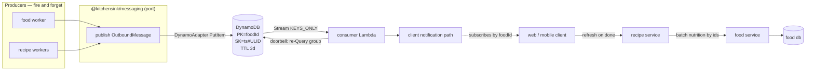

# feat: PR 91 foundation hardening

## Summary

Harden the three shipped features, build a durable per-entity message substrate on DynamoDB that any
producer can write to fire-and-forget, make the food service the sole owner of nutrition data, give
all 203 verified findings a disposition, and re-specify features 004–014 so the other worktrees can
rebase onto something coherent. No new user-visible feature ships.

---

## Problem frame

Three shipped features carry verified defects, including a GDPR erasure path where all three layers of
defence are simultaneously non-functional. Asynchronous work has nowhere durable to report progress —
the event emitter is a console stub and the AWS SDK for the bus is a dependency of no package. The
recipe service keeps its own copy of food's nutrition data, so the same recipe can already show three
different calorie numbers. And features 004–014 were specified independently and now contradict each
other and the decisions of the last three days.

---

## Requirements traceability

| Origin                           | Covered by                                                                          |
| -------------------------------- | ----------------------------------------------------------------------------------- |
| R1 message substrate (R1.1–R1.9) | U4, U5, U6, U7                                                                      |
| R2 food placeholders (R2.1–R2.4) | U8, U9                                                                              |
| R3 shipped defects (R3.1–R3.4)   | U1, U2, U12                                                                         |
| R4 standards                     | **Landed** — `028f88c9`, `c627679d`, `1f90abc7`, `02ebf2cb`, `72ff7884`, `293a21af` |
| R5 portfolio respec (R5.1–R5.5)  | U13, U14                                                                            |
| Amendment — card calories        | **Superseded by KTD-3** (owner, 2026-08-15)                                         |

---

## Key technical decisions

**KTD-1 — The substrate is DynamoDB, entered through ADR-0016's own escalation clause.**
ADR-0016 chose Valkey by owner ruling and named DynamoDB as the escalation "if a loss is ever judged
unacceptable". R1.3 makes loss unacceptable, so the clause fires. Two supporting facts, neither of
them price: **ElastiCache is VPC-only**, which R1.1 forbids for producers; and Valkey pub/sub drops a
message when no listener is connected, which R1.3 forbids. _(The brainstorm's D1 rejected Valkey at
$61.32/mo. That was the **Redis OSS** row. Valkey measures ≈$6.13/mo. The price argument is withdrawn.)_

**KTD-2 — The sort key carries a ULID suffix, and the stream record is a doorbell, not data.**
`PutItem` **replaces** on an identical `PK+SK`, so `SK = <timestamp>` silently destroys two messages
written in the same millisecond and returns HTTP 200 — unobservable to a fire-and-forget producer.
`SK = <ISO-8601 ms>#<ULID>`. Separately, AWS orders stream records **per item (PK _and_ SK)**, not per
partition key, so the "a group arrives in order for free" premise is false. On trigger the consumer
**re-queries the group** — which _is_ ordered — rather than reading record contents. This makes
ordering correct by construction, duplicates harmless, `parallelizationFactor` safe, and `KEYS_ONLY`
the right stream view.

**KTD-3 — The food service owns nutrition outright; the recipe service stores none of it.**
Drop `calories_per_100g`, `protein_g_per_100g`, `carbs_g_per_100g`, `fat_g_per_100g` and `portions`
from `ingredients`, **and drop `recipes.lead_calories_per_serving`**. A new batch nutrition endpoint on
food takes many ids and returns their values, fast and cacheable; the recipe service calls it on
detail **and on list/search**. `recipeIngredients.userCalories` and siblings are **user overrides, not
food data** — they stay and remain pinned. Supersedes the 2026-08-15 card-calorie amendment: with no
event consumption there is nothing to refresh a stored total, and the total is itself duplicated data.

**KTD-4 — The recipe service does not consume food events.** It asks when it needs data. The
substrate's only consumer is the client-notification path. Since food cannot know who requested a food
(the requesters table deletes its rows in the transaction that completes the work — this already
misrouted feature 003), **the client subscribes to the food ids it holds**, which it receives in the
recipe response. Group key is therefore the food id.

**KTD-5 — Mobile streaming uses `expo/fetch`, gated on a spike.** React Native's built-in `fetch`
cannot read a streaming body; `expo/fetch` can and is present in SDK 57, with Vercel's official Expo
guide depending on it. Gated because SDK 57 has an open Android large-response bug. **Fallback: two
requests.** Flip condition: the app ever leaving Expo-managed workflow.

**KTD-6 — Every finding gets a disposition, not a fix.** `fixed` / `rejected` with a checkable reason /
`deferred` with a trigger. Some findings resolve as "working as designed" (the contract-hash corpus
rule closed a false-guarantee hazard three days ago) or "prod is stale" (the alarm code is already
correct and gated).

---

## High-level technical design

**The read path, after KTD-3.** A recipe detail or a recipe list collects the distinct `food_id`s it
references, makes **one** batched call to food's new endpoint, and computes nutrition from the
response. The recipe service holds `food_id` and `food_resolution_status` and nothing else
food-derived.

---

## Implementation units

### U1. Verify the erasure failure is provisioning, not code

**Goal** Determine whether the 36-of-38 reconciliation failures and the dead prod alarm are a missing
credential and a stale deploy, before writing any erasure code.
**Requirements** R3.1, R3.2 · **Dependencies** none
**Files** `docs/runbooks/cr-002-erasure-key-provisioning.md` (verify block), read-only AWS describes
**Approach** Run the runbook's verify block for the four prod values (one Secrets Manager EdDSA key,
two SSM public keys, two SSM base URLs). Separately check the deployed alarm's dimensions against the
synthesized template. **Minting the prod signing key is an owner action and is out of scope for
implementation** — the unit reports, it does not provision.
**Verification** A written finding stating, with evidence, which of provisioning / stale deploy / code
defect is the cause for each of the three symptoms.
**Test expectation: none — this is a diagnostic unit.**

### U2. Close the erasure gap the verification identifies

**Goal** Make account erasure actually erase, and stop the UI claiming more than it does.
**Requirements** R3.1 · **Dependencies** U1
**Files** `packages/apps/commise/features/account/src/**`, `packages/services/identity/src/users/**`,
`packages/services/identity-webhooks/src/common/erasureFanout.ts`
**Approach** Two problems, only one of which provisioning can explain. The webhook fan-out failing is
likely the missing key. **The app's erase button reaching only the recipe service is wiring**, and no
credential fixes it. Correct the UI copy so it states what the flow actually does.
**Test scenarios**

- Erase from the app → identity, Clerk, avatar storage and food are all reached, not just recipes
- After erasure completes, a sign-in attempt with the same credentials fails
- Fan-out with a missing signing key → fails closed, surfaces an error, erases nothing partially
- The confirmation copy asserts only what the implemented flow performs
  **Verification** An erasure initiated from the app removes the user's data from every service holding
  it, proven on the local stack.

### U3. Amend the three contradicting ADRs

**Goal** Leave no accepted decision contradicting what PR 91 builds.
**Requirements** R5.2 (governance) · **Dependencies** none
**Files** `docs/architecture/decisions/0019-recipe-import-spine.md`,
`docs/architecture/decisions/0016-notification-retention-payload-dedup-and-valkey.md`,
`docs/architecture/decisions/0017-service-ownership-for-features-006-007-009-010.md`
**Approach** ADR-0019 §4 currently mandates supersession by monotonic sequence — replace with
consumer-side selection, recording the single-writer-per-group invariant as the precondition. §1
mandates one shared processor — replace with per-domain processors converging at recipe creation.
ADR-0016 records its escalation clause firing on R1.3, and states plainly that the substrate and the
notification service's pending set are two stores. ADR-0017's 006 amendment gets honest reasoning —
both original arguments were refuted.
**Verification** No ADR asserts behaviour this PR contradicts; each amendment names what changed and why.
**Test expectation: none — documentation.**

### U4. The `publish` port and its adapters

**Goal** A published seam producers depend on, with no storage technology visible to them.
**Requirements** R1.1, R1.4, R1.9 · **Dependencies** U3
**Files** new `packages/shared/messaging/src/{publish.ts,OutboundMessage.ts,InMemoryPublisher.ts,ConsolePublisher.ts,index.ts}`,
plus `packages/shared/messaging/{package.json,tsconfig.json,vitest.config.ts}`
**Approach** Rename and promote the existing `EventBus.putEvent` seam. **This is a shape change, not a
move** — the current `{ detailType, detail }` is EventBridge-shaped; `OutboundMessage` needs a group key
and a timestamp. Follow `cdnInvalidation.ts`'s precedent: the contract is shared, adapters stay local
to each runtime. One class per file (§1). `FoodEventEmitter`'s DSN-9 policy — publish `FetchFailed`
only on a `FAILED` tombstone, never `NOT_FOUND` — must survive the promotion and must **not** leak into
the generic port.
**Patterns to follow** `packages/shared/recipe-core/src/cdnInvalidation.ts`
**Test scenarios**

- `publish` resolves without awaiting any consumer
- An adapter that throws does not propagate to the caller (fire-and-forget)
- `InMemoryPublisher` captures messages in order for assertions
- The five hand-rolled test doubles in food-service are replaced by `InMemoryPublisher`
- `OutboundMessage` rejects a missing group key or timestamp at the boundary
  **Verification** No producer imports a storage SDK; swapping the adapter requires no producer change.

### U5. The DynamoDB table and its infrastructure

**Goal** A durable per-group message store with TTL, reachable by IAM without VPC attachment.
**Requirements** R1.1, R1.2, R1.3, R1.5, R1.7 · **Dependencies** U3
**Files** `packages/infra/global/lib/platform/MessageSubstrateStack.ts` (+ `__tests__/`),
`packages/infra/global/bin/app.ts`
**Approach** `PK = groupId`, `SK = <ISO-8601 ms>#<ULID>` per KTD-2. On-demand billing, TTL attribute as
a **Number** (a string TTL is silently ignored and nothing ever expires). Stream enabled `KEYS_ONLY`.
**Add a DynamoDB gateway VPC endpoint** — free, and without it VPC-attached Lambdas bill NAT data
processing. No Local Secondary Index. One SNS topic with an alarm action, per house convention.
**Test scenarios**

- Synth asserts partition and sort key names and types
- TTL attribute is Number-typed
- Stream view type is `KEYS_ONLY`
- Gateway endpoint present
- Every alarm carries `addAlarmAction`
- cdk-nag advisory attaches and the template is byte-identical
  **Verification** `cdk synth` clean; the table is reachable from a non-VPC Lambda with `PutItem` only.

### U6. The Dynamo adapter and its producer wiring

**Goal** Replace `ConsoleEventBus` in deployed stages with a real adapter.
**Requirements** R1.1, R1.3, R1.4 · **Dependencies** U4, U5
**Files** `packages/services/food-service/src/events/DynamoPublisher.ts`,
`packages/services/food-service/src/worker/main.ts`, `packages/services/food-service/package.json`
**Approach** `@aws-sdk/lib-dynamodb` (DocumentClient) for the Number-typed TTL invariant, with
`removeUndefinedValues: true`. Producer IAM is `PutItem` on **one table ARN** — no read, no query, no
scan. `ConsolePublisher` stays as the local-dev default so the worker never requires AWS.
**Execution note** A currently-green test certifies that a bus failure is swallowed. Invert it first.
**Test scenarios**

- A put failure is logged and does not propagate (fire-and-forget preserved)
- The TTL attribute is written as a Number
- Two messages in the same millisecond both persist (the ULID suffix works)
- IAM grants `PutItem` and nothing else
  **Verification** Messages appear in the table from a real producer path on the local stack.

### U7. The stream consumer

**Goal** A Lambda notified on write that reads a group's ordered history.
**Requirements** R1.2, R1.6, R1.8 · **Dependencies** U5, U6
**Files** `packages/services/recipe-workers/src/handlers/substrateConsumer.ts`,
`packages/services/recipe-workers/esbuild.mjs`, `packages/services/recipe-workers/infra/lib/RecipeWorkersStack.ts`
**Approach** Doorbell pattern per KTD-2 — on trigger, re-`Query` the group rather than reading record
contents. **Every read needs a TTL filter expression**: expired-but-unreaped items still return from
`Query`. Paginate on `LastEvaluatedKey`, never on an empty page. Explicit `retryAttempts` and
`maxRecordAge` — the defaults of `-1` let one poison record block a shard for 24 hours — plus
`bisectBatchOnError` and `reportBatchItemFailures`. **On-failure destination is S3**, because SQS and
SNS carry metadata only. Parse every record with zod at the boundary (GR-017).
**⚠️ Do not put a group or entity id in an EMF dimension** — the repo gate rejects it, and moving it to
a property fixes only the cost half. Scrubbed structured log line instead.
**Test scenarios**

- Redelivery of an already-applied record is idempotent
- A poison record is isolated rather than blocking the shard
- Expired items are excluded from the query result
- Pagination continues past an empty page when `LastEvaluatedKey` is present
- Records exhausting retries land in the S3 destination
- Handler entry point is registered in `esbuild.mjs`
  **Verification** A published message triggers the consumer, which reads the group in order.

### U8. Food's batch nutrition endpoint

**Goal** One call returns nutrition for many food ids, fast and cacheable.
**Requirements** R2.2, KTD-3 · **Dependencies** none
**Files** `packages/services/food-service/src/foods/foods.controller.ts`,
`packages/services/food-service/src/foods/**/*.schema.ts`, `packages/schemas/food/**`,
`packages/clients/food-service/src/client.ts`
**Approach** Authored zod beside the controller, generated into the schema package, `CONTRACT_HASH`
regenerated. Bounded input length — an unbounded id array is the shape that produced an existing
finding. Cache headers so the recipe service and any CDN can cache. Include resolution status per id so
a caller can distinguish "not yet resolved" from "no data".
**Test scenarios**

- Many ids in one call return in one response
- An unresolved id returns a status rather than being omitted silently
- An unknown id is reported, not an error for the whole batch
- Input over the cap is rejected with a structured error
- Response parses against the generated schema
- `CONTRACT_HASH` matches on both sides
  **Verification** The recipe service can render a 20-recipe list with one call to this endpoint.

### U9. Close the food placeholder gap

**Goal** A placeholder always reaches a terminal state and its status is readable.
**Requirements** R2.1, R2.3, R2.4 · **Dependencies** U8
**Files** `packages/services/food-service/src/foods/foods.service.ts`,
`packages/services/food-service/src/foods/dao/**`
**Approach** **Scope to the gap** — `fetch_queue`'s terminal states, lease reaper and retry budget
already ship. The defect is that `createByName` commits the placeholder **before** admission runs, so a
shed 503 strands a row with no queue entry and the retry path returns without enqueuing. **The fix is a
two-line reorder — admit before create** — not a reaper. Respect DSN-9: a `NOT_FOUND` tombstone is a
normal outcome and must not alarm.
**Test scenarios**

- A shed request leaves no stranded placeholder
- `batchAdd` under shed strands nothing
- A stalled placeholder is swept to a terminal state
- `NOT_FOUND` raises no alarm
- Status is readable for every placeholder state
  **Verification** No placeholder can remain non-terminal with no queue row.

### U10. Remove duplicated nutrition from the recipe service

**Goal** The food service is the sole owner of nutrition data.
**Requirements** KTD-3 · **Dependencies** U8
**Files** `packages/services/recipe-service/src/database/schema/ingredients.ts`,
`packages/services/recipe-service/src/database/schema/recipes.ts`, a new migration,
`packages/services/recipe-service/src/ingredients/dal/ingredients.dal.ts`,
`packages/services/recipe-service/src/recipes/recipes.service.ts`,
`packages/services/recipe-service/src/search/dal/search.dal.ts`,
`packages/shared/recipe-core/src/nutrition.ts`
**Approach** Drop the four per-100g columns and `portions` from `ingredients`, and drop
`recipes.lead_calories_per_serving`. Detail and list both compute from U8's endpoint.
`recipeIngredients.userCalories` and siblings **stay** — user overrides, pinned. Rewrite
`nutrition.ts:64-69`'s "can never disagree" claim, which becomes **true** once the second source is
gone. ⚠️ `recipe-core` is shared: these functions also run client-side in the form preview, so the
change lands on web, mobile and the service together.
**Execution note** Characterization tests over current nutrition output first — this changes numbers
users see.
**Test scenarios**

- Detail nutrition matches the pre-change values for a fixture recipe
- A list of 20 recipes issues exactly one call to food
- A user override is preserved and is not overwritten by catalog data
- A recipe whose food is unresolved renders a defined state, not an error
- Migration is reversible and states what happens to existing rows
- The GDPR export no longer carries a stale stored total
  **Verification** Card and detail report the same number for the same recipe, from one source.

### U11. Wire alarm subscriptions

**Goal** Every alarm reaches a human.
**Requirements** R3.2 · **Dependencies** U1
**Files** the five service stacks' SNS topics, `packages/infra/global/lib/platform/CostGuardrailsStack.ts`
**Approach** Owner ruling: **all** alarm topics subscribe to one address. This reverses a documented
convention (subscriptions were out-of-band so no address sat in a committed template, and this
repository is public) — follow `CostGuardrailsStack`'s existing `alertEmail` prop pattern so the
address arrives as per-stage configuration rather than committed source.
**Test scenarios**

- Every topic in every stack has a subscription when the address is configured
- Synth degrades gracefully when it is not configured
- No address appears in any committed file
  **Verification** A deliberately-tripped alarm produces a delivered notification.

### U12. Disposition all 203 findings

**Goal** Every finding ends `fixed`, `rejected` with a reason, or `deferred` with a trigger.
**Requirements** R3.3, R3.4 · **Dependencies** U1–U11
**Files** `docs/reviews/2026-08-14-pr91-findings/00-INDEX.md`, plus the files each fix touches
**Approach** Work the index. Fix in severity order. **Known non-fixes**: the contract-hash corpus rule
is working as designed and gets a diagnostic note, not a change; the erasure alarm is a stale prod
deploy; two `DROP INDEX` recommendations must not ship without `EXPLAIN (ANALYZE, BUFFERS)` evidence;
several findings assume snapshot nutrition and are superseded by KTD-3. **`CREATE INDEX CONCURRENTLY`
cannot run** — all three migration runners wrap each file in a transaction; follow food's
`CREATE DATABASE` carve-out shape rather than unwrapping it.
**Priority fixes** kcal/kJ non-determinism (a refresh can flip the pick, 4.184× wrong); `addByName`
writing a caller's raw string as a shared global name; the unauthenticated memory-exhaustion vector;
zero `reservedConcurrency`; free-tier users unable to make a recipe private with `visibility`
defaulting to public.
**Test scenarios** Each fix carries the tiers §7.1 requires for its category; each rejection names a
reason a reviewer can check without reading code.
**Verification** No row in the index reads `open`.

### U13. Respec features 004–014 — contradictions first

**Goal** No two specs contradict each other or the amended ADRs.
**Requirements** R5.1, R5.2, R5.3 · **Dependencies** U3
**Files** `specs/004-recipe-importing/**` … `specs/014-notification-service/**`
**Approach** Documents only, **no code**. Fix the hard contradictions first: two features claiming the
same ALB priority; 006's per-PR bands exceeding the priority ceiling; foreign keys declared across
database boundaries in 007 and 009 (which 006's own C-006-002 already forbade); 004's tasks still
shipping OCR at launch; 011's plan still building a stateful service with its own save path.
⚠️ The review reports cite **pre-rename hyphenated paths** that no longer exist.
**Verification** No duplicate priority; no cross-database foreign key; no spec asserting a superseded ADR.
**Test expectation: none — documentation, gated by the existing spec conformance suites.**

### U14. Respec — the import spine and 011's reaper

**Goal** Specs reflect the decisions of 2026-08-14/15.
**Requirements** R5.4, R5.5 · **Dependencies** U13
**Files** `specs/004-recipe-importing/**`, `specs/011-recipe-digitization/**`, `specs/014-notification-service/**`
**Approach** 004 gains a first-class raw-text channel; mobile OCR output classifies `imported_paid`,
never `imported_physical`, so the premium gate keeps its enforcement point. 011 gets the on-device-first
OCR fallback **with the failure mode named** — the heuristic cannot catch a result that is wrong but
confident, so a manual "re-run in the cloud" escape hatch is required — plus a 3-day reaper for its own
stale jobs and artifacts, cross-referencing ADR-0016's window. 011 states the single-writer-per-group
invariant that makes timestamp selection safe. 014 drops the supersession machinery the substrate no
longer needs.
**Verification** Every 2026-08-14/15 decision appears in the spec that owns it; tasks regenerate cleanly.

---

## Scope boundaries

**In scope** — everything above, in PR 91, on the existing branch.

**Explicitly not in scope**

- The import UI. 004's worktree is 16 commits ahead with the spine, file channel and typed client
  built; the UI lands there after rebase.
- 011's image branch and correction UI.
- Feature 014 beyond the substrate.
- Splitting god files. The gate ships and violations are enumerated; the splits are separate.

### Deferred to follow-up work

- The six generated schema barrels still use `export *` — generator work plus its tests plus three
  contract suites.
- Widening the nightly-shutdown selector to `pr-{N}` clusters (~37% preview compute saving). ADR-0010
  scopes it to its own PR, and it needs a matching IAM widening or it fails silently.
- `AccountSuspendedError` / `ImpersonationBlockedError` have no thrower and no catcher — possibly dead
  public API; deleting exported surface of a shared package is an owner call.

---

## Risks and dependencies

| Risk                                                                                                                                                                                                                                                       | Mitigation                                                                                                                                                       |
| ---------------------------------------------------------------------------------------------------------------------------------------------------------------------------------------------------------------------------------------------------------- | ---------------------------------------------------------------------------------------------------------------------------------------------------------------- |
| **Background recipe→food calls have no service credential.** The erasure token cannot simply gain an audience — its claims model "erasure of one owner", its `sub` must be an owner ULID, and its private key lives only in the identity-webhooks Lambdas. | A new capability token, designed as such. Not a one-line change. Blocks nothing in U1–U12 as scoped, since U8's endpoint is called on a user request.            |
| **`expo/fetch` has an open SDK 57 Android bug.**                                                                                                                                                                                                           | KTD-5's spike verifies against SDK 57 with real payload boundaries before any streaming work. Fallback is two requests.                                          |
| **LocalStack Community was discontinued 2026-03-23**, replaced by a token-gated free tier. The repo's harness assumes "Community, no token".                                                                                                               | Pre-existing CI risk, independent of this work. Verify before relying on the local tier; DynamoDB Local is free and tokenless but cannot reproduce partitioning. |
| **`CREATE INDEX CONCURRENTLY` cannot run** in any of three migration runners.                                                                                                                                                                              | Follow food's `CREATE DATABASE` carve-out shape. Never unwrap the transaction — it exists so a partial schema cannot pass silently.                              |
| Dropping nutrition columns changes numbers users see.                                                                                                                                                                                                      | Characterization tests first (U10 execution note); migration states its effect on existing rows.                                                                 |

---

## Open questions

- **Q-A** Does the client-subscribes-by-food-id model (KTD-4) hold when a recipe references many foods —
  does it subscribe to each, or is there a per-recipe group? Resolve before U7's addressing is fixed.
- **Q-B** Does the DynamoDB gateway endpoint cover the separate `streams.dynamodb` endpoint? Flagged
  unresolved by research; affects whether the consumer needs NAT.
- **Q-C** Is the 12-month tombstone→erasure sweep scheduled? Plan 002 accepted it as a time-boxed risk
  with a hard due-by, and `tombstoneSweep` exists but its schedule is unverified.

---

## Sources

- Origin: `docs/brainstorms/2026-08-15-pr91-foundation-requirements.md`
- Findings: `docs/reviews/2026-08-14-pr91-findings/00-INDEX.md` (203, 31 reports)
- Substrate research: reports `17`, `28`, `29`, `30` in that directory
- RN streaming: report `31`
- ADRs: 0003, 0006, 0010, 0014, 0015, 0016, 0017, 0018, 0019
