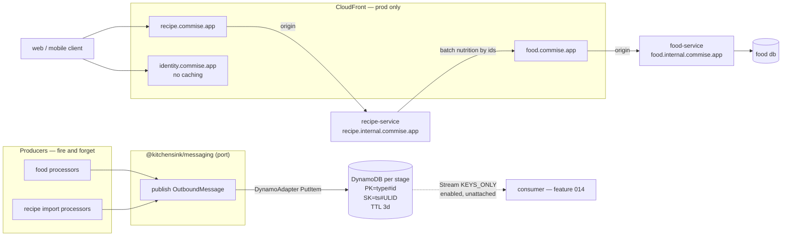

# feat: PR 91 foundation hardening

## Summary

Harden the three shipped features, build a durable per-group message substrate on DynamoDB that any
producer can write to fire-and-forget, make the food service the sole owner of nutrition data, put a
CloudFront edge in front of every production service, give all 203 verified findings a disposition, and
re-specify features 004–014 so the other worktrees can rebase onto something coherent. No new
user-visible feature ships.

> **Revision note (2026-08-15).** This plan was rewritten after a multi-persona document review raised
> 31 findings, of which 16 were substantive. Two design decisions were invalidated outright and
> replaced by owner rulings: the food service does **not** store per-100g macros (KTD-3), and U9's
> "two-line reorder" is impossible (U9). The edge/CDN track (U15–U17) is new scope added by owner
> ruling on the same day and is **not** derived from the origin document.

---

## Problem frame

Three shipped features carry verified defects, including a GDPR erasure path where all three layers of
defence are simultaneously non-functional. Asynchronous work has nowhere durable to report progress —
the event emitter is a console stub and the AWS SDK for the bus is a dependency of no package. The
recipe service keeps its own copy of food's nutrition data, derived by a substring guess, so the same
recipe can already show three different calorie numbers. Every service is reachable only through a bare
ALB with no edge in front of it. And features 004–014 were specified independently and now contradict
each other and the decisions of the last three days.

**Operating context that shapes every risk judgement below:** there is one developer, a limited number
of open PRs, no production traffic beyond occasional test traffic, and — owner ruling, 2026-08-15 —
**service disruption and downtime are acceptable.** Migrations, DNS cutovers and stack replacements are
therefore sequenced for correctness and verifiability, not for zero-downtime.

---

## Requirements traceability

| Origin                                 | Covered by                                                                          |
| -------------------------------------- | ----------------------------------------------------------------------------------- |
| R1 message substrate (R1.1–R1.9)       | U4, U5, U6, U7                                                                      |
| R2 food placeholders (R2.1–R2.4)       | U8, U9                                                                              |
| R3 shipped defects (R3.1–R3.4)         | U1, U2, U11, U12                                                                    |
| R4 standards                           | **Landed** — `028f88c9`, `c627679d`, `1f90abc7`, `02ebf2cb`, `72ff7884`, `293a21af` |
| R5 portfolio respec (R5.1–R5.5)        | U3, U13, U14                                                                        |
| R6 edge topology — **not from origin** | U15, U16, U17 (owner ruling, 2026-08-15)                                            |
| Amendment — card calories              | **Superseded by KTD-3** (owner, 2026-08-15)                                         |

---

## Key technical decisions

**KTD-1 — The substrate is DynamoDB, entered through ADR-0016's own escalation clause.**
ADR-0016 chose Valkey by owner ruling and named DynamoDB as the escalation "if a loss is ever judged
unacceptable". R1.3 makes loss unacceptable, so the clause fires. Two supporting facts, neither of
them price: **ElastiCache is VPC-only**, which R1.1 forbids for producers; and Valkey pub/sub drops a
message when no listener is connected, which R1.3 forbids. _(The brainstorm's D1 rejected Valkey at
$61.32/mo. That was the **Redis OSS** row. Valkey measures ≈$6.13/mo. The price argument is withdrawn.)_

**KTD-2 — The group key is `type` + `id`; the sort key carries a ULID suffix; the stream record is a
doorbell, not data.** The group key is **two fields**, a producer type and an entity id, composed into
`PK` (owner ruling). The earlier `PK = foodId` did not generalise: the two named producers are the food
processors _and_ the recipe import processors, and an import job has no food id. Keeping the type
explicit also makes "all import messages" queryable, which a single opaque string would not.
`PutItem` **replaces** on an identical `PK+SK`, so `SK = <timestamp>` silently destroys two messages
written in the same millisecond and returns HTTP 200 — unobservable to a fire-and-forget producer.
`SK = <ISO-8601 ms>#<ULID>`. Separately, AWS orders stream records **per item (PK _and_ SK)**, not per
partition key, so the "a group arrives in order for free" premise is false. A consumer must therefore
treat the stream as a doorbell and **re-query the group** — which _is_ ordered — rather than read record
contents. This makes ordering correct by construction, duplicates harmless, `parallelizationFactor`
safe, and `KEYS_ONLY` the right stream view.

**KTD-3 — The food service owns nutrition outright, including the projection.**
The plan previously assumed food stores per-100g macros. **It does not.** Food stores nutrients as EAV
rows and returns them raw as `NutrientView[]` (`foods.schema.ts:79`), plus portions as
`{label, gramWeight}`. The projection into calories/protein/carbs/fat lives in the **recipe** service —
`ingredients.service.ts:131`, which selects the energy nutrient by substring guess
(`name.includes('energy') || name.includes('calorie')`). So "food owns nutrition" is only true if the
projection moves with the data. It does (owner ruling).

This is smaller than it sounds: food **already holds the canonical mapping** at
`usda.adapter.ts:114` — `calories: { name: 'Energy', unit: 'kcal' }`. U8 uses the map food already owns
instead of recipe guessing at it, which **closes the kcal/kJ non-determinism finding as a side effect**
rather than as separate work.

Consequently the recipe service drops `calories_per_100g`, `protein_g_per_100g`, `carbs_g_per_100g`,
`fat_g_per_100g` **and `portions`** from `ingredients`, and drops **both** `recipes.lead_calories_per_serving`
**and `recipes.has_partial_nutrition`** — the second was missed in the first draft and is the same
derived data, present in the wire contract and the GDPR export, so leaving it would freeze it at its
last pre-migration value. `portions` may only be dropped because U8 returns it; without that,
`unitToGrams` (`units.ts:83`) loses its gram weights, every volumetric line becomes unaccountable, and
recipes silently flip to "partial estimate". `recipeIngredients.userCalories` and siblings are
**user overrides, not food data** — they stay and remain pinned. Supersedes the 2026-08-15
card-calorie amendment: with no event consumption there is nothing to refresh a stored total, and the
total is itself duplicated data.

**KTD-3a — Ingredients carry nutrition inline **and** expose food ids** (owner ruling). Recipe-service
calls food and returns ingredients with nutrition attached under today's field names, so no app change
is required, **and** also exposes `food_id` so a client can go direct later. Accepted cost: two routes
to the same data, which tend to drift — U10 owns a test that asserts they agree.

**KTD-4 — The recipe service does not consume food events.** It asks when it needs data.
_(Corrected: the first draft justified this by claiming food cannot know who requested a food. That is
false — `FetchQueueDao.listRequesterIds()` exists and is already called before publish.)_ The real
reason is narrower and stronger: copying requester identity into a TTL'd message store would recreate
the user↔food linkage **outside food's erasure boundary**, where the erasure path cannot reach it.
Consumers subscribe by the group key of KTD-2, which the client receives in the recipe response.

**KTD-5 — `expo/fetch` streaming, repointed at import progress** (owner ruling). KTD-3 removes the
streamed nutrition payload this decision originally applied to, but long-running import and OCR jobs
genuinely benefit from streamed progress, so the decision survives with a new subject. React Native's
built-in `fetch` cannot read a streaming body; `expo/fetch` can and is present in SDK 57, with Vercel's
official Expo guide depending on it. Gated because SDK 57 has an open Android large-response bug.
**Fallback: two requests.** Flip condition: the app ever leaving Expo-managed workflow.

**KTD-6 — Every finding gets a disposition, not a fix.** `fixed` / `rejected` with a checkable reason /
`deferred` with a trigger. Some findings resolve as "working as designed" (the contract-hash corpus
rule closed a false-guarantee hazard three days ago) or "prod is stale" (the alarm code is already
correct and gated).

**KTD-7 — Every production service sits behind CloudFront; the ALB moves to an internal name**
(owner ruling, new scope). Public hostnames become `{service}.commise.app` on CloudFront; ALB origins
become `{service}.internal.commise.app`. **Prod only** — no sandbox, no per-PR, because a distribution
takes 5–15 minutes to deploy and cannot be deleted without first disabling and waiting for propagation,
which would wreck the ADR-0005/0010 preview machinery.

Three consequences the implementer must not discover the hard way:

1. **The current ALB certificate does not cover `*.internal.commise.app`.** It covers `commise.app`,
   `*.commise.app` and `*.sandbox.commise.app` — **single-label wildcards only**. This is the identical
   trap already documented at `FoodServiceStack.ts:99-103` (why the host is `food-pr-7`, not
   `food.pr-7`). One added `*.internal.commise.app` wildcard covers every service and every stage, but
   it requires an ACM change with DNS validation **before any ALB can answer on the new name**.
2. **Caching and per-request auth are in tension, and the resolution is edge verification.** Including
   `Authorization` in the cache key gives each rotating Clerk JWT its own entry, so the hit rate is
   ~zero. Excluding it makes CloudFront serve cached `200`s to requests the origin never authenticated —
   an auth bypass. Therefore **Lambda@Edge on viewer-request verifies the Clerk JWT** (reusing the
   existing networkless verifier in `@kitchensink/clerk-verify`) and the cache key is the URL alone.
   `CLERK_JWT_KEY` is a **public** key, so baking it into the bundle is safe — which matters because
   Lambda@Edge cannot read environment variables.
3. **Identity is fronted but not cached.** Its responses are per-user and would cache nothing, and it
   sits directly in the Clerk auth path where CloudFront's default `Host` rewriting is the exact failure
   class that made PR 73's previews unreachable (ADR-0001). It gets the edge for the security layer —
   WAF attachment point, TLS termination, request shaping — with caching explicitly disabled.

---

## High-level technical design

**The read path, after KTD-3.** A recipe detail or a recipe list collects the distinct `food_id`s it
references, makes **one** batched call to food's new endpoint through the edge, and attaches the
returned nutrition to its ingredients inline (KTD-3a). The recipe service holds `food_id` and
`food_resolution_status` and nothing else food-derived. Two caches sit on this path: a short-lived
in-process cache in recipe-service, and CloudFront in front of food.

**The substrate, after the owner ruling.** PR 91 builds the **producer half only** — the port, the
adapter, the per-stage table, and the stream **enabled but unattached**. There is no consumer in this
PR; consumers arrive with feature 014. This is deliberate and safe because the store is durable, not a
transient bus: messages written today are still there when a reader appears. **One consequence worth
stating plainly — with the 3-day reaper, anything published before 014 exists is gone before any
consumer can read it. The substrate is not a backfill source.**

---

## Implementation units

### U1. Verify the erasure failure is provisioning, not code

**Goal** Determine whether the 36-of-38 reconciliation failures and the dead prod alarm are a missing
credential and a stale deploy, before writing any erasure code.
**Requirements** R3.1, R3.2 · **Dependencies** none
**Files** `docs/runbooks/cr-002-erasure-key-provisioning.md` (verify block), read-only AWS describes
**Approach** Run the runbook's verify block for the four prod values (one Secrets Manager EdDSA key,
two SSM public keys, two SSM base URLs). Separately check the deployed alarm's dimensions against the
synthesized template. **Minting the prod signing key is an owner action and is out of scope for
implementation** — the unit reports, it does not provision.
**Verification** A written finding stating, with evidence, which of provisioning / stale deploy / code
defect is the cause for each of the three symptoms.
**Test expectation: none — this is a diagnostic unit.**

### U2. Close the erasure gap the verification identifies

**Goal** Make account erasure actually erase, and stop the UI claiming more than it does.
**Requirements** R3.1 · **Dependencies** U1
**Files** `packages/apps/commise/features/account/src/**`, `packages/services/identity/src/users/**`,
`packages/services/identity-webhooks/src/common/erasureFanout.ts`
**Approach** Two problems, only one of which provisioning can explain. The webhook fan-out failing is
likely the missing key. **The app's erase button reaching only the recipe service is wiring**, and no
credential fixes it. Correct the UI copy so it states what the flow actually does.
**Test scenarios**

- Erase from the app → identity, Clerk, avatar storage and food are all reached, not just recipes
- After erasure completes, a sign-in attempt with the same credentials fails
- Fan-out with a missing signing key → fails closed, surfaces an error, erases nothing partially
- The confirmation copy asserts only what the implemented flow performs
  **Verification** An erasure initiated from the app removes the user's data from every service holding
  it, proven on the local stack.

### U3. Amend the three contradicting ADRs, and write ADR-0020

**Goal** Leave no accepted decision contradicting what PR 91 builds, and record the new edge topology.
**Requirements** R5.2 (governance), R6 · **Dependencies** none
**Files** `docs/architecture/decisions/0019-recipe-import-spine.md`,
`docs/architecture/decisions/0016-notification-retention-payload-dedup-and-valkey.md`,
`docs/architecture/decisions/0017-service-ownership-for-features-006-007-009-010.md`,
new `docs/architecture/decisions/0020-cloudfront-edge-and-internal-alb-hostnames.md`
**Approach** ADR-0019 §4 currently mandates supersession by monotonic sequence — replace with
consumer-side selection, recording the single-writer-per-group invariant as the precondition. §1
mandates one shared processor — replace with per-domain processors converging at recipe creation.
ADR-0016 records its escalation clause firing on R1.3, and states plainly that the substrate and the
notification service's pending set are two stores. ADR-0017's 006 amendment gets honest reasoning —
both original arguments were refuted. **ADR-0020 is new** and must record all three traps from KTD-7:
the single-label wildcard cert constraint, the cache-key-versus-auth tension and its edge-verification
resolution, and identity being fronted-but-uncached with its ADR-0001 host-header hazard.
**Verification** No ADR asserts behaviour this PR contradicts; each amendment names what changed and why.
**Test expectation: none — documentation.**

### U4. The `publish` port and its adapters

**Goal** A published seam producers depend on, with no storage technology visible to them.
**Requirements** R1.1, R1.4, R1.9 · **Dependencies** U3
**Files** new `packages/shared/messaging/src/{publish.ts,OutboundMessage.ts,InMemoryPublisher.ts,ConsolePublisher.ts,index.ts}`,
plus `packages/shared/messaging/{package.json,tsconfig.json,vitest.config.ts}`
**Approach** Rename and promote the existing `EventBus.putEvent` seam. **This is a shape change, not a
move** — the current `{ detailType, detail }` is EventBridge-shaped; `OutboundMessage` needs the
**two-field group key of KTD-2** (`groupType` + `groupId`) and a timestamp. Follow `cdnInvalidation.ts`'s
precedent: the contract is shared, adapters stay local to each runtime. One class per file (§1).
`FoodEventEmitter`'s DSN-9 policy — publish `FetchFailed` only on a `FAILED` tombstone, never
`NOT_FOUND` — must survive the promotion and must **not** leak into the generic port.
**Patterns to follow** `packages/shared/recipe-core/src/cdnInvalidation.ts`
**Test scenarios**

- `publish` resolves without awaiting any consumer
- An adapter that throws does not propagate to the caller (fire-and-forget)
- `InMemoryPublisher` captures messages in order for assertions
- The five hand-rolled test doubles in food-service are replaced by `InMemoryPublisher`
- `OutboundMessage` rejects a missing `groupType`, `groupId` or timestamp at the boundary
- A `groupType` outside the known producer set is rejected at the boundary
  **Verification** No producer imports a storage SDK; swapping the adapter requires no producer change.

### U5. The DynamoDB table and its infrastructure

**Goal** A durable per-group message store with TTL, reachable by IAM without VPC attachment, **per
stage including per-PR**.
**Requirements** R1.1, R1.2, R1.3, R1.5, R1.7 · **Dependencies** U3
**Files** `packages/infra/global/lib/platform/MessageSubstrateStack.ts` (+ `__tests__/`),
`packages/infra/global/bin/app.ts`
**Approach** `PK = <groupType>#<groupId>`, `SK = <ISO-8601 ms>#<ULID>` per KTD-2. **One table per stage,
including every `pr-{N}`** (owner ruling) — full isolation, and teardown removes it with the stack, so
it must carry `Environment=pr-{N}` per ADR-0005 and must **never** be named or tagged such that a global
resource could match. On-demand billing, so an idle per-PR table costs essentially nothing. TTL attribute
as a **Number** (a string TTL is silently ignored and nothing ever expires). Stream enabled `KEYS_ONLY`
**with no consumer attached** — enabling it now means feature 014 can attach without a table change. No
Local Secondary Index. **Add a DynamoDB gateway VPC endpoint** — free, and without it VPC-attached
Lambdas bill NAT data processing. One SNS topic with an alarm action, per house convention.
**Test scenarios**

- Synth asserts partition and sort key names and types
- TTL attribute is Number-typed
- Stream view type is `KEYS_ONLY`
- Gateway endpoint present
- Every alarm carries `addAlarmAction`
- A `pr-{N}` stage synthesizes a table tagged `Environment=pr-{N}`, and a global stage never does
- The table name matches the `pr-scope.sh` delimiter rule (pr-1 must not match pr-15)
- cdk-nag advisory attaches and the template is byte-identical
  **Verification** `cdk synth` clean; the table is reachable from a non-VPC Lambda with `PutItem` only.

### U6. The Dynamo adapter and its producer wiring

**Goal** Replace `ConsoleEventBus` in deployed stages with a real adapter, in both producer services.
**Requirements** R1.1, R1.3, R1.4 · **Dependencies** U4, U5
**Files** `packages/services/food-service/src/events/DynamoPublisher.ts`,
`packages/services/food-service/src/worker/main.ts`, `packages/services/food-service/package.json`,
`packages/services/food-service/infra/lib/FoodServiceStack.ts`,
`packages/services/recipe-workers/infra/lib/RecipeWorkersStack.ts`
**Approach** `@aws-sdk/lib-dynamodb` (DocumentClient) for the Number-typed TTL invariant, with
`removeUndefinedValues: true`. Producer IAM is `PutItem` on **one table ARN** — no read, no query, no
scan. `ConsolePublisher` stays as the local-dev default so the worker never requires AWS.
**Cross-stack wiring, previously unspecified:** `MessageSubstrateStack` lives in `packages/infra/global`
while both producers live in their own apps, so the table name and ARN cross an app boundary. Export
them as CloudFormation outputs and `Fn.importValue` them, exactly as the services already import the
shared ALB listener ARN (ADR-0003) — **and inherit that ADR's ordering constraint: the substrate stack
must deploy before either producer.**
**Execution note** A currently-green test certifies that a bus failure is swallowed. Invert it first.
**Test scenarios**

- A put failure is logged and does not propagate (fire-and-forget preserved)
- The TTL attribute is written as a Number
- Two messages in the same millisecond both persist (the ULID suffix works)
- IAM grants `PutItem` and nothing else
- Both producers resolve the table by import, not by a hardcoded name
- Synth fails loudly when the substrate export is absent, rather than producing a dangling reference
  **Verification** Messages appear in the table from a real producer path on the local stack.

### U7. Enable the stream and hand the doorbell contract to 014

**Goal** Leave the substrate consumable without building a consumer that has nothing to notify.
**Requirements** R1.2, R1.6, R1.8 · **Dependencies** U5
**Files** `specs/014-notification-service/**`, `docs/architecture/decisions/0016-*.md`
**Approach** **Scope change from the first draft.** Owner ruling: consumers arrive with feature 014, so
PR 91 builds no consumer Lambda. The stream is enabled in U5; this unit records the contract 014 must
implement, so the design work already done is not lost:

- Doorbell pattern per KTD-2 — on trigger, re-`Query` the group rather than reading record contents.
- **Every read needs a TTL filter expression**: expired-but-unreaped items still return from `Query`.
- Paginate on `LastEvaluatedKey`, never on an empty page.
- Explicit `retryAttempts` and `maxRecordAge` — the defaults of `-1` let one poison record block a
  shard for 24 hours — plus `bisectBatchOnError` and `reportBatchItemFailures`.
- **On-failure destination is S3**, because SQS and SNS carry metadata only.
- Parse every record with zod at the boundary (GR-017).
- **⚠️ Do not put a group or entity id in an EMF dimension** — the repo gate rejects it, and moving it
  to a property fixes only the cost half. Scrubbed structured log line instead.
- Consumer-side selection per group is **most-recent-by-timestamp wins** (owner ruling); the consumer,
  not the producer, decides.

**Verification** 014's spec carries every item above, and no code in PR 91 attaches to the stream.
**Test expectation: none — documentation. The listed behaviours become 014's test scenarios.**

### U8. Food's batch nutrition endpoint — including the projection

**Goal** One call returns **normalized** nutrition for many food ids, fast and cacheable.
**Requirements** R2.2, KTD-3 · **Dependencies** none
**Files** `packages/services/food-service/src/foods/foods.controller.ts`,
`packages/services/food-service/src/foods/**/*.schema.ts`, `packages/schemas/food/**`,
`packages/clients/food-service/src/client.ts`,
moved from `packages/services/recipe-service/src/ingredients/ingredients.service.ts:131`
**Approach** The endpoint returns **per-100g macros and portions**, not raw EAV rows — the projection
moves here (KTD-3). Use food's **existing canonical map** at `usda.adapter.ts:114`
(`calories: { name: 'Energy', unit: 'kcal' }`) rather than porting recipe's substring guess; this closes
the kcal/kJ non-determinism finding in passing. `portions` must be in the response or `unitToGrams`
breaks downstream (see U10).
Authored zod beside the controller, generated into the schema package, `CONTRACT_HASH` regenerated.
Bounded input length — an unbounded id array is the shape that produced an existing finding.
**Cache headers must be set deliberately**, since U16 puts CloudFront in front of this route and the
cache key will be the URL alone. Include resolution status per id so a caller can distinguish "not yet
resolved" from "no data".
**Test scenarios**

- Many ids in one call return in one response
- Energy is selected by name+unit, not substring — a food with a `kJ` energy row does not yield a
  4.184×-wrong calorie figure
- A food with no energy row reports absent, not zero
- Portions are returned with gram weights for every id that has them
- An unresolved id returns a status rather than being omitted silently
- An unknown id is reported, not an error for the whole batch
- Input over the cap is rejected with a structured error
- Response parses against the generated schema; `CONTRACT_HASH` matches on both sides
- The response carries cache headers, and they do not vary by caller
  **Verification** The recipe service can render a 20-recipe list with one call to this endpoint, and
  the numbers match the pre-change values for a fixture recipe.

### U9. Placeholder lifecycle — mark on failure, retry to a capped budget

**Goal** A placeholder always reaches a terminal state, its status is readable, and a failed sync is
retried a bounded number of times.
**Requirements** R2.1, R2.3, R2.4 · **Dependencies** U8
**Files** `packages/services/food-service/src/foods/foods.service.ts`,
`packages/services/food-service/src/foods/dao/**`, food's existing sweep/reaper worker
**Approach** **The first draft was wrong and is withdrawn.** It claimed a "two-line reorder — admit
before create" fixes this. It cannot: `admission.admit()` is conditioned on `createByName`'s dedupe
result (`if (result.created || result.reactivated)`), so admitting first would shed cheap catalog hits
as 503s — inverting the "never shed non-new work" rule — and `batchAdd` admits once after N creates,
so there is no single reorder that covers both paths.

The owner-specified design instead: food checks whether the item exists; if not it creates a placeholder
to be filled when USDA data arrives; **if the sync fails the record is marked accordingly**; and a
retry function re-enqueues it to the food processor queue, **tracking attempts so it is never tried more
than three times**. Concretely — when admission sheds, the placeholder is marked as awaiting retry
rather than left silently stranded; the sweep re-enqueues records awaiting retry whose attempt count is
under three; at three the record goes to a terminal failed state with a readable reason. Respect DSN-9:
a `NOT_FOUND` tombstone is a normal outcome and must not alarm.
**Verify before building** that food's existing reaper is actually scheduled — U1's sibling question
(Q-C) found one sweep whose schedule is unverified. If it is not scheduled, scheduling it is part of
this unit, not an assumption.
**Test scenarios**

- A shed request leaves a placeholder marked awaiting retry, never a silently stranded row
- A shed request does **not** consume admission capacity that a dedupe hit would have needed
- `batchAdd` under partial shed marks exactly the shed rows
- The retry path re-enqueues a marked record and increments its attempt count
- A record at three attempts is not re-enqueued and reads as terminally failed with a reason
- The attempt counter is not reset by a re-request of the same food
- `NOT_FOUND` raises no alarm
- Status is readable for every placeholder state
  **Verification** No placeholder can remain non-terminal with no queue row, and no record is retried
  more than three times.

### U10. Remove duplicated nutrition from the recipe service

**Goal** The food service is the sole owner of nutrition data.
**Requirements** KTD-3, KTD-3a · **Dependencies** U8
**Files** `packages/services/recipe-service/src/database/schema/ingredients.ts`,
`packages/services/recipe-service/src/database/schema/recipes.ts`, a new migration,
`packages/services/recipe-service/src/ingredients/dal/ingredients.dal.ts`,
`packages/services/recipe-service/src/ingredients/ingredients.service.ts`,
`packages/services/recipe-service/src/recipes/recipes.service.ts`,
`packages/services/recipe-service/src/search/dal/search.dal.ts`,
`packages/shared/recipe-core/src/nutrition.ts`, `packages/shared/recipe-core/src/units.ts`
**Approach** Drop the four per-100g columns **and `portions`** from `ingredients`, and drop **both**
`recipes.lead_calories_per_serving` **and `recipes.has_partial_nutrition`**. Delete
`ingredients.service.ts:131`'s substring projection — U8 owns it now. Detail, list and search all
compute from U8's endpoint. Ingredients carry nutrition **inline under today's field names and also
expose `food_id`** (KTD-3a), so no app change is required.

**Recipe-side cache** (owner ruling — caches at both layers): a short-lived in-process cache of resolved
food ids. Prefer `lru-cache` over `keyv` — keyv is a multi-backend adapter layer and this is a
single-process TTL cache; check the advisory state of whichever is chosen before adopting it.

`recipeIngredients.userCalories` and siblings **stay** — user overrides, pinned. Rewrite
`nutrition.ts:64-69`'s "can never disagree" claim, which becomes **true** once the second source is
gone. ⚠️ `recipe-core` is shared: these functions also run client-side in the form preview, so the
change lands on web, mobile and the service together.

**Migration posture** (owner ruling): the drop lands **in this PR**, and the migration plus the CDK
changes are run **against production locally using the `default` AWS profile**. There are **no
down-migrations in any runner**, and prod deploys code before migrating, so this is genuinely
irreversible by image rollback — acceptable because downtime is acceptable and there is no production
traffic. The plan must **not** claim the migration is reversible; it says what happens to existing rows
and that recovery is forward-only. Any index this unit adds uses **plain `CREATE INDEX`**, not
`CONCURRENTLY` — see U12.
**Execution note** Characterization tests over current nutrition output first — this changes numbers
users see.
**Test scenarios**

- Detail nutrition matches the pre-change values for a fixture recipe
- A list of 20 recipes issues exactly one call to food
- A volumetric line (cup, tbsp, clove) still resolves to grams using U8's portions
- A recipe that previously read "partial estimate" still does, derived rather than stored
- Nutrition read inline and nutrition fetched by `food_id` agree for the same ingredient (KTD-3a drift guard)
- A user override is preserved and is not overwritten by catalog data
- A recipe whose food is unresolved renders a defined state, not an error
- Food unreachable → the recipe renders without nutrition rather than failing
- The in-process cache returns a hit within its TTL and re-fetches after it
- The migration states its effect on existing rows and does not claim reversibility
- The GDPR export no longer carries a stale stored total or a stale partial-nutrition flag
  **Verification** Card and detail report the same number for the same recipe, from one source.

### U11. Wire alarm subscriptions

**Goal** Every alarm reaches a human.
**Requirements** R3.2 · **Dependencies** U1, U5
**Files** the five service stacks' SNS topics, `packages/infra/global/lib/platform/CostGuardrailsStack.ts`,
`packages/infra/global/lib/platform/MessageSubstrateStack.ts` (U5 adds a sixth topic)
**Approach** Owner ruling: **all** alarm topics subscribe to one address, and alarms are ordinary
observability — delivered to the owner's email and readable in the AWS console, not routed through the
notification service. This reverses a documented convention (subscriptions were out-of-band so no
address sat in a committed template, and this repository is public) — follow `CostGuardrailsStack`'s
existing `alertEmail` prop pattern so the address arrives as per-stage configuration rather than
committed source.
**Test scenarios**

- Every topic in every stack has a subscription when the address is configured
- Synth degrades gracefully when it is not configured
- No address appears in any committed file
  **Verification** A deliberately-tripped alarm produces a delivered notification.

### U12. Disposition all 203 findings

**Goal** Every finding ends `fixed`, `rejected` with a reason, or `deferred` with a trigger.
**Requirements** R3.3, R3.4 · **Dependencies** U1–U11
**Files** `docs/reviews/2026-08-14-pr91-findings/00-INDEX.md`, plus the files each fix touches
**Approach** Work the index. Fix in severity order. **Known non-fixes**: the contract-hash corpus rule
is working as designed and gets a diagnostic note, not a change; the erasure alarm is a stale prod
deploy; two `DROP INDEX` recommendations must not ship without `EXPLAIN (ANALYZE, BUFFERS)` evidence;
several findings assume snapshot nutrition and are superseded by KTD-3; the kcal/kJ finding is closed
by U8 rather than separately.

**`CREATE INDEX CONCURRENTLY` — corrected.** All three migration runners wrap each file in
`BEGIN/COMMIT`, so `CONCURRENTLY` cannot run. The first draft told the implementer to "follow food's
`CREATE DATABASE` carve-out shape" — **that shape does not exist**; the `CREATE DATABASE` call lives in
`ensureDatabase`, outside `runMigrations` entirely. With no production traffic, use **plain
`CREATE INDEX`**: the lock is milliseconds. A runner carve-out is the right answer once traffic exists;
it is deliberately **not** built now (YAGNI — the need is presumed, not present) and is recorded under
deferred work.

**Priority fixes** `addByName` writing a caller's raw string as a shared global name; the
unauthenticated memory-exhaustion vector; zero `reservedConcurrency`; free-tier users unable to make a
recipe private with `visibility` defaulting to public.
**Test scenarios** Each fix carries the tiers §7.1 requires for its category; each rejection names a
reason a reviewer can check without reading code.
**Verification** No row in the index reads `open`.

### U13. Respec features 004–014 — contradictions first

**Goal** No two specs contradict each other or the amended ADRs.
**Requirements** R5.1, R5.2, R5.3 · **Dependencies** U3
**Files** `specs/004-recipe-importing/**` … `specs/014-notification-service/**`
**Approach** Documents only, **no code**. Fix the hard contradictions first: two features claiming the
same ALB priority; 006's per-PR bands exceeding the priority ceiling; foreign keys declared across
database boundaries in 007 and 009 (which 006's own C-006-002 already forbade); 004's tasks still
shipping OCR at launch; 011's plan still building a stateful service with its own save path.
⚠️ The review reports cite **pre-rename hyphenated paths** that no longer exist.
**Verification** No duplicate priority; no cross-database foreign key; no spec asserting a superseded ADR.
**Test expectation: none — documentation, gated by the existing spec conformance suites.**

### U14. Respec — the import spine, 011's reaper, and 014's consumer

**Goal** Specs reflect the decisions of 2026-08-14/15.
**Requirements** R5.4, R5.5 · **Dependencies** U13, U7
**Files** `specs/004-recipe-importing/**`, `specs/011-recipe-digitization/**`, `specs/014-notification-service/**`
**Approach** 004 gains a first-class raw-text channel; mobile OCR output classifies `imported_paid`,
never `imported_physical`, so the premium gate keeps its enforcement point. 011 gets the on-device-first
OCR fallback **with the failure mode named** — the heuristic cannot catch a result that is wrong but
confident, so a manual "re-run in the cloud" escape hatch is required — plus a 3-day reaper for its own
stale jobs and artifacts, cross-referencing ADR-0016's window. 011 states the single-writer-per-group
invariant that makes timestamp selection safe. **014 absorbs U7's doorbell contract in full** and drops
the supersession machinery the substrate no longer needs; it also states that the substrate is not a
backfill source, since the 3-day reaper outruns 014's own delivery.
**Verification** Every 2026-08-14/15 decision appears in the spec that owns it; tasks regenerate cleanly.

### U15. The certificate and the internal ALB hostnames

**Goal** Every production service answers on `{service}.internal.commise.app` over TLS, **before** any
DNS moves to CloudFront.
**Requirements** R6, KTD-7 · **Dependencies** none
**Files** `packages/infra/global/lib/platform/SharedAlbStack.ts`, the DomainStack certificate,
`packages/services/food-service/infra/lib/FoodServiceStack.ts:652`,
`packages/services/recipe-service/infra/lib/RecipeServiceStack.ts:441`,
`packages/services/identity/infra/lib/IdentityServiceStack.ts:376`
**Approach** Add `*.internal.commise.app` to the shared ALB certificate — **this is the gate for
everything else in R6**, because the existing cert covers single-label wildcards only and a 3-label
internal name fails the TLS handshake (the trap documented at `FoodServiceStack.ts:99-103`). One
wildcard covers all services and all stages. Then add the internal hostname as an **additional** host
condition on each service's existing listener rule, and publish the matching Route 53 records — so both
the current public name and the new internal name resolve, and nothing has cut over yet.
**Test scenarios**

- Synth asserts the cert carries `*.internal.commise.app`
- Each listener rule matches both its current public host and its new internal host
- Rule priorities are unchanged and still unique (ADR-0003's allocator)
- A DNS record exists for each internal name
  **Verification** `curl https://food.internal.commise.app/health` succeeds with a valid certificate, for
  all three services, while the public names still serve from the ALB.

### U16. The edge verifier and the distributions

**Goal** Three CloudFront distributions in production, with Clerk verification at the edge.
**Requirements** R6, KTD-7 · **Dependencies** U15, U8
**Files** new `packages/infra/global/lib/platform/EdgeStack.ts` (+ `__tests__/`), new Lambda@Edge
handler package, `packages/infra/global/bin/app.ts`
**Approach** A viewer-request Lambda@Edge validates the Clerk session JWT using the existing networkless
verifier in `@kitchensink/clerk-verify`; the cache key is then the URL alone. `CLERK_JWT_KEY` is public,
so it is baked into the bundle — required, because **Lambda@Edge cannot read environment variables** —
and the bundle is therefore per-stage. Lambda@Edge must be deployed in `us-east-1`, which this account
already is. It runs on **every** request including cache hits; at current volume that is cents.

Three distributions: food and recipe cache, **identity does not** — its responses are per-user, it would
cache nothing, and it sits in the Clerk auth path where CloudFront's default `Host` rewriting is the
ADR-0001 failure class. Identity's distribution therefore forwards the viewer `Host` and disables
caching outright; its origin request policy must be verified against `azp` and CORS behaviour before
cutover. **Prod only** — no sandbox, no per-PR (owner ruling).
**Test scenarios**

- A request with a valid Clerk token passes the edge verifier
- A request with an expired, malformed, or wrong-issuer token is rejected at the edge, never reaching
  the origin
- A request with no token is rejected at the edge
- Two different valid tokens for the same URL hit the same cache entry
- A rejected request does not populate the cache
- Identity's distribution forwards the viewer `Host` and has caching disabled
- Synth asserts each distribution's origin is the `{service}.internal.commise.app` name, not the raw ALB
- cdk-nag advisory attaches
  **Verification** With the distributions live but DNS not yet cut over, requesting the distribution
  domain directly authenticates, caches, and returns the same body as the ALB.

### U17. DNS cutover and stale-record cleanup

**Goal** `{service}.commise.app` resolves to CloudFront; the ALB is reachable only at its internal name.
**Requirements** R6 · **Dependencies** U16
**Files** Route 53 records (operational), the three service stacks' A-record aliases
**Approach** Cut over one service at a time, food first (most cacheable, least coupled), then recipe,
then identity last — identity carries the auth path and the ADR-0001 hazard, so it moves only after the
other two are proven. Downtime during cutover is acceptable (owner ruling), so no weighted or staged
DNS is needed; each cutover is verified before the next begins. After cutover, remove the public host
condition from each ALB listener rule so the ALB answers only on its internal name.

**Cleanup, surfaced while verifying live DNS:** `food-pr-92.commise.app` and `recipe-pr-92.commise.app`
records exist — if PR 92 is closed, teardown leaked them and `teardown-sandbox-pr.sh` needs examining,
not just the records deleting. A stale ACM validation CNAME for a `identity.dev.commise.app` that no
longer exists should also go.
**Test scenarios**

- After cutover, each public name resolves to a CloudFront domain
- The prod smoke suite passes against the public name for all three services
- Sign-in succeeds end-to-end on web and mobile after identity's cutover
- The ALB no longer answers on any public `{service}.commise.app` host
  **Verification** All three services serve production traffic through CloudFront; the existing prod
  smoke checks pass unchanged against the public hostnames.

---

## Scope boundaries

**In scope** — everything above, in PR 91, on the existing branch.

**Explicitly not in scope**

- **The substrate consumer.** Owner ruling: consumers arrive with feature 014. PR 91 builds producers,
  the table, and an enabled-but-unattached stream.
- The import UI. 004's worktree is 16 commits ahead with the spine, file channel and typed client
  built; the UI lands there after rebase.
- 011's image branch and correction UI.
- Feature 014 beyond the substrate and U7's contract handoff.
- CDNs for sandbox or per-PR stages (owner ruling).
- Splitting god files. The gate ships and violations are enumerated; the splits are separate.

### Deferred to follow-up work

- A `CREATE INDEX CONCURRENTLY` carve-out in the three migration runners. Needed once production traffic
  exists; deliberately not built now.
- The six generated schema barrels still use `export *` — generator work plus its tests plus three
  contract suites.
- Widening the nightly-shutdown selector to `pr-{N}` clusters (~37% preview compute saving). ADR-0010
  scopes it to its own PR, and it needs a matching IAM widening or it fails silently.
- `AccountSuspendedError` / `ImpersonationBlockedError` have no thrower and no catcher — possibly dead
  public API; deleting exported surface of a shared package is an owner call.
- WAF attachment to the new distributions. The edge is the attachment point; the rules are their own work.

---

## Risks and dependencies

| Risk                                                                                                                                                                                                                                     | Mitigation                                                                                                                                                                                            |
| ---------------------------------------------------------------------------------------------------------------------------------------------------------------------------------------------------------------------------------------- | ----------------------------------------------------------------------------------------------------------------------------------------------------------------------------------------------------- |
| **This PR carries two independent, hard-to-reverse production changes** — the column drop (U10) and the DNS cutover of all three services (U17) — both run manually.                                                                     | Downtime is acceptable (owner ruling), which removes the coupling pressure. Sequence them apart: U15 and U16 land and are verified with DNS untouched; U17 cuts one service at a time, identity last. |
| **The ALB certificate does not cover `*.internal.commise.app`.** Until it does, no ALB can answer on the new name and every later unit is blocked.                                                                                       | U15 is the gate and has no dependencies — do it first. Its verification is a live `curl` against a real cert, not a synth assertion.                                                                  |
| **Lambda@Edge cannot read environment variables and must live in `us-east-1`.**                                                                                                                                                          | `CLERK_JWT_KEY` is a public key, so baking it per-stage into the bundle is safe. The account is already `us-east-1`.                                                                                  |
| **A CloudFront misconfiguration on identity breaks sign-in for both apps** — the ADR-0001 host-header failure class.                                                                                                                     | Identity is fronted but **not cached**, forwards the viewer `Host`, and cuts over last, after food and recipe are proven. Its `azp` and CORS behaviour is verified before the record moves.           |
| **The column drop is irreversible by image rollback** — no runner has a down path and prod deploys code before migrating.                                                                                                                | Accepted, stated explicitly rather than claimed reversible. Characterization tests first; recovery is forward-only. No production traffic to lose.                                                    |
| **Background recipe→food calls have no service credential.** The erasure token cannot simply gain an audience — its claims model "erasure of one owner", its `sub` must be an owner ULID, and its key lives only in the webhook Lambdas. | A new capability token, designed as such. Not a one-line change. Blocks nothing in U1–U12 as scoped, since U8's endpoint is called on a user request.                                                 |
| **`expo/fetch` has an open SDK 57 Android bug.**                                                                                                                                                                                         | KTD-5's spike verifies against SDK 57 with real payload boundaries before any streaming work. Fallback is two requests.                                                                               |
| **LocalStack Community was discontinued 2026-03-23**, replaced by a token-gated free tier. The repo's harness assumes "Community, no token".                                                                                             | Pre-existing CI risk, independent of this work. Verify before relying on the local tier; DynamoDB Local is free and tokenless but cannot reproduce partitioning.                                      |
| **Per-PR substrate tables add a resource to the teardown path.**                                                                                                                                                                         | Tagged `Environment=pr-{N}` per ADR-0005 so the existing tag-or-name sweep catches it. U5 tests the delimiter rule (pr-1 must not match pr-15). No new matcher is introduced.                         |

---

## Open questions

- **Q-A** ~~Does the client-subscribes-by-food-id model hold when a recipe references many foods?~~
  **Resolved** — KTD-2's group key is `type` + `id`, owner ruling 2026-08-15.
- **Q-B** Does the DynamoDB gateway endpoint cover the separate `streams.dynamodb` endpoint? Flagged
  unresolved by research. Now lower-stakes, since PR 91 attaches no consumer — but it must be resolved
  before 014 builds one.
- **Q-C** Is the 12-month tombstone→erasure sweep scheduled? Plan 002 accepted it as a time-boxed risk
  with a hard due-by, and `tombstoneSweep` exists but its schedule is unverified. **U9 depends on the
  answer for food's own reaper** — if food's sweep is likewise unscheduled, scheduling it is in U9's scope.
- **Q-D** Is PR 92 open? If closed, the live `food-pr-92` / `recipe-pr-92` DNS records mean teardown
  leaked, which is a defect in `teardown-sandbox-pr.sh`, not just stale records to delete (U17).

---

## Sources

- Origin: `docs/brainstorms/2026-08-15-pr91-foundation-requirements.md`
- Findings: `docs/reviews/2026-08-14-pr91-findings/00-INDEX.md` (203, 31 reports)
- Substrate research: reports `17`, `28`, `29`, `30` in that directory
- RN streaming: report `31`
- Live infrastructure verified 2026-08-15 against account `040663841500`: one CloudFront distribution
  (`E16KE2M2O5UD4J`, the legacy ADR-0001 preview router), zero `Distribution` constructs in CDK, and the
  Route 53 record set for `commise.app`
- ADRs: 0001, 0003, 0005, 0006, 0010, 0014, 0015, 0016, 0017, 0018, 0019, and new 0020
