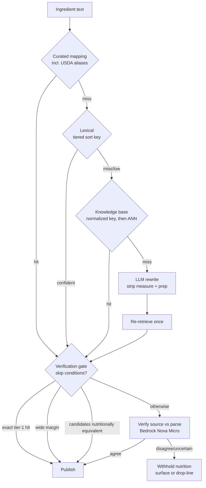

# fix: ingredient resolution quality

## Summary

Make a cook's typed ingredient text land on the right food with the right quantity, and prove it by
measurement rather than example. Ranking gains a layered tier above each surface's existing metric, the
write path stops minting prose into the catalog it searches, the parser stops corrupting quantities and
starts preserving ranges, a verification gate checks every publishable line against its source before we
assert nutrition from it, and the database moves to PostgreSQL 18.

---

## Problem frame

The 448-recipe public-domain import was run through the app's own resolution path — plain text in, no
pre-resolution — as a product measurement. Roughly **900 of 2,432 ingredient lines carried a wrong
`food_id`** on recipes marked public, and 268 matched nothing at all. Wrong matches publish false
nutrition; unmatched lines are dead text with no calories and no scaling.

Four defects compound, and research during planning corrected the framing of three of them.

**Ranking loses to substring noise.** `flour` returns `Carob flour`, `milk` returns `Crackers, milk`,
`sugar` returns a sugar-coated candy — 334 lines to those three attractors alone. The cause is
`similarity()` dominating `ts_rank` inside a `GREATEST`, so a long name that merely _contains_ the token
beats the name that _is_ the token.

⚠️ **The measurement instrument and the product do not share a ranker.** Five ranking sites exist, not two.
`rankIngredientSuggestions` and `rankIngredientResults` re-sort the server's output client-side
(PREFIX > SUBSTRING > FUZZY), and the importer bypasses them entirely by reading `suggestions[0]` off the
API. `Flour` is a PREFIX match and `Carob flour` is a SUBSTRING match, so **the picker already resolves
`flour` correctly today** while the importer does not. The server defect is real; the severity measured
from the import overstates what users currently experience.

**The local ingredient table decides most lines, and pollutes itself.** 92.8% of imported lines were
decided locally before the food catalog was consulted. ⚠️ That figure bounds the OLD behaviour: the run
minted a local row for every line it processed, raising the local-hit probability for the next. It is
re-measured on the clean start before any structural precedence change.

⛔ **The prose-minting defect is one line, and it is a contract gap.** `IngredientsService.addByName`
writes the caller's own text as the display name on a food-backed row in a shared, ownerless catalog —
which `addByFoodId`'s own docstring forbids thirty lines above. The root cause is that food-service's
`addResponseSchema` publishes no `name`, so recipe-service has nothing else to write.

**The parser corrupts values silently.** `teaspoonful` is absent from the unit table (26 of 28 `*ful`
occurrences); the clause splitter breaks on `and` after the quantity normalizer has consumed it, turning
`one and one-half pounds` into 0.5; `½` precedence contradicts its own docstring. ⚠️ The `?? 0` fallback
does **not** persist a fabricated zero — the wire floor is `0.001`, so it produces a 400. Deleting it
without an absent-quantity model turns a validation error into a type error.

**Nothing catches any of it.** The recipe-side DAL test is mock-only and asserts call counts; it passes
with the `WHERE` clause arbitrarily broken.

---

## High-level technical design

Resolution is a cascade of increasingly expensive tiers. Publication is gated separately: a line may
resolve confidently and still be wrong, so the verification gate reads the raw source against our parse.

The gate checks **quantity, unit, range and food identity together** against the raw source line. Both
texts are present, so the question is closed and checkable — which is why this works where open-ended
retrieval does not (zero-shot LLM retrieval on this task class measures F1 0.0).

---

## Key technical decisions

### KTD-1 — Ranking layers above the base metric; it does not replace it

Swapping `similarity` for `word_similarity` was measured at **4 regressions and 0 fixes** on multi-word
queries, precision 26→22, because `word_similarity` does not penalise extra words. Additive tiers keep
that penalty. One structure, two base metrics: the catalog keeps `similarity`, the local table keeps
`word_similarity` (which the `flor` → `All-purpose flour` case needs at exactly 0.600).

⚠️ `foodSearch.dao.test.ts` pins the current sort-key SQL **byte for byte**. Per CLAUDE.md, that test is
rewritten to prove the new behaviour with the reason stated in its doc comment — never edited to compile.

### KTD-2 — USDA already ships the alias table we were about to rebuild

FNDDS carries 5,432 main descriptions and **9,648 additional descriptions** — brands, regional synonyms,
alternate forms — exposed by the FDC API as `additionalDescriptions`. Our USDA client does not parse the
field and the `food` table has no column for it. Recovering it is the highest-value single change here and
it costs a schema column.

### KTD-3 — The verification gate, not a residual fallback

A tier-4-as-residual design never sees a confidently wrong answer, and every one of the ~900 bad
`food_id`s was confidently wrong. So the model verifies what is about to be **published**. Skip conditions
are narrow by owner ruling (low tolerance for bad food data): exact tier-1 hit, wide tier-2 margin, or
candidates that agree within 10% on nutrients. Everything else verifies.

⚠️ Abstain on **margin, not score**. A lone high-scoring candidate measured 50% accurate against 71% when
several were offered — a candidate with nothing behind it is a warning sign, not a confirmation.

### KTD-4 — Bedrock + Amazon Nova Micro

Chosen on measured correctness and cost. Nova Micro scores **5.5%** on Vectara's grounded-hallucination
benchmark (exact SKU match) against Claude Haiku 4.5's 9.8% and GPT-5-Nano's 10.5%, at **$0.27/month** for
our volume versus Haiku's $8.48. Bedrock adds no vendor relationship and no secret — IAM from Fargate —
and AWS's no-training commitment applies uniformly across models.

Open risk: Nova's structured-output enforcement strength is unverified. Our schema is a three-way enum plus
a short string, and U11 bakes off Nova Micro against Haiku 4.5 and Gemini Flash-Lite on our own corpus for
**under $3 total**. Model identifier is stored on every verification; the ID lives in SSM, never a constant.

Rejected: DeepSeek (trains by default, PRC residency); z.ai (ambiguous training clause, no grammar-enforced
schema); always-on local (~$9/month electricity against $0.27 hosted, plus production traffic on the
workstation holding the AWS credentials); a self-hosted NLI screen (saves ~$6/month for days of setup).

### KTD-5 — Model size does not buy verification quality

Best AUC across 7 models spanning an **18× parameter range varied by 2.3 points**. The ceiling is task
difficulty, not scale. This is why the cheapest credible model is the right default and why swapping models
is a recalibration rather than a redesign.

### KTD-6 — The quantity change ships half now

`quantityHigh` is additive and safe on a non-strict response envelope. Making `quantity` nullable breaks
installed mobile clients parsing a required-positive field — a hard break on a published contract we cannot
redeploy. Ranges land now; absent-quantity stays import-side until a client release gates it.

### KTD-7 — Two ordered deploys, not one step

Recipe-service cannot read a `name` field food-service has not published. U3 deploys, then U4. The
`CONTRACT_HASH` boot assertion enforces it loudly if the order is violated.

---

## Implementation units

### U1. Test substrate — collation parity and the judgement sets

**Goal:** make ranking and parsing measurable before either is touched.
**Requirements:** R42, R57–R60, R63.
**Dependencies:** none. Blocks U5, U6, U7.
**Files:** `docker-compose.yml`, `docker-compose.test.yml`,
`packages/services/food-service/tests/__fixtures__/judgementSet.ts` (new),
`packages/shared/recipe-import-core/tests/__fixtures__/goldenCorpusParse.ts`.

**Approach:** move the local Postgres image off `postgres:16-alpine` — musl sorts as `C`, and 99.7% of
`name ASC` tiebreak positions differ from CI and RDS, so a judgement set authored today encodes the wrong
ordering. State it as a continuous invariant: local tracks the RDS major version and collation provider.
Then author the Golden Relevance Judgement Set (≥60 `{query, expectedTopFoodName, why}` entries, multi-word
entries **sampled from the import corpus** rather than from the cases used to design the weights) and extend
the existing parse golden corpus with the known failures.

⚠️ Precision targets are stated against inter-annotator agreement, not 100%. Three annotators agreed
unanimously on the correct USDA row only **61%** of the time in published work; dietitians agreed 51%.

**Execution note:** every entry is written red, before any fix.
**Patterns to follow:** `foodSearchAccessPath.integration.test.ts` — equivalence of the `(id, name, score)`
sequence with access paths disabled and enabled, plus a vacuity guard. Seed at 50,000 rows; the planner
flips between 6k and 50k. ⛔ Do **not** re-add a query-plan cost gate — one was written, measured and
removed for cause.

**Test scenarios:**

- `1½ cups` parses to 1.5, not 1 — currently red.
- `one and one-half pounds of beef` parses to 1.5, not 0.5 — currently red.
- `2 to 3 cups` yields both bounds — currently red.
- `a teaspoonful of salt` parses at all — currently red.
- `Butter, size of an egg` matches butter with quantity unresolved rather than dropping the line.
- Judgement set: `flour` → `Flour`; `brown sugar` → `Sugars, brown`; `red wine vinegar` → `Vinegar, red wine`.
- Known-miss entries assert they still miss, including word-order inversions the tiers do not solve.
- Collation: `name ASC` ordering identical between the local image and a CI-shaped instance.

**Verification:** the suite is red for every known defect and green for every case already correct.

### U2. Recover USDA `additionalDescriptions`

**Goal:** stop discarding USDA's curated alias table at the client boundary.
**Requirements:** R11 (curated tier), KTD-2.
**Dependencies:** U1.
**Files:** `packages/clients/usda/src/schemas.ts`, `.../types.ts`,
`packages/services/food-service/src/db/schema/food.ts`,
`packages/services/food-service/src/db/migrations/0007_food_aliases.sql` (new),
`packages/services/food-service/src/foods/seed/`, `packages/services/food-service/src/foods/dao/foodSearch.dao.ts`.

**Approach:** parse `additionalDescriptions` in the USDA client (validating the raw upstream shape at the
boundary per GR-015 §15-d), persist it, and include it in the searchable text. Expand-first: additive
column, additive index. ~1.8 curated aliases per row, containing brands and regional synonyms we were
going to rediscover by hand.

**Execution note:** integration test first, against a real database — a unit test cannot observe a
migration that did not apply.
**Patterns to follow:** `0001_food_fts.sql`'s generated column, declared `STORED` explicitly.

**Test scenarios:**

- A food with aliases round-trips them through client → DAL → row.
- A query matching only an alias (`Tillamook`) returns the aliased food.
- A food with no aliases persists null, not `''` (GR-019: no sentinels).
- Migration integration test asserts the column and index exist on a migrated database.

**Verification:** alias-only queries resolve; judgement-set entries covering brand and regional terms move
from known-miss to hit.

### U3. Food-service publishes the canonical name (deploy A)

**Goal:** give recipe-service something correct to write.
**Requirements:** R25, R28. **Dependencies:** U2. **Blocks U4 — ordering is not optional.**
**Files:** `packages/services/food-service/src/foods/foods.schema.ts`,
`packages/schemas/food/` (regenerated), `packages/services/food-service/src/foods/foods.service.ts`.

**Approach:** add `name` to `addResponseSchema`, sourced from `sanitizeFoodName`. Additive on a non-strict
envelope, so old clients ignore it.

**Test scenarios:** `addByName` response carries the sanitized canonical name; contract hash regenerates;
an old client parsing the response is unaffected.
**Verification:** `@kitchensink/schema-food` regenerated and committed; food-service deployed before U4.

### U4. Recipe-service stops minting caller prose (deploy B)

**Goal:** close the write path that pollutes the table the ranker reads.
**Requirements:** R25, R26, R27. **Dependencies:** U3 deployed.
**Files:** `packages/services/recipe-service/src/ingredients/ingredients.service.ts`,
`.../dal/ingredients.dal.ts`, `.../ingredients.controller.ts`.

**Approach:** `addByName` writes food-service's canonical name, not the caller's text. ⛔ Preserve the
`by-name` USDA acquisition path — 202 `PENDING` → `RESOLVED` — which is how a food absent from the seed
legitimately enters the catalog. What is forbidden is minting caller prose, not acquiring real foods.
Define what an unresolved line persists, given `recipe_ingredients.ingredient_id` is `NOT NULL`.

**Test scenarios:**

- `addByName` with prose input persists the canonical name, not the input.
- A food genuinely absent from the catalog still triggers acquisition and resolves to the real food.
- An unresolved line persists without violating the foreign key.
- Integration: two users submitting different prose for the same food converge on one row with one name.

**Verification:** after a re-import, no row in `ingredients` has a name that is a prose fragment.

### U5. Tiered ranking on both surfaces, and retire the client re-sorts

**Goal:** one authoritative ranking rule per surface, observable by users.
**Requirements:** R1–R5. **Dependencies:** U1.
**Files:** `packages/services/food-service/src/foods/dao/foodRelevance.ts` (new),
`.../foodSearch.dao.ts`, `packages/services/recipe-service/src/ingredients/dal/ingredientRelevance.ts` (new),
`.../ingredients.dal.ts`, `packages/apps/commise/features/recipes/src/hooks/ingredientResolver.model.ts`,
`.../useIngredientResolver.ts`, `.../useIngredientFilterSearch.ts`,
`packages/tools/service-test-harness/src/rankingConformance.ts` (new).

**Approach:** extract a named Scoring Policy per surface owning the weights, the tier gap and the
score-is-sort-key rule. Tier structure is additive above the base metric. The shared **invariant** lives
once, as a conformance contract in `service-test-harness`, run by both services against their own DAL —
shared rule, never shared SQL.

⛔ **Retire `rankIngredientSuggestions` and `rankIngredientResults` in this same release.** Retiring them
first makes `flour` worse in the product, because the client re-sort currently masks the defect. This
amends REQ-057, traced through the V-Model matrix — a spec amendment, not a refactor.
⛔ Change only the sort key. Do not touch the trigram indexes: GIN and GiST are both load-bearing and
deliberately non-partial.

**Test scenarios:**

- Judgement set precision@1 ≥ 0.9 on single-token staples; multi-word ≥ 0.85 absolute.
- Tier gap proven by an executable test, so a later weight edit cannot silently break it.
- Equivalence + vacuity at 50,000 rows for both surfaces.
- Conformance contract passes for both policies.
- Component tests assert the picker renders the server's order unmodified.

**Verification:** zero regressions against the committed baseline; `Carob flour`, `Crackers, milk` and the
sugar candy no longer win their queries.

### U6. Match strategy, `raw` injection, and word-order handling

**Goal:** retrieve the right candidates before ranking them.
**Requirements:** R6–R8, R10. **Dependencies:** U1, U5.
**Files:** `packages/services/recipe-service/src/ingredients/selectIngredientMatchStrategy.ts` (new),
`.../dal/ingredients.dal.ts`.

**Approach:** a pure, DB-free discriminated union over query shape with an exhaustive switch, mirroring
`selectSearchStrategy`. Single-token keeps today's behaviour exactly (`flor` needs it). Multi-token adds a
head-term conjunction — **the head term is named explicitly**, not left to the implementer.

Two techniques from published prior art: **inject `raw`** when no cooking verb is present, since the catalog
says `Celery, raw` and cooks write `chives`, with a suppression list for foods never raw (butter, sauce,
milk); and handle word-order inversion by token-sort comparison, measured at 96.81% precision at >95% recall
on 4,179 real food items.

**Test scenarios:** single-token behaviour byte-identical to today; `red wine vinegar` → `Vinegar, red wine`;
`chives` gains `raw` and hits `Chives, raw`; `butter` does not gain `raw`; `flor` still resolves.
**Verification:** local-decides share re-measured on the clean corpus and recorded (R10).

### U7. Parser — precedence, clause splitting, units, ranges

**Goal:** stop corrupting stated values.
**Requirements:** R29–R35, R39. **Dependencies:** U1.
**Files:** `packages/shared/recipe-import-core/src/ingredientLine.ts`, `.../normalizeQuantity.ts`,
`packages/tools/cookbook-import/src/proseRecipe.ts`, `.../runImport.ts`,
`packages/shared/recipe-core/src/units.ts`,
`packages/tools/cookbook-import/src/unitEquivalence.ts` (new).

**Approach:** fix `½` precedence at `ingredientLine.ts` — `normalized.quantity?.valueOf() ?? entry.quantity`
never falls through for a line starting with a digit. Stop the clause splitter breaking on `and` the
quantity normalizer consumed. Add the `*ful` family to `UNIT_ALIASES`. Preserve ranges: `parse-ingredient`
already returns `quantity2` and the review reason `quantity_range_narrowed` already exists — the upper bound
is discarded at one line.

Historical units resolve **from the source book's own published table**, behind a `UnitEquivalenceResolver`
port. #12350's table gives `2 gills = 1 cup`, `4 tablespoons = 1 wine-glass`, `4 saltspoons = 1 teaspoon`,
with the system pinned by its own prose. A book with known origin and no table follows its origin's measure
system — imperial for Montefiore — never the unknown-origin default.

Wire the review gate: `toCandidateRecipe` reads `reviewReasons` and refuses value-corrupting ones into the
existing dropped-lines channel. ⛔ Preparation verbs are **labelled, not deleted** — the word lists are
grammar, never culinary vocabulary.

**Test scenarios:** every U1 red case turns green; a gill from an American book converts at 118 mL and from
_The Jewish Manual_ at 142 mL, both recording citation and measure system; a corrupting review reason lands
in dropped-lines rather than persisting.
**Verification:** golden corpus green; dropped-line count recorded in the import report.

### U8. Quantity model — expand migration and wire

**Goal:** make a range representable without breaking installed clients.
**Requirements:** R36, R37, R41. **Dependencies:** U7.
**Files:** `packages/services/recipe-service/src/database/migrations/0020_quantity_range.sql` (new),
`.../database/schema/ingredients.ts`, `packages/shared/recipe-core/src/recipeRequestBounds.ts`,
`.../recipe.types.ts`, `.../scaling.ts`, `packages/services/recipe-service/src/recipes/recipes.schema.ts`,
`packages/schemas/recipe/` (regenerated).

**Approach:** ⛔ **Expand only, per ADR-0022.** Add `quantity_high numeric(10,3) NULL` and a `NOT VALID`
coherence check ordering the bounds. Leave `quantity NOT NULL` and its positive check in place — the
contraction ships a later release, after mobile adoption. Model the quantity as a value object
(`exact | range`) rather than a scalar plus two loose bounds that can disagree, mirroring the existing
"`''` is rejected so unitless has ONE representation" convention.

**Execution note:** integration test against a real database asserting the migrated schema.
**Test scenarios:** range persists and round-trips; scaling 4→6 servings turns `2 to 3` into `3 to 4.5`;
an old client parsing a response with `quantityHigh` is unaffected; the coherence check rejects `high < low`.
**Verification:** prod template unchanged; migration applies through the in-stack trigger.

### U9. UI — ranged quantity on both platforms

**Goal:** ship the range to users, both platforms, same release.
**Requirements:** R42, R43. **Dependencies:** U8.
**Files:** `packages/apps/commise/features/recipes/src/form/RecipeIngredientsFields.tsx` and its
`.native.tsx` sibling, `.../detail/RecipeDetailBody.tsx` and its `.native.tsx` sibling,
`.../detail/model.ts`, `.../form/messages.ts`.

**Approach:** `formatQuantity` is the single formatter and gains the range case. Edit fields accept a range
alongside a scalar. All copy is localized — no literals.

**Test scenarios:** component tests for every state — scalar, range, absent, invalid — on **both**
platforms; Playwright spec for entering and viewing a range; Maestro flow for the same.
**Verification:** paired web and mobile tasks, per the enforced cross-platform rule.

### U10. Knowledge base and curated mappings

**Goal:** learn from corrections, and authorize who a correction binds.
**Requirements:** R11, R14, R19, R20. **Dependencies:** U4.
**Files:** `packages/services/recipe-service/src/ingredients/resolution/` (new),
`.../domain/mappingScopePolicy.ts` (new),
`packages/services/recipe-service/src/database/migrations/0021_resolution_mappings.sql` (new),
`.../ingredients.schema.ts`.

**Approach:** two tables, not one — a curated mapping is human-authored and supersedable; an embedding is
machine-derived and model-versioned. They change for different reasons. Lookup is normalized key first,
nearest-neighbour second; brute-force cosine is adequate at this size, with a **stated firing condition and
an emitted metric** for the ANN decision rather than an intention.

Scope policy mirrors `provenancePolicy.ts` in shape and docstring: pure, total, grants as a primitive
`readonly string[]`, discriminated-union return, scope string published on the wire contract. **Grant-gated
global** per owner ruling — a held grant writes globally on first correction; everyone else's stays
author-scoped until a second independent user corroborates. ⛔ Not a route guard: what is authorized is a
field value on a route that must stay open to every authenticated user.

Corroboration is a concurrent counter, so "independent" is enforced by a unique index on
`(normalized_key, author_id)`, not read-modify-write. Copy the existing `ON CONFLICT DO NOTHING` + re-read
shape for the write race.

**Test scenarios:** truth table over grants × scope; a corroborating second correction promotes to global;
the same author correcting twice does not; a near-twin phrase resolves from the KB without an LLM call; a
later correction supersedes an earlier mapping.
**Verification:** GR-021 table-collision gate passes; policy unit tests are truth-table shaped.

### U11. Verification gate — Bedrock Nova Micro, bake-off, calibration

**Goal:** nothing publishes nutrition we have not checked against the source.
**Requirements:** R15–R18, R21–R24, R61. **Dependencies:** U5, U7, U10.
**Files:** `packages/clients/bedrock/` (new), `packages/services/recipe-workers/src/handlers/verifyLine.ts`
(new), `packages/services/recipe-service/src/ingredients/resolution/confidence.ts` (new),
`packages/services/recipe-service/src/ingredients/resolutionMetrics.ts` (new),
`packages/services/recipe-workers/infra/`.

**Approach:** the provider client validates the raw upstream shape with zod at the boundary and declares
its own types — GR-015 §15-d names LLM providers explicitly, and no OpenAPI document is written for an API
we do not serve. Runs in `recipe-workers`, off the synchronous path, behind the shipped `PENDING → RESOLVED`
lifecycle.

The gate receives the raw source line, our parse, and the shortlist; it never retrieves, so it cannot invent
a `food_id`. Constrained decoding, ordinal enum for certainty, **abstention as a schema branch** rather than
a low number. Skip conditions are narrow: exact tier-1 hit, wide tier-2 margin, or candidates agreeing
within 10% on nutrients.

**Bake off Nova Micro against Haiku 4.5 and Gemini Flash-Lite on our own 2,432 lines — under $3 total** —
and pick on measured accuracy. ⚠️ Calibrate on the **residual**, not the whole judgement set: the gate sees
a systematically different distribution. Mitigate self-preference bias with a structured rubric (measured
at −31.5 points) and position bias with swap augmentation (10–15 points).

**Test scenarios:** a wrong quantity in the parse is flagged; a wrong food is flagged; a correct parse
passes; provider unavailable terminates as unresolved rather than falling back to a rejected candidate; an
unattended caller records unresolved into dropped-lines and does not block; every verification stores the
model identifier; high band emits the same telemetry as middle.
**Verification:** measured agreement rate recorded; the bake-off result committed with the chosen model.

### U12. Catalog clear and reseed

**Goal:** a clean starting state for the measurement.
**Requirements:** R30, R31, R44–R47. **Dependencies:** U4, U7 — ⚠️ **after** the write-path fix, or the
next import re-pollutes it.
**Files:** `packages/services/food-service/src/foods/seed/clearCli.ts` (new), `.../seedCli.ts`.

**Approach:** no clear/truncate tooling exists today — this is a net-new destructive capability with no
guard rails to copy. It names its stages explicitly, requires confirmation, and refuses prod without an
explicit flag. ⚠️ Reseeding mints **fresh ULIDs**, and `ingredients.food_id` has **no foreign key** — so
clearing the catalog silently orphans every recipe-side reference unless they are cleared in the same
operation. Set `food.origin = 'bulk'` on reseed, or change-refresh churns and clobbers nutrition.

**Test scenarios:** clear refuses prod without the flag; clear + reseed leaves no dangling `food_id`;
reseeded rows carry `origin = 'bulk'`; a dry run reports counts without writing.
**Verification:** post-reseed, no `food_id` outside the food database refers to a missing row.

### U13. PostgreSQL 16 → 18

**Goal:** move the engine, without losing identity data.
**Requirements:** R48–R56. **Dependencies:** everything else. Last and alone.
**Files:** `packages/infra/global/lib/platform/DataStack.ts`,
`packages/infra/global/__tests__/engineVersionDiff.test.ts` (new),
`docs/runbooks/pg18-upgrade.md` (new).

**Approach:** `VER_16` → `VER_18` (major-only, preserving the `autoMinorVersionUpgrade` behaviour) with
`allowMajorVersionUpgrade`. 16.13 → 18 is a **verified one-hop** upgrade.

⛔ **Blue/Green is unavailable** — AWS lists CloudFormation as unsupported, and a 16.x source replicates
logically, which does not carry DDL; our in-stack migration triggers and per-PR `CREATE DATABASE` are DDL.
In-place, in a scheduled window.

⚠️ `applyImmediately` defaults to immediate in CDK, so `cdk deploy` **is** the maintenance action.
⚠️ The instance carries `kitchensink_identity` — live production user data. Snapshot first, against a
resolved physical instance id; suppress CI auto-deploy for the window; fix forward only.

Write the template-diff gate first: `cdkNagTemplateParity` compares the same source against itself and
**cannot fire** on an engine-version change, so the upgrade would otherwise land invisibly green against
ADR-0002.

Pre-flight: drop stale per-PR databases (each is pure outage — `pg_upgrade` dumps every database);
`SELECT datname FROM pg_database WHERE datconnlimit = -2` for invalid databases from interrupted drops;
check `datlocprovider` (reindex trigram/FTS only if non-libc).

Verified as non-issues: `pg_trgm` is byte-identical between 16 and 18 — `similarity`, `word_similarity` and
all thresholds unchanged, extension stays at 1.6, so the `flor` case at 0.600 survives. `citext` and
`pgcrypto` updates are optional and behaviourally empty.
⚠️ Statistics carryover is **contradictory** between the PG 18 docs and the RDS user guide. Plan as if
`ANALYZE` is required; the dry run settles it.

**Test scenarios:** the new gate fails on an engine-version change and passes when the template is unchanged;
every `generatedAlwaysAs` declares `STORED`; post-upgrade the judgement set re-runs with no regressions.
**Verification:** dry run on a snapshot-restored clone measures the real window; sandbox soaks before prod.

---

## Sequencing

1. **U1** — substrate, red.
2. **U2** — aliases (cheapest large win).
3. **U3 → U4** — two ordered deploys, cross-service.
4. **U5 + U6** — ranking and matching, client re-sorts retired in the same release as U5.
5. **U7 → U8 → U9** — parser, then expand migration, then UI on both platforms.
6. **U10** — knowledge base and mappings.
7. **U11** — verification gate and bake-off.
8. **U12** — clear and reseed, then re-import and measure.
9. **U13** — PG 18, alone, with its own gate and runbook.

---

## Risks and dependencies

- **One-way doors:** the quantity _response_ widening (gated on mobile adoption); the reseed's fresh ULIDs;
  the published mapping wire shape and its scope value; the correction grant identifier; whatever ingredient
  text reaches the provider.
- **`ingredients.food_id` has no foreign key.** Nothing in the database prevents U12 orphaning recipe rows
  across a service boundary.
- **The RDS instance is `multiAz: false`, `removalPolicy: DESTROY`, no automatic safety snapshot**, with
  `deletionProtection` described in-code as the only thing between accidental replacement and total loss.
- **Leg 2 has zero coverage at any tier** — nothing has ever booted food-service and recipe-service
  together, deliberately, in three places. The cascade is leg 2. Either build the environment or state the
  gap plainly rather than reporting a mocked unit suite as verification.
- **Stale guidance:** `0019_drop_duplicated_nutrition.sql` still says "Production deploys CODE BEFORE
  MIGRATING," which ADR-0022 inverted. Fix the header while here.

## Open questions

**Resolve before implementation**

1. Feature 005's plan states "the platform never pays for AI API calls — users bring their own keys." An
   unattended import has no user and therefore no key. This plan assumes the gate is a platform capability
   and 005's BYOK is scoped to user-facing generation; that assumption amends 005 and needs an owner ruling.
2. Is REQ-057's prefix-over-substring ordering an owner-held product requirement, or a proxy for relevance?
   U5 retires it, which amends a V-Model traced requirement.

**Deferred to implementation** 3. Which named external standard fills unit gaps the books leave (at minimum `dessertspoon`). 4. Whether the 50,000-food performance corpus is still generable. 5. Confidence band thresholds — two-way doors, set from measured accuracy per band.

## Sources and research

- Origin: `docs/brainstorms/2026-08-19-ingredient-resolution-quality-requirements.md`
- FAO/INFOODS _Guidelines for Food Matching_ (2011) — A/B/C match grading; water content as the primary
  cross-check. Their terminal rule ("a match must always be made") is **inverted** here: they compute
  population intake, we publish per-recipe nutrition where a C-grade guess is a false claim.
- FoodOntoRAG (arXiv 2603.09758) and Epicure (arXiv 2604.22776) — two independent 2026 systems converging
  on lexical/rule → embedding → LLM adjudication for this exact task.
- Vectara HHEM leaderboard — grounded hallucination, exact-SKU scores behind KTD-4.
- USDA FNDDS documentation and the FDC OpenAPI spec — `additionalDescriptions`.
- ADR-0002 (prod no-diff), ADR-0006 (per-PR logical DB), ADR-0014 (service-owned contracts),
  ADR-0021 (deferred nutrition), ADR-0022 (in-stack migration trigger), ADR-0023 (curator provenance).
