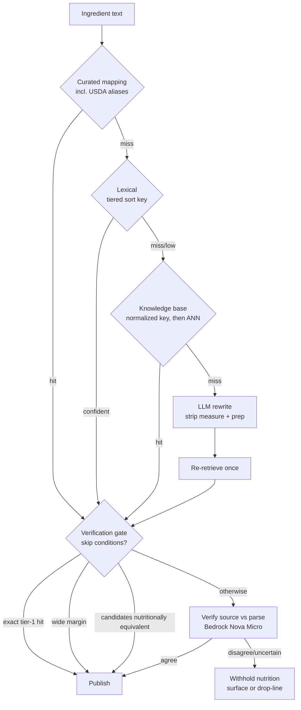

# fix: ingredient resolution quality

## Summary

Make a cook's typed ingredient text land on the right food with the right quantity, and prove it by
measurement rather than example. Ranking gains a layered tier above each surface's existing metric, the
write path stops minting prose into the catalog it searches, the parser stops corrupting quantities and
starts preserving ranges, a verification gate checks every publishable line against its source before we
assert nutrition from it, and the database moves to PostgreSQL 18.

---

## Problem frame

The 448-recipe public-domain import was run through the app's own resolution path — plain text in, no
pre-resolution — as a product measurement. Roughly **900 of 2,432 ingredient lines carried a wrong
`food_id`** on recipes marked public, and 268 matched nothing at all. Wrong matches publish false
nutrition; unmatched lines are dead text with no calories and no scaling.

Four defects compound, and research during planning corrected the framing of three of them.

**Ranking loses to substring noise.** `flour` returns `Carob flour`, `milk` returns `Crackers, milk`,
`sugar` returns a sugar-coated candy — 334 lines to those three attractors alone.

⛔ **The cause this plan originally gave was MISATTRIBUTED, and U5's design is deferred until it is
measured.** It read: "`similarity()` dominating `ts_rank` inside a `GREATEST`, so a long name that merely
_contains_ the token beats the name that _is_ the token." Measured in Postgres 16 with `pg_trgm`
(2026-08-21): `similarity('Flour','flour') = 1.00` against `similarity('Carob flour','flour') = 0.50` — no
tie, and the exact-name row wins outright. On the catalog a long USDA name scores **0.16** against a short
containing name's 0.50, a length **penalty** — the opposite of that sentence, and behaviour KTD-1
deliberately preserves as a virtue. The 1.0/1.0 tie that actually produces the failure is `word_similarity`,
which KTD-1 assigns to recipe-service's **local** table, not the catalog `GREATEST` the sentence blamed.
**Owner ruling 2026-08-21:** U1 attributes each wrong `food_id` in the 2,432-line corpus to its surface
(local vs catalog) FIRST, and U5 is re-planned against those numbers rather than against this paragraph.
With 92.8% of lines decided locally, the local table is the likely whole story.

⚠️ **The measurement instrument and the product do not share a ranker.** Five ranking sites exist, not two.
`rankIngredientSuggestions` and `rankIngredientResults` re-sort the server's output client-side
(PREFIX > SUBSTRING > FUZZY), and the importer bypasses them entirely by reading `suggestions[0]` off the
API. The mechanism is a **tiebreak, not a score inversion**: `word_similarity('flour', 'Carob flour')` and
`word_similarity('flour', 'Flour')` both return 1.0, and `name ASC` breaks the tie alphabetically. Both rows
therefore sit inside the server's page, the client re-sort sees both, and PREFIX beats SUBSTRING — so the
picker likely resolves `flour` correctly today while the importer does not.

⚠️ "Likely" is doing work in that sentence. The two surfaces page differently — the local ingredient table
at `DEFAULT_SEARCH_LIMIT = 10` (`ingredients.dal.ts`) and the food catalog at `SEARCH_LIMIT = 20`
(`foodSearch.dao.ts`), which `foodCatalog.gateway.search` calls with no limit at all. The server truncates before the
client sorts anything, so the client re-sort can only reorder a page the broken sort key already selected.
U1 measures whether the true match survives that page rather than leaving this reasoned. The server defect
is real either way; what is unmeasured is how much of it users currently see.

**The local ingredient table decides most lines, and pollutes itself.** 92.8% of imported lines were
decided locally before the food catalog was consulted. ⚠️ That figure bounds the OLD behaviour: the run
minted a local row for every line it processed, raising the local-hit probability for the next. It is
re-measured on the clean start before any structural precedence change.

⛔ **The prose-minting defect is one line, and it is a contract gap.** `IngredientsService.addByName`
writes the caller's own text as the display name on a food-backed row in a shared, ownerless catalog —
which `addByFoodId`'s own docstring forbids thirty lines above. The root cause is that food-service's
`addResponseSchema` publishes no `name`, so recipe-service has nothing else to write.

**The parser corrupts values silently.** `teaspoonful` is absent from the unit table (26 of 28 `*ful`
occurrences); the clause splitter breaks on `and` after the quantity normalizer has consumed it, turning
`one and one-half pounds` into 0.5; `½` precedence contradicts its own docstring. ⚠️ The `?? 0` fallback
does **not** persist a fabricated zero — the wire floor is `0.001`, so it produces a 400. Deleting it
without an absent-quantity model turns a validation error into a type error.

**Nothing catches any of it.** The recipe-side DAL test is mock-only and asserts call counts; it passes
with the `WHERE` clause arbitrarily broken.

---

## High-level technical design

Resolution is a cascade of increasingly expensive tiers. Publication is gated separately: a line may
resolve confidently and still be wrong, so the verification gate reads the raw source against our parse.

The gate checks **quantity, unit, range and food identity together** against the raw source line. Both
texts are present, so the question is closed and checkable — which is why this works where open-ended
retrieval does not (zero-shot LLM retrieval on this task class measures F1 0.0).

---

## Key technical decisions

### KTD-1 — Ranking layers above the base metric; it does not replace it

Swapping `similarity` for `word_similarity` was measured at **4 regressions and 0 fixes** on multi-word
queries, precision 26→22, because `word_similarity` does not penalise extra words. Additive tiers keep
that penalty. One structure, two base metrics: the catalog keeps `similarity`, the local table keeps
`word_similarity` (which the `flor` → `All-purpose flour` case needs at exactly 0.600).

⚠️ `foodSearch.dao.test.ts` does **not** pin the sort key. It asserts branch substrings (`'similarity('`,
`'plainto_tsquery'`, `'name %'`, `'ILIKE'`) and the `ORDER BY score DESC, name ASC` clause, never the
`GREATEST(...)` expression, and it deliberately does not pin placeholder numbering. **A tiered sort key
passes it unchanged.** That is worse than a failing test: nothing forces the rewrite, and a stale suite
stays green while counting as coverage for behaviour it no longer describes. The replacement must assert
the tier expression itself.

### KTD-2 — USDA already ships the alias table we were about to rebuild

FNDDS carries 5,432 main descriptions and **9,648 additional descriptions** — brands, regional synonyms,
alternate forms — exposed by the FDC API as `additionalDescriptions`. Our USDA client does not parse the
field and the `food` table has no column for it. Recovering it is the highest-value single change here and
it costs a schema column.

### KTD-3 — The verification gate, not a residual fallback

A tier-4-as-residual design never sees a confidently wrong answer, and every one of the ~900 bad
`food_id`s was confidently wrong. So the model verifies what is about to be **published**. Skip conditions
are narrow by owner ruling (low tolerance for bad food data): exact tier-1 hit, wide tier-2 margin, or
candidates that agree within 10% on nutrients. Everything else verifies.

⚠️ Abstain on **margin, not score**. A lone high-scoring candidate measured 50% accurate against 71% when
several were offered — a candidate with nothing behind it is a warning sign, not a confirmation.

⛔ **Each skip condition needs a guard, or it inverts its own intent.**

- **Wide tier-2 margin** requires **at least two scored candidates**. A singleton shortlist has no runner-up,
  so a naive `top − next` reads as maximal confidence and routes straight to publish — precisely the case
  the paragraph above calls least trustworthy. A shortlist of one always verifies, whatever it scored.
- **Exact tier-1 hit** skips the **food-identity check only**. A curated mapping is keyed on a normalized
  phrase and can establish nothing about quantity. The parser defects this plan exists to fix are quantity
  defects and they land on tier-1 lines too, so quantity, unit and range are still verified.
- **Nutrient equivalence** is computed over energy plus the macronutrients per 100 g, and also requires two
  or more candidates. It measures inter-candidate _agreement_, which is not correctness: the 334 lines that
  collapsed onto three attractors were sets that agreed with each other and were all wrong. It therefore
  applies only when the winning candidate also cleared the margin test.

### KTD-4 — Bedrock + Amazon Nova Micro

Chosen on measured correctness and cost. Nova Micro scores **5.5%** on Vectara's grounded-hallucination
benchmark (exact SKU match) against Claude Haiku 4.5's 9.8% and GPT-5-Nano's 10.5%, at **$0.27/month** for
our volume versus Haiku's $8.48. Bedrock adds no vendor relationship and no secret — IAM via the **recipe-workers Lambda execution role**,
not Fargate — and AWS's no-training commitment applies uniformly across models.

⚠️ **The benchmark is a coarse screen, not the decision.** Vectara's HHEM measures _summarization_
grounding, not parse verification, and KTD-5 holds that cross-model spread on verification is small — so a
4.3-point HHEM gap cannot order models on this task either. What remains is roughly an $8/month spread,
which this same section dismisses as immaterial when rejecting the NLI screen. Nova Micro is a
**cost-driven starting default**; U11's bake-off on our own residual is the decision.

**R24 requires no-retention as well as no-training.** Bedrock model-invocation logging stays **disabled**
for this integration; if ever enabled for debugging, the runbook names the destination and window.

Cost basis: $0.27/month assumes ~8,000 verified lines per month under KTD-3's verify-everything policy, not
the import corpus; at 80,000 lines it is $2.74. Swap augmentation for position bias doubles the call count
and is included.

Open risk: Nova's structured-output enforcement strength is unverified. Our schema is a three-way enum plus
a short string, and U11 bakes off Nova Micro against Claude Haiku 4.5 on our own corpus.

⛔ **Gemini Flash-Lite is not available on Amazon Bedrock** — only Gemma models are (verified 2026-08-20,
ADR-0024 §4). An earlier draft named it, which would have quietly reintroduced a Google Cloud relationship,
a Secrets Manager key, an egress path of its own to review against ADR-0004, and a separate R24 review. If a third candidate is wanted the in-boundary option is a **Gemma** model; adding Gemini is its own
ADR, not a bake-off line item. Model identifier is stored on every verification; the ID lives in SSM, never a constant.

Rejected: DeepSeek (trains by default, PRC residency); z.ai (ambiguous training clause, no grammar-enforced
schema); always-on local (~$9/month electricity against $0.27 hosted, plus production traffic on the
workstation holding the AWS credentials); a self-hosted NLI screen (saves ~$6/month for days of setup).

### KTD-5 — Model size does not buy verification quality

Best AUC across 7 models spanning an **18× parameter range varied by 2.3 points** (arXiv 2605.11330,
_Rethinking Evaluation for LLM Hallucination Detection_). The ceiling is task difficulty, not scale. This is why the cheapest credible model is the right default and why swapping models
is a recalibration rather than a redesign.

### KTD-6 — The quantity model lands whole, because there are no installed clients

An earlier draft deferred absent-quantity to protect installed mobile clients parsing a required-positive
`quantity`. **The product is pre-launch and not live**, so that contract protects nothing today, and the
deferral cost more than it saved: U1 asserts `Butter, size of an egg` resolves with quantity unresolved,
which a value object of `exact | range` cannot represent — the plan's own red test had no unit that could
turn it green.

Both halves land now — `quantity_high` added, `NOT NULL` and the positive check dropped, the wire field
widened — modelled as `exact | range | absent` so illegal states stay unrepresentable. ⚠️ This is the one
decision here that must be revisited if a client ships before U8 lands.

### KTD-7 — The canonical name already ships; there is no cross-service ordering problem

An earlier draft split the write-path fix into two ordered deploys, premised on food-service publishing no
canonical name. It does: `statusResponseSchema.food` is `foodResponseSchema`, which carries `name`. And
`sanitizeFoodName` is NFKC plus invisible-character hygiene — "Unicode _hygiene_, not confusable folding,"
per its own docstring — so on a fresh add it returns the caller's prose unchanged, and would have published
the very value the fix exists to stop writing.

The rename therefore belongs at the `RESOLVED` transition, inside recipe-service, reading a contract that
already ships. No `addResponseSchema` change, no deploy ordering, one unit instead of two.

⚠️ The ordering guard that draft named does not exist, and must not be relied on elsewhere:
`assertContractHashesAgree` compares two stamps baked into a single image against
`@kitchensink/schema-recipe`, and the cross-service check in
`packages/clients/food-service/src/contractSkew.ts` states in its own docstring that it
**"WARNS, IT DOES NOT REFUSE."**

### KTD-8 — The gate amends the origin's fallthrough model, by owner ruling

Origin R12 describes a cascade where a confident hit is terminal. The gate re-checks confidently-resolved
tier-1 and tier-2 lines, which is a different model. That change is an **owner ruling** — the LLM as
fail-safe, with skip conditions narrowed by a stated low tolerance for bad food data — recorded here
because a plan should not amend a requirement silently.

---

### KTD-9 — The gate is core platform capability, not a BYOK or tiered feature

**Owner ruling (2026-08-20): there is no collision with feature 005.** 005's BYOK-first principle governs
its own subject — the MCP and AI-integration feature — and does not reach ingredient, quantity or
measurement resolution. Those are a core capability serving every user, platform-paid and platform-keyed,
neither BYOK nor tier-gated.

The corroborating detail, had the two ever overlapped: an unattended import has no user and therefore no
key, so BYOK could not have covered this path regardless.

## Implementation units

### U1. Test substrate — collation parity and the judgement sets

**Goal:** make ranking and parsing measurable before either is touched.
**Requirements:** R42, R57–R60, R63.
**Dependencies:** none. Blocks U5, U6, U7.
**Files:** `docker-compose.yml`, `docker-compose.test.yml`,
`packages/services/food-service/tests/__fixtures__/judgementSet.ts` (new),
`packages/shared/recipe-import-core/tests/__fixtures__/goldenCorpusParse.ts`.

**Approach:** move the local Postgres image off `postgres:16-alpine` — musl sorts as `C`, and 99.7% of
`name ASC` tiebreak positions differ from CI and RDS, so a judgement set authored today encodes the wrong
ordering. State it as a continuous invariant: local tracks the RDS major version and collation provider.
Then author the Golden Relevance Judgement Set (≥60 `{query, expectedTopFoodName, why}` entries, multi-word
entries **sampled from the import corpus** rather than from the cases used to design the weights) and extend
the existing parse golden corpus with the known failures.

⚠️ Precision targets are stated against inter-annotator agreement, not 100%. Three annotators agreed
unanimously on the correct USDA row only **61%** of the time in published work; dietitians agreed 51%.

**Annotation protocol** — without this the floors measure agreement with one person, which is the
over-fitting R58 and R59 exist to prevent. Every judgement-set entry carries **two independent labels**;
disagreements are adjudicated by a third pass and the resolution recorded in the entry's `why` field; the
observed agreement rate is committed alongside the set so 0.9 and 0.85 are read against our own ceiling
rather than a published one. R60's adjudicated sample follows the same protocol.

**Two baselines, not one.** The judgement set measures the server. A second committed baseline captures the
**client-re-sorted top-1 for every distinct query in the 2,432-line import corpus** — what users actually
see today. U5 gates on both, because "zero regressions" against server output alone would measure the
server against itself while the picker silently got worse.

**Execution note:** every entry is written red, before any fix.
⛔ **Commit the BEFORE-baseline as an artifact, not a memory.** The 448-recipe run's report, per-line
resolved `food_id`, unmatched count and the three attractor tallies live nowhere in the repo — the figures
"2,432" and "~900" appear only in this plan and ADR-0024. U15 requires its after-run be reproducible from a
committed corpus manifest while imposing no such requirement on the run every success criterion is
denominated in, so a post-release disagreement about whether the numbers moved cannot be settled.
**Patterns to follow:** `foodSearchAccessPath.integration.test.ts` — equivalence of the `(id, name, score)`
sequence with access paths disabled and enabled, plus a vacuity guard. Seed at **100,000** rows — that
file's own header records why it abandoned 50,000: the guard "FIRED in CI — twice, on commits identical in
every relevant respect to two that passed", because 50,000 sits on the planner crossover at a 1.53x margin
against 2.36x at 100,000. (SC-007's k6 population is a different corpus and stays at 50,000.) ⛔ Do **not** re-add a query-plan cost gate — one was written, measured and
removed for cause.

**Test scenarios:**

- `1½ cups` parses to 1.5, not 1 — currently red.
- `one and one-half pounds of beef` parses to 1.5, not 0.5 — currently red.
- `2 to 3 cups` yields both bounds — currently red.
- `a teaspoonful of salt` parses at all — currently red.
- `Butter, size of an egg` matches butter with quantity unresolved rather than dropping the line.
- Judgement set: `flour` → `Flour`; `brown sugar` → `Sugars, brown`; `red wine vinegar` → `Vinegar, red wine`.
- Known-miss entries assert they still miss, including word-order inversions the tiers do not solve.
- Collation: `name ASC` ordering identical between the local image and a CI-shaped instance.
- Truncation: for `flour`, `milk` and `sugar`, record whether the true match survives the server's
  page on both surfaces — each at its own limit (local 10, catalog 20) — the measurement the Problem frame's severity claim
  rests on.

**Verification:** the suite is red for every known defect and green for every case already correct.

### U2. Recover USDA `additionalDescriptions`

**Goal:** stop discarding USDA's curated alias table at the client boundary.
**Requirements:** R11 (curated tier), KTD-2.
**Dependencies:** U1.
**Files:** `packages/clients/usda/src/schemas.ts`, `.../types.ts`,
`packages/services/food-service/src/db/schema/food.ts`,
`packages/services/food-service/src/db/migrations/0007_food_aliases.sql` (new),
`packages/services/food-service/src/foods/seed/`, `packages/services/food-service/src/foods/dao/foodSearch.dao.ts`.

**Approach:** parse `additionalDescriptions` in the USDA client (validating the raw upstream shape at the
boundary per GR-015 §15-d) and persist it. ~1.8 curated aliases per row, carrying brands and regional
synonyms we were otherwise going to rediscover by hand.

⚠️ The k6 re-measurement U5 gates on is only meaningful once the perf fixture populates aliases at
production-like density (~1.8 per row): `packages/services/food-service/tests/load/preparePerfFixture.ts`
seeds names, descriptions and crosswalk rows and nothing else, so with `additionalDescriptions` null on
every row the second tsvector, its GIN index and the OR'd `ts_rank` all cost nothing and the gate passes on
the speed of doing no work.

⛔ Aliases get their **own** `STORED` generated tsvector and their own GIN index — they are **not** folded
into `search_vector`. Folding them in would need `ALTER COLUMN ... SET EXPRESSION`, which arrived in
**PostgreSQL 17** and is therefore unavailable until U13; the PG 16 equivalent is DROP + ADD COLUMN, taking
an ACCESS EXCLUSIVE lock, rewriting `food`, and dropping the dependent GIN index. `relevanceQuery` ORs the
two vectors and combines their `ts_rank`. That keeps the unit genuinely additive.

**Execution note:** integration test first, against a real database — a unit test cannot observe a
migration that did not apply.
**Patterns to follow:** `0001_food_fts.sql`'s generated column, declared `STORED` explicitly.

**Test scenarios:**

- A food with aliases round-trips them through client → DAL → row.
- A query matching only an alias (`Tillamook`) returns the aliased food.
- A food with no aliases persists null, not `''` (GR-019: no sentinels).
- Migration integration test asserts the column and index exist on a migrated database.

**Verification:** alias-only queries resolve; judgement-set entries covering brand and regional terms move
from known-miss to hit.

### U3. Recipe-service writes the canonical name at resolution

**Goal:** close the write path that pollutes the table the ranker reads.
**Requirements:** R25, R26, R27, R28. **Dependencies:** U2.
**Files:** `packages/services/recipe-service/src/ingredients/ingredients.service.ts`,
`.../dal/ingredients.dal.ts`, `.../ingredients.controller.ts`.

**Approach:** `refreshStatus` writes `status.food.name` onto the local row when a food transitions to
`RESOLVED`, replacing whatever prose the caller supplied at add time.

⚠️ **A `PENDING` local row is NOT sanitized** — `addByName` writes `name: trimmed`, i.e. `.trim()` and
nothing else. Food-service's `sanitizeFoodName` is the repo's one canonical form for a shared display name
(it exists because that catalog is "ownerless, globally unique-named and shared by every user"), and
recipe-service's local `ingredients` table does not use it. Route local writes through the same form.

⚠️ **The prose comes from the IMPORTER, not the picker.** From the picker `addByName` receives the user's
search term ("butter"); from the importer it receives a parsed fragment of recipe prose. Same function, two
very different inputs — which is why the local table fills with strings no user would type, and it matches
the 92.8%-decided-locally measurement. **Owner ruling 2026-08-21: `PENDING` rows STAY VISIBLE in search** —
a food being acquired is something a searcher wants to see, and the demand signal is useful. The fix is on
the WRITE path, not by hiding rows.

⛔ **`ingredients` has NO `search_vector` trigger** — `0001_initial.sql` creates exactly one,
`trg_recipes_search_vector`, and it is on `recipes`. `ingredients.dal.ts` says so in its own header: the DAL
populates the vector on write via `to_tsvector('english', name)`. So the rename UPDATE must recompute
`search_vector` in the SAME statement, mirroring `createFoodBacked`/`createFreeform`. A plain
`UPDATE … SET name` leaves the ranker matching the original prose forever — the exact defect this unit
exists to close.

⚠️ **A `RESOLVED` status may carry no usable name.** `foodResponseSchema.name` is `z.string().nullable()`
and `statusResponseSchema.food` is optional, while `ingredients.name` is `NOT NULL`. When `food` is absent
or `food.name` is null, leave the existing sanitized caller text in place and record the status only.

⛔ Preserve the `by-name` USDA acquisition path — 202 `PENDING` → `RESOLVED` — which is how a food absent
from the seed legitimately enters the catalog. What is forbidden is minting caller prose as a permanent
label, not acquiring real foods on demand. Define what an unresolved line persists, given
`recipe_ingredients.ingredient_id` is `NOT NULL`.

**Execution note:** integration test first, against a real database.

**Test scenarios:**

- A food resolving to `RESOLVED` renames the local row to food-service's canonical name.
- A `PENDING` row keeps the caller's sanitized text and is not treated as canonical.
- `search_vector` reflects the renamed value after the update.
- A food genuinely absent from the catalog still triggers acquisition and resolves to the real food.
- An unresolved line persists without violating the foreign key.
- Integration: two users submitting different prose for the same food converge on one row, one name.

**Verification:** after a re-import, **no row** in `ingredients` — at any `food_resolution_status` — has a
name that is a prose fragment. ⚠️ Scoping this to `RESOLVED` let a row whose poll never completed pass while
still serving caller prose to every other user's search.

### U4. _(merged into U3)_

The two-deploy split this unit described rested on a false premise — see KTD-7. Its work now lives in U3.
The U-ID is retained rather than renumbered so existing references stay valid.

### U5. Tiered ranking on both surfaces, and retire the client re-sorts

**Goal:** one authoritative ranking rule per surface, observable by users.
**Requirements:** R1–R5. **Dependencies:** U1.
**Files:** `packages/services/food-service/src/foods/dao/foodRelevance.ts` (new),
`.../foodSearch.dao.ts`, `packages/services/recipe-service/src/ingredients/dal/ingredientRelevance.ts` (new),
`.../ingredients.dal.ts`, `packages/apps/commise/features/recipes/src/hooks/ingredientResolver.model.ts`,
`.../useIngredientResolver.ts`, `.../useIngredientFilterSearch.ts`,
`packages/services/recipe-service/src/ingredients/foodCatalog.gateway.ts`,
`packages/tools/service-test-harness/src/rankingConformance.ts` (new).

**Approach:** extract a named Scoring Policy per surface owning the weights, the tier gap and the
score-is-sort-key rule. Tier structure is additive above the base metric. The shared **invariant** lives
once, as a conformance contract in `service-test-harness`, run by both services against their own DAL —
shared rule, never shared SQL.

⛔ **Retire `rankIngredientSuggestions` and `rankIngredientResults` in this same release.** Retiring them
first makes `flour` worse in the product, because the client re-sort currently masks the defect.

**Owner ruling (2026-08-20): the server determines order, on best-quality match.** REQ-057's _intent_ —
best match first — is preserved and better served; what is retired is its _mechanism_, a client-side
prefix-over-substring-over-fuzzy heuristic that approximated relevance from string shape rather than
scoring it. The V-Model amendment records the requirement as satisfied server-side, not deleted.
⛔ Change only the sort key. Do not touch the trigram indexes: GIN and GiST are both load-bearing and
deliberately non-partial.

**Test scenarios:**

- Judgement set precision@1 ≥ 0.9 on single-token staples; multi-word ≥ 0.85 absolute.
- Zero regressions against the **user-facing baseline** U1 captures, not only the judgement set.
- The replacement DAO test asserts the tier expression itself — the existing one passes a tiered key
  unchanged, so nothing else forces the rewrite.
- Tier gap proven by an executable test, so a later weight edit cannot silently break it.
- Equivalence + vacuity at 100,000 rows for both surfaces (the k6 SC-007 corpus stays 50,000).
- Conformance contract passes for both policies.
- Component tests assert the picker renders the server's order unmodified.

**Verification:** zero regressions against **both** committed baselines; `Carob flour`, `Crackers, milk`
and the sugar candy no longer win their queries; and a **k6 re-measurement of the SC-007 search budget at
the 50,000-food scale** passes. That last gate is not optional — U5 adds tier arithmetic to a per-row cost
that already forced SC-007 to be widened to 250 ms ±15% after the `narrow` shape measured 253 ms, and U2
widens the searchable text underneath it.

### U6. Match strategy, `raw` injection, and word-order handling

**Goal:** retrieve the right candidates before ranking them.
**Requirements:** R6–R8, R10. **Dependencies:** U1, U5, U12a (the cleared table its verification reads).
**Files:** `packages/services/recipe-service/src/ingredients/selectIngredientMatchStrategy.ts` (new),
`.../dal/ingredients.dal.ts`.

**Approach:** a pure, DB-free discriminated union over query shape with an exhaustive switch, mirroring
`selectSearchStrategy`. Single-token keeps today's behaviour exactly (`flor` needs it). Multi-token adds a
head-term conjunction — **the head term is named explicitly**, not left to the implementer.

Two techniques from published prior art: **inject `raw`** when no cooking verb is present, since the catalog
says `Celery, raw` and cooks write `chives`, with a suppression list for foods never raw (butter, sauce,
milk); and handle word-order inversion by token-sort comparison, measured at 96.81% precision at >95% recall
on 4,179 real food items.

**Test scenarios:** single-token behaviour byte-identical to today; `red wine vinegar` → `Vinegar, red wine`;
`chives` gains `raw` and hits `Chives, raw`; `butter` does not gain `raw`; `flor` still resolves.
**Verification:** local-decides share re-measured and recorded (R10). ⚠️ This requires the cleared table
U12a produces, so U12's clear step is sequenced **before** U5/U6 and only its re-import step stays at the
end — see Sequencing.

### U7. Parser — precedence, clause splitting, units, ranges

**Goal:** stop corrupting stated values.
**Requirements:** R29–R35, R39. **Dependencies:** U1.
**Files:** `packages/shared/recipe-import-core/src/ingredientLine.ts`, `.../normalizeQuantity.ts`,
`packages/tools/cookbook-import/src/proseRecipe.ts`, `.../runImport.ts`,
`packages/shared/recipe-core/src/units.ts`,
`packages/tools/cookbook-import/src/unitEquivalence.ts` (new).

**Approach:** fix `½` precedence at `ingredientLine.ts` — `normalized.quantity?.valueOf() ?? entry.quantity`
never falls through for a line starting with a digit. Stop the clause splitter breaking on `and` the
quantity normalizer consumed. Add the `*ful` family to `UNIT_ALIASES`. Preserve ranges: `parse-ingredient`
already returns `quantity2` and the review reason `quantity_range_narrowed` already exists — the upper bound
is discarded at one line.

Historical units resolve **from the source book's own published table**, behind a `UnitEquivalenceResolver`
port. #12350's table gives `2 gills = 1 cup`, `4 tablespoons = 1 wine-glass`, `4 saltspoons = 1 teaspoon`,
with the system pinned by its own prose. A book with known origin and no table follows its origin's measure
system — imperial for Montefiore — never the unknown-origin default.

Wire the review gate: `toCandidateRecipe` reads `reviewReasons` and refuses value-corrupting ones into the
existing dropped-lines channel. ⛔ Preparation verbs are **labelled, not deleted** — the word lists are
grammar, never culinary vocabulary.

**Test scenarios:** every U1 red case turns green; a gill from an American book converts at 118 mL and from
_The Jewish Manual_ at 142 mL, both recording citation and measure system; a corrupting review reason lands
in dropped-lines rather than persisting.
**Verification:** golden corpus green; dropped-line count recorded in the import report.

### U8. Quantity model — ranges, absent quantities, and the wire

**Goal:** make ranges and absent quantities representable.
**Requirements:** R36, R37, R38, R40, R41. **Dependencies:** U7.
**Files:** `packages/services/recipe-service/src/database/migrations/0020_quantity_range.sql` (new),
`.../database/schema/ingredients.ts`, `packages/shared/recipe-core/src/recipeRequestBounds.ts`,
`.../recipe.types.ts`, `.../scaling.ts`, `.../nutrition.ts`,
`packages/services/recipe-service/src/recipes/recipes.schema.ts`, `packages/schemas/recipe/` (regenerated),
`packages/apps/commise/features/recipes/src/versions/diff.ts`,
`.../versions/conflictDiff.ts`, `.../versions/model.ts`.

**Approach:** add `quantity_high numeric(10,3) NULL` and a `NOT VALID` coherence check ordering the bounds,
drop `NOT NULL` and the positive check on `quantity`, and widen the wire field. Model the quantity as a
value object (`exact | range | absent`) rather than a scalar plus two loose bounds that can disagree,
mirroring the existing "`''` is rejected so unitless has ONE representation" convention.

Per KTD-6 this lands whole rather than in two releases: the product is pre-launch, so the required-positive
response field protects no installed client, and deferring it would leave U1's `Butter, size of an egg`
scenario with no unit able to turn it green.

**R38 — nutrition computed from a collapsed range carries provenance naming the bound used**, mirroring
U7's historical-unit marker. Without it the release withholds nutrition when the verifier disagrees while
silently publishing a low-bound figure up to a third under — two opposite honesty postures on one page.

**Execution note:** integration test against a real database asserting the migrated schema.
**Test scenarios:**

- Range persists and round-trips; scaling 4→6 servings turns `2 to 3` into `3 to 4.5`.
- A line stating no quantity persists as absent, not zero, and is not dropped.
- The coherence check rejects `high < low`.
- ⚠️ Changing only the **upper** bound registers as a modified ingredient in both the two-way diff and the
  three-way conflict marker. `ingredientContentChanged` is a positive field-by-field enumeration, so a new
  field is invisible to it **by construction** and no compile error catches the omission.
- Nutrition computed from a range is marked range-derived and names the bound used (R38).
  **Verification:** prod template unchanged; migration applies through the in-stack trigger.

### U9. UI — ranged quantity on both platforms

**Goal:** ship the range to users, both platforms, same release.
**Requirements:** R42, R43. **Dependencies:** U8.
**Files:** `packages/apps/commise/features/recipes/src/form/RecipeIngredientsFields.tsx` and its
`.native.tsx` sibling, `.../detail/RecipeDetailBody.tsx` and its `.native.tsx` sibling,
`.../detail/model.ts`, `.../form/messages.ts`.

**Approach:** `formatQuantity` is the single formatter and gains the range and absent cases. All copy is
localized — no literals.

**Interaction, specified so the two platforms cannot diverge:** two adjacent numeric inputs (low / high)
sharing one unit field, mirroring the existing scalar input's `aria-label` / `aria-invalid` /
`aria-describedby` wiring. An invalid range — high below low, or high present with low absent — surfaces
inline through the existing `quantityInvalid` error pattern and blocks submission rather than silently
coercing. Absent quantity renders as an empty field, not a zero.

**Test scenarios:** component tests for every state — scalar, range, absent, invalid, loading, error — on
**both** platforms; Playwright spec for entering and viewing a range; Maestro flow for the same; and a
scenario asserting the range-derived nutrition caveat (R38) renders on both platforms.
**Verification:** paired web and mobile tasks, per the enforced cross-platform rule.

### U10. Knowledge base and curated mappings

**Goal:** learn from corrections, and authorize who a correction binds.
**Requirements:** R11, R14, R19, R20. **Dependencies:** U4.
**Files:** `packages/services/recipe-service/src/ingredients/resolution/` (new),
`.../domain/mappingScopePolicy.ts` (new),
`packages/services/recipe-service/src/database/migrations/0021_resolution_mappings.sql` (new),
`.../ingredients.schema.ts`.

**Approach:** two tables, not one — a curated mapping is human-authored and supersedable; an embedding is
machine-derived and model-versioned. They change for different reasons. Lookup is normalized key first,
nearest-neighbour second; brute-force cosine is adequate at this size, with a **stated firing condition and
an emitted metric** for the ANN decision rather than an intention.

Scope policy mirrors `provenancePolicy.ts` in shape and docstring: pure, total, grants as a primitive
`readonly string[]`, discriminated-union return, scope string published on the wire contract. **Grant-gated
global** per owner ruling — a held grant writes globally on first correction; everyone else's stays
author-scoped until a second independent user corroborates. ⛔ Not a route guard: what is authorized is a
field value on a route that must stay open to every authenticated user.

Corroboration is a concurrent counter, so "independent" is enforced by a unique index on
`(normalized_key, author_id)`, not read-modify-write. Copy the existing `ON CONFLICT DO NOTHING` + re-read
shape for the write race.

⛔ **Supersession is scope-gated, or the grant is bypassable through the edit path.** A global-scope mapping
may be superseded only by a grant holder or by a fresh independent-corroboration pair; an author-scoped
mapping may be superseded only by its own author. Without this rule, "a later correction supersedes an
earlier mapping" hands any authenticated user a one-step path to overwrite a curator's global mapping —
the exact escalation the grant exists to prevent, reached through editing rather than writing.

⛔ **The embedding tier needs its own bar.** Tier 3 is consulted on every lookup ahead of the LLM, so a
single confidently-wrong machine resolution gets the same global reach as a curated mapping with none of
its review. An embedding entry is written only for a resolution the verification gate agreed with, and a
curated correction always overrides it.

**Promotion is auditable.** Every promotion to global scope emits a signal carrying the mapping id, both
corroborating author ids, and the normalized key. ADR-0023 pairs its grant-based global write with exactly
this kind of enumerability; two accounts held by one person clear a distinct-author check, and the answer
is that promotions are reviewable after the fact, not that collusion is prevented.

**Test scenarios:**

- Truth table over grants × scope; a corroborating second correction promotes to global; the same author
  correcting twice does not.
- A non-grant-holder cannot supersede a global mapping; a grant holder can.
- An author-scoped mapping is superseded only by its own author.
- A near-twin phrase resolves from the knowledge base without an LLM call.
- An embedding entry is not written for a resolution the gate did not agree with.
- Every promotion emits its audit signal.
  **Verification:** GR-021 table-collision gate passes; policy unit tests are truth-table shaped.

### U11. Verification gate — Bedrock Nova Micro, bake-off, calibration

**Goal:** nothing publishes nutrition we have not checked against the source.
**Requirements:** R15–R18, R21–R24, R61. **Dependencies:** U5, U7, U10.
**Files:** `packages/clients/bedrock/` (new), `packages/services/recipe-workers/src/handlers/verifyLine.ts`
(new), `packages/services/recipe-workers/src/common/messages.schema.ts` (the verification message shape,
beside the shipped archive and handle-sync schemas) plus the recipe-service producer that enqueues it, and
the queue + DLQ pair in `recipe-workers/infra/` following the archive/erasure pattern already there, `packages/services/recipe-service/src/database/migrations/0022_verification_spend.sql` (new — the counter
table; ⛔ NOT under `recipe-workers`, which ships no migration SQL and no runner: `RecipeWorkersStack`'s
barrier deploys **recipe-service's** runner via `migrationBundlePath`, so SQL filed anywhere else is never
applied and the gate fails closed on every call),
`packages/shared/recipe-core/src/resolution/confidence.ts` (new — ⛔ NOT under recipe-service, which
`recipe-workers` cannot import: its dependencies are `@kitchensink/recipe-core`, `pg` and `zod`),
`packages/services/recipe-service/src/ingredients/resolutionMetrics.ts` (new),
`packages/services/recipe-workers/infra/`.

⛔ **U11 owns tier 4 as well** (owner ruling 2026-08-21). The cascade's tier-4 LLM rewrite sat in the design
diagram and in no unit's scope. It runs under the **same execution role** and takes a reservation from the
**same counter** as the verification gate — a second `bedrock:InvokeModel` grantee would break layer 4b's
exact-set guard — and its call volume is added to KTD-4's cost basis, which today assumes the gate's ~8,000
calls alone.

**Approach:** the provider client validates the raw upstream shape with zod at the boundary and declares
its own types — GR-015 §15-d names LLM providers explicitly, and no OpenAPI document is written for an API
we do not serve. Runs in `recipe-workers`, off the synchronous path, behind the shipped
`PENDING → RESOLVED` lifecycle.

⚠️ **Egress — no VPC endpoint; the call rides the NAT.** An earlier draft added a
`com.amazonaws.<region>.bedrock-runtime` **VPC interface endpoint** to `RecipeWorkersStack` so the call
would not widen ADR-0004's four-consumer NAT list. Both halves were wrong: recipe-workers' seven Lambdas are
`PRIVATE_WITH_EGRESS` and have been NAT consumers since they shipped (the real list is 17 across six
stacks), and the endpoint bills **$0.01 per AZ-hour** — $14.60/month/stage at `maxAzs: 2`, per open PR if
declared in a per-service stack — to carry $0.27/month of inference, against a NAT instance costing ~$3–4.
This unit adds **no** endpoint. See ADR-0024 §4a and ADR-0004's 2026-08-20 update; a guard
(`natEgressConsumers.test.ts`) now asserts both the consumer list and the absence of any interface endpoint,
so re-adding one reopens the ADR first.

**The raw source line is untrusted input.** It is delimited explicitly in the prompt and the model is
instructed to disregard directives inside it. Constrained decoding bounds the output shape, not the meaning
assigned within it.

**R23's cost ceiling — $100/month, enforced, configurable.** Owner-set. At a measured $0.27/month this is
~370× headroom, so it is a runaway guard rather than a budget, and it should never bind in normal running.

⛔ **The counter's store is the recipe PostgreSQL database, not DynamoDB** — the worker already ships `pg`
and is VPC-attached solely to reach that RDS, so the counter adds no dependency, no IAM surface and no new
failure domain.

⛔ **The design lives in [ADR-0024](../architecture/decisions/0024-llm-spend-ceiling-reserve-then-settle.md)
— read it before touching this.** Summary of what it settles, not a restatement of it:

No AWS mechanism gates spend in near-real-time. Bedrock has no dollar quota; Budgets and Budget **Actions**
both fire off the same evaluation with an **8–12 hour** detection lag; Cost Anomaly Detection is up to 24h
and alert-only. So the gate is our code — which is also AWS's own published position.

The gate is **RESERVE-THEN-SETTLE**, not read-then-increment. ⚠️ The obvious shape has a durability defect
that `reservedConcurrency = 1` does **not** fix: a crash between a successful response and the increment
spends money the counter never learns about, and crashes are _correlated_ with the runaway this ceiling
exists to stop — so it under-reports exactly when it matters. One atomic conditional statement against the
recipe **Postgres** charges worst case before the call; a second refunds the difference after. Zero rows
returned **is**
the budget denial. Reserved spend never exceeds the ceiling under arbitrary concurrency — the row lock
serializes callers and the headroom subtracts the worst case before comparing — so the bound does not depend
on the concurrency setting.

**Six layers, each with its enforcement latency:**

| #   | Layer                                            | Stops                          | Latency            |
| --- | ------------------------------------------------ | ------------------------------ | ------------------ |
| 0   | SQS `maxReceiveCount` + DLQ                      | A retry loop before it is cost | Real-time          |
| 1   | Explicit `maxTokens` + input-token cap           | Worst-case cost of one call    | Real-time          |
| 2   | `reservedConcurrency = 1`                        | Burst rate — **not** the cap   | Real-time          |
| 3   | **Reserve-then-settle counter, one monthly cap** | The owner's ceiling (prod)     | ~5–10 ms, pre-call |
| 4   | EMF dollar metric → alarm → notification         | Counter bugs — **not** bypass  | ~2–6 min           |
| 4b  | `bedrock:InvokeModel` on one role, guard-tested  | Counter bypass                 | Build-time         |
| 5   | AWS Budget (~$20, Bedrock-filtered)              | Drift from the invoice         | 8–12h — audit only |

Layer 0 is the cheapest and highest-value control and this plan previously omitted it. Layer 3 is a
**single monthly ceiling and nothing more** — the daily sub-ceiling an earlier draft added was removed: a
monthly ceiling is a hard cap rather than a slow detector, it never enforced the monthly figure it sat under
(31 × $5 = $155), and it denied legitimate bulk work. The ceiling is **prod-only**; sandbox and every
`pr-{N}` call the provider ungated, bounded by layers 0–2 at ≈$88/month/stage on Nova. ⚠️ That figure is
**per stage, not an aggregate** — sandbox plus one stage per open PR, measured against the account-wide
$300 monthly budget in `CostGuardrailsStack.ts`, which notifies rather than denies. And it is derived for
**Nova Micro**: a Haiku 4.5 winner makes it roughly 30× higher, so shipping any non-Nova model requires
re-deriving this bound before the model SSM parameter changes.

**Two preconditions that ship with the counter, not after it:** `maxTokens` is set explicitly and input
length is capped before the call — the raw source line is untrusted _and_ unbounded, and without a bound the
reservation is a lie. An over-cap line is **REJECTED, never truncated**: a truncated line asks the model to
judge text the user did not write. And an unreadable counter **fails closed** — the call is not made — but
that is not the same as resolving the line: a ceiling denial and an unreadable counter are **transient**, so
the message returns to the queue under layer 0's `maxReceiveCount` + DLQ rather than terminating as
`unresolved`. Resolving a billing denial as `unresolved` would manufacture the wrong-**disagree** outcome
this unit ranks as the unacceptable one, in bulk, for reasons unrelated to the line's quality. Failing closed
on the call itself is still correct — the gate is a quality enhancement on an async path — but note the
published precedents fail _open_ for interactive workloads, and that default must not be imported.

⚠️ Bedrock now exposes two endpoints, `bedrock-runtime` and `bedrock-mantle`, tracked against **separate
quota allocations**. Both bake-off candidates run against `bedrock-runtime`, which is the Converse and
InvokeModel surface.

The gate receives the raw source line, our parse, and the shortlist; it never retrieves, so it cannot invent
a `food_id`. Constrained decoding, ordinal enum for certainty, **abstention as a schema branch** rather than
a low number. Skip conditions are narrow: exact tier-1 hit, wide tier-2 margin, or candidates agreeing
within 10% on nutrients.

**Bake off Nova Micro against Claude Haiku 4.5 on our own 2,432 lines**, both on `bedrock-runtime` — and
pick the best performer. (Gemini Flash-Lite is not on Bedrock; see KTD-4 and ADR-0024 §4.) **Owner ruling: ship the winner and improve from there — a working gate beats
no gate.** So the bake-off selects rather than gates.

⚠️ The two error directions are not symmetric, and only one is safe to ship past. A wrong **agree** passes
data that would have shipped anyway — no worse than today. A wrong **disagree** withholds nutrition from a
correct line, which is worse than today. So both rates are measured, the winner ships regardless, and the
**false-disagree rate is the number that triggers a rethink** — including falling back to observe-only
(verdicts recorded, publication ungated) if it turns out high in production.

⚠️ Calibrate on the **residual**, not the whole judgement set: the gate sees a systematically different
distribution. The bake-off runs on the full corpus for comparability but the committed thresholds come from
the residual slice, and the plan records both numbers so they are not confused. Mitigate self-preference bias with a structured rubric (measured
at −31.5 points) and position bias with swap augmentation (10–15 points).

**Test scenarios:**

- A wrong quantity in the parse is flagged; a wrong food is flagged; a correct parse passes.
- A singleton shortlist reaches the verifier regardless of its score (KTD-3's margin guard).
- A tier-1 identity hit carrying a corrupted quantity is still flagged.
- A wrong-but-mutually-agreeing shortlist still reaches the verifier.
- Provider unavailable (`ServiceUnavailableException`), access denied (`AccessDeniedException`, 403) and
  throttling (`ThrottlingException`, 429) each terminate as unresolved rather than falling back to a
  rejected candidate.
- The monthly ceiling terminates the cascade as unresolved **before** the provider is invoked.
- An unreadable spend counter fails closed — the provider is not invoked — and the message is retried
  rather than resolved as unresolved.
- A reserve whose conditional statement returns zero rows denies the call without invoking the provider.
- An over-cap input line is rejected and never sent; it is not truncated.
- A settle is never retried; a failed settle leaves the reservation standing and emits a metric.
- A call that fails with no billed response (`ThrottlingException`, timeout) refunds the reservation in
  full.
- Only one Lambda execution role holds `bedrock:InvokeModel`; a guard test fails on any additional grantee.
- A crash after a successful response leaves the worst-case reservation standing — the counter over-counts,
  never under-counts.
- The period key captured at reserve is carried into settle; a call spanning midnight UTC does not settle
  against the following period.
- The counter costs cache-read and cache-write tokens at their own rates, defaulting both to zero — they are
  `Required: No` on the wire and unreachable at this prompt size. A non-zero value raises an alert rather
  than being assumed correct.
- A `stopReason` of `malformed_model_output` or `malformed_tool_use` is recorded as a structured-output
  failure for the bake-off, not silently retried. ⛔ In the SHIPPED path it takes the same fail-closed route
  as `ServiceUnavailableException` — never a default of "agree", which would publish nutrition from a line
  nothing verified.
- A guard test asserts the verifier Lambda declares `reservedConcurrentExecutions = 1` in every stage.
  ⚠️ This is not decoration: with the ceiling prod-only, that single constant is the ONLY thing bounding
  non-prod spend, and ADR-0024 names raising it as "the one change that makes this ruling unsafe" while
  supplying no control for it. Same discovery-and-set-equality shape as `natEgressConsumers.test.ts`.
- An unattended caller records unresolved into dropped-lines and does not block.
- An ingredient line containing an embedded instruction does not change the verdict shape.
- Every verification stores the model identifier; the high band emits the same telemetry as the middle.
  **Verification:** measured agreement rate recorded; the bake-off result committed with the chosen model.

### U12. Catalog clear and reseed

**Goal:** a clean starting state for the measurement.
**Requirements:** R44–R47. **Dependencies:** U12a (clear + recipe-side unlink) — U3; U12b (reseed) — U2,
U12a; the re-import — U7. ⚠️ **after** the write-path fix, or the
next import re-pollutes it.
**Files:** `packages/services/food-service/src/foods/seed/clearCli.ts` (new), `.../seedCli.ts`,
`packages/services/recipe-service/src/ingredients/unlinkCli.ts` (new).

**Approach:** no clear/truncate tooling exists today — this is a net-new destructive capability with no
guard rails to copy. It names its stages explicitly, requires confirmation, and refuses prod without an
explicit flag.

⚠️ **It is a two-service operation and the plan must own both halves.** Reseeding mints fresh ULIDs and
`ingredients.food_id` has no foreign key, so a food-service-only clear silently orphans every recipe-side
reference. The recipe-side step **nulls `food_id` and `food_resolution_status` in place** — it does _not_
delete `ingredients` rows, because `recipe_ingredients.ingredient_id` is `NOT NULL REFERENCES
ingredients(id)` with no `ON DELETE`, so deletion raises a foreign-key violation and would take user
recipes with it.

`food.origin = 'bulk'` on reseed is already implemented in `bulkSeed.service.ts`; verify rather than
rebuild.

**Test scenarios:**

- Clear refuses prod without the flag; a dry run reports counts without writing.
- The recipe-side unlink deletes **no** `recipe_ingredients` row and nulls `food_id` in place.
- Clear + reseed leaves no dangling `food_id`.
- Reseeded rows carry `origin = 'bulk'`.
  **Verification:** post-reseed, no `food_id` outside the food database refers to a missing row.

### U13. PostgreSQL 16 → 18

**Goal:** move the engine, without losing identity data.
**Requirements:** R48–R56. **Dependencies:** everything else. Last and alone.
**Files:** `packages/infra/global/lib/platform/DataStack.ts`,
`packages/infra/global/__tests__/engineVersionDiff.test.ts` (new), `docs/runbooks/pg18-upgrade.md` (new),
`docker-compose.yml`, `docker-compose.test.yml`, `.github/workflows/_ci.yml`,
`.github/workflows/_ci-heavy.yml`.

⚠️ U1 makes "local tracks the RDS major version and collation provider" a continuous invariant, and this
unit breaks it unless every place pinning `postgres:16` moves too — **12 CI service containers** (8 in
`_ci.yml`, 4 in `_ci-heavy.yml`) and **four** compose files, two of which this unit did not list:
`infra/localstack/docker-compose.yml` and `packages/services/identity/infra/docker/docker-compose.yml`.
`packages/services/food-service/tests/foodSearchAccessPath.integration.test.ts` carries three more, and
`.github/workflows/zizmor.yml`'s header rationale ("`postgres:16` deliberately tracks the prod RDS engine
minor") must move with it. Verification includes: no `postgres:16` pin remains anywhere in the repo.

**Approach:** `VER_16` → `VER_18` (major-only, preserving the `autoMinorVersionUpgrade` behaviour) with
`allowMajorVersionUpgrade`. 16.13 → 18 is a **verified one-hop** upgrade.

⛔ **Blue/Green is unavailable** — AWS lists CloudFormation as unsupported, and a 16.x source replicates
logically, which does not carry DDL; our in-stack migration triggers and per-PR `CREATE DATABASE` are DDL.
In-place, in a scheduled window.

⚠️ `applyImmediately` defaults to immediate in CDK, so `cdk deploy` **is** the maintenance action.
⚠️ The instance carries `kitchensink_identity` — live production user data. Snapshot first, against a
resolved physical instance id; suppress CI auto-deploy for the window.

⛔ **"Fix forward only" is not available and must not be written as if it were** (owner ruling 2026-08-21).
PostgreSQL 18 cannot be downgraded in place, so the only recovery is restoring the pre-upgrade snapshot into
a NEW physical instance — which CDK does not own, and which ADR-0002 warns is precisely how the prod data
stack gets replaced (`removalPolicy: DESTROY`, `deletionProtection: false`, no safety snapshot).
`docs/runbooks/pg18-upgrade.md` MUST carry a rehearsed restore leg: restore to a new instance identifier,
repoint the stack via explicit `instanceIdentifier`/`snapshotIdentifier`, and re-verify `cdk diff` against
ADR-0002. The dry run on the snapshot-restored clone exercises the RESTORE, not only the upgrade window.

Write the template-diff gate first: `cdkNagTemplateParity` compares the same source against itself and
**cannot fire** on an engine-version change, so the upgrade would otherwise land invisibly green against
ADR-0002.

Pre-flight: drop stale per-PR databases (each is pure outage — `pg_upgrade` dumps every database);
`SELECT datname FROM pg_database WHERE datconnlimit = -2` for invalid databases from interrupted drops.

⛔ **The reindex condition is about collation _version_, not provider, and it targets btrees.** Trigram and
tsvector indexes decompose text into trigrams and lexemes and do not depend on collation at all; the
collation-sensitive indexes are the text **btrees**, including `food_normalized_name_unique`, whose
correctness underwrites the catalog's dedup key. And `libc` is the provider whose version _can_ shift
across a major upgrade, so gating on "non-libc" inverts the risk. Compare `pg_database.datcollversion` and
`pg_collation.collversion` before and after, and REINDEX every btree on a collatable text column when the
recorded version changed.

Verified as non-issues: `pg_trgm` is byte-identical between 16 and 18 — `similarity`, `word_similarity` and
all thresholds unchanged, extension stays at 1.6, so the `flor` case at 0.600 survives. `citext` and
`pgcrypto` updates are optional and behaviourally empty.
⚠️ Statistics carryover is **contradictory** between the PG 18 docs and the RDS user guide. Plan as if
`ANALYZE` is required; the dry run settles it.

**Test scenarios:** the gate asserts the synthesized engine version equals a committed expected constant —
⚠️ NOT "fails on any engine-version change", which this very unit makes, leaving CI permanently red with no
way to land and inviting deletion to go green; U13 updates the constant and `VER_16` → `VER_18` in the same
PR, so drift still fails while an intended move is reviewable; every `generatedAlwaysAs` declares `STORED`; no `postgres:16` pin survives; post-upgrade the
judgement set re-runs.

⚠️ A post-upgrade judgement-set difference traceable to a **tiebreak or planner change** is re-baselined and
recorded, not treated as a regression — U1 measured that `name ASC` tiebreak positions are exactly what
collation moves. The sandbox soak compares `datcollate` / `datlocprovider` before and after so the two
causes can be told apart.
**Verification:** dry run on a snapshot-restored clone measures the real window; sandbox soaks before prod.

### U14. Low-confidence correction surface (web + mobile)

**Goal:** give a cook the affordance that writes a curated mapping. Without it U10 builds a write path no
user can reach and the learning loop never fires.
**Requirements:** R13, R15, R19, R43. **Dependencies:** U10, U11.
**Files:** `packages/apps/commise/features/recipes/src/form/RecipeIngredientsFields.tsx` and its
`.native.tsx` sibling, `.../form/messages.ts`,
`packages/apps/commise/web/src/components/recipes/IngredientPicker.tsx`,
`packages/apps/commise/mobile/src/components/IngredientPicker.tsx`,
`packages/shared/recipe-core/src/recipe.types.ts` (the `foodResolutionStatusSchema` member),
`packages/services/recipe-service/src/recipes/recipes.schema.ts` and `.../recipes/domain/nutritionState.ts`
(the fourth `unaccounted` reason — ⛔ NOT `ingredients.schema.ts`, where it does not live),
`packages/schemas/recipe/` (regenerated, moving `CONTRACT_HASH`),
`packages/apps/commise/features/recipes/src/nutrition/model.ts` (the exhaustive switch a widened union will
NOT fail to compile) and `.../nutrition/messages.ts` (its localized copy — without it a withheld line renders
blank).

**Approach:** a low-band resolution renders as an ingredient-line state the user can act on, polled through
the same `PENDING → RESOLVED` lifecycle the picker already drives. Selecting a replacement food issues the
R19 correction write. The `FoodResolutionStatus` union gains a member for needs-review — it currently has
no state to hang this on — and `RecipeNutritionState`'s `unaccounted` taxonomy gains a fourth reason for
verification disagreement, so a withheld line reads differently from an unreachable food service. All copy
localized.

Ships in this release on both platforms, per owner ruling and the enforced cross-platform rule.

**Test scenarios:** component tests for needs-review, corrected, withheld and error states on **both**
platforms; a Playwright spec and a Maestro flow for correcting a surfaced line; a recipe containing one
withheld line reports the verification-disagreement reason rather than collapsing into the
food-unavailable signal.

**Verification:** a user correction reaches the mapping table and the next occurrence of that phrase
resolves at tier 1.

### U15. Re-import and measure

**Goal:** produce the numbers that say whether any of this worked.
**Requirements:** R60, plus the success criteria. **Dependencies:** U12 and everything it depends on.
**Files:** `packages/tools/cookbook-import/src/importReport.ts`, `docs/reports/` (new).

**Approach:** re-run the 448-recipe import through the corrected pipeline and record three numbers, not
one: **resolution rate**, an **adjudicated accuracy** figure over a random sample of knowledge-base and
gate resolutions, and the **share of lines surfaced to a user for correction** — the friction metric the
origin names as the abandonment risk. Rate alone is gameable: a system that resolves confidently wrong
raises it.

**Test scenarios:** the report emits all three figures; the adjudicated sample follows U1's annotation
protocol; the run is reproducible from a committed corpus manifest.

**Verification:** the three numbers are committed alongside the plan as the release's evidence.

---

## Sequencing

1. **U1** — substrate, red. Both baselines captured before anything moves.
2. **U2** — aliases: the cheapest large win, and it needs its own generated vector rather than folding into
   `search_vector` (PG 17 syntax is unavailable until U13).
3. **U3** — the write path stops minting prose. One unit, one service.
4. **U12a — clear + recipe-side unlink.** ⚠️ moved **before** the ranking work. U6 verifies the
   local-decides share against a clean table, and U5's baselines must not be anchored to rows U12 later
   deletes. ⛔ The recipe-side unlink runs FIRST and must complete before the food-side clear: reversed, every
   recipe carries a `food_id` pointing at a deleted row for the length of the window, and `ingredients.food_id`
   has no foreign key to catch it. A non-zero remaining linked count aborts before any food row is deleted.
5. **U12b — reseed with aliases.** ⚠️ It cannot wait for the end. U2's alias verification is unobservable
   until rows carry `additionalDescriptions`, and U5's judgement-set gate at the next step would otherwise
   measure an EMPTY catalog. Only the re-import stays at the end.
6. **U5 + U6** — ranking and matching. Client re-sorts retired in the **same release** as U5, never before.
7. **U7 → U8 → U9** — parser, then the quantity model whole, then UI on both platforms.
8. **U10** — curated mappings. Its write path is unreachable until U14 lands in the same release.
9. **U11** — verification gate and bake-off.
10. **U14** — the correction surface. ⚠️ It follows U11, which it declares as a dependency: its whole content
    is the surface for the gate's verdicts (the fourth `unaccounted` reason, the withheld-line state), and
    none of those exist until U11 ships. Pairing it with U10 put it two steps ahead of its own prerequisite.
11. **U15** — re-import and measure: resolution rate, adjudicated accuracy, correction-surfacing share.
12. **U13** — PG 18, alone, with its own gate and runbook.

---

## Risks and dependencies

- **One-way doors:** ⛔ **the PostgreSQL 16 → 18 major upgrade on the shared instance carrying
  `kitchensink_identity`** — the largest in this plan, and previously absent from this list; the quantity
  _response_ widening (landing whole in U8 per KTD-6, which supersedes the earlier mobile-adoption gate); the reseed's fresh ULIDs;
  the published mapping wire shape and its scope value; the correction grant identifier; whatever ingredient
  text reaches the provider.
- **`ingredients.food_id` has no foreign key.** Nothing in the database prevents U12 orphaning recipe rows
  across a service boundary.
- **The RDS instance is `multiAz: false`, `removalPolicy: DESTROY`, no automatic safety snapshot**, with
  `deletionProtection` described in-code as the only thing between accidental replacement and total loss.
- **Leg 2 IS covered — extend the existing tier, do not rebuild it.**
  `packages/tools/cross-service-e2e/tests/e2e/recipeFoodLinkage.e2e.test.ts` boots food-service and
  recipe-service together against one Postgres with a real signed Clerk bearer and asserts
  `catalogAvailability: 'ok'`, an ingredient reaching `RESOLVED` with a real `foodId`, and nutrition derived
  from food's own response; `.github/workflows/_ci.yml` runs it as `e2e-cross-service-linkage`. U3's
  cross-service rename, U12's two-service clear/unlink and U15's re-import extend THAT suite. (The three
  places pointing `FOOD_SERVICE_URL` at a dead port remain deliberate, and no longer imply zero coverage.)
- **Stale guidance:** `0019_drop_duplicated_nutrition.sql` still says "Production deploys CODE BEFORE
  MIGRATING," which ADR-0022 inverted. Fix the header while here.

## Open questions

**Resolve before implementation**

**None.** All blockers closed by owner ruling, 2026-08-20:

- The gate is core platform capability — platform-paid, neither BYOK nor tier-gated. Feature 005's
  BYOK-first principle governs the MCP and AI-integration feature and does not reach here (KTD-9).
- The server determines result order on best-quality match. REQ-057's intent is preserved server-side; its
  client-side mechanism is retired (U5).
- The cost ceiling is $100/month, enforced by a reserve-then-settle counter in our own code — no AWS
  mechanism gates Bedrock spend in near-real-time, and `reservedConcurrency` caps burn rate, not dollars.
  An AWS budget alarm audits the counter rather than backstopping it (U11, ADR-0024).
- **Ruled 2026-08-21, after the seven-persona review of ADR-0024:** the counter's store is the recipe
  **Postgres**, not DynamoDB (the worker is already bound to that RDS; `RecipeWorkersStack` owns no DynamoDB
  substrate, contrary to an earlier claim). There is **one** ceiling — $100/month, reset monthly; the daily
  sub-ceiling is removed. Enforcement is **prod only**; sandbox and every `pr-{N}` call the provider ungated,
  bounded by layers 0–2 at ≈$88/month/stage on Nova. An over-cap input line is **rejected, never truncated**.
  A ceiling denial or unreadable counter is **transient** — the message retries under the DLQ — and never
  resolves the line as `unresolved`. Settle is never retried. Bypass is prevented by IAM (one grantee,
  guard-tested), not by layer 4's metric.
- The bake-off selects a winner and ships it; the false-disagree rate triggers a rethink (U11).
- Quantity is nullable on both the column and the wire (KTD-6).

**Deferred to implementation**

4. Which named external standard fills unit gaps the books leave (at minimum `dessertspoon`).
5. Confidence band thresholds — two-way doors, set from measured accuracy per band.
6. Whether R9's precedence defect needs its own remedy once U6 re-measures the local-decides share, or
   whether U3's write-path fix and U12's clean start dissolve it. Nothing currently acts on that number.

⚠️ The 50,000-food performance corpus moved **out** of this list: U1 and U5 both depend on it, and U5's k6
gate cannot run without it. Its generability is a precondition, not a deferral.

## Sources and research

- Origin: `docs/brainstorms/2026-08-19-ingredient-resolution-quality-requirements.md`
- FAO/INFOODS _Guidelines for Food Matching_ (2011) — A/B/C match grading; water content as the primary
  cross-check. Their terminal rule ("a match must always be made") is **inverted** here: they compute
  population intake, we publish per-recipe nutrition where a C-grade guess is a false claim.
- FoodOntoRAG (arXiv 2603.09758) and Epicure (arXiv 2604.22776) — two independent 2026 systems converging
  on lexical/rule → embedding → LLM adjudication for this exact task.
- Vectara HHEM leaderboard — grounded hallucination, exact-SKU scores behind KTD-4.
- USDA FNDDS documentation and the FDC OpenAPI spec — `additionalDescriptions`.
- ADR-0024 — the LLM spend ceiling: why no AWS mechanism gates it, and why the counter is
  reserve-then-settle rather than read-then-increment.
- ADR-0002 (prod no-diff), ADR-0006 (per-PR logical DB), ADR-0014 (service-owned contracts),
  ADR-0021 (deferred nutrition), ADR-0022 (in-stack migration trigger), ADR-0023 (curator provenance).
