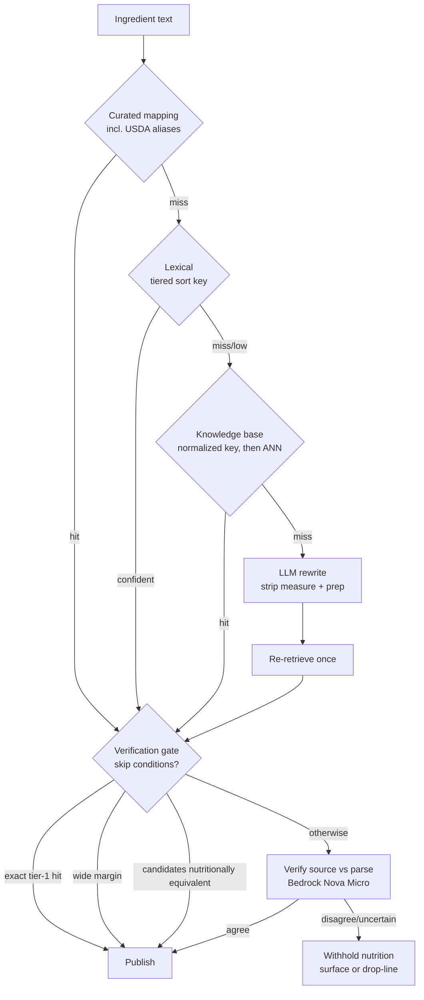

# fix: ingredient resolution quality

## Summary

Make a cook's typed ingredient text land on the right food with the right quantity, and prove it by
measurement rather than example. Ranking gains a layered tier above each surface's existing metric, the
write path stops minting prose into the catalog it searches, the parser stops corrupting quantities and
starts preserving ranges, a verification gate checks every publishable line against its source before we
assert nutrition from it, and the database moves to PostgreSQL 18.

---

## Problem frame

The 448-recipe public-domain import was run through the app's own resolution path — plain text in, no
pre-resolution — as a product measurement. Roughly **900 of 2,432 ingredient lines carried a wrong
`food_id`** on recipes marked public, and 268 matched nothing at all. Wrong matches publish false
nutrition; unmatched lines are dead text with no calories and no scaling.

Four defects compound, and research during planning corrected the framing of three of them.

**Ranking loses to substring noise.** `flour` returns `Carob flour`, `milk` returns `Crackers, milk`,
`sugar` returns a sugar-coated candy — 334 lines to those three attractors alone.

⛔ **The cause this plan originally gave was MISATTRIBUTED, and U5's design is deferred until it is
measured.** It read: "`similarity()` dominating `ts_rank` inside a `GREATEST`, so a long name that merely
_contains_ the token beats the name that _is_ the token." Measured in Postgres 16 with `pg_trgm`
(2026-08-21): `similarity('Flour','flour') = 1.00` against `similarity('Carob flour','flour') = 0.50` — no
tie, and the exact-name row wins outright. On the catalog a long USDA name scores **0.16** against a short
containing name's 0.50, a length **penalty** — the opposite of that sentence, and behaviour KTD-1
deliberately preserves as a virtue. The 1.0/1.0 tie that actually produces the failure is `word_similarity`,
which KTD-1 assigns to recipe-service's **local** table, not the catalog `GREATEST` the sentence blamed.
**Owner ruling 2026-08-21:** U1 attributes each wrong `food_id` in the 2,432-line corpus to its surface
(local vs catalog) FIRST, and U5 is re-planned against those numbers rather than against this paragraph.
With 92.8% of lines decided locally, the local table is the likely whole story.

⚠️ **The measurement instrument and the product do not share a ranker.** Five ranking sites exist, not two.
`rankIngredientSuggestions` and `rankIngredientResults` re-sort the server's output client-side
(PREFIX > SUBSTRING > FUZZY), and the importer bypasses them entirely by reading `suggestions[0]` off the
API. The mechanism is a **tiebreak, not a score inversion**: `word_similarity('flour', 'Carob flour')` and
`word_similarity('flour', 'Flour')` both return 1.0, and `name ASC` breaks the tie alphabetically. Both rows
therefore sit inside the server's page, the client re-sort sees both, and PREFIX beats SUBSTRING — so the
picker likely resolves `flour` correctly today while the importer does not.

⚠️ "Likely" is doing work in that sentence. The two surfaces page differently — the local ingredient table
at `DEFAULT_SEARCH_LIMIT = 10` (`ingredients.dal.ts`) and the food catalog at `SEARCH_LIMIT = 20`
(`foodSearch.dao.ts`), which `foodCatalog.gateway.search` calls with no limit at all. The server truncates before the
client sorts anything, so the client re-sort can only reorder a page the broken sort key already selected.
U1 measures whether the true match survives that page rather than leaving this reasoned. The server defect
is real either way; what is unmeasured is how much of it users currently see.

**The local ingredient table decides most lines, and pollutes itself.** 92.8% of imported lines were
decided locally before the food catalog was consulted. ⚠️ That figure bounds the OLD behaviour: the run
minted a local row for every line it processed, raising the local-hit probability for the next. It is
re-measured on the clean start before any structural precedence change.

⛔ **The prose-minting defect is one line, and it is a contract gap.** `IngredientsService.addByName`
writes the caller's own text as the display name on a food-backed row in a shared, ownerless catalog —
which `addByFoodId`'s own docstring forbids thirty lines above. The root cause is that food-service's
`addResponseSchema` publishes no `name`, so recipe-service has nothing else to write.

**The parser corrupts values silently.** `teaspoonful` is absent from the unit table (26 of 28 `*ful`
occurrences); the clause splitter breaks on `and` after the quantity normalizer has consumed it, turning
`one and one-half pounds` into 0.5; `½` precedence contradicts its own docstring. ⚠️ The `?? 0` fallback
does **not** persist a fabricated zero — the wire floor is `0.001`, so it produces a 400. Deleting it
without an absent-quantity model turns a validation error into a type error.

**Nothing catches any of it.** The recipe-side DAL test is mock-only and asserts call counts; it passes
with the `WHERE` clause arbitrarily broken.

---

## High-level technical design

Resolution is a cascade of increasingly expensive tiers. Publication is gated separately: a line may
resolve confidently and still be wrong, so the verification gate reads the raw source against our parse.



The gate checks **quantity, unit, range and food identity together** against the raw source line. Both
texts are present, so the question is closed and checkable — which is why this works where open-ended
retrieval does not (zero-shot LLM retrieval on this task class measures F1 0.0).

---

## Key technical decisions

### KTD-1 — Ranking layers above the base metric; it does not replace it

Swapping `similarity` for `word_similarity` was measured at **4 regressions and 0 fixes** on multi-word
queries, precision 26→22, because `word_similarity` does not penalise extra words. Additive tiers keep
that penalty. One structure, two base metrics: the catalog keeps `similarity`, the local table keeps
`word_similarity` (which the `flor` → `All-purpose flour` case needs at exactly 0.600).

⚠️ `foodSearch.dao.test.ts` does **not** pin the sort key. It asserts branch substrings (`'similarity('`,
`'plainto_tsquery'`, `'name %'`, `'ILIKE'`) and the `ORDER BY score DESC, name ASC` clause, never the
`GREATEST(...)` expression, and it deliberately does not pin placeholder numbering. **A tiered sort key
passes it unchanged.** That is worse than a failing test: nothing forces the rewrite, and a stale suite
stays green while counting as coverage for behaviour it no longer describes. The replacement must assert
the tier expression itself.

### KTD-2 — USDA already ships the alias table we were about to rebuild

FNDDS carries 5,432 main descriptions and **9,648 additional descriptions** — brands, regional synonyms,
alternate forms — exposed by the FDC API as `additionalDescriptions`. Our USDA client does not parse the
field and the `food` table has no column for it. Recovering it is the highest-value single change here and
it costs a schema column.

### KTD-3 — The verification gate, not a residual fallback

A tier-4-as-residual design never sees a confidently wrong answer, and every one of the ~900 bad
`food_id`s was confidently wrong. So the model verifies what is about to be **published**. Skip conditions
are narrow by owner ruling (low tolerance for bad food data): exact tier-1 hit, wide tier-2 margin, or
candidates that agree within 10% on nutrients. Everything else verifies.

⚠️ Abstain on **margin, not score**. A lone high-scoring candidate measured 50% accurate against 71% when
several were offered — a candidate with nothing behind it is a warning sign, not a confirmation.

⛔ **Each skip condition needs a guard, or it inverts its own intent.**

- **Wide tier-2 margin** requires **at least two scored candidates**. A singleton shortlist has no runner-up,
  so a naive `top − next` reads as maximal confidence and routes straight to publish — precisely the case
  the paragraph above calls least trustworthy. A shortlist of one always verifies, whatever it scored.
- **Exact tier-1 hit** skips the **food-identity check only**. A curated mapping is keyed on a normalized
  phrase and can establish nothing about quantity. The parser defects this plan exists to fix are quantity
  defects and they land on tier-1 lines too, so quantity, unit and range are still verified.
- **Nutrient equivalence** is computed over energy plus the macronutrients per 100 g, and also requires two
  or more candidates. It measures inter-candidate _agreement_, which is not correctness: the 334 lines that
  collapsed onto three attractors were sets that agreed with each other and were all wrong. It therefore
  applies only when the winning candidate also cleared the margin test.

### KTD-4 — Bedrock + Amazon Nova Micro

Chosen on measured correctness and cost. Nova Micro scores **5.5%** on Vectara's grounded-hallucination
benchmark (exact SKU match) against Claude Haiku 4.5's 9.8% and GPT-5-Nano's 10.5%, at **$0.27/month** for
our volume versus Haiku's $8.48. Bedrock adds no vendor relationship and no secret — IAM via the **recipe-workers Lambda execution role**,
not Fargate — and AWS's no-training commitment applies uniformly across models.

⚠️ **The benchmark is a coarse screen, not the decision.** Vectara's HHEM measures _summarization_
grounding, not parse verification, and KTD-5 holds that cross-model spread on verification is small — so a
4.3-point HHEM gap cannot order models on this task either. What remains is roughly an $8/month spread,
which this same section dismisses as immaterial when rejecting the NLI screen. Nova Micro is a
**cost-driven starting default**; U11's bake-off on our own residual is the decision.

**R24 requires no-retention as well as no-training.** Bedrock model-invocation logging stays **disabled**
for this integration; if ever enabled for debugging, the runbook names the destination and window.

Cost basis: $0.27/month assumes ~8,000 verified lines per month under KTD-3's verify-everything policy, not
the import corpus; at 80,000 lines it is $2.74. Swap augmentation for position bias doubles the call count
and is included.

Open risk: Nova's structured-output enforcement strength is unverified. Our schema is a three-way enum plus
a short string, and U11 bakes off Nova Micro against Claude Haiku 4.5 on our own corpus.

⛔ **Gemini Flash-Lite is not available on Amazon Bedrock** — only Gemma models are (verified 2026-08-20,
ADR-0024 §4). An earlier draft named it, which would have quietly reintroduced a Google Cloud relationship,
a Secrets Manager key, an egress path of its own to review against ADR-0004, and a separate R24 review. If a third candidate is wanted the in-boundary option is a **Gemma** model; adding Gemini is its own
ADR, not a bake-off line item. Model identifier is stored on every verification; the ID lives in SSM, never a constant.

Rejected: DeepSeek (trains by default, PRC residency); z.ai (ambiguous training clause, no grammar-enforced
schema); always-on local (~$9/month electricity against $0.27 hosted, plus production traffic on the
workstation holding the AWS credentials); a self-hosted NLI screen (saves ~$6/month for days of setup).

### KTD-5 — Model size does not buy verification quality

Best AUC across 7 models spanning an **18× parameter range varied by 2.3 points** (arXiv 2605.11330,
_Rethinking Evaluation for LLM Hallucination Detection_). The ceiling is task difficulty, not scale. This is why the cheapest credible model is the right default and why swapping models
is a recalibration rather than a redesign.

### KTD-6 — The quantity model lands whole, because there are no installed clients

An earlier draft deferred absent-quantity to protect installed mobile clients parsing a required-positive
`quantity`. **The product is pre-launch and not live**, so that contract protects nothing today, and the
deferral cost more than it saved: U1 asserts `Butter, size of an egg` resolves with quantity unresolved,
which a value object of `exact | range` cannot represent — the plan's own red test had no unit that could
turn it green.

Both halves land now — `quantity_high` added, `NOT NULL` and the positive check dropped, the wire field
widened — modelled as `exact | range | absent` so illegal states stay unrepresentable. ⚠️ This is the one
decision here that must be revisited if a client ships before U8 lands.

### KTD-7 — The canonical name already ships; there is no cross-service ordering problem

An earlier draft split the write-path fix into two ordered deploys, premised on food-service publishing no
canonical name. It does: `statusResponseSchema.food` is `foodResponseSchema`, which carries `name`. And
`sanitizeFoodName` is NFKC plus invisible-character hygiene — "Unicode _hygiene_, not confusable folding,"
per its own docstring — so on a fresh add it returns the caller's prose unchanged, and would have published
the very value the fix exists to stop writing.

The rename therefore belongs at the `RESOLVED` transition, inside recipe-service, reading a contract that
already ships. No `addResponseSchema` change, no deploy ordering, one unit instead of two.

⚠️ The ordering guard that draft named does not exist, and must not be relied on elsewhere:
`assertContractHashesAgree` compares two stamps baked into a single image against
`@kitchensink/schema-recipe`, and the cross-service check in
`packages/clients/food-service/src/contractSkew.ts` states in its own docstring that it
**"WARNS, IT DOES NOT REFUSE."**

### KTD-8 — The gate amends the origin's fallthrough model, by owner ruling

Origin R12 describes a cascade where a confident hit is terminal. The gate re-checks confidently-resolved
tier-1 and tier-2 lines, which is a different model. That change is an **owner ruling** — the LLM as
fail-safe, with skip conditions narrowed by a stated low tolerance for bad food data — recorded here
because a plan should not amend a requirement silently.

---

### KTD-9 — The gate is core platform capability, not a BYOK or tiered feature

**Owner ruling (2026-08-20): there is no collision with feature 005.** 005's BYOK-first principle governs
its own subject — the MCP and AI-integration feature — and does not reach ingredient, quantity or
measurement resolution. Those are a core capability serving every user, platform-paid and platform-keyed,
neither BYOK nor tier-gated.

The corroborating detail, had the two ever overlapped: an unattended import has no user and therefore no
key, so BYOK could not have covered this path regardless.

### KTD-10 — Both engines always; the comparator is the judge

Rejected: CRF-first with escalation on a confidence signal. The CRF emits per-component confidence, but
using it as an escalation gate makes a hand-tuned threshold the arbiter of when we pay for a model — the
same class of hand-rolled heuristic the pipeline replaces, and one nobody can calibrate without the
disagreement data this design produces. Running both is cheaper than being wrong, and it yields the
adjudication corpus we have never had.

### KTD-11 — Field-level winner, and the flag must be SHAPE-AWARE, not binary

On disagreement: **amounts from the CRF** (exact fractions, deterministic, composites native),
**identity and preparation from the LLM** (measured better on both), **historical units from the LLM**
(the CRF is blind to them).

⛔ **CORRECTED 2026-08-23 by KTD-11b, in two ways.**

**(1) Placement is no longer a winner question at all.** Once the ruling exists, the comparator
CANONICALIZES both engines' answers through it before comparing — a modifier goes where the rule says
regardless of which field each engine filed it in. Those cases stop being disagreements rather than being
won. That is strictly better than picking a side: a winner rule would keep re-deciding, per line, a
question that has one answer.

**(2) On placement, the LLM was the wrong choice, and by a clear margin.** Scored against the ruling over
the contested modifier words: the **CRF's filing matches it 125 times (68%), the LLM's 58 (32%)** — better
than two to one. "Identity and preparation from the LLM" was inferred from the earlier bake-off's
aggregate and does not survive contact with the axis it actually governs. The canonicalization in (1)
makes the winner rule moot for placement, so nothing needs to be reassigned — but the sentence above must
not be read as evidence the LLM files modifiers better, because it does not.

⚠️ The LLM's measured strengths that DO survive: multi-food lines (`modelSplitsFoods`), historical units,
and pulling a unit out of a food name (`crfUnitInName`). Those are different questions from placement.

⛔ **Measured 2026-08-23, and it reshapes this decision: the two engines agree on all three fields for
only 49.17% of ingredient lines** (Nova Micro, n = 1,379; Pro ties at 49.53%). Per field the picture is
better — measure 75.6%, food names 63.3%, preparation 69.0% — so the 49% is a _conjunction_ of three
imperfect agreements, not a catastrophe in any one. But it means a binary "disagree ⇒ flag" rule flags
**half the corpus**, which is not a review queue; it is the corpus with extra steps. A flag that fires on
half of everything is how a real signal gets muted — the same failure `contractSkew.ts` names.

So the comparator classifies the disagreement's **shape**, and only some shapes reach a human. Measured
distribution (Nova Micro, ingredient lines):

| shape                                                                      |   n | disposition                                                                          |
| -------------------------------------------------------------------------- | --: | ------------------------------------------------------------------------------------ |
| `differ` (unstructured name disagreement)                                  | 354 | ⚠️ **the genuine adjudication list** — 25.7% of lines                                |
| `quantityDiffers` (units agree, numbers do not)                            | 114 | CRF wins, record both                                                                |
| `amountCountDiffers` (different NUMBER of amounts read)                    |  92 | CRF wins; this is the composite case U31 touches                                     |
| `unitDiffers`                                                              |  81 | CRF wins, record both                                                                |
| `crfUnitInName` (CRF swallowed the unit into the food)                     |  25 | **LLM wins silently** — the CRF is demonstrably wrong (`"a little vinegar"`)         |
| `crfSizeField` (CRF routed `large`/`small` to a field we have no slot for) |  24 | canonicalised into `name` — U16, U19. `large` is an adjective, so KTD-11b decides it |
| `modelSplitsFoods`                                                         |   7 | **LLM wins silently** — this is the multi-food case the CRF cannot express           |
| `modelPrepInCrfName`                                                       |   4 | **LLM wins silently** — identity-vs-prep, the LLM's measured strength                |

That reduces what a human ever sees from ~700 lines to the 354 `differ` cases, and it does so on evidence
rather than by tuning a threshold.

### KTD-11a — `differ` is four things, and three of them need no human (measured 2026-08-23)

All 354 `differ` cases were read out and compared by **token multiset** — what words each engine used,
regardless of which field it filed them in. That split is mechanical and reproducible; it tunes nothing.

| bucket                                                   |   n | share | disposition                                |
| -------------------------------------------------------- | --: | ----: | ------------------------------------------ |
| **Placement only** — identical words, different fields   | 184 | 52.0% | **a rule, not a human** — see KTD-11b      |
| **Function words only** — differ by `that/have/been/of…` |  21 |  5.9% | normalize stopwords before comparing (U19) |
| **Duplication only** — one side counts a word twice      |  19 |  5.4% | dedupe; it is an LLM defect (U19)          |
| **Genuine content difference**                           | 130 | 36.7% | the real adjudication list                 |

⛔ **The adjudication list is therefore ~130 lines — 9.5% of ingredient lines, not 25.7%.** Small enough to
read end to end rather than sample, which is what U23's oracle should do.

⚠️ **And a large share of `differ` is not a model disagreement at all — it is the EXTRACTOR.** Reading the
sample: `one tablespoon of butter in a frying-pan`, `one pound of flour into a deep bowl`,
`one pint of milk for five minutes`, `two pints of water overnight`, `four tablespoons of flour to it` —
and `a large preserving kettle`, which is equipment. That is residual **instruction** text: a vessel, a
duration, a target. Neither engine is wrong; both are handed prose that should never have reached a
parser. The CRF folds it into the name, the LLM files it as prep, and the comparator scores a
disagreement. It also inflates bucket 4 — `three cups of milk for twenty minutes` differs only because
the CRF dropped the trailing clause and the LLM kept it.

This is `proseRecipe`'s clause segmentation, already leaking, and it inflates **every rate in the report**.
Fixing it comes BEFORE adjudicating anything, or the oracle spends its effort judging text that is not an
ingredient line. See the build order below.

### KTD-11b — ⛔ RESOLVED (owner ruling, 2026-08-23): where a modifier belongs

`one-half cup of chopped onions` → the CRF says `name=onions, prep=chopped`; the LLM says
`name=chopped onions`. **Both read the line correctly.** What is missing is a rule in our own schema
saying where a modifier belongs — and its absence is the single largest disagreement class in the system.

**The ruling.** A **past participle is preparation** (`chopped`, `grated`, `melted`, `sifted`, `minced`,
`stoned`, `beaten`). An **adjective is identity** (`sweet`, `brown`, `pastry`, `Russian`, `fresh`, `red`,
`green`). **Temperature is preparation** (`hot`, `cold`, `boiling`, `lukewarm`, `warm`) — the middle case,
committed deliberately.

This is now the definition `prep` carries system-wide, including the write-path field in U26.

**Verified against the 354, and it does not settle as many as first claimed.** Applying the ruling
mechanically:

|                                                                  |       n | note                      |
| ---------------------------------------------------------------- | ------: | ------------------------- |
| Contest a genuine **food modifier** — the ruling decides         | **128** | 36% of `differ`           |
| Contest **instruction residue**, not a modifier — U22a's problem |      69 | the ruling does not apply |
| No contested word after normalization                            |      12 | U19 absorbs these         |

⛔ **Correction to KTD-11a: the ruling settles ~128 lines, not 184.** The 184 figure counted every
placement-only case, and 69 of those are contested over words like `into`, `spider`, `overnight` and
`bowl` — the extractor's residue wearing a placement disagreement's clothes. Fixing U22a and applying this
ruling are the same 197 lines between them, but they are not interchangeable and the ruling alone does not
reach the 69.

⚠️ **Two implementation traps, both hit while verifying this.** `red` and `green` end in `-ed`/`-en` and
are colours, not participles — a naive suffix test mis-files them as preparation. And `-ed` alone is not a
participle test; the vocabulary needs an explicit irregular list (`cut`, `ground`, `beaten`) plus an
adjective exception list. This is a small lexicon, and per the library-first gate it should be checked
against an existing POS tagger before being hand-rolled — the CRF package already ships one.

⚠️ **Accepted consequence.** `cooked green peas` files `cooked` as preparation and `green` as identity;
`dried figs` files `dried` as preparation. Both are arguably identity to a cook. The ruling is a
definition, not a claim about English, and this is the edge it buys clarity with.

⚠️ Still observe-only at first: a flagged line imports. U11's error asymmetry transfers directly — a wrong
agreement passes data that would have shipped anyway; a wrong disagreement withholds a correct line, which
is worse than today. Observe-only is the resting posture, not the fallback.

⚠️ **These rates are measured on one 1919 cookbook** and are upper bounds (1,148 blocks were skipped
whole, 673 of them for `too_few_ingredients`). Historical prose is the hardest text this pipeline will
ever see; a modern line like `2 cups all-purpose flour` should agree far more often. Do not carry 49% into
a capacity estimate for modern imports without re-measuring.

### KTD-12 — An unavailable engine is not a disagreement

`contractSkew.ts` states the rule: _"ABSENCE IS SILENCE, never a mismatch… Reporting those as skew would
make every pre-publication deployment noisy, which is how a real warning gets muted."_ If the CRF Lambda
throws or the LLM is denied by the ADR-0024 ceiling, the outcome is `single-engine`, carrying which engine
answered — never `disagree`. Collapsing the two is how a transient degradation becomes a permanent fact
about an ingredient, the same error `resolutionCascade.ts` calls out for `unavailable` vs `consulted`.

### KTD-13 — One cache row per engine, not one per line

The nearest precedent, `recipe_ingredient_verifications`, stores `model_id` as an **attribute** and
versions the _derivation_ — swapping models does not invalidate cached verdicts. That is right for a
judgement and wrong here. A comparison pipeline needs both engines' outputs to coexist, so the cache is
keyed `(lineDigest, engine, engineVersion)` and the merged result is derived, not stored as the only row.
A CRF version bump re-partitions only the CRF rows; the LLM half survives, and the comparator re-runs
against the new pairing.

The key module copies `verificationKey.ts` wholesale in shape: `{version}:{sha256hex}`, a **JSON array**
preimage (never a concatenation — `unit:'cup' + foodId:'X'` and `unit:'cupX' + foodId:''` collide, and
that is the worst possible cache hit because it looks like a saving), NFC + whitespace normalization with
case **not** folded, and an exported `PARSE_KEY_VERSION` carrying the ⛔ bump rule. The digest arrives as a
Port so `recipe-core` stays a zod-only dependency leaf — `contract.test.ts` asserts that property because
web and mobile bundle it.

### KTD-14 — The cache stores a digest and a parse; the correction table stores the person

Two tables, two erasure treatments, and the split is deliberate.

- **`ingredient_parse_cache`** is keyed by digest and stores structured output. It holds no owner link,
  the same property that keeps `recipe_ingredient_verifications` out of the erasure sweep. ⚠️ Its
  `foods[].name` is a fragment of user-typed text; the mitigation is that the row is shared installation-
  wide and keyed by digest, so it carries no person-to-row link to erase. This is asserted, not assumed —
  U20 adds the test.
- **`ingredient_parse_corrections`** holds what a cook typed and who typed it, so it takes the memo
  treatment from migration `0026`: nullable `owner_id`, a partial index `WHERE owner_id IS NOT NULL`, the
  text column's `NOT NULL` dropped in the **same** expand-first migration as the sweep, and a
  **de-identifying `UPDATE`, never a `DELETE`** — the row is consulted by every user's pipeline, so
  deleting it would silently un-correct that line installation-wide. `owner_id` and the text move as a
  pair or not at all.
- ⛔ **REVERSED 2026-08-25 — ADR-0027.** The bullet above describes the erasure treatment as it was
  designed. The owner has since ruled that an ingredient phrase is **not personal data**: migration `0033`
  removed the sweep, renamed `owner_id`/`author_id` to `user_id` (a DISTINCT-USER COUNTER and an
  authorization predicate, never an erasure predicate), dropped the pair CHECKs, and dropped
  `ingredient_resolution_memos.owner_id` entirely. Read
  `docs/architecture/decisions/0027-ingredient-phrase-is-not-personal-data.md` before implementing anything
  from this section.

### KTD-15 — The correction tier reuses `mappingScopePolicy`, applied to a different subject

The scope question is identical knowledge: a held grant writes globally on first correction; every other
correction stays author-scoped until a second independent user corroborates it. That is one business rule,
so it has one representation. What differs is the _subject_ — a parse rather than a phrase→`food_id`
mapping — which is a parameter, not a second rule. ⚠️ If implementation finds the policy's inputs cannot
be satisfied without distorting them, that is evidence the two are not the same knowledge after all;
duplicate rather than over-DRY, and record why.

### KTD-16 — The CRF is a new deployable, and the exception is written, not assumed

ADR-0017 sets **"no new deployable service"** as the default. ADR-0019 §3 is the template for the
exception and its three grounds fit almost verbatim: the workload is CPU-shaped and bursty rather than
request-shaped, it carries a vendor dependency the recipe service should not link, and it scales on a
different axis from recipe CRUD. ADR-0019 also fixes the consequence: **the new deployable owns no
database**, so the parse cache lives in the recipe database, not beside the engine.

Shape: **a new package with its own stack and no `esbuild.mjs`.** The W2 packaging guard
(`serviceInfraWiringInvariants.test.ts:591`) skips a service with no `esbuild.mjs` — its own comment
anticipates exactly this ("it packages its Lambdas some other way"). That is the honest route. A container
image would instead force an amendment to `RecipeWorkersStack.test.ts:511`, which reads
`fn.Properties?.Handler` unguarded and whose docstring explicitly warns against letting a real Lambda
"leave the guard by looking like a provider."

⛔ Three things this owes, none optional. **(a)** A Python runtime pin beside `NODE_LAMBDA_RUNTIME` with a
sibling of `lambdaRuntime.test.ts` — cdk-nag's `AwsSolutions-L1` is family-generic and will flag
`python3.13` the moment CDK ships a newer Python. **(b)** A GR-008 ruling: the rule says every workspace
targets Node 24 and does not contemplate a second runtime. **(c)** Its **own** packaging guard. W2 skipping
is honest but it is also a hole, and it is the same hole `handle-sync-worker` fell through — that Lambda
shipped 4.6 KB of raw `tsc` output against siblings of 436 KB–981 KB and died on every cold start with
`ERR_MODULE_NOT_FOUND`, while _"two guard tests missed it because both enumerated the same five names…
a copy of a list cannot detect that the list is incomplete."_

### KTD-17 — The LLM leg is a new consumer of the ADR-0024 ceiling, not a new ceiling

There is ONE ceiling: $100/month, prod only, enforced by reserve-then-settle against
`verification_spend`. The parse leg reserves and settles through the same counter with its own
`callSite`, so a runaway in either path is bounded by the same dollar figure. ⛔ Settle is never retried;
any outcome with no billed response refunds in full. Sandbox and `pr-{N}` call ungated, per ADR-0024.

⛔ **RESOLVED (owner ruling 2026-08-24): the ceiling is GLOBAL, and is not sub-divided per consumer.** One
$100/month pool serves the verification gate, this parse leg, and 017's capture tiers alike, first come
first served.

That is the same argument ADR-0024 already made when it rejected the daily sub-ceiling: a sub-budget
_"never enforced the monthly figure it sat under… and it denied legitimate bulk work."_ A per-`callSite`
cap is the same mistake on a different axis — it would refuse a legitimate import while the global figure
sat nowhere near $100, and it would need re-tuning every time a consumer's share of the work moved.

⚠️ **Accepted consequence, stated so nobody reports it as a defect: the first consumer to burn the pool
denies the other two.** A large import can starve the verification gate for the rest of the month. The
gate fails CLOSED and its messages retry under `maxReceiveCount` before hitting the DLQ, so that outcome
degrades rather than corrupts — but it is a real coupling, and it is the price of not sub-dividing.

⛔ **What does NOT follow: that spend needs no attribution.** Not capping per consumer makes it MORE
important to know which one spent, not less — when the pool empties, "who burned it" is the first question
and the counter cannot answer it today. So `callSite` is carried on the EMF spend metric as a **dimension**
while the ceiling stays a single number. Attribution without partitioning.

⚠️ Note the shape: this is the same defect just found in food's `source-rolling-window-count`, which
carries a `source` dimension and no `stage`, so prod and every preview co-mingle into one series and no
call can be attributed. Do not ship the spend metric with that gap — a dimension on the metric is cheap; a
dimension retrofitted after an incident is not.

### KTD-18 — `ParsedIngredientLine` becomes a projection, not a widened interface

The new pipeline yields multiple foods, each with a preparation, plus a stated measure. Widening
`ParsedIngredientLine` in place would break its one caller and, worse, would make the _narrow_ shape the
canonical one. Instead a new `ParsedLine` is the canonical output, and `ParsedIngredientLine` becomes a
documented **projection** of it — first food, measure flattened — so today's caller keeps compiling while
the richer fact is available to anything that wants it. New members arrive as **required keys with
nullable values, never optional**, so every construction site becomes a compile error rather than
silently keying the old way.

---

## Implementation units

### U1. Test substrate — collation parity and the judgement sets

**Goal:** make ranking and parsing measurable before either is touched.
**Requirements:** R42, R57–R60, R63.
**Dependencies:** none. Blocks U5, U6, U7.
**Files:** `docker-compose.yml`, `docker-compose.test.yml`,
`packages/services/food-service/tests/__fixtures__/judgementSet.ts` (new),
`packages/shared/recipe-import-core/tests/__fixtures__/goldenCorpusParse.ts`.

**Approach:** move the local Postgres image off `postgres:16-alpine` — musl sorts as `C`, and 99.7% of
`name ASC` tiebreak positions differ from CI and RDS, so a judgement set authored today encodes the wrong
ordering. State it as a continuous invariant: local tracks the RDS major version and collation provider.
Then author the Golden Relevance Judgement Set (≥60 `{query, expectedTopFoodName, why}` entries, multi-word
entries **sampled from the import corpus** rather than from the cases used to design the weights) and extend
the existing parse golden corpus with the known failures.

⚠️ Precision targets are stated against inter-annotator agreement, not 100%. Three annotators agreed
unanimously on the correct USDA row only **61%** of the time in published work; dietitians agreed 51%.

**Annotation protocol** — without this the floors measure agreement with one person, which is the
over-fitting R58 and R59 exist to prevent. Every judgement-set entry carries **two independent labels**;
disagreements are adjudicated by a third pass and the resolution recorded in the entry's `why` field; the
observed agreement rate is committed alongside the set so 0.9 and 0.85 are read against our own ceiling
rather than a published one. R60's adjudicated sample follows the same protocol.

**Two baselines, not one.** The judgement set measures the server. A second committed baseline captures the
**client-re-sorted top-1 for every distinct query in the 2,432-line import corpus** — what users actually
see today. U5 gates on both, because "zero regressions" against server output alone would measure the
server against itself while the picker silently got worse.

**Execution note:** every entry is written red, before any fix.
⛔ **Commit the BEFORE-baseline as an artifact, not a memory.** The 448-recipe run's report, per-line
resolved `food_id`, unmatched count and the three attractor tallies live nowhere in the repo — the figures
"2,432" and "~900" appear only in this plan and ADR-0024. U15 requires its after-run be reproducible from a
committed corpus manifest while imposing no such requirement on the run every success criterion is
denominated in, so a post-release disagreement about whether the numbers moved cannot be settled.
**Patterns to follow:** `foodSearchAccessPath.integration.test.ts` — equivalence of the `(id, name, score)`
sequence with access paths disabled and enabled, plus a vacuity guard. Seed at **100,000** rows — that
file's own header records why it abandoned 50,000: the guard "FIRED in CI — twice, on commits identical in
every relevant respect to two that passed", because 50,000 sits on the planner crossover at a 1.53x margin
against 2.36x at 100,000. (SC-007's k6 population is a different corpus and stays at 50,000.) ⛔ Do **not** re-add a query-plan cost gate — one was written, measured and
removed for cause.

**Test scenarios:**

- `1½ cups` parses to 1.5, not 1 — currently red.
- `one and one-half pounds of beef` parses to 1.5, not 0.5 — currently red.
- `2 to 3 cups` yields both bounds — currently red.
- `a teaspoonful of salt` parses at all — currently red.
- `Butter, size of an egg` matches butter with quantity unresolved rather than dropping the line.
- Judgement set: `flour` → `Flour`; `brown sugar` → `Sugars, brown`; `red wine vinegar` → `Vinegar, red wine`.
- Known-miss entries assert they still miss, including word-order inversions the tiers do not solve.
- Collation: `name ASC` ordering identical between the local image and a CI-shaped instance.
- Truncation: for `flour`, `milk` and `sugar`, record whether the true match survives the server's
  page on both surfaces — each at its own limit (local 10, catalog 20) — the measurement the Problem frame's
  severity claim rests on.
- ⛔ **Every recorded top-1 and true match carries its PROVENANCE SECTION** (local vs catalog). Without it
  this measurement cannot settle the question it exists to settle: `rankIngredientSuggestions` re-ranks
  _within_ each section and deliberately preserves the server's local-before-catalog order ("a global sort
  would interleave them and re-create exactly the reorder/layout-shift jank the sectioned design exists to
  prevent"), so a wrong `local` suggestion outranks a correct `catalog` one **regardless of match quality**.
  The picker-vs-importer divergence claim therefore holds only for same-section cases, and with 92.8% of
  lines decided locally the cross-section case is the one that dominates.
- ⛔ **Attribute each wrong `food_id` in the 2,432-line corpus to its surface** — this is the measurement the
  owner's 2026-08-21 ruling makes U5 wait on. See the Problem frame.

**Verification:** the suite is red for every known defect and green for every case already correct.

### U2. Recover USDA `additionalDescriptions`

**Goal:** stop discarding USDA's curated alias table at the client boundary.
**Requirements:** R11 (curated tier), KTD-2.
**Dependencies:** U1.
**Files:** `packages/clients/usda/src/schemas.ts`, `.../types.ts`,
`packages/services/food-service/src/db/schema/food.ts`,
`packages/services/food-service/src/db/migrations/0007_food_aliases.sql` (new),
`packages/services/food-service/src/foods/seed/`, `packages/services/food-service/src/foods/dao/foodSearch.dao.ts`.

**Approach:** parse `additionalDescriptions` in the USDA client (validating the raw upstream shape at the
boundary per GR-015 §15-d) and persist it. ~1.8 curated aliases per row, carrying brands and regional
synonyms we were otherwise going to rediscover by hand.

⚠️ The k6 re-measurement U5 gates on is only meaningful once the perf fixture populates aliases at
production-like density (~1.8 per row): `packages/services/food-service/tests/load/preparePerfFixture.ts`
seeds names, descriptions and crosswalk rows and nothing else, so with `additionalDescriptions` null on
every row the second tsvector, its GIN index and the OR'd `ts_rank` all cost nothing and the gate passes on
the speed of doing no work.

⛔ Aliases get their **own** `STORED` generated tsvector and their own GIN index — they are **not** folded
into `search_vector`. Folding them in would need `ALTER COLUMN ... SET EXPRESSION`, which arrived in
**PostgreSQL 17** and is therefore unavailable until U13; the PG 16 equivalent is DROP + ADD COLUMN, taking
an ACCESS EXCLUSIVE lock, rewriting `food`, and dropping the dependent GIN index. `relevanceQuery` ORs the
two vectors and combines their `ts_rank`. That keeps the unit genuinely additive.

**Execution note:** integration test first, against a real database — a unit test cannot observe a
migration that did not apply.
**Patterns to follow:** `0001_food_fts.sql`'s generated column, declared `STORED` explicitly.

**Test scenarios:**

- A food with aliases round-trips them through client → DAL → row.
- A query matching only an alias (`Tillamook`) returns the aliased food.
- A food with no aliases persists null, not `''` (GR-019: no sentinels).
- Migration integration test asserts the column and index exist on a migrated database.

**Verification:** alias-only queries resolve; judgement-set entries covering brand and regional terms move
from known-miss to hit.

### U3. Recipe-service writes the canonical name at resolution

**Goal:** close the write path that pollutes the table the ranker reads.
**Requirements:** R25, R26, R27, R28. **Dependencies:** U2.
**Files:** `packages/services/recipe-service/src/ingredients/ingredients.service.ts`,
`.../dal/ingredients.dal.ts`, `.../ingredients.controller.ts`.

**Approach:** `refreshStatus` writes `status.food.name` onto the local row when a food transitions to
`RESOLVED`, replacing whatever prose the caller supplied at add time.

⚠️ **A `PENDING` local row is NOT sanitized** — `addByName` writes `name: trimmed`, i.e. `.trim()` and
nothing else. Food-service's `sanitizeFoodName` is the repo's one canonical form for a shared display name
(it exists because that catalog is "ownerless, globally unique-named and shared by every user"), and
recipe-service's local `ingredients` table does not use it. Route local writes through the same form.

⚠️ **The prose comes from the IMPORTER, not the picker.** From the picker `addByName` receives the user's
search term ("butter"); from the importer it receives a parsed fragment of recipe prose. Same function, two
very different inputs — which is why the local table fills with strings no user would type, and it matches
the 92.8%-decided-locally measurement. **Owner ruling 2026-08-21: `PENDING` rows STAY VISIBLE in search** —
a food being acquired is something a searcher wants to see, and the demand signal is useful. The fix is on
the WRITE path, not by hiding rows.

⛔ **`ingredients` has NO `search_vector` trigger** — `0001_initial.sql` creates exactly one,
`trg_recipes_search_vector`, and it is on `recipes`. `ingredients.dal.ts` says so in its own header: the DAL
populates the vector on write via `to_tsvector('english', name)`. So the rename UPDATE must recompute
`search_vector` in the SAME statement, mirroring `createFoodBacked`/`createFreeform`. A plain
`UPDATE … SET name` leaves the ranker matching the original prose forever — the exact defect this unit
exists to close.

⚠️ **A `RESOLVED` status may carry no usable name.** `foodResponseSchema.name` is `z.string().nullable()`
and `statusResponseSchema.food` is optional, while `ingredients.name` is `NOT NULL`. When `food` is absent
or `food.name` is null, leave the existing sanitized caller text in place and record the status only.

⛔ Preserve the `by-name` USDA acquisition path — 202 `PENDING` → `RESOLVED` — which is how a food absent
from the seed legitimately enters the catalog. What is forbidden is minting caller prose as a permanent
label, not acquiring real foods on demand. Define what an unresolved line persists, given
`recipe_ingredients.ingredient_id` is `NOT NULL`.

**Execution note:** integration test first, against a real database.

**Test scenarios:**

- A food resolving to `RESOLVED` renames the local row to food-service's canonical name.
- A `PENDING` row keeps the caller's sanitized text and is not treated as canonical.
- `search_vector` reflects the renamed value after the update.
- A food genuinely absent from the catalog still triggers acquisition and resolves to the real food.
- An unresolved line persists without violating the foreign key.
- Integration: two users submitting different prose for the same food converge on one row, one name.

**Verification:** after a re-import, **no `RESOLVED` row** in `ingredients` has a name that is anything but
food-service's canonical answer for its `food_id`, and **every row at any status** carries a name in the
canonical Unicode form.

⛔ **An earlier draft of this line demanded "no row at ANY status is a prose fragment" and that is
unachievable — do not restore it.** Three reasons, all in this unit's own text: the rename's only trigger is
a `RESOLVED` transition; a food that never resolves legitimately keeps the caller's text, which the owner
ruled on 2026-08-21 and the paragraph above mandates; and canonicalization is Unicode hygiene, which cannot
recognise prose. Detecting prose is the parser's job (U7), not this unit's. The criterion above is the
invariant U3 can actually guarantee.

⚠️ **U15 therefore COUNTS non-canonical, non-`RESOLVED` rows rather than asserting zero** — that number is a
measure of how many acquisitions never completed, which is worth watching, not a pass/fail gate U3 can meet.

### U4. _(merged into U3)_

The two-deploy split this unit described rested on a false premise — see KTD-7. Its work now lives in U3.
The U-ID is retained rather than renumbered so existing references stay valid.

### U5. Tiered ranking on both surfaces, and retire the client re-sorts

**Goal:** one authoritative ranking rule per surface, observable by users.
**Requirements:** R1–R5. **Dependencies:** U1.
**Files:** `packages/services/food-service/src/foods/dao/foodRelevance.ts` (new),
`.../foodSearch.dao.ts`, `packages/services/recipe-service/src/ingredients/dal/ingredientRelevance.ts` (new),
`.../ingredients.dal.ts`, `packages/apps/commise/features/recipes/src/hooks/ingredientResolver.model.ts`,
`.../useIngredientResolver.ts`, `.../useIngredientFilterSearch.ts`,
`packages/services/recipe-service/src/ingredients/foodCatalog.gateway.ts`,
`packages/tools/service-test-harness/src/rankingConformance.ts` (new).

**Approach:** extract a named Scoring Policy per surface owning the weights, the tier gap and the
score-is-sort-key rule. Tier structure is additive above the base metric. The shared **invariant** lives
once, as a conformance contract in `service-test-harness`, run by both services against their own DAL —
shared rule, never shared SQL.

⛔ **Retire `rankIngredientSuggestions` and `rankIngredientResults` in this same release.** Retiring them
first makes `flour` worse in the product, because the client re-sort currently masks the defect.

**Owner ruling (2026-08-20): the server determines order, on best-quality match.** REQ-057's _intent_ —
best match first — is preserved and better served; what is retired is its _mechanism_, a client-side
prefix-over-substring-over-fuzzy heuristic that approximated relevance from string shape rather than
scoring it. The V-Model amendment records the requirement as satisfied server-side, not deleted.
⛔ Change only the sort key. Do not touch the trigram indexes: GIN and GiST are both load-bearing and
deliberately non-partial.

**Test scenarios:**

- Judgement set precision@1 ≥ 0.9 on single-token staples; multi-word ≥ 0.85 absolute.
- Zero regressions against the **user-facing baseline** U1 captures, not only the judgement set.
- The replacement DAO test asserts the tier expression itself — the existing one passes a tiered key
  unchanged, so nothing else forces the rewrite.
- Tier gap proven by an executable test, so a later weight edit cannot silently break it.
- Equivalence + vacuity at 100,000 rows for both surfaces (the k6 SC-007 corpus stays 50,000).
- Conformance contract passes for both policies.
- Component tests assert the picker renders the server's order unmodified.

**Verification:** zero regressions against **both** committed baselines; `Carob flour`, `Crackers, milk`
and the sugar candy no longer win their queries; and a **k6 re-measurement of the SC-007 search budget at
the 50,000-food scale** passes. That last gate is not optional — U5 adds tier arithmetic to a per-row cost
that already forced SC-007 to be widened to 250 ms ±15% after the `narrow` shape measured 253 ms, and U2
widens the searchable text underneath it.

### U6. Match strategy, `raw` injection, and word-order handling

**Goal:** retrieve the right candidates before ranking them.
**Requirements:** R6–R8, R10. **Dependencies:** U1, U5, U12a (the cleared table its verification reads).
**Files:** `packages/services/recipe-service/src/ingredients/selectIngredientMatchStrategy.ts` (new),
`.../dal/ingredients.dal.ts`.

**Approach:** a pure, DB-free discriminated union over query shape with an exhaustive switch, mirroring
`selectSearchStrategy`. Single-token keeps today's behaviour exactly (`flor` needs it). Multi-token adds a
head-term conjunction — **the head term is named explicitly**, not left to the implementer.

Two techniques from published prior art: **inject `raw`** when no cooking verb is present, since the catalog
says `Celery, raw` and cooks write `chives`, with a suppression list for foods never raw (butter, sauce,
milk); and handle word-order inversion by token-sort comparison, measured at 96.81% precision at >95% recall
on 4,179 real food items.

**Test scenarios:** single-token behaviour byte-identical to today; `red wine vinegar` → `Vinegar, red wine`;
`chives` gains `raw` and hits `Chives, raw`; `butter` does not gain `raw`; `flor` still resolves.
**Verification:** local-decides share re-measured and recorded (R10). ⚠️ This requires the cleared table
U12a produces, so U12's clear step is sequenced **before** U5/U6 and only its re-import step stays at the
end — see Sequencing.

### U7. Parser — precedence, clause splitting, units, ranges

**Goal:** stop corrupting stated values.
**Requirements:** R29–R35, R39. **Dependencies:** U1.
**Files:** `packages/shared/recipe-import-core/src/ingredientLine.ts`, `.../normalizeQuantity.ts`,
`packages/tools/cookbook-import/src/proseRecipe.ts`, `.../runImport.ts`,
`packages/shared/recipe-core/src/units.ts`,
`packages/tools/cookbook-import/src/unitEquivalence.ts` (new).

**Approach:** fix `½` precedence at `ingredientLine.ts` — `normalized.quantity?.valueOf() ?? entry.quantity`
never falls through for a line starting with a digit. Stop the clause splitter breaking on `and` the
quantity normalizer consumed. Add the `*ful` family to `UNIT_ALIASES`. Preserve ranges: `parse-ingredient`
already returns `quantity2` and the review reason `quantity_range_narrowed` already exists — the upper bound
is discarded at one line.

⛔ **CORRECTION (2026-08-23) — the restatement is NOT purely upstream of the wire, and a premise recorded
when this unit landed was false.** `convertHistoricalUnit` returns both halves — `stated: 1 gill` and
`restated: 0.5 cup` — but only the restated pair reached the service, on the reasoning that a historical unit
"is restated once at import, upstream of the wire, and has no read-time step to disclose". **U11's
verification gate IS a read-time consumer of the stated pair.** It builds its question from the persisted
`quantity`/`unit`, so the model was shown a source line reading `one gill of milk` beside a parse claiming
`0.5 cup` and asked whether they agree — a manufactured **false disagree** about a line we parsed correctly,
on exactly the lines this unit exists to handle. U11 names the false-disagree rate as the number that triggers
a rethink, because a wrong AGREE passes data that would have shipped anyway while a wrong DISAGREE withholds
nutrition from a correct line.

The stated pair is therefore persisted (`0027_ingredient_stated_measure.sql`), carried on the create wire and
through an edit by `recipes/domain/transcriptionCarryForward.ts`, put in the verdict key (bumped to `v2`), and
rendered as `<our_parse>` in place of the restated pair. `convertHistoricalUnit` now REFUSES a restatement
whose kind changes or whose bounds do not round-trip within 1%, because the gate is deliberately not asked to
check our own arithmetic. The two `recipe-core` docstrings that asserted the old premise are corrected in
place. ⚠️ The marker is still **not** on the RESPONSE wire and is not shown to a cook as a structured field —
that half of the original reasoning stands.

Historical units resolve **from the source book's own published table**, behind a `UnitEquivalenceResolver`
port. #12350's table gives `2 gills = 1 cup`, `4 tablespoons = 1 wine-glass`, `4 saltspoons = 1 teaspoon`,
with the system pinned by its own prose. A book with known origin and no table follows its origin's measure
system — imperial for Montefiore — never the unknown-origin default.

Wire the review gate: `toCandidateRecipe` reads `reviewReasons` and refuses value-corrupting ones into the
existing dropped-lines channel. ⛔ Preparation verbs are **labelled, not deleted** — the word lists are
grammar, never culinary vocabulary.

**Test scenarios:** every U1 red case turns green; a gill from an American book converts at 118 mL and from
_The Jewish Manual_ at 142 mL, both recording citation and measure system; a corrupting review reason lands
in dropped-lines rather than persisting.
**Verification:** golden corpus green; dropped-line count recorded in the import report.

### U8. Quantity model — ranges, absent quantities, and the wire

**Goal:** make ranges and absent quantities representable.
**Requirements:** R36, R37, R38, R40, R41. **Dependencies:** U7.
**Files:** `packages/services/recipe-service/src/database/migrations/0020_quantity_range.sql` (new),
`.../database/schema/ingredients.ts`, `packages/shared/recipe-core/src/recipeRequestBounds.ts`,
`.../recipe.types.ts`, `.../scaling.ts`, `.../nutrition.ts`,
`packages/services/recipe-service/src/recipes/recipes.schema.ts`, `packages/schemas/recipe/` (regenerated),
`packages/apps/commise/features/recipes/src/versions/diff.ts`,
`.../versions/conflictDiff.ts`, `.../versions/model.ts`.

**Approach:** add `quantity_high numeric(10,3) NULL` and a `NOT VALID` coherence check ordering the bounds,
drop `NOT NULL` and the positive check on `quantity`, and widen the wire field. Model the quantity as a
value object (`exact | range | absent`) rather than a scalar plus two loose bounds that can disagree,
mirroring the existing "`''` is rejected so unitless has ONE representation" convention.

Per KTD-6 this lands whole rather than in two releases: the product is pre-launch, so the required-positive
response field protects no installed client, and deferring it would leave U1's `Butter, size of an egg`
scenario with no unit able to turn it green.

**R38 — nutrition computed from a collapsed range carries provenance naming the bound used**, mirroring
U7's historical-unit marker. Without it the release withholds nutrition when the verifier disagrees while
silently publishing a low-bound figure up to a third under — two opposite honesty postures on one page.

**Execution note:** integration test against a real database asserting the migrated schema.
**Test scenarios:**

- Range persists and round-trips; scaling 4→6 servings turns `2 to 3` into `3 to 4.5`.
- A line stating no quantity persists as absent, not zero, and is not dropped.
- The coherence check rejects `high < low`.
- ⚠️ Changing only the **upper** bound registers as a modified ingredient in both the two-way diff and the
  three-way conflict marker. `ingredientContentChanged` is a positive field-by-field enumeration, so a new
  field is invisible to it **by construction** and no compile error catches the omission.
- Nutrition computed from a range is marked range-derived and names the bound used (R38).
  **Verification:** prod template unchanged; migration applies through the in-stack trigger.

### U9. UI — ranged quantity on both platforms

**Goal:** ship the range to users, both platforms, same release.
**Requirements:** R42, R43. **Dependencies:** U8.
**Files:** `packages/apps/commise/features/recipes/src/form/RecipeIngredientsFields.tsx` and its
`.native.tsx` sibling, `.../detail/RecipeDetailBody.tsx` and its `.native.tsx` sibling,
`.../detail/model.ts`, `.../form/messages.ts`.

**Approach:** `formatQuantity` is the single formatter and gains the range and absent cases. All copy is
localized — no literals.

**Interaction, specified so the two platforms cannot diverge:** two adjacent numeric inputs (low / high)
sharing one unit field, mirroring the existing scalar input's `aria-label` / `aria-invalid` /
`aria-describedby` wiring. An invalid range — high below low, or high present with low absent — surfaces
inline through the existing `quantityInvalid` error pattern and blocks submission rather than silently
coercing. Absent quantity renders as an empty field, not a zero.

**Test scenarios:** component tests for every state — scalar, range, absent, invalid, loading, error — on
**both** platforms; Playwright spec for entering and viewing a range; Maestro flow for the same; and a
scenario asserting the range-derived nutrition caveat (R38) renders on both platforms.
**Verification:** paired web and mobile tasks, per the enforced cross-platform rule.

### U10. Knowledge base and curated mappings

**Goal:** learn from corrections, and authorize who a correction binds.
**Requirements:** R11, R14, R19, R20. **Dependencies:** U3.
**Files:** `packages/services/recipe-service/src/ingredients/resolution/` (new),
`.../resolution/resolutionCascade.ts` (new — ⛔ **the object no unit previously owned.** U5, U6, U10 and U11
each build a tier, and nothing ran them in order, decided when a tier is "confident", or terminated the
chain — yet U11 already speaks of "terminating the cascade" as though it exists. Design pattern: **Chain of
Responsibility over ordered tier Strategies**, each tier a pure `(query, context) => TierOutcome` with I/O
behind the existing gateways. Ownership, stated once: **recipe-service owns the cascade**, food-service owns
only the catalog-side Scoring Policy it is queried through, and recipe-workers owns only gate execution
behind the shipped `PENDING → RESOLVED` lifecycle — a process boundary the tiers straddle and the plan had
never named as a seam),
`.../domain/mappingScopePolicy.ts` (new),
`packages/services/recipe-service/src/database/migrations/0021_resolution_mappings.sql` (new),
`.../ingredients.schema.ts`.

**Approach:** two tables, not one — a curated mapping is human-authored and supersedable; an embedding is
machine-derived and model-versioned. They change for different reasons. Lookup is normalized key first,
nearest-neighbour second; brute-force cosine is adequate at this size, with a **stated firing condition and
an emitted metric** for the ANN decision rather than an intention.

Scope policy mirrors `provenancePolicy.ts` in shape and docstring: pure, total, grants as a primitive
`readonly string[]`, discriminated-union return, scope string published on the wire contract. **Grant-gated
global** per owner ruling — a held grant writes globally on first correction; everyone else's stays
author-scoped until a second independent user corroborates. ⛔ Not a route guard: what is authorized is a
field value on a route that must stay open to every authenticated user.

Corroboration is a concurrent counter, so "independent" is enforced by a unique index on
`(normalized_key, author_id)`, not read-modify-write. Copy the existing `ON CONFLICT DO NOTHING` + re-read
shape for the write race.

⛔ **Supersession is scope-gated, or the grant is bypassable through the edit path.** A global-scope mapping
may be superseded only by a grant holder or by a fresh independent-corroboration pair; an author-scoped
mapping may be superseded only by its own author. Without this rule, "a later correction supersedes an
earlier mapping" hands any authenticated user a one-step path to overwrite a curator's global mapping —
the exact escalation the grant exists to prevent, reached through editing rather than writing.

⛔ **The embedding tier needs its own bar.** Tier 3 is consulted on every lookup ahead of the LLM, so a
single confidently-wrong machine resolution gets the same global reach as a curated mapping with none of
its review. An embedding entry is written only for a resolution the verification gate agreed with, and a
curated correction always overrides it.

**Promotion is auditable.** Every promotion to global scope emits a signal carrying the mapping id, both
corroborating author ids, and the normalized key. ADR-0023 pairs its grant-based global write with exactly
this kind of enumerability; two accounts held by one person clear a distinct-author check, and the answer
is that promotions are reviewable after the fact, not that collusion is prevented.

**Test scenarios:**

- Truth table over grants × scope; a corroborating second correction promotes to global; the same author
  correcting twice does not.
- A non-grant-holder cannot supersede a global mapping; a grant holder can.
- An author-scoped mapping is superseded only by its own author.
- A near-twin phrase resolves from the knowledge base without an LLM call.
- An embedding entry is not written for a resolution the gate did not agree with.
- Every promotion emits its audit signal.
  **Verification:** GR-021 table-collision gate passes; policy unit tests are truth-table shaped.

### U11. Verification gate — Bedrock Nova Micro, bake-off, calibration

**Goal:** nothing publishes nutrition we have not checked against the source.
**Requirements:** R15–R18, R21–R24, R61. **Dependencies:** U5, U7, U10.
**Files:** `packages/clients/bedrock/` (new), `packages/services/recipe-workers/src/handlers/verifyLine.ts`
(new), `packages/services/recipe-workers/src/common/messages.schema.ts` (the verification message shape,
beside the shipped archive and handle-sync schemas) plus the recipe-service producer that enqueues it, and
the queue + DLQ pair in `recipe-workers/infra/` following the archive/erasure pattern already there, `packages/services/recipe-service/src/database/migrations/0022_verification_spend.sql` (new — the counter
table; ⛔ NOT under `recipe-workers`, which ships no migration SQL and no runner: `RecipeWorkersStack`'s
barrier deploys **recipe-service's** runner via `migrationBundlePath`, so SQL filed anywhere else is never
applied and the gate fails closed on every call),
`packages/shared/recipe-core/src/resolution/confidence.ts` (new — ⛔ NOT under recipe-service, which
`recipe-workers` cannot import: its dependencies are `@kitchensink/recipe-core`, `pg` and `zod`),
`packages/services/recipe-service/src/ingredients/resolutionMetrics.ts` (new),
`packages/services/recipe-workers/infra/`.

⛔ **The decision logic is a PURE POLICY MODULE; only the I/O lives in the handler.** Specified as two
statements against the database and one provider call, every judgement in this unit — the skip conditions,
KTD-3's three guards, the margin arithmetic, the nutrient-equivalence comparison, the rate table,
`worstCaseMicros`, `headroomMicros`, `periodKey(nowUtc)` and the settle delta — lands inline at the call
site, testable only against live Bedrock and Postgres, and KTD-3's guards get no truth table. Two pure,
I/O-free modules in `@kitchensink/recipe-core` (reachable from recipe-service AND recipe-workers, unlike
recipe-service):

- `resolution/verificationGatePolicy.ts` — a total `(shortlist, tier, parse) => 'skip' | 'verify'` owning the
  guards and the confidence bands, docstring-named as a Specification/Policy module in the shape of
  `recipes/domain/provenancePolicy.ts`.
- `spend/spendArithmetic.ts` — the rate table, worst case, headroom, period key and settle delta.

`verifyLine.ts` reduces to reserve → call → settle. This is the repo's established split — the same shape as
`deploy-gate.sh`'s pure `deploy_gate_decide` against its impure `deploy_gate_evaluate` — and it is what makes
the gate's behaviour provable by table test rather than by deploying it.

⛔ **U11 owns tier 4 as well** (owner ruling 2026-08-21). The cascade's tier-4 LLM rewrite sat in the design
diagram and in no unit's scope. It runs under the **same execution role** and takes a reservation from the
**same counter** as the verification gate — a second `bedrock:InvokeModel` grantee would break layer 4b's
exact-set guard — and its call volume is added to KTD-4's cost basis, which today assumes the gate's ~8,000
calls alone.

**Approach:** the provider client validates the raw upstream shape with zod at the boundary and declares
its own types — GR-015 §15-d names LLM providers explicitly, and no OpenAPI document is written for an API
we do not serve. Runs in `recipe-workers`, off the synchronous path, behind the shipped
`PENDING → RESOLVED` lifecycle.

⚠️ **Egress — no VPC endpoint; the call rides the NAT.** An earlier draft added a
`com.amazonaws.<region>.bedrock-runtime` **VPC interface endpoint** to `RecipeWorkersStack` so the call
would not widen ADR-0004's four-consumer NAT list. Both halves were wrong: recipe-workers' seven Lambdas are
`PRIVATE_WITH_EGRESS` and have been NAT consumers since they shipped (the real list is 17 across six
stacks), and the endpoint bills **$0.01 per AZ-hour** — $14.60/month/stage at `maxAzs: 2`, per open PR if
declared in a per-service stack — to carry $0.27/month of inference, against a NAT instance costing ~$3–4.
This unit adds **no** endpoint. See ADR-0024 §4a and ADR-0004's 2026-08-20 update; a guard
(`natEgressConsumers.test.ts`) now asserts both the consumer list and the absence of any interface endpoint,
so re-adding one reopens the ADR first.

**The raw source line is untrusted input.** It is delimited explicitly in the prompt and the model is
instructed to disregard directives inside it. Constrained decoding bounds the output shape, not the meaning
assigned within it.

**R23's cost ceiling — $100/month, enforced, configurable.** Owner-set. At a measured $0.27/month this is
~370× headroom, so it is a runaway guard rather than a budget, and it should never bind in normal running.

⛔ **The counter's store is the recipe PostgreSQL database, not DynamoDB** — the worker already ships `pg`
and is VPC-attached solely to reach that RDS, so the counter adds no dependency, no IAM surface and no new
failure domain.

⛔ **The design lives in [ADR-0024](../architecture/decisions/0024-llm-spend-ceiling-reserve-then-settle.md)
— read it before touching this.** Summary of what it settles, not a restatement of it:

No AWS mechanism gates spend in near-real-time. Bedrock has no dollar quota; Budgets and Budget **Actions**
both fire off the same evaluation with an **8–12 hour** detection lag; Cost Anomaly Detection is up to 24h
and alert-only. So the gate is our code — which is also AWS's own published position.

The gate is **RESERVE-THEN-SETTLE**, not read-then-increment. ⚠️ The obvious shape has a durability defect
that `reservedConcurrency = 1` does **not** fix: a crash between a successful response and the increment
spends money the counter never learns about, and crashes are _correlated_ with the runaway this ceiling
exists to stop — so it under-reports exactly when it matters. One atomic conditional statement against the
recipe **Postgres** charges worst case before the call; a second refunds the difference after. Zero rows
returned **is**
the budget denial. Reserved spend never exceeds the ceiling under arbitrary concurrency — the row lock
serializes callers and the headroom subtracts the worst case before comparing — so the bound does not depend
on the concurrency setting.

**Six layers, each with its enforcement latency:**

| #   | Layer                                            | Stops                          | Latency            |
| --- | ------------------------------------------------ | ------------------------------ | ------------------ |
| 0   | SQS `maxReceiveCount` + DLQ                      | A retry loop before it is cost | Real-time          |
| 1   | Explicit `maxTokens` + input-token cap           | Worst-case cost of one call    | Real-time          |
| 2   | `reservedConcurrency = 1`                        | Burst rate — **not** the cap   | Real-time          |
| 3   | **Reserve-then-settle counter, one monthly cap** | The owner's ceiling (prod)     | ~5–10 ms, pre-call |
| 4   | EMF dollar metric → alarm → notification         | Counter bugs — **not** bypass  | ~2–6 min           |
| 4b  | `bedrock:InvokeModel` on one role, guard-tested  | Counter bypass                 | Build-time         |
| 5   | AWS Budget (~$20, Bedrock-filtered)              | Drift from the invoice         | 8–12h — audit only |

Layer 0 is the cheapest and highest-value control and this plan previously omitted it. Layer 3 is a
**single monthly ceiling and nothing more** — the daily sub-ceiling an earlier draft added was removed: a
monthly ceiling is a hard cap rather than a slow detector, it never enforced the monthly figure it sat under
(31 × $5 = $155), and it denied legitimate bulk work. The ceiling is **prod-only**; sandbox and every
`pr-{N}` call the provider ungated, bounded by layers 0–2 at ≈$88/month/stage on Nova. ⚠️ **No per-caller accounting, deliberately.** The counter is a single monthly aggregate, so one
high-volume caller in prod can exhaust the ceiling and deny verification for everyone until the reset. Named
and ACCEPTED rather than solved: the owner's 2026-08-21 framing is a last-resort parser guard, not a metered
product feature, and at Nova's $0.27/month a single caller needs ~370× normal volume to reach $100. Revisit
if the gate ever becomes user-triggered at scale or if a non-Nova model ships. ⚠️ That figure is
**per stage, not an aggregate** — sandbox plus one stage per open PR, measured against the account-wide
$300 monthly budget in `CostGuardrailsStack.ts`, which notifies rather than denies. And it is derived for
**Nova Micro**: a Haiku 4.5 winner makes it roughly 30× higher, so shipping any non-Nova model requires
re-deriving this bound before the model SSM parameter changes.

**Two preconditions that ship with the counter, not after it:** `maxTokens` is set explicitly and input
length is capped before the call — the raw source line is untrusted _and_ unbounded, and without a bound the
reservation is a lie. An over-cap line is **REJECTED, never truncated**: a truncated line asks the model to
judge text the user did not write. And an unreadable counter **fails closed** — the call is not made — but
that is not the same as resolving the line: a ceiling denial and an unreadable counter are **transient**, so
the message returns to the queue under layer 0's `maxReceiveCount` + DLQ rather than terminating as
`unresolved`. Resolving a billing denial as `unresolved` would manufacture the wrong-**disagree** outcome
this unit ranks as the unacceptable one, in bulk, for reasons unrelated to the line's quality. Failing closed
on the call itself is still correct — the gate is a quality enhancement on an async path — but note the
published precedents fail _open_ for interactive workloads, and that default must not be imported.

⚠️ Bedrock now exposes two endpoints, `bedrock-runtime` and `bedrock-mantle`, tracked against **separate
quota allocations**. Both bake-off candidates run against `bedrock-runtime`, which is the Converse and
InvokeModel surface.

The gate receives the raw source line, our parse, and the shortlist; it never retrieves, so it cannot invent
a `food_id`. Constrained decoding, ordinal enum for certainty, **abstention as a schema branch** rather than
a low number. Skip conditions are narrow: exact tier-1 hit, wide tier-2 margin, or candidates agreeing
within 10% on nutrients.

**Bake off Nova Micro against Claude Haiku 4.5 on our own 2,432 lines**, both on `bedrock-runtime` — and
pick the best performer. (Gemini Flash-Lite is not on Bedrock; see KTD-4 and ADR-0024 §4.) **Owner ruling: ship the winner and improve from there — a working gate beats
no gate.** So the bake-off selects rather than gates.

⚠️ The two error directions are not symmetric, and only one is safe to ship past. A wrong **agree** passes
data that would have shipped anyway — no worse than today. A wrong **disagree** withholds nutrition from a
correct line, which is worse than today. So both rates are measured, the winner ships regardless, and the
**false-disagree rate is the number that triggers a rethink** — including falling back to observe-only
(verdicts recorded, publication ungated) if it turns out high in production.

⚠️ Calibrate on the **residual**, not the whole judgement set: the gate sees a systematically different
distribution. The bake-off runs on the full corpus for comparability but the committed thresholds come from
the residual slice, and the plan records both numbers so they are not confused. Mitigate self-preference bias with a structured rubric (measured
at −31.5 points) and position bias with swap augmentation (10–15 points).

**Test scenarios:**

- A wrong quantity in the parse is flagged; a wrong food is flagged; a correct parse passes.
- A singleton shortlist reaches the verifier regardless of its score (KTD-3's margin guard).
- A tier-1 identity hit carrying a corrupted quantity is still flagged.
- A wrong-but-mutually-agreeing shortlist still reaches the verifier.
- Provider unavailable (`ServiceUnavailableException`), access denied (`AccessDeniedException`, 403) and
  throttling (`ThrottlingException`, 429) each terminate as unresolved rather than falling back to a
  rejected candidate.
- The monthly ceiling terminates the cascade as unresolved **before** the provider is invoked.
- An unreadable spend counter fails closed — the provider is not invoked — and the message is retried
  rather than resolved as unresolved.
- A reserve whose conditional statement returns zero rows denies the call without invoking the provider.
- An over-cap input line is rejected and never sent; it is not truncated.
- A settle is never retried; a failed settle leaves the reservation standing and emits a metric.
- A call that fails with no billed response (`ThrottlingException`, timeout) refunds the reservation in
  full.
- Only one Lambda execution role holds `bedrock:InvokeModel`; a guard test fails on any additional grantee.
- A crash after a successful response leaves the worst-case reservation standing — the counter over-counts,
  never under-counts.
- The period key captured at reserve is carried into settle; a call spanning midnight UTC does not settle
  against the following period.
- The counter costs cache-read and cache-write tokens at their own rates, defaulting both to zero — they are
  `Required: No` on the wire and unreachable at this prompt size. A non-zero value raises an alert rather
  than being assumed correct.
- A `stopReason` of `malformed_model_output` or `malformed_tool_use` is recorded as a structured-output
  failure for the bake-off, not silently retried. ⛔ In the SHIPPED path it takes the same fail-closed route
  as `ServiceUnavailableException` — never a default of "agree", which would publish nutrition from a line
  nothing verified.
- A guard test asserts the verifier Lambda declares `reservedConcurrentExecutions = 1` in every stage.
  ⚠️ This is not decoration: with the ceiling prod-only, that single constant is the ONLY thing bounding
  non-prod spend, and ADR-0024 names raising it as "the one change that makes this ruling unsafe" while
  supplying no control for it. Same discovery-and-set-equality shape as `natEgressConsumers.test.ts`.
- An unattended caller records unresolved into dropped-lines and does not block.
- An ingredient line containing an embedded instruction does not change the verdict shape.
- Every verification stores the model identifier; the high band emits the same telemetry as the middle.
  **Verification:** measured agreement rate recorded; the bake-off result committed with the chosen model.

### U12. Catalog clear and reseed

**Goal:** a clean starting state for the measurement.
**Requirements:** R44–R47. **Dependencies:** U12a (clear + recipe-side unlink) — U3; U12b (reseed) — U2,
U12a; the re-import — U7. ⚠️ **after** the write-path fix, or the
next import re-pollutes it.
**Files:** `packages/services/food-service/src/foods/seed/clearCli.ts` (new), `.../seedCli.ts`,
`packages/services/recipe-service/src/ingredients/unlinkCli.ts` (new).

**Approach:** no clear/truncate tooling exists today — this is a net-new destructive capability with no
guard rails to copy. It names its stages explicitly, requires confirmation, and refuses prod without an
explicit flag.

⚠️ **It is a two-service operation and the plan must own both halves.** Reseeding mints fresh ULIDs and
`ingredients.food_id` has no foreign key, so a food-service-only clear silently orphans every recipe-side
reference. The recipe-side step **nulls `food_id` and `food_resolution_status` in place** — it does _not_
delete `ingredients` rows, because `recipe_ingredients.ingredient_id` is `NOT NULL REFERENCES
ingredients(id)` with no `ON DELETE`, so deletion raises a foreign-key violation and would take user
recipes with it.

`food.origin = 'bulk'` on reseed is already implemented in `bulkSeed.service.ts`; verify rather than
rebuild.

**Test scenarios:**

- Clear refuses prod without the flag; a dry run reports counts without writing.
- The recipe-side unlink deletes **no** `recipe_ingredients` row and nulls `food_id` in place.
- Clear + reseed leaves no dangling `food_id`.
- Reseeded rows carry `origin = 'bulk'`.
  **Verification:** post-reseed, no `food_id` outside the food database refers to a missing row.

### U13. PostgreSQL 16 → 18

**Goal:** move the engine, without losing identity data.
**Requirements:** R48–R56. **Dependencies:** everything else. Last and alone.
**Files:** `packages/infra/global/lib/platform/DataStack.ts`,
`packages/infra/global/__tests__/engineVersionDiff.test.ts` (new), `docs/runbooks/pg18-upgrade.md` (new),
`docker-compose.yml`, `docker-compose.test.yml`, `.github/workflows/_ci.yml`,
`.github/workflows/_ci-heavy.yml`.

⚠️ U1 makes "local tracks the RDS major version and collation provider" a continuous invariant, and this
unit breaks it unless every place pinning `postgres:16` moves too — **12 CI service containers** (8 in
`_ci.yml`, 4 in `_ci-heavy.yml`) and **four** compose files, two of which this unit did not list:
`infra/localstack/docker-compose.yml` and `packages/services/identity/infra/docker/docker-compose.yml`.
`packages/services/food-service/tests/foodSearchAccessPath.integration.test.ts` carries three more, and
`.github/workflows/zizmor.yml`'s header rationale ("`postgres:16` deliberately tracks the prod RDS engine
minor") must move with it. Verification includes: no `postgres:16` pin remains anywhere in the repo.

**Approach:** `VER_16` → `VER_18` (major-only, preserving the `autoMinorVersionUpgrade` behaviour) with
`allowMajorVersionUpgrade`. 16.13 → 18 is a **verified one-hop** upgrade.

⛔ **Blue/Green is unavailable** — AWS lists CloudFormation as unsupported, and a 16.x source replicates
logically, which does not carry DDL; our in-stack migration triggers and per-PR `CREATE DATABASE` are DDL.
In-place, in a scheduled window.

⚠️ `applyImmediately` defaults to immediate in CDK, so `cdk deploy` **is** the maintenance action.
⚠️ The instance carries `kitchensink_identity` — live production user data. Snapshot first, against a
resolved physical instance id; suppress CI auto-deploy for the window.

⛔ **"Fix forward only" is not available and must not be written as if it were** (owner ruling 2026-08-21).
PostgreSQL 18 cannot be downgraded in place, so the only recovery is restoring the pre-upgrade snapshot into
a NEW physical instance — which CDK does not own, and which ADR-0002 warns is precisely how the prod data
stack gets replaced (`removalPolicy: DESTROY`, `deletionProtection: false`, no safety snapshot).
`docs/runbooks/pg18-upgrade.md` MUST carry a rehearsed restore leg: restore to a new instance identifier,
repoint the stack via explicit `instanceIdentifier`/`snapshotIdentifier`, and re-verify `cdk diff` against
ADR-0002. The dry run on the snapshot-restored clone exercises the RESTORE, not only the upgrade window.

Write the template-diff gate first: `cdkNagTemplateParity` compares the same source against itself and
**cannot fire** on an engine-version change, so the upgrade would otherwise land invisibly green against
ADR-0002.

Pre-flight: drop stale per-PR databases (each is pure outage — `pg_upgrade` dumps every database);
`SELECT datname FROM pg_database WHERE datconnlimit = -2` for invalid databases from interrupted drops.

⛔ **The reindex condition is about collation _version_, not provider, and it targets btrees.** Trigram and
tsvector indexes decompose text into trigrams and lexemes and do not depend on collation at all; the
collation-sensitive indexes are the text **btrees**, including `food_normalized_name_unique`, whose
correctness underwrites the catalog's dedup key. And `libc` is the provider whose version _can_ shift
across a major upgrade, so gating on "non-libc" inverts the risk. Compare `pg_database.datcollversion` and
`pg_collation.collversion` before and after, and REINDEX every btree on a collatable text column when the
recorded version changed.

Verified as non-issues: `pg_trgm` is byte-identical between 16 and 18 — `similarity`, `word_similarity` and
all thresholds unchanged, extension stays at 1.6, so the `flor` case at 0.600 survives. `citext` and
`pgcrypto` updates are optional and behaviourally empty.
⚠️ Statistics carryover is **contradictory** between the PG 18 docs and the RDS user guide. Plan as if
`ANALYZE` is required; the dry run settles it.

**Test scenarios:** the gate asserts the synthesized engine version equals a committed expected constant —
⚠️ NOT "fails on any engine-version change", which this very unit makes, leaving CI permanently red with no
way to land and inviting deletion to go green; U13 updates the constant and `VER_16` → `VER_18` in the same
PR, so drift still fails while an intended move is reviewable; every `generatedAlwaysAs` declares `STORED`; no `postgres:16` pin survives; post-upgrade the
judgement set re-runs.

⚠️ A post-upgrade judgement-set difference traceable to a **tiebreak or planner change** is re-baselined and
recorded, not treated as a regression — U1 measured that `name ASC` tiebreak positions are exactly what
collation moves. The sandbox soak compares `datcollate` / `datlocprovider` before and after so the two
causes can be told apart.
**Verification:** dry run on a snapshot-restored clone measures the real window; sandbox soaks before prod.

### U14. Low-confidence correction surface (web + mobile)

**Goal:** give a cook the affordance that writes a curated mapping. Without it U10 builds a write path no
user can reach and the learning loop never fires.
**Requirements:** R13, R15, R19, R43. **Dependencies:** U10, U11.
**Files:** `packages/apps/commise/features/recipes/src/form/RecipeIngredientsFields.tsx` and its
`.native.tsx` sibling, `.../form/messages.ts`,
`packages/apps/commise/web/src/components/recipes/IngredientPicker.tsx`,
`packages/apps/commise/mobile/src/components/IngredientPicker.tsx`,
`packages/shared/recipe-core/src/recipe.types.ts` (the `foodResolutionStatusSchema` member),
`packages/services/recipe-service/src/recipes/recipes.schema.ts` and `.../recipes/domain/nutritionState.ts`
(the fourth `unaccounted` reason — ⛔ NOT `ingredients.schema.ts`, where it does not live),
`packages/schemas/recipe/` (regenerated, moving `CONTRACT_HASH`),
`packages/apps/commise/features/recipes/src/nutrition/model.ts` (the exhaustive switch a widened union will
NOT fail to compile) and `.../nutrition/messages.ts` (its localized copy — without it a withheld line renders
blank).

**Approach:** a low-band resolution renders as an ingredient-line state the user can act on, polled through
the same `PENDING → RESOLVED` lifecycle the picker already drives. Selecting a replacement food issues the
R19 correction write. The `FoodResolutionStatus` union gains a member for needs-review — it currently has
no state to hang this on — and `RecipeNutritionState`'s `unaccounted` taxonomy gains a fourth reason for
verification disagreement, so a withheld line reads differently from an unreachable food service. All copy
localized.

Ships in this release on both platforms, per owner ruling and the enforced cross-platform rule.

**Test scenarios:** component tests for needs-review, corrected, withheld and error states on **both**
platforms; a Playwright spec and a Maestro flow for correcting a surfaced line; a recipe containing one
withheld line reports the verification-disagreement reason rather than collapsing into the
food-unavailable signal.

**Verification:** a user correction reaches the mapping table and the next occurrence of that phrase
resolves at tier 1.

### U15. Re-import and measure

**Goal:** produce the numbers that say whether any of this worked.
**Requirements:** R60, plus the success criteria. **Dependencies:** U12 and everything it depends on.
**Files:** `packages/tools/cookbook-import/src/importReport.ts`, `docs/reports/` (new).

**Approach:** re-run the 448-recipe import through the corrected pipeline and record three numbers, not
one: **resolution rate**, an **adjudicated accuracy** figure over a random sample of knowledge-base and
gate resolutions, and the **share of lines surfaced to a user for correction** — the friction metric the
origin names as the abandonment risk. Rate alone is gameable: a system that resolves confidently wrong
raises it.

**Test scenarios:** the report emits all three figures; the adjudicated sample follows U1's annotation
protocol; the run is reproducible from a committed corpus manifest.

**Verification:** the three numbers are committed alongside the plan as the release's evidence. ⚠️ U13
changes the engine underneath them, and U1 measured that **99.7% of `name ASC` tiebreak positions move with
collation** — so the committed figures must be RE-MEASURED on the sandbox soak after the PG 18 upgrade, and
the post-upgrade numbers are the ones that stand as evidence. Committing PG 16 figures for a release that
ends on PG 18 describes a database prod no longer runs.

---

---

### Absorbed scope — the parse pipeline and the interactive surface (consolidated 2026-08-25)

⛔ **This plan is the SINGLE source of truth for this effort.** Two parallel plans were written for work
that continues it and have been folded in here and marked superseded:

- `docs/plans/2026-08-23-002-feat-ingredient-parse-pipeline-plan.md` — the two-engine parse pipeline and
  the structured-entry surface. Its `U1–U19` are **`U16–U34`** below; its `KTD-1–9` are **`KTD-10–18`**.
- `docs/plans/2026-08-23-001-fix-bedrock-invocation-id-and-iam-plan.md` — see `U35`.

⚠️ One cross-reference is deliberately NOT renumbered: `U11` in KTD-11 means **this plan's** U11, the
verification gate, whose false-disagree asymmetry the parse comparator inherits. Every other `U`-reference
in the absorbed sections was remapped.

⚠️ Rulings and evidence stay where they were filed and are NOT duplicated here — requirements in
`specs/003-usda-food-data/spec.md` (SC-007's 500ms budget, FR-010a), the three ruled ⛔ entries in that
feature's `tasks.md`, the design contract in `docs/mockups/figma-make/README.md`, and the model
measurements in `docs/reports/2026-08-23-002-ingredient-parse-model-comparison.md`. Units cite them.

#### Build order (parse pipeline + UI tracks)

KTD-11a reordered this. The three cheap things that shrink the problem come first, and the expensive
human-judgement unit comes last, on the residue they leave:

1. ~~**KTD-11b's modifier rule**~~ — **DONE** (owner ruling 2026-08-23). Settles 128 of 354.
2. **U16** — the contract, including the size qualifier and KTD-11b's `prep` definition.
3. **U19** — the comparator: canonicalize placement through KTD-11b (128), then normalize stopwords and
   duplicates (40).
4. **U22a** — `proseRecipe`'s segmentation, which is inflating every rate measured so far.
5. **Re-run the comparison harness**, record the deltas against §3 of the report.
6. **U17, U18, U20, U21, U22** — the engines, the cache, the correction tier, the orchestration.
7. **U23** — the oracle, on the ~130 lines still standing.
8. **U24** — ADR-0025, written once the above have stopped moving.

⛔ **The UI track (U25–U34) runs INDEPENDENTLY and does not gate any of the above.** Within it the order
is: **U32 first** — it fixes a live defect (`Next` unreachable on native) and settles where every other
control lives, so building U25–U29 against an unsettled action model means building twice. Then U33 (the
step model, because it is typed and everything renders inside it), then U25–U29 (ingredient entry), then
U34's three independent pieces last.

⚠️ **Two defects are folded in here per the owner's ruling and are NOT gated on any mockup decision**:
`Next` scrolling away on native (U32), and the 768–1023px band where the shipped chrome has neither a
hamburger (`HomeTopBar.tsx:93`, `md:hidden`) nor a sidebar (`HomeSidebar.tsx:67`, `lg:flex`) — so tablet
navigation survives only via the bottom tab bar. The second is app-shell, not wizard, and is the one piece
here that touches `HomeChrome` rather than `features/recipes`.

⚠️ Steps 1–5 are cheap and they change what the rest is measured against. Doing them after U17's Python
Lambda would mean committing the expensive infrastructure decision against numbers we already know are
inflated.

#### Backend track — the parse pipeline

### U16 — The `ParsedLine` contract and its projection

**Goal.** One canonical parse result carrying many foods, per-food preparation, and the stated measure;
`ParsedIngredientLine` preserved as a narrowing projection.

**Files.**

- Create: `packages/shared/recipe-import-core/src/parsedLine.ts`
- Modify: `packages/shared/recipe-import-core/src/ingredientLine.ts`, `.../src/index.ts`
- Test: `packages/shared/recipe-import-core/src/__tests__/parsedLine.test.ts`

**Approach.** `ParsedLine` carries `raw`, `statedMeasure`, `quantity` (the existing `exact|range|absent`
union), `unit`, `foods: readonly { name, prep }[]`, `reviewReasons`, and `provenance` naming which engine
produced each field. `projectToIngredientLine(parsed)` returns today's shape and documents what it drops.

⛔ **`size` is NOT a member of this contract — owner ruling 2026-08-24, reversing an earlier draft.**

The CRF emits a `size` field (`large`, `small`), our shape has nowhere to put it, and the collision is
real: `crfSizeField` is 24 lines for Nova Micro and **57 for Haiku 4.5**. An earlier revision of this unit
concluded it therefore needed its own nullable member. That was wrong, for a reason worth recording
because it is the same mistake in a new place: **it let a third-party parser's output shape our schema.**

`large` is an adjective, and KTD-11b already rules that **an adjective is identity** — it belongs in the
food's name. There is no exception here that does not also reopen `sweet`, `brown` and `Italian`. So the
CRF's `size` is **canonicalised into `name`** by the comparator (U19), exactly as placement is, and
`crfSizeField` stops being a disagreement rather than being modelled around. That is 81 lines across the
two models resolved by applying a rule we already have, instead of by adding a field.

⚠️ Two consequences, accepted. `large onion` and `onion` are distinct names, so whether they resolve to
the same catalog food is the **resolution cascade's** question, not this contract's — which is the correct
layer for it, and the cascade already has curated mappings for exactly that. And the write path grows no
size control (the mockup's was removed on the same ruling): a cook wanting precision states a mass.

**Execution note.** Test-first. The projection's lossiness is the thing under test.

**Test scenarios.** Multi-food line projects to the first food and raises a review reason naming the
dropped ones · a single-food line round-trips with no review reason · preparation is never concatenated
into `name` in either direction · a stated measure survives projection · `absent` quantity is preserved,
never coerced to `0` or `1` (R40) · every construction site of the old shape still compiles.

**Verification.** `npm run test --workspace=packages/shared/recipe-import-core` green; `parseIngredientLine`'s
existing suite unmodified and passing.

---

### U17 — The CRF engine: package, Lambda, runtime pin, packaging guard

**Goal.** `ingredient-parser-nlp` reachable as a deployed function, with the guards its novelty requires.

**Files.**

- Create: `packages/services/ingredient-parser/` (Python source, its own CDK stack under `infra/`, no
  `esbuild.mjs`), `packages/infra/security/src/pythonLambdaRuntime.ts`
- Create tests: `packages/infra/security/src/__tests__/pythonLambdaRuntime.test.ts`,
  `packages/services/ingredient-parser/infra/__tests__/packaging.test.ts`
- Modify: `docs/architecture/decisions/0004-minimize-nat-egress.md` (the `nat-consumers` table, **only if**
  the function is VPC-attached — it should not be; it needs no database)

**Approach.** A zip-packaged Python Lambda (32 MB zipped, 102 MB unzipped — inside the 250 MB limit, and
CDK publishes assets through S3 so the 50 MB direct-upload limit does not bind). No VPC attachment: it
holds no state and reaches no database, so it stays off the NAT entirely. Its response is an **inbound
boundary** under ADR-0015 §3 — validated against an authored zod on receipt, before it becomes anything.

⛔ The packaging guard is the unit's real deliverable. It must **derive** what it checks from the
filesystem or the synthesized template — never enumerate a list — and carry a non-vacuity floor, per the
shape every guard in `packages/infra/global/__tests__/` was rewritten into after a hand-maintained list
failed.

**Execution note.** Test-first, and the guard tests come before the stack.

**Test scenarios.** The synthesized function's runtime equals the pinned constant · the pin equals the
newest Python runtime CDK knows (cdk-nag L1 parity) · the asset actually contains the model artifact and
the handler module · the guard fails when the model artifact is removed (mutation check) · the guard's
subject set is non-empty · no `InterfaceVpcEndpoint` is introduced · a malformed engine response is
refused at the boundary rather than propagated.

**Verification.** `npm run test --workspace=packages/infra/global` green including `natEgressConsumers`;
stack synthesizes; a deployed invocation returns a parse for a known line.

---

### U18 — The LLM parse leg

**Goal.** An independent parse from Bedrock, charged to the ADR-0024 counter, structurally unable to see
the CRF.

**Files.**

- Create: `packages/services/recipe-workers/src/parsing/llmParse.ts`,
  `packages/shared/recipe-core/src/parsing/parsePrompt.ts`
- Modify: `packages/services/recipe-workers/src/verification/spendArithmetic.ts` (a second `callSite`)
- Test: `packages/services/recipe-workers/src/parsing/__tests__/llmParse.test.ts`

**Approach.** The prompt is the resolved 511-byte form, versioned by an exported constant that
participates in the cache key. Response validated against an authored zod; a `malformed_model_output`
stop reason is recorded as a structured-output failure and **never silently retried**, taking the same
fail-closed route as `ServiceUnavailableException`.

**Model: Nova Micro**, on measurement rather than assumption. On ingredient lines it returns a
schema-valid answer 99.07% of the time against Pro's 99.64%, and the two are a statistical tie on CRF
agreement (49.17% vs 49.53%) — so Pro buys 0.57 points of compliance for **20.9× the cost**
($0.2385 vs $0.0114 per 1,000 lines). Nova Lite is rejected: it fences 77.7% of its answers in
` ```json `, and its agreement row rests on a self-selected 29% slice.

⛔ **The zod must accept `"measure": null` as well as `""`.** That single behaviour is 503 of Micro's 508
non-compliant responses and 267 of Pro's 268 — it fires almost only where the line states no measure, i.e.
the model is answering correctly in a shape we did not specify. Rejecting it would discard ~1% of good
answers and mis-attribute a schema decision as a model failure. ⚠️ `null` and `""` must normalize to the
**same** absent-measure value, or the cache key partitions on a distinction that carries no meaning.

⚠️ Claude Haiku 4.5 remains **unmeasured, not rejected** — it could not be invoked from this account
(`ResourceNotFoundException: Model use case details have not been submitted`). The Bedrock invocation-id
plan is the prerequisite for measuring it.

⛔ The prompt builder takes the source line and nothing else. Its signature must make a second argument
impossible, so that "pass the CRF's output as context" is a compile error rather than a code review.

⚠️ In-flight collision: a running agent is adding Nova rate entries to `spendArithmetic.ts`, and
`docs/plans/2026-08-23-001-fix-bedrock-invocation-id-and-iam-plan.md` (P3, P5 outstanding) is changing how
the invocation id resolves. Land after it, or rebase onto it.

**Execution note.** Test-first.

**Test scenarios.** The builder cannot be handed engine output (type-level) · a line containing
instruction-like text is treated as data · a malformed response fails closed and refunds in full · a
ceiling denial is transient and retries under `maxReceiveCount` · reservation charges `input + maxTokens`
before the call · settle carries the period key captured at reserve, not recomputed · an over-cap line is
rejected, never truncated.

**Verification.** Unit suite green; one live invocation against sandbox returns a schema-valid parse.

---

### U19 — The comparator

**Goal.** A pure policy deciding what the merged parse is and what the disagreement was.

**Files.**

- Create: `packages/shared/recipe-import-core/src/domain/parseComparator.ts`
- Test: `.../src/domain/__tests__/parseComparator.test.ts`

**Approach.** Specification/policy module, the sibling of `mappingScopePolicy` and `evaluateProvenance`:
pure, total, table-testable, no I/O. Inputs are two `ParsedLine | EngineUnavailable` values; the output is
a merged `ParsedLine` plus a `ParseAgreement` discriminated union — `agree`, `differ` (naming the fields),
`single-engine` (naming which), `neither`.

⛔ Compares the **stated** measure pair. ⛔ `single-engine` is never `differ` (KTD-12).

⛔ **Canonicalize the CRF's `size` into `name` first.** `large`/`small` is an adjective, so KTD-11b files
it as identity. 24 lines for Micro, 57 for Haiku. See U16 for why this is a canonicalisation and not a new
contract member.

⛔ **Then canonicalize placement through KTD-11b's ruling before comparing** — 128 lines. A past participle and
a temperature are moved to `prep`, an adjective to `name`, on BOTH engines' answers, and only then are
they compared. Needs the modifier lexicon (check the CRF package's POS tagger before hand-rolling it) and
its two traps: colours ending in `-ed`/`-en`, and irregular participles a suffix test misses.

⛔ **Then normalize the rest** — 40 more lines of the `differ` bucket, free (KTD-11a):

- **Stopwords.** `that have been boiled soft` and `boiled soft` are the same reading; the CRF keeps the
  relative-clause scaffolding and the LLM drops it. 21 lines.
- **Duplicates.** The LLM sometimes emits a modifier into BOTH `name` and `prep` (`name: "chopped celery",
prep: "chopped"`). That is a defect in one answer, not a disagreement between two. 19 lines.

⚠️ Normalizing for COMPARISON must not normalize what is STORED. The stored parse keeps the line's own
words; only the comparator's view is normalized. Conflating the two would quietly rewrite the corpus.

**Execution note.** Test-first. This is the unit whose test table is the design.

**Test scenarios.** Identical parses agree · differing amounts take the CRF and report `differ` · differing
food identity takes the LLM · a historical unit the CRF missed takes the LLM and does not report a
disagreement on the measure · one engine unavailable yields `single-engine`, never `differ` · both
unavailable yields `neither` and resolves nothing · a restated measure never enters the comparison ·
merging is deterministic under argument order.

**Verification.** Unit suite green; mutation check — inverting any winner rule fails ≥2 tests.

---

### U20 — The parse cache

**Goal.** One row per `(lineDigest, engine, engineVersion)`, with a version-bump rule that cannot rot
silently.

**Files.**

- Create: `packages/shared/recipe-core/src/parsing/parseKey.ts`,
  `packages/services/recipe-service/src/database/migrations/0028_ingredient_parse_cache.sql`,
  `packages/services/recipe-service/src/database/schema/ingredientParseCache.ts`,
  `packages/services/recipe-service/src/ingredients/dal/parseCache.dal.ts`
- Test: `packages/shared/recipe-core/src/parsing/__tests__/parseKey.test.ts`,
  `packages/services/recipe-service/__tests__/integration/ingredients/parseCacheSchema.integration.test.ts`

**Approach.** Per KTD-13 and KTD-14. Migration lands with the long `--` header the repo's convention
requires, stating the key choice, the alternatives rejected, and the `EXPAND-ONLY (ADR-0022)` clause. SQL
files live in **recipe-service's** migration directory even though recipe-workers reads the table — SQL
filed elsewhere is never applied.

**Execution note.** Test-first, and the schema assertion runs against a real database. _"A constraint is
not believed until a real database has refused something."_

**Test scenarios.** Two different preimages never collide · the JSON-array preimage distinguishes
`unit:'cup'/foodId:'X'` from `unit:'cupX'/foodId:''` · case is not folded · a version bump partitions
cleanly and old rows stay reachable by prefix · the same line under two engines yields two rows · the
table holds no owner column and no user-identifying text beyond the parse · `recipe-core` still has no
non-zod runtime dependency (leaf property).

**Verification.** Integration tier green against Docker Postgres; `contract.test.ts` leaf assertion green.

---

### U21 — The correction tier

**Goal.** A cook's correction outranks both engines, scoped by the existing policy, and is erasable.

**Files.**

- Create: `.../migrations/0029_ingredient_parse_corrections.sql`,
  `.../schema/ingredientParseCorrections.ts`, `.../ingredients/dal/parseCorrections.dal.ts`
- Modify: `packages/services/recipe-workers/src/handlers/accountErasureWorker.ts` (a twelfth numbered
  step, and the docstring above `eraseRecipeRows` in the same edit)
- Test: `.../__tests__/integration/erasure/parseCorrectionErasure.integration.test.ts`,
  `packages/services/recipe-workers/src/handlers/__tests__/accountErasureWorker.test.ts`

**Approach.** Per KTD-14 and KTD-15. Consulted **before** the cache, because a correction that lost to a
cached machine parse would be a correction that does nothing.

⚠️ There is no repo-wide gate asserting that every owner-bearing table is covered by the erasure sweep.
Both `ingredient_resolution_mappings` and `ingredient_resolution_memos` shipped without coverage and were
retrofitted; this table would be the third instance of the same class. **Propose the gate in this unit**,
not just the row.

**Execution note.** Test-first, integration-first for the sweep.

**Test scenarios.** A correction outranks a cached parse · a correction outranks both live engines ·
author-scoped corrections do not leak across users · a grant-holder's correction writes globally · a
second independent corroboration promotes an author-scoped correction · erasure NULLs `owner_id` and the
text **together**, never one without the other · erasure never deletes the row · the sweep succeeds
against a row whose text column is already NULL (idempotent) · the new gate fails when a table with an
`owner_id` is absent from the sweep.

⛔ **REVERSED 2026-08-25 — ADR-0027.** The three erasure scenarios above no longer apply: no sweep reaches
this table, so there is nothing to NULL, nothing to be idempotent about, and the coverage gate now records
the table in `RETAINED_BY_RULING` instead of demanding a sweep. What replaced them: the sweep must issue no
statement against these tables, and the rows must survive a real erasure untouched.

**Verification.** Integration tier green; erasure suite green.

---

### U22 — Pipeline orchestration, and the import wiring

**Goal.** Correction → cache → both engines in parallel → comparator → cache write, wired into
cookbook-import.

**Files.**

- Create: `packages/services/recipe-workers/src/parsing/parsePipeline.ts`
- Modify: `packages/tools/cookbook-import/src/proseRecipe.ts`
- Test: `packages/services/recipe-workers/src/parsing/__tests__/parsePipeline.test.ts`,
  `packages/tools/cookbook-import/tests/parsePipeline.integration.test.ts`

**Approach.** The orchestration owns exactly one rule — the order — mirroring `resolutionCascade.ts`'s
discipline. A tier that throws is contained and reported, never equated with a miss.

⚠️ `proseRecipe.ts` calls `parseIngredientLine` on successively-shorter **suffixes** of a clause, keeping
the leftmost that parses. That is a prose-scanning strategy, not a parse, and it must survive: the
pipeline replaces what happens to the chosen suffix, not how the suffix is chosen. Getting this wrong
silently changes which text is treated as an ingredient across the whole corpus.

⛔ **U22a — the segmentation defect, and it now gates U23.** KTD-11a found that a large share of `differ` is
this module handing both engines text that is not an ingredient line: a vessel (`butter in a frying-pan`),
a duration (`milk for five minutes`), a target (`flour to it`), and at least one piece of equipment
(`a large preserving kettle`). The clause is accepted, the trailing instruction rides along, and the two
engines mangle it differently — the CRF into the name, the LLM into prep.

Close it BEFORE the oracle runs. Two things follow. The oracle must not spend its judgement on text nobody
meant to parse; and **every rate in the report is inflated by this**, so the comparison harness is re-run
afterwards with the deltas recorded, never with the old figures quietly replaced.

⚠️ This is a segmentation decision, not a regex to bolt on. A clause carrying an ingredient AND an
instruction is ordinary in this corpus, and the honest outcome may be a `line_is_instruction` review
reason — the sibling of `measurement_in_name` — rather than a silent trim. Dropping the tail is
value-corrupting when the tail was a second food (`one-half pound chocolate in one cup of water`).

**Execution note.** Test-first. Characterize `proseRecipe`'s suffix selection before touching it.

**Test scenarios.** Order is correction → cache → engines · a cache hit calls no engine · a correction hit
reads no cache · both engines are invoked concurrently, not sequentially · a CRF failure still produces a
`single-engine` result · agreement writes both cache rows · the golden corpus's recipes parse with no
regression in line count · the confectioner's-sugar case (a previously dropped clause) survives.

**Verification.** `cookbook-import`'s golden-corpus regression suite green; a full re-import run compared
against the last recorded run.

---

### U23 — The oracle, on top of the comparison harness that now exists

⚠️ **Half of this unit shipped in `0ed88804`.** `packages/tools/cookbook-import/src/parseComparison/`
(nine modules, 317 unit tests, an integration tier against the real Python CRF) already measures the two
engines against each other over 2,584 real lines, and CI installs the pinned CRF. Do not rebuild it.

What it deliberately does **not** do is adjudicate: the report states outright that it _"sizes and names
the disagreement; it does not adjudicate it."_ That is what remains — an **oracle**, without which KTD-11's
winner rule stays a guess.

⛔ **RUNS LAST, and its subject is now ~130 lines, not 354.** KTD-11b removes 184, U19's normalization
removes 40, and U22a removes the extractor's residue from what is left. Running this unit before those
three would adjudicate mostly-decidable cases and text nobody meant to parse — paying a human to settle
questions a rule already answers.

⚠️ At ~130 the oracle reads the list **end to end**. Sampling was a concession to 354; it is not needed
here, and a census removes the seeded-sample caveat entirely.

⛔ **The oracle is not me, and not a model from either engine's family.** The bake-off measured
self-preference at −31.5 points; an LLM adjudicating an LLM's parse against a CRF's is the same failure
with an extra step. Either the owner rules, or the oracle is a written rubric applied by diverse lenses
with the rule recorded — never a single model's opinion presented as ground truth.

**Goal.** A committed, non-vacuous oracle deciding which engine is right on the residual list.

**Files.**

- Create: `packages/tools/cookbook-import/tests/__fixtures__/parseOracle.ts`
- Modify: `packages/tools/cookbook-import/src/parseComparison/parseAgreement.ts` (shape-aware disposition
  per KTD-11's table — the shapes are already classified; the dispositions are not)

**Approach.** ⛔ The oracle is **not the previous parser** — _"chaining a rewrite to its immediate
predecessor lets a drift introduced in step N be blessed forever by step N+1."_ It is the requirement
stated literally: slow, hand-written, and adequate to be right.

⛔ And it is committed. The precedent is explicit: _"an unreproducible equivalence proof protects the
change that was made and nothing after it."_ Seed from the trial index so a failure reports a seed rather
than "it happened once." Assert the corpus covered every regime — anti-vacuity is mandatory, because
randomised suites fail silently by generating uninteresting data.

⚠️ Read the actual lines of any generated corpus before believing any rate computed from it. The
verification bake-off's false-disagree rate moved 7.06% → 2.32% purely from corpus phrasing defects, and
that document names this as its strongest transferable lesson. The existing `generateBakeOffCorpus` has a
known 13.8%-unitless defect and must not be used here.

**Test scenarios.** Every regime (single amount, composite, range, multi-food, historical unit, prep,
subjective measure) is represented and asserted to be · disagreement rate is reported, not asserted to a
threshold · a seeded failure is reproducible from its seed alone.

**Verification.** Suite green and reported; the disagreement rate recorded in the report file for KTD-11's
calibration.

---

### U24 — ADR-0025

**Goal.** Record the new deployable exception and the pipeline's load-bearing decisions where they can be
found before they are undone.

**Files.**

- Create: `docs/architecture/decisions/0025-two-engine-ingredient-parse-pipeline.md`
- Modify: `docs/architecture/decisions/README.md` (index entry — `docCrossReferences.test.ts` requires
  both an index entry and an inbound pointer), `CLAUDE.md` (the deliberate-decisions list)

**Content.** The ADR-0017 exception on ADR-0019 §3's three grounds and the "owns no database"
consequence; the no-poisoning rule and why the prompt builder's signature enforces it; stated-vs-restated;
`single-engine` ≠ `differ`; the rejection of `foundation_foods`; the Python runtime and GR-008 ruling;
and the residual risks — three consumers on one ADR-0024 ceiling, an uncalibrated field-level winner, and
a packaging guard that is new rather than proven.

**Verification.** `npm run test --workspace=packages/infra/global` green (cross-reference gate).

---

#### Frontend track — the mockups have LANDED (2026-08-25)

The Figma Make output is archived at `docs/mockups/figma-make/` and compared against shipped in that
directory's README. ⛔ **The mockup is NOT uniformly ahead of what ships.** Three shipped decisions
POST-DATE it and must not be regressed by a visual port:

| shipped behaviour                                                       | why it must survive                                                                                                                                 |
| ----------------------------------------------------------------------- | --------------------------------------------------------------------------------------------------------------------------------------------------- |
| Difficulty models **"Not stated"** as a fourth, first-class option      | the mockup has three and defaults to `Easy`; `toUpdateRecipeInput` turns removal into an explicit wire `null`, and a visual port deletes that state |
| `goNext` is gated by `canAdvanceFromStep` and **voices the refusal**    | the mockup's `goNext` advances unconditionally into an empty form                                                                                   |
| The discard guard compares **structurally** against a captured baseline | the mockup uses a three-field heuristic and guards only one of the three exits shipped guards                                                       |

⚠️ **And parts of the mockup are unfinished — the owner ran out of Figma Make credit.** Do not port:
`Save Draft` (no handler at either breakpoint), the duplicate desktop `Publish` (two controls, two labels),
`Add Photo`/`Add Timer` (chrome with no state), the mockup's Dietary chips (they write into the SAME array
as Categories — a state bug), the `md:` chrome cutover (see U32), or the un-guarded inline picker (below
`md` it renders SIMULTANEOUSLY with the bottom sheet).

⛔ `DESIGN_SYSTEM.md` is **not authoritative for anything**. It carries a THIRD seafoam (`#5BA8A0`, the
un-darkened one) contradicting the mockup's own `theme.css`, and declares "focus indicators: 2px solid
seafoam rings" — which would import the failing colour as a compliance rule. Its radius ramp, shadow ramp,
sidebar width and tab count are all stale against that same CSS. Shipped matches the CSS.

#### ⛔ Owner rulings, 2026-08-25 — the wizard's action model

1. **Below `lg`: a bottom action bar carrying Previous · Save Draft · Next**, genuinely PINNED. Above
   `lg`: the Previous / step-counter / Next row sits in the sticky header instead.
2. **`lg`, not `md`.** The mockup's bar is `md:hidden`, so it does not exist at 768–1023px at all — the
   tablet band falls back to the desktop header row. That is the unfinished half, not a specification.
   `lg` also matches shipped's own chrome cutover.
3. **Pinned means OUTSIDE the scroll container**, with `env(safe-area-inset-bottom)`. The mockup's
   `sticky bottom-0` pins only because of its exact flex structure; one layout change and it drifts back
   into flow. ⚠️ On native this is the fix for a REAL SHIPPED DEFECT: `Wizard.Controls` sits inside the
   `ScrollView` (`RecipeEditor.tsx:205`), so a cook must scroll past the whole ingredient list to reach
   `Next`.
4. **Save Draft leaves the kebab below `lg`**; the kebab's remaining item, Cancel, is replaced by a
   **header back arrow** routed through the existing discard guard. Desktop keeps `Preview` + kebab.
5. **Step 4 becomes Review; Photos move into Details.** Typed change across `WIZARD_STEPS`,
   `RecipeWizardStep`, `STEP_ERROR_FIELDS` and `WizardMessages.stepNames`'s 4-tuple.
6. **Meal type becomes a fixed vocabulary**; tags and dietary flags stay free text, and free text stays
   filterable.
7. **Build the SpeedDial FAB, wiring only Create from Scratch.** Scan / Import / AI belong to features
   004 and 005 and are not this plan's to promise.
8. **Build auto-save for real.**

#### Frontend — ingredient entry

These units must not start before the Figma Make output exists. The brief is
`docs/mockups/briefs/recipe-ingredient-entry-figma-make-prompt.md`.

**Test scenarios.** The ADR is indexed in `docs/architecture/decisions/README.md` AND has an inbound pointer — `docCrossReferences.test.ts` asserts both · every ⛔ decision in the absorbed scope appears in it.

### U25 — A unit vocabulary, and a canonical/subjective distinction on the wire

**Goal.** The autocomplete has a list to bind to, and the wire can tell `cup` from `handful`.

**Files.** Modify `packages/shared/recipe-core/src/units.ts` (export a deduped vocabulary derived from the
already-private `UNIT_ALIASES` — ~67 entries), `packages/shared/recipe-core/src/recipeRequestBounds.ts`,
`packages/services/recipe-service/src/recipes/recipes.schema.ts`, `packages/schemas/recipe/**`.

⛔ Wire contract with a `CONTRACT_HASH`. The vocabulary is **derived from the existing table**, never a
second hand-written list — a copy of a list cannot detect that the list is incomplete.

⚠️ Design question the mockup must answer before this is built: is a subjective unit a _different field_,
or the same field with a flag? The former makes illegal states unrepresentable; the latter is a smaller
change. Do not decide it from the code.

**Test scenarios.** The exported vocabulary equals the normalizer's own domain (no drift) · a canonical
unit round-trips · a subjective unit round-trips and is marked · an unknown unit is accepted, never
rejected · `CONTRACT_HASH` moves and the client is regenerated.

**Verification.** `recipe-core` unit suite green; `CONTRACT_HASH` regenerated and the typed client rebuilt; the `contract-drift` CI job green.

### U26 — The preparation field

**Goal.** A real preparation field on the wire and in both UIs, distinct from `notes`.

⚠️ `notes` already reaches the wire and no UI writes it. Resolve what it is before adding a sibling: either
`notes` **becomes** preparation (and its docstring is wrong), or it stays a display override and
preparation is genuinely new. Do not ship both undecided.

**Files.** `recipe-core/src/recipeRequestBounds.ts`, `recipes.schema.ts`, `packages/schemas/recipe/**`,
a migration, `RecipeIngredientsFields.tsx`, `RecipeIngredientsFields.native.tsx`, `form/model.ts`.

**Test scenarios.** Preparation is never concatenated into the food name on read or write · an empty
preparation omits the key rather than sending `''` · both platforms render and submit it · the localized
label exists on both platforms.

**Verification.** Both platforms' component tests green; a create-then-read round trip preserves the field; localization keys present in every dictionary.

### U27 — Ingredient groups (replaces dry/wet attribution — owner ruling 2026-08-24)

**Goal.** An ingredient line may carry a section label, and the list renders sectioned when any line has
one: "For the marinade", "For the topping", or "Dry" and "Wet".

⛔ **Dry/wet as a per-line toggle was DROPPED, and the reasoning should not be re-litigated.** USDA derives
nothing usable — `foodCategory` is a taxonomy, not a moisture state, and the Water nutrient (which we do
not ingest) gets the cooking sense backwards: flour at 12% water is dry, honey at 17% is wet. More
decisively, dry/wet is a property of the FOOD, not of a recipe's use of it — flour is dry every time — so
a per-line control asks a cook to restate a fact about flour on every recipe they ever write. Where it
genuinely matters to a cook it means **mixing order**, which is the same axis as "For the sauce". One
field serves both.

⚠️ **This is the one addition with code evidence.** `parseIngredientLine` already detects `group_header`
(`ingredientLine.ts:250`) for lines like "For the sauce:" — and the recipe schema has nowhere to put it,
so it is flagged and discarded. This unit gives that signal somewhere to land.

⚠️ **Free text, not an enum.** "Dry" and "Wet" are two labels among many, and a closed set cannot express
"For the crust". Autocomplete over labels used in this recipe plus common ones; accept anything new.

⚠️ **An ungrouped recipe must stay a flat list with no section chrome.** Most recipes will never group,
and those must not look unfinished — the mockup is where that is verified.

**Files.** `recipe-core/src/recipeRequestBounds.ts`, `recipes.schema.ts`, `packages/schemas/recipe/**`,
a migration, both `RecipeIngredientsFields` variants, `form/model.ts`.

**Test scenarios.** A grouped recipe round-trips its labels and their order · an ungrouped recipe sends no
group key at all (never `''`) · reordering within a group preserves order · moving a line between groups
preserves its other fields · a label is scoped to its recipe, not global · `group_header` from an import
lands as a group rather than a review reason.

**Verification.** Migration applied against a real Postgres in the integration tier; `CONTRACT_HASH` moved; both form leaves render sections; an ungrouped recipe still round-trips flat.

### U32 — The wizard's action model, and the pinned bar (owner rulings 2026-08-25)

**Goal.** Previous · Save Draft · Next in a genuinely pinned bar below `lg`; the same three in the sticky
header above it; a back arrow replacing the kebab's Cancel below `lg`.

**Files.** `features/recipes/src/wizard/Wizard.tsx` + `.native.tsx`, `wizard/messages.ts`,
`mobile/src/screens/RecipeEditor.tsx`, `mobile/src/screens/RecipesScreen.tsx`,
`web/src/components/recipes/RecipeCreateContainer.tsx` + `RecipeEditContainer.tsx`.

⛔ **This fixes a shipped defect, and that is the acceptance test.** `Wizard.Controls` is inside the
`ScrollView` (`RecipeEditor.tsx:205`), so `Next` scrolls away beneath a long ingredient list —
`useScrollResetOnChange` exists because four Maestro flows caught the consequence. Pinning it is the cure,
not a restyle.

⚠️ **`lg`, not `md`.** The mockup's bar is `md:hidden` and therefore ABSENT at 768–1023px. Adopting its
breakpoint would ship the gap rather than close it.

⚠️ **Native needs a header at all.** `RecipesScreen.tsx:171` renders pushed surfaces bare — no title, no
back affordance. The back arrow is therefore a NEW shared `Wizard.Header`, not a restyle of something.

**Test scenarios.** The bar is reachable without scrolling on a recipe with 30 ingredients (Maestro + a
Playwright viewport case) · it clears the gesture bar (`env(safe-area-inset-bottom)`) · at 768px the bar is
present, and at 1024px the header row is · Save Draft is absent from the kebab below `lg` and present
above · the back arrow routes through the existing discard guard, not around it · `Next` still refuses an
invalid step and still voices why.

**Verification.** Maestro reaches the action bar on a 30-ingredient recipe without scrolling; Playwright asserts the bar below `lg` and the header row above it; both platforms' component tests green.

### U33 — Step 4 becomes Review; Photos move into Details

**Goal.** The mockup's step model, adopted deliberately rather than by visual port.

⛔ **A typed change that moves four things together**: `WIZARD_STEPS` (`wizard/model.ts:10`),
`RecipeWizardStep` and `STEP_ERROR_FIELDS` (`form/model.ts:645,648-659`), and `WizardMessages.stepNames`,
which is a `readonly [string, string, string, string]` (`wizard/messages.ts:13`). The tuple's arity is the
compiler's guard — let it fail rather than widening it first.

⛔ **Review REPLACES Preview** (owner ruling 2026-08-25). The top-bar `Preview` button and its
`role="dialog"` overlay (`Wizard.tsx:230-290`) are DELETED, not kept alongside — two surfaces rendering the
same data drift, and each would need its own tests. It also frees the top-bar slot that Save Draft vacates
below `lg`. ⚠️ Accepted cost: a cook can no longer sanity-check from step 1 without walking forward.

⛔ **Photos behave like every other field** (owner ruling 2026-08-25). Today they are the ONE thing that
demands a server round-trip before it can be touched — `RecipePhotoUploaderContainer` takes a required
`recipeId` and every operation keys on it, so the create path renders "Save this recipe first" instead of
an uploader (`RecipeCreateContainer.tsx:145`). Moving that notice to step 1 would greet every new recipe
with a disabled control. Instead photos live in form state like `title` and `ingredients`, and flush when
the recipe first has an id — normally from auto-save (U34), which the same ruling confirms saves DRAFTS.

⚠️ **The one genuinely new failure mode, to be designed rather than discovered**: the create endpoint takes
JSON and photos go through a separate `useRecipePhotoUpload` mutation, so a save is create-THEN-upload. A
create that succeeds while an upload fails leaves a recipe whose photo did not land. Define that outcome —
retry, surface, or discard — before building; do not let the two calls look like one.

⚠️ **Ordering consequence**: this makes U34's auto-save a PREREQUISITE for U33 on the create path, and U34
is currently scheduled last. Either move auto-save earlier or accept a first-save flush without it.

**Files.** Modify `features/recipes/src/wizard/model.ts` (`WIZARD_STEPS`), `form/model.ts` (`RecipeWizardStep`, `STEP_ERROR_FIELDS`), `wizard/messages.ts` (the `stepNames` 4-tuple), `wizard/Wizard.tsx` + `.native.tsx` (delete Preview), both web containers, `mobile/src/screens/RecipeEditor.tsx`.

**Test scenarios.** The tuple's arity change is a COMPILE error at every construction site, not a runtime surprise · Review renders every field the deleted Preview rendered · photos chosen before first save survive the save and land · a create whose upload fails leaves a defined, surfaced state · no Preview affordance remains.

**Verification.** Typecheck green (the tuple is the guard); both platforms' component tests green; a create-with-photos round trip observed end to end.

### U34 — Meal type, the SpeedDial, and auto-save

**Goal.** Three independent owner rulings that share the creation surface.

- **Meal type is a fixed vocabulary**; tags and dietary flags stay free text and stay filterable. New wire
  field + migration. ⚠️ The mockup writes its Dietary chips into the SAME array as Categories — a state
  bug. Model them as separate axes.
- **SpeedDial FAB, wiring only Create from Scratch.** ⚠️ It replaces today's inline button
  (`RecipeList.tsx:68`). Scan / Import / AI belong to 004 and 005; do not render them at all rather than
  rendering them dead — the repo's convention for a not-yet-real destination is an `aria-disabled`
  "coming soon" nav item, and promising a stopped feature is worse than omitting it.
    - ⛔ **BUILT — owner ruling 2026-08-25, which OVERRULES the "do not build" decision recorded here the
      same day.** The prior reasoning is kept immediately below rather than deleted, because it is what the
      owner weighed, and it is the reason the accepted cost is stated rather than discovered later.
        - **The reasoning that was overruled** (recorded by the U32–U34 implementation, 2026-08-25): taking
          this prescription together with its own "do not render Scan / Import / AI at all" rule leaves a
          dial with exactly ONE item — and a one-item dial is strictly worse than what already ships. It is
          either two taps to reach a single destination, or, if it opens straight through, it IS today's FAB
          wearing a new name. That FAB is not the inline button this bullet cites: a real floating action
          button already ships at `features/recipes/src/list/RecipeList.tsx:169` (the `showFab` branch),
          positioned to clear the narrow-breakpoint bottom nav and the safe-area inset, and it already routes
          to Create from Scratch on both platforms. On that reading the dial becomes worth building only once
          a SECOND destination is real.
        - **The ruling as made.** Build it now anyway, **so that the SHAPE exists**: with the dial in place,
          adding Scan / Import / AI when 004 or 005 ships is a change to a `SpeedDialAction[]` — a DATA
          change at the one call site in each list leaf — rather than a component change made under the
          pressure of the feature that needs it. That is why `actions` is a list and not a single callback:
          the second destination is a known requirement, not a presumed one.
        - **The accepted cost, in full.** The primary create path is **two presses instead of one** until a
          second destination is real. It is not free elsewhere either: the trigger keeps its `New recipe`
          accessible name, but every flow that CREATED through it needed a step — 5 Playwright call sites
          across 3 specs and 9 Maestro taps across 9 flows. Those are updated, not tolerated.
        - **What did NOT change, and must not.** The dial replaces what the FAB does on press, not where it
          sits or when it shows: the derived `bottom-[calc(5rem+env(safe-area-inset-bottom))] … lg:bottom-8`
          offset (now on the dial's anchor, so the disclosed menu is positioned against the SAME expression
          instead of a second copy), the SVG/`Feather` glyph rather than a text `+`, the `bg-seafoam` /
          `hover:bg-ocean-dark` surface, and BOTH visibility gates. Those gates stopped being spelled inline
          in each leaf and became the one `shouldShowCreateDial` policy in `list/model.ts` — including the
          half that is easy to lose, that a **chip-narrowed zero KEEPS the dial** because its empty body
          renders no CTA to replace it.
        - **Where it lives.** `features/recipes/src/speedDial/` — a shared `model.ts` (the prop contract plus
          the pure arrow-key arithmetic) with a web leaf over `@radix-ui/react-dialog` (already a dependency;
          it supplies the focus trap, focus restoration to the trigger, Escape and outside-press dismissal,
          with `role="menu"` overriding the primitive's own `role`) and a native leaf over the RN `Modal`
          (whose window IS the platform's focus containment). ⛔ The flip condition:
          `@radix-ui/react-dropdown-menu` is the right component the day a SECOND destination lands, because
          typeahead and true roving focus become owed then. Reach for it at that point rather than growing
          the hand-rolled key handler.
- **Auto-save, built for real.** ⛔ Not a label. Nothing ships today (`grep autosav` → nothing), and the
  mockup's "Auto-saved 2 minutes ago" is a hardcoded literal. A debounced draft write has to interact with
  `useRecipeEditor`'s `expectedVersion` and its 409/conflict statechart, so a lost-update path is the risk
  to test, not the timer.

**Files.** Modify `recipe-core/src/recipeRequestBounds.ts`, `recipes.schema.ts`, `packages/schemas/recipe/**`, a migration, `form/RecipeBasicsFields.tsx` + `.native.tsx`, `web/src/components/recipes/RecipeList.tsx`, `mobile/src/screens/RecipesScreen.tsx`.

**Test scenarios.** Meal type round-trips as a closed vocabulary while tags stay free text · free-text tags remain filterable · the dial exposes ONLY Create from Scratch, asserted as a menu-item COUNT so a dead second row fails · the dial opens, arrow-navigates, activates on Enter/Space, closes on Escape and on an outside press, and RETURNS FOCUS to the trigger every time · focus is trapped while it is open · it stays hidden on Community and on a true-empty library, and stays SHOWN on a chip-narrowed zero · auto-save writes a DRAFT and never publishes · a concurrent edit surfaces `useRecipeEditor`'s 409 rather than silently losing the later write · auto-save never fires on an untouched form.

**Verification.** Both platforms green; a lost-update attempt observed to conflict rather than overwrite.

### U28 — Picker-first "Add ingredient"

**Goal.** Remove the dead end. Today the button appends a row that `validateRecipeForm` rejects and
`toCreateRecipeInput` silently drops.

**Files.** `packages/apps/commise/features/recipes/src/form/RecipeIngredientsFields{,.native}.tsx`,
`RecipeCreateContainer.tsx`, `mobile/src/screens/RecipeEditor.tsx`.

**Test scenarios.** The button opens the picker · no unresolved row can be created from the happy path ·
an unresolved row from a restored draft still surfaces its reason · Playwright (web) and Maestro (mobile)
flows cover the loop end to end.

**Verification.** Playwright (web) and Maestro (mobile) flows green for the add-ingredient loop; no path exists that can create an unresolved row.

### U29 — The USDA on-demand affordance

**Goal.** Wire the "Search USDA for '{query}'" seam that mobile already renders inert.

⛔ Not per-keystroke, and not debounced-live. The documented limit is 1,000 requests/hour and the
interactive lane is ~100/hr (`RollingWindowLimiter` pauses the drain at 90%). At 50 concurrent users a
perfect one-call-per-settled-query autocomplete is still 3× the _whole_ budget.

**This unit is a revival, not a design.** `docs/plans/2026-07-26-ingredient-search-usda-blended-autocomplete.md`
(status: proposed, unbuilt) already specifies seed → blend → on-demand, and names two open risks: the
`channel` split of `source_call_log` is a migration rather than config (F-W1), and seeding 8k foods turns
the change-refresh worker into a sustained consumer of the same window unless seeded rows are excluded
(F-C2). Read it first.

---

#### Stashed items, folded in

**Files.** Modify `packages/apps/commise/web/src/components/recipes/IngredientPicker.tsx`, `packages/apps/commise/mobile/src/components/IngredientPicker.tsx`, `packages/services/food-service/src/sources/RollingWindowLimiter.ts`. ⚠️ Revive `docs/plans/2026-07-26-ingredient-search-usda-blended-autocomplete.md` rather than redesigning; read its two named risks (F-W1, F-C2) first.

**Test scenarios.** The affordance never fires on a keystroke · a slow response shows the multi-second loading state · empty and failed results are distinguishable · the reserved interactive lane is charged, not the drain's budget.

**Verification.** Component tests green on both platforms; one live sandbox call observed drawing on the reserved lane.

### U30 — SC-007's load fixture vs. the head-term retrieval branch — ✅ BUILT 2026-08-25 (k6 re-baseline owed in CI)

Recorded at `specs/003-usda-food-data/tasks.md`. Commit `8c70d742` added
`OR rank_tokens @> ARRAY[${head}]::text[]` to `FoodSearchDao.relevanceQuery`, and the k6 SC-007 headroom
fell from 5.6× to 1.5×.

⛔ **The "fixture OR query" fork was malformed — they are sequential, not alternative.** The fixture is a
measurement INSTRUMENT; an instrument that does not model the population is wrong whatever it reads, so it
was corrected first and `8c70d742`'s branch was left exactly as written. Whether the query is too slow is
then an empirical question for the corrected instrument, answered by k6 — and if it breaches, that is
reported as a finding, never repaired by re-flattening the fixture.

**Built.** New `packages/services/food-service/tests/load/headTermSelectivity.ts` (Zipf ladder + weighted
draw axis, a value object with two renderings — TypeScript and SQL — over one expanded table);
`perfFixture.ts` draws its three head-bearing vocabularies through it and they grew 23/11/17 → 36/36/36,
because an 11-word axis whose mean is 9.09% cannot carry a 1.89% median at any exponent.

**Realized:** ingredient tail 13.64% / p50 1.85%, cut 13.68% / 1.88%, brand 13.72% / 1.88% — against
catalog anchors 13.75% / 1.89%, and against a previous flat 4.35% / 9.09% / 5.88% (ratio 1.00×). Corpus
still 50,000 distinct rows.

**Tests.** `__tests__/headTermSelectivity.test.ts` (ladder arithmetic, 16 cases),
`__tests__/perfFixtureDistribution.test.ts` (realized distribution, anti-vacuity regime floors, axis
independence, FR-010a minimum over the probe data, 23 cases), `tests/perfFixtureDistribution.integration.test.ts`
(the SQL rendering, `food.rank_tokens`' Postgres-side fold and real `FoodSearchDao.search` retrieval, 10
cases). Five mutants killed, including "make the generator uniform again".

**⚠️ Still owed.** The k6 SC-007 re-baseline, on the `heavy-e2e` CI runner. k6 ran locally five times
(both corpora, real script, real service, 50 VUs) and passed the 500ms budget on all four uncontended
runs — but the `miss`/`barcode` CONTROL shapes, byte-identical between the two fixtures, ranged from 22ms
to 3.76s across those runs, a factor of 170. This workstation is shared with other agents running full
monorepo builds, so it cannot produce an SC-007 figure and none of the five is recorded as one. The full
table and the reasoning are in the tasks.md entry.

### U31 — `parseIngredientLine` folds measurements into the food name

Recorded at `specs/003-usda-food-data/tasks.md:1249`. Partially addressed 2026-08-23 by the
`measurement_in_name` review reason and `splitMeasurement.ts`; the segmentation is incomplete.

⚠️ Verify rather than assume closure. U22 replaces what happens to a chosen suffix on the import path, so
the defect may be closed there — but `parseIngredientLine` remains exported from `recipe-import-core`'s
barrel, and a projection of `ParsedLine` inherits whatever the projection drops. Close it explicitly with
a test, or state plainly that it survives in the projection and why that is acceptable.

---

## Sequencing

1. **U1** — substrate, red. Both baselines captured before anything moves.
2. **U2** — aliases: the cheapest large win, and it needs its own generated vector rather than folding into
   `search_vector` (PG 17 syntax is unavailable until U13).
3. **U3** — the write path stops minting prose. One unit, one service.
4. **U12a — clear + recipe-side unlink.** ⚠️ moved **before** the ranking work. U6 verifies the
   local-decides share against a clean table, and U5's baselines must not be anchored to rows U12 later
   deletes. ⛔ The recipe-side unlink runs FIRST and must complete before the food-side clear: reversed, every
   recipe carries a `food_id` pointing at a deleted row for the length of the window, and `ingredients.food_id`
   has no foreign key to catch it. A non-zero remaining linked count aborts before any food row is deleted.
5. **U12b — reseed.** ⚠️ It cannot wait for the end: U5's judgement-set gate at the next step would
   otherwise measure an EMPTY catalog. Only the re-import stays at the end.
   ⛔ **It does NOT make aliases observable, contrary to this step's original rationale** (measured
   2026-08-21, U2 and U12b independently). USDA publishes additional descriptions only for **Survey (FNDDS)**
   foods; Stage 1 seeds `foundation_food` + `sr_legacy_food`, both verified empty. So after the reseed
   `food.aliases` is NULL across the whole bulk catalog and **U5/U6 must not assume an alias-bearing
   catalog** — aliases arrive only through the live acquisition path, one food at a time. Seeding FNDDS is
   an OPEN OWNER DECISION (composite prepared dishes competing with ingredient rows, immediately before the
   ranking work); U12b left it one configuration word away, with a post-condition that fails loudly if FNDDS
   is enabled while the reader still cannot read `food_attribute.csv`.
6. **U5 + U6** — ranking and matching. Client re-sorts retired in the **same release** as U5, never before.
7. **U7 → U8 → U9** — parser, then the quantity model whole, then UI on both platforms.
8. **U10** — curated mappings. Its write path is unreachable until U14 lands in the same release.
9. **U11** — verification gate and bake-off.
10. **U14** — the correction surface. ⚠️ It follows U11, which it declares as a dependency: its whole content
    is the surface for the gate's verdicts (the fourth `unaccounted` reason, the withheld-line state), and
    none of those exist until U11 ships. Pairing it with U10 put it two steps ahead of its own prerequisite.
11. **U15** — re-import and measure: resolution rate, adjudicated accuracy, correction-surfacing share.
12. **U13** — PG 18, alone, with its own gate and runbook.

---

## Risks and dependencies

### From the absorbed parse-pipeline scope

1. **Three consumers on one $100 ceiling — now a RULING rather than a gap** (KTD-17, 2026-08-24). The pool
   is global by decision. The residual risk is unchanged in substance: a large import can starve the
   verification gate for the rest of the month. It degrades rather than corrupts (the gate fails closed and
   retries), and the mitigation is attribution — a `callSite` dimension on the spend metric — not a
   sub-budget.
2. **A new runtime with a new guard.** The packaging guard for the Python Lambda is written for this
   change, so it has never caught anything. `handle-sync-worker` is the precedent for what an unguarded
   Lambda asset costs.
   2a. **⛔ Every rate measured so far is inflated by the extractor.** KTD-11a found `differ` is substantially
   `proseRecipe` handing both engines instruction text and equipment. Until U22a lands, the 49.17% agreement
   figure, the shape distribution, and the Micro-vs-Haiku-vs-Pro tie are all measured on a corpus that
   includes lines nobody meant to parse. The tie is robust (three models, same corpus); the absolute rates
   are not.
3. **KTD-11's winner rule is sized but not adjudicated.** The disagreement rate is now measured (49.17%
   agreement; 354 unstructured `differ` cases) and the shapes are classified — but _nobody has decided who
   is right_ on the adjudication list. The winner rule is evidence-shaped, not evidence-backed, until U23's
   oracle lands. Observe-only until then.
   3a. **Every measured rate comes from one 1919 cookbook, and is an upper bound.** 1,148 blocks were skipped
   whole. Historical prose is the hardest input this pipeline will meet; nothing here has been measured
   against a modern ingredient line, which is what 017's capture waterfall will actually deliver.
4. **`proseRecipe`'s suffix scanning is load-bearing and easy to break silently.** U22 characterizes before
   changing.
5. **In-flight collision on `spendArithmetic.ts`** with the Bedrock invocation-id plan (P3/P5 outstanding)
   and a running agent adding Nova rate entries.
6. **The frontend half is gated on an artifact that does not exist yet.** U25–U29 have no start date.
7. **Retrieval, not parsing, was the dominant failure** in `docs/reports/2026-08-22-001-ingredient-resolution-measurement.md`,
   which also records that a whole unit was _"complete as specified, and the specification was aimed at the
   wrong surface."_ This plan should be re-checked against that finding before U17's cost is committed.

---

#### Items that previously had no home in any plan

⚠️ Each was RULED but never given a unit, so executing the plan would have silently skipped it.

**Files.** Verify — and only then modify — `packages/shared/recipe-import-core/src/ingredientLine.ts` and `splitMeasurement.ts`.

**Test scenarios.** The measured cases in `specs/003-usda-food-data/tasks.md` either parse correctly or raise `measurement_in_name` · nothing that previously raised it silently stops · the projection's lossiness is asserted, since a projection inherits whatever it drops.

**Verification.** ⛔ Close it with a TEST, or state plainly that it survives in the projection and why that is acceptable. Do not assume the pipeline closed it.

### U35. The Bedrock invocation id, and the IAM that must follow it

Absorbs `docs/plans/2026-08-23-001-fix-bedrock-invocation-id-and-iam-plan.md`, whose `U1`/`U2` LANDED and
whose `U3`/`U5`/`U6` did not.

⛔ **The defect is still shipped.** `verifyLine.ts:299` passes `plan.modelId` as the invocation id — the
exact conflation that plan exists to fix — and `RecipeWorkersStack.ts` contains **zero** `inference-profile`
references, so the grant reaches foundation-model ARNs only. Pointing SSM at a profile model therefore fails
twice, and fixing only the code turns a `ValidationException` that names the problem into an `AccessDenied`
that does not. Latent and fail-closed today; one SSM parameter edit — a config change, no deploy — from
disabling verification entirely.

**Work.** Thread the invocation id through `ReservationPlan` into the handler; widen IAM to the
inference-profile ARN **and the regions a profile fans out to**; record the ADR-0024 addendum, which now also
carries the global-ceiling ruling (KTD-17).

**Files.** Modify `packages/shared/recipe-core/src/spend/spendArithmetic.ts` (`ReservationPlan` carries the
invocation id), `packages/services/recipe-workers/src/handlers/verifyLine.ts`,
`packages/services/recipe-workers/infra/lib/RecipeWorkersStack.ts`,
`docs/architecture/decisions/0024-llm-spend-ceiling-reserve-then-settle.md`.
Test: `spendArithmetic`'s and `verifyLine`'s existing `__tests__`, plus the stack's synth spec.

**Execution note.** Test-first. The red test is a profile-only model reaching `converse` with the RATE-TABLE
key — today it passes and should not.

**Test scenarios.** A profile-backed model invokes with the profile id and RECORDS the bare id · the rate
table is still keyed on the bare id · an unpriced model still fails closed · the synthesized policy includes
the `inference-profile` ARN and every region the profile fans out to · a foundation-model entry still works
unchanged (no regression for Nova Micro).

**Verification.** Unit + synth suites green; `cdk synth` diff shows the widened policy and nothing else.

### U36. `callSite` on the spend metric — attribution without partitioning

The $100/month ceiling is ONE global pool (KTD-17, owner ruling 2026-08-24) shared by the verification gate,
the parse leg and 017's capture tiers. ⛔ Not capping per consumer makes it MORE important to know which one
spent, not less: when the pool empties, "who burned it" is the first question and `verification_spend` cannot
answer it. Carry `callSite` as an EMF **dimension** while the ceiling stays a single number.

⚠️ Ship the dimension WITH the metric. `source-rolling-window-count` is the cautionary case — it carries a
`source` dimension and no `stage`, so prod and every preview co-mingle into one series and no call can be
attributed. A dimension is cheap now and expensive to retrofit after an incident.

**Files.** Modify `packages/services/recipe-workers/src/verification/` (the EMF emitter) and its alarm/
dashboard wiring in `RecipeWorkersStack.ts`. Test: the emitter's `__tests__`.

**Execution note.** Test-first.

**Test scenarios.** Every spend emission carries a `callSite` dimension · two call sites produce two series ·
the ceiling arithmetic is unchanged by the dimension (attribution must not partition) · the alarm still fires
on the aggregate, not per call site.

**Verification.** Unit suite green; the emitted EMF record asserted to carry the dimension.

### U37. FR-010a — the three-character search minimum

`specs/003-usda-food-data/spec.md` FR-010a (added 2026-08-24) requires it; nothing implements it. A
one-character query matches **51%** of the catalog and two characters **23%**, against a surface showing ten
to twenty rows — so a short query cannot discriminate and an arbitrary slice is worse than nothing.

**Work.** Delete the `wordInitialPrefix` strategy and with it the `to_tsquery` character whitelist and its
**500-on-a-keystroke** risk; drop the k6 `short` probe; add the empty state — say the minimum, say why, invite
the cook to keep typing — on both platforms, localized.

⚠️ Three is the floor, not four: no two-character food name exists, but fifteen genuine three-character foods
do (`egg`, `ham`, `rye`, `cod`, `soy`, `oat`, `fig`, `yam`, `nut`, `tea`, `pie`, `elk`, `gin`, `rum`, `poi`).

**Files.** Modify `packages/services/food-service/src/foods/dao/foodSearch.dao.ts` (delete
`wordInitialPrefix` and the `to_tsquery` whitelist), `tests/load/` (drop the `short` probe), the search
surfaces in `packages/apps/commise/web` and `mobile`, plus their message dictionaries.

**Execution note.** Test-first. ⚠️ Deleting a strategy means deleting its tests — per §7.1 that is a decision
to argue in the commit, not a silent removal.

**Test scenarios.** A 1- and 2-character query returns the empty state, not results · `egg`, `ham`, `rye`
still search · the empty state is localized on both platforms · no `to_tsquery` call remains that can take
unsanitized input · the k6 suite no longer references `short`.

**Verification.** DAO unit + integration green; both platforms' component tests green; k6 config has no
dangling probe reference.

### U38. Seed the catalog, and read the rate limit rather than modelling it

Ruled 2026-08-24; recorded in `specs/003-usda-food-data/tasks.md`. Seed **prod** and the **sandbox base**
`kitchensink_food` once each from the USDA bulk download — file downloads that consume ZERO of the 1,000/hr
API quota — and give each `pr-{N}` a warm start with `CREATE DATABASE … TEMPLATE "kitchensink_food"`.

⛔ Also read `X-RateLimit-Remaining`, which `UsdaApiClient` ignores today: we run a rolling-window counter in
Postgres to MODEL a number the server reports on every response. It settles the per-IP-versus-per-key question
empirically instead of by argument.

⚠️ The `TEMPLATE` clone is viable precisely BECAUSE food has no persistent non-prod instance — Postgres
refuses to clone a database with any open session, and the sandbox base has none. Guard that, do not assume it.

**Files.** Modify `packages/services/food-service/src/lambdas/migrate/handler.ts` (`TEMPLATE` clone),
`packages/clients/usda/src/UsdaApiClient.ts` (read `X-RateLimit-*`), the seeding runbook in
`src/foods/seed/README.md`. Test: `handler`'s `__tests__` and a food-service integration case.

**Execution note.** Test-first.

**Test scenarios.** A per-PR database is created from the template and starts with the base's rows · the base
database itself is still skipped · a clone attempted while a session holds the template FAILS LOUDLY rather
than silently creating an empty database · `X-RateLimit-Remaining` is parsed and emitted · a response without
the header is not an error.

**Verification.** Integration tier green against a real Postgres; one live sandbox clone observed warm.

**Status (2026-08-26) — BUILT, with one verification OWED.** The clone, its `FoodDatabaseCloneError` guard
and the `X-RateLimit-*` reading are implemented and green: food-service unit + integration (local Docker
PostgreSQL 18) and `@kitchensink/usda-client` unit. ⛔ **"One live sandbox clone observed warm" is NOT
done** — sandbox RDS was stopped, and no deploy was made. The two things only a live run can settle are
whether `food_app` may copy `kitchensink_food` on RDS (ownership / `datistemplate`) and whether anything
holds a session on the sandbox base in practice. Details and the exact verification queries:
`specs/003-usda-food-data/tasks.md` ("Implemented (U38, 2026-08-26) — and what is still OWED") and
`packages/services/food-service/src/foods/seed/README.md` §5.

### U39. The tablet navigation gap (768–1023px)

The hamburger is `md:hidden` (`HomeTopBar.tsx:93`) and the drawer likewise, but the sidebar only appears at
`lg` (`HomeSidebar.tsx:67`). Between 768 and 1023px there is **neither** — navigation survives only via the
bottom tab bar. The shipped chrome disagrees with itself.

⚠️ App-shell, not wizard: it touches `HomeChrome`, so it will not ride along with U32's work on
`features/recipes`.

**Files.** Modify `packages/apps/commise/web/src/components/home/chrome/HomeTopBar.tsx`,
`HomeMobileNav.tsx`, `HomeSidebar.tsx`. Test: the chrome's component tests.

**Execution note.** Test-first — the red test is a 900px viewport with no reachable navigation.

**Test scenarios.** At 900px exactly one of {hamburger, sidebar} is present · at 767px the hamburger is ·
at 1024px the sidebar is · the bottom tab bar is unaffected at every width.

**Verification.** Component tests green at all three widths; Playwright viewport case green.

### U40. Wake the sandbox before the web E2E suite

⛔ **Every overnight CI run fails all eight Playwright shards**, and it is scheduled, not flaky. ADR-0007 stops
the sandbox at 00:00 ET and starts it at 09:00 ET; `_ci.yml` has **no wake step**; and the suite's global setup
waits 30s for a Clerk `user.created` webhook that a sleeping sandbox can never deliver. Observed 2026-08-25 at
01:37 ET — six shards dead in ~1 minute each, no test results produced. The error message even anticipates the
symptom (_"a persistent failure here is a sandbox webhook outage, not a test bug"_) without knowing the outage
is on a schedule.

`sandbox-wake.sh ensure` already exists and is called from both deploy workflows — never from `_ci.yml`.

⚠️ **Choose deliberately, because waking erodes ADR-0007's saving**: wake in CI (small, proven code, but an
overnight push starts the RDS), decouple the suite from sandbox identity (a real fixture redesign — and this
dependency is why the suite is fragile in working hours too), or do not run the heavy web suite overnight.

- **One-way doors:** ⛔ **the PostgreSQL 16 → 18 major upgrade on the shared instance carrying
  `kitchensink_identity`** — the largest in this plan, and previously absent from this list; the quantity
  _response_ widening (landing whole in U8 per KTD-6, which supersedes the earlier mobile-adoption gate); the reseed's fresh ULIDs;
  the published mapping wire shape and its scope value; the correction grant identifier; whatever ingredient
  text reaches the provider.
- **`ingredients.food_id` has no foreign key.** Nothing in the database prevents U12 orphaning recipe rows
  across a service boundary.
- **The RDS instance is `multiAz: false`, `removalPolicy: DESTROY`, no automatic safety snapshot**, with
  `deletionProtection` described in-code as the only thing between accidental replacement and total loss.
- **Leg 2 IS covered — extend the existing tier, do not rebuild it.**
  `packages/tools/cross-service-e2e/tests/e2e/recipeFoodLinkage.e2e.test.ts` boots food-service and
  recipe-service together against one Postgres with a real signed Clerk bearer and asserts
  `catalogAvailability: 'ok'`, an ingredient reaching `RESOLVED` with a real `foodId`, and nutrition derived
  from food's own response; `.github/workflows/_ci.yml` runs it as `e2e-cross-service-linkage`. U3's
  cross-service rename, U12's two-service clear/unlink and U15's re-import extend THAT suite. (The three
  places pointing `FOOD_SERVICE_URL` at a dead port remain deliberate, and no longer imply zero coverage.)
- **Stale guidance:** `0019_drop_duplicated_nutrition.sql` still says "Production deploys CODE BEFORE
  MIGRATING," which ADR-0022 inverted. Fix the header while here.

## Open questions

**Resolve before implementation**

**None.** All blockers closed by owner ruling, 2026-08-20:

- The gate is core platform capability — platform-paid, neither BYOK nor tier-gated. Feature 005's
  BYOK-first principle governs the MCP and AI-integration feature and does not reach here (KTD-9).
- The server determines result order on best-quality match. REQ-057's intent is preserved server-side; its
  client-side mechanism is retired (U5).
- The cost ceiling is $100/month, enforced by a reserve-then-settle counter in our own code — no AWS
  mechanism gates Bedrock spend in near-real-time, and `reservedConcurrency` caps burn rate, not dollars.
  An AWS budget alarm audits the counter rather than backstopping it (U11, ADR-0024).
- **Ruled 2026-08-21, after the seven-persona review of ADR-0024:** the counter's store is the recipe
  **Postgres**, not DynamoDB (the worker is already bound to that RDS; `RecipeWorkersStack` owns no DynamoDB
  substrate, contrary to an earlier claim). There is **one** ceiling — $100/month, reset monthly; the daily
  sub-ceiling is removed. Enforcement is **prod only**; sandbox and every `pr-{N}` call the provider ungated,
  bounded by layers 0–2 at ≈$88/month/stage on Nova. An over-cap input line is **rejected, never truncated**.
  A ceiling denial or unreadable counter is **transient** — the message retries under the DLQ — and never
  resolves the line as `unresolved`. Settle is never retried. Bypass is prevented by IAM (one grantee,
  guard-tested), not by layer 4's metric.
- The bake-off selects a winner and ships it; the false-disagree rate triggers a rethink (U11).
- Quantity is nullable on both the column and the wire (KTD-6).

**Ruled 2026-08-23** — the four decisions that were still open after implementation:

- **FNDDS is NOT seeded.** Foundation + SR Legacy stand, and `food.aliases` stays empty across the bulk
  catalog. The evidence decided it: all four zero-retrieval failures the 2026-08-22 measurement found
  (`jalapeño`, `Kerrygold butter`, `chikcen`, `Arborio rice`) were retrieval MECHANICS — the missing
  `unaccent`, `plainto_tsquery`'s conjunction, and trigram's blindness to a transposition — and all were
  closed catalog-side. None was an alias gap. FNDDS would add 5,432 composite prepared dishes competing with
  ingredient rows in exactly the ranking that just changed, for a benefit nothing has measured. Re-open it
  with numbers after the corpus run, not before.
- **`ingredient_resolution_memos` gets an `owner_id` and an erasure sweep** (migration 0026), rather than
  dropping `source_phrase`. ⚠️ Note what the ruling costs, because it is the point of the change: the memo
  table now holds a person-to-row link it did not hold before, which is what makes erasure possible and what
  erasure must never miss. The alternative — dropping the phrase, which is write-only today — would have
  removed the question instead of answering it, at the cost of the two-way door the mappings tier keeps.
- ⛔ **REVERSED 2026-08-25 — ADR-0027.** The ruling above was overturned the following week. An ingredient
  phrase is not personal data, so migration `0033` DROPPED `ingredient_resolution_memos.owner_id` — the
  "person-to-row link it did not hold before" — along with its index and the sweep it existed for. A memo is
  the model's conclusion; there is no correction there to count, which is why this tier lost the column
  outright where the two correction tiers renamed theirs.
- **U10's corroboration rule stands unchanged.** Two independent authors still promote to global. The
  sock-puppet path is real but bounded and reversible: every promotion emits an audit signal carrying both
  author ids, and supersession is scope-gated so a grant holder can demote. Detect-and-reverse is the right
  trade when the worst case is a wrong food id that nobody is harmed by while it stands.
- **The bake-off and U15 run on a GENERATED corpus**, and their numbers are labelled non-comparable to U1's
  annotation protocol. ADR-0023 forbids fetching the public-domain cookbooks and no operator file was
  supplied. Ground truth comes by CONSTRUCTION — realistic cook phrasing derived from real catalog rows,
  paired against the right food or against a deliberately wrong one — so the result measures discrimination
  on constructed contrasts, which is a different claim from field accuracy and must be reported as one.

**Deferred to implementation**

4. ~~Which named external standard fills unit gaps the books leave (at minimum `dessertspoon`).~~
   **CLOSED 2026-08-23.** UCUM (`@lhncbc/ucum-lhc`, the US National Library of Medicine's implementation)
   supplies every unit a standards body defines — `[gil_us]` and `[gil_br]` are distinct units there, which
   IS the 118 mL / 142 mL split. The three household spoons remain ours because nothing defines them: of
   UCUM, `convert-units`, NIST (HB 44 App. C, HB 133 App. E, SP 811), BIPM, ISO 80000, the UK Weights and
   Measures Act 1985 and 21 CFR 101, none defines a dessertspoon. They are expressed as a ratio to a unit the
   standard DOES define, which keeps them sized per system, and `standardUnits.ts` makes standard-versus-
   convention the discriminant a reader sees.
5. Confidence band thresholds — two-way doors, set from measured accuracy per band.
6. Whether R9's precedence defect needs its own remedy once U6 re-measures the local-decides share, or
   whether U3's write-path fix and U12's clean start dissolve it. Nothing currently acts on that number.

⚠️ The 50,000-food performance corpus moved **out** of this list: U1 and U5 both depend on it, and U5's k6
gate cannot run without it. Its generability is a precondition, not a deferral.

## Sources and research

- Origin: `docs/brainstorms/2026-08-19-ingredient-resolution-quality-requirements.md`
- FAO/INFOODS _Guidelines for Food Matching_ (2011) — A/B/C match grading; water content as the primary
  cross-check. Their terminal rule ("a match must always be made") is **inverted** here: they compute
  population intake, we publish per-recipe nutrition where a C-grade guess is a false claim.
- FoodOntoRAG (arXiv 2603.09758) and Epicure (arXiv 2604.22776) — two independent 2026 systems converging
  on lexical/rule → embedding → LLM adjudication for this exact task.
- Vectara HHEM leaderboard — grounded hallucination, exact-SKU scores behind KTD-4.
- USDA FNDDS documentation and the FDC OpenAPI spec — `additionalDescriptions`.
- ADR-0024 — the LLM spend ceiling: why no AWS mechanism gates it, and why the counter is
  reserve-then-settle rather than read-then-increment.
- ADR-0002 (prod no-diff), ADR-0006 (per-PR logical DB), ADR-0014 (service-owned contracts),
  ADR-0021 (deferred nutrition), ADR-0022 (in-stack migration trigger), ADR-0023 (curator provenance).

**Files.** Modify `.github/workflows/_ci.yml`. ⚠️ Reuses `.github/scripts/sandbox-wake.sh ensure` — do NOT
write a second wake path; the script is already regression-tested.

**Execution note.** ⛔ Blocked on the owner's choice between waking, decoupling the fixture, or not running
the suite overnight — the three have very different costs and only one is a CI edit.

**Test scenarios.** The suite passes on a run started inside the 00:00–09:00 ET window · the wake step is
idempotent when the sandbox is already awake · a wake failure fails the job loudly rather than letting the
suite time out 30s later with a misleading webhook message.

**Verification.** One overnight run green, or a deliberate re-run inside the window.
