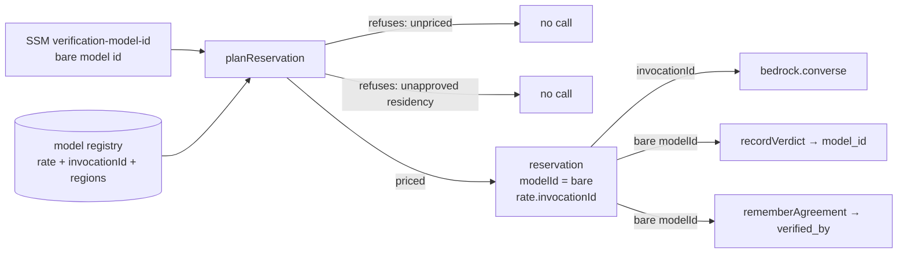
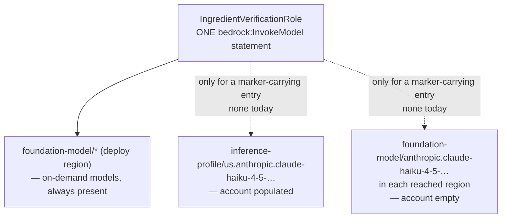

# fix: Separate the Bedrock invocation id from the rate-table key, and widen IAM to match

## Summary

The verification gate uses one string for two jobs: the rate-table key and recorded model identity, and the id Bedrock is called with. For Nova Micro those are the same string; for an inference-profile model they can never be. Split them, and make the IAM grant follow the registry so a profile becomes reachable at the moment it is enabled rather than before. Cross-region residency is an open question that must close before any profile-backed model is configured.

## Problem Frame

`verifyLine` resolves `settings.modelId` from SSM and passes it to both `planReservation` (which keys the rate table on the bare id) and `deps.bedrock.converse`. Claude Haiku 4.5 reports `inferenceTypesSupported: ["INFERENCE_PROFILE"]`, so the bare id fails with `ValidationException: Invocation of model ID ... with on-demand throughput isn't supported`, while the profile id `us.anthropic.claude-haiku-4-5-20251001-v1:0` is absent from the rate table and fails closed as `unpriced`. Pointing SSM at Haiku fails every call in either direction.

Fixing only the code makes this worse. The IAM grant on `IngredientVerificationRole` is:

```
arn:aws:bedrock:us-east-1::foundation-model/*
```

The profile is `arn:aws:bedrock:us-east-1:<account>:inference-profile/us.anthropic.claude-haiku-4-5-20251001-v1:0` — a different resource type, account-scoped — and it fans out to foundation models in **us-east-1, us-east-2 and us-west-2**. Two of those regions and the profile ARN itself are outside the grant. A code-only fix converts a `ValidationException` that names the problem into an `AccessDenied` that does not.

The defect is latent: nothing points SSM at a profile-only model today, and the failure mode is closed (the reservation refunds on an unbilled outcome, the message retries, then DLQs). It is one SSM parameter edit — a config change with no deploy — away from disabling verification entirely.

The bake-off never exercised either half: it ran under credentials that bypass the role, and it keeps its own `INVOCATION_IDS` map so the shipped path's conflation was never hit.

---

## Requirements

### Invocation and identity

- R1. The gate invokes Bedrock with the model's invocation id and records the bare model id.
- R2. The recorded identity is unchanged for every model whose invocation id equals its model id, so no existing `verified_by` or `model_id` value changes form.
- R3. A model absent from the registry continues to fail closed before any call, with the existing unpriced error.
- R4. The invocation id has exactly one authoritative representation for the deployed gate.

### Authorization

- R5. `IngredientVerificationRole` can invoke a residency-approved inference profile and the foundation models that profile spans, and no profile it has not been approved for.
- R6. `bedrock:InvokeModel` still has exactly one grantee.
- R7. The IAM resource scope is asserted, not only the grantee set.

### Residency

- R8. On the gated worker path, a registry entry whose invocation reaches beyond the deploy region is refused until it carries an explicit approval marker. The bake-off runner is out of scope — see Scope Boundaries.
- R9. No entry ships carrying that marker in this change.

---

## Key Technical Decisions

- **The rate table becomes the model registry, and the invocation id lives on its entries.** ADR-0024 already states that membership in the table _is_ authorization ("with no rate there is no worst case, so an unpriced model can only ever cost a denial"). A table that decides which models may be called is the registry; adding _how to address them_ puts one fact in one place. The alternative — a sibling map keyed by model id — is a second registry that can disagree with the first about which models exist.
- **`PricedReservation` needs no new field.** It already carries `rate`, captured with the plan "so a mid-call SSM change cannot split them". The invocation id inherits that property for free via `plan.rate`.
- **The recorded id stays bare, at all three recording sites.** `plan.modelId` feeds `rememberAgreement` (`verified_by`, R21's record of which model agreed) and `recordVerdict` (`model_id`). Only the `converse` call changes. Memos are upserted per phrase, so a drifting recorded form would produce a silent mix of two spellings for one model rather than a clean cutover.
- **The verification key is untouched.** Its preimage is version, normalized source line, `foodId`, quantity bounds, unit, stated measure — no model id. Changing invocation invalidates no key and re-triggers no verification.
- **Residency gates the code path AND the grant, from one marker.** A registry entry names the regions its invocation reaches; `planReservation` refuses an entry that reaches beyond the deploy region unless it carries an approval marker, and U5 derives the profile's IAM statements from marker-carrying entries only. One fact drives both, so the permission widens in the same commit that enables the model — never standing in advance, and never a second step to remember. Deriving IAM from _every registered_ profile instead would leave the role holding a grant its own caller provably refuses to use.
- **Profile ARNs are enumerated; the foundation-model wildcard stays for a different reason.** The registry is compile-time, so a profile's ARNs can be listed and a blanket `inference-profile/*` would discard an available scope reduction. ⚠️ The same enumerability argument would also shrink the existing `foundation-model/*` wildcard, so the ADR-0024 rationale — "the model id comes from SSM and cannot be resolved at synth time" — no longer holds under this plan's own premise. The wildcard stays because narrowing it is a separate change to a shipped, suppressed, currently-green statement, not because it is irreducible. U6 records that correction rather than repeating the stale reason.

---

## High-Level Technical Design

Two ids, three consumers. Today one string reaches all three; after the change the invocation id reaches only Bedrock.



The grant follows the same marker. One statement, whose resources grow only when an entry is approved:



---

## Implementation Units

### U1. The registry carries the invocation id and the regions it spans

**Goal:** one authoritative statement of how each registered model is addressed.
**Requirements:** R1, R4, R8.
**Dependencies:** none.
**Files:**

- `packages/shared/recipe-core/src/spend/spendArithmetic.ts` (modify)
- `packages/shared/recipe-core/src/spend/__tests__/spendArithmetic.test.ts` (modify)
- `packages/services/recipe-workers/src/common/__tests__/verificationSpend.test.ts` (modify)
- `packages/services/recipe-workers/__tests__/integration/verification/verificationSpend.integration.test.ts` (modify)

Both suites build inline `ModelRate` literals and pass them as `PricedReservation`; adding required fields makes them non-assignable, so the blast radius reaches the integration tier and is not discovered by compile error.

**Approach:** `ModelRate` gains `invocationId`, the reach of that invocation, and the date the reach was read. For an on-demand model the invocation id equals the model id and the reach is a **sentinel meaning "wherever this invokes"** — never a literal region name. Only a cross-region profile carries an absolute region list. That keeps `us-east-1` out of a package `@commise/web` and `@commise/mobile` transitively depend on, and keeps the residency comparison meaningful if a stage ever deploys elsewhere. For Haiku 4.5 the invocation id is the `us.` profile, which from a us-east-1 caller reaches us-east-1, us-east-2 and us-west-2 — read from `aws bedrock get-inference-profile`, not inferred from the prefix.

The destination set is a property of the profile AND the source region, not of the profile alone: AWS documents that `us.anthropic.claude-3-haiku` called from us-east-2 reaches three regions while the same profile called from us-west-2 reaches two. Record the set for the region we deploy from, with the date it was read, and treat a deploy from another region as requiring a re-read rather than assuming the recorded set travels.

Name the type for what it now is. `ModelRate` describing an invocation id is a cohesion smell; either widen the name (`ModelRegistryEntry`) with `rate` nested, or document in the type's docstring that the table is the registry ADR-0024 already treats it as. The narrower rename is cheaper and can be deferred — call it in review.

**Patterns to follow:** the existing entries' `effectiveDate` / `priceVerified` fields, which already treat the table as a place where provenance of a value is recorded alongside it.

**Test scenarios:**

- `rateFor` on a registered on-demand model returns an entry whose invocation id equals the model id.
- `rateFor` on Haiku 4.5 returns the `us.` profile id, not the bare id.
- An on-demand entry's reach is the sentinel, not a region literal — the assertion that stops `us-east-1` being hardcoded into a shared package.
- Every entry whose invocation id differs from its model id carries an absolute region list and a read date, so a stale reach is visible rather than inferred.
- `rateFor` on an unregistered id still returns `undefined`.

**Verification:** the table names both ids for every entry, and no caller derives one from the other by string manipulation.

### U2. Refuse a cross-region entry until residency is approved

**Goal:** make the owner's "settle residency first" ruling a mechanism.
**Requirements:** R8, R9.
**Dependencies:** U1.
**Files:**

- `packages/shared/recipe-core/src/spend/spendArithmetic.ts` (modify)
- `packages/shared/recipe-core/src/spend/__tests__/spendArithmetic.test.ts` (modify)

**Approach:** `ReservationRequest` gains a required `deployRegion`, because `planReservation` is pure and cannot read `AWS_REGION` itself. `planReservation` returns a refusal when the entry's reach extends beyond that region and the entry does not carry an explicit residency-approval marker. Making the field required turns every existing call site into a compile error — the intended forcing function, not an inconvenience. The refusal is a distinct arm from `unpriced` — the two mean different things to an operator, and collapsing them would report "this model is not priced" for a model that is priced and not yet cleared.

No entry ships with the marker set. Flipping it for a given model is the artifact of closing the open question below.

**Execution note:** test-first. The refusal arm is the unit's whole content, and it is easier to write the test that demands a third arm than to add one and then justify it.

**Test scenarios:**

- A sentinel-reach entry prices normally whatever `deployRegion` is, marker absent — the case that proves Nova is untouched in any region.
- An entry spanning three regions without the marker is refused, and the refusal is distinguishable from `unpriced`.
- The same entry with the marker set prices normally.
- No entry in the shipped registry carries the marker — asserted over the table, so adding one is a deliberate act that fails this test until the assertion is updated alongside it.

**Verification:** a profile-backed model cannot be invoked by configuration alone.

### U3. The gate invokes with one id and records the other

**Goal:** close the defect in the shipped path.
**Requirements:** R1, R2, R3.
**Dependencies:** U1, U2.
**Files:**

- `packages/services/recipe-workers/src/handlers/verifyLine.ts` (modify)
- `packages/services/recipe-workers/src/handlers/__tests__/verifyLine.test.ts` (modify)

**Approach:** `converse` takes the invocation id from the priced plan; the three recording sites keep `plan.modelId`. `VerificationDeps` gains the region — the handler already reads `requireEnv('AWS_REGION')` and passes it to `productionDeps`, but never onto `deps` — and U2's `deployRegion` comes from there.

The unpriced throw is unchanged. The residency refusal follows it (TRANSIENT, throws) rather than the deterministic over-cap `reject`, so an operator sees queue depth rather than a silent drain; note the deliberate difference, since the two precedents in this handler point opposite ways.

**Patterns to follow:** `packages/services/recipe-workers/src/scripts/verificationBakeOff.ts` already makes exactly this split and documents why — read its file docstring before writing this unit.

**Test scenarios:**

- For an on-demand model, the id passed to `converse` and the ids written to the verdict and the memo are all the bare id — the case that proves Nova is unaffected.
- For a profile-backed approved model, `converse` receives the profile id while the verdict and memo receive the bare id.
- A residency-refused model reaches no `converse` call and no reservation.
- An unregistered model still throws before any call.
- Mutation check: swapping the recorded id to the invocation id must fail a test. The verdict and memo assertions are the guard against silent identity drift, and a test suite that passes with them swapped is not covering R2.

**Verification:** the recorded identity for Nova is byte-identical to today's.

### U5. IAM covers the profile and the regions it spans

**Goal:** make an approved profile invocable at the moment it is approved, and not before.
**Requirements:** R5, R6, R7.
**Dependencies:** U1, U2.
**Files:**

- `packages/services/recipe-workers/infra/lib/RecipeWorkersStack.ts` (modify)
- `packages/services/recipe-workers/infra/__tests__/RecipeWorkersStack.test.ts` (modify)
- `packages/infra/global/__tests__/llmSpendGuards.test.ts` (modify)

⛔ The two test files are not interchangeable. `llmSpendGuards.test.ts` is a TypeScript AST parser over infra SOURCE TEXT — it reads `actions` array literals, never synthesizes a template, and `packages/infra/global` does not depend on recipe-workers, so the stack cannot be instantiated there. U5's ARNs are registry-derived `formatArn` calls that exist only after synth, which that parser's own docstring says are "left absent on purpose". Resource-shape assertions therefore go in `RecipeWorkersStack.test.ts`, which already has a `Template.fromStack` harness; `llmSpendGuards.test.ts` keeps only the grantee check it can actually see.

**Approach:** the policy keeps its existing in-region `foundation-model/*` statement, and for each registry entry **carrying the residency-approval marker** appends the profile ARN and the foundation-model ARNs in each region that entry reaches.

⛔ APPENDED TO THE EXISTING STATEMENT'S `resources`, never a second `addToPolicy`. `bedrockGrantsIn` counts `addToPolicy` call sites carrying bedrock actions and the suite asserts exactly one; a second statement fails it with "no bedrock grant found anywhere — the gate has stopped discovering", which names the opposite of the cause. Since no entry carries the marker today, nothing synthesizes now and nothing reds now — the failure would surface the day a marker is first flipped, which is exactly the delayed break this plan exists to remove.

Extract the ARN derivation as a helper taking the registry as a parameter. `BEDROCK_RATE_TABLE` is a frozen module constant with no injection seam, so testing "an unapproved registry synthesizes no profile statements" otherwise needs a module mock plus a dynamic import of the stack; a pure helper is cheaper and is the thing worth asserting.

While here, correct the guard's own defect: its failure message talks about grantees while the assertion counts statements. It is currently green and misreports what a failure means.

`acceptNagFindings` already suppresses a wildcard finding on this role with `applyToChildren: true`; check whether the appended resources need their own entry, and do not widen the suppression to cover more than it did.

**Patterns to follow:** the existing `Stack.of(this).formatArn` construction in the same policy statement, which is what keeps service and region explicit rather than wildcarded; and `RecipeWorkersStack.test.ts`'s existing `synth(...)` harness.

**Test scenarios (`RecipeWorkersStack.test.ts`):**

- The shipped registry — no marker on any entry — synthesizes exactly one bedrock statement, whose resources are the in-region `foundation-model/*` wildcard and nothing else. This is the assertion about the state actually being shipped, not about a fixture.
- Given a marker-carrying profile entry, the helper yields the profile ARN with the account populated, and a foundation-model ARN per reached region with the account field empty.
- No output ever contains `inference-profile/*`.
- Everything lands in ONE statement — the count assertion that pins the shape the spend guard depends on.

**Test scenarios (`llmSpendGuards.test.ts`):**

- `bedrock:InvokeModel` still resolves to exactly one grantee, unchanged.
- The failure message names what the assertion actually counts.

**Verification:** the resource scope is asserted where it can be seen, the grantee set is unchanged, and flipping a marker cannot red the spend guard.

### U6. Record the decision

**Goal:** leave the reasoning where the next reader looks.
**Requirements:** R8.
**Dependencies:** U1, U5.
**Files:**

- `docs/architecture/decisions/0024-llm-spend-ceiling-reserve-then-settle.md` (modify)

**Approach:** an addendum covering the id split, the marker-derived IAM shape and its ARN forms, and the residency question as explicitly open. Three things it must also carry, because each is a correction to something ADR-0024 or this repo currently asserts:

- The bake-off ran under credentials that bypass the role, which is why the gap survived a full measurement pass — its results say nothing about the deployed grant, and it keeps its own invocation mapping (see Scope Boundaries).
- The `foundation-model/*` wildcard's stated justification no longer holds; it stays for a different, weaker reason.
- AWS documents that with cross-region inference "your input prompts and output results may be stored in the opt-in Regions for abuse detection purposes" — so the residency question is about storage, not only processing, and SCPs are the account-level control AWS names alongside IAM.

**Test expectation:** none — documentation. The doc-link guard covers reference integrity.

---

## Open Questions

Both must close before any registry entry carries the residency-approval marker; neither blocks U1–U6.

- Does routing recipe text through us-east-2 and us-west-2 need a decision beyond ADR-0024's existing terms? R24 argues no-retention and no-training from AWS's uniform commitment across models, which is silent on geography. Feature 016 is the legal-compliance framework and is the natural home for the answer.
- If cross-region inference is acceptable, does it need surfacing to users, or is it covered by existing processing terms? This is a 016 question, not a 001 one.

---

## Scope Boundaries

- Choosing a model is out of scope. This makes a profile-backed model configurable; it does not configure one, and the SSM parameter stays on `amazon.nova-micro-v1:0`.
- The Nova ladder and any future bake-off are out of scope. They inform which model we would want, not whether we can address it.
- The bake-off runner is out of scope. It keeps its own `INVOCATION_IDS` map, so the invocation id has two homes that can disagree — accepted deliberately: the runner is an operator script that already sits outside the spend ceiling by ADR-0024's design, and giving it a residency control it has no equivalent of for spend would be inconsistent. R4 is scoped to the deployed gate for this reason.
- Submitting Anthropic's Bedrock use-case form is out of scope — an account action, not a code change. Haiku remains uninvocable regardless of this plan.

### Deferred to Follow-Up Work

- Renaming `ModelRate` to a registry-shaped name. Worth doing, cheap, and not worth entangling with an IAM change.
- Fetching a profile's member regions from the Bedrock API instead of recording them in the registry. Correct in principle; adds an API call, an IAM permission, and a failure mode on a path that must fail closed, for a table with a handful of entries.

---

## System-Wide Impact

- **The registry must stay off the recipe-core barrel.** `spend/spendArithmetic.ts` is reachable only through the `./spend/spend-arithmetic` subpath and is imported by `recipe-workers` and its infra — nothing else. `@commise/web` and `@commise/mobile` bundle recipe-core's root barrel, and recipe-service's `contract.test.ts` asserts the package is a zod-only leaf for exactly that reason. Growing the registry is safe today; re-exporting it from the barrel would put Bedrock pricing in a React Native bundle. U1 adds fields, not exports.
- **Infra already reads the registry.** `RecipeWorkersStack.ts` imports from `recipe-core/spend`, so U5 deriving ARNs from registry entries follows a path that exists rather than opening a new dependency from infra into shared code.

---

## Risks & Dependencies

- **Concurrent edit to the same file.** A running agent is adding Nova Lite and Pro rate entries to `spendArithmetic.ts`. U1 touches the same table. Land that work first, or expect a conflict in the one file both change.
- **The existing guard counts statements, not grantees, and the natural U5 shape turns it red.** `bedrockGrantsIn` collects `addToPolicy` call sites carrying bedrock actions and the suite asserts `grants.length === 1`. Adding the profile ARNs as a second `addToPolicy` — the obvious shape, since they need a different account and region than the existing wildcard — fails that guard with a message reading "no bedrock grant found anywhere", which describes the opposite of what happened. The new ARNs must be appended to the existing statement's `resources` array. Separately, the guard sees only `actions` string literals, so it cannot observe resource scope at all: R7 needs a synth-based assertion elsewhere.
- **A marker flip is the moment several things must hold at once.** Flipping one boolean changes what `planReservation` allows AND what the synthesized policy grants. That is the design — one fact, both effects — but it means the first flip is the first real exercise of U5's derivation, so its tests carry the weight that a live call normally would.
- **The fix cannot be verified end to end today.** No profile-backed model is invocable on this account, so U3 and U5 are provable only by synthesized-template assertions and unit tests, not by a live call. State that in the ADR addendum rather than implying the path has been exercised.
- **Cost of getting the recorded id wrong is silent.** Memos are upserted per phrase, so a drifting `verified_by` produces a mix rather than an error. U3's mutation check is the control.

---

## Sources & Research

- `packages/services/recipe-workers/src/scripts/verificationBakeOff.ts` — file docstring already describes this defect and the split that fixes it.
- `packages/services/recipe-workers/infra/lib/RecipeWorkersStack.ts` — the `IngredientVerificationRole` policy and ADR-0024 layer 4b's reasoning.
- `packages/shared/recipe-core/src/resolution/verificationKey.ts` — preimage, confirming the model id is absent from the key.
- `docs/architecture/decisions/0024-llm-spend-ceiling-reserve-then-settle.md` — layer 4b, R24, and the least-privilege framing the IAM unit must preserve.
- `aws bedrock get-inference-profile --inference-profile-identifier us.anthropic.claude-haiku-4-5-20251001-v1:0` — the profile ARN and its three member regions, read from the live account 2026-08-23.
