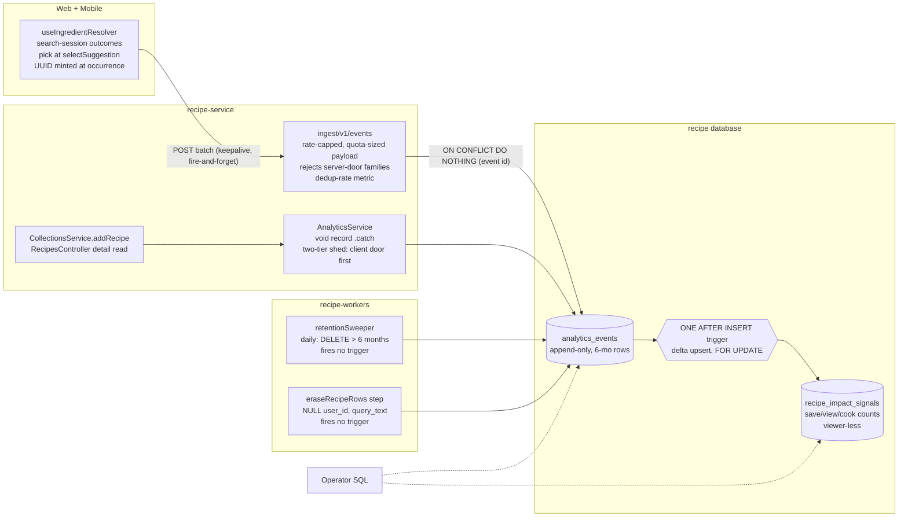

# feat: First-party analytics events — store, doors, counts, erasure

## Summary

One append-only `analytics_events` table in the recipe database, filled through two capture doors — the
server records saves and recipe views at the handlers that observe them; a small off-contract ingestion
route receives query-outcome events (one per SEARCH SESSION: query, served list, pick with
group+position, or no-pick) from both apps. A single INSERT-only statement trigger folds events into a
viewer-less per-recipe counts table (delta upsert, never recompute) shaped to become 015's recognition
home; a scheduled worker deletes raw rows after 6 months (always post-fold, by construction); the
account-erasure sweep nulls the user id and blanks query text. Plain Postgres, no vendor (origin KD5).

---

## Problem frame

Nothing records what people do in the product: the U15 measurement needed SQL archaeology, and 015's
recognition is blocked on nonexistent cook/save telemetry. The origin doc (reviewed by six personas,
all findings resolved 2026-09-01) settles the product shape; this plan settles the how. Two boundaries
are fixed: events stay out of `ingredient_resolutions`, and off the domain wire contract
(see origin: docs/brainstorms/2026-08-31-analytics-events-requirements.md).

---

## Requirements trace

| Origin                                                                                | Where it lands                                      |
| ------------------------------------------------------------------------------------- | --------------------------------------------------- |
| R1 (query-outcome events, group+position, off-contract route, seam designed)          | U4, U5                                              |
| R2 (server-side save + view capture; views' named job SC5)                            | U3                                                  |
| R3 (append-only store, opaque ULID key, subject)                                      | U1                                                  |
| R4 (operator SQL, no export; contention levers noted)                                 | U1 (indexes), U7 (docs)                             |
| R5 (fold-into-counts; serving contract deferred)                                      | U1 (trigger), Scope boundaries                      |
| R6 (erasure nulls user id + blanks query text; gate classifies)                       | U2                                                  |
| R7 (fire-and-forget + resource isolation, shed analytics first)                       | U3, U5                                              |
| R8 (additive vocabulary)                                                              | U1 (event-type CHECK is the one edit point)         |
| R9 (warehouse-shaped, export seam)                                                    | U1 (shape), U6 (retention leaves S3 door open)      |
| R10 (6-month retention, fold-before-delete)                                           | U6 (+ U1's fold-at-insert)                          |
| R11 (per-family delivery semantics, idempotency, save reconciliation seam)            | U1, U4, U5                                          |
| R12 (door binding: credit families server-only)                                       | U4                                                  |
| R13 (rate cap + payload bounds)                                                       | U4 (bounds sized under the keepalive quota — KTD4b) |
| Accepted v1 risk (client-asserted pick data; integrity bar owed before automated use) | U4 (recorded), U7 (ADR carries it)                  |
| SC1–SC5, AE1–AE5                                                                      | test scenarios in U1–U6; AE links marked per unit   |

---

## Key technical decisions

- KTD1. **Counts are trigger-maintained by DELTA UPSERT — never recompute, and only on INSERT.**
  Exactly ONE statement-level AFTER INSERT trigger on `analytics_events` maintains
  `recipe_impact_signals` via `INSERT … ON CONFLICT (recipe_id) DO UPDATE SET count = count + delta`
  computed from the transition table. ⛔ Migration 0010's ratings pattern is mirrored for MECHANICS
  only (transition table, statement-level firing, `SELECT … FOR UPDATE ORDER BY` lock) and explicitly
  NOT for its math: 0010 RECOMPUTES from the base table, which is correct for ratings (rows live
  forever) and fatal here — after U6's retention deletes aged rows, a recompute collapses a lifetime
  count of 100 to the survivors. ⛔ There is NO UPDATE trigger and NO DELETE trigger — absence, not
  no-ops, asserted in the schema pins — because U2's erasure `UPDATE` and U6's retention `DELETE` must
  both fire nothing. 015's own lesson stands (a CHECK cannot see OLD vs NEW; triggers can).
- KTD2. **The counts table is 015's future home.** Named `recipe_impact_signals` with the shape 015
  planned (`recipe_id`, `save_count`, `view_count`, `cook_count`, `updated_at`) — recipe-keyed,
  deliberately viewer-less (012-FR-024's "no viewer column may ever exist" honored from birth).
  `cook_count` is provisioned now, unwritten in v1, because SC2 promises 015 finds its history home
  ready. Recognition plugs in without a second aggregate store; until then nothing reads it (origin
  R5's serving contract stays deferred).
- KTD3. **The off-contract seam is a non-`api/` mount + a recipe-core subpath schema.** The contract
  parity filter admits only `health` and `api/*` controllers (verified both directions), so the
  ingestion controller mounts at `ingest/v1/events` with zero guard exceptions. The payload zod lives
  in `@kitchensink/recipe-core` as a SUBPATH export, matching the `verification-message` precedent and
  keeping the import surface narrow. (Accuracy note for the ADR: the contract hash follows
  DEMANDED-SYMBOL reachability, not the barrel file — a barrel export alone would not churn the hash;
  the subpath is chosen for precedent and narrowness, not hash mechanics.) ⛔ NO file matching
  `*.schema.ts` may exist under `src/analytics/` — contract discovery is deliberately blunt ("every
  `src/**/*.schema.ts` under the service is wire contract") and would auto-publish it; the controller
  imports its zod from the subpath, and any service-local helper uses a non-`.schema.ts` name (one
  assertion in the controller test pins this).
- KTD4. **Fire-and-forget is the house shape plus a TWO-TIER bound.** Server capture is inline
  `void record().catch(warn-log)` (the `notifyCorroborated` precedent), behind a bounded in-flight
  guard that is PER-INSTANCE on purpose — the protected resource is each Fargate task's own DB pool.
  Over the cap, events shed CLIENT-DOOR FIRST: query-outcome events drop before `recipe_saved` /
  `recipe_viewed` (the families feeding 015's user-visible credit; saves are reconcilable via R11's
  seam, views are not). Drops are counted in an in-memory counter flushed periodically as a
  log/metric — never one log line per drop, which storms during the exact saturation the cap exists
  for.
- KTD4b. **The client payload bound is sized under the keepalive quota.** The Fetch spec caps
  aggregate in-flight `keepalive` bodies at 64 KiB and an over-quota send REJECTS IMMEDIATELY — which
  the swallowing emitter would turn into systematic silent loss of exactly the richest events. R13's
  batch/payload bound is therefore derived explicitly from that quota with headroom (served lists
  digested or truncated in `queryOutcome.model.ts`). React Native ignores `keepalive` (in-flight
  fetches survive navigation; the loss window is app termination — within origin R11's at-most-once,
  recorded in the emitter's docstring).
- KTD5. **Idempotency by client-minted event id, with the dedup made VISIBLE.** Each client event
  carries a UUID minted when the logical event OCCURS (not at send time — ADR-0016's recorded
  failure); retries reuse it; landing is `ON CONFLICT DO NOTHING` on a unique index. ⚠️ A minting BUG
  (id minted at mount instead of per occurrence) would silently drop everything after the first event,
  so the ingest route compares rows-landed against batch size (`RETURNING`) and emits the dedup rate —
  a rate persistently above retry background noise is the alarm. Server-door events need no key.
- KTD6. **The no-pick unit is a SEARCH SESSION, not a settled render.** The resolver debounces at
  ~300ms, so every typing pause settles a prefix — counting each superseded prefix as an abandonment
  would make SC1's denominator a function of typing cadence (one pick could emit five no-picks).
  Instead: supersession by extension/refinement of the same text CONTINUES the session; a no-pick
  emits only on (a) clear-to-empty without resolve, (b) resolve via a non-suggestion route — including
  create-after-search, which counts as no-pick because the served list failed — or (c) hook unmount
  via effect cleanup (the seam that does exist, pairing with web `keepalive` for the leave-the-screen
  moment), carrying the FINAL settled query and its served list. The PICK seam is `selectSuggestion` —
  the only place provenance and the served-list index exist — never `resolveLine`, which converges
  eight non-pick paths.
- KTD7. **Retention is a scheduled worker beside the existing sweepers.** A daily recipe-workers
  handler deletes rows older than 6 months, with an EventBridge rule named per house convention. It is
  a new VPC Lambda, therefore a new NAT-ledger entry: the amendment edits the marker-delimited
  consumer list INSIDE ADR-0004 (`<!-- nat-consumers:start -->` block) — the set-equality test reads
  that block and needs no edit itself. Cost note: the Lambda runs seconds per day and talks only to
  the in-VPC database, so actual NAT traffic and marginal cost are ~zero.
- KTD8. **The erasure step is a sweep UPDATE, classified by the existing gate.** `eraseRecipeRows`
  gains one step: `UPDATE analytics_events SET user_id = NULL, query_text = NULL WHERE user_id = $1`.
  The coverage gate discovers the table from the migration fold and counts the UPDATE as sweeping; the
  pair CHECK (`query_text IS NULL OR user_id IS NOT NULL`) satisfies its payload/person pairing rule
  (mechanically verified against the gate's extractor). Swept-with-UPDATE, not `RETAINED_BY_RULING`.
- KTD9. **The ingest route stays under `ErasureLockGuard`, deliberately.** During an in-flight
  erasure the global guard answers 423 to the erased user's ingest POSTs; the fire-and-forget emitter
  swallows it. This is the DESIGNED behavior — no new user-keyed rows can land mid-sweep, closing a
  re-introduction race against U2 — and it must not be "fixed" by exempting the route.

---

## High-level technical design

Event row (directional sketch, U1 owns the final shape): `id` (uuid pk), `event_id` (uuid, unique
where not null — client idempotency), `event_type` (CHECK over the closed v1 set:
`query_outcome | recipe_saved | recipe_viewed`), `user_id` (varchar(255), nullable from birth),
`recipe_id` (uuid, null), `query_text` (text, null; pair CHECK with `user_id`), `payload` (jsonb:
served list digest, outcome, group, position-in-group, provenance), `occurred_at` / `created_at`
(timestamptz). Indexes: `(event_type, created_at)` for retention and funnels; `(recipe_id)` partial
for operator queries; `(user_id)` partial for the erasure predicate.

---

## Implementation units

### U1. The events store, the counts table, and the fold trigger

**Goal:** Migration 0043 creates `analytics_events` and `recipe_impact_signals` with the single
INSERT-only delta-upsert fold trigger; Drizzle mirrors and schema pins land beside them.
**Requirements:** origin R3, R5 (fold), R8, R9, R11 (unique landing); SC2's history guarantee.
**Dependencies:** none.
**Files:** `packages/services/recipe-service/src/database/migrations/0043_analytics_events.sql`
(create); `packages/services/recipe-service/src/database/schema/analyticsEvents.ts` (create);
`packages/services/recipe-service/src/database/schema/index.ts` (modify);
`packages/services/recipe-service/src/database/__tests__/schema.test.ts` (modify);
`packages/services/recipe-service/__tests__/integration/database/analyticsEvents.integration.test.ts`
(create).
**Approach:** Mirror `0039_recipe_parse_jobs.sql` conventions (essay header citing origin KDs,
ADR-0027, the 6-month retention rule, and 012-FR-024's viewer-less constraint). The fold is KTD1's
delta upsert over the transition table — deliberately NOT 0010's recompute, and deliberately ONE
trigger: the migration header says why in both directions, and the schema pins assert no UPDATE or
DELETE trigger exists on the table. Only `recipe_saved`/`recipe_viewed` (later `recipe_cooked`) fold;
`cook_count` is provisioned per KTD2/SC2.
**Patterns to follow:** `parseJobs.ts` (schema mirror discipline), migration 0010 (trigger MECHANICS
only), `0041_ingredient_source_phrase.sql` (header register).
**Test scenarios:**

- Unit (schema pins): `expectColumns` blocks for both tables; type CHECK members pinned; the trigger
  inventory pinned to exactly one (INSERT).
- Integration (real DB): insert a `recipe_saved` event → `save_count` = 1; bulk insert N views in one
  statement → +N with one trigger firing; Covers AE5. **the recompute-catcher: fold → delete the aged
  rows → insert one new save → count = old + 1, never recomputed from survivors**; duplicate
  `event_id` insert lands zero rows AND moves no counts (empty transition no-op, including a mixed
  batch where some rows land and some conflict); pair CHECK rejects `query_text` with NULL `user_id`
  on a live row; a `query_outcome` event folds nothing; an erasure-shaped `UPDATE` moves no counts.
  **Verification:** migration applies on a fresh database and on one carrying pre-existing recipes; all
  schema pins and the integration suite green.

### U2. The erasure step and the coverage gate

**Goal:** Account erasure anonymizes analytics events; the erasure-coverage gate classifies the table.
**Requirements:** origin R6, KD4; AE4; SC3.
**Dependencies:** U1.
**Files:** `packages/services/recipe-workers/src/handlers/accountErasureWorker.ts` (modify —
new numbered step in the `eraseRecipeRows` transaction);
`packages/services/recipe-workers/src/handlers/__tests__/accountErasureWorker.test.ts` (modify);
`packages/services/recipe-workers/__tests__/integration/erasure/analyticsEventsErasure.integration.test.ts`
(create); `packages/infra/global/__tests__/erasureSweepCoverage.test.ts` (verify — fold discovery
classifies without a map edit; mechanically confirmed pre-plan).
**Approach:** One UPDATE in the existing transaction, argued in the worker's normative docstring:
nulls `user_id` AND `query_text` where `user_id = $1`. Cite ADR-0027 and the origin's
stricter-than-0027 ruling (blanking the phrase) explicitly — stricter by decision, not drift. Because
KTD1 ships no UPDATE trigger, this step provably moves no counts (U1's IT is the tripwire).
**Test scenarios:**

- Unit: the worker's statement inventory gains the step (the AST guard pattern already used there).
- Integration: Covers AE4. seed a user with pick/save/view events; erase; rows survive with null
  user id and null query text; `recipe_impact_signals` unchanged; other users' events untouched.
- Gate: `erasureSweepCoverage` green with the new table classified as swept.
  **Verification:** erasure IT green against a real database; gate green in infra suite.

### U3. Server-side capture — AnalyticsService and the two capture points

**Goal:** Saves and views become events without touching response semantics — and only actual reads
count as views.
**Requirements:** origin R2, R7; SC4; SC5's data. Resolves origin OQ3: write-per-read, no sampling;
KTD4's shed policy is the lever if volume ever requires one.
**Dependencies:** U1.
**Files:** `packages/services/recipe-service/src/analytics/analytics.service.ts` (create);
`packages/services/recipe-service/src/analytics/analytics.module.ts` (create);
`packages/services/recipe-service/src/analytics/__tests__/analytics.service.test.ts` (create);
`packages/services/recipe-service/src/collections/collections.service.ts` (modify — save capture);
`packages/services/recipe-service/src/recipes/recipes.controller.ts` (modify — view capture at the
DETAIL-READ HANDLER, deliberately not `RecipesService.getById`);
`packages/services/recipe-service/src/app.module.ts` (modify);
`packages/services/recipe-service/__tests__/integration/analytics/serverCapture.integration.test.ts`
(create).
**Approach:** `AnalyticsService.record(event)` is `@sideEffect`, never throws, never awaited by
callers — `void … .catch(warn-log)` per the `notifyCorroborated` precedent — behind KTD4's two-tier
per-instance bound (client-door families shed first; drops counted, flushed periodically). ⛔ View
capture hooks the CONTROLLER's detail handler because `RecipesService.getById` is also an internal
authorization helper with six non-view call sites (photos ×2, versions ×3, ratings ×1) — capturing
there would permanently inflate lifetime counts. Save capture in `CollectionsService.addRecipe` (its
only caller is its controller; pull/clone paths correctly don't count).
**Execution note:** test-first on the isolation property — write the fault-injection tests before the
service exists.
**Test scenarios:**

- Unit: record inserts the right row shape per family; over-cap sheds client-door events before
  server-door events; drop counting is counter-based; an insert rejection never propagates.
- Integration: Covers SC4. collection add returns its normal response while the analytics insert is
  forced to fail — status, body, and latency bound unchanged; detail read likewise; happy path writes
  exactly one event per action with the actor and subject; **a photo upload, a version restore, and a
  rating write emit ZERO `recipe_viewed` events** (the capture-point mutation test).
  **Verification:** both capture paths produce events in the IT database; fault-injection and
  zero-view suites green.

### U4. The ingestion route — off-contract, rate-capped, door-bound

**Goal:** Clients can deliver query-outcome events; nothing else gets in; the domain contract never
learns the route exists.
**Requirements:** origin R1 (seam), R11 (idempotent landing), R12, R13, the accepted-risk record;
AE1–AE3; KTD3/KTD4b/KTD5/KTD9.
**Dependencies:** U1, U3 (reuses `AnalyticsService`).
**Files:** `packages/shared/recipe-core/src/analytics/eventPayload.ts` (create — the ONE shared zod;
subpath export in `packages/shared/recipe-core/package.json`, NOT the barrel);
`packages/shared/recipe-core/src/analytics/__tests__/eventPayload.test.ts` (create);
`packages/services/recipe-service/src/analytics/ingest.controller.ts` (create — mounted `ingest/v1`;
⛔ no `*.schema.ts` filename anywhere under `src/analytics/`, per KTD3);
`packages/services/recipe-service/src/analytics/__tests__/ingest.controller.test.ts` (create);
`packages/services/recipe-service/src/common/throttle/throttle.config.ts` +
`throttle.decorators.ts` (modify — `RATE_LIMIT_ANALYTICS`-backed `AnalyticsIngestRateLimit`);
`packages/services/recipe-service/src/config/config.types.ts` (modify);
`packages/services/recipe-service/__tests__/integration/analytics/ingestRoute.integration.test.ts`
(create); `packages/services/recipe-service/tests/e2e/analyticsIngest.e2e.test.ts` (create);
`packages/services/recipe-service/tests/load/analyticsIngest.load.js` (create, house naming);
throttle wiring/config tests (modify).
**Approach:** Bearer-authenticated (verified: `AuthMiddleware` is `forRoutes('*')` — the non-`api/`
mount stays protected with zero wiring), small batch array, payload bounded per KTD4b's quota
arithmetic, each event validated against the recipe-core zod, event types restricted to the
CLIENT-DOOR family (`query_outcome`) — a server-door type in the batch is dropped and logged per
R12/AE3. Landing via U1's unique `event_id`, with KTD5's dedup-rate metric (`RETURNING` count vs
batch size). The actor is ALWAYS the token's principal — the payload carries no actor field, and the
schema pins that. `ErasureLockGuard`'s 423 during an in-flight erasure is designed behavior (KTD9).
The accepted-risk paragraph (client-asserted pick data; integrity bar owed before automated use) is
restated in the controller's docstring.
**Test scenarios:**

- Unit: schema accepts a well-formed pick and a no-pick outcome; rejects unknown types, oversized
  payloads, absent event ids; the schema has NO actor-shaped field (pinned); controller drops a
  `recipe_saved` attempt (Covers AE3); no `*.schema.ts` exists under `src/analytics/` (one glob
  assertion).
- Integration: Covers AE1, AE2. a pick lands with group+position+served list; a no-pick lands;
  replaying the same event id lands nothing; **a batch with a smuggled actor/user field (or any
  attempt to attribute another user) lands under the TOKEN's user regardless**; the dedup-rate metric
  reports rows-landed vs batch size; rate cap answers 429 past the limit; unauthenticated requests
  refused; **an in-flight erasure answers 423 (designed, KTD9)**.
- e2e: the booted service accepts a batch end-to-end; contract parity suites green with the route
  live (the off-contract proof).
- k6: sustained ingest at the rate cap holds p95 within the existing write-route budget.
  **Verification:** all four tiers green; `contract/__tests__` untouched and passing.

### U5. Client emission — the instrumented resolver and the emitter

**Goal:** Both apps emit ONE query-outcome event per search session, invisibly to the user.
**Requirements:** origin R1, R7 (client half), R11 (id minting), KTD4b/KTD5/KTD6; AE1, AE2; SC1's
data.
**Dependencies:** U4 (route + schema).
**Files:** `packages/apps/commise/features/recipes/src/analytics/queryOutcome.model.ts` (create —
pure session model: session continuation vs outcome, served-list digest, group+position derivation,
UUID minted at occurrence);
`packages/apps/commise/features/recipes/src/analytics/__tests__/queryOutcome.model.test.ts` (create);
`packages/apps/commise/features/recipes/src/analytics/useAnalyticsEmitter.ts` (create — fire-and-
forget POST, `keepalive` on web sized per KTD4b, drop on failure, never surfaces errors; RN
keepalive no-op recorded in the docstring);
`packages/apps/commise/features/recipes/src/hooks/useIngredientResolver.ts` (modify — pick emission
at `selectSuggestion`; session tracking with no-pick on clear/non-suggestion-resolve/unmount
cleanup);
`packages/apps/commise/features/recipes/src/hooks/__tests__/useIngredientResolver.test.tsx` (modify);
web + mobile leaf wiring only if a prop is needed (expected: none — the hook is shared).
**Approach:** All judgment in the pure session model (testable as a table); the emitter is dumb
transport. KTD6 verbatim: extension/refinement continues the session; no-pick on clear, on a
non-suggestion resolution (create-after-search included), or on unmount cleanup — final query +
served list carried. The pick derives group from `suggestion.provenance` and position from the
suggestion's index within its provenance section of the SERVED list, at `selectSuggestion` (never
`resolveLine`).
**Execution note:** implement the session model test-first from AE1/AE2 plus the keystroke table.
**Test scenarios:**

- Model unit: Covers AE1. pick on the first catalog row of a two-section list → group `catalog`,
  position 1; **the keystroke table: "b → bu (pause) → buck (pause) → pick" emits exactly ONE event
  (a pick), zero no-picks**; Covers AE2. cleared query with served suggestions → one no-pick with the
  final query and list; create-after-search → no-pick; empty suggestion list → no event; UUID stable
  across a simulated retry of the same logical event; **two DIFFERENT logical events mint DIFFERENT
  ids**; served-list digest keeps the payload under KTD4b's bound for the largest legal list.
- Hook: emitting never changes resolver state or `onResolved` timing; unmount cleanup emits the
  pending no-pick; emitter failure (rejected fetch) is swallowed; nothing emits below the search
  minimum.
- Existing picker component/e2e suites stay green (no UI change); extend
  `packages/apps/commise/web/tests/e2e/ingredientTypeahead.spec.ts` with one assertion that a pick
  fires the ingest POST (route interception), skipped-with-reason if flaky.
  **Verification:** shared-hook suites green on both platforms' runners; a manual local-stack pick lands
  a row.

### U6. Retention — the scheduled sweeper and the NAT ledger

**Goal:** Raw events older than 6 months are deleted, provably after folding, on a daily schedule.
**Requirements:** origin R10, R9 (the S3 door stays open — deletion is the v1 arm); AE5.
**Dependencies:** U1.
**Files:** `packages/services/recipe-workers/src/handlers/retentionSweeper.ts` (create);
`packages/services/recipe-workers/src/handlers/__tests__/retentionSweeper.test.ts` (create);
`packages/services/recipe-workers/__tests__/integration/analytics/retention.integration.test.ts`
(create); `packages/services/recipe-workers/infra/lib/RecipeWorkersStack.ts` (modify — function +
daily EventBridge rule, cadence argued in-comment);
`packages/services/recipe-workers/infra/__tests__/RecipeWorkersStack.test.ts` (modify — the function-
count and alarm pins move);
`docs/architecture/decisions/0004-minimize-nat-egress.md` (modify — add the sweeper's construct id
inside the `nat-consumers` marker block; the set-equality test reads that block and needs no edit).
**Approach:** Mirror `erasureOrphanSweeper`'s handler shape and stack wiring. Batched DELETE by
`created_at`, bounded per run; fires no trigger (KTD1). Because counts fold at insert,
fold-before-delete needs no runtime check — but the IT asserts the invariant anyway (mutation lens).
**Test scenarios:**

- Unit: deletes only rows past the cutoff; respects the batch bound; empty table is a quiet no-op.
- Integration: Covers AE5. counts identical before/after a retention pass over folded rows; a row
  inside the window survives; **U1's recompute-catcher sequence rerun through the REAL sweeper**.
- Infra: stack synth includes the schedule; NAT guard green with the amended ADR block.
  **Verification:** all tiers green; ADR-0022's derived barrier covers the new Lambda automatically.

### U7. The record — ADR and operator notes

**Goal:** The subsystem's decisions survive as a citable record.
**Requirements:** origin R4's contention levers; the accepted-risk guardrail; the erasure gate's need
for an on-disk citation; CLAUDE.md's ADR register discipline.
**Dependencies:** U1–U6 (write last, cite what shipped).
**Files:** `docs/architecture/decisions/0030-first-party-analytics-events.md` (create — store, two
doors, door binding, lifetime delta-upsert counts and why recompute is forbidden, anonymize-on-erase
incl. the stricter-than-0027 query-text ruling, 6-month retention, search-session semantics, the
per-instance two-tier shed rationale, the keepalive quota coupling, the deferred serving contract and
S3 door, **and the accepted-risk guardrail: pick data is client-asserted and an integrity/anomaly bar
is owed before it ever feeds an automated ranking signal or user-visible metric**);
`docs/architecture/decisions/README.md` (modify); `AGENTS.md` (modify — one-paragraph digest).
**Test scenarios:** Test expectation: none — documentation; the doc-link gate and reviewer-context
guard must stay green, which is the enforced part.
**Verification:** infra doc gates green.

---

## Scope boundaries

**In scope:** everything above — store, trigger, both doors, erasure step, retention, client
instrumentation, ADR.

### Deferred to follow-up work

- The request-path count-serving API and its consistency contract — deferred to 015's resumption
  (origin R5); `recipe_impact_signals` exists but nothing reads it yet, and any future read applies
  recipe-visibility scoping.
- The save-count reconciliation JOB against collections rows (origin R11 names the seam; the counts
  and events make it computable when wanted).
- The S3/Athena archival tier (origin R9); retention v1 deletes.
- Vendor fan-out projection (origin KD5), "Mark as cooked" (015), dashboards.

**Outside this product's identity** (carried from origin): ad-tech, cross-site tracking, session
replay, selling or sharing behavioural data.

---

## Open questions (deferred, none blocking)

- Origin OQ1 → 016: consent/disclosure posture; 6-month retention default review.
- Origin OQ2 → 015: whether an author's own activity counts; the serving contract follows it.
- Origin OQ3: RESOLVED in U3 — write-per-read, no sampling; KTD4's shed policy is the lever.
- Execution-time: the exact bounded-concurrency mechanism in `AnalyticsService` (semaphore vs
  counter) and whether the Playwright network assertion is stable enough to keep.

---

## System-wide impact

- **Contract surface:** none — KTD3's point, proven by the parity suites staying green.
- **Erasure:** one new sweep step; the coverage gate auto-discovers the table (U2 verifies).
- **Infra:** one new Lambda + schedule (ADR-0004's marker block amended); migrations ride ADR-0022's
  barrier. AWS cost delta ≈ zero: one Lambda seconds/day on existing shared infrastructure.
- **Both clients:** behaviorally invisible; the shared hook carries the change to web and mobile in
  the same release (CODING_STANDARDS §14).
- **015:** inherits `recipe_impact_signals` and a cook-ready vocabulary; nothing here forecloses its
  choices (viewer-less shape honors 012-FR-024).
- **Process:** ce-work should run the `staff-architect` agent at BLUEPRINT before U1 and at REVIEW
  before declaring done (CLAUDE.md mandate for new modules/seams); the PLANNING-moment scrutiny was
  discharged by the origin's six-persona review, this plan's research pass, and the five-persona plan
  review (2026-09-01).

---

## Sources & research

- Origin (reviewed): docs/brainstorms/2026-08-31-analytics-events-requirements.md (market scan
  embedded; six-persona review applied 2026-09-01).
- Repo grounding (verified in source during plan review): auth wildcard reaches non-`api/` mounts;
  global throttle guard; the contract parity filter and blunt schema discovery; 0010's trigger
  mechanics AND its recompute math (mirrored/refused respectively); `getById`'s six non-view call
  sites; the resolver's debounce and `selectSuggestion` seam; the erasure gate's UPDATE
  classification and pair-check; the NAT guard's ADR-marker mechanism; `ErasureLockGuard`'s global 423.
- ADRs read into decisions: 0004 (NAT), 0006 (per-PR logical DBs), 0011 (route prefixes), 0014/0015
  (contracts/validation), 0016 (idempotency-key derivation failure), 0017 (no new deployables),
  0018 (own dedup store), 0022 (migration barrier), 0024 (atomic-conditional and replay-safety
  lessons), 0027 (erasure precedent).
