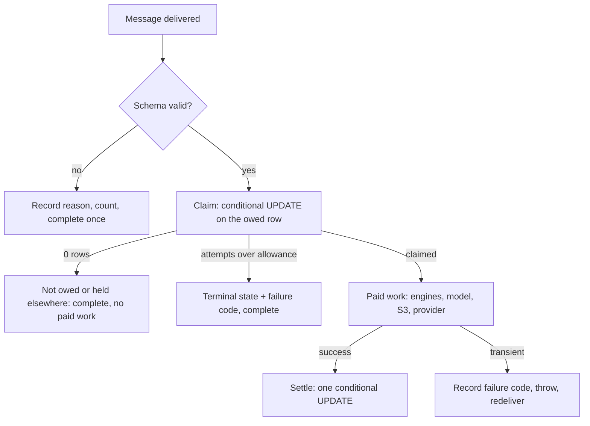
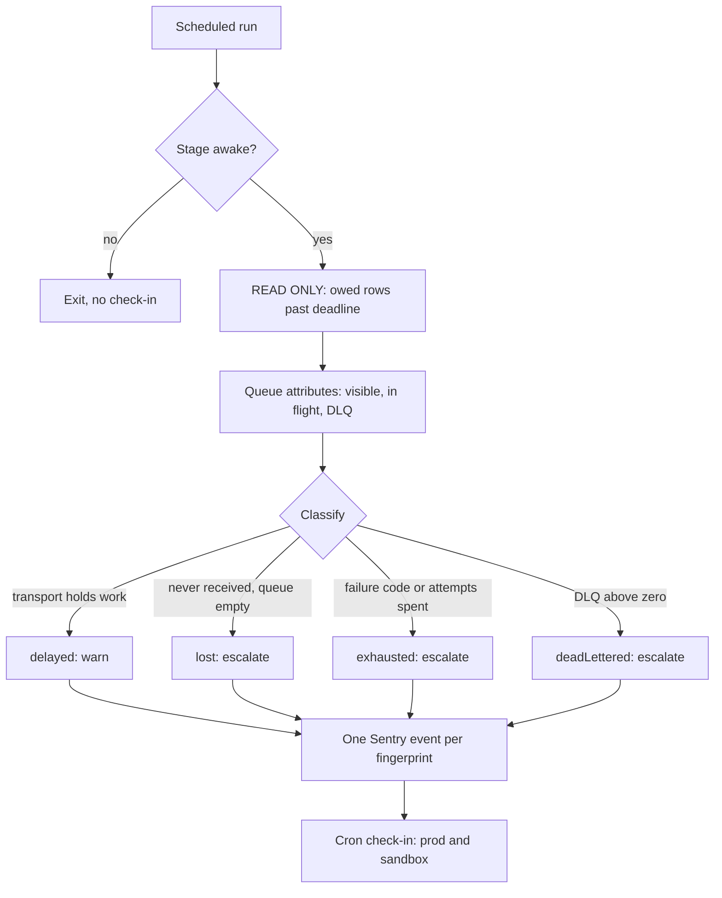

# feat: queue throughput and integrity guarantees

## Summary

Every background queue gains four guarantees: prod drains at scale, each unit of work takes effect once, junk
completes without paid work, and owed work that stops moving escalates to Sentry. The guarantees live in the
consumers and producers, backed by a claim on the row that already records the owed work.

---

## Problem Frame

A parse queue on pr-91 held 837,892 messages for three days and nothing noticed. The consumer processes one line
at a time in every stage, because reserved concurrency of 1 is the only spend bound where the ADR-0024 ceiling does
not apply (`packages/services/recipe-workers/infra/lib/RecipeWorkersStack.ts:1185`). It also checks only the line's
digest before calling the CRF engine and Bedrock, so messages for expired work still pay.

The queue inventory found the same shape elsewhere: archives dispatch 100 a day with no backoff, duplicate
verifications pay Bedrock twice, a handle-sync publish failure is swallowed with no record, a food refused at intake
is stranded `PENDING`, and the identity deletion DLQ has no alarm although two comments claim one. None of these
raised a signal; all were found by reading code.

The owner's direction is throughput and integrity, not throttling: no user or bulk import is ever capped, and
external limits (USDA's hourly cap) pace the drain instead of refusing callers.

---

## Requirements

Traceability is to the origin document's R-IDs. Every requirement is claimed by at least one unit below.

| Group                                              | Origin R-IDs    | Units                  |
| -------------------------------------------------- | --------------- | ---------------------- |
| Throughput and fairness                            | R1–R5, R39, R40 | U8, U4                 |
| No stuck work                                      | R6–R17          | U1, U2, U5, U6, U7, U9 |
| No duplicates                                      | R18–R21         | U6, U7, U9, U10        |
| No junk                                            | R22–R24         | U2, U3                 |
| Durable owed records                               | R25–R28         | U9, U10, U11           |
| Backstop                                           | R29–R38         | U1, U11, U12, U13      |
| Observability coverage (owner request, 2026-09-15) | —               | U15–U23                |

---

## Key Technical Decisions

- **KTD1. The claim is the seam between transport and ledger.** Each consumer opens with one conditional `UPDATE`
  that asserts the work is still owed, stamps `last_received_at` and increments `attempts`. Zero rows means "not
  owed, or another delivery holds it", and the consumer completes without paid work. This delivers R6, R7, R9 and
  R18 in one mechanism per queue, and makes junk cost a single indexed update.
- **KTD2. The lease is `last_received_at` plus the function timeout.** No execution outlives its Lambda timeout,
  and a redelivery cannot arrive before the visibility timeout, which is longer. A derivation test pins that
  relationship instead of a comment.
- **KTD3. Attempts live on the row, not in SQS.** A consumer gives up by its row's attempt allowance.
  `maxReceiveCount` becomes a transport backstop only, sized above the nightly nine-hour database stop so a
  shutdown cannot dead-letter a healthy backlog.
- **KTD4. Prod scales; non-prod does not.** One policy module returns both `reservedConcurrentExecutions` and the
  event source mapping's `maxConcurrency` from a closed `'prod' | 'nonProd'` class. Setting both stops the poller
  outrunning the reservation, which is what turns throttles into dead letters today. This amends ADR-0024 layer 2,
  whose current rule is concurrency 1 everywhere, and the spend guard that reads that literal must change in the
  same commit.
- **KTD5. Scaling lands after the claim.** At concurrency above one, two deliveries of the same message would
  otherwise both pay.
- **KTD6. Fairness comes from SQS fair queues.** Producers set `MessageGroupId` to the submitter, with background
  drains in their own groups. At batch size 1 the in-flight test never fires, so fairness rests on the
  processing-time share; if that proves insufficient the fallback is claiming work in row order, which is a
  larger change and out of scope here.
- **KTD7. External limits pace, they never refuse.** Food's queue-depth 503 and flood shedding are deleted. Both
  food lanes share one budget of 90% of USDA's hourly limit, and requests over budget wait in the queue.
- **KTD8. The desired state decides, not the message.** The closure worker reads `users.status` and applies that,
  then settles only if the version it read is still current. This removes the ban-after-unban race without
  ordering guarantees from SQS.
- **KTD9. The backstop is read-only by permission, not by intent.** It runs as its own function with no
  `sqs:ReceiveMessage`, `DeleteMessage`, `PurgeQueue` or `SendMessage`, and opens `BEGIN READ ONLY` on the
  database. It does not ride the band drain or the erasure reconciler, which hold send and erasure rights.
- **KTD10. Slow is not lost.** A pure classifier returns `delayed` when the transport still holds work, and
  `lost` only when the row was never received and the queue is empty.
- **KTD11. The shared package carries exactly two things.** The escalation payload with its fingerprint, and the
  awake-window rule, which has three consumers including the sandbox scheduler. The Sentry adapter stays per
  service, because the serverless and node SDKs wire differently.

---

## High-Level Technical Design

Per-message flow after this change, identical in shape for every queue:

The backstop runs on its own schedule and only reads:

---

## Implementation Units

Units land as separate commits on the existing PR 91 branch, in this order.

### U1. Transport hygiene and the missing alarms

- **Goal:** fix the settings and alarms that make failure invisible today.
- **Requirements:** R10, R11, R37, R38.
- **Dependencies:** none.
- **Files:**
    - `packages/services/recipe-workers/infra/lib/RecipeWorkersStack.ts`
    - `packages/services/recipe-workers/infra/__tests__/RecipeWorkersStack.test.ts`
    - `packages/services/identity-webhooks/infra/lib/WebhooksStack.ts`
    - `packages/services/identity-webhooks/infra/__tests__/WebhooksStack.test.ts`
    - `packages/services/identity-webhooks/src/handlers/deletionWorker.ts` (comment correction only)
    - `packages/services/food-service/infra/lib/FoodServiceStack.ts`
    - `packages/services/food-service/src/worker/foodConsumer.service.ts`
- **Approach:** raise the verification DLQ retention above its source queue's, because a standard-queue message
  expires by its original enqueue time. Add a depth alarm on the identity deletion DLQ inside the existing
  `alarmsEnabled` block, and correct the two comments that claim it already exists. Emit a FAILED-only tombstone
  count in food and alarm on that instead of all tombstones. Add a derivation test asserting, for every queue,
  that the visibility timeout exceeds its consumer timeout and that each DLQ retains longer than its source.
- **Patterns to follow:** the existing alarm blocks in both stacks; food's separate retry-exhausted alarm.
- **Test scenarios:**
    - Synth: verification DLQ retention is greater than the source queue's retention.
    - Synth: a deletion DLQ depth alarm exists, and its metric names that queue.
    - Synth: the food tombstone alarm's metric is the FAILED-only series.
    - Synth derivation: for each queue, visibility timeout > handler timeout, and DLQ retention ≥ source retention.
    - Mutation check: lowering the DLQ retention below its source fails the derivation test.
    - Unit: a NOT_FOUND tombstone does not increment the FAILED series; a FAILED tombstone does.
- **Verification:** the three alarms exist in a prod synth and are absent when alarms are disabled; no comment
  claims an alarm that is not synthesized.

### U2. Invalid payloads complete once

- **Goal:** stop consumers retrying messages that can never become valid, per GR-018 §18-b.
- **Requirements:** R8, R24.
- **Dependencies:** U1 (the metric namespace and alarm block).
- **Files:**
    - `packages/services/recipe-workers/src/handlers/parseLine.ts`
    - `packages/services/recipe-workers/src/handlers/verifyLine.ts`
    - `packages/services/recipe-workers/src/handlers/versionArchiveWorker.ts`
    - `packages/services/recipe-workers/src/handlers/handleSyncWorker.ts`
    - each handler's `__tests__` sibling
- **Approach:** a schema failure records a structured reason, emits one invalid-payload metric and completes the
  message. Handle sync stops acknowledging silently: it takes the same path as the others, so a bad publisher is
  visible. A transient dependency failure keeps throwing, unchanged.
- **Execution note:** write the failing test per consumer first; AC-018-b requires one per consumer.
- **Patterns to follow:** GR-018 §18-b's transient-versus-invalid split.
- **Test scenarios:**
    - Per consumer: a payload failing schema completes and is not rethrown.
    - Per consumer: a transient dependency error still throws.
    - Handle sync: an unparseable body produces a metric and a log with the reason, not a silent acknowledgement.
    - Mutation check: restoring the throw on invalid input fails the test.
- **Verification:** each of the four consumers has a test proving an invalid payload is never redelivered.

### U3. Only producers may send, and payloads are valid before they are sent

- **Goal:** make junk on a queue impossible to write and impossible to send malformed.
- **Requirements:** R22, R23.
- **Dependencies:** none.
- **Files:**
    - `packages/infra/global/__tests__/queueProducerRegister.test.ts` (new)
    - `packages/infra/global/__tests__/serviceInfraWiringInvariants.test.ts`
    - `packages/services/recipe-service/src/recipes/parseJobs.service.ts`
    - `packages/services/recipe-service/src/recipes/recipes.service.ts`
    - `packages/services/recipe-service/src/common/sqsBatchQueue.ts`
    - `packages/services/recipe-workers/src/handlers/bandDrain.ts`
    - `packages/services/recipe-workers/src/handlers/archiveSweeper.ts`
    - `packages/services/identity/src/users/handleSync.publisher.ts`
    - `packages/services/identity/src/queue/sqs.service.ts`
- **Approach:** a guard discovers every send or publish grant across both CDK apps and compares the set with a
  register of queue to producer role. The same guard asserts that no other role holds send, receive, delete or
  purge on those queues. Producers validate each message against the consumer's schema before sending; a row that
  fails is marked rather than sent.
- **Patterns to follow:** `natEgressConsumers.test.ts` set equality; `dbUserGrantRegister.test.ts`'s register shape.
- **Test scenarios:**
    - Guard: a synthesized grant that is not in the register fails.
    - Guard: a register entry with no grant fails.
    - Guard fired at a violating fake: a second role granted send is caught.
    - Unit: a message failing its schema is not sent, and the row records why.
    - Unit: the batch sender rejects one bad entry and still sends the rest.
- **Verification:** the guard fails on an added grant and on a removed one.

### U4. Food accepts everything and paces to USDA

- **Goal:** remove intake refusal, and pace the drain to 90% of USDA's hourly limit.
- **Requirements:** R5, R15, R39, R40.
- **Dependencies:** none.
- **Files:**
    - `packages/services/food-service/src/foods/admission.service.ts` (delete)
    - `packages/services/food-service/src/foods/foods.service.ts`
    - `packages/services/food-service/src/foods/rateLimit/RollingWindowLimiter.ts`
    - `packages/services/food-service/src/foods/dao/fetchQueue.dao.ts`
    - `specs/003-usda-food-data/spec.md` (FR-043b and FR-046 amendment)
    - `specs/003-usda-food-data/decision-register.md`
- **Approach:** delete the queue-depth 503 and the flood shed. Every request enqueues, and heavy requesters are
  demoted in priority order only, which FR-043a already specifies. Both lanes draw on one budget of 90% of the
  hourly limit, so an interactive request waits in the queue rather than being refused. The food row and its queue
  row are written in one transaction, so no food can be left `PENDING` without one.
- **Patterns to follow:** the existing rolling-window limiter and the demotion branch in the claim query.
- **Test scenarios:**
    - Integration: 10,001 queued foods, and the next add still succeeds and enqueues.
    - Integration: a requester with 200 pending is demoted behind a requester with 1, and neither is refused.
    - Integration: with the budget spent, the drainer makes no USDA call until the window rolls; nothing is refused.
    - Integration: a failure inserting the queue row rolls back the food row, so no `PENDING` food lacks a queue row.
    - Unit: the limiter's ceiling is 90% of the configured hourly limit for both lanes.
- **Verification:** no code path returns 503 for queue depth; the spec no longer specifies one.

### U5. Food leases are fenced and the standby takes over

- **Goal:** stop a second loop claiming work in flight, and let a standby drainer become active.
- **Requirements:** R16, R17.
- **Dependencies:** U4 (same files).
- **Files:**
    - `packages/services/food-service/src/foods/dao/fetchQueue.dao.ts`
    - `packages/services/food-service/src/worker/foodConsumer.service.ts`
    - `packages/services/food-service/src/worker/WorkerRuntime.ts`
    - `packages/services/food-service/src/worker/main.ts`
- **Approach:** every settle carries the lease stamp it claimed, so a reaped claim cannot land its result. The
  lease is derived from the worst-case fetch duration rather than a fixed 30 seconds. The standby retries the
  advisory lock on the reaper interval instead of exiting the race permanently.
- **Test scenarios:**
    - Integration: a claim whose lease was reaped cannot resolve or tombstone the row.
    - Integration: one fetch that outlasts the old 30-second lease is not claimed twice.
    - Integration: with the lock held, the standby retries and becomes active when the holder's session ends.
    - Unit: the lease derivation exceeds the worst-case fetch duration.
- **Verification:** two drainer loops against one row produce exactly one result.

### U6. Parse claims its line before paid work

- **Goal:** junk completes for the cost of one update, duplicates cannot double-pay, and exhausted lines become
  retryable.
- **Requirements:** R6, R7, R9, R12, R18.
- **Dependencies:** U2.
- **Files:**
    - `packages/services/recipe-service/src/database/migrations/0046_parse_line_attempts.sql` (new)
    - `packages/services/recipe-service/src/database/schema/parseJobs.ts`
    - `packages/services/recipe-workers/src/handlers/parseLine.ts`
    - `packages/services/recipe-service/src/recipes/parseJobs.service.ts` (retry resets the counters)
    - `packages/services/recipe-workers/__tests__/integration/parsing/parseLineClaim.integration.test.ts` (new)
- **Approach:** add nullable attempt, last-received and failure-code columns (expand-first). The handler claims the
  line in one statement that also asserts the job is unexpired and the digest matches, then runs the pipeline. Over
  the allowance, the line becomes user-retryable with a failure code rather than staying pending until its TTL. The
  user retry path clears the counters.
- **Execution note:** test-first; the claim predicate is the unit's whole value.
- **Patterns to follow:** food's `FOR UPDATE SKIP LOCKED` claim and the existing digest-guarded landing.
- **Test scenarios:**
    - Integration: a message for an expired job completes with no engine call.
    - Integration: a message whose line is already parsed completes with no engine call.
    - Integration: two concurrent deliveries of one line produce one engine call and one landing.
    - Integration: attempts reaching the allowance make the line retryable with the failure code set.
    - Integration: the user retry resets attempts, and the line is processed again.
    - Integration: a residency refusal leaves the line pending with its code, not failed.
    - Mutation check: dropping the job-expiry predicate makes the expired-job test fail.
- **Verification:** replaying 1,000 expired messages performs zero engine calls.

### U7. Verification checks for a verdict before it spends

- **Goal:** never pay twice for the same verification.
- **Requirements:** R6, R9, R18, R19.
- **Dependencies:** U2, U6 (the claim shape).
- **Files:**
    - `packages/services/recipe-service/src/database/migrations/0047_verification_attempts.sql` (new)
    - `packages/services/recipe-service/src/database/schema/verificationAttempts.ts` (new)
    - `packages/services/recipe-workers/src/handlers/verifyLine.ts`
    - `packages/services/recipe-workers/src/verification/verdictStore.ts`
    - `packages/services/recipe-workers/__tests__/integration/verification/verifyLineClaim.integration.test.ts` (new)
- **Approach:** compute the verification key first, read whether a verdict already exists for the current model,
  and complete when it does. An attempts row carries the claim and the counter, since an absent verdict cannot hold
  one and a placeholder verdict would be read as "publish". Settle writes the verdict and clears the attempts row in
  one statement. The spend settle stays separate and is still never retried.
- **Patterns to follow:** ADR-0024's reserve-then-settle ordering; the verdict store's supersede-on-newer-model rule.
- **Test scenarios:**
    - Integration: a duplicate message with an existing verdict reserves no spend and calls no model.
    - Integration: a verdict from an older model does not suppress re-verification under the current model.
    - Integration: two concurrent duplicates produce one reservation.
    - Integration: exhausted attempts complete with a failure code, and the line publishes unverified.
    - Integration: a ceiling denial still throws and redelivers, unchanged.
    - Mutation check: removing the verdict read makes the duplicate test fail.
- **Verification:** duplicate deliveries produce exactly one reservation row and one model call.

### U8. Prod scales, and submitters share fairly

- **Goal:** raise prod throughput without dead-lettering healthy messages, and stop one bulk import starving others.
- **Requirements:** R1, R2, R3, R4.
- **Dependencies:** U6, U7 (KTD5).
- **Files:**
    - `packages/services/recipe-workers/infra/lib/consumerConcurrency.ts` (new)
    - `packages/services/recipe-workers/infra/lib/RecipeWorkersStack.ts`
    - `packages/infra/global/__tests__/llmSpendGuards.test.ts`
    - `packages/services/recipe-workers/infra/__tests__/RecipeWorkersStack.test.ts`
    - `packages/services/recipe-service/src/recipes/parseJobs.service.ts`
    - `packages/services/recipe-service/src/recipes/recipes.service.ts`
    - `packages/services/recipe-workers/src/handlers/bandDrain.ts`
    - `docs/architecture/decisions/0024-llm-spend-ceiling-reserve-then-settle.md`
- **Approach:** a pure policy module returns the reservation and the event source mapping concurrency per stage
  class: prod runs both at the same value, starting at 5, and non-prod keeps a reservation of 1 with no scaling
  config. `maxReceiveCount` rises above the nightly stop window. Producers set the message group to the submitter,
  with the band drain and redrive in their own groups. ADR-0024's layer 2 and layer 0 are edited in place, and the
  spend guard moves from reading a literal to asserting the synthesized pair.
- **Patterns to follow:** the ALB priority allocator's closed-union policy module.
- **Test scenarios:**
    - Synth at prod: both consumers have a reservation of N and an event source concurrency of N, N ≥ 2.
    - Synth at `pr-1`: reservation 1 and no scaling config.
    - Guard fired at a violating fake: a stage-conditional literal elsewhere is caught.
    - Unit: the policy module rejects an unknown stage class at the type level (compile-time check in the test file).
    - Unit: parse and verification producers set the message group to the submitter; the drains use their own groups.
    - Synth: `maxReceiveCount` exceeds the nightly stop divided by the visibility timeout.
- **Verification:** a prod synth shows the scaled pair; a preview synth is unchanged from today.

### U9. Handle sync records what it owes

- **Goal:** a rename that fails to publish is visible instead of lost.
- **Requirements:** R21, R25.
- **Dependencies:** U2.
- **Files:**
    - `packages/services/identity/src/database/migrations/0013_handle_sync_owed.sql` (new)
    - `packages/shared/identity-db/src/schema/profiles.ts`
    - `packages/services/identity/src/users/users.service.ts`
    - `packages/services/identity-webhooks/src/handlers/identityWebhook.ts`
    - `packages/services/identity/src/users/handleSync.publisher.ts`
    - `packages/services/identity-webhooks/src/handlers/__tests__/identityWebhook.test.ts`
- **Approach:** two nullable columns on the profile record when the sync is owed and why it last failed. Both
  producers set them in the same statement as the name change, so a write outside the transaction cannot compile
  past review. Publishing stays after commit; success clears the marker conditionally on the value it read.
- **Patterns to follow:** ADR-0034's transaction-as-required-parameter outbox.
- **Test scenarios:**
    - Integration: a rename through the service sets the owed marker in the same transaction; a rollback leaves none.
    - Integration: a rename through the webhook sets it too.
    - Integration: a successful publish clears the marker; a failed publish leaves it with a failure code.
    - Integration: a second rename during a failed publish keeps the newer owed timestamp.
    - Integration: erasing the identity clears both columns.
- **Verification:** a forced publish failure leaves exactly one owed marker.

### U10. Closure and reactivation converge on the intended state

- **Goal:** the provider always ends in the state the database intends, whatever order messages arrive in.
- **Requirements:** R26, R27.
- **Dependencies:** U9 (same migration set).
- **Files:**
    - `packages/services/identity/src/database/migrations/0014_users_status_version.sql` (new)
    - `packages/shared/identity-db/src/schema/users.ts`
    - `packages/services/identity/src/users/users.service.ts`
    - `packages/services/identity/src/admin/admin.service.ts`
    - `packages/services/identity-webhooks/src/handlers/deletionWorker.ts`
    - `packages/services/identity-webhooks/src/handlers/__tests__/deletionWorker.test.ts`
- **Approach:** every status change increments a version inside its transaction. The worker treats the message as a
  trigger: it reads the current status and version, applies the ban or unban that status implies, then settles only
  if the version is unchanged. A changed version throws, and the redelivery applies the newer intent. Erased
  accounts are left to the erasure path.
- **Patterns to follow:** the compare-and-set settle from U6 and U7.
- **Test scenarios:**
    - Integration: closure then reactivation, with the closure message applied last, leaves the account active.
    - Integration: a version that moves during the provider call throws and does not record applied.
    - Integration: an erased account is completed without a provider call.
    - Integration: repeated deliveries of one closure produce one ban and one applied record.
    - Unit: owed means the applied version is behind the status version and the account is not erased.
- **Verification:** the out-of-order interleave test fails without the version check.

### U11. The shared check core

- **Goal:** one definition of the escalation payload, the fingerprint and the awake window.
- **Requirements:** R28, R31, R32, R33, R35.
- **Dependencies:** none, but consumed by U12 and U13.
- **Files:**
    - `packages/shared/queue-check/package.json`, `prod.package.json`, `src/escalationPayload.ts`,
      `src/escalationFingerprint.ts`, `src/awakeWindow.ts`, `src/classifyOwed.ts`, `src/index.ts`
    - `packages/shared/queue-check/__tests__/*.test.ts`
    - `packages/infra/global/lib/platform/SandboxSchedulerStack.ts` (consumes the window)
- **Approach:** the payload is a closed type of identifiers and numeric measures, so there is nowhere to put user
  text. The classifier is pure over rows and transport counts, returning delayed, lost, exhausted, dead-lettered or
  stuck. The awake window owns the nightly hours in the stage's timezone, and the sandbox scheduler imports the
  same constants. Pruning settled records is a policy value here and applied by each service's check.
- **Patterns to follow:** the repo's other shared packages exporting raw `./src`.
- **Test scenarios:**
    - Unit: a row past its deadline with a non-empty transport classifies as delayed.
    - Unit: a row never received with an empty transport classifies as lost.
    - Unit: attempts at the allowance classify as exhausted regardless of transport.
    - Unit: a DLQ above zero classifies as dead-lettered.
    - Unit: the payload type rejects a free-text field (compile-time check in the test).
    - Unit: the fingerprint is stable for the same condition and differs per queue.
    - Unit: the awake window is closed 00:00–09:00 in the stage timezone, and both daylight-saving transitions behave.
    - Unit: prod is always awake.
- **Verification:** the sandbox scheduler synthesizes unchanged while importing the shared window.

### U12. The recipe and identity checks

- **Goal:** owed work that stops moving reaches Sentry in every stage.
- **Requirements:** R29, R30, R32, R34, R36.
- **Dependencies:** U6, U7, U9, U10, U11, U16 (recipe-workers' Sentry client).
- **Files:**
    - `packages/services/recipe-workers/src/handlers/queueCheck.ts` (new) and its `__tests__`
    - `packages/services/recipe-workers/src/common/sentry.ts` (new)
    - `packages/services/recipe-workers/infra/lib/RecipeWorkersStack.ts`
    - `packages/services/identity-webhooks/src/handlers/queueCheck.ts` (new) and its `__tests__`
    - `packages/services/identity-webhooks/infra/lib/WebhooksStack.ts`
    - `docs/architecture/decisions/0004-minimize-nat-egress.md` (consumer table)
    - `packages/infra/global/__tests__/queueProducerRegister.test.ts` (check roles hold no queue mutation)
    - `packages/services/recipe-workers/__tests__/integration/queueCheck.integration.test.ts` (new)
- **Approach:** each service gets its own scheduled function with its own role: connect as the service role, read
  queue attributes, and receive `SENTRY_DSN` from its base stage's SSM parameter (see Sentry DSN configuration). Each opens a read-only transaction, reads owed rows past their deadline in
  bounded indexed pages, reads queue attributes, classifies, and emits one Sentry event per fingerprint. It checks
  in to a cron monitor in prod and sandbox, and previews escalate without checking in. Recipe covers parse lines,
  verifications, archives, handle-sync expectations and stale test resets; identity covers unapplied closures,
  reactivations and the deletion queue's depth.
- **Test scenarios:**
    - Integration: a write attempted inside the check is refused by the read-only transaction.
    - Integration: owed rows behind a non-empty queue produce a delayed warning, not a lost escalation.
    - Integration: an owed row never received with an empty queue produces one lost escalation.
    - Integration: two runs with the same condition produce the same fingerprint.
    - Integration: during the nightly window the check exits without a database call or a check-in.
    - Synth: the check role has no receive, delete, purge or send permission on any queue.
    - Synth: the NAT consumer table matches the synthesized VPC functions.
    - Unit: an escalation payload built from a row containing recipe text carries no text.
- **Verification:** the guard fails if the check role is granted any queue mutation.

### U13. The food check

- **Goal:** the same coverage for food, without a new function.
- **Requirements:** R29, R30, R38.
- **Dependencies:** U4, U5, U11, U17 (food's Sentry client).
- **Files:**
    - `packages/services/food-service/src/worker/WorkerRuntime.ts`
    - `packages/services/food-service/src/worker/queueCheck.ts` (new) and its `__tests__`
    - `packages/services/food-service/src/observability/sentry.ts` (new)
    - `packages/services/food-service/tests/queueCheck.integration.test.ts` (new)
- **Approach:** the drainer's existing reaper timer runs the check in a read-only transaction. It covers queue rows
  past their lease and foods `PENDING` with no queue row, and escalates through the same payload. Its silence is
  also the drainer's dead-man signal, because both stop together.
- **Test scenarios:**
    - Integration: a `PENDING` food with no queue row escalates as lost.
    - Integration: a queue row within its lease produces no escalation.
    - Integration: the check performs no writes.
    - Unit: the check runs on the reaper interval and does not block a claim.
- **Verification:** with the drainer stopped, no escalation and no check-in are produced, which is the intended
  signal.

### U15. Repair the log drain, then extend it to every declared log group

- **Goal:** every runtime's logs reach Sentry with the right stage, and a dead drain is no longer silent.
- **Requirements:** owner request, 2026-09-15.
- **Dependencies:** none.
- **Files:**
    - `packages/services/identity-webhooks/src/common/otlp.ts`
    - `packages/services/identity-webhooks/src/handlers/__tests__/logForwarder.test.ts`
    - `packages/services/identity-webhooks/infra/lib/WebhooksStack.ts`
    - `packages/services/recipe-workers/infra/lib/RecipeWorkersStack.ts`
    - `packages/services/recipe-service/infra/lib/RecipeServiceStack.ts`
    - `packages/services/food-service/infra/lib/FoodServiceStack.ts`
    - `packages/services/ingredient-parser/infra/lib/IngredientParserStack.ts`
    - `packages/infra/global/__tests__/logDrainRegister.test.ts` (new)
    - `docs/architecture/decisions/0042-log-drain-coverage.md` (new, with the register table)
- **Approach:** two defects first. The forwarder derives the stage from the log-group name with a regex that only
  matches hyphenated names: the identity ECS group resolves to `unknown`, and a sandbox webhook group resolves to a
  construct id. Replace it with an explicit source-to-stage map keyed by the register. Then alarm on the forwarder's
  own failure metric, which it emits today with nothing watching it.
  Extend the drain by adding one subscription filter per declared log group, created in the stack that owns the
  group, with the forwarder's ARN imported. Recipe-workers needs only one filter because all ten Lambdas share a
  group. Every group in the repo has at most one filter today, so the two-per-group limit is not reached. The
  forwarder stays outside the VPC, so no NAT consumer is added.
  The register is a table in ADR-0042 mapping each declared log group to the stack that owns its filter, asserted by
  set equality in both directions, because no single synthesized template can see across stacks.
- **Patterns to follow:** `natEgressConsumers.test.ts`'s ADR-table set equality; the existing cross-stack filter in
  `WebhooksStack`.
- **Test scenarios:**
    - Unit: the stage mapper returns the correct stage for every register entry, including the slash-path identity
      group and a sandbox webhook group; no entry resolves to `unknown`.
    - Unit: an unregistered group name fails the mapper rather than guessing.
    - Guard: every declared log group appears in the register, and every register entry has a synthesized filter.
    - Guard fired at a violating fake: a new log group with no filter fails.
    - Synth: the forwarder failure alarm exists in prod and is absent when alarms are disabled.
    - Synth: no group carries more than two filters.
- **Verification:** a prod synth shows one filter per registered group, and the mapper resolves every one.

### U16. Sentry in recipe-workers

- **Goal:** the ten recipe Lambdas report errors, not just log lines.
- **Requirements:** owner request; also unblocks U12.
- **Dependencies:** U15, U22 (the wiring contract defines init, logs, caught errors, context, release).
- **Files:**
    - `packages/services/recipe-workers/package.json`
    - `packages/services/recipe-workers/src/common/observability.ts` (new)
    - every handler in `packages/services/recipe-workers/src/handlers/`
    - `packages/services/recipe-workers/infra/lib/RecipeWorkersStack.ts`
    - `packages/shared/observability-scrubbers/` (new: the denylist moved from identity-webhooks, its third consumer)
- **Approach:** adopt `@sentry/aws-serverless` with one shared module that initialises from `SENTRY_DSN`, sets the
  stage as environment and the commit SHA as release, applies the shared scrubbers, and wraps every handler. Because
  the drain already forwards stdout, the SDK ships with stdout error suppression in the same change, or every error
  counts twice. EMF metric lines stay on stdout and remain excluded by the filter pattern.
- **Patterns to follow:** `identity-webhooks/src/common/observability.ts` and its `wrapHandler` usage.
- **Test scenarios:**
    - Unit: a handler that throws reports one Sentry event with the stage and release set.
    - Unit: the same throw writes no duplicate error line to stdout.
    - Unit: EMF metric output is unchanged.
    - Unit: a payload containing recipe text is scrubbed by the shared denylist.
    - Unit: with no DSN, initialisation is a no-op and the handler still runs.
- **Verification:** one forced error produces exactly one Sentry event, not two.

### U17. Sentry in recipe-service and food-service

- **Goal:** both NestJS services report like identity does.
- **Requirements:** owner request.
- **Dependencies:** U15, U22.
- **Files:**
    - `packages/services/recipe-service/src/instrument.ts` (new), `src/app.module.ts`, `package.json`, its Dockerfile
      entry point
    - `packages/services/recipe-service/infra/lib/RecipeServiceStack.ts`
    - `packages/services/food-service/src/instrument.ts` (new), `src/app.module.ts`, `src/config/env.schema.ts`,
      `package.json`, its Dockerfile and worker entry points
    - `packages/services/food-service/infra/lib/FoodServiceStack.ts`
- **Approach:** mirror identity: `@sentry/nestjs` imported before the app through the Node `--import` flag, the
  exception filter reporting non-HTTP exceptions, tracing sampled low in prod, and the Nest logger replaced so
  errors are not also written to stdout. Food's environment schema already declares `SENTRY_DSN`, which nothing
  reads; the stack now injects it. The food worker and change-refresh tasks initialise the same module.
- **Patterns to follow:** `identity/src/instrument.ts`, `apiException.filter.ts`, `sentryLogging.ts`.
- **Test scenarios:**
    - Integration: an unhandled service error reports one Sentry event and no duplicate stdout error.
    - Unit: an HTTP 4xx is not reported.
    - Unit: the food worker entry point initialises Sentry before the drainer starts.
    - Unit: a missing DSN in a deployed stage fails startup; locally it is a no-op.
    - Unit: scrubbing removes ingredient text and display names.
- **Verification:** both services show their first event in the right Sentry environment on sandbox.

### U18. Platform Lambdas: declared log groups, drain, and SDK where silence is the failure

- **Goal:** the Lambdas nobody watches stop being invisible.
- **Requirements:** owner request.
- **Dependencies:** U15.
- **Files:**
    - `packages/services/identity/infra/lib/IdentitySchemaStack.ts`,
      `packages/services/food-service/infra/lib/FoodSchemaStack.ts`,
      `packages/services/recipe-service/infra/lib/RecipeSchemaStack.ts`
    - `packages/infra/global/lib/platform/DataStack.ts`
    - `packages/infra/global/lib/platform/SandboxSchedulerStack.ts`
    - `packages/services/ingredient-parser/infra/lib/IngredientParserStack.ts`
    - `docs/architecture/decisions/0042-log-drain-coverage.md`
- **Approach:** seven Lambdas log to implicit groups that exist in no template and never expire. Declare a group for
  each with the repo's retention convention, add its filter, and register it. The database bootstrap and the per-PR
  reaper also take the SDK, because their documented failure mode is a silent no-op. The Python ingredient parser
  gets drain coverage here; its SDK lands in U21.
- **Test scenarios:**
    - Synth: each of the seven functions has an explicit log group with retention set.
    - Synth: each declared group has a filter and a register entry.
    - Unit: the bootstrap reports a Sentry event when it exits without doing its work.
    - Guard: a new Lambda without an explicit log group fails the AST gate, with exemptions carrying a reason.
- **Verification:** no deployed Lambda writes to a log group that is absent from the register.

### U19. Correct the front-end stage and release tags

- **Goal:** previews stop reporting as production, and mobile events carry a release.
- **Requirements:** owner request.
- **Dependencies:** none.
- **Files:**
    - `packages/apps/commise/web/src/instrumentation-client.ts`, `src/sentry.server.config.ts`,
      `src/sentry.edge.config.ts`, `next.config.ts`
    - `packages/apps/commise/mobile/src/observability/sentry.ts`, `app.config.ts`
- **Approach:** web sets its Sentry environment from the deploy stage rather than `NODE_ENV`, which today labels
  every preview `production`. Mobile sets `release` from the build's commit SHA and samples traces below 100%
  outside development.
- **Test scenarios:**
    - Unit: with a preview stage variable set, the web environment is `pr-{N}`, not `production`.
    - Unit: mobile initialisation includes a non-empty release.
    - Unit: the trace sample rate is below 1 outside development.
- **Verification:** a preview deploy's first event lands in the `pr-{N}` environment.

### U20. Sentry in the edge verifier

- **Goal:** the one function on every viewer's request path reports its own failures.
- **Requirements:** owner request, 2026-09-15.
- **Dependencies:** U22.
- **Files:**
    - `packages/infra/global/lib/platform/EdgeStack.ts`
    - the edge verifier handler and its bundling entry
    - `packages/infra/global/__tests__/EdgeStack.test.ts`
- **Approach:** Lambda@Edge rejects environment variables, so the DSN is compiled into the bundle at build time from
  the same CI-exported SSM value the verifier's public key already uses. The SDK is initialised with an explicit
  `dsn` rather than reading the environment. Reporting is fire-and-forget under a deadline well inside the
  function's 5-second timeout, and a reporting failure never fails the request: the verifier's own decision path is
  unchanged. Drain coverage is not attempted, because Lambda@Edge writes to a log group in whichever region served
  the viewer and no single stack can enumerate them.
- **Patterns to follow:** the build-time key injection already documented in `EdgeStack.ts`; the shared scrubbers.
- **Test scenarios:**
    - Unit: initialisation uses the compiled DSN and never reads `process.env`.
    - Unit: a verifier error reports one event carrying the stage and the distribution, and no request headers.
    - Unit: a Sentry transport failure or timeout still returns the verifier's normal response.
    - Unit: the added latency budget is bounded and asserted.
    - Synth: the bundle carries a DSN for prod and sandbox, and the build fails when the parameter is absent.
- **Verification:** a forced verifier error appears in Sentry with the right environment, and request latency is
  unchanged when Sentry is unreachable.

### U21. Sentry in the Python ingredient parser

- **Goal:** the CRF engine's own tracebacks reach Sentry, not just the caller's view of a failed invoke.
- **Requirements:** owner request, 2026-09-15.
- **Dependencies:** U15, U22 (the contract, in its Python form).
- **Files:**
    - `packages/services/ingredient-parser/requirements.txt`
    - `packages/services/ingredient-parser/src/` (a small init module imported by the handler)
    - `packages/services/ingredient-parser/infra/lib/IngredientParserStack.ts`
    - `packages/services/ingredient-parser/infra/lib/assetContents.ts`
    - `packages/services/ingredient-parser/infra/__tests__/`
- **Approach:** add `sentry-sdk` as an exactly pinned requirement, since the file requires pins and the asset check
  derives each packaged distribution's file list from pip's `RECORD`. That check currently resolves one dist-info
  directory from the engine's requirement line; it takes a list instead. The handler imports a small module that
  initialises from `SENTRY_DSN`, sets the stage as environment and the engine version as release, and reports
  unhandled exceptions. The stack injects the DSN from the platform parameter. With no DSN, initialisation is a
  no-op, which keeps local runs and tests unchanged.
- **Patterns to follow:** the existing environment injection for `NLTK_DATA`; the build-time asset predicate.
- **Test scenarios:**
    - Unit (TypeScript): the asset predicate resolves a dist-info directory for every pinned requirement, not just
      the engine's.
    - Unit (TypeScript): an unpinned requirement is still refused.
    - Synth: the function receives a DSN from the platform parameter for prod and sandbox.
    - Build: the staged asset contains the SDK's files as listed in its own `RECORD`.
    - Runtime: with no DSN the handler behaves exactly as today.
- **Verification:** a forced engine exception appears in Sentry with the Python traceback and the engine version.

### U22. The Sentry wiring contract, applied to every runtime

- **Goal:** errors, logs, traces, metrics, profiles and releases are wired the same way in every runtime.
  Initialisation is the floor, not the finish.
- **Requirements:** owner request, 2026-09-15.
- **Dependencies:** U15.
- **Files:**
    - `packages/shared/observability-scrubbers/` (the denylist, with a pure `./denylist` entry for mobile)
    - `packages/shared/service-logging/` (new: the routing rule, the sink, the Error render, the two adapters)
    - `packages/services/{recipe-service,recipe-workers,food-service,identity,identity-webhooks}/src/**`
    - `packages/services/ingredient-parser/src/**`
    - `packages/infra/global/__tests__/errorReportingRegister.test.ts` (new)
    - `packages/infra/global/__tests__/serviceLoggingInvariants.test.ts` (new: L1–L6)
    - `.github/workflows/*` (release creation and source-map upload)
    - `docs/SENTRY_OBSERVABILITY_SETUP.md`
- **Approach:** identity is the reference implementation, and every runtime adopts the same six parts.
    1. **Errors.** Unhandled paths report automatically through the framework integration or handler wrapper. Every
       `catch` then either rethrows, reports, logs, converts the error into a value the caller receives, or appears
       in a register with a one-line reason for staying silent. The register is built LAST, because what counts as
       accounted depends on part 2: until `error` reached a service's own project, "logs the error" was a guess
       about whether anybody would see it, and a register written on that premise would certify the wrong set.
       Measured over the deployable services: 145 catches — 72 rethrow, 6 report, 52 log, 5 convert, 10 registered,
       0 unaccounted. ⚠️ Of the five that gained an ISSUE, none were chosen by severity: the test is whether the
       failure leaves a durable consequence AND acting on it needs the error's identity. Food's lease-release and
       identity's erasure enqueue have a defined recovery and no residue, so they stay logs.
    2. **Logs.** Application logs route through ONE rule, in `@kitchensink/service-logging`: an `error` goes to the
       service's own Sentry project when a client exists, and every other level — and every level with no client —
       writes a JSON line to the console, which ADR-0042's drain carries. "Not also left on stdout" applies to
       `error` alone; `info` and `warn` deliberately stay on stdout, because CloudWatch is the durable record,
       neither creates an issue, and the org is already shedding events to rate limits. The no-client fallback is
       the load-bearing half: `Sentry.logger.*` with no client emits nothing at all, so an unconditional divert
       does not move a line, it deletes it. ADR-0043 records the rule, the measurements and the one named
       exception. EMF metric lines stay on stdout, where the drain's filter already excludes them.
    3. **Traces.** Tracing is on in every runtime, sampled low in prod and fully in non-prod. Trace context propagates
       across service calls and across queues: producers attach the trace headers to the message, and consumers
       continue that trace, so a parse job is one trace from the API request through the worker to the engines.
    4. **Metrics.** DROPPED — metrics stay on CloudWatch EMF. Every alarm this repository pages on already reads an
       EMF metric, ADR-0024's spend ceiling makes layer 4 an EMF metric by name, and `natEgressConsumers`-style
       guards assert EMF dimensions directly. Adding `Sentry.metrics` beside that would create a second authority
       for the same numbers with no alarm reading it — the shape ADR-0042 calls out, where a component fails by
       being quiet. If Sentry ever becomes where the team looks first, moving the alarms is the decision to take,
       not duplicating the emitters.
    5. **Profiles.** Trace-lifecycle profiling through `@sentry/profiling-node` in the Fargate services, and the
       Python SDK's own profiling in the parser. Lambda profiling needs the native module shipped for the function's
       architecture; attempt it for recipe-workers and record the outcome rather than assuming it bundles.
    6. **Releases.** Each deployable creates its Sentry release and uploads its source maps in the same CI step that
       builds it, so a stack trace points at real lines. Python sends the engine version as its release.
       Context on every event: stage, service, and the unit of work (queue, job or request id). User identity is the
       pseudonymised id ADR-0027 already permits, never a name or an email.
- **Patterns to follow:** `identity/src/instrument.ts`, `packages/shared/service-logging/src/logRouting.ts`,
  `packages/shared/observability-scrubbers/src/scrubbers.ts`. ⚠️ NOT `identity/src/observability/sentryLogging.ts`,
  which this unit deleted: it wrote nothing to stdout, and with no Sentry client that is not a redirect but a
  deletion.
- **Test scenarios:**
    - Guard: every `catch` in the covered packages rethrows, reports, logs, converts the error to a value, or
      appears in the register with a reason; an unregistered silent catch fails the build, and a REGISTER ENTRY
      NOTHING USES fails it too — an exemption nobody hits is a rule nobody follows.
    - Guard: an indirect reporter named in the register is verified to actually reach a reporting call, so the
      register cannot decay into a list of excuses. (It has already refused one wrong entry.)
    - Guard fired at a violating fake: a newly swallowed error is caught.
    - Unit: a reported error carries stage, service and work-unit tags, and no payload text.
    - Unit: scrubbing removes recipe text, ingredient phrases, display names and emails from events, logs and span
      attributes.
    - Unit: an `error` reaches the Sentry logger and is not also written to stdout; `info` and `warn` reach stdout
      and not the Sentry logger; and with no client every level still reaches stdout.
    - Integration: a real Nest app booted with no DSN emits the framework's own output, and the output of a
      `Logger` constructed before the app existed, as routed JSON lines.
    - Integration: a parse job started by an API request produces one trace spanning the request, the queue and the
      worker.
    - Unit: each queue guarantee emits its metric with the expected name and tags.
    - Unit: profiling is enabled where the runtime supports it, and its absence elsewhere is explicit.
    - CI: each deployable's build creates a release and uploads source maps; a missing upload fails the job.
- **Verification:** a forced error in each runtime produces one Sentry event with a readable stack trace, the right
  release, and a trace that links it to the work that caused it.

### U23. Provision the Sentry projects and their alerting

- **Goal:** every runtime has a project that is actually set up, not just created.
- **Requirements:** owner request, 2026-09-15.
- **Dependencies:** U22.
- **Files:**
    - `docs/SENTRY_OBSERVABILITY_SETUP.md`
    - `.github/workflows/*` (release and source-map steps, the DSN parameters)
- **Approach:** the six projects now exist in `radicle-co` under the `commise` team:
  `kitchensink-recipe-service`, `kitchensink-food-service`, `kitchensink-recipe-workers`, `kitchensink-platform`,
  `kitchensink-ingredient-parser` and `kitchensink-edge`. What remains per project: write its DSN to the per-stage
  SSM parameter, confirm the `prod`, `sandbox` and preview environments appear once events arrive, set an issue
  alert that notifies on a new prod issue and stays quiet for non-prod, enable spike protection, set the ownership
  rule, and confirm traces, metrics and profiles are arriving where the runtime supports them. The drain has its
  own project, `kitchensink-log-drain`, replacing the shared `aws-log-drain` the parameter used to name; the
  forwarder picks it up on its next deploy, and the changeover is verified by a log line arriving in the new
  project. The queue check's
  cron monitors are created by check-in, per U12. Also confirm the existing `kitchensink-identity`,
  `kitchensink-identity-webhook`, `commise-web` and `commise-mobile` projects belong to the `commise` team.
- **Test scenarios:**
    - Manual: a forced error in each runtime appears in its own project, tagged with the right environment.
    - Manual: a prod issue triggers its alert; a sandbox issue does not page.
    - Guard: `sentryDsnRegister.test.ts` — the documented register in `docs/SENTRY_OBSERVABILITY_SETUP.md` and the
      parameters the stacks and workflows actually resolve agree, in BOTH directions. A parameter nobody reads is
      the dangerous direction: a missing one fails the deploy loudly, an unread one reports nothing silently.
    - Guard: `globalBootstrapBundle.test.ts` — every workflow that builds the EDGE bundle supplies its DSN at
      build time. ⚠️ Not "every workflow that bundles the global app": a first version asserted that, which
      wired an SSM read into a sandbox step that builds no edge bundle and then certified it. An inert step
      reads as coverage, which is worse than a missing one.
- **Verification:** each of the six projects has received at least one event from sandbox before the work is called
  done — and the register is NINE parameters across eight runtime projects plus the drain, not six.
  ⚠️ THAT HALF IS NOT DONE AND CANNOT BE DONE FROM HERE — it requires a deploy, and dispatching workflows is
  outside this session's remit. What IS done and checkable offline: all sixteen per-stage DSN parameters plus the
  global drain parameter exist and hold real DSNs; the eight runtime projects and `kitchensink-log-drain` exist on
  the `commise` team with the right platforms; the drain parameter points at `kitchensink-log-drain` rather than the
  legacy `aws-log-drain`; spike protection is ON and an ownership rule is set on every one; and each carries exactly
  one alert workflow scoped to `environment = prod`, so a sandbox or preview issue does not page. The `(any)`
  environment workflows in the org belong to `armoury` and one legacy `aws-log-drain`, not to these projects.
  ⛔ ONE PROJECT CANNOT RECEIVE AN EVENT AT ALL UNTIL THE FIX IN THIS UNIT DEPLOYS: `kitchensink-edge`. Lambda@Edge
  takes no environment variables, so `esbuild.mjs` inlines the DSN at BUILD time from `SENTRY_EDGE_DSN` — a variable
  set in no workflow, script or action in the repository, while the parameter sat populated for both stages. Every
  edge bundle ever shipped carried an empty DSN. ⚠️ ONLY `prod-deploy.yml` reads it, and that is not an
  oversight: `bin/app.ts` gates `EdgeStack` on `stage === 'prod'` and `esbuild.mjs` skips the edge bundle
  entirely unless `CLERK_JWT_KEY` is exported, which no sandbox workflow does. The sandbox parameter exists
  and is never read, left in place deliberately. `globalBootstrapBundle.test.ts` asserts the DSN is supplied
  by the workflows that actually BUILD the bundle — discovered by that key export, not by being a global
  deployer — and names the single builder so the assertion cannot pass vacuously.

### U14. Record the decisions and prove it on a deployed stage

- **Goal:** the architecture decisions are written down, and the guarantees are demonstrated where they run.
- **Requirements:** all, by verification.
- **Dependencies:** U1–U13, U15–U23.
- **Files:**
    - `docs/architecture/decisions/0041-queue-work-guarantees.md` (new)
    - `docs/architecture/decisions/0042-log-drain-coverage.md` (the register, completed by U15–U18)
    - `docs/SENTRY_OBSERVABILITY_SETUP.md` (the new parameters and projects)
    - `docs/architecture/decisions/0024-llm-spend-ceiling-reserve-then-settle.md`
    - `docs/architecture/decisions/0004-minimize-nat-egress.md`
    - `specs/003-usda-food-data/spec.md`
    - `docs/CI_ARCHITECTURE.md` (the manual proof job)
- **Approach:** ADR-0041 records the claim-and-lease rule, row-owned attempts, "slow is not lost", pacing instead of
  refusal, and the read-only backstop. The ADR-0024 and ADR-0004 edits are made in place, per ADR hygiene. The
  deployed proof runs by manual dispatch on a raised preview: a flood of expired parse work drains with no engine
  calls, a rename with a blocked publisher escalates, and a stale food lease is not double-claimed.
- **Test scenarios:**
    - Guard: the ADR hygiene test passes on all three ADRs.
    - Deployed, manual: expired flood drains with zero engine invocations.
    - Deployed, manual: a forced publish failure produces one Sentry escalation for the stage.
    - Deployed, manual: the check appears in Sentry with the expected fingerprint and no payload text.
- **Verification:** the manual proof run is green, and its outcome is recorded on the PR. A skipped run is never
  reported as a pass.

---

## Sentry DSN configuration

Every runtime follows the convention identity and identity-webhooks already use
(`docs/SENTRY_OBSERVABILITY_SETUP.md`): the DSN lives in SSM per **base** stage, the stack resolves it at deploy, and
the runtime reads `SENTRY_DSN` from its environment. A `pr-{N}` preview resolves its base stage's parameter and
separates itself with the Sentry `environment` tag, so previews cost no extra projects or quota.

| Runtime                                                            | SSM parameter (per base stage)                     | Exists today                                 |
| ------------------------------------------------------------------ | -------------------------------------------------- | -------------------------------------------- |
| identity service (ECS)                                             | `/kitchensink/{stage}/sentry/identity-service-dsn` | yes                                          |
| identity-webhooks Lambdas + forwarder                              | `/kitchensink/{stage}/sentry/webhook-dsn`          | yes                                          |
| log forwarder destination                                          | `/kitchensink/global/sentry/log-drain-dsn`         | yes, now pointing at `kitchensink-log-drain` |
| recipe-service (ECS)                                               | `/kitchensink/{stage}/sentry/recipe-service-dsn`   | new (U17)                                    |
| food-service (API, worker, change refresh)                         | `/kitchensink/{stage}/sentry/food-service-dsn`     | new (U17)                                    |
| recipe-workers Lambdas, including the queue check                  | `/kitchensink/{stage}/sentry/recipe-workers-dsn`   | new (U16)                                    |
| platform Lambdas (migration runners, bootstrap, reaper, scheduler) | `/kitchensink/{stage}/sentry/platform-dsn`         | new (U18)                                    |

- **One Sentry project per runtime, not per stage.** The org `radicle-co` already follows this: a single
  `kitchensink-identity-webhook` project serves prod and sandbox, separated by the Sentry `environment` tag. The
  per-stage SSM parameters hold that project's DSN. Projects to create: `kitchensink-recipe-service`,
  `kitchensink-food-service`, `kitchensink-recipe-workers`, `kitchensink-platform`,
  `kitchensink-ingredient-parser`, `kitchensink-edge`.
- **Locally, no DSN is set** and each runtime selects a logging sink. Food already declares an optional `SENTRY_DSN`
  in its environment schema, which nothing reads today; U17 closes that.
- **A missing parameter fails the deploy,** because the stack resolves it at deploy time. A deployed runtime that
  silently cannot report is the failure this work exists to prevent.
- **`environment` is the deploy stage** (`prod`, `sandbox`, `pr-{N}`), and `release` is the image tag or commit SHA,
  matching identity.
- **Creating the projects and writing the parameters** is a setup step through the Sentry MCP server or the Sentry
  UI, before U12, U13 and U16–U18 deploy.

---

## System-Wide Impact

- **Spend.** Prod verification and parse call the model more often per minute. The ADR-0024 ceiling still bounds the
  month, and the reservation bounds the account's concurrency share.
- **Database.** Each consumer adds one indexed update per delivery. The checks add bounded, read-only, paged reads
  every 15 minutes per stage against the shared non-prod instance; runs are staggered per stage.
- **Egress.** Two more VPC functions use the NAT instance. No interface endpoint is added.
- **Erasure.** The new columns hold timestamps, counters and codes, never names or text. Identity's erasure scrub
  clears them.
- **Specs.** 003's intake refusal is removed; FR-043a's demotion stays.

---

## Risks & Dependencies

- **Sentry projects and DSNs** for recipe-workers and food do not exist and must be created per base stage before
  U12 and U13 deploy. No Sentry MCP or skill is available in this session, so this is a manual setup step.
- **Bedrock quotas** for the parse and verification models are 2,000 requests a minute and 8 million tokens a minute
  in this region, read on 2026-09-15. Starting concurrency of 5 sits well inside them; throttles are transient and
  consume row attempts.
- **Fairness rests on processing-time share** at batch size 1, per KTD6. If AE1 needs a latency bound, the fallback
  is a larger change.
- **Handle sync proves publication, not application** on each subscriber. A stale handle in one preview is not
  detected; the manifest design that would have covered it was cut.
- **The food check shares a process with the drainer,** so it cannot report the drainer being wedged in a way that
  also wedges the timer.
- **PR 91 is one commit-per-unit branch,** and no new PRs are opened.
- **Routing application logs into Sentry raises log-quota use** on top of events. Identity already does this;
  U22 extends it to four more runtimes. Sample or reduce log level per runtime if the first sandbox week shows the
  volume is heavy.
- **Sentry volume and cost.** Draining every log group and adding four SDKs raises event and log-quota use against
  one account-wide $300 monthly budget. recipe-workers is the largest currently undrained source. Sample or filter
  per group if the first sandbox week shows the volume is heavy.
- **Double reporting.** The repo's rule is that an SDK suppresses stdout errors. Every SDK unit ships that
  suppression in the same change, or the drain and the SDK both report the same error.
- **The edge verifier gets the SDK, not the drain (U20).** Lambda@Edge rejects environment variables, so its DSN is
  compiled in like its public key already is. Its logs land in a group in whichever region served the viewer, which
  no single stack can enumerate, so log-based coverage there stays out of scope. Reporting sits on the viewer
  request path and is therefore deadline-bounded and failure-tolerant.
- **The Python ingredient parser gets both the SDK (U21) and the drain (U18).** Nothing in the repo lints or
  type-checks Python, so its init module stays small; ADR-0025's build predicate takes a list of pinned
  requirements rather than one.
- **Adding a Sentry interface VPC endpoint is forbidden** without reopening ADR-0004. The forwarder stays outside the
  VPC, and VPC Lambdas with the SDK reach Sentry through the existing NAT instance.

---

## Open Questions

### Deferred to Implementation

- The exact attempt allowances, deadlines and page sizes per queue, derived from each queue's own timings.
- Whether prod recipe traffic warrants restoring the archive sweep to one minute now or with the first real traffic.
- Whether the check's cron monitors use one slug per service per stage or one slug with a stage environment, which
  depends on Sentry's per-environment billing.

---

## Sources / Research

- Origin: `docs/brainstorms/2026-09-14-queue-watcher-requirements.md`.
- Concurrency and spend: `RecipeWorkersStack.ts:1185`, ADR-0024 §3 layers 0 and 2, `llmSpendGuards.test.ts`.
- Claim targets: `parseLine.ts` digest check and landing update, `verifyLine.ts` reserve call, `verdictStore.ts`
  supersede-on-newer-model, `archiveSweeper.ts` claim query, `versions.ts` unused retry columns.
- Food: `foods.service.ts` create-before-admit, `admission.service.ts`, `fetchQueue.dao.ts` lease and demotion,
  `WorkerRuntime.ts` standby.
- Identity: `users.service.ts` closure transaction and swallowed publish, `identityWebhook.ts` second producer,
  `deletionWorker.ts` ban and unban, `deletionEnqueue.error.ts` incident record.
- Guards to mirror: `natEgressConsumers.test.ts`, `dbUserGrantRegister.test.ts`,
  `serviceInfraWiringInvariants.test.ts`, `erasureSweepCoverage.test.ts`.
- External, 2026-09-14/15: SQS fair queues, PurgeQueue, DLQ expiry by original enqueue time, CloudWatch metric lag,
  Sentry cron monitor upsert and deletion, Bedrock service quotas for the rostered models.
