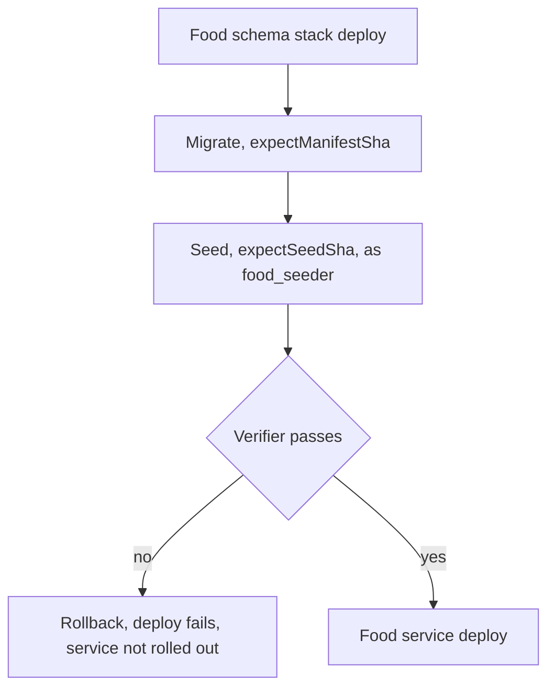
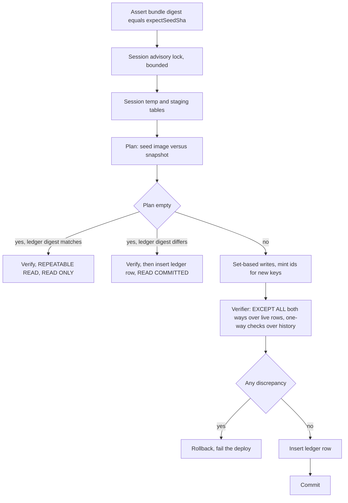
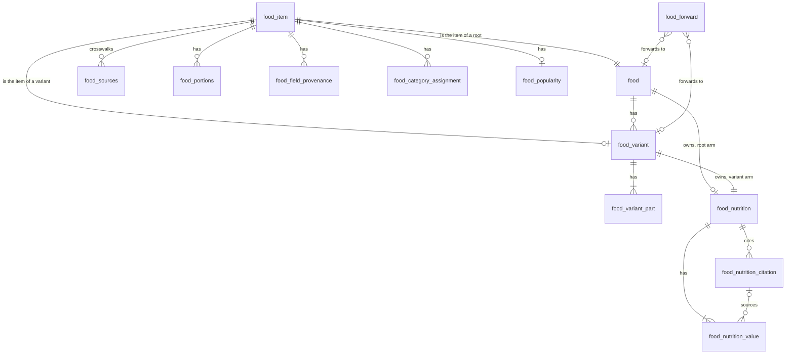
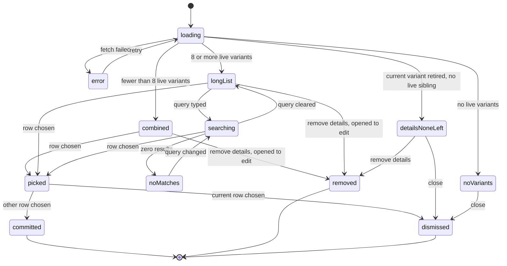
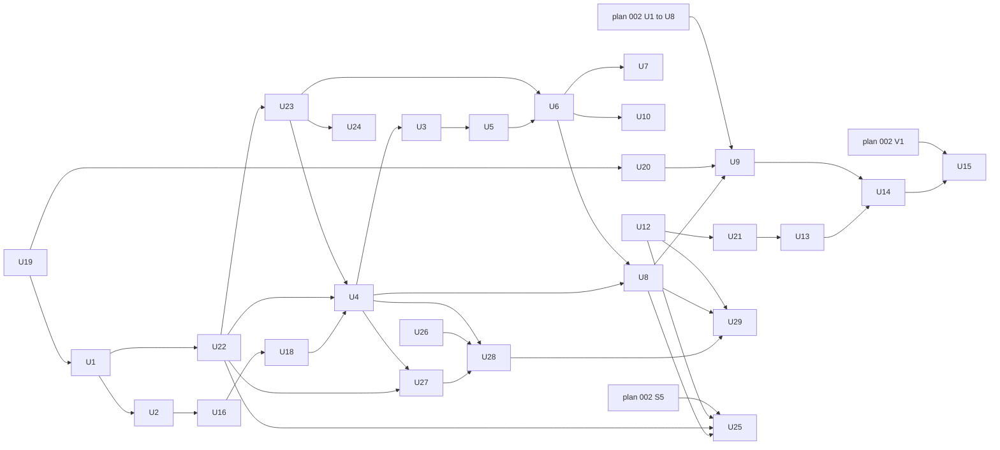

# feat: Curated food catalog, roots and variants, seeded by every deploy

## Summary

The food catalog becomes item-keyed root foods with additive variants, written by one committed seed. A
pipeline-only seed function applies the seed in one transaction, as a dedicated seeder role, and proves the
result with an independent SQL verifier. Every food deploy, prod and preview alike, migrates and then seeds
before the service rolls out. Web and mobile show a root's name and a variant's parts on one dotted line. A root
with no USDA item cites the best entry among every legally usable food table, and live search and sync call every
source with an API, each within its own declared rate limit.

---

## Problem Frame

See origin: `docs/brainstorms/2026-09-26-curated-food-catalog-requirements.md` (Problem Frame). Research and
owner rulings added these facts.

- Nothing is live, no database holds data that matters, and recipes do not exist yet (owner, 2026-09-26 and
  2026-09-27). Every schema change in this plan is greenfield.
- The recipe migration that plan 002 U1 relies on, `0051_ingredient_grain.sql`, is staged and never
  committed. It has a two-arm check with no variant arm. U20 adds the arm before the file's first commit,
  because the migration runner never re-applies an edited file.
- The screens never call food directly. Every food name reaches the apps through recipe-service hooks, so two
  wire contracts move.
- No CI job runs the food or recipe LOCAL e2e suites today. U19 adds them first, so every real-database
  test in this plan runs on every pull request.
- Under R48's normalization, 97 descriptions are shared by two or more SR Legacy or Foundation items. The
  seed keeps one root per name, and the newest data wins (owner ruling, 2026-09-27).
- This plan builds on plan 002 (`docs/plans/2026-09-20-002-feat-ingredient-lookup-grain-and-food-search-decoupling-plan.md`).
  U9 needs plan 002's U1 to U8, and U15 needs plan 002 through V1: its Phases 0 to III, including the S1 to
  S6 search-boundary migration. This plan replaces plan 002's U10. Until plan 002's U2 to U9 land, the
  whole-repo typecheck fails (its staged U1 removed `recipeIngredients`), so no TypeScript commit passes the
  pre-commit hook.
- The owner's 2026-09-26 direction ("make sure that the sandbox and prod databases are properly seeded
  during the deploy") supersedes ruling 6 of 2026-09-11, which ruled out reseeding prod.
- The owner widened the sources on 2026-09-30: "Use all data sources that we can legally use. Add to the plan to
  also hit those sources that expose APIs along with USDA when doing food search and food sync; make sure we
  respect rate limiting (...each API needs its own declaration of the limit...)". R50 to R60 and U22 to U29
  carry it.

---

## Requirements

Origin R1 to R42 carry into this plan as written (see origin), with these changes. The origin's word
"withdrawn" (R13, R29, R41) means retired here (KTD-8).

- R4 (restated). The seed names the USDA item each root stands for, or states that it stands for none
  (naming rule 1c). That item is never also one of the root's variants. A root that stands for none has no
  variants, and no merge absorbs it.
- R9 (restated). Every variant has its own nutrition, from its own USDA item. A root has its own nutrition
  when R50 finds a source, and none otherwise. A root or variant carries the portions of every source row of
  its item, alias sources included (R48). When two sources give the same portion label, the source that
  supplies the numbers wins. Nothing is copied between a root and its variants.
- R18 (restated). A root's nutrition is its own nutrition row. A variant's nutrition is its own nutrition
  row. A root with no nutrition row reports its numbers as absent, never as zero.
- R21 (restated). A seed change never moves a variant-bound line. A root-bound line follows its root. Only a
  seed change to the root's nutrition changes that line's numbers.
- R35 (restated). Each preview's food database holds its own commit's seed from its first deploy. No shared
  base database exists to copy.
- R39 (addition). The check also covers each root's and each variant's nutrition and citations, and the
  absence of nutrition where the seed states none.
- R42 (deferred). Recipes do not exist yet, so the count of affected recipe lines moves to the go-live
  checklist.

Plan-added requirements:

- R45. Popularity weights are part of the committed seed, keyed by source item, so every stage ranks search
  the same way. An item's weight is the sum of its source rows' weights, alias sources included. A root ranks
  by the sum of its own item's weight and its live variants' weights (U8).
- R47. The seed connects as a dedicated seeder role. Only that role and the schema owner (migrations) can
  change seed-owned catalog rows, and the seeder can change nothing else (owner ruling, 2026-09-26).
- R48. If two USDA items share a description, the seed keeps one root under that name, and one item supplies
  its numbers while the others point to the same root (owner ruling, 2026-09-27). A description is normalized
  by lowercasing it, splitting it on commas, removing every non-alphanumeric character inside each segment,
  and sorting the segments; single words are never sorted. The supplier is the member with an energy value
  (nutrient 1008, 2048 or 2047), then the Foundation item (the 395 in `foundation_food.csv`), then the latest
  publication date, then the highest FDC id. A root's item and every variant's item is its group's supplier. A
  declared alias
  (naming rule 28a) is the same kind of alias source with a different description: `catalogChanges.json` lists
  it under `aliases` as `{from, of}`, where `of` is the root's item or one of its variants' items, and the
  apply records it as an alias source of that item. It is never a root or a variant of its own.
- R51. The seed excludes the USDA items that naming rules 1, 1a and 1b exclude, from the curated foods and the
  baseline alike: restaurant and fast-food items, mechanically separated meat, and livestock lungs.
  `catalogChanges.json` lists them under `exclusions`, `baselineSeed` drops them, and the verifier reads the
  same list. The rule-1 exceptions (the espresso items and supermarket frozen pizzas) are curated items and are
  not listed.
- R49. Nutrition lives in one table. Each row references either a root (`food`) or a variant
  (`food_variant`), never both and never neither (owner ruling, 2026-09-29).
- R50 (amended, owner 2026-09-30). Every stored number cites its source and that source's basis. A root or
  variant that stands for a USDA SR Legacy or Foundation item takes that item's numbers. A root that stands for
  no such item takes its numbers from one cited source, chosen by match quality and then source order
  (KTD-22). The admitted sources are the register's (R52): a USDA SR Legacy or Foundation item for the same
  substance in another form, USDA FNDDS, CIQUAL, CoFID (its Excel file), BLS, Japan's Standard Tables,
  Matvaretabellen, Livsmedelsdatabasen, the Swiss Food Composition Database, the Canadian Nutrient File (its own
  rows, never its copies of USDA rows), and a USDA Branded product or the manufacturer's label. With none, the
  root has no numbers. A source is admitted only when its licence allows commercial reuse and adds no
  share-alike term (016 FR-033). ADR-0052 records the excluded sources and why: NEVO (it forbids charging end
  users), Open Food Facts (ODbL share-alike), the Australian Food Composition Database (share-alike and extra
  terms), the FAO/INFOODS tables and CoFID's API (non-commercial), EFSA's food composition database (no energy
  or macronutrients), and every commercial nutrition API or cooking app. Numbers from users or by hand (naming
  rule 1c) arrive later through the authored path (ADR-0029), never through the seed. Only an authored food's
  own numbers are uncited (ADR-0029).
- R19 (restated). The live search and add-by-name never show or create a food for a source item that the seed
  holds or cites. A live hit on an item the seed holds maps to that item's owner, its root or variant. A live hit
  on a cited key that no seed item holds maps to the root that cites it.
- R52. One source register lists every admitted source: its id, publisher, edition, licence and licence URL,
  attribution text, basis, energy method, how it is reached (file, API or mirror), and, for an API, its
  rate-limit declaration (R56). A source that is not in the register can be neither cited nor called. A source
  id carries no edition. A registered source whose terms wait for an owner ruling is neither cited, mirrored nor
  called until the ruling: Livsmedelsdatabasen, since 2026-10-01 (Open Questions).
- R53. Each nutrient value is stored under its own definition, never under another definition's name (owner,
  2026-09-30). USDA's carbohydrate is by difference. CIQUAL's, CoFID's and BLS's are available carbohydrate. A
  food's total carbohydrate is its by-difference value when its source gives one, otherwise its available
  carbohydrate plus its fibre when the source gives both, otherwise absent. A trace or below-limit mark of a
  carbohydrate or fibre value counts as 0, and the extract keeps the mark. A not-known mark leaves fibre absent (2026-10-01).
  CoFID's carbohydrate is expressed as monosaccharide equivalents (CHOAVLM) and is read in the available arm, so
  a starchy CoFID food reads a few grams high. Energy is stored in kcal as published, with the source's energy
  method recorded.
- R54. A value stated per 100 mL converts to per 100 g only with a density cited from the same source.
  Otherwise the seed refuses it (KTD-20). A value given only in kJ converts to kcal at 4.184 kJ per kcal. Each
  conversion is recorded on its citation, because CC BY 4.0 §3(a)(1)(B) requires stating that the material was
  changed.
- R55. Both apps show a Data sources page. It lists each source, its licence and link, its edition, and a
  statement that values were converted where R54 converted them. It reads the register from food-service
  (`GET /api/v1/foods/sources`).
- R56. Each source reached through an API declares its own rate limit: the number of requests, the window,
  what the limit counts (an API key or a client address), whether the publisher states it or we impose it (a
  stated limit cites its URL), and how long a breach blocks. Search and sync never call a source at its limit,
  and sync pauses that source's import until its window resets. A 429 or a `Retry-After` blocks that source for
  every task until the stated time. The sandbox USDA key is shared by sandbox and every preview while each
  counts calls in its own database. The code says so where the limit is declared, and the fix is deferred
  (owner, 2026-09-30).
- R57. The live search calls every source that can search remotely and is below its limit. It takes results
  from each source in turn up to the page size, and it reports each source's outcome: answered, busy,
  skipped or unavailable. A source whose API can only list or fetch by id is searched through its local mirror (R60). Only
  USDA can search remotely (U26, 2026-10-01).
- R58. Add-by-name asks every source in parallel. It takes candidates from the highest-ranked source that
  returned a surviving candidate, and every USDA dataset ranks above every mirror source, so asking more sources
  never makes a line ambiguous that USDA alone resolved. KTD-22's split of USDA's datasets governs seed citations
  only. A skipped source that ranks above the one whose candidates the row would take defers the whole row.
- R59. A mirror item that a cook picks becomes a live catalog food citing its source, as a picked USDA item
  does. No live food mixes numbers from two sources.
- R60. A mirror is a cache, not catalog. A scheduled sync keeps it current. The seed never reads it (R33, R36),
  and it never writes a seeded number (R14). When a cited item's mirror version differs from its committed
  extract, the sync reports the difference, and a seed pull request follows.

---

## Key Technical Decisions

- KTD-1. The seed runs in a dedicated `FoodSeedFunction` in `FoodSchemaStack`, invoked only by the pipeline,
  with 900 s and 2048 MB. Writes are set-based in every case: COPY into session staging tables, then one
  `INSERT … SELECT` or `MERGE` per table. The first preview deploy's logged duration decides the shape, and
  local timing is only a regression signal.
    - 60 s or less: one transaction (KTD-2).
    - 60 s to 450 s: load staging tables outside the transaction. Then merge, run the verifier on the catalog
      tables and insert the ledger row, all in one transaction.
    - Over 450 s: the seed moves to an ECS RunTask in its own stack after migrate.
- KTD-2. The apply first takes a seed-specific SESSION advisory lock, bounded by `lock_timeout`, before any
  transaction begins, and releases it in a `finally`, as `applyMigrations` does. A lock taken inside the
  transaction would come too late: Postgres fixes the snapshot at the transaction's first statement, so the
  second of two concurrent applies would plan against data the first has not yet committed. Under the lock, a
  non-empty plan, or an empty plan whose digest differs from the ledger's, runs in one READ COMMITTED
  transaction: plan, write the plan's rows, `verify`, insert the ledger row, commit. An empty plan whose digest
  matches runs `verify` alone in a REPEATABLE READ, READ ONLY transaction. Readers see the old seed until
  commit. A verifier failure rolls everything back. Each transaction sets `statement_timeout` and
  `idle_in_transaction_session_timeout`. Each invocation opens its own connection.
- KTD-3. The verifier is independent of the seeder by language and by import. It COPYs the raw committed
  bytes into temporary tables, derives the expected state in SQL and compares with `EXCEPT ALL` in both
  directions over LIVE rows: every `food` row with a `seed_key` and no `retired_at`, every live variant, and
  the parts, per-item rows and nutrition of each, selected through their owner's natural key: the root's seed
  key or the variant's item key (U6). The committed bytes describe only what is live, so history gets one-way
  checks instead: a retired row's key is absent from the current seed and the row still owns its item
  (KTD-8), and every `food_forward` row resolves to a live root or variant, whoever wrote it (KTD-12). The
  ledger is not compared. It never uses the seeder's ownership column. An ESLint fence lets the verifier
  import only the archive reader, whose public surface is checksum checks and byte streams.
- KTD-4. The seed manifest is computed twice, in the function and in `runSeed.sh`. It covers every regular
  file under the seed function's own asset directory: its bundle plus a `data/` copy that the build empties
  first. It never covers `dist-lambda/`, so a migration edit does not move the seed digest. The TypeScript half
  reuses `formatManifest` and `digestManifest` from `DSG/manifest.ts`. Every `apply` invoke carries a required
  `expectSeedSha`; `describe` carries none (KTD-5). An insert-only `catalog_seed_ledger` records the digest only
  after the verifier passes.
- KTD-5. Previews seed themselves. The migrate handler creates a per-PR database from `template0`, and the
  pipeline migrates it and seeds it. The clone of `kitchensink_food` is retired. The seed function's
  `describe` returns two digests: its own deployed asset and the ledger's latest. If they differ or either is
  absent, `deployGate.sh`'s stay-current term reads stale. The gate therefore never needs a tree bundle.
- KTD-6. Storage is keyed by item, except nutrition (KTD-19). `food_item` is the unit that sources, portions and popularity attach to, and five
  tables key on it: `food_sources`, `food_portions`, `food_field_provenance`, `food_category_assignment` and
  `food_popularity`. A declared merge re-parents all five by re-pointing one item. `food` is the root and
  points to its own item. `food_variant` points to its root and to its item. Every root and every variant has
  exactly one item. A root that stands for no USDA item (seed `item: null`) gets an item keyed by its seed
  key. Like an authored food's item, that item has no source row. An item can have several source rows:
  a live food blends several USDA items, and a duplicate USDA description adds an alias source (R48).
- KTD-7. Parts are keyed `(variant_id, attribute, ordinal)`. The `food_variant_attribute` enum's declaration
  order is the contract order, and it is naming rule 24's order: `cut`, `bone`, `skin`, `formOrVariety`,
  `babyFoodStage`, `pack`, `fat`, `trim`, `grade`, `cookingMethod`, `salt`, `sugar`, `addedNutrients`, `brand`,
  `origin`. A new attribute is added `BEFORE 'origin'` in its own migration.
- KTD-8. Seed retirement uses `retired_at`, never `WITHDRAWN`. One owner per item, retired owners included.
  An item moves only by a declared change: a merge, a split, an alias or a root's new item. Every root or
  variant row a change deletes gets a `food_forward` row: an absorbed root forwards to the surviving root, a
  variant whose item becomes a new root's item forwards to that root, a root absorbed as an alias source
  forwards to the owner of the alias's `of` item, and a root whose item changes forwards the displaced owner to
  that root. Ids are found by natural key, retired rows included, and never minted twice for one key. An item's
  natural key is `fdc:<id>`. An item with no source row takes its root's seed key as its natural key. A root's
  seed key is frozen at its first commit: its `item` may change later without changing the key, and U1 refuses
  a seed in which a committed root key disappears while its item survives, unless a declared change says so.
  That refusal is a commit-time check in the seed-diff job, never a planner rule (U5).
  An apply deletes any item it leaves with no owner.
- KTD-9. The storage change is one migration with no backfill, because no database holds data that matters.
  ADR-0050 records this exception to ADR-0035's expand-first rule, based on the owner's ruling, and it
  expires at go-live.
- KTD-11. The plan is canonical over natural keys, with placeholders for new rows, so the same inputs give
  the same plan. `CatalogSnapshot` is a port with two adapters: the database, and a projection of a committed
  seed. The CI diff plans main's projected seed against the pull request's seed.
- KTD-12. Seed ownership is a fact on the item: `food_item.seed_owned`, immutable after insert. A statement
  trigger per event per guarded table joins its transition table to `food_item`. It checks `session_user`,
  never `current_user`, so a cascade cannot launder a write. It admits the owner. It also admits the seeder:
  a holder of INSERT on the ledger that is not a member of the table's owner. It refuses the
  seeder on rows that are not seed-owned. The nutrition tables reach the fact through their owner.
  `food_nutrition` joins `food` or `food_variant`, then `food_item`. `food_nutrition_value` and
  `food_nutrition_citation` join `food_nutrition` first. A DELETE row whose parent is already gone was removed
  by an ON DELETE CASCADE from a guarded parent. That parent's own statement trigger decides the whole
  statement, so the child admits the row. The trigger states this rule once, for every guarded table. The
  item cascades in authored erasure already depend on it. One exception, narrow and named: when a seed root
  claims the normalized name of a live catalog food that is not seed-owned and has no author (`user_id IS
NULL`), the seeder retires that live food and writes a `food_forward` from it to the seed root, in the same
  transaction. The trigger admits exactly that pair of writes and nothing else on a non-seed row.
  `food_forward` is decided by its SOURCE, not its target, because it has two writers: the seeder may insert a
  forward whose source row it deleted in the same transaction, or the live food it retires under the exception
  above; `food_app` may insert a forward only when its source is a live, unauthored food that is not
  seed-owned and that the same transaction retires, and its target is a live root or variant (U8's live
  path). Every other forward is refused.
- KTD-13. One registry in `FS/src/db/schema/catalog.ts` names four disjoint sets:
    - the catalog tables: guarded by the trigger, DML for the seeder;
    - the service-read-only tables (`catalog_seed_ledger`): SELECT and INSERT for the seeder, SELECT only for
      `food_app`, not guarded;
    - the seeder-insert dictionaries (`nutrient`, `food_category`, KTD-14): SELECT and INSERT for the seeder,
      not guarded;
    - the non-catalog tables that reference a catalog anchor (`fetch_queue`, `fetch_requesters`,
      `food_candidates` and `food_versions`, each with its reason).

    Food's migrate handler passes the first three sets to `DSG`'s grants and audits, so `DSG` never names a food
    table. A LOCAL e2e guard reads `pg_constraint` and finds every table with a foreign-key path to `food_item`,
    `food` or `food_variant`. It asserts that each one is in exactly one set. It also asserts that each catalog
    table is guarded, granted to the seeder and covered by the verifier.

- KTD-14. `nutrient` and `food_category` are shared dictionaries. The seeder inserts missing entries and
  holds no right to update or delete them (KTD-13). `food_app` can insert too. The trigger does not guard them. The verifier checks
  that every entry the seed references exists.
- KTD-15. The food contract is additive. `name` stays. Search results gain an optional `variant`, a root's
  read gains `variants`, and a resolver answers a root, variant or forwarded id. The resolver applies the
  same `authorshipPolicy` as `GET /:id`. Both wires carry `attribute` as an open string, so a new attribute
  never breaks an older reader. The closed enum stays for the seed format and the enum-order parity test. The
  nutrition wire does not change. A root with no nutrition already reads as an entry with every macro absent.
  `nutrientViewSchema.source` stays an open string: the citation's register id (U22), or `manufacturer_label`
  for a label (U8). No external key or URL reaches the wire (SC-013). A variant has no state
  on either wire. Whether its numbers describe the food after cooking is a fact of its label: a
  `cookingMethod` part or `homemade` (naming rule 20, owner 2026-09-30).
- KTD-16. The full curated seed is committed ahead of U1, in U1's format (owner, 2026-09-30):
  `curatedCatalog.jsonl`, `catalogChanges.json`, `namingRules.md`, `usda/brandedExtract20260430.jsonl` and
  `usda/sourcePins.json` under `FS/src/foods/seed/data/`. U1 parses these files and does not create them. The
  USDA SR Legacy and Foundation zips are not part of it: U1 adds them and their pins. The
  baseline makes every SR Legacy and Foundation item a root under its full USDA description, keyed `fdc:<id>`,
  and the curated seed replaces the baseline roots it covers through renames plus declared merges and aliases.
  The deployed and device tests use two of its roots, "beef brisket" and "boneless skinless chicken breasts",
  with their variants and synonyms. U1's fixtures, not the committed seed, hold one root of each nutrition
  shape: its own item, a source-item citation, a label, and none.
- KTD-18. The seed connects as `food_seeder`, a fourth role in ADR-0039's model, for food only (owner ruling,
  2026-09-26). It holds CONNECT and TEMP on its database (U18), DML on the registry's catalog tables, and
  SELECT and INSERT on the ledger and the dictionaries (KTD-13), with no DDL, and it cannot reach the owner or
  the migrator. The food migrate asserts that the role exists before it grants, with a
  named error.
- KTD-19. Nutrition is one table with one header row per owner, and the owner is a root or a variant (owner
  ruling, 2026-09-29). `food_nutrition` (the header) has `food_id` and `food_variant_id`. Each is a real
  foreign key with ON DELETE CASCADE, under `CHECK (num_nonnulls(food_id, food_variant_id) = 1)`, with one
  partial unique index per arm. Both arms are immutable after insert. No owner-kind column exists: the arm is
  read off the two columns, as recipe migration 0051 reads its arm. `food_nutrition_value` and
  `food_nutrition_citation` key on `food_nutrition` alone, and nothing else references them. A value cites its
  own header's citation through `FOREIGN KEY (nutrition_id, citation_id)`, ON DELETE NO ACTION.
    - A citation is either a source item (`source`, `external_key`) or a manufacturer label (`url`,
      `retrieved_on`, `manufacturer`, `serving_label`, `serving_grams`). Which one is read off the columns,
      with one CHECK per shape.
    - A NULL citation means the food's author wrote the value (ADR-0029). An assertion trigger admits a NULL
      citation only under a food whose `user_id IS NOT NULL`.
    - A food with no numbers has no `food_nutrition` row (GR-019).
    - Every variant has exactly one header, and a root has at most one.
    - A merge does not carry nutrition with the item: the applier rewrites it on the new variant.
- KTD-20 (amended 2026-09-30). Cited numbers come from committed extracts. Each cited source has one extract
  under `FS/src/foods/seed/data/<source>/` that holds only the cited rows. `sourcePins.json` pins the upstream
  file by name and SHA-256, plus the extract's checksum, and a hand-run extractor rebuilds the extract from the
  upstream file byte for byte. The Branded extract (`data/usda/brandedExtract20260430.jsonl`) is the model, and
  FNDDS gets its own extract from the survey zip that is already pinned. A file source's published file is
  pinned and not committed, so a rebuild depends on the publisher still serving the pinned bytes. The operator
  keeps the files the pins name. Matvaretabellen publishes an xlsx, so it is a file source for the seed (U26). A
  source reached only through an API has no stable upstream file, so its raw snapshot is committed and pinned
  instead. A label's numbers are its printed per-serving values. The planner computes
  `round(printed × 100 ÷ servingGrams, 3)` in `basisConversion.ts` (KTD-24), and the verifier (SQL numeric)
  computes it again. A printed zero, and a Branded zero, is stored as absent, never as 0 (owner ruling on OQ-2,
  2026-09-30; 21 CFR 101.9(c)), and `basisConversion.ts` records that too. A value per 100 mL converts only as
  R54 allows, and the seed refuses it otherwise.
- KTD-21. Energy has one read rule. A food's calories are its Energy kcal row (nutrient 1008), else its
  Energy (Atwater Specific Factors) kcal row (2048), else its Energy (Atwater General Factors) kcal row (2047),
  the order the seed's election used (owner register, 2026-09-28). The stored rows stay as USDA published them,
  so seed and verifier equality do not change; only `nutrientSelection.ts` reads the fallback. 179 of the 236
  roots on a Foundation item carry energy only as 2048 or 2047.
- KTD-22. One policy chooses a root's citation: `FS/src/foods/seed/catalog/citationPrecedence.ts`. A candidate
  names its dataset (`FS/src/foods/seed/citationDatasets.ts`), and the image resolves it against that dataset
  only, so a mistyped key cannot land in a higher dataset unnoticed.
    - Datasets, highest first: USDA SR Legacy or Foundation (a same-substance stand-in, and only that), USDA
      FNDDS, CIQUAL, CoFID, BLS, Japan's Standard Tables, Matvaretabellen, Livsmedelsdatabasen, the Swiss
      database, the Canadian Nutrient File, then a USDA Branded product or the label.
    - Tiers: exact or same substance, then close, then generic.
    - Pools, an earlier pool always winning:
        1. an exact, same-substance or close table entry with energy
        2. a Branded product or a label with energy
        3. such a table entry without energy
        4. a Branded product or a label without energy
        5. a generic table entry
    - So analysed values beat a label, a citation never trades calories for a better name, and a generic entry
      never displaces a product or a label. Within a pool, tier decides, then energy, then the dataset order.
    - Two candidates that rank equally are refused as a tie (`candidateTie`), so file order never decides. The
      curator grades the one not meant lower.
    - The candidates are committed as `FS/src/foods/seed/data/sourceCandidates.tsv` (`seedKey`, `dataset`, `key`,
      `match`), every candidate per root and not only the winner. The format check asserts that each root's
      committed citation is the policy's choice given the committed tiers. The tiers are hand judgments, so U5's
      diff lists every citation and tier change for review.
- KTD-23. A nutrient's identity is its definition (R53). Each stored value carries its INFOODS tag in
  `CanonicalNutrient.code`, so USDA's by-difference carbohydrate (`CHOCDF`) and an available carbohydrate
  (`CHOAVL`) are different rows. KTD-21's one read rule for energy becomes one read rule per macronutrient,
  and carbohydrate follows R53. `nutrientIdentity.ts` holds the one mapping: each stored tag to its dictionary
  `(name, unit)`, and each USDA nutrient number read (1008, 1062, 1003, 1004, 1005, 1079, 2047, 2048) to a tag,
  with 2047 and 2048 as definitions of their own so KTD-21's order stays expressible. The bulk parser and the
  live adapter set `code` from it, the dictionary resolves by code, `nutrientSelection` reads by tag, and the SQL
  verifier restates the mapping under a parity test.
- KTD-24. One policy changes values: `FS/src/foods/seed/catalog/basisConversion.ts` (R54). Extractors only
  translate a source's columns into an extract line, and the citation records each conversion.
- KTD-25. Each source's rate limit is a `RateLimitDeclaration` in the register (R56). A `RateLimitedTransport`
  Decorator over each source's `fetch` charges the shared window before every upstream request, and it records
  every 429 and `Retry-After` in a `source_backoff(source, blocked_until)` row that it reads under the
  limiter's advisory lock. The API, the worker, change-refresh and the mirror sync therefore share one block.
  `RollingWindowLimiter` keeps owning the count and the ceiling, and the Decorator only enforces them. This
  replaces eight hand charges in seven methods, three of which never recorded a 429 (PATCH resolve,
  change-refresh and the worker's refresh). A full window throws a typed `SourceBusyError`, which the USDA client
  rethrows unchanged and the adapter maps to a busy outcome, never to a timeout and never to a `SourceApiError`
  status code, because the worker classifies status codes. A 502, 503 or 504 writes `source_backoff` until a
  `Retry-After` time, else for the source's `outageBlockSeconds` (USDA: 60). When the publisher's own remaining
  count falls to 10% of its limit, the transport writes a short block for the source's `probeSeconds` (USDA:
  300), so the key's other users cannot spend it to 100% and earn an hour's block on our next call.
- KTD-26. A mirror is the `source_mirror_item` table, keyed by `(source, external_key)` and holding the item's
  version and raw payload. A `MirrorSync` Fargate scheduled task keeps it current with one `MirrorFeed` Strategy
  per source. One sync runs at a time under an advisory lock, and it has its own log group (ADR-0042) and a
  staleness alarm. A Fargate task egresses through the internet gateway, so ADR-0004 does not change.
  `MirrorSourceAdapter` answers `FoodSourceAdapter.searchByName` from the mirror. The sync runs in sandbox and
  prod only. A preview fills its mirror from the committed snapshots at deploy and calls no publisher, so open
  pull requests never multiply the load on a publisher.

---

## Pattern Register

- **Exclusive Arc: `food_nutrition`'s owner.**
    - Promise: exactly one owner reference is set, and each is a real foreign key with its own cascade. A
      one-per-owner relation has a partial unique index per arm. There is no type column. Adding an arm
      edits the CHECK, adds an index and updates the registry in one migration.
    - Breach: an arm with no foreign key, a type column beside the arms, or a CHECK that passes on NULL.
    - Flip condition: a third owner kind (T150 names a future user-authored composite), or two more tables
      that need the same arc. Either one moves the design to a shared parent key.
- **Aggregate: `food_nutrition` is the aggregate root, with values and citations as its parts.**
    - Promise: the parts are reached only through the header, cascade with it, and are referenced by
      nothing outside it.
    - Breach: an outside table references a value or citation id.
- **Same-aggregate provenance foreign key:** D-PROVENANCE-FK, preserved inside the header.
- **Assertion trigger: "uncited means authored".**
    - Promise: it reads the existing fact and copies nothing. Every write that can break it either fires
      it or is made impossible.
- **Parser, intent already satisfied:** the U1 seed format. Its zod discriminated union is the pattern, so
  add nothing on top.
- **Registry and discovery guard (KTD-13):** a closed partition of every table that references a catalog
  anchor.
- **Preserved:** the KTD-12 authorization trigger, the independent verifier (KTD-3), and the
  `CatalogSnapshot` port (KTD-11).
- **Intent already satisfied:** absent macros on the wire already mean "no numbers"
  (`FS/src/foods/foods.schema.ts`). Add no field.
- **How they fit together:**
    - The arc owns who the owner is.
    - The aggregate owns what nutrition contains.
    - The foreign key owns which source each number came from.
    - The assertion owns the one uncited case.
    - KTD-12 owns who can write.
    - The registry owns what is guarded.
    - The verifier owns whether the content equals the seed.
    - Only the header knows the owner's kind.
- **Unregistered:** every other shape in the plan (planner, applier, dialog statechart and others) has no
  entry yet.

---

## High-Level Technical Design

### Deploy order for food, every stage

A preview's database is created from `template0` before migrate. Prod follows the same order. Its seed step
runs in every deploy that deploys food.

### Seed transaction

Temporary tables exist before any read-only transaction starts, because Postgres refuses `CREATE TABLE`
inside one. If only the seeder's code changed, the plan is empty and the digest differs.

### Item-keyed catalog

Every item has exactly one owner, a root or a variant, retired owners included (R4, KTD-8). Every variant
owns one nutrition row, and a root owns at most one (R49, KTD-19).

### Details dialog statechart

Every non-final state can also reach `dismissed` by close or Escape. The machine has no offline state: a
parked read renders the app-wide `OfflineReadSlot`.

- The machine's context holds its entry mode: `add` (opened by `Add details` on a root-bound line) or `edit`
  (opened by `Edit details` on a variant-bound line). `Remove details` exists only in `edit`, so the
  `removed` transitions are guarded on it. `detailsNoneLeft` is reached only in `edit`.
- A pick commits one of two ways, chosen by the host surface, never by the machine. On a saved recipe it is a
  line mutation through the horizontal write layer, with no connectivity branch. On the create and edit form
  and on import review, it writes the host's local form value, and the recipe save carries it; that path has
  no failure state of its own.

### Unit order

Everything ships in one release, except the runtime chain (U26 to U29), which never gates the seed. U17 records
each decision beside the unit that ships it. U11 was folded into U4, so its ID is unused. U26 settled the runtime
chain's scope on 2026-10-01: besides USDA, Matvaretabellen is usable through a mirror, and Livsmedelsdatabasen
waits for the owner's ruling. The chain stays in this plan, because the owner's direction asks search and sync to
use every API source next to USDA, and U27's declared limits also repair USDA's own call sites.

---

## Implementation Units

Path keys: `FS/` is `packages/services/food-service/`, `RS/` is `packages/services/recipe-service/`, `G/` is
`packages/infra/global/__tests__/`, `FR/` is `packages/apps/commise/features/recipes/src/`, `DSG/` is
`packages/shared/db-schema-guard/src/`. Test tiers: unit (U), integration with a mocked database (I), LOCAL
e2e against real Postgres (E), DEPLOYED e2e (D), component (C), Playwright (P), Maestro (M), k6 (K).

Every unit follows the same rules:

- Test-first. Write the failing tests in every tier the unit lists, watch them fail, then write the code. A
  unit that produces no code (U12's design document, U17's decision records) states `Test expectation: none`
  and names the check that stands in for tests.
- Every guard change ships with an in-test fixture table of shapes the tree has never held. The guard must
  reject each one and accept the real tree.
- An absence assertion carries a positive control in the same test.
- Done means two things: every listed tier passes in CI, and `staff-code-quality` GATE passes on the diff.

### U19. LOCAL e2e jobs in CI

- **Goal:** CI runs food-service's and recipe-service's LOCAL e2e suites on every pull request.
- **Requirements:** R39, R47 (their proofs run here).
- **Dependencies:** none. If plan 002 C1 and C2 land first, this unit adds only what they lack.
- **Files:**
    - Modify `.github/workflows/_ci.yml` (required jobs `E2E (food — LOCAL Postgres)` and
      `E2E (recipe — LOCAL Postgres)`, each running `test:e2e` for its workspace).
    - Guards: `G/workflowInvariants.test.ts` (re-key invariant 7 to a declared target), a new job-presence
      case in `G/deployedE2eEntrypoint.test.ts`.
    - `G/deployedE2eTiers.test.ts`: its case "no other workflow defines a job that claims the e2e tier" fails
      on the new jobs, so every e2e job declares its target, LOCAL or DEPLOYED. `staff-architect` decides at
      BLUEPRINT how a job declares it, and which guard holds the job-presence case.
- **Test scenarios:**
    - Each new job goes red on a deliberately failing assertion, then green once it is reverted.
    - If either job is removed or loses its `test:e2e` step, the guard fails.
    - A job whose run executes zero tests fails.
- **Verification:** both jobs run and pass on this branch.

### U20. The variant arm in recipe migration 0051

- **Goal:** `0051_ingredient_grain.sql` carries the variant arm before its first commit.
- **Requirements:** R20.
- **Dependencies:** U19.
- **Files:**
    - Modify the staged `RS/src/database/migrations/0051_ingredient_grain.sql`:
      `num_nonnulls(food_id, food_variant_id, unresolved_food_id) = 1`, one partial unique index per arm,
      and `food_owner_id` on the root arm only.
    - Modify `RS/src/database/schema/foodLookups.ts`.
    - Tests (E): `RS/tests/e2e/foodLookupArms.e2e.test.ts`.
- **Test scenarios:**
    - Zero arms and two arms are each refused.
    - Each single arm is accepted.
    - `food_owner_id` on the variant arm is refused.
- **Verification:** the file is committed for the first time with three arms. It commits with plan 002's U1,
  which creates it, and plan 002 lands its U1 to U8 together.

### U1. Committed seed, format check and pinned sources

- **Goal:** the seed exists as committed, parsed, checksum-pinned data, with no deploy change.
- **Requirements:** R1 to R7, R9, R45, R48, R50, R51.
- **Dependencies:** U19. U1 does not read recipe migration 0051, so it does not wait for U20.
- **Files:**
    - Parse the committed `FS/src/foods/seed/data/curatedCatalog.jsonl`, `catalogChanges.json` and
      `namingRules.md` (KTD-16). Create `foodPopularity.jsonl`.
    - Create `FS/src/foods/seed/data/usda/srLegacy201804.zip` and `foundation20260430.zip`, and add their pins
      to the committed `usda/sourcePins.json`. The upstream names break the file-name rule, so the files are
      renamed and the pins record the upstream names.
    - Read the committed `FS/src/foods/seed/data/usda/brandedExtract20260430.jsonl` (KTD-20): the 302 cited
      Branded products. Its `sourcePins.json` entry, `brandedFoods`, pins the Branded upstream zip by name and
      SHA-256, plus the extract's checksum.
    - Create `FS/src/foods/seed/archive/usdaSourceArchive.ts` (adapter over `yauzl`, a new dependency).
    - Create `FS/src/foods/seed/archive/brandedExtract.ts` and its entry `brandedExtractMain.ts`. They rebuild
      the extract from the pinned zip, and they run by hand, not in CI.
    - Create `FS/src/foods/seed/catalog/curatedSeedFormat.ts` and `baselineSeed.ts`.
    - Modify `FS/src/foods/seed/fnddsPrior.ts` and its entry `fnddsPriorMain.ts` to write
      `foodPopularity.jsonl` instead of the database. The `seed:fndds-prior` script stays the way to
      regenerate the file.
    - Modify `FS/src/foods/foods.schema.ts` (`variantAttributeSchema`, `variantPartSchema` and
      `orderedPartsSchema`), then regenerate the contract copy.
    - Reuse `FS/src/sources/usda/bulk/usdaBulk.parser.ts` and `usdaBulk.reader.ts` (the reader adapted to
      `usdaSourceArchive` streams). They keep `BULK_UNIT_TO_API_UNIT`, the canonical nutrient names shared with
      the live adapter, and FDC's known bad-row drops (blank Foundation amounts, orphan portions, the row with an
      embedded newline). The SQL verifier restates the unit table and drop rules, and a parity test holds the two
      in step.
    - Tests (U): `FS/src/foods/seed/catalog/__tests__/curatedSeedFormat.test.ts`, `baselineSeed.test.ts`,
      `FS/src/foods/seed/archive/__tests__/usdaSourceArchive.test.ts`, `brandedExtract.test.ts`,
      `FS/src/foods/seed/__tests__/fnddsPrior.test.ts`.
    - Tests (I): `FS/tests/curatedSeedLoad.integration.test.ts`.
- **Approach:** the format module parses input into typed values. It must not end in `.schema.ts`, because
  `FS/contract/config.ts` sweeps that suffix into the wire contract. `baselineSeed` builds one root per
  normalized description and keys it `fdc:<id>` from the item that supplies its numbers (R48), after dropping
  the `exclusions` (R51). The seed merges the curated seed over the baseline (KTD-16).
    - An item's portions are the union of its source rows' portions, alias sources included, and its
      popularity weight is the sum of its source rows' weights (R9, R45).
    - A root with a USDA item carries no `nutrition` field. Its numbers come from that item's rows in the
      committed SR Legacy or Foundation zip.
    - A root whose `item` is null must carry `nutrition`. It is a zod discriminated union on `source`
      (`sourceItem` with a registered source, its key and its match, or `manufacturerLabel` with its citation
      fields, serving and per-serving values), or null (R50, KTD-20, U23).
    - Variants stay `{item, parts}`, with no `state` and no `nutrition` field.
    - Label nutrients are named by the `(name, unit)` pairs in `FS/src/foods/nutrition/labelNutrientMap.ts`,
      so the verifier needs no second copy of the label map.
- **Test scenarios:**
    - Refused, each naming the root key:
        - a part with no attribute
        - parts out of enum order
        - one item used by a root and a variant (R4)
        - a duplicate root key (R3) or a duplicate root name
        - an undeclared merge or split (R7)
        - a variant with no parts
        - two variants of one root with identical parts
        - `"` or `″` in a variant part or a curated root name
        - `nutrition` beside a non-null item
        - `nutrition` missing on a root whose item is null
        - `nutrition` on a variant
        - a root whose item is null that has variants
        - a merge that absorbs a root whose item is null (R4)
        - a label missing its URL, date, manufacturer or serving grams
        - a label serving stated only in volume
        - a printed zero stored as a value instead of absent (OQ-2)
        - a `(name, unit)` pair not in `LABEL_NUTRIENT_MAP`
        - a Branded item that is not in the extract, or whose unit is mL
        - a Branded citation with no extract file present
        - a merge or alias source listed twice
        - an alias whose `of` is neither the root's item nor a variant's item (R48)
        - a root or variant item that is not its R48 group's supplier
        - an excluded item that is also a root, variant, merge or alias (R51)
        - a committed root key that disappears while its item survives, with no declared change (KTD-8)
    - Accepted: two parts of one attribute, and each of the four nutrition shapes.
    - Baseline USDA names keep `"`.
    - Two items sharing a description yield one root whose numbers come from R48's supplier: the Foundation
      item when both carry energy, and the SR item when only it does ("Oil, canola" keys fdc:172336). Two SR
      items, and two Foundation items, each resolve by publication date, then FDC id.
    - "all-purpose flour" carries its SR alias's `cup` portion, and its weight includes the alias's FNDDS
      weight.
    - A declared alias becomes an alias source of the item its `of` names, and appears as neither a root nor
      a variant (R48).
    - The baseline has one root for every distinct description, except the excluded items (R51), and no
      variants.
    - A Foundation blank-amount row and an orphan portion are dropped, as the live parser drops them.
    - A tampered archive byte, or a tampered extract byte, is refused before any row is read.
    - The extractor rebuilds a fixture zip's extract byte for byte.
    - The popularity generator writes the weights it wrote to the database before, for the same inputs.
    - Integration: the committed files parse, and the two KTD-16 test roots carry their variants and
      synonyms.
- **Verification:** the committed seed parses, and every refusal fails with a named cause.

### U2. Seed manifest, computed twice

- **Goal:** one digest identifies the seed data plus the built seeder, computed two independent ways.
- **Requirements:** R8, R38.
- **Dependencies:** U1.
- **Files:**
    - Create `DSG/seedManifest.ts` (pure: the path contract, `isSeedManifestPath`), `DSG/seedManifestFile.ts`
      (`readSeedManifest(bundleDir)` walks the tree and calls `formatManifest` and `digestManifest` from
      `DSG/manifest.ts`; `assertSeedBundleMatches`), and `DSG/seedEvent.ts` (a strict union: `apply` with
      `expectSeedSha`, `describe` with nothing). Add `SeedManifestMismatchError` and `SeedBundleRefusedError` to
      `DSG/errors.ts`, and export all of it from `DSG/index.ts`.
    - Extract `run_migrations_resolve` and `run_migrations_invoke` from `.github/scripts/runMigrations.sh`, so
      migrate and seed share one invoke. Create `.github/scripts/runSeed.sh` (`manifest`, `run`), sourcing
      `runMigrations.sh`; `run_migrations_classify` stays the one definition of a successful invoke.
    - Tests (U): `DSG/__tests__/seedManifest.test.ts`, `DSG/__tests__/seedEvent.test.ts`.
    - Tests (I): `packages/shared/db-schema-guard/tests/seedManifest.integration.test.ts` (new tier: a
      `vitest.integration.config.ts`, a `test:integration` script and a step in `_ci.yml`'s
      `integration-selfcontained` job). It walks a real temporary filesystem and touches no database or service.
    - Tests (I): `packages/infra/global/tests/runSeed.integration.test.ts`, and the flags case added to
      `packages/infra/global/tests/runMigrations.integration.test.ts`.
    - Guards: `G/seedManifestAgreement.test.ts`, `G/runSeed.test.ts`.
- **Approach:** the invoke uses `--cli-read-timeout 960` (Lambda's 900 s maximum plus a margin), a connect
  timeout, `AWS_MAX_ATTEMPTS=1` and `--no-cli-pager`, so a long apply is neither abandoned nor invoked twice.
  A read timeout of 0 would hang on a dropped idle connection until the job's own timeout.
- **Test scenarios:**
    - The TypeScript and shell halves agree on the rendered text and the digest, over nested and C-order trees
      and over the real `data/` directory.
    - One changed byte in a bundled file or a data file changes the digest; so does a rename or an added empty
      file. An added empty directory does not.
    - Both halves refuse an empty tree, a symlink, a special file and an unsafe path.
    - An `apply` event without `expectSeedSha` is refused, and so is a `describe` with one.
    - If either invoke flag or the retry setting is removed from the shared invoke, `G/runSeed.test.ts` or the
      integration suite fails, for seed and migrate alike.
    - Two clean builds producing one digest moves to U3, which owns the build.
- **Verification:** the agreement guard catches drift in either implementation.

### U16. Retire the hand tools

- **Goal:** nothing but the deploy seed writes seeded rows.
- **Requirements:** R14, R38.
- **Dependencies:** U1.
- **Files:**
    - Delete from `FS/src/foods/seed/`: `bulkSeed.service.ts`, `bulkSeed.errors.ts`, `main.ts`, `seedCli.ts`,
      `reseedCli.ts`, `reseedCli.errors.ts`, `reseedMain.ts`, `clearCli.ts`, `clearCli.errors.ts`,
      `clearMain.ts`, `catalogDatasets.ts`, `operatorIntent.ts`, and their tests. `fnddsPriorMain.ts` stays,
      because U1 makes it the generator of `foodPopularity.jsonl`.
    - Delete the directory adapters only the hand tools used, `directoryCsvSource` and `streamBulkCandidates`
      in `FS/src/sources/usda/bulk/usdaBulk.reader.ts`, with their test cases, and remove the hand-tool
      runbooks from `FS/src/foods/seed/README.md`.
    - Delete `FS/tests/usdaBulkSeed.integration.test.ts`, `catalogReseed.integration.test.ts`,
      `catalogClear.integration.test.ts`. The code they covered is deleted with them.
    - Remove `seed:usda-bulk`, `catalog:reseed` and `catalog:clear` from `FS/package.json`.
    - Delete `packages/tools/local-sandbox/bin/seedFood.ts`, `LS/src/foodSeedPlan.ts` and its test, the
      `seed-food` script, and the root `local:seed-food` script. `LS/bin/up.ts` keeps its catalog count, the
      only signal an empty local catalog gives, and loses its pointer to the retired command. There is no
      interim path: a temporary tool would write a schema U4 replaces. Local seeding depends on U6 (apply) and
      returns in U7 as a step of `local:up`.
    - Keep the live change-refresh scan's bulk-origin exclusion covered: its only tests were in
      `usdaBulkSeed.integration.test.ts`, so they move to `FS/tests/e2e/changeRefresh.e2e.test.ts`. Delete the
      DAO methods only the tools called (`FoodDao.markOrigin`, `FoodSourcesDao.findByExternalKey`).
    - Guards: delete `G/operatorTargetCidrParity.test.ts` (every module it covered is deleted), and remove the
      `clearCli.errors.ts` and `reseedCli.errors.ts` entries from `G/oneFileOneThing.test.ts`.
- **Test scenarios:** `G/catalogSeedWriters.test.ts` (U4) fails on a fixture that restores any retired
  script or writer.
- **Verification:** typecheck, lint and every existing suite pass with the tools gone.

### U18. The food seeder role

- **Goal:** `food_seeder` exists on every food database with LOGIN, NOCREATEDB, `rds_iam`, CONNECT and TEMP,
  and nothing else. Its table rights (KTD-18) arrive with the tables in U4.
- **Requirements:** R47.
- **Dependencies:** U16.
- **Files:**
    - Modify `DSG/roles/databaseRoles.ts`: an optional `seeder` field, set for food only, and two projections,
      `databaseRoleNames(roles)` and `loginRoles(roles)`. Every list of roles is derived from them, never typed
      out (ADR-0039 §6).
    - Modify `DSG/roles/roleStatements.ts` (create the seeder LOGIN, NOCREATEDB on every stage;
      `iamLoginStatements` over `loginRoles`), `DSG/roles/privilegeStatements.ts` (`databaseAclStatements`
      grants CONNECT to every login and TEMP to the seeder), and `DSG/roles/applyRoleModel.ts` (the
      master-reach check over `loginRoles`; postconditions for the seeder, including that no role reaches it).
    - Create `DSG/roles/roleModelPresence.ts` (`assertRoleModelPresent`, `RoleModelAbsentError`), called by
      `DSG/applyMigrations.ts` before its lock, `SET ROLE` or any grant.
    - Modify `packages/infra/global/src/db-bootstrap/bootstrapPass.ts` (every role list from the projections;
      postconditions for the seeder's CONNECT and TEMP), and `packages/tools/service-test-harness/src/`
      (`rdsLikeDatabase.ts` role lists from the projections; `seederUrl` on the role database).
    - Identity's and recipe's statement lists stay byte-identical, pinned by test.
    - Tests (U): in `DSG/src/__tests__/`: `databaseRoles.test.ts`, `roleStatements.test.ts`,
      `privilegeStatements.test.ts`, `applyRoleModel.test.ts` (master membership in each role named by
      `iamLoginStatements(food)`'s SQL refuses before any `rds_iam` grant), `roleModelPresence.test.ts`,
      `applyMigrations.test.ts`.
    - Tests (I): `packages/shared/db-schema-guard/tests/roleModel.integration.test.ts` (mocked client: the
      statement order for every registry entry, `rds_iam` only after the re-read).
    - Tests (E): `packages/infra/global/tests/e2e/seederBootstrap.e2e.test.ts` (new tier: its own
      `vitest.e2e.config.ts`, a `test:e2e` script, and its own `_ci.yml` job `E2E (infra-global — LOCAL
Postgres)` with `E2E_TARGET: local` and the floor script), `FS/tests/e2e/seederRole.e2e.test.ts`.
- **Test scenarios:**
    - A fresh bootstrap creates the seeder: LOGIN, NOCREATEDB, `rds_iam`, no other membership; CONNECT and TEMP
      on the database and no CREATE; PUBLIC has neither. A second pass adds no membership.
    - A direct master-to-seeder membership is released and the pass completes. An indirect path is refused
      before any `rds_iam` grant.
    - A refused login probe rolls back `rds_iam` from all three logins.
    - The seeder can create a temporary table, and cannot create, alter or drop an object, `SET ROLE` to the
      owner, migrator or app, or touch `schema_migrations` or `food`.
    - A migrate on a database with no seeder role fails with `RoleModelAbsentError` before any lock or grant.
- **Verification:** a fresh bootstrap passes every case, identity's and recipe's statements are unchanged, and
  the lock-out guard stays green.

### U4. Item-keyed catalog schema

- **Goal:** the catalog tables exist, keyed by item, with nutrition keyed by its owner, in one migration.
- **Amended (2026-09-30):** the `food_source` enum takes every register id (U22). A citation records its
  `match`, `converted_from` and `density` (R54). A label or Branded serving becomes a portion of its root
  (OQ-1), and the portion cites its source, because a NULL `source_id` means authored. The nutrient dictionary
  holds one entry per definition, and `FS/src/foods/nutrition/nutrientIdentity.ts` gains KTD-23's mapping from
  tag to dictionary entry and from USDA nutrient number to tag. A citation stores its dataset, so the verifier
  resolves it the way the image does (KTD-22). A trace mark is stored as one, never as a value (R53).
- **Requirements:** R4, R9 to R14, R47 to R50, R52 to R54.
- **Dependencies:** U18, U22 and U23. OQ-1 is yes, so the migration carries the serving portion's citation.
- **Files:**
    - Create `FS/src/db/migrations/0018_food_catalog_items_roots_variants.sql`.
    - Create `FS/src/db/schema/catalog.ts` (the table registry, KTD-13), and modify `FS/src/db/schema/food.ts`,
      `index.ts`, and `foodNutrientView.ts` (the view exposes both nutrition arms).
    - Create `FS/src/foods/dao/foodItem.dao.ts`, and modify the food, portions, sources, field provenance,
      category, authored-food and search DAOs to key on `item_id`.
    - Create `FS/src/foods/dao/foodNutrition.dao.ts`, which replaces `foodNutrients.dao.ts`. Modify
      `authoredFoods.dao.ts` to write a nutrition header with uncited values.
    - Create `FS/src/foods/domain/seedOwnership.ts` (reads `food_item.seed_owned`).
    - Modify the erasure consumers `eraseFoodRows.ts`, `purgeTestPrincipalFoods.ts`,
      `userErasure.service.ts`.
    - The seeder's table rights. U18 granted its database rights (CONNECT and TEMP); its table rights land here,
      with the tables: modify
      `DSG/roles/privilegeStatements.ts` (USAGE on `public` for the seeder, granted explicitly because a role's
      rights must not depend on a template default; DML for the seeder on the catalog set; SELECT and INSERT for
      the seeder on the service-read-only and dictionary sets; and a revoke of writes on the service-read-only set
      after the blanket grant), `DSG/roles/ownershipAudit.ts` (exempt and check the service-read-only set; a
      seeder audit), `DSG/roles/roleCensus.ts`, and `DSG/applyMigrations.ts` (the three granted sets as
      parameters, KTD-13). Close the window in which `ALTER DEFAULT PRIVILEGES` gives `food_app` DML on the
      ledger before the after-apply revoke runs (`db-arch-1` reviews the shape; the lead candidate applies the
      table-level grants inside each migration's transaction). The runner applies these grants; the migration
      SQL never names `food_seeder`, because `local:up` applies the SQL as `postgres` on a database with no
      seeder role.
    - Tests (U): `FS/src/foods/domain/__tests__/seedOwnership.test.ts`, updated DAO unit suites.
    - Tests (I): updated DAO integration suites (mocked), `userErasure` orchestration cases.
    - Tests (E): `FS/tests/e2e/catalogSchema.e2e.test.ts`, `FS/tests/e2e/catalogErasure.e2e.test.ts`,
      `FS/tests/e2e/liveMultiSource.e2e.test.ts`.
    - Guards: `G/erasureSweepCoverage.test.ts`, `G/migrationDestructiveDml.test.ts`,
      `G/generatedColumnStorage.test.ts`, `G/migrationNumbering.test.ts`. Create
      `G/catalogSeedWriters.test.ts`.
- **Approach:** the migration builds the KTD-6 shape, the enums, `seed_key` (unique, retired rows included,
  and null for authored foods), `retired_at`, the forward table and the insert-only ledger. It builds KTD-19's
  three nutrition tables, their arm-immutability and assertion triggers, and one partial unique index per
  arm, and it drops `food_nutrients`. It adds the KTD-12 triggers and indexes on `food_portions(item_id)`,
  `food_variant(food_id)` and each forward target. It recreates `food_nutrient_view`. Catalog-name
  uniqueness covers live roots only, so a retired root frees its name.
- **Execution note:** start with `catalogSchema.e2e.test.ts`.
- **Test scenarios:**
    - An item cannot have two owners, and a retired owner still holds its item.
    - The attribute enum order equals the zod order.
    - The ledger refuses UPDATE and DELETE from every role.
    - For every discovered guarded table and event, the trigger refuses `food_app` on a seed-owned row. It
      admits `food_seeder`, admits the owner, and refuses `food_seeder` on an authored row.
    - `food_app` deleting a referenced `food_category` never cascades into a seed-owned row.
    - The seeder inserts an item and its root in one transaction.
    - `seed_owned` cannot change after insert.
    - The discovery guard fails on each of these fixtures:
        - a table that references `food_item` without being registered
        - a child of `food_nutrition` that is not in the registry
        - a child of `food` that is not in the registry
        - a table in two sets
        - a registry entry naming no table
    - A live food blending two USDA items persists with two source rows and reads back whole.
    - Erasing an author removes their foods' items, every per-item row and their nutrition, and leaves
      seed-owned rows and another author's food untouched. `purgeTestPrincipalFoods` does the same.
    - `G/catalogSeedWriters.test.ts` guards `food_variant`, `food_variant_part`, `food_forward` and the ledger
      to `seed/catalog/`. It registers the other writers of `food_item`, the per-item tables and the nutrition
      tables.
    - The seeder (E), flipping U18's `seederRole.e2e.test.ts` catalog cases: for every discovered catalog table
      and each of INSERT, UPDATE and DELETE, the seeder is admitted; `food_app` holds no write on the ledger and
      the audit passes; a test migration that adds a catalog table leaves the seeder with DML on it. The seeder
      inserts a dictionary entry and a ledger row and can update or delete neither; `food_app` reads the ledger
      and writes nothing to it.
    - `food_forward` (E): the seeder inserts a forward whose source it deleted in the same transaction;
      `food_app` inserts a forward from a live, unauthored, non-seed food it retires in the same transaction to
      a live root; `food_app` is refused a forward from a seed-owned or authored source, from a source it does
      not retire, and to a retired target.
    - Nutrition (E):
        - Zero arms or two arms are refused, and a second header for one owner is refused.
        - Changing an arm is refused.
        - Deleting an owner removes its header, values and citations.
        - A value citing another header's citation is refused.
        - A citation with both an external key and a URL, with neither, or with NULL serving grams is
          refused.
        - An uncited value is admitted under an authored food. It is refused under a live food, a seeded root
          and a variant. A cited value is admitted in each case (positive control).
        - For each nutrition table and event, the trigger refuses `food_app` on a seed-owned owner, admits
          `food_seeder`, and refuses `food_seeder` on an authored owner.
        - A seeder merge-delete that cascades into nutrition is admitted.
        - An authored erasure by `food_app` that cascades is admitted.
        - `food_app` deleting a seeded root is refused, and that root's nutrition survives.
        - A root with no USDA item persists with a sourceless item, once with no nutrition and once with a
          label header.
        - `ON CONFLICT` infers each arm's partial index.
- **Verification:** the migrated schema passes every e2e case, and authored foods still work.

### U3. The seed function and its pipeline wiring

- **Goal:** a pipeline-only seed function exists, reports its state, and is wired into the schema step.
- **Requirements:** R38, R40.
- **Dependencies:** U4.
- **Files:**
    - Modify `FS/infra/lib/FoodSchemaStack.ts` (add `FoodSeedFunction`, `grantConnect` for the seeder, a
      drained log group, output `FoodSeedFunctionName`), `FS/esbuild.mjs` (the seed entry and `data/`).
    - Create `FS/src/lambdas/seed/handler.ts` (`describe`: the asset digest and the ledger's latest digest).
    - Modify `.github/actions/infra-package/action.yml` (inputs `seed-export` and `seed-dirs`),
      `.github/workflows/deployInfra.yml`.
    - Move `LOGIN_RIGHTS` and `unmetPostconditions` from
      `packages/infra/global/src/db-bootstrap/postconditions.ts` into `DSG/roles/`, and make `applyMigrations`
      check them after it applies the database ACL. The seeder writes per-PR databases that the bootstrap never
      sees, so only the runner can check their ACL.
    - Tests (U): `FS/src/lambdas/seed/__tests__/handler.test.ts`.
    - Tests (I): `FS/tests/seedDescribe.integration.test.ts` (orchestration only).
    - Tests (E): `FS/tests/e2e/seedDescribe.e2e.test.ts`, connected as the seeder and registered in
      `G/integrationSubjectRole.test.ts`.
    - Infra: extend `FS/infra/__tests__/FoodServiceStack.test.ts` (its outputs assertion).
    - Guards: `G/dbTouchingStackBarrier.test.ts` (a register of pipeline-only handlers, each citing
      ADR-0051), `G/natEgressConsumers.test.ts`, `G/dbUserGrantRegister.test.ts`,
      `G/schemaDeployGating.test.ts`, and a bundle guard that the seed imports no HTTP client (R38).
- **Test scenarios:**
    - `describe` returns empty for a new database and the newest digest after two ledger rows.
    - A write inside `describe` is refused with SQLSTATE 25006.
    - If a pipeline-only handler gains an event source, schedule, function URL or invoke grant, the barrier
      guard fails.
    - The seed bundle importing an HTTP client fails the bundle guard.
- **Verification:** a preview deploy invokes `describe` and prints both digests.

### U5. Plan builder and pull-request diff

- **Goal:** a pure planner turns a seed and a snapshot into a canonical plan, and CI shows the seed diff.
- **Requirements:** R7, R11 to R13, R33, R41, R49, R50.
- **Dependencies:** U3.
- **Files:**
    - Create `FS/src/foods/seed/catalog/catalogPlanBuilder.ts`, `catalogSeedDiff.ts`, `catalogSnapshot.ts`
      (the port), `catalogSnapshot.dao.ts`, `seedProjection.ts`, `catalogSeedDiffMain.ts`.
    - Modify `FS/package.json` (script `catalog:diff`, and `decimal.js` as a direct dependency) and
      `.github/workflows/_ci.yml` (if seed paths change, write the diff to the job summary).
    - Tests (U): `catalogPlanBuilder.test.ts`, `catalogSeedDiff.test.ts`, `seedProjection.test.ts`.
    - Tests (I): `FS/tests/catalogPlan.integration.test.ts`.
    - Tests (E): `FS/tests/e2e/catalogSnapshot.e2e.test.ts`.
- **Approach:** the plan and the snapshot cover the three nutrition tables (KTD-19). The planner computes
  each label value with `decimal.js` (KTD-20).
    - The planner works from the target seed's structure, not from `catalogChanges.json` (staff-architect
      REVIEW, 2026-10-01). An older seed declares none of the reverse moves (R33), and U1's double entry
      already makes every declared merge, alias and split equal to the target's structure, so reading the
      declarations again would be a second authority for one fact. The declarations only label a split in
      the diff.
    - KTD-8's refusal of a seed in which a committed root key disappears while its item survives cannot be a
      planner rule: an R33 rollback looks the same. It is a commit-time check in the seed-diff job, against the
      base commit's own projection, and it lands before U3.
    - The seed image, the port and the projection carry every fact the database holds from source data:
      categories, the popularity source and citation-sourced portions. Only dictionary rows and field
      provenance are derived by the applier.
- **Test scenarios:**
    - Covers AE4. A rename keeps the root's id.
    - Covers AE7. A declared merge deletes the absorbed root, makes its item a variant of the survivor, and
      records a forward. The absorbed root's nutrition reappears on its new variant.
    - A root that gains a USDA item keeps its seed key and id (KTD-8), and drops its sourceless item.
    - A root whose elected item changes keeps its key and id; the displaced owner of the new item forwards to
      the root.
    - A declared split keeps the original root's id and item, and gives the new root a new key. The variant
      whose item became the new root's item forwards to the new root.
    - A root absorbed as an alias source forwards to the owner of the alias's `of` item.
    - A seed root that claims the normalized name of a live, unauthored catalog food retires that food and
      forwards it to the seed root in the same transaction (KTD-12); an authored food with that name is never
      touched (E).
    - The baseline-to-curated switch plans only renames and declared merges.
    - An older seed over a newer one restores every id, including a merged, split or aliased root's id from
      `food_forward` (R33).
    - Shuffled permutations of the seed and snapshot give identical plans, nutrition included.
    - Applying a seed, then snapshotting it, gives an empty plan (E).
    - The diff lists roots added, renamed, merged, split, aliased and retired, roots whose item changed, and
      variants moved or promoted (R41). It also lists every root whose citation dataset, key or tier changed,
      and every root whose nutrition values changed, because a tier is a hand judgment the format check cannot
      verify (KTD-22).
- **Verification:** a push that changes the seed shows the diff in its CI summary.

### U6. Apply and check in one transaction

- **Goal:** the seed function applies a plan atomically and proves the result independently.
- **Amended (2026-09-30):** the verifier checks a `sourceItem` citation by one rule: the stored values equal
  its extract line after R54's recorded conversion, computed in SQL numeric. It also checks serving portions
  (OQ-1).
- **Requirements:** R32, R33, R36, R37, R39, R40, R45, R49, R50.
- **Dependencies:** U5.
- **Files:**
    - Create `FS/src/foods/seed/catalog/catalogPlanApplier.ts`, `catalogSeedTransaction.ts`.
    - Create `FS/src/foods/seed/verify/catalogVerifier.ts`, `expectedCatalog.sql` (uses `pg-copy-streams`, a
      new dependency).
    - Modify `FS/src/lambdas/seed/handler.ts` (plan, apply, `verify`), `FS/eslint.config.js` (the fence),
      `packages/tools/eslint/index.js` (`restrictedImportsRule` gains a `patterns` argument).
    - Tests (U): suites beside each module.
    - Tests (I): `FS/tests/catalogSeedTransaction.integration.test.ts`.
    - Tests (E): `FS/tests/e2e/catalogSeedApply.e2e.test.ts`, registered in
      `G/integrationSubjectRole.test.ts`. Extend `G/restrictedImportsOverride.test.ts`.
- **Approach:** see KTD-1 to KTD-3. The verifier covers every registry table and column, portions,
  popularity, each root's item and the dictionary references. It also proves these nutrition facts in both
  directions, by natural key (R39, KTD-19, KTD-20):
    - Every variant has exactly one header. Its one source-item citation equals its own item, and its values
      equal that item's rows in the zip.
    - Every root with a USDA item has exactly one header, whose citation is its item's number-supplying FDC
      id.
    - A root whose seed says `nutrition: null` has no header, with a positive control.
    - A Branded root's values equal the extract's rows with zeros dropped (OQ-2). It has no crosswalk
      row for that FDC id, and its unit is grams.
    - A label root's citation fields match the seed exactly. Each value equals
      `round(printed × 100 ÷ grams, 3)`, computed in SQL numeric.
    - Under a header owned by any variant, or by a root with a `seed_key`, no value is uncited and the
      header is not empty. The verifier selects these headers by their owner, never by the seeder's
      ownership column.
    - A root with no USDA item owns a sourceless item keyed by its seed key.
    - The corruption cases below also run on all three nutrition tables.
- **Execution note:** start with the e2e case that injects a collapse and expects a rollback.
- **Test scenarios:**
    - Covers AE5. A deploy with no change writes nothing, and `verify` runs and passes.
    - A seeder-only change records the new digest after `verify` passes.
    - Covers AE6. A merged variant pair fails the verifier and rolls back.
    - A duplicated portion row fails the verifier.
    - For every discovered table and column, the owner changes one cell of a live row, deletes one live row, or
      adds one extra live seed-owned row. `verify` fails each time and names the table.
    - History (one-way checks, KTD-3): a retired root whose key reappears in the seed, a retired row that no
      longer owns its item, and a forward whose target is retired or gone each fail `verify`. A forward
      `food_app` wrote on the live path passes.
    - With an authored food and a live food present, `verify` passes.
    - Seed A applies, a cook adds a live food by name, then seed B introduces that normalized name: the apply
      retires and forwards the live food (KTD-12), `verify` passes, and the next deploy writes nothing.
    - An excluded item (R51) present as a root fails `verify`, with a positive control.
    - An alias source's portions and weight appear on the item its `of` names, and nowhere else.
    - Nutrition (E), each failing `verify`:
        - a header added to a `nutrition: null` root, with a positive control
        - a variant with no header
        - a root whose stand-in citation's stored values differ from that SR Legacy or Foundation item's rows,
          with a positive control in which a valid same-substance stand-in passes
        - a root whose citation names a different FDC id
        - a mis-rounded label value
        - a stored Branded zero (OQ-2)
    - Sequential seeds: seed A, then seed B with a rename, merge, split, retired root and retired variant. Every
      surviving id is unchanged, forwards resolve and retired rows keep their numbers. Seed A again restores
      every id and clears `retired_at`.
    - A failure after half the writes leaves the previous seed and ledger in place. A re-run after the fix
      completes (R37).
    - Two concurrent applies write exactly one ledger row, and the second plans against the first's committed
      rows (KTD-2's session lock, taken before either transaction begins).
    - `current_setting` shows the three timeouts inside the transaction.
    - The verifier cannot import the builder, applier, format module or ownership module (lint fails).
- **Verification:** the first preview deploy logs the apply time, and KTD-1's rule picks the shape.

### U7. Previews seed themselves

- **Goal:** each preview database is created empty, migrated and seeded, and stays current.
- **Requirements:** R34, R35 (restated), R37, R38.
- **Dependencies:** U6.
- **Files:**
    - Modify `FS/src/lambdas/migrate/handler.ts` (create from `template0`, rewrite the clone docstring),
      `FS/src/lambdas/migrate/migrate.errors.ts`, `FS/src/lambdas/migrate/__tests__/handler.test.ts`.
    - Replace `FS/tests/migrateTemplateClone.integration.test.ts` with
      `FS/tests/perPrDatabaseCreation.integration.test.ts` (mocked) and
      `FS/tests/e2e/perPrDatabaseCreation.e2e.test.ts`. Update `FS/tests/support/maintenanceDb.ts`, and swap
      the file in `G/integrationSubjectRole.test.ts`'s `MASTER_CONSUMERS`.
    - Modify `.github/actions/infra-package/action.yml` (seed apply after migrate),
      `.github/scripts/deployGate.sh` (the stay-current term, from `describe`), and every caller:
      `.github/workflows/sandboxPreview.yml`, `_ci.yml`, `_ci-heavy.yml`, `deployedE2e.yml`.
    - Guards: `G/deployGate.test.ts`, `packages/infra/global/tests/deployGate.integration.test.ts`,
      `G/deployedE2eEntrypoint.test.ts`, `G/stackProbeCoverage.test.ts`, `G/sandboxWakeWiring.test.ts`, and a
      new preview seed-order guard over `action.yml` and `sandboxPreview.yml`.
    - Modify `packages/tools/local-sandbox/bin/up.ts`: after the local migrations, run the seed apply in-process
      over a password connection as the role that owns the tables (KTD-12's trigger admits the owner). U16
      removed the local seed tool and promised its return here. Test: a fresh `local:up` reports a non-empty
      catalog.
- **Test scenarios:**
    - A new preview database starts empty, migrates, seeds and passes `verify` (E).
    - Stay-current reads stale in three cases: the two digests differ, either is absent, or `describe`
      fails. Two matching digests read current.
    - Every `deployGate.sh evaluate` caller passes the term or `none`.
    - `describe` against a stopped or unreachable database fails within its own connect timeout and reads
      stale; the gate never waits on a TCP connect (the preview gate runs before the sandbox database wakes).
    - The order guard fails on a fixture with the seed step moved, removed, or marked `continue-on-error`.
- **Verification:** a fresh preview's search returns the committed seed's roots on its first deploy.

### U8. Food read contract, search, resolver and live path

- **Goal:** food serves roots, variants and forwarded ids, and the live path never shows a seeded item under
  its raw name.
- **Amended (2026-09-30):** R19 applies to cited items, each macronutrient has one read rule (KTD-23), and
  the wire `source` is a register id.
- **Requirements:** R14 to R19, R45, R48, R50, R51.
- **Dependencies:** U4, U6.
- **Files:**
    - Modify `FS/src/foods/foods.schema.ts` (`variantViewSchema` with an open `attribute`,
      `foodResponseSchema.variants`, optional `searchResultViewSchema.variant`, optional
      `liveSearchResultViewSchema.variant` with `name` documented as the root's name when `id` is present,
      `foodRefResolutionSchema`),
      `foods.controller.ts` (new `POST /api/v1/foods/refs/resolve`), `foods.service.ts`,
      `FS/contract/openapi.ts`.
    - Create `FS/src/foods/dao/foodVariant.dao.ts`, `foodForward.dao.ts`,
      `FS/src/foods/domain/variantQueryMatch.ts`.
    - Modify `liveSearch.service.ts`, `worker/change-refresh/changeRefresh.consumer.ts`, `foodSources.dao.ts`
      (the refresh exclusion reads `seed_owned`), and the nutrition batch (keyed by root or variant id). The
      nutrition batch reads each owner by its own arm, and it follows `food_forward`: a forwarded id returns
      its target's entry under the requested id. Each root entry gains an optional `hasLiveVariants` flag, so
      recipe reads learn it from the batch they already cache. Recipe numbers stay on this cached batch
      (ADR-0020); the resolver is used only when a line binds.
    - Modify `FS/src/foods/nutrition/nutrientSelection.ts` for KTD-21's energy fallback.
    - Modify the live path's other writers of crosswalk rows: `worker/foodConsumer.service.ts` (the fan-out
      before `resolveAndPersist`) and `foods.service.ts` (`getCandidates`, `patchResolve`, `refetch`). A
      candidate crosswalked to a seed-owned item is dropped before any merge. When only seeded items match, the
      pending food is retired and forwarded to that item's root or variant; `food_app` is registered as the
      writer of exactly those forwards in `G/catalogSeedWriters.test.ts`. A seeded candidate is shown under its
      root and variant names. A refetch of a seed-owned food answers 409 `NOT_REQUEUEABLE`.
    - Search ranks by R45's root weight: the sum of the root item's weight and its live variants' weights,
      read from `food_popularity`.
    - Rewrite `FS/tests/load/preparePerfFixture.ts` and `perfFixture.ts` for items, roots, variants and
      nutrition headers, register the fixture in `G/catalogSeedWriters.test.ts`, and extend
      `FS/tests/perfFixtureDistribution.integration.test.ts` to cover variants.
    - Modify `merge/mergeAndPersist.service.ts`. It writes one citation per contributing source, and each
      value cites its source's citation.
    - Regenerate `packages/schemas/food`, update `packages/clients/food-service`, `packages/tools/e2e-seed`'s
      `seedCatalog.ts`, and `recipeFoodLinkage.e2e.test.ts`.
    - Tests (U): `FS/src/foods/domain/__tests__/variantQueryMatch.test.ts`, and suites beside the modified
      services.
    - Tests (I): `FS/tests/catalogReadContract.integration.test.ts`.
    - Tests (E): `FS/tests/e2e/catalogSearch.e2e.test.ts`.
    - Tests (D): `packages/tools/cross-service-e2e/tests/deployed/catalogSeed.e2e.test.ts`, wired into
      `.github/workflows/deployedE2eTiers.yml`.
    - Tests (K): `FS/tests/load/catalogSearch.load.js`, `catalogResolve.load.js`, in `FS/package.json`'s
      `test:load` and the manual food load workflow.
    - Guard: `G/generatedSchemaPackages.test.ts`.
- **Test scenarios:**
    - Covers AE2. "first cut brisket" returns one result, "beef brisket".
    - Covers AE3. A query naming one variant returns its root carrying that variant. Two variants or none
      returns the root alone.
    - A live hit on a seeded item, including an alias item (R48), returns its root and variant, never the USDA
      description (R19).
    - A live hit on an item a stand-in cites returns the item's owner, not the citing root (R19).
    - A curated root never ranks below an uncurated baseline root whose name matches the query equally well
      ("pizza crust" against the baseline's crust items).
    - Add-by-name for a seeded item resolves to the existing entry and merges nothing into it.
    - A retired root is excluded from search, and a forwarded id resolves to its target.
    - Search over the curated seed and the baseline together ranks "all-purpose flour" above an uncurated
      baseline flour for the query "flour", by R45's root weight, and never lists an excluded item (R51).
    - Calories come from KTD-21's order: "boneless skinless chicken breasts" (a Foundation item with only 2048
      and 2047 energy rows) and one Foundation variant each report calories; an item with none of the three
      reports calories as absent.
    - A live hit, a candidate list, a pick-resolve and a refetch that meet a seed-owned item each behave as the
      Files list says, and none writes a seed-owned row (E).
    - The nutrition batch answers a forwarded id with its target's entry under the requested id.
    - Across `GET /:id`, search, `refs/resolve` and the nutrition batch, a label-cited and a source-cited
      nutrient each reach the wire with no citation column (SC-013), with a positive control that the citation
      exists in the database.
    - In one resolver batch, the entry for an unknown id equals the entry for another user's private food.
    - A stranger resolving a private authored food's id gets the same not-found answer `GET /:id` gives.
    - The resolver refuses an empty, over-limit or malformed batch, and answers absent for an unknown id.
    - The nutrition batch returns a root's own nutrition row and a variant's own nutrition row. A root with no
      nutrition row reads every macro as absent, never as zero (R18).
    - A live blend of two USDA items reads back with two citations.
    - Change refresh skips every seed-owned row.
    - Deployed: a baseline root is searchable, `refs/resolve` answers a root id, a stranger gets not-found,
      and the KTD-16 test roots' variants are present.
- **Verification:** the contract passes the schema-package guard, and the deployed suite passes on a
  preview.

### U9. Recipe variant readers and contract

- **Goal:** a recipe line binds to a root or a variant. It binds through the resolver and reads its numbers
  from the cached nutrition batch (U8).
- **Requirements:** R20 to R23.
- **Dependencies:** U8, U20, plan 002 U1 to U8.
- **Files:**
    - Modify `RS/src/ingredients/resolution/resolutionCascade.ts`, `ingredients.service.ts`,
      `foodCatalog.gateway.ts`, `foodNutrition.gateway.ts`, `src/ingredients/ingredients.schema.ts` and the
      version snapshot (it carries the variant).
    - Modify `src/recipes/recipes.schema.ts`: `ingredientVariantSchema` with an open `attribute`, and add,
      change and remove on update. A root-bound line carries `hasVariants`, whether its root has a live
      variant, filled from the cached nutrition batch's `hasLiveVariants` (U8), so the row's menu shows
      `Add details` without a per-line fetch. An absent entry, or food unavailable, reads `false`.
      Regenerate `packages/schemas/recipe`, and update `packages/clients/recipe-service/src/hooks/`.
    - Modify `foodCatalog.gateway.ts`'s `searchLive` proxy for the live result's optional `variant`.
    - Modify plan 002 U9's batch food nutrition read, `RS/src/ingredients/domain/foodNutritionAnswer.ts` and
      `ingredientNutrition.reader.ts`: it answers every variant ref `absent` without asking food. Once food serves
      variant nutrition that answer stays valid on the wire, so the details dialog would silently show no figure
      for any variant (plan 002 architect REVIEW, 2026-09-30).
    - Give the resolution memory a variant arm. Migrate `ingredient_resolution_mappings`,
      `ingredient_resolution_memos` and `recipe_ingredient_verifications` to carry `food_variant_id` beside
      `food_id`, one set. Modify the curated-correction and memo tiers of `resolutionCascade.ts`, recipe-core's
      `verifyIngredientLineMessageSchema` and scored candidate (a variant field), and recipe-workers'
      `verdictStore.ts`, so a memo written from a variant-bound line resolves the same phrase to that variant.
    - Filtering recipes by food takes root ids. Recipe-service expands each root to its live variant ids from
      the root's read (`foodResponseSchema.variants`) and matches `food_id IN (roots) OR food_variant_id IN
(variants)`, because ADR-0006 forbids a join into food's database.
    - Tests (U): suites in each module's `__tests__/`.
    - Tests (I): recipe-service's `__tests__/integration/` cases for the gateways and update paths.
    - Tests (E): `RS/tests/e2e/variantBinding.e2e.test.ts`.
    - Tests (D): a recipe case in `packages/tools/cross-service-e2e/tests/deployed/catalogSeed.e2e.test.ts`.
    - Tests (K): `RS/tests/load/recipeNutrition.load.js`, in `test:load` and the manual recipe load workflow.
- **Test scenarios:**
    - Covers AE1. Picking a variant binds it, and the line's nutrition becomes the variant's.
    - Changing and removing a line's variant each persist (R22).
    - A search result carrying a variant binds that variant (R23).
    - If its root's nutrition changes, a variant-bound line keeps its numbers (R21).
    - A line bound to a forwarded id reads the target's numbers.
    - The batch food nutrition read answers a variant ref `found` with the variant's own numbers, and a stranger's
      private root still answers as an unknown id.
    - A resolver 5xx or timeout returns the line's nutrition as unavailable, never a wrong number.
    - An unknown `attribute` string parses and passes through to the client.
    - A memo written from a variant-bound line of "tomato paste" resolves a later import of the same phrase to
      the same variant, not its root (E).
    - Filtering by "beef brisket" returns a recipe whose only brisket line is bound to a brisket variant (E).
    - A root-bound line on a root with no live variant reads `hasVariants: false`.
    - With food unavailable, or the root's batch entry absent, a root-bound line reads `hasVariants: false`
      and the recipe read still succeeds.
- **Verification:** the deployed recipe case binds and reads a variant of a KTD-16 test root.

### U10. The prod seed step

- **Goal:** prod seeds exactly as a preview does.
- **Requirements:** R31, R37.
- **Dependencies:** U6.
- **Files:**
    - Modify `.github/workflows/prod-deploy.yml` (seed apply after food migrate and before the food service
      deploy, in every deploy that deploys food). As a preview does (U7), prod invokes `describe` ungated and
      sets `deploy_food` when it reads stale, so a stale seed is caught without a food-path change; the migrate
      step beside it is ungated for the same reason (ADR-0035).
    - Guards: `G/prodDeployMigrationOrder.test.ts`, `G/prodDeployBuildOrder.test.ts`,
      `G/workflowInvariants.test.ts`, `G/prodDeployReachability.test.ts`,
      `G/deployVerificationCoverage.test.ts`.
    - Tests (I): a prod-order case in `packages/infra/global/tests/runSeed.integration.test.ts`.
- **Test scenarios:**
    - The order guard fails on fixtures with the seed step before migrate, after the service deploy, or
      ungated from food's deploy flag.
    - A stale `describe` sets `deploy_food` on a push that changed no food path; a current one leaves it.
    - A failed seed stops the food service deploy.
- **Verification:** a prod deploy writes a ledger row, and `verify` passes.

### U12. UX SPECIFY for the variant line and the details dialog

- **Goal:** the whole UX spec matches the origin's R24 to R30 and the root-is-default ruling before any UI
  code. The root-is-default ruling (origin, Key Decisions; owner, 2026-09-26): a root carries its own item's
  numbers, and a line bound to the root reads them; variants are purely additive, and no default variant
  exists.
- **Requirements:** R22, R24 to R30, R55, R57.
- **Dependencies:** none. It runs in parallel with the backend units.
- **Files:**
    - Rewrite `docs/design/ingredientSpecialization.md` in full: the preamble and D-table, DISCOVER §1e,
      DESIGN §2d and §2e, SPECIFY §1 to §12, EVALUATE, Advocacy and the decision log.
    - Create a rendered mockup under `docs/design/` of the dotted line and the dialog.
- **Approach:** `staff-ux-engineer` writes these rules:
    - A root with at least one live variant shows `Add details`. Line type T1 is retired.
    - The row's ⋮ menu holds `Add details` and `Edit details`, and the dialog footer holds `Remove details`.
    - The dialog does not split variants by state (naming rule 20). A cooked variant says so through its
      own parts. SPECIFY re-decides the long-list layout, at 8 or more variants, without a state split.
    - Groups sort alphabetically. A row whose only part is its group's part shows its full parts.
    - A retired current variant renders from the line's own binding, with a `detailsNoneLeft` state that
      offers Close and Remove (the statechart).
    - The dialog opens in `add` or `edit` mode (the statechart), and only `edit` shows `Remove details`.
    - Every state has its copy and its `IngredientDetailsMessages` key: loading, error with retry, offline
      (the app-wide `OfflineReadSlot`), no variants, combined list, long list, search with no match, picked,
      removed, `detailsNoneLeft`, and a row or root whose numbers are absent.
    - A row with no calorie value shows the absent-value text, never 0, and sorts last within its group (or the
      list, when ungrouped); ties sort by name.
    - A root whose own item is cooked, where the election found no uncooked item (duck legs, venison cuts),
      says so on a root-bound line, because that line shows no parts. SPECIFY decides the wording.
    - The version preview shows the dotted line.
    - The picker's search and select states, per platform: loading, empty query, no match, error, offline,
      partial results, a variant hit beside a root hit, a hit whose numbers are absent, and the selection
      feedback.
    - Results across sources (U29): answered, busy, skipped, every source skipped, and partial results, with
      placement, the retry affordance and the live-region announcement. Each hit names its source.
    - A web-to-mobile translation table per surface: each element kept, collapsed, moved, deferred or dropped,
      the primary action placed by thumb reach, a touch equivalent for every hover or menu affordance, the long
      list's scroll budget, and no horizontal scroll at 320 CSS px.
    - The catalog badge and the recipe nutrition note name no single source. "USDA" becomes a source-neutral
      catalog label that still tells catalog rows from the cook's own, and the note links to the Data sources
      page.
    - The Data sources page (U25): its entry point and route on each platform, the item anatomy, the converted
      values statement, how licence links open, its loading, error, offline and empty states, and long
      attribution text at 320 px and 200% text.
    - Whether a root-bound line whose citation is not an exact match shows a short disclosure, as a cooked root
      does.
    - Every string is an `IngredientDetailsMessages` key, or the key of the surface it belongs to.
- **Test expectation:** none. This unit is a design document.
- **Verification:** the mockup, screenshotted at 320, 390 and 768 px and at 200% text, closes the spec's E1
  render checks before U13 starts. No remaining "default", "plain member" or "cleaned source text" describes
  current behavior, and no text says "as bought", "as eaten" or "already cooked", or describes a bought and
  eaten split or toggle (owner, 2026-09-30).

### U21. The sheet primitive

- **Goal:** one sheet for the details dialog and the filter bar, in the design system.
- **Requirements:** R26, R30.
- **Dependencies:** U12.
- **Files:**
    - Create `packages/apps/commise/ui/src/sheet/Sheet.tsx` (Radix Dialog, full-screen below `sm`),
      `Sheet.native.tsx` (bottom-anchored Modal with content or full height, safe-area insets, Android back
      through the Modal's `onRequestClose`, screen-reader focus to the title on open), `props.ts`, `index.ts`,
      and export `./sheet`. A native host returns screen-reader focus to its own opener, because the Sheet cannot
      know it. `FullScreenSheet.native.tsx` stays: it is a full-screen page, not a dialog, and its three
      surfaces are outside this unit (architect BLUEPRINT, 2026-09-30).
    - Add `react-native-safe-area-context` as a peer dependency of `@commise/ui`.
    - Modify `FR/filters/RecipeFilterBar.native.tsx` to adopt it.
    - Tests (C): `packages/apps/commise/ui/src/sheet/__tests__/Sheet.test.tsx`, `Sheet.native.test.tsx`.
    - Guard: `G/patternRegister.test.ts`.
- **Test scenarios:**
    - Content height below the threshold and full height above it.
    - Focus moves in on open, on both platforms. On web it returns to the opener on every exit route; on
      native the host's opener takes screen-reader focus after close (the filter bar's trigger).
    - Back and Escape close the sheet.
    - The filter bar keeps every existing test green.
- **Verification:** the filter bar and the dialog use the same sheet. Before U14 starts, a device check shows
  that keyboard events fire inside the Modal on Android 15; if they do not, the fallback is an owner decision.

### U13. VariantPartsLine primitive

- **Goal:** one dotted-line primitive for web and native.
- **Requirements:** R25, R27.
- **Dependencies:** U21.
- **Files:**
    - Create `packages/apps/commise/ui/src/variantPartsLine/VariantPartsLine.tsx`,
      `VariantPartsLine.native.tsx`, `props.ts`, `index.ts`, and export `./variant-parts-line`.
    - Tests (C): `packages/apps/commise/ui/src/variantPartsLine/__tests__/VariantPartsLine.test.tsx`,
      `VariantPartsLine.native.test.tsx`.
    - Guard: `G/patternRegister.test.ts`.
- **Approach:** props take a non-empty list of display labels in wire order, never sorted. `@commise/ui`
  imports no schema package. On web the dots are `aria-hidden` and hidden `, ` text is read. On native the
  `Text` carries an `accessibilityLabel` joined by commas. A no-break space precedes each dot.
- **Test scenarios:**
    - Three parts render with a visible middle dot between them. No comma renders, and the positive control
      shows every part.
    - The accessible name joins the parts with commas.
    - A single part renders no separator.
    - An unknown attribute's label renders in its wire position.
    - No truncation prop or class is set, with a positive control.
- **Verification:** both platforms render the same parts in the same order.

### U14. Grouping policy and details dialog

- **Goal:** the details dialog lists variants on web and native, and a long list is grouped.
- **Requirements:** R22, R26, R27, R29, R30.
- **Dependencies:** U9, U13.
- **Files:**
    - Create in `FR/details/`: `groupVariants.ts`, `detailsDialogMachine.ts`, `useVariantDetailsDialog.ts`,
      `VariantDetailsDialog.tsx`, `VariantDetailsDialog.native.tsx` (both on the U21 sheet).
    - Modify `FR/messages.ts` (`IngredientDetailsMessages`) and the locale dictionaries in
      `packages/apps/commise/i18n`.
    - Create `packages/apps/commise/features/recipes/vitest.integration.config.ts`, a `test:integration`
      script, and a `_ci.yml` step.
    - Tests (U): `FR/details/__tests__/groupVariants.test.ts`, `detailsDialogMachine.test.ts`,
      `useVariantDetailsDialog.test.ts`.
    - Tests (C): `VariantDetailsDialog.test.tsx`, `VariantDetailsDialog.native.test.tsx`.
    - Tests (I):
      `packages/apps/commise/features/recipes/tests/__integration__/variantDetailsDialog.integration.test.tsx`.
- **Approach:** the statechart does not split variants by state (naming rule 20). Fewer than 8 live
  variants give the combined list. 8 or more give the long list with search. When the grouping conditions
  hold (R26), that list groups by the first part that differs, in KTD-7's attribute order. The long list's
  layout is the one U12 specifies. The machine takes its entry mode (`add` or `edit`) and its commit port from
  the host: a write-layer mutation on a saved recipe, or the host's form value on the create and edit form and
  on import review (the statechart).
- **Patterns to follow:** `FR/collections/PullUpdatesDialog.tsx` with `useReturnFocusOnClose`.
- **Test scenarios:**
    - One machine case per statechart transition.
    - 7 live variants give the combined list, and 8 give the long list with search.
    - Each grouping condition is tested at its boundary value and one past it.
    - Rows without the grouping part come first, groups sort alphabetically, and rows run in calorie order.
      A row with no calorie value sorts last within its group, shows the absent-value text, and ties sort by
      name.
    - Covers AE8. Brisket's rows group by cut into Flat half, Navel end, Point end, Point half and Whole, and
      never by `cookingMethod`, `grade` or `trim`, which KTD-7 orders after `cut`.
    - `Remove details` exists only in `edit` mode; `add` mode offers no removal.
    - On the create form a pick writes the form value and makes no network call; on a saved recipe it issues
      one write-layer mutation.
    - Search covers every live variant. No match shows `noMatches`.
    - Picking the current row closes with no change, and remove details unbinds the variant.
    - A retired current variant shows `Current: {parts}`. With no live siblings, `detailsNoneLeft` offers
      Close and Remove.
    - A parked read shows the app-wide offline slot and no retry button.
    - Accessibility:
        - Enter or Space commits, and arrows never do.
        - Escape closes, and focus moves in on open and returns to ⋮ on close.
        - Nothing hides the active option.
        - Groups are real groups.
        - A grouped row's name ends with its group's part.
        - The filter count and each saved change are announced.
- **Verification:** every state and transition renders on both platforms from the same machine.

### U15. Every surface, both platforms

- **Goal:** every surface shows the root's name and the variant's dotted line, and the dialog is reachable.
- **Requirements:** R22, R24, R25, R28 to R30.
- **Dependencies:** U14, plan 002 V1.
- **Files:**
    - Modify `packages/apps/commise/web/src/components/recipes/IngredientPicker.tsx`,
      `packages/apps/commise/mobile/src/components/IngredientPicker.tsx`, and in `FR/`:
      `parse/ParseJobReview(.native).tsx`, `detail/AmbiguityReview(.native).tsx`,
      `form/RecipeIngredientsFields(.native).tsx`, `detail/RecipeDetailBody(.native).tsx`,
      `filters/RecipeFilterBar(.native).tsx`, `versions/VersionPreviewModal(.native).tsx`,
      `versions/preview.ts`, and the nutrition panel that plan 002 V1 builds.
    - Add the row's ⋮ `Add details` and `Edit details` items, with focus return and announcements.
    - Replace the hard-coded `catalogBadge: 'USDA'` in `packages/apps/commise/web/src/i18n/messages.ts` and
      `packages/apps/commise/mobile/src/i18n/messages.ts`, and `nutritionSourceNote` in `FR/messages.ts`, with
      U12's source-neutral copy.
    - Tests (C): beside each file, covering loading, empty, error, the variant-bound line and U12's picker
      states. A root citing a non-USDA source renders no "USDA" text, on each platform.
    - Tests (P): `ingredientAddDetails.spec.ts` (add, change, remove, search),
      `ingredientVariantSearch.spec.ts` (AE3), and variant cases in `recipeIngredientDetail.spec.ts`,
      `ambiguityReview.spec.ts`, the filter bar spec, `versions.spec.ts` and `parseIngredients.spec.ts`. Two
      Playwright projects assert no horizontal overflow on each surface: 320 x 640 at 100% text (WCAG 1.4.10)
      and 640 x 360 at 200% text (WCAG 1.4.4). The two conditions are tested apart because WCAG never
      combines them, and at 320 px with 200% text the row's checkbox and quantity alone leave the name no
      room (`docs/design/ingredientSpecialization.md` E2).
    - Tests (M): `ingredientAddDetails.yaml`, `ingredientVariantSearch.yaml`, and variant cases in
      `listDetail.yaml`, `ambiguityReview.yaml`, the filter bar flow and `parseIngredients.yaml`, planned in
      `packages/apps/commise/mobile/tests/e2e/runMaestroFlows.sh`. The add-details flow also runs at the
      largest font scale.
- **Approach:** the device flows use the two KTD-16 test roots. A missing root fails with a named
  cause, and the flows never skip. The web mocks use `make*` fixtures built from the regenerated recipe
  contract.
- **Test scenarios:**
    - Covers F1 and AE1. A cook adds a detail, and the line shows the root name with the dotted line.
    - Covers F2. An imported line naming one variant shows its dotted line in the import review.
    - Covers F3. A root-bound line shows the name only, beside a variant-bound line that shows every part.
    - A one-variant root offers `Add details`.
    - A line bound to a retired variant keeps its name, parts and numbers (R29).
    - No surface renders a comma-joined variant label, with the positive control on the same surface.
- **Verification:** `staff-ux-engineer` EVALUATE passes, including design-versus-implementation parity at
  320 px.

### U22. Source register and nutrient identity

- **Goal:** one typed register of admitted sources, and nutrient values keyed by their definition.
- **Requirements:** R50, R52, R53, R56.
- **Dependencies:** U1.
- **Files:**
    - Create `FS/src/sources/sourceRegister.ts`: `SOURCE_REGISTER`, a `Record<RegisteredSourceId,
SourceDeclaration>`, so a source id with no declaration fails to compile. `SourceDeclaration` and
      `RateLimitDeclaration` are frozen Value Objects: id, publisher, edition, licence, licence URL, attribution,
      basis, energy method, access (`file` or `api`, and whether the API can search remotely), and, for an API,
      its limit (R56). USDA's declaration states the
      shared-key caveat of R56.
    - Create `FS/src/foods/nutrition/nutrientIdentity.ts`: INFOODS tag per definition, and the per-macronutrient
      read rules (KTD-23, R53).
    - `FoodSourceId` stays derived from the `food_source` database enum until U4 widens the enum to the register's
      ids; until then the register's test asserts the enum is a subset of the register.
    - Modify `FS/src/foods/seed/data/namingRules.md` rule 36 to match R50, and 016 FR-030 with the owner's
      carve-out.
    - Create `docs/architecture/decisions/0052-food-data-sources.md`.
    - Tests (U): `FS/src/sources/__tests__/sourceRegister.test.ts`, whose refusal table holds every excluded source
      by its real licence (NEVO, Open Food Facts, AFCD, FAO/INFOODS, CoFID's API), and
      `FS/src/foods/nutrition/__tests__/nutrientIdentity.test.ts`.
- **Approach:** the register is data. Ids carry no edition (`ciqual`, not `ciqual2025`). The carbohydrate
  rule reads by difference first, then available plus fibre, then nothing.
- **Test scenarios:** a declaration missing a licence URL or attribution is refused; an API source with no
  rate-limit declaration is refused; a stated limit with no source URL is refused; total carbohydrate is
  by difference when present, available plus fibre when both exist, and absent with available carbohydrate
  alone.
- **Verification:** every admitted source has a declaration, and the guard refuses every excluded one.

### U23. Generic citation, precedence and conversion

- **Goal:** the seed cites any registered source the same way, and one policy chooses the citation.
- **Requirements:** R50, R53, R54, KTD-20, KTD-22, KTD-24.
- **Dependencies:** U22.
- **Files:**
    - `FS/src/foods/seed/catalog/curatedSeedFormat.ts`: the root `nutrition` union is a source item (`source`,
      `key`, `match`), a `manufacturerLabel`, or null. A Branded citation is a source item whose source is
      `usda`. The format accepts a printed zero. U3 stores it as absent (OQ-2), and U6 checks that.
    - `FS/src/foods/seed/catalog/{citationPrecedence,sourceCandidates,basisConversion}.ts`. `seedImage.ts` and
      `seedSources.ts` read every extract through one generic path.
    - The extract framework under `FS/src/foods/seed/archive/`: the extract format (`sourceExtract.ts`, values of
      at most three places), the pins (`tableExtractPins.ts`, `pinSchemas.ts`, `tableExtractFiles.ts`), the
      extractor Strategy and its Registry (`tableExtractor.ts`, `tableExtractors.ts`), the cell rules
      (`tableCell.ts`), the xlsx Adapter (`xlsxSheet.ts`), the rebuild (`tableExtractRebuild.ts`) and its hand-run
      entry `seed:table-extract` (`tableExtractMain.ts`).
    - One extractor per readable upstream: FNDDS, CIQUAL, CoFID, Japan, Matvaretabellen and the Canadian Nutrient
      File. BLS, Livsmedelsdatabasen and the Swiss table get theirs once their files are in hand (U24).
    - Each table's pins are `data/<source>/sourcePins.json`. FNDDS's are the `fndds` entry of
      `data/usda/sourcePins.json`, read from the same survey download as the popularity prior.
    - Tests (U) beside each module, one per extractor. Tests (I): `FS/tests/curatedSeedLoad.integration.test.ts`.
- **Approach:** an extractor never converts a value. `basisConversion` does, and the citation records it. The xlsx
  Adapter reads a number at the 15 significant digits Excel keeps, which recovers the figure the publisher typed
  (CoFID stores a typed 2.3 as `2.2999999999999998`). That is not a conversion. Every extractor is closed-world: it
  finds columns by the source's own identifiers and refuses a cell, a code or a layout it was not written for. A
  CNF row whose `FoodSourceID` marks a USDA copy is refused. A source row with no energy value is still
  extractable but ranks lower (KTD-22).
- **Test scenarios:**
    - A `sourceItem` whose key is not in its extract is refused.
    - A per-100 mL value with no density from the same source is refused. One with a density converts, and the
      conversion is recorded. A kJ-only energy converts, and the conversion is recorded.
    - A committed citation that is not the policy's choice is refused.
    - A tampered upstream byte is refused before the extractor is called.
    - Each extractor refuses a missing or duplicated identifier, a numeric key and an unknown cell token.
- **Verification:** the committed seed parses under the new union, and the policy agrees with every
  committed citation.

### U24. Regenerate the seed's citations

- **Goal:** every root with no USDA item cites the best admitted source, or none.
- **Requirements:** R50, KTD-22.
- **Dependencies:** U23. BLS 4.0, the Canadian Nutrient File 2026 zip and the Swiss table need operator downloads
  (their sites refuse scripted downloads), and Livsmedelsdatabasen waits for the owner's ruling (Open Questions).
  Their candidates join in a later pass, and nothing else waits for them.
- **Files:**
    - Modify `FS/src/foods/seed/data/curatedCatalog.jsonl` (the 389 roots with no USDA item).
    - Modify `FS/src/foods/seed/data/sourceCandidates.tsv`: every admissible candidate of each root, not only the
      chosen one, so the policy can compare them.
    - Create each cited table's extract and pins under `FS/src/foods/seed/data/<source>/`, the FNDDS extract under
      `data/usda/`, and rebuild the Branded extract from the candidates.
- **Approach:** the candidates come from the 2026-09-30 identity review (302 Branded-cited roots) and the
  87-root adjudication, corrected by that review and re-checked against each table's current edition. Each
  candidate key is verified in its table and recorded with the entry's published name. The FoodOn
  cross-references (NCBITaxon species and EFSA FoodEx2 codes) are offline evidence for the roots still
  unmatched, never a runtime input. Candidates, extracts, pins and citations land together, because the image
  refuses a candidate with no extract line.
- **Test expectation:** the format check, every extract rebuilt byte for byte by `seed:table-extract`, and a
  corpus diff of every root's citation before and after. By hand, each extract is also compared with an
  independent reader of the same published file, and the result is recorded in the pull request.
- **Verification:** the diff shows each changed citation, and every one is the policy's choice.

### U25. Data sources page

- **Goal:** each app shows the sources and their licences (R55).
- **Requirements:** R55.
- **Dependencies:** U22 and U12. U8, because the endpoint reports which sources a stored citation converted.
  Plan 002 S5, because the apps call food-service directly only once S5 adds their origins.
- **Files:** `GET /api/v1/foods/sources` in food-service and its contract; the page on web and mobile, specified
  by `staff-ux-engineer` with localisation keys.
- **Test expectation:** unit, integration, component (web and native), Playwright and Maestro.
- **Test scenarios:**
    - The endpoint returns every register entry with its name, publisher, edition, licence, licence URL,
      attribution and homepage, and answers 401 without a session token.
    - A source with at least one stored citation that records a conversion is marked as converted. One with none
      is not.
    - The publisher's attribution text is shown verbatim, never translated. The surrounding copy goes through the
      localisation keys.
    - Components cover loading, error and the populated list on web and native. Each licence link has an
      accessible name.
    - Playwright and Maestro open the page from the app and find USDA and CIQUAL with their licence links.
- **Verification:** the page lists every register entry, and an entry with conversions says so.

### U26. Access spike for the API sources

- **Goal:** settle what each API allows before any code calls it.
- **Requirements:** R56, R57.
- **Dependencies:** none.
- **Files:** register entries or recorded exclusions only.
- **Approach:** read the API terms of Livsmedelsdatabasen, the Canadian Nutrient File, Matvaretabellen and the
  Swiss database; find out whether the Swiss API can search by name; record each stated limit or set a
  conservative one as `stated: { by: 'us', reason }`. A licence on the data does not grant automated access to a
  site (ADR-0023's lesson), so a source whose terms forbid it stays seed-only.
- **Test expectation:** none. The register's tests cover what this unit writes.
- **Settled (2026-10-01).** No source but USDA can search by name, so R57 holds as written.
    - Livsmedelsdatabasen and Matvaretabellen are API sources reached only through a mirror. Neither states a
      limit, so each carries its own `by: 'us'` limit. Matvaretabellen's API is the whole table as five static
      JSON files, which the publisher invites callers to cache.
    - The Canadian Nutrient File is a file source. The API names no edition, and its open-data record answers 404,
      so no live record licenses its data. The 2026 files are under OGL-Canada, but open.canada.ca refuses
      scripted downloads, so the seed stays on the 2015 files until an operator downloads the 2026 zip.
    - The Swiss database is a file source until one read of its API description succeeds. On 2026-10-01 both of
      its hosts served a default certificate and answered 404.
    - USDA's limit counts per key across every api.data.gov request made with that key, which is wider than R56
      records. U27 reads the `X-RateLimit-Remaining` header, the publisher's own count of the key.
    - Matvaretabellen's licence is NLOD 2.0. The national data catalogue's record for it names the
      matvaretabellen.no service, which publishes the 2026 table, as an NLOD 2.0 distribution.

### U27. Declared limits and one shared back-off

- **Goal:** every upstream request is admitted against its source's declared limit, and a block is shared.
- **Requirements:** R56, KTD-25.
- **Dependencies:** U4 and U22. The call log and `source_backoff` key on the `food_source` enum, which U4
  widens.
- **Files:**
    - Create `FS/src/sources/RateLimitedTransport.ts` and a migration for `source_backoff`.
    - Modify `RollingWindowLimiter.ts` and `sourceCallLog.dao.ts` to take the window per source from the
      register; give `pruneAged` a production caller.
    - Route the USDA client and every new client through the transport, and remove the eight hand charges
      (KTD-25). The transport throws `SourceBusyError`, which `UsdaApiClient.request` rethrows unchanged and
      the adapter maps to a busy outcome, not to a `SourceApiError` status code.
    - Replace `FOOD_SOURCE_RATE_LIMIT_PER_HOUR` and `FOOD_SOURCE_WINDOW_SECONDS` with a per-source override keyed
      by register id that may only lower a declared limit. Move `FoodServiceStack`'s load-test override onto
      it, and update the suites that set the old variables.
    - Read USDA's `X-RateLimit-Remaining` on every response. It is the only count that sees the key's other users
      (U26).
    - Create `docs/architecture/decisions/0053-external-source-access.md`, amending 003 FR-019, FR-026, A-004 and
      FR-MRG-2.
- **Test expectation:** unit, integration, LOCAL e2e, a guard that every source client is built through the
  transport, and k6 (run by hand, never automatically).
- **Test scenarios:**
    - A request below 90% of its source's declared limit proceeds. At 90%, the transport answers "busy" without
      calling upstream, and records no call (FR-019's owner ruling of 2026-09-15, for every source, ADR-0053).
    - Each source's window comes from the register: USDA counts per hour, Matvaretabellen per day.
    - Two tasks admitting at once never exceed the cap together (LOCAL e2e, two pools on one database).
    - A 429 writes the source's block until its declared `breachBlockSeconds`, and every task sees the block.
    - A USDA response with `X-RateLimit-Remaining: 0` writes a block until now plus USDA's declared
      `breachBlockSeconds`, as a 429 does.
    - A 502, 503 or 504 writes a block until its `Retry-After` time, else for the source's `outageBlockSeconds`
      (USDA: 60), never for `breachBlockSeconds`.
    - A USDA response whose `X-RateLimit-Remaining` is at most 10% of the limit writes a block for USDA's
      `probeSeconds`.
    - Through the real client (LOCAL e2e), at the cap: live search reports busy, the worker defers the whole
      row, and change-refresh stops its scan.
    - PATCH resolve, change-refresh and the worker's refresh stop on a 429 instead of continuing.
    - An override above a declared limit is refused at startup.
    - `pruneAged` deletes call-log rows older than the longest declared window, and keeps the rest.
- **Verification:** a 429 seen by one task blocks the source for every task until the stated time.

### U28. Mirrors and the mirror sync

- **Goal:** sources that can only list or fetch by id are searchable from a local mirror (R57, R60).
- **Requirements:** R57, R59, R60, KTD-26.
- **Dependencies:** U4, U26, U27.
- **Files:** `source_mirror_item` migration, `SourceMirrorDao`, `MirrorSync` with one `MirrorFeed` per source,
  `MirrorSourceAdapter`, the Fargate scheduled task with its log group, drain and staleness alarm, and the
  drift report.
- **Test expectation:** unit, integration, LOCAL e2e, DEPLOYED e2e, and the infra stack test.
- **Test scenarios:**
    - The sync's feeds are exactly the admitted mirror sources. Livsmedelsdatabasen has no feed until the
      owner rules (R52).
    - The scheduled task exists in sandbox and prod only. A preview deploy fills its mirror from the committed
      snapshot and calls no publisher.
    - A sync of a list-only source writes one `source_mirror_item` per item, keyed by `(source, external_key)`.
      A second run with no upstream change writes nothing.
    - At the source's limit the sync pauses, saves its cursor, and the next run resumes from it.
    - An item whose values changed upstream is updated and appears in the drift report. One that vanished is
      reported, never silently deleted.
    - The sync never writes a catalog row: the food tables are unchanged after a full run.
    - `MirrorSourceAdapter` answers a name search from the mirror's rows.
    - The stack test finds the scheduled task, its log group, the drain and the staleness alarm.
- **Verification:** the sync pauses at a source's limit and resumes after the reset, and it never writes a
  catalog row.

### U29. Search and add-by-name across sources

- **Goal:** live search and add-by-name use every source that can answer (R57, R58, R59).
- **Requirements:** R19, R57, R58, R59.
- **Dependencies:** U8, U12 and U28.
- **Files:** `liveSearch.service.ts` (fair merge, per-source outcomes), an optional per-hit `source` (register
  id) on `liveSearchResultViewSchema` with both contracts regenerated, the worker fan-out (R58's skip rule), the
  merge engine (no food mixes sources), `SOURCE_PRIORITY` in `foodSourceAdapter.ts` derived from the dataset
  order instead of a second hand-kept list, and the web and native live-search components built from U12's
  states.
- **Test expectation:** unit, integration, LOCAL e2e, DEPLOYED e2e, component, Playwright, Maestro and k6 (run
  by hand, never automatically).
- **Test scenarios:**
    - USDA fills a page and a mirror source also answers: the page takes results from each source in turn, so the
      second source is not cut off.
    - Each source's outcome is reported as answered, busy (at its limit) or skipped (blocked or paused).
    - In the worker, a skipped source that ranks below the one whose candidates the row takes no longer defers
      the row: the row resolves and records the skipped source. A skipped USDA still defers the whole row
      (R58).
    - `adapters()` returns every registered adapter, in the dataset order.
    - A page mixing USDA and mirror hits labels each hit with its own source, on web and native.
    - Add-by-name asks every source in parallel and takes candidates from the highest-ranked source by R50's
      order.
    - A line USDA resolved unambiguously stays resolved when more sources answer.
    - The merge engine never builds one food from two sources.
    - Components show the answered, busy and skipped states with the `staff-ux-engineer` copy on web and native.
- **Verification:** a second source's results are no longer cut off, a paused source is reported as skipped,
  and asking more sources never turns a line USDA resolved into an ambiguous one.

### U17. Record the decisions

- **Goal:** the ADRs, plan 002 and the brainstorm say what this plan decided.
- **Requirements:** all, as record.
- **Dependencies:** lands beside the unit that ships each decision.
- **Files:**
    - Create `docs/architecture/decisions/0050-curated-catalog-roots-and-variants.md` (U4, including KTD-9's
      exception and its go-live expiry). It also records KTD-19, the amended KTD-20 and the owner's 2026-09-29
      nutrition ruling. ADR-0052 (U22) records the sources and ADR-0053 (U27) their access.
    - Check that U22's 016 FR-030 carve-out and U27's amendments to 003 FR-019, FR-026, A-004 and FR-MRG-2
      landed. Those units own the edits.
    - Create `0051-catalog-seed-is-a-deploy-step.md`. With U18 it records the seeder role and its CONNECT and
      TEMP grants (ADR-0039 §§3, 5 and 6); U3 adds the pipeline-only seed function in a schema stack
      (ADR-0035), and U4 the service-read-only ledger.
    - Add a one-line pointer to ADR-0051 in ADR-0035 and ADR-0039. Edit ADR-0004's consumer table in place, as
      its guard requires. Update `docs/architecture/decisions/README.md`.
    - Add a one-line pointer in ADR-0029: an authored food's values carry no citation
      (`food_nutrition_value.citation_id` is NULL), and the authored route stays its provenance (D9a).
    - Modify plan 002: mark §4.7, U10, R33, §16 items 1 and 3 as replaced by this plan. Record that U20
      added the variant arm to plan 002's U1 migration. Amend R59, V1, S3 and §16 item 4, and withdraw the
      ADR-0048 and ADR-0049 reservations.
    - Modify the brainstorm's R4, R9, R18, R21, R35 and R39 to the restatements and additions above. Update
      its scope lines "Branded foods, which are not seeded", "FoodOn foods with no USDA item" and "The live USDA
      path for items outside the seed. It stays as it is, except for R19." to match
      Scope Boundaries, and replace "The same command works there" (local seeding) with local seeding
      repointed at the deploy seed path (U16).
    - Modify `FS/src/foods/seed/README.md` and CLAUDE.md's schema-stack, NAT, database-role and food-service
      entries.
- **Test expectation:** none. `adrHygiene.test.ts` checks the ADR form.
- **Verification:** no document still describes the base-database clone, a default variant, the hand tools,
  nutrition keyed by item, or a variant state as current.

---

## Scope Boundaries

- Producing the full curated seed: the store lookups, the FoodOn mapping review and the curated combine
  (Track A). Its files are committed in U1's format ahead of U1 (KTD-16), and an owner decision regenerates
  them.
- Curated names for USDA-only roots.
- Branded foods as catalog entries. A root that stands for no USDA item can cite a Branded item for its
  nutrition (R50). A Branded item never becomes a root, a variant or a crosswalk row.
- Regional kitchen measures, such as Australia's 20 mL tablespoon. They belong in recipe-core's units, and
  this plan touches them only through a cited density (R54).
- Meal plan, grocery list and nutrition log surfaces, which adopt R24 and R25 as part of their own builds.

### Deferred to Follow-Up Work

- Go-live checklist:
    - R42's count of recipe lines affected by a seed merge, split or retirement, with an approval gate.
    - An edge-cache purge after a seed changes nutrition numbers.
    - ADR-0050's single-migration exception expires.
    - Legal sign-off on 016 FR-030's carve-out for values held under an attribution licence.
- R56's shared USDA key: one count for sandbox and every preview (owner deferred it, 2026-09-30).
- A data-update procedure for a USDA Foundation re-release that assigns new source ids.
- Whether a rename reaches `recipes.ingredient_names_text`.
- Renaming the grandfathered real-database suites named `integration` (plan 002 X1).

---

## System-Wide Impact

- Food-service gains a pipeline-only function, and the seed becomes the only writer of seeded rows.
- The database role model gains `food_seeder`, which touches the shared bootstrap, audits and guards.
- `DSG` gains per-database table sets as parameters in U4, so it still names no service table.
- Both wire contracts move once, and both carry `attribute` as an open string.
- Nutrition moves off the item into one table owned by a root or a variant (R49), and every stored number
  cites its source (R50).
- Previews stop copying a base database. Their first deploy migrates and seeds from scratch.
- CI gains LOCAL e2e jobs for food and recipe, and new integration tiers for `DSG` and features-recipes.
- `@commise/ui` gains the sheet and the dotted line.
- CLAUDE.md's schema-stack, NAT, database-role and food-service entries change.

---

## Risks and Dependencies

| Risk                                                   | Mitigation                                                                  |
| ------------------------------------------------------ | --------------------------------------------------------------------------- |
| Apply plus `verify` is too slow for one transaction    | Set-based writes, and the first preview deploy's timing picks KTD-1's shape |
| The verifier and the seeder share a wrong assumption   | Different language, structural scope, fence, per-table corruption fixtures  |
| A new catalog table misses a grant, trigger or check   | One registry (KTD-13) and a discovery guard                                 |
| The master joins an `rds_iam` chain through the seeder | `applyRoleModel` re-reads before every grant, and a test proves the refusal |
| A preview migrates before the sandbox has the seeder   | The migrate asserts the role and fails with a named error                   |
| Plan 002 U1 commits `0051` before U20                  | U20's edit is staged first and commits in the same amend as plan 002's U1   |
| The seed-production output does not match U1's format  | U1's format check refuses it with a named cause                             |
| A printed zero is stored as a real zero                | KTD-20 (OQ-2): stored as absent, by both the seeder and the verifier        |
| A cascade removes rows the trigger cannot place        | KTD-12's parent-gone rule, proven by U4's cascade cases                     |
| An uncited number enters a catalog food                | The composite foreign key, the assertion trigger, and the verifier          |

---

## Open Questions

### Open for the owner

- Livsmedelsdatabasen's Excel download page adds "får data inte förändras" (the data must not be changed), while
  its API page grants CC BY 4.0 with adaptations. Whether storing its values under R53's tags, with total
  carbohydrate derived at read time, counts as changing the data. Until the ruling it is neither cited, mirrored
  nor called (R52).
- Three operator downloads, because the sites refuse scripted downloads: BLS 4.0 (blsdb.de), the Canadian
  Nutrient File 2026 zip (open.canada.ca), and the Swiss table (naehrwertdaten.ch, when its hosts return).
- The Data sources page's route. The UX spec proposes `/{locale}/legal/sources`, inside the `legal/` folder that
  016 plans. A route is a one-way door once it is linked (`docs/design/ingredientSpecialization.md` §S16).
- Whether the Data sources page lists every registered source (R55 as written) or only the sources a stored value
  cites. The UX spec proposes the second, so the page never credits a source the catalog does not use.
- Whether two roots may cite one `(dataset, key)`. R19 maps a live hit on a cited key to one root, and today
  nothing refuses a second root citing the same key.
- Whether the roots "pizza crust" and "polenta" split. Each one's synonyms mix two states (raw dough and baked
  crust; ready-made and dry polenta), so no single source matches. Both keep their Branded citation until then.
- What tapping a mirror hit that the catalog does not hold does (U29). Today a tap adds the food by name
  (`useIngredientResolver.ts`), so R58 can return a USDA food under a Matvaretabellen label, and R59 holds only
  through PATCH resolve. One answer: R58 governs every add by name, and the picker does not promise the label.
  The other answer: the tap carries its `source`, and the worker takes that source's candidates. Blocks U29 only.
- The 2026-09-30 rulings are recorded in the requirements: OQ-1 (a label or Branded serving becomes a portion of
  its root), OQ-2 (a printed or Branded zero is stored as absent), OQ-3 (a same-substance USDA stand-in is
  allowed, KTD-22), total carbohydrate (R53), and the source order (R50). 016 FR-030's anti-extraction clause
  gets a carve-out for values held under an attribution licence (owner, 2026-09-30); this blocks go-live, not
  engineering.

### Deferred to Implementation

- The measured apply time, which picks KTD-1's shape.
- A search rank for the 389 roots with no USDA item, which carry no FNDDS weight (R45 gives them none). U8
  decides whether name match alone ranks them or a related food's weight stands in.
- How U8 maps a live hit on a cited Branded product to its citing root, since a cited product is not a
  crosswalk row. R19 settles that it does.

---

## Sources and Research

- Origin: `docs/brainstorms/2026-09-26-curated-food-catalog-requirements.md`.
- Plan 002: `docs/plans/2026-09-20-002-feat-ingredient-lookup-grain-and-food-search-decoupling-plan.md`.
- Owner rulings 5 and 6: `docs/plans/2026-09-11-database-role-split.md`.
- Roles and grants: `DSG/roles/roleStatements.ts`, `applyRoleModel.ts`, `privilegeStatements.ts`,
  `ownershipAudit.ts`, `packages/infra/global/src/db-bootstrap/bootstrapPass.ts`, ADR-0039.
- Migration runner and manifest: `FS/src/lambdas/migrate/handler.ts`, `DSG/applyMigrations.ts`,
  `DSG/manifest.ts`, `.github/scripts/runMigrations.sh`.
- Postgres facts verified on `postgres:18` during review:
    - `CREATE TABLE` fails inside a READ ONLY transaction.
    - A cascade runs its trigger as the table owner, so the trigger checks `session_user`.
    - Transition tables refuse multi-event triggers.
- UX recommendation for the dotted line and the grouped dialog: `staff-ux-engineer`, 2026-09-26 and
  2026-09-27.
- Nutrition ownership review: `staff-architect`, 2026-09-29,
  `.local-sandbox/foodNames/v3/audit/nutritionOwnership.txt`.
- Naming rules, cited as "naming rule N": `FS/src/foods/seed/data/namingRules.md`.
- Label rounding: 21 CFR 101.9(c). Branded bases: FDC's Global Branded Food Products Database documentation.
- ADRs: 0004, 0006, 0010, 0014, 0029, 0035, 0038, 0039, 0045. This plan creates 0050 and 0051 (U17).
