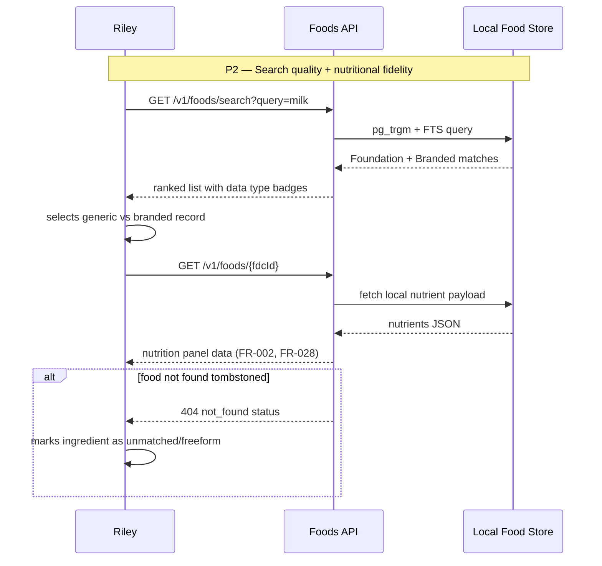
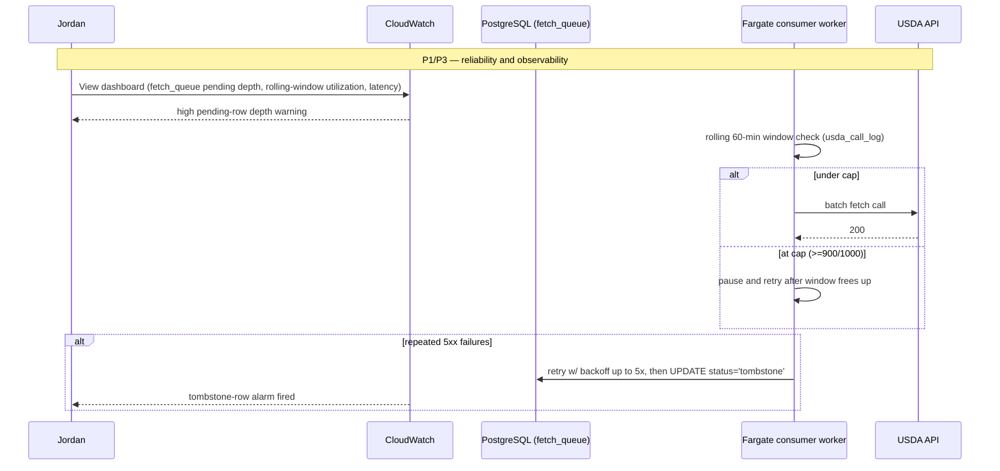

# User Journeys: USDA Food Data Integration

**Branch**: `003-usda-food-data`
**Date**: 2026-05-09
**Status**: Draft
**Source**: [product-spec.md](./product-spec.md), [spec.md](../spec.md)

_Updated 2026-06-20: synced to the clarified design (Postgres-as-queue / rolling-window / demotion)._

---

## Journey Notation

Each journey covers one end-to-end flow per persona. Steps reference FR IDs in brackets. P1/P2/P3 markers correspond to story priority from spec.md.

---

## Persona 1: Recipe Author (Avery) — Journey A: Add Ingredient with Mixed Cache State

**Scenario**: Avery creates a recipe with multiple ingredients. Some foods are already fetched locally; some are unknown and must be queued.

```mermaid
sequenceDiagram
    participant U as Avery (Web/Mobile)
    participant API as Foods API
    participant DB as PostgreSQL (fetch_queue + fetch_requesters)
    participant W as Fargate consumer worker
    participant USDA as USDA API

    Note over U,DB: P1 — Local lookup + pending contract

    U->>API: GET /v1/foods/search?query=chicken
    API->>DB: local fuzzy search only
    DB-->>API: ranked results
    API-->>U: food choices (FR-008, FR-009, FR-010)

    U->>API: GET /v1/foods/170567
    API->>DB: lookup fdcId
    DB-->>API: fetched record
    API-->>U: 200 food payload (FR-001, FR-002)

    U->>API: GET /v1/foods/99999
    API->>DB: lookup miss
    API->>DB: INSERT … ON CONFLICT into fetch_queue + record requester (fetch_requesters, PRIORITY_CAP=1) + pg_notify
    API-->>U: 202 pending (FR-003, FR-011, FR-014)

    loop status polling
      U->>API: GET /v1/foods/99999/status
      API->>DB: read fetch_status
      API-->>U: pending/fetched/not_found
    end

    DB-->>W: LISTEN/NOTIFY wake
    W->>DB: SELECT … ORDER BY distinct-requester demand DESC, first_requested ASC FOR UPDATE SKIP LOCKED
    W->>W: rolling 60-min window check (usda_call_log; pause at 90%/900)
    W->>USDA: GET /v1/food/99999
    USDA-->>W: 200 food record
    W->>DB: upsert fetched + mark row done (cache fill)
```

---

## Persona 2: Nutrition-Conscious Planner (Riley) — Journey B: Disambiguate and Validate Nutrition

**Scenario**: Riley chooses between branded and generic foods, monitors nutrient values, and handles missing/unavailable records without breaking planning.



---

## Persona 3: Operations Engineer (Jordan) — Journey C: Maintain Pipeline Reliability Under Load

**Scenario**: Jordan monitors queue pressure and USDA constraints during a spike in uncached food requests.



---

## Cross-Persona Flows

### Flow X1: Pending → Fetched Transition

1. Client receives `202 pending` (FR-003).
2. Background consumer fetches/upserts (FR-024).
3. Status endpoint transitions to `fetched` (FR-033).

### Flow X2: Not Found Tombstone

1. USDA returns 404 (FR-025).
2. Local record marked `not_found`.
3. Future lookups return 404 immediately without requeue (FR-005).

### Flow X3: Rate-Limit Delay Handling

1. Rolling-window at cap (FR-019..FR-021).
2. Consumer worker pauses processing and resumes when the trailing 60-min window frees up; queue rows remain durable.
3. UI remains accurate through pending status rather than timeout/failure mislabeling.

---

## Journey Coverage Matrix

| Story                                      | Journey A | Journey B | Journey C   | Cross Flows |
| ------------------------------------------ | --------- | --------- | ----------- | ----------- |
| US-001 Cache-hit lookup                    | ✅        | ✅        | —           | —           |
| US-002 Async backfill                      | ✅        | —         | ✅          | X1          |
| US-003 Rate limiting                       | —         | —         | ✅          | X3          |
| US-004 Batch lookup                        | ✅        | —         | ✅          | —           |
| US-005 Queue priority + tombstone recovery | ✅        | —         | ✅          | X2/X3       |
| US-006 Local search                        | ✅        | ✅        | —           | —           |
| US-007 Stale refresh                       | —         | ✅        | ✅          | —           |
| US-008 Polling status                      | ✅        | ✅        | —           | X1/X2       |
| US-009 WebSocket (optional)                | —         | —         | ⚪ Deferred | —           |
| US-010 Observability                       | —         | —         | ✅          | X3          |
