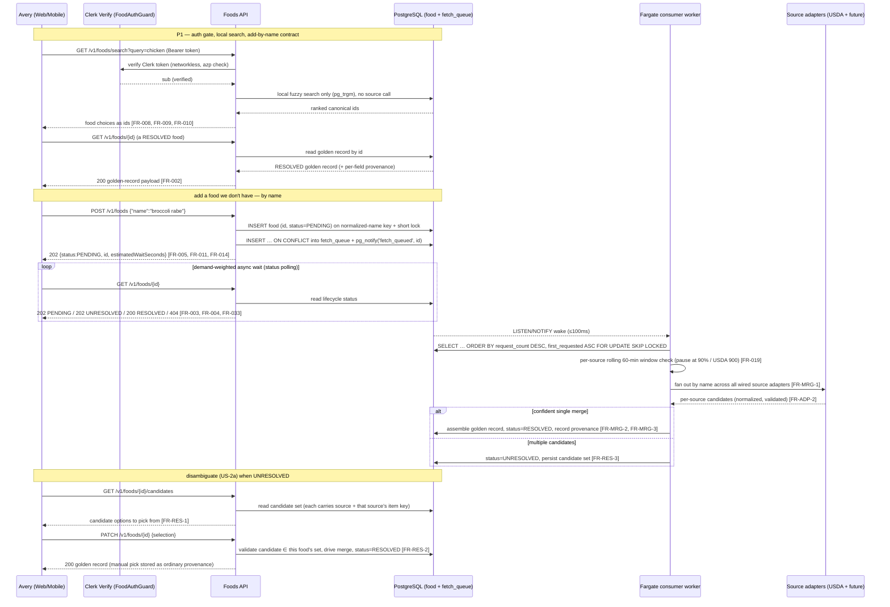
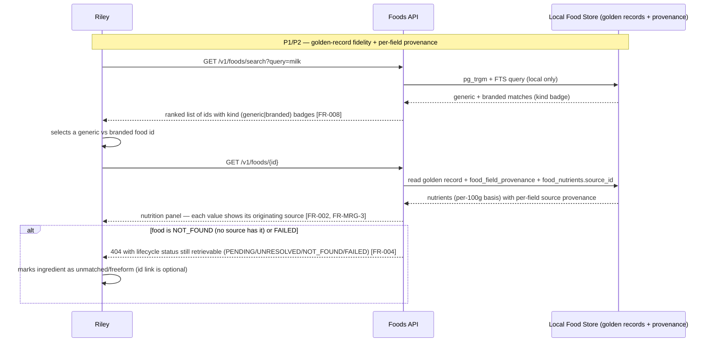

# User Journeys: Source-Agnostic Food Data Integration

**Branch**: `003-usda-food-data`
**Date**: 2026-05-09
**Status**: Draft
**Source**: [product-spec.md](./product-spec.md), [spec.md](../spec.md)

_Updated 2026-06-20: synced to the clarified design (Postgres-as-queue / rolling-window / demotion)._
_Updated 2026-06-22: re-baselined to the source-agnostic model — users add foods **by name** (not by `fdcId`); a food is keyed by an internal `id`; the worker fans out across sources and merges into a golden record; ambiguous adds become `UNRESOLVED` and the user picks a **candidate** to resolve. The old `fdcId` cache-hit/miss lookup framing is removed; `fdcId`/USDA terms now appear only at the USDA adapter boundary._

---

## Journey Notation

Each journey covers one end-to-end flow per persona. Steps reference FR IDs in brackets. P1/P2/P3 markers correspond to story priority from spec.md.

A food's lifecycle status is `PENDING → (UNRESOLVED) → RESOLVED`, with terminal `NOT_FOUND` / `FAILED` tombstones. Every endpoint is behind the auth gate (US-0): a valid Clerk session token (or M2M token) is verified networklessly before any business logic, enqueue, or source call runs [FR-035, FR-036, FR-040].

---

## Persona 1: Recipe Author (Avery) — Journey A: Add Ingredient by Name and Resolve

**Scenario**: Avery creates a recipe. Some ingredients already exist locally as `RESOLVED` foods; one is unknown and must be added **by name**, fanned out across sources, and (because it is ambiguous) disambiguated by Avery picking a candidate.



---

## Persona 2: Nutrition-Conscious Planner (Riley) — Journey B: Trust Provenance and Handle Unavailable Foods

**Scenario**: Riley relies on accurate macros. They read a `RESOLVED` food's golden record, inspect which source supplied each field (per-field provenance), and gracefully handle a food that no source has (`NOT_FOUND`) or that failed to fetch (`FAILED`).



---

## Persona 3: Operations Engineer (Jordan) — Journey C: Keep the Pipeline Within Per-Source Budgets

**Scenario**: Jordan monitors queue pressure and per-source rate budgets during a spike in add-by-name requests, and watches change-driven refresh run in the background without overwriting human decisions.

```mermaid
sequenceDiagram
    participant O as Jordan
    participant CW as CloudWatch
    participant DB as PostgreSQL (fetch_queue + source_call_log)
    participant W as Fargate consumer worker
    participant ADP as Source adapters (USDA + future)

    Note over O,ADP: P1/P2/P3 — reliability, fairness, freshness

    O->>CW: View dashboard (fetch_queue depth, per-source trailing-60-min counts, UNRESOLVED backlog, latency)
    CW-->>O: high pending-row depth warning

    W->>W: per-source rolling 60-min window check (source_call_log) [FR-019, FR-020]
    alt under cap
      W->>ADP: fan out / fetch (USDA adapter may batch ≤20 keys/call = 1 call) [FR-023]
      ADP-->>W: 200 candidates
    else at 90% of a source's cap (USDA ≥900/1000)
      W->>W: pause draining work needing that source until calls age out [FR-019, FR-021]
    end

    Note over W,DB: fairness by demotion (no per-user quota, no 429)
    W->>DB: a food is demoted to back only when ALL its requesters exceed 50 pending; re-promoted when any drops below 50 [FR-043, FR-043a, FR-044]
    W->>DB: near a source ceiling, a flooding sub's NEW enqueues shed with 503 (reads/resolves never shed) [FR-043b]

    alt repeated source 5xx / timeout
      W->>DB: retry w/ exp. backoff up to 5x, then status=FAILED + row status='tombstone' [FR-016, FR-027]
      CW-->>O: tombstone-row alarm fired
    else no source has the item
      W->>DB: status=NOT_FOUND + row status='tombstone' (TTL 30d, no retry) [FR-025]
    end

    Note over W,DB: change-driven refresh (Fargate scheduled task, low-priority/idle — yields to live demand)
    W->>ADP: re-fetch RESOLVED foods' backing items + hash-compare (item_version); budget-bounded, re-enqueued via the ordinary path [FR-032]
    ADP-->>W: only fields whose source item changed upstream
    W->>DB: update only changed fields; manual picks & unchanged values preserved [FR-031]
```

---

## Cross-Persona Flows

### Flow X1: PENDING → RESOLVED Transition (confident merge)

1. Client receives `202 PENDING` + `id` from add-by-name [FR-005].
2. Worker fans out by name, merges into a golden record, sets `status=RESOLVED` [FR-MRG-1, FR-MRG-2].
3. Read/status endpoint transitions to `200` with the full golden record [FR-002, FR-033].

### Flow X1a: PENDING → UNRESOLVED → RESOLVED (user picks a candidate)

1. Fan-out yields multiple candidates that cannot be confidently collapsed → `status=UNRESOLVED` [FR-RES-3].
2. Client fetches `GET /v1/foods/{id}/candidates`; user picks the matching candidate [FR-RES-1].
3. `PATCH /v1/foods/{id}` validates the pick belongs to this food's candidate set, drives the merge, and sets `status=RESOLVED` [FR-RES-2].

### Flow X2: NOT_FOUND / FAILED Tombstone

1. No wired source has the item → `status=NOT_FOUND`, `fetch_queue` row `status='tombstone'` (TTL 30d, no retry) [FR-025].
2. A source fetch errors after the 5-attempt retry budget → `status=FAILED`, row `status='tombstone'` with `last_error` [FR-016, FR-027].
3. Future reads return `404` immediately, with the lifecycle `status` still retrievable so the held `id` is recognized [FR-004]. After the `NOT_FOUND` TTL lapses, a fresh add may re-attempt the fan-out [FR-025].

### Flow X3: Per-Source Rate-Budget Delay Handling

1. A source's trailing-60-min count reaches 90% of its budget (USDA: 900) [FR-019].
2. The consumer pauses draining work needing that source and resumes as earlier calls age out of the window; `fetch_queue` rows remain durable [FR-021].
3. The UI stays accurate via the `PENDING`/`UNRESOLVED` status rather than mislabeling the delay as a timeout/failure [FR-033].

---

## Journey Coverage Matrix

| Story                                           | Journey A | Journey B | Journey C   | Cross Flows |
| ----------------------------------------------- | --------- | --------- | ----------- | ----------- |
| US-0 Auth gate                                  | ✅        | ✅        | ✅          | —           |
| US-1 Single food read (RESOLVED hit)            | ✅        | ✅        | —           | —           |
| US-2 Add food by name (async resolution)        | ✅        | —         | ✅          | X1          |
| US-2a Disambiguate candidates and resolve       | ✅        | —         | —           | X1a         |
| US-3 Per-source rate limiting                   | —         | —         | ✅          | X3          |
| US-4 Bulk ingredient resolution (recipe)        | ✅        | —         | ✅          | —           |
| US-5 Demand-weighted queue + tombstone recovery | ✅        | —         | ✅          | X2/X3       |
| US-6 Local search by name                       | ✅        | ✅        | —           | —           |
| US-7 Change-driven refresh                      | —         | ✅        | ✅          | —           |
| US-8 Resolution status polling                  | ✅        | ✅        | —           | X1/X1a/X2   |
| US-9 WebSocket (optional)                       | —         | —         | ⚪ Deferred | —           |
| US-10 Observability                             | —         | —         | ✅          | X3          |
