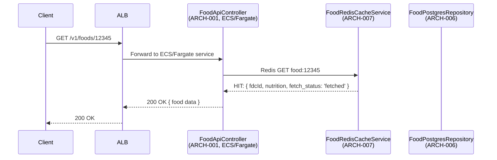
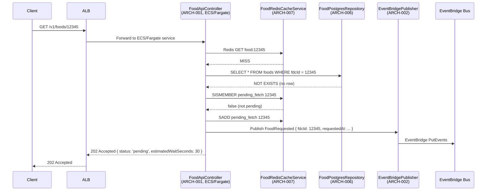
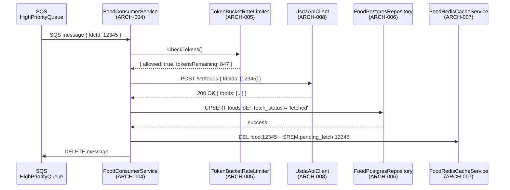
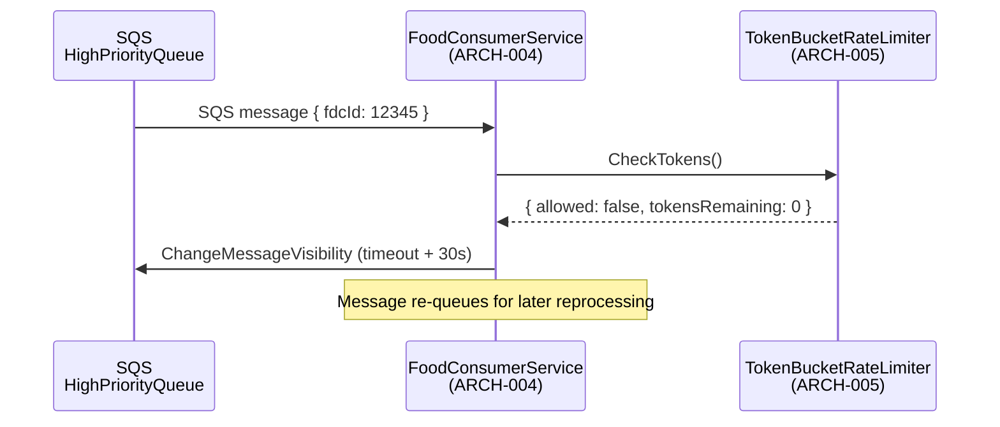
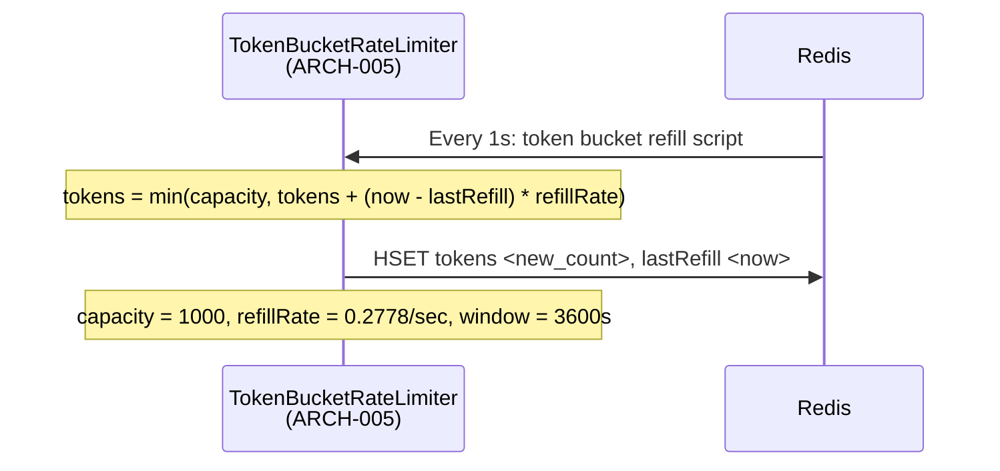
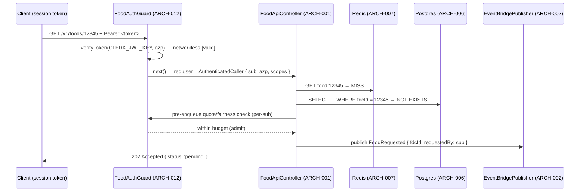

# Architecture Design: USDA Food Data Integration

**Feature Branch**: `003-usda-food-data`
**Created**: 2026-05-09
**Status**: Draft
**Source**: `specs/003-usda-food-data/v-model/system-design.md`

## Overview

The architecture decomposes the USDA food data integration into 12 software modules (ARCH-001 through ARCH-012) mapped to 13 system components. User-facing food lookups are served exclusively from local storage (PostgreSQL + optional Redis) — the USDA API is never called in the request path. Cache misses trigger an event-driven backfill pipeline: the ECS/Fargate NestJS API service → EventBridge → SQS (high/low priority) → Fargate consumer worker → USDA API → PostgreSQL/Redis. A Redis token-bucket rate-limiter caps USDA API usage at 1,000 calls/hour. Every entry point — every HTTP route and the WebSocket `$connect` — is fronted by **ARCH-012 FoodAuthGuard**, which networklessly verifies the Clerk session/M2M token, enforces `azp`, fails closed to `401`, and applies per-`sub` quota/fairness before any fetch is enqueued.

## ID Schema

- **Architecture Module**: `ARCH-NNN` — sequential identifier for each module
- **Parent System Components**: Comma-separated `SYS-NNN` list per module (many-to-many)
- **Cross-Cutting Tag**: `[CROSS-CUTTING; rationale: shared infrastructure supports multiple SYS components]` for infrastructure/utility modules not traceable to a specific SYS
- Example: `ARCH-005 [CROSS-CUTTING; rationale: shared infrastructure supports multiple SYS components]` — infrastructure module (rate limiter) with rationale

## Logical View — Component Breakdown (IEEE 42010 / Kruchten 4+1)

| ARCH ID  | Name                   | Description                                                                                                                                                                                                                                                                                                                                                                                                                                                                                                                                                                                                                                                                                  | Parent System Components                                                                   | Type      |
| -------- | ---------------------- | -------------------------------------------------------------------------------------------------------------------------------------------------------------------------------------------------------------------------------------------------------------------------------------------------------------------------------------------------------------------------------------------------------------------------------------------------------------------------------------------------------------------------------------------------------------------------------------------------------------------------------------------------------------------------------------------- | ------------------------------------------------------------------------------------------ | --------- |
| ARCH-001 | FoodApiController      | NestJS controller in the food read service on ECS/Fargate behind a public ALB (in-process `FoodAuthGuard`/`AuthMiddleware`, ARCH-012). Validates fdcId, queries local store (Redis then PostgreSQL), returns 200/202/404/400. Emits FoodRequested events to EventBridge on cache miss. Never calls USDA API directly.                                                                                                                                                                                                                                                                                                                                                                        | SYS-001                                                                                    | Component |
| ARCH-002 | EventBridgePublisher   | Publishes FoodRequested and FoodBatchRequested events to EventBridge default bus. Performs input validation on event payload before publish. Routes to correct queue target based on event type.                                                                                                                                                                                                                                                                                                                                                                                                                                                                                             | SYS-002                                                                                    | Component |
| ARCH-003 | SqsQueueRouter         | Internal router module within EventBridge rules. Routes high-priority individual lookups to HighPriorityQueue and batch/periodic events to LowPriorityQueue. Handles DLQ configuration for each queue.                                                                                                                                                                                                                                                                                                                                                                                                                                                                                       | SYS-002, SYS-003, SYS-004                                                                  | Component |
| ARCH-004 | FoodConsumerService    | Fargate consumer worker consuming from both SQS queues. Calls USDA API via token-bucket rate limiter, writes results to PostgreSQL, invalidates Redis cache, publishes FoodDataReceived events. Handles retries with exponential backoff.                                                                                                                                                                                                                                                                                                                                                                                                                                                    | SYS-005                                                                                    | Component |
| ARCH-005 | TokenBucketRateLimiter | Redis Lua script implementing atomic token-bucket. Allows exactly 1,000 USDA API calls per hour, atomically checking and decrementing tokens on every Consumer Lambda invocation. Refills tokens continuously (approx 0.2778 per second).                                                                                                                                                                                                                                                                                                                                                                                                                                                    | SYS-006 [CROSS-CUTTING; rationale: shared infrastructure supports multiple SYS components] | Utility   |
| ARCH-006 | FoodPostgresRepository | Drizzle ORM repository for foods table. Handles all PostgreSQL operations: lookup by fdcId, upsert on fetch, status updates, search queries with full-text index. Manages fetch_status field lifecycle.                                                                                                                                                                                                                                                                                                                                                                                                                                                                                      | SYS-007                                                                                    | Component |
| ARCH-007 | FoodRedisCacheService  | Redis client for hot cache (food:\* keys, TTL 24h) and pending-fetch deduplication (pending_fetch set). Provides cache-through and cache-invalidate operations. Falls through to PostgreSQL on Redis miss.                                                                                                                                                                                                                                                                                                                                                                                                                                                                                   | SYS-008                                                                                    | Component |
| ARCH-008 | UsdaApiClient          | HTTP client for USDA FoodData Central API. Handles authentication (API key from Secrets Manager via env var), batch requests (up to 20 IDs per call), response parsing, and error classification.                                                                                                                                                                                                                                                                                                                                                                                                                                                                                            | SYS-009                                                                                    | Adapter   |
| ARCH-009 | WebSocketNotifier      | EventBridge target for FoodDataReceived events. Lambda that pushes real-time notifications to connected clients via API Gateway WebSocket API. Optional — launch deferred (US-9).                                                                                                                                                                                                                                                                                                                                                                                                                                                                                                            | SYS-010 [CROSS-CUTTING; rationale: shared infrastructure supports multiple SYS components] | Component |
| ARCH-010 | SecretManager          | AWS Secrets Manager integration. Retrieves and caches USDA API key. Handles rotation triggers. Inject as Lambda environment variable — never exposed in logs or responses.                                                                                                                                                                                                                                                                                                                                                                                                                                                                                                                   | SYS-011 [CROSS-CUTTING; rationale: shared infrastructure supports multiple SYS components] | Utility   |
| ARCH-011 | MonitoringLogger       | CloudWatch logging + X-Ray tracing for the ECS/Fargate API service and the Fargate consumer worker. Structured JSON logs with requestId correlation. Metrics: latency histogram, error rate, queue depth, token bucket utilization.                                                                                                                                                                                                                                                                                                                                                                                                                                                          | SYS-012 [CROSS-CUTTING; rationale: shared infrastructure supports multiple SYS components] | Utility   |
| ARCH-012 | FoodAuthGuard          | Auth subsystem fronting every food-data entry point (all HTTP routes + WebSocket `$connect`). Networklessly verifies the Clerk session/M2M token (signature/`exp`/`nbf`/`azp` via public `CLERK_JWT_KEY`), fails closed to `401`, derives `AuthenticatedCaller` solely from the verified `sub` (no client-suppliable identity header), gates operational scopes from `public_metadata` (`403`), and enforces per-`sub` enqueue quota, distinct-requester demand, batch cap, and queue backpressure/circuit-breaker before any fetch is enqueued. Runs in-process as NestJS `AuthMiddleware` on ECS/Fargate (ALB); the WebSocket `$connect` authorizer is the only Lambda-authorizer surface. | SYS-013                                                                                    | Component |

## Process View — Dynamic Behavior (Kruchten 4+1)

### Interaction 0: Auth Edge — FoodAuthGuard fronting every entry point

`ARCH-012 FoodAuthGuard` runs as in-process NestJS `AuthMiddleware` on the ECS/Fargate container behind the ALB. It executes **before** every route handler (ARCH-001) and gates the WebSocket `$connect` (ARCH-009, the only Lambda-authorizer surface). It fails closed: any verification error yields `401` and the request never reaches business logic, the quota check, or an enqueue. Authenticated requests then pass through the quota/fairness gate (per-`sub` enqueue quota → `429`; batch cap → `400`; queue backpressure / open circuit → `503`) before any `INSERT INTO fetch_queue`.

```mermaid
sequenceDiagram
    participant C as Client / Service (M2M)
    participant ALB as ALB
    participant AG as FoodAuthGuard<br/>(ARCH-012 — AuthMiddleware)
    participant A as FoodApiController<br/>(ARCH-001)
    participant EB as EventBridgePublisher<br/>(ARCH-002)

    C->>ALB: HTTP + Authorization: Bearer <Clerk token>
    ALB->>AG: forward request
    AG->>AG: verifyToken(CLERK_JWT_KEY, azp) — networkless
    alt invalid / expired / wrong azp / verify error
        AG-->>C: 401 Unauthorized (fail closed; no enqueue)
    else operational endpoint, scope missing
        AG-->>C: 403 Forbidden (public_metadata scope)
    else valid — req.user = AuthenticatedCaller { sub, azp, scopes }
        AG->>A: next() — handler runs
        Note over AG,A: status precedence 401 → 403 → 400 → 404/202/200
        A->>AG: pre-enqueue quota/fairness check (per-sub)
        alt per-sub quota exceeded
            AG-->>C: 429 Too Many Requests (no enqueue)
        else queue depth exceeded / circuit open
            AG-->>C: 503 Service Unavailable (fail closed)
        else within budget
            A->>EB: publish FoodRequested (enqueue)
            A-->>C: 202 Accepted
        end
    end
```

### Interaction 1: Food Lookup (Cache Hit)



### Interaction 2: Food Lookup (Cache Miss → Async Backfill)



### Interaction 3: Consumer Lambda Processing



### Interaction 4: Rate Limiter Block



### Interaction 5: Token Bucket Refill



## Interface View (IEEE 1016 §5.3)

### ARCH-001 (FoodApiController)

| Operation                         | Input                 | Output                                                               | Errors                    |
| --------------------------------- | --------------------- | -------------------------------------------------------------------- | ------------------------- |
| `GET /v1/foods/{fdcId}`           | fdcId (path, numeric) | 200: FoodData, 202: PendingData, 404: NotFound, 400: ValidationError | 400: invalid fdcId format |
| `GET /v1/foods/search?query=`     | query (path, string)  | 200: FoodSearchResult[]                                              | 400: query too short      |
| `GET /v1/foods/{fdcId}/status`    | fdcId (path)          | 200: { status, foodData? }                                           | 400, 404                  |
| `GET /v1/foods/{fdcId}/nutrition` | fdcId (path)          | 200: NutritionData                                                   | 400, 404, 503             |

### ARCH-002 (EventBridgePublisher)

| Operation                           | Input                                       | Output                | Errors                 |
| ----------------------------------- | ------------------------------------------- | --------------------- | ---------------------- |
| `publishFoodRequested(fdcId)`       | `{ fdcId: number, requestedAt: string }`    | `{ eventId: string }` | EventBridge throttling |
| `publishFoodBatchRequested(fdcIds)` | `{ fdcIds: number[], requestedAt: string }` | `{ eventId: string }` | EventBridge throttling |

### ARCH-003 (SqsQueueRouter)

| Operation                           | Input       | Output             | Errors            |
| ----------------------------------- | ----------- | ------------------ | ----------------- |
| `routeToHighPriorityQueue(message)` | SQS message | Delivery confirmed | Queue unavailable |
| `routeToLowPriorityQueue(message)`  | SQS message | Delivery confirmed | Queue unavailable |

### ARCH-004 (FoodConsumerService)

| Operation                         | Input               | Output               | Errors             |
| --------------------------------- | ------------------- | -------------------- | ------------------ |
| `processHighPriorityMessage(msg)` | SQS message         | DELETE on success    | Retry with backoff |
| `processLowPriorityMessage(msg)`  | SQS message         | DELETE on success    | Retry with backoff |
| `fetchFromUsda(fdcIds)`           | `number[]` (max 20) | `USDAFoodResponse[]` | USDA API errors    |

### ARCH-005 (TokenBucketRateLimiter)

| Operation       | Input | Output                                          | Errors            |
| --------------- | ----- | ----------------------------------------------- | ----------------- |
| `checkTokens()` | none  | `{ allowed: boolean, tokensRemaining: number }` | Redis unavailable |
| `getWaitTime()` | none  | `number` (seconds until next token)             | Redis unavailable |

### ARCH-006 (FoodPostgresRepository)

| Operation                          | Input            | Output                 | Errors           |
| ---------------------------------- | ---------------- | ---------------------- | ---------------- |
| `findByFdcId(fdcId)`               | `number`         | `FoodData \| null`     | Connection error |
| `upsertFood(food)`                 | `FoodData`       | `{ success: boolean }` | Connection error |
| `updateFetchStatus(fdcId, status)` | `number, string` | `{ success: boolean }` | Connection error |
| `searchFoods(query)`               | `string`         | `FoodData[]`           | Connection error |

### ARCH-007 (FoodRedisCacheService)

| Operation               | Input                      | Output             | Errors            |
| ----------------------- | -------------------------- | ------------------ | ----------------- |
| `get(fdcId)`            | `number`                   | `FoodData \| null` | Redis unavailable |
| `set(fdcId, data, ttl)` | `number, FoodData, number` | `void`             | Redis unavailable |
| `invalidate(fdcId)`     | `number`                   | `void`             | Redis unavailable |
| `isPending(fdcId)`      | `number`                   | `boolean`          | Redis unavailable |
| `markPending(fdcId)`    | `number`                   | `void`             | Redis unavailable |
| `clearPending(fdcId)`   | `number`                   | `void`             | Redis unavailable |

### ARCH-008 (UsdaApiClient)

| Operation            | Input               | Output               | Errors                                                 |
| -------------------- | ------------------- | -------------------- | ------------------------------------------------------ |
| `fetchFoods(fdcIds)` | `number[]` (max 20) | `USDAFoodResponse[]` | 401: invalid key, 429: rate limited, 500: server error |

### ARCH-009 (WebSocketNotifier)

| Operation                    | Input                                   | Output                    | Errors                                       |
| ---------------------------- | --------------------------------------- | ------------------------- | -------------------------------------------- |
| `notifyClients(fdcId, data)` | `{ fdcId: number, foodData: FoodData }` | `number` clients notified | WebSocket connection error (fire-and-forget) |

### ARCH-010 (SecretManager)

| Operation         | Input | Output                 | Errors           |
| ----------------- | ----- | ---------------------- | ---------------- |
| `getUsdaApiKey()` | none  | `string`               | Secret not found |
| `rotateKey()`     | none  | `{ success: boolean }` | Rotation failed  |

### ARCH-011 (MonitoringLogger)

| Operation                            | Input               | Output            | Errors           |
| ------------------------------------ | ------------------- | ----------------- | ---------------- |
| `logRequest(reqId, event, duration)` | structured JSON     | CloudWatch log    | Logging disabled |
| `incrementMetric(name, value)`       | metric name + value | CloudWatch metric | Metrics disabled |
| `startTrace(reqId)`                  | `string`            | `Segment`         | Tracing disabled |

### ARCH-012 (FoodAuthGuard)

| Operation                      | Input                                        | Output                                               | Errors                                                                   |
| ------------------------------ | -------------------------------------------- | ---------------------------------------------------- | ------------------------------------------------------------------------ |
| `verify(req)` (middleware)     | `Authorization: Bearer <Clerk token>`        | `req.user: AuthenticatedCaller { sub, azp, scopes }` | 401: missing/invalid/expired token, `azp` mismatch, or verify exception  |
| `requireScope(scope)`          | required operational scope + `req.user`      | pass-through to handler                              | 403: scope absent from verified `public_metadata`                        |
| `enforceQuota(sub, count)`     | `sub`, accepted batch id count               | `{ allowed: boolean, retryAfter?: number }`          | 429: per-`sub` enqueue quota exceeded (no enqueue)                       |
| `checkBackpressure()`          | none                                         | `{ admit: boolean }`                                 | 503: `fetch_queue` depth exceeded or USDA circuit breaker open           |
| `authorizeConnect(event)` (WS) | `$connect` token (query param / subprotocol) | allow + persist requester `sub`→`fdcId` set          | 403: `$connect` rejected (pinned status per API GW WebSocket authorizer) |

## Data Flow View (IEEE 1016 §5.4)

### Data Flow 1: Food Lookup → Cache Hit

```
Client Request
    ↓ (ALB → ECS/Fargate NestJS service)
ARCH-001 FoodApiController
    ↓ Redis GET food:{fdcId}
ARCH-007 FoodRedisCacheService [HIT]
    ↓ return food data
ARCH-001 → 200 OK
    ↓
Client Response
```

### Data Flow 2: Food Lookup → Cache Miss → DB Miss → Async Backfill

```
Client Request
    ↓
ARCH-001 (validates fdcId format)
    ↓ Redis MISS
ARCH-007
    ↓ PostgreSQL MISS (no row)
ARCH-006
    ↓ Redis not pending
ARCH-007 SADD pending_fetch
    ↓ EventBridge publish
ARCH-002 EventBridgePublisher → EventBridge Bus
    ↓ route to HighPriorityQueue
ARCH-003 SqsQueueRouter → SQS HighPriorityQueue
    ↓
202 Accepted to Client (polls /status)
```

### Data Flow 3: Consumer Lambda → USDA → PostgreSQL

```
SQS HighPriorityQueue message
    ↓
ARCH-004 FoodConsumerService
    ↓ check rate limit
ARCH-005 TokenBucketRateLimiter [allowed]
    ↓ HTTP POST /v1/foods
ARCH-008 UsdaApiClient → USDA API
    ↓ parse response
ARCH-004
    ↓ UPSERT
ARCH-006 FoodPostgresRepository → PostgreSQL
    ↓ invalidate cache + clear pending
ARCH-007 FoodRedisCacheService
    ↓ publish event
ARCH-002 → EventBridge FoodDataReceived
    ↓
SQS DELETE message
```

### Data Flow 4: Rate Limited (tokens exhausted)

```
SQS message
    ↓
ARCH-004
    ↓ TokenBucket check
ARCH-005 [tokens = 0, not allowed]
    ↓ ChangeMessageVisibility (30s backoff)
SQS queue → re-visibility after backoff
    ↓ (later reprocess when tokens refill)
ARCH-004 resumes
```

## Cross-Cutting Architecture Notes

- **Token bucket**: All USDA API calls from ARCH-004 MUST go through ARCH-005. No direct USDA API calls allowed.
- **No USDA in request path**: ARCH-001 strictly reads from ARCH-007 or ARCH-006. It never calls ARCH-008.
- **Deduplication**: ARCH-007's `pending_fetch` Redis set prevents duplicate SQS messages for the same food under concurrent load.
- **Secret rotation**: ARCH-010 handles rotation; key injected as env var to ARCH-004 and ARCH-008 at cold start.
- **Optional WebSocket**: ARCH-009 is launch-deferred. EventBridge rule for FoodDataReceived targets nothing until US-9 is implemented.
- **Auth fronts everything**: ARCH-012 FoodAuthGuard executes before ARCH-001 on every HTTP route and gates ARCH-009 `$connect`. No request reaches business logic, the quota gate, or `INSERT INTO fetch_queue` without a verified token. It runs in-process as NestJS `AuthMiddleware` on ECS/Fargate (ALB-fronted), mirroring `packages/services/identity` `AuthMiddleware`/`ClerkAuthService`; the WebSocket `$connect` authorizer is the **only** Lambda-authorizer surface. Identity is derived solely from the verified `sub` — client-suppliable identity headers (`x-authorizer-context`, `x-user-id`) are ignored (mirrors PR #39). `CLERK_JWT_KEY` and `CLERK_AUTHORIZED_PARTIES` are non-secret config; the USDA API key (ARCH-010) remains the only secret.

## Physical View — Deployment Topology

The feature deploys within the Commise AWS topology. The HTTP read API (ARCH-001) is **not** serverless: it is a NestJS service running on **ECS/Fargate behind a public ALB**, mirroring `packages/services/identity`. The ALB is the sole HTTP entry point; `ARCH-012 FoodAuthGuard` runs in-process as NestJS `AuthMiddleware` on that service (no API Gateway / Lambda authorizer on the HTTP path). The async backfill consumer (ARCH-004) runs as a **Fargate worker** (Postgres-as-queue polling). Supporting infrastructure — EventBridge, SQS, RDS PostgreSQL (ARCH-006), ElastiCache Redis (ARCH-005/ARCH-007), Secrets Manager (ARCH-010), and CloudWatch/X-Ray (ARCH-011) — deploys to the configured AWS account/region. The **only** Lambda + API Gateway surface is the deferred WebSocket notifier (ARCH-009) on API Gateway WebSocket API with a `$connect` Lambda authorizer (US-9). Client-facing web/mobile modules run in their respective application packages.

| ARCH Module                     | Runtime / AWS Resource                                                                                                     |
| ------------------------------- | -------------------------------------------------------------------------------------------------------------------------- |
| ARCH-001 FoodApiController      | ECS/Fargate service (NestJS) behind a public ALB                                                                           |
| ARCH-002 EventBridgePublisher   | EventBridge default bus (invoked in-process by the API service)                                                            |
| ARCH-003 SqsQueueRouter         | EventBridge rules → SQS high/low priority queues (+ DLQ)                                                                   |
| ARCH-004 FoodConsumerService    | Fargate consumer worker (Postgres-as-queue polling)                                                                        |
| ARCH-005 TokenBucketRateLimiter | ElastiCache Redis (Lua atomic script)                                                                                      |
| ARCH-006 FoodPostgresRepository | RDS PostgreSQL                                                                                                             |
| ARCH-007 FoodRedisCacheService  | ElastiCache Redis                                                                                                          |
| ARCH-008 UsdaApiClient          | In-process HTTP client within the Fargate consumer worker                                                                  |
| ARCH-009 WebSocketNotifier      | Deferred (US-9): API Gateway WebSocket API + Lambda; `$connect` Lambda authorizer                                          |
| ARCH-010 SecretManager          | AWS Secrets Manager (USDA API key)                                                                                         |
| ARCH-011 MonitoringLogger       | CloudWatch logs/metrics/alarms + X-Ray                                                                                     |
| ARCH-012 FoodAuthGuard          | In-process NestJS `AuthMiddleware` on the ECS/Fargate API service; `$connect` Lambda authorizer for the deferred WebSocket |

## Development View — Source Organization

Implementation modules are organized by platform and service boundary: web code under Next.js application packages, mobile code under Expo packages, shared contracts under shared TypeScript packages, and infrastructure under CDK/IaC packages. The food read API (ARCH-001, ARCH-002, ARCH-006, ARCH-007, ARCH-012) lives in a **NestJS service package** (modeled on `packages/services/identity`) deployed to ECS/Fargate; its `FoodAuthGuard`/`AuthMiddleware` reuses the identity service's `ClerkAuthService` verify logic via a shared `@kitchensink/*` package. The Fargate consumer worker (ARCH-004, ARCH-005, ARCH-008) is a separate deployment unit within (or alongside) that service package. The deferred WebSocket notifier (ARCH-009) is the only Lambda deployment unit. This view constrains ownership, build boundaries, and deployment units for every ARCH-NNN module listed above.

## Scenarios — Architecture Validation (Kruchten "+1")

Primary scenarios validate the 4+1 architecture: successful request flow through user-facing entrypoints, dependency failure propagation through process boundaries, data persistence and retrieval through storage boundaries, and deployment/change isolation through development-view package ownership. Each scenario traces back to the SYS coverage listed on ARCH rows.

The two scenarios below are concrete and **load-bearing**: they exercise **ARCH-012 FoodAuthGuard** end-to-end so the other four views (Logical, Process, Development, Physical) are shown composing around a single thread of execution rather than being described in isolation. They are the canonical "+1" scenarios for the auth edge mandated by FR-053.

### Scenario A — Authenticated user, cache miss → verify → quota gate → enqueue

A web user (interactive Clerk **session token**) requests a food that is not cached and not in PostgreSQL.

| 4+1 View        | What this scenario exercises                                                                                                                                                                                                                                                                                                                                   |
| --------------- | -------------------------------------------------------------------------------------------------------------------------------------------------------------------------------------------------------------------------------------------------------------------------------------------------------------------------------------------------------------- |
| **Logical**     | ARCH-012 (FoodAuthGuard) → ARCH-001 (FoodApiController) → ARCH-007 (Redis) → ARCH-006 (Postgres) → ARCH-002 (EventBridgePublisher) → ARCH-003 (SqsQueueRouter). ARCH-012 derives `AuthenticatedCaller { sub, azp, scopes }` solely from the verified token.                                                                                                    |
| **Process**     | Interaction 0 (Auth Edge) executes first and passes (valid token, read scope present), then composes with Interaction 2 (Cache Miss → Async Backfill). Status precedence holds: `401 → 403 → 400 → 404/202/200`. The per-`sub` quota check runs **after** auth, **before** the EventBridge publish; within budget here, so the request reaches `202 Accepted`. |
| **Development** | The thread crosses one build boundary only on the synchronous edge: the NestJS service package (ARCH-001/002/006/007/012), whose `FoodAuthGuard`/`AuthMiddleware` reuses the identity service's `ClerkAuthService` verify logic via the shared `@kitchensink/*` package.                                                                                       |
| **Physical**    | ALB → ECS/Fargate NestJS service (in-process `AuthMiddleware`, no Lambda authorizer) → EventBridge → SQS. No edge auth hop; verification is networkless against the non-secret `CLERK_JWT_KEY`.                                                                                                                                                                |



### Scenario B — Unauthenticated request → 401 before any work

The same request arrives with a missing, malformed, expired, or wrong-`azp` token. ARCH-012 fails closed and **no** other module is reached.

| 4+1 View        | What this scenario exercises                                                                                                                                                                           |
| --------------- | ------------------------------------------------------------------------------------------------------------------------------------------------------------------------------------------------------ |
| **Logical**     | Only ARCH-012 participates. ARCH-001, ARCH-002/003 (enqueue path), ARCH-006/007 (store), and ARCH-008 (USDA) are never invoked — the auth edge short-circuits the module graph.                        |
| **Process**     | Interaction 0 takes the `else` branch and returns `401` before `next()`; no quota check, no `INSERT INTO fetch_queue`, no USDA consumption. Validates US-0 ("no unauthenticated path may drive USDA"). |
| **Development** | Demonstrates that the auth boundary lives entirely inside the NestJS service package's shared-`ClerkAuthService` dependency — no other build unit is on the rejection path.                            |
| **Physical**    | The reject occurs in-process on ECS/Fargate (no IdP round trip, no Lambda invoke); on the deferred WebSocket surface the equivalent reject is the `$connect` Lambda authorizer's pinned `403`.         |


These two scenarios together cover ARCH-012's accept and fail-closed branches and show how the Logical, Process, Development, and Physical views compose around the auth edge required by FR-053 (and the `401`/`403`/`429`/`503` outcomes of FR-035/FR-039/FR-043/FR-046).
