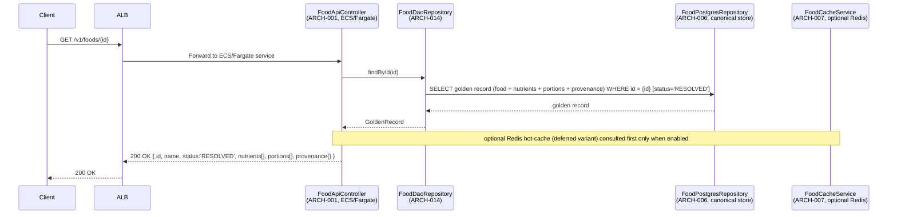
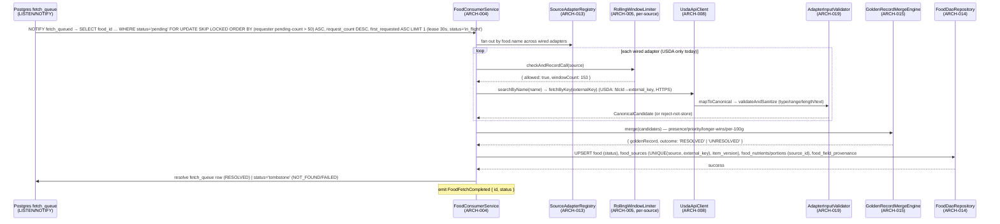
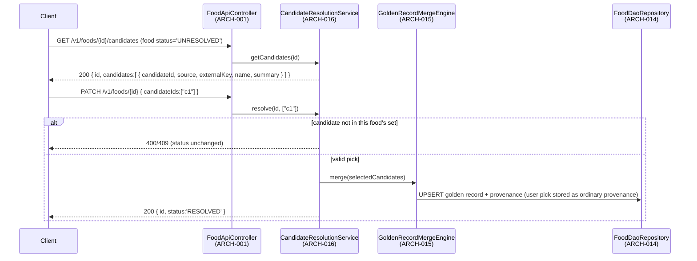
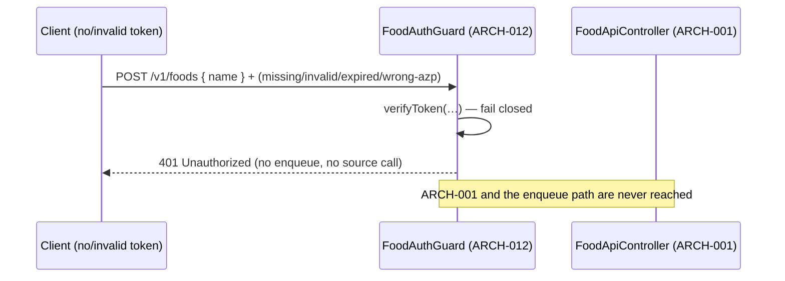

# Architecture Design: Source-Agnostic Food Data Integration

**Feature Branch**: `003-usda-food-data`
**Created**: 2026-05-09
**Status**: Draft — **re-baselined 2026-06-22 to the source-agnostic food data model**
**Source**: `specs/003-usda-food-data/v-model/system-design.md`

> **Re-baseline note (2026-06-22).** This artifact (V-Model Layer 3, traces to `system-design.md`
> SYS-\* ids) was regenerated to match the **source-agnostic food data redesign**. A food is keyed by an
> internal `id`; **USDA is one pluggable source adapter**; foods are assembled into a **cross-source
> golden record** with per-field provenance; users add foods **by name** through a `PENDING →
(UNRESOLVED) → RESOLVED` lifecycle. All `fdcId` / `fetch_status` / denormalized-nutrient design is
> removed from the canonical view and **confined to the USDA-adapter boundary** (ARCH-008 / ARCH-013;
> `fdcId → external_key` inbound). **Preserved (re-keyed) ARCH ids** — ARCH-001..ARCH-012 survive as the
> same modules, re-keyed `fdcId → id` and generalized USDA-only → per-source; module-design's `ARCH →
MOD` trace (MOD-001..MOD-014) is unaffected, and ARCH-012's `admitEnqueue`/`isDemoted` op names are
> kept so MOD-013 (`DemotionAndFairness`) still resolves. **New ARCH ids** — ARCH-013..ARCH-019 cover the
> new capabilities (source-adapter registry/interface, golden-record merge engine, candidate/resolve
> service, provenance store, DAO/repository layer, change-driven refresh, adapter input validation/HTTPS).
> No existing ARCH id was renumbered.
>
> **Stabilization addendum (2026-06-27).** Completion event = **`FoodFetchCompleted`** (was
> `FoodDataReceived`). ARCH-006 is now a **13-table** schema (adds **`food_candidates`** backing
> `UNRESOLVED`) with structural same-food provenance (`UNIQUE(food_id, id)` + composite `(food_id,
source_id)` FKs, `ON DELETE NO ACTION`); ARCH-003 gains the **`leased_at`** lease column + reaper.
> ARCH-004/ARCH-015 decide the outcome by **survivor count after normalized-name exact match** (REQ-050a)
> and honour the **legal lifecycle transition set** (REQ-028a); ARCH-016's candidate set has a 30-day TTL
> (REQ-025a). ARCH-018 runs as a **Fargate scheduled task** (not a VPC Lambda) re-enqueuing via the
> ordinary `enqueue` path — no `enqueueLowPriority`/tier. Demotion is drain-time live compute (no stored
> tier; a food is demoted only when **all** its requesters exceed the threshold) plus near-ceiling
> flood-shed `503`. Cache-hit/`429`-quota framing is purged from the read/demand paths (cache vocabulary
> remains only for the deferred Redis variant, ARCH-007); the forgeable `x-debug-sub` identity path is
> removed (ARCH-012).

## Overview

The architecture decomposes the source-agnostic food data integration into **19 software modules**
(ARCH-001 through ARCH-019) mapped to 20 system components (SYS-001..SYS-020). User-facing food lookups are
served exclusively from the local store (PostgreSQL canonical store; Redis is a deferred variant) — **no
external source is ever called in the request path**. A food is keyed by an internal `id` created up front
by an **add-by-name** request, deduped on a normalized-name key under a short advisory lock (ARCH-014, the
DAO layer). The add records distinct-requester demand (`fetch_requesters`, `ON CONFLICT DO NOTHING`),
enqueues `INSERT … ON CONFLICT (food_id)` into the Postgres `fetch_queue` (`request_count` = capped
distinct-`sub` count, PRIORITY_CAP=1), and `pg_notify`s the **Fargate fan-out/merge worker** (ARCH-004,
single instance via advisory lock). The worker drains in demand-weighted order with dynamic >50-pending
demotion, then **fans out across every wired source adapter** (ARCH-013) by name — each call governed by a
**per-source** rolling-60-minute-window limiter (ARCH-005) — validates each candidate at the adapter
boundary (ARCH-019, HTTPS + sanitize, reject-not-store), pre-merges, and assembles a **golden record**
(ARCH-015) with per-field provenance (ARCH-017), setting `food.status` to
`RESOLVED`/`UNRESOLVED`/`NOT_FOUND`/`FAILED`. Multiple non-collapsible candidates surface as `UNRESOLVED`
for a human pick via the candidate/resolve service (ARCH-016). The `fetch_queue` status enum is
`pending | in_flight | tombstone` (a resolved row is cleared; tombstones are the audit trail). EventBridge
carries only scheduled producers (change-driven refresh, ARCH-018) and the `FoodFetchCompleted` completion
event — never the demand-path enqueue. Every entry point — every HTTP route and the WebSocket `$connect`
— is fronted by **ARCH-012 FoodAuthGuard**, which networklessly verifies the Clerk session/M2M token,
enforces `azp`, fails closed to `401`, and applies per-`sub` demotion fairness (no `429`) at enqueue.
**`fdcId`/USDA terms exist only inside ARCH-008/ARCH-013.**

## ID Schema

- **Architecture Module**: `ARCH-NNN` — sequential identifier for each module
- **Parent System Components**: Comma-separated `SYS-NNN` list per module (many-to-many)
- **Cross-Cutting Tag**: `[CROSS-CUTTING; rationale: …]` for infrastructure/utility modules not traceable to a single SYS
- **Re-baseline (2026-06-22):** ARCH-001..ARCH-012 preserved (re-keyed); ARCH-013..ARCH-019 new.

## Logical View — Component Breakdown (IEEE 42010 / Kruchten 4+1)

| ARCH ID  | Name                       | Description                                                                                                                                                                                                                                                                                                                                                                                                                                                                                                                                                                                                                                                                                                                                                                                                                                                                                                                                                                                                                                                                                                                                                                                                                                                                                                                                                                                                                                                                                                                                                                                                                                                                                                                                                                                      | Parent System Components                                                                                                 | Type      |
| -------- | -------------------------- | ------------------------------------------------------------------------------------------------------------------------------------------------------------------------------------------------------------------------------------------------------------------------------------------------------------------------------------------------------------------------------------------------------------------------------------------------------------------------------------------------------------------------------------------------------------------------------------------------------------------------------------------------------------------------------------------------------------------------------------------------------------------------------------------------------------------------------------------------------------------------------------------------------------------------------------------------------------------------------------------------------------------------------------------------------------------------------------------------------------------------------------------------------------------------------------------------------------------------------------------------------------------------------------------------------------------------------------------------------------------------------------------------------------------------------------------------------------------------------------------------------------------------------------------------------------------------------------------------------------------------------------------------------------------------------------------------------------------------------------------------------------------------------------------------ | ------------------------------------------------------------------------------------------------------------------------ | --------- | --- | --- | --------------------------------------------------------------------------------------------------------------------------------------------------------------------------------------------------------------------------------------------------------------------------------------------------------------------------------------------------------------------------------------------------------------------------------------------------------------------------------------------------------------------------------------------------------------------------------------------------- | ------- | --------- |
| ARCH-001 | FoodApiController          | NestJS controller in the food read service on ECS/Fargate behind the shared public ALB (in-process `FoodAuthGuard`/`AuthMiddleware`, ARCH-012). Validates the `id` path param is a well-formed ULID and rejects empty names (`400`). Reads the golden record via the DAO layer (ARCH-014) from the canonical store (ARCH-006; optional Redis hot-cache only when the deferred variant is enabled), returns `200` only on `RESOLVED`, `202` on `PENDING`/`UNRESOLVED`, `404` on `NOT_FOUND`/`FAILED`/no row (status retrievable). On an add-by-name miss (no row for the normalized name) it creates the row + `id` and enqueues via `INSERT … ON CONFLICT (food_id)` + `pg_notify` (not EventBridge); an add of an already-`RESOLVED`/`UNRESOLVED`/in-flight food returns its current status and does **not** re-enqueue (avoids needless re-fetch of the scarce budget), while a terminal row past its TTL is reactivated with its `tombstone` queue row revived to `pending` (DSN-1). Exposes `/candidates` + `PATCH` (delegates to ARCH-016; `PATCH`-resolve is `UNRESOLVED`-only + idempotent, REQ-028a) and `/search` (incl. barcode/`external_key`). Batch returns per-item partial results. Never calls a source directly; no `fdcId` in any DTO/path.                                                                                                                                                                                                                                                                                                                                                                                                                                                                                                                                    | SYS-001                                                                                                                  | Component |
| ARCH-002 | EnqueueEmitter             | Publishes **scheduled-producer** events (change-driven refresh, `IngestionScheduled`), the `FoodFetchCompleted` completion event, and `FetchFailed` (on a `FAILED` tombstone **only**, not `NOT_FOUND` — DSN-9) to the EventBridge default bus, with input validation on the payload. The in-process `FoodRequested`/`FoodBatchRequested` enqueue ops (`publishFoodRequested`/`publishFoodBatchRequested`) perform the direct `fetch_queue` `INSERT … ON CONFLICT (food_id)` + `pg_notify` — **not** EventBridge; `publishFoodReactivated` revives a terminal food's `tombstone` queue row to `pending` on TTL-expired reactivation (DSN-1). Payloads carry the food `id`, never `fdcId`.                                                                                                                                                                                                                                                                                                                                                                                                                                                                                                                                                                                                                                                                                                                                                                                                                                                                                                                                                                                                                                                                                                        | SYS-002                                                                                                                  | Component |
| ARCH-003 | FetchQueueRouter           | Postgres-as-queue access module for `fetch_queue` (keyed on `food_id`) + companion `fetch_requesters`. Demand-path enqueue is **distinct-requester** demand (FR-044): upsert `(food_id, sub)` into `fetch_requesters` `ON CONFLICT (food_id, sub) DO NOTHING`, then set `fetch_queue.request_count` to the **distinct-`sub` count** — a sub counts at most once (`PRIORITY_CAP=1` per sub is **structural** via the `fetch_requesters` PK); the total is the **uncapped** distinct count, never a raw `+1` and never a `LEAST(…)` ceiling (DSN-3) — and `pg_notify('fetch_queued', food_id)`. Demand priority `ORDER BY request_count DESC, first_requested ASC` with **drain-time** demotion computed live (no stored demotion-tier column; a multi-requester food is demoted only when **all** its requesters are over the 50-pending threshold). Status enum `pending \| in_flight \| tombstone` plus a **`leased_at`** lease-stamp column (the 30s `in_flight` lease; a reaper reverts rows with `leased_at < now() - 30s`, REQ-017), served by a partial index `(leased_at) WHERE status='in_flight'` so the reaper/reclaim is not a seq scan (DB-8); a TTL-expired terminal food is **reactivated** by reviving its tombstone row to `pending` (resetting `attempts`/`leased_at`/`last_error`, DSN-1); `attempts` is the **failure counter** incremented only on a real source error, never on a claim/reclaim/back-pressure deferral (DSN-5); a worker `resolve`/`tombstone` also prunes the food's `fetch_requesters` rows so that set stays bounded (DSN-10); tombstone rows are the audit trail (no DLQ); `NOT_FOUND` tombstones carry a 30-day TTL.                                                                                                                                   | SYS-002, SYS-003, SYS-004                                                                                                | Component |
| ARCH-004 | FoodConsumerService        | Fargate **fan-out/merge** worker (single instance via advisory lock) draining `fetch_queue` via `LISTEN/NOTIFY` in demand-weighted order with dynamic >50-pending demotion. Per row: read `food.name`, **iterate the source-adapter registry** (ARCH-013) calling `searchByName`/`fetchByKey` per-source-rate-limited (ARCH-005), validate at the boundary (ARCH-019), pre-merge, then decide the outcome by **survivor count after normalized-name exact match** (1 → `RESOLVED`; >1 → `UNRESOLVED`, persisting the surviving set to `food_candidates`; 0 → `NOT_FOUND`; no nutrient tolerance, REQ-050a), drive the golden-record merge (ARCH-015), persist via the DAO layer (ARCH-014) with provenance (ARCH-017), set `food.status` along the legal transition set without clobbering a manual pick (REQ-028a), publish `FoodFetchCompleted` (and `FetchFailed` on a `FAILED` tombstone **only** — `NOT_FOUND` is a normal outcome that raises no failure alarm, DSN-9). A **RESOLVED** food only reaches the drainer because change-refresh (ARCH-018) re-enqueued it (a fresh add never re-enqueues a RESOLVED food), so it takes a **selective in-place re-pull branch** — re-fetching its `food_sources` backing items by `external_key`, re-merging only those that changed upstream (`item_version`), never re-fanning-out by name and never clobbering a manual pick (DSN-4). 30s `in_flight` lease stamped on `leased_at` (reaper-reclaimed; a reclaim does not consume the failure budget); `attempts` counts **real source failures only** (5xx/timeout) — back-pressure/rate-limit deferrals never increment it — and the food is tombstoned `FAILED` after 5 such failures (FR-016/FR-027, DSN-5); validates async-producer provenance from `fetch_requesters` (FR-048, DSN-2). | SYS-005                                                                                                                  | Component |
| ARCH-005 | RollingWindowLimiter       | Atomic **per-source** rolling-60-minute window on the Postgres `source_call_log` (keyed by `source`; Redis sorted-set Lua-script variant deferred). Allows ≤ each source's cap in any trailing 60 minutes (USDA: ≤1,000); on every drain that needs a source it atomically counts that source's trailing-60-min calls and records the new call. The count+record is atomic and, because exactly one consumer drains under the advisory lock (REQ-022), effectively serial — this is what makes "zero `429` in any window" safe. `source_call_log` rows older than the trailing 60-minute window are pruned on a periodic sweep (REQ-020). Pauses draining work that needs a source at 90% (USDA: 900) and resumes as that source's earlier calls age out; on a source `429` it backs off (treats that source's window as full). Each additional wired source gets its own window.                                                                                                                                                                                                                                                                                                                                                                                                                                                                                                                                                                                                                                                                                                                                                                                                                                                                                                                | SYS-006 [CROSS-CUTTING; rationale: shared infrastructure supports multiple SYS components]                               | Utility   |
| ARCH-006 | FoodPostgresRepository     | Drizzle ORM repository for the **canonical, normalized, provenance-bearing** schema on `kitchensink_food`: `food` (internal `id` PK, `normalized_name` dedup key, lifecycle `status`, golden scalars), `food_sources` (crosswalk, `UNIQUE(source, external_key)`, `UNIQUE(food_id, id)`, `item_version`, no payload), `nutrient` (dictionary), `food_nutrients`/`food_portions` (composite `(food_id, source_id)` FK, `ON DELETE NO ACTION`), `food_field_provenance` (composite `(food_id, source_id)` FK), `food_category`(+assignment, composite FK), and **`food_candidates`** (`UNIQUE(food_id, source, external_key)`) backing `UNRESOLVED`; plus the operational `fetch_queue`/`fetch_requesters`/`source_call_log`/`source_sync_metadata` — **13 tables** total. Provides lookup by `id`, search (pg_trgm GIN on name/description), barcode/`external_key` lookup, and lifecycle/status updates. Data-integrity constraints: the `nutrient` dictionary has a stable dedup key (`UNIQUE(external_code)` plus `UNIQUE(COALESCE(external_code, lower(name)                                                                                                                                                                                                                                                                                                                                                                                                                                                                                                                                                                                                                                                                                                                                  |                                                                                                                          | '         | '   |     | unit))`) so a tagname-less source nutrient does not split `nutrient_id`(DB-5);`food_nutrients.amount`has`CHECK (amount >= 0)`and`food_portions.gram_weight`has`CHECK (gram_weight > 0)`(numeric precision intentionally omitted for fidelity, DB-6);`food_sources.fetch_state`is`text`+`CHECK (fetch_state IN ('fetched','error'))`— operational state columns use text+CHECK while controlled schema sets use`pgEnum`(DB-7); and`fetch_queue`carries the partial reaper index`(leased_at) WHERE status='in_flight'`(DB-8). No`fdcId`, no denormalized nutrient columns, no `fetch_status`, no EAV. | SYS-007 | Component |
| ARCH-007 | FoodCacheService           | Optional Redis client for hot cache (`food:{id}` keys, TTL 24h, `allkeys-lfu`); deferred post-launch variant (lean-launch default is the Postgres canonical store). Pending-fetch dedup is the `fetch_queue` `ON CONFLICT` row, not a Redis set. Cache-through + cache-invalidate; falls through to PostgreSQL on miss. Keyed on the internal `id`.                                                                                                                                                                                                                                                                                                                                                                                                                                                                                                                                                                                                                                                                                                                                                                                                                                                                                                                                                                                                                                                                                                                                                                                                                                                                                                                                                                                                                                              | SYS-008                                                                                                                  | Component |
| ARCH-008 | UsdaApiClient              | HTTP client for the USDA FoodData Central API (`SYS-009`). **The only place `fdcId`/USDA terms appear** — maps `fdcId → external_key` inbound. Handles API-key auth (per-source key from Secrets Manager), single (`GET /v1/food/{fdcId}`) + batch (`POST /v1/foods`, ≤20 keys/call = 1 windowed call), HTTPS with cert validation, response parsing, and error classification. Implements the `FoodSourceAdapter` interface and registers in ARCH-013.                                                                                                                                                                                                                                                                                                                                                                                                                                                                                                                                                                                                                                                                                                                                                                                                                                                                                                                                                                                                                                                                                                                                                                                                                                                                                                                                          | SYS-009                                                                                                                  | Adapter   |
| ARCH-009 | WebSocketNotifier          | EventBridge target for `FoodFetchCompleted` events. Lambda that pushes real-time notifications (carrying the food `id`) to connected clients via API Gateway WebSocket API, targeted per-recipient via the `fetch_requesters` subscription set. Optional — launch deferred (US-9). Sole Lambda-authorizer surface (`$connect`).                                                                                                                                                                                                                                                                                                                                                                                                                                                                                                                                                                                                                                                                                                                                                                                                                                                                                                                                                                                                                                                                                                                                                                                                                                                                                                                                                                                                                                                                  | SYS-010 [CROSS-CUTTING; rationale: shared infrastructure supports multiple SYS components]                               | Component |
| ARCH-010 | SecretManager              | AWS Secrets Manager integration. Retrieves and caches **per-source** API keys (e.g. the USDA key). Handles rotation. Injected as a worker/adapter environment variable — never exposed in logs or responses.                                                                                                                                                                                                                                                                                                                                                                                                                                                                                                                                                                                                                                                                                                                                                                                                                                                                                                                                                                                                                                                                                                                                                                                                                                                                                                                                                                                                                                                                                                                                                                                     | SYS-011 [CROSS-CUTTING; rationale: shared infrastructure supports multiple SYS components]                               | Utility   |
| ARCH-011 | MonitoringLogger           | CloudWatch logging + X-Ray tracing for the ECS/Fargate API service and the Fargate worker. Structured JSON logs with requestId correlation. Metrics: latency histogram, error rate, queue depth, per-source trailing-60-min call count, `UNRESOLVED` backlog, tombstone-row count, auth-`401` rate.                                                                                                                                                                                                                                                                                                                                                                                                                                                                                                                                                                                                                                                                                                                                                                                                                                                                                                                                                                                                                                                                                                                                                                                                                                                                                                                                                                                                                                                                                              | SYS-012 [CROSS-CUTTING; rationale: shared infrastructure supports multiple SYS components]                               | Utility   |
| ARCH-012 | FoodAuthGuard              | Auth subsystem fronting every food-data entry point (all HTTP routes + WebSocket `$connect`). Networklessly verifies the Clerk session/M2M token (signature/`exp`/`nbf`/`azp` via public `CLERK_JWT_KEY`), fails closed to `401`, derives `AuthenticatedCaller` **solely** from the verified `sub` (the forgeable `x-debug-sub` / `x-authorizer-context` / `x-user-id` headers are stripped and never trusted — no trusted-header identity path on the public ALB), gates operational scopes from `public_metadata` (`403`), and enforces per-`sub` demotion fairness (>50 pending → ranked to back, dynamic at drain time; no `429`), distinct-requester demand, batch cap (per-item partial), and queue backpressure/circuit-breaker plus near-ceiling flood-shed (`503`) before/at enqueue. Runs in-process as NestJS `AuthMiddleware` on ECS/Fargate (ALB); the WebSocket `$connect` authorizer is the only Lambda-authorizer surface. Enqueue-admission op is `admitEnqueue` (+ `isDemoted`), matching MOD-013 `DemotionAndFairness`.                                                                                                                                                                                                                                                                                                                                                                                                                                                                                                                                                                                                                                                                                                                                                       | SYS-013 [CROSS-CUTTING; rationale: auth/fairness edge fronts every food-data entry point across multiple SYS components] | Component |
| ARCH-013 | SourceAdapterRegistry      | **(New.)** The pluggable source-adapter registry + `FoodSourceAdapter` interface (`searchByName`, `fetchByKey`, internal `mapToCanonical`). ARCH-004 iterates it to fan out by name. **The adapter boundary that confines `fdcId`/USDA** — ARCH-008 is the only registered adapter today and the only place a source-native key appears (mapped to `external_key`). Adding a source is additive (append an adapter + a `source` enum value) and never touches the canonical schema. Holds the static source-priority order (`['usda']` default) used by the merge engine.                                                                                                                                                                                                                                                                                                                                                                                                                                                                                                                                                                                                                                                                                                                                                                                                                                                                                                                                                                                                                                                                                                                                                                                                                        | SYS-014                                                                                                                  | Component |
| ARCH-014 | FoodDaoRepository          | **(New.)** The DAO/repository persistence seam: per-aggregate DAOs (`FoodDao`, `FoodSourcesDao`, `NutrientDao`, `FoodNutrientsDao`, `FoodPortionsDao`, `FoodFieldProvenanceDao`, `FoodCategoryDao`) behind the `FoodsRepository`, over ARCH-006. **All persistence goes through this layer** — no source-specific SQL in services/worker. Owns add-by-name dedup: the normalized-name unique key + short **advisory lock** so concurrent adds collapse to one row + `id`, and the idempotent `fetch_queue` `INSERT … ON CONFLICT (food_id)`.                                                                                                                                                                                                                                                                                                                                                                                                                                                                                                                                                                                                                                                                                                                                                                                                                                                                                                                                                                                                                                                                                                                                                                                                                                                     | SYS-018                                                                                                                  | Component |
| ARCH-015 | GoldenRecordMergeEngine    | **(New.)** Field-level cross-source merge invoked by ARCH-004 after candidates are normalized: presence beats absence; identity/short fields (`name`, `brand`) → higher-priority source (NOT longest); free-text (`description`, `ingredients`) → longer-wins; nutrients normalized to per-100g before any blend, conflicts → higher-priority source with `food_nutrients.source_id` recording the winner. Emits the golden record + the outcome decided by **survivor count after normalized-name exact match** (1 → `RESOLVED`; >1 → `UNRESOLVED`; 0 → `NOT_FOUND`; no nutrient tolerance, bias to `UNRESOLVED`, REQ-050a); records winners via ARCH-017.                                                                                                                                                                                                                                                                                                                                                                                                                                                                                                                                                                                                                                                                                                                                                                                                                                                                                                                                                                                                                                                                                                                                      | SYS-015                                                                                                                  | Component |
| ARCH-016 | CandidateResolutionService | **(New.)** Cross-source disambiguation: `getCandidates(id)` lists the **`food_candidates`** rows for an `UNRESOLVED` food (each with its `source` + item key); `resolve(id, candidateIds)` validates each pick belongs to the food's own candidate set (out-of-set → `CandidateMismatchError`, `400`/`409`, status unchanged), then **re-fetches each picked candidate's full payload from its source adapter (ARCH-013) by `external_key`** — a budgeted per-source call (ARCH-005), since `food_candidates` stores only metadata — drives the merge (ARCH-015) over the re-fetched payload, stores the pick as ordinary provenance (ARCH-017), and moves the food to `RESOLVED`. `PATCH`-resolve is exempt from flood-shed/never `429` but its re-fetch call is **counted** against the per-source rolling window (never an unrecorded call → never breaches the cap, DSN-6); in the rare case the hard cap is momentarily reached it **waits** briefly for headroom, then aborts retryably (`503`) leaving the food `UNRESOLVED` (FR-043b). Concurrent `PATCH`es on the same food are serialized by a food-row lock so the budgeted re-fetch and status flip happen once (DSN-8). It is `UNRESOLVED`-only + idempotent (no-op `200` on an already-`RESOLVED` food, REQ-028a); the candidate set expires 30 days after `created_at`, after which the next request re-fans-out (REQ-025a). Invoked by ARCH-001 for `/candidates` + `PATCH`.                                                                                                                                                                                                                                                                                                                                                     | SYS-016                                                                                                                  | Component |
| ARCH-017 | ProvenanceStore            | **(New.)** Per-field provenance at the value grain: `source_id` reference column on `food_nutrients`/`food_portions`/`food_category_assignment` and the thin `food_field_provenance(food_id, field, source_id)` side-table for scalar fields (controlled `field` enum). "Which fields came from source X" is one query. No verbatim payload, no EAV. Written by ARCH-015/ARCH-016 through ARCH-014/ARCH-006.                                                                                                                                                                                                                                                                                                                                                                                                                                                                                                                                                                                                                                                                                                                                                                                                                                                                                                                                                                                                                                                                                                                                                                                                                                                                                                                                                                                     | SYS-017                                                                                                                  | Component |
| ARCH-018 | ChangeRefreshConsumer      | **(New.)** Change-driven refresh that runs as a **Fargate scheduled task** (triggered by the EventBridge `IngestionScheduled` rule), **not** a VPC Lambda — low-priority idle-drain background work that yields to live demand; cadence is budget-bounded, not a fixed promise. For `RESOLVED` foods it scans backing source items (re-fetch via adapter ARCH-013, compare `food_sources.item_version`) and **re-enqueues** a changed food via the **ordinary** `enqueue(food_id, 'svc_change_refresh')` path as a low-demand `fetch_queue` row (deduped via `ON CONFLICT` — no separate low-priority tier or method). The **selective per-item re-pull + in-place re-merge is the executable home in ARCH-004's refresh branch** (DSN-4): when ARCH-004 drains that row the food is still `RESOLVED`, so it re-fetches each backing item by `external_key`, re-pulls a field **only** when its originating external item changed upstream, never blindly re-blends, and **never** overwrites a user's manual pick (REQ-028a). Unchanged fields (incl. user-resolved) are left intact; re-pulled values pass ARCH-019 validation and update `source_id` provenance. (ARCH-018's own `item_version` check is a pre-filter to avoid enqueuing unchanged foods; ARCH-004 re-derives the changed set authoritatively at drain time.)                                                                                                                                                                                                                                                                                                                                                                                                                                                                 | SYS-019                                                                                                                  | Component |
| ARCH-019 | AdapterInputValidator      | **(New.)** Source-boundary input validation + transport security used inside each adapter's `mapToCanonical`: type/range checks, length caps, text sanitization before any value enters the canonical store; HTTPS with certificate validation on outbound fetches; reject-not-store on a response that fails validation. Preserves nutrient fidelity beyond per-100g basis normalization.                                                                                                                                                                                                                                                                                                                                                                                                                                                                                                                                                                                                                                                                                                                                                                                                                                                                                                                                                                                                                                                                                                                                                                                                                                                                                                                                                                                                       | SYS-020 [CROSS-CUTTING; rationale: validation/transport-safety applies inside every source adapter]                      | Utility   |

## Process View — Dynamic Behavior (Kruchten 4+1)

### Interaction 0: Auth Edge — FoodAuthGuard fronting every entry point

`ARCH-012 FoodAuthGuard` runs as in-process NestJS `AuthMiddleware` on the ECS/Fargate container behind the
ALB. It executes **before** every route handler (ARCH-001) and gates the WebSocket `$connect` (ARCH-009,
the only Lambda-authorizer surface). It fails closed: any verification error yields `401` and the request
never reaches business logic, the fairness/backpressure check, or an enqueue. Authenticated requests then
pass the fairness/backpressure gate (per-`sub` demotion → rank to back, **no** `429`; batch cap → `400`;
queue backpressure / open circuit → `503`) before/at the `INSERT INTO fetch_queue`.

```mermaid
sequenceDiagram
    participant C as Client / Service (M2M)
    participant ALB as ALB
    participant AG as FoodAuthGuard<br/>(ARCH-012 — AuthMiddleware)
    participant A as FoodApiController<br/>(ARCH-001)
    participant D as FoodDaoRepository<br/>(ARCH-014)
    participant Q as FetchQueueRouter<br/>(ARCH-003)

    C->>ALB: POST /v1/foods { name } + Authorization: Bearer <Clerk token>
    ALB->>AG: forward request
    AG->>AG: verifyToken(CLERK_JWT_KEY, azp) — networkless
    alt invalid / expired / wrong azp / verify error
        AG-->>C: 401 Unauthorized (fail closed; no enqueue)
    else operational endpoint, scope missing
        AG-->>C: 403 Forbidden (public_metadata scope)
    else valid — req.user = AuthenticatedCaller { sub, azp, scopes }
        AG->>A: next() — handler runs
        Note over AG,A: status precedence 401 → 403 → 400 → 404/202/200
        A->>D: createByName(normalizedName) under advisory lock → food.id (collapse concurrent adds)
        A->>AG: admitEnqueue(sub) — pre-enqueue fairness/backpressure check (per-sub)
        alt queue depth exceeded / source circuit open
            AG-->>C: 503 Service Unavailable (fail closed)
        else sub has >50 pending
            AG-->>A: isDemoted=true — admit but demote (rank to back; dynamic at drain time; no 429)
            A->>Q: upsert (food_id, sub) into fetch_requesters ON CONFLICT DO NOTHING; set request_count (capped distinct-sub, PRIORITY_CAP=1) + pg_notify (enqueue, demoted)
            A-->>C: 202 Accepted { status:'PENDING', id }
        else within budget
            A->>Q: upsert (food_id, sub) into fetch_requesters ON CONFLICT DO NOTHING; set request_count (capped distinct-sub, PRIORITY_CAP=1) + pg_notify (enqueue)
            A-->>C: 202 Accepted { status:'PENDING', id }
        end
    end
```

### Interaction 1: Food Read (RESOLVED Hit)



### Interaction 2: Add By Name (Add-by-name miss → Async Resolution)

```mermaid
sequenceDiagram
    participant C as Client
    participant G as ALB
    participant A as FoodApiController<br/>(ARCH-001, ECS/Fargate)
    participant D as FoodDaoRepository<br/>(ARCH-014)
    participant Q as FetchQueueRouter<br/>(ARCH-003)
    participant PG as Postgres fetch_queue + fetch_requesters

    C->>G: POST /v1/foods { "name": "broccoli" }
    G->>A: Forward to ECS/Fargate service
    A->>D: createByName(normalizedName) under advisory lock
    D-->>A: food.id (existing if in-flight; new INSERT otherwise — status='PENDING')
    A->>Q: INSERT INTO fetch_requesters (id, sub) ON CONFLICT (food_id, sub) DO NOTHING (distinct-requester, FR-044)
    Q->>PG: requester recorded; fetch_queue.request_count = capped distinct-sub count (PRIORITY_CAP=1)
    A->>Q: pg_notify('fetch_queued', id)
    A-->>G: 202 Accepted { status:'PENDING', id, estimatedWaitSeconds:30 }
    G-->>C: 202 Accepted
```

### Interaction 3: Fan-Out + Golden-Record Merge (Worker)



### Interaction 4: Disambiguate Candidates and Resolve



### Interaction 5: Per-Source Rate Limiter Block

```mermaid
sequenceDiagram
    participant Q as Postgres fetch_queue<br/>(LISTEN/NOTIFY)
    participant L as FoodConsumerService<br/>(ARCH-004)
    participant T as RollingWindowLimiter<br/>(ARCH-005, per-source)

    Q->>L: NOTIFY fetch_queued → lease row { id }
    L->>T: checkAndRecordCall(source)
    T-->>L: { allowed: false, windowCount: 1000 } (source cap reached / ≥90% pause threshold)
    L->>Q: revert 30s in_flight lease to status='pending'; pause draining work that needs that source
    Note over L: Row stays 'pending'; resumes once that source's earlier calls age out of the window
```

### Interaction 6: Per-Source Rolling Window Check-and-Record

```mermaid
sequenceDiagram
    participant T as RollingWindowLimiter<br/>(ARCH-005)
    participant PG as Postgres source_call_log

    T->>PG: On drain (atomic, per source): INSERT INTO source_call_log (source, called_at) SELECT $1, now() WHERE (SELECT count(*) FROM source_call_log WHERE source=$1 AND called_at > now() - interval '60 minutes') < <source cap> RETURNING called_at (Redis ZADD/ZCOUNT variant deferred)
    Note over T: trailing-60-min count per source computed at check time — no separate timer/refill
    Note over T: USDA cap = 1000; worker pauses draining USDA work at 90% (900); old rows pruned/ignored beyond the window
```

### Interaction 7: Change-Driven Refresh (Scheduled)

```mermaid
sequenceDiagram
    participant E as EventBridge (IngestionScheduled cron)
    participant CR as ChangeRefreshConsumer<br/>(ARCH-018)
    participant REG as SourceAdapterRegistry<br/>(ARCH-013)
    participant Q as FetchQueueRouter<br/>(ARCH-003)

    E->>CR: IngestionScheduled
    loop each RESOLVED food's backing source items
        CR->>REG: re-fetch item via adapter; compare food_sources.item_version
        alt unchanged upstream
            Note over CR: leave field intact (incl. user-resolved) — no overwrite
        else changed upstream
            CR->>Q: re-enqueue via enqueue(food_id, 'svc_change_refresh') — ordinary low-demand fetch_queue row (ON CONFLICT)
        end
    end
```

## Interface View (IEEE 1016 §5.3)

### ARCH-001 (FoodApiController)

| Operation                       | Input                        | Output                                                                 | Errors                             |
| ------------------------------- | ---------------------------- | ---------------------------------------------------------------------- | ---------------------------------- |
| `POST /v1/foods`                | `{ name: string }`           | 202: `{ id, status:'PENDING', estimatedWaitSeconds }`                  | 400: empty/whitespace name         |
| `GET /v1/foods/{id}`            | id (path, ULID)              | 200: GoldenRecord (RESOLVED), 202: Pending (PENDING/UNRESOLVED), 404   | 400: malformed ULID; 404           |
| `GET /v1/foods/{id}/status`     | id (path, ULID)              | 200: `{ id, status, foodData? }`                                       | 400, 404                           |
| `GET /v1/foods/{id}/candidates` | id (path, ULID)              | 200: `Candidate[]` (UNRESOLVED)                                        | 400, 404                           |
| `PATCH /v1/foods/{id}`          | `{ candidateIds }`           | 200: `{ id, status:'RESOLVED' }`                                       | 400/409: candidate not in set      |
| `GET /v1/foods/search?query=`   | query (string)               | 200: `{ results: { id, name, score }[] }` (incl. barcode/external_key) | 400: query too short               |
| `POST /v1/foods/batch`          | `{ names: string[] }` (≤100) | 200: per-item partial (resolved inline + each miss `PENDING`)          | 400: batch >100 (enqueues nothing) |

### ARCH-002 (EnqueueEmitter)

| Operation                       | Input                                               | Output                  | Errors                 |
| ------------------------------- | --------------------------------------------------- | ----------------------- | ---------------------- |
| `publishFoodRequested(id,name)` | `{ id, name }` → `fetch_queue` INSERT + `pg_notify` | `{ enqueued: boolean }` | Postgres unavailable   |
| `publishIngestionScheduled()`   | `{ scheduledAt }`                                   | `{ eventId }`           | EventBridge throttling |
| `publishFoodFetchCompleted(id)` | `{ id, status }`                                    | `{ eventId }`           | EventBridge throttling |

### ARCH-003 (FetchQueueRouter)

| Operation          | Input                                                                                                                                                                                                   | Output                                                                                                                                                                       | Errors               |
| ------------------ | ------------------------------------------------------------------------------------------------------------------------------------------------------------------------------------------------------- | ---------------------------------------------------------------------------------------------------------------------------------------------------------------------------- | -------------------- |
| `enqueue(id, sub)` | `string, string`                                                                                                                                                                                        | `{ enqueued: boolean }` (upsert `(food_id, sub)` into `fetch_requesters` ON CONFLICT DO NOTHING; `request_count` = capped distinct-`sub` count, PRIORITY_CAP=1; + pg_notify) | Postgres unavailable |
| `leaseNext()`      | none (`WHERE status='pending'` FOR UPDATE SKIP LOCKED, demand order + drain-time demotion; sets `status='in_flight'`, `leased_at=now()`; also reclaims `in_flight` rows with `leased_at < now() - 30s`) | `FetchQueueRow \| null`                                                                                                                                                      | Postgres unavailable |
| `resolve(id)`      | `string`                                                                                                                                                                                                | `{ success: boolean }` (clears the resolved row from the pending set)                                                                                                        | Postgres unavailable |
| `tombstone(id)`    | `string`                                                                                                                                                                                                | `{ success: boolean }` (status='tombstone'; NOT_FOUND carries 30d TTL)                                                                                                       | Postgres unavailable |

### ARCH-004 (FoodConsumerService)

| Operation              | Input                    | Output                                                         | Errors                           |
| ---------------------- | ------------------------ | -------------------------------------------------------------- | -------------------------------- |
| `drainOnNotify()`      | `LISTEN/NOTIFY` wakeup   | leases + processes rows in demand order                        | Retry with backoff               |
| `processFetchRow(row)` | leased `fetch_queue` row | fan out → merge → persist; status set; row resolved/tombstoned | Retry w/ backoff (5 → tombstone) |
| `fanOut(name)`         | `string`                 | `CanonicalCandidate[]` across wired adapters                   | per-source / adapter errors      |

### ARCH-005 (RollingWindowLimiter — per source)

| Operation                    | Input    | Output                                                      | Errors                                        |
| ---------------------------- | -------- | ----------------------------------------------------------- | --------------------------------------------- |
| `checkAndRecordCall(source)` | `source` | `{ allowed: boolean, windowCount: number }`                 | Postgres unavailable (Redis variant deferred) |
| `getWaitTime(source)`        | `source` | `number` (seconds until that source's oldest call ages out) | Postgres unavailable                          |

### ARCH-006 (FoodPostgresRepository)

| Operation                       | Input                 | Output                            | Errors           |
| ------------------------------- | --------------------- | --------------------------------- | ---------------- |
| `findById(id)`                  | `string`              | `GoldenRecord \| null`            | Connection error |
| `findByExternalKey(source,key)` | `string, string`      | `{ id } \| null` (crosswalk)      | Connection error |
| `upsertGoldenRecord(record)`    | `GoldenRecord`        | `{ success, status }`             | Connection error |
| `updateStatus(id, status)`      | `string, food_status` | `{ success: boolean }`            | Connection error |
| `searchFoods(query)`            | `string`              | `{ id, name, score }[]` (pg_trgm) | Connection error |

### ARCH-007 (FoodCacheService)

| Operation            | Input                       | Output                 | Errors                                                        |
| -------------------- | --------------------------- | ---------------------- | ------------------------------------------------------------- |
| `get(id)`            | `string`                    | `GoldenRecord \| null` | Redis unavailable (optional cache; falls through to Postgres) |
| `set(id, data, ttl)` | `string, GoldenRecord, num` | `void`                 | Redis unavailable                                             |
| `invalidate(id)`     | `string`                    | `void`                 | Redis unavailable                                             |

(Pending-fetch dedup is the `fetch_queue` `ON CONFLICT` row in ARCH-003, **not** a Redis set.)

### ARCH-008 (UsdaApiClient — adapter boundary)

| Operation                 | Input                         | Output                                               | Errors                                        |
| ------------------------- | ----------------------------- | ---------------------------------------------------- | --------------------------------------------- |
| `searchByName(name)`      | `string`                      | `SourceCandidate[]`                                  | 429: rate limited, 5xx: server error, timeout |
| `fetchByKey(externalKey)` | `string` (`fdcId` internally) | `CanonicalCandidate` (fdcId→external_key, validated) | 401: invalid key, 404: not found, 429, 5xx    |

### ARCH-009 (WebSocketNotifier)

| Operation                 | Input                      | Output                    | Errors                                       |
| ------------------------- | -------------------------- | ------------------------- | -------------------------------------------- |
| `notifyClients(id, data)` | `{ id: string, foodData }` | `number` clients notified | WebSocket connection error (fire-and-forget) |

### ARCH-010 (SecretManager)

| Operation              | Input    | Output                 | Errors           |
| ---------------------- | -------- | ---------------------- | ---------------- |
| `getSourceApiKey(src)` | `source` | `string`               | Secret not found |
| `rotateKey(src)`       | `source` | `{ success: boolean }` | Rotation failed  |

### ARCH-011 (MonitoringLogger)

| Operation                            | Input               | Output            | Errors           |
| ------------------------------------ | ------------------- | ----------------- | ---------------- |
| `logRequest(reqId, event, duration)` | structured JSON     | CloudWatch log    | Logging disabled |
| `incrementMetric(name, value)`       | metric name + value | CloudWatch metric | Metrics disabled |
| `startTrace(reqId)`                  | `string`            | `Segment`         | Tracing disabled |

### ARCH-012 (FoodAuthGuard)

| Operation                      | Input                                                                                          | Output                                                                                                                     | Errors                                                                   |
| ------------------------------ | ---------------------------------------------------------------------------------------------- | -------------------------------------------------------------------------------------------------------------------------- | ------------------------------------------------------------------------ |
| `verify(req)` (middleware)     | `Authorization: Bearer <Clerk token>` (user session or M2M)                                    | `req.user: AuthenticatedCaller { sub, azp, scopes }`                                                                       | 401: missing/invalid/expired token, `azp` mismatch, or verify exception  |
| `requireScope(scope)`          | required operational scope + `req.user`                                                        | pass-through to handler                                                                                                    | 403: scope absent from verified `public_metadata`                        |
| `admitEnqueue(sub)`            | `sub` (live pending count from `fetch_queue` joined with `fetch_requesters`, status='pending') | `{ isDemoted: boolean }` (demote when sub has >50 pending; computed at drain time) — matches MOD-013 `DemotionAndFairness` | none — never rejects; demotion only (no `429`)                           |
| `checkBackpressure()`          | none                                                                                           | `{ admit: boolean }`                                                                                                       | 503: `fetch_queue` depth exceeded or a source's circuit breaker open     |
| `authorizeConnect(event)` (WS) | `$connect` token (query param / subprotocol)                                                   | allow + persist requester `sub`→food `id` set                                                                              | 403: `$connect` rejected (pinned status per API GW WebSocket authorizer) |

### ARCH-013 (SourceAdapterRegistry)

| Operation           | Input               | Output                                             | Errors           |
| ------------------- | ------------------- | -------------------------------------------------- | ---------------- |
| `adapters()`        | none                | `FoodSourceAdapter[]` (wired registry; `['usda']`) | none             |
| `priorityOf(src)`   | `source`            | `number` (static order; USDA default highest)      | none             |
| `register(adapter)` | `FoodSourceAdapter` | `void` (additive — never touches the schema)       | duplicate source |

### ARCH-014 (FoodDaoRepository)

| Operation                  | Input          | Output                                  | Errors           |
| -------------------------- | -------------- | --------------------------------------- | ---------------- |
| `createByName(normalized)` | `string`       | `{ id, created }` (advisory-lock dedup) | Connection error |
| `findById(id)`             | `string`       | `GoldenRecord \| null`                  | Connection error |
| `searchByName(query)`      | `string`       | `{ id, name, score }[]`                 | Connection error |
| `upsertGoldenRecord(rec)`  | `GoldenRecord` | `{ success, status }`                   | Connection error |

### ARCH-015 (GoldenRecordMergeEngine)

| Operation           | Input                  | Output                              | Errors          |
| ------------------- | ---------------------- | ----------------------------------- | --------------- | -------------------- |
| `merge(candidates)` | `CanonicalCandidate[]` | `{ goldenRecord, outcome:'RESOLVED' | 'UNRESOLVED' }` | none (deterministic) |

### ARCH-016 (CandidateResolutionService)

| Operation                   | Input              | Output                      | Errors                        |
| --------------------------- | ------------------ | --------------------------- | ----------------------------- |
| `getCandidates(id)`         | `string`           | `Candidate[]` (UNRESOLVED)  | 404                           |
| `resolve(id, candidateIds)` | `string, string[]` | `{ id, status:'RESOLVED' }` | 400/409: candidate not in set |

### ARCH-017 (ProvenanceStore)

| Operation                             | Input                        | Output                       | Errors           |
| ------------------------------------- | ---------------------------- | ---------------------------- | ---------------- |
| `recordField(food_id, field, src_id)` | scalar field provenance      | `void`                       | Connection error |
| `recordValue(valueRow, src_id)`       | nutrient/portion `source_id` | `void`                       | Connection error |
| `fieldsFromSource(food_id, source)`   | `string, source`             | `{ field }[]` (single query) | Connection error |

### ARCH-018 (ChangeRefreshConsumer)

| Operation              | Input                | Output                               | Errors             |
| ---------------------- | -------------------- | ------------------------------------ | ------------------ |
| `onScheduled()`        | `IngestionScheduled` | re-enqueues only changed-item fields | Retry with backoff |
| `itemChanged(src,key)` | `source, key`        | `boolean` (compare `item_version`)   | adapter error      |

### ARCH-019 (AdapterInputValidator)

| Operation                     | Input             | Output                       | Errors                               |
| ----------------------------- | ----------------- | ---------------------------- | ------------------------------------ |
| `validateAndSanitize(mapped)` | `MappedCandidate` | `CanonicalCandidate` (clean) | `ValidationError` (reject-not-store) |
| `assertHttps(url)`            | `string`          | `void` (cert validation)     | `TransportSecurityError`             |

## Data Flow View (IEEE 1016 §5.4)

### Data Flow 1: Food Read → RESOLVED Hit

```
Client Request (GET /v1/foods/{id})
    ↓ (ALB → ECS/Fargate NestJS service)
ARCH-001 FoodApiController (validate ULID)
    ↓ findById(id)
ARCH-014 FoodDaoRepository → ARCH-006 FoodPostgresRepository [HIT, status='RESOLVED']
    ↓ (optional Redis hot-cache — ARCH-007 — only when the deferred variant is enabled)
    ↓ assemble golden record (scalars + nutrients + portions + provenance)
ARCH-001 → 200 OK
    ↓
Client Response
```

### Data Flow 2: Add By Name → add-by-name miss → Async Resolution

```
Client Request (POST /v1/foods { name })
    ↓
ARCH-001 (validate non-empty name)
    ↓ createByName(normalizedName) under advisory lock
ARCH-014 FoodDaoRepository → ARCH-006 (INSERT food id=ULID, status='PENDING'; collapse concurrent adds)
    ↓ enqueue (demand path — distinct-requester, FR-044)
ARCH-003 FetchQueueRouter → INSERT INTO fetch_requesters (food_id, sub) ON CONFLICT DO NOTHING; set fetch_queue.request_count = capped distinct-sub (PRIORITY_CAP=1) + pg_notify('fetch_queued', id)
    ↓
202 Accepted { id, status:'PENDING' } to Client (polls /status)
```

### Data Flow 3: Worker → Fan-Out → Merge → Canonical Store

```
Postgres fetch_queue NOTIFY (fetch_queued)
    ↓ lease row (FOR UPDATE SKIP LOCKED, demand order + demotion; 30s in_flight)
ARCH-004 FoodConsumerService  → read food.name
    ↓ for each wired adapter (ARCH-013)
ARCH-005 RollingWindowLimiter [per-source allowed]  →  ARCH-008 UsdaApiClient → USDA API (fdcId→external_key, HTTPS)
    ↓ mapToCanonical
ARCH-019 AdapterInputValidator (type/range/length/text; reject-not-store)
    ↓ candidates
ARCH-015 GoldenRecordMergeEngine (presence/priority/longer-wins/per-100g) → { goldenRecord, outcome }
    ↓ persist (via DAO)
ARCH-014 FoodDaoRepository → ARCH-006  (food, food_sources, food_nutrients/portions, food_field_provenance)
    ↓ provenance recorded
ARCH-017 ProvenanceStore
    ↓ publish event
ARCH-002 → EventBridge FoodFetchCompleted { id, status }
    ↓
resolve fetch_queue row (RESOLVED) | status='tombstone' (NOT_FOUND/FAILED)
```

### Data Flow 4: Per-Source Rate Limited (capacity exhausted)

```
Postgres fetch_queue NOTIFY → leased row
    ↓
ARCH-004
    ↓ RollingWindowLimiter check (per source)
ARCH-005 [source trailing-60-min ≥ cap (or ≥90% pause), not allowed]
    ↓ revert 30s in_flight lease to status='pending'; pause draining work needing that source
fetch_queue row stays 'pending'
    ↓ (reprocess once that source's earlier calls age out)
ARCH-004 resumes
```

### Data Flow 5: Disambiguate + Resolve (human-in-the-loop)

```
Client GET /v1/foods/{id}/candidates  (UNRESOLVED)
    ↓
ARCH-001 → ARCH-016 CandidateResolutionService → 200 { candidates[] }
Client PATCH /v1/foods/{id} { candidateIds }
    ↓ validate each candidate ∈ this food's candidate set
ARCH-016  ├─ out-of-set → 400/409 (status unchanged)
          └─ valid → ARCH-015 merge → ARCH-017 provenance (user pick) → status='RESOLVED' → 200
```

## Cross-Cutting Architecture Notes

- **Per-source rolling-window limiter**: All source calls from ARCH-004 (via ARCH-013/ARCH-008) MUST go through ARCH-005, which counts the trailing-60-min calls **for that source** and records each new call atomically (≤ the source's cap; USDA ≤1,000, pause at 90%). No direct source calls allowed.
- **No source in request path**: ARCH-001 strictly reads from ARCH-014/ARCH-006 (or ARCH-007 when enabled). It never calls an adapter or a source.
- **fdcId confined to the adapter boundary**: `fdcId` and USDA terms appear **only** inside ARCH-008 (registered in ARCH-013), mapped to `external_key` inbound (REQ-046/REQ-CN-007). No canonical row, DAO, DTO, or API field outside the adapter exposes a source-native key.
- **Identity is the internal `id`**: every canonical row, DAO method, queue row, poll handle, and DTO is keyed on the internal ULID `id` (REQ-045). No source-native identifier is ever a primary or foreign key.
- **Golden record built now**: the fan-out/merge/candidate/provenance machinery (ARCH-013/015/016/017) is built now though USDA is the only wired adapter, because the id/crosswalk foundation is the costly-to-change part (REQ-050/REQ-CN-007).
- **All persistence through the DAO layer**: ARCH-014 is the sole persistence seam (REQ-054); no source-specific SQL leaks into services/worker/API.
- **Input safety at the boundary**: ARCH-019 validates/sanitizes every mapped value and enforces HTTPS before anything enters the canonical store (REQ-055); a response failing validation is rejected, not stored.
- **Deduplication (two grains)**: name-grain dedup is the normalized-name unique key + advisory lock in ARCH-014 (REQ-005/REQ-013); queue-grain dedup is the `fetch_queue` `INSERT … ON CONFLICT (food_id)` in ARCH-003 (REQ-013/REQ-014).
- **Change-driven refresh**: ARCH-018 re-pulls a field only when its source item's `item_version` changed upstream (REQ-031/REQ-053); user-resolved fields are preserved automatically.
- **Secret rotation**: ARCH-010 handles per-source key rotation; injected as env var to the worker/adapters.
- **Optional WebSocket**: ARCH-009 is launch-deferred; the EventBridge `FoodFetchCompleted` rule targets nothing until US-9.
- **Auth fronts everything**: ARCH-012 FoodAuthGuard executes before ARCH-001 on every HTTP route and gates ARCH-009 `$connect`. No request reaches business logic, the fairness/backpressure gate, or `INSERT INTO fetch_queue` without a verified token. It runs in-process as NestJS `AuthMiddleware` on ECS/Fargate (ALB-fronted), mirroring `packages/services/identity`; identity is derived solely from the verified `sub` (client-suppliable headers ignored). `CLERK_JWT_KEY`/`CLERK_AUTHORIZED_PARTIES` are non-secret config; each source's API key (ARCH-010) remains the only secret.

## Physical View — Deployment Topology

The feature deploys within the Commise AWS topology. The HTTP read API (ARCH-001) is **not** serverless: a
NestJS service on **ECS/Fargate fronted by the single shared per-stage public ALB** (host-based listener
rule, priority 200 — not its own ALB), mirroring `packages/services/identity`. `ARCH-012 FoodAuthGuard`
runs in-process as NestJS `AuthMiddleware` on that service (no API Gateway / Lambda authorizer on the HTTP
path). The async fan-out/merge consumer (ARCH-004), the candidate/resolve service (ARCH-016), the merge
engine (ARCH-015), the DAO layer (ARCH-014), the adapter registry (ARCH-013) + USDA adapter (ARCH-008), and
the adapter validator (ARCH-019) run as a **Fargate worker** (single instance via advisory lock) and the
NestJS service. Supporting infrastructure — EventBridge (scheduled producers + `FoodFetchCompleted` only; it triggers the
change-refresh **Fargate scheduled task** ARCH-018), the **13-table** schema on `kitchensink_food` (ARCH-006 —
the canonical tables incl. `food_candidates` plus the operational `fetch_queue`/`fetch_requesters`/`source_call_log`/`source_sync_metadata`),
optional ElastiCache Redis (ARCH-007; deferred), per-source Secrets Manager (ARCH-010), and CloudWatch/X-Ray
(ARCH-011) — deploys to the configured account/region. The Fargate services run in public subnets with
`assignPublicIp` and egress via the Internet Gateway (not the NAT path — see ADR-0004 for the egress /
compute-placement rationale; ADR-0004 governs NAT-minimization, it is not a refresh ADR). The **only** Lambda

- API Gateway surface is the deferred WebSocket notifier (ARCH-009) with a `$connect` Lambda authorizer (US-9).

| ARCH Module                         | Runtime / AWS Resource                                                                                                                                                                                                                     |
| ----------------------------------- | ------------------------------------------------------------------------------------------------------------------------------------------------------------------------------------------------------------------------------------------ |
| ARCH-001 FoodApiController          | ECS/Fargate service (NestJS) behind the shared public ALB (host-rule priority 200)                                                                                                                                                         |
| ARCH-002 EnqueueEmitter             | EventBridge default bus (scheduled + `FoodFetchCompleted`) + in-process `fetch_queue` enqueue ops                                                                                                                                          |
| ARCH-003 FetchQueueRouter           | Postgres `fetch_queue` (+ `fetch_requesters`) — `INSERT … ON CONFLICT (food_id)` + `pg_notify`; tombstone rows (no DLQ)                                                                                                                    |
| ARCH-004 FoodConsumerService        | Fargate fan-out/merge worker (single instance via advisory lock; LISTEN/NOTIFY drain)                                                                                                                                                      |
| ARCH-005 RollingWindowLimiter       | Postgres `source_call_log` per-source atomic count+insert (Redis sorted-set variant deferred)                                                                                                                                              |
| ARCH-006 FoodPostgresRepository     | 13-table canonical schema on `kitchensink_food` (shared `kitchensink-data-{stage}` instance; no new RDS, no cluster)                                                                                                                       |
| ARCH-007 FoodCacheService           | Optional ElastiCache Redis (deferred variant; lean-launch default is Postgres)                                                                                                                                                             |
| ARCH-008 UsdaApiClient              | In-process HTTP adapter (`@kitchensink/usda-client`) within the Fargate worker — fdcId→external_key boundary                                                                                                                               |
| ARCH-009 WebSocketNotifier          | Deferred (US-9): API Gateway WebSocket API + Lambda; `$connect` Lambda authorizer                                                                                                                                                          |
| ARCH-010 SecretManager              | AWS Secrets Manager (per-source API keys)                                                                                                                                                                                                  |
| ARCH-011 MonitoringLogger           | CloudWatch logs/metrics/alarms + X-Ray                                                                                                                                                                                                     |
| ARCH-012 FoodAuthGuard              | In-process NestJS `AuthMiddleware` on the ECS/Fargate API service; `$connect` Lambda authorizer for the deferred WebSocket                                                                                                                 |
| ARCH-013 SourceAdapterRegistry      | In-process registry within the Fargate worker / NestJS service (the `FoodSourceAdapter` interface + wired adapters)                                                                                                                        |
| ARCH-014 FoodDaoRepository          | In-process Drizzle DAO layer over `kitchensink_food` (NestJS service + worker)                                                                                                                                                             |
| ARCH-015 GoldenRecordMergeEngine    | In-process merge logic within the Fargate worker                                                                                                                                                                                           |
| ARCH-016 CandidateResolutionService | In-process NestJS provider (serves `/candidates` + `PATCH`)                                                                                                                                                                                |
| ARCH-017 ProvenanceStore            | `food_field_provenance` + `source_id` columns in `kitchensink_food` (written via ARCH-014)                                                                                                                                                 |
| ARCH-018 ChangeRefreshConsumer      | **Fargate scheduled task** (triggered by the EventBridge `IngestionScheduled` rule; idle-drain, yields to live demand) — re-enqueues ordinary low-demand `fetch_queue` rows via `enqueue(food_id, 'svc_change_refresh')`; not a VPC Lambda |
| ARCH-019 AdapterInputValidator      | In-process validation/transport-security within each source adapter                                                                                                                                                                        |

## Development View — Source Organization

Implementation modules are organized by platform and service boundary. The food read API (ARCH-001, ARCH-002,
ARCH-003, ARCH-006, ARCH-007, ARCH-012, ARCH-014, ARCH-016, ARCH-017) lives in the **NestJS service package
`packages/services/food-service` (`@kitchensink/food-service`)** (modeled on `packages/services/identity`)
deployed to ECS/Fargate; its `FoodAuthGuard`/`AuthMiddleware` reuses the shared **`packages/shared/clerk-verify`
(`@kitchensink/clerk-verify`)** networkless Clerk-verification package. The Fargate fan-out/merge worker
(ARCH-004, ARCH-005, ARCH-013, ARCH-015, ARCH-018, ARCH-019) is a separate deployment unit within (or
alongside) that service package; the **USDA source adapter** (ARCH-008) is the standalone
**`packages/clients/usda` (`@kitchensink/usda-client`)** library — **the only place `fdcId`/USDA terms
appear** — registered into ARCH-013. The typed food API client used by web/mobile + downstream M2M callers is
**`packages/clients/food-service` (`@kitchensink/food-service-client`)**, exposing only canonical `id`-keyed
shapes. The deferred WebSocket notifier (ARCH-009) is the only Lambda deployment unit. This view constrains
ownership, build boundaries, and deployment units for every ARCH-NNN module above.

## Scenarios — Architecture Validation (Kruchten "+1")

Primary scenarios validate the 4+1 architecture: successful request flow through user-facing entrypoints,
dependency failure propagation through process boundaries, data persistence and retrieval through storage
boundaries, and deployment/change isolation through development-view package ownership. Each scenario traces
back to the SYS coverage listed on ARCH rows.

The two scenarios below are concrete and **load-bearing**: they exercise **ARCH-012 FoodAuthGuard** end-to-end
so the other four views (Logical, Process, Development, Physical) compose around a single thread of execution.
They are the canonical "+1" scenarios for the auth edge mandated by FR-053.

### Scenario A — Authenticated user, add-by-name miss → verify → fairness/backpressure gate → enqueue

A web user (interactive Clerk **session token**) adds a food by name that is not in the canonical store.

| 4+1 View        | What this scenario exercises                                                                                                                                                                                                                                                                                                                                                                                                                                      |
| --------------- | ----------------------------------------------------------------------------------------------------------------------------------------------------------------------------------------------------------------------------------------------------------------------------------------------------------------------------------------------------------------------------------------------------------------------------------------------------------------- |
| **Logical**     | ARCH-012 (FoodAuthGuard) → ARCH-001 (FoodApiController) → ARCH-014 (FoodDaoRepository — `createByName` advisory-lock dedup) → ARCH-003 (FetchQueueRouter — `INSERT … ON CONFLICT (food_id)` + `pg_notify`). ARCH-012 derives `AuthenticatedCaller { sub, azp, scopes }` solely from the verified token.                                                                                                                                                           |
| **Process**     | Interaction 0 (Auth Edge) executes first and passes (valid token, read scope present), then composes with Interaction 2 (Add By Name → Async Resolution). Status precedence holds: `401 → 403 → 400 → 404/202/200`. The per-`sub` fairness check runs **after** auth, **at** the `fetch_queue` INSERT (demotion only — never a `429`); this requester is below 50 pending, so the item enqueues at normal priority and the request reaches `202 Accepted` + `id`. |
| **Development** | The thread crosses one build boundary on the synchronous edge: the NestJS service package (ARCH-001/002/003/006/012/014/016/017), whose `FoodAuthGuard`/`AuthMiddleware` reuses the identity service's verify logic via shared `@kitchensink/clerk-verify`. No `fdcId` appears anywhere on this path.                                                                                                                                                             |
| **Physical**    | ALB → ECS/Fargate NestJS service (in-process `AuthMiddleware`, no Lambda authorizer) → `INSERT INTO fetch_queue` + `pg_notify` (Postgres-as-queue). No edge auth hop; verification is networkless against the non-secret `CLERK_JWT_KEY`.                                                                                                                                                                                                                         |

```mermaid
sequenceDiagram
    participant C as Client (session token)
    participant AG as FoodAuthGuard (ARCH-012)
    participant A as FoodApiController (ARCH-001)
    participant D as FoodDaoRepository (ARCH-014)
    participant Q as FetchQueueRouter (ARCH-003)

    C->>AG: POST /v1/foods { name } + Bearer <token>
    AG->>AG: verifyToken(CLERK_JWT_KEY, azp) — networkless [valid]
    AG->>A: next() — req.user = AuthenticatedCaller { sub, azp, scopes }
    A->>D: createByName(normalizedName) under advisory lock → food.id (no row exists → INSERT, status='PENDING')
    A->>AG: admitEnqueue(sub) — pre-enqueue fairness/backpressure check (per-sub)
    AG-->>A: isDemoted=false (within budget, <50 pending; admit, normal priority; no 429)
    A->>Q: INSERT INTO fetch_requesters (food_id, sub) ON CONFLICT DO NOTHING; set request_count = capped distinct-sub (PRIORITY_CAP=1) + pg_notify
    A-->>C: 202 Accepted { status:'PENDING', id }
```

### Scenario B — Unauthenticated request → 401 before any work

The same request arrives with a missing, malformed, expired, or wrong-`azp` token. ARCH-012 fails closed
and **no** other module is reached.

| 4+1 View        | What this scenario exercises                                                                                                                                                                                    |
| --------------- | --------------------------------------------------------------------------------------------------------------------------------------------------------------------------------------------------------------- |
| **Logical**     | Only ARCH-012 participates. ARCH-001, ARCH-003/ARCH-014 (enqueue/persist path), ARCH-006 (store), and ARCH-013/ARCH-008 (sources) are never invoked — the auth edge short-circuits the module graph.            |
| **Process**     | Interaction 0 takes the `else` branch and returns `401` before `next()`; no fairness check, no `INSERT INTO fetch_queue`, no source consumption. Validates US-0 ("no unauthenticated path may drive a source"). |
| **Development** | Demonstrates that the auth boundary lives entirely inside the NestJS service package's shared-`clerk-verify` dependency — no other build unit is on the rejection path.                                         |
| **Physical**    | The reject occurs in-process on ECS/Fargate (no IdP round trip, no Lambda invoke); on the deferred WebSocket surface the equivalent reject is the `$connect` Lambda authorizer's pinned `403`.                  |



These two scenarios together cover ARCH-012's accept and fail-closed branches and show how the Logical,
Process, Development, and Physical views compose around the auth edge required by FR-053 (and the
`401`/`403`/`503` outcomes of FR-035/FR-039/FR-043/FR-046; fairness is demotion, not a `429`).

## SYS → ARCH Coverage Summary

| SYS component                         | Covering ARCH module(s)         |
| ------------------------------------- | ------------------------------- |
| SYS-001 FoodApiController             | ARCH-001                        |
| SYS-002 EventBridgeBus                | ARCH-002 (+ ARCH-003, ARCH-018) |
| SYS-003 FetchQueue                    | ARCH-003                        |
| SYS-004 FetchRequesters               | ARCH-003                        |
| SYS-005 FoodFanOutMergeWorker         | ARCH-004                        |
| SYS-006 PerSourceRollingWindowLimiter | ARCH-005                        |
| SYS-007 FoodCanonicalPostgresStore    | ARCH-006                        |
| SYS-008 FoodRedisCache                | ARCH-007                        |
| SYS-009 UsdaSourceApi                 | ARCH-008                        |
| SYS-010 WebSocketNotificationLambda   | ARCH-009                        |
| SYS-011 SecretManagement              | ARCH-010                        |
| SYS-012 MonitoringAndLogging          | ARCH-011                        |
| SYS-013 AuthnAuthzLayer               | ARCH-012                        |
| SYS-014 SourceAdapterRegistry         | ARCH-013 (+ ARCH-008)           |
| SYS-015 GoldenRecordMergeEngine       | ARCH-015                        |
| SYS-016 CandidateResolutionService    | ARCH-016                        |
| SYS-017 ProvenanceStore               | ARCH-017                        |
| SYS-018 FoodDaoRepositoryLayer        | ARCH-014                        |
| SYS-019 ChangeDrivenRefresh           | ARCH-018                        |
| SYS-020 AdapterInputValidation        | ARCH-019                        |

**ARCH id inventory (final):** ARCH-001..ARCH-012 preserved (re-keyed `fdcId → id`, USDA → per-source; `ARCH → MOD` trace and ARCH-012 `admitEnqueue`/`isDemoted` op names unchanged); ARCH-013..ARCH-019 new. 19 modules covering 20 SYS components.

```

```
