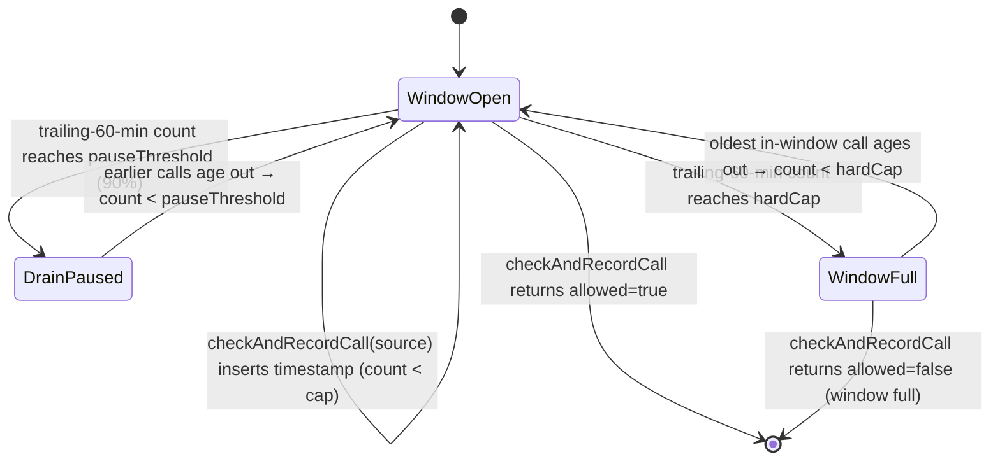
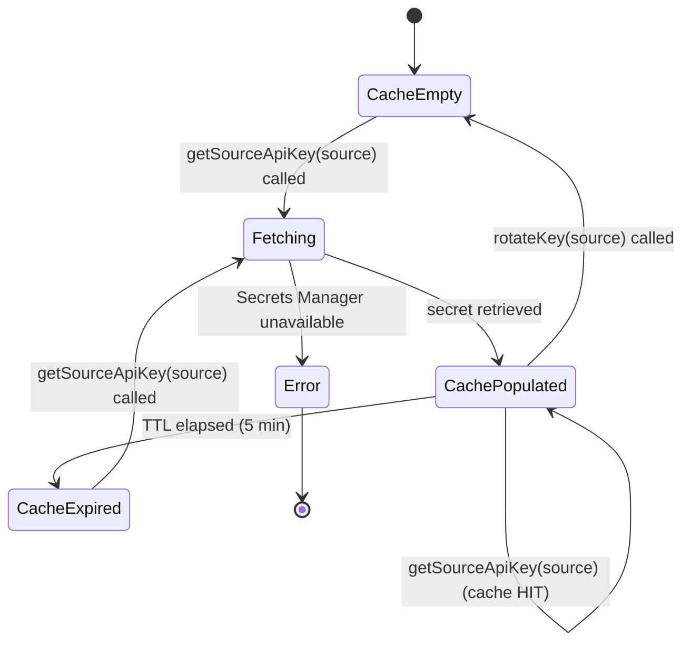
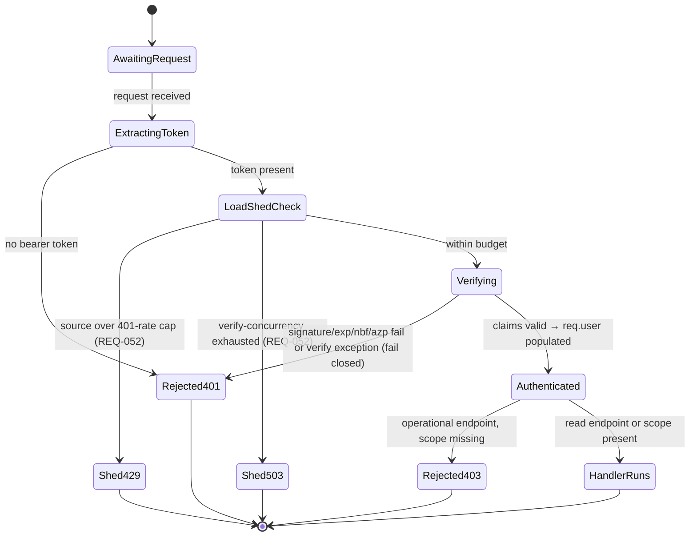
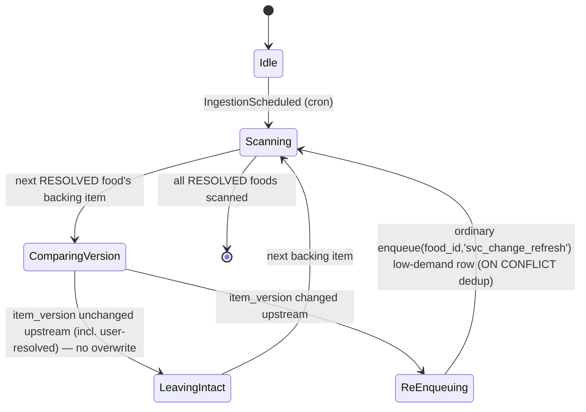

```mermaid
stateDiagram-v2
  [*] --> Idle
  Idle --> ValidatingInput : HTTP request received (after MOD-012 auth)
  ValidatingInput --> Rejected400 : invalid id / empty name / query too short / batch > 100
  ValidatingInput --> ReadingById : GET /{id} valid
  ValidatingInput --> Adding : POST /v1/foods valid name
  ValidatingInput --> Delegating : /candidates or PATCH or /search
  ReadingById --> Responding404 : no row OR status NOT_FOUND/FAILED
  ReadingById --> Responding202 : status PENDING/UNRESOLVED
  ReadingById --> Responding200 : status RESOLVED (golden record)
  Adding --> CreatingRow : createByName (advisory-lock dedup, MOD-016)
  CreatingRow --> Admitting : admitEnqueue (MOD-013)
  Admitting --> Responding503 : backpressure / circuit open (FR-046)
  Admitting --> Enqueuing : admitted (demote if >50 pending; no 429)
  Enqueuing --> Responding202 : fetch_queue INSERT + pg_notify (status PENDING)
  Delegating --> Responding200 : candidates / resolve / search result
  Delegating --> Rejected400 : PATCH out-of-set candidate (400/409 from MOD-018)
  Responding200 --> [*]
  Responding202 --> [*]
  Responding404 --> [*]
  Responding503 --> [*]
  Rejected400 --> [*]
```

```mermaid
stateDiagram-v2
  [*] --> Disconnected
  Disconnected --> Connected : $connect (onConnect, token verified — MOD-012; sub→id subscription persisted)
  Connected --> Notified : FoodFetchCompleted(id) → postToConnection (only to subscribed subs, REQ-041)
  Notified --> Connected : client remains connected
  Connected --> Disconnected : $disconnect (onDisconnect)
  Connected --> Disconnected : GoneException (stale connection cleaned up)
  Connected --> Disconnected : token exp passes mid-connection → server-side close (REQ-049b)
  Disconnected --> [*] : re-auth required on reconnect with fresh token (REQ-049c)
```

```mermaid
stateDiagram-v2
  [*] --> Admitting
  Admitting --> Rejected400 : batch > 100 ids (REQ-045)
  Admitting --> CheckingBackpressure : batch ok
  CheckingBackpressure --> Rejected503 : queue full OR circuit open (REQ-046)
  CheckingBackpressure --> CheckingFloodShed : capacity available
  CheckingFloodShed --> Rejected503 : NEW enqueue from heaviest sub near per-source ceiling (REQ-040b/FR-043b)
  CheckingFloodShed --> RecordingDemand : within headroom (reads/PATCH never shed)
  RecordingDemand --> Admitted : distinct-requester upsert + capped demand (REQ-044); always admitted (no 429)
  Admitted --> [*]
  Rejected400 --> [*]
  Rejected503 --> [*]

  state "Drain-time scoring (ARCH-004)" as DrainScoring {
    [*] --> EvaluatingPendingCount
    EvaluatingPendingCount --> NormalPriority : sub pending ≤ 50 (front tier)
    EvaluatingPendingCount --> Demoted : sub pending > 50 → ranked to back (REQ-043)
    Demoted --> NormalPriority : pending drops ≤ 50 → auto re-promote (dynamic, REQ-043)
    NormalPriority --> Demoted : pending rises > 50
  }
```

```mermaid
stateDiagram-v2
  [*] --> ReceivingAsyncEvent
  ReceivingAsyncEvent --> CheckingProducerPrincipal : EventBridge/queue/insert ingress
  CheckingProducerPrincipal --> RejectedUnauthorizedProducer : principal not on least-privilege allowlist
  CheckingProducerPrincipal --> CheckingProvenance : principal allowlisted
  CheckingProvenance --> RejectedProvenance : requestedBy missing / 'system' / unrecognized detail-type
  CheckingProvenance --> Admitted : requestedBy is authenticated sub OR named service principal
  Admitted --> [*] : proceed to rolling-window limiter (MOD-005) → fetch / enqueue (ARCH-004)
  RejectedUnauthorizedProducer --> [*] : event dropped + alarmed; no fetch, no enqueue
  RejectedProvenance --> [*] : event dropped + alarmed; no fetch, no enqueue
```

```mermaid
stateDiagram-v2
  [*] --> Idle
  Idle --> ListingCandidates : GET /{id}/candidates
  Idle --> Resolving : PATCH /{id} { candidateIds }
  ListingCandidates --> Responded404 : no row
  ListingCandidates --> RespondedList : UNRESOLVED → candidate list (or [] if not UNRESOLVED)
  Resolving --> Responded404 : no row
  Resolving --> Rejected409 : a pick is NOT in this food's candidate set (status unchanged, REQ-049)
  Resolving --> ReFetching : all picks in-set → re-fetch each pick by external_key (budgeted source call, MOD-005/MOD-015)
  ReFetching --> FetchError : source error / transport failure (status unchanged; SourceApiError → 502/503)
  ReFetching --> Merging : canonical payloads obtained
  Merging --> Resolved : merge → upsert golden record + user-pick provenance → status RESOLVED
  FetchError --> [*]
  RespondedList --> [*]
  Responded404 --> [*]
  Rejected409 --> [*]
  Resolved --> [*]
```

# Module Design: Source-Agnostic Food Data Integration

**Feature Branch**: `003-usda-food-data`
**Created**: 2026-05-09
**Status**: Draft — **re-baselined 2026-06-22 to the source-agnostic food data model**
**Source**: `specs/003-usda-food-data/v-model/architecture-design.md`
**Standard**: DO-178C / ISO 26262 Low-Level Module Design

> **Re-baseline note (2026-06-22).** This artifact (V-Model Layer 4, traces to `architecture-design.md`
> ARCH-_ ids) was regenerated to match the **source-agnostic food data redesign**. A food is keyed by an
> internal `id`; **USDA is one pluggable source adapter**; foods are assembled into a **cross-source
> golden record** with per-field provenance; users add foods **by name** through a `PENDING →
(UNRESOLVED) → RESOLVED` lifecycle. The lifecycle status enum is now
> `PENDING | UNRESOLVED | RESOLVED | NOT_FOUND | FAILED` (the old `fetch_status` enum
> `pending|fetched|not_found|stale` is removed). **`fdcId` / the denormalized `foods` table /
> JSONB-nutrient / `fetch_status` / stale-by-age design are removed from the canonical view and confined
> to the USDA adapter (MOD-008 only), which maps `fdcId → external_key` inbound.** MOD-001..MOD-014 are
> **preserved in id and intent** (re-keyed `fdcId → id`, USDA-only → per-source) and **MOD-015..MOD-021**
> are **new**, decomposing the seven new architecture modules ARCH-013..ARCH-019. The pre-existing
> SYS-parent mismatch (MODs that had mapped ARCH-006→SYS-006 and ARCH-007→SYS-007) is fixed: MOD parents
> are re-keyed to the correct SYS per `architecture-design.md`'s SYS→ARCH coverage table
> (ARCH-006→SYS-007, ARCH-007→SYS-008, ARCH-008→SYS-009, ARCH-009→SYS-010, ARCH-010→SYS-011,
> ARCH-011→SYS-012). MOD traces now cite `REQ-_`ids (Layer-1 requirements), not bare`FR-\*`.
>
> **Stabilization addendum (2026-06-27).** Completion event = **`FoodFetchCompleted`** (was
> `FoodDataReceived`; `publishFoodFetchCompleted`). MOD-006 is now a **13-table** schema adding
> **`food_candidates`** (backing MOD-018's `CandidateStore`) with structural same-food provenance
> (`UNIQUE(food_id, id)` + composite `(food_id, source_id)` FKs, `ON DELETE NO ACTION`). MOD-003's lease is
> the **`leased_at`** column (was `lease_expires_at`) with a reaper, and demotion is computed **live** in
> the `leaseNext` ORDER BY (no `drain_priority_tier` column); MOD-013 demotes a food only when **all** its
> requesters exceed the threshold and adds near-ceiling flood-shed `503` (REQ-040b). MOD-017 decides the
> outcome by **survivor count after normalized-name exact match** (REQ-050a, no nutrient tolerance);
> MOD-004 persists the surviving set to `food_candidates` on `UNRESOLVED`. MOD-016 reactivates terminal
> rows past TTL and MOD-018's `PATCH`-resolve is `UNRESOLVED`-only + idempotent with a 30-day candidate-set
> TTL (REQ-025a/REQ-028a). MOD-020 runs as a **Fargate scheduled task** re-enqueuing via the ordinary
> `enqueue` path (no `enqueueLowPriority`). MOD-005 prunes `source_call_log` to the trailing window.
> MOD-012 strips the forgeable `x-debug-sub` identity header (REQ-037c). New sub-id requirements
> **REQ-025a/REQ-028a/REQ-050a** trace end-to-end; the orphan `REQ-MRG-*` / mis-cited fairness REQ ids in
> the traceability matrix are corrected to real `REQ-039/040a/040b/050/050a/051`.

---

## Overview

This document decomposes each of the **19 architecture modules (ARCH-001 through ARCH-019)** into
low-level module designs. Each module is assigned a unique `MOD-NNN` identifier and includes four
mandatory views. ARCH-012 (FoodAuthGuard) decomposes into three modules — MOD-012
(`ClerkAuthMiddleware`), MOD-013 (`DemotionAndFairness`), and MOD-014 (`AsyncProducerAuthz`); every
other ARCH module maps to exactly one MOD. There are **21 MODs** total.

1. **Algorithmic / Logic View** — pseudocode describing the module's core logic
2. **State Machine View** — `stateDiagram-v2` (or `N/A Stateless` for pure functions)
3. **Internal Data Structures** — table of key data structures used internally
4. **Error Handling Return Codes** — table of error conditions and responses

**Identity & confinement invariants (hold across every MOD below):**

- Every canonical row, DAO method, queue row, poll handle, DTO, and API field is keyed on the internal
  ULID `id` (REQ-045/REQ-CN-007). No source-native identifier is ever a primary or foreign key.
- `fdcId` and all USDA-specific terms appear **only** in **MOD-008 (UsdaApiClient)**, which maps
  `fdcId → external_key` inbound (REQ-046). No other MOD references `fdcId`.
- All persistence flows through the DAO/repository seam (**MOD-016**, REQ-054); no source-specific SQL
  leaks into services, the worker, or the API.

---

## ID Schema

- **Module**: `MOD-NNN` — sequential low-level module identifier
- **Parent Architecture Module**: `ARCH-NNN` — the architecture module this MOD decomposes
- **Traceability**: Each MOD traces to one ARCH and to the `REQ-*` it implements; each ARCH may have one
  or more MODs
- **Re-baseline (2026-06-22):** MOD-001..MOD-014 preserved (re-keyed); MOD-015..MOD-021 new

---

## MOD-001 — FoodApiController (Request Handler)

**Parent ARCH**: ARCH-001 (**Parent SYS**: SYS-001)
**Type**: Stateful (per-request lifecycle)
**Runtime**: NestJS controller on ECS/Fargate (Node.js 22.x), ALB-fronted
**Target source file**: `packages/services/food-service/src/foods/foods.controller.ts`

> Re-keyed from the old `fdcId`-path read API to the **add-by-name + read-by-`id`** API. The path param
> is the internal ULID `id`; there is no `fdcId` route. The controller never calls a source — it reads
> the golden record via the DAO layer (MOD-016) and enqueues via MOD-002/MOD-003. Status precedence is
> `401 → 403 → 400 → 404/202/200` (REQ-039/REQ-051; auth/scope handled by MOD-012).

### 1. Algorithmic / Logic View

```
// GET /v1/foods/{id} — read by internal id (REQ-002/REQ-003/REQ-004)
FUNCTION handleGetFood(req):
  id = parsePathParam(req, "id")
  IF NOT isValidUlid(id):
    RETURN 400 { error: "Invalid id format" }     // REQ-006 — well-formed ULID only

  // Optional in-process/Redis hot cache (MOD-007) consulted first ONLY when the deferred variant is on.
  record = FoodDaoRepository.findById(id)          // MOD-016 → MOD-006 (golden record + provenance)
  IF record IS NULL:
    RETURN 404 { error: "Not found" }              // no such row

  SWITCH record.status:
    CASE 'RESOLVED':
      RETURN 200 { food: toGoldenRecordDto(record) }       // golden record only on RESOLVED (REQ-002)
    CASE 'PENDING', 'UNRESOLVED':
      RETURN 202 { id, status: record.status, estimatedWaitSeconds: 30 }  // 30 = static placeholder at launch (REQ-003; not yet derived from queue depth)
    CASE 'NOT_FOUND', 'FAILED':
      RETURN 404 { id, status: record.status }              // 404 but status retrievable (REQ-004)

// POST /v1/foods — add by name (REQ-005/REQ-047/REQ-IF-009)
FUNCTION handleAddByName(req):
  name = trim(req.body.name)
  IF name == "" OR isWhitespaceOnly(name):
    RETURN 400 { error: "Name must not be empty" }          // REQ-006 — nothing enqueued

  normalized = normalizeName(name)                          // lowercased + trimmed (REQ-005)

  // Advisory-lock dedup: concurrent adds of the same normalized name collapse to one row + id (MOD-016).
  // createByName reactivates a terminal-state (NOT_FOUND/FAILED) row past its 30-day TTL → PENDING (REQ-028a).
  { id, created, reactivated } = FoodDaoRepository.createByName(normalized, name)  // status='PENDING' on create/reactivate

  // (Re)enqueue ONLY when a (re)fetch is actually wanted (DSN-1): a freshly created row, or a terminal row past
  // its TTL just reactivated to PENDING. An existing PENDING / UNRESOLVED / in-flight / RESOLVED food is NOT
  // re-enqueued — re-enqueuing a RESOLVED food (which has no fetch_queue row) would insert a fresh `pending`
  // row and burn the scarce per-source budget on a needless re-fetch.
  IF NOT (created OR reactivated):
    record = FoodDaoRepository.findById(id)
    RETURN record.status == 'RESOLVED'
      ? 200 { id, status: record.status, food: toGoldenRecordDto(record) }
      : 202 { id, status: record.status, estimatedWaitSeconds: 30 }   // existing in-flight row; caller polls, no enqueue

  // Pre-enqueue fairness/backpressure (MOD-013) — NO 429: demotion only; 400 batch / 503 backpressure.
  DemotionAndFairness.admitEnqueue(req.user, [id], newEnqueueIds = [id])    // MOD-013
  IF reactivated:
    EnqueueEmitter.publishFoodReactivated({ id, requestedBy: req.user.sub })  // MOD-002 → reset tombstone queue row to pending + pg_notify (DSN-1)
  ELSE:
    EnqueueEmitter.publishFoodRequested({ id, requestedBy: req.user.sub })    // MOD-002 → fetch_queue INSERT + pg_notify
  RETURN 202 { id, status: "PENDING", estimatedWaitSeconds: 30 }

// GET /v1/foods/{id}/status — lifecycle poll (REQ-007)
FUNCTION handleGetStatus(req):
  id = parsePathParam(req, "id")
  IF NOT isValidUlid(id):
    RETURN 400 { error: "Invalid id format" }
  record = FoodDaoRepository.findById(id)
  IF record IS NULL:
    RETURN 404 { error: "Not found" }
  RETURN 200 { id, status: record.status, food: record.status == 'RESOLVED' ? toGoldenRecordDto(record) : undefined }

// GET /v1/foods/{id}/candidates — disambiguation list (REQ-048/REQ-IF-010) → delegates to MOD-018
FUNCTION handleGetCandidates(req):
  id = parsePathParam(req, "id")
  IF NOT isValidUlid(id):
    RETURN 400 { error: "Invalid id format" }
  RETURN 200 { id, candidates: CandidateResolutionService.getCandidates(id) }  // MOD-018; 404 if no row

// PATCH /v1/foods/{id} — resolve from a candidate pick (REQ-049/REQ-IF-011) → delegates to MOD-018
FUNCTION handleResolve(req):
  id = parsePathParam(req, "id")
  IF NOT isValidUlid(id):
    RETURN 400 { error: "Invalid id format" }
  candidateIds = req.body.candidateIds
  result = CandidateResolutionService.resolve(id, candidateIds)  // MOD-018 — validates candidate-set membership
  RETURN 200 { id, status: result.status }                       // 400/409 thrown by MOD-018 if out-of-set

// GET /v1/foods/search?query= — local store only (REQ-008/REQ-IF-002); incl. barcode/external_key
FUNCTION handleSearch(req):
  query = req.query.query
  IF length(query) < 2:
    RETURN 400 { error: "Query too short" }
  results = FoodDaoRepository.searchByName(query)               // MOD-016 → pg_trgm; never a source call (REQ-009)
  RETURN 200 { results }                                        // [{ id, name, score }]

// POST /v1/foods/batch — bounded batch add-by-name with per-item partial result (REQ-045/REQ-IF-009)
FUNCTION handleBatch(req):
  names = req.body.names
  IF length(names) == 0 OR length(names) > 100:
    RETURN 400 { error: "names must be 1–100 items" }           // REQ-045 — enqueue NOTHING over cap
  ids = []
  toEnqueue = []                                                // only fresh/reactivated rows are (re)enqueued (DSN-1)
  FOR EACH name IN names:
    IF trim(name) == "": CONTINUE                               // skip blanks; do not fail whole batch
    { id, created, reactivated } = FoodDaoRepository.createByName(normalizeName(name), name)
    ids.push(id)
    IF created OR reactivated: toEnqueue.push({ id, reactivated })
  DemotionAndFairness.admitEnqueue(req.user, ids, newEnqueueIds = toEnqueue.map(e => e.id))   // MOD-013 — single backpressure/demotion gate

  resolved = []
  pending  = []
  FOR EACH id IN ids:
    record = FoodDaoRepository.findById(id)
    IF record.status == 'RESOLVED':
      resolved.push({ id, food: toGoldenRecordDto(record) })    // available data returned inline
    ELSE:
      pending.push({ id, status: record.status })               // PENDING/UNRESOLVED — caller polls these
  // (Re)enqueue ONLY the created/reactivated misses — never an existing RESOLVED/UNRESOLVED/in-flight row (DSN-1).
  FOR EACH e IN toEnqueue:
    e.reactivated ? EnqueueEmitter.publishFoodReactivated({ id: e.id, requestedBy: req.user.sub })
                  : EnqueueEmitter.publishFoodRequested({ id: e.id, requestedBy: req.user.sub })
  RETURN 200 { resolved, pending }                              // per-item partial (REQ-045)

FUNCTION isValidUlid(id):
  RETURN matches(id, /^[0-9A-HJKMNP-TV-Z]{26}$/)                // Crockford base32, 26 chars (platform ULID)

FUNCTION normalizeName(name):
  RETURN toLowerCase(trim(collapseWhitespace(name)))            // the dedup key (REQ-005)
```

### 2. State Machine View



### 3. Internal Data Structures

| Name               | Type                                                                                                           | Description                                                              |
| ------------------ | -------------------------------------------------------------------------------------------------------------- | ------------------------------------------------------------------------ |
| `RequestContext`   | `{ id?: string, requestId: string, startTime: number }`                                                        | Per-request metadata for logging (the internal `id`, never a source key) |
| `AddByNameDto`     | `{ name: string }`                                                                                             | `POST /v1/foods` body; normalized to the dedup key before any write      |
| `GoldenRecordDto`  | `{ id, name, description, kind, nutrients: NutrientDto[], portions: PortionDto[], provenance: ProvenanceDto }` | RESOLVED response shape — id-keyed, no `fdcId`                           |
| `BatchResultDto`   | `{ resolved: { id, food }[], pending: { id, status }[] }`                                                      | Per-item partial response (REQ-045)                                      |
| `ValidationResult` | `{ valid: boolean, error?: string }`                                                                           | Output of ULID / name / query validation                                 |

### 4. Error Handling Return Codes

| Error Condition                                         | HTTP Status | Response Body                                  | Action                                                               |
| ------------------------------------------------------- | ----------- | ---------------------------------------------- | -------------------------------------------------------------------- |
| Malformed `id` (not a ULID)                             | 400         | `{ error: "Invalid id format" }`               | Return immediately; nothing enqueued (REQ-006)                       |
| Empty / whitespace-only name (`POST /v1/foods`)         | 400         | `{ error: "Name must not be empty" }`          | Return immediately; no row created, nothing enqueued (REQ-006)       |
| Search query too short (<2 chars)                       | 400         | `{ error: "Query too short" }`                 | Return immediately                                                   |
| Batch > 100 names                                       | 400         | `{ error: "names must be 1–100 items" }`       | Reject whole batch; create no rows, enqueue nothing (REQ-045)        |
| PATCH candidate not in this food's set                  | 400 / 409   | `{ error: "Candidate not in set" }`            | Thrown by MOD-018; food `status` unchanged (REQ-049)                 |
| Backpressure — queue saturated / circuit open (MOD-013) | 503         | `{ error: "Fetch queue saturated" }`           | `BackpressureError` from MOD-013 on any enqueue path; do not enqueue |
| PostgreSQL connection error (via MOD-016)               | 503         | `{ error: "Service temporarily unavailable" }` | Log error, return 503                                                |
| No row for `id`                                         | 404         | `{ error: "Not found" }`                       | Return immediately                                                   |

---

## MOD-002 — EnqueueEmitter (Postgres-as-queue enqueue + scheduled/completion fan-out)

**Parent ARCH**: ARCH-002 (**Parent SYS**: SYS-002)
**Type**: Stateless
**Runtime**: NestJS provider on ECS/Fargate (Node.js 22.x), called inline from ARCH-001 and ARCH-004
**Target source file**: `packages/services/food-service/src/queue/enqueue-emitter.service.ts`

> The demand-path enqueue is **not** an EventBridge event. `publishFoodRequested` /
> `publishFoodBatchRequested` are thin wrappers over an `INSERT INTO fetch_queue` (keyed on `food_id`) +
> `pg_notify('fetch_queued', id)` (Postgres-as-queue, REQ-011/REQ-014/REQ-017). EventBridge is retained
> ONLY for scheduled producers (`IngestionScheduled`, change-driven refresh REQ-032) and the
> fire-and-forget `FoodFetchCompleted` completion event (REQ-034). Payloads carry the food `id`, never
> `fdcId`.

### 1. Algorithmic / Logic View

```
FUNCTION publishFoodRequested(payload: { id, requestedBy }):
  IF NOT isValidUlid(payload.id):
    THROW ValidationError("Invalid food id")
  IF payload.requestedBy IS NULL OR payload.requestedBy == "":
    THROW ValidationError("Missing requestedBy provenance")     // authenticated provenance (REQ-042)

  // Postgres-as-queue: idempotent INSERT keyed on food_id, then NOTIFY the consumer. Distinct-requester
  // demand counting + the fetch_requesters upsert are done by MOD-003 (FetchQueueRouter.enqueue).
  FetchQueueRouter.enqueue(payload.id, payload.requestedBy)      // MOD-003: ON CONFLICT (food_id) + requester upsert
  Postgres.notify("fetch_queued", payload.id)                   // LISTEN/NOTIFY wake
  RETURN { enqueued: true }

// Reactivation enqueue (DSN-1/REQ-028a): a terminal food past its TTL was reset to PENDING by createByName,
// but its fetch_queue row is still a `tombstone`. The ordinary `enqueue` ON CONFLICT guard (WHERE status='pending')
// is a no-op on a tombstone row, so the drainer would never claim it. Route reactivations through
// FetchQueueRouter.reactivate, which REVIVES the tombstone row to `pending` (resets attempts/leased_at/last_error).
FUNCTION publishFoodReactivated(payload: { id, requestedBy }):
  IF NOT isValidUlid(payload.id):
    THROW ValidationError("Invalid food id")
  IF payload.requestedBy IS NULL OR payload.requestedBy == "":
    THROW ValidationError("Missing requestedBy provenance")     // authenticated provenance (REQ-042)
  FetchQueueRouter.reactivate(payload.id, payload.requestedBy)   // MOD-003: revive tombstone → pending + requester upsert
  Postgres.notify("fetch_queued", payload.id)
  RETURN { enqueued: true }

FUNCTION publishFoodBatchRequested(payload: { ids, requestedBy }):
  IF length(payload.ids) == 0 OR length(payload.ids) > 100:
    THROW ValidationError("ids must be 1–100 items")            // client-facing batch cap (REQ-045)
  FOR EACH id IN payload.ids:
    publishFoodRequested({ id, requestedBy: payload.requestedBy })
  RETURN { enqueued: length(payload.ids) }

FUNCTION publishIngestionScheduled():
  // EventBridge scheduled producer — drives change-driven refresh (MOD-020); not a demand-path enqueue.
  entry = { Source: "food-service", DetailType: "IngestionScheduled",
            Detail: JSON.stringify({ scheduledAt: ISO8601Now() }), EventBusName: ENV.EVENT_BUS_NAME }
  RETURN { eventId: EventBridgeClient.putEvents({ Entries: [entry] }).Entries[0].EventId }

FUNCTION publishFoodFetchCompleted(payload: { id, status }):
  // FoodFetchCompleted stays on EventBridge — fire-and-forget fan-out to the (deferred) WS notifier (MOD-009).
  entry = { Source: "food-service", DetailType: "FoodFetchCompleted",
            Detail: JSON.stringify({ id: payload.id, status: payload.status }), EventBusName: ENV.EVENT_BUS_NAME }
  response = EventBridgeClient.putEvents({ Entries: [entry] })
  IF response.FailedEntryCount > 0:                              // fire-and-forget: log, do not throw
    MonitoringLogger.logRequest("eb-publish-fail", { id: payload.id }, 0)

FUNCTION publishFetchFailed(payload: { id }):
  // FetchFailed is emitted ONLY for a FAILED terminal disposition (all sources errored after the retry budget) —
  // it drives the operator failure alarm (CloudWatch/SNS). A NOT_FOUND tombstone is a NORMAL, common outcome
  // (typo / non-USDA / branded item) and MUST NOT emit FetchFailed or raise the failure alarm (DSN-9). Carries
  // the food `id` only; fire-and-forget.
  entry = { Source: "food-service", DetailType: "FetchFailed",
            Detail: JSON.stringify({ id: payload.id }), EventBusName: ENV.EVENT_BUS_NAME }
  response = EventBridgeClient.putEvents({ Entries: [entry] })
  IF response.FailedEntryCount > 0:
    MonitoringLogger.logRequest("eb-publish-fail", { id: payload.id }, 0)
```

### 2. State Machine View

`N/A Stateless` — EnqueueEmitter is a pure function module. Each call is independent with no retained state between invocations.

### 3. Internal Data Structures

| Name              | Type                                           | Description                                                                                                       |
| ----------------- | ---------------------------------------------- | ----------------------------------------------------------------------------------------------------------------- |
| `EnqueueResult`   | `{ enqueued: boolean }`                        | Successful `fetch_queue` INSERT + NOTIFY response (keyed on food `id`)                                            |
| `EventEntry`      | `{ Source, DetailType, Detail, EventBusName }` | EventBridge PutEvents entry shape (IngestionScheduled, FoodFetchCompleted, FetchFailed)                           |
| `ScheduledEvent`  | `{ scheduledAt: string }`                      | `IngestionScheduled` detail — drives change-driven refresh (MOD-020)                                              |
| `CompletionEvent` | `{ id: string, status: FoodStatus }`           | `FoodFetchCompleted` detail — carries the food `id`, never `fdcId`                                                |
| `FailureEvent`    | `{ id: string }`                               | `FetchFailed` detail — emitted on a **FAILED** disposition only (not NOT_FOUND); drives the failure alarm (DSN-9) |

### 4. Error Handling Return Codes

| Error Condition                                         | Error Type        | Response | Action                                                |
| ------------------------------------------------------- | ----------------- | -------- | ----------------------------------------------------- |
| Invalid food `id` in payload                            | `ValidationError` | Throw    | Caller receives error; no `fetch_queue` INSERT        |
| Missing `requestedBy` provenance                        | `ValidationError` | Throw    | No enqueue without authenticated provenance (REQ-042) |
| `ids` array empty or >100                               | `ValidationError` | Throw    | Caller receives error (REQ-045)                       |
| `fetch_queue` INSERT / NOTIFY failure                   | `EnqueueError`    | Throw    | Caller returns 503                                    |
| EventBridge `FailedEntryCount > 0` (FoodFetchCompleted) | Log only          | No throw | Fire-and-forget; log warning                          |

---

## MOD-003 — FetchQueueRouter (Postgres-as-Queue Demand-Weighted Router)

**Parent ARCH**: ARCH-003 (**Parent SYS**: SYS-002, SYS-003, SYS-004)
**Type**: Stateless (Postgres `fetch_queue` schema + lease/demand claim logic)
**Runtime**: Postgres `fetch_queue` table + `LISTEN/NOTIFY`; claim queries run inside the Fargate consumer worker (ARCH-004)
**Target source file**: `packages/services/food-service/src/queue/fetch-queue.router.ts`

> Re-keyed from `fdcId` to the food `id` (`fetch_queue.food_id PK`). No SQS, no EventBridge rules, no DLQ.
> There is NO static priority column and NO separate high/low queue — ordering is purely demand-weighted:
> `request_count DESC, first_requested ASC`, where `request_count` is the **distinct-requester count**
> derived from `fetch_requesters` (a `sub` counts at most once — `PRIORITY_CAP=1` per sub is **structural**
> via the `fetch_requesters` PK; the total is the **uncapped** distinct count, never a raw `+1` or a `LEAST(…)`
> ceiling — REQ-044/DSN-3). Background / refresh / batch
> enqueues carry low/zero demand, so they sort after high-demand rows naturally — not a separate tier.
> The single Fargate worker (one instance via a Postgres advisory lock, REQ-022) claims highest-demand
> rows first under a lease (`FOR UPDATE SKIP LOCKED` + lease timeout — REQ-018), with drain-time demotion
> of over-demand `sub`s (>50 pending) applied on top (REQ-043). Exhausted rows become tombstones
> (`status='tombstone'`), the DLQ analog. Status enum = `pending | in_flight | tombstone`.

### 1. Algorithmic / Logic View

```
// fetch_queue schema (Postgres-as-queue). Keyed on food id; ordering is demand-weighted (no priority col).
//   fetch_queue(food_id PK REFERENCES food(id), request_count, first_requested, last_requested,
//               leased_at, status 'pending'|'in_flight'|'tombstone', attempts, last_error, fetched_at)
//   -- leased_at = the 30s in_flight lease stamp (REQ-017); reaper reverts rows with leased_at < now() - 30s.
//   -- attempts = the FAILURE counter (REQ-016): incremented ONLY on a real source error (5xx/timeout), NEVER on
//      a claim/lease, a reaper reclaim, or a rate-limit/back-pressure deferral (DSN-5).
//   -- Indexes: idx_fetch_queue_priority partial WHERE status='pending' (drain order) PLUS a partial index
//      `(leased_at) WHERE status='in_flight'` so the reaper / lease-reclaim path is not a seq scan (DB-8).
//   fetch_requesters(food_id, sub, requested_at, PK(food_id, sub))   -- distinct-requester demand (REQ-044)
// request_count = distinct-requester count — a sub counts AT MOST ONCE (PRIORITY_CAP=1 per sub is STRUCTURAL via
//   the fetch_requesters PK(food_id, sub)); the total is the UNCAPPED distinct-sub count, NEVER a raw +1.

// Demand-path enqueue (REQ-014/REQ-044): upsert the requester, then set request_count = distinct-sub count.
FUNCTION enqueue(foodId, sub):
  // (1) record distinct requester — PK(food_id, sub) makes repeat adds idempotent (the per-sub PRIORITY_CAP=1)
  Postgres.query("INSERT INTO fetch_requesters (food_id, sub) VALUES ($1,$2) ON CONFLICT DO NOTHING", [foodId, sub])
  // (2) idempotent queue row keyed on food_id; request_count = UNCAPPED distinct-sub count (DSN-3: no LEAST cap,
  //     no raw +1 — the cap is the structural per-sub PK, not an arithmetic ceiling on the total).
  Postgres.query("""
    INSERT INTO fetch_queue (food_id, request_count, first_requested, last_requested, status)
    VALUES ($1, 1, now(), now(), 'pending')
    ON CONFLICT (food_id) DO UPDATE SET
      request_count = (SELECT count(*) FROM fetch_requesters WHERE food_id = $1),
      last_requested = now()
    WHERE fetch_queue.status = 'pending'
  """, [foodId])
  RETURN { enqueued: true }

// Reactivation (DSN-1/REQ-028a): createByName reset a terminal food past its TTL to PENDING, but its fetch_queue
// row is still a `tombstone` — the enqueue ON CONFLICT guard above only updates a still-`pending` row, so it would
// be a NO-OP here and the drainer would never re-claim the row. Revive the tombstone row to `pending`, clearing the
// failure/lease bookkeeping; INSERT a fresh row only if (defensively) none exists.
FUNCTION reactivate(foodId, sub):
  Postgres.query("INSERT INTO fetch_requesters (food_id, sub) VALUES ($1,$2) ON CONFLICT DO NOTHING", [foodId, sub])
  updated = Postgres.query("""
    UPDATE fetch_queue SET status='pending', attempts=0, leased_at=NULL, last_error=NULL, last_requested=now(),
      request_count = (SELECT count(*) FROM fetch_requesters WHERE food_id = $1)
    WHERE food_id = $1
  """, [foodId])
  IF updated.rowCount == 0:
    Postgres.query("""INSERT INTO fetch_queue (food_id, request_count, first_requested, last_requested, status)
      VALUES ($1, (SELECT count(*) FROM fetch_requesters WHERE food_id=$1), now(), now(), 'pending')""", [foodId])
  RETURN { reactivated: true }

// Single-instance worker guard (REQ-022): one consumer drains the queue (advisory lock). Two-int form (DSN-15):
// this lock and MOD-016's per-name dedup lock share Postgres's single 64-bit advisory key space, so they use
// DISTINCT classids — the drainer key can never collide with a normalized-name hash.
LOCK_CLASS_DRAINER = 1                                // classid for the single-drainer lock (objid 0)
FUNCTION acquireWorkerLock():
  RETURN Postgres.query("SELECT pg_try_advisory_lock($1, 0)", [LOCK_CLASS_DRAINER])

// Claim the next eligible row, highest-demand first, under a 30s lease stamped on leased_at (REQ-015/REQ-017).
// Demotion (REQ-043/FR-043a) is computed LIVE in the ORDER BY (no stored tier column): a food is demoted
// only when ALL of its current requesters are over the 50-pending threshold (MOD-013.isFoodDemoted).
// PERF NOTE (DSN-11): the demotion predicate below is a per-row, per-requester correlated COUNT(*) over
// fetch_queue ⋈ fetch_requesters evaluated inside this ORDER BY on every claim — O(rows × requesters × scan)
// with no supporting index. This is acceptable at the launch scale (queue ≤ a few hundred pending rows) but is
// a real cost at the FR-046 ceiling (10k rows); revisit with a maintained per-`sub` pending-count materialization
// (or a periodic refresh of it) before that scale. Covered by the perf tests T-151/T-195. Note also that
// `leaseNext` does NOT touch `attempts` — claims and reaper reclaims must not consume the failure budget (DSN-5).
FUNCTION leaseNext(leaseSeconds = 30):
  sql = """
    UPDATE fetch_queue
    SET status='in_flight', leased_at = now()
    WHERE food_id = (
      SELECT q.food_id FROM fetch_queue q
      WHERE (q.status='pending' AND q.last_requested <= now())
         OR (q.status='in_flight' AND q.leased_at < now() - ($1 || ' seconds')::interval)  -- reaper reclaim (REQ-017)
      ORDER BY
        -- live drain-time demotion: 1 (back) only when NO requester of this food is under threshold
        (CASE WHEN NOT EXISTS (
            SELECT 1 FROM fetch_requesters r
            WHERE r.food_id = q.food_id
              AND (SELECT count(*) FROM fetch_queue fq JOIN fetch_requesters fr USING (food_id)
                   WHERE fr.sub = r.sub AND fq.status IN ('pending','in_flight')) <= 50
          ) THEN 1 ELSE 0 END) ASC,                                  -- demote only when all requesters >50 (REQ-043)
        q.request_count DESC, q.first_requested ASC                  -- demand weight + FIFO (REQ-015)
      LIMIT 1 FOR UPDATE SKIP LOCKED
    )
    RETURNING *
  """
  RETURN Postgres.query(sql, [leaseSeconds])

// Reaper: revert orphaned in_flight rows whose lease has lapsed (consumer start + ~1-min sweep) (REQ-017).
FUNCTION reapExpiredLeases(leaseSeconds = 30):
  RETURN Postgres.query("""UPDATE fetch_queue SET status='pending'
    WHERE status='in_flight' AND leased_at < now() - ($1 || ' seconds')::interval""", [leaseSeconds])

FUNCTION resolve(foodId):
  // RESOLVED/UNRESOLVED food: clear the row from the pending set (ack) AND prune its requester rows so
  // fetch_requesters does not grow unbounded once the food leaves the queue (DSN-10). (For the deferred WS
  // notifier, US-9, recipients are resolved from fetch_requesters at completion time BEFORE this prune, or via a
  // periodic sweep — the polling model needs no requester rows after resolution.)
  Postgres.query("DELETE FROM fetch_requesters WHERE food_id = $1", [foodId])
  RETURN Postgres.query("DELETE FROM fetch_queue WHERE food_id = $1", [foodId])

FUNCTION tombstone(foodId, lastError):
  // NOT_FOUND/FAILED: status='tombstone' is the DLQ analog + audit trail (REQ-016/REQ-025/REQ-027). Prune the
  // requester rows too (DSN-10); a later re-add (reactivate) re-records the requester.
  Postgres.query("DELETE FROM fetch_requesters WHERE food_id = $1", [foodId])
  RETURN Postgres.query("UPDATE fetch_queue SET status='tombstone', last_error=$2 WHERE food_id=$1", [foodId, lastError])

// Back-pressure deferral (DSN-5): rate-limit pause / window full / source 429. Re-queue WITHOUT consuming the
// failure budget — `attempts` is the FAILURE counter (REQ-016), not a lease/deferral counter. Clears the lease.
FUNCTION deferLease(foodId, waitSeconds):
  RETURN Postgres.query("""UPDATE fetch_queue SET status='pending', leased_at=NULL,
    last_requested = now() + ($2 || ' seconds')::interval WHERE food_id=$1""", [foodId, waitSeconds])

// Real source failure (5xx/timeout): increment the FAILURE counter and apply exponential backoff (REQ-016).
// Returns the post-increment attempts so the caller decides FAILED (>=5) vs retry. Clears the lease.
FUNCTION recordFailure(foodId): { attempts }
  row = Postgres.query("""UPDATE fetch_queue
    SET status='pending', leased_at=NULL, attempts = attempts + 1,
        last_requested = now() + (power(2, attempts + 1) || ' seconds')::interval
    WHERE food_id=$1 RETURNING attempts""", [foodId])
  RETURN { attempts: row.attempts }

FUNCTION listenForWork():
  Postgres.execute("LISTEN fetch_queued")
```

### 2. State Machine View

`N/A Stateless` — FetchQueueRouter is the `fetch_queue` schema plus deterministic claim/lease SQL. No in-process runtime state; ordering is the demand-weighted `request_count DESC, first_requested ASC` ORDER BY (with the demotion computed live at drain time, no stored tier column), and rows are leased on `leased_at`/reclaimed by the reaper on lease lapse.

### 3. Internal Data Structures

| Name            | Type                                                                                                                                        | Description                                                                                               |
| --------------- | ------------------------------------------------------------------------------------------------------------------------------------------- | --------------------------------------------------------------------------------------------------------- |
| `FetchQueueRow` | `{ food_id, request_count, first_requested, last_requested, leased_at, status: 'pending'\|'in_flight'\|'tombstone', attempts, last_error }` | Postgres `fetch_queue` row — keyed on food `id`; `leased_at` is the 30s `in_flight` lease stamp (REQ-017) |
| `RequesterRow`  | `{ food_id, sub, requested_at }` (PK `food_id`+`sub`)                                                                                       | Distinct-requester demand; PK makes repeat adds idempotent (REQ-044)                                      |
| `WorkerLock`    | `{ lockKey: number, acquired: boolean }`                                                                                                    | `pg_try_advisory_lock` result enforcing single-instance drain (REQ-022)                                   |

### 4. Error Handling Return Codes

| Error Condition                                                                      | Handling                                       | Action                                                                                                                                                  |
| ------------------------------------------------------------------------------------ | ---------------------------------------------- | ------------------------------------------------------------------------------------------------------------------------------------------------------- |
| Worker advisory lock already held                                                    | `pg_try_advisory_lock` returns 0               | This instance idles; the single holder drains the queue (REQ-022)                                                                                       |
| Lease expired before completion (worker crash)                                       | Row reclaimed by the reaper / next `leaseNext` | `leased_at < now() - 30s` makes the orphaned `in_flight` row claimable again, WITHOUT incrementing `attempts` (reclaim is not a failure, REQ-017/DSN-5) |
| Back-pressure deferral (90% pause / window full / source 429)                        | `deferLease` — re-queue, no `attempts` change  | Rate-limit deferrals never consume the failure budget; only real source errors do (DSN-5)                                                               |
| Row exhausts retry budget (`recordFailure` → `attempts` reaches 5 **real** failures) | Set `status='tombstone'`                       | Tombstone row (DLQ analog); food set `FAILED`; failure alarm fires (REQ-016; NOT_FOUND does not alarm, DSN-9)                                           |
| `NOTIFY` lost / worker not LISTENing                                                 | Periodic poll fallback                         | Claim loop also polls on an interval; NOTIFY only reduces latency                                                                                       |
| Duplicate enqueue (same `food_id`)                                                   | `ON CONFLICT (food_id) DO UPDATE`              | No duplicate row; distinct-requester demand recomputed (REQ-014)                                                                                        |

---

## MOD-004 — FoodConsumerService (Fan-Out / Merge Worker)

**Parent ARCH**: ARCH-004 (**Parent SYS**: SYS-005)
**Type**: Stateful (long-running drain loop; single instance via Postgres advisory lock)
**Runtime**: Fargate consumer worker (Node.js 22.x), `LISTEN fetch_queued` + lease-claim loop
**Target source files**: `packages/services/food-service/src/worker/...`

> Heavily rewritten: the worker no longer fetches a single `fdcId` and upserts a denormalized row. Per
> queued food `id` it reads `food.name`, **iterates the source-adapter registry (MOD-015)** to fan out by
> name, calls each adapter **per-source rate-limited (MOD-005)**, validates each candidate at the adapter
> boundary (MOD-021, inside the adapter), **pre-merges**, drives the **golden-record merge (MOD-017)**,
> persists via the DAO layer (MOD-016) with provenance (MOD-019), and sets `food.status` to one of
> `RESOLVED | UNRESOLVED | NOT_FOUND | FAILED`. Async-producer provenance is validated first (MOD-014,
> REQ-042/REQ-048-analog) from `fetch_requesters` (there is **no** `fetch_queue.requested_by` column — DSN-2).
> 30s `in_flight` lease; `attempts` is the **failure counter** — it is incremented **only** on a real source
> error (5xx/timeout), never on a claim, reaper reclaim, or rate-limit/back-pressure deferral (DSN-5) — and the
> food is tombstoned `FAILED` (emitting `FetchFailed`) after 5 such failures; a `NOT_FOUND` tombstone is a normal
> outcome and emits no `FetchFailed` / raises no failure alarm (DSN-9). A **RESOLVED** food only reaches the
> drainer because the change-refresh scheduler (MOD-020) re-enqueued it, so it takes the **selective in-place
> re-pull** branch (`refreshResolvedFood`) — re-merging only items that changed upstream, by `external_key`, never
> re-fanning-out by name and never clobbering a manual pick (DSN-4/REQ-031/REQ-053).

### 1. Algorithmic / Logic View

```
// Single-instance drain loop (REQ-022). One worker holds the advisory lock; it LISTENs + polls.
FUNCTION runWorker():
  IF NOT FetchQueueRouter.acquireWorkerLock():
    RETURN  // another instance is draining; idle
  FetchQueueRouter.listenForWork()                 // LISTEN fetch_queued
  LOOP:
    waitForNotifyOrInterval()
    row = FetchQueueRouter.leaseNext(leaseSeconds = 30)   // lease = visibility-timeout analog (REQ-018)
    IF row IS NOT NULL:
      processRow(row)

FUNCTION processRow(row):
  foodId = row.food_id

  // Validate async-producer provenance before any source consumption (MOD-014, REQ-042/REQ-048). Provenance lives
  // in fetch_requesters(food_id, sub) — a food may have MANY requesters — NOT in a fetch_queue column; there is no
  // `row.requested_by` (DSN-2). assertEnqueueProvenance asserts the DB session role is allowlisted AND the food has
  // ≥1 authenticated/named-service requester.
  AsyncProducerAuthz.assertEnqueueProvenance(dbSessionRole, foodId)

  food = FoodDaoRepository.findById(foodId)          // MOD-016 — read lifecycle status + golden scalars
  name = food.name                                   // the add-by-name query

  // REFRESH BRANCH (DSN-4/REQ-031/REQ-053): a RESOLVED food only reaches the drainer because the change-refresh
  // scheduler (MOD-020) re-enqueued it — a fresh add never re-enqueues a RESOLVED food (DSN-1). Do a SELECTIVE
  // per-item re-pull keyed on external_key (NOT a fan-out by name), preserving manual picks and never re-running
  // disambiguation. This is the single executable home for change-refresh.
  IF food.status == 'RESOLVED':
    refreshResolvedFood(foodId)
    RETURN

  // NORMAL FAN-OUT (PENDING / reactivated): fan out across the wired source-adapter registry (MOD-015) by name.
  candidates = []
  failedSources = 0
  FOR EACH adapter IN SourceAdapterRegistry.adapters():       // MOD-015
    // Per-source rolling-window gate (MOD-005). Pause at 90%; window full → DEFER (back-pressure, NOT a failure).
    IF RollingWindowLimiter.shouldPauseDraining(adapter.source):
      FetchQueueRouter.deferLease(foodId, RollingWindowLimiter.getWaitTime(adapter.source) + 5)  // no attempts++ (DSN-5)
      RETURN                                                  // resume once earlier calls age out
    window = RollingWindowLimiter.checkAndRecordCall(adapter.source)
    IF NOT window.allowed:
      FetchQueueRouter.deferLease(foodId, RollingWindowLimiter.getWaitTime(adapter.source) + 5)  // no attempts++ (DSN-5)
      RETURN
    TRY:
      hits = adapter.searchByName(name)                       // per-source candidates (source + key)
      FOR EACH hit IN hits:
        candidates.push(adapter.fetchByKey(hit.externalKey))  // fetch + mapToCanonical + validate (MOD-021)
    CATCH SourceApiError(status=429):
      // source rate-limited despite our limiter — treat window full, back off. Back-pressure, NOT a failure (REQ-026)
      RollingWindowLimiter.markWindowFull(adapter.source)
      FetchQueueRouter.deferLease(foodId, 60)                 // DEFER, not a failure (no attempts++, DSN-5)
      RETURN
    CATCH SourceApiError(status=5xx) OR Timeout:
      failedSources += 1                                      // a REAL failure for this source
    CATCH ValidationError:
      // reject-not-store: a candidate failing adapter validation is dropped (MOD-021, REQ-055)
      CONTINUE

  // No source had the item → NOT_FOUND tombstone (REQ-025). NOT_FOUND is a NORMAL, common outcome (typo /
  // non-USDA / branded item): completion event ONLY — NO FetchFailed and NO failure alarm (DSN-9).
  IF length(candidates) == 0 AND failedSources == 0:
    FoodDaoRepository.updateStatus(foodId, "NOT_FOUND", tombstonedAt = now())   // 30-day TTL
    FetchQueueRouter.tombstone(foodId, "no_source_has_item")
    EnqueueEmitter.publishFoodFetchCompleted({ id: foodId, status: "NOT_FOUND" })   // no publishFetchFailed (DSN-9)
    RETURN

  // Every source errored this pass → record the REAL failure (attempts++ happens ONLY here, DSN-5) and decide.
  IF length(candidates) == 0 AND failedSources > 0:
    attempts = FetchQueueRouter.recordFailure(foodId).attempts                  // increments the FAILURE counter + backoff (REQ-016)
    IF attempts >= 5:
      FoodDaoRepository.updateStatus(foodId, "FAILED", tombstonedAt = now())
      FetchQueueRouter.tombstone(foodId, "all_sources_errored")
      EnqueueEmitter.publishFoodFetchCompleted({ id: foodId, status: "FAILED" })
      EnqueueEmitter.publishFetchFailed({ id: foodId })                          // FetchFailed + failure alarm on FAILED only (DSN-9)
    // else: recordFailure already re-queued the row `pending` with exponential backoff — retry on a later pass
    RETURN

  // Pre-merge dedup, then decide by SURVIVOR COUNT after normalized-name exact match (REQ-050a):
  //   exactly 1 survivor → RESOLVED; >1 → UNRESOLVED; 0 → NOT_FOUND. No nutrient tolerance; bias to UNRESOLVED.
  collapsed = preMergeDedup(candidates)             // name normalization + attribute similarity
  result = GoldenRecordMergeEngine.merge(collapsed) // MOD-017 → { goldenRecord, outcome, candidateSet? }

  // UNRESOLVED → persist the surviving candidate set to food_candidates for /candidates + PATCH (MOD-018).
  IF result.outcome == "UNRESOLVED":
    CandidateStore.persist(foodId, result.candidateSet)   // food_candidates rows (UNIQUE(food_id, source, external_key)); 30-day TTL (REQ-025a)

  // Persist atomically via the DAO layer (MOD-016) with per-field/value provenance (MOD-019).
  FoodDaoRepository.upsertGoldenRecord(foodId, result.goldenRecord, result.outcome)  // food_sources, food_nutrients, food_portions, food_field_provenance
  FetchQueueRouter.resolve(foodId)                  // ack: clear the row + prune requesters (RESOLVED or UNRESOLVED)
  EnqueueEmitter.publishFoodFetchCompleted({ id: foodId, status: result.outcome })
  MonitoringLogger.incrementMetric("consumer.resolved", 1)

// Change-refresh selective re-pull (DSN-4/REQ-031/REQ-053) — the executable home of change-refresh. For each
// backing source item of a RESOLVED food, re-fetch by external_key (per-source rate-limited, MOD-005), compare
// item_version, and re-merge ONLY the items that changed upstream, IN PLACE. Every unchanged field is left intact,
// INCLUDING a user's manual pick — it is just stored provenance and only its originating item changing can move it
// (manual-pick preservation is at the crosswalk/item grain at single-source launch, REQ-028a). Never fans out by
// name, never re-runs disambiguation, never reverts an UNRESOLVED→RESOLVED pick.
FUNCTION refreshResolvedFood(foodId):
  changed = []
  FOR EACH crosswalk IN FoodSourcesDao.backingItems(foodId):        // food_sources rows for this food
    IF RollingWindowLimiter.shouldPauseDraining(crosswalk.source):
      FetchQueueRouter.deferLease(foodId, RollingWindowLimiter.getWaitTime(crosswalk.source) + 5)   // no attempts++ (DSN-5)
      RETURN
    window = RollingWindowLimiter.checkAndRecordCall(crosswalk.source)
    IF NOT window.allowed:
      FetchQueueRouter.deferLease(foodId, RollingWindowLimiter.getWaitTime(crosswalk.source) + 5)
      RETURN
    TRY:
      current = SourceAdapterRegistry.adapterFor(crosswalk.source).fetchByKey(crosswalk.external_key)  // validated (MOD-021)
    CATCH SourceApiError OR Timeout:
      CONTINUE                                                       // skip this item this cycle; leave its field(s) intact
    IF current.itemVersion != crosswalk.item_version:
      changed.push(current)                                         // ONLY an upstream change re-pulls
  IF length(changed) > 0:
    // Re-merge ONLY the changed source items over the existing record; manual-pick fields whose item did not change
    // are untouched (MOD-017/MOD-019 record the new winners + source_id provenance).
    FoodDaoRepository.mergeChangedSources(foodId, changed)          // in-place SELECTIVE update (MOD-016 → MOD-019)
  FetchQueueRouter.resolve(foodId)                                  // ack the refresh row + prune requesters; food stays RESOLVED
```

### 2. State Machine View

```mermaid
stateDiagram-v2
  [*] --> Idle
  Idle --> Draining : advisory lock acquired (single instance, REQ-022)
  Draining --> ClaimingRow : NOTIFY received or poll interval
  ClaimingRow --> Draining : no eligible row (idle until next wake)
  ClaimingRow --> CheckingProvenance : row leased on leased_at (FOR UPDATE SKIP LOCKED, REQ-017)
  CheckingProvenance --> Refreshing : food RESOLVED → change-refresh selective re-pull (MOD-020 re-enqueue, DSN-4)
  CheckingProvenance --> FanningOut : food PENDING/reactivated → fan out by name (MOD-014 provenance ok)
  Refreshing --> Draining : only changed items re-merged in place; manual picks preserved; row acked
  FanningOut --> DeferringLease : a source's window full / ≥90% (MOD-005) — deferLease, no attempts++
  FanningOut --> FailingRow : a source 5xx/timeout → recordFailure (attempts++, REQ-016/DSN-5)
  FailingRow --> Draining : attempts < 5 → re-queued with backoff
  FailingRow --> Tombstoning : attempts reaches 5 real failures → FAILED + FetchFailed (DSN-9)
  FanningOut --> Merging : candidates collected across wired adapters
  DeferringLease --> Draining : row re-queued (no attempts change); re-claimed later
  Merging --> Tombstoning : no source has it → NOT_FOUND (no FetchFailed, DSN-9)
  Merging --> Persisting : merge produced a golden record
  Persisting --> Resolving : RESOLVED (confident) or UNRESOLVED (multi-candidate)
  Resolving --> Draining : fetch_queue row cleared; FoodFetchCompleted emitted
  Tombstoning --> Draining : status='tombstone'; food NOT_FOUND/FAILED; FoodFetchCompleted emitted
```

### 3. Internal Data Structures

| Name                 | Type                                                                                                                                        | Description                                                                                                                                                                                             |
| -------------------- | ------------------------------------------------------------------------------------------------------------------------------------------- | ------------------------------------------------------------------------------------------------------------------------------------------------------------------------------------------------------- |
| `FetchQueueRow`      | `{ food_id, request_count, first_requested, last_requested, leased_at, status: 'pending'\|'in_flight'\|'tombstone', attempts, last_error }` | Leased row being processed (keyed on food `id`); **no `requested_by` column** — provenance is in `fetch_requesters(food_id, sub)` (DSN-2); identical to the MOD-003 `FetchQueueRow` definition          |
| `CanonicalCandidate` | `{ source, externalKey, name, kind, nutrients: NutrientValue[], portions: PortionValue[], itemVersion }`                                    | A validated, source-agnostic candidate from one adapter                                                                                                                                                 |
| `MergeResult`        | `{ goldenRecord: GoldenRecord \| null, outcome: 'RESOLVED'\|'UNRESOLVED'\|'NOT_FOUND', candidateSet? }`                                     | Output of MOD-017 (MergeEngine); `candidateSet` carries the >1 survivors persisted to `food_candidates` on UNRESOLVED                                                                                   |
| `ProcessDisposition` | `'resolve' \| 'record_failure' \| 'tombstone_not_found' \| 'tombstone_failed' \| 'defer_lease' \| 'refresh_in_place'`                       | Disposition applied to the leased row (`record_failure` = real source error → attempts++; `defer_lease` = back-pressure, no attempts++; `refresh_in_place` = RESOLVED-food change-refresh, DSN-4/DSN-5) |

### 4. Error Handling Return Codes

| Error Condition                                                            | Action                                                               | fetch_queue / food Outcome                                                                                             |
| -------------------------------------------------------------------------- | -------------------------------------------------------------------- | ---------------------------------------------------------------------------------------------------------------------- |
| A source's rolling window full / ≥90% (MOD-005)                            | `deferLease(waitTime + 5s)` — no `attempts++`                        | Row stays `pending`; re-claimed after calls age out; back-pressure does NOT consume the failure budget (REQ-019/DSN-5) |
| Source 429                                                                 | `markWindowFull` + `deferLease(60s)` — no `attempts++`               | Row re-queued; stop draining that source; back-pressure, not a failure (REQ-026/DSN-5)                                 |
| Source 5xx / timeout (a REAL failure)                                      | `recordFailure` — `attempts++` + exponential backoff (REQ-016/DSN-5) | Row re-queued; the ONLY path that consumes the failure budget                                                          |
| All sources errored (`recordFailure` → `attempts` reaches 5 real failures) | `updateStatus(FAILED)` + `tombstone` + `publishFetchFailed`          | food `FAILED`; tombstone row (DLQ analog) + failure alarm (REQ-027/DSN-9)                                              |
| No source has the item                                                     | `updateStatus(NOT_FOUND)` + `tombstone` (NO `FetchFailed`)           | food `NOT_FOUND` tombstone (30-day TTL); no retry; normal outcome, NO failure alarm (REQ-025/DSN-9)                    |
| RESOLVED food drained (change-refresh, MOD-020)                            | `refreshResolvedFood` → selective re-pull by `external_key`          | Re-merge only changed items in place; manual picks preserved; never re-disambiguates (DSN-4/REQ-031)                   |
| Candidate fails adapter validation (MOD-021)                               | Drop the candidate (reject-not-store)                                | Food may still resolve from remaining valid candidates (REQ-055)                                                       |
| Multiple non-collapsible candidates                                        | `upsertGoldenRecord(outcome=UNRESOLVED)`                             | food `UNRESOLVED`; surfaced via MOD-018 `/candidates`                                                                  |
| PostgreSQL upsert failure (MOD-016)                                        | `recordFailure` (attempts++ + backoff)                               | Row re-queued; a genuine processing failure, retried under the REQ-016 budget (DSN-5)                                  |
| Worker crash mid-lease                                                     | Lease lapses → row reclaimed by the reaper                           | `leased_at < now() - 30s` re-exposes the orphaned `in_flight` row (REQ-017)                                            |

---

## MOD-005 — RollingWindowLimiter (Per-Source Atomic Rolling 60-Minute Window)

**Parent ARCH**: ARCH-005 (**Parent SYS**: SYS-006 [CROSS-CUTTING])
**Type**: Stateful (state stored in Postgres by default; Redis is a deferred variant)
**Runtime**: Called from the ARCH-004 Fargate consumer worker; state = recent **per-source** call timestamps in the `source_call_log` table (`kitchensink_food` DB). The deferred variant keeps the same timestamps in a per-source Redis sorted set.
**Target source file**: `packages/services/food-service/src/worker/rolling-window.limiter.ts`

> Re-keyed from a single USDA window to a **per-source** window on `source_call_log` (keyed by `source`).
> Each wired source gets its own trailing-60-min window sized to its cap (USDA: ≤1,000; pause at 90% =
> 900). This is a rolling window, not a token bucket (a 1,000-capacity bucket refilling at 1,000/hr can
> emit ~2,000 calls across a rolling hour, breaching the hard cap; the rolling window enforces ≤cap
> strictly — REQ-019/REQ-020). State is the set of recent per-source call timestamps; admission is a
> windowed count, and a call is recorded by inserting its timestamp atomically. Because exactly one
> consumer drains under the advisory lock (REQ-022), the read-committed count+insert is effectively serial
> — this is what makes "zero `429` in any window" safe. `source_call_log` rows older than the trailing
> 60-minute window are pruned on a periodic sweep (REQ-020) so the ledger does not grow unbounded.

### 1. Algorithmic / Logic View

```
WINDOW_SECONDS = 3600                              // trailing 60-minute window
// Per-source caps; additive — each wired source has its own cap + pause threshold.
SOURCE_CAPS    = { usda: { hardCap: 1000, pauseThreshold: 900 } }   // 90% pause (REQ-019)

// Default (lean-launch) state: source_call_log(source, called_at) — one row per recent per-source call.
// check-and-record is ONE atomic Postgres txn (count + conditional insert), so a source's window can
// never be overshot under concurrent worker access (REQ-020).

FUNCTION checkAndRecordCall(source):
  cap = SOURCE_CAPS[source].hardCap
  // Single statement: windowed count for THIS source, insert only if strictly under the cap.
  //   INSERT INTO source_call_log (source, called_at)
  //   SELECT $1, now()
  //   WHERE (SELECT count(*) FROM source_call_log
  //          WHERE source=$1 AND called_at > now() - interval '3600 seconds') < $2
  //   RETURNING called_at;
  inserted = Postgres.query(ATOMIC_COUNT_AND_INSERT_SQL, [source, cap])
  windowCount = countCallsInTrailingWindow(source)
  RETURN { allowed: inserted.rowCount == 1, windowCount }

FUNCTION shouldPauseDraining(source):
  // Soft gate consulted BEFORE a fetch: pause at 90% so the worker stops well before the hard cap.
  RETURN countCallsInTrailingWindow(source) >= SOURCE_CAPS[source].pauseThreshold

FUNCTION countCallsInTrailingWindow(source):
  // SELECT count(*) FROM source_call_log WHERE source=$1 AND called_at > now() - interval '3600 seconds'
  RETURN Postgres.query(WINDOW_COUNT_SQL, [source]).count

FUNCTION getWaitTime(source):
  // Seconds until this source's oldest in-window call ages out.
  IF countCallsInTrailingWindow(source) < SOURCE_CAPS[source].hardCap:
    RETURN 0
  oldest = Postgres.query(OLDEST_IN_WINDOW_SQL, [source]).called_at
  RETURN ceil((oldest + WINDOW_SECONDS) - now())

FUNCTION markWindowFull(source):
  // On a source 429: treat the window as full so the worker backs off draining that source (REQ-026).
  windowFullUntil[source] = now() + BACKOFF_SECONDS

FUNCTION awaitHeadroom(source, maxWaitSeconds): boolean
  // Used by PATCH-resolve (MOD-018, DSN-6): in the rare case the window is at the HARD cap, wait (up to
  // maxWaitSeconds) for the oldest in-window call to age out so the caller can record a COUNTED call — never an
  // unrecorded one, never exceeding the cap. Returns true once countCallsInTrailingWindow(source) < hardCap, or
  // false if the wait elapses (caller then aborts retryably with 503; never a 429). Bounded wait, not a queue.
  deadline = now() + maxWaitSeconds
  WHILE now() < deadline:
    IF countCallsInTrailingWindow(source) < SOURCE_CAPS[source].hardCap:
      RETURN true
    sleep(min(getWaitTime(source), deadline - now()))
  RETURN countCallsInTrailingWindow(source) < SOURCE_CAPS[source].hardCap

FUNCTION pruneAgedCalls(source):
  // Periodic sweep (or at check time): drop call rows older than the trailing window so the ledger is bounded (REQ-020).
  RETURN Postgres.query("DELETE FROM source_call_log WHERE source=$1 AND called_at <= now() - interval '3600 seconds'", [source])

// ---- DEFERRED Redis variant (functionally identical, per source) ---------------------------
//   WINDOW_KEY(source) = "rate_limiter:" + source + ":calls"  (sorted set of call timestamps)
//   Lua: ZREMRANGEBYSCORE drop aged-out; n = ZCOUNT trailing 60 min;
//        if n < cap then ZADD now; return {1, n+1} else return {0, n} end
```

### 2. State Machine View



### 3. Internal Data Structures

| Name                | Type                                                                   | Description                                                                                        |
| ------------------- | ---------------------------------------------------------------------- | -------------------------------------------------------------------------------------------------- |
| `source_call_log`   | table `{ id, source, called_at }` (one row per recent per-source call) | The rolling-window state; per-source trailing-60-min `count(*)` is the window count (lean default) |
| `WindowCheckResult` | `{ allowed: boolean, windowCount: number }`                            | Return of `checkAndRecordCall(source)` — whether the call may proceed + trailing count             |
| `SourceCaps`        | `Record<FoodSourceId, { hardCap: number, pauseThreshold: number }>`    | Per-source caps (USDA: 1000 / 900); additive — a new source appends its own entry                  |
| `CallTimestampSet`  | per-source sorted set `rate_limiter:{source}:calls`                    | DEFERRED Redis variant of the timestamp state                                                      |

### 4. Error Handling Return Codes

| Error Condition                                         | Action                           | Caller Impact                                                                          |
| ------------------------------------------------------- | -------------------------------- | -------------------------------------------------------------------------------------- |
| Store unavailable (Postgres/Redis)                      | Throw `RateLimitWindowFullError` | ARCH-004 treats as not-allowed; re-queues the row with backoff                         |
| Store timeout (>100ms)                                  | Throw `RateLimitWindowFullError` | Same as unavailable                                                                    |
| Count-and-record txn / Lua error                        | Throw `RateLimitWindowFullError` | ARCH-004 re-queues the row                                                             |
| Source returns 429 despite the limiter                  | `markWindowFull(source)`         | ARCH-004 pauses draining that source and re-queues (NOT a state reset, REQ-026)        |
| Window state lost (call-log truncation / Redis restart) | Trailing count restarts at 0     | Bounded: may briefly exceed the true rolling-hour count before fresh timestamps refill |

---

## MOD-006 — FoodPostgresRepository (Canonical Normalized Store)

**Parent ARCH**: ARCH-006 (**Parent SYS**: SYS-007 — _corrected from SYS-006_)
**Type**: Stateless (connection pool held by the long-running Fargate/Nest process)
**Runtime**: ECS/Fargate (Node.js 22.x), Drizzle ORM over the 13-table canonical schema in the `kitchensink_food` logical database on the shared `kitchensink-data-{stage}` instance (no new RDS, no cluster)
**Target source file**: `packages/services/food-service/src/database/schema/*.ts` + low-level query builders

> Completely rewritten from the denormalized `foods`-with-`fdcId`-PK / JSONB-nutrient / `fetch_status`
> design to the **normalized, provenance-bearing** schema (**13 tables**). Tables: `food` (internal `id` PK,
> `normalized_name` dedup key, lifecycle `status`, golden scalars), `food_sources` (crosswalk,
> `UNIQUE(source, external_key)` + `UNIQUE(food_id, id)`, `item_version`, **no payload**), `nutrient`
> (dictionary), `food_nutrients`/`food_portions` (composite `(food_id, source_id)` FK per-value provenance,
> `ON DELETE NO ACTION`), `food_field_provenance` (scalar provenance, composite `(food_id, source_id)` FK),
> `food_category`(+assignment, composite FK), **`food_candidates`** (`id` PK, `food_id`, `source`,
> `external_key`, `name`, `summary`, `created_at`, `UNIQUE(food_id, source, external_key)`, backing the
> `UNRESOLVED` set); plus operational `fetch_queue` (incl. the `leased_at` lease column)/`fetch_requesters`/
> `source_call_log`/`source_sync_metadata`. The composite `(food_id, source_id)` FKs make same-food
> provenance a structural invariant (a value row can only cite a `food_sources` row of the same `food_id`).
> No `fdcId`, no denormalized nutrient columns, no `fetch_status`, no EAV. Data-integrity constraints: the
> `nutrient` dictionary carries a stable dedup key (`UNIQUE(external_code)` plus
> `UNIQUE(COALESCE(external_code, lower(name)||'|'||unit))`) so a source nutrient with no INFOODS tagname does not
> split into duplicate `nutrient_id`s (DB-5); `food_nutrients.amount` has `CHECK (amount >= 0)` and
> `food_portions.gram_weight` has `CHECK (gram_weight > 0)` (numeric precision intentionally omitted for fidelity,
> DB-6); `food_sources.fetch_state` is `text` with `CHECK (fetch_state IN ('fetched','error'))` — the operational
> state columns use text+CHECK while controlled schema enums use `pgEnum` (DB-7); and `fetch_queue` carries a
> partial index `(leased_at) WHERE status='in_flight'` for the reaper/lease-reclaim path (DB-8). MOD-016 (DAO
> layer) is the only caller; this module is the physical schema + raw query layer underneath it.

### 1. Algorithmic / Logic View

```
// Drizzle schema (excerpt — controlled enums + golden record). ULID PKs use text('id') + newFoodId().
// pgEnum food_status   = ['PENDING','UNRESOLVED','RESOLVED','NOT_FOUND','FAILED']    (REQ-028 lifecycle)
// pgEnum food_kind     = ['generic','branded']                                       (REQ-IDN-3)
// pgEnum food_source   = ['usda']    // additive — new sources append a value
// pgEnum food_field    = ['name','description','kind','brand_owner','brand_name','barcode']
// pgEnum nutrient_basis= ['per_100g','per_serving']
//
// Enum-usage rule (DB-7): every CONTROLLED, schema-stable set is a pgEnum (above). The two OPERATIONAL state
// columns — fetch_queue.status and food_sources.fetch_state — are deliberately text + a CHECK constraint (they
// change with operational concerns, not the data model), kept consistent by an explicit CHECK on each.
//
// 13-table schema. Same-food provenance is structural:
//   nutrient           (id PK, name text NOT NULL, unit text NOT NULL, external_code text,                 -- dictionary
//                        UNIQUE(external_code),                                                            -- INFOODS tagname when present
//                        UNIQUE(COALESCE(external_code, lower(name) || '|' || unit)))  -- DB-5 stable dedup key when external_code is NULL
//                        -- the adapter resolves a source nutrient → nutrient_id by upserting on this dedup key,
//                        -- so a USDA nutrient with no tagname does not split 'Protein' into duplicate nutrient_ids.
//   food_sources       (id PK, food_id REFERENCES food(id) ON DELETE CASCADE, source food_source, external_key,
//                        fetch_state text NOT NULL DEFAULT 'fetched' CHECK (fetch_state IN ('fetched','error')),  -- DB-7
//                        item_version, fetched_at, UNIQUE(source, external_key), UNIQUE(food_id, id))
//   food_nutrients     (... amount numeric NOT NULL CHECK (amount >= 0), basis nutrient_basis, source_id,  -- DB-6 (precision intentionally omitted for fidelity)
//                        FOREIGN KEY (food_id, source_id) REFERENCES food_sources(food_id, id) ON DELETE NO ACTION,
//                        UNIQUE(food_id, nutrient_id))
//   food_portions      (... gram_weight numeric NOT NULL CHECK (gram_weight > 0), source_id,               -- DB-6
//                        FOREIGN KEY (food_id, source_id) REFERENCES food_sources(food_id, id) ON DELETE NO ACTION)
//   food_field_provenance(food_id, field food_field, source_id, PK(food_id, field),
//                        FOREIGN KEY (food_id, source_id) REFERENCES food_sources(food_id, id) ON DELETE NO ACTION)
//   food_candidates    (id PK ULID, food_id REFERENCES food(id) ON DELETE CASCADE, source food_source, external_key,
//                        name, summary, created_at DEFAULT now(), UNIQUE(food_id, source, external_key))  -- UNRESOLVED set
//   fetch_queue        (... leased_at timestamptz, status text CHECK (status IN ('pending','in_flight','tombstone')))  -- 30s lease (REQ-017)
//   -- Indexes: idx_fetch_queue_priority partial WHERE status='pending' (drain order) PLUS a partial index
//   --          ON fetch_queue (leased_at) WHERE status='in_flight' so the reaper / lease-reclaim is not a seq scan (DB-8).

FUNCTION findGoldenRecord(id): GoldenRecord | null
  // Assemble scalars + nutrients + portions + provenance for one food id.
  food = query("SELECT * FROM food WHERE id = $1", [id])
  IF food IS NULL: RETURN null
  nutrients = query("""SELECT fn.*, n.name, n.unit FROM food_nutrients fn
                       JOIN nutrient n ON n.id = fn.nutrient_id WHERE fn.food_id = $1""", [id])
  portions  = query("SELECT * FROM food_portions WHERE food_id = $1", [id])
  prov      = query("SELECT field, source_id FROM food_field_provenance WHERE food_id = $1", [id])
  RETURN assembleGoldenRecord(food, nutrients, portions, prov)

FUNCTION findByExternalKey(source, externalKey): { id } | null
  // Crosswalk + barcode/external_key lookup (REQ-008) via the UNIQUE(source, external_key) index.
  RETURN query("SELECT food_id AS id FROM food_sources WHERE source=$1 AND external_key=$2", [source, externalKey])

FUNCTION searchFoods(query): { id, name, score }[]
  // pg_trgm fuzzy/substring/partial on name+description (REQ-008/REQ-010). Local store only — no source.
  sql = """
    SELECT id, name, similarity(name, $1) AS score
    FROM food
    WHERE name % $1 OR description ILIKE '%' || $1 || '%'
    ORDER BY score DESC LIMIT 50
  """
  RETURN query(sql, [query])

FUNCTION updateStatus(id, status, tombstonedAt?): { success: boolean }
  VALIDATE status IN ['PENDING','UNRESOLVED','RESOLVED','NOT_FOUND','FAILED']   // lifecycle enum (REQ-028)
  query("UPDATE food SET status=$1, tombstoned_at=$3, updated_at=now() WHERE id=$2", [status, id, tombstonedAt])
  RETURN { success: true }

FUNCTION upsertCrosswalk(foodId, source, externalKey, itemVersion): { sourceId }
  // food_sources crosswalk; UNIQUE(source, external_key) is the dedup + provenance anchor. NO payload.
  // UNIQUE(food_id, id) is the composite target the value-row (food_id, source_id) FKs reference.
  row = query("""INSERT INTO food_sources (id, food_id, source, external_key, item_version)
                 VALUES ($1,$2,$3,$4,$5)
                 ON CONFLICT (source, external_key) DO UPDATE SET item_version=$5, fetched_at=now()
                 RETURNING id""", [newFoodId(), foodId, source, externalKey, itemVersion])
  RETURN { sourceId: row.id }

// food_candidates raw access backing MOD-018's CandidateStore (REQ-048/REQ-049/REQ-025a).
FUNCTION insertCandidates(foodId, candidates): void
  FOR EACH c IN candidates:
    query("""INSERT INTO food_candidates (id, food_id, source, external_key, name, summary)
             VALUES ($1,$2,$3,$4,$5,$6)
             ON CONFLICT (food_id, source, external_key) DO NOTHING""",
          [newFoodId(), foodId, c.source, c.externalKey, c.name, c.summary])

FUNCTION selectCandidates(foodId): CandidateRow[]
  // Candidate-set read for an UNRESOLVED food; rows older than 30 days are expired (REQ-025a).
  RETURN query("""SELECT id, food_id, source, external_key, name, summary, created_at FROM food_candidates
                  WHERE food_id=$1 AND created_at > now() - interval '30 days'""", [foodId])

FUNCTION clearCandidates(foodId): void
  query("DELETE FROM food_candidates WHERE food_id=$1", [foodId])   // consumed on resolve, or expired
```

### 2. State Machine View

`N/A Stateless` — FoodPostgresRepository is a pure data-access module over the normalized schema. Each method executes discrete SQL with no retained state between calls. The connection pool is held by the long-running process against the shared `kitchensink-data-{stage}` instance, not by this module.

### 3. Internal Data Structures

| Name              | Type                                                                                                                                | Description                                                                                                        |
| ----------------- | ----------------------------------------------------------------------------------------------------------------------------------- | ------------------------------------------------------------------------------------------------------------------ |
| `FoodRow`         | `{ id, name, normalized_name, description, kind, brand_owner, brand_name, barcode, status, tombstoned_at, created_at, updated_at }` | The `food` golden-scalar row (id-keyed, no `fdcId`)                                                                |
| `FoodSourceRow`   | `{ id, food_id, source, external_key, fetch_state, item_version, fetched_at }`                                                      | Crosswalk row; `id` is the `source_id` referenced for provenance; `UNIQUE(food_id, id)` is the composite FK target |
| `CandidateRow`    | `{ id, food_id, source, external_key, name, summary, created_at }` (`UNIQUE(food_id, source, external_key)`)                        | `food_candidates` row backing the `UNRESOLVED` set; expires 30 days after `created_at` (REQ-025a)                  |
| `FoodNutrientRow` | `{ id, food_id, nutrient_id, amount: numeric, basis, source_id }`                                                                   | Normalized nutrient value with per-value provenance (REQ-052)                                                      |
| `GoldenRecord`    | `{ id, name, description, kind, nutrients: NutrientValue[], portions: PortionValue[], provenance: { field, source }[] }`            | Assembled cross-source record returned to MOD-016                                                                  |
| `PoolConfig`      | `{ host, port, database: 'kitchensink_food', user, password, max: 10, idleTimeoutMillis: 30000 }`                                   | pg Pool config (password from SecretManager)                                                                       |

### 4. Error Handling Return Codes

| Error Condition                          | Error Type                | Action                                                           |
| ---------------------------------------- | ------------------------- | ---------------------------------------------------------------- |
| Connection refused / timeout             | `PostgresConnectionError` | Throw; caller returns 503                                        |
| Query timeout (>5s)                      | `PostgresQueryTimeout`    | Throw; caller returns 503                                        |
| `UNIQUE(source, external_key)` conflict  | Handled by `ON CONFLICT`  | No error; crosswalk upsert succeeds                              |
| Invalid `food_status` value              | `ValidationError`         | Throw before query execution                                     |
| Row not found (`findGoldenRecord`)       | —                         | Return `null` (not an error)                                     |
| Normalized-name unique conflict (create) | Surfaced to MOD-016       | MOD-016's advisory lock collapses to the existing `id` (REQ-005) |

---

## MOD-007 — FoodCacheService (Optional Hot Cache)

**Parent ARCH**: ARCH-007 (**Parent SYS**: SYS-008 — _corrected from SYS-007_)
**Type**: Stateless (state in the cache store — deferred Redis variant; lean-launch default has no shared cache)
**Runtime**: ECS/Fargate (Node.js 22.x). Lean-launch default is the Postgres canonical store (optionally an in-process LRU within a handler lifetime); the deferred Redis variant uses `ioredis`
**Target source file**: `packages/services/food-service/src/cache/food-cache.service.ts`

> Re-keyed from `food:{fdcId}` to `food:{id}` (the internal ULID). The cache is **optional** — the
> lean-launch default is the Postgres canonical store (MOD-006) plus an optional in-process LRU; the Redis
> read-through cache (`food:{id}`, TTL 24h, `allkeys-lfu`) is a deferred post-launch variant
> (REQ-030/A-002). **Pending-fetch dedup is the `fetch_queue` `ON CONFLICT` row (MOD-003), not a Redis
> set** — the old `pending_fetch` set is removed.

### 1. Algorithmic / Logic View

```
FOOD_KEY(id) = "food:" + id                        // keyed on the internal ULID id; TTL = 86400s (24h)

FUNCTION get(id): GoldenRecord | null
  raw = Cache.get(FOOD_KEY(id))
  RETURN raw IS NULL ? null : JSON.parse(raw)

FUNCTION set(id, data: GoldenRecord, ttl = 86400): void
  Cache.set(FOOD_KEY(id), JSON.stringify(data), "EX", ttl)     // REQ-030 (deferred variant)

FUNCTION invalidate(id): void
  Cache.del(FOOD_KEY(id))                                       // called by MOD-004 after a merge upsert

// NOTE: no pending-set here. Pending-fetch dedup is the fetch_queue ON CONFLICT (food_id) row (MOD-003).
```

### 2. State Machine View

`N/A Stateless` — a thin wrapper over the optional cache store. All state lives in the store (or is absent at lean launch); the module retains no in-process state between requests.

### 3. Internal Data Structures

| Name                | Type                                                                              | Description                                                        |
| ------------------- | --------------------------------------------------------------------------------- | ------------------------------------------------------------------ |
| `CacheKey`          | `"food:{id}"`                                                                     | Cache key keyed on the internal ULID `id` (deferred Redis variant) |
| `CacheClientConfig` | `{ host, port, password, tls: true, connectTimeout: 2000, commandTimeout: 1000 }` | ioredis shape for the deferred Redis variant                       |

### 4. Error Handling Return Codes

| Error Condition                | Action                        | Caller Impact                                    |
| ------------------------------ | ----------------------------- | ------------------------------------------------ |
| Cache store connection refused | Throw `CacheUnavailableError` | ARCH-001 falls through to PostgreSQL (MOD-016)   |
| Cache command timeout (>1s)    | Throw `CacheUnavailableError` | ARCH-001 falls through to PostgreSQL             |
| JSON parse error on `get()`    | Log error, return `null`      | Cache treated as miss; canonical store consulted |
| `invalidate` failure           | Log warning, continue         | Stale entry expires via TTL                      |

---

## MOD-008 — UsdaApiClient (USDA Source Adapter — the _only_ `fdcId` boundary)

**Parent ARCH**: ARCH-008 (**Parent SYS**: SYS-009 — _corrected from SYS-008_)
**Type**: Stateless
**Runtime**: Node.js 22.x, native `fetch`; invoked from the ARCH-004 worker via the registry (MOD-015)
**Target source file**: `packages/clients/usda/src/usda-api.client.ts` (package `@kitchensink/usda-client`)

> **This is the ONE module where `fdcId` and USDA-native terms appear** (REQ-046/REQ-IDN-2). It implements
> the `FoodSourceAdapter` interface (`source='usda'`, `searchByName`, `fetchByKey`) and registers into
> MOD-015. `mapToCanonical` is internal to `fetchByKey` and performs the **`fdcId → external_key`**
> mapping inbound; nothing past this boundary sees `fdcId`. It validates/sanitizes via MOD-021 and
> enforces HTTPS with cert validation (REQ-055). It MAY batch USDA's `POST /v1/foods` (≤20 keys/call = 1
> windowed call, REQ-023) — an adapter-internal optimization invisible to the canonical API.

### 1. Algorithmic / Logic View

```
USDA_BASE_URL      = "https://api.nal.usda.gov/fdc/v1"
MAX_BATCH_SIZE     = 20                              // USDA hard cap: 20 fdcIds/call (REQ-023)
REQUEST_TIMEOUT_MS = 10000

readonly source = 'usda'                             // FoodSourceAdapter.source

// FoodSourceAdapter.searchByName — candidates carry the source + that source's key (fdcId), confined here.
FUNCTION searchByName(name): SourceCandidate[]
  apiKey = SecretManager.getSourceApiKey('usda')     // MOD-010 (per-source key)
  assertHttps(USDA_BASE_URL)                          // MOD-021 — HTTPS + cert validation (REQ-055)
  response = HTTP.GET(USDA_BASE_URL + "/foods/search?query=" + encode(name),
                      headers: { "X-Api-Key": apiKey }, timeout: REQUEST_TIMEOUT_MS)
  classifyErrors(response)                            // 401/404/429/5xx → SourceApiError
  data = JSON.parse(response.body)
  // fdcId lives ONLY here; surfaced as externalKey to everything downstream.
  RETURN data.foods.map(f => ({ source: 'usda', externalKey: String(f.fdcId), name: f.description }))

// FoodSourceAdapter.fetchByKey — fetch one item by its USDA key, map to canonical, validate.
FUNCTION fetchByKey(externalKey): CanonicalCandidate
  apiKey = SecretManager.getSourceApiKey('usda')
  assertHttps(USDA_BASE_URL)                          // MOD-021 (REQ-055)
  fdcId  = externalKey                                // the inbound fdcId — the ONLY place it is named
  response = HTTP.GET(USDA_BASE_URL + "/food/" + fdcId, headers: { "X-Api-Key": apiKey }, timeout: REQUEST_TIMEOUT_MS)
  classifyErrors(response)
  raw = JSON.parse(response.body)
  mapped = mapToCanonical(raw)                        // fdcId → external_key happens here
  RETURN AdapterInputValidator.validateAndSanitize(mapped)   // MOD-021 — reject-not-store (REQ-055)

// Optional batch (adapter-internal optimization; ≤20 keys/call = 1 windowed call, REQ-023).
FUNCTION fetchManyByKeys(externalKeys): CanonicalCandidate[]
  IF length(externalKeys) > MAX_BATCH_SIZE:
    THROW SourceApiError("Batch exceeds USDA cap of 20", 400)
  response = HTTP.POST(USDA_BASE_URL + "/foods", headers: { "X-Api-Key": apiKey, "Content-Type": "application/json" },
                       body: JSON.stringify({ fdcIds: externalKeys.map(Number), format: "abridged" }), timeout: REQUEST_TIMEOUT_MS)
  classifyErrors(response)
  RETURN JSON.parse(response.body).map(raw => AdapterInputValidator.validateAndSanitize(mapToCanonical(raw)))

// mapToCanonical — the fdcId→external_key boundary. Produces a SOURCE-AGNOSTIC candidate.
FUNCTION mapToCanonical(usdaItem): MappedCandidate
  RETURN {
    source: 'usda',
    externalKey: String(usdaItem.fdcId),             // fdcId → external_key (REQ-046)
    name: usdaItem.description,
    kind: usdaItem.dataType == 'Branded' ? 'branded' : 'generic',  // USDA data-type → canonical kind (REQ-IDN-3)
    brandOwner: usdaItem.brandOwner OR null,
    nutrients: mapNutrients(usdaItem),               // foodNutrients (per-100g, preferred) + labelNutrients (D-PERSERVING)
    // ── mapNutrients (D-PERSERVING) ──────────────────────────────────────────────────────────────────
    //   foodNutrients → { code, name, unit, amount, basis: 'per_100g' }   // USDA abridged is per-100g; no conversion
    //   labelNutrients (Branded per-serving panel, read from raw + servingSize/servingSizeUnit):
    //     IF servingSizeUnit is grams: amount = value * 100 / servingSizeGrams, basis 'per_100g'   // convert at adapter
    //     ELSE (ml / count):           amount = value,                       basis 'per_serving'    // KEEP, never drop, no ml=g
    //     a label key already filled by a per-100g foodNutrients value is skipped (never double-count)
    portions: (usdaItem.foodPortions OR []).map(p => ({ label: p.modifier, gramWeight: p.gramWeight })),
    itemVersion: usdaItem.publicationDate OR hash(usdaItem)   // food_sources.item_version for change-refresh (REQ-032)
  }

FUNCTION classifyErrors(response):
  IF response.status == 401: THROW SourceApiError("Invalid USDA API key", 401)
  IF response.status == 404: THROW SourceApiError("Item not found in USDA", 404)
  IF response.status == 429: THROW SourceApiError("USDA rate limit exceeded", 429)
  IF response.status >= 500: THROW SourceApiError("USDA server error", response.status)
```

### 2. State Machine View

`N/A Stateless` — UsdaApiClient is a pure HTTP adapter. Each call is independent; no connection pooling or session state is maintained between invocations.

### 3. Internal Data Structures

| Name              | Type                                                                                                                           | Description                                                           |
| ----------------- | ------------------------------------------------------------------------------------------------------------------------------ | --------------------------------------------------------------------- |
| `UsdaFoodItem`    | `{ fdcId, description, dataType, brandOwner?, foodNutrients: UsdaNutrient[], foodPortions?: UsdaPortion[], publicationDate? }` | Raw USDA response item — **`fdcId` confined here**                    |
| `UsdaNutrient`    | `{ nutrient: { number, name, unitName }, amount }`                                                                             | Raw USDA nutrient (mapped to a source-agnostic value)                 |
| `SourceCandidate` | `{ source: 'usda', externalKey: string, name: string }`                                                                        | `searchByName` result — `externalKey`, never `fdcId`, past this point |
| `MappedCandidate` | `{ source, externalKey, name, kind, brandOwner, nutrients, portions, itemVersion }`                                            | Pre-validation canonical mapping handed to MOD-021                    |
| `SourceApiError`  | `{ message: string, statusCode: number }`                                                                                      | Typed error (extends `Error`, has `isSourceApiError` guard, NFR-009)  |

### 4. Error Handling Return Codes

| Error Condition               | Error Type               | Status Code | Action                                                   |
| ----------------------------- | ------------------------ | ----------- | -------------------------------------------------------- |
| HTTP 401 Unauthorized         | `SourceApiError`         | 401         | Throw; ARCH-004 alerts on-call (per-source key rotation) |
| HTTP 429 Too Many Requests    | `SourceApiError`         | 429         | Throw; ARCH-004 marks window full + backs off (REQ-026)  |
| HTTP 5xx Server Error         | `SourceApiError`         | 5xx         | Throw; ARCH-004 re-queues with backoff (≤5, REQ-016)     |
| HTTP 404 Not Found            | `SourceApiError`         | 404         | Throw; this source contributes nothing (may → NOT_FOUND) |
| Request timeout (>10s)        | `SourceApiError`         | 0           | Throw; ARCH-004 re-queues with backoff                   |
| Mapped value fails validation | `ValidationError`        | —           | From MOD-021; candidate rejected, not stored (REQ-055)   |
| Non-HTTPS / cert failure      | `TransportSecurityError` | —           | From MOD-021 `assertHttps`; fetch refused (REQ-055)      |
| `externalKeys` > 20 (batch)   | `SourceApiError`         | 400         | Throw before HTTP call (USDA 20/call cap, REQ-023)       |

---

## MOD-009 — WebSocketNotifier (Real-Time Client Notification — deferred)

**Parent ARCH**: ARCH-009 (**Parent SYS**: SYS-010 — _corrected from SYS-009_)
**Type**: Stateless (connection state in API Gateway WebSocket + DynamoDB)
**Runtime**: AWS Lambda (Node.js 22.x), `@aws-sdk/client-apigatewaymanagementapi`
**Target source file**: `packages/services/food-service/src/ws/websocket-notifier.handler.ts`

> Re-keyed from `fdcId` to the food `id`. ARCH-009 is **launch-deferred** (US-9); the EventBridge
> `FoodFetchCompleted` rule targets nothing until then. The notifier resolves recipients from the
> authenticated **subscription set** (`fetch_requesters`, `sub → id`) so a completion is delivered only to
> connections whose `sub` requested that `id` (REQ-041). The `$connect` REQUEST authorizer (sole
> Lambda-authorizer surface) reuses MOD-012's shared Clerk verification.

### 1. Algorithmic / Logic View

```
// NOTE: ARCH-009 is launch-deferred (US-9). Scaffolded only. Keyed on the food id, never fdcId.

FUNCTION notifyClients(id: string, status: FoodStatus): number
  // Recipients = connections whose authenticated sub requested this food id (REQ-041).
  subs = FetchRequesters.subsFor(id)                  // SELECT sub FROM fetch_requesters WHERE food_id = $1
  connectionIds = ConnectionStore.connectionsForSubs(subs)
  notified = 0
  FOR EACH connectionId IN connectionIds:
    TRY:
      ApiGatewayManagementClient.postToConnection({
        ConnectionId: connectionId,
        Data: JSON.stringify({ type: "food_ready", id, status })   // carries the food id (REQ-034)
      })
      notified += 1
    CATCH GoneException:
      ConnectionStore.deleteConnection(connectionId)  // stale; clean up
    CATCH Error:
      MonitoringLogger.logRequest("ws-notify-fail", { connectionId, id }, 0)
  RETURN notified

FUNCTION onConnect(connectionId, sub, tokenExp): void
  ConnectionStore.putConnection({ connectionId, sub, tokenExp, ttl: now() + 3600 })

FUNCTION enforceTokenExpiry(connectionId, tokenExp): void
  // Mid-connection expiry (REQ-049b): a WS connection MUST NOT outlive its token.
  IF tokenExp <= now():
    ApiGatewayManagementClient.deleteConnection({ ConnectionId: connectionId })  // server-side close
    ConnectionStore.deleteConnection(connectionId)
    MonitoringLogger.incrementMetric("ws.closed.token_expired", 1)               // re-auth on reconnect (REQ-049c)
```

### 2. State Machine View



### 3. Internal Data Structures

| Name               | Type                                                                   | Description                                                                                                                              |
| ------------------ | ---------------------------------------------------------------------- | ---------------------------------------------------------------------------------------------------------------------------------------- |
| `ConnectionRecord` | `{ connectionId: string, sub: string, tokenExp: number, ttl: number }` | DynamoDB item; `sub` joins to `fetch_requesters` for per-recipient delivery (REQ-041); `tokenExp` drives mid-connection close (REQ-049b) |
| `WsMessage`        | `{ type: 'food_ready', id: string, status: FoodStatus }`               | JSON payload pushed to clients — carries the food `id`, never `fdcId`                                                                    |
| `ApiGwMgmtConfig`  | `{ endpoint: string }`                                                 | API Gateway Management API endpoint (`wss://.../@connections`)                                                                           |

### 4. Error Handling Return Codes

| Error Condition                    | Action                            | Impact                                                                      |
| ---------------------------------- | --------------------------------- | --------------------------------------------------------------------------- |
| `GoneException` (stale connection) | Delete connection from DynamoDB   | Stale entry cleaned up; no client impact                                    |
| DynamoDB lookup failure            | Log error, return 0               | No clients notified; non-fatal (clients fall back to polling)               |
| `postToConnection` timeout         | Log warning, continue             | Client misses notification; sees data on next poll                          |
| No subscribed connections for `id` | Return 0                          | Normal case; no client subscribed                                           |
| Token `exp` passes mid-connection  | Server-side close + delete record | Connection closed (REQ-049b); client re-auths with a fresh token (REQ-049c) |
| `$connect` token invalid           | 403 (pinned)                      | Reject before connection established (REQ-049d)                             |

---

## MOD-010 — SecretManager (Per-Source API Key Wrapper)

**Parent ARCH**: ARCH-010 (**Parent SYS**: SYS-011 — _corrected from a CROSS-CUTTING-only mapping_)
**Type**: Stateful (in-memory cache with TTL)
**Runtime**: ECS/Fargate (Node.js 22.x) — in-process cache lives for the container lifetime; `@aws-sdk/client-secrets-manager`
**Target source file**: `packages/services/food-service/src/secrets/secret-manager.service.ts`

> Generalized from `getUsdaApiKey()` to a **per-source** `getSourceApiKey(source)`. Each external source's
> API key (e.g. the USDA key) is the only secret this feature requires (REQ-042/A-009); injected to the
> worker/adapters as config, never logged or returned.

### 1. Algorithmic / Logic View

```
SECRET_CACHE = {}                                    // { source: { value, expiresAt } }
CACHE_TTL_MS = 300000                                // 5 minutes

FUNCTION getSourceApiKey(source): string
  secretName = ENV.SOURCE_API_KEY_SECRET_NAME[source]   // per-source secret (e.g. usda)
  cached = SECRET_CACHE[source]
  IF cached IS NOT NULL AND cached.expiresAt > now():
    RETURN cached.value
  response = SecretsManagerClient.getSecretValue({ SecretId: secretName })
  apiKey = JSON.parse(response.SecretString).apiKey
  SECRET_CACHE[source] = { value: apiKey, expiresAt: now() + CACHE_TTL_MS }
  RETURN apiKey

FUNCTION rotateKey(source): { success: boolean }
  SecretsManagerClient.rotateSecret({ SecretId: ENV.SOURCE_API_KEY_SECRET_NAME[source] })
  DELETE SECRET_CACHE[source]
  RETURN { success: true }
```

### 2. State Machine View



### 3. Internal Data Structures

| Name          | Type                                                         | Description                                                  |
| ------------- | ------------------------------------------------------------ | ------------------------------------------------------------ |
| `SecretCache` | `Record<FoodSourceId, { value: string, expiresAt: number }>` | Per-source in-memory cache; lives for the container lifetime |
| `SecretValue` | `{ apiKey: string }`                                         | JSON structure stored in Secrets Manager                     |

### 4. Error Handling Return Codes

| Error Condition                                | Error Type            | Action                                         |
| ---------------------------------------------- | --------------------- | ---------------------------------------------- |
| Secret not found (`ResourceNotFoundException`) | `SecretNotFoundError` | Throw; the adapter cannot proceed              |
| Access denied (`AccessDeniedException`)        | `SecretAccessError`   | Throw; alert on-call (IAM misconfiguration)    |
| Secrets Manager throttling                     | `SecretThrottleError` | Retry with exponential backoff (3 attempts)    |
| JSON parse error on secret value               | `SecretFormatError`   | Throw; alert on-call (secret format corrupted) |

---

## MOD-011 — MonitoringLogger (Structured Logging & Metrics)

**Parent ARCH**: ARCH-011 (**Parent SYS**: SYS-012 — _corrected from a CROSS-CUTTING-only mapping_)
**Type**: Stateless
**Runtime**: ECS/Fargate (Node.js 22.x) — shared by the food-service API and the consumer worker; `@aws-lambda-powertools/logger` + CloudWatch SDK
**Target source file**: `packages/services/food-service/src/observability/monitoring-logger.service.ts`

> Metrics re-keyed to the new model: queue depth, **per-source** trailing-60-min call counts, resolution
> latency, `UNRESOLVED` backlog, tombstone-row count, auth-`401` rate.

### 1. Algorithmic / Logic View

```
logger = new Logger({ serviceName: "food-service", logLevel: ENV.LOG_LEVEL OR "INFO" })

FUNCTION logRequest(requestId, event, durationMs): void
  logger.info("request", { requestId, event, durationMs, timestamp: ISO8601Now() })

FUNCTION logError(requestId, error, context): void
  logger.error("error", { requestId, errorName: error.name, errorMessage: error.message,
                          stackTrace: error.stack, context, timestamp: ISO8601Now() })

FUNCTION incrementMetric(name, value): void
  // CloudWatch EMF. Namespace 'FoodData' (source-agnostic; was 'UsdaFoodData').
  logger.info("metric", { _aws: { Timestamp: unixMs(), CloudWatchMetrics: [{
    Namespace: "FoodData", Dimensions: [["service"]], Metrics: [{ Name: name, Unit: "Count" }] }] },
    service: "food-service", [name]: value })

FUNCTION startTrace(requestId): Segment
  RETURN Tracer.getSegment().addNewSubsegment(requestId)       // X-Ray
```

### 2. State Machine View

`N/A Stateless` — pure utility module. Each call emits a log entry or metric independently; no state retained.

### 3. Internal Data Structures

| Name        | Type                                                                        | Description                                   |
| ----------- | --------------------------------------------------------------------------- | --------------------------------------------- |
| `LogEntry`  | `{ requestId, event, durationMs, timestamp }`                               | Structured log payload                        |
| `EmfMetric` | `{ _aws: { Timestamp, CloudWatchMetrics }, service, [metricName]: number }` | CloudWatch EMF payload (Namespace `FoodData`) |
| `Segment`   | X-Ray `Subsegment`                                                          | Distributed-tracing segment                   |

### 4. Error Handling Return Codes

| Error Condition                  | Action                             | Impact                            |
| -------------------------------- | ---------------------------------- | --------------------------------- |
| CloudWatch Logs delivery failure | Swallow error (log driver handles) | Log may be lost; non-fatal        |
| EMF metric parse error           | Log raw JSON                       | Metric lost; non-fatal            |
| X-Ray tracing disabled           | Return no-op Segment               | Tracing unavailable; non-fatal    |
| Invalid log level in ENV         | Default to `INFO`                  | Degraded observability; non-fatal |

---

## MOD-012 — ClerkAuthMiddleware (Networkless Token Verification & Authorization)

**Parent ARCH**: ARCH-012 (**Parent SYS**: SYS-013)
**Type**: Stateful (per-request lifecycle; populates `req.user`)
**Runtime**: NestJS `AuthMiddleware` on ECS/Fargate (Node.js 22.x), ALB-fronted; reuses the shared `@kitchensink/clerk-verify` package. WebSocket `$connect` reuses the same verification in a Lambda authorizer (the only Lambda-authorizer surface).
**Target source file**: `packages/services/food-service/src/auth/clerk-auth.middleware.ts` (+ shared `@kitchensink/clerk-verify`)

> **Preserved verbatim-in-intent** (re-keyed `fdcId → id` where it appeared in comments only). Networkless
> Clerk verification (signature/`exp`/`nbf`/`azp` via public `CLERK_JWT_KEY`), fail-closed `401`, identity
> solely from the verified `sub`, `403` scope gate from `public_metadata`, M2M support, and the
> auth-layer DoS guards (per-source `401`-rate cap + verify-concurrency semaphore). REQ-035..042, REQ-047,
> REQ-050..053 trace here.

### 1. Algorithmic / Logic View

```
CLERK_JWT_KEY          = ENV.CLERK_JWT_KEY            // public PEM verification key (non-secret, REQ-042)
AUTHORIZED_PARTIES     = ENV.CLERK_AUTHORIZED_PARTIES // azp allowlist (REQ-037)

// Auth-layer DoS protection (REQ-052, SC-011): bound verify concurrency + per-source 401-rate cap.
VERIFY_CONCURRENCY_MAX = ENV.VERIFY_CONCURRENCY_MAX OR 64
SOURCE_401_RATE_MAX    = ENV.SOURCE_401_RATE_MAX OR 20
SOURCE_401_WINDOW_S    = 10
verifySemaphore        = Semaphore(VERIFY_CONCURRENCY_MAX)

FUNCTION sourceKey(req):
  RETURN albAttestedClientIp(req) OR req.connection.remoteAddr   // never a client-suppliable header (REQ-038)

// NestJS middleware — runs before EVERY route (REQ-035/REQ-050). Fail-closed (REQ-040).
FUNCTION use(req, res, next):
  token = extractBearer(req.headers.authorization)
  IF token IS NULL OR token == "":
    RETURN res.status(401).json({ error: "Missing bearer token" })

  src = sourceKey(req)
  IF Source401RateLimiter.isOverCap(src, SOURCE_401_RATE_MAX, SOURCE_401_WINDOW_S):
    RETURN res.status(429).json({ error: "Too many failed auth attempts" })   // load-shed (REQ-052)
  IF NOT verifySemaphore.tryAcquire():
    RETURN res.status(503).json({ error: "Auth verifier saturated" })          // shed not queue (REQ-052)

  TRY:
    claims = await verifyToken(token, { jwtKey: CLERK_JWT_KEY, authorizedParties: AUTHORIZED_PARTIES })  // networkless (REQ-036)
  CATCH AnyVerificationError:
    Source401RateLimiter.record(src, SOURCE_401_WINDOW_S)
    RETURN res.status(401).json({ error: "Invalid token" })                    // fail closed (REQ-040)
  FINALLY:
    verifySemaphore.release()

  DELETE req.headers["x-authorizer-context"]; DELETE req.headers["x-user-id"]; DELETE req.headers["x-debug-sub"]   // strip ALL forgeable identity headers; identity comes only from the verified sub (REQ-037c/REQ-038)
  req.user = {
    sub: claims.sub,                                  // human sub OR M2M service identity (REQ-047)
    azp: claims.azp,
    scopes: claims.public_metadata?.scopes OR [],     // operational scopes (REQ-039)
    permissions: claims.public_metadata?.permissions OR [],
    tokenClass: claims.sub.startsWith("svc_") ? "m2m" : "user"
  }
  next()

FUNCTION requireScope(requiredScope):                 // operational/admin endpoints only (REQ-039)
  RETURN (req, res, next) => requiredScope IN req.user.scopes ? next()
         : res.status(403).json({ error: "Insufficient scope" })               // 403 ≠ 401 (REQ-051)

FUNCTION authorizeConnect(event):                     // WS $connect authorizer (REQ-041/REQ-049)
  token = event.queryStringParameters?.token OR subprotocolToken(event)
  TRY:
    claims = await verifyToken(token, { jwtKey: CLERK_JWT_KEY, authorizedParties: AUTHORIZED_PARTIES })
  CATCH AnyVerificationError:
    RETURN deny()                                     // API GW WS → pinned 403 (REQ-049d)
  RETURN allow(principalId = claims.sub, context = { tokenExp: claims.exp })    // sub + exp → subscription set
```

### 2. State Machine View



### 3. Internal Data Structures

| Name                  | Type                                                                                                 | Description                                                                              |
| --------------------- | ---------------------------------------------------------------------------------------------------- | ---------------------------------------------------------------------------------------- |
| `AuthenticatedCaller` | `{ sub: string, azp: string, scopes: string[], permissions: string[], tokenClass: 'user' \| 'm2m' }` | Verified principal on `req.user`; never persisted, never from a header (REQ-038)         |
| `VerifyOptions`       | `{ jwtKey: string, authorizedParties: string[] }`                                                    | Networkless `verifyToken` options — no secret key, no JWKS URL                           |
| `ClerkClaims`         | `{ sub, azp, exp, nbf, public_metadata?: { scopes?, permissions? } }`                                | Decoded + verified Clerk token claims                                                    |
| `Source401Counter`    | `Map<sourceKey, { count, windowStart }>`                                                             | Per-source rolling 401-rate counter for load-shed (REQ-052); source from ALB-attested IP |
| `VerifySemaphore`     | `Semaphore(VERIFY_CONCURRENCY_MAX)`                                                                  | Process-local cap on concurrent `verifyToken`; sheds (503) when exhausted (REQ-052)      |

### 4. Error Handling Return Codes

| Error Condition                                                  | HTTP Status  | Response                                     | Action                                                                       |
| ---------------------------------------------------------------- | ------------ | -------------------------------------------- | ---------------------------------------------------------------------------- |
| Missing / empty bearer token                                     | 401          | `{ error: "Missing bearer token" }`          | Fail closed; no handler, no enqueue (REQ-035)                                |
| Invalid signature / `exp` / `nbf` / `azp`                        | 401          | `{ error: "Invalid token" }`                 | Fail closed (REQ-037/REQ-040)                                                |
| Missing / malformed `CLERK_JWT_KEY` config                       | 401          | `{ error: "Invalid token" }`                 | Fail closed — never proceed unauthenticated (REQ-040)                        |
| Authenticated but scope missing (operational)                    | 403          | `{ error: "Insufficient scope" }`            | Distinct from 401; precedence 401→403 (REQ-039/REQ-051)                      |
| Client-supplied `x-authorizer-context`/`x-user-id`/`x-debug-sub` | —            | Header stripped, ignored                     | Identity only from verified `sub`; no trusted-header path (REQ-037c/REQ-038) |
| WebSocket `$connect` token invalid                               | 403 (pinned) | API GW deny policy                           | Reject before connection established (REQ-049d)                              |
| Source over per-source 401-rate cap                              | 429          | `{ error: "Too many failed auth attempts" }` | Load-shed BEFORE any verify (REQ-052; protects SC-011)                       |
| Verify-concurrency cap exhausted                                 | 503          | `{ error: "Auth verifier saturated" }`       | Shed not queue (REQ-052)                                                     |

---

## MOD-013 — DemotionAndFairness (Per-`sub` Demotion, Distinct-Requester Demand & Backpressure)

**Parent ARCH**: ARCH-012 (**Parent SYS**: SYS-013)
**Type**: Stateful (state in PostgreSQL: `fetch_queue`, `fetch_requesters`; per-`sub` pending count is derived, not stored)
**Runtime**: NestJS service on ECS/Fargate invoked inline after MOD-012, **before** `INSERT INTO fetch_queue`; the demotion priority is computed at **drain time** by the queue scorer (ARCH-004)
**Target source file**: `packages/services/food-service/src/auth/demotion-and-fairness.service.ts`

> **Preserved (re-keyed `fdcId → id`).** Fairness is **demotion, not rejection** (REQ-043): a `sub` with
>
> > 50 pending `fetch_queue` items has its rows ranked to the back (dynamic at drain time; no `429`).
> > Distinct-requester demand counting (REQ-044), batch cap `400` (REQ-045), and backpressure/circuit-breaker
> > `503` (REQ-046) are unchanged. Ops names `admitEnqueue`/`isDemoted` are kept (architecture-design
> > requires them). No `QUOTA_PER_HOUR`, no `429` on this path.

### 1. Algorithmic / Logic View

```
MAX_BATCH_IDS    = 100          // client-facing batch cap (REQ-045) — distinct from USDA 20/call (REQ-023)
DEMOTE_THRESHOLD = 50           // a sub with > 50 pending items is demoted to the back (REQ-043)
MAX_QUEUE_DEPTH  = 10000        // enforced fetch_queue ceiling (REQ-046)
PRIORITY_CAP     = 1            // a single sub contributes at most once to demand (REQ-044)
CEILING_PCT      = 0.90         // "near the per-source ceiling" threshold for NEW-enqueue flood-shed (REQ-040b/FR-043b)

FUNCTION enforceBatchCap(ids):                        // 400 at input-validation tier (REQ-045/REQ-038c)
  IF length(ids) > MAX_BATCH_IDS:
    THROW BatchTooLargeError(400, "Batch exceeds max of 100 ids")   // enqueue NOTHING

FUNCTION checkBackpressure():                         // 503 — fail closed (REQ-046)
  IF CircuitBreaker.state == "open":
    THROW BackpressureError(503, "source circuit open")
  IF FetchQueue.depth() >= MAX_QUEUE_DEPTH:
    THROW BackpressureError(503, "Fetch queue saturated")

// Near-ceiling flood-shed (REQ-040b/FR-043b): when the GLOBAL per-source budget is near its ceiling, shed a
// NEW enqueue from the heaviest sub first (503 + Retry-After) to preserve headroom. Reads/PATCH-resolves are
// NEVER shed and never 429 — a PATCH-resolve still makes a budgeted per-source re-fetch (MOD-018), but it
// consumes the reserved headroom rather than being gated (shedding NEW enqueues is what reserves that
// headroom). Existing demand (a re-add for an already-queued food) is not a NEW enqueue.
FUNCTION floodShedIfNearCeiling(sub, isNewEnqueue):
  IF NOT isNewEnqueue: RETURN
  windowCount = RollingWindowLimiter.countCallsInTrailingWindow(PRIMARY_SOURCE)
  IF windowCount >= CEILING_PCT * SOURCE_CAPS[PRIMARY_SOURCE].hardCap
     AND sub == heaviestPendingSub():
    THROW BackpressureError(503, "Near source ceiling — shedding flood requester", retryAfter = 60)

FUNCTION recordDemand(sub, foodId):                   // distinct-requester demand (REQ-044)
  inserted = FetchRequesters.upsert({ foodId, sub, requestedAt: now() })   // PK(food_id, sub) idempotent
  IF inserted:
    FetchQueue.bumpDemand(foodId, PRIORITY_CAP)        // capped; aging applied at drain time (MOD-004)

FUNCTION pendingCountForSub(sub):                     // derived, live (no stored counter, no window)
  // SELECT count(*) FROM fetch_queue q JOIN fetch_requesters r USING (food_id)
  //   WHERE r.sub = $1 AND q.status IN ('pending','in_flight')
  RETURN Postgres.query(PENDING_COUNT_SQL, [sub]).count

FUNCTION isDemoted(sub):                              // > 50 pending → rank to back (REQ-043)
  RETURN pendingCountForSub(sub) > DEMOTE_THRESHOLD

// A FOOD is demoted only when ALL of its current requesters are over the threshold (REQ-043/FR-043a); it
// re-promotes as soon as any requester drops below. Drain-time live compute, NO stored tier column — MOD-003
// .leaseNext mirrors this predicate inline in its ORDER BY (it does not read a drain_priority_tier column).
FUNCTION isFoodDemoted(foodId):                      // consulted (logically) by MOD-003.leaseNext ORDER BY
  requesters = FetchRequesters.subsFor(foodId)
  RETURN requesters IS NOT EMPTY AND ALL(requesters, sub => isDemoted(sub))

FUNCTION admitEnqueue(reqUser, ids, newEnqueueIds):  // invoked by ARCH-001 before publishFoodRequested
  enforceBatchCap(ids)                                 // 400
  checkBackpressure()                                  // 503 (depth / circuit)
  FOR EACH id IN ids:
    floodShedIfNearCeiling(reqUser.sub, id IN newEnqueueIds)   // 503 near ceiling for the flood sub's NEW adds
    recordDemand(reqUser.sub, id)
  RETURN { admitted: true }                            // never rejected for a personal quota; no 429 (REQ-043)
```

### 2. State Machine View



### 3. Internal Data Structures

| Name               | Type                                                                                                | Description                                                                                                                     |
| ------------------ | --------------------------------------------------------------------------------------------------- | ------------------------------------------------------------------------------------------------------------------------------- |
| `fetch_queue`      | table `{ food_id, status, request_count, first_requested, ... }`                                    | Pending work (keyed on food `id`); the per-`sub` pending count is derived by joining to `fetch_requesters` (REQ-043)            |
| `fetch_requesters` | table `{ food_id: string, sub: string, requested_at }` (PK `food_id`+`sub`)                         | Distinct-requester set; PK makes repeat adds idempotent (REQ-044) + WS recipient set (REQ-041)                                  |
| `PendingCount`     | `{ sub: string, count: number }`                                                                    | Derived (not stored) per-`sub` pending count; drives dynamic demotion/re-promotion (REQ-043)                                    |
| `FoodDemotion`     | `{ foodId: string, demoted: boolean }`                                                              | `isFoodDemoted` — demoted only when ALL the food's requesters are over the threshold; drain-time live compute (REQ-043/FR-043a) |
| `FairnessConfig`   | `{ demoteThreshold: 50, maxBatchIds: 100, maxQueueDepth: 10000, priorityCap: 1, ceilingPct: 0.90 }` | Static fairness/backpressure thresholds (incl. near-ceiling flood-shed, REQ-040b)                                               |

### 4. Error Handling Return Codes

| Error Condition                                       | Error Type / Status                       | Action                                                                                         |
| ----------------------------------------------------- | ----------------------------------------- | ---------------------------------------------------------------------------------------------- |
| Batch size > 100 `id`s                                | `BatchTooLargeError` / 400                | Reject; enqueue nothing (REQ-045)                                                              |
| `fetch_queue` depth ≥ MAX_QUEUE_DEPTH                 | `BackpressureError` / 503                 | Fail closed; do not grow queue (REQ-046)                                                       |
| Source circuit breaker open                           | `BackpressureError` / 503                 | Fail closed; jittered drain on recovery (REQ-046)                                              |
| NEW enqueue from heaviest sub near per-source ceiling | `BackpressureError` / 503 (+ Retry-After) | Flood-shed to preserve headroom; reads/PATCH-resolves never shed, never 429 (REQ-040b/FR-043b) |
| `sub` has > 50 pending items                          | — (admitted, demoted)                     | NO 429 — request accepted; the sub's rows ranked to the back at drain time (REQ-043)           |
| Food with a requester under threshold                 | — (not demoted)                           | A multi-requester food is demoted only when ALL its requesters are over 50 (REQ-043/FR-043a)   |
| `sub` pending count drops to ≤ 50                     | — (auto re-promote)                       | Demotion lifts dynamically at the next drain pass (REQ-043)                                    |
| Repeat add for same `(id, sub)`                       | — (idempotent upsert)                     | No double demand increment; priority capped (REQ-044)                                          |
| Postgres (queue/requesters) unavailable               | `BackpressureError` / 503                 | Fail closed — never default-open the enqueue path                                              |

---

## MOD-014 — AsyncProducerAuthz (Async-Producer Provenance & Least-Privilege Enforcement)

**Parent ARCH**: ARCH-012 (**Parent SYS**: SYS-013)
**Type**: Stateful (per-event validation in the consumer/worker; reads IAM-principal allowlist + event attributes)
**Runtime**: Invoked inline in the Fargate consumer worker (ARCH-004) before any source fetch or `INSERT INTO fetch_queue`, and at the EventBridge/`fetch_queue` ingress boundary
**Target source file**: `packages/services/food-service/src/auth/async-producer-authz.service.ts`

> **Preserved (generalized USDA → external source).** US-0's guarantee — _"no unauthenticated path may
> drive external source consumption"_ — must hold for async/internal producers (EventBridge, cron,
> bulk-sync, recipe import), not only the synchronous HTTP edge (REQ-042/REQ-048-analog). Two layers:
> least-privilege IAM principal allowlist + event-provenance (`requestedBy`) validation. Every deny is
> fail-closed.

### 1. Algorithmic / Logic View

```
ALLOWED_PRODUCER_PRINCIPALS = ENV.ALLOWED_PRODUCER_PRINCIPAL_ARNS   // consumer / import / scheduler roles
ALLOWED_DETAIL_TYPES        = ["FoodRequested", "FoodBatchRequested", "IngestionScheduled"]
SERVICE_PRINCIPAL_PREFIX    = "svc_"

FUNCTION assertProducerPrincipal(invocationContext):
  principalArn = invocationContext.callerArn          // AWS-attested, not client-suppliable
  IF principalArn NOT IN ALLOWED_PRODUCER_PRINCIPALS:
    THROW UnauthorizedProducerError("Producer principal not on least-privilege allowlist", principalArn)

FUNCTION assertProvenance(event):
  IF event.DetailType NOT IN ALLOWED_DETAIL_TYPES:
    THROW UnauthorizedProducerError("Unrecognized detail-type", event.DetailType)
  requestedBy = JSON.parse(event.Detail).requestedBy
  IF requestedBy IS NULL OR requestedBy == "" OR requestedBy == "system":
    THROW ProvenanceError("Missing/anonymous requestedBy — no unauthenticated producer path")
  isNamedService = startsWith(requestedBy, SERVICE_PRINCIPAL_PREFIX)
  isHumanSub     = isClerkSub(requestedBy)
  IF NOT (isNamedService OR isHumanSub):
    THROW ProvenanceError("requestedBy is neither an authenticated sub nor a named service principal")
  RETURN { requestedBy, requesterClass: isNamedService ? "service" : "user" }

FUNCTION admitAsyncEvent(invocationContext, event):  // consumer ingress, before MOD-005 / fetch / enqueue
  assertProducerPrincipal(invocationContext)          // layer 1: IAM least-privilege
  prov = assertProvenance(event)                      // layer 2: authenticated provenance
  RETURN { admitted: true, requestedBy: prov.requestedBy, requesterClass: prov.requesterClass }

FUNCTION assertEnqueueProvenance(dbSessionRole, foodId):  // drain-time fetch_queue provenance guard (REQ-032/FR-012/DSN-2)
  IF dbSessionRole NOT IN ALLOWED_PRODUCER_PRINCIPALS:
    THROW UnauthorizedProducerError("DB session role not allowlisted for fetch_queue access", dbSessionRole)
  // Provenance for a queued food lives in fetch_requesters(food_id, sub) — a food may have MANY requesters; there
  // is NO fetch_queue.requested_by column (DSN-2). "Valid" = at least one requester that is an authenticated human
  // sub OR a named service principal (e.g. 'svc_change_refresh'); an empty / anonymous-only set is rejected closed.
  requesters = FetchRequesters.subsFor(foodId)   // SELECT sub FROM fetch_requesters WHERE food_id = $1
  IF requesters IS EMPTY:
    THROW ProvenanceError("fetch_queue row has no authenticated requester provenance")
  valid = ANY(requesters, sub =>
            sub != "" AND sub != "system" AND (startsWith(sub, SERVICE_PRINCIPAL_PREFIX) OR isClerkSub(sub)))
  IF NOT valid:
    THROW ProvenanceError("no requester is an authenticated sub or a named service principal")
```

### 2. State Machine View



### 3. Internal Data Structures

| Name                | Type                                                                                                       | Description                                                                                                       |
| ------------------- | ---------------------------------------------------------------------------------------------------------- | ----------------------------------------------------------------------------------------------------------------- |
| `ProducerAllowlist` | `Set<string>` (IAM principal ARNs)                                                                         | Named least-privilege producers granted `events:PutEvents` / `fetch_queue` INSERT; IaC-provisioned, config-loaded |
| `InvocationContext` | `{ callerArn: string, eventSource: string }`                                                               | AWS-attested delivery identity (worker exec role or DB session role); never a forgeable event-body field          |
| `EventProvenance`   | `{ requestedBy: string, requesterClass: 'user' \| 'service' }`                                             | Validated provenance carried from the synchronous edge (MOD-012 `sub`) or a named service principal               |
| `AsyncAuthzConfig`  | `{ allowedProducerPrincipalArns: string[], allowedDetailTypes: string[], servicePrincipalPrefix: 'svc_' }` | Static least-privilege configuration                                                                              |

### 4. Error Handling Return Codes

| Error Condition                                         | Error Type                  | Action                                                                          |
| ------------------------------------------------------- | --------------------------- | ------------------------------------------------------------------------------- |
| Delivering IAM principal not on allowlist               | `UnauthorizedProducerError` | Drop event; no fetch, no enqueue; CloudWatch alarm                              |
| `requestedBy` missing / empty / `'system'`              | `ProvenanceError`           | Drop event; no fetch, no enqueue; alarm — closes the unauthenticated async path |
| `requestedBy` neither authenticated `sub` nor named svc | `ProvenanceError`           | Drop event; no fetch, no enqueue; alarm                                         |
| Unrecognized `detail-type` on the bus                   | `UnauthorizedProducerError` | Drop event; no work performed                                                   |
| `fetch_queue` INSERT under non-allowlisted DB role      | `UnauthorizedProducerError` | Reject INSERT; least-privilege DB grants are the primary control                |
| Allowlist config missing/empty at boot                  | `ProducerConfigError`       | Fail closed — refuse to process async events rather than default-open           |

---

## MOD-015 — SourceAdapterRegistry (Pluggable Source-Adapter Registry & Interface)

**Parent ARCH**: ARCH-013 (**Parent SYS**: SYS-014)
**Type**: Stateful (in-process registry of wired adapters; holds the static source-priority order)
**Runtime**: In-process within the Fargate worker / NestJS service (Node.js 22.x)
**Target source file**: `packages/services/food-service/src/sources/source-adapter.registry.ts` (+ the `FoodSourceAdapter` interface)

> **(New.)** The pluggable registry + the `FoodSourceAdapter` interface. ARCH-004 iterates it to fan out
> by name. **The adapter boundary that confines `fdcId`/USDA** — MOD-008 is the only registered adapter
> today and the only place a source-native key appears (mapped to `external_key`). Adding a source is
> additive (append an adapter + a `source` enum value) and never touches the canonical schema (REQ-054).
> Holds the static source-priority order (`['usda']` default) the merge engine (MOD-017) consults.

### 1. Algorithmic / Logic View

```typescript
/** A pluggable food source. No source-specific structure leaks past this boundary (REQ-054). */
interface FoodSourceAdapter {
    readonly source: FoodSourceId; // e.g. 'usda'
    searchByName(name: string): Promise<SourceCandidate[]>; // candidates (source + that source's key)
    fetchByKey(externalKey: string): Promise<CanonicalCandidate>; // fetch + mapToCanonical + validate (MOD-021)
    // mapToCanonical is internal to fetchByKey; for USDA it does the fdcId→external_key mapping (MOD-008).
}
```

```
// Static priority order — higher index = higher priority. USDA is default highest until reconfigured.
PRIORITY_ORDER = ['usda']                            // additive; new sources append (REQ-051)
adapters       = Map<FoodSourceId, FoodSourceAdapter>()

FUNCTION register(adapter):                          // additive — never touches the canonical schema (REQ-054)
  IF adapters.has(adapter.source):
    THROW DuplicateSourceError(adapter.source)
  adapters.set(adapter.source, adapter)

FUNCTION allAdapters(): FoodSourceAdapter[]
  RETURN PRIORITY_ORDER.filter(s => adapters.has(s)).map(s => adapters.get(s))   // wired, in priority order

FUNCTION priorityOf(source): number                  // consulted by the merge engine (MOD-017)
  idx = PRIORITY_ORDER.indexOf(source)
  IF idx < 0: THROW UnknownSourceError(source)
  RETURN PRIORITY_ORDER.length - idx                  // 'usda' default highest
```

At bootstrap, `@kitchensink/usda-client` (MOD-008) is the only `register(...)` call. A second source is
added by implementing `FoodSourceAdapter`, appending a `food_source` enum value, and one `register(...)` —
no canonical schema, DAO, service, or API change (REQ-054, golden-record-now decision REQ-050/REQ-CN-007).

### 2. State Machine View

`N/A Stateless` — the registry is populated once at bootstrap and read-only thereafter; lookups are pure. (No per-request state machine.)

### 3. Internal Data Structures

| Name                | Type                                                         | Description                                                                               |
| ------------------- | ------------------------------------------------------------ | ----------------------------------------------------------------------------------------- |
| `FoodSourceAdapter` | `interface` (above)                                          | The common adapter contract; the only structure crossing the source boundary (REQ-IF-012) |
| `FoodSourceId`      | `'usda'` (extensible union backed by the `food_source` enum) | Source identifier; additive — new sources append a value                                  |
| `PriorityOrder`     | `FoodSourceId[]` (`['usda']`)                                | Static source-priority order consulted by the merge engine (REQ-051)                      |
| `AdapterMap`        | `Map<FoodSourceId, FoodSourceAdapter>`                       | Wired-adapter registry (USDA only today)                                                  |

### 4. Error Handling Return Codes

| Error Condition                    | Error Type             | Action                                                         |
| ---------------------------------- | ---------------------- | -------------------------------------------------------------- |
| `register` a duplicate `source`    | `DuplicateSourceError` | Throw at bootstrap; misconfiguration surfaced before serving   |
| `priorityOf` an unknown source     | `UnknownSourceError`   | Throw; a source must be in `PRIORITY_ORDER` to participate     |
| An adapter's `searchByName` throws | Propagated to MOD-004  | That source contributes nothing; fan-out continues (REQ-050)   |
| No adapters wired (empty registry) | `NoAdaptersError`      | Fail closed at boot — refuse to start a worker with no sources |

---

## MOD-016 — FoodDaoRepository (DAO / Repository Persistence Seam)

**Parent ARCH**: ARCH-014 (**Parent SYS**: SYS-018)
**Type**: Stateless (per-aggregate DAOs behind the `FoodsRepository` seam; advisory-lock dedup is transactional)
**Runtime**: In-process Drizzle DAO layer over `kitchensink_food` (NestJS service + worker, Node.js 22.x)
**Target source file**: `packages/services/food-service/src/database/foods.repository.ts` (+ per-aggregate DAOs)

> **(New.)** The DAO/repository persistence seam — per-aggregate DAOs (`FoodDao`, `FoodSourcesDao`,
> `NutrientDao`, `FoodNutrientsDao`, `FoodPortionsDao`, `FoodFieldProvenanceDao`, `FoodCategoryDao`) behind
> the `FoodsRepository`, over MOD-006. **All persistence goes through this layer** (REQ-054) — no
> source-specific SQL in services/worker. Owns **add-by-name dedup**: the normalized-name unique key + a
> short `pg_advisory_xact_lock` so concurrent adds collapse to one row + `id`, and the idempotent
> `fetch_queue` `INSERT … ON CONFLICT (food_id)`. Mirrors the identity service's `FoodsRepository` seam +
> `newFoodId()` (ULID) + the `pg_advisory_xact_lock` dedup pattern.

### 1. Algorithmic / Logic View

```
// Add-by-name dedup (REQ-005/REQ-013). A short advisory lock keyed on the normalized name hash collapses
// concurrent adds to one row + id; the UNIQUE(normalized_name) index is the durable backstop.
LOCK_CLASS_DEDUP = 2          // two-int advisory-lock classid for per-name dedup — distinct from MOD-003's
                             // LOCK_CLASS_DRAINER=1, so a name hash can never collide with the drainer key (DSN-15).

FUNCTION createByName(normalizedName, displayName): { id, created, reactivated }
  RETURN db.transaction(tx => {
    // Serialize concurrent adds of the SAME name only. Two-int form (DSN-15): (classid=LOCK_CLASS_DEDUP, objid=name
    // hash) keeps this lock's key space disjoint from MOD-003's single-drainer lock in Postgres's shared advisory map.
    tx.execute("SELECT pg_advisory_xact_lock($1, $2)", [LOCK_CLASS_DEDUP, hash32(normalizedName)])
    existing = tx.query("SELECT id, status, tombstoned_at FROM food WHERE normalized_name = $1", [normalizedName])
    IF existing IS NOT NULL:
      // Terminal-state row past its 30-day TTL → REACTIVATE rather than raise a 23505 (REQ-028a/REQ-025).
      IF existing.status IN ('NOT_FOUND','FAILED') AND existing.tombstoned_at < now() - interval '30 days':
        tx.query("UPDATE food SET status='PENDING', tombstoned_at=NULL, updated_at=now() WHERE id=$1", [existing.id])
        RETURN { id: existing.id, created: false, reactivated: true }   // caller re-enqueues
      RETURN { id: existing.id, created: false, reactivated: false }    // collapse to the in-flight/existing row
    id = newFoodId()                                    // ULID, named `id` (mirrors newUserId — REQ-045)
    tx.query("""INSERT INTO food (id, name, normalized_name, status)
                VALUES ($1, $2, $3, 'PENDING')""", [id, displayName, normalizedName])
    RETURN { id, created: true, reactivated: false }
  })

FUNCTION findById(id): GoldenRecord | null
  RETURN FoodPostgresRepository.findGoldenRecord(id)    // MOD-006

FUNCTION getName(id): string | null
  RETURN FoodDao.selectName(id)                          // the add-by-name query used by the worker

FUNCTION searchByName(query): { id, name, score }[]
  RETURN FoodPostgresRepository.searchFoods(query)       // MOD-006 (pg_trgm); never a source call

// Persist a merged golden record atomically across the normalized tables, with provenance (MOD-019).
FUNCTION upsertGoldenRecord(foodId, golden, outcome): { success, status }
  RETURN db.transaction(tx => {
    FoodDao.updateScalars(tx, foodId, golden.scalars)                  // food.* golden scalars
    FOR EACH cand IN golden.contributingSources:
      sourceId = FoodSourcesDao.upsertCrosswalk(tx, foodId, cand.source, cand.externalKey, cand.itemVersion)  // UNIQUE(source, external_key)
      cand.sourceId = sourceId
    FoodNutrientsDao.replaceForFood(tx, foodId, golden.nutrients)      // (food_id, nutrient_id, amount, basis, source_id)
    FoodPortionsDao.replaceForFood(tx, foodId, golden.portions)        // (food_id, label, gram_weight, source_id)
    ProvenanceStore.recordScalarFields(tx, foodId, golden.fieldProvenance)  // MOD-019 → food_field_provenance
    FoodCategoryDao.assign(tx, foodId, golden.categories)
    status = outcome == 'UNRESOLVED' ? 'UNRESOLVED' : 'RESOLVED'
    FoodDao.updateStatus(tx, foodId, status)
    RETURN { success: true, status }
  })

FUNCTION updateStatus(id, status, tombstonedAt?): { success }
  RETURN FoodDao.updateStatus(id, status, tombstonedAt)  // PENDING|UNRESOLVED|RESOLVED|NOT_FOUND|FAILED

// Change-refresh selective in-place update (DSN-4/REQ-053): re-merge ONLY the changed source items over the
// existing golden record, leaving every other field — including a user's manual pick whose item did not change —
// untouched. Re-runs the field-level merge (MOD-017) for the changed contributing sources and rewrites just those
// values + their source_id provenance (MOD-019); the food stays RESOLVED. Atomic.
FUNCTION mergeChangedSources(foodId, changedCandidates): { success }
  RETURN db.transaction(tx => {
    existing = FoodPostgresRepository.findGoldenRecord(foodId)        // MOD-006 — current golden record
    remerged = GoldenRecordMergeEngine.mergeChanged(existing, changedCandidates)   // MOD-017 — only changed items move
    FOR EACH cand IN remerged.changedContributingSources:
      sourceId = FoodSourcesDao.upsertCrosswalk(tx, foodId, cand.source, cand.externalKey, cand.itemVersion)
      cand.sourceId = sourceId
    FoodNutrientsDao.replaceChanged(tx, foodId, remerged.changedNutrients)         // only changed (food_id, nutrient_id) rows
    FoodPortionsDao.replaceChanged(tx, foodId, remerged.changedPortions)
    ProvenanceStore.recordScalarFields(tx, foodId, remerged.changedFieldProvenance) // MOD-019 — only changed scalar fields
    FoodDao.touch(tx, foodId)                                         // updated_at; status stays RESOLVED
    RETURN { success: true }
  })
```

### 2. State Machine View

`N/A Stateless` — the DAO seam executes discrete transactions; `createByName`/`upsertGoldenRecord` are atomic units with no retained in-process state. (The advisory lock lives for the transaction only.)

### 3. Internal Data Structures

| Name                 | Type                                                                                                                               | Description                                                                                                                                                                |
| -------------------- | ---------------------------------------------------------------------------------------------------------------------------------- | -------------------------------------------------------------------------------------------------------------------------------------------------------------------------- |
| `FoodsRepository`    | facade over `{ FoodDao, FoodSourcesDao, NutrientDao, FoodNutrientsDao, FoodPortionsDao, FoodFieldProvenanceDao, FoodCategoryDao }` | The single persistence seam (REQ-054)                                                                                                                                      |
| `CreateByNameResult` | `{ id: string, created: boolean, reactivated: boolean }`                                                                           | `created=false` ⇒ collapsed to an existing/in-flight row (REQ-005); `reactivated=true` ⇒ a terminal row past TTL was reset to `PENDING` and must be re-enqueued (REQ-028a) |
| `GoldenRecordWrite`  | `{ scalars, nutrients, portions, fieldProvenance, contributingSources, categories }`                                               | The merge engine's output, persisted atomically                                                                                                                            |
| `AdvisoryLockKey`    | `bigint` (hash of `normalized_name`)                                                                                               | `pg_advisory_xact_lock` key — serializes same-name adds only                                                                                                               |

### 4. Error Handling Return Codes

| Error Condition                               | Error Type                | Action                                                                      |
| --------------------------------------------- | ------------------------- | --------------------------------------------------------------------------- |
| Concurrent add for the same normalized name   | — (advisory lock)         | Second caller blocks briefly, then collapses to the existing `id` (REQ-005) |
| `UNIQUE(normalized_name)` race (lock skipped) | Handled by index conflict | Re-select the existing row; return `{ created: false }`                     |
| Transaction failure mid-`upsertGoldenRecord`  | `PostgresConnectionError` | Whole transaction rolls back; MOD-004 re-queues with backoff                |
| `id` not found (`findById`/`getName`)         | —                         | Return `null` (not an error)                                                |
| Source-specific SQL attempted outside a DAO   | — (design constraint)     | Forbidden by REQ-054; all SQL is in a DAO, none in services/worker          |

---

## MOD-017 — GoldenRecordMergeEngine (Field-Level Cross-Source Merge)

**Parent ARCH**: ARCH-015 (**Parent SYS**: SYS-015)
**Type**: Stateless (deterministic pure function over normalized candidates)
**Runtime**: In-process within the Fargate worker (Node.js 22.x), invoked by MOD-004 after candidates are normalized
**Target source file**: `packages/services/food-service/src/merge/golden-record-merge.engine.ts`

> **(New.)** Field-level cross-source merge. Rules (REQ-051): **presence beats absence**; identity/short
> fields (`name`, `brand_owner`, `brand_name`) → higher-priority source (NOT longest); free-text
> (`description`, `ingredients`) → longer-wins; nutrients normalized to **per-100g** before any blend,
> conflicts → higher-priority source with `food_nutrients.source_id` recording the winner. Emits the
> golden record + the `RESOLVED`/`UNRESOLVED` outcome; records winners' provenance via MOD-019 (through
> MOD-016/MOD-006). Source priority comes from MOD-015 `priorityOf`.

### 1. Algorithmic / Logic View

```
// Deterministic, side-effect-free. Input: pre-merge-deduped candidates from MOD-004. Output: golden record.
// Outcome is decided by SURVIVOR COUNT after normalized-name exact match (REQ-050a): exactly 1 → RESOLVED;
// >1 → UNRESOLVED; 0 → NOT_FOUND. There is NO nutrient-tolerance criterion; bias to UNRESOLVED over a wrong pick.
FUNCTION merge(candidates: CanonicalCandidate[]): MergeResult
  // Count candidates surviving normalized-name exact match (the dedup grain), the auto-resolve boundary.
  survivors = collapseByNormalizedNameExactMatch(candidates)   // groups whose normalizeName(name) are equal

  IF length(survivors) == 0:
    RETURN { goldenRecord: null, outcome: 'NOT_FOUND' }        // (worker handles tombstone)

  IF length(survivors) > 1:                                     // >1 distinct survivor → human disambiguation
    RETURN { goldenRecord: partial(candidates), outcome: 'UNRESOLVED', candidateSet: survivors }

  // Exactly one survivor → assemble the golden record by blending its contributing source candidates.
  candidates = survivors[0].contributing

  golden = { scalars: {}, nutrients: {}, portions: [], fieldProvenance: {}, contributingSources: [] }

  // --- Identity/short scalar fields: higher-priority source wins (NOT longest) (REQ-051) ---
  FOR EACH field IN ['name', 'brand_owner', 'brand_name', 'kind']:
    winner = highestPriorityWithValue(candidates, field)     // presence beats absence
    IF winner IS NOT NULL:
      golden.scalars[field]          = winner.value
      golden.fieldProvenance[field]  = winner.source          // → food_field_provenance (MOD-019)

  // --- Free-text fields: longer value wins (REQ-051) ---
  FOR EACH field IN ['description', 'ingredients']:
    winner = longestWithValue(candidates, field)             // presence beats absence; ties → higher priority
    IF winner IS NOT NULL:
      golden.scalars[field]          = winner.value
      golden.fieldProvenance[field]  = winner.source

  // --- Nutrients: keep each value on the basis the ADAPTER emitted (per-100g where derivable, else per_serving —
  //     never dropped, D-PERSERVING). Higher-priority source wins per nutrient; a per_100g value wins over a
  //     per_serving one on conflict (REQ-051) ---
  FOR EACH nutrientCode IN union(candidates.nutrients.code):
    values = candidates
      .map(c => c.nutrientFor(nutrientCode))                       // basis already set at the adapter boundary
      .filter(v => v IS NOT NULL)                                  // presence beats absence
    IF length(values) > 0:
      winner = pickNutrientWinner(values, priorityOf)              // per_100g beats per_serving; else MOD-015 priority
      golden.nutrients[nutrientCode] = { amount: winner.amount, basis: winner.basis, source: winner.source }

  // --- Portions: union across sources, each carrying its own source_id provenance ---
  golden.portions = candidates.flatMap(c => c.portions.map(p => ({ ...p, source: c.source })))

  golden.contributingSources = distinct(candidates.map(c => ({ source: c.source, externalKey: c.externalKey, itemVersion: c.itemVersion })))
  RETURN { goldenRecord: golden, outcome: 'RESOLVED' }

FUNCTION highestPriorityWithValue(candidates, field):
  withValue = candidates.filter(c => c[field] IS NOT NULL AND c[field] != "")
  RETURN withValue IS EMPTY ? null : maxBy(withValue, c => SourceAdapterRegistry.priorityOf(c.source))  // MOD-015

FUNCTION longestWithValue(candidates, field):
  withValue = candidates.filter(c => c[field] IS NOT NULL AND c[field] != "")
  RETURN withValue IS EMPTY ? null : maxBy(withValue, c => length(c[field]))   // ties → higher priority

// Basis conversion happens at the SOURCE-ADAPTER boundary (MOD-008), NOT here (D-PERSERVING): a per-serving
// labelNutrients value is converted to per-100g ONLY when servingSizeUnit is grams (value * 100 / servingSizeGrams),
// otherwise emitted as basis=per_serving. The merge keeps whatever basis the adapter emitted and never drops a
// per_serving value; on a same-nutrient conflict a per_100g value wins over a per_serving one (SC-008 fidelity).
FUNCTION pickNutrientWinner(values, priorityOf):
  per100g = values.filter(v => v.basis == 'per_100g')
  pool    = per100g IS NOT EMPTY ? per100g : values            // per_100g beats per_serving on conflict
  RETURN maxBy(pool, v => priorityOf(v.source))                // MOD-015 priority within the winning basis

// Change-refresh selective re-merge (DSN-4/REQ-053), invoked by MOD-016 `mergeChangedSources`. Re-applies the
// field-level merge using ONLY the re-pulled changed source items over the existing record, returning just the
// fields whose winner actually changed. Unchanged fields — including a user's manual pick whose item did not change
// — are NOT in the returned delta, so nothing overwrites them. Same deterministic rules as `merge`; never re-runs
// name disambiguation and never changes the RESOLVED outcome.
FUNCTION mergeChanged(existing: GoldenRecord, changed: CanonicalCandidate[]): ChangedDelta
  reblended = merge(existing.contributing.replaceBySourceKey(changed))   // re-run field rules with changed items swapped in
  RETURN diffFields(existing, reblended.goldenRecord)                    // { changedContributingSources, changedNutrients,
                                                                         //   changedPortions, changedFieldProvenance }
```

### 2. State Machine View

`N/A Stateless` — `merge` is a deterministic pure function; the same candidate set always yields the same golden record + outcome. No retained state, no I/O. (Persistence and provenance writes are done by the caller via MOD-016/MOD-019.)

### 3. Internal Data Structures

| Name                 | Type                                                                                                                                     | Description                                                       |
| -------------------- | ---------------------------------------------------------------------------------------------------------------------------------------- | ----------------------------------------------------------------- |
| `CanonicalCandidate` | `{ source, externalKey, name, kind, brandOwner, description, nutrients: NutrientValue[], portions, itemVersion }`                        | A validated, source-agnostic candidate (no `fdcId`)               |
| `GoldenRecord`       | `{ scalars, nutrients: Record<code, { amount, basis, source }>, portions, fieldProvenance: Record<field, source>, contributingSources }` | The assembled cross-source record                                 |
| `MergeResult`        | `{ goldenRecord: GoldenRecord \| null, outcome: 'RESOLVED' \| 'UNRESOLVED' \| 'NOT_FOUND', candidateSet? }`                              | Deterministic merge outcome                                       |
| `NutrientValue`      | `{ code, name, unit, amount, basis: 'per_100g' \| 'per_serving', source }`                                                               | A single source's nutrient value before/after basis normalization |

### 4. Error Handling Return Codes

| Error Condition                                    | Error Type / Outcome           | Action                                                                                                               |
| -------------------------------------------------- | ------------------------------ | -------------------------------------------------------------------------------------------------------------------- |
| Empty candidate set                                | outcome `NOT_FOUND`            | Worker tombstones the food (REQ-025)                                                                                 |
| Non-collapsible multi-candidate set                | outcome `UNRESOLVED`           | Candidate set surfaced via MOD-018; food `UNRESOLVED` (REQ-048)                                                      |
| Nutrient on a non-gram serving basis (per_serving) | keep on `basis=per_serving`    | No gram serving size to convert → retained (NOT dropped), persisted with `basis=per_serving` (D-PERSERVING/FR-MRG-3) |
| Conflicting nutrient values, equal priority        | deterministic tiebreak         | First in `PRIORITY_ORDER` wins; recorded via `source_id` (REQ-051)                                                   |
| Unknown source in a candidate                      | `UnknownSourceError` (MOD-015) | Surfaces a registry misconfiguration; worker fails the row closed                                                    |

---

## MOD-018 — CandidateResolutionService (`/candidates` + PATCH-Resolve)

**Parent ARCH**: ARCH-016 (**Parent SYS**: SYS-016)
**Type**: Stateful (per-request; validates against the food's own candidate set, then drives a merge)
**Runtime**: In-process NestJS provider on ECS/Fargate (Node.js 22.x), invoked by ARCH-001
**Target source file**: `packages/services/food-service/src/candidates/candidate-resolution.service.ts`

> **(New.)** Cross-source disambiguation. `getCandidates(id)` lists candidates for an `UNRESOLVED` food
> (each with its `source` + item key); `resolve(id, candidateIds)` **validates each pick belongs to the
> food's own candidate set** (out-of-set → `CandidateMismatchError` `400`/`409`, status unchanged),
> **re-fetches each picked candidate by its `external_key` via the source adapter** to obtain the full
> `CanonicalCandidate`, drives the merge (MOD-017), stores the pick as **ordinary provenance** (MOD-019),
> and moves the food to `RESOLVED` (REQ-049). `resolve` is **`UNRESOLVED`-only and idempotent**: a `PATCH`
> on an already-`RESOLVED` food is a no-op `200` (REQ-028a). The candidate set is the **`food_candidates`**
> rows persisted for the `UNRESOLVED` food (`CandidateStore` is backed by `food_candidates`, MOD-006); it
> expires 30 days after `created_at`, after which the next add-by-name request re-fans-out (REQ-025a).
>
> **Why re-fetch (load-bearing).** `food_candidates` stores **only** disambiguation metadata
> (`source`, `external_key`, `name`, `summary`) — it carries **no** nutrient amounts, portions, or scalar
> fields, by design (no-raw-payload; the `UNIQUE(food_id, nutrient_id)` golden-value invariant forbids
> stashing per-candidate nutrient values). The fan-out's `CanonicalCandidate` payloads are therefore
> discarded at persist time, so `resolve` cannot merge from the stored rows — it must re-obtain each
> picked candidate's payload from its source. Accordingly **`PATCH`-resolve DOES make a budgeted per-source
> call** (`adapter.fetchByKey` → `mapToCanonical` → validate), counted against the rolling 60-minute window
> (MOD-005). The resolve call is **always counted** — an unrecorded call would make the limiter under-count and
> breach SC-002 in the next window (DSN-6). Resolve is **exempt from flood-shed and from the 90% drain pause and
> never returns `429`** (D-FAIRNESS): NEW enqueues are shed first (`503`) precisely to reserve window headroom for
> reads and resolves, and the worker's 90% pause leaves that headroom, so a resolve normally finds a slot and is
> never gated. In the **rare** case resolves themselves reach the **hard cap**, resolve **waits briefly** for the
> oldest in-window call to age out and then records (it never makes an unrecorded call and never exceeds the cap);
> if no headroom frees within `MAX_RESOLVE_WAIT_S` it aborts **retryably** (`503` Retry-After) with the food still
> `UNRESOLVED` — still never a `429`. (This reconciles the "PATCH-resolve never enqueues / is never shed" framing:
> it never **enqueues** and is never shed, but it does make exactly one **counted, cap-bounded** budgeted source
> call per picked candidate.)

### 1. Algorithmic / Logic View

```
FUNCTION getCandidates(id): Candidate[]
  food = FoodDaoRepository.findById(id)               // MOD-016
  IF food IS NULL: THROW NotFoundError(404)
  IF food.status != 'UNRESOLVED':
    RETURN []                                          // candidates only meaningful while UNRESOLVED
  // Candidates retained for this food during fan-out — the food_candidates rows (MOD-006.selectCandidates);
  // rows older than 30 days are expired and excluded (REQ-025a).
  rows = CandidateStore.forFood(id)                    // { candidateId, source, externalKey, name, summary }
  RETURN rows.map(r => ({ candidateId: r.candidateId, source: r.source, externalKey: r.externalKey, name: r.name, summary: r.summary }))

MAX_RESOLVE_WAIT_S = 5                                 // bound on how long a resolve waits for window headroom (DSN-6)

FUNCTION resolve(id, candidateIds): { id, status }
  RETURN db.transaction(tx => {
    // DSN-8 concurrency guard: lock the food row at entry so two concurrent PATCHes cannot both pass the status
    // check and double-spend the budget (2× re-fetch + double merge). The loser blocks on the lock, then re-reads
    // status='RESOLVED' → idempotent no-op. The row lock + the status flip are one atomic transaction.
    food = tx.query("SELECT id, status FROM food WHERE id = $1 FOR UPDATE", [id])
    IF food IS NULL: THROW NotFoundError(404)
    IF food.status == 'RESOLVED':
      RETURN { id, status: 'RESOLVED' }                // idempotent no-op (already resolved, incl. lost race) (REQ-028a/DSN-8)
    IF food.status != 'UNRESOLVED':
      THROW CandidateMismatchError(409, "Food is not awaiting disambiguation")   // PATCH is UNRESOLVED-only (REQ-028a)
    ownSet = CandidateStore.idsForFood(id)            // this food's candidate set (food_candidates)

    // Candidate-set validation: every pick MUST belong to THIS food (REQ-049). Prevents cross-food contamination.
    FOR EACH cid IN candidateIds:
      IF cid NOT IN ownSet:
        THROW CandidateMismatchError(409, "Candidate not in this food's set")   // status unchanged

    // food_candidates rows hold ONLY (source, external_key, name, summary) — NO nutrients/portions/scalars
    // (no-raw-payload; UNIQUE(food_id, nutrient_id) golden invariant). So re-fetch each picked candidate's
    // full payload from its source to obtain a CanonicalCandidate before merging (REQ-049/REQ-050a).
    picks    = CandidateStore.fetch(id, candidateIds) // metadata rows: { candidateId, source, externalKey }
    selected = []
    FOR EACH p IN picks:
      adapter = SourceAdapterRegistry.adapterFor(p.source)    // MOD-015
      // DSN-6 (cap-safe resolve). A PATCH-resolve makes a budgeted per-source call that MUST be COUNTED against the
      // rolling 60-min window (MOD-005) — an UNRECORDED call would make the limiter under-count and breach SC-002
      // ("never exceed the cap in any rolling-60-min window") in the next window. Resolve is NEVER flood-shed and
      // NEVER 429'd (D-FAIRNESS): NEW enqueues are shed first (503) precisely to reserve window headroom for reads
      // and resolves, and the worker's 90% pause leaves that headroom. So resolve is exempt from the 90% pause/shed,
      // but it must still never exceed the HARD cap. checkAndRecordCall records the call iff strictly under the cap;
      // in the rare case resolves themselves reach the hard cap, WAIT briefly for the oldest in-window call to age
      // out and then record (never make an unrecorded call). If headroom does not free within MAX_RESOLVE_WAIT_S,
      // abort RETRYABLY (503 Retry-After) with the food still UNRESOLVED — still never a 429.
      window = RollingWindowLimiter.checkAndRecordCall(p.source)
      IF NOT window.allowed:
        IF NOT RollingWindowLimiter.awaitHeadroom(p.source, MAX_RESOLVE_WAIT_S):
          THROW RateLimitWindowFullError(503, retryAfter = RollingWindowLimiter.getWaitTime(p.source))  // never 429
        RollingWindowLimiter.checkAndRecordCall(p.source)     // now strictly under the cap → recorded (counted)
      selected.push(adapter.fetchByKey(p.externalKey))        // fetch + mapToCanonical + validate (MOD-021)
    result = GoldenRecordMergeEngine.merge(selected)  // MOD-017 — user pick drives the merge over the re-fetched payloads
    // The user's manual pick is stored as ORDINARY provenance (no special-casing) (REQ-052).
    FoodDaoRepository.upsertGoldenRecord(id, result.goldenRecord, 'RESOLVED')   // MOD-016 → MOD-019 provenance; sets RESOLVED
    CandidateStore.clear(id)                          // candidate set consumed
    RETURN { id, status: 'RESOLVED' }
  })
```

### 2. State Machine View



### 3. Internal Data Structures

| Name            | Type                                                                                                 | Description                                                                                                                                                  |
| --------------- | ---------------------------------------------------------------------------------------------------- | ------------------------------------------------------------------------------------------------------------------------------------------------------------ |
| `Candidate`     | `{ candidateId: string, source: FoodSourceId, externalKey: string, name: string, summary?: string }` | One per-source candidate surfaced for an `UNRESOLVED` food (REQ-IF-010); **metadata only — no nutrients/portions/scalars** (the `food_candidates` row shape) |
| `CandidateSet`  | `Set<candidateId>` for a food `id`                                                                   | The food's own candidate set (the `food_candidates` rows, MOD-006); the membership check guards `resolve` (REQ-049)                                          |
| `selected`      | `CanonicalCandidate[]`                                                                               | The picked candidates **re-fetched from source** (`adapter.fetchByKey`) — the only carrier of nutrient/portion/scalar payloads for the merge                 |
| `ResolveDto`    | `{ candidateIds: string[] }`                                                                         | `PATCH /v1/foods/{id}` body                                                                                                                                  |
| `ResolveResult` | `{ id: string, status: 'RESOLVED' }`                                                                 | Successful resolve outcome                                                                                                                                   |

### 4. Error Handling Return Codes

| Error Condition                                            | Error Type / Status                                                                | Action                                                                                                                                                                          |
| ---------------------------------------------------------- | ---------------------------------------------------------------------------------- | ------------------------------------------------------------------------------------------------------------------------------------------------------------------------------- |
| No row for `id`                                            | `NotFoundError` / 404                                                              | Return 404                                                                                                                                                                      |
| Candidate not in this food's set                           | `CandidateMismatchError` / 409                                                     | Reject; food `status` unchanged (REQ-049)                                                                                                                                       |
| `PATCH`-resolve on an already-`RESOLVED` food              | — / 200                                                                            | Idempotent no-op; returns the resolved status (REQ-028a)                                                                                                                        |
| `PATCH`-resolve on a non-`UNRESOLVED`, non-`RESOLVED` food | `CandidateMismatchError` / 409                                                     | Reject; `PATCH` is `UNRESOLVED`-only (REQ-028a)                                                                                                                                 |
| Candidate set expired (>30 days)                           | — / re-fan-out                                                                     | `getCandidates` returns `[]`; the next add-by-name re-fans-out (REQ-025a)                                                                                                       |
| Source re-fetch of a picked candidate fails                | `SourceApiError` / 502 (or 503 on transport/window error)                          | Abort the resolve; food `status` unchanged (still `UNRESOLVED`); the user may retry the pick. Resolve is never `429`'d (D-FAIRNESS) — it consumes reserved window headroom      |
| Rolling window at the **hard cap** during resolve          | wait ≤ `MAX_RESOLVE_WAIT_S`, then `RateLimitWindowFullError` / 503 (+ Retry-After) | Resolve **waits** for headroom and records (counted); never an unrecorded call, never exceeds the cap, never `429`; on timeout abort retryably, food stays `UNRESOLVED` (DSN-6) |
| Concurrent PATCH on the same `UNRESOLVED` food             | — (row lock `SELECT … FOR UPDATE`)                                                 | Loser blocks, then re-reads `RESOLVED` → idempotent `200`; no double re-fetch / double merge (DSN-8)                                                                            |
| `getCandidates` on a non-`UNRESOLVED` food                 | — / 200                                                                            | Return `[]` (no candidates to disambiguate)                                                                                                                                     |
| Merge yields `UNRESOLVED` again                            | — (defensive)                                                                      | Should not occur for a user pick; if it does, leave `UNRESOLVED`                                                                                                                |
| Persist failure during resolve                             | `PostgresConnectionError`                                                          | Transaction rolls back; status unchanged; caller retries                                                                                                                        |

---

## MOD-019 — ProvenanceStore (Per-Field / Value-Grain Provenance)

**Parent ARCH**: ARCH-017 (**Parent SYS**: SYS-017)
**Type**: Stateless (writes through the DAO layer; provenance is value-grain, not payload)
**Runtime**: In-process within the worker / candidate service (Node.js 22.x), written via MOD-016 → MOD-006
**Target source file**: `packages/services/food-service/src/provenance/provenance-store.service.ts`

> **(New.)** Per-field provenance at the value grain: a `source_id` reference column on
> `food_nutrients`/`food_portions`/`food_category_assignment` and the thin
> `food_field_provenance(food_id, field, source_id)` side-table for scalar fields (controlled `field`
> enum). "Which fields came from source X" is one query (REQ-052/REQ-029). **No verbatim payload, no EAV.**
> Written by MOD-017/MOD-018 through MOD-016.

### 1. Algorithmic / Logic View

```
// Controlled field enum (no EAV value column): name|description|kind|brand_owner|brand_name|barcode (REQ-052).
FUNCTION recordScalarFields(tx, foodId, fieldProvenance: Record<field, source>):
  FOR EACH (field, source) IN fieldProvenance:
    sourceId = FoodSourcesDao.idFor(tx, foodId, source)         // the crosswalk row id = source_id
    tx.query("""INSERT INTO food_field_provenance (food_id, field, source_id)
                VALUES ($1, $2, $3)
                ON CONFLICT (food_id, field) DO UPDATE SET source_id = EXCLUDED.source_id""",
             [foodId, field, sourceId])

// Value-grain provenance is the source_id column written inline by FoodNutrientsDao/FoodPortionsDao
// during upsertGoldenRecord (MOD-016); this records the controlled scalar fields. No payload stored.

// "Which fields came from source X" — single query (REQ-029/R7), no payload read because none is stored.
FUNCTION fieldsFromSource(foodId, source): { field: string }[]
  RETURN Postgres.query("""
    SELECT 'field:' || field AS field FROM food_field_provenance ffp
      JOIN food_sources fs ON fs.id = ffp.source_id
      WHERE ffp.food_id = $1 AND fs.source = $2
    UNION ALL
    SELECT 'nutrient:' || fn.nutrient_id FROM food_nutrients fn
      JOIN food_sources fs ON fs.id = fn.source_id
      WHERE fn.food_id = $1 AND fs.source = $2
    UNION ALL
    SELECT 'portion:' || fp.id FROM food_portions fp
      JOIN food_sources fs ON fs.id = fp.source_id
      WHERE fp.food_id = $1 AND fs.source = $2
  """, [foodId, source])
```

### 2. State Machine View

`N/A Stateless` — provenance writes are idempotent upserts within the caller's transaction; reads are a single `UNION` query. No retained in-process state.

### 3. Internal Data Structures

| Name                    | Type                                                                     | Description                                                                                     |
| ----------------------- | ------------------------------------------------------------------------ | ----------------------------------------------------------------------------------------------- |
| `food_field_provenance` | table `{ food_id, field: food_field, source_id }` (PK `food_id`+`field`) | One provenance row per scalar field; controlled enum, no value column (no EAV)                  |
| `FieldProvenance`       | `Record<FoodField, FoodSourceId>`                                        | The merge engine's scalar-field → winning-source map (REQ-052)                                  |
| `SourceFields`          | `{ field: string }[]`                                                    | `fieldsFromSource` result — the single-query "which fields came from source X" answer (REQ-029) |

### 4. Error Handling Return Codes

| Error Condition                                 | Error Type                | Action                                                                    |
| ----------------------------------------------- | ------------------------- | ------------------------------------------------------------------------- |
| Connection error during a provenance write      | `PostgresConnectionError` | Transaction rolls back with the parent `upsertGoldenRecord`               |
| `field` not in the controlled enum              | `ValidationError`         | Throw before write — no EAV / free-form field names allowed               |
| `source_id` does not resolve to a crosswalk row | `DataIntegrityError`      | FK violation; a provenance write must reference a real `food_sources` row |
| Duplicate `(food_id, field)`                    | Handled by `ON CONFLICT`  | Latest winning source overwrites (merge re-run is idempotent)             |

---

## MOD-020 — ChangeRefreshConsumer (Change-Driven Refresh)

**Parent ARCH**: ARCH-018 (**Parent SYS**: SYS-019)
**Type**: Stateful (scheduled task; compares per-item versions, re-enqueues only changed items)
**Runtime**: **Fargate scheduled task** triggered by the EventBridge `IngestionScheduled` rule (not a VPC Lambda) in the food-service deployment unit (Node.js 22.x); idle-drain background work that yields to live demand. Fargate runs in public subnets with `assignPublicIp` and egresses via the Internet Gateway, off the NAT path (ADR-0004 — egress/compute-placement rationale; ADR-0004 is the NAT-minimization ADR, not a refresh ADR).
**Target source file**: `packages/services/food-service/src/refresh/changeRefresh.consumer.ts`

> **(New.)** Change-driven refresh that runs as a **Fargate scheduled task** (triggered by the EventBridge
> `IngestionScheduled` rule). For `RESOLVED` foods, re-fetches each backing source item via its adapter
> (MOD-015) and compares `food_sources.item_version`; re-pulls a field **only** when its originating
> external item changed upstream, never blindly re-blending and **never** overwriting a user's manual pick
> (REQ-031/REQ-053/REQ-028a). Unchanged fields (incl. user-resolved) are left intact; re-pulled values pass
> MOD-021 validation and update `source_id` provenance (MOD-019). Re-enqueues affected foods via the
> **ordinary** `enqueue(food_id, 'svc_change_refresh')` path as low-demand `fetch_queue` rows (deduped via
> `ON CONFLICT`, REQ-032) — **no** separate low-priority tier or method. Cadence is budget-bounded, not a
> fixed promise.

### 1. Algorithmic / Logic View

```
FUNCTION onScheduled(event: IngestionScheduled):
  // Iterate RESOLVED foods' backing source items (batched / paged for scale).
  FOR EACH (foodId, crosswalk) IN FoodSourcesDao.resolvedBackingItems():   // food.status='RESOLVED'
    IF itemChanged(crosswalk.source, crosswalk.external_key, crosswalk.item_version):
      // The external item this food was pulled from changed upstream → re-enqueue via the ORDINARY path as a
      // low-demand row (it carries no distinct-requester demand, so it sorts after live demand naturally).
      FetchQueueRouter.enqueue(foodId, sub = "svc_change_refresh")     // ON CONFLICT dedup; no low-priority tier (REQ-032)
    ELSE:
      // Unchanged upstream → leave every field intact (incl. user-resolved) — NO overwrite (REQ-031/REQ-053)
      CONTINUE

FUNCTION itemChanged(source, externalKey, knownVersion): boolean
  adapter = SourceAdapterRegistry.adapterFor(source)   // MOD-015
  current = adapter.fetchByKey(externalKey)            // validated via MOD-021 (REQ-055)
  // Compare per-item version/etag/hash — NOT stored raw payload (none is retained) (REQ-032).
  RETURN current.itemVersion != knownVersion
```

When the re-enqueued row is later drained by MOD-004, the food is still `RESOLVED`, so MOD-004 takes its
**`refreshResolvedFood` branch** (DSN-4) — **not** the by-name fan-out (a fresh add never re-enqueues a RESOLVED
food, DSN-1, so a RESOLVED food on the queue is unambiguously a refresh). That branch iterates the food's
`food_sources` backing items, re-fetches each by `external_key` (per-source rate-limited, MOD-005), re-derives
which items changed (`item_version`), and re-merges **only** those in place (MOD-016 `mergeChangedSources` →
MOD-017/MOD-019). Unchanged fields — including a user's manual resolution (MOD-018) — are preserved because
nothing re-pulls them, and disambiguation is never re-run. (MOD-020's `itemChanged` pre-check only avoids
enqueuing foods with no upstream change; MOD-004 re-derives the changed set authoritatively at drain time, since
upstream state may change between the scheduler scan and the drain.)

### 2. State Machine View



### 3. Internal Data Structures

| Name                 | Type                                            | Description                                                                |
| -------------------- | ----------------------------------------------- | -------------------------------------------------------------------------- |
| `IngestionScheduled` | `{ scheduledAt: string }`                       | EventBridge cron detail that triggers the refresh scan                     |
| `BackingItem`        | `{ foodId, source, externalKey, item_version }` | One `food_sources` crosswalk row for a `RESOLVED` food                     |
| `RefreshDecision`    | `'reenqueue' \| 'leave_intact'`                 | Per-item outcome — re-enqueue only on an upstream version change (REQ-053) |

### 4. Error Handling Return Codes

| Error Condition                                      | Action                      | Effect                                                                 |
| ---------------------------------------------------- | --------------------------- | ---------------------------------------------------------------------- |
| Adapter `fetchByKey` errors during compare           | Skip this item this cycle   | Leave the field intact; retry on the next scheduled run (no overwrite) |
| Re-pulled value fails MOD-021 validation             | reject-not-store            | Field not updated; existing value preserved (REQ-055)                  |
| `enqueue('svc_change_refresh')` hits a duplicate row | `ON CONFLICT (food_id)`     | No duplicate; demand unchanged (REQ-032)                               |
| Item unchanged upstream                              | leave intact                | No write, no churn (REQ-031) — user-resolved fields preserved          |
| Scan partially fails mid-cycle                       | Retry with backoff next run | Idempotent — unchanged items are simply re-compared                    |

---

## MOD-021 — AdapterInputValidator (Source-Boundary Validation & Transport Security)

**Parent ARCH**: ARCH-019 (**Parent SYS**: SYS-020 [CROSS-CUTTING])
**Type**: Stateless (pure validation/sanitization + transport-security assertions)
**Runtime**: In-process inside each source adapter's `mapToCanonical` (Node.js 22.x); used by MOD-008
**Target source file**: `packages/services/food-service/src/sources/adapter-input-validator.ts`

> **(New.)** Source-boundary input validation + transport security used inside each adapter's
> `mapToCanonical`: type/range checks, length caps, text sanitization before any value enters the
> canonical store; HTTPS with certificate validation on outbound fetches; **reject-not-store** on a
> response that fails validation (REQ-055). Preserves nutrient fidelity beyond per-100g basis
> normalization (SC-008).

### 1. Algorithmic / Logic View

```
MAX_NAME_LEN        = 512
MAX_DESCRIPTION_LEN = 8192
NUTRIENT_AMOUNT_MAX = 1e6                            // sanity range cap (per-100g amounts)

FUNCTION assertHttps(url):                          // transport security (REQ-055)
  IF NOT startsWith(url, "https://"):
    THROW TransportSecurityError("Non-HTTPS source URL refused")
  // Node's fetch/undici validates the server certificate by default; reject on cert failure.

FUNCTION validateAndSanitize(mapped: MappedCandidate): CanonicalCandidate
  // Reject-not-store: any failure throws ValidationError; the worker drops this candidate (MOD-004).
  name = sanitizeText(mapped.name)
  IF name == "" OR length(name) > MAX_NAME_LEN:
    THROW ValidationError("name out of bounds")
  description = mapped.description ? sanitizeText(mapped.description) : null
  IF description != NULL AND length(description) > MAX_DESCRIPTION_LEN:
    THROW ValidationError("description too long")
  IF mapped.kind NOT IN ['generic', 'branded']:
    THROW ValidationError("invalid kind")

  nutrients = []
  FOR EACH n IN mapped.nutrients:
    IF NOT isFiniteNumber(n.amount) OR n.amount < 0 OR n.amount > NUTRIENT_AMOUNT_MAX:
      THROW ValidationError("nutrient amount out of range: " + n.code)   // reject-not-store
    IF n.basis NOT IN ['per_100g', 'per_serving']:
      THROW ValidationError("invalid nutrient basis")
    nutrients.push({ code: n.code, name: sanitizeText(n.name), unit: n.unit, amount: n.amount, basis: n.basis })
    // NOTE: fidelity preserved — no lossy rounding here beyond basis normalization done in the merge (SC-008).

  portions = mapped.portions.map(p => {
    IF NOT isFiniteNumber(p.gramWeight) OR p.gramWeight <= 0:
      THROW ValidationError("invalid portion gram weight")
    RETURN { label: sanitizeText(p.label), gramWeight: p.gramWeight }
  })

  RETURN { source: mapped.source, externalKey: mapped.externalKey, name, kind: mapped.kind,
           brandOwner: mapped.brandOwner ? sanitizeText(mapped.brandOwner) : null,
           description, nutrients, portions, itemVersion: mapped.itemVersion }

FUNCTION sanitizeText(s):
  // Strip control chars / null bytes; normalize whitespace; no HTML/markup injected into the store.
  RETURN normalizeWhitespace(stripControlChars(s))
```

### 2. State Machine View

`N/A Stateless` — pure validation/sanitization functions; the same input always yields the same accept/reject outcome. No I/O beyond the transport-security assertion (which inspects the URL scheme), no retained state.

### 3. Internal Data Structures

| Name                     | Type                                                                                             | Description                                                                       |
| ------------------------ | ------------------------------------------------------------------------------------------------ | --------------------------------------------------------------------------------- |
| `MappedCandidate`        | `{ source, externalKey, name, kind, brandOwner, description, nutrients, portions, itemVersion }` | Pre-validation candidate from an adapter's `mapToCanonical`                       |
| `CanonicalCandidate`     | same shape, post-validation/sanitization                                                         | Clean candidate safe to enter the canonical store                                 |
| `ValidationError`        | `{ message: string, field?: string }`                                                            | Extends `Error`, has `isValidationError` guard (NFR-009); drives reject-not-store |
| `TransportSecurityError` | `{ message: string }`                                                                            | Thrown by `assertHttps` on a non-HTTPS / cert-failed fetch (REQ-055)              |

### 4. Error Handling Return Codes

| Error Condition                           | Error Type               | Action                                                                   |
| ----------------------------------------- | ------------------------ | ------------------------------------------------------------------------ |
| Non-HTTPS source URL / cert failure       | `TransportSecurityError` | Refuse the fetch; the adapter throws, the candidate is dropped (REQ-055) |
| `name` empty or over length cap           | `ValidationError`        | Reject candidate (reject-not-store); food may resolve from others        |
| Nutrient amount non-finite / out of range | `ValidationError`        | Reject candidate; no malformed value enters the store (REQ-055)          |
| Invalid `kind` / nutrient `basis`         | `ValidationError`        | Reject candidate                                                         |
| Portion gram weight ≤ 0 / non-finite      | `ValidationError`        | Reject candidate                                                         |
| Control chars / null bytes in text        | sanitized                | Stripped before storage (sanitize, not reject)                           |

---

## ARCH ↔ MOD Traceability Matrix

This matrix maps each Architecture Module (ARCH) to its corresponding low-level Module Design (MOD), and
traces both back to parent System Components (SYS) per `architecture-design.md`'s SYS→ARCH coverage table.

| ARCH ID  | ARCH Name                  | MOD ID  | MOD Name                                                      | Parent SYS                | REQ trace                                                                                            | Notes                                                                                                                                                                                                                                                                                                                                                                                                                               |
| -------- | -------------------------- | ------- | ------------------------------------------------------------- | ------------------------- | ---------------------------------------------------------------------------------------------------- | ----------------------------------------------------------------------------------------------------------------------------------------------------------------------------------------------------------------------------------------------------------------------------------------------------------------------------------------------------------------------------------------------------------------------------------- |
| ARCH-001 | FoodApiController          | MOD-001 | FoodApiController (Request Handler)                           | SYS-001                   | REQ-002..007, REQ-IF-001/002, REQ-028a, REQ-045..049, REQ-IF-009..011                                | Add-by-name + read-by-`id`; candidates/PATCH delegate to MOD-018 (UNRESOLVED-only, idempotent, REQ-028a); status enum PENDING/UNRESOLVED/RESOLVED/NOT_FOUND/FAILED                                                                                                                                                                                                                                                                  |
| ARCH-002 | EnqueueEmitter             | MOD-002 | EnqueueEmitter (enqueue + scheduled/completion fan-out)       | SYS-002                   | REQ-011, REQ-014, REQ-017, REQ-032, REQ-034                                                          | FoodRequested → `fetch_queue` INSERT + `pg_notify` (id-keyed); IngestionScheduled/FoodFetchCompleted → EventBridge                                                                                                                                                                                                                                                                                                                  |
| ARCH-003 | FetchQueueRouter           | MOD-003 | FetchQueueRouter (Postgres-as-Queue Demand-Weighted Router)   | SYS-002, SYS-003, SYS-004 | REQ-014, REQ-015, REQ-016, REQ-017, REQ-018, REQ-022, REQ-039                                        | `fetch_queue(food_id PK)`; demand-weighted ORDER BY with drain-time demotion (no stored tier); `leased_at` lease + reaper; tombstone; advisory-lock single worker                                                                                                                                                                                                                                                                   |
| ARCH-004 | FoodConsumerService        | MOD-004 | FoodConsumerService (Fan-Out / Merge Worker)                  | SYS-005                   | REQ-016, REQ-017, REQ-025, REQ-025a, REQ-026, REQ-027, REQ-028a, REQ-031, REQ-050, REQ-050a, REQ-053 | Fan out over registry → per-source limit → validate → pre-merge → survivor-count outcome (REQ-050a) → persist → status (legal transitions, REQ-028a); UNRESOLVED persists `food_candidates`; FAILED/NOT_FOUND tombstones; `attempts` increments on real failures only (DSN-5); RESOLVED-food **change-refresh branch** (`refreshResolvedFood`) selectively re-pulls changed items, preserving manual picks (REQ-031/REQ-053, DSN-4) |
| ARCH-005 | RollingWindowLimiter       | MOD-005 | RollingWindowLimiter (Per-Source Rolling 60-Min Window)       | SYS-006 [CROSS-CUTTING]   | REQ-019, REQ-020, REQ-021, REQ-022, REQ-026                                                          | Per-source atomic `source_call_log` count+insert (serial under the single-drainer advisory lock, REQ-022); ≤cap/60min, pause at 90%; prunes beyond the window; Redis sorted-set deferred                                                                                                                                                                                                                                            |
| ARCH-006 | FoodPostgresRepository     | MOD-006 | FoodPostgresRepository (Canonical Normalized Store)           | **SYS-007** _(corrected)_ | REQ-028, REQ-029, REQ-008, REQ-CN-007                                                                | **13-table** normalized provenance-bearing schema (incl. `food_candidates`); composite `(food_id, source_id)` FKs + `UNIQUE(food_id, id)`; `leased_at` on `fetch_queue`; no `fdcId`/JSONB/`fetch_status`/EAV; pg_trgm search                                                                                                                                                                                                        |
| ARCH-007 | FoodCacheService           | MOD-007 | FoodCacheService (Optional Hot Cache)                         | **SYS-008** _(corrected)_ | REQ-030, REQ-001                                                                                     | Optional `food:{id}` Redis (deferred); lean default Postgres/LRU; no pending-set (queue ON CONFLICT does dedup)                                                                                                                                                                                                                                                                                                                     |
| ARCH-008 | UsdaApiClient              | MOD-008 | UsdaApiClient (USDA Source Adapter — _only_ `fdcId` boundary) | **SYS-009** _(corrected)_ | REQ-023, REQ-024, REQ-046, REQ-IF-005, REQ-IF-012                                                    | The ONLY module with `fdcId`/USDA terms; `fdcId → external_key`; implements `FoodSourceAdapter`                                                                                                                                                                                                                                                                                                                                     |
| ARCH-009 | WebSocketNotifier          | MOD-009 | WebSocketNotifier (Real-Time Notification — deferred)         | **SYS-010** _(corrected)_ | REQ-034, REQ-041, REQ-049                                                                            | Launch-deferred (US-9); `id`-keyed; per-recipient via `fetch_requesters`; `$connect` Lambda authorizer                                                                                                                                                                                                                                                                                                                              |
| ARCH-010 | SecretManager              | MOD-010 | SecretManager (Per-Source API Key Wrapper)                    | **SYS-011** _(corrected)_ | REQ-042, REQ-CN (A-009)                                                                              | Per-source `getSourceApiKey(source)`; 5-min cache; rotation                                                                                                                                                                                                                                                                                                                                                                         |
| ARCH-011 | MonitoringLogger           | MOD-011 | MonitoringLogger (Structured Logging & Metrics)               | **SYS-012** _(corrected)_ | REQ-NF (observability), REQ trace via SC-002                                                         | EMF (Namespace `FoodData`); per-source call counts, UNRESOLVED backlog, tombstone count, auth-401 rate                                                                                                                                                                                                                                                                                                                              |
| ARCH-012 | FoodAuthGuard              | MOD-012 | ClerkAuthMiddleware (Networkless Verification & Scope)        | SYS-013                   | REQ-035, REQ-037a..d, REQ-038a..c, REQ-041, REQ-042, REQ-044a..d, REQ-IF-007, REQ-IF-008             | Networkless `verifyToken`; fail-closed 401; azp; 403; M2M; load-shed DoS guards; identity from verified `sub` only (`x-debug-sub` stripped, REQ-037c)                                                                                                                                                                                                                                                                               |
| ARCH-012 | FoodAuthGuard              | MOD-013 | DemotionAndFairness (Per-`sub` Demotion & Backpressure)       | SYS-013                   | REQ-039, REQ-040a, REQ-040b                                                                          | Demotion not rejection (>50 pending → back, dynamic, no 429; a food demoted only when ALL its requesters exceed the threshold); distinct-requester demand; batch cap 400; backpressure + near-ceiling flood-shed 503                                                                                                                                                                                                                |
| ARCH-012 | FoodAuthGuard              | MOD-014 | AsyncProducerAuthz (Async-Producer Provenance)                | SYS-013                   | REQ-042 (async leg), REQ-012/REQ-032 provenance                                                      | Least-privilege IAM producers + `requestedBy` provenance on async/internal paths (EventBridge / `fetch_queue`)                                                                                                                                                                                                                                                                                                                      |
| ARCH-013 | SourceAdapterRegistry      | MOD-015 | SourceAdapterRegistry (Registry & `FoodSourceAdapter`)        | SYS-014                   | REQ-054, REQ-IF-012, REQ-050, REQ-CN-007                                                             | **New.** Pluggable registry; `fdcId` confined to registered adapters; static priority order; additive sources                                                                                                                                                                                                                                                                                                                       |
| ARCH-014 | FoodDaoRepository          | MOD-016 | FoodDaoRepository (DAO / Repository Seam)                     | SYS-018                   | REQ-005, REQ-013, REQ-054, REQ-028, REQ-028a                                                         | **New.** Sole persistence seam; advisory-lock add-by-name dedup; terminal-row reactivation past TTL (REQ-028a); per-aggregate DAOs over MOD-006                                                                                                                                                                                                                                                                                     |
| ARCH-015 | GoldenRecordMergeEngine    | MOD-017 | GoldenRecordMergeEngine (Field-Level Merge)                   | SYS-015                   | REQ-050, REQ-050a, REQ-051                                                                           | **New.** Survivor-count outcome after normalized-name exact match (REQ-050a); presence>absence; identity→priority; free-text→longer; nutrients→per-100g then priority                                                                                                                                                                                                                                                               |
| ARCH-016 | CandidateResolutionService | MOD-018 | CandidateResolutionService (`/candidates` + PATCH)            | SYS-016                   | REQ-025a, REQ-028a, REQ-048, REQ-049, REQ-IF-010, REQ-IF-011, REQ-052                                | **New.** `food_candidates`-backed set (30-day TTL, REQ-025a); candidate-set validation (out-of-set → 400/409); UNRESOLVED-only idempotent PATCH (REQ-028a); merge → RESOLVED; user pick = ordinary provenance                                                                                                                                                                                                                       |
| ARCH-017 | ProvenanceStore            | MOD-019 | ProvenanceStore (Value-Grain Provenance)                      | SYS-017                   | REQ-052, REQ-029                                                                                     | **New.** `source_id` columns + `food_field_provenance`; "which fields came from source X" = one query; no EAV                                                                                                                                                                                                                                                                                                                       |
| ARCH-018 | ChangeRefreshConsumer      | MOD-020 | ChangeRefreshConsumer (Change-Driven Refresh)                 | SYS-019                   | REQ-031, REQ-032, REQ-053                                                                            | **New.** Compares `food_sources.item_version`; re-pulls only changed items; preserves user-resolved fields                                                                                                                                                                                                                                                                                                                          |
| ARCH-019 | AdapterInputValidator      | MOD-021 | AdapterInputValidator (Boundary Validation & HTTPS)           | SYS-020 [CROSS-CUTTING]   | REQ-055, REQ-024, REQ-032 (refresh validation)                                                       | **New.** Type/range/length/text validate + sanitize; HTTPS + cert; reject-not-store; fidelity preserved                                                                                                                                                                                                                                                                                                                             |

### Coverage Summary

| Metric                                                                      | Count                                                                                                                                                                |
| --------------------------------------------------------------------------- | -------------------------------------------------------------------------------------------------------------------------------------------------------------------- |
| Total ARCH modules                                                          | 19 (ARCH-001..ARCH-019)                                                                                                                                              |
| Total MOD modules                                                           | 21 (MOD-001..MOD-021)                                                                                                                                                |
| ARCH modules with full MOD coverage                                         | 19 / 19 (100%)                                                                                                                                                       |
| MOD modules preserved (re-keyed `fdcId → id`, USDA → per-source)            | 14 (MOD-001..MOD-014)                                                                                                                                                |
| MOD modules added (new ARCH-013..019)                                       | 7 (MOD-015..MOD-021)                                                                                                                                                 |
| MOD modules rewritten in substance (schema/behavior)                        | 6 (MOD-001, MOD-004, MOD-006, MOD-007, MOD-008, MOD-005 per-source generalization)                                                                                   |
| MOD modules preserved verbatim-in-intent (re-key only)                      | 6 (MOD-002, MOD-003, MOD-009, MOD-010, MOD-011, MOD-014)                                                                                                             |
| MOD modules preserved (auth slice; stabilization-completed, not redesigned) | 2 (MOD-012 — `x-debug-sub` stripped, REQ-037c; MOD-013 — multi-requester demotion + near-ceiling flood-shed completed; `admitEnqueue`/`isDemoted` op names retained) |
| MOD modules with a Stateful state machine                                   | 9 (MOD-001, MOD-004, MOD-005, MOD-010, MOD-012, MOD-013, MOD-014, MOD-018, MOD-020)                                                                                  |
| MOD modules marked `N/A Stateless`                                          | 12 (MOD-002, MOD-003, MOD-006, MOD-007, MOD-008, MOD-011, MOD-015, MOD-016, MOD-017, MOD-019, MOD-021, MOD-009-deferred-scaffold has a WS state machine)             |
| Modules where `fdcId` appears (must be exactly one)                         | 1 (MOD-008 only — REQ-046/SC-013)                                                                                                                                    |
| SYS-parent corrections applied                                              | 6 (MOD-006→SYS-007, MOD-007→SYS-008, MOD-008→SYS-009, MOD-009→SYS-010, MOD-010→SYS-011, MOD-011→SYS-012)                                                             |

> **`fdcId` confinement check (SC-013/REQ-046).** A grep for `fdcId` across this artifact returns matches
> **only** inside **MOD-008 (UsdaApiClient)**. Every other MOD — controller, queue, worker, store, DAO,
> merge, candidates, provenance, refresh, validator, auth — is keyed on the internal ULID `id` and the
> source-agnostic `external_key`.

---

_End of Module Design — 003-usda-food-data (re-baselined 2026-06-22 to the source-agnostic food data model)_
