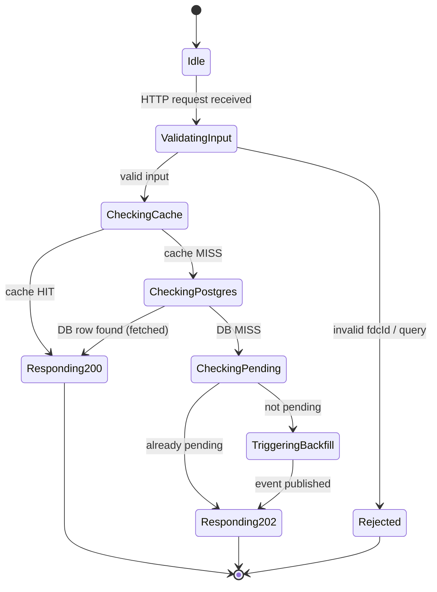
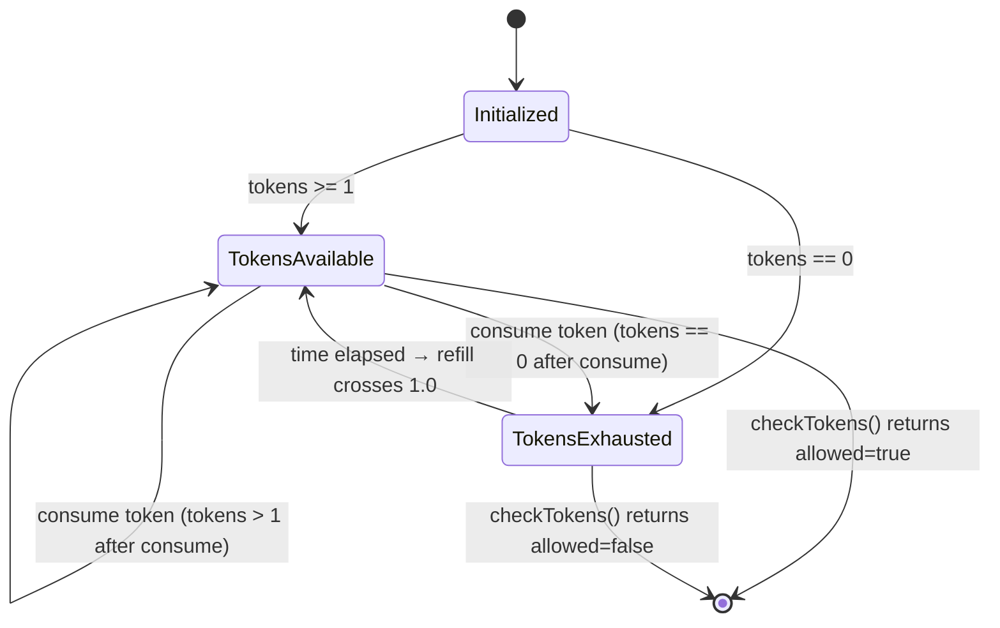
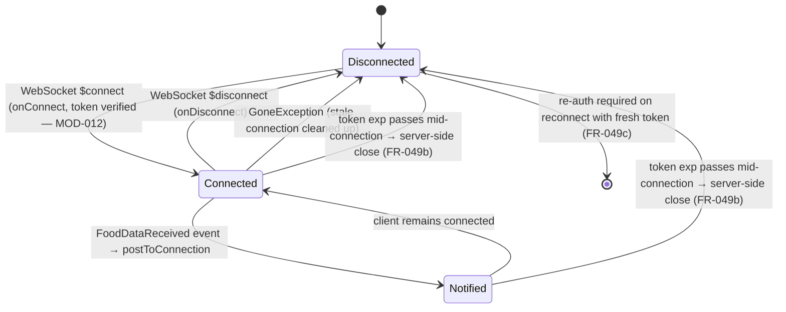
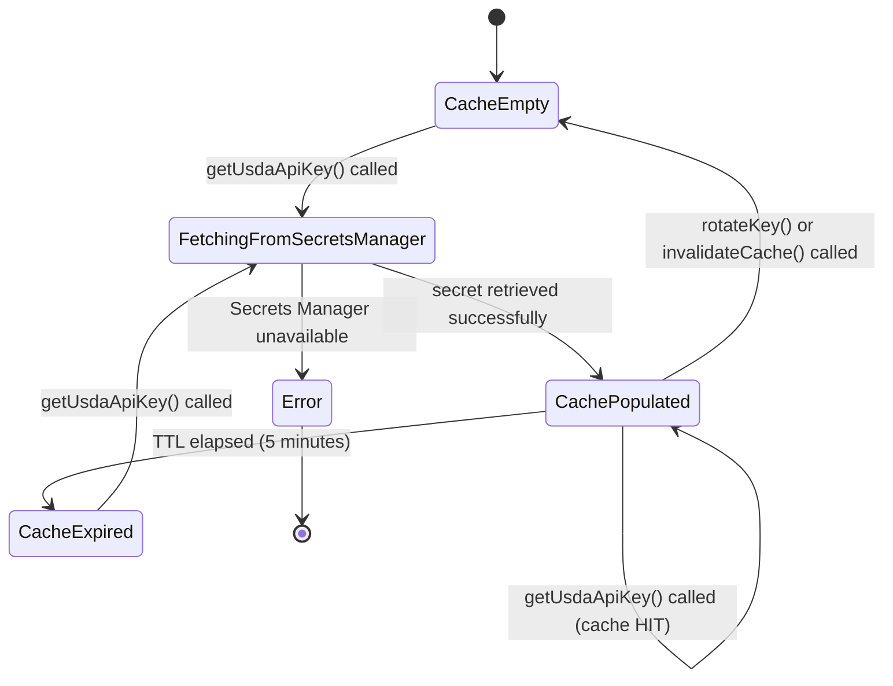
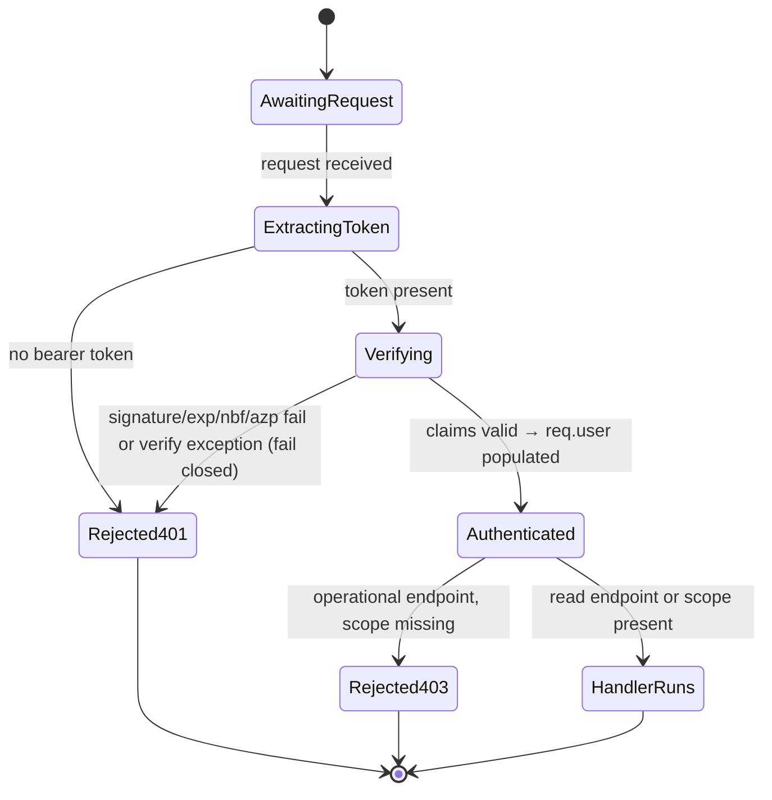
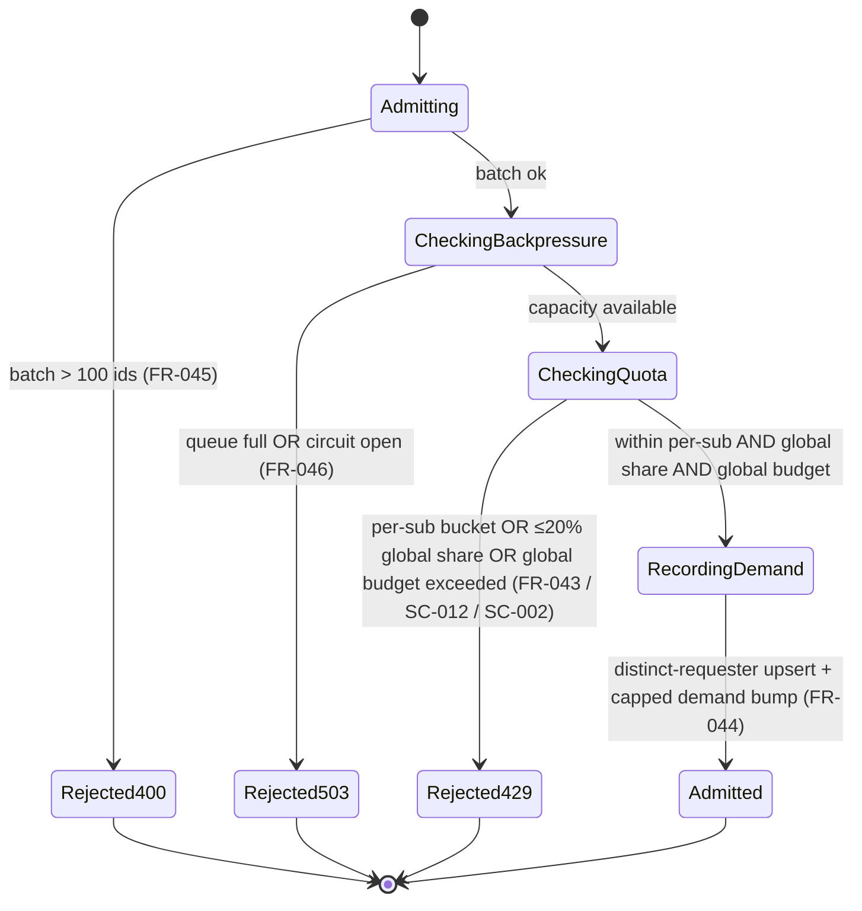

```mermaid
stateDiagram-v2
  [*] --> ReceivingAsyncEvent
  ReceivingAsyncEvent --> CheckingProducerPrincipal : EventBridge/queue/insert ingress
  CheckingProducerPrincipal --> RejectedUnauthorizedProducer : principal not on least-privilege allowlist (FR-048)
  CheckingProducerPrincipal --> CheckingProvenance : principal allowlisted
  CheckingProvenance --> RejectedProvenance : requestedBy missing / 'system' / unrecognized detail-type (FR-048)
  CheckingProvenance --> Admitted : requestedBy is authenticated sub OR named service principal
  Admitted --> [*] : proceed to TokenBucket → USDA fetch / enqueue (ARCH-004)
  RejectedUnauthorizedProducer --> [*] : event dropped + alarmed; no fetch, no enqueue
  RejectedProvenance --> [*] : event dropped + alarmed; no fetch, no enqueue
```

# Module Design: USDA Food Data Integration

**Feature Branch**: `003-usda-food-data`
**Created**: 2026-05-09
**Status**: Draft
**Source**: `specs/003-usda-food-data/v-model/architecture-design.md`
**Standard**: DO-178C / ISO 26262 Low-Level Module Design

---

## Overview

This document decomposes each of the 12 architecture modules (ARCH-001 through ARCH-012) into low-level module designs. Each module is assigned a unique `MOD-NNN` identifier and includes four mandatory views. ARCH-012 (FoodAuthGuard) decomposes into three modules — MOD-012 (`ClerkAuthMiddleware`), MOD-013 (`QuotaAndFairness`), and MOD-014 (`AsyncProducerAuthz`):

1. **Algorithmic / Logic View** — pseudocode describing the module's core logic
2. **State Machine View** — `stateDiagram-v2` (or `N/A Stateless` for pure functions)
3. **Internal Data Structures** — table of key data structures used internally
4. **Error Handling Return Codes** — table of error conditions and responses

---

## ID Schema

- **Module**: `MOD-NNN` — sequential low-level module identifier
- **Parent Architecture Module**: `ARCH-NNN` — the architecture module this MOD decomposes
- **Traceability**: Each MOD traces to one ARCH; each ARCH may have one or more MODs

---

## MOD-001 — FoodApiController (Request Handler)

**Parent ARCH**: ARCH-001
**Type**: Stateful (per-request lifecycle)
**Runtime**: NestJS controller on ECS/Fargate (Node.js 22.x), ALB-fronted

### 1. Algorithmic / Logic View

```
FUNCTION handleGetFood(event):
  fdcId = parsePathParam(event, "fdcId")
  IF NOT isValidFdcId(fdcId):
    RETURN 400 { error: "Invalid fdcId format" }

  // Layer 1: cache (lean-launch default Postgres; Redis is a deferred variant)
  cached = CacheService.get(fdcId)
  IF cached IS NOT NULL:
    MonitoringLogger.incrementMetric("cache.hit", 1)
    RETURN 200 { food: cached }

  // Layer 2: PostgreSQL
  row = PostgresRepository.findByFdcId(fdcId)
  IF row IS NOT NULL AND row.fetch_status == "fetched":
    CacheService.set(fdcId, row, TTL=3600)
    MonitoringLogger.incrementMetric("db.hit", 1)
    RETURN 200 { food: row }

  // Layer 3: Already pending?
  IF CacheService.isPending(fdcId):
    RETURN 202 { status: "pending", estimatedWaitSeconds: 30 }

  // Layer 4: Trigger async backfill — admit (MOD-013) then INSERT INTO fetch_queue (Postgres-as-queue)
  CacheService.markPending(fdcId)
  EventBridgePublisher.publishFoodRequested({ fdcId, requestedAt: now() })  // INSERT INTO fetch_queue + LISTEN/NOTIFY
  MonitoringLogger.incrementMetric("backfill.triggered", 1)
  RETURN 202 { status: "pending", estimatedWaitSeconds: 30 }

FUNCTION handleSearchFoods(event):
  query = parseQueryParam(event, "query")
  IF length(query) < 2:
    RETURN 400 { error: "Query too short" }
  results = PostgresRepository.searchFoods(query)
  RETURN 200 { foods: results }

FUNCTION handleGetFoodStatus(event):
  fdcId = parsePathParam(event, "fdcId")
  IF NOT isValidFdcId(fdcId):
    RETURN 400 { error: "Invalid fdcId format" }
  row = PostgresRepository.findByFdcId(fdcId)
  IF row IS NULL:
    pending = CacheService.isPending(fdcId)
    IF pending:
      RETURN 200 { status: "pending" }
    RETURN 404 { error: "Not found" }
  RETURN 200 { status: row.fetch_status, foodData: row IF row.fetch_status == "fetched" }

FUNCTION handleGetNutrition(event):
  fdcId = parsePathParam(event, "fdcId")
  IF NOT isValidFdcId(fdcId):
    RETURN 400 { error: "Invalid fdcId format" }
  row = PostgresRepository.findByFdcId(fdcId)
  IF row IS NULL OR row.fetch_status != "fetched":
    RETURN 404 { error: "Nutrition data not available" }
  RETURN 200 { nutrition: row.nutrients }

FUNCTION isValidFdcId(fdcId):
  RETURN fdcId IS integer AND fdcId > 0 AND fdcId <= 9999999
```

### 2. State Machine View



### 3. Internal Data Structures

| Name               | Type                                                                  | Description                                                                           |
| ------------------ | --------------------------------------------------------------------- | ------------------------------------------------------------------------------------- |
| `RequestContext`   | `{ fdcId: number, requestId: string, startTime: number }`             | Per-request metadata for logging                                                      |
| `RouteMap`         | `Map<string, HandlerFn>`                                              | Maps HTTP method + path pattern to handler function                                   |
| `ValidationResult` | `{ valid: boolean, error?: string }`                                  | Output of fdcId / query validation                                                    |
| `CacheLayerResult` | `{ source: 'cache' \| 'postgres' \| 'miss', data: FoodData \| null }` | Unified result from cache lookup chain (cache = lean-launch Postgres; Redis deferred) |

### 4. Error Handling Return Codes

| Error Condition                                  | HTTP Status | Response Body                                  | Action                                  |
| ------------------------------------------------ | ----------- | ---------------------------------------------- | --------------------------------------- |
| Invalid fdcId format (non-numeric, ≤0, >9999999) | 400         | `{ error: "Invalid fdcId format" }`            | Return immediately, no downstream calls |
| Query string too short (<2 chars)                | 400         | `{ error: "Query too short" }`                 | Return immediately                      |
| Cache unavailable (get)                          | —           | Fallthrough to PostgreSQL                      | Log warning, continue                   |
| PostgreSQL connection error                      | 503         | `{ error: "Service temporarily unavailable" }` | Log error, return 503                   |
| `fetch_queue` INSERT / NOTIFY failure            | 503         | `{ error: "Failed to queue backfill" }`        | Clear pending flag, return 503          |
| Unknown route                                    | 404         | `{ error: "Not found" }`                       | Return immediately                      |

---

## MOD-002 — EventBridgePublisher (Enqueue Emitter)

**Parent ARCH**: ARCH-002
**Type**: Stateless
**Runtime**: NestJS provider on ECS/Fargate (Node.js 22.x), called inline from ARCH-001 and ARCH-004

> Enqueue requests are NOT EventBridge events. `publishFoodRequested` / `publishFoodBatchRequested`
> are thin wrappers over an `INSERT INTO fetch_queue` row plus a `LISTEN/NOTIFY` wake to the Fargate
> consumer worker (Postgres-as-queue). EventBridge is retained ONLY for scheduled producers and the
> fire-and-forget `FoodDataReceived` fan-out (`publishFoodDataReceived`).

### 1. Algorithmic / Logic View

```
FUNCTION publishFoodRequested(payload: { fdcId, requestedAt, requestedBy }):
  IF NOT isValidFdcId(payload.fdcId):
    THROW ValidationError("Invalid fdcId")
  IF NOT isValidISO8601(payload.requestedAt):
    THROW ValidationError("Invalid requestedAt timestamp")

  // Postgres-as-queue: insert a queued row, then NOTIFY the consumer worker.
  row = {
    fdc_id: payload.fdcId,
    priority: "high",
    status: "queued",
    requested_by: payload.requestedBy,   // authenticated provenance (FR-048)
    requested_at: payload.requestedAt,
    attempts: 0
  }
  inserted = FetchQueue.insert(row)        // INSERT INTO fetch_queue ... ON CONFLICT (fdc_id) DO NOTHING
  Postgres.notify("fetch_queue", JSON.stringify({ fdcId: payload.fdcId }))  // LISTEN/NOTIFY wake
  RETURN { queueRowId: inserted.id }

FUNCTION publishFoodBatchRequested(payload: { fdcIds, requestedAt, requestedBy }):
  IF length(payload.fdcIds) == 0 OR length(payload.fdcIds) > 100:
    THROW ValidationError("fdcIds must be 1–100 items")   // client-facing batch cap (FR-045)
  FOR EACH fdcId IN payload.fdcIds:
    IF NOT isValidFdcId(fdcId):
      THROW ValidationError("Invalid fdcId: " + fdcId)

  rows = payload.fdcIds.map(fdcId => ({
    fdc_id: fdcId, priority: "low", status: "queued",
    requested_by: payload.requestedBy, requested_at: payload.requestedAt, attempts: 0
  }))
  inserted = FetchQueue.insertMany(rows)   // INSERT ... ON CONFLICT (fdc_id) DO NOTHING
  Postgres.notify("fetch_queue", JSON.stringify({ fdcIds: payload.fdcIds }))  // LISTEN/NOTIFY wake
  RETURN { queueRowIds: inserted.ids }

FUNCTION publishFoodDataReceived(payload: { fdcId, foodData }):
  // FoodDataReceived stays on EventBridge — fire-and-forget fan-out to the (deferred) WS notifier.
  entry = {
    Source: "food-service",
    DetailType: "FoodDataReceived",
    Detail: JSON.stringify({ fdcId: payload.fdcId, foodData: payload.foodData }),
    EventBusName: ENV.EVENT_BUS_NAME
  }
  response = EventBridgeClient.putEvents({ Entries: [entry] })
  // Fire-and-forget: log failure but do not throw
  IF response.FailedEntryCount > 0:
    MonitoringLogger.logRequest("eb-publish-fail", { fdcId: payload.fdcId }, 0)
```

### 2. State Machine View

`N/A Stateless` — EventBridgePublisher is a pure function module. Each call is independent with no retained state between invocations.

### 3. Internal Data Structures

| Name                      | Type                                                                                  | Description                                                              |
| ------------------------- | ------------------------------------------------------------------------------------- | ------------------------------------------------------------------------ |
| `FetchQueueRow`           | `{ fdc_id, priority: 'high' \| 'low', status, requested_by, requested_at, attempts }` | Row inserted into the Postgres `fetch_queue` for enqueue requests        |
| `EnqueueResult`           | `{ queueRowId: string }`                                                              | Successful `fetch_queue` INSERT + NOTIFY response                        |
| `EventEntry`              | `{ Source, DetailType, Detail, EventBusName }`                                        | EventBridge PutEvents entry shape (FoodDataReceived fan-out only)        |
| `EventBridgeClientConfig` | `{ region: string, endpoint?: string }`                                               | SDK client configuration (injected at cold start; FoodDataReceived only) |

### 4. Error Handling Return Codes

| Error Condition                                       | Error Type        | Response                    | Action                                         |
| ----------------------------------------------------- | ----------------- | --------------------------- | ---------------------------------------------- |
| Invalid fdcId in payload                              | `ValidationError` | Throw                       | Caller receives error; no `fetch_queue` INSERT |
| Invalid timestamp format                              | `ValidationError` | Throw                       | Caller receives error                          |
| fdcIds array empty or >100                            | `ValidationError` | Throw                       | Caller receives error (FR-045)                 |
| `fetch_queue` INSERT / NOTIFY failure                 | `EnqueueError`    | Throw (FoodRequested/Batch) | Caller returns 503; pending flag cleared       |
| EventBridge `FailedEntryCount > 0` (FoodDataReceived) | Log only          | No throw                    | Fire-and-forget; log warning                   |
| DB / NOTIFY network timeout                           | `EnqueueError`    | Throw                       | Caller handles retry                           |

---

## MOD-003 — FetchQueueRouter (Postgres-as-Queue Priority Router)

**Parent ARCH**: ARCH-003
**Type**: Stateless (Postgres `fetch_queue` schema + lease/priority claim logic)
**Runtime**: Postgres `fetch_queue` table + `LISTEN/NOTIFY`; claim queries run inside the Fargate consumer worker (ARCH-004)

> No SQS, no EventBridge rules, no DLQ. Routing is expressed as a `priority` column on `fetch_queue`
> ('high' for FoodRequested, 'low' for FoodBatchRequested). The single Fargate consumer worker
> (one instance via a Postgres advisory lock) claims rows highest-priority-first under a row lease
> (`FOR UPDATE SKIP LOCKED` + `lease_expires_at`, the visibility-timeout analog — FR-018). Exhausted
> rows become tombstones (`status='tombstone'`), the DLQ analog.

### 1. Algorithmic / Logic View

```
// fetch_queue schema (Postgres-as-queue). Priority is a column, not a separate queue.
//   fetch_queue(fdc_id PK, priority 'high'|'low', status 'queued'|'leased'|'tombstone',
//               requested_by, requested_at, attempts, lease_expires_at)
// ON CONFLICT (fdc_id) DO NOTHING makes repeat enqueues idempotent — the dedup analog (no FIFO needed).

// Single-instance worker guard: one consumer drains the queue (advisory lock).
FUNCTION acquireWorkerLock():
  RETURN Postgres.query("SELECT pg_try_advisory_lock($1)", [FETCH_QUEUE_LOCK_KEY])

// Claim the next batch, highest priority first, under a row lease (visibility-timeout analog, FR-018).
FUNCTION claimNext(batchSize, leaseSeconds):
  sql = """
    UPDATE fetch_queue
    SET status = 'leased', lease_expires_at = NOW() + ($2 || ' seconds')::interval, attempts = attempts + 1
    WHERE fdc_id IN (
      SELECT fdc_id FROM fetch_queue
      WHERE status = 'queued' OR (status = 'leased' AND lease_expires_at < NOW())  -- reclaim expired leases
      ORDER BY (priority = 'high') DESC, requested_at ASC
      LIMIT $1
      FOR UPDATE SKIP LOCKED
    )
    RETURNING *
  """
  RETURN Postgres.query(sql, [batchSize, leaseSeconds])

// Wake on enqueue: worker LISTENs; producers NOTIFY 'fetch_queue' (low-latency, no polling-only loop).
FUNCTION listenForWork():
  Postgres.execute("LISTEN fetch_queue")
```

### 2. State Machine View

`N/A Stateless` — FetchQueueRouter is the `fetch_queue` schema plus deterministic claim/lease SQL. No in-process runtime state; routing is a `priority` ORDER BY and rows are leased/reclaimed by timestamp.

### 3. Internal Data Structures

| Name            | Type                                                                                                                                         | Description                                                   |
| --------------- | -------------------------------------------------------------------------------------------------------------------------------------------- | ------------------------------------------------------------- |
| `FetchQueueRow` | `{ fdc_id, priority: 'high' \| 'low', status: 'queued' \| 'leased' \| 'tombstone', requested_by, requested_at, attempts, lease_expires_at }` | Postgres `fetch_queue` row — the unit of work                 |
| `ClaimBatch`    | `{ rows: FetchQueueRow[], leaseExpiresAt: timestamp }`                                                                                       | Result of a `FOR UPDATE SKIP LOCKED` priority claim           |
| `WorkerLock`    | `{ lockKey: number, acquired: boolean }`                                                                                                     | `pg_try_advisory_lock` result enforcing single-instance drain |

### 4. Error Handling Return Codes

| Error Condition                                | Handling                          | Action                                                            |
| ---------------------------------------------- | --------------------------------- | ----------------------------------------------------------------- |
| Worker advisory lock already held              | `pg_try_advisory_lock` returns 0  | This instance idles; the single holder drains the queue           |
| Lease expired before completion (worker crash) | Row reclaimed by next `claimNext` | `lease_expires_at < NOW()` makes the row claimable again (FR-018) |
| Row exhausts retry budget (attempts > 5)       | Set `status='tombstone'`          | Tombstone row (DLQ analog); alarmed, no further fetch (FR-016)    |
| `NOTIFY` lost / worker not LISTENing           | Periodic poll fallback            | Claim loop also polls on an interval; NOTIFY only reduces latency |
| Duplicate enqueue (same fdc_id queued)         | `ON CONFLICT (fdc_id) DO NOTHING` | Duplicate silently dropped — correct behavior (dedup analog)      |

---

## MOD-004 — FoodConsumerService (fetch_queue Worker)

**Parent ARCH**: ARCH-004
**Type**: Stateful (long-running drain loop; single instance via Postgres advisory lock)
**Runtime**: Fargate consumer worker (Node.js 22.x), `LISTEN fetch_queue` + lease-claim loop
**Target source files**: `packages/services/food-service/src/worker/...`

### 1. Algorithmic / Logic View

```
// Single-instance drain loop. One worker holds the advisory lock; it LISTENs for NOTIFY and
// also polls on an interval. Each iteration claims a leased batch (FOR UPDATE SKIP LOCKED, FR-018).
FUNCTION runWorker():
  IF NOT FetchQueueRouter.acquireWorkerLock():
    RETURN  // another instance is draining; idle
  FetchQueueRouter.listenForWork()       // LISTEN fetch_queue
  LOOP:
    waitForNotifyOrInterval()
    batch = FetchQueueRouter.claimNext(batchSize = 20, leaseSeconds = 90)  // lease = visibility-timeout analog
    FOR EACH row IN batch:
      processRow(row)

FUNCTION processRow(row):
  // Validate async provenance before any USDA consumption (MOD-014, FR-048).
  AsyncProducerAuthz.assertEnqueueProvenance(dbSessionRole, row.requested_by)

  fdcId = row.fdc_id

  // Rate limit check
  tokenResult = TokenBucketRateLimiter.checkTokens()
  IF NOT tokenResult.allowed:
    waitSeconds = TokenBucketRateLimiter.getWaitTime()
    FetchQueue.extendLease(row.fdc_id, waitSeconds + 5)   // defer; keep row leased, re-claim later
    RETURN

  // Fetch from USDA (USDA hard cap is 20 ids/call, FR-023; the client batches accordingly)
  TRY:
    foods = UsdaApiClient.fetchFoods([fdcId])
  CATCH UsdaApiError(status=429):
    // Rate limited by USDA despite our token bucket — back off (exponential, FR-016)
    FetchQueue.requeueWithBackoff(row, baseSeconds = 60)
    RETURN
  CATCH UsdaApiError(status=5xx):
    // Transient USDA error — retry with exponential backoff up to 5 attempts, then tombstone (FR-016)
    IF row.attempts >= 5:
      FetchQueue.tombstone(row.fdc_id, reason = "usda_5xx_exhausted")
    ELSE:
      FetchQueue.requeueWithBackoff(row, baseSeconds = 5)
    RETURN
  CATCH UsdaApiError(status=404):
    // Food not found in USDA — immediate tombstone, no retry (FR-016)
    PostgresRepository.updateFetchStatus(fdcId, "not_found")
    FetchQueue.tombstone(row.fdc_id, reason = "usda_404")
    CacheService.clearPending(fdcId)
    RETURN

  // Persist results, then delete the queue row (ack)
  FOR EACH food IN foods:
    PostgresRepository.upsertFood(food)
    CacheService.invalidate(food.fdcId)
    CacheService.clearPending(food.fdcId)
    EventBridgePublisher.publishFoodDataReceived({ fdcId: food.fdcId, foodData: food })  // EventBridge fan-out

  FetchQueue.delete(row.fdc_id)   // ack: remove the completed row
  MonitoringLogger.incrementMetric("consumer.processed", length(foods))
```

### 2. State Machine View

```mermaid
stateDiagram-v2
  [*] --> Idle
  Idle --> Draining : advisory lock acquired (single instance)
  Draining --> ClaimingBatch : NOTIFY received or poll interval
  ClaimingBatch --> Draining : no queued rows (idle until next wake)
  ClaimingBatch --> CheckingProvenance : rows leased (FOR UPDATE SKIP LOCKED)
  CheckingProvenance --> CheckingRateLimit : provenance ok (MOD-014)
  CheckingRateLimit --> DeferringLease : tokens exhausted
  CheckingRateLimit --> FetchingFromUsda : tokens available
  DeferringLease --> Draining : lease extended; row re-claimed later
  FetchingFromUsda --> PersistingResults : USDA 200 OK
  FetchingFromUsda --> RequeueingWithBackoff : USDA 429 (rate limited)
  FetchingFromUsda --> RequeueingWithBackoff : USDA 5xx (transient, attempts ≤ 5)
  FetchingFromUsda --> Tombstoning : USDA 5xx exhausted (attempts > 5) or USDA 404
  PersistingResults --> PublishingEvent : upsert complete
  PublishingEvent --> AckingRow : FoodDataReceived published
  AckingRow --> Draining : row deleted (next row)
  RequeueingWithBackoff --> Draining : lease released, backoff applied
  Tombstoning --> Draining : status='tombstone' (DLQ analog)
```

### 3. Internal Data Structures

| Name            | Type                                                                                   | Description                                                       |
| --------------- | -------------------------------------------------------------------------------------- | ----------------------------------------------------------------- |
| `FetchQueueRow` | `{ fdc_id, priority, status, requested_by, requested_at, attempts, lease_expires_at }` | Leased `fetch_queue` row being processed                          |
| `ProcessResult` | `{ acked: boolean, fdcId: number }`                                                    | Per-row processing outcome                                        |
| `LeaseAction`   | `'delete' \| 'extend' \| 'requeue_backoff' \| 'tombstone'`                             | Disposition applied to a leased row after processing              |
| `RetryState`    | `{ attempts: number, lastError: string }`                                              | Carried on the `fetch_queue` row for exponential backoff (FR-016) |

### 4. Error Handling Return Codes

| Error Condition                                | Action                                     | fetch_queue Outcome                                    |
| ---------------------------------------------- | ------------------------------------------ | ------------------------------------------------------ |
| Token bucket exhausted                         | `extendLease(waitTime + 5s)`               | Row stays leased; re-claimed after wait                |
| USDA API 429                                   | `requeueWithBackoff(60s)`                  | Row re-queued after backoff                            |
| USDA API 5xx (attempts ≤ 5)                    | `requeueWithBackoff` (exponential, FR-016) | Row re-queued; retried up to 5 attempts                |
| USDA API 5xx (attempts > 5)                    | `tombstone(status='tombstone')`            | Tombstone row (DLQ analog) + alarm                     |
| USDA API 404                                   | Mark `not_found` in DB, `tombstone`        | Immediate tombstone, no retry (FR-016)                 |
| PostgreSQL upsert failure                      | `requeueWithBackoff`                       | Row re-queued; retried under FR-016 budget             |
| Cache invalidation failure                     | Log warning, continue                      | Non-fatal; stale cache will expire via TTL             |
| EventBridge publish failure (FoodDataReceived) | Log warning, continue                      | Non-fatal; fire-and-forget                             |
| Worker crash mid-lease                         | Lease expires → row reclaimed              | `lease_expires_at < NOW()` re-exposes the row (FR-018) |

---

## MOD-005 — TokenBucketRateLimiter (Atomic Token Bucket Rate Limiter)

**Parent ARCH**: ARCH-005
**Type**: Stateful (state stored in Postgres by default; Redis is a deferred variant)
**Runtime**: Called from the ARCH-004 Fargate consumer worker; state in the `kitchensink_food` logical database (lean-launch default — a single-row UPDATE … RETURNING token-bucket txn). Redis + the Lua script below is the deferred variant.

### 1. Algorithmic / Logic View

```
// Default (lean-launch) bucket: a single fetch_rate_limiter row mutated atomically in one
// `UPDATE ... RETURNING` Postgres txn (refill-then-consume), same semantics as the Lua script.
// The Redis Lua variant below is functionally identical and is the DEFERRED form.

// Redis key schema (DEFERRED Redis variant)
BUCKET_KEY = "rate_limiter:usda:tokens"
LAST_REFILL_KEY = "rate_limiter:usda:last_refill"
CAPACITY = 1000          // max tokens (1,000 calls/hour)
REFILL_RATE = 1000/3600  // tokens per second ≈ 0.2778

// Atomic Lua script executed via EVAL (single Redis round-trip) — DEFERRED variant
LUA_SCRIPT = """
  local tokens = tonumber(redis.call('GET', KEYS[1])) or ARGV[1]
  local last_refill = tonumber(redis.call('GET', KEYS[2])) or ARGV[3]
  local now = tonumber(ARGV[3])
  local capacity = tonumber(ARGV[1])
  local refill_rate = tonumber(ARGV[2])

  -- Refill tokens based on elapsed time
  local elapsed = now - last_refill
  local new_tokens = math.min(capacity, tokens + elapsed * refill_rate)

  -- Check if we can consume one token
  if new_tokens >= 1 then
    new_tokens = new_tokens - 1
    redis.call('SET', KEYS[1], new_tokens, 'EX', 7200)
    redis.call('SET', KEYS[2], now, 'EX', 7200)
    return { 1, math.floor(new_tokens) }  -- { allowed=true, tokensRemaining }
  else
    redis.call('SET', KEYS[1], new_tokens, 'EX', 7200)
    redis.call('SET', KEYS[2], now, 'EX', 7200)
    return { 0, 0 }  -- { allowed=false, tokensRemaining=0 }
  end
"""

FUNCTION checkTokens():
  now = unixTimestampSeconds()
  result = Redis.eval(LUA_SCRIPT, keys=[BUCKET_KEY, LAST_REFILL_KEY],
                      args=[CAPACITY, REFILL_RATE, now])
  RETURN { allowed: result[0] == 1, tokensRemaining: result[1] }

FUNCTION getWaitTime():
  tokens = Redis.get(BUCKET_KEY) OR 0
  IF tokens >= 1:
    RETURN 0
  deficit = 1 - tokens
  RETURN ceil(deficit / REFILL_RATE)  // seconds until next token available
```

### 2. State Machine View



### 3. Internal Data Structures

| Name                | Type                                                                   | Description                                                         |
| ------------------- | ---------------------------------------------------------------------- | ------------------------------------------------------------------- |
| `BucketState`       | `{ tokens: float, lastRefill: number }`                                | Persisted in Redis; represents current bucket state                 |
| `TokenCheckResult`  | `{ allowed: boolean, tokensRemaining: number }`                        | Return value of `checkTokens()`                                     |
| `LuaScript`         | `string`                                                               | Atomic Lua script loaded via `SCRIPT LOAD` for SHA-based invocation |
| `RateLimiterConfig` | `{ capacity: 1000, refillRatePerSecond: 0.2778, keyTtlSeconds: 7200 }` | Static configuration constants                                      |

### 4. Error Handling Return Codes

| Error Condition                                        | Action                                    | Caller Impact                                                     |
| ------------------------------------------------------ | ----------------------------------------- | ----------------------------------------------------------------- |
| Store unavailable (Postgres/Redis, connection refused) | Throw `RateLimiterError`                  | ARCH-004 treats as "allowed=false"; extends lease / re-queues row |
| Store timeout (>100ms)                                 | Throw `RateLimiterError`                  | Same as unavailable                                               |
| Bucket txn / Lua script execution error                | Throw `RateLimiterError`                  | ARCH-004 re-queues row                                            |
| Negative token count (clock skew)                      | Clamp to 0 in the bucket txn / Lua script | Graceful degradation                                              |
| Key expiry (TTL elapsed, bucket reset)                 | Initializes fresh bucket at CAPACITY      | Correct behavior; bucket refills                                  |

---

## MOD-006 — FoodPostgresRepository (Database Access Layer)

**Parent ARCH**: ARCH-006
**Type**: Stateless (connection pool held by the long-running Fargate process)
**Runtime**: ECS/Fargate (Node.js 22.x), uses `pg` (node-postgres) against the `kitchensink_food` logical database on the shared `kitchensink-data-{stage}` instance (no new RDS, no cluster)

### 1. Algorithmic / Logic View

```
FUNCTION findByFdcId(fdcId: number): FoodData | null
  sql = "SELECT * FROM foods WHERE fdc_id = $1 LIMIT 1"
  result = pool.query(sql, [fdcId])
  IF result.rows.length == 0:
    RETURN null
  RETURN mapRowToFoodData(result.rows[0])

FUNCTION upsertFood(food: FoodData): { success: boolean }
  sql = """
    INSERT INTO foods (fdc_id, description, brand_owner, nutrients, fetch_status, fetched_at)
    VALUES ($1, $2, $3, $4, 'fetched', NOW())
    ON CONFLICT (fdc_id) DO UPDATE SET
      description = EXCLUDED.description,
      brand_owner = EXCLUDED.brand_owner,
      nutrients = EXCLUDED.nutrients,
      fetch_status = 'fetched',
      fetched_at = NOW(),
      updated_at = NOW()
  """
  pool.query(sql, [food.fdcId, food.description, food.brandOwner, JSON.stringify(food.nutrients)])
  RETURN { success: true }

FUNCTION updateFetchStatus(fdcId: number, status: string): { success: boolean }
  VALIDATE status IN ["pending", "fetched", "not_found", "error"]
  sql = "UPDATE foods SET fetch_status = $1, updated_at = NOW() WHERE fdc_id = $2"
  pool.query(sql, [status, fdcId])
  RETURN { success: true }

FUNCTION searchFoods(query: string): FoodData[]
  // Use PostgreSQL full-text search with pg_trgm for fuzzy matching
  sql = """
    SELECT *, ts_rank(search_vector, plainto_tsquery('english', $1)) AS rank
    FROM foods
    WHERE search_vector @@ plainto_tsquery('english', $1)
       OR description ILIKE '%' || $1 || '%'
    ORDER BY rank DESC
    LIMIT 50
  """
  result = pool.query(sql, [query])
  RETURN result.rows.map(mapRowToFoodData)

FUNCTION mapRowToFoodData(row): FoodData
  RETURN {
    fdcId: row.fdc_id,
    description: row.description,
    brandOwner: row.brand_owner,
    nutrients: JSON.parse(row.nutrients),
    fetchStatus: row.fetch_status,
    fetchedAt: row.fetched_at
  }
```

### 2. State Machine View

`N/A Stateless` — FoodPostgresRepository is a pure data-access module. Each method executes a discrete SQL query with no retained state between calls. Connection pooling is held by the long-running Fargate process against the shared `kitchensink-data-{stage}` instance, not by this module.

### 3. Internal Data Structures

| Name          | Type                                                                                                                            | Description                                         |
| ------------- | ------------------------------------------------------------------------------------------------------------------------------- | --------------------------------------------------- |
| `FoodData`    | `{ fdcId: number, description: string, brandOwner: string, nutrients: NutrientMap, fetchStatus: FetchStatus, fetchedAt: Date }` | Domain model for a food item                        |
| `NutrientMap` | `Record<string, { amount: number, unit: string }>`                                                                              | JSONB column; keyed by nutrient name                |
| `FetchStatus` | `'pending' \| 'fetched' \| 'not_found' \| 'error'`                                                                              | Enum for food fetch lifecycle                       |
| `PoolConfig`  | `{ host, port, database, user, password, max: 10, idleTimeoutMillis: 30000 }`                                                   | pg Pool configuration (password from SecretManager) |

### 4. Error Handling Return Codes

| Error Condition                      | Error Type                | Action                              |
| ------------------------------------ | ------------------------- | ----------------------------------- |
| Connection refused / timeout         | `PostgresConnectionError` | Throw; caller returns 503           |
| Query timeout (>5s)                  | `PostgresQueryTimeout`    | Throw; caller returns 503           |
| Unique constraint violation (upsert) | Handled by `ON CONFLICT`  | No error; upsert succeeds           |
| Invalid fetch_status value           | `ValidationError`         | Throw before query execution        |
| Row not found (`findByFdcId`)        | —                         | Return `null` (not an error)        |
| JSON parse error (nutrients column)  | `DataIntegrityError`      | Log error, return null for that row |

---

## MOD-007 — FoodCacheService (Cache & Pending-Set Manager)

**Parent ARCH**: ARCH-007
**Type**: Stateless (state in the cache store — lean-launch Postgres by default; Redis is a deferred variant)
**Runtime**: ECS/Fargate (Node.js 22.x). Lean-launch default backs cache + pending-set with the `kitchensink_food` Postgres database; the deferred Redis variant uses `ioredis` (the key/command schema below describes that variant)

### 1. Algorithmic / Logic View

```
// Key schema
FOOD_KEY(fdcId) = "food:" + fdcId          // Hash or JSON string; TTL = 3600s
PENDING_SET_KEY = "pending_fetch"           // Redis Set of fdcIds currently being fetched

FUNCTION get(fdcId: number): FoodData | null
  raw = Redis.get(FOOD_KEY(fdcId))
  IF raw IS NULL:
    RETURN null
  RETURN JSON.parse(raw)

FUNCTION set(fdcId: number, data: FoodData, ttl: number): void
  Redis.set(FOOD_KEY(fdcId), JSON.stringify(data), "EX", ttl)

FUNCTION invalidate(fdcId: number): void
  Redis.del(FOOD_KEY(fdcId))

FUNCTION isPending(fdcId: number): boolean
  result = Redis.sismember(PENDING_SET_KEY, fdcId.toString())
  RETURN result == 1

FUNCTION markPending(fdcId: number): void
  Redis.sadd(PENDING_SET_KEY, fdcId.toString())
  // Set expiry on the set member via a separate key to avoid stale pending entries
  Redis.set("pending_ttl:" + fdcId, "1", "EX", 300)  // 5-minute pending TTL

FUNCTION clearPending(fdcId: number): void
  Redis.srem(PENDING_SET_KEY, fdcId.toString())
  Redis.del("pending_ttl:" + fdcId)
```

### 2. State Machine View

`N/A Stateless` — FoodCacheService is a thin wrapper over the cache store (lean-launch Postgres by default; the deferred Redis variant maps the same operations to Redis commands). All state lives in the store; the module itself retains no in-process state between requests.

### 3. Internal Data Structures

| Name                | Type                                                                              | Description                                                                                                        |
| ------------------- | --------------------------------------------------------------------------------- | ------------------------------------------------------------------------------------------------------------------ |
| `CacheKey`          | `string`                                                                          | `"food:{fdcId}"` — cache key for cached food data (Postgres row key by default; Redis key in the deferred variant) |
| `PendingSetKey`     | `"pending_fetch"`                                                                 | Pending-set key tracking in-flight fdcIds (Postgres set/table by default; Redis Set in the deferred variant)       |
| `PendingTtlKey`     | `string`                                                                          | `"pending_ttl:{fdcId}"` — sentinel with 5-min TTL to auto-expire stale pending entries                             |
| `CacheClientConfig` | `{ host, port, password, tls: true, connectTimeout: 2000, commandTimeout: 1000 }` | Cache client configuration (ioredis shape shown for the deferred Redis variant)                                    |

### 4. Error Handling Return Codes

| Error Condition                      | Action                        | Caller Impact                                                       |
| ------------------------------------ | ----------------------------- | ------------------------------------------------------------------- |
| Cache store connection refused       | Throw `CacheUnavailableError` | ARCH-001 falls through to PostgreSQL                                |
| Cache command timeout (>1s)          | Throw `CacheUnavailableError` | ARCH-001 falls through to PostgreSQL                                |
| JSON parse error on `get()`          | Log error, return `null`      | Cache treated as miss; PostgreSQL consulted                         |
| `isPending` returns unexpected value | Treat as `false`              | Conservative: triggers backfill (safe)                              |
| `markPending` failure                | Log warning, continue         | Risk of duplicate enqueue (`fetch_queue` ON CONFLICT dedup handles) |
| `clearPending` failure               | Log warning, continue         | Stale pending entry expires via TTL sentinel                        |

---

## MOD-008 — UsdaApiClient (HTTP Client for USDA FoodData Central)

**Parent ARCH**: ARCH-008
**Type**: Stateless
**Runtime**: Node.js 22.x, uses native `fetch`; invoked inline from the ARCH-004 Fargate consumer worker
**Target source file**: `packages/clients/usda/src/usda-api.client.ts` (package `@kitchensink/usda-client`)

### 1. Algorithmic / Logic View

```
USDA_BASE_URL = "https://api.nal.usda.gov/fdc/v1"
MAX_BATCH_SIZE = 20
REQUEST_TIMEOUT_MS = 10000

FUNCTION fetchFoods(fdcIds: number[]): USDAFoodResponse[]
  IF length(fdcIds) == 0:
    RETURN []
  IF length(fdcIds) > MAX_BATCH_SIZE:
    THROW ValidationError("Batch size exceeds maximum of 20")

  apiKey = SecretManager.getUsdaApiKey()

  requestBody = {
    fdcIds: fdcIds,
    format: "abridged",
    nutrients: [203, 204, 205, 208, 269, 291]  // protein, fat, carbs, energy, sugars, fiber
  }

  response = HTTP.POST(
    url: USDA_BASE_URL + "/foods",
    headers: { "X-Api-Key": apiKey, "Content-Type": "application/json" },
    body: JSON.stringify(requestBody),
    timeout: REQUEST_TIMEOUT_MS
  )

  IF response.status == 200:
    data = JSON.parse(response.body)
    RETURN data.map(mapUsdaResponseToFoodData)
  ELSE IF response.status == 401:
    THROW UsdaApiError("Invalid API key", 401)
  ELSE IF response.status == 429:
    THROW UsdaApiError("USDA rate limit exceeded", 429)
  ELSE IF response.status >= 500:
    THROW UsdaApiError("USDA server error: " + response.status, response.status)
  ELSE:
    THROW UsdaApiError("Unexpected USDA response: " + response.status, response.status)

FUNCTION mapUsdaResponseToFoodData(usdaItem): FoodData
  RETURN {
    fdcId: usdaItem.fdcId,
    description: usdaItem.description,
    brandOwner: usdaItem.brandOwner OR null,
    nutrients: extractNutrients(usdaItem.foodNutrients),
    fetchStatus: "fetched",
    fetchedAt: new Date()
  }

FUNCTION extractNutrients(foodNutrients): NutrientMap
  result = {}
  FOR EACH n IN foodNutrients:
    result[n.nutrientName] = { amount: n.value, unit: n.unitName }
  RETURN result
```

### 2. State Machine View

`N/A Stateless` — UsdaApiClient is a pure HTTP client. Each call is independent; no connection pooling or session state is maintained between invocations.

### 3. Internal Data Structures

| Name               | Type                                                                                                     | Description                            |
| ------------------ | -------------------------------------------------------------------------------------------------------- | -------------------------------------- |
| `UsdaFoodsRequest` | `{ fdcIds: number[], format: 'abridged', nutrients: number[] }`                                          | POST body for USDA `/foods` endpoint   |
| `UsdaFoodItem`     | `{ fdcId, description, brandOwner?, foodNutrients: UsdaNutrient[] }`                                     | Raw USDA API response item             |
| `UsdaNutrient`     | `{ nutrientId, nutrientName, value, unitName }`                                                          | Individual nutrient from USDA response |
| `UsdaApiError`     | `{ message: string, statusCode: number }`                                                                | Typed error for USDA API failures      |
| `NutrientIdMap`    | `{ 203: 'Protein', 204: 'Total Fat', 205: 'Carbohydrates', 208: 'Energy', 269: 'Sugars', 291: 'Fiber' }` | Mapping of USDA nutrient IDs to names  |

### 4. Error Handling Return Codes

| Error Condition              | Error Type        | Status Code | Action                                                  |
| ---------------------------- | ----------------- | ----------- | ------------------------------------------------------- |
| HTTP 401 Unauthorized        | `UsdaApiError`    | 401         | Throw; ARCH-004 alerts on-call (key rotation needed)    |
| HTTP 429 Too Many Requests   | `UsdaApiError`    | 429         | Throw; ARCH-004 re-queues row with 60s backoff          |
| HTTP 500–599 Server Error    | `UsdaApiError`    | 5xx         | Throw; ARCH-004 re-queues row with backoff (≤5, FR-016) |
| HTTP 404 Not Found           | `UsdaApiError`    | 404         | Throw; ARCH-004 marks food `not_found` + tombstones row |
| Request timeout (>10s)       | `UsdaApiError`    | 0           | Throw; ARCH-004 re-queues row with backoff              |
| JSON parse error on response | `UsdaApiError`    | —           | Throw; ARCH-004 re-queues row with backoff              |
| fdcIds array >20             | `ValidationError` | —           | Throw before HTTP call (USDA 20/call hard cap, FR-023)  |

---

## MOD-009 — WebSocketNotifier (Real-Time Client Notification)

**Parent ARCH**: ARCH-009
**Type**: Stateless (connection state in API Gateway WebSocket)
**Runtime**: AWS Lambda (Node.js 22.x), uses `@aws-sdk/client-apigatewaymanagementapi`

### 1. Algorithmic / Logic View

```
// NOTE: ARCH-009 is launch-deferred. EventBridge rule for FoodDataReceived
// has no target until US-9 is implemented. This module is scaffolded only.

FUNCTION notifyClients(fdcId: number, foodData: FoodData): number
  // Retrieve active WebSocket connection IDs for clients subscribed to fdcId
  connectionIds = ConnectionStore.getConnectionsForFdcId(fdcId)
  // ConnectionStore is a DynamoDB table: { connectionId PK, fdcId SK, ttl }

  notifiedCount = 0
  FOR EACH connectionId IN connectionIds:
    TRY:
      ApiGatewayManagementClient.postToConnection({
        ConnectionId: connectionId,
        Data: JSON.stringify({ type: "FoodDataReceived", fdcId, foodData })
      })
      notifiedCount++
    CATCH GoneException:
      // Client disconnected; clean up stale connection
      ConnectionStore.deleteConnection(connectionId)
    CATCH Error:
      // Log but continue — fire-and-forget
      MonitoringLogger.logRequest("ws-notify-fail", { connectionId, fdcId }, 0)

  RETURN notifiedCount

FUNCTION onConnect(connectionId: string, fdcId: number): void
  ConnectionStore.putConnection({ connectionId, fdcId, ttl: now() + 3600 })

FUNCTION onDisconnect(connectionId: string): void
  ConnectionStore.deleteConnection(connectionId)

// Mid-connection token expiry (FR-049b). The token verified at $connect (MOD-012 authorizeConnect)
// carries a fixed `exp`. A long-lived WS connection MUST NOT outlive its token: when `exp` passes,
// the connection is CLOSED (re-auth happens on reconnect). The connection's tokenExp is captured at
// $connect and stored on the ConnectionRecord; an expiry sweep (or a per-message check on $default)
// closes connections whose tokenExp ≤ now.
FUNCTION enforceTokenExpiry(connectionId: string, tokenExp: number): void
  IF tokenExp <= now():
    ApiGatewayManagementClient.deleteConnection({ ConnectionId: connectionId })  // server-side close
    ConnectionStore.deleteConnection(connectionId)
    MonitoringLogger.incrementMetric("ws.closed.token_expired", 1)
    // Client reconnects with a fresh token → MOD-012 authorizeConnect re-verifies (FR-049c).
```

### 2. State Machine View



### 3. Internal Data Structures

| Name               | Type                                                                                  | Description                                                                                                                                         |
| ------------------ | ------------------------------------------------------------------------------------- | --------------------------------------------------------------------------------------------------------------------------------------------------- |
| `ConnectionRecord` | `{ connectionId: string, fdcId: number, sub: string, tokenExp: number, ttl: number }` | DynamoDB item tracking active WebSocket subscriptions; `tokenExp` (from the `$connect`-verified token) drives mid-connection expiry close (FR-049b) |
| `WsMessage`        | `{ type: 'FoodDataReceived', fdcId: number, foodData: FoodData }`                     | JSON payload sent to WebSocket clients                                                                                                              |
| `ApiGwMgmtConfig`  | `{ endpoint: string }`                                                                | API Gateway Management API endpoint (wss://.../@connections)                                                                                        |

### 4. Error Handling Return Codes

| Error Condition                           | Action                            | Impact                                                                                 |
| ----------------------------------------- | --------------------------------- | -------------------------------------------------------------------------------------- |
| `GoneException` (stale connection)        | Delete connection from DynamoDB   | Stale entry cleaned up; no client impact                                               |
| `ForbiddenException`                      | Log warning, skip                 | Connection not owned by this API; skip                                                 |
| DynamoDB `getConnectionsForFdcId` failure | Log error, return 0               | No clients notified; non-fatal                                                         |
| `postToConnection` timeout                | Log warning, continue             | Client misses notification; will see data on next poll                                 |
| No connections for fdcId                  | Return 0                          | Normal case; no clients subscribed                                                     |
| Token `exp` passes mid-connection         | Server-side close + delete record | Connection closed (FR-049b); client re-auths with a fresh token on reconnect (FR-049c) |

---

## MOD-010 — SecretManager (AWS Secrets Manager Wrapper)

**Parent ARCH**: ARCH-010
**Type**: Stateful (in-memory cache with TTL)
**Runtime**: ECS/Fargate (Node.js 22.x) — in-process cache lives for the long-running container's lifetime; uses `@aws-sdk/client-secrets-manager`

### 1. Algorithmic / Logic View

```
// In-memory cache to avoid Secrets Manager API calls on every request (lives for the Fargate container lifetime)
SECRET_CACHE = {}  // { secretName: { value: string, expiresAt: number } }
CACHE_TTL_MS = 300000  // 5 minutes

FUNCTION getUsdaApiKey(): string
  secretName = ENV.USDA_API_KEY_SECRET_NAME
  cached = SECRET_CACHE[secretName]
  IF cached IS NOT NULL AND cached.expiresAt > now():
    RETURN cached.value

  // Fetch from Secrets Manager
  response = SecretsManagerClient.getSecretValue({ SecretId: secretName })
  secret = JSON.parse(response.SecretString)
  apiKey = secret.apiKey

  // Cache the result
  SECRET_CACHE[secretName] = { value: apiKey, expiresAt: now() + CACHE_TTL_MS }
  RETURN apiKey

FUNCTION rotateKey(): { success: boolean }
  secretName = ENV.USDA_API_KEY_SECRET_NAME
  // Trigger rotation via Secrets Manager rotation Lambda
  SecretsManagerClient.rotateSecret({ SecretId: secretName })
  // Invalidate local cache
  DELETE SECRET_CACHE[secretName]
  RETURN { success: true }

FUNCTION invalidateCache(): void
  SECRET_CACHE = {}
```

### 2. State Machine View



### 3. Internal Data Structures

| Name                   | Type                                                   | Description                                               |
| ---------------------- | ------------------------------------------------------ | --------------------------------------------------------- |
| `SecretCache`          | `Record<string, { value: string, expiresAt: number }>` | In-memory cache; lives for the Fargate container lifetime |
| `SecretValue`          | `{ apiKey: string }`                                   | JSON structure stored in Secrets Manager                  |
| `SecretsManagerConfig` | `{ region: string }`                                   | SDK client configuration                                  |

### 4. Error Handling Return Codes

| Error Condition                                | Error Type            | Action                                         |
| ---------------------------------------------- | --------------------- | ---------------------------------------------- |
| Secret not found (`ResourceNotFoundException`) | `SecretNotFoundError` | Throw; ARCH-004/ARCH-008 cannot proceed        |
| Access denied (`AccessDeniedException`)        | `SecretAccessError`   | Throw; alert on-call (IAM misconfiguration)    |
| Secrets Manager throttling                     | `SecretThrottleError` | Retry with exponential backoff (3 attempts)    |
| JSON parse error on secret value               | `SecretFormatError`   | Throw; alert on-call (secret format corrupted) |
| Rotation already in progress                   | Log warning           | Return `{ success: false }`; do not throw      |

---

## MOD-011 — MonitoringLogger (Structured Logging & Metrics)

**Parent ARCH**: ARCH-011
**Type**: Stateless
**Runtime**: ECS/Fargate (Node.js 22.x) — shared by the food-service API and the consumer worker; uses `@aws-lambda-powertools/logger` + CloudWatch SDK

### 1. Algorithmic / Logic View

```
// Structured logger backed by @aws-lambda-powertools/logger
logger = new Logger({ serviceName: "food-service", logLevel: ENV.LOG_LEVEL || "INFO" })

FUNCTION logRequest(requestId: string, event: object, durationMs: number): void
  logger.info("request", {
    requestId,
    event,
    durationMs,
    timestamp: ISO8601Now(),
    runtimeContext: { taskArn, cpu, memoryLimitMiB }
  })

FUNCTION logError(requestId: string, error: Error, context: object): void
  logger.error("error", {
    requestId,
    errorName: error.name,
    errorMessage: error.message,
    stackTrace: error.stack,
    context,
    timestamp: ISO8601Now()
  })

FUNCTION incrementMetric(name: string, value: number): void
  // Emit CloudWatch EMF (Embedded Metrics Format) via logger
  // EMF is parsed by CloudWatch Logs and creates metrics automatically
  logger.info("metric", {
    _aws: {
      Timestamp: unixTimestampMs(),
      CloudWatchMetrics: [{
        Namespace: "UsdaFoodData",
        Dimensions: [["service"]],
        Metrics: [{ Name: name, Unit: "Count" }]
      }]
    },
    service: "food-service",
    [name]: value
  })

FUNCTION startTrace(requestId: string): Segment
  // AWS X-Ray tracing via @aws-lambda-powertools/tracer
  segment = Tracer.getSegment()
  subsegment = segment.addNewSubsegment(requestId)
  RETURN subsegment
```

### 2. State Machine View

`N/A Stateless` — MonitoringLogger is a pure utility module. Each call emits a log entry or metric independently. No state is retained between calls.

### 3. Internal Data Structures

| Name           | Type                                                                        | Description                                   |
| -------------- | --------------------------------------------------------------------------- | --------------------------------------------- |
| `LogEntry`     | `{ requestId, event, durationMs, timestamp, runtimeContext }`               | Structured log payload                        |
| `EmfMetric`    | `{ _aws: { Timestamp, CloudWatchMetrics }, service, [metricName]: number }` | CloudWatch Embedded Metrics Format payload    |
| `LoggerConfig` | `{ serviceName: string, logLevel: 'DEBUG' \| 'INFO' \| 'WARN' \| 'ERROR' }` | Logger initialization config                  |
| `Segment`      | X-Ray `Subsegment`                                                          | X-Ray tracing segment for distributed tracing |

### 4. Error Handling Return Codes

| Error Condition                  | Action                                         | Impact                            |
| -------------------------------- | ---------------------------------------------- | --------------------------------- |
| CloudWatch Logs delivery failure | Swallow error (log driver / agent handles)     | Log may be lost; non-fatal        |
| EMF metric parse error           | Log raw JSON; CloudWatch may not create metric | Metric lost; non-fatal            |
| X-Ray tracing disabled           | Return no-op Segment                           | Tracing unavailable; non-fatal    |
| Invalid log level in ENV         | Default to `INFO`                              | Degraded observability; non-fatal |

---

## MOD-012 — ClerkAuthMiddleware (Networkless Token Verification & Authorization)

**Parent ARCH**: ARCH-012
**Type**: Stateful (per-request lifecycle; populates `req.user`)
**Runtime**: NestJS `AuthMiddleware` on ECS/Fargate (Node.js 22.x), ALB-fronted; reuses the shared `@kitchensink/clerk-verify` package (`packages/shared/clerk-verify`). WebSocket `$connect` reuses the same verification in a Lambda authorizer (the only Lambda-authorizer surface).
**Target source file**: `packages/services/food-service/src/auth/clerk-auth.middleware.ts` (+ shared `@kitchensink/clerk-verify` package, `packages/shared/clerk-verify`)

### 1. Algorithmic / Logic View

```
// Non-secret config (FR-042): no Clerk secret key, no JWKS fetch, no IdP round trip.
CLERK_JWT_KEY          = ENV.CLERK_JWT_KEY            // public PEM verification key
AUTHORIZED_PARTIES     = ENV.CLERK_AUTHORIZED_PARTIES // allowlist of permitted azp values

// Auth-layer DoS protection (FR-052, SC-011). A flood of well-formed-but-invalid tokens each
// forces a CPU-bound signature verify before the fail-closed 401. Two bounded gates shed that
// load so the verifier never saturates and SC-011's ≤10ms p95 holds UNDER an invalid-token flood:
//   (1) a global verification-concurrency semaphore (in-flight verifyToken calls capped), and
//   (2) a per-source rolling 401-rate cap (load-shed) keyed on source identity.
VERIFY_CONCURRENCY_MAX = ENV.VERIFY_CONCURRENCY_MAX OR 64   // max concurrent verifyToken() calls
SOURCE_401_RATE_MAX    = ENV.SOURCE_401_RATE_MAX OR 20      // max 401s per source per rolling window
SOURCE_401_WINDOW_S    = 10                                  // rolling window for the 401-rate cap
verifySemaphore        = Semaphore(VERIFY_CONCURRENCY_MAX)   // process-local, fail-closed on exhaustion

// sourceKey: derive a stable source identity WITHOUT trusting a forgeable client header.
// Prefer the ALB-attested client IP (X-Forwarded-For left-most, set by the trusted ALB), else
// the connection remote addr. Never a client-suppliable identity header (FR-038).
FUNCTION sourceKey(req):
  RETURN albAttestedClientIp(req) OR req.connection.remoteAddr

// NestJS middleware — runs before EVERY route (FR-035, FR-050-equivalent). Fail-closed (FR-040).
FUNCTION use(req, res, next):
  token = extractBearer(req.headers.authorization)
  IF token IS NULL OR token == "":
    RETURN res.status(401).json({ error: "Missing bearer token" })   // fail closed

  src = sourceKey(req)

  // Load-shed (FR-052): a source already over its 401-rate cap is shed BEFORE any CPU-bound
  // verify, so an invalid-token flood from one source cannot burn verifier CPU for everyone.
  IF Source401RateLimiter.isOverCap(src, SOURCE_401_RATE_MAX, SOURCE_401_WINDOW_S):
    RETURN res.status(429).json({ error: "Too many failed auth attempts", retryAfterSeconds: SOURCE_401_WINDOW_S })

  // Concurrency cap (FR-052): bound in-flight signature verifications. If the verifier is
  // saturated, shed rather than queue unboundedly — keeps p95 within SC-011 under flood.
  IF NOT verifySemaphore.tryAcquire():
    RETURN res.status(503).json({ error: "Auth verifier saturated", retryAfterSeconds: 1 })

  TRY:
    // Networkless verification (FR-036): @clerk/backend verifyToken, public key only.
    claims = verifyToken(token, {
      jwtKey: CLERK_JWT_KEY,
      authorizedParties: AUTHORIZED_PARTIES   // enforces azp (FR-037)
    })
    // verifyToken checks signature, exp, nbf, and azp ∈ authorizedParties.
  CATCH AnyVerificationError:
    // malformed token, bad signature, exp/nbf fail, azp mismatch, or missing/invalid key config
    Source401RateLimiter.record(src, SOURCE_401_WINDOW_S)   // count this 401 toward the per-source cap
    RETURN res.status(401).json({ error: "Invalid token" })          // fail closed (FR-040)
  FINALLY:
    verifySemaphore.release()

  // Identity derived SOLELY from verified token (FR-038). Ignore any client identity header.
  DELETE req.headers["x-authorizer-context"]
  DELETE req.headers["x-user-id"]

  req.user = {
    sub: claims.sub,                       // human sub OR M2M service identity (A-012, FR-047)
    azp: claims.azp,
    scopes: claims.public_metadata?.scopes OR [],        // operational scopes (FR-039)
    permissions: claims.public_metadata?.permissions OR [],
    tokenClass: claims.sub.startsWith("svc_") ? "m2m" : "user"
  }
  next()

// Operational/admin endpoints only (FR-039). Shared foods are readable by ANY authenticated caller.
FUNCTION requireScope(requiredScope):
  RETURN FUNCTION(req, res, next):
    IF requiredScope NOT IN req.user.scopes:
      RETURN res.status(403).json({ error: "Insufficient scope" })   // 403 ≠ 401 (FR-051)
    next()

// WebSocket $connect authorizer (FR-041, FR-049) — Lambda authorizer surface.
FUNCTION authorizeConnect(event):
  // Browsers cannot set Authorization on WS: token from query param or Sec-WebSocket-Protocol.
  token = event.queryStringParameters?.token OR subprotocolToken(event)
  TRY:
    claims = verifyToken(token, { jwtKey: CLERK_JWT_KEY, authorizedParties: AUTHORIZED_PARTIES })
  CATCH AnyVerificationError:
    RETURN deny()    // API GW WebSocket → pinned 403 on $connect (FR-049d)
  // The verified token's `exp` (claims.exp) is captured onto the ConnectionRecord by the $connect
  // handler so the connection cannot outlive its token. Mid-connection expiry handling (FR-049b) —
  // server-side close when exp passes, re-auth on reconnect (FR-049c) — is modeled in MOD-009
  // (WebSocketNotifier) `enforceTokenExpiry` / state machine, the WS connection-lifecycle owner.
  RETURN allow(principalId = claims.sub, context = { tokenExp: claims.exp })  // sub + exp persisted to subscription set
```

### 2. State Machine View



### 3. Internal Data Structures

| Name                  | Type                                                                                                 | Description                                                                                                    |
| --------------------- | ---------------------------------------------------------------------------------------------------- | -------------------------------------------------------------------------------------------------------------- |
| `AuthenticatedCaller` | `{ sub: string, azp: string, scopes: string[], permissions: string[], tokenClass: 'user' \| 'm2m' }` | Verified principal attached to `req.user`; never persisted, never from a header                                |
| `VerifyOptions`       | `{ jwtKey: string, authorizedParties: string[] }`                                                    | Options for networkless `verifyToken` — no secret key, no JWKS URL                                             |
| `ClerkClaims`         | `{ sub, azp, exp, nbf, public_metadata?: { scopes?, permissions? } }`                                | Decoded + verified Clerk token claims                                                                          |
| `WsAuthResult`        | `{ effect: 'Allow' \| 'Deny', principalId?: string }`                                                | API Gateway WebSocket `$connect` authorizer result                                                             |
| `VerifySemaphore`     | `Semaphore(VERIFY_CONCURRENCY_MAX)`                                                                  | Process-local cap on concurrent `verifyToken` calls; sheds (503) when exhausted (FR-052)                       |
| `Source401Counter`    | `Map<sourceKey, { count: number, windowStart: number }>` (or Redis `auth401:{src}:{window}`)         | Per-source rolling 401-rate counter for load-shed (FR-052); source from ALB-attested IP, never a client header |
| `DosConfig`           | `{ verifyConcurrencyMax: 64, source401RateMax: 20, source401WindowSeconds: 10 }`                     | Auth-layer DoS-protection thresholds (FR-052; SC-011 validated under invalid-token flood)                      |

### 4. Error Handling Return Codes

| Error Condition                                    | HTTP Status  | Response                                     | Action                                                                                    |
| -------------------------------------------------- | ------------ | -------------------------------------------- | ----------------------------------------------------------------------------------------- |
| Missing / empty bearer token                       | 401          | `{ error: "Missing bearer token" }`          | Fail closed; no handler, no enqueue                                                       |
| Invalid signature / `exp` / `nbf`                  | 401          | `{ error: "Invalid token" }`                 | Fail closed                                                                               |
| `azp` not in `CLERK_AUTHORIZED_PARTIES`            | 401          | `{ error: "Invalid token" }`                 | Fail closed (FR-037)                                                                      |
| Missing / malformed `CLERK_JWT_KEY` config         | 401          | `{ error: "Invalid token" }`                 | Fail closed — never proceed unauthenticated (FR-040)                                      |
| Authenticated but scope missing (operational)      | 403          | `{ error: "Insufficient scope" }`            | Distinct from 401; precedence 401→403 (FR-051)                                            |
| Client-supplied `x-authorizer-context`/`x-user-id` | —            | Header stripped, ignored                     | Identity only from verified `sub` (FR-038)                                                |
| WebSocket `$connect` token invalid                 | 403 (pinned) | API GW deny policy                           | Reject before connection established (FR-049d)                                            |
| Source over per-source 401-rate cap (token flood)  | 429          | `{ error: "Too many failed auth attempts" }` | Load-shed BEFORE any CPU-bound verify (FR-052; protects SC-011 under invalid-token flood) |
| Verification-concurrency cap exhausted             | 503          | `{ error: "Auth verifier saturated" }`       | Shed not queue; bounds in-flight `verifyToken` so p95 stays within SC-011 (FR-052)        |

> **DoS protection note (FR-052 / SC-011):** Both the per-source `401`-rate cap and the
> verification-concurrency semaphore are bounded load-shedding gates, not authentication
> outcomes — they sit ahead of the fail-closed `401` so a flood of well-formed-but-invalid
> tokens (each forcing a full signature verify) cannot saturate the verifier. SC-011's
> ≤10ms p95 MUST be validated under an invalid-token flood, not only the happy path.

---

## MOD-013 — QuotaAndFairness (Per-`sub` Quota, Distinct-Requester Demand & Backpressure)

**Parent ARCH**: ARCH-012
**Type**: Stateful (state in Redis and/or PostgreSQL: `user_fetch_quota`, `global_fetch_quota`, `fetch_requesters`)
**Runtime**: NestJS service on ECS/Fargate invoked inline after MOD-012, **before** `INSERT INTO fetch_queue`
**Target source file**: `packages/services/food-service/src/auth/quota-and-fairness.service.ts`

### 1. Algorithmic / Logic View

```
MAX_BATCH_IDS      = 100          // client-facing batch cap (FR-045) — distinct from USDA 20/call (FR-023)
GLOBAL_BUDGET_HOUR = 1000         // shared USDA budget per hour (A-001 hard cap; SC-002)
GLOBAL_SHARE_CAP   = 0.20         // any single sub ≤ 20% of the global budget (FR-043 / SC-012)
QUOTA_PER_HOUR     = floor(GLOBAL_BUDGET_HOUR * GLOBAL_SHARE_CAP)  // per-sub enqueue quota = 200/hr (FR-043; ≤20% of 1000/hr, SC-012)
MAX_QUEUE_DEPTH    = M            // enforced fetch_queue ceiling (FR-046)
PRIORITY_CAP       = 1            // a single sub contributes at most once to demand (FR-044)

// Step 1 — batch cap (FR-045). Runs at input-validation tier (precedence 400 after 401/403; FR-051).
FUNCTION enforceBatchCap(fdcIds):
  IF length(fdcIds) > MAX_BATCH_IDS:
    THROW BatchTooLargeError(400, "Batch exceeds max of 100 ids")   // enqueue NOTHING

// Step 2 — per-sub enqueue quota (FR-043) → 429. Applied after auth, before enqueue.
// Enforces BOTH a per-sub bucket AND a global rolling-window counter so that no single
// `sub` can ever consume more than GLOBAL_SHARE_CAP (≤20%) of the global 1000/hr USDA
// budget (SC-012). Without the global-share check, a per-sub bucket alone would let one
// principal drain 100% of the budget once QUOTA_PER_HOUR was (mis)configured high — the
// exact denial-of-wallet hole FR-043/SC-012 close.
FUNCTION enforceQuota(sub, acceptedCount):
  windowStart = floor(now() / 3600) * 3600
  retryAfter  = (windowStart + 3600) - now()

  // (a) Per-sub bucket. Redis token/leaky bucket keyed quota:{sub}:{windowStart},
  //     OR Postgres user_fetch_quota(sub, window_start, count).
  subCount = QuotaStore.getCount(sub, windowStart)
  IF subCount + acceptedCount > QUOTA_PER_HOUR:
    THROW QuotaExceededError(429, retryAfter)   // per-sub cap hit → MUST NOT enqueue (FR-043)

  // (b) Global rolling-window share. Single global counter global_fetch_quota:{windowStart}
  //     (Redis INCRBY key OR Postgres global_fetch_quota row). The per-sub admission is
  //     additionally clamped so this `sub`'s cumulative share in the window cannot exceed
  //     GLOBAL_SHARE_CAP of GLOBAL_BUDGET_HOUR (≤20%). This is the real global-window gate;
  //     it is NOT advisory — it returns 429 even when the per-sub bucket still has headroom.
  subShareCeiling = floor(GLOBAL_BUDGET_HOUR * GLOBAL_SHARE_CAP)   // == QUOTA_PER_HOUR (200)
  IF subCount + acceptedCount > subShareCeiling:
    THROW QuotaExceededError(429, retryAfter)   // sub would exceed its ≤20% global share (SC-012)

  // Defense-in-depth: never let the aggregate global window be overshot either, even if a
  // future config raised QUOTA_PER_HOUR above the share ceiling for some subs.
  globalCount = QuotaStore.getGlobalCount(windowStart)
  IF globalCount + acceptedCount > GLOBAL_BUDGET_HOUR:
    THROW QuotaExceededError(429, retryAfter)   // global budget exhausted → MUST NOT enqueue (SC-002)

  // Commit both counters atomically (single Lua MULTI / single Postgres txn) so the
  // per-sub and global windows can never diverge under concurrency.
  QuotaStore.increment(sub, windowStart, acceptedCount)        // per-sub bucket
  QuotaStore.incrementGlobal(windowStart, acceptedCount)       // global rolling window

// Step 3 — backpressure + circuit breaker (FR-046) → 503. Fail closed, do not grow queue unbounded.
FUNCTION checkBackpressure():
  IF CircuitBreaker.state == "open":
    THROW BackpressureError(503, "USDA circuit open")       // jittered drain on recovery
  depth = FetchQueue.depth()
  IF depth >= MAX_QUEUE_DEPTH:
    THROW BackpressureError(503, "Fetch queue saturated")

// Step 4 — distinct-requester demand (FR-044). request_count = DISTINCT subs, capped + aged.
FUNCTION recordDemand(sub, fdcId):
  // fetch_requesters(fdc_id, sub, requested_at) — PK (fdc_id, sub) makes repeat requests idempotent.
  inserted = FetchRequesters.upsert({ fdcId, sub, requestedAt: now() })  // no-op if (fdcId,sub) exists
  IF inserted:
    // priority contribution capped at PRIORITY_CAP per sub; aging applied by the queue scorer
    FetchQueue.bumpDemand(fdcId, delta = PRIORITY_CAP)

// Orchestration — invoked by ARCH-001 on a cache+DB miss, before publishing FoodRequested.
// `reqUser` is the verified `req.user` (AuthenticatedCaller) populated by MOD-012.
FUNCTION admitEnqueue(reqUser, fdcIds):
  enforceBatchCap(fdcIds)                  // 400
  checkBackpressure()                      // 503
  enforceQuota(reqUser.sub, length(fdcIds))// 429 — canonical enforceQuota (not checkQuota)
  FOR EACH fdcId IN fdcIds:
    recordDemand(reqUser.sub, fdcId)
  RETURN { admitted: true }
```

### 2. State Machine View



### 3. Internal Data Structures

| Name                 | Type                                                                                                                           | Description                                                                                                                                                                                                              |
| -------------------- | ------------------------------------------------------------------------------------------------------------------------------ | ------------------------------------------------------------------------------------------------------------------------------------------------------------------------------------------------------------------------ |
| `user_fetch_quota`   | table `{ sub: string, window_start: number, count: number }` (PK sub+window)                                                   | Per-`sub` rolling-hour enqueue counter (Postgres form; Redis `quota:{sub}:{window}` bucket is the alt)                                                                                                                   |
| `global_fetch_quota` | table `{ window_start: number, count: number }` (PK window_start)                                                              | **Global** rolling-hour counter across ALL subs (Postgres form; Redis `global_fetch_quota:{window}` INCRBY is the alt). Backs the ≤20% global-share check and the GLOBAL_BUDGET_HOUR hard cap (FR-043 / SC-012 / SC-002) |
| `fetch_requesters`   | table `{ fdc_id: number, sub: string, requested_at: timestamp }` (PK fdc_id+sub)                                               | Distinct-requester set; PK makes repeat requests idempotent (FR-044) + WS recipient set (FR-041)                                                                                                                         |
| `QuotaConfig`        | `{ quotaPerHour: 200, maxBatchIds: 100, maxQueueDepth: number, priorityCap: 1, globalBudgetHour: 1000, globalShareCap: 0.20 }` | Static fairness/backpressure thresholds; `quotaPerHour == floor(globalBudgetHour × globalShareCap)` so per-sub ≤20% share holds by construction                                                                          |
| `AdmitResult`        | `{ admitted: boolean }`                                                                                                        | Returned only when all four gates pass                                                                                                                                                                                   |

### 4. Error Handling Return Codes

| Error Condition                        | Error Type / Status        | Action                                                                                                     |
| -------------------------------------- | -------------------------- | ---------------------------------------------------------------------------------------------------------- |
| Batch size > 100 `fdcId`s              | `BatchTooLargeError` / 400 | Reject; enqueue nothing (FR-045)                                                                           |
| `fetch_queue` depth ≥ MAX_QUEUE_DEPTH  | `BackpressureError` / 503  | Fail closed; do not grow queue (FR-046)                                                                    |
| USDA circuit breaker open              | `BackpressureError` / 503  | Fail closed; jittered drain on recovery (FR-046)                                                           |
| Per-`sub` bucket exceeded in window    | `QuotaExceededError` / 429 | Reject with `Retry-After`; enqueue nothing (FR-043)                                                        |
| `sub` would exceed ≤20% global share   | `QuotaExceededError` / 429 | Reject with `Retry-After`; enqueue nothing — no single `sub` may exceed 20% of the 1000/hr budget (SC-012) |
| Global budget (1000/hr) exhausted      | `QuotaExceededError` / 429 | Reject with `Retry-After`; enqueue nothing — global hard cap (SC-002)                                      |
| Repeat request for same `(fdcId, sub)` | — (idempotent upsert)      | No double demand increment; priority capped (FR-044)                                                       |
| Redis/Postgres quota store unavailable | `BackpressureError` / 503  | Fail closed — never default-open the enqueue path                                                          |

---

## MOD-014 — AsyncProducerAuthz (Async-Producer Provenance & Least-Privilege Enforcement)

**Parent ARCH**: ARCH-012
**Type**: Stateful (per-event validation in the consumer/worker; reads IAM-principal allowlist + event attributes)
**Runtime**: Invoked inline in the Fargate consumer worker (ARCH-004) before any USDA fetch or `INSERT INTO fetch_queue`, and at the EventBridge/`fetch_queue` ingress boundary
**Target source file**: `packages/services/food-service/src/auth/async-producer-authz.service.ts`

US-0's guarantee — _"no unauthenticated path may drive USDA consumption"_ — must hold for **async/internal producers** (EventBridge events, cron/scheduled jobs, bulk-sync, recipe import) just as MOD-012 enforces it on the synchronous HTTP edge. MOD-014 closes the gap where a producer could publish `FoodRequested`/`FoodBatchRequested`/`IngestionScheduled` (or insert into `fetch_queue`) without an authenticated provenance, bypassing FR-035 (FR-048). Two enforcement layers: **(1)** infrastructure — only named, least-privilege IAM principals are granted `events:PutEvents` on the bus / `INSERT` on `fetch_queue`; **(2)** application — the consumer validates each event's provenance (`requestedBy` is an authenticated `sub` or a named service principal, and the delivering IAM principal is on the allowlist) before doing work.

### 1. Algorithmic / Logic View

```
// Least-privilege producer allowlist (FR-048). Named IAM principals only — no wildcard,
// no unauthenticated 'system' shortcut. Provisioned by IaC; loaded as config, not client input.
ALLOWED_PRODUCER_PRINCIPALS = ENV.ALLOWED_PRODUCER_PRINCIPAL_ARNS   // e.g. consumer role, import job role, scheduler role
ALLOWED_DETAIL_TYPES        = ["FoodRequested", "FoodBatchRequested", "IngestionScheduled"]
SERVICE_PRINCIPAL_PREFIX    = "svc_"   // named service identities carried in requestedBy

// Validate the IAM principal that DELIVERED the event/insert. The principal ARN is taken from the
// trusted invocation context (EventBridge → Lambda/worker execution identity, or DB session role),
// NEVER from an event-body field a producer could forge.
FUNCTION assertProducerPrincipal(invocationContext):
  principalArn = invocationContext.callerArn   // attested by AWS, not client-suppliable
  IF principalArn NOT IN ALLOWED_PRODUCER_PRINCIPALS:
    THROW UnauthorizedProducerError("Producer principal not on least-privilege allowlist", principalArn)

// Validate event provenance (FR-048). requestedBy MUST be either an authenticated human `sub`
// (carried from the synchronous edge, MOD-012) or a named service principal — never empty,
// never a generic 'system' string that would represent an unauthenticated origin.
FUNCTION assertProvenance(event):
  IF event.DetailType NOT IN ALLOWED_DETAIL_TYPES:
    THROW UnauthorizedProducerError("Unrecognized detail-type", event.DetailType)
  detail = JSON.parse(event.Detail)
  requestedBy = detail.requestedBy
  IF requestedBy IS NULL OR requestedBy == "" OR requestedBy == "system":
    THROW ProvenanceError("Missing/anonymous requestedBy — no unauthenticated producer path (FR-048)")
  isNamedService = startsWith(requestedBy, SERVICE_PRINCIPAL_PREFIX)
  isHumanSub     = isClerkSub(requestedBy)   // shape-validate the carried authenticated sub
  IF NOT (isNamedService OR isHumanSub):
    THROW ProvenanceError("requestedBy is neither an authenticated sub nor a named service principal")
  RETURN { requestedBy, requesterClass: isNamedService ? "service" : "user" }

// Gate applied at the consumer ingress (ARCH-004), before TokenBucket / USDA fetch / enqueue.
FUNCTION admitAsyncEvent(invocationContext, event):
  assertProducerPrincipal(invocationContext)   // layer 1: IAM least-privilege (who delivered it)
  provenance = assertProvenance(event)         // layer 2: authenticated provenance (on whose behalf)
  MonitoringLogger.incrementMetric("async.producer.admitted", 1)
  RETURN { admitted: true, requestedBy: provenance.requestedBy, requesterClass: provenance.requesterClass }

// Direct-insert guard: any code path inserting into fetch_queue (recipe import FR-012,
// stale-refresh FR-032) MUST carry requestedBy and run under an allowlisted DB role.
FUNCTION assertEnqueueProvenance(dbSessionRole, requestedBy):
  IF dbSessionRole NOT IN ALLOWED_PRODUCER_PRINCIPALS:
    THROW UnauthorizedProducerError("DB session role not allowlisted for fetch_queue INSERT", dbSessionRole)
  IF requestedBy IS NULL OR requestedBy == "" OR requestedBy == "system":
    THROW ProvenanceError("fetch_queue INSERT requires authenticated requestedBy (FR-048)")
```

### 2. State Machine View



### 3. Internal Data Structures

| Name                | Type                                                                                                       | Description                                                                                                                |
| ------------------- | ---------------------------------------------------------------------------------------------------------- | -------------------------------------------------------------------------------------------------------------------------- |
| `ProducerAllowlist` | `Set<string>` (IAM principal ARNs)                                                                         | Named least-privilege producers granted `events:PutEvents` / `fetch_queue` INSERT (FR-048); IaC-provisioned, config-loaded |
| `InvocationContext` | `{ callerArn: string, eventSource: string }`                                                               | AWS-attested delivery identity (Lambda/worker exec role or DB session role); never a forgeable event-body field            |
| `EventProvenance`   | `{ requestedBy: string, requesterClass: 'user' \| 'service' }`                                             | Validated provenance carried from the synchronous edge (MOD-012 `sub`) or a named service principal                        |
| `AsyncAdmitResult`  | `{ admitted: boolean, requestedBy: string, requesterClass: 'user' \| 'service' }`                          | Returned only when BOTH the IAM principal and the event provenance pass                                                    |
| `AsyncAuthzConfig`  | `{ allowedProducerPrincipalArns: string[], allowedDetailTypes: string[], servicePrincipalPrefix: 'svc_' }` | Static least-privilege configuration                                                                                       |

### 4. Error Handling Return Codes

| Error Condition                                         | Error Type                  | Action                                                                                             |
| ------------------------------------------------------- | --------------------------- | -------------------------------------------------------------------------------------------------- |
| Delivering IAM principal not on allowlist               | `UnauthorizedProducerError` | Drop event; no fetch, no enqueue; CloudWatch alarm (possible bus/role misconfig or abuse) (FR-048) |
| `requestedBy` missing / empty / `'system'`              | `ProvenanceError`           | Drop event; no fetch, no enqueue; alarm — closes the unauthenticated async path (FR-048)           |
| `requestedBy` neither authenticated `sub` nor named svc | `ProvenanceError`           | Drop event; no fetch, no enqueue; alarm                                                            |
| Unrecognized `detail-type` on the bus                   | `UnauthorizedProducerError` | Drop event; no work performed                                                                      |
| `fetch_queue` INSERT under non-allowlisted DB role      | `UnauthorizedProducerError` | Reject INSERT; least-privilege DB grants are the primary control, this is defense-in-depth         |
| `fetch_queue` INSERT without `requestedBy`              | `ProvenanceError`           | Reject INSERT; every enqueue carries authenticated provenance (FR-048)                             |
| Allowlist config missing/empty at boot                  | `ProducerConfigError`       | Fail closed — refuse to process async events rather than default-open (mirrors FR-040 posture)     |

---

## ARCH ↔ MOD Traceability Matrix

This matrix maps each Architecture Module (ARCH) to its corresponding low-level Module Design (MOD), and traces both back to parent System Components (SYS).

| ARCH ID  | ARCH Name              | MOD ID  | MOD Name                                              | Parent SYS                | Notes                                                                                                                                             |
| -------- | ---------------------- | ------- | ----------------------------------------------------- | ------------------------- | ------------------------------------------------------------------------------------------------------------------------------------------------- |
| ARCH-001 | FoodApiController      | MOD-001 | FoodApiController (Request Handler)                   | SYS-001                   | NestJS controller on ECS/Fargate (ALB-fronted); 4-layer cache lookup chain                                                                        |
| ARCH-002 | EventBridgePublisher   | MOD-002 | EventBridgePublisher (Enqueue Emitter)                | SYS-002                   | FoodRequested/FoodBatchRequested → `fetch_queue` INSERT + LISTEN/NOTIFY; FoodDataReceived → EventBridge                                           |
| ARCH-003 | FetchQueueRouter       | MOD-003 | FetchQueueRouter (Postgres-as-Queue Priority Router)  | SYS-002, SYS-003, SYS-004 | `fetch_queue` priority column + lease (FOR UPDATE SKIP LOCKED); ON CONFLICT dedup; tombstone rows                                                 |
| ARCH-004 | FoodConsumerService    | MOD-004 | FoodConsumerService (fetch_queue Worker)              | SYS-005                   | Single Fargate worker (advisory lock); lease-claim drain; exponential backoff then tombstone                                                      |
| ARCH-005 | TokenBucketRateLimiter | MOD-005 | TokenBucketRateLimiter (Atomic Token Bucket)          | [CROSS-CUTTING]           | Atomic Postgres bucket txn (Redis Lua deferred); 1,000 calls/hour cap                                                                             |
| ARCH-006 | FoodPostgresRepository | MOD-006 | FoodPostgresRepository (Database Access Layer)        | SYS-006                   | pg_trgm FTS; JSONB nutrients; `kitchensink_food` DB on shared instance                                                                            |
| ARCH-007 | FoodCacheService       | MOD-007 | FoodCacheService (Cache & Pending-Set Manager)        | SYS-007                   | Postgres pending-set + TTL sentinel by default (Redis deferred)                                                                                   |
| ARCH-008 | UsdaApiClient          | MOD-008 | UsdaApiClient (HTTP Client for USDA FoodData Central) | SYS-008                   | `@kitchensink/usda-client`; abridged format; 6 nutrient IDs; 10s timeout                                                                          |
| ARCH-009 | WebSocketNotifier      | MOD-009 | WebSocketNotifier (Real-Time Client Notification)     | SYS-009                   | Launch-deferred; DynamoDB connection store; WS `$connect` Lambda authorizer (sole Lambda-authorizer surface)                                      |
| ARCH-010 | SecretManager          | MOD-010 | SecretManager (AWS Secrets Manager Wrapper)           | [CROSS-CUTTING]           | 5-min in-memory cache; rotation support                                                                                                           |
| ARCH-011 | MonitoringLogger       | MOD-011 | MonitoringLogger (Structured Logging & Metrics)       | [CROSS-CUTTING]           | EMF metrics; X-Ray tracing; Powertools logger                                                                                                     |
| ARCH-012 | FoodAuthGuard          | MOD-012 | ClerkAuthMiddleware (Networkless Token Verification)  | SYS-013                   | NestJS AuthMiddleware; networkless `verifyToken`; fail-closed 401; azp; 403; M2M                                                                  |
| ARCH-012 | FoodAuthGuard          | MOD-013 | QuotaAndFairness (Per-`sub` Quota & Backpressure)     | SYS-013                   | Per-`sub` quota 429; distinct-requester demand; batch cap 400; backpressure 503                                                                   |
| ARCH-012 | FoodAuthGuard          | MOD-014 | AsyncProducerAuthz (Async-Producer Provenance)        | SYS-013                   | FR-048 — least-privilege IAM producers + event-provenance (`requestedBy`) validation on async/internal paths (EventBridge / `fetch_queue` INSERT) |

### Coverage Summary

| Metric                                           | Count                                                                               |
| ------------------------------------------------ | ----------------------------------------------------------------------------------- |
| Total ARCH modules                               | 12                                                                                  |
| Total MOD modules                                | 14                                                                                  |
| ARCH modules with full MOD coverage              | 12 / 12 (100%)                                                                      |
| MOD modules with Stateful state machine          | 7 (MOD-001, MOD-004, MOD-005, MOD-010, MOD-012, MOD-013, MOD-014)                   |
| MOD modules marked N/A Stateless                 | 5 (MOD-002, MOD-006, MOD-007, MOD-008, MOD-011)                                     |
| MOD modules with WebSocket state machine         | 1 (MOD-009)                                                                         |
| MOD modules with Postgres-as-queue state machine | 1 (MOD-003 — `fetch_queue` schema, N/A Stateless)                                   |
| ARCH-012 (FoodAuthGuard) decomposition           | 3 MODs (MOD-012 verify/authz, MOD-013 quota/fairness, MOD-014 async-producer authz) |

---

_End of Module Design — 003-usda-food-data_
