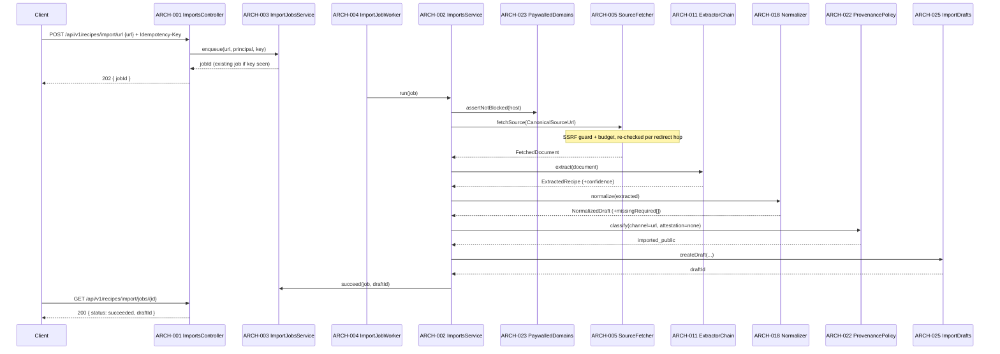
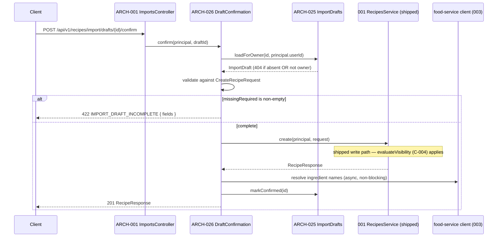
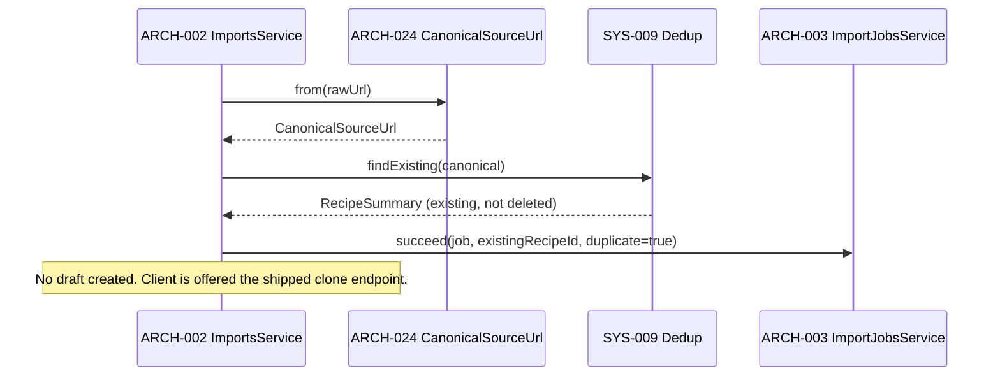
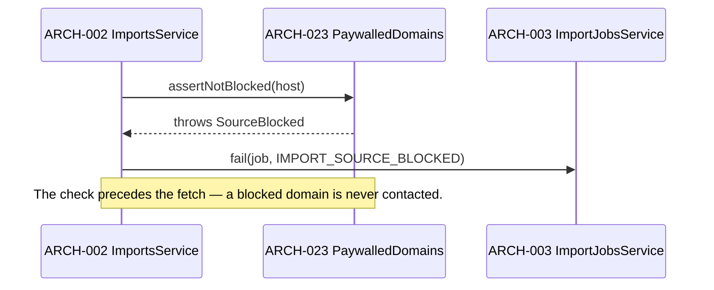

# Architecture Design: Recipe Importing

**Feature Branch**: `004-recipe-importing`
**Created**: 2026-05-09
**Regenerated**: 2026-08-02
**Status**: Approved for module design
**Source**: `specs/004-recipe-importing/v-model/system-design.md`
**Standard**: IEEE 42010 / Kruchten 4+1

> **Regeneration note.** The previous revision (a) proposed `AttributionVisibilityService` and `CloneService`,
> both of which already ship in 001 and would have forked the C-004 rule; (b) modelled `userId` as the "Clerk
> sub claim" when the shipped service uses the **app ULID** as `owner_id`; (c) specified endpoints
> (`/import/photo/save`, no version prefix, no file channel) that contradicted `plan.md` and `tasks.md`;
> (d) used `201` where `plan.md` used `202`, and `422` where `plan.md` used `400`; and (e) had a Development
> View that named **no package paths at all** — which is why every file path in `tasks.md` pointed at
> `packages/api/recipe/`, a directory that does not exist. This revision names real paths, verified against
> `main`.

## Overview

Thirteen system components decompose into 26 architecture modules across the Kruchten 4+1 views. The
decomposition separates **channel adapters** from the **shared pipeline** (normalize → classify → dedupe →
draft), keeps every third-party dependency behind a **port**, and terminates at a **confirmation bridge** that
hands work to 001's shipped write path rather than reimplementing it.

## ID Schema

- **Architecture Module**: `ARCH-NNN` — sequential, never renumbered.
- **Cross-cutting** modules are tagged `[CROSS-CUTTING]` with a rationale.

## Logical View — Component Breakdown

| ARCH ID  | Name                     | Description                                                                                                                                                                   | Parent SYS | Type      |
| -------- | ------------------------ | ----------------------------------------------------------------------------------------------------------------------------------------------------------------------------- | ---------- | --------- |
| ARCH-001 | ImportsController        | REST surface for all import endpoints. Validates DTOs, enforces `Idempotency-Key`, applies the import `@Throttle` override, and delegates to ARCH-002. Never contains policy. | SYS-011    | Component |
| ARCH-002 | ImportsService           | **Facade.** Owns the fixed pipeline sequence (blocklist → fetch → extract → normalize → classify → dedupe → draft) in exactly one place, so no path can reorder it (HAZ-026). | SYS-011    | Service   |
| ARCH-003 | ImportJobsService        | `import_jobs` lifecycle state machine, idempotency-key resolution, typed failure recording.                                                                                   | SYS-011    | Service   |
| ARCH-004 | ImportJobWorker          | Queue consumer executing the asynchronous channels; idempotent, DLQ-routed, correlation-ID propagating.                                                                       | SYS-011    | Service   |
| ARCH-005 | SourceFetcherService     | The single outbound-HTTP egress point. Applies the full fetch budget and delegates address safety to ARCH-006. Wrapped in a per-domain circuit breaker (`cockatiel`).         | SYS-001    | Service   |
| ARCH-006 | SsrfGuard                | Pure address policy + a pinning `undici` dispatcher. Rejects loopback/private/link-local/CGNAT/ULA/unspecified addresses; re-applied on every redirect hop.                   | SYS-001    | Module    |
| ARCH-007 | RecipeExtractor (port)   | The Strategy interface every extractor implements: `extract(document) → ExtractedRecipe \| null`. Returns null, never throws.                                                 | SYS-002    | Port      |
| ARCH-008 | JsonLdExtractor          | Primary Strategy. Parses `application/ld+json`, walks `@graph`, and Zod-validates `@type === 'Recipe'` before accepting (HAZ-028).                                            | SYS-002    | Library   |
| ARCH-009 | MicrodataExtractor       | Secondary Strategy over `[itemtype*="schema.org/Recipe"]` (`microdata-node`).                                                                                                 | SYS-002    | Library   |
| ARCH-010 | HeuristicExtractor       | Last-resort Strategy using structural heuristics (`cheerio`); emits a confidence score so a weak parse is visible rather than silent.                                         | SYS-002    | Library   |
| ARCH-011 | ExtractorChainService    | **Chain of Responsibility** running ARCH-008 → 009 → 010, first non-null wins; classifies "fetched but nothing found" as an explicit outcome (HAZ-009).                       | SYS-002    | Service   |
| ARCH-012 | OEmbedProvider (port)    | Instagram caption retrieval interface, so the adapter is swappable and the pipeline is testable without Meta.                                                                 | SYS-003    | Port      |
| ARCH-013 | InstagramOEmbedAdapter   | Meta-hosted oEmbed adapter using an app credential; classifies 429 explicitly (HAZ-010) and validates the response shape (HAZ-012). Capability-flagged off.                   | SYS-003    | Adapter   |
| ARCH-014 | OcrProvider (port)       | OCR interface (`extractText(objectKey) → OcrText`), keeping D-001 reversible.                                                                                                 | SYS-004    | Port      |
| ARCH-015 | TextractAdapter          | AWS Textract implementation with timeout, bounded polling, and backoff.                                                                                                       | SYS-004    | Adapter   |
| ARCH-016 | OcrPipelineService       | Image intake, S3 object lifecycle (including deletion at/before draft expiry), and provider invocation.                                                                       | SYS-004    | Service   |
| ARCH-017 | FileParserService        | Magic-byte type detection (`file-type`) then JSON / YAML / Markdown-frontmatter parsing. Never trusts the client-supplied MIME type.                                          | SYS-005    | Service   |
| ARCH-018 | NormalizerService        | Orchestrates the pure normalizers and computes `missingRequired`.                                                                                                             | SYS-006    | Service   |
| ARCH-019 | IngredientLineParser     | Pure. Free-text line → `{ quantity, unit, name, raw }` via `parse-ingredient`; **always** retains `raw`; unparseable → null quantity + flag, never a throw.                   | SYS-006    | Module    |
| ARCH-020 | ValueNormalizers         | Pure. ISO-8601 duration → minutes (`iso8601-duration`); free-text yield → positive integer; **never** substitutes a default for an absent value.                              | SYS-006    | Module    |
| ARCH-021 | ContentSanitizer         | Pure. Zero-tag-allowlist sanitization of every extracted text field before it can be persisted (HAZ-008/029).                                                                 | SYS-006    | Module    |
| ARCH-022 | ProvenancePolicy         | Pure **Policy**. `(channel, attestation, citationReachable) → sourceType`. Total function; the D-003 rule lives here and nowhere else.                                        | SYS-007    | Module    |
| ARCH-023 | PaywalledDomainsService  | Blocklist data access + admin CRUD with audit trail; exact-host / registrable-suffix matching (HAZ-022). Cached with bounded TTL.                                             | SYS-008    | Service   |
| ARCH-024 | CanonicalSourceUrl       | **Value object.** Construction canonicalizes (`normalize-url`); an unnormalized URL is unrepresentable, so no caller can forget (HAZ-019).                                    | SYS-009    | Module    |
| ARCH-025 | ImportDraftsService      | `import_drafts` lifecycle, owner-scoped reads (absent-not-forbidden), corrections, and expiry sweep.                                                                          | SYS-010    | Service   |
| ARCH-026 | DraftConfirmationService | Validates a draft against the shipped `CreateRecipeRequest` and creates the recipe **through 001's `RecipesService`**. Contains no visibility logic of its own.               | SYS-012    | Service   |

| ARCH-035 | AuthMiddleware (shipped) | The shipped Clerk session-token middleware guarding every import endpoint. Consumed unchanged from 002; listed so SYS-014 has an architecture realisation. | SYS-014 | Component |
| ARCH-036 | CiQualityGates | The contract round-trip check plus the type, documentation, and mutation gates that run in CI. | SYS-015 | Utility |

### Frontend modules

| ARCH ID  | Name                          | Description                                                                                                | Parent SYS | Type      |
| -------- | ----------------------------- | ---------------------------------------------------------------------------------------------------------- | ---------- | --------- |
| ARCH-027 | ImportEntry                   | Channel selection + submission. Orchestration component; renders platform leaves.                          | SYS-013    | Component |
| ARCH-028 | ImportProgress                | Job progress and terminal outcomes; pure presentational, driven by job state.                              | SYS-013    | Component |
| ARCH-029 | ImportDraftReview             | Draft review/completion surface — the correction point for missing fields and mis-parsed ingredient lines. | SYS-013    | Component |
| ARCH-030 | RecipeAttribution             | Attribution block for imported recipes (source, author, platform) on recipe detail.                        | SYS-013    | Component |
| ARCH-031 | ImportErrorState              | Typed error → actionable recovery mapping; icon + text, never colour alone.                                | SYS-013    | Component |
| ARCH-032 | useImportJob / useImportDraft | Headless hooks over the typed client; all data access, no rendering.                                       | SYS-013    | Library   |

### Cross-cutting

| ARCH ID  | Name             | Description                                                                                                        | Rationale                                                                       |
| -------- | ---------------- | ------------------------------------------------------------------------------------------------------------------ | ------------------------------------------------------------------------------- |
| ARCH-033 | ImportErrorCodes | New `RecipeErrorCode` members + their `ApiExceptionFilter` status mapping, and the typed factory functions.        | `[CROSS-CUTTING]` — extends the **shipped** error boundary; adds no second one. |
| ARCH-034 | ImportContracts  | Shared types (`ExtractedRecipe`, `NormalizedDraft`, `ImportDraft`, `ImportChannel`) in `@kitchensink/recipe-core`. | `[CROSS-CUTTING]` — one contract consumed by service, client, web, and mobile.  |

**Explicitly NOT modules of this feature** (shipped; consumed): Clerk auth middleware, `evaluateVisibility`,
`RecipesService.clone()`, `ApiExceptionFilter`, `@nestjs/throttler`, the food-service client.

## Process View — Dynamic Behaviour

### Interaction 1 — URL import (asynchronous, happy path)



**Concurrency**: one async chain per job; worker concurrency is bounded by a bulkhead separate from the DB pool.
**Synchronization**: the blocklist check is a hard-fail gate before any egress; the pipeline order is fixed in
ARCH-002 and cannot be reordered by a caller.

### Interaction 2 — Draft confirmation (the only recipe-creating path)



### Interaction 3 — Duplicate URL detected



The lookup is an optimisation, **not** the guarantee: two concurrent imports of a new URL both pass the lookup,
and the partial unique index makes exactly one insert win. The loser catches the constraint violation and
resolves to the winner's recipe (HAZ-018).

### Interaction 4 — Blocked source (no egress occurs)



## Interface View — Module Contracts

| ARCH     | Direction | Name                  | Type / shape                                                                   | Constraints                                                           |
| -------- | --------- | --------------------- | ------------------------------------------------------------------------------ | --------------------------------------------------------------------- |
| ARCH-002 | In        | `run`                 | `(job: ImportJob) => Promise<ImportOutcome>`                                   | Fixed pipeline order; every failure is a typed `RecipeDomainError`    |
| ARCH-005 | In        | `fetchSource`         | `(url: CanonicalSourceUrl) => Promise<FetchedDocument>`                        | 3s connect / 10s total, ≤5 redirects, ≤5 MB, html content types only  |
| ARCH-005 | Ex        | —                     | `SourceUnreachable`, `SourceBlocked`, `PayloadTooLarge`, `ProviderUnavailable` | Typed; mapped by ARCH-033                                             |
| ARCH-006 | In        | `assertPublicAddress` | `(addresses: string[]) => void`                                                | Pure policy; throws on any non-public address                         |
| ARCH-007 | In        | `extract`             | `(doc: FetchedDocument) => ExtractedRecipe \| null`                            | **Never throws.** Null = "not my format"                              |
| ARCH-012 | In        | `fetchCaption`        | `(url: CanonicalSourceUrl) => Promise<ExtractedRecipe>`                        | Throws `NoCaption`, `ProviderUnavailable`                             |
| ARCH-014 | In        | `extractText`         | `(objectKey: string) => Promise<OcrText>`                                      | Throws `OcrFailed`, `ProviderUnavailable`                             |
| ARCH-017 | In        | `parseFile`           | `(bytes: Uint8Array) => Promise<ExtractedRecipe>`                              | Type by magic bytes; ≤1 MB; throws `UnsupportedFormat`                |
| ARCH-018 | In        | `normalize`           | `(e: ExtractedRecipe) => NormalizedDraft`                                      | Pure. Populates `missingRequired`; never fabricates a value           |
| ARCH-019 | In        | `parseIngredientLine` | `(raw: string) => ParsedIngredient`                                            | Pure, total. `raw` always retained; failure ⇒ `quantity: null`        |
| ARCH-022 | In        | `classify`            | `(channel, attestation, citationReachable) => RecipeSourceType`                | Pure, total. Never returns a public class for an unreachable citation |
| ARCH-023 | In        | `assertNotBlocked`    | `(host: string) => Promise<void>`                                              | Exact host or registrable suffix; never substring                     |
| ARCH-024 | In        | `from`                | `(raw: string) => CanonicalSourceUrl`                                          | Throws on non-http(s); canonicalization is total at construction      |
| ARCH-025 | In        | `loadForOwner`        | `(id, ownerId) => Promise<ImportDraft>`                                        | Not-owner is indistinguishable from absent (`404`)                    |
| ARCH-026 | In        | `confirm`             | `(principal, draftId) => Promise<RecipeResponse>`                              | Delegates creation to 001; adds no visibility logic                   |

**`principal.userId` is the app-user ULID**, matching the shipped `recipes.owner_id`. It is **not** the Clerk
`sub`. Writing the `sub` here would produce recipes owned by a principal that no other query can find.

## Development View — Source Organization

Verified against `main` on 2026-08-02. Backend files follow the NestJS kebab `name.type.ts` regime
(`CODING_STANDARDS §1a`); `packages/shared/*`, `packages/clients/*`, and `packages/apps/*` follow the
camelCase/PascalCase regime (`§1b`). Both are CI-enforced by `eslint-plugin-check-file`.

```
packages/services/recipe-service/src/imports/          ← new domain folder (organize by domain, not type)
├── imports.module.ts · imports.controller.ts · imports.service.ts · import.error.ts
├── dto/            import-url.dto.ts · import-instagram.dto.ts · import-photo.dto.ts
│                   update-import-draft.dto.ts · import-draft-response.dto.ts · import-job-response.dto.ts
├── fetch/          source-fetcher.service.ts · ssrf-guard.ts · fetch-budget.config.ts
├── extractors/     recipe-extractor.port.ts · json-ld.extractor.ts · microdata.extractor.ts
│                   heuristic.extractor.ts · extractor-chain.service.ts · schema-org.schema.ts
├── instagram/      oembed-provider.port.ts · instagram-oembed.adapter.ts
├── ocr/            ocr-provider.port.ts · textract.adapter.ts · ocr-pipeline.service.ts
├── files/          file-parser.service.ts · json.parser.ts · yaml.parser.ts · markdown.parser.ts
├── normalize/      normalizer.service.ts · ingredient-line.ts · value-normalizers.ts · content-sanitizer.ts
├── policy/         provenance.policy.ts · canonical-source-url.ts
├── blocklist/      paywalled-domains.service.ts · paywalled-domains.dal.ts · paywalled-domains.controller.ts
├── dedup/          deduplication.service.ts
├── drafts/         import-drafts.service.ts · import-drafts.dal.ts · draft-expiry.service.ts
├── jobs/           import-jobs.service.ts · import-jobs.dal.ts · idempotency.ts
├── confirm/        draft-confirmation.service.ts
├── __tests__/      *.test.ts                    ← unit (co-located, §7)
└── __fixtures__/   make*.ts + fixture HTML corpus

packages/services/recipe-service/src/database/
├── schema/         import-drafts.ts · import-jobs.ts · paywalled-domains.ts   (+ recipes.ts edit)
└── migrations/     0019_import_drafts.sql · 0020_import_jobs.sql
                    0021_paywalled_domains.sql · 0022_recipes_import_columns.sql

packages/services/recipe-service/tests/e2e/     import-url.e2e.spec.ts · import-draft-confirm.e2e.spec.ts
                                                import-blocklist.e2e.spec.ts · import-ocr.e2e.spec.ts
packages/services/recipe-workers/src/           import-job.worker.ts

specs/001-commise-recipe-app/contracts/api.openapi.yaml   ← the service's ONE OpenAPI document; 004 EXTENDS it
                                                             (code refers to it as `contracts/api.openapi.yaml`)

packages/shared/recipe-core/src/                importTypes.ts · importProvenance.ts · importDraft.ts
                                                (camelCase — §1b)
packages/clients/recipe-service/src/            importQueries.ts · importHooks.ts (+ client/types/errors edits)

packages/apps/commise/features/recipes/src/import/
├── ImportEntry.tsx              · ImportEntry.native.tsx
├── ImportProgress.tsx           · ImportProgress.native.tsx
├── ImportDraftReview.tsx        · ImportDraftReview.native.tsx
├── ImportErrorState.tsx         · ImportErrorState.native.tsx
├── useImportJob.ts · useImportDraft.ts
└── __tests__/  *.test.tsx + *.native.test.tsx
packages/apps/commise/features/recipes/src/detail/  RecipeAttribution.tsx · RecipeAttribution.native.tsx
packages/apps/commise/features/recipes/src/messages.ts   ← import copy (shared web+mobile, localized)

packages/apps/commise/web/src/app/[locale]/recipes/import/page.tsx
packages/apps/commise/web/tests/e2e/                     importUrl.spec.ts · importDraft.spec.ts
packages/apps/commise/mobile/src/screens/                ImportScreen.tsx
packages/apps/commise/mobile/.maestro/recipes/           import-url-flow.yaml · import-photo-flow.yaml
packages/tools/loadtest/                                 import.js   ← k6 (NFR-011)
```

## Physical View — Deployment

No new deployment unit. The import endpoints ship inside the existing `recipe-service` Fargate task behind the
shared per-stage ALB (ADR-0003); the job worker ships in the existing `recipe-workers` bundle. New AWS surface
is limited to **Textract** (IAM policy addition) and an S3 prefix for OCR source images under the existing
bucket, with a lifecycle rule mirroring draft expiry.

**Egress note (ADR-0004).** This feature makes the recipe service a deliberate outbound-HTTP client to arbitrary
third-party hosts. Fargate tasks run in public subnets with `assignPublicIp` and egress via the Internet
Gateway — they do **not** traverse the `t4g.nano` NAT instance, so import traffic does not load it. Do not
"fix" this by moving the service to private subnets, which would route all import egress through the NAT.

## Scenarios — Architecture Validation

1. **Malicious URL** — `http://169.254.169.254/latest/meta-data/` is rejected by ARCH-006 before egress; a
   redirect to that address is rejected on the hop. Validates the SSRF boundary end-to-end.
2. **Concurrent duplicate import** — two jobs import one new URL; the unique index admits one; the loser
   resolves to the winner. Validates that dedup does not depend on a read-then-write check.
3. **Well-formed source, incomplete recipe** — a page with JSON-LD but no `recipeYield` produces a draft with
   `missingRequired: ['servings']` and cannot be confirmed until completed. Validates that the schema's NOT NULL
   constraints are satisfied by user completion, never by fabrication.
4. **Provider outage** — Textract unavailable trips the breaker; OCR imports fail fast with `503` while URL
   imports continue. Validates bulkhead isolation between channels.
5. **Capability flag off** — Instagram endpoints return `404` and the channel is absent from
   `GET /import/sources` and from both UIs. Validates D-002 gating without dead UI.

## Coverage Summary

| Metric                                       | Count   |
| -------------------------------------------- | ------- |
| Total architecture modules (ARCH)            | 34      |
| Backend modules                              | 26      |
| Frontend modules                             | 6       |
| Cross-cutting modules                        | 2       |
| System components covered (SYS)              | 13 / 13 |
| Modules without an interface contract        | 0       |
| Modules duplicating a shipped 001 capability | 0       |
