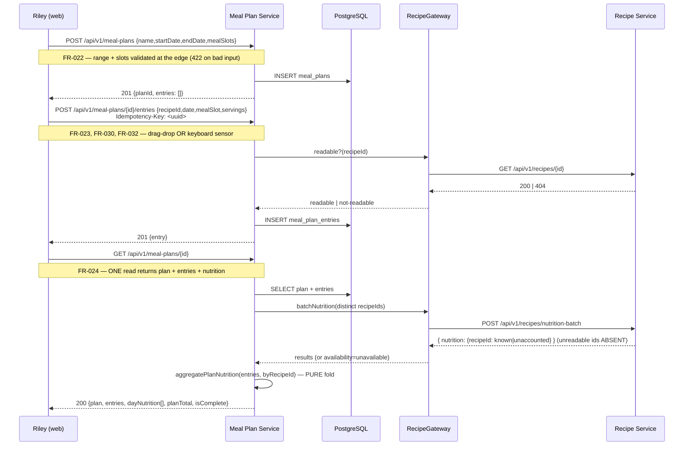
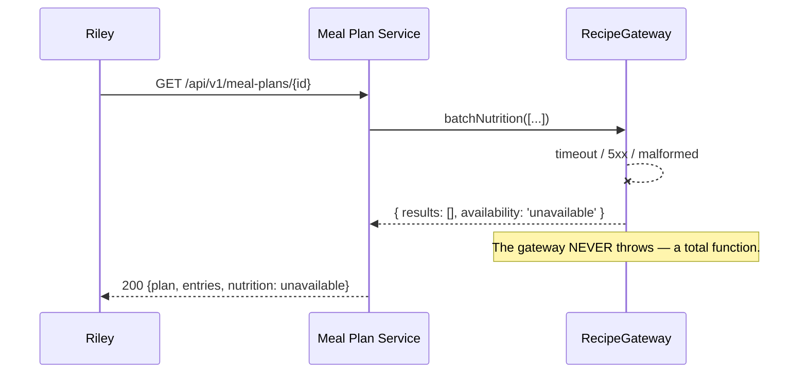
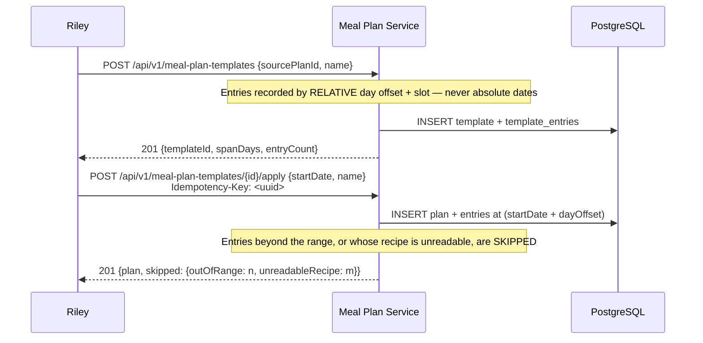
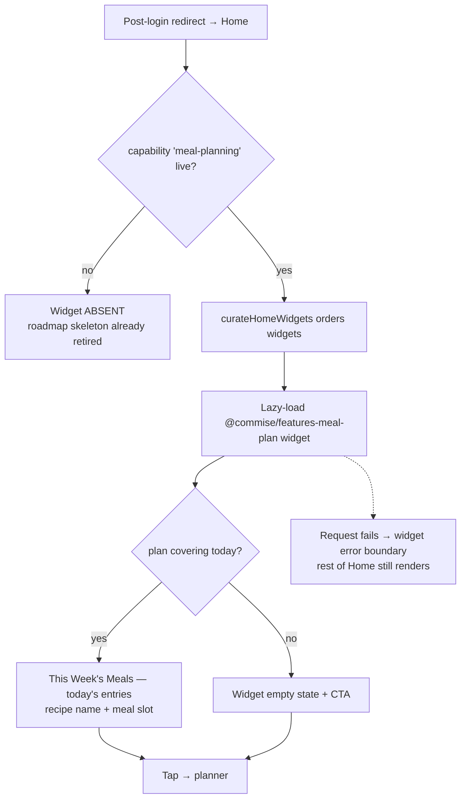
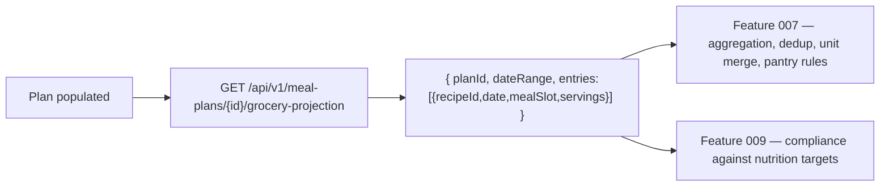

# User Journeys: Meal Planning

**Branch**: `006-meal-planning`
**Date**: 2026-05-09 | **Reconciled**: 2026-08-02
**Status**: Draft
**Source**: [product-spec.md](./product-spec.md), [spec.md](../spec.md), [plan.md](../plan.md)

---

## Journey Notation

Steps reference FR/SC ids in brackets. Every core journey is stated for **both platforms** — where the interaction
differs, both are shown. Phase-2 journeys are marked and not implemented.

> **Reconciliation note (2026-08-02).** The May journeys showed a web-only actor, an async "enqueue recalc" step, a
> separate `GET .../nutrition` call, and an AI journey as if it were shippable. All four are corrected: nutrition is
> computed synchronously in the plan read (no queue, no second round-trip), mobile is a first-class actor, and the AI
> journey is marked deferred.

---

## Journey A: Weekly Planning and Assignment (Core)

**Persona**: Riley (Family Meal Planner) · **Stories**: US-006-001, US-006-002, US-006-003

**Scenario**: Riley creates a weekly plan, fills it, checks nutrition, and moves toward shopping.

### A-web



### A-mobile

Identical service calls. The only differences are in the client:

| Step        | Web                                                     | Mobile                                             |
| ----------- | ------------------------------------------------------- | -------------------------------------------------- |
| Create plan | Dialog with range picker + slot checkboxes              | Full screen with the same fields                   |
| Assign      | Drag recipe card → cell, **or** keyboard lift/move/drop | Tap empty slot → recipe picker sheet → choose      |
| Move/remove | Drag to another cell / drag out                         | Long-press entry → move / change servings / remove |
| Nutrition   | Sticky summary alongside the grid                       | Collapsible per-day summary + plan total           |

Both drive the same `useMealPlanBoard` command surface (FR-034), so the write path and its outcomes are identical.

**Key corrections vs. the May journey**

- **No `enqueue recalc`.** There is no queue and no nutrition table. Totals are a pure fold computed during the read
  (spec C-006-003, C-006-005).
- **No separate `GET .../nutrition` round-trip.** The plan read returns nutrition inline — one request, satisfying
  NFR-006 without an N+1.
- **The recipe readability check is a Gateway call, not a database join.** Recipes live in another service and another
  logical database.

---

## Journey B: Degraded and Orphaned States (Core)

**Persona**: Riley · **Stories**: US-006-002, US-006-003 · **FRs**: FR-033, NFR-004

This journey is new. It was absent from the May set, which is why the failure modes went unspecified.

### B-1 — An entry's recipe is no longer readable

```mermaid
sequenceDiagram
    participant U as Riley
    participant API as Meal Plan Service
    participant RG as RecipeGateway

    U->>API: GET /api/v1/meal-plans/{id}
    API->>RG: batchNutrition([r1, r2, r3])
    RG-->>API: [{r1, nutrition}, {r2, null}, {r3, nutrition}]
    Note over API: r2 → ORPHANED (FR-033). Detected on READ —<br/>no event bus, no deletion webhook, no replicated state.
    API->>API: aggregate — r2 contributes nothing; its day isComplete=false
    API-->>U: 200 with r2 flagged orphaned
```

The user sees the entry's card shell with a **"Recipe unavailable"** label and icon (never colour alone), still
removable. That day's totals show as a partial estimate.

### B-2 — The recipe service is unavailable



The plan and its entries **still render** — they are 006's own data. Nutrition shows "unavailable" with a retry, never
`0`. A dependency outage degrades the planner instead of breaking it.

---

## Journey C: Reuse a Week (Templates)

**Persona**: Riley · **Story**: US-006-007 · **FRs**: FR-028, FR-032



The **skip report is shown to the user**, not swallowed. A template that quietly loses three dinners is worse than one
that says so — silent partial success is what makes users stop trusting templates.

---

## Journey D: Home Entry Point

**Persona**: any returning user · **Story**: US-006-005 · **FRs**: FR-035



Identical on web and mobile (001 US-000 scenario 11). The widget registers a **loader**, not a component, and the
`meal-plan` roadmap placeholder plus both app skeletons are deleted in the same change (FR-035).

---

## Journey E: Handoff to Shopping

**Persona**: Riley · **Story**: US-006-004 · **FRs**: FR-036 · **SC**: SC-006-001



**Scope boundary, corrected.** 006 hands over a versioned read projection and stops. It does **not** aggregate
ingredients, dedupe units, estimate line-item counts or "finalize" the plan. Those rules belong to 007, which owns them;
the May journey had 006 producing an ingredient manifest and a lock step, both removed (spec C-006-007, research R-8).

SC-006-001's 10-minute budget is measured from plan creation to this projection being available.

---

## Journey F: AI-Assisted Planning — **Phase 2, deferred**

**Persona**: Avery (Waste Optimizer) · **Story**: US-006-006 · **FRs**: FR-025/026/027

**Not implemented, and not diagrammed.** Two hard blockers, both factual:

1. **Feature 005 does not exist** — there is no AI provider contract to sequence against.
2. **The premium gate is unenforceable today** — `subscriptionTier` lives in the identity service's `accounts` table,
   while the session token's `public_metadata` carries only `scopes`/`permissions`. A guard reading `tier` from the
   token returns 402 for everyone, premium included (spec C-006-009).

The May version of this journey showed a confident `PremiumTierGuard → AI provider → bulk assign` sequence built on both
of those wrong assumptions. It is removed rather than redrawn: the sequence will be drawn against 005's and 010's real
contracts when they exist.

The one durable decision, carried forward: whatever the provider turns out to be, the interaction is **review-first** —
the system proposes, the user accepts per item or in bulk, and no plan is ever silently rewritten.

---

## Journey Coverage

| Journey | Stories                            | FRs                                            | Platforms    | Phase |
| ------- | ---------------------------------- | ---------------------------------------------- | ------------ | ----- |
| A       | US-006-001, US-006-002, US-006-003 | FR-022, 023, 024, 029, 030, 031, 032, 034, 037 | web + mobile | 1     |
| B       | US-006-002, US-006-003             | FR-033, NFR-004                                | web + mobile | 1     |
| C       | US-006-007                         | FR-028, FR-032                                 | web + mobile | 1     |
| D       | US-006-005                         | FR-035                                         | web + mobile | 1     |
| E       | US-006-004                         | FR-036, SC-006-001                             | web + mobile | 1     |
| F       | US-006-006                         | FR-025, FR-026, FR-027                         | —            | **2** |

Every Phase 1 journey has a Playwright flow (web) and a Maestro flow (mobile) in [tasks.md](../tasks.md), per NFR-005.
