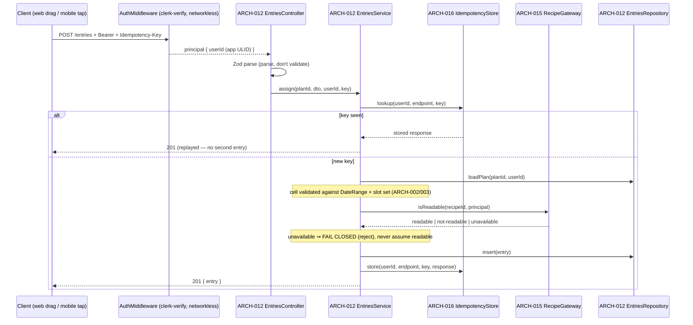
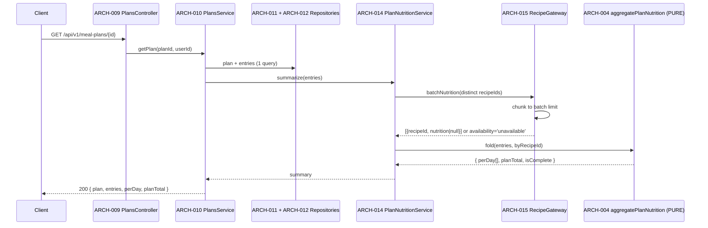
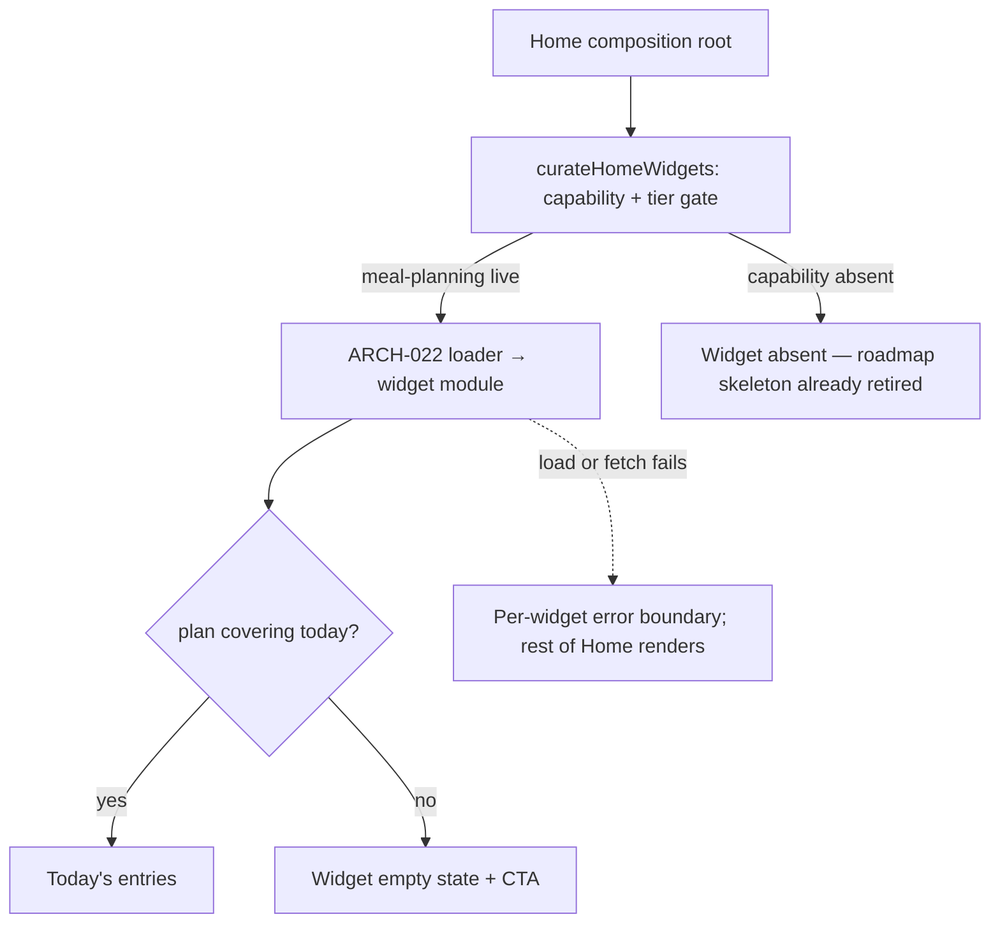

# Architecture Design: Meal Planning

**Feature Branch**: `006-meal-planning`
**Created**: 2026-05-09 | **Regenerated**: 2026-08-02
**Status**: Draft
**Source**: [`v-model/system-design.md`](./system-design.md), [`plan.md`](../plan.md)

## Overview

The Meal Planning architecture decomposes twelve system components into **eighteen** architecture modules across the
Kruchten 4+1 views. The backend follows the platform's layered NestJS shape — controller → domain service → repository,
with a single Gateway at the outbound edge — and is organized **by feature domain** (`plans/`, `entries/`, `templates/`,
`nutrition/`), not by generic type. The client follows the platform's headless-hook-plus-pure-render shape shared across
web and mobile.

> **Regeneration note.** The May design had 22 modules; nine are deleted outright and three are materially redefined:
>
> | Deleted / changed                                                         | Why                                                                                                   |
> | ------------------------------------------------------------------------- | ----------------------------------------------------------------------------------------------------- |
> | `ARCH-009 NutritionalSummaryCache` (Redis, TTL 3600)                      | No Redis or ElastiCache exists in this platform; ADR-0004/0007/0008 exist to keep that spend out.     |
> | `ARCH-017 UsdaFoodDataAdapter`                                            | 006 makes no food-service call; nutrition is already resolved and denormalized by 001.                |
> | `ARCH-010/011/012/013/014/015` (AI + waste optimizer)                     | Phase 2 — blocked on 005 and 010.                                                                     |
> | `ARCH-021 PremiumTierGuard`                                               | Reads `tier` from `public_metadata`, which carries only `scopes`/`permissions`. Would 402 every user. |
> | `ARCH-018 ClerkAuthService`                                               | Not a 006 module — it is the shared `@kitchensink/clerk-verify` package behind standard middleware.   |
> | `ARCH-008 NutritionalSummaryService` (orchestrates USDA fetch)            | Redefined as a thin orchestrator over a **pure fold**; the maths moves to shared domain code.         |
> | Type-based module grouping (`controllers/`, `services/`, `repositories/`) | `CODING_STANDARDS §3`: organize by feature domain, not generic type.                                  |
> | `*Exception` error naming                                                 | `CODING_STANDARDS §6/§13`: `*Error` extending `Error` + `Object.setPrototypeOf` + `is*` guard.        |
>
> Every module below names the **design pattern** it implements, per `CLAUDE.md` design-pattern-first. The full pattern
> register lives in [`plan.md`](../plan.md#pattern-register).

## ID Schema

- **Architecture Module**: `ARCH-NNN` — sequential; never renumbered.
- **Parent System Components**: comma-separated `SYS-NNN` list.
- **Cross-cutting**: tagged `[CROSS-CUTTING; rationale: …]`.

## Logical View — Component Breakdown

### Shared domain — `@kitchensink/meal-plan-core` (pure, no I/O)

| ARCH ID  | Name                     | Pattern                  | Description                                                                                                                                                                    | Parent SYS        |
| -------- | ------------------------ | ------------------------ | ------------------------------------------------------------------------------------------------------------------------------------------------------------------------------ | ----------------- |
| ARCH-001 | `MealPlanIds`            | Branded nominal id       | Zod-branded `MealPlanId`, `MealPlanEntryId`, `MealPlanTemplateId` with smart constructors and `is*` guards, extending the shipped `@kitchensink/recipe-core/ids` pattern.      | SYS-001, 002, 009 |
| ARCH-002 | `DateRange`              | Value Object             | A calendar-date range that cannot exist inverted or longer than 90 days. Construction parses and throws; downstream code never re-checks. Locale-aware week grouping (FR-037). | SYS-001           |
| ARCH-003 | `MealSlot`               | Value Object + union     | The slot union, its canonical display order, and membership predicates.                                                                                                        | SYS-001, 002      |
| ARCH-004 | `aggregatePlanNutrition` | Pure fold                | `(entries, nutritionByRecipeId) → { perDay, planTotal }`, propagating `isComplete`. **No I/O, no clock, no randomness.** The single authoritative rollup.                      | SYS-003           |
| ARCH-005 | `mealPlanAccessPolicy`   | Specification / policy   | Pure, total, fail-closed owner predicates, called identically by service and both clients — the D7 lesson from `recipeAccessPolicy`.                                           | SYS-001, 002, 009 |
| ARCH-006 | `templateProjection`     | Pure mapping             | Plan ⇄ template by **relative day offset**; produces the apply result plus the skip report.                                                                                    | SYS-009           |
| ARCH-007 | `groceryProjection`      | Adapter (outbound shape) | Versioned `v1` projection for 007/009. Entries only — no ingredient aggregation.                                                                                               | SYS-011           |
| ARCH-008 | `mealPlanDatabaseName`   | Leaf derivation module   | ADR-0006 logical-DB derivation. **No imports, not barrel-exported** — the `recipeDatabaseName.ts` constraint whose violation caused defect #119.                               | SYS-001           |

### Service — `@kitchensink/meal-plan-service`

| ARCH ID  | Name                                                       | Pattern                    | Description                                                                                                                                                                                                                                         | Parent SYS   |
| -------- | ---------------------------------------------------------- | -------------------------- | --------------------------------------------------------------------------------------------------------------------------------------------------------------------------------------------------------------------------------------------------- | ------------ |
| ARCH-009 | `MealPlansController`                                      | REST resource              | `plans/meal-plans.controller.ts`. Zod-parses at the edge; keyset pagination; `404` (never `403`) for not-owned.                                                                                                                                     | SYS-001      |
| ARCH-010 | `MealPlansService`                                         | Domain service             | Range/slot rules via ARCH-002/003, owner scoping via ARCH-005, cascade delete.                                                                                                                                                                      | SYS-001      |
| ARCH-011 | `MealPlansRepository`                                      | Repository                 | Drizzle over `meal_plans`; owner predicate applied in the query, not after it.                                                                                                                                                                      | SYS-001      |
| ARCH-012 | `MealPlanEntriesController` + `…Service` + `…Repository`   | REST + domain + Repository | `entries/`. Cell validation against the plan's range and slot set, readability check via ARCH-015, move/remove, idempotent create.                                                                                                                  | SYS-002      |
| ARCH-013 | `MealPlanTemplatesController` + `…Service` + `…Repository` | REST + domain + Repository | `templates/`. Save-as-template and transactional apply over ARCH-006, returning the skip report.                                                                                                                                                    | SYS-009      |
| ARCH-014 | `PlanNutritionService`                                     | Orchestrator               | `nutrition/`. Collects distinct recipe ids, calls ARCH-015 once, hands the result to the **pure** ARCH-004. Holds no maths of its own.                                                                                                              | SYS-003      |
| ARCH-015 | `RecipeGateway`                                            | **Gateway** (PoEAA)        | `recipes/recipe.gateway.ts`. The only door to 001: bounded `AbortSignal` timeout, **never throws**, boundary normalization, rate-limited failure logging, three-state `availability`, batch chunking. Modelled on the shipped `FoodCatalogGateway`. | SYS-007      |
| ARCH-016 | `IdempotencyStore`                                         | Ledger / memento           | `common/`. `(owner, endpoint, key) → first response`, replayed rather than re-executed.                                                                                                                                                             | SYS-002, 009 |
| ARCH-017 | `ApiExceptionFilter` + error classes                       | Single error envelope      | `common/api-exception.filter.ts` plus `*Error` classes with `Object.setPrototypeOf` and `is*` guards. **One** `{code,message,details?}` shape for the whole service.                                                                                | SYS-008      |
| ARCH-018 | `AccountErasureParticipant`                                | Observer (existing bus)    | `erasure/`. Joins the mechanism 001 C-007 established; introduces no second erasure path.                                                                                                                                                           | SYS-012      |

### Client — `@commise/features-meal-plan`

| ARCH ID  | Name                       | Pattern                                                                              | Description                                                                                                                                                                                                                                 | Parent SYS |
| -------- | -------------------------- | ------------------------------------------------------------------------------------ | ------------------------------------------------------------------------------------------------------------------------------------------------------------------------------------------------------------------------------------------- | ---------- |
| ARCH-019 | `useMealPlanBoard`         | Headless hook + Command                                                              | Shared orchestration over TanStack mutations (`useMutation` **is** Command). Exposes `assign`/`move`/`remove`/`setServings`/`setNote` and a derived board view model. Both platforms drive this one surface.                                | SYS-010    |
| ARCH-020 | Board render components    | Pure render + discriminated union                                                    | `DayColumn`, `SlotCell`, `EntryCard`, `NutritionSummary` — pure `props → JSX`. Entry state is `assigned \| orphaned \| pending`, consumed by an exhaustive switch (= Visitor). Parents compose by state; **no boolean flag props** (`§11`). | SYS-010    |
| ARCH-021 | Platform interaction layer | Strategy via Metro resolution                                                        | `MealPlanBoard.tsx` (web: `@dnd-kit` pointer + **keyboard sensor**) and `MealPlanBoard.native.tsx` (tap-to-assign). Same public API; no strategy registry needed — `.native.tsx` resolution **is** the strategy selection.                  | SYS-010    |
| ARCH-022 | `MealPlanHomeWidget`       | Registry + lazy loader (= Proxy)                                                     | Registers a **loader** with the `@commise/features-core` contract, gated on `ROADMAP_CAPABILITIES.mealPlanning`. Retires the roadmap placeholder and both app skeletons in the same change.                                                 | SYS-010    |
| ARCH-023 | `messages.ts`              | Localization surface                                                                 | `LocalizedMessages` for every planner and widget string (FR-038). No user-visible literal anywhere else in the package.                                                                                                                     | SYS-010    |
| ARCH-024 | `QualityComplianceModule`  | `[CROSS-CUTTING; rationale: shared build/lint infrastructure serves all components]` | Strict TS, JSDoc + pattern-named module headers, `eslint-plugin-check-file` naming, a11y lint, the `§7.1` test matrix, and CI enforcement of REQ-NF-009 (no cache/queue/worker dependency). No runtime behaviour.                           | SYS-008    |

### Client transport — `@kitchensink/meal-plan-service-client`

| ARCH ID  | Name             | Pattern           | Description                                                                                                                                                                                       | Parent SYS |
| -------- | ---------------- | ----------------- | ------------------------------------------------------------------------------------------------------------------------------------------------------------------------------------------------- | ---------- |
| ARCH-025 | `MealPlanClient` | Gateway (inbound) | `ky`-based typed client + TanStack `queries.ts`/`hooks.ts` + `testing/` fixtures, mirroring the shipped recipe client. Shared by web and mobile — API clients do not fork per platform (`§14.2`). | SYS-010    |

## Process View — Dynamic Behaviour

### Interaction 1 — Assign a recipe to a slot



**Concurrency**: single-threaded event loop, non-blocking I/O. **Synchronization**: the readability check is awaited
before persistence; the idempotency write shares the entry's transaction, so a crash between them cannot leave a key
recorded for an entry that was never created.

### Interaction 2 — Read a plan with nutrition



**Bounded fan-out**: exactly **one** database query and **one** logical gateway call regardless of entry count
(REQ-010, REQ-NF-006). The May design's per-ingredient fetch is gone.
**Degradation**: `availability='unavailable'` yields entries with nutrition marked unavailable — a `200` with an honest
gap, not a `503`.

### Interaction 3 — Apply a template

```mermaid
sequenceDiagram
    participant C as Client
    participant CT as ARCH-013 TemplatesController
    participant SV as ARCH-013 TemplatesService
    participant TP as ARCH-006 templateProjection (PURE)
    participant GW as ARCH-015 RecipeGateway
    participant RP as Repositories

    C->>CT: POST /meal-plan-templates/{id}/apply + Idempotency-Key
    CT->>SV: apply(templateId, startDate, name, userId, key)
    SV->>RP: load template + entries
    SV->>GW: batchReadable(distinct recipeIds)
    GW-->>SV: readability map
    SV->>TP: project(template, startDate, readability)
    TP-->>SV: { entries[], skipped: { outOfRange, unreadableRecipe } }
    SV->>RP: BEGIN; insert plan + entries; COMMIT
    SV-->>C: 201 { plan, skipped }
```

**Transactional**: all-or-nothing, so a partial failure never leaves a half-built plan. **The skip report is part of the
success response**, not a log line — silent partial success is the failure mode this design exists to avoid.

### Interaction 4 — Home widget lights up



## Interface View — Contracts

Only the contracts that carry real decisions are tabulated; the rest are mechanical CRUD and live in the OpenAPI
document written before the handlers.

### ARCH-009 `MealPlansController`

| Direction | Name               | Format                                                                        | Constraints                                                 |
| --------- | ------------------ | ----------------------------------------------------------------------------- | ----------------------------------------------------------- |
| Input     | `CreateMealPlan`   | `{ name, startDate: ISO-date, endDate: ISO-date, mealSlots: MealSlot[] }`     | end ≥ start; span ≤ 90 days; 1–4 distinct slots             |
| Input     | list query         | `{ cursor?, limit? }`                                                         | **Keyset** pagination; limit ≤ 100, default 20. Not offset. |
| Output    | `MealPlanDetail`   | `{ id, name, startDate, endDate, mealSlots, entries[], perDay[], planTotal }` | Nutrition **inline** — one round trip                       |
| Error     | validation         | `422 { code, message, details[] }`                                            | Field-bound details                                         |
| Error     | absent / not-owned | `404 { code, message }`                                                       | **Identical** for both — never `403` (REQ-CN-002)           |

### ARCH-014 `PlanNutritionService`

| Direction | Name        | Format                                                                                   | Constraints                                                          |
| --------- | ----------- | ---------------------------------------------------------------------------------------- | -------------------------------------------------------------------- |
| Input     | `summarize` | `(entries: MealPlanEntry[])`                                                             | Pure orchestration; holds no macro maths                             |
| Output    | summary     | `{ perDay: Array<{date, totals?: Macros, isComplete}>, planTotal?: Macros, isComplete }` | A day with no entries has **`totals: undefined`** — never zeroes     |
| Error     | —           | —                                                                                        | **Cannot fail.** Gateway unavailability is a value, not an exception |

### ARCH-015 `RecipeGateway`

| Direction | Name             | Format                                                                                                                         | Constraints                                                                  |
| --------- | ---------------- | ------------------------------------------------------------------------------------------------------------------------------ | ---------------------------------------------------------------------------- |
| Input     | `batchNutrition` | `(recipeIds: RecipeId[], principal)`                                                                                           | Chunked to the batch limit by the gateway; callers pass all ids              |
| Input     | `isReadable`     | `(recipeId: RecipeId, principal)`                                                                                              | Bounded `AbortSignal` timeout                                                |
| Output    | result           | `{ results: Array<{recipeId, nutrition: RecipeNutrition \| null}>, availability: 'available' \| 'degraded' \| 'unavailable' }` | **Three-state, not boolean.** `nutrition: null` ⇒ unreadable ⇒ orphaned      |
| Error     | —                | —                                                                                                                              | **Never throws.** Timeout, 5xx, malformed body and partial batch all degrade |

### ARCH-017 error envelope

One shape for the whole service: `{ code: string, message: string, details?: unknown[] }`. Domain errors are
`MealPlanNotFoundError`, `InvalidDateRangeError`, `SlotNotInPlanError`, `DateOutsidePlanRangeError`,
`RecipeNotReadableError`, `TemplateNotFoundError`, `IdempotencyConflictError` — each extending `Error`, calling
`Object.setPrototypeOf`, and paired with an `is*` guard.

## Data Flow View

### Flow 1 — Assignment → nutrition

| Stage | Module       | Input              | Transformation                                   | Output                                  |
| ----- | ------------ | ------------------ | ------------------------------------------------ | --------------------------------------- |
| 1     | ARCH-012     | HTTP body          | Zod parse → typed DTO                            | `AssignEntry`                           |
| 2     | ARCH-002/003 | dto + plan         | Validate cell against range + slot set           | validated cell                          |
| 3     | ARCH-015     | recipeId           | Bounded HTTP; normalize; never throw             | readable \| not-readable \| unavailable |
| 4     | ARCH-012     | entry              | INSERT (+ idempotency record, same transaction)  | `MealPlanEntry`                         |
| 5     | ARCH-015     | distinct recipeIds | Chunked batch nutrition                          | `Map<RecipeId, RecipeNutrition\|null>`  |
| 6     | ARCH-004     | entries + map      | **Pure fold** × servings; propagate `isComplete` | `{ perDay, planTotal }`                 |

Note there is **no stage 7**. The May flow had two more — cache invalidate and cache store.

### Flow 2 — Plan → downstream consumers

| Stage | Module       | Input      | Transformation                    | Output              |
| ----- | ------------ | ---------- | --------------------------------- | ------------------- |
| 1     | ARCH-011/012 | planId     | SELECT plan + entries             | domain entities     |
| 2     | ARCH-007     | plan       | Versioned `v1` serialization      | `GroceryProjection` |
| 3     | 007          | projection | **007's** aggregation/dedup/units | grocery list        |
| 4     | 009          | projection | **009's** compliance vs. targets  | compliance view     |

Stages 3 and 4 are explicitly **outside** 006.

## Physical View — Deployment

One Fargate service per stage behind the **shared** ALB (ADR-0003) at base listener priority **400**; per-PR band
**50000–59999** and named-ephemeral band **60000–69999**, disjoint from food (10000/20000) and recipe (30000/40000).
Public subnets with `assignPublicIp`, egress via IGW — **not** the NAT (ADR-0004); this service adds no NAT consumers
because it has no VPC-attached Lambdas. Storage is one logical database on the shared RDS instance (ADR-0006).
Non-prod runs `FARGATE_SPOT` + `gp3`, prod on-demand + `gp2` (ADR-0008). Tagging `Environment=global` for base stages,
`Environment=pr-{N}` for previews (ADR-0005). Deploy is ensure-exists gated with an ecosystem smoke (ADR-0010).

**No** S3 bucket, queue, worker Lambda or cache cluster (REQ-NF-009).

## Development View — Source Organization

| Package                                    | Modules       | Naming regime                                       |
| ------------------------------------------ | ------------- | --------------------------------------------------- |
| `packages/shared/meal-plan-core`           | ARCH-001..008 | camelCase modules (`§1b`)                           |
| `packages/services/meal-plan-service`      | ARCH-009..018 | kebab `name.type.ts` (`§1a`), **by feature domain** |
| `packages/clients/meal-plan-service`       | ARCH-025      | camelCase (`§1b`)                                   |
| `packages/apps/commise/features/meal-plan` | ARCH-019..023 | PascalCase components, camelCase modules (`§1b`)    |
| cross-cutting                              | ARCH-024      | tooling configs                                     |

## SYS ↔ ARCH Traceability

| SYS             | Name                        | ARCH modules                      |
| --------------- | --------------------------- | --------------------------------- |
| SYS-001         | Meal Plan Manager           | ARCH-002, 003, 008, 009, 010, 011 |
| SYS-002         | Entry Assignment            | ARCH-001, 003, 005, 012, 016      |
| SYS-003         | Nutrition Rollup            | ARCH-004, 014                     |
| SYS-004/005/006 | AI + waste optimizer        | — _(Phase 2, no modules)_         |
| SYS-007         | Recipe Gateway              | ARCH-015                          |
| SYS-008         | Quality & Compliance        | ARCH-017, 024                     |
| SYS-009         | Template Service            | ARCH-006, 013, 016                |
| SYS-010         | Planner Client Surface      | ARCH-019, 020, 021, 022, 023, 025 |
| SYS-011         | Downstream Projection       | ARCH-007                          |
| SYS-012         | Account Erasure Participant | ARCH-018                          |

## Coverage Summary

| Metric                          | Count                                                                                                    |
| ------------------------------- | -------------------------------------------------------------------------------------------------------- |
| Architecture modules            | 25 (18 Phase-1 backend/shared, 6 client, 1 cross-cutting)                                                |
| Parent SYS covered              | 9 / 9 Phase-1 components (100%); 3 Phase-2 components have no modules by design                          |
| By type                         | Pure domain: 8 · Service/controller/repository: 10 · Gateway/client: 2 · Client UI: 4 · Cross-cutting: 1 |
| Derived modules                 | 0 — every module traces to a SYS component                                                               |
| **Forward coverage (SYS→ARCH)** | **100% of Phase 1**                                                                                      |

## Glossary

| Term                     | Definition                                                                                                                      |
| ------------------------ | ------------------------------------------------------------------------------------------------------------------------------- |
| ARCH-NNN                 | Architecture module id; never renumbered.                                                                                       |
| Gateway (PoEAA)          | An availability-disciplined object encapsulating access to an external system — bounded timeout, total function, normalization. |
| Total function           | A function with no exceptional exit: every failure is a value in the return type. Why `RecipeGateway` cannot throw.             |
| Three-state availability | `available \| degraded \| unavailable` — not a boolean, so "partially answered" is representable.                               |
| Pure fold                | A referentially transparent reduction with no I/O, clock or randomness. `aggregatePlanNutrition`.                               |
| Keyset pagination        | Cursor paging on an indexed sort key; does not drift under concurrent inserts and does not degrade on deep pages.               |
| Fail closed              | On an unverifiable authorization input, deny. Applied when the gateway cannot confirm recipe readability.                       |
