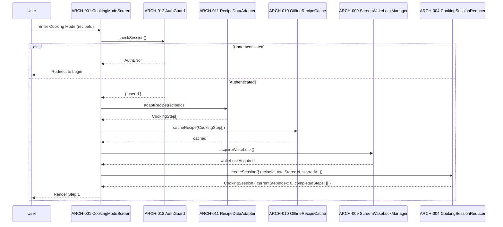
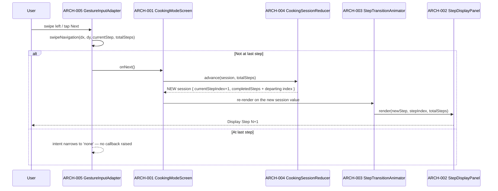
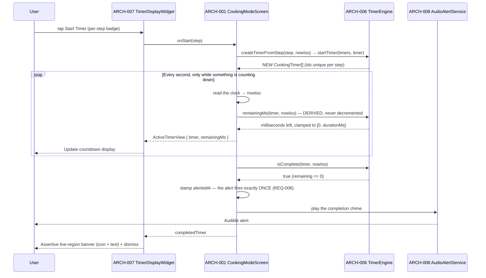
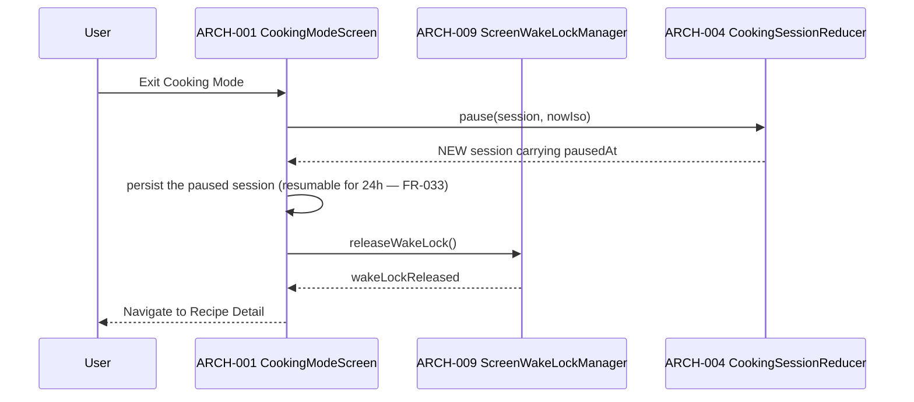
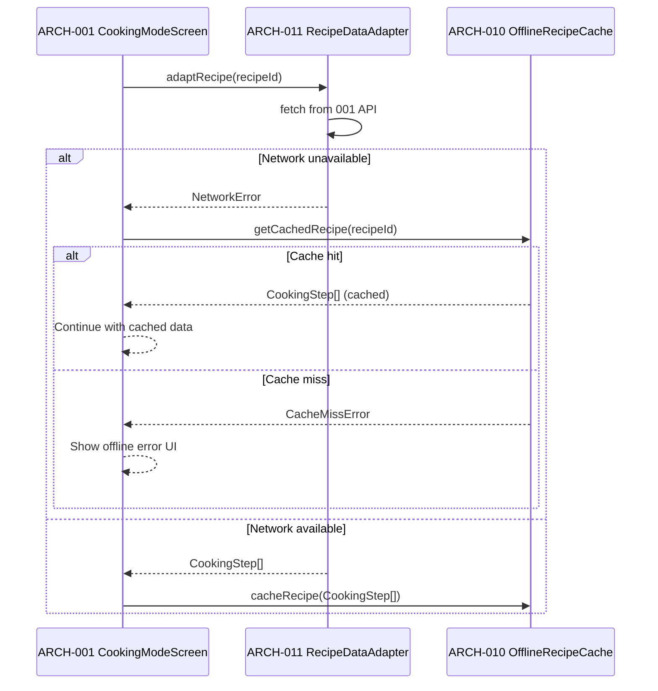

# Architecture Design: Cooking Mode

**Feature Branch**: `008-cooking-mode`
**Created**: 2026-05-09
**Status**: Draft
**Source**: `specs/008-cooking-mode/v-model/system-design.md`

## Overview

Cooking Mode is decomposed into 14 architecture modules organized across four Kruchten 4+1 views. The Logical View maps each system component to one or more focused software modules — separating UI rendering, state management, navigation logic, timer mechanics, audio, wake lock, offline caching, recipe adaptation, and auth guarding into independently testable units. Three cross-cutting modules address logging/error reporting, TypeScript quality enforcement, and accessibility compliance. The Process View documents the critical runtime interaction paths using Mermaid sequence diagrams. Every SYS-NNN from the System Design is covered by at least one ARCH-NNN.

## ID Schema

- **Architecture Module**: `ARCH-NNN` — sequential identifier for each module
- **Parent System Components**: Comma-separated `SYS-NNN` list per module (many-to-many)
- **Cross-Cutting Tag**: `[CROSS-CUTTING; rationale: shared infrastructure supports multiple SYS components]` for infrastructure/utility modules not traceable to a specific SYS
- Example: `ARCH-003` with Parent System Components `SYS-001, SYS-004` — module serves both components
- Example: `ARCH-010 [CROSS-CUTTING; rationale: shared infrastructure supports multiple SYS components]` — infrastructure module (e.g., Logger, Thread Pool) with rationale

## Logical View — Component Breakdown (IEEE 42010 / Kruchten 4+1)

| ARCH ID  | Name                         | Description                                                                                                                                                                                                                                                                                                                                                     | Parent System Components                                                                                                           | Type      |
| -------- | ---------------------------- | --------------------------------------------------------------------------------------------------------------------------------------------------------------------------------------------------------------------------------------------------------------------------------------------------------------------------------------------------------------- | ---------------------------------------------------------------------------------------------------------------------------------- | --------- |
| ARCH-001 | CookingModeScreen            | Top-level React Native screen component. Orchestrates entry into Cooking Mode: triggers auth guard, loads recipe via adapter, initialises wake lock, and renders the step display. Owns the Cooking Mode session lifecycle.                                                                                                                                     | SYS-001, SYS-004, SYS-006, SYS-007                                                                                                 | Component |
| ARCH-002 | StepDisplayPanel             | Presentational component that renders the current recipe step in large, accessible typography. Receives `step`, `stepIndex`, and `totalSteps` as props. Applies minimum font size for 3-foot legibility. Exposes accessible role/label.                                                                                                                         | SYS-001                                                                                                                            | Component |
| ARCH-003 | StepTransitionAnimator       | Handles animated transitions between steps (slide or fade). Wraps `StepDisplayPanel` and drives the animation on `stepIndex` change. Keeps transitions under 300 ms to avoid cognitive disruption.                                                                                                                                                              | SYS-001                                                                                                                            | Component |
| ARCH-004 | CookingSessionReducer        | Pure reducer over the `CookingSession` **value**: `createSession`, `advance`, `goBack`, `goToStep`, `pause`, `resume`, and the derived `sessionStatus`. Holds no instance state and publishes no events — every transition takes the recipe's _current_ step count and returns a NEW session, and the consuming React layer re-renders on that value.           | SYS-002                                                                                                                            | Module    |
| ARCH-005 | GestureInputAdapter          | Translates a released drag into a navigation intent and raises the leaf's `onNext` / `onPrevious` callback, which the orchestrator applies through ARCH-004. Thresholding and boundary narrowing live in the pure `swipeIntent` / `swipeNavigation` policy; the platform gesture API (React Native `PanResponder`) is the adapter's only impure part.           | SYS-002                                                                                                                            | Adapter   |
| ARCH-006 | TimerEngine                  | Pure, multi-timer, time-as-input countdown engine. Builds a timer from a step's inline duration, and DERIVES remaining time from `startedAt` plus a caller-supplied `nowIso` — it never reads the ambient clock, never ticks, and emits no events. Concurrency lives in a caller-owned `CookingTimer[]`.                                                        | SYS-003                                                                                                                            | Module    |
| ARCH-007 | TimerDisplayWidget           | The timer render surfaces: a per-step start badge, the concurrent-timer list (countdown, pause/resume, cancel) and the completion banner, over a shared pure presentation model. All are `props → JSX` leaves fed an already-computed remainder; they hold no timer state and run no interval. Icon + text pairing so colour is never the sole state indicator. | SYS-003                                                                                                                            | Component |
| ARCH-008 | AudioAlertService            | Plays the audible alert sound at the completion ARCH-001 derives from ARCH-006 (the engine emits no event). Uses `expo-av` (or Web Audio API on web). Degrades gracefully with a visual fallback if audio permission is denied. **Specified, not built** — see the reconciliation notes.                                                                        | SYS-003                                                                                                                            | Service   |
| ARCH-009 | ScreenWakeLockManager        | Acquires the platform wake lock on Cooking Mode entry and releases it on exit. Abstracts `expo-keep-awake` (mobile) and the Web Wake Lock API (web). Logs a warning and degrades gracefully on unsupported platforms.                                                                                                                                           | SYS-004                                                                                                                            | Utility   |
| ARCH-010 | OfflineRecipeCache           | Persists the full `Recipe` entity to `AsyncStorage` when Cooking Mode is entered. Serves cached data on subsequent step loads if the network is unavailable. Invalidates cache on recipe update or explicit user action.                                                                                                                                        | SYS-005                                                                                                                            | Service   |
| ARCH-011 | RecipeDataAdapter            | Transforms the `Recipe` entity from feature 001's API contract into the Cooking Mode internal `CookingStep[]` model. Read-only; never mutates source data. Validates shape with Zod before use.                                                                                                                                                                 | SYS-006                                                                                                                            | Adapter   |
| ARCH-012 | AuthGuard                    | Checks for a valid Clerk session before allowing Cooking Mode entry. Reads the Clerk session via `@clerk/nextjs` (web) or `@clerk/expo` (mobile). Redirects unauthenticated users to the Clerk hosted UI.                                                                                                                                                       | SYS-007                                                                                                                            | Service   |
| ARCH-013 | ErrorBoundaryAndLogger       | [CROSS-CUTTING; rationale: shared infrastructure supports multiple SYS components] — React error boundary wrapping `CookingModeScreen`. Catches render errors, logs structured events via `@aws-lambda-powertools/logger` pattern, and displays a user-friendly fallback UI. Covers all components.                                                             | [CROSS-CUTTING; rationale: shared infrastructure supports multiple SYS components] — infrastructure error handling for all SYS     | Utility   |
| ARCH-014 | AccessibilityAndQualityGuard | [CROSS-CUTTING; rationale: shared infrastructure supports multiple SYS components] — Compile-time and lint-time enforcement layer: TypeScript `strict: true` config, ESLint rules prohibiting `any`, JSDoc enforcement, and accessibility lint rules (`eslint-plugin-jsx-a11y`). Applies to all Cooking Mode code.                                              | [CROSS-CUTTING; rationale: shared infrastructure supports multiple SYS components] — quality/accessibility enforcement for all SYS | Utility   |
| ARCH-015 | SessionExtras                | Session-scoped, display-only augmentations: per-ingredient checkoff state (MOD-019) and yield scale factor with quantity recalculation and the not-scaled advisory (MOD-020). Read-only w.r.t. the Recipe entity; holds NO reference to timer state (REQ-015 safety invariant, spec.md D-002).                                                                  | SYS-009                                                                                                                            | Module    |

## Process View — Dynamic Behavior (Kruchten 4+1)

### Interaction 1: Cooking Mode Entry



### Interaction 2: Step Navigation (Forward)



The reducer touches NO timer: `advance` returns a session whose `activeTimers` array is carried through untouched, so moving on from a timed step leaves its countdown running (FR-034, concurrent timers). Nothing here resets a timer, and nothing subscribes: the screen re-renders because it holds a new value, not because an event was published.

### Interaction 3: Timer Start and Completion



Two contract facts this diagram is drawn to state. (a) The engine emits nothing and holds nothing: completion is a _question asked of it_ against a supplied instant, which is why a backgrounded phone shows the correct remainder the moment it returns. (b) "Exactly once" is the ORCHESTRATOR's property, not the engine's — `isComplete` stays `true` on every later tick, so the acknowledgement is recorded on the timer (`alertedAt`) and persisted with the session, and a session restored after an interruption does not re-announce a timer that had already alerted.

> **Not shipped as specified.** ARCH-008's audible half has no implementation (see the reconciliation note at the end of this document); the completion signal that ships is the assertive banner ARCH-007 renders. The ARCH-008 step is retained here as the specified contract, not as a description of running code.

### Interaction 4: Cooking Mode Exit



Exit does not stop the timers, and there is nothing to reset: the running `CookingTimer[]` is part of the persisted session, and each timer's remainder is derived from its `startedAt`, so a resume inside the window shows the countdown where it genuinely is rather than where a stopped tick left it. **Finish** takes the other branch — it CLEARS the stored session on the same write queue as every persist, so no in-flight write can resurrect it.

### Interaction 5: Offline Step Load



## Interface View — Module Contracts (IEEE 42010)

### External-Facing Module Interfaces

| ARCH ID  | Interface Name              | Exposed To       | Protocol / API                        | Input                                     | Output                                     | Error Contract                                             |
| -------- | --------------------------- | ---------------- | ------------------------------------- | ----------------------------------------- | ------------------------------------------ | ---------------------------------------------------------- |
| ARCH-001 | `CookingModeScreen`         | React Navigation | React component props                 | `{ recipeId: string }`                    | Rendered screen                            | Error boundary catches render failures                     |
| ARCH-012 | `AuthGuard.checkSession()`  | ARCH-001         | Clerk session                         | None (reads session context)              | `{ userId: string }` or throws `AuthError` | Redirect to login on `AuthError`                           |
| ARCH-011 | `RecipeDataAdapter.adapt()` | ARCH-001         | REST (001 API) + Zod validation       | `recipeId: string`                        | `CookingStep[]`                            | Throws `RecipeNotFoundError` or `ValidationError`          |
| ARCH-009 | `ScreenWakeLockManager`     | ARCH-001         | `expo-keep-awake` / Web Wake Lock API | `acquire()` / `release()` calls           | `void`                                     | Logs warning; degrades gracefully on unsupported platforms |
| ARCH-008 | `AudioAlertService.play()`  | ARCH-006         | `expo-av` / Web Audio API             | None (triggered by `timerComplete` event) | `void`                                     | Logs warning; shows visual fallback if audio denied        |

### Internal Module Interfaces

| ARCH ID  | Interface Name                 | Consumed By        | Protocol                   | Input                                                                                                                                                                                                                              | Output                                                                                              | Error Contract                                                                                                                                                                   |
| -------- | ------------------------------ | ------------------ | -------------------------- | ---------------------------------------------------------------------------------------------------------------------------------------------------------------------------------------------------------------------------------- | --------------------------------------------------------------------------------------------------- | -------------------------------------------------------------------------------------------------------------------------------------------------------------------------------- |
| ARCH-004 | `CookingSessionReducer`        | ARCH-001, ARCH-005 | Pure function calls        | `createSession({ recipeId, totalSteps, startedAt })`, `advance(session, totalSteps)`, `goBack(session)`, `goToStep(session, index, totalSteps)`, `pause(session, nowIso)`, `resume(session)`, `sessionStatus(session, totalSteps)` | A **new** `CookingSession`; `sessionStatus` returns `'idle' \| 'cooking' \| 'paused' \| 'complete'` | `InvalidTotalStepsError` / `InvalidStepIndexError`, each with an `is*` guard; `advance` / `goBack` clamp at the boundaries, and a restored index is repaired rather than trusted |
| ARCH-005 | `GestureInputAdapter`          | ARCH-001           | Platform gesture events    | Released drag (`dx`, `dy`) + the current position                                                                                                                                                                                  | Raises `onNext()` / `onPrevious()`, which ARCH-001 applies through ARCH-004                         | Below threshold, vertically dominant, or past a boundary → intent `'none'`, no callback raised                                                                                   |
| ARCH-003 | `StepTransitionAnimator`       | ARCH-001, ARCH-004 | React animation props      | `{ step: CookingStep, stepIndex: number }`                                                                                                                                                                                         | Animated render of `StepDisplayPanel`                                                               | Falls back to instant render if animation fails                                                                                                                                  |
| ARCH-002 | `StepDisplayPanel`             | ARCH-003           | React props                | `{ step: CookingStep, stepIndex: number, totalSteps: number }`                                                                                                                                                                     | Rendered step UI with accessible role/label                                                         | Shows placeholder on missing step data                                                                                                                                           |
| ARCH-006 | `TimerEngine`                  | ARCH-001           | Pure function calls        | `createTimerFromStep(step, nowIso)`, `remainingMs(timer, nowIso)`, `isComplete(timer, nowIso)`, `pauseTimer` / `resumeTimer(timer, nowIso)`, `startTimer` / `cancelTimer(timers, …)`, `completedTimers(timers, nowIso)`            | A **new** `CookingTimer` or `CookingTimer[]`; `remainingMs` in `[0, durationMs]`                    | `StepHasNoTimerError`, `InvalidTimerDurationError`, `InvalidTimestampError`, `InvalidTimerStateError`, `DuplicateTimerIdError`, `UnknownTimerError` — each with an `is*` guard   |
| ARCH-007 | `TimerDisplayWidget`           | ARCH-001           | React props                | `{ step, onStart }` (badge); `{ timers: ActiveTimerView[], onPause, onResume, onCancel }` (list); `{ completedTimer?, onDismiss }` (banner)                                                                                        | Rendered start badge / countdown list / completion banner                                           | A step with no duration, an empty timer list and an absent `completedTimer` each render **nothing** — the gate is structural, not a disabled control                             |
| ARCH-010 | `OfflineRecipeCache`           | ARCH-001, ARCH-011 | AsyncStorage               | `cacheRecipe(steps: CookingStep[])`, `getCachedRecipe(recipeId: string)`                                                                                                                                                           | `void` / `CookingStep[]`                                                                            | Logs error on write failure; throws `CacheMissError` on miss                                                                                                                     |
| ARCH-013 | `ErrorBoundaryAndLogger`       | All components     | React error boundary       | Render errors from child components                                                                                                                                                                                                | Fallback UI + structured log event                                                                  | Always renders fallback; never re-throws to root                                                                                                                                 |
| ARCH-014 | `AccessibilityAndQualityGuard` | Build pipeline     | TypeScript / ESLint config | Source files                                                                                                                                                                                                                       | Compile errors / lint warnings                                                                      | CI fails on any `strict` violation or `any` usage                                                                                                                                |
| ARCH-015 | `SessionExtras`                | ARCH-001 (screen)  | Reducer functions          | toggleIngredient(id), setScaleFactor(f)                                                                                                                                                                                            | checkedIngredientIds[], scaleFactor, showAdvisory                                                   | Throws on unknown ingredient / unsupported factor                                                                                                                                |

## Data Flow View (Kruchten 4+1)

```text
[001 Recipe API]
      │ REST (recipeId)
      ▼
[ARCH-011 RecipeDataAdapter] ──Zod validate──► CookingStep[]
      │
      ├──► [ARCH-010 OfflineRecipeCache] ──AsyncStorage──► persisted CookingStep[]
      │
      └──► [ARCH-001 CookingModeScreen]   ── owns the session VALUE and the only clock read
                │
                ├──► [ARCH-004 CookingSessionReducer] ──(session, totalSteps)──► NEW CookingSession
                │           │ currentStepIndex
                │           ▼
                │    [ARCH-003 StepTransitionAnimator]
                │           │ step + stepIndex
                │           ▼
                │    [ARCH-002 StepDisplayPanel] ──► User (rendered step)
                │
                ├──► [ARCH-006 TimerEngine] ──(timers, nowIso)──► NEW CookingTimer[] + remainingMs
                │           │ ActiveTimerView { timer, remainingMs }
                │           ├──► [ARCH-007 TimerDisplayWidget] ──► User (countdown, alert banner)
                │           └──► [ARCH-008 AudioAlertService] ──► User (alert sound)
                │
                ├──► [ARCH-009 ScreenWakeLockManager] ──► Platform (wake lock)
                └──► [ARCH-012 AuthGuard] ──► Clerk (session check)

[ARCH-005 GestureInputAdapter] ──onNext / onPrevious──► [ARCH-001 CookingModeScreen]
[ARCH-013 ErrorBoundaryAndLogger] ── wraps ──► all components
[ARCH-014 AccessibilityAndQualityGuard] ── enforces ──► build pipeline
```

## SYS↔ARCH Traceability Matrix

| SYS ID  | SYS Name                | ARCH Modules                                                    |
| ------- | ----------------------- | --------------------------------------------------------------- |
| SYS-001 | Step Display            | ARCH-001 (lifecycle), ARCH-002 (render), ARCH-003 (animation)   |
| SYS-002 | Step Navigation         | ARCH-004 (session reducer), ARCH-005 (gesture input)            |
| SYS-003 | Timer Engine            | ARCH-006 (engine), ARCH-007 (display), ARCH-008 (audio alert)   |
| SYS-004 | Screen Wake Lock        | ARCH-009 (wake lock manager)                                    |
| SYS-005 | Offline Recipe Cache    | ARCH-010 (cache service)                                        |
| SYS-006 | Recipe Data Adapter     | ARCH-011 (adapter), ARCH-001 (consumer)                         |
| SYS-007 | Auth Guard              | ARCH-012 (auth guard), ARCH-001 (consumer)                      |
| SYS-008 | Quality & Accessibility | ARCH-013 (error boundary/logger), ARCH-014 (quality/a11y guard) |
| SYS-009 | Session Extras          | ARCH-015 (session extras), ARCH-001 (consumer)                  |

**Coverage**: All 8 SYS components are covered. No SYS is orphaned.

## ARCH Module Summary

| Count  | Category              | ARCH IDs                                                                   |
| ------ | --------------------- | -------------------------------------------------------------------------- |
| 12     | Feature modules       | ARCH-001 through ARCH-012                                                  |
| 2      | Cross-cutting modules | ARCH-013 (ErrorBoundaryAndLogger), ARCH-014 (AccessibilityAndQualityGuard) |
| **14** | **Total**             |                                                                            |

## Derived Modules

None. All 14 ARCH modules are directly traceable to SYS components or are explicitly tagged `[CROSS-CUTTING; rationale: shared infrastructure supports multiple SYS components]` with rationale.

## Physical View — Deployment Topology

The feature deploys within the Commise AWS/serverless topology. Client-facing web/mobile modules run in their respective application packages. Backend API, worker, queue, database, cache, storage, observability, and infrastructure modules deploy to the configured AWS account and region. Each ARCH module maps to the runtime described in the Logical View and the package/source paths listed in the Development View.

## Development View — Source Organization

Implementation modules are organized by platform and service boundary: web code under Next.js application packages, mobile code under Expo packages, backend services under API/Lambda packages, shared contracts under shared TypeScript packages, and infrastructure under CDK/IaC packages. This view constrains ownership, build boundaries, and deployment units for every ARCH-NNN module listed above.

## Scenarios — Architecture Validation

Primary scenarios validate the 4+1 architecture: successful request flow through user-facing entrypoints, dependency failure propagation through process boundaries, data persistence and retrieval through storage boundaries, and deployment/change isolation through development-view package ownership. Each scenario traces back to the SYS coverage listed on ARCH rows.

## Reconciliation Notes

> **Corrected 2026-08-09 (ARCH-004, ARCH-005, ARCH-006, ARCH-007).** These four rows — and the Process and Data Flow views that
> drew them — specified **stateful classes with event streams**: `ARCH-004 StepNavigationController` exposing
> `initialise(stepIndex, totalSteps)` / `goNext()` / `goPrev()` and publishing `onStepChange`, and `ARCH-006 TimerEngine` ticking a
> single `setInterval` countdown, emitting `timerComplete`, and exposing an `{ remaining, status: 'idle' | 'running' | 'paused' |
'done' }` state that `ARCH-007` subscribed to. None of it exists, and none of it should: the approved design is `plan.md` §4's
> "statechart-shaped session reducer", and what shipped is `packages/shared/cooking/src/session.ts` (pure session reducer) and
> `packages/shared/cooking/src/timerEngine.ts` (pure, multi-timer, time-as-input engine), consumed by the headless
> `useCookingSession` hook and rendered by pure leaves. `module-design.md` MOD-004 and MOD-006 were reconciled on 2026-08-07/09,
> which left **this document contradicting its own children** — an ARCH parent specifying a class its MOD explicitly rejects.
>
> The class shape is wrong, not merely different: a mutable singleton with subscriber callbacks cannot be JSON-persisted and
> restored, which is exactly what FR-033's 24h resume demands (the `CookingSession` **value** is the persisted unit); a
> tick-decremented counter drifts and stops entirely while a phone is backgrounded, whereas a remainder derived from `startedAt`
> plus a supplied `nowIso` is correct the instant the app returns (HAZ-007's own recorded mitigation); and a single-timer engine
> models no concurrency at all, leaving HAZ-008 unaddressed. **Every ARCH id is unchanged** — Matrix C, the ITP range and the MOD
> children all key off them — and only names, descriptions, interface rows and diagram steps are corrected. ARCH-004's _name_
> moves from `StepNavigationController` to `CookingSessionReducer`, matching MOD-004. Do not "restore" the class design.
>
> **Residual drift found in this pass and deliberately NOT fixed** (recorded so it is not mistaken for a clean bill):
>
> - **ARCH-008 AudioAlertService has no implementation.** No audio module exists in `@commise/features-cooking` or
>   `@kitchensink/cooking-core`; the completion signal that ships is ARCH-007's assertive live-region banner. REQ-006's audible
>   clause is therefore unmet by code, not merely mis-specified — a requirements gap for the owner to rule on, not a doc edit.
> - **ARCH-010 OfflineRecipeCache, ARCH-011 RecipeDataAdapter and ARCH-012 AuthGuard** describe modules the feature never built.
>   Cooking Mode receives the recipe as data (`CookingRecipeState`), performs no fetch and no Zod adaptation, and holds no auth
>   guard of its own (the host route owns entry). Their rows, `ITP-010/011/012` and `UTP-010/011/012` are all still written against
>   that design.
> - **ARCH-003 StepTransitionAnimator** has no shipped counterpart either; step changes re-render without an animation wrapper.
