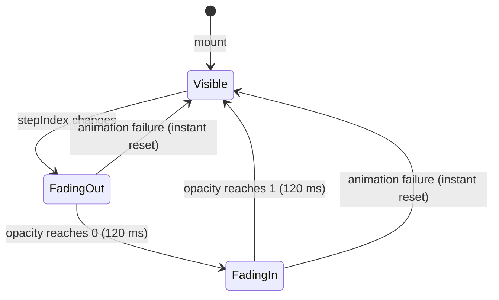
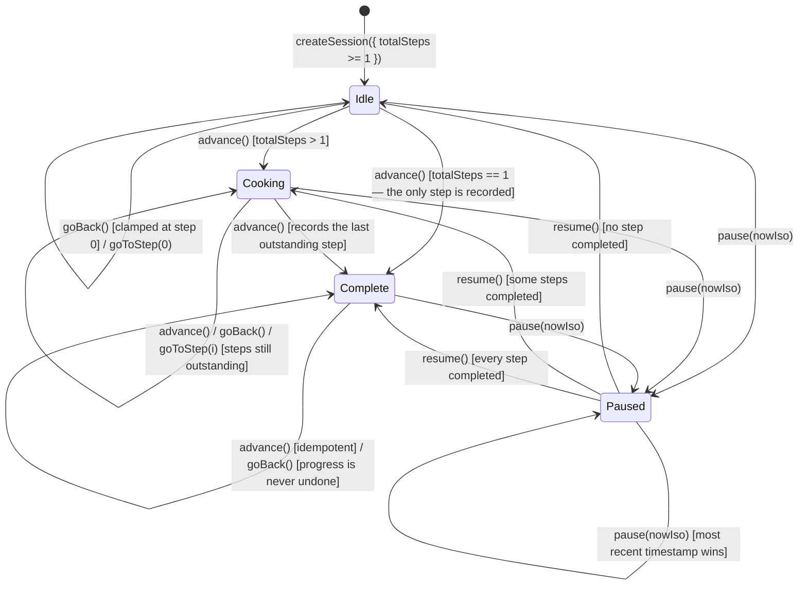
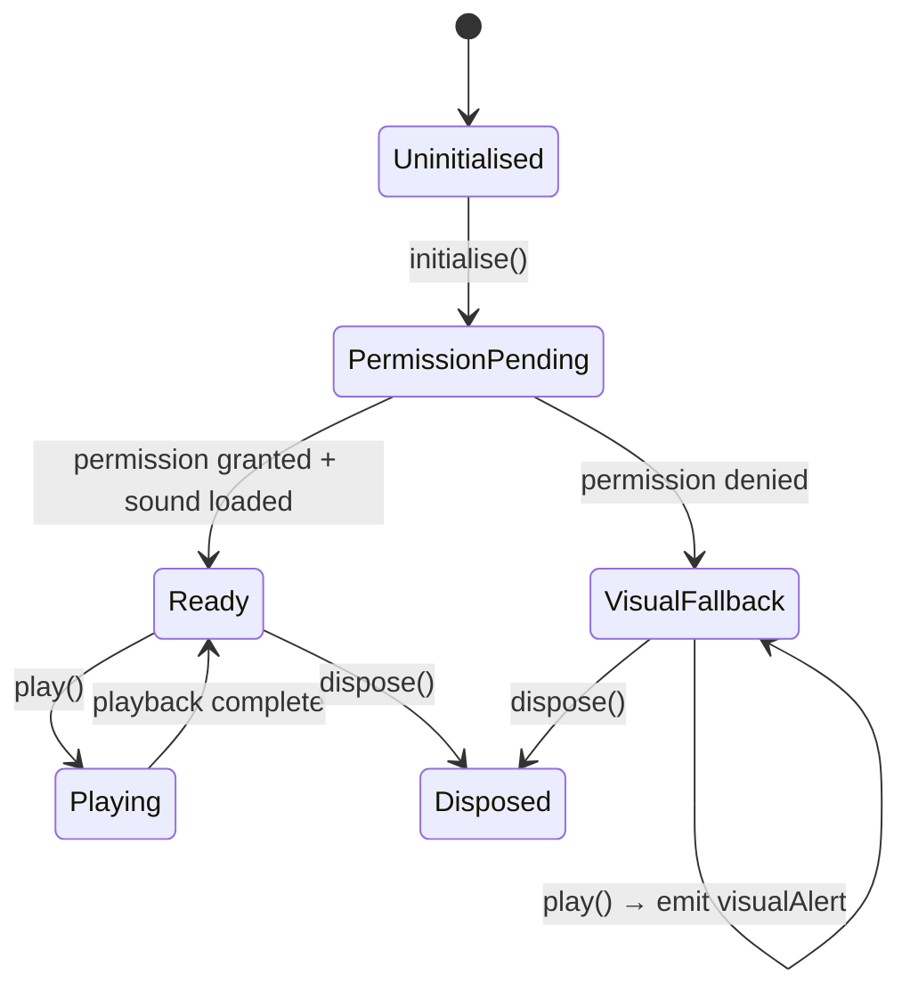
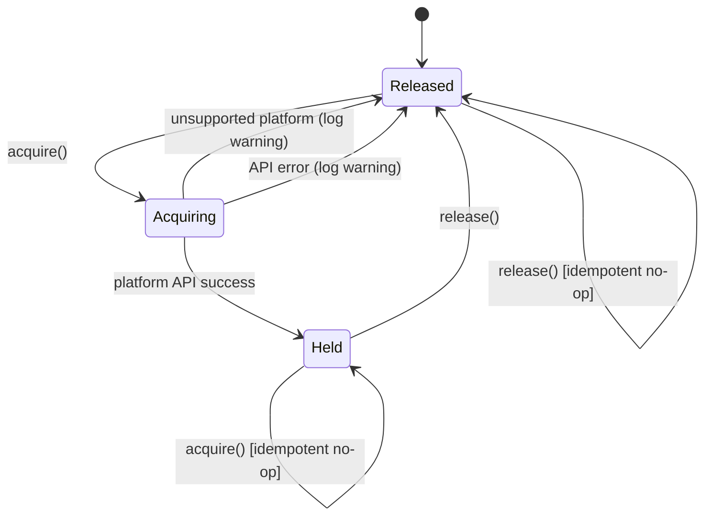
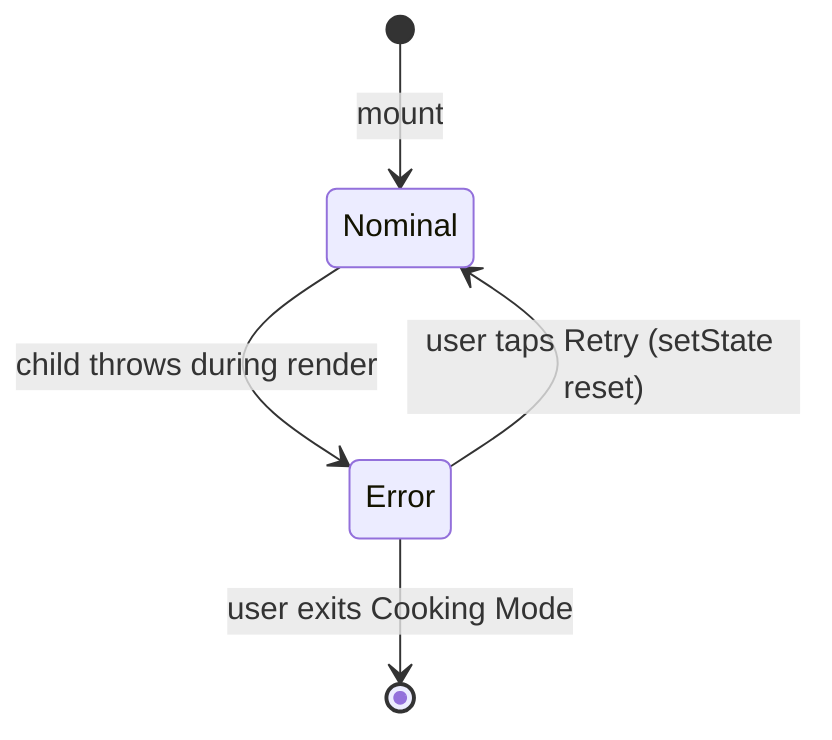

# Module Design: Cooking Mode

**Feature Branch**: `008-cooking-mode`
**Created**: 2026-05-09
**Status**: Draft
**Source**: `specs/008-cooking-mode/v-model/architecture-design.md`

## Overview

Cooking Mode's 15 architecture modules (ARCH-001 through ARCH-015) are decomposed into 20 low-level module designs (MOD-001 through MOD-020). Complex architecture modules with distinct stateful and presentational concerns are split into separate MODs to keep each unit independently testable. Every MOD is specified with four mandatory views — Algorithmic/Logic, State Machine, Internal Data Structures, and Error Handling — at a level of detail where writing the actual TypeScript/React Native source code is a direct translation exercise requiring no further design decisions.

## ID Schema

- **Module Design**: `MOD-NNN` — sequential identifier for each module (3-digit zero-padded)
- **Parent Architecture Modules**: Comma-separated `ARCH-NNN` list per module (many-to-many, authoritative for traceability)
- **Target Source File(s)**: Comma-separated file paths mapping to the repository codebase
- Example: `MOD-003` with Parent Architecture Modules `ARCH-001, ARCH-004` — module serves both architecture components
- Example: `MOD-007 [EXTERNAL]` — third-party library wrapper, documents interface only

## ARCH → MOD Coverage Table

| ARCH ID  | ARCH Name                    | MOD(s)                             |
| -------- | ---------------------------- | ---------------------------------- |
| ARCH-001 | CookingModeScreen            | MOD-001                            |
| ARCH-002 | StepDisplayPanel             | MOD-002                            |
| ARCH-003 | StepTransitionAnimator       | MOD-003                            |
| ARCH-004 | CookingSessionReducer        | MOD-004                            |
| ARCH-005 | GestureInputAdapter          | MOD-005                            |
| ARCH-006 | TimerEngine                  | MOD-006                            |
| ARCH-007 | TimerDisplayWidget           | MOD-007                            |
| ARCH-008 | AudioAlertService            | MOD-008                            |
| ARCH-009 | ScreenWakeLockManager        | MOD-009                            |
| ARCH-010 | OfflineRecipeCache           | MOD-010                            |
| ARCH-011 | RecipeDataAdapter            | MOD-011                            |
| ARCH-012 | AuthGuard                    | MOD-012                            |
| ARCH-013 | ErrorBoundaryAndLogger       | MOD-013, MOD-014                   |
| ARCH-014 | AccessibilityAndQualityGuard | MOD-015, MOD-016, MOD-017, MOD-018 |
| ARCH-015 | SessionExtras                | MOD-019, MOD-020                   |

## Module Designs

---

### Module: MOD-001 (CookingModeScreen)

**Parent Architecture Modules**: ARCH-001
**Target Source File(s)**: `packages/apps/commise/features/cooking/src/useCookingSession.ts` (headless orchestration),
`packages/apps/commise/features/cooking/src/CookingModeScreen.tsx` / `.native.tsx` (the two platform shells)

#### Algorithmic / Logic View

```pseudocode
// The Humble Object split plan.md §4 prescribes: ONE orchestrational component, whose state, effects and
// wiring live in a headless hook, and pure `props → JSX` leaves under it. Cooking Mode FETCHES NOTHING —
// the recipe arrives as data, and the two ports it does use (device storage, wake lock) are INJECTED, so
// nothing platform-specific is imported by the hook. It issues no request of any kind (REQ-CN-001).

TYPE CookingRecipeState =                                  // discriminated union, not a flag + nullable data
    { status: 'loading' } | { status: 'error' }
  | { status: 'ready', steps: readonly RecipeStepView[], ingredients: readonly RecipeIngredientView[] }

TYPE SessionState =                                        // the session statechart
    { phase: 'restoring' } | { phase: 'cooking', session } | { phase: 'ended', session }

HOOK useCookingSession({ recipeId, recipe, store, wakeLock, onExit, onFinish }) -> CookingSessionApi:

  state          = STATE<SessionState>({ phase: 'restoring' })
  nowIso         = STATE<string>(currentIso())             // the ONE place this layer reads the clock
  alertedTimerId = STATE<string | null>(null)
  persistQueue   = REF<Promise<void>>(resolved)            // storage WRITE ORDER is not expressible as state

  EFFECT restore-or-open [recipe ready, stepCount, recipeId, store]:
      IF recipe NOT ready OR stepCount == 0 OR a session for THIS recipeId is already open: RETURN
      TRY:
          outcome = AWAIT restoreSession(store, recipeId, currentIso())      // sessionPersistence.ts
          session = outcome.status == 'resumable'
                      ? adoptRestoredSession(outcome.session, stepCount, currentIso())
                      : createSession({ recipeId, totalSteps: stepCount, startedAt: currentIso() })
      CATCH:
          // A storage FAULT is not "nothing to resume" — the domain refuses to conflate them, leaving the
          // choice here. Starting fresh costs the cook their place; refusing to open costs them the recipe.
          session = createSession({ recipeId, totalSteps: stepCount, startedAt: currentIso() })
      SET state = { phase: 'cooking', session }

  EFFECT persist [state, store]:                           // keyed on the session VALUE: one write per
      IF state.phase == 'cooking':                         // transition, and none for a mere tick
          enqueueWrite(() => persistSession(store, state.session))

  EFFECT reconcile-checkoff [ingredientIds, recipe ready, state]:
      // Drops ids the recipe no longer contains, on restore AND mid-session. Gated on `ready` so a refetch
      // that briefly reports no ingredients cannot wipe the checkoff.

  EFFECT wake-lock [controller, state.phase]:              // MOD-009; the phase gate releases on finish/exit
      IF state.phase == 'cooking': controller.acquire()    // cleanup: controller.release()

  EFFECT tick [isCounting]:                                // only while something is actually counting down
      SET nowIso = currentIso()                            // immediately, so frame 1 is not a second stale
      INTERVAL(TIMER_TICK_INTERVAL_MS = 1000): SET nowIso = currentIso()

  EFFECT alert-once [alertedTimerId, nowIso, state]:                                  // REQ-006
      due = FIRST timer IN session.activeTimers WHERE timer.alertedAt IS ABSENT AND isComplete(timer, nowIso)
      IF due EXISTS: stamp due.alertedAt = currentIso() ON THE SESSION; SET alertedTimerId = due.id
      // Completion is DERIVED, so it stays true on every later tick; `alertedAt` is what makes "once" real,
      // and persisting it stops a restored session re-announcing a timer that finished before it.

  // ── Derived view (nothing below is stored) ──
  surface       = error ? {error} : loading ? {loading} : stepCount == 0 ? {empty}
                        : session == null ? {loading}                    // device not yet answered
                        : { kind: 'step', step: steps[CLAMP(index)], stepIndex, stepCount }
  activeTimers  = session.activeTimers MAP timer -> { timer, remainingMs: remainingMs(timer, nowIso) }
  completedTimer= session.activeTimers FIND id == alertedTimerId

  // ── Commands (each inert unless phase == 'cooking') ──
  goToNextStep      -> updateSession(s => advance(s, stepCount))          // MOD-004
  goToPreviousStep  -> updateSession(goBack)
  finish            -> phase := 'ended'; enqueueWrite(clearSession(store, recipeId)); onFinish()
  exit              -> paused := pause(session, currentIso()); phase := 'ended'
                       enqueueWrite(persistSession(store, paused)); onExit()
                       // Written HERE, not left to the effect: the host commonly unmounts from onExit, and
                       // an effect that never runs is a session the cook cannot resume.
  startStepTimer(s) -> createTimerFromStep(s, currentIso()) then startTimer(...)       // MOD-006
  pause/resume/cancelStepTimer(id) -> the addressed pure timer reducer
  dismissTimerAlert(id)            -> alertedTimerId := null   // acknowledges; does NOT cancel the timer
  toggleIngredient(id)             -> MOD-019 reducer
  changeScaleFactor(f)             -> setScaleFactor(f) (MOD-020) then store on the session

COMPONENT CookingModeScreen(props: CookingModeScreenProps) -> ReactElement:
  session = useCookingSession({ ...props, store: props.sessionStore,
                                wakeLock: props.wakeLock ?? acquireWebWakeLock })   // native: Expo adapter
  isIngredientsOpen = STATE<boolean>(false)   // view state: never persisted, never resumed

  RETURN:
    <section aria-label=modeLabel>
      <header> exit control; ingredients toggle (only on the step surface) </header>
      <TimerAlert completedTimer=session.completedTimer onDismiss=session.dismissTimerAlert />
      SWITCH session.surface.kind:            // a TOTAL switch — adding a surface fails to COMPILE
        'loading' -> <StepDisplayLoading />
        'error'   -> <StepDisplayError onRetry=props.onRetry />   // the HOST owns the retry
        'empty'   -> <StepDisplayEmpty />
        'step'    -> <StepDisplay step=surface.step stepCount=surface.stepCount />
      IF surface.kind == 'step':
        <TimerBadge …/> <StepNavigation …/> <ActiveTimers …/> <ScaleSelector …/> <IngredientChecklist …/>
    </section>
```

#### State Machine View



```mermaid
stateDiagram-v2
    [*] --> Restoring : mount(recipeId, recipe)
    Restoring --> Restoring : recipe loading / error / zero steps — no session is opened, storage is not read
    Restoring --> Cooking : resumable session adopted (index repaired, unreadable timers dropped)
    Restoring --> Cooking : nothing to resume, storage failed, or session expired → createSession()
    Cooking --> Cooking : navigate / timer / checkoff / scale — each a NEW session value + one persisted write
    Cooking --> Ended : finish() → clear the stored session, release the wake lock, onFinish()
    Cooking --> Ended : exit() → persist a paused session, release the wake lock, onExit()
    Ended --> Ended : every command is inert; no write, no navigation, no lock
    Ended --> [*] : the host navigates away
```

`ended` deliberately KEEPS its session, so the last step stays on screen until the host navigates: a blank frame between "finish"
and the host's navigation would be a worse ending than the step the cook just completed. A `recipeId` change under a mounted
screen re-enters `Restoring`, because a session belonging to another recipe must never be adopted.

#### Internal Data Structures

| Name                     | Type                                 | Size/Constraints                              | Initialization          | Description                                                                                        |
| ------------------------ | ------------------------------------ | --------------------------------------------- | ----------------------- | -------------------------------------------------------------------------------------------------- |
| `state`                  | `SessionState` (discriminated union) | exactly one phase; `session` present by phase | `{ phase:'restoring' }` | Makes "there is a session" and "we are still restoring" unable to disagree                         |
| `nowIso`                 | `string`                             | ISO 8601                                      | `currentIso()`          | The clock sample every countdown is derived against; advanced only by the tick                     |
| `alertedTimerId`         | `string \| null`                     | a live timer id                               | `null`                  | Which completion is currently showing; `null` is "nothing to announce"                             |
| `persistQueue`           | `Ref<Promise<void>>`                 | serialised chain                              | resolved                | Orders storage writes. **The one permitted ref** — external, non-declarative, order-sensitive      |
| `ingredientIds`          | `readonly string[]`                  | folded to ONE separator-joined key            | `[]`                    | Stable identity across host re-renders, so effects do not restart every frame                      |
| `isCounting`             | `boolean`                            | derived                                       | —                       | At least one unpaused timer; gates the interval so an idle session does not re-render for a braise |
| `isIngredientsOpen`      | `boolean`                            | —                                             | `false`                 | View state on the screen, NOT session state — never persisted, never resumed                       |
| `TIMER_TICK_INTERVAL_MS` | `number` (constant)                  | `1_000`                                       | static                  | One second: the finest granularity the `{minutes}:{seconds}` readout has                           |

#### Error Handling & Return Codes

| Error Condition                                         | Error Code / Exception                                | Architecture Contract                                  | Recovery                                                                                                |
| ------------------------------------------------------- | ----------------------------------------------------- | ------------------------------------------------------ | ------------------------------------------------------------------------------------------------------- |
| Device storage read/write fails                         | Any rejection from the injected `CookingSessionStore` | ARCH-001 owns the choice the domain refuses to make    | Open a FRESH session and keep cooking; one failed write must not stall the queue behind it              |
| Restored session names a step the recipe no longer has  | None — repaired                                       | ARCH-004 restore-repair (`goToStep` to the last index) | Lands inside the current range; also clamped once more at render                                        |
| Restored timer is internally inconsistent               | `InvalidTimerStateError` / `InvalidTimestampError`    | ARCH-006 Interface: unreadable timer                   | Dropped at the restore boundary — the cook loses a countdown, not the session                           |
| Start pressed for a step with no / a malformed duration | `StepHasNoTimerError`, `InvalidTimerDurationError`    | ARCH-006 Interface                                     | Ignored: unreachable from the UI (no badge renders), and a data defect is not worth interrupting a cook |
| Start pressed twice on the same step                    | `DuplicateTimerIdError`                               | ARCH-006 Interface: one running timer per step id      | State unchanged — to the cook it is a repeated tap, and the ORIGINAL countdown survives                 |
| Cancel pressed for a timer already gone                 | `UnknownTimerError`                                   | ARCH-006 Interface: cancels fail loudly                | Swallowed at this boundary; the alert is cleared if it named that timer                                 |
| Yield factor outside the supported set                  | `UnsupportedScaleFactorError`                         | ARCH-015 Interface                                     | Propagates: the value crossed a component boundary and is validated by the domain, never trusted        |
| Recipe could not be loaded by the host                  | `recipe.status === 'error'`                           | ARCH-001 Interface: the screen fetches nothing         | Error surface + a retry that reports UPWARD (`onRetry`); the exit affordance stays on every surface     |
| Render error (child throws)                             | React render exception                                | ARCH-013 ErrorBoundary catches                         | ErrorBoundary renders fallback UI                                                                       |

> **Corrected 2026-08-09.** This section specified a screen that authenticated, fetched and cached the recipe itself, then called
> `StepNavigationController.initialise(stepIndex=0, totalSteps=…)` on mount and `TimerEngine.reset()` on unmount. Both calls are
> **dead**: no such modules exist (see the MOD-004 and MOD-006 correction notes), and the shipped screen does none of that work —
> it receives the recipe as a `CookingRecipeState` prop, issues no request at all (REQ-CN-001), and delegates every transition to a
> pure reducer through the headless `useCookingSession`. The `AuthGuard` / `RecipeDataAdapter` / `OfflineRecipeCache` mount chain is
> likewise unbuilt; entry auth belongs to the host route. `TimerEngine.reset()` is not merely renamed but **wrong in intent**: exit
> must LEAVE the timers running inside the persisted session, because each remainder is derived from `startedAt` and a resume within
> 24h has to show where the countdown genuinely is. The **`MOD-001` id is retained** — Matrix D, ARCH-001 and the `UTP-001-*` range
> key off it — and only the target paths and the four views are corrected.
>
> **Not fixed in this pass, and visible on purpose:** `UTP-001-A` / `UTP-001-B` / `UTP-001-C` / `UTP-001-G` / `UTP-001-H` in
> `unit-test.md` still arrange the auth/adapter/cache chain this section no longer specifies. Only `UTP-001-D`, `UTP-001-E` and
> `UTP-001-F` — the cases that asserted the dead `initialise` / `reset` calls, and the one naming a `StepNavigationController`
> instance — were corrected there.

---

### Module: MOD-002 (StepDisplayPanel)

**Parent Architecture Modules**: ARCH-002
**Target Source File(s)**: `packages/apps/commise/features/cooking/src/components/StepDisplayPanel.tsx`

#### Algorithmic / Logic View

```pseudocode
COMPONENT StepDisplayPanel(props: {
  step: CookingStep,
  stepIndex: number,
  totalSteps: number
}) -> ReactElement:

  // Validate props
  IF props.step IS NULL OR UNDEFINED:
    RETURN <PlaceholderText text="Loading step…" />

  progressLabel = "Step " + (props.stepIndex + 1) + " of " + props.totalSteps

  RETURN:
    <View accessibilityRole="region" accessibilityLabel=progressLabel>
      <Text style={{ fontSize: MAX(24, DEVICE_FONT_SCALE * 24) }}>
        props.step.instruction
      </Text>
      IF props.step.note IS NOT NULL:
        <Text style={{ fontSize: MAX(18, DEVICE_FONT_SCALE * 18) }}>
          props.step.note
        </Text>
      <Text accessibilityLabel=progressLabel style={styles.progress}>
        progressLabel
      </Text>
    </View>
```

#### State Machine View

N/A — Stateless pure presentational component; all state is owned by ARCH-004.

#### Internal Data Structures

| Name            | Type     | Size/Constraints | Initialization | Description                                      |
| --------------- | -------- | ---------------- | -------------- | ------------------------------------------------ |
| `progressLabel` | `string` | max 32 chars     | computed       | Human-readable "Step N of M" accessibility label |

#### Error Handling & Return Codes

| Error Condition               | Error Code / Exception        | Architecture Contract                 | Recovery                            |
| ----------------------------- | ----------------------------- | ------------------------------------- | ----------------------------------- |
| `step` prop is null/undefined | `PropsMissingError` (runtime) | ARCH-002 Interface: shows placeholder | Render `<PlaceholderText>` fallback |

---

### Module: MOD-003 (StepTransitionAnimator)

**Parent Architecture Modules**: ARCH-003
**Target Source File(s)**: `packages/apps/commise/features/cooking/src/components/StepTransitionAnimator.tsx`

#### Algorithmic / Logic View

```pseudocode
COMPONENT StepTransitionAnimator(props: {
  step: CookingStep,
  stepIndex: number,
  children: ReactElement
}) -> ReactElement:

  animatedValue = USE_ANIMATED_VALUE(initial=1.0)
  prevStepIndex = USE_REF(props.stepIndex)

  ON_EFFECT([props.stepIndex]):
    IF props.stepIndex != prevStepIndex.current:
      // Fade out → update → fade in, total ≤ 300 ms
      Animated.sequence([
        Animated.timing(animatedValue, { toValue: 0, duration: 120, useNativeDriver: true }),
        Animated.timing(animatedValue, { toValue: 1, duration: 120, useNativeDriver: true })
      ]).start(onComplete: () =>
        IF animation failed:
          animatedValue.setValue(1)  // instant fallback
      )
      prevStepIndex.current = props.stepIndex

  RETURN:
    <Animated.View style={{ opacity: animatedValue }}>
      props.children
    </Animated.View>
```

#### State Machine View



#### Internal Data Structures

| Name            | Type                             | Size/Constraints | Initialization    | Description                            |
| --------------- | -------------------------------- | ---------------- | ----------------- | -------------------------------------- |
| `animatedValue` | `Animated.Value`                 | `[0.0, 1.0]`     | `1.0`             | Drives opacity of the animated wrapper |
| `prevStepIndex` | `React.MutableRefObject<number>` | integer          | `props.stepIndex` | Tracks previous step to detect changes |

#### Error Handling & Return Codes

| Error Condition         | Error Code / Exception | Architecture Contract                            | Recovery                                        |
| ----------------------- | ---------------------- | ------------------------------------------------ | ----------------------------------------------- |
| Animation start failure | `AnimationError`       | ARCH-003 Interface: falls back to instant render | `animatedValue.setValue(1)` — no visible glitch |

---

### Module: MOD-004 (CookingSessionReducer)

**Parent Architecture Modules**: ARCH-004
**Target Source File(s)**: `packages/shared/cooking/src/session.ts`

#### Algorithmic / Logic View

```pseudocode
// Pure reducer over CookingSession (FR-032, FR-033 / REQ-001..003, REQ-008..010).
// No instance state and no subscribers: every transition takes a session and returns a NEW one,
// never mutating its input. Unchanged arrays are shared with the input (structural sharing), so
// every session must be treated as immutable.
//
// `totalSteps` is deliberately NOT stored on the session. The step count belongs to the recipe
// (`RecipeStep[]` from `@kitchensink/recipe-core`) and may legitimately differ from the count in
// force when a persisted session was created, so callers pass the CURRENT count into every
// transition that needs a boundary — and the transitions repair rather than trust a restored index.

TYPE SessionStatus = 'idle' | 'cooking' | 'paused' | 'complete'   // derived, never stored

PRIVATE FUNCTION assertTotalSteps(totalSteps: number) -> void:
    // `Number.isInteger` rejects NaN, Infinity and fractions in one predicate, so no non-integer
    // can reach the arithmetic below and silently produce a fractional or NaN index.
    IF NOT isInteger(totalSteps) OR totalSteps < 1:
        THROW InvalidTotalStepsError(totalSteps)

PRIVATE FUNCTION clampIndex(index: number, lastIndex: number) -> number:
    IF NOT isFinite(index): RETURN 0                 // Math.max(NaN, 0) is NaN — fall back to step 0
    RETURN MIN(MAX(TRUNC(index), 0), lastIndex)

PRIVATE FUNCTION withStepRecorded(completedSteps: readonly number[], stepIndex: number) -> number[]:
    // Always a FRESH array, even when nothing is added: the returned session must never share a
    // mutable array whose contents differ from the one the caller still holds.
    RETURN completedSteps CONTAINS stepIndex
             ? COPY(completedSteps)
             : COPY(completedSteps) WITH stepIndex APPENDED

PRIVATE FUNCTION isEveryStepCompleted(completedSteps: readonly number[], totalSteps: number) -> boolean:
    // Membership of every required index, NOT a length comparison: a session restored against a
    // recipe that gained or lost steps can hold ghost indices, and counting them would report a
    // half-cooked recipe as finished.
    RETURN EVERY i IN [0, totalSteps - 1] : completedSteps CONTAINS i

FUNCTION createSession(input: { recipeId, totalSteps, startedAt }) -> CookingSession:   // REQ-008
    assertTotalSteps(input.totalSteps)
    RETURN {
      recipeId: input.recipeId, startedAt: input.startedAt,
      currentStepIndex: 0, completedSteps: [], checkedIngredientIds: [],
      scaleFactor: 1, activeTimers: []
    }
    // `pausedAt` is OMITTED, never set to undefined: JSON.stringify drops undefined values, so an
    // explicit key would make a persisted session differ from its restored copy.

FUNCTION advance(session: CookingSession, totalSteps: number) -> CookingSession:        // REQ-002
    assertTotalSteps(totalSteps)
    lastIndex      = totalSteps - 1
    departingIndex = clampIndex(session.currentStepIndex, lastIndex)
    RETURN { ...session,
             currentStepIndex: MIN(departingIndex + 1, lastIndex),
             completedSteps:   withStepRecorded(session.completedSteps, departingIndex) }
    // Clamped at the last step, but the last step is still RECORDED — that is what makes the
    // `complete` status reachable, and it makes the terminal advance idempotent rather than a
    // growing list of duplicates.

FUNCTION goBack(session: CookingSession) -> CookingSession:                             // REQ-003
    // No `totalSteps` needed — moving backwards can only approach 0 — but a corrupt negative or
    // non-finite index is still repaired, because MAX(NaN - 1, 0) would otherwise be NaN.
    currentIndex = isFinite(session.currentStepIndex) ? TRUNC(session.currentStepIndex) : 0
    RETURN { ...session, currentStepIndex: MAX(currentIndex - 1, 0) }
    // `completedSteps` is deliberately left intact: FR-033 requires reviewing an earlier step
    // "without losing their place", so going back REVEALS progress rather than undoing it.

FUNCTION goToStep(session: CookingSession, index: number, totalSteps: number) -> CookingSession:
    assertTotalSteps(totalSteps)
    IF NOT isInteger(index) OR index < 0 OR index > totalSteps - 1:
        THROW InvalidStepIndexError(index, totalSteps)   // REJECTED, not clamped
    RETURN { ...session, currentStepIndex: index }       // records NOTHING as completed
    // The opposite of the restore-repair above, on purpose: an explicit jump (step dots, restore)
    // to a step that does not exist is a caller bug, and landing somewhere else would hide it.
    // Skipping over steps is not the same as cooking them, so nothing is recorded.

FUNCTION pause(session: CookingSession, pausedAtIso: string) -> CookingSession:         // FR-033
    RETURN { ...session, pausedAt: pausedAtIso }

FUNCTION resume(session: CookingSession) -> CookingSession:                             // FR-033
    resumed = { ...session }
    DELETE resumed.pausedAt      // delete, NOT `pausedAt: undefined` — see createSession
    RETURN resumed               // safe on a session that was never paused

FUNCTION sessionStatus(session: CookingSession, totalSteps: number) -> SessionStatus:
    assertTotalSteps(totalSteps)
    IF session.pausedAt IS PRESENT: RETURN 'paused'   // outranks the rest: the only EXPLICIT state,
                                                     // and `resume` must stay reachable from it
    IF isEveryStepCompleted(session.completedSteps, totalSteps): RETURN 'complete'
    // Position alone cannot distinguish a fresh session from one that navigated back to step 0,
    // so `idle` additionally requires that no step has been completed.
    IF session.currentStepIndex == 0 AND session.completedSteps IS EMPTY: RETURN 'idle'
    RETURN 'cooking'
```

#### State Machine View

The statechart is `plan.md` §4's `idle | cooking | paused | complete`. It is **derived** by `sessionStatus`, never stored — a
stored copy would be a second representation of state the session already carries and could drift from it. `paused` is therefore
an overlay reachable from every other state, and `resume` returns to whichever state the underlying progress implies.



#### Internal Data Structures

The module holds **no** state of its own. The table describes the fields of the `CookingSession` value it transforms, plus the
one parameter every boundary-taking transition receives.

| Name               | Type                                            | Size/Constraints                                  | Initialization | Description                                                                                  |
| ------------------ | ----------------------------------------------- | ------------------------------------------------- | -------------- | -------------------------------------------------------------------------------------------- |
| `currentStepIndex` | `number`                                        | integer in `[0, totalSteps - 1]`; repaired on use | `0`            | Position within the recipe's steps                                                           |
| `completedSteps`   | `number[]`                                      | ≤ `totalSteps` entries; never duplicated          | `[]`           | Steps recorded as cooked. **Array, not `Set`** — must survive a JSON round trip              |
| `pausedAt`         | `string` \| key absent                          | ISO 8601 when present                             | key absent     | Set by `pause`, **deleted** by `resume` — never the literal `undefined`                      |
| `totalSteps`       | `number` (parameter, not a field)               | integer `>= 1`                                    | —              | The recipe's _current_ step count, supplied per call; deliberately not stored on the session |
| `SessionStatus`    | `'idle' \| 'cooking' \| 'paused' \| 'complete'` | enum                                              | derived        | Statechart position computed by `sessionStatus`; never persisted                             |

#### Error Handling & Return Codes

| Error Condition                                                | Error Code / Exception                                | Architecture Contract                                             | Recovery                                                                                           |
| -------------------------------------------------------------- | ----------------------------------------------------- | ----------------------------------------------------------------- | -------------------------------------------------------------------------------------------------- |
| `totalSteps` is not a positive integer (`0`, `-1`, `1.5`, NaN) | `InvalidTotalStepsError` + `isInvalidTotalStepsError` | ARCH-004 Interface: rejects an unusable step count                | Caller (MOD-001) validates the loaded recipe before opening or transitioning a session             |
| `goToStep` index outside `[0, totalSteps - 1]`, or non-integer | `InvalidStepIndexError` + `isInvalidStepIndexError`   | ARCH-004 Interface: explicit jumps are **validated, not clamped** | Caller keeps the current step; a bad jump is a caller bug and must not be silently relocated       |
| `advance` at the last step                                     | None — clamped                                        | ARCH-004 Interface: boundary clamp                                | Index stays at `totalSteps - 1`; the final step is still recorded, so `complete` remains reachable |
| `goBack` at the first step                                     | None — clamped                                        | ARCH-004 Interface: boundary clamp                                | Index stays at `0`; the returned session is value-equal to its input                               |
| Restored `currentStepIndex` out of range or non-finite         | None — repaired by `clampIndex`                       | ARCH-004 Interface: restore-repair                                | Lands inside `[0, totalSteps - 1]`; a non-finite index falls back to step `0`                      |

> **Corrected 2026-08-09.** This section previously specified a **stateful class** `StepNavigationController` at
> `packages/shared/cooking/src/controllers/StepNavigationController.ts`, with `initialise` / `goNext` / `goPrev`, a private
> `stepIndex`, and an `onStepChange` subscriber list. No such file exists, and none should: the approved design is `plan.md` §4's
> "statechart-shaped session reducer", and what shipped is the pure reducer specified above. The class shape is wrong, not merely
> different, for two reasons. (a) A mutable singleton holding subscriber callbacks cannot be JSON-persisted and restored, which is
> exactly what FR-033's session-resume requirement demands — the `CookingSession` **value** is the persisted unit
> (`packages/shared/cooking/src/sessionPersistence.ts`), and `UTS-004-L1`…`L3` assert the round trip. (b) Subscription is the
> consuming React layer's job (`useCookingSession` re-renders on the new value), so an `onStepChange` list would be a second,
> drift-prone representation of state React already owns. The **`MOD-004` id is retained** — Matrix D, ARCH-004 and the whole
> `UTP-004-*` range key off it — and only the name, target path and shape are corrected. Do not "restore" the class.

---

### Module: MOD-005 (GestureInputAdapter)

**Parent Architecture Modules**: ARCH-005
**Target Source File(s)**: `packages/apps/commise/features/cooking/src/adapters/GestureInputAdapter.tsx`

#### Algorithmic / Logic View

```pseudocode
COMPONENT GestureInputAdapter(props: {
  onNext: () => void,
  onPrev: () => void,
  children: ReactElement
}) -> ReactElement:

  // PanResponder for swipe detection
  panResponder = USE_MEMO(() =>
    PanResponder.create({
      onStartShouldSetPanResponder: () => true,
      onMoveShouldSetPanResponder: (_, gestureState) =>
        ABS(gestureState.dx) > ABS(gestureState.dy)  // horizontal swipe

      onPanResponderRelease: (_, gestureState) ->
        SWIPE_THRESHOLD = 50  // px
        IF gestureState.dx < -SWIPE_THRESHOLD:
          props.onNext()   // swipe left → next
        ELSE IF gestureState.dx > SWIPE_THRESHOLD:
          props.onPrev()   // swipe right → prev
        // else: ignore — below threshold
    })
  , [props.onNext, props.onPrev])

  RETURN:
    <View {...panResponder.panHandlers} style={{ flex: 1 }}>
      props.children
    </View>
```

#### State Machine View

N/A — Stateless gesture adapter; it holds no step state and raises an intent to the orchestrator (MOD-001), which applies the
MOD-004 reducer.

#### Internal Data Structures

| Name              | Type                   | Size/Constraints | Initialization | Description                                    |
| ----------------- | ---------------------- | ---------------- | -------------- | ---------------------------------------------- |
| `SWIPE_THRESHOLD` | `number` (constant)    | `50` px          | `50`           | Minimum horizontal displacement to trigger nav |
| `panResponder`    | `PanResponderInstance` | —                | `USE_MEMO`     | Memoised gesture handler instance              |

#### Error Handling & Return Codes

| Error Condition                    | Error Code / Exception | Architecture Contract                             | Recovery                                    |
| ---------------------------------- | ---------------------- | ------------------------------------------------- | ------------------------------------------- |
| Unrecognised gesture (< threshold) | None                   | ARCH-005 Interface: ignores unrecognised gestures | No-op; gesture event discarded              |
| `onNext`/`onPrev` callback throws  | Propagated exception   | ARCH-004 Interface                                | Caller (ARCH-001) handles via ErrorBoundary |

---

### Module: MOD-006 (TimerEngine)

**Parent Architecture Modules**: ARCH-006
**Target Source File(s)**: `packages/shared/cooking/src/timerEngine.ts`

#### Algorithmic / Logic View

```pseudocode
// Pure, multi-timer, time-as-input countdown engine (FR-034 / REQ-004, REQ-005, REQ-006).
//
// SAFETY INVARIANT (spec.md D-002): this module has NO reference to yield scaling and imports no
// scaling module. Cook time does not scale linearly with yield, so a scaled timer would emit wrong
// and potentially unsafe instructions. The invariant is STRUCTURAL, not merely tested: UTS-006-F1
// asserts the import graph and UTS-006-F2 the exported arities.
//
// Every function is pure and takes the current instant (`nowIso`) as an INPUT; the module never
// reads the ambient clock (UTS-006-F3). Remaining time is DERIVED from timestamps, never decremented
// by a tick. Concurrency lives in a caller-owned array (`CookingSession.activeTimers`), not in the
// module. Scheduling the re-render tick, the audible alert (REQ-006) and notification delivery
// belong to the platform widget (MOD-007), not to this domain engine.

CONSTANT MS_PER_SECOND = 1000   // RecipeStep.timerSeconds is in SECONDS; minutes would be 60x wrong

PRIVATE FUNCTION parseTimestamp(value: string) -> number:
    epochMs = Date.parse(value)                 // the platform's own ISO 8601 reader
    IF isNaN(epochMs): THROW InvalidTimestampError(value)
    RETURN epochMs
    // Validated on the way IN because a session is restored from device storage, where a corrupt
    // value would otherwise propagate silently as NaN through the whole countdown.

PRIVATE FUNCTION toIsoString(epochMs: number) -> string:
    RETURN canonical UTC ISO 8601 rendering of epochMs   // never a Date — stays JSON-round-trippable

PRIVATE FUNCTION clampToDuration(value: number, timer: CookingTimer) -> number:
    IF NOT isFinite(timer.durationMs) OR timer.durationMs < 0:
        THROW InvalidTimerStateError(timer.id, "durationMs is " + timer.durationMs)
    RETURN MIN(MAX(value, 0), timer.durationMs)
    // The UPPER bound is not cosmetic: a device clock corrected backwards mid-cook puts `now` before
    // `startedAt`, which would otherwise display more time remaining than the timer was ever set for.

PRIVATE FUNCTION pausedRemainingOf(timer: CookingTimer) -> number:
    IF timer.pausedRemainingMs IS ABSENT OR NOT finite:
        // Unrepresentable through this module's own constructors, so reaching here means storage
        // (or a hand-built object) lied. Resuming from `startedAt` instead would silently burn the
        // paused interval off the clock.
        THROW InvalidTimerStateError(timer.id, "paused with no captured remaining time")
    RETURN clampToDuration(timer.pausedRemainingMs, timer)

FUNCTION createTimerFromStep(step: RecipeStep, nowIso: string) -> CookingTimer:        // REQ-004
    startedAt = toIsoString(parseTimestamp(nowIso))
    IF step.timerSeconds IS ABSENT: THROW StepHasNoTimerError(step.stepNumber)
    IF NOT isInteger(step.timerSeconds) OR step.timerSeconds <= 0:
        THROW InvalidTimerDurationError(step.timerSeconds)   // 0 s would alert for a step with no wait
    RETURN { id: step.id, label: step.instruction, stepNumber: step.stepNumber,
             durationMs: step.timerSeconds * MS_PER_SECOND,  // the ONE seconds→ms conversion
             startedAt, isPaused: false }
    // The step is never mutated (REQ-CN-001). The STEP's id becomes the timer's id, so a step can
    // hold at most one running timer and a double-start is caught by startTimer rather than
    // producing two competing countdowns.

FUNCTION remainingMs(timer: CookingTimer, nowIso: string) -> number:                   // REQ-005
    nowMs = parseTimestamp(nowIso)        // validated on BOTH branches, so the contract does not
                                          // accept a bad clock value on one path and reject it on another
    IF timer.isPaused: RETURN pausedRemainingOf(timer)
    RETURN clampToDuration(timer.durationMs - (nowMs - parseTimestamp(timer.startedAt)), timer)

FUNCTION isComplete(timer: CookingTimer, nowIso: string) -> boolean:                   // REQ-006
    RETURN remainingMs(timer, nowIso) == 0     // true from the EXACT instant the duration elapses

FUNCTION pauseTimer(timer: CookingTimer, nowIso: string) -> CookingTimer:
    capturedRemainingMs = remainingMs(timer, nowIso)   // computed first, so nowIso is validated even
                                                       // on the already-paused branch
    IF timer.isPaused: RETURN timer                    // the SAME reference — a repeated tap cannot
                                                       // re-capture, therefore cannot alter, the freeze
    RETURN { ...timer, isPaused: true, pausedRemainingMs: capturedRemainingMs }

FUNCTION resumeTimer(timer: CookingTimer, nowIso: string) -> CookingTimer:
    nowMs = parseTimestamp(nowIso)
    IF NOT timer.isPaused: RETURN timer                // no-op on a running timer
    elapsedMs = timer.durationMs - pausedRemainingOf(timer)
    resumed   = { ...timer, startedAt: toIsoString(nowMs - elapsedMs), isPaused: false }
    DELETE resumed.pausedRemainingMs   // deleted rather than rebuilt field-by-field, which would
                                       // silently drop any field later added to CookingTimer
    RETURN resumed
    // `startedAt` is REWOUND so that nowIso minus the already-elapsed portion lands on it. That
    // keeps the countdown a pure function of two timestamps — no accumulated-pause bookkeeping to
    // drift — and is why a pause/resume cycle can neither shorten nor extend the timer.

FUNCTION startTimer(timers: readonly CookingTimer[], timer: CookingTimer) -> CookingTimer[]:
    IF ANY running IN timers HAS running.id == timer.id: THROW DuplicateTimerIdError(timer.id)
    RETURN [...timers, timer]          // never mutates `timers`
    // Rejected rather than deduped: keeping the first would leave the caller believing it started a
    // new countdown; replacing it would discard a running one.

FUNCTION cancelTimer(timers: readonly CookingTimer[], id: string) -> CookingTimer[]:
    IF NO running IN timers HAS running.id == id: THROW UnknownTimerError(id)
    RETURN timers WITHOUT the timer whose id == id
    // Fails loudly rather than no-opping: a silent cancel leaves a timer the user believes they
    // stopped still running to an alert.

FUNCTION completedTimers(timers: readonly CookingTimer[], nowIso: string) -> CookingTimer[]:  // REQ-006
    RETURN timers FILTERED TO isComplete(timer, nowIso)   // source order preserved, one alert each
```

#### State Machine View

The machine below is **per timer**, and there is no `idle` state: a timer exists only from the instant `createTimerFromStep`
builds it, and the set of live timers is the caller-owned array that `startTimer` / `cancelTimer` transform. `Complete` is
likewise **derived** from the clock at each read rather than entered by an event — which is precisely why a backgrounded app needs
no catch-up logic (HAZ-007).

```mermaid
stateDiagram-v2
    [*] --> Running : createTimerFromStep(step, nowIso)
    Running --> Running : remainingMs(nowIso) > 0
    Running --> Paused : pauseTimer(nowIso) [captures pausedRemainingMs]
    Paused --> Paused : pauseTimer(nowIso) [no-op — same reference returned]
    Paused --> Running : resumeTimer(nowIso) [startedAt rewound by the elapsed portion]
    Running --> Running : resumeTimer(nowIso) [no-op — same reference returned]
    Running --> Complete : remainingMs(nowIso) == 0 [derived, not an event]
    Paused --> Complete : pausedRemainingMs == 0
    Complete --> Complete : any later nowIso [clamped at 0; never negative]
    Running --> [*] : cancelTimer(timers, id)
    Paused --> [*] : cancelTimer(timers, id)
    Complete --> [*] : cancelTimer(timers, id)
```



#### Internal Data Structures

The module holds **no** state of its own. `MS_PER_SECOND` is its only binding; every other row describes the caller-owned values
it transforms (`CookingTimer`, defined in `packages/shared/cooking/src/types.ts`).

| Name                | Type                              | Size/Constraints                                    | Initialization                | Description                                                                     |
| ------------------- | --------------------------------- | --------------------------------------------------- | ----------------------------- | ------------------------------------------------------------------------------- |
| `MS_PER_SECOND`     | `number` (constant)               | `1_000`                                             | static                        | The single seconds→milliseconds conversion; `60` or `60_000` would be 60x wrong |
| `timers`            | `readonly CookingTimer[]`         | ids unique; length = concurrent timers              | `CookingSession.activeTimers` | The concurrency model: an array passed in and returned, never module state      |
| `durationMs`        | `number`                          | finite, `>= 0`                                      | `timerSeconds * 1000`         | Never multiplied by a yield scale factor (FR-034a / D-002)                      |
| `startedAt`         | `string`                          | canonical UTC ISO 8601                              | normalised `nowIso`           | Rewound on resume, so remaining stays derivable from two timestamps             |
| `isPaused`          | `boolean`                         | —                                                   | `false`                       | Selects the derived-countdown branch or the frozen-capture branch               |
| `pausedRemainingMs` | `number` \| key absent            | present **iff** `isPaused`; clamped to `durationMs` | key absent                    | Paired invariant with `isPaused`; a violation is an `InvalidTimerStateError`    |
| `nowIso`            | `string` (parameter, not a field) | parseable ISO 8601                                  | —                             | The clock, supplied by the caller — the module never reads the ambient one      |

#### Error Handling & Return Codes

Every error below ships with a matching `is*` type guard, so callers discriminate by guard rather than by message.

| Error Condition                                                          | Error Code / Exception      | Architecture Contract                                        | Recovery                                                                                       |
| ------------------------------------------------------------------------ | --------------------------- | ------------------------------------------------------------ | ---------------------------------------------------------------------------------------------- |
| Step carries no `timerSeconds`                                           | `StepHasNoTimerError`       | ARCH-006 Interface: only timed steps get timers              | Expected and common — MOD-007 renders the step with no timer control                           |
| `timerSeconds` present but not a whole, positive, finite number          | `InvalidTimerDurationError` | ARCH-006 Interface: rejects an unusable duration             | Rejected rather than started-and-instantly-complete, which would alert for a step with no wait |
| `nowIso` or a stored `startedAt` is not a parseable ISO 8601 instant     | `InvalidTimestampError`     | ARCH-006 Interface: timestamps validated on the way in       | Fail loudly rather than propagate `NaN` through the countdown                                  |
| Paused timer with no usable `pausedRemainingMs`; non-finite `durationMs` | `InvalidTimerStateError`    | ARCH-006 Interface: internally inconsistent timer            | Corrupt restore from device storage — caller drops the timer rather than displaying garbage    |
| `startTimer` with an id already running                                  | `DuplicateTimerIdError`     | ARCH-006 Interface: one running timer per step id            | Rejected, never deduped or replaced — either would lie to the caller                           |
| `cancelTimer` with an id not in the list                                 | `UnknownTimerError`         | ARCH-006 Interface: cancels fail loudly                      | Caller reconciles its list; a silent no-op would leave the timer running to an alert           |
| Device clock corrected backwards (`now` precedes `startedAt`)            | None — clamped              | ARCH-006 Interface: remaining stays within `[0, durationMs]` | `remainingMs` reports at most the full duration and never a negative value                     |

> **Corrected 2026-08-09.** This section previously specified a **stateful single-timer class** `TimerEngine` at
> `packages/shared/cooking/src/services/TimerEngine.ts`: `setInterval` at 1 Hz, a decrementing `remaining` **seconds** counter, a
> `subscribe` listener list, `reset()`, and an `'idle' | 'running' | 'paused' | 'done'` status enum. No such file exists, and none
> should. Three defects, each independently disqualifying. (a) It modelled **no concurrency at all** — one engine, one duration —
> which contradicts `plan.md` §1 ("Timers: inline per step, multiple concurrent") and leaves HAZ-008 (multi-timer collision)
> unaddressed; the shipped engine keeps the timer set in a caller-owned `CookingTimer[]` that `startTimer` / `cancelTimer` /
> `completedTimers` transform. (b) A tick-decremented counter drifts, and stops entirely while a mobile app is backgrounded — the
> normal case for a phone propped up in a kitchen — whereas remaining time _derived_ from `startedAt` plus a `nowIso` input is
> correct the instant the app returns to the foreground, with no catch-up logic; this is HAZ-007's own recorded mitigation
> ("computes remaining time from durable timestamps, not tick count"). (c) `setInterval` state cannot be unit-tested per
> transition, while time-as-input makes every branch deterministic without fake timers. The **`MOD-006` id is retained** — Matrix D,
> ARCH-006 and the whole `UTP-006-*` range key off it — and only the target path and shape are corrected. Do not "restore" the
> `setInterval` class.

---

### Module: MOD-007 (TimerDisplayWidget)

**Parent Architecture Modules**: ARCH-007
**Target Source File(s)**: `packages/apps/commise/features/cooking/src/timerModel.ts` (the platform-neutral contract + pure
presentation logic), and the three render leaves it serves — `TimerBadge`, `ActiveTimers`, `TimerAlert`, each with a `.tsx` (web)
and a `.native.tsx` (mobile) sibling under `packages/apps/commise/features/cooking/src/`

#### Algorithmic / Logic View

```pseudocode
// Pattern: Humble Object. Every decision worth proving lives in `timerModel.ts` as a pure function over
// plain data, so it is provable without a renderer and CANNOT drift between the web and native leaves.
// The leaves are the humble half: `props → JSX`, no fetching, no mutation, no timers of their own. The
// live countdown is computed UPSTREAM by MOD-001 against MOD-006 and arrives already computed.
//
// Two type rules are load-bearing:
//  - No recipe-shaped type is defined here (GR-007 / spec D-003): a step is the shipped `RecipeStepView`,
//    the READ projection the client actually holds, which carries `stepNumber`, `instruction` and the
//    inline `timerSeconds` — and NO `id`, which is why timer ids derive from `stepNumber` (MOD-006).
//  - No timer type is redefined: a running timer IS the shipped `CookingTimer`.
// There is deliberately NO scale factor anywhere in this contract — a timer surface that could accept one
// would make the unsafe behaviour representable (FR-034a / spec D-002).

TYPE ActiveTimerView = { timer: CookingTimer, remainingMs: number }   // a pairing, never a redefinition

FUNCTION stepTimerDurationMs(step: RecipeStepView) -> number | undefined:
    seconds = step.timerSeconds
    IF seconds IS ABSENT OR NOT isFinite(seconds) OR seconds <= 0: RETURN undefined
    RETURN seconds * 1000
    // `timerSeconds` is validated as a NON-NEGATIVE integer upstream, so 0 is representable on the wire; a
    // zero-length countdown is not a timer, so it collapses to "no badge" rather than a 0:00 control that
    // would complete the instant it started. The SECONDS→ms conversion exists exactly once, here.

FUNCTION formatRemaining(remainingMs: number, template: string) -> string:
    safeMs       = isFinite(remainingMs) ? remainingMs : 0
    totalSeconds = MAX(0, CEIL(safeMs / 1000))          // round UP: a timer reads 0:01 for the whole of its
    minutes      = FLOOR(totalSeconds / 60)             // final second, and 0:00 only when genuinely done
    seconds      = totalSeconds MOD 60
    RETURN template WITH {minutes} -> minutes, {seconds} -> PAD(seconds, 2)
    // Seconds are zero-padded so the readout does not jitter in width; minutes are NOT padded and may
    // exceed two digits for a long braise. An overshoot or a non-finite value clamps to 0:00 rather than
    // rendering `-1:-1` or `NaN:NaN`. The separator comes from the LOCALIZED template, never hard-coded.

COMPONENT TimerBadge(props: TimerBadgeProps { step, onStart }) -> ReactElement | null:
    durationMs = stepTimerDurationMs(props.step)
    IF durationMs IS undefined: RETURN null      // STRUCTURAL gate, not a disabled control: a step with no
                                                 // duration offers no dead affordance to prod at (FR-034)
    RETURN <duration chip: clock glyph + formatRemaining(durationMs, timeRemaining)>
         + <start control (>= 44px target on EVERY viewport) onPress -> props.onStart(props.step)>
    // The WHOLE step is handed back, so the orchestrator derives the CookingTimer without re-reading the
    // recipe. The badge is inert until pressed — it raises nothing on render.

COMPONENT ActiveTimers(props: ActiveTimersProps { timers, onPause, onResume, onCancel }) -> ReactElement | null:
    IF timers IS EMPTY: RETURN null               // no empty labelled region for a screen reader to step through
    RETURN <list role="list" aria-label=activeTimersLabel>
             FOR EACH { timer, remainingMs } IN timers:
               <row key=timer.id>
                 <state glyph paused=timer.isPaused>          // non-colour pairing (NFR-004)
                 <label>timer.label</label>
                 <countdown role="timer" aria-label=timer.label>formatRemaining(remainingMs, …)</countdown>
                 <toggle -> timer.isPaused ? onResume(timer.id) : onPause(timer.id)>   // ONE toggle per row
                 <cancel -> onCancel(timer.id)>
    // Command-shaped: every intent leaves with the timer's OWN id, so the reducer receives an ADDRESSED
    // command rather than a positional one. Each countdown is a real ARIA `timer`, NAMED by its step label,
    // so three concurrent timers are individually addressable (HAZ-008). Paused vs running is carried by the
    // toggle's visible TEXT plus a dashed hairline — colour is never the sole conveyor (NFR-004).

COMPONENT TimerAlert(props: TimerAlertProps { completedTimer?, onDismiss }) -> ReactElement | null:
    IF completedTimer IS ABSENT: RETURN null      // an always-mounted empty live region invites spurious
                                                  // announcements on unrelated re-renders
    RETURN <banner>
             <region role="alert" aria-live="assertive" aria-atomic="true">
               bell glyph + timerCompleteAnnouncement WITH {label} -> completedTimer.label
             </region>                            // scoped to the ANNOUNCEMENT alone, so the dismiss
             <dismiss -> onDismiss(completedTimer.id)>   // control's label is not read out with it
    // The audible chime is NOT this component's job: playing audio is a side effect and this leaf is pure.
    // The orchestrator already holds the completion fact it passes down here, and plays the chime from
    // there — there is deliberately no audio prop for a pure component to ignore.
```

#### State Machine View

N/A — three stateless presentational leaves. There is no timer status enum to transition through: what a leaf renders is a
function of the `CookingTimer` it is handed (`isPaused`) and the `remainingMs` MOD-001 computed for that frame, and completion is
DERIVED upstream rather than stored. The lifecycle those values move through belongs to MOD-006's state machine.

#### Internal Data Structures

| Name                | Type                                      | Size/Constraints                           | Initialization | Description                                                                                     |
| ------------------- | ----------------------------------------- | ------------------------------------------ | -------------- | ----------------------------------------------------------------------------------------------- |
| `ActiveTimerView`   | `{ timer: CookingTimer, remainingMs }`    | one per running timer                      | from MOD-001   | The list's row model: the domain timer plus the remainder computed for THIS frame               |
| `TimerBadgeProps`   | `{ step: RecipeStepView, onStart }`       | —                                          | props          | Duration in, start intent out. No scale factor exists on this contract (D-002)                  |
| `ActiveTimersProps` | `{ timers, onPause, onResume, onCancel }` | ids unique; empty renders nothing          | props          | Intent leaves as a timer **id**; no state lives here                                            |
| `TimerAlertProps`   | `{ completedTimer?, onDismiss }`          | absent ⇒ renders nothing                   | props          | The finished timer, or nothing at all — no idle live region                                     |
| `durationMs`        | `number \| undefined`                     | `undefined` for absent / zero / non-finite | computed       | `undefined` is the "render NO badge" case, not a `0:00` control                                 |
| `totalSeconds`      | `number`                                  | `>= 0`, rounded UP                         | computed       | Ceiling is the correct countdown semantic; flooring would show `0:00` while the timer still ran |

#### Error Handling & Return Codes

| Error Condition                                                | Error Code / Exception | Architecture Contract                                | Recovery                                                                                    |
| -------------------------------------------------------------- | ---------------------- | ---------------------------------------------------- | ------------------------------------------------------------------------------------------- |
| Step declares no timer, a zero-length one, or a non-finite one | None — `undefined`     | ARCH-007 Interface: no badge at all                  | `stepTimerDurationMs` returns `undefined` and `TimerBadge` renders `null` (structural gate) |
| `remainingMs` overshoots below zero, or is non-finite          | None — clamped         | ARCH-007 Interface: a countdown never runs backwards | `formatRemaining` clamps to `0:00`                                                          |
| No timers are running                                          | None                   | ARCH-007 Interface                                   | `ActiveTimers` renders `null` — no empty labelled region                                    |
| No timer has completed                                         | None                   | ARCH-007 Interface                                   | `TimerAlert` renders `null` — no idle live region to announce into                          |
| Audio unavailable / denied                                     | Not raised here        | ARCH-008 owns audio                                  | Out of scope for these leaves: the visual completion cue is always rendered (NFR-004)       |

> **Corrected 2026-08-09.** This section specified a single `TimerDisplayWidget` driven by a
> `TimerState { remaining, status: 'idle' | 'running' | 'paused' | 'done' }` that it SUBSCRIBED to, with a start/pause/reset
> control triple and an `MM:SS` formatter over a `remaining` **seconds** counter. None of that type or that component exists. The
> status enum was the display half of the `setInterval` `TimerEngine` class already retired at MOD-006: with completion DERIVED from
> timestamps there is no `'done'` state to hold, no `'idle'` state (a timer exists only once started) and nothing to subscribe to.
> `reset()` has no counterpart either — the shipped intents are pause / resume / cancel, and dismissing an alert deliberately does
> NOT remove the timer. The unit is also not one widget but a Humble Object plus THREE leaves (badge, list, banner) across two
> platforms, which is what lets one recipe run several concurrent timers (HAZ-008) rather than one. The **`MOD-007` id and name are
> retained** — ARCH-007, Matrix D and the whole `UTP-007-*` range key off them — and only the target paths and the four views are
> corrected. Do not re-introduce a timer status enum.
>
> **Not fixed in this pass:** `UTP-007-A`…`UTP-007-E` in `unit-test.md` still arrange `timerState.status` values, and `ITP-007-A`
> in `integration-test.md` still asserts a subscription to `TimerEngine`.

---

### Module: MOD-008 (AudioAlertService)

**Parent Architecture Modules**: ARCH-008
**Target Source File(s)**: `packages/apps/commise/features/cooking/src/services/AudioAlertService.ts`

#### Algorithmic / Logic View

```pseudocode
CLASS AudioAlertService:

  PRIVATE sound: Audio.Sound | null = null
  PRIVATE permissionGranted: boolean = false

  ASYNC FUNCTION initialise() -> void:
    permission = AWAIT Audio.requestPermissionsAsync()
    IF permission.status == 'granted':
      this.permissionGranted = true
      this.sound = AWAIT Audio.Sound.createAsync(ALERT_SOUND_ASSET)
    ELSE:
      LOG_WARNING("Audio permission denied; visual fallback active")
      this.permissionGranted = false

  ASYNC FUNCTION play() -> void:
    IF this.permissionGranted AND this.sound IS NOT NULL:
      AWAIT this.sound.replayAsync()
    ELSE:
      // Visual fallback: emit 'visualAlert' event for UI to handle
      EMIT_EVENT('visualAlert')

  ASYNC FUNCTION dispose() -> void:
    IF this.sound IS NOT NULL:
      AWAIT this.sound.unloadAsync()
      this.sound = null
```

#### State Machine View



#### Internal Data Structures

| Name                | Type                  | Size/Constraints | Initialization | Description                          |
| ------------------- | --------------------- | ---------------- | -------------- | ------------------------------------ |
| `sound`             | `Audio.Sound \| null` | —                | `null`         | Loaded expo-av sound object          |
| `permissionGranted` | `boolean`             | —                | `false`        | Whether audio permission was granted |
| `ALERT_SOUND_ASSET` | `Asset` (constant)    | ≤ 100 KB         | static import  | Bundled alert sound file reference   |

#### Error Handling & Return Codes

| Error Condition                | Error Code / Exception | Architecture Contract                               | Recovery                                          |
| ------------------------------ | ---------------------- | --------------------------------------------------- | ------------------------------------------------- |
| Audio permission denied        | `PermissionError`      | ARCH-008 Interface: visual fallback if audio denied | Set `permissionGranted=false`; emit `visualAlert` |
| Sound load failure             | `AVError`              | ARCH-008 Interface                                  | Log warning; degrade to visual fallback           |
| `play()` before `initialise()` | No-op + LOG_WARNING    | ARCH-008 Interface                                  | Emit `visualAlert` as fallback                    |

---

### Module: MOD-009 (ScreenWakeLockManager)

**Parent Architecture Modules**: ARCH-009
**Target Source File(s)**: `packages/shared/cooking/src/services/ScreenWakeLockManager.ts`

#### Algorithmic / Logic View

```pseudocode
CLASS ScreenWakeLockManager:

  PRIVATE wakeLockSentinel: WakeLockSentinel | null = null  // web
  PRIVATE isAcquired: boolean = false

  ASYNC FUNCTION acquire() -> void:
    IF this.isAcquired:
      RETURN  // idempotent

    IF PLATFORM == 'ios' OR PLATFORM == 'android':
      activateKeepAwakeAsync()  // expo-keep-awake
      this.isAcquired = true
    ELSE IF PLATFORM == 'web' AND 'wakeLock' IN navigator:
      TRY:
        this.wakeLockSentinel = AWAIT navigator.wakeLock.request('screen')
        this.isAcquired = true
      CATCH error:
        LOG_WARNING("Wake lock unavailable: " + error.message)
    ELSE:
      LOG_WARNING("Wake lock not supported on this platform")

  ASYNC FUNCTION release() -> void:
    IF NOT this.isAcquired:
      RETURN  // idempotent

    IF PLATFORM == 'ios' OR PLATFORM == 'android':
      deactivateKeepAwake()
    ELSE IF this.wakeLockSentinel IS NOT NULL:
      AWAIT this.wakeLockSentinel.release()
      this.wakeLockSentinel = null

    this.isAcquired = false
```

#### State Machine View



#### Internal Data Structures

| Name               | Type                       | Size/Constraints | Initialization | Description                             |
| ------------------ | -------------------------- | ---------------- | -------------- | --------------------------------------- |
| `wakeLockSentinel` | `WakeLockSentinel \| null` | —                | `null`         | Web Wake Lock API sentinel object       |
| `isAcquired`       | `boolean`                  | —                | `false`        | Whether the wake lock is currently held |

#### Error Handling & Return Codes

| Error Condition                     | Error Code / Exception | Architecture Contract                                 | Recovery                                |
| ----------------------------------- | ---------------------- | ----------------------------------------------------- | --------------------------------------- |
| Platform does not support wake lock | None (LOG_WARNING)     | ARCH-009 Interface: logs warning; degrades gracefully | Continue without wake lock; no crash    |
| Web Wake Lock API throws            | `DOMException`         | ARCH-009 Interface: logs warning; degrades gracefully | Log warning; `isAcquired` stays `false` |
| `acquire()` called when held        | No-op (idempotent)     | ARCH-009 Interface                                    | Return immediately                      |

---

### Module: MOD-010 (OfflineRecipeCache)

**Parent Architecture Modules**: ARCH-010
**Target Source File(s)**: `packages/shared/cooking/src/services/OfflineRecipeCache.ts`

#### Algorithmic / Logic View

```pseudocode
CLASS OfflineRecipeCache:

  PRIVATE CACHE_KEY_PREFIX = "cooking_mode_cache_"
  PRIVATE CACHE_VERSION = 1

  ASYNC FUNCTION cacheRecipe(recipeId: string, steps: CookingStep[]) -> void:
    IF recipeId IS NULL OR steps IS EMPTY:
      THROW Error("Invalid cache input")
    key = CACHE_KEY_PREFIX + recipeId
    payload = JSON.stringify({
      version: CACHE_VERSION,
      cachedAt: Date.now(),
      steps: steps
    })
    AWAIT AsyncStorage.setItem(key, payload)

  ASYNC FUNCTION getCachedRecipe(recipeId: string) -> CookingStep[]:
    key = CACHE_KEY_PREFIX + recipeId
    raw = AWAIT AsyncStorage.getItem(key)
    IF raw IS NULL:
      THROW CacheMissError("No cache for recipeId: " + recipeId)
    parsed = JSON.parse(raw)
    IF parsed.version != CACHE_VERSION:
      AWAIT AsyncStorage.removeItem(key)
      THROW CacheMissError("Cache version mismatch; invalidated")
    RETURN parsed.steps

  ASYNC FUNCTION invalidate(recipeId: string) -> void:
    key = CACHE_KEY_PREFIX + recipeId
    AWAIT AsyncStorage.removeItem(key)
```

#### State Machine View

N/A — Stateless service; all persistence is delegated to AsyncStorage.

#### Internal Data Structures

| Name               | Type     | Size/Constraints                    | Initialization          | Description                            |
| ------------------ | -------- | ----------------------------------- | ----------------------- | -------------------------------------- |
| `CACHE_KEY_PREFIX` | `string` | constant                            | `"cooking_mode_cache_"` | Namespace prefix for AsyncStorage keys |
| `CACHE_VERSION`    | `number` | integer, increment on schema change | `1`                     | Cache schema version for invalidation  |

#### Error Handling & Return Codes

| Error Condition                | Error Code / Exception         | Architecture Contract                       | Recovery                                       |
| ------------------------------ | ------------------------------ | ------------------------------------------- | ---------------------------------------------- |
| Cache miss (key not found)     | `CacheMissError`               | ARCH-010 Interface: throws `CacheMissError` | Caller (ARCH-001) shows offline error UI       |
| Cache version mismatch         | `CacheMissError`               | ARCH-010 Interface: invalidates stale entry | Remove stale entry; throw `CacheMissError`     |
| `AsyncStorage.setItem` fails   | `StorageError`                 | ARCH-010 Interface                          | Log error; do not crash — cache is best-effort |
| Invalid input to `cacheRecipe` | `Error("Invalid cache input")` | ARCH-010 Interface                          | Throw; caller must validate before calling     |

---

### Module: MOD-011 (RecipeDataAdapter)

**Parent Architecture Modules**: ARCH-011
**Target Source File(s)**: `packages/shared/cooking/src/adapters/RecipeDataAdapter.ts`

#### Algorithmic / Logic View

```pseudocode
// Zod schema for CookingStep
CookingStepSchema = z.object({
  id: z.string().uuid(),
  instruction: z.string().min(1).max(2000),
  note: z.string().max(500).optional(),
  durationSeconds: z.number().int().positive().optional()
})

CookingStepsSchema = z.array(CookingStepSchema).min(1).max(200)

ASYNC FUNCTION adapt(recipeId: string) -> CookingStep[]:
  IF recipeId IS NULL OR EMPTY:
    THROW ValidationError("recipeId is required")

  // Fetch from feature 001 API
  response = AWAIT fetch(RECIPE_API_BASE_URL + "/recipes/" + recipeId, {
    headers: { Authorization: "Bearer " + AUTH_TOKEN }
  })

  IF response.status == 404:
    THROW RecipeNotFoundError("Recipe not found: " + recipeId)
  IF NOT response.ok:
    THROW NetworkError("API error: " + response.status)

  raw = AWAIT response.json()

  // Extract steps from 001 API contract
  rawSteps = raw.steps ?? []

  // Map to CookingStep internal model (read-only; never mutate source)
  mapped = rawSteps.map(s => ({
    id: s.id,
    instruction: s.description,
    note: s.chefNote ?? null,
    durationSeconds: s.timerSeconds ?? null
  }))

  // Validate with Zod
  result = CookingStepsSchema.safeParse(mapped)
  IF NOT result.success:
    THROW ValidationError("Recipe data invalid: " + result.error.message)

  RETURN result.data
```

#### State Machine View

N/A — Stateless adapter; pure function with no retained state.

#### Internal Data Structures

| Name                  | Type        | Size/Constraints | Initialization | Description                         |
| --------------------- | ----------- | ---------------- | -------------- | ----------------------------------- |
| `CookingStepSchema`   | `ZodObject` | constant         | static         | Zod schema for a single step        |
| `CookingStepsSchema`  | `ZodArray`  | 1–200 elements   | static         | Zod schema for the full steps array |
| `RECIPE_API_BASE_URL` | `string`    | env var          | from config    | Base URL for feature 001 recipe API |

#### Error Handling & Return Codes

| Error Condition        | Error Code / Exception | Architecture Contract                            | Recovery                                          |
| ---------------------- | ---------------------- | ------------------------------------------------ | ------------------------------------------------- |
| `recipeId` null/empty  | `ValidationError`      | ARCH-011 Interface: throws `ValidationError`     | Caller (ARCH-001) handles; attempt cache fallback |
| HTTP 404 from API      | `RecipeNotFoundError`  | ARCH-011 Interface: throws `RecipeNotFoundError` | Caller (ARCH-001) handles; attempt cache fallback |
| Non-404 HTTP error     | `NetworkError`         | ARCH-011 Interface                               | Caller (ARCH-001) handles; attempt cache fallback |
| Zod validation failure | `ValidationError`      | ARCH-011 Interface: throws `ValidationError`     | Caller (ARCH-001) handles; attempt cache fallback |

---

### Module: MOD-012 (AuthGuard)

**Parent Architecture Modules**: ARCH-012
**Target Source File(s)**: `packages/apps/commise/features/cooking/src/guards/AuthGuard.ts`

#### Algorithmic / Logic View

```pseudocode
ASYNC FUNCTION checkSession() -> { userId: string }:
  IF PLATFORM == 'web':
    session = AWAIT getClerkSession()  // @clerk/nextjs
  ELSE:  // mobile
    session = AWAIT getClerkSession()  // @clerk/expo (token in expo-secure-store)
    IF session IS NULL OR session.token IS EXPIRED:
      THROW AuthError("Session expired or missing")

  IF session IS NULL OR session.user IS NULL:
    THROW AuthError("No active session")

  userId = session.user.id  // Clerk `sub` claim
  IF userId IS NULL OR EMPTY:
    THROW AuthError("Invalid session: missing userId")

  RETURN { userId }
```

#### State Machine View

N/A — Stateless guard; reads session on each call with no retained state.

#### Internal Data Structures

| Name      | Type             | Size/Constraints | Initialization | Description                        |
| --------- | ---------------- | ---------------- | -------------- | ---------------------------------- |
| `session` | `object \| null` | —                | per-call       | Clerk session object from SDK      |
| `userId`  | `string`         | UUID format      | per-call       | Extracted `sub` claim from session |

#### Error Handling & Return Codes

| Error Condition             | Error Code / Exception | Architecture Contract                  | Recovery                             |
| --------------------------- | ---------------------- | -------------------------------------- | ------------------------------------ |
| No active session           | `AuthError`            | ARCH-012 Interface: throws `AuthError` | Caller (ARCH-001) redirects to Login |
| Session expired (mobile)    | `AuthError`            | ARCH-012 Interface: throws `AuthError` | Caller (ARCH-001) redirects to Login |
| Missing `userId` in session | `AuthError`            | ARCH-012 Interface: throws `AuthError` | Caller (ARCH-001) redirects to Login |

---

### Module: MOD-013 (ErrorBoundary) [CROSS-CUTTING]

**Parent Architecture Modules**: ARCH-013
**Target Source File(s)**: `packages/apps/commise/features/cooking/src/components/ErrorBoundary.tsx`

#### Algorithmic / Logic View

```pseudocode
CLASS ErrorBoundary EXTENDS React.Component:

  STATE: { hasError: boolean, errorMessage: string | null } = { hasError: false, errorMessage: null }

  STATIC FUNCTION getDerivedStateFromError(error: Error) -> State:
    RETURN { hasError: true, errorMessage: error.message }

  FUNCTION componentDidCatch(error: Error, info: ErrorInfo) -> void:
    Logger.error({
      message: "CookingMode render error",
      error: error.message,
      stack: error.stack,
      componentStack: info.componentStack,
      timestamp: Date.now()
    })

  FUNCTION render() -> ReactElement:
    IF this.state.hasError:
      RETURN:
        <View accessibilityRole="alert">
          <Text>Something went wrong. Please exit and try again.</Text>
          <TouchableOpacity onPress=() => this.setState({ hasError: false, errorMessage: null })>
            <Text>Retry</Text>
          </TouchableOpacity>
        </View>
    RETURN this.props.children
```

#### State Machine View



#### Internal Data Structures

| Name           | Type             | Size/Constraints | Initialization | Description                             |
| -------------- | ---------------- | ---------------- | -------------- | --------------------------------------- |
| `hasError`     | `boolean`        | —                | `false`        | Whether a render error has been caught  |
| `errorMessage` | `string \| null` | max 512 chars    | `null`         | Error message from the caught exception |

#### Error Handling & Return Codes

| Error Condition               | Error Code / Exception | Architecture Contract                         | Recovery                                   |
| ----------------------------- | ---------------------- | --------------------------------------------- | ------------------------------------------ |
| Child component render throws | Any `Error`            | ARCH-013 Interface: catches all render errors | Log via Logger; render fallback UI         |
| Logger.error throws           | `LoggerError`          | ARCH-013 Interface                            | Silently swallow; still render fallback UI |

---

### Module: MOD-014 (StructuredLogger) [CROSS-CUTTING]

**Parent Architecture Modules**: ARCH-013
**Target Source File(s)**: `packages/shared/cooking/src/utils/Logger.ts`

#### Algorithmic / Logic View

```pseudocode
// Singleton logger following @aws-lambda-powertools/logger pattern
CLASS Logger:

  PRIVATE serviceName: string = "cooking-mode"
  PRIVATE logLevel: 'DEBUG' | 'INFO' | 'WARN' | 'ERROR' = 'INFO'

  FUNCTION info(payload: LogPayload) -> void:
    IF logLevel ALLOWS 'INFO':
      WRITE_STRUCTURED_LOG({ level: 'INFO', service: this.serviceName, ...payload, timestamp: ISO_NOW() })

  FUNCTION warn(payload: LogPayload) -> void:
    IF logLevel ALLOWS 'WARN':
      WRITE_STRUCTURED_LOG({ level: 'WARN', service: this.serviceName, ...payload, timestamp: ISO_NOW() })

  FUNCTION error(payload: LogPayload) -> void:
    // Always log errors regardless of level
    WRITE_STRUCTURED_LOG({ level: 'ERROR', service: this.serviceName, ...payload, timestamp: ISO_NOW() })

  PRIVATE FUNCTION WRITE_STRUCTURED_LOG(entry: LogEntry) -> void:
    // In Lambda: console.log(JSON.stringify(entry))
    // In RN dev: console.log(entry)
    // In RN prod: send to CloudWatch via API
    console.log(JSON.stringify(entry))
```

#### State Machine View

N/A — Stateless utility; no retained state between calls.

#### Internal Data Structures

| Name          | Type                                     | Size/Constraints | Initialization   | Description                          |
| ------------- | ---------------------------------------- | ---------------- | ---------------- | ------------------------------------ |
| `serviceName` | `string`                                 | constant         | `"cooking-mode"` | Service name tag for all log entries |
| `logLevel`    | `'DEBUG' \| 'INFO' \| 'WARN' \| 'ERROR'` | enum             | `'INFO'`         | Minimum level for log output         |

#### Error Handling & Return Codes

| Error Condition      | Error Code / Exception | Architecture Contract | Recovery                                       |
| -------------------- | ---------------------- | --------------------- | ---------------------------------------------- |
| `console.log` throws | None (swallowed)       | ARCH-013 Interface    | Silently swallow; logging must never crash app |

---

### Module: MOD-015 (TypeScriptStrictConfig) [CROSS-CUTTING]

**Parent Architecture Modules**: ARCH-014
**Target Source File(s)**: `packages/apps/commise/features/cooking/tsconfig.json`

#### Algorithmic / Logic View

```pseudocode
// [EXTERNAL] — compile-time configuration artifact, not runtime code
// Documents the TypeScript strict configuration applied to all Cooking Mode source files

CONFIGURATION tsconfig.json:
  compilerOptions:
    strict: true              // enables strictNullChecks, noImplicitAny, strictFunctionTypes, etc.
    noImplicitAny: true       // explicit — belt-and-suspenders
    strictNullChecks: true    // explicit
    noUncheckedIndexedAccess: true  // array access returns T | undefined
    exactOptionalPropertyTypes: true
    target: "ES2022"
    module: "ESNext"
    moduleResolution: "bundler"
    jsx: "react-native"
  include: ["packages/apps/commise/features/cooking/src/**/*"]
  exclude: ["node_modules", "**/*.test.ts", "**/*.spec.ts"]
```

#### State Machine View

N/A — Stateless compile-time configuration artifact.

#### Internal Data Structures

| Name                         | Type      | Size/Constraints | Initialization | Description                                   |
| ---------------------------- | --------- | ---------------- | -------------- | --------------------------------------------- |
| `strict`                     | `boolean` | `true`           | static         | Enables all strict type checks                |
| `noUncheckedIndexedAccess`   | `boolean` | `true`           | static         | Array index access returns `T \| undefined`   |
| `exactOptionalPropertyTypes` | `boolean` | `true`           | static         | Optional props must be explicitly `undefined` |

#### Error Handling & Return Codes

| Error Condition              | Error Code / Exception   | Architecture Contract                        | Recovery                                    |
| ---------------------------- | ------------------------ | -------------------------------------------- | ------------------------------------------- |
| TypeScript compilation error | `tsc` error (build-time) | ARCH-014 Interface: compile-time enforcement | Fix source code; CI blocks merge on failure |

---

### Module: MOD-016 (ESLintNoAnyRule) [CROSS-CUTTING]

**Parent Architecture Modules**: ARCH-014
**Target Source File(s)**: `packages/apps/commise/features/cooking/.eslintrc.json`

#### Algorithmic / Logic View

```pseudocode
// [EXTERNAL] — lint-time configuration artifact
// Documents ESLint rules prohibiting `any` and enforcing JSDoc in Cooking Mode

CONFIGURATION .eslintrc.json:
  extends: ["@typescript-eslint/recommended-type-checked"]
  rules:
    "@typescript-eslint/no-explicit-any": "error"
    "@typescript-eslint/no-unsafe-assignment": "error"
    "@typescript-eslint/no-unsafe-call": "error"
    "@typescript-eslint/no-unsafe-member-access": "error"
    "@typescript-eslint/no-unsafe-return": "error"
    "valid-jsdoc": ["warn", { requireReturn: false }]
    "require-jsdoc": ["warn", { require: { FunctionDeclaration: true, MethodDefinition: true } }]
  parserOptions:
    project: "./tsconfig.json"
```

#### State Machine View

N/A — Stateless lint-time configuration artifact.

#### Internal Data Structures

| Name                | Type      | Size/Constraints | Initialization | Description                                |
| ------------------- | --------- | ---------------- | -------------- | ------------------------------------------ |
| `no-explicit-any`   | `"error"` | constant         | static         | Prohibits `any` type usage                 |
| `no-unsafe-*` rules | `"error"` | constant         | static         | Prohibits unsafe type operations           |
| `require-jsdoc`     | `"warn"`  | constant         | static         | Enforces JSDoc on public functions/methods |

#### Error Handling & Return Codes

| Error Condition       | Error Code / Exception | Architecture Contract                     | Recovery                                    |
| --------------------- | ---------------------- | ----------------------------------------- | ------------------------------------------- |
| ESLint rule violation | Lint error (CI)        | ARCH-014 Interface: lint-time enforcement | Fix source code; CI blocks merge on failure |

---

### Module: MOD-017 (AccessibilityLintRules) [CROSS-CUTTING]

**Parent Architecture Modules**: ARCH-014
**Target Source File(s)**: `packages/apps/commise/features/cooking/.eslintrc.json`

#### Algorithmic / Logic View

```pseudocode
// [EXTERNAL] — lint-time configuration artifact
// Documents eslint-plugin-jsx-a11y rules applied to all Cooking Mode JSX

CONFIGURATION .eslintrc.json (accessibility section):
  plugins: ["jsx-a11y"]
  extends: ["plugin:jsx-a11y/recommended"]
  rules:
    "jsx-a11y/no-static-element-interactions": "error"
    "jsx-a11y/interactive-supports-focus": "error"
    "jsx-a11y/accessible-emoji": "warn"
    // React Native specific — mapped via eslint-plugin-react-native-a11y
    "react-native-a11y/has-accessibility-props": "error"
    "react-native-a11y/has-valid-accessibility-role": "error"
    "react-native-a11y/no-nested-touchables": "warn"
```

#### State Machine View

N/A — Stateless lint-time configuration artifact.

#### Internal Data Structures

| Name                                        | Type      | Size/Constraints | Initialization | Description                                              |
| ------------------------------------------- | --------- | ---------------- | -------------- | -------------------------------------------------------- |
| `jsx-a11y/recommended`                      | ruleset   | constant         | static         | Standard web accessibility lint rules                    |
| `react-native-a11y/has-accessibility-props` | `"error"` | constant         | static         | Enforces `accessibilityLabel` on interactive RN elements |

#### Error Handling & Return Codes

| Error Condition              | Error Code / Exception | Architecture Contract                     | Recovery                            |
| ---------------------------- | ---------------------- | ----------------------------------------- | ----------------------------------- |
| Accessibility lint violation | Lint error (CI)        | ARCH-014 Interface: lint-time enforcement | Fix JSX; CI blocks merge on failure |

---

### Module: MOD-018 (AccessibilityRuntimeChecks) [CROSS-CUTTING]

**Parent Architecture Modules**: ARCH-014
**Target Source File(s)**: `packages/shared/cooking/src/utils/a11yChecks.ts`

#### Algorithmic / Logic View

```pseudocode
// Runtime accessibility validation helpers used in development builds only

FUNCTION assertAccessibilityLabel(element: ReactElement, context: string) -> void:
  IF __DEV__:
    IF element.props.accessibilityLabel IS NULL OR EMPTY:
      console.warn("[a11y] Missing accessibilityLabel on " + context)

FUNCTION assertMinFontSize(fontSize: number, minSize: number, context: string) -> void:
  IF __DEV__:
    IF fontSize < minSize:
      console.warn("[a11y] Font size " + fontSize + " below minimum " + minSize + " in " + context)

FUNCTION assertColorNotSoleIndicator(hasIcon: boolean, hasText: boolean, context: string) -> void:
  IF __DEV__:
    IF NOT hasIcon AND NOT hasText:
      console.warn("[a11y] Color may be sole state indicator in " + context)
```

#### State Machine View

N/A — Stateless utility functions; no retained state.

#### Internal Data Structures

| Name      | Type      | Size/Constraints    | Initialization | Description                                     |
| --------- | --------- | ------------------- | -------------- | ----------------------------------------------- |
| `__DEV__` | `boolean` | React Native global | runtime        | True in development builds; false in production |

#### Error Handling & Return Codes

| Error Condition                  | Error Code / Exception    | Architecture Contract | Recovery                                        |
| -------------------------------- | ------------------------- | --------------------- | ----------------------------------------------- |
| Accessibility violation detected | `console.warn` (dev only) | ARCH-014 Interface    | Developer fixes before shipping; no prod impact |

---

### Module: MOD-019 (IngredientCheckoffState)

**Parent Architecture Modules**: ARCH-015
**Target Source File(s)**: `packages/shared/cooking/src/controllers/IngredientCheckoffState.ts`

#### Algorithmic / Logic View

```pseudocode
// Pure reducer over session-scoped checkoff state (FR-032a / REQ-012, REQ-013).
// Holds ids only — never ingredient objects — so the recipe cannot be mutated through it.

FUNCTION toggleIngredient(state: string[], ingredientId: string) -> string[]:
    IF ingredientId IS empty OR NOT in recipe.ingredients:
        THROW UnknownIngredientError(ingredientId)      // fail loud, do not silently no-op
    IF state CONTAINS ingredientId:
        RETURN state WITHOUT ingredientId               // new array; no in-place splice
    ELSE:
        RETURN state WITH ingredientId APPENDED

FUNCTION isChecked(state: string[], ingredientId: string) -> boolean:
    RETURN state CONTAINS ingredientId

FUNCTION reconcile(state: string[], recipeIngredientIds: string[]) -> string[]:
    // Called on restore: an ingredient removed from the recipe since the session
    // started must not linger as a checked ghost id.
    RETURN state FILTERED TO ids present in recipeIngredientIds
```

#### State Machine View

| State          | Trigger                                | Next State     | Guard                         |
| -------------- | -------------------------------------- | -------------- | ----------------------------- |
| `none-checked` | `toggleIngredient(i)`                  | `some-checked` | `i` exists in recipe          |
| `some-checked` | `toggleIngredient(i)` (last remaining) | `none-checked` | `i` is the only checked id    |
| `some-checked` | `toggleIngredient(i)`                  | `all-checked`  | `i` is the final unchecked id |
| `all-checked`  | `toggleIngredient(i)`                  | `some-checked` | any `i` currently checked     |
| any            | `reconcile(recipeIds)`                 | same or lower  | run on restore only           |

#### Internal Data Structures

| Name                   | Type          | Size/Constraints          | Initialization  | Description                                                          |
| ---------------------- | ------------- | ------------------------- | --------------- | -------------------------------------------------------------------- |
| `checkedIngredientIds` | `string[]`    | ≤ recipe ingredient count | `[]`            | Ordered id list. **Array, not `Set`** — must survive JSON round-trip |
| `ingredientIdIndex`    | `Set<string>` | derived, non-persisted    | rebuilt on load | In-memory membership index for O(1) lookup; never serialized         |

#### Error Handling & Return Codes

| Error Condition                              | Error Code / Exception   | Architecture Contract | Recovery                                              |
| -------------------------------------------- | ------------------------ | --------------------- | ----------------------------------------------------- |
| Toggle of an id absent from the recipe       | `UnknownIngredientError` | ARCH-015 Interface    | Caller surfaces a non-blocking error; state unchanged |
| Restored state references removed ingredient | none (silent filter)     | ARCH-015 `reconcile`  | `reconcile()` drops ghost ids on restore              |

---

### Module: MOD-020 (YieldScalingState)

**Parent Architecture Modules**: ARCH-015
**Target Source File(s)**: `packages/shared/cooking/src/controllers/YieldScalingState.ts`

#### Algorithmic / Logic View

```pseudocode
// Display-only yield scaling (FR-034a / REQ-014, REQ-015).
// SAFETY INVARIANT (spec.md D-002): this module has NO reference to timer state.
// Cook time does not scale linearly with yield, so scaling MUST NOT touch durations.

CONSTANT ALLOWED_FACTORS = [0.5, 1, 2, 3]        // bounded set; no free-form input

FUNCTION setScaleFactor(factor: number) -> number:
    IF factor NOT IN ALLOWED_FACTORS:
        THROW UnsupportedScaleFactorError(factor)
    RETURN factor

FUNCTION scaleQuantity(quantity: number, factor: number) -> number:
    IF quantity < 0 OR NOT finite:
        THROW InvalidQuantityError(quantity)
    RETURN roundToDisplayPrecision(quantity * factor)   // presentation rounding only

FUNCTION shouldShowNotScaledAdvisory(factor: number) -> boolean:
    RETURN factor != 1                                   // REQ-015 second clause
```

#### State Machine View

| State      | Trigger                   | Next State | Guard                              |
| ---------- | ------------------------- | ---------- | ---------------------------------- |
| `unscaled` | `setScaleFactor(f)`       | `scaled`   | `f` ∈ ALLOWED_FACTORS ∧ `f != 1`   |
| `scaled`   | `setScaleFactor(1)`       | `unscaled` | advisory is withdrawn on entry     |
| `scaled`   | `setScaleFactor(f')`      | `scaled`   | `f'` ∈ ALLOWED_FACTORS ∧ `f' != 1` |
| any        | `setScaleFactor(invalid)` | unchanged  | throws; state does not transition  |

`unscaled` ⇒ no advisory rendered. `scaled` ⇒ advisory rendered. **No transition in this
machine reaches timer state** — that is the REQ-015 invariant, asserted by STS-009-D1.

#### Internal Data Structures

| Name              | Type                | Size/Constraints    | Initialization | Description                                              |
| ----------------- | ------------------- | ------------------- | -------------- | -------------------------------------------------------- |
| `scaleFactor`     | `number`            | ∈ `ALLOWED_FACTORS` | `1`            | Persisted with the session; display-only                 |
| `ALLOWED_FACTORS` | `readonly number[]` | constant, length 4  | static         | Bounded input set; makes illegal factors unrepresentable |

#### Error Handling & Return Codes

| Error Condition                | Error Code / Exception        | Architecture Contract | Recovery                                          |
| ------------------------------ | ----------------------------- | --------------------- | ------------------------------------------------- |
| Factor outside the allowed set | `UnsupportedScaleFactorError` | ARCH-015 Interface    | Selector rejects; previous factor retained        |
| Non-finite / negative quantity | `InvalidQuantityError`        | ARCH-015 Interface    | Row renders the unscaled quantity + a warning cue |

---

## ARCH → MOD Traceability Matrix

| ARCH ID  | ARCH Name                    | MOD ID(s)                          | Coverage |
| -------- | ---------------------------- | ---------------------------------- | -------- |
| ARCH-001 | CookingModeScreen            | MOD-001                            | ✅       |
| ARCH-002 | StepDisplayPanel             | MOD-002                            | ✅       |
| ARCH-003 | StepTransitionAnimator       | MOD-003                            | ✅       |
| ARCH-004 | CookingSessionReducer        | MOD-004                            | ✅       |
| ARCH-005 | GestureInputAdapter          | MOD-005                            | ✅       |
| ARCH-006 | TimerEngine                  | MOD-006                            | ✅       |
| ARCH-007 | TimerDisplayWidget           | MOD-007                            | ✅       |
| ARCH-008 | AudioAlertService            | MOD-008                            | ✅       |
| ARCH-009 | ScreenWakeLockManager        | MOD-009                            | ✅       |
| ARCH-010 | OfflineRecipeCache           | MOD-010                            | ✅       |
| ARCH-011 | RecipeDataAdapter            | MOD-011                            | ✅       |
| ARCH-012 | AuthGuard                    | MOD-012                            | ✅       |
| ARCH-013 | ErrorBoundaryAndLogger       | MOD-013, MOD-014                   | ✅       |
| ARCH-014 | AccessibilityAndQualityGuard | MOD-015, MOD-016, MOD-017, MOD-018 | ✅       |
| ARCH-015 | SessionExtras                | MOD-019, MOD-020                   | ✅       |

**Total ARCH modules**: 15
**Total MOD modules**: 20
**Coverage**: 15/15 ARCH modules covered (100%)

> **Added 2026-08-07.** ARCH-015 / MOD-019 / MOD-020 realize SYS-009 (Session Extras) for `REQ-012`…`REQ-015`.
> All module target paths in this document were also retargeted from the pre-reconciliation `src/features/cooking-mode/…`
> convention — which matched no package in the monorepo — to the real layout: pure logic under `packages/shared/cooking/src/`
> (`@kitchensink/cooking-core`) and UI under `packages/apps/commise/features/cooking/src/` (`@commise/features-cooking`).

> **Corrected 2026-08-09 (MOD-004, MOD-006).** Both modules were specified as **stateful classes** — `StepNavigationController`
> with `onStepChange` subscribers, and a `setInterval`-driven single-timer `TimerEngine` — contradicting `plan.md` §4's
> "statechart-shaped session reducer" and the shipped code. Both are now specified as the **pure modules that exist**:
> `packages/shared/cooking/src/session.ts` (session reducer, 58 unit tests) and `packages/shared/cooking/src/timerEngine.ts`
> (multi-timer, time-as-input engine, 53 unit tests). The `MOD-004` / `MOD-006` **ids are unchanged**; MOD-004's _name_ changed
> from `StepNavigationController` to `CookingSessionReducer`. The per-module correction notes record why the class designs were
> wrong rather than merely different, so neither is "restored". `unit-test.md` (`UTP-004-*`, `UTP-006-*`) and
> `traceability-matrix.md` Matrix D were regenerated against the shipped suites in the same pass.

> **Corrected 2026-08-09 (MOD-001, MOD-007).** Both still described the same non-existent class design from the other side of the
> boundary: `MOD-001` called `StepNavigationController.initialise(0, N)` on mount and `TimerEngine.reset()` on unmount (inside an
> auth → adapter → cache mount chain the feature never built), and `MOD-007` was specified against a
> `TimerState { remaining, status: 'idle' | 'running' | 'paused' | 'done' }` it subscribed to. Both are now specified as what
> shipped: `MOD-001` = the headless `useCookingSession` hook plus the two `CookingModeScreen` platform shells (a `restoring →
cooking → ended` statechart, injected storage and wake-lock ports, one clock read, and Command-shaped intents onto the pure
> reducers), and `MOD-007` = the `timerModel.ts` Humble Object plus the `TimerBadge` / `ActiveTimers` / `TimerAlert` leaves on both
> platforms. The `MOD-001` / `MOD-007` **ids and names are unchanged**; only target paths and the four views moved, so Matrix D,
> ARCH-001 / ARCH-007 and the `UTP-001-*` / `UTP-007-*` ranges are untouched. `unit-test.md`'s `UTS-001-D1` and `UTS-001-E1` — the
> two scenarios asserting the dead `initialise` / `reset` calls — were corrected in the same pass; the remaining `UTP-001-*` and
> `UTP-007-*` cases, and MOD-005's target path (`adapters/GestureInputAdapter.tsx`, actually the `PanResponder` inside
> `StepNavigation.native.tsx` over the pure `stepNavigationModel`), are recorded as residual drift rather than silently corrected.
