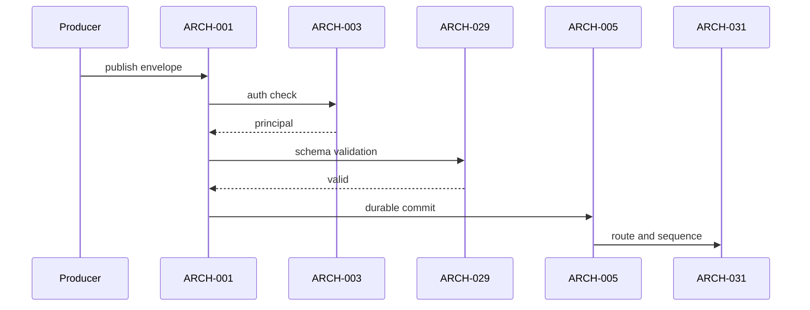
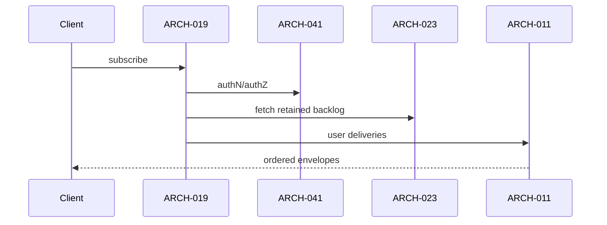
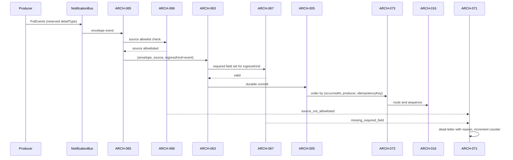

# Architecture Design: Notification Service

**Feature Branch**: `014-notification-service`
**Created**: 2026-05-10
**Status**: Draft
**Source**: `specs/014-notification-service/v-model/system-design.md`

## Overview

Architecture decomposition splits each `SYS-NNN` into ingress/control and runtime/data-path modules. This keeps contracts narrow and enables one-to-many integration test mapping without inventing extra scope.

**Amended 2026-08-10.** ARCH-063…ARCH-082 decompose SYS-032…SYS-041. The architectural change is that producer ingress is now **two adapters over one core**: ARCH-001 (the HTTP contract boundary) and ARCH-065 (the event contract boundary) both delegate to ARCH-063/ARCH-064, and neither reimplements a step of it. The adapters differ in exactly two respects — where producer identity comes from (ARCH-079/080 verifies a token on HTTP; ARCH-069/070 validates the event `source` on the bus) and where a rejection goes (a structured response on HTTP; the ARCH-071/072 dead-letter path on the bus, because there is no caller). Every other rule is single-sourced in the core, and a rule enforced in only one adapter is a defect (REQ-032).

## ID Schema

- **Architecture Module**: `ARCH-NNN` — sequential identifier, never renumbered.
- **Parent System Components**: comma-separated `SYS-NNN` list (many-to-many).
- **Cross-Cutting Tag**: `[CROSS-CUTTING]` reserved for horizontal concerns; not required for this baseline because all modules trace to SYS scope.

## Design Constraints (from FROZEN-PENDING-RESOLUTION markers)

| Constraint ID | Summary                                               |
| ------------- | ----------------------------------------------------- |
| None          | No frozen markers declared in upstream 014 artifacts. |

## Logical View — Component Breakdown (IEEE 42010 / Kruchten 4+1)

| ARCH ID  | Name                             | Description                                                                                                                                                                                    | Parent System Components | Type      |
| -------- | -------------------------------- | ---------------------------------------------------------------------------------------------------------------------------------------------------------------------------------------------- | ------------------------ | --------- |
| ARCH-001 | SYS-001 Contract/Policy Module   | Interface boundary and policy contract for SYS-001.                                                                                                                                            | SYS-001                  | Service   |
| ARCH-002 | SYS-001 Runtime/Execution Module | Runtime processing path and state transitions for SYS-001.                                                                                                                                     | SYS-001                  | Component |
| ARCH-003 | SYS-002 Contract/Policy Module   | Interface boundary and policy contract for SYS-002.                                                                                                                                            | SYS-002                  | Service   |
| ARCH-004 | SYS-002 Runtime/Execution Module | Runtime processing path and state transitions for SYS-002.                                                                                                                                     | SYS-002                  | Component |
| ARCH-005 | SYS-003 Contract/Policy Module   | Interface boundary and policy contract for SYS-003.                                                                                                                                            | SYS-003                  | Service   |
| ARCH-006 | SYS-003 Runtime/Execution Module | Runtime processing path and state transitions for SYS-003.                                                                                                                                     | SYS-003                  | Component |
| ARCH-007 | SYS-004 Contract/Policy Module   | Interface boundary and policy contract for SYS-004.                                                                                                                                            | SYS-004                  | Service   |
| ARCH-008 | SYS-004 Runtime/Execution Module | Runtime processing path and state transitions for SYS-004.                                                                                                                                     | SYS-004                  | Component |
| ARCH-009 | SYS-005 Contract/Policy Module   | Interface boundary and policy contract for SYS-005.                                                                                                                                            | SYS-005                  | Service   |
| ARCH-010 | SYS-005 Runtime/Execution Module | Runtime processing path and state transitions for SYS-005.                                                                                                                                     | SYS-005                  | Component |
| ARCH-011 | SYS-006 Contract/Policy Module   | Interface boundary and policy contract for SYS-006.                                                                                                                                            | SYS-006                  | Service   |
| ARCH-012 | SYS-006 Runtime/Execution Module | Runtime processing path and state transitions for SYS-006.                                                                                                                                     | SYS-006                  | Component |
| ARCH-013 | SYS-007 Contract/Policy Module   | Interface boundary and policy contract for SYS-007.                                                                                                                                            | SYS-007                  | Service   |
| ARCH-014 | SYS-007 Runtime/Execution Module | Runtime processing path and state transitions for SYS-007.                                                                                                                                     | SYS-007                  | Component |
| ARCH-015 | SYS-008 Contract/Policy Module   | Interface boundary and policy contract for SYS-008.                                                                                                                                            | SYS-008                  | Service   |
| ARCH-016 | SYS-008 Runtime/Execution Module | Runtime processing path and state transitions for SYS-008.                                                                                                                                     | SYS-008                  | Component |
| ARCH-017 | SYS-009 Contract/Policy Module   | Interface boundary and policy contract for SYS-009.                                                                                                                                            | SYS-009                  | Service   |
| ARCH-018 | SYS-009 Runtime/Execution Module | Runtime processing path and state transitions for SYS-009.                                                                                                                                     | SYS-009                  | Component |
| ARCH-019 | SYS-010 Contract/Policy Module   | Interface boundary and policy contract for SYS-010.                                                                                                                                            | SYS-010                  | Service   |
| ARCH-020 | SYS-010 Runtime/Execution Module | Runtime processing path and state transitions for SYS-010.                                                                                                                                     | SYS-010                  | Component |
| ARCH-021 | SYS-011 Contract/Policy Module   | Interface boundary and policy contract for SYS-011.                                                                                                                                            | SYS-011                  | Service   |
| ARCH-022 | SYS-011 Runtime/Execution Module | Runtime processing path and state transitions for SYS-011.                                                                                                                                     | SYS-011                  | Component |
| ARCH-023 | SYS-012 Contract/Policy Module   | Interface boundary and policy contract for SYS-012.                                                                                                                                            | SYS-012                  | Service   |
| ARCH-024 | SYS-012 Runtime/Execution Module | Runtime processing path and state transitions for SYS-012.                                                                                                                                     | SYS-012                  | Component |
| ARCH-025 | SYS-013 Contract/Policy Module   | Interface boundary and policy contract for SYS-013.                                                                                                                                            | SYS-013                  | Service   |
| ARCH-026 | SYS-013 Runtime/Execution Module | Runtime processing path and state transitions for SYS-013.                                                                                                                                     | SYS-013                  | Component |
| ARCH-027 | SYS-014 Contract/Policy Module   | Interface boundary and policy contract for SYS-014.                                                                                                                                            | SYS-014                  | Service   |
| ARCH-028 | SYS-014 Runtime/Execution Module | Runtime processing path and state transitions for SYS-014.                                                                                                                                     | SYS-014                  | Component |
| ARCH-029 | SYS-015 Contract/Policy Module   | Interface boundary and policy contract for SYS-015.                                                                                                                                            | SYS-015                  | Service   |
| ARCH-030 | SYS-015 Runtime/Execution Module | Runtime processing path and state transitions for SYS-015.                                                                                                                                     | SYS-015                  | Component |
| ARCH-031 | SYS-016 Contract/Policy Module   | Interface boundary and policy contract for SYS-016.                                                                                                                                            | SYS-016                  | Service   |
| ARCH-032 | SYS-016 Runtime/Execution Module | Runtime processing path and state transitions for SYS-016.                                                                                                                                     | SYS-016                  | Component |
| ARCH-033 | SYS-017 Contract/Policy Module   | Interface boundary and policy contract for SYS-017.                                                                                                                                            | SYS-017                  | Service   |
| ARCH-034 | SYS-017 Runtime/Execution Module | Runtime processing path and state transitions for SYS-017.                                                                                                                                     | SYS-017                  | Component |
| ARCH-035 | SYS-018 Contract/Policy Module   | Interface boundary and policy contract for SYS-018.                                                                                                                                            | SYS-018                  | Service   |
| ARCH-036 | SYS-018 Runtime/Execution Module | Runtime processing path and state transitions for SYS-018.                                                                                                                                     | SYS-018                  | Component |
| ARCH-037 | SYS-019 Contract/Policy Module   | Interface boundary and policy contract for SYS-019.                                                                                                                                            | SYS-019                  | Service   |
| ARCH-038 | SYS-019 Runtime/Execution Module | Runtime processing path and state transitions for SYS-019.                                                                                                                                     | SYS-019                  | Component |
| ARCH-039 | SYS-020 Contract/Policy Module   | Interface boundary and policy contract for SYS-020.                                                                                                                                            | SYS-020                  | Service   |
| ARCH-040 | SYS-020 Runtime/Execution Module | Runtime processing path and state transitions for SYS-020.                                                                                                                                     | SYS-020                  | Component |
| ARCH-041 | SYS-021 Contract/Policy Module   | Interface boundary and policy contract for SYS-021.                                                                                                                                            | SYS-021                  | Service   |
| ARCH-042 | SYS-021 Runtime/Execution Module | Runtime processing path and state transitions for SYS-021.                                                                                                                                     | SYS-021                  | Component |
| ARCH-043 | SYS-022 Contract/Policy Module   | Interface boundary and policy contract for SYS-022.                                                                                                                                            | SYS-022                  | Service   |
| ARCH-044 | SYS-022 Runtime/Execution Module | Runtime processing path and state transitions for SYS-022.                                                                                                                                     | SYS-022                  | Component |
| ARCH-045 | SYS-023 Contract/Policy Module   | Interface boundary and policy contract for SYS-023.                                                                                                                                            | SYS-023                  | Service   |
| ARCH-046 | SYS-023 Runtime/Execution Module | Runtime processing path and state transitions for SYS-023.                                                                                                                                     | SYS-023                  | Component |
| ARCH-047 | SYS-024 Contract/Policy Module   | Interface boundary and policy contract for SYS-024.                                                                                                                                            | SYS-024                  | Service   |
| ARCH-048 | SYS-024 Runtime/Execution Module | Runtime processing path and state transitions for SYS-024.                                                                                                                                     | SYS-024                  | Component |
| ARCH-049 | SYS-025 Contract/Policy Module   | Interface boundary and policy contract for SYS-025.                                                                                                                                            | SYS-025                  | Service   |
| ARCH-050 | SYS-025 Runtime/Execution Module | Runtime processing path and state transitions for SYS-025.                                                                                                                                     | SYS-025                  | Component |
| ARCH-051 | SYS-026 Contract/Policy Module   | Interface boundary and policy contract for SYS-026.                                                                                                                                            | SYS-026                  | Service   |
| ARCH-052 | SYS-026 Runtime/Execution Module | Runtime processing path and state transitions for SYS-026.                                                                                                                                     | SYS-026                  | Component |
| ARCH-053 | SYS-027 Contract/Policy Module   | Interface boundary and policy contract for SYS-027.                                                                                                                                            | SYS-027                  | Service   |
| ARCH-054 | SYS-027 Runtime/Execution Module | Runtime processing path and state transitions for SYS-027.                                                                                                                                     | SYS-027                  | Component |
| ARCH-055 | SYS-028 Contract/Policy Module   | Interface boundary and policy contract for SYS-028.                                                                                                                                            | SYS-028                  | Service   |
| ARCH-056 | SYS-028 Runtime/Execution Module | Runtime processing path and state transitions for SYS-028.                                                                                                                                     | SYS-028                  | Component |
| ARCH-057 | SYS-029 Contract/Policy Module   | Interface boundary and policy contract for SYS-029.                                                                                                                                            | SYS-029                  | Service   |
| ARCH-058 | SYS-029 Runtime/Execution Module | Runtime processing path and state transitions for SYS-029.                                                                                                                                     | SYS-029                  | Component |
| ARCH-059 | SYS-030 Contract/Policy Module   | Interface boundary and policy contract for SYS-030.                                                                                                                                            | SYS-030                  | Service   |
| ARCH-060 | SYS-030 Runtime/Execution Module | Runtime processing path and state transitions for SYS-030.                                                                                                                                     | SYS-030                  | Component |
| ARCH-061 | SYS-031 Contract/Policy Module   | Interface boundary and policy contract for SYS-031.                                                                                                                                            | SYS-031                  | Service   |
| ARCH-062 | SYS-031 Runtime/Execution Module | Runtime processing path and state transitions for SYS-031.                                                                                                                                     | SYS-031                  | Component |
| ARCH-063 | SYS-032 Contract/Policy Module   | Declares the transport-neutral `(envelope, producerIdentity, ingressKind)` entry point both adapters call, and the accepted-or-rejected result they must honour.                               | SYS-032                  | Service   |
| ARCH-064 | SYS-032 Runtime/Execution Module | Executes the one pipeline — validate, registry check, authorize, dedupe, durably accept, enqueue for routing — in that order, with no step separately reachable from an adapter.               | SYS-032                  | Component |
| ARCH-065 | SYS-033 Contract/Policy Module   | Binds this service's bus rule to its reserved `detailType` and declares that every other `detailType` on the bus is ignored rather than interpreted (REQ-033).                                 | SYS-033                  | Service   |
| ARCH-066 | SYS-033 Runtime/Execution Module | Unwraps the EventBridge `detail` into an envelope, tags it `ingressKind = event` with the event's `source`, and calls ARCH-063 without applying a rule of its own.                             | SYS-033                  | Component |
| ARCH-067 | SYS-034 Contract/Policy Module   | Declares the required field set per `ingressKind`: `schemaVersion`, `recipient`, `messageType`, `occurredAt` and `payload` always, plus `idempotencyKey` and `producer` on the event path.     | SYS-034                  | Service   |
| ARCH-068 | SYS-034 Runtime/Execution Module | Checks presence and type of every field in that set and returns `missing_required_field` naming the field, never substituting a default and never partially routing.                           | SYS-034                  | Component |
| ARCH-069 | SYS-035 Contract/Policy Module   | Declares the two controls that together bound the credential-less path: the bus resource policy over `PutEvents` principals, and the `source` allowlist held in the producer registry.         | SYS-035                  | Service   |
| ARCH-070 | SYS-035 Runtime/Execution Module | Compares the event's `source` against the allowlist for exact equality and rejects `source_not_allowlisted` before the envelope reaches the core.                                              | SYS-035                  | Component |
| ARCH-071 | SYS-036 Contract/Policy Module   | Declares the dead-letter reason-code vocabulary (`source_not_allowlisted`, `missing_required_field`, `unregistered_message_type`, `quota_exceeded`) and DLQ depth as an alarmed metric.        | SYS-036                  | Service   |
| ARCH-072 | SYS-036 Runtime/Execution Module | Writes the envelope as received plus its reason code to the ingress DLQ and increments that reason's counter, returning nothing because the event path has no caller.                          | SYS-036                  | Component |
| ARCH-073 | SYS-037 Contract/Policy Module   | Declares `(occurredAt, producer, idempotencyKey)` as the ordering key for event-path arrivals and `MessageGroupId = recipient.id` as the FIFO partition it is enqueued under.                  | SYS-037                  | Service   |
| ARCH-074 | SYS-037 Runtime/Execution Module | Sorts event-path arrivals by that key before or as they are enqueued, so the FIFO queue preserves publish order instead of EventBridge arrival order.                                          | SYS-037                  | Component |
| ARCH-075 | SYS-038 Contract/Policy Module   | States the derivation rule producers must satisfy: an `idempotencyKey` is a function of durable domain state, such as a job identity plus terminal status, never of a transport id or a clock. | SYS-038                  | Service   |
| ARCH-076 | SYS-038 Runtime/Execution Module | Generates no keys; the rule is verified by replaying one event with an unchanged `idempotencyKey` and asserting exactly one delivery (SC-011).                                                 | SYS-038                  | Component |
| ARCH-077 | SYS-039 Contract/Policy Module   | States the guarantee that no batching, correlation or collapsing stage exists between durable accept and delivery, and that correlation is the publisher's obligation (REQ-039).               | SYS-039                  | Service   |
| ARCH-078 | SYS-039 Runtime/Execution Module | Has no execution path; the absence is verified by inspecting the accept-to-delivery pipeline and asserting N publishes for one recipient yield N deliveries (SC-010).                          | SYS-039                  | Component |
| ARCH-079 | SYS-040 Contract/Policy Module   | Declares the HTTP producer credential as the platform Ed25519 service-principal token verified against a configured public key, disqualifying any per-publish network round trip.              | SYS-040                  | Service   |
| ARCH-080 | SYS-040 Runtime/Execution Module | Verifies the token's Ed25519 signature, issuer and expiry in-process against that public key and yields the producer identity the core authorizes with.                                        | SYS-040                  | Component |
| ARCH-081 | SYS-041 Contract/Policy Module   | Declares a producer's publish quota to be a field of its registry entry, declared at registration and never inferred, with every quota rejection alarmed.                                      | SYS-041                  | Service   |
| ARCH-082 | SYS-041 Runtime/Execution Module | Reads the declared quota for the authorized producer, rejects the excess with `quota_exceeded`, and emits the alarmed per-producer throttled-publish counter.                                  | SYS-041                  | Component |

## Process View — Dynamic Behavior (Kruchten 4+1)

### Producer Publish Path

### Subscriber Delivery + Catch-up

### Producer Publish Path — EventBridge Ingress (FR-024)

The only difference from the HTTP diagram is where identity comes from — the validated event `source` (ARCH-069) instead of a verified token (ARCH-003/ARCH-079) — and where a rejection goes: to ARCH-071's dead-letter with a reason code instead of back to the producer as a structured error. Every rule between those two ends is the same code, reached through ARCH-063.

> **Two participant corrections this diagram does not inherit.** The Producer Publish Path diagram above names
> **ARCH-031** as its "route and sequence" participant; ARCH-031 is SYS-016, the `messageType` registry.
> Routing and sequencing is SYS-008 → ARCH-015/ARCH-016, which is what this diagram names. It also shows
> ARCH-001 performing auth, validation, commit and routing itself, with no core interposed — the reading
> REQ-032 declares a defect. Both are pre-existing generator artefacts, recorded in
> `peer-review-architecture-design.md` and owed a rewrite; they are not reproduced here.

## Interface View — API Contracts (Kruchten 4+1)

### ARCH-001: SYS-001 Contract/Policy Module

- **Parent SYS**: SYS-001
- **Inbound Contract**: Inputs required by ARCH-001 boundary.
- **Outbound Contract**: Outputs/state effects emitted by ARCH-001 boundary.
- **Failure Contract**: Structured error path and no silent failure for ARCH-001.

### ARCH-002: SYS-001 Runtime/Execution Module

- **Parent SYS**: SYS-001
- **Inbound Contract**: Inputs required by ARCH-002 boundary.
- **Outbound Contract**: Outputs/state effects emitted by ARCH-002 boundary.
- **Failure Contract**: Structured error path and no silent failure for ARCH-002.

### ARCH-003: SYS-002 Contract/Policy Module

- **Parent SYS**: SYS-002
- **Inbound Contract**: Inputs required by ARCH-003 boundary.
- **Outbound Contract**: Outputs/state effects emitted by ARCH-003 boundary.
- **Failure Contract**: Structured error path and no silent failure for ARCH-003.

### ARCH-004: SYS-002 Runtime/Execution Module

- **Parent SYS**: SYS-002
- **Inbound Contract**: Inputs required by ARCH-004 boundary.
- **Outbound Contract**: Outputs/state effects emitted by ARCH-004 boundary.
- **Failure Contract**: Structured error path and no silent failure for ARCH-004.

### ARCH-005: SYS-003 Contract/Policy Module

- **Parent SYS**: SYS-003
- **Inbound Contract**: Inputs required by ARCH-005 boundary.
- **Outbound Contract**: Outputs/state effects emitted by ARCH-005 boundary.
- **Failure Contract**: Structured error path and no silent failure for ARCH-005.

### ARCH-006: SYS-003 Runtime/Execution Module

- **Parent SYS**: SYS-003
- **Inbound Contract**: Inputs required by ARCH-006 boundary.
- **Outbound Contract**: Outputs/state effects emitted by ARCH-006 boundary.
- **Failure Contract**: Structured error path and no silent failure for ARCH-006.

### ARCH-007: SYS-004 Contract/Policy Module

- **Parent SYS**: SYS-004
- **Inbound Contract**: Inputs required by ARCH-007 boundary.
- **Outbound Contract**: Outputs/state effects emitted by ARCH-007 boundary.
- **Failure Contract**: Structured error path and no silent failure for ARCH-007.

### ARCH-008: SYS-004 Runtime/Execution Module

- **Parent SYS**: SYS-004
- **Inbound Contract**: Inputs required by ARCH-008 boundary.
- **Outbound Contract**: Outputs/state effects emitted by ARCH-008 boundary.
- **Failure Contract**: Structured error path and no silent failure for ARCH-008.

### ARCH-009: SYS-005 Contract/Policy Module

- **Parent SYS**: SYS-005
- **Inbound Contract**: Inputs required by ARCH-009 boundary.
- **Outbound Contract**: Outputs/state effects emitted by ARCH-009 boundary.
- **Failure Contract**: Structured error path and no silent failure for ARCH-009.

### ARCH-010: SYS-005 Runtime/Execution Module

- **Parent SYS**: SYS-005
- **Inbound Contract**: Inputs required by ARCH-010 boundary.
- **Outbound Contract**: Outputs/state effects emitted by ARCH-010 boundary.
- **Failure Contract**: Structured error path and no silent failure for ARCH-010.

### ARCH-011: SYS-006 Contract/Policy Module

- **Parent SYS**: SYS-006
- **Inbound Contract**: Inputs required by ARCH-011 boundary.
- **Outbound Contract**: Outputs/state effects emitted by ARCH-011 boundary.
- **Failure Contract**: Structured error path and no silent failure for ARCH-011.

### ARCH-012: SYS-006 Runtime/Execution Module

- **Parent SYS**: SYS-006
- **Inbound Contract**: Inputs required by ARCH-012 boundary.
- **Outbound Contract**: Outputs/state effects emitted by ARCH-012 boundary.
- **Failure Contract**: Structured error path and no silent failure for ARCH-012.

### ARCH-013: SYS-007 Contract/Policy Module

- **Parent SYS**: SYS-007
- **Inbound Contract**: Inputs required by ARCH-013 boundary.
- **Outbound Contract**: Outputs/state effects emitted by ARCH-013 boundary.
- **Failure Contract**: Structured error path and no silent failure for ARCH-013.

### ARCH-014: SYS-007 Runtime/Execution Module

- **Parent SYS**: SYS-007
- **Inbound Contract**: Inputs required by ARCH-014 boundary.
- **Outbound Contract**: Outputs/state effects emitted by ARCH-014 boundary.
- **Failure Contract**: Structured error path and no silent failure for ARCH-014.

### ARCH-015: SYS-008 Contract/Policy Module

- **Parent SYS**: SYS-008
- **Inbound Contract**: Inputs required by ARCH-015 boundary.
- **Outbound Contract**: Outputs/state effects emitted by ARCH-015 boundary.
- **Failure Contract**: Structured error path and no silent failure for ARCH-015.

### ARCH-016: SYS-008 Runtime/Execution Module

- **Parent SYS**: SYS-008
- **Inbound Contract**: Inputs required by ARCH-016 boundary.
- **Outbound Contract**: Outputs/state effects emitted by ARCH-016 boundary.
- **Failure Contract**: Structured error path and no silent failure for ARCH-016.

### ARCH-017: SYS-009 Contract/Policy Module

- **Parent SYS**: SYS-009
- **Inbound Contract**: Inputs required by ARCH-017 boundary.
- **Outbound Contract**: Outputs/state effects emitted by ARCH-017 boundary.
- **Failure Contract**: Structured error path and no silent failure for ARCH-017.

### ARCH-018: SYS-009 Runtime/Execution Module

- **Parent SYS**: SYS-009
- **Inbound Contract**: Inputs required by ARCH-018 boundary.
- **Outbound Contract**: Outputs/state effects emitted by ARCH-018 boundary.
- **Failure Contract**: Structured error path and no silent failure for ARCH-018.

### ARCH-019: SYS-010 Contract/Policy Module

- **Parent SYS**: SYS-010
- **Inbound Contract**: Inputs required by ARCH-019 boundary.
- **Outbound Contract**: Outputs/state effects emitted by ARCH-019 boundary.
- **Failure Contract**: Structured error path and no silent failure for ARCH-019.

### ARCH-020: SYS-010 Runtime/Execution Module

- **Parent SYS**: SYS-010
- **Inbound Contract**: Inputs required by ARCH-020 boundary.
- **Outbound Contract**: Outputs/state effects emitted by ARCH-020 boundary.
- **Failure Contract**: Structured error path and no silent failure for ARCH-020.

### ARCH-021: SYS-011 Contract/Policy Module

- **Parent SYS**: SYS-011
- **Inbound Contract**: Inputs required by ARCH-021 boundary.
- **Outbound Contract**: Outputs/state effects emitted by ARCH-021 boundary.
- **Failure Contract**: Structured error path and no silent failure for ARCH-021.

### ARCH-022: SYS-011 Runtime/Execution Module

- **Parent SYS**: SYS-011
- **Inbound Contract**: Inputs required by ARCH-022 boundary.
- **Outbound Contract**: Outputs/state effects emitted by ARCH-022 boundary.
- **Failure Contract**: Structured error path and no silent failure for ARCH-022.

### ARCH-023: SYS-012 Contract/Policy Module

- **Parent SYS**: SYS-012
- **Inbound Contract**: Inputs required by ARCH-023 boundary.
- **Outbound Contract**: Outputs/state effects emitted by ARCH-023 boundary.
- **Failure Contract**: Structured error path and no silent failure for ARCH-023.

### ARCH-024: SYS-012 Runtime/Execution Module

- **Parent SYS**: SYS-012
- **Inbound Contract**: Inputs required by ARCH-024 boundary.
- **Outbound Contract**: Outputs/state effects emitted by ARCH-024 boundary.
- **Failure Contract**: Structured error path and no silent failure for ARCH-024.

### ARCH-025: SYS-013 Contract/Policy Module

- **Parent SYS**: SYS-013
- **Inbound Contract**: Inputs required by ARCH-025 boundary.
- **Outbound Contract**: Outputs/state effects emitted by ARCH-025 boundary.
- **Failure Contract**: Structured error path and no silent failure for ARCH-025.

### ARCH-026: SYS-013 Runtime/Execution Module

- **Parent SYS**: SYS-013
- **Inbound Contract**: Inputs required by ARCH-026 boundary.
- **Outbound Contract**: Outputs/state effects emitted by ARCH-026 boundary.
- **Failure Contract**: Structured error path and no silent failure for ARCH-026.

### ARCH-027: SYS-014 Contract/Policy Module

- **Parent SYS**: SYS-014
- **Inbound Contract**: Inputs required by ARCH-027 boundary.
- **Outbound Contract**: Outputs/state effects emitted by ARCH-027 boundary.
- **Failure Contract**: Structured error path and no silent failure for ARCH-027.

### ARCH-028: SYS-014 Runtime/Execution Module

- **Parent SYS**: SYS-014
- **Inbound Contract**: Inputs required by ARCH-028 boundary.
- **Outbound Contract**: Outputs/state effects emitted by ARCH-028 boundary.
- **Failure Contract**: Structured error path and no silent failure for ARCH-028.

### ARCH-029: SYS-015 Contract/Policy Module

- **Parent SYS**: SYS-015
- **Inbound Contract**: Inputs required by ARCH-029 boundary.
- **Outbound Contract**: Outputs/state effects emitted by ARCH-029 boundary.
- **Failure Contract**: Structured error path and no silent failure for ARCH-029.

### ARCH-030: SYS-015 Runtime/Execution Module

- **Parent SYS**: SYS-015
- **Inbound Contract**: Inputs required by ARCH-030 boundary.
- **Outbound Contract**: Outputs/state effects emitted by ARCH-030 boundary.
- **Failure Contract**: Structured error path and no silent failure for ARCH-030.

### ARCH-031: SYS-016 Contract/Policy Module

- **Parent SYS**: SYS-016
- **Inbound Contract**: Inputs required by ARCH-031 boundary.
- **Outbound Contract**: Outputs/state effects emitted by ARCH-031 boundary.
- **Failure Contract**: Structured error path and no silent failure for ARCH-031.

### ARCH-032: SYS-016 Runtime/Execution Module

- **Parent SYS**: SYS-016
- **Inbound Contract**: Inputs required by ARCH-032 boundary.
- **Outbound Contract**: Outputs/state effects emitted by ARCH-032 boundary.
- **Failure Contract**: Structured error path and no silent failure for ARCH-032.

### ARCH-033: SYS-017 Contract/Policy Module

- **Parent SYS**: SYS-017
- **Inbound Contract**: Inputs required by ARCH-033 boundary.
- **Outbound Contract**: Outputs/state effects emitted by ARCH-033 boundary.
- **Failure Contract**: Structured error path and no silent failure for ARCH-033.

### ARCH-034: SYS-017 Runtime/Execution Module

- **Parent SYS**: SYS-017
- **Inbound Contract**: Inputs required by ARCH-034 boundary.
- **Outbound Contract**: Outputs/state effects emitted by ARCH-034 boundary.
- **Failure Contract**: Structured error path and no silent failure for ARCH-034.

### ARCH-035: SYS-018 Contract/Policy Module

- **Parent SYS**: SYS-018
- **Inbound Contract**: Inputs required by ARCH-035 boundary.
- **Outbound Contract**: Outputs/state effects emitted by ARCH-035 boundary.
- **Failure Contract**: Structured error path and no silent failure for ARCH-035.

### ARCH-036: SYS-018 Runtime/Execution Module

- **Parent SYS**: SYS-018
- **Inbound Contract**: Inputs required by ARCH-036 boundary.
- **Outbound Contract**: Outputs/state effects emitted by ARCH-036 boundary.
- **Failure Contract**: Structured error path and no silent failure for ARCH-036.

### ARCH-037: SYS-019 Contract/Policy Module

- **Parent SYS**: SYS-019
- **Inbound Contract**: Inputs required by ARCH-037 boundary.
- **Outbound Contract**: Outputs/state effects emitted by ARCH-037 boundary.
- **Failure Contract**: Structured error path and no silent failure for ARCH-037.

### ARCH-038: SYS-019 Runtime/Execution Module

- **Parent SYS**: SYS-019
- **Inbound Contract**: Inputs required by ARCH-038 boundary.
- **Outbound Contract**: Outputs/state effects emitted by ARCH-038 boundary.
- **Failure Contract**: Structured error path and no silent failure for ARCH-038.

### ARCH-039: SYS-020 Contract/Policy Module

- **Parent SYS**: SYS-020
- **Inbound Contract**: Inputs required by ARCH-039 boundary.
- **Outbound Contract**: Outputs/state effects emitted by ARCH-039 boundary.
- **Failure Contract**: Structured error path and no silent failure for ARCH-039.

### ARCH-040: SYS-020 Runtime/Execution Module

- **Parent SYS**: SYS-020
- **Inbound Contract**: Inputs required by ARCH-040 boundary.
- **Outbound Contract**: Outputs/state effects emitted by ARCH-040 boundary.
- **Failure Contract**: Structured error path and no silent failure for ARCH-040.

### ARCH-041: SYS-021 Contract/Policy Module

- **Parent SYS**: SYS-021
- **Inbound Contract**: Inputs required by ARCH-041 boundary.
- **Outbound Contract**: Outputs/state effects emitted by ARCH-041 boundary.
- **Failure Contract**: Structured error path and no silent failure for ARCH-041.

### ARCH-042: SYS-021 Runtime/Execution Module

- **Parent SYS**: SYS-021
- **Inbound Contract**: Inputs required by ARCH-042 boundary.
- **Outbound Contract**: Outputs/state effects emitted by ARCH-042 boundary.
- **Failure Contract**: Structured error path and no silent failure for ARCH-042.

### ARCH-043: SYS-022 Contract/Policy Module

- **Parent SYS**: SYS-022
- **Inbound Contract**: Inputs required by ARCH-043 boundary.
- **Outbound Contract**: Outputs/state effects emitted by ARCH-043 boundary.
- **Failure Contract**: Structured error path and no silent failure for ARCH-043.

### ARCH-044: SYS-022 Runtime/Execution Module

- **Parent SYS**: SYS-022
- **Inbound Contract**: Inputs required by ARCH-044 boundary.
- **Outbound Contract**: Outputs/state effects emitted by ARCH-044 boundary.
- **Failure Contract**: Structured error path and no silent failure for ARCH-044.

### ARCH-045: SYS-023 Contract/Policy Module

- **Parent SYS**: SYS-023
- **Inbound Contract**: Inputs required by ARCH-045 boundary.
- **Outbound Contract**: Outputs/state effects emitted by ARCH-045 boundary.
- **Failure Contract**: Structured error path and no silent failure for ARCH-045.

### ARCH-046: SYS-023 Runtime/Execution Module

- **Parent SYS**: SYS-023
- **Inbound Contract**: Inputs required by ARCH-046 boundary.
- **Outbound Contract**: Outputs/state effects emitted by ARCH-046 boundary.
- **Failure Contract**: Structured error path and no silent failure for ARCH-046.

### ARCH-047: SYS-024 Contract/Policy Module

- **Parent SYS**: SYS-024
- **Inbound Contract**: Inputs required by ARCH-047 boundary.
- **Outbound Contract**: Outputs/state effects emitted by ARCH-047 boundary.
- **Failure Contract**: Structured error path and no silent failure for ARCH-047.

### ARCH-048: SYS-024 Runtime/Execution Module

- **Parent SYS**: SYS-024
- **Inbound Contract**: Inputs required by ARCH-048 boundary.
- **Outbound Contract**: Outputs/state effects emitted by ARCH-048 boundary.
- **Failure Contract**: Structured error path and no silent failure for ARCH-048.

### ARCH-049: SYS-025 Contract/Policy Module

- **Parent SYS**: SYS-025
- **Inbound Contract**: Inputs required by ARCH-049 boundary.
- **Outbound Contract**: Outputs/state effects emitted by ARCH-049 boundary.
- **Failure Contract**: Structured error path and no silent failure for ARCH-049.

### ARCH-050: SYS-025 Runtime/Execution Module

- **Parent SYS**: SYS-025
- **Inbound Contract**: Inputs required by ARCH-050 boundary.
- **Outbound Contract**: Outputs/state effects emitted by ARCH-050 boundary.
- **Failure Contract**: Structured error path and no silent failure for ARCH-050.

### ARCH-051: SYS-026 Contract/Policy Module

- **Parent SYS**: SYS-026
- **Inbound Contract**: Inputs required by ARCH-051 boundary.
- **Outbound Contract**: Outputs/state effects emitted by ARCH-051 boundary.
- **Failure Contract**: Structured error path and no silent failure for ARCH-051.

### ARCH-052: SYS-026 Runtime/Execution Module

- **Parent SYS**: SYS-026
- **Inbound Contract**: Inputs required by ARCH-052 boundary.
- **Outbound Contract**: Outputs/state effects emitted by ARCH-052 boundary.
- **Failure Contract**: Structured error path and no silent failure for ARCH-052.

### ARCH-053: SYS-027 Contract/Policy Module

- **Parent SYS**: SYS-027
- **Inbound Contract**: Inputs required by ARCH-053 boundary.
- **Outbound Contract**: Outputs/state effects emitted by ARCH-053 boundary.
- **Failure Contract**: Structured error path and no silent failure for ARCH-053.

### ARCH-054: SYS-027 Runtime/Execution Module

- **Parent SYS**: SYS-027
- **Inbound Contract**: Inputs required by ARCH-054 boundary.
- **Outbound Contract**: Outputs/state effects emitted by ARCH-054 boundary.
- **Failure Contract**: Structured error path and no silent failure for ARCH-054.

### ARCH-055: SYS-028 Contract/Policy Module

- **Parent SYS**: SYS-028
- **Inbound Contract**: Inputs required by ARCH-055 boundary.
- **Outbound Contract**: Outputs/state effects emitted by ARCH-055 boundary.
- **Failure Contract**: Structured error path and no silent failure for ARCH-055.

### ARCH-056: SYS-028 Runtime/Execution Module

- **Parent SYS**: SYS-028
- **Inbound Contract**: Inputs required by ARCH-056 boundary.
- **Outbound Contract**: Outputs/state effects emitted by ARCH-056 boundary.
- **Failure Contract**: Structured error path and no silent failure for ARCH-056.

### ARCH-057: SYS-029 Contract/Policy Module

- **Parent SYS**: SYS-029
- **Inbound Contract**: Inputs required by ARCH-057 boundary.
- **Outbound Contract**: Outputs/state effects emitted by ARCH-057 boundary.
- **Failure Contract**: Structured error path and no silent failure for ARCH-057.

### ARCH-058: SYS-029 Runtime/Execution Module

- **Parent SYS**: SYS-029
- **Inbound Contract**: Inputs required by ARCH-058 boundary.
- **Outbound Contract**: Outputs/state effects emitted by ARCH-058 boundary.
- **Failure Contract**: Structured error path and no silent failure for ARCH-058.

### ARCH-059: SYS-030 Contract/Policy Module

- **Parent SYS**: SYS-030
- **Inbound Contract**: Inputs required by ARCH-059 boundary.
- **Outbound Contract**: Outputs/state effects emitted by ARCH-059 boundary.
- **Failure Contract**: Structured error path and no silent failure for ARCH-059.

### ARCH-060: SYS-030 Runtime/Execution Module

- **Parent SYS**: SYS-030
- **Inbound Contract**: Inputs required by ARCH-060 boundary.
- **Outbound Contract**: Outputs/state effects emitted by ARCH-060 boundary.
- **Failure Contract**: Structured error path and no silent failure for ARCH-060.

### ARCH-061: SYS-031 Contract/Policy Module

- **Parent SYS**: SYS-031
- **Inbound Contract**: Inputs required by ARCH-061 boundary.
- **Outbound Contract**: Outputs/state effects emitted by ARCH-061 boundary.
- **Failure Contract**: Structured error path and no silent failure for ARCH-061.

### ARCH-062: SYS-031 Runtime/Execution Module

- **Parent SYS**: SYS-031
- **Inbound Contract**: Inputs required by ARCH-062 boundary.
- **Outbound Contract**: Outputs/state effects emitted by ARCH-062 boundary.
- **Failure Contract**: Structured error path and no silent failure for ARCH-062.

### ARCH-063: SYS-032 Contract/Policy Module

- **Parent SYS**: SYS-032
- **Inbound Contract**: `(envelope, producerIdentity, ingressKind)` where `ingressKind ∈ { http, event }`; the envelope is unparsed transport payload, and `producerIdentity` is already established by the adapter.
- **Outbound Contract**: `accepted { notificationId, sequenceGroup }` or `rejected { reasonCode, field? }`; `ingressKind` selects the rejection channel and the two extra required fields, never a different rule set.
- **Failure Contract**: Every rejection carries a reason code from the fixed vocabulary; the core never returns success without a durable commit, and never silently downgrades a rejection to an acceptance.

### ARCH-064: SYS-032 Runtime/Execution Module

- **Parent SYS**: SYS-032
- **Inbound Contract**: The validated call from ARCH-063, plus registry state (ARCH-031), the declared quota (ARCH-081) and the dedup store.
- **Outbound Contract**: One `notification` row committed and one FIFO enqueue under `MessageGroupId = recipient.id`, in that order, per accepted envelope.
- **Failure Contract**: A failure after commit but before enqueue is retried, never acknowledged as delivered; a failure before commit leaves no row and yields `runtime_failure`.

### ARCH-065: SYS-033 Contract/Policy Module

- **Parent SYS**: SYS-033
- **Inbound Contract**: An EventBridge rule matched on this service's reserved `detailType` only; a producer domain event on the same bus does not match.
- **Outbound Contract**: The `detail` body handed to ARCH-066 as a candidate envelope, with the event's `source` and `id` attached as transport metadata.
- **Failure Contract**: A non-reserved `detailType` is ignored, not interpreted and not dead-lettered — it was never addressed to this service (REQ-033).

### ARCH-066: SYS-033 Runtime/Execution Module

- **Parent SYS**: SYS-033
- **Inbound Contract**: The matched event: `{ source, detailType, detail, id, time }`.
- **Outbound Contract**: `ARCH-063.accept(detail, producerIdentity = source, ingressKind = event)`; nothing else, because the adapter holds no business logic.
- **Failure Contract**: An unparseable `detail` is dead-lettered as `missing_required_field`; the adapter never repairs, defaults or re-shapes an envelope to make it pass.

### ARCH-067: SYS-034 Contract/Policy Module

- **Parent SYS**: SYS-034
- **Inbound Contract**: `(envelope, ingressKind)`; the required set is `{ schemaVersion, recipient, messageType, occurredAt, payload }` for both kinds, plus `{ idempotencyKey, producer }` when `ingressKind = event`.
- **Outbound Contract**: A typed envelope in which every required field is present and well-typed, `payload` untouched and uninspected (REQ-022).
- **Failure Contract**: `missing_required_field` naming the first missing or mistyped field; no field is ever defaulted, and no envelope is partially routed.

### ARCH-068: SYS-034 Runtime/Execution Module

- **Parent SYS**: SYS-034
- **Inbound Contract**: The candidate envelope and the required set selected by `ingressKind`.
- **Outbound Contract**: Field-by-field presence and type verdicts, including `recipient.id` required for `user`/`group` and forbidden for `global` (ARCH-007), and `occurredAt` parsed as ISO-8601.
- **Failure Contract**: Validation runs before any durable write, so a rejection leaves no row; on the event path the rejection dead-letters via ARCH-071 because there is no caller to receive it (REQ-036).

### ARCH-069: SYS-035 Contract/Policy Module

- **Parent SYS**: SYS-035
- **Inbound Contract**: The event's `source`, and the producer registry entries that carry each producer's allowlisted `source`.
- **Outbound Contract**: An authorization verdict for the credential-less path; the bus resource policy is the second, independent control and rejects unauthorized `PutEvents` at the AWS API before an envelope is ever seen.
- **Failure Contract**: Neither control substitutes for the other; a missing or empty allowlist fails closed, because failing open makes this an unauthenticated publish channel able to address any user (REQ-035).

### ARCH-070: SYS-035 Runtime/Execution Module

- **Parent SYS**: SYS-035
- **Inbound Contract**: `(source, allowlist)`, compared by exact string equality — no prefix, wildcard or case-insensitive match.
- **Outbound Contract**: `producerIdentity = source` on a hit, handed onward to ARCH-063.
- **Failure Contract**: On a miss the envelope dead-letters with reason `source_not_allowlisted` and is never delivered; there is no caller, so nothing is returned (REQ-036, SC-009).

### ARCH-071: SYS-036 Contract/Policy Module

- **Parent SYS**: SYS-036
- **Inbound Contract**: `(envelopeAsReceived, reasonCode, ingressKind, receivedAt)` where `reasonCode ∈ { source_not_allowlisted, missing_required_field, invalid_input, unregistered_message_type, quota_exceeded }` — `invalid_input` is a member because MOD-068 emits it and FR-028 requires every malformed rejection to dead-letter.
- **Outbound Contract**: One DLQ record per rejection plus one increment of the counter labelled by that reason; DLQ depth is exposed as an alarmed metric (ARCH-025).
- **Failure Contract**: The rejection dead-letters with a reason code because there is no caller to receive a structured error — a rejection that is merely dropped is indistinguishable from a successful delivery (FR-028).

### ARCH-072: SYS-036 Runtime/Execution Module

- **Parent SYS**: SYS-036
- **Inbound Contract**: The rejection record from ARCH-071.
- **Outbound Contract**: A DLQ message carrying the envelope verbatim and its reason code — the only artefact a credential-less rejection leaves, since a rejected envelope never becomes a `notification` row.
- **Failure Contract**: A failure to write the DLQ record is itself alarmed and the source message is not acknowledged, so the rejection cannot be lost silently (FR-028).

### ARCH-073: SYS-037 Contract/Policy Module

- **Parent SYS**: SYS-037
- **Inbound Contract**: Event-path envelopes for one `recipient.id`, each carrying producer-assigned `occurredAt`.
- **Outbound Contract**: Enqueue order defined by `(occurredAt, producer, idempotencyKey)` under `MessageGroupId = recipient.id`; the tiebreakers make the order total and deterministic for equal timestamps.
- **Failure Contract**: If cross-path FIFO for one recipient cannot be guaranteed, REQ-008 is narrowed explicitly rather than left implying a guarantee the transport does not provide (FR-029).

### ARCH-074: SYS-037 Runtime/Execution Module

- **Parent SYS**: SYS-037
- **Inbound Contract**: A batch of event-path arrivals in EventBridge delivery order, which is unordered by construction.
- **Outbound Contract**: The same envelopes enqueued in ordering-key order, so the FIFO queue records publish order rather than arrival order and ARCH-015/016 assigns `sequence` over the correct sequence.
- **Failure Contract**: `ordering_key_missing` when `occurredAt` is absent or unparseable — the envelope is rejected rather than enqueued at an arbitrary position, because a wrong position is silent and permanent.

### ARCH-075: SYS-038 Contract/Policy Module

- **Parent SYS**: SYS-038
- **Inbound Contract**: None at runtime — this is the derivation rule published to producers alongside the envelope type: an `idempotencyKey` is a function of durable domain state, such as a job identity plus terminal status.
- **Outbound Contract**: A key that is stable across producer retries, which is what makes the ARCH-035/036 dedup record able to match a redelivery at all.
- **Failure Contract**: A key derived from a transport identifier or a clock changes on retry and deduplicates nothing; the failure surfaces as `duplicate_idempotency_key` never matching, and as a duplicated user-visible notification.

### ARCH-076: SYS-038 Runtime/Execution Module

- **Parent SYS**: SYS-038
- **Inbound Contract**: The same event replayed with an unchanged `idempotencyKey`.
- **Outbound Contract**: Exactly one delivery for that recipient, asserted by test — this module generates no keys and has no runtime path of its own.
- **Failure Contract**: Verification is by replay assertion (SC-011); a second delivery is the failure signal, and there is no runtime error code to raise.

### ARCH-077: SYS-039 Contract/Policy Module

- **Parent SYS**: SYS-039
- **Inbound Contract**: None — this is the stated absence of a batching, correlation or collapsing stage between durable accept (ARCH-005) and delivery (ARCH-009/011/013).
- **Outbound Contract**: One delivery per accepted envelope per recipient; a publisher whose work fans out correlates its own fan-out and publishes one envelope per user-meaningful outcome (REQ-039).
- **Failure Contract**: Aggregating here would require inspecting `payload`, forbidden by REQ-022; one envelope per underlying completion is a publisher defect, not a gap in this service.

### ARCH-078: SYS-039 Runtime/Execution Module

- **Parent SYS**: SYS-039
- **Inbound Contract**: N envelopes published for one recipient.
- **Outbound Contract**: N deliveries observed by that recipient's client, in `sequence` order.
- **Failure Contract**: Verified by inspection of the accept-to-delivery path plus a delivery-count assertion (SC-010); fewer than N deliveries means a collapsing stage was introduced.

### ARCH-079: SYS-040 Contract/Policy Module

- **Parent SYS**: SYS-040
- **Inbound Contract**: An `Authorization: Bearer <token>` header on `POST /api/v1/notifications/publish`, carrying the platform Ed25519 service-principal token.
- **Outbound Contract**: `producerIdentity` resolved from the token's verified subject, handed to ARCH-063 as the HTTP path's identity.
- **Failure Contract**: `signature_invalid` on a bad signature, expired token or unknown issuer; `key_unavailable` when the configured public key is absent, which fails closed. Verification performs no outbound network call, so no third-party round trip sits on the publish path (REQ-040).

### ARCH-080: SYS-040 Runtime/Execution Module

- **Parent SYS**: SYS-040
- **Inbound Contract**: The bearer token and the configured Ed25519 public key.
- **Outbound Contract**: In-process signature, issuer and expiry verification, returning the producer subject.
- **Failure Contract**: A verification failure rejects with `signature_invalid` before any validation, dedup or durable write; the token is never trusted on partial verification.

### ARCH-081: SYS-041 Contract/Policy Module

- **Parent SYS**: SYS-041
- **Inbound Contract**: The authorized `producerIdentity` and its registry entry, whose quota field is declared by that producer at registration.
- **Outbound Contract**: The quota value in publishes per second for that producer; the value is read, never inferred from the producer's internals (REQ-041).
- **Failure Contract**: A producer with no declared quota is a registration defect and fails closed rather than defaulting to unlimited; every quota rejection is alarmed, because a silent rejection is a lost notification.

### ARCH-082: SYS-041 Runtime/Execution Module

- **Parent SYS**: SYS-041
- **Inbound Contract**: `(producerIdentity, declaredQuota, publishTimestamp)`.
- **Outbound Contract**: Allow or reject per the producer's own window, plus the per-producer throttled-publish counter.
- **Failure Contract**: `quota_exceeded` — a structured rate-limit error on the HTTP path, and a dead-letter with that reason code on the event path, where there is no caller (FR-028).

## Data Flow View — Information Lifecycle (Kruchten 4+1)

| Flow                            | Source Modules                         | Sink Modules                 | Data Contract                                                                                                                                  |
| ------------------------------- | -------------------------------------- | ---------------------------- | ---------------------------------------------------------------------------------------------------------------------------------------------- |
| Publish ingress flow            | ARCH-001, ARCH-003, ARCH-029           | ARCH-005, ARCH-031, ARCH-035 | Validated PublishEnvelope with producer principal context.                                                                                     |
| Recipient routing flow          | ARCH-031, ARCH-033, ARCH-035           | ARCH-011, ARCH-013, ARCH-015 | Recipient-scoped delivery stream with ordering key.                                                                                            |
| Subscriber catch-up flow        | ARCH-019, ARCH-041, ARCH-023           | ARCH-011, ARCH-013           | Retained undelivered envelope replay by authenticated identity.                                                                                |
| Registry and observability flow | ARCH-039, ARCH-041, ARCH-051           | ARCH-053, ARCH-057, ARCH-061 | Registry state, counters, SLO metrics, and readiness evidence.                                                                                 |
| Event ingress flow              | ARCH-065, ARCH-066, ARCH-069, ARCH-070 | ARCH-063, ARCH-067, ARCH-005 | Envelope off the reserved `detailType`, identity = validated `source`, through the same core as HTTP.                                          |
| Event-path rejection flow       | ARCH-067, ARCH-069, ARCH-071           | ARCH-072, ARCH-025           | `(envelopeAsReceived, reasonCode, ingressKind, receivedAt)` to the DLQ plus a per-reason counter; no response, because there is no caller.     |
| Cross-path ordering flow        | ARCH-073, ARCH-074                     | ARCH-015, ARCH-016           | Envelopes sorted by `(occurredAt, producer, idempotencyKey)` and enqueued under `MessageGroupId = recipient.id` before `sequence` is assigned. |

## Coverage Summary

| Metric                     | Value        |
| -------------------------- | ------------ |
| Total System Components    | 41           |
| Total Architecture Modules | 82           |
| SYS → ARCH Coverage        | 41/41 (100%) |
