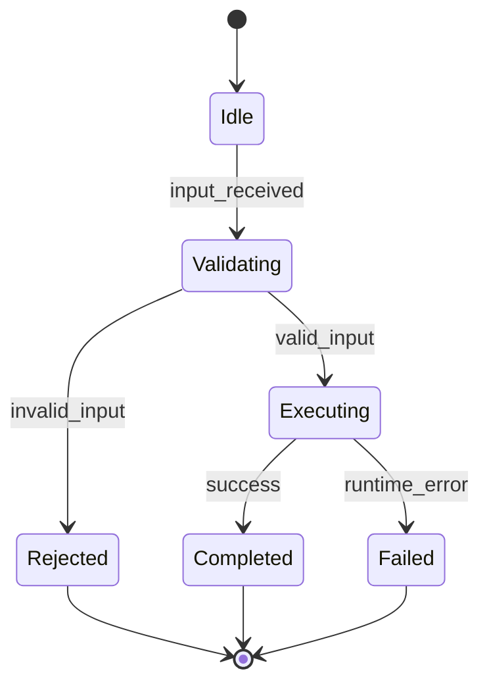

# Module Design: Notification Service

**Feature Branch**: `014-notification-service`
**Created**: 2026-05-10
**Status**: Draft
**Source**: `specs/014-notification-service/v-model/architecture-design.md`

## Overview

Low-level module designs map 1:1 with architecture modules to preserve deterministic lineage (`ARCH-NNN` → `MOD-NNN`). All modules include the four mandatory views.

**Amended 2026-08-10.** MOD-063…MOD-082 carry ARCH-063…ARCH-082, the dual-ingress decomposition. MOD-063/064 are the ingress core; MOD-065/066 are the EventBridge adapter that calls it, so the HTTP controller and the bus consumer share one validate → registry → authorize → dedupe → durably accept → enqueue path. MOD-075…MOD-078 are deliberately not runtime code: SYS-038 is a key-derivation rule published to producers and SYS-039 is the stated absence of an aggregation stage, so both are verified by inspection plus an assertion rather than by executing a path. Their `Target Source File(s)` name the planned implementation paths from `tasks.md` T-034…T-041 rather than the placeholder `implementation/mod-0NN.md` used by MOD-001…MOD-062.

## ID Schema

- **Module Design**: `MOD-NNN` — sequential 3-digit ID, never renumbered.
- **Parent Architecture Modules**: authoritative traceability field.
- **Target Source File(s)**: planned implementation paths (specification only; no source edits in this task).

## Module Inventory

| MOD ID  | Name                                           | Parent Architecture Modules | Type      |
| ------- | ---------------------------------------------- | --------------------------- | --------- |
| MOD-001 | SYS-001 Contract/Policy Module Module Design   | ARCH-001                    | Service   |
| MOD-002 | SYS-001 Runtime/Execution Module Module Design | ARCH-002                    | Component |
| MOD-003 | SYS-002 Contract/Policy Module Module Design   | ARCH-003                    | Service   |
| MOD-004 | SYS-002 Runtime/Execution Module Module Design | ARCH-004                    | Component |
| MOD-005 | SYS-003 Contract/Policy Module Module Design   | ARCH-005                    | Service   |
| MOD-006 | SYS-003 Runtime/Execution Module Module Design | ARCH-006                    | Component |
| MOD-007 | SYS-004 Contract/Policy Module Module Design   | ARCH-007                    | Service   |
| MOD-008 | SYS-004 Runtime/Execution Module Module Design | ARCH-008                    | Component |
| MOD-009 | SYS-005 Contract/Policy Module Module Design   | ARCH-009                    | Service   |
| MOD-010 | SYS-005 Runtime/Execution Module Module Design | ARCH-010                    | Component |
| MOD-011 | SYS-006 Contract/Policy Module Module Design   | ARCH-011                    | Service   |
| MOD-012 | SYS-006 Runtime/Execution Module Module Design | ARCH-012                    | Component |
| MOD-013 | SYS-007 Contract/Policy Module Module Design   | ARCH-013                    | Service   |
| MOD-014 | SYS-007 Runtime/Execution Module Module Design | ARCH-014                    | Component |
| MOD-015 | SYS-008 Contract/Policy Module Module Design   | ARCH-015                    | Service   |
| MOD-016 | SYS-008 Runtime/Execution Module Module Design | ARCH-016                    | Component |
| MOD-017 | SYS-009 Contract/Policy Module Module Design   | ARCH-017                    | Service   |
| MOD-018 | SYS-009 Runtime/Execution Module Module Design | ARCH-018                    | Component |
| MOD-019 | SYS-010 Contract/Policy Module Module Design   | ARCH-019                    | Service   |
| MOD-020 | SYS-010 Runtime/Execution Module Module Design | ARCH-020                    | Component |
| MOD-021 | SYS-011 Contract/Policy Module Module Design   | ARCH-021                    | Service   |
| MOD-022 | SYS-011 Runtime/Execution Module Module Design | ARCH-022                    | Component |
| MOD-023 | SYS-012 Contract/Policy Module Module Design   | ARCH-023                    | Service   |
| MOD-024 | SYS-012 Runtime/Execution Module Module Design | ARCH-024                    | Component |
| MOD-025 | SYS-013 Contract/Policy Module Module Design   | ARCH-025                    | Service   |
| MOD-026 | SYS-013 Runtime/Execution Module Module Design | ARCH-026                    | Component |
| MOD-027 | SYS-014 Contract/Policy Module Module Design   | ARCH-027                    | Service   |
| MOD-028 | SYS-014 Runtime/Execution Module Module Design | ARCH-028                    | Component |
| MOD-029 | SYS-015 Contract/Policy Module Module Design   | ARCH-029                    | Service   |
| MOD-030 | SYS-015 Runtime/Execution Module Module Design | ARCH-030                    | Component |
| MOD-031 | SYS-016 Contract/Policy Module Module Design   | ARCH-031                    | Service   |
| MOD-032 | SYS-016 Runtime/Execution Module Module Design | ARCH-032                    | Component |
| MOD-033 | SYS-017 Contract/Policy Module Module Design   | ARCH-033                    | Service   |
| MOD-034 | SYS-017 Runtime/Execution Module Module Design | ARCH-034                    | Component |
| MOD-035 | SYS-018 Contract/Policy Module Module Design   | ARCH-035                    | Service   |
| MOD-036 | SYS-018 Runtime/Execution Module Module Design | ARCH-036                    | Component |
| MOD-037 | SYS-019 Contract/Policy Module Module Design   | ARCH-037                    | Service   |
| MOD-038 | SYS-019 Runtime/Execution Module Module Design | ARCH-038                    | Component |
| MOD-039 | SYS-020 Contract/Policy Module Module Design   | ARCH-039                    | Service   |
| MOD-040 | SYS-020 Runtime/Execution Module Module Design | ARCH-040                    | Component |
| MOD-041 | SYS-021 Contract/Policy Module Module Design   | ARCH-041                    | Service   |
| MOD-042 | SYS-021 Runtime/Execution Module Module Design | ARCH-042                    | Component |
| MOD-043 | SYS-022 Contract/Policy Module Module Design   | ARCH-043                    | Service   |
| MOD-044 | SYS-022 Runtime/Execution Module Module Design | ARCH-044                    | Component |
| MOD-045 | SYS-023 Contract/Policy Module Module Design   | ARCH-045                    | Service   |
| MOD-046 | SYS-023 Runtime/Execution Module Module Design | ARCH-046                    | Component |
| MOD-047 | SYS-024 Contract/Policy Module Module Design   | ARCH-047                    | Service   |
| MOD-048 | SYS-024 Runtime/Execution Module Module Design | ARCH-048                    | Component |
| MOD-049 | SYS-025 Contract/Policy Module Module Design   | ARCH-049                    | Service   |
| MOD-050 | SYS-025 Runtime/Execution Module Module Design | ARCH-050                    | Component |
| MOD-051 | SYS-026 Contract/Policy Module Module Design   | ARCH-051                    | Service   |
| MOD-052 | SYS-026 Runtime/Execution Module Module Design | ARCH-052                    | Component |
| MOD-053 | SYS-027 Contract/Policy Module Module Design   | ARCH-053                    | Service   |
| MOD-054 | SYS-027 Runtime/Execution Module Module Design | ARCH-054                    | Component |
| MOD-055 | SYS-028 Contract/Policy Module Module Design   | ARCH-055                    | Service   |
| MOD-056 | SYS-028 Runtime/Execution Module Module Design | ARCH-056                    | Component |
| MOD-057 | SYS-029 Contract/Policy Module Module Design   | ARCH-057                    | Service   |
| MOD-058 | SYS-029 Runtime/Execution Module Module Design | ARCH-058                    | Component |
| MOD-059 | SYS-030 Contract/Policy Module Module Design   | ARCH-059                    | Service   |
| MOD-060 | SYS-030 Runtime/Execution Module Module Design | ARCH-060                    | Component |
| MOD-061 | SYS-031 Contract/Policy Module Module Design   | ARCH-061                    | Service   |
| MOD-062 | SYS-031 Runtime/Execution Module Module Design | ARCH-062                    | Component |
| MOD-063 | SYS-032 Contract/Policy Module Module Design   | ARCH-063                    | Service   |
| MOD-064 | SYS-032 Runtime/Execution Module Module Design | ARCH-064                    | Component |
| MOD-065 | SYS-033 Contract/Policy Module Module Design   | ARCH-065                    | Service   |
| MOD-066 | SYS-033 Runtime/Execution Module Module Design | ARCH-066                    | Component |
| MOD-067 | SYS-034 Contract/Policy Module Module Design   | ARCH-067                    | Service   |
| MOD-068 | SYS-034 Runtime/Execution Module Module Design | ARCH-068                    | Component |
| MOD-069 | SYS-035 Contract/Policy Module Module Design   | ARCH-069                    | Service   |
| MOD-070 | SYS-035 Runtime/Execution Module Module Design | ARCH-070                    | Component |
| MOD-071 | SYS-036 Contract/Policy Module Module Design   | ARCH-071                    | Service   |
| MOD-072 | SYS-036 Runtime/Execution Module Module Design | ARCH-072                    | Component |
| MOD-073 | SYS-037 Contract/Policy Module Module Design   | ARCH-073                    | Service   |
| MOD-074 | SYS-037 Runtime/Execution Module Module Design | ARCH-074                    | Component |
| MOD-075 | SYS-038 Contract/Policy Module Module Design   | ARCH-075                    | Service   |
| MOD-076 | SYS-038 Runtime/Execution Module Module Design | ARCH-076                    | Component |
| MOD-077 | SYS-039 Contract/Policy Module Module Design   | ARCH-077                    | Service   |
| MOD-078 | SYS-039 Runtime/Execution Module Module Design | ARCH-078                    | Component |
| MOD-079 | SYS-040 Contract/Policy Module Module Design   | ARCH-079                    | Service   |
| MOD-080 | SYS-040 Runtime/Execution Module Module Design | ARCH-080                    | Component |
| MOD-081 | SYS-041 Contract/Policy Module Module Design   | ARCH-081                    | Service   |
| MOD-082 | SYS-041 Runtime/Execution Module Module Design | ARCH-082                    | Component |

## Module Designs

### Module: MOD-001 (SYS-001 Contract/Policy Module Module Design)

**Parent Architecture Modules**: ARCH-001
**Target Source File(s)**: `specs/014-notification-service/implementation/mod-001.md`

#### Algorithmic / Logic View

```pseudocode
INPUT: contractInput, runtimeState
IF contractInput is invalid THEN
  RETURN structured_error
END IF
policy = evaluatePolicy(contractInput, runtimeState)
result = executeRuntimePath(policy, contractInput)
emitTelemetry(result)
RETURN result
```

#### State Machine View



#### Internal Data Structures View

| Structure       | Fields                               | Constraints                            |
| --------------- | ------------------------------------ | -------------------------------------- |
| ModuleInput     | `id`, `kind`, `timestamp`, `payload` | `id` non-empty, `timestamp` ISO-8601.  |
| ModuleResult    | `status`, `reason`, `artifacts[]`    | `status` in {success,rejected,failed}. |
| ModuleTelemetry | `metric`, `labels`, `value`          | Emitted on every terminal state.       |

#### Error Handling View

| Error Code        | Trigger                                     | Handling                                                          | Observability                    |
| ----------------- | ------------------------------------------- | ----------------------------------------------------------------- | -------------------------------- |
| `invalid_input`   | Contract validation failure                 | Return structured 4xx-style error; no durable side effect.        | Counter increment + warning log. |
| `policy_denied`   | Auth/quota/registry/policy rule denies flow | Reject with explicit reason and policy context.                   | Counter increment + audit log.   |
| `runtime_failure` | Downstream transient/persistent failure     | Return/propagate structured failure and preserve retry semantics. | Error log + failure counter.     |

### Module: MOD-002 (SYS-001 Runtime/Execution Module Module Design)

**Parent Architecture Modules**: ARCH-002
**Target Source File(s)**: `specs/014-notification-service/implementation/mod-002.md`

#### Algorithmic / Logic View

```pseudocode
INPUT: contractInput, runtimeState
IF contractInput is invalid THEN
  RETURN structured_error
END IF
policy = evaluatePolicy(contractInput, runtimeState)
result = executeRuntimePath(policy, contractInput)
emitTelemetry(result)
RETURN result
```

#### State Machine View


#### Internal Data Structures View

| Structure       | Fields                               | Constraints                            |
| --------------- | ------------------------------------ | -------------------------------------- |
| ModuleInput     | `id`, `kind`, `timestamp`, `payload` | `id` non-empty, `timestamp` ISO-8601.  |
| ModuleResult    | `status`, `reason`, `artifacts[]`    | `status` in {success,rejected,failed}. |
| ModuleTelemetry | `metric`, `labels`, `value`          | Emitted on every terminal state.       |

#### Error Handling View

| Error Code        | Trigger                                     | Handling                                                          | Observability                    |
| ----------------- | ------------------------------------------- | ----------------------------------------------------------------- | -------------------------------- |
| `invalid_input`   | Contract validation failure                 | Return structured 4xx-style error; no durable side effect.        | Counter increment + warning log. |
| `policy_denied`   | Auth/quota/registry/policy rule denies flow | Reject with explicit reason and policy context.                   | Counter increment + audit log.   |
| `runtime_failure` | Downstream transient/persistent failure     | Return/propagate structured failure and preserve retry semantics. | Error log + failure counter.     |

### Module: MOD-003 (SYS-002 Contract/Policy Module Module Design)

**Parent Architecture Modules**: ARCH-003
**Target Source File(s)**: `specs/014-notification-service/implementation/mod-003.md`

#### Algorithmic / Logic View

```pseudocode
INPUT: contractInput, runtimeState
IF contractInput is invalid THEN
  RETURN structured_error
END IF
policy = evaluatePolicy(contractInput, runtimeState)
result = executeRuntimePath(policy, contractInput)
emitTelemetry(result)
RETURN result
```

#### State Machine View


#### Internal Data Structures View

| Structure       | Fields                               | Constraints                            |
| --------------- | ------------------------------------ | -------------------------------------- |
| ModuleInput     | `id`, `kind`, `timestamp`, `payload` | `id` non-empty, `timestamp` ISO-8601.  |
| ModuleResult    | `status`, `reason`, `artifacts[]`    | `status` in {success,rejected,failed}. |
| ModuleTelemetry | `metric`, `labels`, `value`          | Emitted on every terminal state.       |

#### Error Handling View

| Error Code        | Trigger                                     | Handling                                                          | Observability                    |
| ----------------- | ------------------------------------------- | ----------------------------------------------------------------- | -------------------------------- |
| `invalid_input`   | Contract validation failure                 | Return structured 4xx-style error; no durable side effect.        | Counter increment + warning log. |
| `policy_denied`   | Auth/quota/registry/policy rule denies flow | Reject with explicit reason and policy context.                   | Counter increment + audit log.   |
| `runtime_failure` | Downstream transient/persistent failure     | Return/propagate structured failure and preserve retry semantics. | Error log + failure counter.     |

### Module: MOD-004 (SYS-002 Runtime/Execution Module Module Design)

**Parent Architecture Modules**: ARCH-004
**Target Source File(s)**: `specs/014-notification-service/implementation/mod-004.md`

#### Algorithmic / Logic View

```pseudocode
INPUT: contractInput, runtimeState
IF contractInput is invalid THEN
  RETURN structured_error
END IF
policy = evaluatePolicy(contractInput, runtimeState)
result = executeRuntimePath(policy, contractInput)
emitTelemetry(result)
RETURN result
```

#### State Machine View


#### Internal Data Structures View

| Structure       | Fields                               | Constraints                            |
| --------------- | ------------------------------------ | -------------------------------------- |
| ModuleInput     | `id`, `kind`, `timestamp`, `payload` | `id` non-empty, `timestamp` ISO-8601.  |
| ModuleResult    | `status`, `reason`, `artifacts[]`    | `status` in {success,rejected,failed}. |
| ModuleTelemetry | `metric`, `labels`, `value`          | Emitted on every terminal state.       |

#### Error Handling View

| Error Code        | Trigger                                     | Handling                                                          | Observability                    |
| ----------------- | ------------------------------------------- | ----------------------------------------------------------------- | -------------------------------- |
| `invalid_input`   | Contract validation failure                 | Return structured 4xx-style error; no durable side effect.        | Counter increment + warning log. |
| `policy_denied`   | Auth/quota/registry/policy rule denies flow | Reject with explicit reason and policy context.                   | Counter increment + audit log.   |
| `runtime_failure` | Downstream transient/persistent failure     | Return/propagate structured failure and preserve retry semantics. | Error log + failure counter.     |

### Module: MOD-005 (SYS-003 Contract/Policy Module Module Design)

**Parent Architecture Modules**: ARCH-005
**Target Source File(s)**: `specs/014-notification-service/implementation/mod-005.md`

#### Algorithmic / Logic View

```pseudocode
INPUT: contractInput, runtimeState
IF contractInput is invalid THEN
  RETURN structured_error
END IF
policy = evaluatePolicy(contractInput, runtimeState)
result = executeRuntimePath(policy, contractInput)
emitTelemetry(result)
RETURN result
```

#### State Machine View


#### Internal Data Structures View

| Structure       | Fields                               | Constraints                            |
| --------------- | ------------------------------------ | -------------------------------------- |
| ModuleInput     | `id`, `kind`, `timestamp`, `payload` | `id` non-empty, `timestamp` ISO-8601.  |
| ModuleResult    | `status`, `reason`, `artifacts[]`    | `status` in {success,rejected,failed}. |
| ModuleTelemetry | `metric`, `labels`, `value`          | Emitted on every terminal state.       |

#### Error Handling View

| Error Code        | Trigger                                     | Handling                                                          | Observability                    |
| ----------------- | ------------------------------------------- | ----------------------------------------------------------------- | -------------------------------- |
| `invalid_input`   | Contract validation failure                 | Return structured 4xx-style error; no durable side effect.        | Counter increment + warning log. |
| `policy_denied`   | Auth/quota/registry/policy rule denies flow | Reject with explicit reason and policy context.                   | Counter increment + audit log.   |
| `runtime_failure` | Downstream transient/persistent failure     | Return/propagate structured failure and preserve retry semantics. | Error log + failure counter.     |

### Module: MOD-006 (SYS-003 Runtime/Execution Module Module Design)

**Parent Architecture Modules**: ARCH-006
**Target Source File(s)**: `specs/014-notification-service/implementation/mod-006.md`

#### Algorithmic / Logic View

```pseudocode
INPUT: contractInput, runtimeState
IF contractInput is invalid THEN
  RETURN structured_error
END IF
policy = evaluatePolicy(contractInput, runtimeState)
result = executeRuntimePath(policy, contractInput)
emitTelemetry(result)
RETURN result
```

#### State Machine View


#### Internal Data Structures View

| Structure       | Fields                               | Constraints                            |
| --------------- | ------------------------------------ | -------------------------------------- |
| ModuleInput     | `id`, `kind`, `timestamp`, `payload` | `id` non-empty, `timestamp` ISO-8601.  |
| ModuleResult    | `status`, `reason`, `artifacts[]`    | `status` in {success,rejected,failed}. |
| ModuleTelemetry | `metric`, `labels`, `value`          | Emitted on every terminal state.       |

#### Error Handling View

| Error Code        | Trigger                                     | Handling                                                          | Observability                    |
| ----------------- | ------------------------------------------- | ----------------------------------------------------------------- | -------------------------------- |
| `invalid_input`   | Contract validation failure                 | Return structured 4xx-style error; no durable side effect.        | Counter increment + warning log. |
| `policy_denied`   | Auth/quota/registry/policy rule denies flow | Reject with explicit reason and policy context.                   | Counter increment + audit log.   |
| `runtime_failure` | Downstream transient/persistent failure     | Return/propagate structured failure and preserve retry semantics. | Error log + failure counter.     |

### Module: MOD-007 (SYS-004 Contract/Policy Module Module Design)

**Parent Architecture Modules**: ARCH-007
**Target Source File(s)**: `specs/014-notification-service/implementation/mod-007.md`

#### Algorithmic / Logic View

```pseudocode
INPUT: contractInput, runtimeState
IF contractInput is invalid THEN
  RETURN structured_error
END IF
policy = evaluatePolicy(contractInput, runtimeState)
result = executeRuntimePath(policy, contractInput)
emitTelemetry(result)
RETURN result
```

#### State Machine View


#### Internal Data Structures View

| Structure       | Fields                               | Constraints                            |
| --------------- | ------------------------------------ | -------------------------------------- |
| ModuleInput     | `id`, `kind`, `timestamp`, `payload` | `id` non-empty, `timestamp` ISO-8601.  |
| ModuleResult    | `status`, `reason`, `artifacts[]`    | `status` in {success,rejected,failed}. |
| ModuleTelemetry | `metric`, `labels`, `value`          | Emitted on every terminal state.       |

#### Error Handling View

| Error Code        | Trigger                                     | Handling                                                          | Observability                    |
| ----------------- | ------------------------------------------- | ----------------------------------------------------------------- | -------------------------------- |
| `invalid_input`   | Contract validation failure                 | Return structured 4xx-style error; no durable side effect.        | Counter increment + warning log. |
| `policy_denied`   | Auth/quota/registry/policy rule denies flow | Reject with explicit reason and policy context.                   | Counter increment + audit log.   |
| `runtime_failure` | Downstream transient/persistent failure     | Return/propagate structured failure and preserve retry semantics. | Error log + failure counter.     |

### Module: MOD-008 (SYS-004 Runtime/Execution Module Module Design)

**Parent Architecture Modules**: ARCH-008
**Target Source File(s)**: `specs/014-notification-service/implementation/mod-008.md`

#### Algorithmic / Logic View

```pseudocode
INPUT: contractInput, runtimeState
IF contractInput is invalid THEN
  RETURN structured_error
END IF
policy = evaluatePolicy(contractInput, runtimeState)
result = executeRuntimePath(policy, contractInput)
emitTelemetry(result)
RETURN result
```

#### State Machine View


#### Internal Data Structures View

| Structure       | Fields                               | Constraints                            |
| --------------- | ------------------------------------ | -------------------------------------- |
| ModuleInput     | `id`, `kind`, `timestamp`, `payload` | `id` non-empty, `timestamp` ISO-8601.  |
| ModuleResult    | `status`, `reason`, `artifacts[]`    | `status` in {success,rejected,failed}. |
| ModuleTelemetry | `metric`, `labels`, `value`          | Emitted on every terminal state.       |

#### Error Handling View

| Error Code        | Trigger                                     | Handling                                                          | Observability                    |
| ----------------- | ------------------------------------------- | ----------------------------------------------------------------- | -------------------------------- |
| `invalid_input`   | Contract validation failure                 | Return structured 4xx-style error; no durable side effect.        | Counter increment + warning log. |
| `policy_denied`   | Auth/quota/registry/policy rule denies flow | Reject with explicit reason and policy context.                   | Counter increment + audit log.   |
| `runtime_failure` | Downstream transient/persistent failure     | Return/propagate structured failure and preserve retry semantics. | Error log + failure counter.     |

### Module: MOD-009 (SYS-005 Contract/Policy Module Module Design)

**Parent Architecture Modules**: ARCH-009
**Target Source File(s)**: `specs/014-notification-service/implementation/mod-009.md`

#### Algorithmic / Logic View

```pseudocode
INPUT: contractInput, runtimeState
IF contractInput is invalid THEN
  RETURN structured_error
END IF
policy = evaluatePolicy(contractInput, runtimeState)
result = executeRuntimePath(policy, contractInput)
emitTelemetry(result)
RETURN result
```

#### State Machine View


#### Internal Data Structures View

| Structure       | Fields                               | Constraints                            |
| --------------- | ------------------------------------ | -------------------------------------- |
| ModuleInput     | `id`, `kind`, `timestamp`, `payload` | `id` non-empty, `timestamp` ISO-8601.  |
| ModuleResult    | `status`, `reason`, `artifacts[]`    | `status` in {success,rejected,failed}. |
| ModuleTelemetry | `metric`, `labels`, `value`          | Emitted on every terminal state.       |

#### Error Handling View

| Error Code        | Trigger                                     | Handling                                                          | Observability                    |
| ----------------- | ------------------------------------------- | ----------------------------------------------------------------- | -------------------------------- |
| `invalid_input`   | Contract validation failure                 | Return structured 4xx-style error; no durable side effect.        | Counter increment + warning log. |
| `policy_denied`   | Auth/quota/registry/policy rule denies flow | Reject with explicit reason and policy context.                   | Counter increment + audit log.   |
| `runtime_failure` | Downstream transient/persistent failure     | Return/propagate structured failure and preserve retry semantics. | Error log + failure counter.     |

### Module: MOD-010 (SYS-005 Runtime/Execution Module Module Design)

**Parent Architecture Modules**: ARCH-010
**Target Source File(s)**: `specs/014-notification-service/implementation/mod-010.md`

#### Algorithmic / Logic View

```pseudocode
INPUT: contractInput, runtimeState
IF contractInput is invalid THEN
  RETURN structured_error
END IF
policy = evaluatePolicy(contractInput, runtimeState)
result = executeRuntimePath(policy, contractInput)
emitTelemetry(result)
RETURN result
```

#### State Machine View


#### Internal Data Structures View

| Structure       | Fields                               | Constraints                            |
| --------------- | ------------------------------------ | -------------------------------------- |
| ModuleInput     | `id`, `kind`, `timestamp`, `payload` | `id` non-empty, `timestamp` ISO-8601.  |
| ModuleResult    | `status`, `reason`, `artifacts[]`    | `status` in {success,rejected,failed}. |
| ModuleTelemetry | `metric`, `labels`, `value`          | Emitted on every terminal state.       |

#### Error Handling View

| Error Code        | Trigger                                     | Handling                                                          | Observability                    |
| ----------------- | ------------------------------------------- | ----------------------------------------------------------------- | -------------------------------- |
| `invalid_input`   | Contract validation failure                 | Return structured 4xx-style error; no durable side effect.        | Counter increment + warning log. |
| `policy_denied`   | Auth/quota/registry/policy rule denies flow | Reject with explicit reason and policy context.                   | Counter increment + audit log.   |
| `runtime_failure` | Downstream transient/persistent failure     | Return/propagate structured failure and preserve retry semantics. | Error log + failure counter.     |

### Module: MOD-011 (SYS-006 Contract/Policy Module Module Design)

**Parent Architecture Modules**: ARCH-011
**Target Source File(s)**: `specs/014-notification-service/implementation/mod-011.md`

#### Algorithmic / Logic View

```pseudocode
INPUT: contractInput, runtimeState
IF contractInput is invalid THEN
  RETURN structured_error
END IF
policy = evaluatePolicy(contractInput, runtimeState)
result = executeRuntimePath(policy, contractInput)
emitTelemetry(result)
RETURN result
```

#### State Machine View


#### Internal Data Structures View

| Structure       | Fields                               | Constraints                            |
| --------------- | ------------------------------------ | -------------------------------------- |
| ModuleInput     | `id`, `kind`, `timestamp`, `payload` | `id` non-empty, `timestamp` ISO-8601.  |
| ModuleResult    | `status`, `reason`, `artifacts[]`    | `status` in {success,rejected,failed}. |
| ModuleTelemetry | `metric`, `labels`, `value`          | Emitted on every terminal state.       |

#### Error Handling View

| Error Code        | Trigger                                     | Handling                                                          | Observability                    |
| ----------------- | ------------------------------------------- | ----------------------------------------------------------------- | -------------------------------- |
| `invalid_input`   | Contract validation failure                 | Return structured 4xx-style error; no durable side effect.        | Counter increment + warning log. |
| `policy_denied`   | Auth/quota/registry/policy rule denies flow | Reject with explicit reason and policy context.                   | Counter increment + audit log.   |
| `runtime_failure` | Downstream transient/persistent failure     | Return/propagate structured failure and preserve retry semantics. | Error log + failure counter.     |

### Module: MOD-012 (SYS-006 Runtime/Execution Module Module Design)

**Parent Architecture Modules**: ARCH-012
**Target Source File(s)**: `specs/014-notification-service/implementation/mod-012.md`

#### Algorithmic / Logic View

```pseudocode
INPUT: contractInput, runtimeState
IF contractInput is invalid THEN
  RETURN structured_error
END IF
policy = evaluatePolicy(contractInput, runtimeState)
result = executeRuntimePath(policy, contractInput)
emitTelemetry(result)
RETURN result
```

#### State Machine View


#### Internal Data Structures View

| Structure       | Fields                               | Constraints                            |
| --------------- | ------------------------------------ | -------------------------------------- |
| ModuleInput     | `id`, `kind`, `timestamp`, `payload` | `id` non-empty, `timestamp` ISO-8601.  |
| ModuleResult    | `status`, `reason`, `artifacts[]`    | `status` in {success,rejected,failed}. |
| ModuleTelemetry | `metric`, `labels`, `value`          | Emitted on every terminal state.       |

#### Error Handling View

| Error Code        | Trigger                                     | Handling                                                          | Observability                    |
| ----------------- | ------------------------------------------- | ----------------------------------------------------------------- | -------------------------------- |
| `invalid_input`   | Contract validation failure                 | Return structured 4xx-style error; no durable side effect.        | Counter increment + warning log. |
| `policy_denied`   | Auth/quota/registry/policy rule denies flow | Reject with explicit reason and policy context.                   | Counter increment + audit log.   |
| `runtime_failure` | Downstream transient/persistent failure     | Return/propagate structured failure and preserve retry semantics. | Error log + failure counter.     |

### Module: MOD-013 (SYS-007 Contract/Policy Module Module Design)

**Parent Architecture Modules**: ARCH-013
**Target Source File(s)**: `specs/014-notification-service/implementation/mod-013.md`

#### Algorithmic / Logic View

```pseudocode
INPUT: contractInput, runtimeState
IF contractInput is invalid THEN
  RETURN structured_error
END IF
policy = evaluatePolicy(contractInput, runtimeState)
result = executeRuntimePath(policy, contractInput)
emitTelemetry(result)
RETURN result
```

#### State Machine View


#### Internal Data Structures View

| Structure       | Fields                               | Constraints                            |
| --------------- | ------------------------------------ | -------------------------------------- |
| ModuleInput     | `id`, `kind`, `timestamp`, `payload` | `id` non-empty, `timestamp` ISO-8601.  |
| ModuleResult    | `status`, `reason`, `artifacts[]`    | `status` in {success,rejected,failed}. |
| ModuleTelemetry | `metric`, `labels`, `value`          | Emitted on every terminal state.       |

#### Error Handling View

| Error Code        | Trigger                                     | Handling                                                          | Observability                    |
| ----------------- | ------------------------------------------- | ----------------------------------------------------------------- | -------------------------------- |
| `invalid_input`   | Contract validation failure                 | Return structured 4xx-style error; no durable side effect.        | Counter increment + warning log. |
| `policy_denied`   | Auth/quota/registry/policy rule denies flow | Reject with explicit reason and policy context.                   | Counter increment + audit log.   |
| `runtime_failure` | Downstream transient/persistent failure     | Return/propagate structured failure and preserve retry semantics. | Error log + failure counter.     |

### Module: MOD-014 (SYS-007 Runtime/Execution Module Module Design)

**Parent Architecture Modules**: ARCH-014
**Target Source File(s)**: `specs/014-notification-service/implementation/mod-014.md`

#### Algorithmic / Logic View

```pseudocode
INPUT: contractInput, runtimeState
IF contractInput is invalid THEN
  RETURN structured_error
END IF
policy = evaluatePolicy(contractInput, runtimeState)
result = executeRuntimePath(policy, contractInput)
emitTelemetry(result)
RETURN result
```

#### State Machine View


#### Internal Data Structures View

| Structure       | Fields                               | Constraints                            |
| --------------- | ------------------------------------ | -------------------------------------- |
| ModuleInput     | `id`, `kind`, `timestamp`, `payload` | `id` non-empty, `timestamp` ISO-8601.  |
| ModuleResult    | `status`, `reason`, `artifacts[]`    | `status` in {success,rejected,failed}. |
| ModuleTelemetry | `metric`, `labels`, `value`          | Emitted on every terminal state.       |

#### Error Handling View

| Error Code        | Trigger                                     | Handling                                                          | Observability                    |
| ----------------- | ------------------------------------------- | ----------------------------------------------------------------- | -------------------------------- |
| `invalid_input`   | Contract validation failure                 | Return structured 4xx-style error; no durable side effect.        | Counter increment + warning log. |
| `policy_denied`   | Auth/quota/registry/policy rule denies flow | Reject with explicit reason and policy context.                   | Counter increment + audit log.   |
| `runtime_failure` | Downstream transient/persistent failure     | Return/propagate structured failure and preserve retry semantics. | Error log + failure counter.     |

### Module: MOD-015 (SYS-008 Contract/Policy Module Module Design)

**Parent Architecture Modules**: ARCH-015
**Target Source File(s)**: `specs/014-notification-service/implementation/mod-015.md`

#### Algorithmic / Logic View

```pseudocode
INPUT: contractInput, runtimeState
IF contractInput is invalid THEN
  RETURN structured_error
END IF
policy = evaluatePolicy(contractInput, runtimeState)
result = executeRuntimePath(policy, contractInput)
emitTelemetry(result)
RETURN result
```

#### State Machine View


#### Internal Data Structures View

| Structure       | Fields                               | Constraints                            |
| --------------- | ------------------------------------ | -------------------------------------- |
| ModuleInput     | `id`, `kind`, `timestamp`, `payload` | `id` non-empty, `timestamp` ISO-8601.  |
| ModuleResult    | `status`, `reason`, `artifacts[]`    | `status` in {success,rejected,failed}. |
| ModuleTelemetry | `metric`, `labels`, `value`          | Emitted on every terminal state.       |

#### Error Handling View

| Error Code        | Trigger                                     | Handling                                                          | Observability                    |
| ----------------- | ------------------------------------------- | ----------------------------------------------------------------- | -------------------------------- |
| `invalid_input`   | Contract validation failure                 | Return structured 4xx-style error; no durable side effect.        | Counter increment + warning log. |
| `policy_denied`   | Auth/quota/registry/policy rule denies flow | Reject with explicit reason and policy context.                   | Counter increment + audit log.   |
| `runtime_failure` | Downstream transient/persistent failure     | Return/propagate structured failure and preserve retry semantics. | Error log + failure counter.     |

### Module: MOD-016 (SYS-008 Runtime/Execution Module Module Design)

**Parent Architecture Modules**: ARCH-016
**Target Source File(s)**: `specs/014-notification-service/implementation/mod-016.md`

#### Algorithmic / Logic View

```pseudocode
INPUT: contractInput, runtimeState
IF contractInput is invalid THEN
  RETURN structured_error
END IF
policy = evaluatePolicy(contractInput, runtimeState)
result = executeRuntimePath(policy, contractInput)
emitTelemetry(result)
RETURN result
```

#### State Machine View


#### Internal Data Structures View

| Structure       | Fields                               | Constraints                            |
| --------------- | ------------------------------------ | -------------------------------------- |
| ModuleInput     | `id`, `kind`, `timestamp`, `payload` | `id` non-empty, `timestamp` ISO-8601.  |
| ModuleResult    | `status`, `reason`, `artifacts[]`    | `status` in {success,rejected,failed}. |
| ModuleTelemetry | `metric`, `labels`, `value`          | Emitted on every terminal state.       |

#### Error Handling View

| Error Code        | Trigger                                     | Handling                                                          | Observability                    |
| ----------------- | ------------------------------------------- | ----------------------------------------------------------------- | -------------------------------- |
| `invalid_input`   | Contract validation failure                 | Return structured 4xx-style error; no durable side effect.        | Counter increment + warning log. |
| `policy_denied`   | Auth/quota/registry/policy rule denies flow | Reject with explicit reason and policy context.                   | Counter increment + audit log.   |
| `runtime_failure` | Downstream transient/persistent failure     | Return/propagate structured failure and preserve retry semantics. | Error log + failure counter.     |

### Module: MOD-017 (SYS-009 Contract/Policy Module Module Design)

**Parent Architecture Modules**: ARCH-017
**Target Source File(s)**: `specs/014-notification-service/implementation/mod-017.md`

#### Algorithmic / Logic View

```pseudocode
INPUT: contractInput, runtimeState
IF contractInput is invalid THEN
  RETURN structured_error
END IF
policy = evaluatePolicy(contractInput, runtimeState)
result = executeRuntimePath(policy, contractInput)
emitTelemetry(result)
RETURN result
```

#### State Machine View


#### Internal Data Structures View

| Structure       | Fields                               | Constraints                            |
| --------------- | ------------------------------------ | -------------------------------------- |
| ModuleInput     | `id`, `kind`, `timestamp`, `payload` | `id` non-empty, `timestamp` ISO-8601.  |
| ModuleResult    | `status`, `reason`, `artifacts[]`    | `status` in {success,rejected,failed}. |
| ModuleTelemetry | `metric`, `labels`, `value`          | Emitted on every terminal state.       |

#### Error Handling View

| Error Code        | Trigger                                     | Handling                                                          | Observability                    |
| ----------------- | ------------------------------------------- | ----------------------------------------------------------------- | -------------------------------- |
| `invalid_input`   | Contract validation failure                 | Return structured 4xx-style error; no durable side effect.        | Counter increment + warning log. |
| `policy_denied`   | Auth/quota/registry/policy rule denies flow | Reject with explicit reason and policy context.                   | Counter increment + audit log.   |
| `runtime_failure` | Downstream transient/persistent failure     | Return/propagate structured failure and preserve retry semantics. | Error log + failure counter.     |

### Module: MOD-018 (SYS-009 Runtime/Execution Module Module Design)

**Parent Architecture Modules**: ARCH-018
**Target Source File(s)**: `specs/014-notification-service/implementation/mod-018.md`

#### Algorithmic / Logic View

```pseudocode
INPUT: contractInput, runtimeState
IF contractInput is invalid THEN
  RETURN structured_error
END IF
policy = evaluatePolicy(contractInput, runtimeState)
result = executeRuntimePath(policy, contractInput)
emitTelemetry(result)
RETURN result
```

#### State Machine View


#### Internal Data Structures View

| Structure       | Fields                               | Constraints                            |
| --------------- | ------------------------------------ | -------------------------------------- |
| ModuleInput     | `id`, `kind`, `timestamp`, `payload` | `id` non-empty, `timestamp` ISO-8601.  |
| ModuleResult    | `status`, `reason`, `artifacts[]`    | `status` in {success,rejected,failed}. |
| ModuleTelemetry | `metric`, `labels`, `value`          | Emitted on every terminal state.       |

#### Error Handling View

| Error Code        | Trigger                                     | Handling                                                          | Observability                    |
| ----------------- | ------------------------------------------- | ----------------------------------------------------------------- | -------------------------------- |
| `invalid_input`   | Contract validation failure                 | Return structured 4xx-style error; no durable side effect.        | Counter increment + warning log. |
| `policy_denied`   | Auth/quota/registry/policy rule denies flow | Reject with explicit reason and policy context.                   | Counter increment + audit log.   |
| `runtime_failure` | Downstream transient/persistent failure     | Return/propagate structured failure and preserve retry semantics. | Error log + failure counter.     |

### Module: MOD-019 (SYS-010 Contract/Policy Module Module Design)

**Parent Architecture Modules**: ARCH-019
**Target Source File(s)**: `specs/014-notification-service/implementation/mod-019.md`

#### Algorithmic / Logic View

```pseudocode
INPUT: contractInput, runtimeState
IF contractInput is invalid THEN
  RETURN structured_error
END IF
policy = evaluatePolicy(contractInput, runtimeState)
result = executeRuntimePath(policy, contractInput)
emitTelemetry(result)
RETURN result
```

#### State Machine View


#### Internal Data Structures View

| Structure       | Fields                               | Constraints                            |
| --------------- | ------------------------------------ | -------------------------------------- |
| ModuleInput     | `id`, `kind`, `timestamp`, `payload` | `id` non-empty, `timestamp` ISO-8601.  |
| ModuleResult    | `status`, `reason`, `artifacts[]`    | `status` in {success,rejected,failed}. |
| ModuleTelemetry | `metric`, `labels`, `value`          | Emitted on every terminal state.       |

#### Error Handling View

| Error Code        | Trigger                                     | Handling                                                          | Observability                    |
| ----------------- | ------------------------------------------- | ----------------------------------------------------------------- | -------------------------------- |
| `invalid_input`   | Contract validation failure                 | Return structured 4xx-style error; no durable side effect.        | Counter increment + warning log. |
| `policy_denied`   | Auth/quota/registry/policy rule denies flow | Reject with explicit reason and policy context.                   | Counter increment + audit log.   |
| `runtime_failure` | Downstream transient/persistent failure     | Return/propagate structured failure and preserve retry semantics. | Error log + failure counter.     |

### Module: MOD-020 (SYS-010 Runtime/Execution Module Module Design)

**Parent Architecture Modules**: ARCH-020
**Target Source File(s)**: `specs/014-notification-service/implementation/mod-020.md`

#### Algorithmic / Logic View

```pseudocode
INPUT: contractInput, runtimeState
IF contractInput is invalid THEN
  RETURN structured_error
END IF
policy = evaluatePolicy(contractInput, runtimeState)
result = executeRuntimePath(policy, contractInput)
emitTelemetry(result)
RETURN result
```

#### State Machine View


#### Internal Data Structures View

| Structure       | Fields                               | Constraints                            |
| --------------- | ------------------------------------ | -------------------------------------- |
| ModuleInput     | `id`, `kind`, `timestamp`, `payload` | `id` non-empty, `timestamp` ISO-8601.  |
| ModuleResult    | `status`, `reason`, `artifacts[]`    | `status` in {success,rejected,failed}. |
| ModuleTelemetry | `metric`, `labels`, `value`          | Emitted on every terminal state.       |

#### Error Handling View

| Error Code        | Trigger                                     | Handling                                                          | Observability                    |
| ----------------- | ------------------------------------------- | ----------------------------------------------------------------- | -------------------------------- |
| `invalid_input`   | Contract validation failure                 | Return structured 4xx-style error; no durable side effect.        | Counter increment + warning log. |
| `policy_denied`   | Auth/quota/registry/policy rule denies flow | Reject with explicit reason and policy context.                   | Counter increment + audit log.   |
| `runtime_failure` | Downstream transient/persistent failure     | Return/propagate structured failure and preserve retry semantics. | Error log + failure counter.     |

### Module: MOD-021 (SYS-011 Contract/Policy Module Module Design)

**Parent Architecture Modules**: ARCH-021
**Target Source File(s)**: `specs/014-notification-service/implementation/mod-021.md`

#### Algorithmic / Logic View

```pseudocode
INPUT: contractInput, runtimeState
IF contractInput is invalid THEN
  RETURN structured_error
END IF
policy = evaluatePolicy(contractInput, runtimeState)
result = executeRuntimePath(policy, contractInput)
emitTelemetry(result)
RETURN result
```

#### State Machine View

```mermaid
stateDiagram-v2
  [*] --> Idle
  Idle --> Validating: input_received
  Validating --> Rejected: invalid_input
  Validating --> Executing: valid_input
  Executing --> Completed: success
  Executing --> Failed: runtime_error
  Rejected --> [*]
  Completed --> [*]
  Failed --> [*]
```

#### Internal Data Structures View

| Structure       | Fields                               | Constraints                            |
| --------------- | ------------------------------------ | -------------------------------------- |
| ModuleInput     | `id`, `kind`, `timestamp`, `payload` | `id` non-empty, `timestamp` ISO-8601.  |
| ModuleResult    | `status`, `reason`, `artifacts[]`    | `status` in {success,rejected,failed}. |
| ModuleTelemetry | `metric`, `labels`, `value`          | Emitted on every terminal state.       |

#### Error Handling View

| Error Code        | Trigger                                     | Handling                                                          | Observability                    |
| ----------------- | ------------------------------------------- | ----------------------------------------------------------------- | -------------------------------- |
| `invalid_input`   | Contract validation failure                 | Return structured 4xx-style error; no durable side effect.        | Counter increment + warning log. |
| `policy_denied`   | Auth/quota/registry/policy rule denies flow | Reject with explicit reason and policy context.                   | Counter increment + audit log.   |
| `runtime_failure` | Downstream transient/persistent failure     | Return/propagate structured failure and preserve retry semantics. | Error log + failure counter.     |

### Module: MOD-022 (SYS-011 Runtime/Execution Module Module Design)

**Parent Architecture Modules**: ARCH-022
**Target Source File(s)**: `specs/014-notification-service/implementation/mod-022.md`

#### Algorithmic / Logic View

```pseudocode
INPUT: contractInput, runtimeState
IF contractInput is invalid THEN
  RETURN structured_error
END IF
policy = evaluatePolicy(contractInput, runtimeState)
result = executeRuntimePath(policy, contractInput)
emitTelemetry(result)
RETURN result
```

#### State Machine View

```mermaid
stateDiagram-v2
  [*] --> Idle
  Idle --> Validating: input_received
  Validating --> Rejected: invalid_input
  Validating --> Executing: valid_input
  Executing --> Completed: success
  Executing --> Failed: runtime_error
  Rejected --> [*]
  Completed --> [*]
  Failed --> [*]
```

#### Internal Data Structures View

| Structure       | Fields                               | Constraints                            |
| --------------- | ------------------------------------ | -------------------------------------- |
| ModuleInput     | `id`, `kind`, `timestamp`, `payload` | `id` non-empty, `timestamp` ISO-8601.  |
| ModuleResult    | `status`, `reason`, `artifacts[]`    | `status` in {success,rejected,failed}. |
| ModuleTelemetry | `metric`, `labels`, `value`          | Emitted on every terminal state.       |

#### Error Handling View

| Error Code        | Trigger                                     | Handling                                                          | Observability                    |
| ----------------- | ------------------------------------------- | ----------------------------------------------------------------- | -------------------------------- |
| `invalid_input`   | Contract validation failure                 | Return structured 4xx-style error; no durable side effect.        | Counter increment + warning log. |
| `policy_denied`   | Auth/quota/registry/policy rule denies flow | Reject with explicit reason and policy context.                   | Counter increment + audit log.   |
| `runtime_failure` | Downstream transient/persistent failure     | Return/propagate structured failure and preserve retry semantics. | Error log + failure counter.     |

### Module: MOD-023 (SYS-012 Contract/Policy Module Module Design)

**Parent Architecture Modules**: ARCH-023
**Target Source File(s)**: `specs/014-notification-service/implementation/mod-023.md`

#### Algorithmic / Logic View

```pseudocode
INPUT: contractInput, runtimeState
IF contractInput is invalid THEN
  RETURN structured_error
END IF
policy = evaluatePolicy(contractInput, runtimeState)
result = executeRuntimePath(policy, contractInput)
emitTelemetry(result)
RETURN result
```

#### State Machine View

```mermaid
stateDiagram-v2
  [*] --> Idle
  Idle --> Validating: input_received
  Validating --> Rejected: invalid_input
  Validating --> Executing: valid_input
  Executing --> Completed: success
  Executing --> Failed: runtime_error
  Rejected --> [*]
  Completed --> [*]
  Failed --> [*]
```

#### Internal Data Structures View

| Structure       | Fields                               | Constraints                            |
| --------------- | ------------------------------------ | -------------------------------------- |
| ModuleInput     | `id`, `kind`, `timestamp`, `payload` | `id` non-empty, `timestamp` ISO-8601.  |
| ModuleResult    | `status`, `reason`, `artifacts[]`    | `status` in {success,rejected,failed}. |
| ModuleTelemetry | `metric`, `labels`, `value`          | Emitted on every terminal state.       |

#### Error Handling View

| Error Code        | Trigger                                     | Handling                                                          | Observability                    |
| ----------------- | ------------------------------------------- | ----------------------------------------------------------------- | -------------------------------- |
| `invalid_input`   | Contract validation failure                 | Return structured 4xx-style error; no durable side effect.        | Counter increment + warning log. |
| `policy_denied`   | Auth/quota/registry/policy rule denies flow | Reject with explicit reason and policy context.                   | Counter increment + audit log.   |
| `runtime_failure` | Downstream transient/persistent failure     | Return/propagate structured failure and preserve retry semantics. | Error log + failure counter.     |

### Module: MOD-024 (SYS-012 Runtime/Execution Module Module Design)

**Parent Architecture Modules**: ARCH-024
**Target Source File(s)**: `specs/014-notification-service/implementation/mod-024.md`

#### Algorithmic / Logic View

```pseudocode
INPUT: contractInput, runtimeState
IF contractInput is invalid THEN
  RETURN structured_error
END IF
policy = evaluatePolicy(contractInput, runtimeState)
result = executeRuntimePath(policy, contractInput)
emitTelemetry(result)
RETURN result
```

#### State Machine View

```mermaid
stateDiagram-v2
  [*] --> Idle
  Idle --> Validating: input_received
  Validating --> Rejected: invalid_input
  Validating --> Executing: valid_input
  Executing --> Completed: success
  Executing --> Failed: runtime_error
  Rejected --> [*]
  Completed --> [*]
  Failed --> [*]
```

#### Internal Data Structures View

| Structure       | Fields                               | Constraints                            |
| --------------- | ------------------------------------ | -------------------------------------- |
| ModuleInput     | `id`, `kind`, `timestamp`, `payload` | `id` non-empty, `timestamp` ISO-8601.  |
| ModuleResult    | `status`, `reason`, `artifacts[]`    | `status` in {success,rejected,failed}. |
| ModuleTelemetry | `metric`, `labels`, `value`          | Emitted on every terminal state.       |

#### Error Handling View

| Error Code        | Trigger                                     | Handling                                                          | Observability                    |
| ----------------- | ------------------------------------------- | ----------------------------------------------------------------- | -------------------------------- |
| `invalid_input`   | Contract validation failure                 | Return structured 4xx-style error; no durable side effect.        | Counter increment + warning log. |
| `policy_denied`   | Auth/quota/registry/policy rule denies flow | Reject with explicit reason and policy context.                   | Counter increment + audit log.   |
| `runtime_failure` | Downstream transient/persistent failure     | Return/propagate structured failure and preserve retry semantics. | Error log + failure counter.     |

### Module: MOD-025 (SYS-013 Contract/Policy Module Module Design)

**Parent Architecture Modules**: ARCH-025
**Target Source File(s)**: `specs/014-notification-service/implementation/mod-025.md`

#### Algorithmic / Logic View

```pseudocode
INPUT: contractInput, runtimeState
IF contractInput is invalid THEN
  RETURN structured_error
END IF
policy = evaluatePolicy(contractInput, runtimeState)
result = executeRuntimePath(policy, contractInput)
emitTelemetry(result)
RETURN result
```

#### State Machine View

```mermaid
stateDiagram-v2
  [*] --> Idle
  Idle --> Validating: input_received
  Validating --> Rejected: invalid_input
  Validating --> Executing: valid_input
  Executing --> Completed: success
  Executing --> Failed: runtime_error
  Rejected --> [*]
  Completed --> [*]
  Failed --> [*]
```

#### Internal Data Structures View

| Structure       | Fields                               | Constraints                            |
| --------------- | ------------------------------------ | -------------------------------------- |
| ModuleInput     | `id`, `kind`, `timestamp`, `payload` | `id` non-empty, `timestamp` ISO-8601.  |
| ModuleResult    | `status`, `reason`, `artifacts[]`    | `status` in {success,rejected,failed}. |
| ModuleTelemetry | `metric`, `labels`, `value`          | Emitted on every terminal state.       |

#### Error Handling View

| Error Code        | Trigger                                     | Handling                                                          | Observability                    |
| ----------------- | ------------------------------------------- | ----------------------------------------------------------------- | -------------------------------- |
| `invalid_input`   | Contract validation failure                 | Return structured 4xx-style error; no durable side effect.        | Counter increment + warning log. |
| `policy_denied`   | Auth/quota/registry/policy rule denies flow | Reject with explicit reason and policy context.                   | Counter increment + audit log.   |
| `runtime_failure` | Downstream transient/persistent failure     | Return/propagate structured failure and preserve retry semantics. | Error log + failure counter.     |

### Module: MOD-026 (SYS-013 Runtime/Execution Module Module Design)

**Parent Architecture Modules**: ARCH-026
**Target Source File(s)**: `specs/014-notification-service/implementation/mod-026.md`

#### Algorithmic / Logic View

```pseudocode
INPUT: contractInput, runtimeState
IF contractInput is invalid THEN
  RETURN structured_error
END IF
policy = evaluatePolicy(contractInput, runtimeState)
result = executeRuntimePath(policy, contractInput)
emitTelemetry(result)
RETURN result
```

#### State Machine View

```mermaid
stateDiagram-v2
  [*] --> Idle
  Idle --> Validating: input_received
  Validating --> Rejected: invalid_input
  Validating --> Executing: valid_input
  Executing --> Completed: success
  Executing --> Failed: runtime_error
  Rejected --> [*]
  Completed --> [*]
  Failed --> [*]
```

#### Internal Data Structures View

| Structure       | Fields                               | Constraints                            |
| --------------- | ------------------------------------ | -------------------------------------- |
| ModuleInput     | `id`, `kind`, `timestamp`, `payload` | `id` non-empty, `timestamp` ISO-8601.  |
| ModuleResult    | `status`, `reason`, `artifacts[]`    | `status` in {success,rejected,failed}. |
| ModuleTelemetry | `metric`, `labels`, `value`          | Emitted on every terminal state.       |

#### Error Handling View

| Error Code        | Trigger                                     | Handling                                                          | Observability                    |
| ----------------- | ------------------------------------------- | ----------------------------------------------------------------- | -------------------------------- |
| `invalid_input`   | Contract validation failure                 | Return structured 4xx-style error; no durable side effect.        | Counter increment + warning log. |
| `policy_denied`   | Auth/quota/registry/policy rule denies flow | Reject with explicit reason and policy context.                   | Counter increment + audit log.   |
| `runtime_failure` | Downstream transient/persistent failure     | Return/propagate structured failure and preserve retry semantics. | Error log + failure counter.     |

### Module: MOD-027 (SYS-014 Contract/Policy Module Module Design)

**Parent Architecture Modules**: ARCH-027
**Target Source File(s)**: `specs/014-notification-service/implementation/mod-027.md`

#### Algorithmic / Logic View

```pseudocode
INPUT: contractInput, runtimeState
IF contractInput is invalid THEN
  RETURN structured_error
END IF
policy = evaluatePolicy(contractInput, runtimeState)
result = executeRuntimePath(policy, contractInput)
emitTelemetry(result)
RETURN result
```

#### State Machine View

```mermaid
stateDiagram-v2
  [*] --> Idle
  Idle --> Validating: input_received
  Validating --> Rejected: invalid_input
  Validating --> Executing: valid_input
  Executing --> Completed: success
  Executing --> Failed: runtime_error
  Rejected --> [*]
  Completed --> [*]
  Failed --> [*]
```

#### Internal Data Structures View

| Structure       | Fields                               | Constraints                            |
| --------------- | ------------------------------------ | -------------------------------------- |
| ModuleInput     | `id`, `kind`, `timestamp`, `payload` | `id` non-empty, `timestamp` ISO-8601.  |
| ModuleResult    | `status`, `reason`, `artifacts[]`    | `status` in {success,rejected,failed}. |
| ModuleTelemetry | `metric`, `labels`, `value`          | Emitted on every terminal state.       |

#### Error Handling View

| Error Code        | Trigger                                     | Handling                                                          | Observability                    |
| ----------------- | ------------------------------------------- | ----------------------------------------------------------------- | -------------------------------- |
| `invalid_input`   | Contract validation failure                 | Return structured 4xx-style error; no durable side effect.        | Counter increment + warning log. |
| `policy_denied`   | Auth/quota/registry/policy rule denies flow | Reject with explicit reason and policy context.                   | Counter increment + audit log.   |
| `runtime_failure` | Downstream transient/persistent failure     | Return/propagate structured failure and preserve retry semantics. | Error log + failure counter.     |

### Module: MOD-028 (SYS-014 Runtime/Execution Module Module Design)

**Parent Architecture Modules**: ARCH-028
**Target Source File(s)**: `specs/014-notification-service/implementation/mod-028.md`

#### Algorithmic / Logic View

```pseudocode
INPUT: contractInput, runtimeState
IF contractInput is invalid THEN
  RETURN structured_error
END IF
policy = evaluatePolicy(contractInput, runtimeState)
result = executeRuntimePath(policy, contractInput)
emitTelemetry(result)
RETURN result
```

#### State Machine View

```mermaid
stateDiagram-v2
  [*] --> Idle
  Idle --> Validating: input_received
  Validating --> Rejected: invalid_input
  Validating --> Executing: valid_input
  Executing --> Completed: success
  Executing --> Failed: runtime_error
  Rejected --> [*]
  Completed --> [*]
  Failed --> [*]
```

#### Internal Data Structures View

| Structure       | Fields                               | Constraints                            |
| --------------- | ------------------------------------ | -------------------------------------- |
| ModuleInput     | `id`, `kind`, `timestamp`, `payload` | `id` non-empty, `timestamp` ISO-8601.  |
| ModuleResult    | `status`, `reason`, `artifacts[]`    | `status` in {success,rejected,failed}. |
| ModuleTelemetry | `metric`, `labels`, `value`          | Emitted on every terminal state.       |

#### Error Handling View

| Error Code        | Trigger                                     | Handling                                                          | Observability                    |
| ----------------- | ------------------------------------------- | ----------------------------------------------------------------- | -------------------------------- |
| `invalid_input`   | Contract validation failure                 | Return structured 4xx-style error; no durable side effect.        | Counter increment + warning log. |
| `policy_denied`   | Auth/quota/registry/policy rule denies flow | Reject with explicit reason and policy context.                   | Counter increment + audit log.   |
| `runtime_failure` | Downstream transient/persistent failure     | Return/propagate structured failure and preserve retry semantics. | Error log + failure counter.     |

### Module: MOD-029 (SYS-015 Contract/Policy Module Module Design)

**Parent Architecture Modules**: ARCH-029
**Target Source File(s)**: `specs/014-notification-service/implementation/mod-029.md`

#### Algorithmic / Logic View

```pseudocode
INPUT: contractInput, runtimeState
IF contractInput is invalid THEN
  RETURN structured_error
END IF
policy = evaluatePolicy(contractInput, runtimeState)
result = executeRuntimePath(policy, contractInput)
emitTelemetry(result)
RETURN result
```

#### State Machine View

```mermaid
stateDiagram-v2
  [*] --> Idle
  Idle --> Validating: input_received
  Validating --> Rejected: invalid_input
  Validating --> Executing: valid_input
  Executing --> Completed: success
  Executing --> Failed: runtime_error
  Rejected --> [*]
  Completed --> [*]
  Failed --> [*]
```

#### Internal Data Structures View

| Structure       | Fields                               | Constraints                            |
| --------------- | ------------------------------------ | -------------------------------------- |
| ModuleInput     | `id`, `kind`, `timestamp`, `payload` | `id` non-empty, `timestamp` ISO-8601.  |
| ModuleResult    | `status`, `reason`, `artifacts[]`    | `status` in {success,rejected,failed}. |
| ModuleTelemetry | `metric`, `labels`, `value`          | Emitted on every terminal state.       |

#### Error Handling View

| Error Code        | Trigger                                     | Handling                                                          | Observability                    |
| ----------------- | ------------------------------------------- | ----------------------------------------------------------------- | -------------------------------- |
| `invalid_input`   | Contract validation failure                 | Return structured 4xx-style error; no durable side effect.        | Counter increment + warning log. |
| `policy_denied`   | Auth/quota/registry/policy rule denies flow | Reject with explicit reason and policy context.                   | Counter increment + audit log.   |
| `runtime_failure` | Downstream transient/persistent failure     | Return/propagate structured failure and preserve retry semantics. | Error log + failure counter.     |

### Module: MOD-030 (SYS-015 Runtime/Execution Module Module Design)

**Parent Architecture Modules**: ARCH-030
**Target Source File(s)**: `specs/014-notification-service/implementation/mod-030.md`

#### Algorithmic / Logic View

```pseudocode
INPUT: contractInput, runtimeState
IF contractInput is invalid THEN
  RETURN structured_error
END IF
policy = evaluatePolicy(contractInput, runtimeState)
result = executeRuntimePath(policy, contractInput)
emitTelemetry(result)
RETURN result
```

#### State Machine View

```mermaid
stateDiagram-v2
  [*] --> Idle
  Idle --> Validating: input_received
  Validating --> Rejected: invalid_input
  Validating --> Executing: valid_input
  Executing --> Completed: success
  Executing --> Failed: runtime_error
  Rejected --> [*]
  Completed --> [*]
  Failed --> [*]
```

#### Internal Data Structures View

| Structure       | Fields                               | Constraints                            |
| --------------- | ------------------------------------ | -------------------------------------- |
| ModuleInput     | `id`, `kind`, `timestamp`, `payload` | `id` non-empty, `timestamp` ISO-8601.  |
| ModuleResult    | `status`, `reason`, `artifacts[]`    | `status` in {success,rejected,failed}. |
| ModuleTelemetry | `metric`, `labels`, `value`          | Emitted on every terminal state.       |

#### Error Handling View

| Error Code        | Trigger                                     | Handling                                                          | Observability                    |
| ----------------- | ------------------------------------------- | ----------------------------------------------------------------- | -------------------------------- |
| `invalid_input`   | Contract validation failure                 | Return structured 4xx-style error; no durable side effect.        | Counter increment + warning log. |
| `policy_denied`   | Auth/quota/registry/policy rule denies flow | Reject with explicit reason and policy context.                   | Counter increment + audit log.   |
| `runtime_failure` | Downstream transient/persistent failure     | Return/propagate structured failure and preserve retry semantics. | Error log + failure counter.     |

### Module: MOD-031 (SYS-016 Contract/Policy Module Module Design)

**Parent Architecture Modules**: ARCH-031
**Target Source File(s)**: `specs/014-notification-service/implementation/mod-031.md`

#### Algorithmic / Logic View

```pseudocode
INPUT: contractInput, runtimeState
IF contractInput is invalid THEN
  RETURN structured_error
END IF
policy = evaluatePolicy(contractInput, runtimeState)
result = executeRuntimePath(policy, contractInput)
emitTelemetry(result)
RETURN result
```

#### State Machine View

```mermaid
stateDiagram-v2
  [*] --> Idle
  Idle --> Validating: input_received
  Validating --> Rejected: invalid_input
  Validating --> Executing: valid_input
  Executing --> Completed: success
  Executing --> Failed: runtime_error
  Rejected --> [*]
  Completed --> [*]
  Failed --> [*]
```

#### Internal Data Structures View

| Structure       | Fields                               | Constraints                            |
| --------------- | ------------------------------------ | -------------------------------------- |
| ModuleInput     | `id`, `kind`, `timestamp`, `payload` | `id` non-empty, `timestamp` ISO-8601.  |
| ModuleResult    | `status`, `reason`, `artifacts[]`    | `status` in {success,rejected,failed}. |
| ModuleTelemetry | `metric`, `labels`, `value`          | Emitted on every terminal state.       |

#### Error Handling View

| Error Code        | Trigger                                     | Handling                                                          | Observability                    |
| ----------------- | ------------------------------------------- | ----------------------------------------------------------------- | -------------------------------- |
| `invalid_input`   | Contract validation failure                 | Return structured 4xx-style error; no durable side effect.        | Counter increment + warning log. |
| `policy_denied`   | Auth/quota/registry/policy rule denies flow | Reject with explicit reason and policy context.                   | Counter increment + audit log.   |
| `runtime_failure` | Downstream transient/persistent failure     | Return/propagate structured failure and preserve retry semantics. | Error log + failure counter.     |

### Module: MOD-032 (SYS-016 Runtime/Execution Module Module Design)

**Parent Architecture Modules**: ARCH-032
**Target Source File(s)**: `specs/014-notification-service/implementation/mod-032.md`

#### Algorithmic / Logic View

```pseudocode
INPUT: contractInput, runtimeState
IF contractInput is invalid THEN
  RETURN structured_error
END IF
policy = evaluatePolicy(contractInput, runtimeState)
result = executeRuntimePath(policy, contractInput)
emitTelemetry(result)
RETURN result
```

#### State Machine View

```mermaid
stateDiagram-v2
  [*] --> Idle
  Idle --> Validating: input_received
  Validating --> Rejected: invalid_input
  Validating --> Executing: valid_input
  Executing --> Completed: success
  Executing --> Failed: runtime_error
  Rejected --> [*]
  Completed --> [*]
  Failed --> [*]
```

#### Internal Data Structures View

| Structure       | Fields                               | Constraints                            |
| --------------- | ------------------------------------ | -------------------------------------- |
| ModuleInput     | `id`, `kind`, `timestamp`, `payload` | `id` non-empty, `timestamp` ISO-8601.  |
| ModuleResult    | `status`, `reason`, `artifacts[]`    | `status` in {success,rejected,failed}. |
| ModuleTelemetry | `metric`, `labels`, `value`          | Emitted on every terminal state.       |

#### Error Handling View

| Error Code        | Trigger                                     | Handling                                                          | Observability                    |
| ----------------- | ------------------------------------------- | ----------------------------------------------------------------- | -------------------------------- |
| `invalid_input`   | Contract validation failure                 | Return structured 4xx-style error; no durable side effect.        | Counter increment + warning log. |
| `policy_denied`   | Auth/quota/registry/policy rule denies flow | Reject with explicit reason and policy context.                   | Counter increment + audit log.   |
| `runtime_failure` | Downstream transient/persistent failure     | Return/propagate structured failure and preserve retry semantics. | Error log + failure counter.     |

### Module: MOD-033 (SYS-017 Contract/Policy Module Module Design)

**Parent Architecture Modules**: ARCH-033
**Target Source File(s)**: `specs/014-notification-service/implementation/mod-033.md`

#### Algorithmic / Logic View

```pseudocode
INPUT: contractInput, runtimeState
IF contractInput is invalid THEN
  RETURN structured_error
END IF
policy = evaluatePolicy(contractInput, runtimeState)
result = executeRuntimePath(policy, contractInput)
emitTelemetry(result)
RETURN result
```

#### State Machine View

```mermaid
stateDiagram-v2
  [*] --> Idle
  Idle --> Validating: input_received
  Validating --> Rejected: invalid_input
  Validating --> Executing: valid_input
  Executing --> Completed: success
  Executing --> Failed: runtime_error
  Rejected --> [*]
  Completed --> [*]
  Failed --> [*]
```

#### Internal Data Structures View

| Structure       | Fields                               | Constraints                            |
| --------------- | ------------------------------------ | -------------------------------------- |
| ModuleInput     | `id`, `kind`, `timestamp`, `payload` | `id` non-empty, `timestamp` ISO-8601.  |
| ModuleResult    | `status`, `reason`, `artifacts[]`    | `status` in {success,rejected,failed}. |
| ModuleTelemetry | `metric`, `labels`, `value`          | Emitted on every terminal state.       |

#### Error Handling View

| Error Code        | Trigger                                     | Handling                                                          | Observability                    |
| ----------------- | ------------------------------------------- | ----------------------------------------------------------------- | -------------------------------- |
| `invalid_input`   | Contract validation failure                 | Return structured 4xx-style error; no durable side effect.        | Counter increment + warning log. |
| `policy_denied`   | Auth/quota/registry/policy rule denies flow | Reject with explicit reason and policy context.                   | Counter increment + audit log.   |
| `runtime_failure` | Downstream transient/persistent failure     | Return/propagate structured failure and preserve retry semantics. | Error log + failure counter.     |

### Module: MOD-034 (SYS-017 Runtime/Execution Module Module Design)

**Parent Architecture Modules**: ARCH-034
**Target Source File(s)**: `specs/014-notification-service/implementation/mod-034.md`

#### Algorithmic / Logic View

```pseudocode
INPUT: contractInput, runtimeState
IF contractInput is invalid THEN
  RETURN structured_error
END IF
policy = evaluatePolicy(contractInput, runtimeState)
result = executeRuntimePath(policy, contractInput)
emitTelemetry(result)
RETURN result
```

#### State Machine View

```mermaid
stateDiagram-v2
  [*] --> Idle
  Idle --> Validating: input_received
  Validating --> Rejected: invalid_input
  Validating --> Executing: valid_input
  Executing --> Completed: success
  Executing --> Failed: runtime_error
  Rejected --> [*]
  Completed --> [*]
  Failed --> [*]
```

#### Internal Data Structures View

| Structure       | Fields                               | Constraints                            |
| --------------- | ------------------------------------ | -------------------------------------- |
| ModuleInput     | `id`, `kind`, `timestamp`, `payload` | `id` non-empty, `timestamp` ISO-8601.  |
| ModuleResult    | `status`, `reason`, `artifacts[]`    | `status` in {success,rejected,failed}. |
| ModuleTelemetry | `metric`, `labels`, `value`          | Emitted on every terminal state.       |

#### Error Handling View

| Error Code        | Trigger                                     | Handling                                                          | Observability                    |
| ----------------- | ------------------------------------------- | ----------------------------------------------------------------- | -------------------------------- |
| `invalid_input`   | Contract validation failure                 | Return structured 4xx-style error; no durable side effect.        | Counter increment + warning log. |
| `policy_denied`   | Auth/quota/registry/policy rule denies flow | Reject with explicit reason and policy context.                   | Counter increment + audit log.   |
| `runtime_failure` | Downstream transient/persistent failure     | Return/propagate structured failure and preserve retry semantics. | Error log + failure counter.     |

### Module: MOD-035 (SYS-018 Contract/Policy Module Module Design)

**Parent Architecture Modules**: ARCH-035
**Target Source File(s)**: `specs/014-notification-service/implementation/mod-035.md`

#### Algorithmic / Logic View

```pseudocode
INPUT: contractInput, runtimeState
IF contractInput is invalid THEN
  RETURN structured_error
END IF
policy = evaluatePolicy(contractInput, runtimeState)
result = executeRuntimePath(policy, contractInput)
emitTelemetry(result)
RETURN result
```

#### State Machine View

```mermaid
stateDiagram-v2
  [*] --> Idle
  Idle --> Validating: input_received
  Validating --> Rejected: invalid_input
  Validating --> Executing: valid_input
  Executing --> Completed: success
  Executing --> Failed: runtime_error
  Rejected --> [*]
  Completed --> [*]
  Failed --> [*]
```

#### Internal Data Structures View

| Structure       | Fields                               | Constraints                            |
| --------------- | ------------------------------------ | -------------------------------------- |
| ModuleInput     | `id`, `kind`, `timestamp`, `payload` | `id` non-empty, `timestamp` ISO-8601.  |
| ModuleResult    | `status`, `reason`, `artifacts[]`    | `status` in {success,rejected,failed}. |
| ModuleTelemetry | `metric`, `labels`, `value`          | Emitted on every terminal state.       |

#### Error Handling View

| Error Code        | Trigger                                     | Handling                                                          | Observability                    |
| ----------------- | ------------------------------------------- | ----------------------------------------------------------------- | -------------------------------- |
| `invalid_input`   | Contract validation failure                 | Return structured 4xx-style error; no durable side effect.        | Counter increment + warning log. |
| `policy_denied`   | Auth/quota/registry/policy rule denies flow | Reject with explicit reason and policy context.                   | Counter increment + audit log.   |
| `runtime_failure` | Downstream transient/persistent failure     | Return/propagate structured failure and preserve retry semantics. | Error log + failure counter.     |

### Module: MOD-036 (SYS-018 Runtime/Execution Module Module Design)

**Parent Architecture Modules**: ARCH-036
**Target Source File(s)**: `specs/014-notification-service/implementation/mod-036.md`

#### Algorithmic / Logic View

```pseudocode
INPUT: contractInput, runtimeState
IF contractInput is invalid THEN
  RETURN structured_error
END IF
policy = evaluatePolicy(contractInput, runtimeState)
result = executeRuntimePath(policy, contractInput)
emitTelemetry(result)
RETURN result
```

#### State Machine View

```mermaid
stateDiagram-v2
  [*] --> Idle
  Idle --> Validating: input_received
  Validating --> Rejected: invalid_input
  Validating --> Executing: valid_input
  Executing --> Completed: success
  Executing --> Failed: runtime_error
  Rejected --> [*]
  Completed --> [*]
  Failed --> [*]
```

#### Internal Data Structures View

| Structure       | Fields                               | Constraints                            |
| --------------- | ------------------------------------ | -------------------------------------- |
| ModuleInput     | `id`, `kind`, `timestamp`, `payload` | `id` non-empty, `timestamp` ISO-8601.  |
| ModuleResult    | `status`, `reason`, `artifacts[]`    | `status` in {success,rejected,failed}. |
| ModuleTelemetry | `metric`, `labels`, `value`          | Emitted on every terminal state.       |

#### Error Handling View

| Error Code        | Trigger                                     | Handling                                                          | Observability                    |
| ----------------- | ------------------------------------------- | ----------------------------------------------------------------- | -------------------------------- |
| `invalid_input`   | Contract validation failure                 | Return structured 4xx-style error; no durable side effect.        | Counter increment + warning log. |
| `policy_denied`   | Auth/quota/registry/policy rule denies flow | Reject with explicit reason and policy context.                   | Counter increment + audit log.   |
| `runtime_failure` | Downstream transient/persistent failure     | Return/propagate structured failure and preserve retry semantics. | Error log + failure counter.     |

### Module: MOD-037 (SYS-019 Contract/Policy Module Module Design)

**Parent Architecture Modules**: ARCH-037
**Target Source File(s)**: `specs/014-notification-service/implementation/mod-037.md`

#### Algorithmic / Logic View

```pseudocode
INPUT: contractInput, runtimeState
IF contractInput is invalid THEN
  RETURN structured_error
END IF
policy = evaluatePolicy(contractInput, runtimeState)
result = executeRuntimePath(policy, contractInput)
emitTelemetry(result)
RETURN result
```

#### State Machine View

```mermaid
stateDiagram-v2
  [*] --> Idle
  Idle --> Validating: input_received
  Validating --> Rejected: invalid_input
  Validating --> Executing: valid_input
  Executing --> Completed: success
  Executing --> Failed: runtime_error
  Rejected --> [*]
  Completed --> [*]
  Failed --> [*]
```

#### Internal Data Structures View

| Structure       | Fields                               | Constraints                            |
| --------------- | ------------------------------------ | -------------------------------------- |
| ModuleInput     | `id`, `kind`, `timestamp`, `payload` | `id` non-empty, `timestamp` ISO-8601.  |
| ModuleResult    | `status`, `reason`, `artifacts[]`    | `status` in {success,rejected,failed}. |
| ModuleTelemetry | `metric`, `labels`, `value`          | Emitted on every terminal state.       |

#### Error Handling View

| Error Code        | Trigger                                     | Handling                                                          | Observability                    |
| ----------------- | ------------------------------------------- | ----------------------------------------------------------------- | -------------------------------- |
| `invalid_input`   | Contract validation failure                 | Return structured 4xx-style error; no durable side effect.        | Counter increment + warning log. |
| `policy_denied`   | Auth/quota/registry/policy rule denies flow | Reject with explicit reason and policy context.                   | Counter increment + audit log.   |
| `runtime_failure` | Downstream transient/persistent failure     | Return/propagate structured failure and preserve retry semantics. | Error log + failure counter.     |

### Module: MOD-038 (SYS-019 Runtime/Execution Module Module Design)

**Parent Architecture Modules**: ARCH-038
**Target Source File(s)**: `specs/014-notification-service/implementation/mod-038.md`

#### Algorithmic / Logic View

```pseudocode
INPUT: contractInput, runtimeState
IF contractInput is invalid THEN
  RETURN structured_error
END IF
policy = evaluatePolicy(contractInput, runtimeState)
result = executeRuntimePath(policy, contractInput)
emitTelemetry(result)
RETURN result
```

#### State Machine View

```mermaid
stateDiagram-v2
  [*] --> Idle
  Idle --> Validating: input_received
  Validating --> Rejected: invalid_input
  Validating --> Executing: valid_input
  Executing --> Completed: success
  Executing --> Failed: runtime_error
  Rejected --> [*]
  Completed --> [*]
  Failed --> [*]
```

#### Internal Data Structures View

| Structure       | Fields                               | Constraints                            |
| --------------- | ------------------------------------ | -------------------------------------- |
| ModuleInput     | `id`, `kind`, `timestamp`, `payload` | `id` non-empty, `timestamp` ISO-8601.  |
| ModuleResult    | `status`, `reason`, `artifacts[]`    | `status` in {success,rejected,failed}. |
| ModuleTelemetry | `metric`, `labels`, `value`          | Emitted on every terminal state.       |

#### Error Handling View

| Error Code        | Trigger                                     | Handling                                                          | Observability                    |
| ----------------- | ------------------------------------------- | ----------------------------------------------------------------- | -------------------------------- |
| `invalid_input`   | Contract validation failure                 | Return structured 4xx-style error; no durable side effect.        | Counter increment + warning log. |
| `policy_denied`   | Auth/quota/registry/policy rule denies flow | Reject with explicit reason and policy context.                   | Counter increment + audit log.   |
| `runtime_failure` | Downstream transient/persistent failure     | Return/propagate structured failure and preserve retry semantics. | Error log + failure counter.     |

### Module: MOD-039 (SYS-020 Contract/Policy Module Module Design)

**Parent Architecture Modules**: ARCH-039
**Target Source File(s)**: `specs/014-notification-service/implementation/mod-039.md`

#### Algorithmic / Logic View

```pseudocode
INPUT: contractInput, runtimeState
IF contractInput is invalid THEN
  RETURN structured_error
END IF
policy = evaluatePolicy(contractInput, runtimeState)
result = executeRuntimePath(policy, contractInput)
emitTelemetry(result)
RETURN result
```

#### State Machine View

```mermaid
stateDiagram-v2
  [*] --> Idle
  Idle --> Validating: input_received
  Validating --> Rejected: invalid_input
  Validating --> Executing: valid_input
  Executing --> Completed: success
  Executing --> Failed: runtime_error
  Rejected --> [*]
  Completed --> [*]
  Failed --> [*]
```

#### Internal Data Structures View

| Structure       | Fields                               | Constraints                            |
| --------------- | ------------------------------------ | -------------------------------------- |
| ModuleInput     | `id`, `kind`, `timestamp`, `payload` | `id` non-empty, `timestamp` ISO-8601.  |
| ModuleResult    | `status`, `reason`, `artifacts[]`    | `status` in {success,rejected,failed}. |
| ModuleTelemetry | `metric`, `labels`, `value`          | Emitted on every terminal state.       |

#### Error Handling View

| Error Code        | Trigger                                     | Handling                                                          | Observability                    |
| ----------------- | ------------------------------------------- | ----------------------------------------------------------------- | -------------------------------- |
| `invalid_input`   | Contract validation failure                 | Return structured 4xx-style error; no durable side effect.        | Counter increment + warning log. |
| `policy_denied`   | Auth/quota/registry/policy rule denies flow | Reject with explicit reason and policy context.                   | Counter increment + audit log.   |
| `runtime_failure` | Downstream transient/persistent failure     | Return/propagate structured failure and preserve retry semantics. | Error log + failure counter.     |

### Module: MOD-040 (SYS-020 Runtime/Execution Module Module Design)

**Parent Architecture Modules**: ARCH-040
**Target Source File(s)**: `specs/014-notification-service/implementation/mod-040.md`

#### Algorithmic / Logic View

```pseudocode
INPUT: contractInput, runtimeState
IF contractInput is invalid THEN
  RETURN structured_error
END IF
policy = evaluatePolicy(contractInput, runtimeState)
result = executeRuntimePath(policy, contractInput)
emitTelemetry(result)
RETURN result
```

#### State Machine View

```mermaid
stateDiagram-v2
  [*] --> Idle
  Idle --> Validating: input_received
  Validating --> Rejected: invalid_input
  Validating --> Executing: valid_input
  Executing --> Completed: success
  Executing --> Failed: runtime_error
  Rejected --> [*]
  Completed --> [*]
  Failed --> [*]
```

#### Internal Data Structures View

| Structure       | Fields                               | Constraints                            |
| --------------- | ------------------------------------ | -------------------------------------- |
| ModuleInput     | `id`, `kind`, `timestamp`, `payload` | `id` non-empty, `timestamp` ISO-8601.  |
| ModuleResult    | `status`, `reason`, `artifacts[]`    | `status` in {success,rejected,failed}. |
| ModuleTelemetry | `metric`, `labels`, `value`          | Emitted on every terminal state.       |

#### Error Handling View

| Error Code        | Trigger                                     | Handling                                                          | Observability                    |
| ----------------- | ------------------------------------------- | ----------------------------------------------------------------- | -------------------------------- |
| `invalid_input`   | Contract validation failure                 | Return structured 4xx-style error; no durable side effect.        | Counter increment + warning log. |
| `policy_denied`   | Auth/quota/registry/policy rule denies flow | Reject with explicit reason and policy context.                   | Counter increment + audit log.   |
| `runtime_failure` | Downstream transient/persistent failure     | Return/propagate structured failure and preserve retry semantics. | Error log + failure counter.     |

### Module: MOD-041 (SYS-021 Contract/Policy Module Module Design)

**Parent Architecture Modules**: ARCH-041
**Target Source File(s)**: `specs/014-notification-service/implementation/mod-041.md`

#### Algorithmic / Logic View

```pseudocode
INPUT: contractInput, runtimeState
IF contractInput is invalid THEN
  RETURN structured_error
END IF
policy = evaluatePolicy(contractInput, runtimeState)
result = executeRuntimePath(policy, contractInput)
emitTelemetry(result)
RETURN result
```

#### State Machine View

```mermaid
stateDiagram-v2
  [*] --> Idle
  Idle --> Validating: input_received
  Validating --> Rejected: invalid_input
  Validating --> Executing: valid_input
  Executing --> Completed: success
  Executing --> Failed: runtime_error
  Rejected --> [*]
  Completed --> [*]
  Failed --> [*]
```

#### Internal Data Structures View

| Structure       | Fields                               | Constraints                            |
| --------------- | ------------------------------------ | -------------------------------------- |
| ModuleInput     | `id`, `kind`, `timestamp`, `payload` | `id` non-empty, `timestamp` ISO-8601.  |
| ModuleResult    | `status`, `reason`, `artifacts[]`    | `status` in {success,rejected,failed}. |
| ModuleTelemetry | `metric`, `labels`, `value`          | Emitted on every terminal state.       |

#### Error Handling View

| Error Code        | Trigger                                     | Handling                                                          | Observability                    |
| ----------------- | ------------------------------------------- | ----------------------------------------------------------------- | -------------------------------- |
| `invalid_input`   | Contract validation failure                 | Return structured 4xx-style error; no durable side effect.        | Counter increment + warning log. |
| `policy_denied`   | Auth/quota/registry/policy rule denies flow | Reject with explicit reason and policy context.                   | Counter increment + audit log.   |
| `runtime_failure` | Downstream transient/persistent failure     | Return/propagate structured failure and preserve retry semantics. | Error log + failure counter.     |

### Module: MOD-042 (SYS-021 Runtime/Execution Module Module Design)

**Parent Architecture Modules**: ARCH-042
**Target Source File(s)**: `specs/014-notification-service/implementation/mod-042.md`

#### Algorithmic / Logic View

```pseudocode
INPUT: contractInput, runtimeState
IF contractInput is invalid THEN
  RETURN structured_error
END IF
policy = evaluatePolicy(contractInput, runtimeState)
result = executeRuntimePath(policy, contractInput)
emitTelemetry(result)
RETURN result
```

#### State Machine View

```mermaid
stateDiagram-v2
  [*] --> Idle
  Idle --> Validating: input_received
  Validating --> Rejected: invalid_input
  Validating --> Executing: valid_input
  Executing --> Completed: success
  Executing --> Failed: runtime_error
  Rejected --> [*]
  Completed --> [*]
  Failed --> [*]
```

#### Internal Data Structures View

| Structure       | Fields                               | Constraints                            |
| --------------- | ------------------------------------ | -------------------------------------- |
| ModuleInput     | `id`, `kind`, `timestamp`, `payload` | `id` non-empty, `timestamp` ISO-8601.  |
| ModuleResult    | `status`, `reason`, `artifacts[]`    | `status` in {success,rejected,failed}. |
| ModuleTelemetry | `metric`, `labels`, `value`          | Emitted on every terminal state.       |

#### Error Handling View

| Error Code        | Trigger                                     | Handling                                                          | Observability                    |
| ----------------- | ------------------------------------------- | ----------------------------------------------------------------- | -------------------------------- |
| `invalid_input`   | Contract validation failure                 | Return structured 4xx-style error; no durable side effect.        | Counter increment + warning log. |
| `policy_denied`   | Auth/quota/registry/policy rule denies flow | Reject with explicit reason and policy context.                   | Counter increment + audit log.   |
| `runtime_failure` | Downstream transient/persistent failure     | Return/propagate structured failure and preserve retry semantics. | Error log + failure counter.     |

### Module: MOD-043 (SYS-022 Contract/Policy Module Module Design)

**Parent Architecture Modules**: ARCH-043
**Target Source File(s)**: `specs/014-notification-service/implementation/mod-043.md`

#### Algorithmic / Logic View

```pseudocode
INPUT: contractInput, runtimeState
IF contractInput is invalid THEN
  RETURN structured_error
END IF
policy = evaluatePolicy(contractInput, runtimeState)
result = executeRuntimePath(policy, contractInput)
emitTelemetry(result)
RETURN result
```

#### State Machine View

```mermaid
stateDiagram-v2
  [*] --> Idle
  Idle --> Validating: input_received
  Validating --> Rejected: invalid_input
  Validating --> Executing: valid_input
  Executing --> Completed: success
  Executing --> Failed: runtime_error
  Rejected --> [*]
  Completed --> [*]
  Failed --> [*]
```

#### Internal Data Structures View

| Structure       | Fields                               | Constraints                            |
| --------------- | ------------------------------------ | -------------------------------------- |
| ModuleInput     | `id`, `kind`, `timestamp`, `payload` | `id` non-empty, `timestamp` ISO-8601.  |
| ModuleResult    | `status`, `reason`, `artifacts[]`    | `status` in {success,rejected,failed}. |
| ModuleTelemetry | `metric`, `labels`, `value`          | Emitted on every terminal state.       |

#### Error Handling View

| Error Code        | Trigger                                     | Handling                                                          | Observability                    |
| ----------------- | ------------------------------------------- | ----------------------------------------------------------------- | -------------------------------- |
| `invalid_input`   | Contract validation failure                 | Return structured 4xx-style error; no durable side effect.        | Counter increment + warning log. |
| `policy_denied`   | Auth/quota/registry/policy rule denies flow | Reject with explicit reason and policy context.                   | Counter increment + audit log.   |
| `runtime_failure` | Downstream transient/persistent failure     | Return/propagate structured failure and preserve retry semantics. | Error log + failure counter.     |

### Module: MOD-044 (SYS-022 Runtime/Execution Module Module Design)

**Parent Architecture Modules**: ARCH-044
**Target Source File(s)**: `specs/014-notification-service/implementation/mod-044.md`

#### Algorithmic / Logic View

```pseudocode
INPUT: contractInput, runtimeState
IF contractInput is invalid THEN
  RETURN structured_error
END IF
policy = evaluatePolicy(contractInput, runtimeState)
result = executeRuntimePath(policy, contractInput)
emitTelemetry(result)
RETURN result
```

#### State Machine View

```mermaid
stateDiagram-v2
  [*] --> Idle
  Idle --> Validating: input_received
  Validating --> Rejected: invalid_input
  Validating --> Executing: valid_input
  Executing --> Completed: success
  Executing --> Failed: runtime_error
  Rejected --> [*]
  Completed --> [*]
  Failed --> [*]
```

#### Internal Data Structures View

| Structure       | Fields                               | Constraints                            |
| --------------- | ------------------------------------ | -------------------------------------- |
| ModuleInput     | `id`, `kind`, `timestamp`, `payload` | `id` non-empty, `timestamp` ISO-8601.  |
| ModuleResult    | `status`, `reason`, `artifacts[]`    | `status` in {success,rejected,failed}. |
| ModuleTelemetry | `metric`, `labels`, `value`          | Emitted on every terminal state.       |

#### Error Handling View

| Error Code        | Trigger                                     | Handling                                                          | Observability                    |
| ----------------- | ------------------------------------------- | ----------------------------------------------------------------- | -------------------------------- |
| `invalid_input`   | Contract validation failure                 | Return structured 4xx-style error; no durable side effect.        | Counter increment + warning log. |
| `policy_denied`   | Auth/quota/registry/policy rule denies flow | Reject with explicit reason and policy context.                   | Counter increment + audit log.   |
| `runtime_failure` | Downstream transient/persistent failure     | Return/propagate structured failure and preserve retry semantics. | Error log + failure counter.     |

### Module: MOD-045 (SYS-023 Contract/Policy Module Module Design)

**Parent Architecture Modules**: ARCH-045
**Target Source File(s)**: `specs/014-notification-service/implementation/mod-045.md`

#### Algorithmic / Logic View

```pseudocode
INPUT: contractInput, runtimeState
IF contractInput is invalid THEN
  RETURN structured_error
END IF
policy = evaluatePolicy(contractInput, runtimeState)
result = executeRuntimePath(policy, contractInput)
emitTelemetry(result)
RETURN result
```

#### State Machine View

```mermaid
stateDiagram-v2
  [*] --> Idle
  Idle --> Validating: input_received
  Validating --> Rejected: invalid_input
  Validating --> Executing: valid_input
  Executing --> Completed: success
  Executing --> Failed: runtime_error
  Rejected --> [*]
  Completed --> [*]
  Failed --> [*]
```

#### Internal Data Structures View

| Structure       | Fields                               | Constraints                            |
| --------------- | ------------------------------------ | -------------------------------------- |
| ModuleInput     | `id`, `kind`, `timestamp`, `payload` | `id` non-empty, `timestamp` ISO-8601.  |
| ModuleResult    | `status`, `reason`, `artifacts[]`    | `status` in {success,rejected,failed}. |
| ModuleTelemetry | `metric`, `labels`, `value`          | Emitted on every terminal state.       |

#### Error Handling View

| Error Code        | Trigger                                     | Handling                                                          | Observability                    |
| ----------------- | ------------------------------------------- | ----------------------------------------------------------------- | -------------------------------- |
| `invalid_input`   | Contract validation failure                 | Return structured 4xx-style error; no durable side effect.        | Counter increment + warning log. |
| `policy_denied`   | Auth/quota/registry/policy rule denies flow | Reject with explicit reason and policy context.                   | Counter increment + audit log.   |
| `runtime_failure` | Downstream transient/persistent failure     | Return/propagate structured failure and preserve retry semantics. | Error log + failure counter.     |

### Module: MOD-046 (SYS-023 Runtime/Execution Module Module Design)

**Parent Architecture Modules**: ARCH-046
**Target Source File(s)**: `specs/014-notification-service/implementation/mod-046.md`

#### Algorithmic / Logic View

```pseudocode
INPUT: contractInput, runtimeState
IF contractInput is invalid THEN
  RETURN structured_error
END IF
policy = evaluatePolicy(contractInput, runtimeState)
result = executeRuntimePath(policy, contractInput)
emitTelemetry(result)
RETURN result
```

#### State Machine View

```mermaid
stateDiagram-v2
  [*] --> Idle
  Idle --> Validating: input_received
  Validating --> Rejected: invalid_input
  Validating --> Executing: valid_input
  Executing --> Completed: success
  Executing --> Failed: runtime_error
  Rejected --> [*]
  Completed --> [*]
  Failed --> [*]
```

#### Internal Data Structures View

| Structure       | Fields                               | Constraints                            |
| --------------- | ------------------------------------ | -------------------------------------- |
| ModuleInput     | `id`, `kind`, `timestamp`, `payload` | `id` non-empty, `timestamp` ISO-8601.  |
| ModuleResult    | `status`, `reason`, `artifacts[]`    | `status` in {success,rejected,failed}. |
| ModuleTelemetry | `metric`, `labels`, `value`          | Emitted on every terminal state.       |

#### Error Handling View

| Error Code        | Trigger                                     | Handling                                                          | Observability                    |
| ----------------- | ------------------------------------------- | ----------------------------------------------------------------- | -------------------------------- |
| `invalid_input`   | Contract validation failure                 | Return structured 4xx-style error; no durable side effect.        | Counter increment + warning log. |
| `policy_denied`   | Auth/quota/registry/policy rule denies flow | Reject with explicit reason and policy context.                   | Counter increment + audit log.   |
| `runtime_failure` | Downstream transient/persistent failure     | Return/propagate structured failure and preserve retry semantics. | Error log + failure counter.     |

### Module: MOD-047 (SYS-024 Contract/Policy Module Module Design)

**Parent Architecture Modules**: ARCH-047
**Target Source File(s)**: `specs/014-notification-service/implementation/mod-047.md`

#### Algorithmic / Logic View

```pseudocode
INPUT: contractInput, runtimeState
IF contractInput is invalid THEN
  RETURN structured_error
END IF
policy = evaluatePolicy(contractInput, runtimeState)
result = executeRuntimePath(policy, contractInput)
emitTelemetry(result)
RETURN result
```

#### State Machine View

```mermaid
stateDiagram-v2
  [*] --> Idle
  Idle --> Validating: input_received
  Validating --> Rejected: invalid_input
  Validating --> Executing: valid_input
  Executing --> Completed: success
  Executing --> Failed: runtime_error
  Rejected --> [*]
  Completed --> [*]
  Failed --> [*]
```

#### Internal Data Structures View

| Structure       | Fields                               | Constraints                            |
| --------------- | ------------------------------------ | -------------------------------------- |
| ModuleInput     | `id`, `kind`, `timestamp`, `payload` | `id` non-empty, `timestamp` ISO-8601.  |
| ModuleResult    | `status`, `reason`, `artifacts[]`    | `status` in {success,rejected,failed}. |
| ModuleTelemetry | `metric`, `labels`, `value`          | Emitted on every terminal state.       |

#### Error Handling View

| Error Code        | Trigger                                     | Handling                                                          | Observability                    |
| ----------------- | ------------------------------------------- | ----------------------------------------------------------------- | -------------------------------- |
| `invalid_input`   | Contract validation failure                 | Return structured 4xx-style error; no durable side effect.        | Counter increment + warning log. |
| `policy_denied`   | Auth/quota/registry/policy rule denies flow | Reject with explicit reason and policy context.                   | Counter increment + audit log.   |
| `runtime_failure` | Downstream transient/persistent failure     | Return/propagate structured failure and preserve retry semantics. | Error log + failure counter.     |

### Module: MOD-048 (SYS-024 Runtime/Execution Module Module Design)

**Parent Architecture Modules**: ARCH-048
**Target Source File(s)**: `specs/014-notification-service/implementation/mod-048.md`

#### Algorithmic / Logic View

```pseudocode
INPUT: contractInput, runtimeState
IF contractInput is invalid THEN
  RETURN structured_error
END IF
policy = evaluatePolicy(contractInput, runtimeState)
result = executeRuntimePath(policy, contractInput)
emitTelemetry(result)
RETURN result
```

#### State Machine View

```mermaid
stateDiagram-v2
  [*] --> Idle
  Idle --> Validating: input_received
  Validating --> Rejected: invalid_input
  Validating --> Executing: valid_input
  Executing --> Completed: success
  Executing --> Failed: runtime_error
  Rejected --> [*]
  Completed --> [*]
  Failed --> [*]
```

#### Internal Data Structures View

| Structure       | Fields                               | Constraints                            |
| --------------- | ------------------------------------ | -------------------------------------- |
| ModuleInput     | `id`, `kind`, `timestamp`, `payload` | `id` non-empty, `timestamp` ISO-8601.  |
| ModuleResult    | `status`, `reason`, `artifacts[]`    | `status` in {success,rejected,failed}. |
| ModuleTelemetry | `metric`, `labels`, `value`          | Emitted on every terminal state.       |

#### Error Handling View

| Error Code        | Trigger                                     | Handling                                                          | Observability                    |
| ----------------- | ------------------------------------------- | ----------------------------------------------------------------- | -------------------------------- |
| `invalid_input`   | Contract validation failure                 | Return structured 4xx-style error; no durable side effect.        | Counter increment + warning log. |
| `policy_denied`   | Auth/quota/registry/policy rule denies flow | Reject with explicit reason and policy context.                   | Counter increment + audit log.   |
| `runtime_failure` | Downstream transient/persistent failure     | Return/propagate structured failure and preserve retry semantics. | Error log + failure counter.     |

### Module: MOD-049 (SYS-025 Contract/Policy Module Module Design)

**Parent Architecture Modules**: ARCH-049
**Target Source File(s)**: `specs/014-notification-service/implementation/mod-049.md`

#### Algorithmic / Logic View

```pseudocode
INPUT: contractInput, runtimeState
IF contractInput is invalid THEN
  RETURN structured_error
END IF
policy = evaluatePolicy(contractInput, runtimeState)
result = executeRuntimePath(policy, contractInput)
emitTelemetry(result)
RETURN result
```

#### State Machine View

```mermaid
stateDiagram-v2
  [*] --> Idle
  Idle --> Validating: input_received
  Validating --> Rejected: invalid_input
  Validating --> Executing: valid_input
  Executing --> Completed: success
  Executing --> Failed: runtime_error
  Rejected --> [*]
  Completed --> [*]
  Failed --> [*]
```

#### Internal Data Structures View

| Structure       | Fields                               | Constraints                            |
| --------------- | ------------------------------------ | -------------------------------------- |
| ModuleInput     | `id`, `kind`, `timestamp`, `payload` | `id` non-empty, `timestamp` ISO-8601.  |
| ModuleResult    | `status`, `reason`, `artifacts[]`    | `status` in {success,rejected,failed}. |
| ModuleTelemetry | `metric`, `labels`, `value`          | Emitted on every terminal state.       |

#### Error Handling View

| Error Code        | Trigger                                     | Handling                                                          | Observability                    |
| ----------------- | ------------------------------------------- | ----------------------------------------------------------------- | -------------------------------- |
| `invalid_input`   | Contract validation failure                 | Return structured 4xx-style error; no durable side effect.        | Counter increment + warning log. |
| `policy_denied`   | Auth/quota/registry/policy rule denies flow | Reject with explicit reason and policy context.                   | Counter increment + audit log.   |
| `runtime_failure` | Downstream transient/persistent failure     | Return/propagate structured failure and preserve retry semantics. | Error log + failure counter.     |

### Module: MOD-050 (SYS-025 Runtime/Execution Module Module Design)

**Parent Architecture Modules**: ARCH-050
**Target Source File(s)**: `specs/014-notification-service/implementation/mod-050.md`

#### Algorithmic / Logic View

```pseudocode
INPUT: contractInput, runtimeState
IF contractInput is invalid THEN
  RETURN structured_error
END IF
policy = evaluatePolicy(contractInput, runtimeState)
result = executeRuntimePath(policy, contractInput)
emitTelemetry(result)
RETURN result
```

#### State Machine View

```mermaid
stateDiagram-v2
  [*] --> Idle
  Idle --> Validating: input_received
  Validating --> Rejected: invalid_input
  Validating --> Executing: valid_input
  Executing --> Completed: success
  Executing --> Failed: runtime_error
  Rejected --> [*]
  Completed --> [*]
  Failed --> [*]
```

#### Internal Data Structures View

| Structure       | Fields                               | Constraints                            |
| --------------- | ------------------------------------ | -------------------------------------- |
| ModuleInput     | `id`, `kind`, `timestamp`, `payload` | `id` non-empty, `timestamp` ISO-8601.  |
| ModuleResult    | `status`, `reason`, `artifacts[]`    | `status` in {success,rejected,failed}. |
| ModuleTelemetry | `metric`, `labels`, `value`          | Emitted on every terminal state.       |

#### Error Handling View

| Error Code        | Trigger                                     | Handling                                                          | Observability                    |
| ----------------- | ------------------------------------------- | ----------------------------------------------------------------- | -------------------------------- |
| `invalid_input`   | Contract validation failure                 | Return structured 4xx-style error; no durable side effect.        | Counter increment + warning log. |
| `policy_denied`   | Auth/quota/registry/policy rule denies flow | Reject with explicit reason and policy context.                   | Counter increment + audit log.   |
| `runtime_failure` | Downstream transient/persistent failure     | Return/propagate structured failure and preserve retry semantics. | Error log + failure counter.     |

### Module: MOD-051 (SYS-026 Contract/Policy Module Module Design)

**Parent Architecture Modules**: ARCH-051
**Target Source File(s)**: `specs/014-notification-service/implementation/mod-051.md`

#### Algorithmic / Logic View

```pseudocode
INPUT: contractInput, runtimeState
IF contractInput is invalid THEN
  RETURN structured_error
END IF
policy = evaluatePolicy(contractInput, runtimeState)
result = executeRuntimePath(policy, contractInput)
emitTelemetry(result)
RETURN result
```

#### State Machine View

```mermaid
stateDiagram-v2
  [*] --> Idle
  Idle --> Validating: input_received
  Validating --> Rejected: invalid_input
  Validating --> Executing: valid_input
  Executing --> Completed: success
  Executing --> Failed: runtime_error
  Rejected --> [*]
  Completed --> [*]
  Failed --> [*]
```

#### Internal Data Structures View

| Structure       | Fields                               | Constraints                            |
| --------------- | ------------------------------------ | -------------------------------------- |
| ModuleInput     | `id`, `kind`, `timestamp`, `payload` | `id` non-empty, `timestamp` ISO-8601.  |
| ModuleResult    | `status`, `reason`, `artifacts[]`    | `status` in {success,rejected,failed}. |
| ModuleTelemetry | `metric`, `labels`, `value`          | Emitted on every terminal state.       |

#### Error Handling View

| Error Code        | Trigger                                     | Handling                                                          | Observability                    |
| ----------------- | ------------------------------------------- | ----------------------------------------------------------------- | -------------------------------- |
| `invalid_input`   | Contract validation failure                 | Return structured 4xx-style error; no durable side effect.        | Counter increment + warning log. |
| `policy_denied`   | Auth/quota/registry/policy rule denies flow | Reject with explicit reason and policy context.                   | Counter increment + audit log.   |
| `runtime_failure` | Downstream transient/persistent failure     | Return/propagate structured failure and preserve retry semantics. | Error log + failure counter.     |

### Module: MOD-052 (SYS-026 Runtime/Execution Module Module Design)

**Parent Architecture Modules**: ARCH-052
**Target Source File(s)**: `specs/014-notification-service/implementation/mod-052.md`

#### Algorithmic / Logic View

```pseudocode
INPUT: contractInput, runtimeState
IF contractInput is invalid THEN
  RETURN structured_error
END IF
policy = evaluatePolicy(contractInput, runtimeState)
result = executeRuntimePath(policy, contractInput)
emitTelemetry(result)
RETURN result
```

#### State Machine View

```mermaid
stateDiagram-v2
  [*] --> Idle
  Idle --> Validating: input_received
  Validating --> Rejected: invalid_input
  Validating --> Executing: valid_input
  Executing --> Completed: success
  Executing --> Failed: runtime_error
  Rejected --> [*]
  Completed --> [*]
  Failed --> [*]
```

#### Internal Data Structures View

| Structure       | Fields                               | Constraints                            |
| --------------- | ------------------------------------ | -------------------------------------- |
| ModuleInput     | `id`, `kind`, `timestamp`, `payload` | `id` non-empty, `timestamp` ISO-8601.  |
| ModuleResult    | `status`, `reason`, `artifacts[]`    | `status` in {success,rejected,failed}. |
| ModuleTelemetry | `metric`, `labels`, `value`          | Emitted on every terminal state.       |

#### Error Handling View

| Error Code        | Trigger                                     | Handling                                                          | Observability                    |
| ----------------- | ------------------------------------------- | ----------------------------------------------------------------- | -------------------------------- |
| `invalid_input`   | Contract validation failure                 | Return structured 4xx-style error; no durable side effect.        | Counter increment + warning log. |
| `policy_denied`   | Auth/quota/registry/policy rule denies flow | Reject with explicit reason and policy context.                   | Counter increment + audit log.   |
| `runtime_failure` | Downstream transient/persistent failure     | Return/propagate structured failure and preserve retry semantics. | Error log + failure counter.     |

### Module: MOD-053 (SYS-027 Contract/Policy Module Module Design)

**Parent Architecture Modules**: ARCH-053
**Target Source File(s)**: `specs/014-notification-service/implementation/mod-053.md`

#### Algorithmic / Logic View

```pseudocode
INPUT: contractInput, runtimeState
IF contractInput is invalid THEN
  RETURN structured_error
END IF
policy = evaluatePolicy(contractInput, runtimeState)
result = executeRuntimePath(policy, contractInput)
emitTelemetry(result)
RETURN result
```

#### State Machine View

```mermaid
stateDiagram-v2
  [*] --> Idle
  Idle --> Validating: input_received
  Validating --> Rejected: invalid_input
  Validating --> Executing: valid_input
  Executing --> Completed: success
  Executing --> Failed: runtime_error
  Rejected --> [*]
  Completed --> [*]
  Failed --> [*]
```

#### Internal Data Structures View

| Structure       | Fields                               | Constraints                            |
| --------------- | ------------------------------------ | -------------------------------------- |
| ModuleInput     | `id`, `kind`, `timestamp`, `payload` | `id` non-empty, `timestamp` ISO-8601.  |
| ModuleResult    | `status`, `reason`, `artifacts[]`    | `status` in {success,rejected,failed}. |
| ModuleTelemetry | `metric`, `labels`, `value`          | Emitted on every terminal state.       |

#### Error Handling View

| Error Code        | Trigger                                     | Handling                                                          | Observability                    |
| ----------------- | ------------------------------------------- | ----------------------------------------------------------------- | -------------------------------- |
| `invalid_input`   | Contract validation failure                 | Return structured 4xx-style error; no durable side effect.        | Counter increment + warning log. |
| `policy_denied`   | Auth/quota/registry/policy rule denies flow | Reject with explicit reason and policy context.                   | Counter increment + audit log.   |
| `runtime_failure` | Downstream transient/persistent failure     | Return/propagate structured failure and preserve retry semantics. | Error log + failure counter.     |

### Module: MOD-054 (SYS-027 Runtime/Execution Module Module Design)

**Parent Architecture Modules**: ARCH-054
**Target Source File(s)**: `specs/014-notification-service/implementation/mod-054.md`

#### Algorithmic / Logic View

```pseudocode
INPUT: contractInput, runtimeState
IF contractInput is invalid THEN
  RETURN structured_error
END IF
policy = evaluatePolicy(contractInput, runtimeState)
result = executeRuntimePath(policy, contractInput)
emitTelemetry(result)
RETURN result
```

#### State Machine View

```mermaid
stateDiagram-v2
  [*] --> Idle
  Idle --> Validating: input_received
  Validating --> Rejected: invalid_input
  Validating --> Executing: valid_input
  Executing --> Completed: success
  Executing --> Failed: runtime_error
  Rejected --> [*]
  Completed --> [*]
  Failed --> [*]
```

#### Internal Data Structures View

| Structure       | Fields                               | Constraints                            |
| --------------- | ------------------------------------ | -------------------------------------- |
| ModuleInput     | `id`, `kind`, `timestamp`, `payload` | `id` non-empty, `timestamp` ISO-8601.  |
| ModuleResult    | `status`, `reason`, `artifacts[]`    | `status` in {success,rejected,failed}. |
| ModuleTelemetry | `metric`, `labels`, `value`          | Emitted on every terminal state.       |

#### Error Handling View

| Error Code        | Trigger                                     | Handling                                                          | Observability                    |
| ----------------- | ------------------------------------------- | ----------------------------------------------------------------- | -------------------------------- |
| `invalid_input`   | Contract validation failure                 | Return structured 4xx-style error; no durable side effect.        | Counter increment + warning log. |
| `policy_denied`   | Auth/quota/registry/policy rule denies flow | Reject with explicit reason and policy context.                   | Counter increment + audit log.   |
| `runtime_failure` | Downstream transient/persistent failure     | Return/propagate structured failure and preserve retry semantics. | Error log + failure counter.     |

### Module: MOD-055 (SYS-028 Contract/Policy Module Module Design)

**Parent Architecture Modules**: ARCH-055
**Target Source File(s)**: `specs/014-notification-service/implementation/mod-055.md`

#### Algorithmic / Logic View

```pseudocode
INPUT: contractInput, runtimeState
IF contractInput is invalid THEN
  RETURN structured_error
END IF
policy = evaluatePolicy(contractInput, runtimeState)
result = executeRuntimePath(policy, contractInput)
emitTelemetry(result)
RETURN result
```

#### State Machine View

```mermaid
stateDiagram-v2
  [*] --> Idle
  Idle --> Validating: input_received
  Validating --> Rejected: invalid_input
  Validating --> Executing: valid_input
  Executing --> Completed: success
  Executing --> Failed: runtime_error
  Rejected --> [*]
  Completed --> [*]
  Failed --> [*]
```

#### Internal Data Structures View

| Structure       | Fields                               | Constraints                            |
| --------------- | ------------------------------------ | -------------------------------------- |
| ModuleInput     | `id`, `kind`, `timestamp`, `payload` | `id` non-empty, `timestamp` ISO-8601.  |
| ModuleResult    | `status`, `reason`, `artifacts[]`    | `status` in {success,rejected,failed}. |
| ModuleTelemetry | `metric`, `labels`, `value`          | Emitted on every terminal state.       |

#### Error Handling View

| Error Code        | Trigger                                     | Handling                                                          | Observability                    |
| ----------------- | ------------------------------------------- | ----------------------------------------------------------------- | -------------------------------- |
| `invalid_input`   | Contract validation failure                 | Return structured 4xx-style error; no durable side effect.        | Counter increment + warning log. |
| `policy_denied`   | Auth/quota/registry/policy rule denies flow | Reject with explicit reason and policy context.                   | Counter increment + audit log.   |
| `runtime_failure` | Downstream transient/persistent failure     | Return/propagate structured failure and preserve retry semantics. | Error log + failure counter.     |

### Module: MOD-056 (SYS-028 Runtime/Execution Module Module Design)

**Parent Architecture Modules**: ARCH-056
**Target Source File(s)**: `specs/014-notification-service/implementation/mod-056.md`

#### Algorithmic / Logic View

```pseudocode
INPUT: contractInput, runtimeState
IF contractInput is invalid THEN
  RETURN structured_error
END IF
policy = evaluatePolicy(contractInput, runtimeState)
result = executeRuntimePath(policy, contractInput)
emitTelemetry(result)
RETURN result
```

#### State Machine View

```mermaid
stateDiagram-v2
  [*] --> Idle
  Idle --> Validating: input_received
  Validating --> Rejected: invalid_input
  Validating --> Executing: valid_input
  Executing --> Completed: success
  Executing --> Failed: runtime_error
  Rejected --> [*]
  Completed --> [*]
  Failed --> [*]
```

#### Internal Data Structures View

| Structure       | Fields                               | Constraints                            |
| --------------- | ------------------------------------ | -------------------------------------- |
| ModuleInput     | `id`, `kind`, `timestamp`, `payload` | `id` non-empty, `timestamp` ISO-8601.  |
| ModuleResult    | `status`, `reason`, `artifacts[]`    | `status` in {success,rejected,failed}. |
| ModuleTelemetry | `metric`, `labels`, `value`          | Emitted on every terminal state.       |

#### Error Handling View

| Error Code        | Trigger                                     | Handling                                                          | Observability                    |
| ----------------- | ------------------------------------------- | ----------------------------------------------------------------- | -------------------------------- |
| `invalid_input`   | Contract validation failure                 | Return structured 4xx-style error; no durable side effect.        | Counter increment + warning log. |
| `policy_denied`   | Auth/quota/registry/policy rule denies flow | Reject with explicit reason and policy context.                   | Counter increment + audit log.   |
| `runtime_failure` | Downstream transient/persistent failure     | Return/propagate structured failure and preserve retry semantics. | Error log + failure counter.     |

### Module: MOD-057 (SYS-029 Contract/Policy Module Module Design)

**Parent Architecture Modules**: ARCH-057
**Target Source File(s)**: `specs/014-notification-service/implementation/mod-057.md`

#### Algorithmic / Logic View

```pseudocode
INPUT: contractInput, runtimeState
IF contractInput is invalid THEN
  RETURN structured_error
END IF
policy = evaluatePolicy(contractInput, runtimeState)
result = executeRuntimePath(policy, contractInput)
emitTelemetry(result)
RETURN result
```

#### State Machine View

```mermaid
stateDiagram-v2
  [*] --> Idle
  Idle --> Validating: input_received
  Validating --> Rejected: invalid_input
  Validating --> Executing: valid_input
  Executing --> Completed: success
  Executing --> Failed: runtime_error
  Rejected --> [*]
  Completed --> [*]
  Failed --> [*]
```

#### Internal Data Structures View

| Structure       | Fields                               | Constraints                            |
| --------------- | ------------------------------------ | -------------------------------------- |
| ModuleInput     | `id`, `kind`, `timestamp`, `payload` | `id` non-empty, `timestamp` ISO-8601.  |
| ModuleResult    | `status`, `reason`, `artifacts[]`    | `status` in {success,rejected,failed}. |
| ModuleTelemetry | `metric`, `labels`, `value`          | Emitted on every terminal state.       |

#### Error Handling View

| Error Code        | Trigger                                     | Handling                                                          | Observability                    |
| ----------------- | ------------------------------------------- | ----------------------------------------------------------------- | -------------------------------- |
| `invalid_input`   | Contract validation failure                 | Return structured 4xx-style error; no durable side effect.        | Counter increment + warning log. |
| `policy_denied`   | Auth/quota/registry/policy rule denies flow | Reject with explicit reason and policy context.                   | Counter increment + audit log.   |
| `runtime_failure` | Downstream transient/persistent failure     | Return/propagate structured failure and preserve retry semantics. | Error log + failure counter.     |

### Module: MOD-058 (SYS-029 Runtime/Execution Module Module Design)

**Parent Architecture Modules**: ARCH-058
**Target Source File(s)**: `specs/014-notification-service/implementation/mod-058.md`

#### Algorithmic / Logic View

```pseudocode
INPUT: contractInput, runtimeState
IF contractInput is invalid THEN
  RETURN structured_error
END IF
policy = evaluatePolicy(contractInput, runtimeState)
result = executeRuntimePath(policy, contractInput)
emitTelemetry(result)
RETURN result
```

#### State Machine View

```mermaid
stateDiagram-v2
  [*] --> Idle
  Idle --> Validating: input_received
  Validating --> Rejected: invalid_input
  Validating --> Executing: valid_input
  Executing --> Completed: success
  Executing --> Failed: runtime_error
  Rejected --> [*]
  Completed --> [*]
  Failed --> [*]
```

#### Internal Data Structures View

| Structure       | Fields                               | Constraints                            |
| --------------- | ------------------------------------ | -------------------------------------- |
| ModuleInput     | `id`, `kind`, `timestamp`, `payload` | `id` non-empty, `timestamp` ISO-8601.  |
| ModuleResult    | `status`, `reason`, `artifacts[]`    | `status` in {success,rejected,failed}. |
| ModuleTelemetry | `metric`, `labels`, `value`          | Emitted on every terminal state.       |

#### Error Handling View

| Error Code        | Trigger                                     | Handling                                                          | Observability                    |
| ----------------- | ------------------------------------------- | ----------------------------------------------------------------- | -------------------------------- |
| `invalid_input`   | Contract validation failure                 | Return structured 4xx-style error; no durable side effect.        | Counter increment + warning log. |
| `policy_denied`   | Auth/quota/registry/policy rule denies flow | Reject with explicit reason and policy context.                   | Counter increment + audit log.   |
| `runtime_failure` | Downstream transient/persistent failure     | Return/propagate structured failure and preserve retry semantics. | Error log + failure counter.     |

### Module: MOD-059 (SYS-030 Contract/Policy Module Module Design)

**Parent Architecture Modules**: ARCH-059
**Target Source File(s)**: `specs/014-notification-service/implementation/mod-059.md`

#### Algorithmic / Logic View

```pseudocode
INPUT: contractInput, runtimeState
IF contractInput is invalid THEN
  RETURN structured_error
END IF
policy = evaluatePolicy(contractInput, runtimeState)
result = executeRuntimePath(policy, contractInput)
emitTelemetry(result)
RETURN result
```

#### State Machine View

```mermaid
stateDiagram-v2
  [*] --> Idle
  Idle --> Validating: input_received
  Validating --> Rejected: invalid_input
  Validating --> Executing: valid_input
  Executing --> Completed: success
  Executing --> Failed: runtime_error
  Rejected --> [*]
  Completed --> [*]
  Failed --> [*]
```

#### Internal Data Structures View

| Structure       | Fields                               | Constraints                            |
| --------------- | ------------------------------------ | -------------------------------------- |
| ModuleInput     | `id`, `kind`, `timestamp`, `payload` | `id` non-empty, `timestamp` ISO-8601.  |
| ModuleResult    | `status`, `reason`, `artifacts[]`    | `status` in {success,rejected,failed}. |
| ModuleTelemetry | `metric`, `labels`, `value`          | Emitted on every terminal state.       |

#### Error Handling View

| Error Code        | Trigger                                     | Handling                                                          | Observability                    |
| ----------------- | ------------------------------------------- | ----------------------------------------------------------------- | -------------------------------- |
| `invalid_input`   | Contract validation failure                 | Return structured 4xx-style error; no durable side effect.        | Counter increment + warning log. |
| `policy_denied`   | Auth/quota/registry/policy rule denies flow | Reject with explicit reason and policy context.                   | Counter increment + audit log.   |
| `runtime_failure` | Downstream transient/persistent failure     | Return/propagate structured failure and preserve retry semantics. | Error log + failure counter.     |

### Module: MOD-060 (SYS-030 Runtime/Execution Module Module Design)

**Parent Architecture Modules**: ARCH-060
**Target Source File(s)**: `specs/014-notification-service/implementation/mod-060.md`

#### Algorithmic / Logic View

```pseudocode
INPUT: contractInput, runtimeState
IF contractInput is invalid THEN
  RETURN structured_error
END IF
policy = evaluatePolicy(contractInput, runtimeState)
result = executeRuntimePath(policy, contractInput)
emitTelemetry(result)
RETURN result
```

#### State Machine View

```mermaid
stateDiagram-v2
  [*] --> Idle
  Idle --> Validating: input_received
  Validating --> Rejected: invalid_input
  Validating --> Executing: valid_input
  Executing --> Completed: success
  Executing --> Failed: runtime_error
  Rejected --> [*]
  Completed --> [*]
  Failed --> [*]
```

#### Internal Data Structures View

| Structure       | Fields                               | Constraints                            |
| --------------- | ------------------------------------ | -------------------------------------- |
| ModuleInput     | `id`, `kind`, `timestamp`, `payload` | `id` non-empty, `timestamp` ISO-8601.  |
| ModuleResult    | `status`, `reason`, `artifacts[]`    | `status` in {success,rejected,failed}. |
| ModuleTelemetry | `metric`, `labels`, `value`          | Emitted on every terminal state.       |

#### Error Handling View

| Error Code        | Trigger                                     | Handling                                                          | Observability                    |
| ----------------- | ------------------------------------------- | ----------------------------------------------------------------- | -------------------------------- |
| `invalid_input`   | Contract validation failure                 | Return structured 4xx-style error; no durable side effect.        | Counter increment + warning log. |
| `policy_denied`   | Auth/quota/registry/policy rule denies flow | Reject with explicit reason and policy context.                   | Counter increment + audit log.   |
| `runtime_failure` | Downstream transient/persistent failure     | Return/propagate structured failure and preserve retry semantics. | Error log + failure counter.     |

### Module: MOD-061 (SYS-031 Contract/Policy Module Module Design)

**Parent Architecture Modules**: ARCH-061
**Target Source File(s)**: `specs/014-notification-service/implementation/mod-061.md`

#### Algorithmic / Logic View

```pseudocode
INPUT: contractInput, runtimeState
IF contractInput is invalid THEN
  RETURN structured_error
END IF
policy = evaluatePolicy(contractInput, runtimeState)
result = executeRuntimePath(policy, contractInput)
emitTelemetry(result)
RETURN result
```

#### State Machine View

```mermaid
stateDiagram-v2
  [*] --> Idle
  Idle --> Validating: input_received
  Validating --> Rejected: invalid_input
  Validating --> Executing: valid_input
  Executing --> Completed: success
  Executing --> Failed: runtime_error
  Rejected --> [*]
  Completed --> [*]
  Failed --> [*]
```

#### Internal Data Structures View

| Structure       | Fields                               | Constraints                            |
| --------------- | ------------------------------------ | -------------------------------------- |
| ModuleInput     | `id`, `kind`, `timestamp`, `payload` | `id` non-empty, `timestamp` ISO-8601.  |
| ModuleResult    | `status`, `reason`, `artifacts[]`    | `status` in {success,rejected,failed}. |
| ModuleTelemetry | `metric`, `labels`, `value`          | Emitted on every terminal state.       |

#### Error Handling View

| Error Code        | Trigger                                     | Handling                                                          | Observability                    |
| ----------------- | ------------------------------------------- | ----------------------------------------------------------------- | -------------------------------- |
| `invalid_input`   | Contract validation failure                 | Return structured 4xx-style error; no durable side effect.        | Counter increment + warning log. |
| `policy_denied`   | Auth/quota/registry/policy rule denies flow | Reject with explicit reason and policy context.                   | Counter increment + audit log.   |
| `runtime_failure` | Downstream transient/persistent failure     | Return/propagate structured failure and preserve retry semantics. | Error log + failure counter.     |

### Module: MOD-062 (SYS-031 Runtime/Execution Module Module Design)

**Parent Architecture Modules**: ARCH-062
**Target Source File(s)**: `specs/014-notification-service/implementation/mod-062.md`

#### Algorithmic / Logic View

```pseudocode
INPUT: contractInput, runtimeState
IF contractInput is invalid THEN
  RETURN structured_error
END IF
policy = evaluatePolicy(contractInput, runtimeState)
result = executeRuntimePath(policy, contractInput)
emitTelemetry(result)
RETURN result
```

#### State Machine View

```mermaid
stateDiagram-v2
  [*] --> Idle
  Idle --> Validating: input_received
  Validating --> Rejected: invalid_input
  Validating --> Executing: valid_input
  Executing --> Completed: success
  Executing --> Failed: runtime_error
  Rejected --> [*]
  Completed --> [*]
  Failed --> [*]
```

#### Internal Data Structures View

| Structure       | Fields                               | Constraints                            |
| --------------- | ------------------------------------ | -------------------------------------- |
| ModuleInput     | `id`, `kind`, `timestamp`, `payload` | `id` non-empty, `timestamp` ISO-8601.  |
| ModuleResult    | `status`, `reason`, `artifacts[]`    | `status` in {success,rejected,failed}. |
| ModuleTelemetry | `metric`, `labels`, `value`          | Emitted on every terminal state.       |

#### Error Handling View

| Error Code        | Trigger                                     | Handling                                                          | Observability                    |
| ----------------- | ------------------------------------------- | ----------------------------------------------------------------- | -------------------------------- |
| `invalid_input`   | Contract validation failure                 | Return structured 4xx-style error; no durable side effect.        | Counter increment + warning log. |
| `policy_denied`   | Auth/quota/registry/policy rule denies flow | Reject with explicit reason and policy context.                   | Counter increment + audit log.   |
| `runtime_failure` | Downstream transient/persistent failure     | Return/propagate structured failure and preserve retry semantics. | Error log + failure counter.     |

### Module: MOD-063 (SYS-032 Contract/Policy Module Module Design)

**Parent Architecture Modules**: ARCH-063
**Target Source File(s)**: `packages/services/notification-service/src/ingress/ingress-core.service.ts`

#### Algorithmic / Logic View

```pseudocode
FUNCTION accept(envelope, producerIdentity, ingressKind):
  ASSERT ingressKind IN { "http", "event" }
  outcome = MOD-064.runPipeline(envelope, producerIdentity, ingressKind)
  IF outcome.status == "accepted" THEN
    RETURN { notificationId: outcome.notificationId, sequenceGroup: envelope.recipient.id }
  END IF
  # ingressKind selects the CHANNEL of a rejection, never the rule that produced it (FR-024)
  IF ingressKind == "http" THEN
    RETURN structured_error(outcome.reasonCode, outcome.field)
  ELSE
    MOD-071.deadLetter(envelope, outcome.reasonCode, ingressKind, now())
    RETURN acknowledged      # so the transport stops redelivering a permanently invalid envelope
  END IF
```

#### State Machine View

```mermaid
stateDiagram-v2
  [*] --> Idle
  Idle --> Accepting: adapter_call
  Accepting --> Accepted: pipeline_accepted
  Accepting --> RejectedToCaller: pipeline_rejected AND ingressKind=http
  Accepting --> RejectedToDeadLetter: pipeline_rejected AND ingressKind=event
  Accepted --> [*]
  RejectedToCaller --> [*]
  RejectedToDeadLetter --> [*]
```

#### Internal Data Structures View

| Structure      | Fields                                                                                            | Constraints                                                                                              |
| -------------- | ------------------------------------------------------------------------------------------------- | -------------------------------------------------------------------------------------------------------- |
| IngressCall    | `envelope`, `producerIdentity`, `ingressKind`                                                     | `ingressKind` in {http,event}; `producerIdentity` already established by the adapter, never by the core. |
| IngressOutcome | `status`, `notificationId?`, `reasonCode?`, `field?`                                              | `status` in {accepted,rejected}; `reasonCode` present iff rejected.                                      |
| ReasonCode     | `source_not_allowlisted`, `missing_required_field`, `unregistered_message_type`, `quota_exceeded` | Closed vocabulary shared with MOD-071; no ad-hoc reason strings.                                         |

#### Error Handling View

| Error Code                  | Trigger                                                 | Handling                                                                   | Observability                          |
| --------------------------- | ------------------------------------------------------- | -------------------------------------------------------------------------- | -------------------------------------- |
| `missing_required_field`    | MOD-068 rejects a field required for this `ingressKind` | Structured 400 on http; dead-letter with the field name on the event path. | Per-reason counter + warning log.      |
| `unregistered_message_type` | Registry enforcement on and `messageType` unregistered  | Reject before durable write; identical rule on both paths.                 | Per-reason counter + per-type counter. |
| `quota_exceeded`            | MOD-082 reports the producer over its declared quota    | Structured rate-limit error on http; dead-letter on the event path.        | Throttled-publish counter + alarm.     |
| `runtime_failure`           | Commit or enqueue fails after validation                | Propagate; no success is returned without a durable commit (FR-003).       | Error log + failure counter.           |

### Module: MOD-064 (SYS-032 Runtime/Execution Module Module Design)

**Parent Architecture Modules**: ARCH-064
**Target Source File(s)**: `packages/services/notification-service/src/ingress/ingress-core.service.ts`, `packages/services/notification-service/src/persistence/message.store.ts`

#### Algorithmic / Logic View

```pseudocode
FUNCTION runPipeline(envelope, producerIdentity, ingressKind):
  verdict = MOD-068.validateRequired(envelope, ingressKind)
  IF verdict.rejected THEN RETURN verdict

  IF NOT registry.isRegistered(envelope.messageType) THEN
    IF registry.enforcementEnabled THEN RETURN reject("unregistered_message_type")
    counters.increment("unregistered_message_type", producerIdentity, envelope.messageType)
  END IF

  quota = MOD-081.declaredQuotaFor(producerIdentity)
  IF quota.rejected THEN RETURN quota
  IF MOD-082.exceeds(producerIdentity, quota.value, now()) THEN RETURN reject("quota_exceeded")

  IF envelope.idempotencyKey IS PRESENT THEN
    prior = dedupStore.find(producerIdentity, envelope.idempotencyKey)
    IF prior IS PRESENT THEN RETURN accepted(prior.notificationId)   # collapse; no second route
  END IF

  BEGIN TRANSACTION                                    # FR-003: success only after this commits
    row = store.insertNotification(envelope, producer = producerIdentity,
                                   expiresAt = now() + RETENTION_24H)
    IF envelope.idempotencyKey IS PRESENT THEN
      dedupStore.insert(producerIdentity, envelope.idempotencyKey, row.id,
                        expiresAt = now() + DEDUP_WINDOW)
    END IF
  COMMIT

  MOD-074.enqueueOrdered([row])                        # MessageGroupId = recipient.id
  counters.increment("publish", producerIdentity, envelope.messageType, envelope.recipient.kind)
  RETURN accepted(row.id)
```

#### State Machine View

```mermaid
stateDiagram-v2
  [*] --> Validating
  Validating --> Rejected: missing_required_field
  Validating --> RegistryCheck: valid
  RegistryCheck --> Rejected: unregistered_message_type
  RegistryCheck --> QuotaCheck: registered_or_tolerated
  QuotaCheck --> Rejected: quota_exceeded
  QuotaCheck --> DedupCheck: within_quota
  DedupCheck --> Collapsed: duplicate_idempotency_key
  DedupCheck --> Committing: first_seen
  Committing --> Rejected: runtime_failure
  Committing --> Enqueuing: committed
  Enqueuing --> Accepted: enqueued
  Enqueuing --> Committing: retry_after_commit
  Accepted --> [*]
  Collapsed --> [*]
  Rejected --> [*]
```

#### Internal Data Structures View

| Structure       | Fields                                                                                                                                            | Constraints                                                                                                      |
| --------------- | ------------------------------------------------------------------------------------------------------------------------------------------------- | ---------------------------------------------------------------------------------------------------------------- |
| NotificationRow | `id` ULID, `schema_version`, `producer`, `recipient_kind`, `recipient_id`, `message_type`, `payload`, `occurred_at`, `published_at`, `expires_at` | `sequence` is NOT set here — the routing consumer assigns it at dequeue; `payload` stored opaque, never indexed. |
| DedupRecord     | `producer_feature`, `idempotency_key`, `notification_id`, `expires_at`                                                                            | Unique on (`producer_feature`,`idempotency_key`); TTL independent of the SQS 5-minute window.                    |
| PipelineContext | `producerIdentity`, `ingressKind`, `quota`, `enforcementEnabled`                                                                                  | Read-only within one call; no step may be invoked out of order or from an adapter.                               |

#### Error Handling View

| Error Code                  | Trigger                                                     | Handling                                                                                                  | Observability                        |
| --------------------------- | ----------------------------------------------------------- | --------------------------------------------------------------------------------------------------------- | ------------------------------------ |
| `missing_required_field`    | Validation verdict from MOD-068                             | Return before any durable write; no row, no enqueue.                                                      | Per-reason counter + warning log.    |
| `unregistered_message_type` | Enforcement enabled, `messageType` absent from the registry | Reject; in tolerate mode increment the unregistered counter and continue.                                 | Per-type + per-reason counters.      |
| `quota_exceeded`            | MOD-082 verdict                                             | Reject before commit so a throttled producer creates no durable work.                                     | Throttled counter + alarm (FR-033).  |
| `duplicate_idempotency_key` | Dedup record already exists for (producer, key)             | Return the original `notificationId`; no second row and no second enqueue, so one delivery per recipient. | Dedup-hit counter.                   |
| `runtime_failure`           | Commit fails, or enqueue fails after commit                 | Commit failure leaves no row; post-commit enqueue failure is retried and never acknowledged as delivered. | Error log + failure counter + alarm. |

### Module: MOD-065 (SYS-033 Contract/Policy Module Module Design)

**Parent Architecture Modules**: ARCH-065
**Target Source File(s)**: `packages/services/notification-service/infra/lib/notification-bus.ts`

#### Algorithmic / Logic View

```pseudocode
RESERVED_DETAIL_TYPE = "kitchensink.notification.envelope.v1"   # reserved by this service (FR-025)

RULE notificationEnvelopeIngress ON bus "kitchensink-notification-bus-{stage}":
  MATCH detail-type == RESERVED_DETAIL_TYPE
  MATCH source      == ANY                # authorization is MOD-069/070, NOT the rule pattern
  TARGET MOD-066 WITH onFailure = INGRESS_DLQ

# Any other detailType on this bus is not a target of this rule, so it is IGNORED — not parsed,
# not interpreted, not dead-lettered. A producer domain event carries no recipient, and deriving
# one would require inspecting `payload` (forbidden, REQ-022) or calling back into the producer.
```

#### State Machine View

```mermaid
stateDiagram-v2
  [*] --> Deployed
  Deployed --> Matched: detailType=reserved
  Deployed --> Ignored: detailType=other
  Matched --> HandedToAdapter: target_invoked
  Matched --> Deployed: target_invocation_retry
  HandedToAdapter --> [*]
  Ignored --> [*]
```

#### Internal Data Structures View

| Structure     | Fields                                                     | Constraints                                                                                          |
| ------------- | ---------------------------------------------------------- | ---------------------------------------------------------------------------------------------------- |
| BusRule       | `busName`, `detailType`, `targetArn`, `deadLetterQueueArn` | `detailType` equals the single reserved value; the rule declares no `source` pattern.                |
| ReceivedEvent | `source`, `detailType`, `detail`, `id`, `time`             | `detail` is the candidate envelope; `source` and `id` are transport metadata, never envelope fields. |
| BusName       | `kitchensink-notification-bus-{stage}`                     | One bus per stage; `Environment` tag follows ADR-0005 (`global` or `pr-{N}`).                        |

#### Error Handling View

| Error Code               | Trigger                                                           | Handling                                                                                 | Observability                                    |
| ------------------------ | ----------------------------------------------------------------- | ---------------------------------------------------------------------------------------- | ------------------------------------------------ |
| _none — ignored_         | An event on the bus whose `detailType` is not the reserved value  | Not matched, not invoked, not dead-lettered; this service was never addressed (REQ-033). | Gap between bus `PutEvents` and `MatchedEvents`. |
| `missing_required_field` | Reserved `detailType` carrying a `detail` that is not an envelope | Delegated to MOD-066/MOD-068; dead-lettered with this reason.                            | Per-reason DLQ counter.                          |
| `runtime_failure`        | Target invocation fails transiently                               | EventBridge retries, then the rule's `onFailure` DLQ holds the event.                    | DLQ depth alarm (FR-028).                        |

### Module: MOD-066 (SYS-033 Runtime/Execution Module Module Design)

**Parent Architecture Modules**: ARCH-066
**Target Source File(s)**: `packages/services/notification-service/src/ingress/eventbridge.consumer.ts`

#### Algorithmic / Logic View

```pseudocode
FUNCTION handle(event):                       # event = { source, detailType, detail, id, time }
  IF event.detailType != RESERVED_DETAIL_TYPE THEN RETURN ignore()

  identity = MOD-070.resolveSource(event.source)
  IF identity.rejected THEN
    MOD-071.deadLetter(event.detail, "source_not_allowlisted", "event", now())
    RETURN acknowledged
  END IF

  RETURN MOD-063.accept(event.detail, identity.producer, "event")

# The adapter applies NO business rule: it does not default a field, inspect `payload`,
# derive a recipient, or order anything. Every rule lives in MOD-063/064 (FR-024).
```

#### State Machine View

```mermaid
stateDiagram-v2
  [*] --> Received
  Received --> Ignored: detailType_not_reserved
  Received --> Authorizing: detailType_reserved
  Authorizing --> DeadLettered: source_not_allowlisted
  Authorizing --> DelegatingToCore: source_allowlisted
  DelegatingToCore --> Accepted: core_accepted
  DelegatingToCore --> DeadLettered: core_rejected
  Accepted --> [*]
  DeadLettered --> [*]
  Ignored --> [*]
```

#### Internal Data Structures View

| Structure        | Fields                                                | Constraints                                                                                         |
| ---------------- | ----------------------------------------------------- | --------------------------------------------------------------------------------------------------- |
| AdapterInput     | `source`, `detailType`, `detail`, `id`, `time`        | `detail` passed through unmodified; the adapter never rewrites it to make validation pass.          |
| ResolvedIdentity | `producer`, `rejected`                                | `producer` is the allowlisted registry `producer` for that `source`, never a client-supplied claim. |
| CoreCall         | `envelope`, `producerIdentity`, `ingressKind="event"` | `ingressKind` is fixed by the adapter and cannot be supplied by the event.                          |

#### Error Handling View

| Error Code               | Trigger                                          | Handling                                                                                | Observability                         |
| ------------------------ | ------------------------------------------------ | --------------------------------------------------------------------------------------- | ------------------------------------- |
| `source_not_allowlisted` | MOD-070 finds no exact `source` match            | Dead-letter with this reason and acknowledge; the envelope is never delivered (SC-009). | Per-reason counter + DLQ depth alarm. |
| `missing_required_field` | `detail` unparseable or missing a required field | Dead-letter with the field name; the adapter never repairs or defaults it.              | Per-reason counter + warning log.     |
| `runtime_failure`        | The core throws before returning a verdict       | Do not acknowledge; the transport redelivers, and MOD-064's dedup makes the retry safe. | Error log + failure counter.          |

### Module: MOD-067 (SYS-034 Contract/Policy Module Module Design)

**Parent Architecture Modules**: ARCH-067
**Target Source File(s)**: `packages/shared/notification-types/src/envelope.types.ts`

#### Algorithmic / Logic View

```pseudocode
ALWAYS_REQUIRED  = [ "schemaVersion", "recipient", "messageType", "occurredAt", "payload" ]
EVENT_ADDITIONAL = [ "idempotencyKey", "producer" ]

FUNCTION requiredFieldsFor(ingressKind):
  IF ingressKind == "event" THEN
    RETURN ALWAYS_REQUIRED + EVENT_ADDITIONAL
    # idempotencyKey: EventBridge delivery is at-least-once, so redelivery would otherwise
    #                 duplicate a user-visible notification.
    # producer:       that path has no bearer token to derive identity from (FR-027).
  END IF
  RETURN ALWAYS_REQUIRED        # both extras are OPTIONAL on http (FR-026)

# The set is enumerated per ingressKind and nothing else varies between the paths.
# No field in either set has a default: absence is a rejection, never a substitution.
```

#### State Machine View

```mermaid
stateDiagram-v2
  [*] --> SetSelected: ingressKind_known
  SetSelected --> Satisfied: every_required_field_present
  SetSelected --> Unsatisfied: any_required_field_absent
  Satisfied --> [*]
  Unsatisfied --> [*]
```

#### Internal Data Structures View

| Structure            | Fields                                                                                               | Constraints                                                                                   |
| -------------------- | ---------------------------------------------------------------------------------------------------- | --------------------------------------------------------------------------------------------- |
| NotificationEnvelope | `schemaVersion`, `recipient`, `messageType`, `payload`, `occurredAt`, `idempotencyKey?`, `producer?` | `schemaVersion` integer; `occurredAt` ISO-8601 string, never a `Date`; `payload` opaque JSON. |
| RecipientDescriptor  | `kind`, `id?`                                                                                        | `kind` in {user,group,global}; `id` required for user/group, forbidden for global (FR-004).   |
| RequiredFieldSet     | `ingressKind`, `fields[]`                                                                            | Exactly two sets exist; `event` = `http` set plus `idempotencyKey` and `producer`.            |

#### Error Handling View

| Error Code               | Trigger                                                    | Handling                                                                               | Observability                     |
| ------------------------ | ---------------------------------------------------------- | -------------------------------------------------------------------------------------- | --------------------------------- |
| `missing_required_field` | A field in the selected set is absent                      | Reject naming the field; never default, never partially route (FR-026).                | Per-field label on the counter.   |
| `invalid_input`          | A present field violates its type or the by-kind `id` rule | Reject with the offending field path; `payload` is checked for size only, never shape. | Warning log + validation counter. |

### Module: MOD-068 (SYS-034 Runtime/Execution Module Module Design)

**Parent Architecture Modules**: ARCH-068
**Target Source File(s)**: `packages/services/notification-service/src/publish/publish-validation.pipe.ts`

#### Algorithmic / Logic View

```pseudocode
FUNCTION validateRequired(envelope, ingressKind):
  FOR field IN MOD-067.requiredFieldsFor(ingressKind):
    IF envelope[field] IS ABSENT THEN RETURN reject("missing_required_field", field)
  END FOR

  IF NOT isInteger(envelope.schemaVersion)             THEN RETURN reject("invalid_input", "schemaVersion")
  IF envelope.recipient.kind NOT IN {"user","group","global"}
                                                        THEN RETURN reject("invalid_input", "recipient.kind")
  IF envelope.recipient.kind IN {"user","group"} AND envelope.recipient.id IS ABSENT
                                                        THEN RETURN reject("missing_required_field", "recipient.id")
  IF envelope.recipient.kind == "global" AND envelope.recipient.id IS PRESENT
                                                        THEN RETURN reject("invalid_input", "recipient.id")
  IF NOT parsesAsIso8601(envelope.occurredAt)           THEN RETURN reject("invalid_input", "occurredAt")
  IF byteSize(envelope.payload) > PAYLOAD_SIZE_LIMIT    THEN RETURN reject("invalid_input", "payload")

  RETURN valid(envelope)
  # payload is measured, never inspected, parsed for meaning, or transformed (REQ-022).
  # Runs BEFORE any durable write, so a rejected envelope leaves no row (FR-015).
```

#### State Machine View

```mermaid
stateDiagram-v2
  [*] --> CheckingPresence
  CheckingPresence --> Rejected: missing_required_field
  CheckingPresence --> CheckingTypes: all_present
  CheckingTypes --> Rejected: invalid_input
  CheckingTypes --> CheckingRecipientByKind: types_ok
  CheckingRecipientByKind --> Rejected: id_required_or_forbidden_violated
  CheckingRecipientByKind --> CheckingPayloadSize: recipient_ok
  CheckingPayloadSize --> Rejected: payload_over_limit
  CheckingPayloadSize --> Valid: within_limit
  Valid --> [*]
  Rejected --> [*]
```

#### Internal Data Structures View

| Structure         | Fields                                           | Constraints                                                                               |
| ----------------- | ------------------------------------------------ | ----------------------------------------------------------------------------------------- |
| ValidationVerdict | `rejected`, `reasonCode?`, `field?`, `envelope?` | `field` is a dotted path (`recipient.id`) so the producer can fix it without guessing.    |
| FieldProbe        | `name`, `present`, `typeOk`                      | Presence and type are separate verdicts; a present-but-mistyped field is `invalid_input`. |
| PayloadLimit      | `PAYLOAD_SIZE_LIMIT` bytes                       | The only property of `payload` this module may read.                                      |

#### Error Handling View

| Error Code               | Trigger                                                       | Handling                                                                                                | Observability                         |
| ------------------------ | ------------------------------------------------------------- | ------------------------------------------------------------------------------------------------------- | ------------------------------------- |
| `missing_required_field` | A required field for this `ingressKind` is absent             | Reject naming the field; on the event path MOD-071 dead-letters it because there is no caller (FR-028). | Per-reason counter labelled by field. |
| `invalid_input`          | Type violation, by-kind `id` violation, or payload over limit | Same rejection on both paths; the rule is single-sourced so the paths cannot diverge (SC-008).          | Validation counter + warning log.     |

### Module: MOD-069 (SYS-035 Contract/Policy Module Module Design)

**Parent Architecture Modules**: ARCH-069
**Target Source File(s)**: `packages/services/notification-service/infra/lib/notification-bus.ts`, `packages/services/notification-service/src/registry/message-type.registry.ts`

#### Algorithmic / Logic View

```pseudocode
# CONTROL 1 — bus resource policy (infrastructure, enforced by AWS before an envelope is seen)
POLICY ON bus "kitchensink-notification-bus-{stage}":
  ALLOW events:PutEvents TO principals = [ each registered producer's task or execution role ]
  DENY  all other principals

# CONTROL 2 — source allowlist (adapter, enforced per envelope)
FUNCTION allowlist():
  RETURN registry.entries().map(entry -> { source: entry.eventSource, producer: entry.producer })

# BOTH are required (FR-027). Neither substitutes for the other:
#   policy alone    -> a permitted principal could still claim another producer's `source`.
#   allowlist alone -> any principal with bus access could put an event claiming a permitted `source`.
# FAIL CLOSED: an empty or unreadable allowlist rejects every event-path envelope, because failing
# open turns this into an unauthenticated publish channel able to address any user (FR-005/20/21).
```

#### State Machine View

```mermaid
stateDiagram-v2
  [*] --> AllowlistUnloaded
  AllowlistUnloaded --> AllowlistLoaded: registry_read_ok
  AllowlistUnloaded --> FailedClosed: registry_unreadable
  AllowlistLoaded --> Authorizing: envelope_received
  Authorizing --> Allowed: source_exact_match
  Authorizing --> Denied: no_match
  FailedClosed --> Denied: every_envelope
  Allowed --> [*]
  Denied --> [*]
```

#### Internal Data Structures View

| Structure             | Fields                                                               | Constraints                                                                                                      |
| --------------------- | -------------------------------------------------------------------- | ---------------------------------------------------------------------------------------------------------------- |
| ProducerRegistryEntry | `producer`, `eventSource`, `publishQuotaPerSecond`, `messageTypes[]` | Version-controlled; `eventSource` is the single allowlisted value for that producer.                             |
| BusResourcePolicy     | `busArn`, `allowedPrincipals[]`                                      | Principals are producer roles, never `*`; adding a producer to the event path edits both this and the allowlist. |
| AuthorizationVerdict  | `allowed`, `producer?`, `reasonCode?`                                | `reasonCode` is always `source_not_allowlisted` on denial — one code, one meaning.                               |

#### Error Handling View

| Error Code               | Trigger                                           | Handling                                                                                          | Observability                                 |
| ------------------------ | ------------------------------------------------- | ------------------------------------------------------------------------------------------------- | --------------------------------------------- |
| `source_not_allowlisted` | `source` absent from the allowlist                | Dead-letter, never deliver; removing a producer from the allowlist is its event-path kill switch. | Per-reason counter + DLQ depth alarm.         |
| `key_unavailable`        | The registry backing the allowlist cannot be read | Fail closed and reject every event-path envelope until it is readable again.                      | Error log + alarm; a silent open is a breach. |

### Module: MOD-070 (SYS-035 Runtime/Execution Module Module Design)

**Parent Architecture Modules**: ARCH-070
**Target Source File(s)**: `packages/services/notification-service/src/ingress/eventbridge.consumer.ts`, `packages/services/notification-service/src/registry/message-type.registry.ts`

#### Algorithmic / Logic View

```pseudocode
FUNCTION resolveSource(source):
  entries = MOD-069.allowlist()
  IF entries IS EMPTY OR entries IS UNREADABLE THEN
    RETURN reject("source_not_allowlisted")        # fail closed
  END IF
  FOR entry IN entries:
    IF entry.source == source THEN                 # EXACT string equality only
      RETURN allow(producer = entry.producer)
    END IF
  END FOR
  RETURN reject("source_not_allowlisted")

# No prefix match, no wildcard, no case folding, no trailing-separator tolerance. A loosened
# comparison is the spoofing hole this control exists to close (SC-009: 100% rejected).
# The `source` compared here is the value AWS stamps on the event, not a field of the envelope.
```

#### State Machine View

```mermaid
stateDiagram-v2
  [*] --> LoadingAllowlist
  LoadingAllowlist --> Denied: unreadable_or_empty
  LoadingAllowlist --> Comparing: loaded
  Comparing --> Allowed: exact_match
  Comparing --> Denied: no_exact_match
  Allowed --> [*]
  Denied --> [*]
```

#### Internal Data Structures View

| Structure        | Fields                                | Constraints                                                                               |
| ---------------- | ------------------------------------- | ----------------------------------------------------------------------------------------- |
| AllowlistEntry   | `source`, `producer`                  | One `source` maps to exactly one `producer`; duplicate sources are a registration defect. |
| ResolvedIdentity | `producer`, `rejected`, `reasonCode?` | `producer` becomes `producerIdentity` for the core; it is never read from the envelope.   |
| ComparisonPolicy | `mode = "exact"`                      | Fixed; there is no configuration that relaxes it.                                         |

#### Error Handling View

| Error Code               | Trigger                                             | Handling                                                                                   | Observability                         |
| ------------------------ | --------------------------------------------------- | ------------------------------------------------------------------------------------------ | ------------------------------------- |
| `source_not_allowlisted` | No exact allowlist match, or the allowlist is empty | Dead-letter with this reason before the core is called; nothing is returned.               | Per-reason counter + DLQ depth alarm. |
| `runtime_failure`        | Registry read throws transiently                    | Do not acknowledge; the transport redelivers rather than admitting an unverified `source`. | Error log + failure counter.          |

### Module: MOD-071 (SYS-036 Contract/Policy Module Module Design)

**Parent Architecture Modules**: ARCH-071
**Target Source File(s)**: `packages/services/notification-service/infra/lib/notification-bus.ts`, `packages/services/notification-service/infra/lib/notification-alarms.ts`

#### Algorithmic / Logic View

```pseudocode
REASON_CODES = [ "source_not_allowlisted",      # FR-027
                 "missing_required_field",      # FR-015 / FR-026
                 "unregistered_message_type",   # FR-017 under enforcement
                 "quota_exceeded" ]             # FR-019

FUNCTION deadLetter(envelopeAsReceived, reasonCode, ingressKind, receivedAt):
  ASSERT ingressKind == "event"          # http returns the rejection to its caller instead
  ASSERT reasonCode IN REASON_CODES
  MOD-072.write({ envelopeAsReceived, reasonCode, ingressKind, receivedAt })
  counters.increment("ingress_rejected", reason = reasonCode)
  RETURN acknowledged                    # there is no caller to receive a structured error

ALARM: DLQ ApproximateNumberOfMessagesVisible > 0
# The DLQ is the record of the rejection, so its depth is alarmed rather than swept. A rejection
# that is merely dropped is indistinguishable from a successful delivery (FR-028).
```

#### State Machine View

```mermaid
stateDiagram-v2
  [*] --> RejectionRaised
  RejectionRaised --> Classified: reasonCode_in_vocabulary
  RejectionRaised --> Invalid: reasonCode_unknown
  Classified --> Recorded: dlq_write_ok
  Classified --> RejectionRaised: dlq_write_failed_retry
  Recorded --> Alarmed: depth_above_zero
  Recorded --> [*]
  Alarmed --> [*]
  Invalid --> [*]
```

#### Internal Data Structures View

| Structure        | Fields                                                                     | Constraints                                                                              |
| ---------------- | -------------------------------------------------------------------------- | ---------------------------------------------------------------------------------------- |
| DeadLetterRecord | `envelopeAsReceived`, `reasonCode`, `ingressKind`, `receivedAt`            | The envelope is stored verbatim; a rejected envelope never becomes a `notification` row. |
| ReasonCounter    | `metricName = "ingress_rejected"`, `reason` label, `value`                 | One label value per member of `REASON_CODES`; no unlabelled increments.                  |
| DlqAlarm         | `queueArn`, `metric = ApproximateNumberOfMessagesVisible`, `threshold = 0` | The only operational signal a credential-less rejection produces (plan.md NFR budgets).  |

#### Error Handling View

| Error Code        | Trigger                                          | Handling                                                                                     | Observability                    |
| ----------------- | ------------------------------------------------ | -------------------------------------------------------------------------------------------- | -------------------------------- |
| `invalid_input`   | A reason code outside `REASON_CODES` is supplied | Reject the call in development and fail the build's type check; the vocabulary is closed.    | Error log.                       |
| `runtime_failure` | The DLQ write fails                              | Do not acknowledge the source event, so the transport redelivers and the rejection persists. | Error log + write-failure alarm. |

### Module: MOD-072 (SYS-036 Runtime/Execution Module Module Design)

**Parent Architecture Modules**: ARCH-072
**Target Source File(s)**: `packages/services/notification-service/src/ingress/eventbridge.consumer.ts`, `packages/services/notification-service/infra/lib/notification-bus.ts`

#### Algorithmic / Logic View

```pseudocode
FUNCTION write(record):
  TRY
    sqs.sendMessage(INGRESS_DLQ,
                    body       = record.envelopeAsReceived,
                    attributes = { reasonCode:  record.reasonCode,
                                   ingressKind: record.ingressKind,
                                   receivedAt:  record.receivedAt })
  CATCH transient
    RETURN runtime_failure       # caller must NOT acknowledge; the rejection cannot be allowed to vanish
  END TRY
  RETURN written

# Nothing is returned to a producer: the event path has no caller. The DLQ message is the only
# artefact the rejection leaves, which is why the reason code travels as an attribute rather than
# being folded into the body — an operator can group by reason without parsing the envelope.
```

#### State Machine View

```mermaid
stateDiagram-v2
  [*] --> Writing
  Writing --> Written: send_ok
  Writing --> WriteFailed: send_error
  WriteFailed --> Writing: source_not_acknowledged_redelivered
  Written --> [*]
```

#### Internal Data Structures View

| Structure    | Fields                                                                      | Constraints                                                                                 |
| ------------ | --------------------------------------------------------------------------- | ------------------------------------------------------------------------------------------- |
| DlqMessage   | `body` (envelope verbatim), `attributes{reasonCode,ingressKind,receivedAt}` | Body is not reformatted, redacted or truncated; the reason travels as an attribute.         |
| DlqTarget    | `queueUrl`, `retentionPeriod`                                               | Retention exceeds the alarm response window, so a paged operator can still read the record. |
| WriteOutcome | `written`, `reasonCode?`                                                    | Only `written` permits acknowledging the source event.                                      |

#### Error Handling View

| Error Code        | Trigger                       | Handling                                                                                | Observability                    |
| ----------------- | ----------------------------- | --------------------------------------------------------------------------------------- | -------------------------------- |
| `runtime_failure` | `sqs.sendMessage` fails       | Return the failure so the caller leaves the source event unacknowledged for redelivery. | Error log + write-failure alarm. |
| `key_unavailable` | The DLQ URL is not configured | Fail startup rather than run an ingress with nowhere to record rejections.              | Startup failure + deploy alarm.  |

### Module: MOD-073 (SYS-037 Contract/Policy Module Module Design)

**Parent Architecture Modules**: ARCH-073
**Target Source File(s)**: `packages/services/notification-service/src/routing/ordering.ts`

#### Algorithmic / Logic View

```pseudocode
ORDERING_KEY(envelope) = ( envelope.occurredAt, envelope.producer, envelope.idempotencyKey )
PARTITION(envelope)    = MessageGroupId = envelope.recipient.id     # kind IN { user, group }

# INVARIANT: the SQS FIFO queue preserves ENQUEUE order. Enqueue order equals publish order on the
# http path only. EventBridge does not preserve ordering, so event-path arrivals must be sorted by
# ORDERING_KEY before or as they are enqueued (FR-029) — otherwise the queue faithfully preserves an
# arrival order that is not publish order, and FR-008 is silently untrue for every event-path producer.
# `occurredAt` is producer-assigned for exactly this reason and is never stamped on receipt.
# The tiebreakers make the order TOTAL and DETERMINISTIC when two envelopes share `occurredAt`.

GLOBAL: recipient.kind = "global" has no MessageGroupId, goes to the standard queue, and is
        best-effort ordered with no `sequence` (FR-009).

ESCAPE HATCH: if cross-path FIFO for one recipient cannot be guaranteed in implementation, FR-008 is
narrowed explicitly rather than left to imply a guarantee the transport does not provide.
```

#### State Machine View

```mermaid
stateDiagram-v2
  [*] --> KeyAvailable: occurredAt_present
  [*] --> KeyMissing: occurredAt_absent
  KeyAvailable --> Partitioned: recipient_kind_user_or_group
  KeyAvailable --> Unordered: recipient_kind_global
  Partitioned --> Enqueued: sorted_by_ordering_key
  Unordered --> Enqueued: standard_queue_best_effort
  KeyMissing --> Rejected: ordering_key_missing
  Enqueued --> [*]
  Rejected --> [*]
```

#### Internal Data Structures View

| Structure     | Fields                                     | Constraints                                                                                                 |
| ------------- | ------------------------------------------ | ----------------------------------------------------------------------------------------------------------- |
| OrderingKey   | `occurredAt`, `producer`, `idempotencyKey` | Compared in that order, ascending; `occurredAt` is ISO-8601 and producer-assigned.                          |
| FifoPartition | `MessageGroupId = recipient.id`            | One partition per recipient — SQS FIFO per-group ordering IS per-recipient FIFO; no ordering across groups. |
| DedupId       | `MessageDeduplicationId = notification.id` | The queue's own 5-minute window is not FR-018; FR-018 is MOD-035/036's dedup record.                        |

#### Error Handling View

| Error Code             | Trigger                                                       | Handling                                                                                          | Observability                         |
| ---------------------- | ------------------------------------------------------------- | ------------------------------------------------------------------------------------------------- | ------------------------------------- |
| `ordering_key_missing` | `occurredAt` absent or unparseable at enqueue time            | Reject rather than enqueue at an arbitrary position — a wrong position is silent and permanent.   | Per-reason counter + warning log.     |
| `invalid_input`        | A `user`/`group` envelope with no `recipient.id` reaches here | Cannot be partitioned; reject. MOD-068 should already have caught it, so this is a defect signal. | Error log + alarm (invariant breach). |

### Module: MOD-074 (SYS-037 Runtime/Execution Module Module Design)

**Parent Architecture Modules**: ARCH-074
**Target Source File(s)**: `packages/services/notification-service/src/routing/ordering.ts`, `packages/services/notification-service/infra/lib/notification-queues.ts`

#### Algorithmic / Logic View

```pseudocode
FUNCTION enqueueOrdered(rows):
  userGroup = rows WHERE recipient.kind IN { "user", "group" }
  globals   = rows WHERE recipient.kind == "global"

  FOR EACH partition IN groupBy(userGroup, BY recipient.id):
    sorted = sort(partition, BY occurredAt ASC, THEN producer ASC, THEN idempotencyKey ASC)
    FOR row IN sorted:
      IF row.occurredAt IS ABSENT THEN RETURN reject("ordering_key_missing", row.id)
      fifoQueue.send(row, MessageGroupId = row.recipient.id, MessageDeduplicationId = row.id)
    END FOR
  END FOR

  FOR row IN globals:
    standardQueue.send(row)          # no group, no sequence, best-effort (FR-009)
  END FOR

# This module fixes ENQUEUE order only. `sequence` is assigned ONCE, by the routing consumer at
# dequeue, in the same transaction as the delivery record — so live push and replay read the same
# order and cannot disagree (plan.md -> Ordering & Partitioning).
# Group fan-out is NOT expanded here: one message addressed to the group is enqueued, and membership
# is expanded in the consumer, so group size costs consumer work rather than queue throughput.
```

#### State Machine View

```mermaid
stateDiagram-v2
  [*] --> Partitioning
  Partitioning --> Sorting: partitions_built
  Sorting --> Rejected: ordering_key_missing
  Sorting --> Sending: sorted
  Sending --> Enqueued: send_ok
  Sending --> Sending: throttled_retry
  Sending --> Failed: send_error
  Enqueued --> [*]
  Rejected --> [*]
  Failed --> [*]
```

#### Internal Data Structures View

| Structure        | Fields                                             | Constraints                                                                                        |
| ---------------- | -------------------------------------------------- | -------------------------------------------------------------------------------------------------- |
| PartitionedBatch | `recipientId`, `rows[]`                            | Sorted by `(occurredAt, producer, idempotencyKey)` before the first `send`.                        |
| FifoSendRequest  | `body`, `MessageGroupId`, `MessageDeduplicationId` | `MessageGroupId` is always `recipient.id`; never the producer, never the `messageType`.            |
| ThroughputBudget | `perGroupLimit`, `accountFifoTps`                  | SQS FIFO caps per group and per account (300 TPS unbatched, 3 000 batched) — a deliberate ceiling. |

#### Error Handling View

| Error Code             | Trigger                                            | Handling                                                                                        | Observability                           |
| ---------------------- | -------------------------------------------------- | ----------------------------------------------------------------------------------------------- | --------------------------------------- |
| `ordering_key_missing` | A row in the batch has no usable `occurredAt`      | Reject that row; do not enqueue it out of position and do not enqueue it at all.                | Per-reason counter + warning log.       |
| `runtime_failure`      | `send` fails after the durable commit              | Retry; the row is already committed, so the publish stays accepted and the message is not lost. | Error log + consumer-age alarm.         |
| `quota_exceeded`       | Account or per-group FIFO throughput limit reached | Back off and retry within the partition; ordering is preserved because sends stay sequential.   | Throttle counter + in-flight-cap alarm. |

### Module: MOD-075 (SYS-038 Contract/Policy Module Module Design)

**Parent Architecture Modules**: ARCH-075
**Target Source File(s)**: `packages/shared/notification-types/src/envelope.types.ts`

#### Algorithmic / Logic View

```pseudocode
# This module is a CONTRACT published to producers beside the envelope type. It generates no keys
# and has no execution path of its own; there is nothing here to call at runtime.

RULE (FR-030):  idempotencyKey = f(durable domain state)

  PERMITTED   hash(jobId + terminalStatus)          # e.g. "import:01J...:completed"
              hash(ingredientId + "resolved")       # the identifier the clients already hold
  FORBIDDEN   the EventBridge event id, the SQS message id, a request id,
              uuid(), now(), or any value minted per attempt

# WHY: every forbidden form changes on the producer's retry, so the (producer, idempotencyKey) dedup
# record in MOD-035/036 never matches, and the user sees the same notification twice. EventBridge
# delivery is at-least-once, which is why FR-026 makes the key REQUIRED on that path.
# VERIFICATION: inspection of each producer's derivation, plus MOD-076's replay assertion (SC-011).
```

#### State Machine View

```mermaid
stateDiagram-v2
  [*] --> Declared: rule published beside the envelope type
  Declared --> Verified: replay assertion passes (SC-011)
  Declared --> Violated: key derived from a transport id or a clock
  Verified --> [*]
  Violated --> [*]
```

#### Internal Data Structures View

| Structure      | Fields                                     | Constraints                                                                         |
| -------------- | ------------------------------------------ | ----------------------------------------------------------------------------------- |
| DerivationRule | `producer`, `keyExpression`, `stateSource` | `stateSource` must be durable domain state; a transport id or a clock fails review. |
| DedupWindow    | `producer`, `windowSeconds`                | Configurable per FR-018 and independent of the SQS 5-minute content-dedup window.   |
| KeyShape       | `idempotencyKey` string                    | Opaque to this service; only equality within (`producer`,`key`) is ever evaluated.  |

#### Error Handling View

| Error Code                  | Trigger                                                   | Handling                                                                                              | Observability                         |
| --------------------------- | --------------------------------------------------------- | ----------------------------------------------------------------------------------------------------- | ------------------------------------- |
| `duplicate_idempotency_key` | A redelivered envelope arrives with an unchanged key      | MOD-064 collapses to the original `notificationId`; exactly one delivery per recipient.               | Dedup-hit counter.                    |
| `missing_required_field`    | `idempotencyKey` absent on the event path                 | Rejected by MOD-068 and dead-lettered; the key is not optional where delivery is at-least-once.       | Per-reason counter labelled by field. |
| _rule violation_            | A producer derives the key from a transport id or a clock | No runtime error exists to raise: the dedup record simply never matches. Caught by review and replay. | Duplicate-delivery rate per producer. |

### Module: MOD-076 (SYS-038 Runtime/Execution Module Module Design)

**Parent Architecture Modules**: ARCH-076
**Target Source File(s)**: `packages/services/notification-service/tests/support/reference-producer.ts`

#### Algorithmic / Logic View

```pseudocode
# There is no runtime execution path in this module — no key is generated here and no state is kept.
# The rule of MOD-075 is verified by ASSERTION, executed by the synthetic reference producer (T-041).

ASSERTION (SC-011):
  key = deriveFromDomainState(jobId, "completed")
  putEvents(bus, RESERVED_DETAIL_TYPE, envelope WITH idempotencyKey = key)
  putEvents(bus, RESERVED_DETAIL_TYPE, envelope WITH idempotencyKey = key)   # transport redelivery
  EXPECT deliveriesFor(recipient) == 1
  EXPECT notificationRowsFor(producer, key) == 1

# A second delivery is the failure signal. Nothing about the key is inspected — only the count.
```

#### State Machine View

```mermaid
stateDiagram-v2
  [*] --> Replayed: same event published twice with an unchanged key
  Replayed --> Verified: exactly one delivery observed
  Replayed --> Failed: two or more deliveries observed
  Verified --> [*]
  Failed --> [*]
```

#### Internal Data Structures View

| Structure        | Fields                                          | Constraints                                                                               |
| ---------------- | ----------------------------------------------- | ----------------------------------------------------------------------------------------- |
| ReplayCase       | `envelope`, `repeatCount`, `expectedDeliveries` | `expectedDeliveries` is 1 for any `repeatCount` inside the dedup window.                  |
| ObservedDelivery | `recipientId`, `notificationId`, `deliveredAt`  | Counted, not compared field by field; the delivery count is the whole assertion.          |
| DedupProbe       | `producer`, `idempotencyKey`, `rowCount`        | Asserts one `notification` row, so the collapse happened before storage, not at delivery. |

#### Error Handling View

| Error Code                  | Trigger                                    | Handling                                                                                | Observability                  |
| --------------------------- | ------------------------------------------ | --------------------------------------------------------------------------------------- | ------------------------------ |
| `duplicate_idempotency_key` | The replay produces a second delivery      | Test failure; the dedup record or its window is wrong, not the transport.               | SC-011 assertion result in CI. |
| `missing_required_field`    | The replay envelope omits `idempotencyKey` | Dead-lettered rather than delivered, which is itself the expected event-path behaviour. | Per-reason DLQ counter.        |

### Module: MOD-077 (SYS-039 Contract/Policy Module Module Design)

**Parent Architecture Modules**: ARCH-077
**Target Source File(s)**: `packages/services/notification-service/src/routing/ordering.ts`, `packages/services/notification-service/tests/support/reference-producer.ts`

#### Algorithmic / Logic View

```pseudocode
# This module is a GUARANTEE — the stated ABSENCE of an aggregation stage — not runtime code.
# There is no path to describe, so the design states the shape it asserts and how it is checked.

ASSERTED SHAPE:  accept (MOD-064) -> enqueue (MOD-074) -> route (SYS-005/006/007) -> deliver
  contains NO batch(), NO correlate(), NO collapse(), NO merge(), NO digest() over envelopes.

CONSEQUENCE:  N envelopes published for one recipient produce N deliveries (SC-010).

WHY IT CANNOT LIVE HERE:
  1. Aggregating would require reading `payload` — forbidden by REQ-022 / FR-023.
  2. "One user-meaningful outcome" is knowledge only the publisher holds.

OWNERSHIP:  a publisher whose work fans out correlates its own fan-out — typically in a feature-owned
translator subscribing to its own domain events — and publishes ONE envelope per outcome (FR-031).
One envelope per underlying completion is a PUBLISHER defect, not a gap in this service.

VERIFICATION:  inspection of the accept-to-delivery path, plus MOD-078's delivery-count assertion.
```

#### State Machine View

```mermaid
stateDiagram-v2
  [*] --> StageAbsent: no aggregation stage exists between accept and delivery
  StageAbsent --> Verified: inspection plus N-in/N-out delivery count (SC-010)
  StageAbsent --> Violated: a batching or collapsing stage is introduced
  Verified --> [*]
  Violated --> [*]
```

#### Internal Data Structures View

| Structure          | Fields                                              | Constraints                                                                                  |
| ------------------ | --------------------------------------------------- | -------------------------------------------------------------------------------------------- |
| _none_             | —                                                   | The module holds no state; a data structure here would be the aggregation buffer it forbids. |
| DeliveryCountProbe | `recipientId`, `published`, `delivered`             | Asserted equal; the only observation this guarantee needs.                                   |
| ForbiddenStageList | `batch`, `correlate`, `collapse`, `merge`, `digest` | Names checked by inspection of the pipeline; their absence is the guarantee.                 |

#### Error Handling View

| Error Code               | Trigger                                                        | Handling                                                                                                   | Observability                               |
| ------------------------ | -------------------------------------------------------------- | ---------------------------------------------------------------------------------------------------------- | ------------------------------------------- |
| _none — no runtime path_ | This module executes nothing, so it raises nothing             | The guarantee fails by regression, not by exception: a collapsing stage is caught by review and by SC-010. | Published-vs-delivered ratio per recipient. |
| `invalid_input`          | A caller asks this service to batch or correlate on its behalf | Refuse at design review; correlation is publisher-owned (FR-031).                                          | Recorded as a rejected change request.      |

### Module: MOD-078 (SYS-039 Runtime/Execution Module Module Design)

**Parent Architecture Modules**: ARCH-078
**Target Source File(s)**: `packages/services/notification-service/tests/support/reference-producer.ts`

#### Algorithmic / Logic View

```pseudocode
# No runtime path: the absence of an aggregation stage cannot be executed. It is verified by
# inspection (MOD-077) plus this delivery-count assertion, run by the synthetic reference producer.

ASSERTION (SC-010):
  FOR i IN 1..N:  publish(envelope WITH recipient = U, idempotencyKey = "probe-" + i)
  EXPECT deliveriesFor(U) == N
  EXPECT everyDelivery carries its own notificationId and its own `sequence`
  EXPECT no delivery contains more than one envelope's payload

# Fewer than N deliveries means a collapsing stage was introduced. The assertion runs over BOTH
# ingress paths, because a stage added to one adapter would otherwise be invisible on the other.
```

#### State Machine View

```mermaid
stateDiagram-v2
  [*] --> Published: N envelopes for one recipient
  Published --> Verified: N deliveries observed
  Published --> Failed: fewer than N deliveries observed
  Verified --> [*]
  Failed --> [*]
```

#### Internal Data Structures View

| Structure        | Fields                                      | Constraints                                                                               |
| ---------------- | ------------------------------------------- | ----------------------------------------------------------------------------------------- |
| FanOutProbe      | `recipientId`, `n`, `ingressKind`           | Run for both `http` and `event`; a per-adapter regression must not hide behind the other. |
| DeliveryLedger   | `notificationId`, `sequence`, `deliveredAt` | One row per delivery; `sequence` values are contiguous per recipient.                     |
| PayloadIsolation | `deliveredPayloadCount`                     | Exactly 1 per delivery; more than one would mean envelopes were merged.                   |

#### Error Handling View

| Error Code               | Trigger                                             | Handling                                                                        | Observability                  |
| ------------------------ | --------------------------------------------------- | ------------------------------------------------------------------------------- | ------------------------------ |
| _none — no runtime path_ | Nothing executes in production for this module      | The assertion fails in CI instead; there is no error code to raise at runtime.  | SC-010 assertion result in CI. |
| `invalid_input`          | The probe observes a delivery carrying two payloads | Fail the assertion and treat it as an architectural regression, not a data bug. | Merged-delivery count in CI.   |

### Module: MOD-079 (SYS-040 Contract/Policy Module Module Design)

**Parent Architecture Modules**: ARCH-079
**Target Source File(s)**: `packages/services/notification-service/src/auth/producer.guard.ts`

#### Algorithmic / Logic View

```pseudocode
CREDENTIAL: Authorization: Bearer <platform Ed25519 service-principal token>
            on POST /api/v1/notifications/publish
KEY:        a PUBLIC verification key held in configuration — the scheme already deployed as
            FOOD_SERVICE_PRINCIPAL_JWT_KEY, minted and verified by @kitchensink/recipe-core

FUNCTION authorizeHttp(request):
  token = bearerOf(request)
  IF token IS ABSENT      THEN RETURN reject("signature_invalid")
  IF publicKey IS ABSENT  THEN RETURN reject("key_unavailable")    # fail closed; never skip verification
  claims = MOD-080.verify(token, publicKey)                        # NO outbound network call
  IF claims.rejected      THEN RETURN reject("signature_invalid")
  RETURN allow(producer = claims.sub)

# DISQUALIFIED by FR-032: any mechanism requiring a third-party API round trip per publish. The
# publish path must not acquire a runtime dependency on an external identity provider.
# This is the http path's HALF of the trust boundary; the event path's half is MOD-069/070.
```

#### State Machine View

```mermaid
stateDiagram-v2
  [*] --> Extracting
  Extracting --> Rejected: no_bearer_token
  Extracting --> KeyCheck: token_present
  KeyCheck --> FailedClosed: key_unavailable
  KeyCheck --> Verifying: key_present
  Verifying --> Rejected: signature_invalid
  Verifying --> Authorized: claims_valid
  Authorized --> [*]
  Rejected --> [*]
  FailedClosed --> [*]
```

#### Internal Data Structures View

| Structure          | Fields                           | Constraints                                                                                     |
| ------------------ | -------------------------------- | ----------------------------------------------------------------------------------------------- |
| ProducerToken      | `header`, `payload`, `signature` | `header.alg` must be `EdDSA`; no other algorithm is accepted, and `none` is never honoured.     |
| ProducerClaims     | `iss`, `sub`, `exp`, `iat`       | `sub` is the producer identity handed to the core; `exp` compared against the local clock only. |
| VerificationConfig | `publicKey`, `trustedIssuers[]`  | Public key only — no secret, no network fetch, no JWKS endpoint (FR-032).                       |

#### Error Handling View

| Error Code          | Trigger                                                                     | Handling                                                                      | Observability                     |
| ------------------- | --------------------------------------------------------------------------- | ----------------------------------------------------------------------------- | --------------------------------- |
| `signature_invalid` | Missing token, bad signature, wrong `alg`, unknown issuer, or expired token | Reject with 401 before validation, dedup or any durable write.                | Auth-failure counter + audit log. |
| `key_unavailable`   | The configured public key is absent or unparseable                          | Fail closed — reject every publish rather than accept an unverified producer. | Startup/verification alarm.       |

### Module: MOD-080 (SYS-040 Runtime/Execution Module Module Design)

**Parent Architecture Modules**: ARCH-080
**Target Source File(s)**: `packages/services/notification-service/src/auth/producer.guard.ts`

#### Algorithmic / Logic View

```pseudocode
FUNCTION verify(token, publicKey):
  header, payload, signature = splitCompactJws(token)
  IF header.alg != "EdDSA"                                    THEN RETURN reject("signature_invalid")
  IF NOT ed25519.verify(signature, header + "." + payload, publicKey)
                                                              THEN RETURN reject("signature_invalid")
  IF payload.iss NOT IN TRUSTED_ISSUERS                       THEN RETURN reject("signature_invalid")
  IF payload.exp <= now()                                     THEN RETURN reject("signature_invalid")
  IF payload.sub IS ABSENT                                    THEN RETURN reject("signature_invalid")
  RETURN claims(payload)

# Every step is in-process: no JWKS fetch, no introspection endpoint, no token-exchange call.
# The algorithm is checked BEFORE the signature so a header-supplied `alg` can never select a
# weaker or absent verification path. Claims are read only after the signature verifies.
```

#### State Machine View

```mermaid
stateDiagram-v2
  [*] --> Parsing
  Parsing --> Rejected: malformed_token
  Parsing --> CheckingAlg: parsed
  CheckingAlg --> Rejected: alg_not_EdDSA
  CheckingAlg --> CheckingSignature: alg_ok
  CheckingSignature --> Rejected: signature_invalid
  CheckingSignature --> CheckingClaims: signature_ok
  CheckingClaims --> Rejected: issuer_or_expiry_or_subject_invalid
  CheckingClaims --> Verified: claims_ok
  Verified --> [*]
  Rejected --> [*]
```

#### Internal Data Structures View

| Structure      | Fields                           | Constraints                                                                           |
| -------------- | -------------------------------- | ------------------------------------------------------------------------------------- |
| CompactJws     | `header`, `payload`, `signature` | Exactly three dot-separated segments; anything else is malformed.                     |
| VerifiedClaims | `iss`, `sub`, `exp`, `iat`       | Only produced after the signature verifies; never populated from an unverified token. |
| TrustedIssuers | `string[]`                       | Fixed configuration; an empty list fails closed rather than trusting any issuer.      |

#### Error Handling View

| Error Code          | Trigger                                                                              | Handling                                                        | Observability                       |
| ------------------- | ------------------------------------------------------------------------------------ | --------------------------------------------------------------- | ----------------------------------- |
| `signature_invalid` | Malformed token, `alg` substitution, bad signature, bad issuer, expired, or no `sub` | Single reason code so a caller cannot probe which check failed. | Auth-failure counter + audit log.   |
| `key_unavailable`   | The public key is absent at verification time                                        | Fail closed; do not fall back to an unverified accept.          | Alarm; a fallback here is a breach. |

### Module: MOD-081 (SYS-041 Contract/Policy Module Module Design)

**Parent Architecture Modules**: ARCH-081
**Target Source File(s)**: `packages/services/notification-service/src/registry/message-type.registry.ts`

#### Algorithmic / Logic View

```pseudocode
FUNCTION declaredQuotaFor(producer):
  entry = registry.entryFor(producer)
  IF entry IS ABSENT THEN
    RETURN reject("source_not_allowlisted")      # an unregistered producer has no quota to read
  END IF
  IF entry.publishQuotaPerSecond IS ABSENT THEN
    RETURN reject("quota_exceeded")              # fail closed: a missing declaration is a
                                                 # registration defect, NOT an unlimited quota
  END IF
  RETURN allow(value = entry.publishQuotaPerSecond)

# RULE (FR-033): the value is DECLARED by the producer at registration and READ here. This service
# never infers a bound from a producer's internals — an inferred bound drifts from the producer it
# describes. The same registry entry carries the event `source` allowlist (MOD-069), so enabling a
# producer on either path is one reviewable change in one version-controlled file.
# ALARM: every quota rejection alarms, because a silent rejection is a lost notification.
```

#### State Machine View

```mermaid
stateDiagram-v2
  [*] --> LookingUp
  LookingUp --> Unregistered: no_entry
  LookingUp --> EntryFound: entry_present
  EntryFound --> Undeclared: quota_field_absent
  EntryFound --> Declared: quota_field_present
  Declared --> [*]
  Undeclared --> [*]
  Unregistered --> [*]
```

#### Internal Data Structures View

| Structure             | Fields                                                                               | Constraints                                                                        |
| --------------------- | ------------------------------------------------------------------------------------ | ---------------------------------------------------------------------------------- |
| ProducerRegistryEntry | `producer`, `eventSource`, `publishQuotaPerSecond`, `messageTypes[]`, `registeredAt` | Version-controlled file, reviewable in git; `publishQuotaPerSecond` is mandatory.  |
| QuotaLookup           | `producer`, `value?`, `reasonCode?`                                                  | No default value exists; absence is a rejection, not "unlimited".                  |
| RegistryLoad          | `path`, `loadedAt`, `entryCount`                                                     | An unreadable registry fails closed for both the quota and the `source` allowlist. |

#### Error Handling View

| Error Code               | Trigger                                   | Handling                                                                        | Observability                        |
| ------------------------ | ----------------------------------------- | ------------------------------------------------------------------------------- | ------------------------------------ |
| `quota_exceeded`         | The registry entry declares no quota      | Fail closed and reject; treat as a registration defect requiring a registry PR. | Alarm + per-producer reject counter. |
| `source_not_allowlisted` | The producer has no registry entry at all | Reject; an unregistered producer is not authorized on either path.              | Per-reason counter + audit log.      |
| `key_unavailable`        | The registry file cannot be read          | Fail closed for every producer rather than run with no quota and no allowlist.  | Startup alarm.                       |

### Module: MOD-082 (SYS-041 Runtime/Execution Module Module Design)

**Parent Architecture Modules**: ARCH-082
**Target Source File(s)**: `packages/services/notification-service/src/quota/quota.service.ts`, `packages/services/notification-service/infra/lib/notification-alarms.ts`

#### Algorithmic / Logic View

```pseudocode
FUNCTION exceeds(producer, quotaPerSecond, at):
  window = windowFor(producer, secondOf(at))
  count  = window.increment()
  IF count > quotaPerSecond THEN
    counters.increment("publish_throttled", producer)
    alarm("quota_rejection", producer)          # FR-033: never silent
    RETURN TRUE
  END IF
  RETURN FALSE

# The rejection CHANNEL follows ingressKind, never the rule: a structured rate-limit error on http,
# and a dead-letter with reason `quota_exceeded` on the event path, where there is no caller (FR-028).
# The window is per producer, so throttling one producer must not raise p95 latency for unrelated
# producers by more than 10% (NFR-006).
```

#### State Machine View

```mermaid
stateDiagram-v2
  [*] --> Counting
  Counting --> WithinQuota: count_le_quota
  Counting --> OverQuota: count_gt_quota
  OverQuota --> RejectedToCaller: ingressKind=http
  OverQuota --> RejectedToDeadLetter: ingressKind=event
  WithinQuota --> [*]
  RejectedToCaller --> [*]
  RejectedToDeadLetter --> [*]
```

#### Internal Data Structures View

| Structure       | Fields                                                        | Constraints                                                                    |
| --------------- | ------------------------------------------------------------- | ------------------------------------------------------------------------------ |
| QuotaWindow     | `producer`, `windowStart`, `count`                            | One window per producer per second; windows are never shared across producers. |
| ThrottleCounter | `metricName = "publish_throttled"`, `producer` label, `value` | Incremented on every rejection, so the count matches the rejections exactly.   |
| QuotaAlarm      | `producer`, `metric = publish_throttled`, `threshold`         | Alarmed rather than merely counted; a silent rejection is a lost notification. |

#### Error Handling View

| Error Code        | Trigger                                                         | Handling                                                                                    | Observability                            |
| ----------------- | --------------------------------------------------------------- | ------------------------------------------------------------------------------------------- | ---------------------------------------- |
| `quota_exceeded`  | The producer's count for this second exceeds its declared quota | Structured rate-limit error on http; dead-letter with this reason on the event path.        | Throttled-publish counter + quota alarm. |
| `runtime_failure` | The window store is unreachable                                 | Fail closed for that producer rather than admit unbounded traffic to shared infrastructure. | Error log + alarm; NFR-006 is at risk.   |
